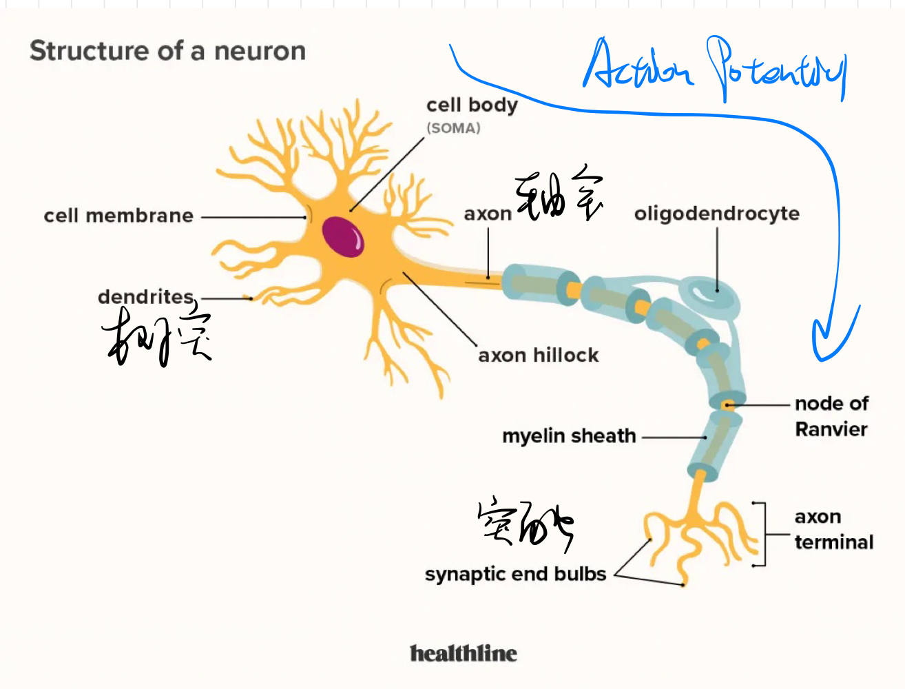
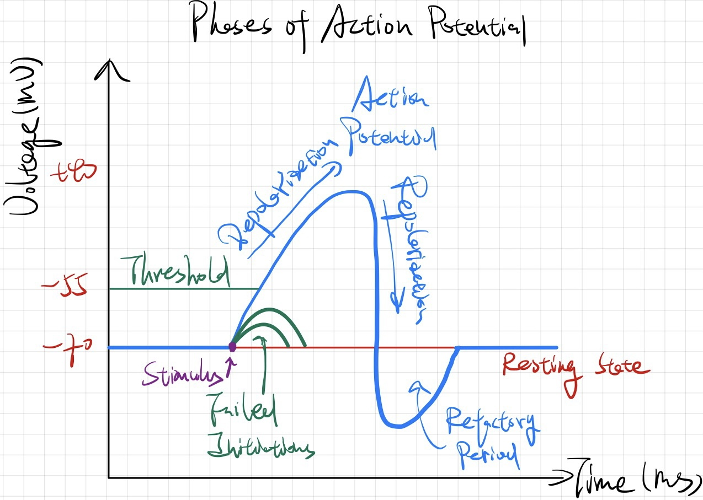

# 3. The Neurorobotics Platform (NRP)

# 4. Modeling and Simulating Biological Neural Networks

## *Biological Neurons*

> Definition of Computational Neuroscience (also Theoretical Neuroscience): Computational Neuroscience is the field of study in which mathematical tools and theories are used to investigate brain function. It can also incorporate diverse approaches from electrical engineering, computer science and physics in order to understand how the nervous system processes information.

### Neuron compomonents and Classification

* Components 
* Classification
  * According to polarity
    * Multipolar neurons
    * Bipolar neurons
  * According to functionality
    * Sensory neurons 感觉神经元
    * Interneurons 中间神经元
    * Motor neurons 运动神经元

### Basic Electrophysiology of a Neuron

* Information is transmitted in biological nervous system via **electrical signals**, whose charges are carried by **ions**($Na^+,\ K^+,\ Cl^-$)
* The **Cell Membrane** of neuron is a bilipid layer that insulates the inside cell form the outside (which serves the function of **capacitor** in circuits)
* **Ion Channels** are proteins in the membrane that can open and close to allow for a **passive** exchange of ions between two sides of neural cell (which serves the function of a **resistor** in circuits)
  * **Selectivity**: can only let a specific type of ions pass
  * **Regulation**: can be gated by the binding of a ligand, voltage or mechanical force

### The Resting Membrane Potential 静息电位

* The equilibrium state of membrane in the idle state of a neuron is called the resting membrane potential
* The resting membrane potential is mainly determined by the **potassium concentration** since the cell membrane has a very high **permeability** for potassium at resting state
* 估算公式：$E_{Nernst}=\frac{RT}{nF}\ln{\frac{[Cation^+]_{out}}{[Cation^+]_{in}}}=58\log{\frac{[Cation^+]_{out}}{[Cation^+]_{in}}}mV\approx -75mV$，若要准确计算需要考虑神经元种类，即Goldmann equation

### Different phases of an Action Potential 动作电位的不同阶段

<div align="center"></div>

* Biological neurons exchange information via **electrical impulses** called **action potentials 动作电位** or **Spikes 脉冲**
* Depolarizaiton 极化：$V_{threshold}\approx 50mV$
* Hyperpolarizaiton 超极化
* Refactory period 不应期
  * Absolute refactory period
  * Relative refactory period

### Action Potential Propagation

* 传播方式
  * Electrotonic Conductance 电紧张式传导
  * Active Regeneration of Action Potentials
* Enhancing Neural Signal Transmission

## *Neuron Models and the Foundations of Neural Networks*

### Levels of Modeling

* Detailed Compartmental Models
* Detailed Compartmental Models
* Single-COmpartment Models (Point Neuron Models)

### The McCulloch-Pitts Model

* 第一代神经网络：MP神经元模型，两层MP神经元构成了感知机 Perceptron 只能用来进行阈值逻辑运算
* 第二代神经网络：多层感知机MLP

### Spiking Neuron Models

* 第三代神经网络：SNN

### The Hodgkin-Huxley Model

* The HH Model was derived based on measurements of action potentials in the giant axon of the squid in 1952.
* The passive electrical properties of the cell membrane are represented by a Capacity $C$ and a resistance $R$. $\left\{\begin{array}{c}I(t)=I_{cap}(t)+\sum_k{I_k(t)}\\I_{cap}(t)=C\frac{du}{dt}\end{array}\right.\longrightarrow C\frac{du}{dt}=-\sum_k{I_k(t)}+I(t)$
* The major drawback of the HH model is its computational complexity, which is mainly caused by the computation of the ionic currents: $\sum_k{I_k(t)}=g_{Na}m^3h(u-E_{na})+g_kn^4(u-E_k)+g_L(u-E_L)$
* Model reductions
  * Morris-Lecar Model
  * FitzHugh-Nagumo Model

### The Leaky Integrate-and-Fire Model (LIF Model)

* The LIF Model is a phenomenological neuron model which is based on a simplified electrical circuit with a capacitor $C$ and a resistor $R$
* $I(t)=I_R(t)+I_{cap}(t)=\frac{u(t)}{R}+C\frac{du}{dt}\ \overrightarrow{\tau_m=RC}\ \tau_m\frac{du}{dt}=-u(t)+RI(t)$
* Unlike in the HH model, spike firing times $t^f$ must be detected "manually" based on a threshold $\vartheta$: $t^f:u(t^f)=\vartheta$
* Improve: AdEx Model/Adaptive Exponential Integrate-and-fire Model

### Neural Codes 神经编码

* Frequency encoding/Rate encoding 频率编码
* Time-to-First Spike Coding：做出该假设的学者认为，大脑没有时间在没个进程中处理一个以上的脉冲，因此用收到第一个脉冲的时间点作为reference point
* Population model

# 5. Learning with Spiking Neural Networks

* 记忆的细胞基础研究认为记忆是神经网络中的神经元间突触强度变化的结果，人脑的记忆和学习依赖于突触后细胞受到刺激后所产生的突触可塑性
* Rules for synaptic modification take the form of differential equations describing the rate of change of synaptic weights as a function of the pre- and postsynaptic activity and other possible factors

## *Hebian Learning: Synaptic Plasticity Rules*

> Cells that fire together, wire together. Hebbian learning is the learning rule that reinforce the causal relationships between events "what fire together wire together"

* Hebbian Theory描述了突触可塑性的基本原理，即突触前神经元 Presynapatic neron向突触后神经元Postsynapatic neuron的持续重复的刺激可以导致突触传导效能的增加。如果一个神经元持续激活另一个神经元，前者的轴突将会生长出突触小体（如果已有，则会继续长大）和后者的胞体相连接，这将会加强神经元突触间的联系，使记忆更为牢固
* LTP Long-term Potentiation 长时程增强作用与 LTD 是构成学习与记忆基础的主要分子机制之一，发生在两个神经元信号传输中的一种持久的增强信号，能够同步刺激两个神经元。
* From Basic Hebb's Rule to Covariance Rule
  * Basic Hebb's rule $\left\{\begin{array}{c}{\color{red}\tau_w\frac{d\mathbf{w}}{dt}=v\mathbf{u}}\ \overrightarrow{discrete}\ w_t=w_{t-1}+\frac{\Delta t}{\tau_w}v\cdot u\\v=\mathbf{w}\cdot\mathbf{u}\end{array}\right.$ u and v are masures of pre- and postsynaptic firing rates, $\mathbf{w}$ is the weight vector
  * Correlation-based rule
    * $\mathbf{u}$ 是一组不同的输入，最直接的计算该组输入的权重变化的方式是对对上式input pattern取平均 $\tau_w\frac{d\mathbf{w}}{dt}=\langle v\mathbf{u}\rangle$
    * 代入 $v=\mathbf{w}\cdot\mathbf{u}$，$\tau_w\frac{d\mathbf{w}}{dt}=\langle \mathbf{w}\mathbf{u}\mathbf{u}\rangle=\langle \mathbf{Q}\cdot w\rangle$
  * Covariance-based rule：因为 $v,u$ 都必须是正的，权重 $w$ 只能增大，因此只能模拟LTP
    * 实验显示，如果同时有presynaptic activity伴随着低的postsynaptic activity，那么此时是LTD；相反若presynaptic activity伴随着高的postsynaptic activity，则是LTP，根据该规则可以修改Correlation-based rule
    * $\tau_w\frac{d\mathbf{w}}{dt}=(v-\theta_v)\mathbf{u}$，$\theta_v$ 是决定输出postsynaptic activity的阈值，高于 $\theta_v$ 为LTP否则为LTD
    * $\tau_w\frac{d\mathbf{w}}{dt}=v(\mathbf{u}-\theta_u)$，$\theta_u$ 是决定输出presynaptic activity的阈值，高于 $\theta_u$ 为LTP否则为LTD
    * 上述两种公式在当pre- and postsynaptic都比较低的时候预测效果不好，更好的方式是结合二者 $\tau_w\frac{d\mathbf{w}}{dt}=\mathbf{C}\cdot \mathbf{w}$，其中 $\mathbf{C}=\langle(u-\langle u\rangle)(u-\langle u\rangle)\rangle$ 为 Input covariance matrix

## *BCM Theory: Covariance learning with sliding threshold*

* 根据Covariance-based rule，该模型不需要任何postsynaptic activity来得到LTD，或不需要任何presynaptic activity来得到LTP。但实验表明，调整pre- and postsynaptic activity的权重既需要pre- 也需要 postsynaptic activity
* 不论是Hebbian basic rule还是Covariance-based rule，由于得到的是正反馈，因此是不稳定的
* 为了改进上面的两种缺陷，提出了BCM Theory $\tau_{\theta}\frac{d\theta_v}{dt}=v^2-\theta_v\leftrightarrow \frac{dw_{ij}}{dt}=\phi(v_i-v_{\theta})u_j$
  * $\tau_{\theta}$ sets the time scale for modification of the threshold
  * With a sliding threshold, the BCM rule imiplements competition between synapses because stregthening some synapses increases the postsynaptic firing rate

## *Synaptic normalization*

### Subtractive normalization

$\tau_w\frac{d\mathbf{w}}{dt}=v\mathbf{u}-\frac{v(\mathbf{n}\cdot\mathbf{u})\mathbf{n}}{N_u}$

$\tau_w\frac{d\mathbf{n}\cdot\mathbf{w}}{dt}=v\mathbf{n}\cdot\mathbf{u}(1-\frac{\mathbf{n}\cdot\mathbf{n}}{N_u})=0$

### *Multiplicative normalization and the Oja's Rule*

$\left\{\begin{array}{c}\tau_w\frac{d\mathbf{w}}{dt}=v\mathbf{u}-\alpha v^2\mathbf{w}\\v=\mathbf{u}\mathbf{w}\end{array}\right.\rightarrow\frac{d\mathbf{w}}{dt}=C\mathbf{w}-(\mathbf{w}^T C\mathbf{w})\mathbf{w}$

Stability of Oja's rule: $\tau_w\frac{d\lvert \mathbf{w}\rvert^2}{dt}=2v^2(1-\alpha\lvert\mathbf{w}\rvert^2)$

## *Spike-Timing Dependent Plasticity STDP 脉冲时间依赖可塑性*

# 6. Spiking Neural Networks

## SNN Simulation with Brain2


```python
from brain import *

# Initialize experiment
start_scope()

# Define neuron model
eqs = '''
dv/dt = (I-v)/tau:1
I : 1
tau :second
'''

# Initialize a set of neurons
G = NeuronGroup(3, eqs, threshold='v>1', reset='v=0', method='exact')
G.I = [2, 0, 0]
G.tau = [10, 100, 100]*ms

# Connecting the neurons with synapses
S = Synapses(G, G, 'w : 1', on_pre='v_post += w')
S.connect(i=0, j=[1, 2])
S.w = 'j*0.2'
S.delay = 'j*2*ms'

# Monitoring the membrane potential
M = StateMonitor(G, 'v', record=True)

# Simualte the system
run(50*ms)

# Visualization
plot(M.t/ms, M.v[0], label='Neuron 0')
plot(M.t/ms, M.v[1], label='Neuron 1')
plot(M.t/ms, M.v[2], label='Neuron 2')
xlabel('Time (ms)')
ylabel('v')
legend()
```

# 8. Reinforcement Learning

# 9. Cognitive Architecture
