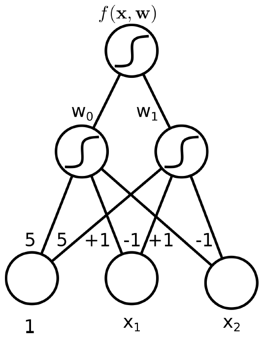
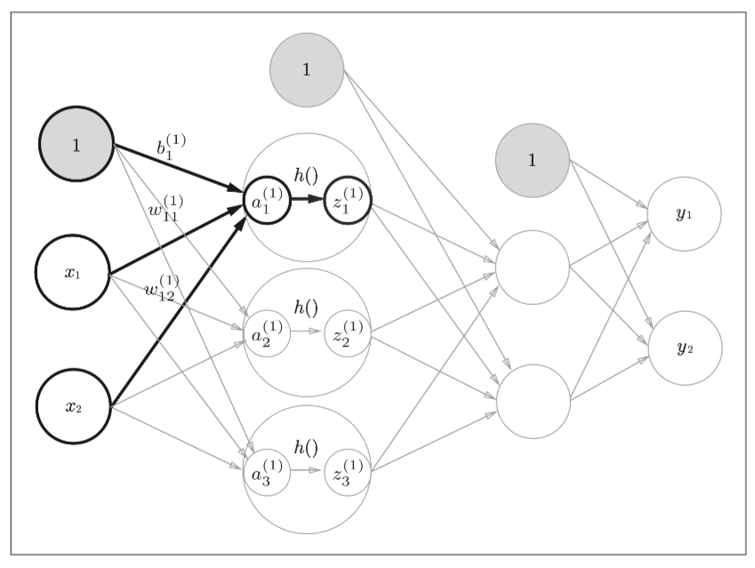
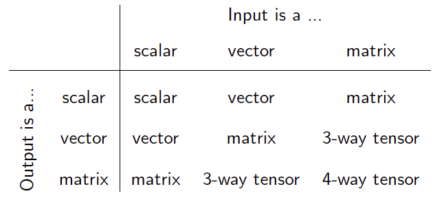
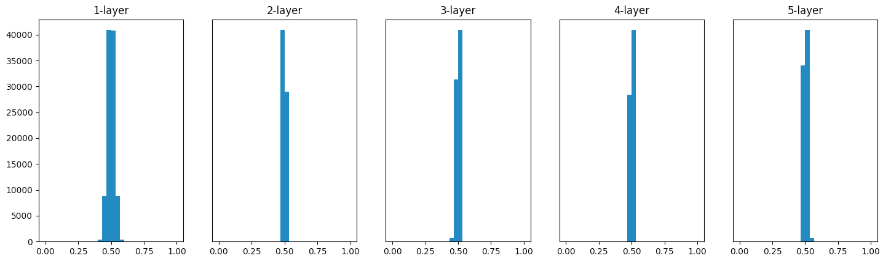
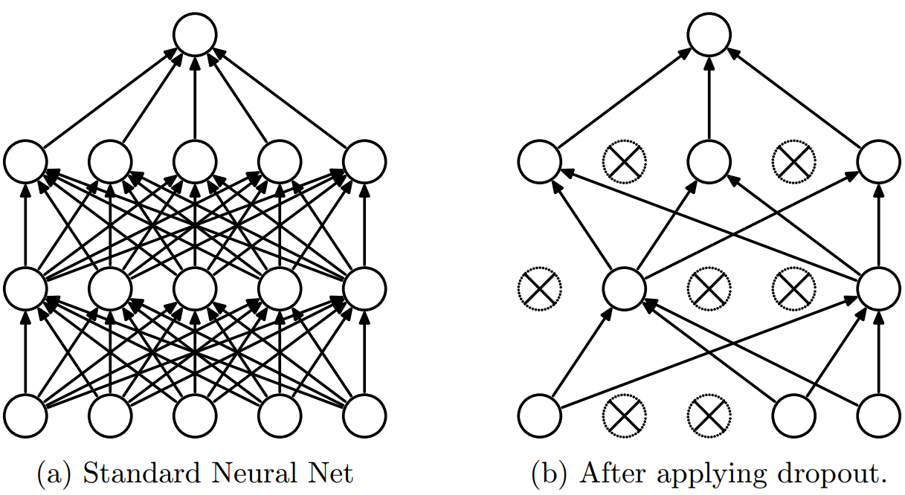
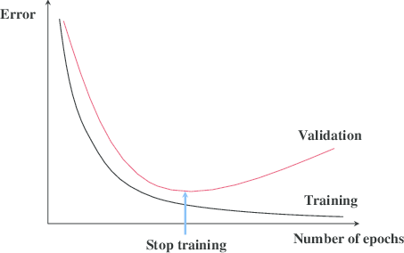
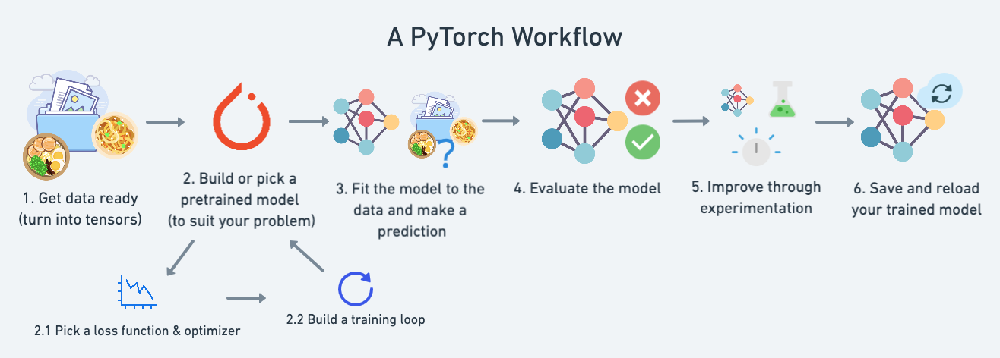
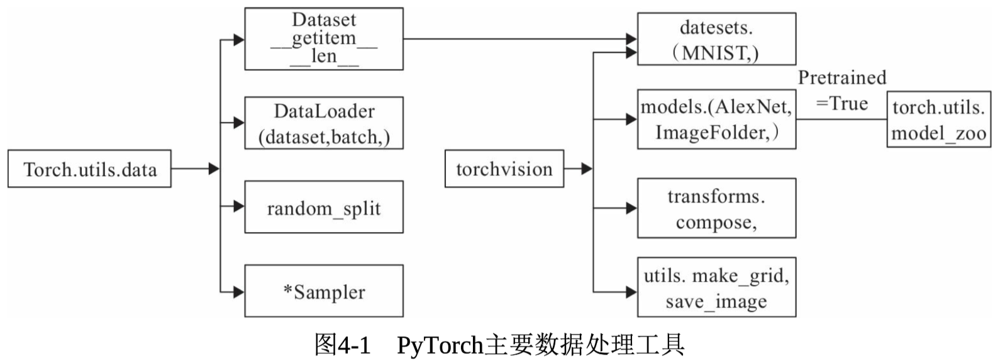

**该笔记来源于《深度学习入门 -- 基于python的理论与实现》、北京邮电大学鲁鹏教授的计算机视觉与神经网络课程、TUM Machine Learningn和TUM i2dl课程**

# Basic Concepts

## *多层感知机*

### Logistic Regression 回顾

关于感知机的部分可以回顾 *统计机器学习.md* - 线形分类的硬分类部分

参考 *统计机器学习.md* - 线性分类的判别式模型部分，线形的逻辑回归可以写成
$$
y|\boldsymbol{x}\sim Ber\left(\sigma(\boldsymbol{w}^T\boldsymbol{x})\right)\\\boldsymbol{w}^T\boldsymbol{x}\coloneqq w_0+w_1x_1+\dots+w_Dx_D
$$


逻辑回归可以用如上的图模型来表示

* 每一个Node都是一个Input $x_i$
* 每条边都代表权重 $w_i$

### 引入非线形 Non-linearlity 应对线形不可分

$y|\boldsymbol{x}\sim Ber\left(\sigma(\boldsymbol{w}^T\boldsymbol{x})\right)$ 只能应对线形可分的数据，对于类似XOR这种线形不可分的数据集需要进入非线形来解决
$$
f(\boldsymbol{x},\boldsymbol{w})=\sigma\left(w_0+\sum\limits_{j=1}^{M-1}{w_j\phi_j(\boldsymbol{x})}\right)=\sigma\left(\boldsymbol{w}^T\phi(\boldsymbol{x})\right)\label{logisticRegression}
$$
其中 $\phi$ 为我们选择的引入非线形的 Basis function

比如对于XOR问题可以选择一个 $\R^3\rightarrow\R^2$ 的Basis Function：$\phi(\boldsymbol{x})=\phi(1,x_1,x_2)=\left(\sigma(5+x_1+x_2),\ \sigma(5-x_1-x_2)\right)$

借助选择的Basis Function，Overall function $\eqref{logisticRegression}$ can be modeled as
$$
f(\boldsymbol{x},\boldsymbol{w})=\sigma\left(\boldsymbol{w}^T\phi(\boldsymbol{x})\right)=\sigma_1\left(\left[\begin{matrix}w_0&w_1\end{matrix}\right]\cdot\sigma_0\left(\left[\begin{matrix}5&1&1\\5&-1&-1\end{matrix}\right]\left[\begin{matrix}1\\x_1\\x_2\end{matrix}\right]\right)\right)
$$
该模型相当于是如下的图模型



最后还需要通过 Binary Cross-entropy 来求出 $\boldsymbol{w}$，即
$$
\boldsymbol{w}^*=\underset{\boldsymbol{w}}{\arg\min\ }{\sum\limits_{n=1}^{N}{-\left(y_n\log{f\left(\boldsymbol{x}_n,\boldsymbol{w}\right)}+(1-y_n)\log{\left(1-f\left(\boldsymbol{x}_n,\boldsymbol{w}\right)\right)}\right)}}
$$
最后可得到如下的分类空间


### How to find Basis function?

不同的数据集会需要不同的非线形转换来使得数据线形可分，在上面的例子中我们是选定了一个Basis Function，因此只需要再学习两个权重，但实际中所有的权重都是可以通过学习得到的，即
$$
f(\boldsymbol{x},W)=\sigma_1\left(\left[\begin{matrix}w_{100}&w_{110}\end{matrix}\right]\cdot\sigma_0\left(\left[\begin{matrix}w_{000}&w_{010}&w_{020}\\w_{001}&w_{011}&w_{021}\end{matrix}\right]\left[\begin{matrix}1\\x_1\\x_2\end{matrix}\right]\right)\right)\\W^*=\underset{W}{\arg\min\ }{\sum\limits_{n=1}^{N}{-\left(y_n\log{f\left(\boldsymbol{x}_n,W\right)}+(1-y_n)\log{\left(1-f\left(\boldsymbol{x}_n,W\right)\right)}\right)}}
$$
称这个网络为带有1层隐层 Hidden Layer 的前馈网络 Feed-Forward Neural Network或2层的多层感知器 Multi-Layered Perception MLP（这里采用的记法是有几层权重=几层感知机），或称神经网络。其中 $\sigma_0,\sigma_1$ 可以为任意的激活函数

单层感知机只能表示线性空间，多层感知机可以表示非线形空间

单层感知机指的是**激活函数使用了阶跃函数的单层网络**；而多层神经网络指的激活函数使用了sigmoid等平滑的激活函数的多层网络

## *神经网络*

### Deepen the NN


通过添加更多的 Hidden Layer 来得到深度神经网络
$$
f(\boldsymbol{x},W)=\sigma_2\left(W_2\sigma_1\left(W_1\sigma_0\left(W_0x\right)\right)\right)
$$
其中 $W=\left\{W_0,W_1,W_2\right\}$ 是需要被学习的权重参数

上面的结构称全连接神经网络 Fully-connected (feed-forward) Neural Network

### 常用的激活函数

激活函数 Activation Function 决定了如何来激活输入信号的总和

**激活函数必须要是是用非线形函数**，否则线形函数的叠加仍然是线形的，那么加深神经网络的层数就失去了意义

* Sigmoid $\frac{1}{1+\exp{(-x)}}$
* Tanh $\tanh{x}$
* ReLU $\max{(0,x)}$
* Leaky ReLU $\max{(0.1x,x)}$
* PReLU $\max{(\alpha x,x)}$，$\alpha$ 是通过学习得到的
* ELU $\left\{\begin{array}{cc}x,&x\geq0\\\alpha(\exp{(x)}-1),&x<0\end{array}\right.$
* Swish $x\cdot\sigma(x)$
* Maxout $\max{\left(w_1^Tx+b_1,w_2^Tx+b_2\right)}$：Maxout是通过分段线性函数来拟合所有可能的凸函数来作为激活函数的，但是由于线性函数是可学习，所以实际上是可以学出来的激活函数。具体操作是对所有线性取最大，也就是把若干直线的交点作为分段的边界，然后每一段取最大

激活函数的具体前向传播和反向传播实现以及它们的优缺点可以看[激活函数层实现](#ActivationFunc)

### Universal approximation theorem

Universal approximation theorem 通用近似定理：有一个输入层、一个通过激活函数输出的输出层和一个隐层的两层MLP，若隐层节点数足够大，那么该MLP可以模仿任意的函数，这种NN被称为 Wide-Hidden-Layer

理论上2层感知机就足够构建计算机

但实际中往往会增加神经网络的深度，而不是单层的宽度，主要有以下两方面的原因

* 理论方面：若 Hidden Layer 少，则当模拟复杂函数时单层的节点数要很多；增加层数可以显著减少节点数和参数量
* Practical reason: Deeper networks (with some additional tricks) often train faster and generalize better

### 样例：一个三层网络



下面给出了一个三层网络的代码实现，权值都是随机取的没有实际意义

```python
def init_network():  #
    network = {} # dict
    # Input layer to first layer
    network['W1'] = np.array([[0.1, 0.3, 0.5], [0.2, 0.4, 0.6]])
    network['b1'] = np.array([0.1, 0.2, 0.3])
    # First layer to second layer
    network['W2'] = np.array([[0.1, 0.4], [0.2, 0.5], [0.3, 0.6]])
    network['b2'] = np.array([0.1, 0.2])
    # Second layer to Output
    network['W3'] = np.array([[0.1, 0.3], [0.2, 0.4]])
    network['b3'] = np.array([0.1, 0.2])

    return network
```

### 输出层设计

* 恒等函数适用于回归任务，会将Logits原封不等直接输出

  

* sigmoid适用于二分类任务：将Logits压缩到0~1，相当于成了一个概率

  ```python
  def sigmoid(x):
      return 1 / (1 + np.exp(-x))    
  ```

* softmax适用于多分类任务：将Logits压缩到0~1，相当于成了一个概率

  工程实现，防止指数上溢：softmax中有指数运算，因此很容易就会出现溢出 overflow 的异常，比如 `np.exp(1000) == Inf`，若在 `Inf` 之间进行运算，程序会发生错误，因此要对程序进行改进
  $$
  \sigma(\boldsymbol{x}_i)=\frac{\exp{(x_i)}}{\sum\limits_{k=1}^{K}{\exp{(x_k)}}}=\frac{C\exp{(x_i)}}{C\sum\limits_{k=1}^{K}{\exp{(x_k)}}}=\frac{\exp{(x_i+\log{C})}}{\sum\limits_{k=1}^{K}{\exp{(x_k+\log{C})}}}=\frac{\exp{(x_i+C')}}{\sum\limits_{k=1}^{K}{\exp{(x_k+C')}}}
  $$
  该式说明exp加减某个常数不会影响整体结果，$C'$ 一般取输入 $x_i$ 的最大值，用来将exp中的计算降低防止溢出

  ```python
  def softmax(a):
      c = np.max(a)
      exp_a = np.exp(a-c) # 防溢出
      sum_exp_a = np.sum(exp_a)
      y = exp_a/sum_exp_a
  
      return y
  ```

  Softmax的输出层中每一个节点需要和Logits层做全连接，因为softmax的分母是所有Logits节点的和

  

* 输出层的神经元数量根据任务的类型类决定，回归任务为1个输出，分类任务则为要分的类型的个数

## *Beyond Binary Classification*

### 总结

神经网络可以用来处理不同的任务，不同的任务只需要改变输出层 final layer 的激活函数（称为Logits）和损失函数

>**Logits interpreted to be the unnormalized** (or not-yet normalized) **predictions** (or outputs) **of a model. These can give results, but we don't normally stop with logits, because interpreting their raw values is not easy.**

* Supervised Learning

  | Task   | $\color{white}p(\boldsymbol{y}|\boldsymbol{x})$ | Logits   | Loss Function        |
  | ------ | ----------------------------------------------- | -------- | -------------------- |
  | 二分类 | Bernoulli                                       | Sigmoid  | Binary-cross Entropy |
  | 多分类 | Categorical                                     | Softmax  | Cross Entropy        |
  | 回归   | Gaussian                                        | Identity | Squared Error        |

* Unsupervised Deep Learning

  * Autoencoder
  * Variational autoencoder
  * Generative Adversarial Networks GAN
  * Unsupervised Representation Learning

### Binary Classification

* Data: $\mathcal{D}=\left\{\boldsymbol{x_n},\boldsymbol{y}_n\right\}_{n=1}^N$, where $y_n\in\left\{0,1\right\}$
* Activation function in the final layer: Sigmoid，Sigmoid自变量大于0，取值大于0.5；否则小于0.5。符合二分类任务的需求
* Conditional distribution: Bernoulli $y|\boldsymbol{x}\sim Ber(y|f(\boldsymbol{x},W))$
* Loss function: Binary Cross-entropy $E(W)=-\sum\limits_{n=1}^{N}{\log{p(y_n|\boldsymbol{x}_n)}}=-\sum\limits_{n=1}^{N}{\left(y_n\log{f\left(\boldsymbol{x}_n,W\right)}+(1-y_n)\log{\left(1-f\left(\boldsymbol{x}_n,W\right)\right)}\right)}$

### Multi-class Classification

* Data: $\mathcal{D}=\left\{\boldsymbol{x_n},\boldsymbol{y}_n\right\}_{n=1}^N$, where $y_n\in\left\{0,1\right\}^K$ (One-hot notation)
* Activation function in the final layer: Softmax $\sigma(\boldsymbol{x}_i)=\frac{\exp{(x_i)}}{\sum\limits_{k=1}^{K}{\exp{(x_k)}}}$
* Conditional distribution: Categorical
* Loss function: 多类交叉熵

### Single-output Regression

* Data: $\mathcal{D}=\left\{\boldsymbol{x_n},\boldsymbol{y}_n\right\}_{n=1}^N$, where $y_n\in\R$
* Activation function in the final layer: Identity (no activation) $f(\boldsymbol{x},\boldsymbol{W})=a$
* Conditional distribution: Gaussian $p(y|\boldsymbol{x})=\mathcal{N}(y|f(\boldsymbol{x},\boldsymbol{W}),1)$
* Loss function: Squared error (Gaussian cross-entropy): $E(W)=-\sum\limits_{n=1}^{N}{\log{p(y_n|\boldsymbol{x_n})}}=\sum\limits_{n=1}^{N}{\left(y_b-f(\boldsymbol{x_n},W)\right)^2}+const$

## *性能评估*

机器学习性能评估指标：http://charleshm.github.io/2016/03/Model-Performance/

https://blog.csdn.net/weixin_41960890/article/details/105233298


### Accuracy 和 Error

Accuracy 精度和 Error 错误率是针对整体样本来说的，所以分母就是所有的样本
$$
Accuracy\triangleq\frac{TP+TN}{TP+FP+FN+TN}\\Error=1-Accuracy
$$

### Precision 和 Recall

Precision 准确率/**查准率**是预测为真的数据中实际确实为真的概率

Recall 召回率/**查全率**是原本为真的数据中有多少被检测了出来
$$
Precision\triangleq\frac{TP}{TP+FP}\\Recall\triangleq\frac{TP}{TP+FN}
$$

### Bias 和 Variance

# Data Preparation

## *Dataset*

### Dataset class 的任务

Dataset class 是一个用来从特定的文件地址装载数据集的wrapper，并用来返回一个包含了已经被处理好的数据集的**dict** 。Dataset class一定要有以下的两个方法

- `__len__(self)` 用来返回dataset中包含的数据集的长度，直接call `len(dataset)`
- `__getitem__(self, index)` 用来返回一个给定index的数据，以cifar-10为例，这个数据是一个包含了它所代表图像的具体文件地址以及它的标签。实现这个魔法函数可以允许用户像使用一个list一般来使用dataset class，比如 call `dataset[9]` 来获取dataset中第10张图片

一般来说，每一个具体任务都要实现一个具体的dataset

```python
class ImageFolderDataset(Dataset):
    """CIFAR-10 dataset class"""
    def __init__(self, *args,
                 transform=None,
                 download_url="https://i2dl.vc.in.tum.de/static/data/cifar10.zip",
                 **kwargs):
        super().__init__(*args, 
                         download_url=download_url,
                         **kwargs)
        
        self.classes, self.class_to_idx = self._find_classes(self.root_path)
        self.images, self.labels = self.make_dataset(
            directory=self.root_path,
            class_to_idx=self.class_to_idx 
        )
        # transform function that we will apply later for data preprocessing
        self.transform = transform
```

其中 `_find_classes()` 将会为之后 `make_dataset()` 找到实际文件地址，而 `make_dataset()` 则会制作 `images` 和 `labels` 两个list来提供给其他的方法使用

### `__len__(self)` 的实现

```python
def __len__(self):
    length = len(self.images)
    return length
```

### `__getitem__(self, index)` 的实现

```python
def __getitem__(self, index):
    # dataset 类对象本身有image等属性，我们需要将它组成一个字典让dataset在进行[]操作时获得一个字典
    if self.transform is None: 
        data_dict = {"image": self.load_image_as_numpy(self.images[index]),
                     "label": self.labels[index]}
    else: #假设使用了一种对图像的预处理transform，transform是一个实现了__call__()的类，因此可以直接call
        data_dict = {"image": self.transform(self.load_image_as_numpy(self.images[index])),
                     "label": self.labels[index]}
        return data_dict
```

## *Data Preprocessing*

https://blog.csdn.net/weixin_36604953/article/details/102652160
https://zhuanlan.zhihu.com/p/91125751

下面介绍两种常用的预处理/特征工程 Feature engineering，它们的作用是如下。一个典型的例子是KNN算法中因为不同范围数据导致的分类错误

1. 统计建模中，如回归模型，自变量 $\boldsymbol{X}$ 量纲不一致导致了回归系数无法直接解读或者错误解读；需要将 $\boldsymbol{X}$ 都处理到统一量纲之后才可比；
2. 机器学习任务和统计学任务中有很多地方要用到“距离”的计算，比如PCA，比如KNN，比如kmeans等等，假使算欧式距离，不同维度量纲不同可能会导致距离的计算依赖于量纲较大的那些特征而得到不合理的结果
3. 参数估计时使用梯度下降，在使用梯度下降的方法求解最优化问题时， 归一化/标准化后可以加快梯度下降的求解速度，即提升模型的收敛速度
   

### 归一化 Normalization/Rescale Transform

归一化 Normalization 是将一列数据变化到某个固定区间(范围)中，通常这个区间是 `[0, 1]`，但广义上可以是各种区间，比如映射到 `[-1，1]`。因此要注意，不能单纯的将原图乘一个缩放因子，而是要像下面的实现一样进行移动

```python
images = images - self._data_min  # normalize to (0, _data_max - _data_min)
images /= (self._data_max - self._data_min)  # normalize to (0, 1)
images *= (self.max - self.min)  # normalize to (0, target_max - target_min)
images += self.min  # normalize to (target_min, target_max)
```

### 标准化 Standardization

标准化是将数据统一到0均值，1方差的分布。是为了方便参照，统一数据范围，减小方差对学习的影响

注意：标准化的数据知识两个特征值和标准正态分布相同，分布仍然服从原分布
$$
\boldsymbol{x}^*=\frac{\boldsymbol{x}-\mu}{\sigma}
$$

### Data Augmentation

Preprocessing 预处理和 Data Augmentation 的区别在于预处理是要对所有数据，即训练集、验证集、测试集都要做的。而Data Augmentation则是仅对训练集，用来增强过拟合能力，比如说 flipping、bluring、cropping 裁剪等

使用哪些Data Augmentation来扩大training set可以被看做是一个超参数，从而增强模型的泛化性，没有必要对validation set做

## *Dataloader*

### Dataloader的作用

在DL Optimizer 采用的优化方法是 Mini-Batch SGD，因此在Dataset的基础下需要使用一个Dataloader工具来获取每一个mini-Batch


Dataloader为后面的网络提供不同的数据形式，将Dataset通过训练者希望的方式加载到神经网络之中。如上图所示，dataloader从扑克堆（一个dataset，每次洗牌为一个epoch）中以每次取5张牌（一个batch）给手（神经网络）进行训练

### Dataloader 类

```python
class DataLoader:
    """
    Dataloader Class
    Defines an iterable batch-sampler over a given dataset
    """
    def __init__(self, dataset, batch_size=1, shuffle=False, drop_last=False):
        pass
```

* **dataset** is the dataset that the dataloader should load.
* **batch_size** is the mini-batch size, i.e. the number of samples you want to load at a time.
* **shuffle** is binary and defines whether the dataset should be randomly shuffled or not.
* **drop_last**: is binary and defines how to handle the last mini-batch in your dataset. Specifically, if the amount of samples in your dataset is not dividable by the mini-batch size, there will be some samples left over in the end. If `drop_last=True`, we simply discard those samples, otherwise we return them together as a smaller mini-batch.

### `__len__()`  的实现

```python
    def __len__(self):
        length = None                                                     
        # Return the length of the dataloader                                  
        # Hint: this is the number of batches you can sample from the dataset. 
        # Don't forget to check for drop last!  

        datasets_length = len(self.dataset)
        length = int(datasets_length / self.batch_size)
        if not self.drop_last and (datasets_length % self.batch_size != 0):
            length += 1

        return length
```

### 用生成器来构建一个batch

```python
def __iter__(self):    
    def combine_batch_dicts(batch):
        pass
    def batch_to_numpy(batch):
        pass
    if self.shuffle: #生成batch要用的index
        indexes = np.random.permutation(len(self.dataset))
    else:
        indexes = range(len(self.dataset))

    batch = []
    for index in indexes:
        batch.append(self.dataset[index])
        if len(batch) == self.batch_size:
            yield batch_to_numpy(combine_batch_dicts(batch)) # combine函数
            batch = []

    if not self.drop_last and len(batch) > 0:  # when drop_last == False and len of remaining both ture, will enter
        yield batch_to_numpy(combine_batch_dicts(batch))
```

以下两个方法看 i2dl exercise 3，这里不给出

* `combine_batch_dicts(batch)` 的作用是将每一个batch里面的元素打包成一个统一字典
* `batch_to_numpy` 的作用是输出一个ndarray

# 神经网络学习

## *直接数据驱动的端到端学习*


通过数据自动学习权重参数有两种方法

一种是通过从数据中提取特征，比如图像相关的SIFT、HOG特征等，然后通过SVM等机器学习算法进行学习，完成分类或回归任务。但是数据的特征仍然是一种人类总结出来的规律，而这个规律经常是mission-orientated，即必须要为特定的任务场景和学习对象来选择合适的特征，若这个特征选择的不好，就会造成学习结果不佳。比如对于图像识别任务，由于图像的各种多变特征，很难设计一个很好的特征提取器

而神经网络是完全将数据作为原始资料进行学习的，它的优点是对所有的问题都可以用同样的流程来解决，因此是一种直接数据驱动的端到端学习

## *损失函数*

### 均方误差 Mean Squared Error MSE L2损失

$$
E=\frac{1}{N}\sum\limits_{i=1}^{N}{\left(\hat{y}_i-y_i\right)^2}
$$

回归任务的常用损失

```python
class MSE(Loss):
    def forward(self, y_out, y_truth):
        result = (y_out - y_truth)**2
        return result

    def backward(self, y_out, y_truth): #Loss都是在最后一层的，所以不需要用到回传梯度dout
        gradient = 2 * (y_out - y_truth)
        return gradient
```

* `y_out`: [N, ] array predicted value of your model
* `y_truth`: [N, ] array ground truth value of your training set
* return
  * Forward: [N, ] array of binary cross entropy loss for each sample of your training set
  * Backward: [N, ] array of binary cross entropy loss gradients w.r.t y_out for each sample of your training set

### 平均绝对值误差 Mean Absolute Error MAE L1损失

若离群值比较常见的话效果比较好

```python
class L1(Loss):
    def forward(self, y_out, y_truth):
        result = np.abs(y_out - y_truth)
        return result

    def backward(self, y_out, y_truth):
        gradient = y_out - y_truth

        zero_loc = np.where(gradient == 0)
        negative_loc = np.where(gradient < 0)
        positive_loc = np.where(gradient > 0)

        gradient[zero_loc] = 0
        gradient[positive_loc] = 1
        gradient[negative_loc] = -1

        return gradient
```

### 折页损失/SVM损失

### 两分类交叉熵

熵是信息论中的概念。**交叉熵 Cross Entropy 主要用于度量两个概率分布间的差异性信息**，熵越大信息就越不确定
$$
BCE(y,\hat{y}) =-\frac{1}{N}\sum\limits_{i = 1}^N{\left[y_i\cdot\log(\hat{y}_i )+(1-y_i)\cdot\log(1-\hat{y}_i)\right]}
$$

其中 $\hat{y}$ 是预测值，而 $y$ 则是标签ground truth，N是样本数，因此在反向传播时要相对于 $y$ 来求导

```python
class BCE(Loss):
    def forward(self, y_out, y_truth):
        result = -y_truth*np.log(y_out) - (1-y_truth)*np.log(1-y_out)
        return result

    def backward(self, y_out, y_truth): 
        gradient = -y_truth/y_out + (1-y_truth)/(1-y_out)
        return gradient
```

### from Logits to 多分类交叉熵通过softmax表达（最常用分类Loss）

$$
CE(\hat{y}, y)=-\frac{1}{N}\sum\limits_{i=1}^N{\sum\limits_{k=1}^{C}{\left[y_{ik}\log(\hat{y}_{ik})\right]}}
$$

一个Batch为 $N$ 个数据，计算的是N个数据的总交叉熵，计算完后要进行正规化

其中 $\hat{y}$ 是预测值，而 $y$ 则是标签ground truth，N是样本数，因此在反向传播时要相对于 $y$ 来求导

一般都会将gound truth $y$ one-hot表示，同时将输出通过softmax转换为0-1的概率表达

* Performs the forward pass of the cross entropy loss function

  * param 
    * y_out: `[N, C]` array with the predicted logits of the model (i.e. the value before applying any activation)
    * y_truth: `(N,)` array with ground truth labels，标签从0开始标，即 `np.arange(N)`

  * return: float, the cross-entropy loss value

  ```python
  class CrossEntropyFromLogits(Loss):
      def __init__(self):
          self.cache = {}
       
      def forward(self, y_out, y_truth, reduction='mean'):
          # Transform the ground truth labels into one hot encodings.
          N, C = y_out.shape
          y_truth_one_hot = np.zeros_like(y_out)
          y_truth_one_hot[np.arange(N), y_truth] = 1
          
          # Transform the logits into a distribution using softmax.
          # First make the operation numerically stable by substracting the
          # biggest element from all entries before applying exp
          y_out_exp = np.exp(y_out - np.max(y_out, axis=1, keepdims=True))
          y_out_probs = y_out_exp / np.sum(y_out_exp, axis=1, keepdims=True) # after softmax
          
          # Compute the loss for each element in the batch.
          loss = -y_truth_one_hot * np.log(y_out_probs)
          loss = loss.sum(axis=1).mean()
             
          self.cache['probs'] = y_out_probs
          
          return loss
  ```

* Performs the backward pass of the loss function
  $$
  \frac{\partial CE}{\partial\boldsymbol{\hat{y}_{ik}}}=\frac{1}{N}\sum\limits_{i=1}^N{\sum\limits_{k=1}^{C}{\left[-\frac{y_{ik}}{\hat{y}_{ik}}\right]}}
  $$

  * 因为 $y_{ik}$ 是 one-hot 形式，根据推导可以得到导数为 $\hat{y}_i-y_i$ https://zhuanlan.zhihu.com/p/99923080

  * param
    * y_out: [N, C] array predicted value of your model
    * y_truth: [N, ] array ground truth value of your training set

  * return: [N, C] array of cross entropy loss gradients w.r.t y_out for each sample of your training set

  ```python
  def backward(self, y_out, y_truth):
      N, C = y_out.shape
      gradient = self.cache['probs']
      gradient[np.arange(N), y_truth] -= 1
      gradient /= N
  
      return gradient
  ```

### KL散度

KL散度 KL divergence 也叫相对熵 relative entropy，用来度量**两个分布之间的不相似性 Dissimilarity**。通过表达式可以看出，两个分布越相似，KL散度的值越小

* KL散度是大于0的，$KL(P||Q)=0\ iff\ P=Q$
* KL散度是非对称的，即 $KL(P||Q)\neq KL(Q||P)$

假设基于P来优化Q，有两种方式

* Forward KL is Mean-seeking
  $$
  KL(P||Q)=\sum_k{p_k\log{\frac{p_k}{q_k}}}
  $$
  

* Reverse KL is Mode-seeking
  $$
  KL(Q||P)=\sum_k{q_k\log{\frac{q_k}{p_k}}}
  $$
  

### 三类熵之间的关系

KL散度和熵与交叉熵之间存在关联，首先给出熵、交叉熵和相对熵的总结
$$
Entropy:H(p)=-\sum\limits_{x}{p(x)\log{p(x)}}\\Cross\ Entropy:H(p,q)=-\sum\limits_{x}{p(x)\log{q(x)}}\\Relative\ entropy:KL(p||q)=-\sum\limits_{x}{p(x)\log{\frac{q(x)}{p(x)}}}
$$
接下来推导三者之间的关系
$$
H(p,q)=-\sum\limits_{x}{p(x)\log{q(x)}}=-\sum\limits_{x}{p(x)\log{p(x)}}=-\sum\limits_{x}{p(x)\log{\frac{q(x)}{p(x)}}}=H(p)+KL(p||q)
$$

## *Parameter Learning*

### 优化目标

实际中要最小化的损失函数 $E(W)$ 经常都是非凸的非常复杂的函数，这会对优化造成困难

* 一个局部最优点往往不会恰好是全局最优点
* 有可能同时有好几个局部最优点，而它们的分类效果可能非常接近
* 一般不可能找到一个全局最优点，因为这实际上还和使用的数据集有关

可以找到一些局部最优的 $W$，然后通过验证集来进行测试和选择

Default approach: Find a local minimum by using gradient descent $W^{(new)}=W^{(old)}-\tau\nabla_WE(W^{(old)})$

### 计算梯度 $\nabla_WE$ 的方法

* 手动求解 By hand：根据链式法则完全手动求解，然后编写代码。手动求导工作量大且易出错（不准且效率低）

* 数值微分法 Numerical differentiation：借助微分的原始数学定义进行计算
  $$
  \frac{\partial E_n}{\partial w_{ij}}=\frac{E_n(w_{ij}+\epsilon)-E_n(w_{ij})}{\epsilon}+\mathcal{O}(\epsilon)
  $$

  * 上式对每一个权重参数 $w_{ij}$ 的每一次Evaluation都需要大约 $\mathcal{O}\left(\lvert W\rvert\right)$ 次计算，相当于是控制 $w_{ij}$ 为变量，然后计算 $\mathcal{O}\left(\lvert W\rvert\right)$ 次
  * 每一次Evaluation必须对每一个参数独立进行，这意味着所有权重都需要进行一次上面的过程，因此更新一次梯度 $\nabla_WE$ 的计算开销大约在 $\mathcal{O}\left(\lvert W\rvert^2\right)$ 次，这对于实际中上亿参数的深度网络的训练来说计算开销极其昂贵
  * 数值微分受到截断误差 truncation error 和舍入误差 round-off error 的干扰，影响精度，且如何选择差分步长是没有定论的

* 符号微分法 Symbolic differentiation/解析解

  * 利用代数的求导规则对表达式进行自动计算，其计算结果是导函数的表达式而非具体的数值。即先求解析解，然后转换为程序，再通过程序计算出函数的梯度
  * 表达式求导更在乎的是明晰的导数表达式，而我们在机器学习领域更在意的是导数的值，且不论不少情况下导数是没有准确的解析形式（closed-form），求导常常会让表达式的规模几何级增加，造成表达式膨胀（效率低）
  * 比如说多个ReLU的求导排列组合非常麻烦 Potentailly exponentially many different cases

* 自动微分法 Automatic differentiation, AD: e.g. Backproagation for NN（反向传播将在下一章详细给出）

  * 介于数值微分和符号微分之间的方法，它是把计算机中的运算操作分解为一个有限的基本操作集合，然后采用类似有向图的计算来求解微分值。避免了符号微分那样的表达式膨胀
  * Evaluate $\nabla_WE(W)$ at the current point $W$
  * Every Evaluation in $\mathcal{O}\left(\lvert W\rvert\right)$，即一次梯度更新需要一次前向传播+一次反向传播

神经网络具有高度的非线性，它的优化学习不可能通过计算导数，来得到closed-form solution/解析解，只能通过反向传播进行梯度下降，来求解数值解

# 反向传播算法

## *反向传播的简单例子*

考虑如下的一个例子
$$
f(x)=\frac{2}{\sin{\left(\exp{\left(-x\right)}\right)}}
$$

* Write Function as a **composition** of modules 拆分成不同的模块
  $$
  f(x)=d\left(c\left(b\left(a\left(x\right)\right)\right)\right)\\a(x)=-x\\b(a)=\exp{\left(a\right)}\\c(b)=\sin{\left(b\right)}\\d(c)=\frac{2}{c}
  $$
  可以用如下的计算图来表达（箭头和虚箭头分别表示前向和反向传播）

  

* Work out the local derivative of each module **symbolically**
  $$
  \frac{\partial a}{\partial x}=-1\\\frac{\partial b}{\partial a}=\exp{\left(a\right)}\\\frac{\partial c}{\partial b}=\cos{b}\\\frac{\partial d}{\partial c}=-\frac{2}{c^2}
  $$

* Do a **forward pass** for a given input $x$, i.e. compute the funciton $f(x)$ and remember the intermediate values, given local data $\boldsymbol{x}=-4.499$
  $$
  a(x)=-x=4.499\\b(a)=\exp{\left(a\right)}=90\\c(b)=\sin{\left(b\right)}=1\\d(c)=\frac{2}{c}=2
  $$

* Compute the **local derivatives** for $x$，这里有一个很容易让人混乱的点，就是反向传播也是在利用每个局部特性，而不是整体的梯度，因此也是从左到右分步计算局部梯度
  
  所谓的接收从上游回传的梯度，需要给一个起始值，然后一般通过 `__init()__` 保存的实例属性来在backward的时候计算局部梯度，然后继续往后传
  
  反向传播首先计算 $\frac{\partial d}{\partial c}=-\frac{2}{c^2}$，即计算d相对于c的局部梯度时需要c的信息，那么在前向传播的时候就会在计算d那一步的前向传播中保存c的局部值，以便在反向传播时候利用c计算局部梯度
  
  因为上面的每一步计算都不一样，所以每一步都需要设计一个前向传播和一个反向传播函数
  $$
  \frac{\partial d}{\partial c}=-\frac{2}{1^2}=-2\\\frac{\partial c}{\partial b}=\cos{90}=0\\\frac{\partial b}{\partial a}=\exp{\left(4.499\right)}=90\\\frac{\partial a}{\partial x}=-1
  $$
  
* Obtain the **global derivative** by multiplying the local derivatives (Chian rule )
  $$
  \frac{\partial f}{\partial x}=\frac{\partial d}{\partial c}\frac{\partial c}{\partial b}\frac{\partial b}{\partial a}\frac{\partial a}{\partial x}=-2\cdot0\cdot90\cdot-1=0
  $$

## *Computational graphs and chain rule*

### Multiple Inputs


多个输入到达同一个输出：沿着每条路径对各自的输入计算偏微分
$$
\frac{\partial c}{\partial x}=\frac{\partial c}{\partial a}\frac{\partial a}{\partial x},\ \frac{\partial c}{\partial y}=\frac{\partial c}{\partial b}\frac{\partial b}{\partial y}
$$

### Multiple Paths


当一个输入有多条路径到达输出时：沿着不同的路径计算偏微分后相加
$$
\frac{\partial c}{\partial x}=\frac{\partial c}{\partial a}\frac{\partial a}{\partial x}+\frac{\partial c}{\partial b}\frac{\partial b}{\partial x}
$$

### Multivariate chain rule


对上面的多路径进行推广
$$
\frac{\partial c}{\partial x}=\sum\limits_{i=1}^{m}{\frac{\partial c}{\partial a_i}\frac{\partial a_i}{\partial x}}
$$
计算图的颗粒度问题

* 可拆分成基元操作，但计算效率可能会降低
* Caffe自定义模块颗粒度上升，计算效率上升；Tensorflow颗粒度下降，计算效率上升

## *简单加法和乘法节点的实现*

### 加法节点

考虑一个简单的加法节点
$$
z=x+y\\\frac{\partial z}{\partial x}=1,\ \frac{\partial z}{\partial y}=1
$$
加法节点的反向传播将上游的值原封不动地输出到下游

```python
class AddLayer:
    def __init__(self):
        pass
    def forward(self, x, y):
        out = x + y
        return out
    def backward(self, dout):
        dx = dout * 1
        dy = dout * 1
        return dx, dy
```

### 乘法节点

考虑一个简单的乘法节点
$$
z=x\cdot y\\\frac{\partial z}{\partial x}=y, \ \frac{\partial z}{\partial y}=x
$$
乘法的反向传播会将上游的值乘以正向传播时的输入信号的“翻转值”后传递给下游

乘法的反向传播需要正向传播时的输入信号值，因此实现乘法节点的反向传播时，**要保存正向传播的输入信号**

```python
def MulLayer:
    def __init__(self):
        self.x = None
        self.y = None
    def forward(self, x, y):
        self.x = x
        self.y = y
        out = x * y
        return out
    def backward(self, dout):
        dx = dout * self.y
        dy = dout * self.x
        return dx, dy
```

构造函数中初始化实例属性 x和y 用来保存正向传播时的局部值

## *Matrix Calculation*

### Jacobian and Gradient

参考之前的多分支计算图，若考虑一个 Multi-Features 的Input $\boldsymbol{x_{n\times1}}$，和一个二分类或多分类的输出 $\boldsymbol{a}_{m\times1}$，等价为考虑一个映射变换 $f:\R^n\rightarrow\R^m$，用 $\boldsymbol{a}_{m\times1}=f(\boldsymbol{x_{n\times1}})$ 来表述，这个**反向传播过程**可以用一个 Jacobian 矩阵来表示
$$
\frac{\partial\boldsymbol{a}}{\partial\boldsymbol{x}}=\left[\begin{matrix}\frac{\partial a_1}{\partial x_1}&\cdots&\frac{\partial a_1}{\partial x_n}\\\vdots&\ddots&\vdots\\\frac{\partial a_m}{\partial x_1}&\cdots&\frac{\partial a_m}{\partial x_n}\end{matrix}\right]\in\R^{m\times n}
$$
TODO：下面写的感觉不太对，之后再check一下

而**反向传播过程**则可以用梯度矩阵来表达，即令 $c=g(\boldsymbol{a}),\ g:\R^m\rightarrow\R$，其中标量 $c$​ 为前向传播的结果。梯度矩阵是Jacobian矩阵的输出为标量时的转置
$$
\nabla_{\boldsymbol{a}}c\in\R^m=\left(\frac{\partial c}{\partial\boldsymbol{a}}\right)^T=\left[\begin{matrix}\frac{\partial c}{\partial a_1}&\cdots&\frac{\partial c}{\partial a_m}\end{matrix}\right]^T
$$
反向的Chian rule就可以用Jacobian来表示了
$$
\frac{\partial c}{\partial x_j}=\sum\limits_{i=1}^{m}{\frac{\partial c}{\partial a_i}\frac{\partial a_i}{\partial x_j}}\xrightarrow{matrix-form}\frac{\partial c}{\partial \boldsymbol{x}}=\frac{\partial c}{\partial\boldsymbol{a}}\frac{\partial\boldsymbol{a}}{\partial\boldsymbol{x}},\ where\ \left[\frac{\partial\boldsymbol{a}}{\partial\boldsymbol{x}}\right]_{ij}=\frac{\partial a_i}{\partial x_j}\\\equiv\nabla_{\boldsymbol{x}}c=\left(\frac{\partial\boldsymbol{a}}{\partial\boldsymbol{x}}\right)^T\nabla_{\boldsymbol{a}}c
$$
### 不同维度量之间的微分关系



* 一个向量对一个标量, vice versa的微分结果是一个向量，这很好理解，因为向量的每个数据都要对同一个标量求微分关系
* 一个向量对一个向量的微分关系是一个矩阵。可以把一个向量拆分为两个维度的标量，一个标量关于一个向量是一个向量，那么两个维度就是一个矩阵了
* 或者也可以用Kronecker积张量扩展的角度来看待

## <span id="ActivationFunc">*激活函数层的实现*</span>

### Sigmoid层


Sigmoid: $1/\left(1+\exp{\left(-x\right)}\right)$，令 $y=1/\left(1+\exp{\left(-x\right)}\right)$，计算图如上方

最终得到的梯度回传结果可以进一步进行简化
$$
\frac{\partial L}{\partial y}y^2\exp{\left(-x\right)}=\frac{\partial L}{\partial y}\frac{1}{\left(1+\exp{\left(-x\right)}\right)^2}\exp{\left(-x\right)}=\frac{\partial L}{\partial y}\frac{1}{1+\exp{\left(-x\right)}}\frac{\exp{\left(-x\right)}}{1+\exp{\left(-x\right)}}=\frac{\partial L}{\partial y}y(1-y)
$$

```python
class Sigmoid:
    def __init__(self):
        self.out = None
    def forward(self, x):
        out = 1 / (1 + np.exp(-x))
        self.out = out
        return out
    def backward(self, dout):
        dx = dout * (1.0 - self.out) * self.out
        return dx
```

正向传播时将输出保存在了实例变量 out 中，在反向传播的时候使用该变量进行计算

注意：在计算反向传播的时候用的是Element-wise multiplication `*` 或 `np.multiply()`（也就是数学上的Hardmard内积，逐元素相乘） 而不是矩阵乘法 `np.dot()`，这是因为是针对每个数据点在计算各自的导数。关于为什么在计算的时候使用Hardmard内积，可以看 https://aew61.github.io/blog/artificial_neural_networks/1_background/1.b_activation_functions_and_derivatives.html。主要是因为 Sigmoid 和 ReLU 这种激活函数的 Jacobian $\frac{d\sigma{(\boldsymbol{x}})}{d\boldsymbol{x}}$ 只取决于自己的 $x$，因此是对角线函数，所以可以直接用逐元素相乘来处理

Pros and Cons of Sigmoid https://zhuanlan.zhihu.com/p/71882757

* Pros
  * Sigmoid函数的输出在 $(0,1)$ 之间，输出范围有限，优化稳定，可以用作输出层
  * 连续函数，便于求导
* Cons
  * sigmoid函数在输入取绝对值非常大的正值或负值时（即向两边移动）会出现**饱和 saturation**现象，意味着函数会变得很平，并且对输入的微小改变会变得不敏感。在**反向传播**时，当梯度接近于0，权重基本不会更新，很容易就会出现**梯度消失**的情况，从而无法完成深层网络的训练
  * **sigmoid函数的输出不是0均值 zero-centered**，会导致后层的神经元的输入是非0均值的信号，这会对梯度产生影响，会产生zig-zag的梯度下降曲线 https://liam.page/2018/04/17/zero-centered-active-function/
  * 由于sigmoid函数的指数形式，**计算复杂度较高**

### Tanh

$$
\tanh{x}=\frac{\exp{z}-\exp{(-z)}}{\exp{z}+\exp{(-z)}}\\\tanh'{x}=\frac{d}{dx}\left(\frac{e^x-e^{-x}}{e^x+e^{-x}}\right)=\frac{e^x+e^{-z}}{\left(e^z+e^{-z}\right)^2}d\left(e^z-e^{-z}\right)-\frac{e^x-e^{-z}}{\left(e^z+e^{-z}\right)^2}d\left(e^z+e^{-z}\right)\\=\frac{\left(e^z+e^{-z}\right)\left(e^z+e^{-z}\right)}{\left(e^z+e^{-z}\right)^2}-\frac{\left(e^z-e^{-z}\right)\left(e^z-e^{-z}\right)}{\left(e^z+e^{-z}\right)^2}=\frac{\left(e^z+e^{-z}\right)^2-\left(e^z-e^{-z}\right)^2}{\left(e^z+e^{-z}\right)^2}\\=1-\left(\frac{e^z-e^{-z}}{e^z+e^{-z}}\right)^2=1-\tanh^2{x}
$$

```python
class Tanh:
    def __init__(self):
        pass
    def forward(self, x):
        outputs = (np.exp(x) - np.exp(-x)) / (np.exp(x) + np.exp(-x))
        cache = np.copy(outputs)
        return outputs, cache
    def backward(self, dout, cache):
        dx = dout * (1-cache * cache)
        return dx
```

Tanh函数是 0 均值的，因此实际应用中 Tanh 会比 sigmoid 效果好。但是仍然存在**梯度饱和**与**exp计算**的问题

### ReLU层

$$
y=\left\{\begin{array}{ll}x&(x>0)\\0&(x\leq0)\end{array}\right.\xrightarrow{向量求导}\frac{\partial y}{\partial x}=\left\{\begin{array}{ll}1&(x>0)\\0&(x\leq0)\end{array}\right.
$$

```python
class Relu:
    def __init__(self):
        pass
    def forward(self, x):
        out = np.maximum(x, 0)
        cache = out
        return out, cache
    def backward(self, dout, cache):
        dx = dout
        dx[cache <= 0] = 0
        return dx
```

* Forward
  * param x: Inputs, of any shape
  * return
    * Outputs, of the same shape as x
    * Cache, stored for backward computation, of the same shape as x
* Backward
* param
  * dout: Upstream gradient from the computational graph, from the Loss function and up to this layer. Has the shape of the output of forward()
  * cache: The values that were stored during forward() to the memory to be used during the backpropogation
* return: dx: the gradient w.r.t. input X, of the same shape as X

Pros and Cons of ReLU

* Pros

  * 使用ReLU的SGD算法的收敛速度比 sigmoid 和 tanh 快
  * 在 $x>0$ 区域上，不会出现梯度饱和、梯度消失的问题
  * 计算复杂度低，不需要进行指数运算，只要一个阈值就可以得到激活值

* Cons

  * ReLU的输出**不是0均值**的
  * **Dead ReLU Problem 神经元坏死现象**：ReLU在负数区域被kill的现象叫做dead ReLU。ReLU在训练的时很脆弱。在 $x<0$ 时，梯度为0。这个神经元及之后的神经元梯度永远为0，不再对任何数据有所响应，导致相应参数永远不会被更新
    * 产生这种现象的两个**原因**
      * 参数初始化问题
      * learning rate太高导致在训练过程中参数更新太大
    * Solution：采用Xavier初始化方法，以及避免将learning rate设置太大或使用adagrad等自动调节learning rate的算法

* > The reason why to choose ReLU over Softmax or TanH is quite simple: it doesn't suffer as much from the saturation and dying of gradients that are outside a specific range. It keeps alive important values, but the networks is able to "kill" others.
  >
  > However, this mechanism still suffers from the "dying ReLU" problem, which basically kills gradients of all the variables that took part of calculating a negative value. Thus, Leaky-ReLU was introduced.
  >
  > But, real-life experiments have shown that the difference is negligible, while the Leaky-ReLU requires much more computations, and is therefore slower. 
  >
  > Thus, since real DL applications are SUPER heavy computationally as it is, it is just more common to use ReLU, which surprisingly isn't outperformed by Leaky-ReLU. -- i2dl piazza

### LeakyReLU

$$
LeakyReLU=\max{(0.1x,x)}
$$

```python
class LeakyRelu:
    def __init__(self, slope=0.01):
        self.slope = slope
    def forward(self, x):
        cache = np.copy(x)
        outputs = np.copy(x)
        outputs[x<=0] *= self.slope
        return outputs, cache
    def backward(self, dout, cache):
        mask = cache <= 0
        dout[mask] *= self.slope
        dx = dout
        return dx
```

一定程度上缓解了 Dead ReLU的问题

## *Affine Layer 的反向传播计算*

> *Backpropagation for a Linear layer* -- Justin Johnson

### Affine层

神经网络的正向传播中进行的矩阵的乘积运算 $\boldsymbol{Y}_{N\times M}=\boldsymbol{X}_{N\times D}\cdot\boldsymbol{W}_{D\times M}+\boldsymbol{B}_{1\times M}$（因为Bias是在输出端的，所以尺寸是M。Bias term $\boldsymbol{B}$ can be absorbed）在几何学领域被称为仿射变换。仿射层又称为全连接层 Fully Connected Layer FC 或者线形层。注意，**数据矩阵 $\boldsymbol{X}$ 和权重矩阵 $\boldsymbol{W}$ 的形状就是约定俗成的，在大部分情况下都会这么用**


为了简化说明，之后可以generalization，令 $N=2,\ D=2,\ M=3$
$$
\boldsymbol{X}=\left[\begin{matrix}x_{1,1}&x_{1,2}\\x_{2,1}&x_{2,2}\end{matrix}\right],\ \boldsymbol{W}=\left[\begin{matrix}w_{1,1}&w_{1,2}&w_{1,3}\\w_{2,1}&w_{2,2}&w_{2,3}\end{matrix}\right]\\\boldsymbol{Y}=\boldsymbol{X}\boldsymbol{W}=\left[\begin{matrix}x_{1,1}w_{1,1}+x_{1,2}w_{2,1}&x_{1,1}w_{1,2}+x_{1,2}w_{2,2}&x_{1,1}w_{1,3}+x_{1,2}w_{2,3}\\x_{2,1}w_{1,1}+x_{2,2}w_{2,1}&x_{2,1}w_{1,2}+x_{2,2}w_{2,2}&x_{2,1}w_{1,3}+x_{2,2}w_{2,3}\end{matrix}\right]
$$

### Affine层反向传播的难点

假设已经进行了一次前向传播，可以得到最终的损失函数的值（即一个标量）$L$，那么可以利用chain rule求对 $\boldsymbol{W}$ 或对 $\boldsymbol{X}$ 的反向梯度来进行更新。因为 $L$ 是标量，所以它对 $\boldsymbol{Y},\ \boldsymbol{W},\ \boldsymbol{X}$ 的梯度分别是和 $\boldsymbol{Y},\ \boldsymbol{W},\ \boldsymbol{X}$ 形状相同的矩阵
$$
\frac{\partial L}{\partial\boldsymbol{W}}_{D\times M}=\frac{\partial L}{\partial\boldsymbol{Y}}_{N\times M}\frac{\partial\boldsymbol{Y}}{\partial\boldsymbol{W}},\ \frac{\partial L}{\partial\boldsymbol{X}}_{N\times D}=\frac{\partial L}{\partial\boldsymbol{Y}}_{N\times M}\frac{\partial\boldsymbol{Y}}{\partial\boldsymbol{X}}
$$
因为 $\boldsymbol{Y},\ \boldsymbol{W},\ \boldsymbol{X}$ 都是二维矩阵，因此它们之间的求导将会是一个4-way Tensor（上式Tensor和Matrix之间计算比较复杂，暂时没搞清楚）

实际中假设一个batch的size为 $N=64$，$M=D=4096$，假设每一个参数都为32 bit float，那么 $\frac{\partial\boldsymbol{Y}}{\partial\boldsymbol{W}}$ 将会有 $N\cdot M\cdot D\cdot M=64\cdot4096\cdot64\cdot4096\cdot2^2Byte=2^{38}Byte=256GB$ 大小的数据，若在反向传播中直接计算这个tensor那将是灾难性的 

### 解决方法

实际中可以不通过显式计算这个tensor也可以得到反向传播结果
$$
\frac{\partial L}{\partial\boldsymbol{X}}=\frac{\partial L}{\partial\boldsymbol{Y}}\boldsymbol{W}^T,\ \frac{\partial L}{\partial\boldsymbol{W}}=\boldsymbol{X}^T\frac{\partial L}{\partial\boldsymbol{Y}}\\\frac{\partial{L}}{\partial{\boldsymbol{B}}}=\mathop{sum}{\left(\frac{\partial L}{\partial\boldsymbol{Y}},\ axis=0\right)}
$$
上面的证明过程这里略过，可以看 CS231n的note *linear-backprop*，在i2dl的文件夹里

关于对偏置求偏导的理解可以看 https://blog.csdn.net/qq_48601514/article/details/127050824?spm=1001.2101.3001.6650.1&utm_medium=distribute.pc_relevant.none-task-blog-2%7Edefault%7EAD_ESQUERY%7Eyljh-1-127050824-blog-115871184.pc_relevant_landingrelevant&depth_1-utm_source=distribute.pc_relevant.none-task-blog-2%7Edefault%7EAD_ESQUERY%7Eyljh-1-127050824-blog-115871184.pc_relevant_landingrelevant&utm_relevant_index=2

因为 $\frac{\partial L}{\partial\boldsymbol{Y}}$ 是一个简单的matrix，所以这样算是很快的

### Affine层

```python
def affine_forward(x, w, b):
    N, M = x.shape[0], b.shape[0]
    out = np.zeros((N,M))

    out = np.dot(np.reshape(x, (N, -1)), w) + b

    cache = (x, w, b)
    return out, cache
```

Computes the forward pass for an affine (fully-connected) layer. The input x has shape $(N, d_1,\dots, d_k)$ and contains a minibatch of N examples, where each example x[i] has shape $(d_1,\dots, d_k)$. We will reshape each input into a vector of dimension $D = d_1 *\dots * d_k$, and then transform it to an output vector of dimension M.

* param 
  * x: A numpy array containing input data, of shape (N, d_1, ..., d_k)
  * w: A numpy array of weights, of shape (D, M)
  * param b: A numpy array of biases, of shape (M,)
* return
  * out: output, of shape (N, M)
  * cache: (x, w, b)

```python
def affine_backward(dout, cache):
    x, w, b = cache

    x_reshape = np.reshape(x, (x.shape[0], -1))
    dx = np.dot(dout, w.T)
    dx = dx.reshape(x.shape) # reshape will produce a copy

    dw = np.dot(x_reshape.T, dout)
    db = np.sum(dout, axis = 0)

    return dx, dw, db
```

Computes the backward pass for an affine layer

* param
  * dout: Upstream derivative, of shape (N, M)
  * cache: Tuple of
    * x: Input data, of shape (N, d_1, ... d_k)
    * w: Weights, of shape (D, M)
    * b: A numpy array of biases, of shape (M,)
* return
  * dx: Gradient with respect to x, of shape (N, d1, ..., d_k)
  * dw: Gradient with respect to w, of shape (D, M)
  * db: Gradient with respect to b, of shape (M,)

## *反向传播的两种模式*

自动微分根据链式法则的不同组合顺序，可以分为前向模式 forward mode 和反向模式 reverse mode

对于一个复合函数 $y=a(b(c(x)))$，采用链式法则可将其梯度标识为下式
$$
\frac{dy}{dx}=\frac{dy}{da}\frac{da}{db}\frac{db}{dc}\frac{dc}{dx}\\Forward\ Mode:\ \frac{dy}{dx}=\frac{dy}{da}\left(\frac{da}{db}\left(\frac{db}{dc}\frac{dc}{dx}\right)\right)\\Backward\ Mode:\ \frac{dy}{dx}=\left(\left(\left(\frac{dy}{da}\right)\frac{da}{db}\right)\frac{db}{dc}\right)\frac{dc}{dx}
$$
其中前向模式就是从输入方向开始计算梯度值的，即从 c 到 a；而反向模式则是从输出方向开始计算梯度值，即从 a 到 c

下面以 $y=f(x_1,x_2)=\ln{x_1}+x_1x_2-\sin{x_2}$​ 为例，具体讨论一下这两种模式


* 前向模式

  

* 反向模式

  

首先可以看到最后计算得到的梯度是和正向模式一样的

在上面提到过，对一个具有 n 个输入 $x_i$ 和 m 个输出 $y_i$ 的函数 $\R^n\rightarrow\R^m$，该函数的求导结果可以构成如下的 Jacobi
$$
\boldsymbol{J}_f=\left[\begin{matrix}\frac{\partial y_1}{\partial x_1}&\cdots&\frac{\partial y_1}{\partial x_n}\\\vdots&\ddots&\vdots\\\frac{\partial y_m}{\partial x_1}&\cdots&\frac{\partial y_m}{\partial x_n}\end{matrix}\right]\in\R^{m\times n}
$$
在前向模式中是每次计算所有输出 $y_i$ 对某一个输入 $x_i$​ 的梯度，因为从输入到输出方向必然是先拥有所有的输入，这样就需要 n 次计算来构建完整的 Jacobi

而在反向模式中是每次计算一个输出 $y_i$ 对所有输出 $x_i$​ 的梯度，因为从输出到输入方向必然是先拥有所有的输出，这样就需要 m 次计算来构建完整的 jacobi

所以反向传播的两种计算模式的计算效率取决于输入和输出谁的纬度大，在大部分 ML/DL 的场景中，都是输入数据的维度大于输出数据的维度，所以在实际中基本都是使用反向模式。比如极端情况下有 $\R^{n\times 1}$，只需要一次反向传播就可以计算出 Jacobi，完成反向传播

但是反向模式也有劣势，相比于前向模式可以一遍前向传播一遍计算梯度，也就是说前向传播和反向传播的方向是相同的，可以同时进行。反向模式则是相反的，所以完整的计算必须要分两步走，且必须要保存中间的计算结果，所以也会有额外的内存消耗。因此业界也一直在研究反向模式的内存占用优化方法，例如检查点策略 checkpointing strategies 和数据流分析 data-flow analysis

# 训练相关技巧

## *Initialization*

### 全0初始化/常值初始化

对于两个神经元，若它的输入和权值完全相同，那么它的输出也必然相同，此时也就失去了学习的可能性

前向传播的结果是一样的，反向梯度传递结果也是一样的。此时相当于是产生了对称失效 Symmetry breaking，即所有的神经元退化成了一个神经元，也就没有了学习的功能

逻辑回归可以全零初始化的原因是它没有隐藏层，也不需要利用反向传播，直接普通的SGD就可以了

### 正态随机初始化

向一个5层神经网络传入随机生成的输入数据，每层的神经元都是100个，激活函数使用sigmoid


```python
input_data = np.random.randn(1000, 100)  # 1000个数据
node_num = 100  # 各隐藏层的节点（神经元）数
hidden_layer_size = 5  # 隐藏层有5层
activations = {}  # 激活值的结果保存在这里

x = input_data

for i in range(hidden_layer_size):
    if i != 0:
        x = activations[i-1]
    # 改变初始值进行实验！
    w = np.random.randn(node_num, node_num) * 1
    a = np.dot(x, w)

    # 将激活函数的种类也改变，来进行实验！
    z = sigmoid(a)
    activations[i] = z
# 绘制直方图
for i, a in activations.items():
    plt.subplot(1, len(activations), i+1)
    plt.title(str(i+1) + "-layer")
    if i != 0: plt.yticks([], [])
    plt.hist(a.flatten(), 30, range=(0,1))
plt.show()
```

* 当权值为0均值1方差的正态分布时

  

  * 注意：实现仅进行了一次权值初始化和前向传播，就已经出现了这种明显的偏好，那么在多次的迭代后必然是不可能进行正常地学习的
  * 因为使用的是sigmoid函数，权值很容易向0或1移动，此时的梯度都会趋向于0，这个问题称为梯度消失 Gradient vanishing。当使用饱和激活函数，如sigmoid的时候，越深层的神经网络越有可能会出现这个问题，以下是对梯度消失的可能解决方法
    * 改网络结构，e.g. 使用 Batch Normalization，效果见下
    
    * 换激活函数，如tanh，效果见下
    
    * Gradient Clipping 梯度裁剪
    

* 当权值为0均值0.01方差的正态分布时

  

  * 直观上想，权值本身的分布就局限在0附近，根据sigmoid的图像有，激活值必然会全部偏向在0.5附近
  * 各层的激活值的分布都要求有适当的广度，这是因为通过在各层间传递多样性的数据，神经网络可以进行高效的学习
  * 若一开始就传递的是有所偏好的权值设置，那么就会出现梯度消失或者表现力首先的问题，导致神经网络无法正常学习

### Xavier Glorot Initialization

Goal：核心思想是使层的输出数据的方差与其输入数据的方差相等。下面 $n$ 是输入的神经元数
$$
Var(\boldsymbol{s})=Var\left(\sum\limits_{i}^{n}{w_ix_i}\right)=\sum\limits_{i}^{n}{Var\left(w_ix_i\right)}\\\sum\limits_{i}^{n}{\left[\underbrace{E\left(w_i^2\right)}_{0}Var(x_i)+Var(w_i)\underbrace{E\left(x_i^2\right)}_{0}+Var(x_i)Var(w_i)\right]}\\=\sum\limits_{i}^{n}{Var(x_i)Var(w_i)}=n\left[Var(x_i)Var(w_i)\right]=Var(\boldsymbol{x})\Rightarrow n\cdot Var(\boldsymbol{w})=1\Rightarrow Var(\boldsymbol{w})=\frac{1}{n}
$$
规律：为了使各层的激活值呈现出具有相同广度的分布，推导的结论是若前一层的节点数为 $n$，则初始化值使用标准差为 $1/\sqrt{n}$ 的正态分布进行权值初始化

使用Xavier初始化值后，前一层的节点越多，要设定为目标节点的初始值的权重尺度就越小


可以看到激活函数呈现了比之前更有广度的分布，所以sigmoid函数的表现力不受限，有望进行更高效的学习

针对后几层的分布广度仍然不够高的情况，我们可以考虑使用tanh作为激活函数，用做激活函数的函数最好具有关于原点对称的性质


当使用了tanh的结果如下，可以发现激活值的广度很好，后几层的激活值集中在tanh的中心附近


### ReLU的权值初始化：何初始化

Xavier初始值是以激活函数是线形函数为前提而提出的，因为sigmoid和tanh函数左右对称，且中央附近可以被视作为线形函数，所以使用使用Xavier

担当激活函数使用ReLU时，一般推荐使用何初始化：若前一层的节点数为 $n$，则初始化值使用标准差为 $\sqrt{2/n}$ 的正态分布进行权值初始化

## *Batch Normalization*

### BN层引入

初始化策略告诉我们，当初始化权重满足一定的mean和variance的时候，能够使激活值有一定广度，从而有效促进顺利的梯度回传、改善学习效果，因此我们可以考虑强制性地去调整激活值，使其服从一定的分布，这种思想就是在 *Sergey Ioffe and Christian Szegedy, "Batch Normalization: Accelerating Deep Network Training by Reducing Internal Covariate Shift", ICML 2015* 被提出的 Batch Normalization 思想。它主要有三个好处

* 可以使学习快速进行
* 不那么依赖初始值
* 抑制过拟合，从而降低dropout等的必要性


因为要调整的是激活值，所以**BN层一般处于affine和激活函数之间**，但是也有研究表明放在激活函数层后面也有效果，但一般都是放在前面

### BN的过程

* 以一个mini-Batch $\boldsymbol{x}_{N\times D}$ 为单位，对其正规化
  $$
  \mu_j=\frac{1}{N}\sum\limits_{i=1}^{N}{x_{i.j}},\ \sigma_j^2=\frac{1}{N}\sum\limits_{i=1}^{N}{\left(x_{i.j}-\mu_j\right)^2}\\\hat{x}_{i,j}=\frac{x_{i,j}-\mu_j}{\sqrt{\sigma_j^2+\varepsilon}}
  $$

* 强制使激活值服从0均值1方差可能会使某些layer的表现力受损（实际上若所有的参数都服从0均值1方差的正态分布是学不到东西的），因此对标准化后的数据进行缩放和平移变换来提高其灵活度。相当于让模型自己去学习是否需要标准化，以及多大程度。**其中 $\gamma,\beta$ 是需要学习的参数**
  $$
  y_{i,j}=\gamma_j\hat{x}_{i,j}+\beta_j
  $$

需要区分BN在train和test时的区别。BN/Batch Norm中的滑动平均/移动平均/Moving Average https://zhuanlan.zhihu.com/p/507782626

* train：计算每一个mini-Batch的均值和方差

* test：将train过程中每一个mini-Batch的均值和方差通过滑动平均值法保存下来（相当于利用了所有 train samples 的信息），然后对所有train datab标准化。所以最后一旦整个训练阶段完成，BN层中的所有参数也就固定下来，然后直接用于test。下式中 $\beta_m$ 为超参数 momentum
  $$
  Var_{running}=\beta_m\cdot Var_{running}+(1-\beta_m)\cdot Var_{running}\\\mu_{running}=\beta_m\cdot\mu_{running}+(1-\beta_m)\cdot\mu_{running}
  $$

  > Testing: Compute mean and variance by running an exponentially weighted averaged across **mini-bathces**. -- i2dl

### BN在FC和CNN中的区别

* 对FC做BN，BN是处于FC和激活函数之间，以图片为例，它是将图片fallten之后对所有channels整体做BN。假设输入为 $\boldsymbol{X}_{N\times D}\boldsymbol{W}_{D\times M}$，那么BN的参数是 $2\cdot M$，即每一个output neuron都有两个BN的参数，它是对每一个batch进行计算得到的
* 对CNN做BN，比如PyTorch中的 `BatchNorm2d`，对每一个channel都要做BN
  * BN层的参数有多少？每一个channel都有2个参数，即缩放因子 $\gamma,\beta$，因此 $\#parameters=2\cdot\#channels$ 
  * CNN的BN也被称为 spatial batchnormalization
* Layer Normalization 用于RNN

### 前向传播

```python
def batchnorm_forward(x, gamma, beta, bn_param):
    mode = bn_param['mode']
    eps = bn_param.get('eps', 1e-5) # 若指定的eps不在字典中给出时，默认返回1e-5
    momentum = bn_param.get('momentum', 0.9)

    N, D = x.shape
    running_mean = bn_param.get('running_mean', np.zeros(D, dtype=x.dtype)) #默认返回形状为D的全0列向量
    running_var = bn_param.get('running_var', np.zeros(D, dtype=x.dtype))
    out, cache = None, None
    if mode == 'train': #训练集
        # 求\mu_j
        sample_mean = np.mean(x, axis=0) #对i方向求和，即对每一个sample的features求和
        x_minus_mean = x - sample_mean # demeaned batch
        # 求\sigma_j^2
        sq = x_minus_mean ** 2
        var = 1. / N * np.sum(sq, axis=0) #对i方向求和，即对每一个sample的features求和
        # 求\hat{x}
        sqrtvar = np.sqrt(var + eps)
        ivar = 1. / sqrtvar
        x_norm = x_minus_mean * ivar
        # 缩放与平移
        gammax = gamma * x_norm
        out = gammax + beta
		#防止过拟合：At each timestep we update the running averages for mean and variance using
    	#an exponential decay based on the momentum parameter
        running_var = momentum * running_var + (1 - momentum) * var
        running_mean = momentum * running_mean + (1 - momentum) * sample_mean

        cache = (out, x_norm, beta, gamma, x_minus_mean, ivar, sqrtvar, var, eps)
    elif mode == 'test': #测试集
        x = (x - running_mean) / np.sqrt(running_var)
        out = x * gamma + beta
    else:
        raise ValueError('Invalid forward batchnorm mode "%s"' % mode)
    # Store the updated running means back into bn_param
    bn_param['running_mean'] = running_mean
    bn_param['running_var'] = running_var
    return out, cache
```

At training time, a batch normalization layer uses a minibatch of data to estimate the mean and standard deviation of each feature. These estimated means and standard deviations are then used to center and normalize the features of the minibatch. A running average of these means and standard deviations is kept during training, and **at test time these running averages are used to center and normalize features**

Note that the batch normalization paper suggests a different test-time behavior: they compute sample mean and variance for each feature using a large number of training images rather than using a running average. For this implementation we have chosen to use running averages instead since they do not require an additional estimation step; the torch7 implementation of batch normalization also uses running averages.

* Input
  * x: Data of shape (N, D)
  * gamma: Scale parameter of shape (D,)
  * beta: Shift paremeter of shape (D,)
  * bn_param: Dictionary with the following keys:
    - mode: 'train' or 'test'; required
    - eps: Constant for numeric stability
    - momentum: Constant for running mean / variance.
    - running_mean: Array of shape (D,) giving running mean of features
    - running_var Array of shape (D,) giving running variance of features
* Returns a tuple of
  * out: of shape (N, D)
  * cache: A tuple of values needed in the backward pass

### 反向传播

https://kevinzakka.github.io/2016/09/14/batch_normalization/

https://zhuanlan.zhihu.com/p/45614576

用BN的计算图来推导反向传播，其中 $\boldsymbol{x}_i$ 是一个 (D,) 的数据向量


$$
\frac{\partial{L}}{\partial{\gamma}}=\sum\limits_{i=1}^{N}{\frac{\partial{L}}{\partial{y_i}}\hat{x}_i},\ \frac{\partial{L}}{\partial{\beta}}=\sum\limits_{i=1}^{N}{\frac{\partial{L}}{\partial{y_i}}}\\\frac{\partial{L}}{\partial{\boldsymbol{x}_i}}=\frac{\partial{L}}{\partial{\hat{\boldsymbol{x}}_i}}\frac{1}{\sqrt{\sigma^2+\epsilon}}+\frac{\partial{L}}{\partial{\mu}}\frac{1}{N}+\frac{\partial{L}}{\partial{\sigma^2}}\frac{2(\boldsymbol{x}_i-\mu)}{N}\\\frac{\partial{L}}{\partial{\hat{\boldsymbol{x}}_i}}=\frac{\partial{L}}{\partial{y_i}}\cdot\gamma
$$
上式可以通过拼凑进一步简化为下式
$$
\frac{\partial{L}}{\partial{\boldsymbol{x}_i}}=\frac{1}{N\sqrt{\sigma^2+\epsilon}}\left[N\frac{\partial{L}}{\partial{\hat{\boldsymbol{x}}_i}}-\sum\limits_{i=1}^{N}{\frac{\partial{L}}{\partial{\hat{\boldsymbol{x}}_i}}}-\hat{\boldsymbol{x}}_i\sum\limits_{i=1}^{N}{\frac{\partial{L}}{\partial{\hat{\boldsymbol{x}}_i}}}\hat{\boldsymbol{x}}_i\right]
$$

```python
def batchnorm_backward(dout, cache):
    N, D = dout.shape
    # variables extraction from cache
    out, x_norm, beta, gamma, x_minus_mean, ivar, sqrtvar, var, eps = cache

    # gradient calculation
    dgamma = np.sum(np.multiply(dout, x_norm), axis=0)
    dbeta = np.sum(dout, axis=0)

    dxhat = dout * gamma
    dx = N * dxhat - np.sum(dxhat, axis=0) - x_norm * np.sum(dxhat*x_norm, axis=0)
    dx *= ivar
    return dx, dgamma, dbeta
```

## *过拟合与正则化*

### 不同train和val loss图像的出现原因

### 改善过拟合的常用方法

* L1 regularzation: enforces sparsity, focus the attention to a few key features
* L2 regularization: enforces that the weights have similar values, will take all information into account to make decisions
* Data augmentation on train dataset/ Adding more data to train
* Weight decay
* Dropout
* Early stopping

### 权值衰减 weight decay 和L2正则化的区别

L2正则=Weight Decay？并不是这样 - yymWater的文章 - 知乎 https://zhuanlan.zhihu.com/p/40814046

权值衰减和L2正则化是不同的，虽然目的都是对大权重项进行惩罚来减轻过拟合，但权值衰减使用与optimizer更新权重的时候的，L2正则化则直接是添加到L2 loss中的

对于SGD with momentum这类固定动量的优化方法，weight decay和L2正则化是等价的，假设有w.r.t $W$ 的优化目标函数 $J$，证明如下
$$
Object\ Func:\ J+\frac{1}{2}\lambda\sum\limits_i{w_i^2}\\Update\ parameters:\ \boldsymbol{W}\leftarrow\boldsymbol{W}-\eta\nabla_{\boldsymbol{w}}\left(J+\frac{1}{2}\lambda\sum\limits_i{w_i^2}\right)\\\leftarrow\boldsymbol{W}-\eta\nabla_{\boldsymbol{w}}J-\eta\lambda\boldsymbol{W}=\left(1-\eta\lambda\right)\boldsymbol{W}-\eta\nabla_{\boldsymbol{w}}J
$$
上式中的 $\eta$ 为学习率，$\lambda$ 是正则强度，正则项前面的系数 $\frac{1}{2}$ 是人为给定的，为了求导后的系数为1

但是对于Rmpspro或Adam这类自适应的优化方法，二者就不等价了

## *Dropout 随机失活*

### Dropout概念



Droput是一种抑制过拟合的方法，它会在学习过程中随机关闭神经元

### 集成学习与Dropout的关联

集成学习 Ensemble learning 就是让多个模型（不同的optimizer、不同的loss func）单独进行学习，推理时取多个模型的输出的平均值

通过实验发现，集成学习可以提高神经网络的识别精度

可以将Dropout理解为一种集成学习，相当于用一个网络来模拟了多个网络的集成

### 前向传播实现

训练时，每传递一次数据，就会随机选择要删除的神经元，**p是要关闭neuron的概率**

**测试时，虽然会传递所有的神经元信号，但是对于各个神经元的输出要乘上训练时的删除比例(1-p)后再输出**

```python
def dropout_forward(x, dropout_param):
    p, mode = dropout_param['p'], dropout_param['mode']
    if 'seed' in dropout_param:
        np.random.seed(dropout_param['seed'])
    if mode == 'train':
        mask = np.random.rand(*x.shape) > p  # rand生成均匀分布，以p概率关闭神经元
        out = np.multiply(x, mask)
    elif mode == 'test':
        out = x * (1-p)
    cache = (dropout_param, mask)
    out = out.astype(x.dtype, copy=False)
    return out, cache
```

### 反向传播实现

```python
def dropout_backward(dout, cache):
    dropout_param, mask = cache
    mode = dropout_param['mode']
    if mode == 'train':
        dx = dout * mask
    elif mode == 'test':
        dx = dout
    return dx
```

### Dropout的一些问题

* Dropout和BN一起使用的时候会产生方差偏移 variance shift，对网络的能力有损伤。https://zhuanlan.zhihu.com/p/61725100

  > 当网络从训练转为测试时，Dropout 可以通过其随机失活保留率（即 p）来缩放响应，并在学习中改变神经元的方差，而 BN 仍然维持 X 的统计滑动方差。这种方差不匹配可能导致数值不稳定（见下图中的红色曲线）。而随着网络越来越深，最终预测的数值偏差可能会累计，从而降低系统的性能。简单起见，作者们将这一现象命名为「方差偏移」。

* 需要更长时间来进行训练，通常是1.5倍时间

Monte-Carlo dropout 改进

## *Training*

### Skip Connections

### Tricks

## *Hyperparameters tuning*

https://zhuanlan.zhihu.com/p/65974369

### 超参数

神经网络中典型的超参数主要有 1. 学习率 $\alpha$，2. 正则化参数 $\lambda$，3. 神经网络的层数 L，4. 每一个隐层中神经元的个数 j，5. Epoch，6. 小批量数据 minibatch 的大小，7. 输出神经元的编码方式，8. 用什么Loss function，9. 权重初始化的方法，10. 用什么Activation function，11.参加训练模型数据的规模, 12. Momentum 或 Adam的相关参数

### Grid Search


### Random search

### Early-stop mechanism



# CNN & DL

## *卷积层*

### FC/Affine 存在的问题

* FC是把数据flatten之后进行操作，无法提取到图像的空间特征信息
* 图像的尺寸一般都很大，FC操作 computational expensive
* 优化变得很困难

### 卷积操作

将卷积层的输入输出称为特征图 Feature map

和DSP中的卷积操作不同，DL中的卷积操作不需要将卷积核翻转，实际上计算的是相关

* 卷积核不仅具有高度和宽度，还具有深度，即通道数 channel，即尺寸为 $C\times H\times W$。卷积核的通道数要和输入数组的深度一样
* 卷积核参数不仅包括核中存储的权值，还包括一个偏置值，filter中的weight和bias是需要学习的


* 将卷积核展成一个5x5x3的向量，同时将其覆盖的图像区域按相同的展开方式展成5x5x3的向量
* 计算两者的点乘
* 在点乘的结果上加上偏移量

### 多卷积核


* 特征响应图组深度等于卷积核的个数
* 不同的特征响应图反映了输入图像对不同卷积核的响应结果
* 同一特征响应图上不同位置的值表示输入图像上不同位置对同一卷积核的响应结果

### Padding and Stride

卷积过程中，有时需要通过**填充 padding**来调整输出的大小，减少信息的损失量，有时也要在卷积时通过设置的**步长 Stride **来压缩一部分信息

* v填充：CNN中最常使用的是零值填充
  * Valid：不进行任何处理，只使用原始图像，不允许卷积核超出原始图像边界
  * Same：进行填充，允许卷积核超出原始图像边界，并使得卷积后结果的大小与原来的一致
  * Full

* 步长：卷积核可以按照指定的间隔进行卷积操作，这个间隔就是卷积步长

### 计算特征图尺寸和参数量

假设输入大小为 $C_1\times W_1\times H_1$，输出大小为 $C_2\times W_2\times H_2$

卷积层的四个超参数为

* 卷积核尺寸 $F$
* 卷积步长 $S$
* 零填充数量 $P$
* 卷积核个数 $K$

则输入输出尺寸关系为
$$
W_2=\frac{W_1-F+2P}{S}+1\\H_2=\frac{H_1-F+2P}{S}+1\\C_2=K
$$
所设定的超参数值必须使 $\frac{W_1-F+2P}{S}$ 和 $\frac{H_1-F+2P}{S}$ 分别可以除尽。当输出大小无法除尽时，需要差错处理

注意：Channel 和 Depth 不是一个概念，对于 Conv2d而言，只需要指定卷积核的长宽。用一个2D的卷积核去卷积一个channel>1的特征图组，相当于将这个卷积核复制#特征图份，然后将卷积结果叠加起来生成一个特征图（卷积结果），若想要生成多个特征图（即输出channel>1），就需要指定多个2D卷积核，#输出特征图=#卷积核

一个Conv2d层有多少参数？$\#parameters=F\times F\times C_1\times C_2\times+Bias$

### 感受野 Receptive field

感受野用来表示网络内部的不同位置的神经元对原图像的感受范围的大小，它的大小只和kernel size有关系


一般都是用2个 3\*3 kernel 来代替一个 5\*5 kernle，3个 3\*3 kernel来代替一个 7\*7 kernel

小kernel的优势：多个小kernel串联和一个大kernel的感受野是相同的，多个小kernel可以提取到更细节的feature，非线形更高，这对VGG有着很大的启发

## *池化层*

### 池化操作 Pooling

池化的作用：对每一个特征响应图独立进行，降低特征响应图组中每个特征响应图的宽度和高度，减少后续卷积层的参数的数量，降低计算资源耗费，进而控制过拟合

池化操作：对特征响应图某个区域进行池化就是在该区域上指定一个值来代表整个区域
$$
W_2=\frac{W_1-F}{S}+1\\H_2=\frac{H_1-F}{S}+1\\C_2=K
$$
常见的池化

* 最大池化 max pooling：使用区域内的最大值来代表这个区域
* 平均池化 average pooling：采用区域内所有值的均值作为代表

### 池化的反向传播

https://zhuanlan.zhihu.com/p/258604402

最大池化：在进行前向传播时记录下最大值神经元的Max ID位置

### 池化特点

* 没有要学习的参数
* 通道数不发生变化
* 对微小的位置变化鲁棒

## *加深网络*

## *ImageNet大赛：经典卷积神经网络*

下面介绍从AlexNet到ResNet几类在ImageNet大赛中取得出色成果的典型CNN网络 Convolutional Neural Network。ResNet已经做到了比人类的识别正确率还要高，在这之后参与ImageNet大赛的网络的改进多数都是在利用dataset本身的一些特征，而非general的网络结构，因此意义不是很大

### 层数统计

* 计算网络层树时仅统计卷积层与FC层的数目
* 池化层与各种归一层（比如 Batch Normalization）都是对它们前面卷积层输出的特征图进行后处理，因此不单独算作一层

### AlexNet


* 提出了一种卷积层加全链接层的卷积神经网络结构
* 首次使用ReLU函数作为神经网络的激活函数
* 首次提出Dropout正则化来控制过拟合
* 使用加入动量的小批量梯度下降算法加速了训练过程的收敛
* 利用data augmentation策略极大地抑制了训练过程的过拟合
* 利用了GPU的并行计算能力，加速了网络的训练与推断

关于Input Size其实不应该是 224 * 224，而应该是 227 * 227，在PyTorch的实现中，第一层conv加了一个2的padding

> AlexNet image size should be 227×227×3, instead of 224×224×3, so the math will come out right. The original paper said different numbers, but Andrej Karpathy, the former head of computer vision at Tesla, said it should be 227×227×3 (he said Alex didn't describe why he put 224×224×3). The next convolution should be 11×11 with stride 4: 55×55×96 (instead of 54×54×96). It would be calculated, for example, as: [(input width 227 - kernel width 11) / stride 4] + 1 = [(227 - 11) / 4] + 1 = 55. Since the kernel output is the same length as width, its area is 55×55. -- wikipedia

### ZFNET

与AlexNet网络结构基本一致

主要改进是保留小特征，缓慢下降特征图尺寸

* 将第一个卷积层的卷积核大小改为7\*7
* 将第二、第三个卷基层的卷积步长都设置为2
* 增加了第三、第四个卷基层的卷积核个数

### VGG

VGG的特征

* 使用尺寸更小的3\*3卷积核串联来获得更大的感受野
* 放弃使用11\*11和5\*5这样的大尺寸卷积核
* 深度更深、非线形更强，网络的参数也更少
* 去掉了AlexNet中的局部相应归一化层 LRN

刚开始的卷积特征图少，后面的多，因为刚开始提取的都是图像基元，后面组合成非常多的pattern features，而且前面少还能减少计算量

小卷积核的优势：多个小尺寸卷积核串联可以得到与大尺寸卷积核相同的感受野，非线形和描述能力更强了

VGG证明了两个结论：加深神经网络的学习可以改善performance以及用小尺寸卷积核来代替大尺寸卷积核

### GoogLeNet

* 提出了一种Inception结构，它能保留输入信号中的更多特征信息
* 去掉了AlexNet的前两个FC，并采用了平均池化，这一设计使得GoogLeNet只有500万参数，比AlexNet少了12倍
* 在网络的中部引入了辅助分类器，克服了训练过程中的梯度消失问题


串联结构存在的问题：后面的卷积层只能处理千层输出的特征图，前层因某些原因（比如感受野限制）丢失重要信息，后层是无法找回的

GoogLeNet不仅将神经网络做的更深，还做的更宽了，也就是说一层保留的东西更多了，可以让后面的网络继续提取利用

Inception模块的思路是对一个input分别进行4次操作后将结果concatenate之后再输出。其中1\*1的卷积核是为了保留原图，3\*3和5\*5的小卷积核是为了提取特征，pooling相当于是非最大化抑制

同时因为卷积之后的运算量比较大，所以在3\*3和5\*5的小卷积核之后添加了降低通道数的1\*1卷积核，相当于进行了压缩。因为特征图一般都是比较稀疏的，所以进行压缩后不会有很大的信息丢失

### ResNet

网络深度越深，越容易造成正、反信息流动不顺畅，导致网络没有被充分训练，针对这个问题提出了残差结构

* 提出了一种残差模块，通过堆叠残差模块可以构建任意深度的神经网络，而不会出现退化现象
* 提出了批归一化 Batch Normalization 来对抗梯度消失，该方法降低了网络训练过程对于权重初始化的依赖
* 提出了一种针对ReLU激活函数的初始化方法，即何初始化

输入与输出的关系为下式，实际学习到的为 $F(X)=H(X)-X$，将 $F(X)$ 称为残差模块
$$
H(X)=F(X)+X
$$


* 残差结构能够避免普通的卷积层堆叠存在信息丢失问题，保证前向信息流的顺畅。形象的说可以认为这个模块是**对原信息的锐化，增强了感兴趣的特征，最差也就是什么都没有改变，把原信息全部传过去**
* 残差结构能够应对梯度反传过程中的梯度消失问题，保证反响梯度流的通顺。Act as a highway for gradient flow
* Enable a more stable training of larger networks
* 实际应用中为了加深网络，一般会和GoogLeNet中一样加一个 $1\times1$ 的卷积层降深度，从而减少运算量；然后第二个 $1\times1$ 是在提取特征后提升深度的，为了和原始信息 $X$ 相加

残差网络效果很好的原因是可以把它看作是一个集成模型，是对所有子网络展开后进行求和。因此即使是把中间的基层干掉都能工作，而VGG和LeNet就不能工作


## *DL的高速化*

# DL在视觉方面的应用

分类任务在之前已经介绍过了，分类任务是整图级别的分类问题，即给整张图片打标签

## *语义分割*

语义分割 Semantic segmentation 是像素级的分类问题，即给图片中的每个像素打标签

### 滑动窗口

Naive idea：利用CNN对每一个窗口的中心点像素进行学习分类

计算量太大&效率太低！重叠区域的特征被反复计算

### 全卷积


每一层加padding，保证得到的特征图组和input尺寸一样，output的channel数就等于分类数，相当于channel方向上是同一个像素的 one-hot 分类结果叠加，用softmax输出后和ground truth对比得到loss

问题：处理过程中一致保持原始分辨率，对于GPU显寸的需求会非常大

### 反池化/上采样

为了解决保持原始尺寸占用显存过大的问题，考虑采用全卷积下采样+上采样来降低显存占用的方法。下采样通过channel越来越多的特征图组来逐步提取语义特征，而上采样则将特征图逐步扩大会到原图像大小进行分类

上采样 upsampling/反池化 unpooling，其中第一种和第二种都很少用，因为认为增加了很多的噪声，一般都是用第三种

* Nearest neighbor 填充
* Bed of nails 直接填0
* Index pooing：在下采样的时候把采样位置记住，但上采样的时候填回原位置，其他位置填0

### 转置卷积 Transpose convolution

以上三种上采样的方式都是写死的，现在最常用的是自适应学习的转置卷积

重叠部分进行叠加的权重是需要通过学习得到的

## *目标检测*

目标检测是区域级的分类问题

## *实例分割*

# PyTorch

Documentation：https://pytorch.org/docs/stable/index.html

## *PyTorch基础*

### 不同深度学习框架的区别

PyTorch是一个建立在Torch库之上的Python包，Torch本身就是一个科学计算框架，一开始并不支持Python，后来是由facebook将其用Python实现了

PyTorch 用来加速深度学习，它提供一种类似numpy的抽象方法来表示张量 Tensor（一种特殊设计的高效的多维数组结构），可以利用GPU来加速学习

### PyTorch结构 & 架构

下面的结构图展示了 PyTorch 主要模块之间的关系

* `torch`：类似于numpy的通用数组库，主要提供对于tensor的处理，可将tensor转换为 `torch.cuda.TensorFloat` 用来在GPU上进行计算
* `torch.autograd`：用于构建计算图并自动获取梯度的包
* `torch.nn`：具有共享层和损失函数的神经网络库
* `torch.optim`：具有通用优化算法的包，如SGD、Adam等

### PyTorch workflow



## *Tensor数据结构*

### Tensor介绍

Tensor是PyTorch中经过专门设计的，可用于GPU计算的特殊数据结构，它和Numpy中的ndarray非常相似，两者可以共享内存，并且之间可以进行高效的转换。区别是Numpy只能用于CPU计算

### 创建Tensor

* 直接构造，支持list容器
  * `torch.tensor()`：从数据中推断数据类型
  * `torch.Tensor()`：传入数据时，默认使用全局默认dtype（FloatTensor），返回一个大小为1的张量，它是随机初始化的值
* Tensor和ndarray的转换，这两个方法都是对原对象进行操作，不会生成拷贝
  * 从ndarray中构造tensor `torch.from_numpy(array_np) `
  * 转换回ndarray `array_ts_2.numpy()`

### 修改Tensor形状

* `size()` 返回tensor形状
* `view(shape)`，修改tensor形状，修改的是原对象。常用 `view(-1)` 相当于flatten拉平数组
* `reshape(shape)` 修改tensor形状，但会创建新tensor拷贝
* `resize(shape)` 和view相似，但在size超出时会重新分配内存空间
* `squeeze` 和 `unsqueeze` 指定维度降维或升维

## *PyTorch数据处理工具箱*

PyTorch的数据处理部分的工具在Data Preparation部分已经模拟实现过，可以回顾具体的代码实现

### `torch.utils.data` 结构



* `Dataset` 是一个抽象类，其他数据集都需要继承这个父类，并重写其中的两个方法 `__getitem__()` 和 `__len__()`
* `DataLoader` 定义一个新的迭代器，来为神经网络提供自动转换为tensor的mini-Batch
* `random_split` 把数据集随机拆分为给定长度的非重叠的新数据集
* `*Sampler` 多种采样函数

### torchvision 视觉处理工具包

torchvision 是独立于PyTorch的视觉处理包，需要独立安装，类似的还有用于语言处理的 torchaudio 等。torchvision包括了下面四个类

* `datasets` 提供常用视觉数据集，设计上继承自 `torch.utils.data.Dataset`，主要包括MNIST，cifar-10，ImageNet和COCO等
* `models` 提供DL中各种经典的网络结构以及预训练好的模型，比如AlexNet，VGG系列等
* `transforms` 常用的数据预处理操作，主要包括对Tenosr及PIL Image对象的操作
  * 对PIL Image对象
    * `ToTensor` 把一个取值范围是 [0, 255] 的形状为 (H,W,C) 的PIL.Image ndarray转换为取值范围是 [0, 1.0] 的形状为 (C,H,W) 的torch.FloatTensor
  * 对Tensor对象
    * `ToPILImage` 将torch.FloatTensor转换为 PIL Image ndarray
  * 可以用 `transforms.Compose([ ])` 将多个预处理连接起来
* `utils` 包含两个函数
  * `make_grid()` 能将多张图片拼接在一个网格中
  * `save_img()` 能将Tensor保存成图片

### TensorBoard可视化工具

TensorBoard 是 Google TensorFlow 的可视化工具，被 PyTorch 借用了

## *PyTorch神经网络工具箱*


### 构建网络以及前向传播

自定义网络需要继承 `nn.Module`

```python
class Net(nn.Module):
    def __init__(self, activation=nn.Sigmoid(),
                 input_size=1*28*28, hidden_size=100, classes=10):
        
        super(Net, self).__init__()
        self.input_size = input_size

        # Here we initialize our activation and set up our two linear layers
        self.activation = activation
        self.fc1 = nn.Linear(input_size, hidden_size)
        self.fc2 = nn.Linear(hidden_size, classes)
 
    def forward(self, x):
        x = x.view(-1, self.input_size) # flatten
        x = self.fc1(x)
        x = self.activation(x)
        x = self.fc2(x)

        return x
net = Net() #实例化网络
```

一般都利用函数 `nn.sequentail()` 来搭建网络

```python
model = nn.Sequential(
          nn.Conv2d(1,20,5),
          nn.ReLU(),
          nn.Conv2d(20,64,5),
          nn.ReLU()
        )

# Using Sequential with OrderedDict. This is functionally the
# same as the above code
model = nn.Sequential(OrderedDict([
          ('conv1', nn.Conv2d(1,20,5)),
          ('relu1', nn.ReLU()),
          ('conv2', nn.Conv2d(20,64,5)),
          ('relu2', nn.ReLU())
        ]))
```

### 常用的层

```python
# Affine/Linear
torch.nn.Linear(in_features, out_features, bias=True, device=None, dtype=None)
# Batch Normalization
torch.nn.BatchNorm1d(num_features, eps=1e-05, momentum=0.1, affine=True, track_running_stats=True, device=None, dtype=None)
```

### 反向传播

Thanks to the <b>autograd</b> package, we just have to define the <b>forward()</b> function. We can use any of the Tensor operations in the <b>forward()</b>  function.
 The <b>backward()</b> function (where gradients are computed through back-propagation) is automatically defined by PyTorch.

### 优化器 Optimizer

```python
# 举例
criterion = nn.CrossEntropyLoss()
optimizer = optim.SGD(net.parameters(), lr=0.001, momentum=0.9)
```

### 训练模型

使用for循环进行迭代训练

```python
train_loss_history = [] # loss
train_acc_history = [] # accuracy

for epoch in range(2):

    running_loss = 0.0
    correct = 0.0
    total = 0    
    # Iterating through the minibatches of the data
    for i, data in enumerate(fashion_mnist_dataloader, 0):
        # data is a tuple of (inputs, labels)
        X, y = data

        X = X.to(device)
        y = y.to(device)

        # Reset the parameter gradients  for the current  minibatch iteration 
        optimizer.zero_grad()
        
        y_pred = net(X)             # Perform a forward pass on the network with inputs
        loss = criterion(y_pred, y) # calculate the loss with the network predictions and ground Truth
        loss.backward()             # Perform a backward pass to calculate the gradients
        optimizer.step()            # Optimize the network parameters with calculated gradients
        
        # Accumulate the loss and calculate the accuracy of predictions
        running_loss += loss.item()
        _, preds = torch.max(y_pred, 1) #convert output probabilities of each class to a singular class prediction
        correct += preds.eq(y).sum().item()
        total += y.size(0)

        # Print statistics to console
        if i % 1000 == 999: # print every 1000 mini-batches
            running_loss /= 1000
            correct /= total
            print("[Epoch %d, Iteration %5d] loss: %.3f acc: %.2f %%" % (epoch+1, i+1, running_loss, 100*correct))
            train_loss_history.append(running_loss)
            train_acc_history.append(correct)
            running_loss = 0.0
            correct = 0.0
            total = 0

print('FINISH.')
```

## *PyTorch Lightning*

PyTorch Lightning 是对 PyTorch 的进一步第三方封装

Documentation: https://pytorch-lightning.rtfd.io/en/latest/

### Define a Lightning module

自定义Net要继承 `pl.lightning`，可以将最重要的网络结果、前向传播、train都写在一个class内

具体代码可参考 i2dl exercise 7 lightning_models.py

```python
class TwoLayerNet(pl.LightningModule):
    def __init__(self, hparams):
        super().__init__()
        # This sets self.hparams the the dict or namespace
        self.save_hyperparameters(hparams)

        # We can access the parameters here
        self.model = nn.Sequential(
            nn.Linear(self.hparams.input_size,
                      self.hparams.hidden_size),
            nn.Sigmoid(),
            nn.Linear(self.hparams.hidden_size,
                      self.hparams.num_classes),
        )
    def forward(self, x):
        # flatten the image  before sending as input to the model
        N, _, _, _ = x.shape
        x = x.view(N, -1)

        x = self.model(x)

        return x
    
    def training_step(self, batch, batch_idx):
        pass
    def validation_step(self, batch, batch_idx):
        pass
    def validation_epoch_end(self, outputs):
        pass
    def configure_optimizers(self):
        pass
    def visualize_predictions(self, images, preds, targets):
        pass
```

### Data pipeline

* Define Dataset：自定义的 DataModule 要继承 `pl.LightningDataModule`

  ```python
  class FashionMNISTDataModule(pl.LightningDataModule):
      def __init__(self, batch_size=4):
          super().__init__()
          self.batch_size = batch_size
      def prepare_data(self):
          # Define the transform
          transform = transforms.Compose([transforms.ToTensor(),
                                          transforms.Normalize((0.5,), (0.5,))])
          # Download the Fashion-MNIST dataset
          fashion_mnist_train_val = torchvision.datasets.FashionMNIST(root='../datasets', train=True,
                                                                     download=True, transform=transform)
          self.fashion_mnist_test = torchvision.datasets.FashionMNIST(root='../datasets', train=False,
                                                                   download=True, transform=transform)
          # Apply the Transforms
          transform = transforms.Compose([transforms.ToTensor(),
                                          transforms.Normalize((0.5,), (0.5,))])
          # Perform the training and validation split
          self.train_dataset, self.val_dataset = random_split(
              fashion_mnist_train_val, [50000, 10000])
  ```

* Define dataloader in `pl.LightningDataModule` for each data split

  ```python
      def train_dataloader(self):
          return DataLoader(self.train_dataset, batch_size=self.batch_size)
  
      def val_dataloader(self):
          return DataLoader(self.val_dataset, batch_size=self.batch_size)
  
      def test_dataloader(self):
          return DataLoader(self.fashion_mnist_test, batch_size=self.batch_size)
  ```

# 生成模型

## *生成式模型介绍*

生成模型的目标都差不多，GAN和VAE一样，都希望从总的训练样本分布中采样并生成新的数据。但问题在于这个总体分布维度高而且非常复杂，难以直接实现

解决方法：对一个简单的分布采样，比如正态分布或均匀分布，然后学习一种映射将其变换到训练样本分布，VAE和GAN都是这种思想

### 生成模型的应用

* 图像合成 Image synthesis
* 图像属性编辑 Image attribute editing
* 图片风格转移 Image translation
* 域适应 Domain adaption

### 生成模型分类

* Explicit density 显式后验密度估计，可以给出一个模型
  * Tractable density 精确解
    * NADE
    * MADE
    * PixelRNN/CNN
  * Approximate density 近似解
    * Variational: VAE 变分自编码器
    * Markov Chain: Boltzmann machine 玻尔兹曼机
* Implicit density 隐式后验密度估计，不能给出一个模型，但可以直接生成一个新的数据对象
  * Markov Chain: GSN
  * Direct: GAN 生成对抗网络

## *VAE 变分自编码器*

### Autoencoder作为生成模型的困境

在统计机器学习.md中已经提过了关于用autoencoder作为生成模型来生成图片的内容。那么为什么还要继续引入VAE呢？


以上图为例，autoencoder没办法像人类一样拥有泛化能力，即不能通过decoder来生成中间的盈凸月🌔

### VAE的设计

VAE的详解：https://zhuanlan.zhihu.com/p/34998569


原来的autoencoder经过编码器后会生成一个feature $z$，但是经过VAE的编码器生成了一个多维高斯分布（看需要的输出是几维，并且得到的多维高斯的 $\Sigma$ 为对角矩阵，即不同维度的数据之间没有相关性，即朴素贝叶斯思想）的特征值，即它的均值 $m$ 和方差 $\sigma$ 以及从数据中学习到的噪声 $e$，并且要给方差做一次自然指数运算来保证它是正的。因此中间的feature为
$$
c=m+\exp{\left(\sigma\right)}\cdot e\triangleq\hat{m}+\hat{\sigma}\cdot e
$$
要生成图像的是从之前编码器里得到的正态分布中采样，然后输出

学习的误差不仅要最小化原来autoencoder里的 $L^2$ 重构误差，也要最小化下面这个式子，其中 $\left(m_i\right)^2$ 相当于是 $L^2$ 正则化
$$
\sum\limits_{i=1}^{dim}{\left(\exp{\left(\sigma_i\right)}-\left(1+\sigma_i\right)+\underbrace{\left(m_i\right)^2}_{Regularizer}\right)}
$$
为什么要最小化这个式子，我们可以看看 ${\color{blue}\exp{\left(\sigma_i\right)}}-{\color{red}\left(1+\sigma_i\right)}$ 的图像。在途中蓝色线为指数函数，而红色线为直线，而它们的差值为绿色直线，可以明显看出，当 $\sigma_i=0$ 时取到最小差值。之所以取这个点的目的是为了让 $\hat{\sigma}=\exp{\left(\sigma_i\right)}=1$

这个优化目标相当于是要尽量让得到的带噪声的编码 $c$ 尽量服从0均值，1方差的正态分布。若我们不想得到正态分布的编码，也可以修改上面的误差函数让它符合我们需要的自定义的分布，比如均匀分布


### VAE的效果


此时在中间的采样点，因为通过噪声训练和正态分布采样，因此中间的点大概率是既学过满月🌕也学过🌓，因此可以组合产生盈凸月🌔

### VAE的GMM采样


GMM模型是先采样得到某个整数，再从这个整数对应的高斯分布中去采样数据。如果直接用GMM去拟合所有的数据是不行的，因为数据量太大，最后得到的模型会非常大

VAE的思想是GMM推广到无限高斯组件，但它是用无限个高斯组件来逼近真实分布。在经过编码器后，得到了一个服从0均值，1方差的 $z\sim\mathcal{N}(0,1)$，然后再经过神经网络学习得到每个 $z$ 所对应的高斯组件的特征值 $\mu,\sigma$
$$
z\sim\mathcal{N}(0,1)\xrightarrow{采样}x|z\sim\mathcal{N}\left(\mu(z),\sigma(z)\right)\xrightarrow{采样}x(生成的图片)
$$


最后由无限个高斯组件逼近拟合所有图像的分布为
$$
P(x)=\int_{z}{P(z)P(x|z)dz}
$$

### VAE推导

极大似然估计问题：$P(x)=\int_{z}{P(z)P(x|z)dz}$，$\max{L=\sum\limits_{x}{\log{P(x)}}}$，也就是将所有图片服从的分布 $P(x)$ 的概率最大化。为了计算 $P(x)$，就必须穷举所有的 $z$ 及其所对应的正态组件 $P(x|z)$，这显然是做不到的。$P(z)\sim\mathcal{N}(0,1),\ x|z\sim\mathcal{N}\left(\mu(z),\sigma(z)\right)$，其中 $\mu(z),\sigma(z)$ 为待估参数

但反过来给定数据 $x$ 却可以进行学习其所对应的 $P(z|x)$，当只有生成了 $x$，我们才去找其对应的 $z$ 是什么值。或者严格的说是用一个待学习的近似 $q(z|x)$ 来逼近 $P(z|x)$，因为真实的 $P(z|x)$ 是不能得到的。具体流程如下图


具体的数学推导：先进行恒等变换
$$
\log{P(x)}=\int_z{q(z|x)\log{P(x)}dz}=\int_z{q(z|x)\log{\frac{P(z,x)}{P(z|x)}}dz}=\int_z{q(z|x)\log{\frac{P(z,x)q(z|x)}{q(z|x)P(z|x)}}dz}\\=\int_z{q(z|x)\log{\frac{P(z,x)}{q(z|x)}}dz}+\underbrace{\int_z{q(z|x)\log{\frac{q(z|x)}{P(z|x)}}dz}}_{KL\left(q\left(z|x\right)||P\left(z|x\right)\right)\geq0}\geq\underbrace{\int_z{q(z|x)\log{\frac{P(x|z)P(z)}{q(z|x)}}dz}}_{Lower\ bound\ L_b}
$$
将MLE目标转换为了最大化下边界 $L_b$ ，对其再做一些恒等变换来方便求解
$$
\max{L_b}=\int_z{q(z|x)\log{\frac{P(x|z)P(z)}{q(z|x)}}dz}=\underbrace{\int_z{q(z|x)\log{\frac{P(z)}{q(z|x)}}dz}}_{Loss1:\ \min{-KL\left(q(z|x)||P(z)\right)}}+\underbrace{\int_z{q(z|x)\log{P(x|z)}dz}}_{Loss2:\ \max{\lVert x-\hat{x}\rVert^2}}
$$

总结一下优化目标，就是

* 最小化 $\min{-KL\left(q(z|x)||P(z)\right)}$
* 最大化重构函数 $\max{\lVert x-\hat{x}\rVert^2}$

### Pros and Cons

* Pros
  * 是生成模型中的一种主要方法
  * 可以计算 $q(z|x)$，这个特征表示可以用在其他的许多任务中
* Cons
  * MLE的下边界能够有效地工作，但是模型本身没有PixelRNN/PixelCNN那样好评估
  * 与最新的技术 GANs相比，产生的样本较模糊，质量较低

## *GAN 生成对抗网络*

### 生成网络和判别网络


生成网络 generator network：其实就是autoencoder中的encoder，因为autoencoder中经常是encoder和decoder成对使用的，所以叫做encoder，GAN里叫做generator network。它希望能够产生尽量真实的图片，进而骗过判别器

判别网络 discriminator network：希望能够准确的区分真假图片

### minimax 联合训练目标

minimax objective function
$$
\min\limits_{\theta_g}{\max\limits_{\theta_d}{\left\{\mathbb{E}_{x\sim p_{data}}\left[\log{D_{\theta_d}(x)}\right]+\mathbb{E}_{z\sim p(z)}\left[\log{\left(1-D_{\theta_d}\left(G_{\theta_g}(z)\right)\right)}\right]\right\}}}\label{minimax}
$$
上式中 $D_{\theta_d}(x)$ 是判别器对真实样本 $x$ 的打分，$\mathbb{E}_{x\sim p_{data}}$ 是真实数据打分的期望；$D_{\theta_d}\left(G_{\theta_g}(z)\right)$ 是判别器对生成样本 $G(z)$ 的打分，$\mathbb{E}_{z\sim p(z)}$ 是生成数据打分的期望，$z$ 是一个随机采样得到的噪声（一般假设 $z$ 为高斯分布采样得到），用来喂给生成器来产生数据

* max阶段固定 $\theta_g$，训练的是判别器
  * 里面max函数的含义是，我们希望的训练结果是判别器给真实样本的打分越高越好，而判别器给生成样本的打分越低越好（因为要最大化，就要让后面 $\log$ 里的值越大越好，也就是让 $D(G(z))$ 越小越好）
  * 判别器 $\theta_d$ 希望最大化目标函数，使得 $D(x)$ 接近于1（真实样本），而 $D(G(z))$ 接近于0（假样本）
* min阶段固定 $\theta_d$，训练的是生成器
  * 外面的min函数的含义是，让式子最小化，就要让后面 $\log$ 里的值越小越好，也就是让 $D(G(z))$ 越大越好
  * 生成器 $\theta_g$ 希望最小化目标函数，使得 $D(G(z))$ 尽量接近于1，即希望判别器认为生成器产生的图像 $G(z)$ 为真实图片

### 训练过程

训练过程由以下两个步骤交替完成

1. Gradient ascnet on discriminator，为了先最大化 $\eqref{minimax}$，先对判别器做梯度上升优化（min负值）
   $$
   \max\limits_{\theta_d}{\left\{\mathbb{E}_{x\sim p_{data}}\left[\log{D_{\theta_d}(x)}\right]+\mathbb{E}_{z\sim p(z)}\left[\log{\left(1-D_{\theta_d}\left(G_{\theta_g}(z)\right)\right)}\right]\right\}}
   $$

2. Gradient descent on generator，为了最小化 $\eqref{minimax}$，再对生成器做梯度下降优化
   $$
   \min\limits_{\theta_g}{\left\{\mathbb{E}_{z\sim p(z)}\left[\log{\left(1-D_{\theta_d}\left(G_{\theta_g}(z)\right)\right)}\right]\right\}}
   $$

关于第二步如果直接采用最小化目标会存在下图中梯度的问题。因此在实际中第二步不采用梯度下降，而是采用梯度上升优化下式
$$
\max\limits_{\theta_g}{\left\{\mathbb{E}_{z\sim p(z)}\left[\log{\left(D_{\theta_d}\left(G_{\theta_g}(z)\right)\right)}\right]\right\}}
$$


假设数据分布 $P_{data}(x)$ 空间是存在的，虽然不能准确的写出它的表达，但我们可以对其采样获得数据

希望得到一个分布 $P_G(\boldsymbol{x};\boldsymbol{\theta})$，其由参数 $\boldsymbol{\theta}$ 所决定

极大似然估计，但是参数 $\boldsymbol{\theta}^*$ 基本上是不能通过MLE得到的，因为在高维数据中，数据服从正态分布这个假设鲜有成立甚至是近似

GAN优化的是JS散度

# RNN and Attention

## *RNN引入*

### 自然语言处理

从一个自然语言句子中识别、挑选关键字的过程称为 slot filling。slot filling 实际上是一个分类的问题，比如要将 "Beijing" 分类为 destination，把 "November 2nd" 分类为time of arrival。因此首先考虑用前向神经网络进行分类

首先要将每个单词表示成一个vector进行输入，vectorization的方法是采用one-hot encoding，当然前提是要构建一个任务相关的词典，这种思想就是word2vec


### 神经网络存在的问题

对于上下文有关的自然语言需要需要判断其上下文，相当于要记住前面讲了什么，对于神经网络来说这是做不到的，神经网络对于同一个输入必然输出相同

因此可以通过memory来建模时序或者说上下文之间的依赖关系。隐层输出被存储在memory中，可以认为memory是另外的inputs

下图就是一个最简单的RNN Recurrent Neural Network 循环神经网络


> RNN是**一种使用序列数据或时序数据的人工神经网络**。 这些深度学习算法常用于序数或时间问题，如语言翻译、自然语言处理(nlp)、语音识别、图像字幕等；它们包含在一些流行的应用中，比如Siri、语音搜索和Google Translate。-- wikipedia

## *RNN及其变种*

### Elman network & Jordan network

激活函数+加深网络可以增强网络的非线形从而更好的进行分类，这就是Elman网络构型，目前大部分RNN还是采用Elman网络

而Jordan网络则会将前一时刻的输出作为后一时刻的memory，比较少用


### Bidirectional RNN

有时候自然语言的语义会依赖后面的语义，比如苹果很好吃，苹果手机很好用，苹果指的是什么取决于后面的词汇，因此提出了Bidirectional RNN


## *LSTM*

### LSTM 介绍

普通的RNN对于依赖的时间跨度非常长的序列的效果不好，为了解决这个问题，提出了LSTM结构

>Long Short-Term Memory，LSTM 是一种循环神经网络，论文首次发表于1997年。由于独特的设计结构，LSTM适合于处理和预测时间序列中**间隔和延迟非常长**的重要事件。
>
>LSTM的表现通常比时间循环神经网络及隐马尔科夫模型（HMM）更好，比如用在不分段连续手写识别上2。2009年，用LSTM构建的人工神经网络模型赢得过ICDAR手写识别比赛冠军。LSTM还普遍用于自主语音识别，2013年运用TIMIT自然演讲数据库达成17.7%错误率的纪录。作为非线性模型，LSTM可作为复杂的非线性单元用于构造更大型深度神经网络。-- wikipedia

### LSTM结构

Understanding LSTM Networks: http://colah.github.io/posts/2015-08-Understanding-LSTMs/


3个门信号，上图中输入的序列 $x^t$ 和 hidden state $h_{t-1}$ 要喂给3个gate来训练gate。图中的 $\sigma$ 决定是否激活门，它可以是简单的sigmoid函数，也可以是复杂的神经网络。hidden state 的激活使用tanh函数，输出一个 $[-1,1]$ 的值。C cell state 相当于是 memory

* Forget gate
  $$
  f_t=\sigma\left(W_f\left[h_{t-1},x_t\right]+b_f\right)\ or\ f_t=\sigma\left(W_fh_{t-1}+U_fx_t+b_i\right)
  $$

* 输入数据通过input gate $i_t$ 来控制是否接受数据
  $$
  i_t=\sigma\left(W_i\left[h_{t-1},x_t\right]+b_i\right)\ or\ i_t=\sigma\left(W_ih_{t-1}+U_ix_t+b_i\right)\\\tilde{C}_{t}=\tanh{\left(W_C\left[h_{t-1},x_t\right]+b_C\right)}
  $$

* Update C (memory)：通过forget gate $f_t$ 来控制是否将上个时序的相关数据写入memory，最后更新的memory是当前时刻被激活后的input $i_t\times\tilde{C}$ 和上一时刻的memory $f_t\times C_{t-1}$ 的结合
  $$
  C_t=f_t\times C_{t-1}+i_t\times\tilde{C}
  $$

* 通过output gate $o_t$ 来控制输出hidden state的值，即信号 $h_t$
  $$
  o_t=\sigma\left(W_o\left[h_{t-1},x_t\right]+b_o\right)\ or\ f_o=\sigma\left(W_oh_{t-1}+U_ox_t+b_o\right)\\h_t=o_t\times\tanh{\left(C_t\right)}
  $$

一般指的RNN都是LSTM神经元。虽然LSTM的效果很好，但也有缺陷：参数扩大了4倍

### RNN训练梯度问题以及LSTM对此的改善

RNN的训练比较困难，经常会出现极其不规则的loss曲线。原因在于使用的同一个权重 $W$ 的大量累乘以及激活函数会造成梯度爆炸或梯度消失

对于梯度爆炸通常都要采用梯度裁剪 gradient clipping 的方式来确保梯度的顺利传递，但对于梯度消失没有很好的应对方式，通常会造成训练缓慢。针对这个问题LSTM有很好的改善。

但使用LSTM可以很好的训练，可以有效的抵抗梯度消失，forget gate有点像resnet。这是一种被称为peephole的机制，梯度可以通过 forgate gate（只要它开着）进行稳定的传递

LSTM通过3个门之间的搭配，可以做到既适应短记忆，也适应长记忆，这也是它名字的来源。而普通RNN由于网络规模的限制只能有短记忆

### *LSTM的其他应用*

* Many to one: Sentiment anaysis 情绪分析

* Many to many: Speech recognition by CTC Connectionist Temporal Classification

* No Limination: Translation

  

## *Attention mechanism*

### 注意力机制

https://zhuanlan.zhihu.com/p/53036028

在翻译问题中，我们希望在memory中的数据是带有注意力的，比如说翻译learning的时候，之前记忆中的machine其实影响没有那么大，我们希望output更多将注意力集中到learning而不是machine。以此来提高训练和识别的效率

> **注意力机制**（英语：attention）是人工神经网络中一种模仿认知注意力的技术。这种机制可以增强神经网络输入数据中某些部分的权重，同时减弱其他部分的权重，以此将网络的关注点聚焦于数据中最重要的一小部分。数据中哪些部分比其他部分更重要取决于上下文。可以通过梯度下降法对注意力机制进行训练。-- wikipedia


原来的隐层除了给下一层做memory外，还指示了应该将注意力放到哪些输入

$z_0$ 和 $z_1$ 都是学习到的参数，

# Transformer

http://jalammar.github.io/illustrated-transformer/

RNN中的attention效率不高，transfomer是一种更成熟的注意力模型，用来进行并行训练，提高效率。Transformer 在NLP、图像处理领域都取得了极为成功的应用


Multi-head attention：在考虑一个字的时候考虑它对其他字的依赖性，也就是考虑上下文

## *Non-Local模块*

## *ViT*

## *MAE*

