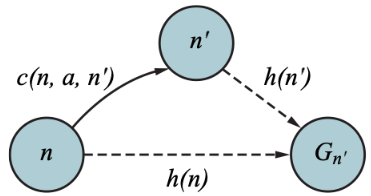
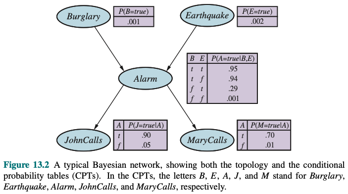

# 大纲

### 搜索

对于AI和CS学科来说，所有问题的解决都可以归纳为**在一个固定区域内进行搜索**。

* 搜索可以是说最重要的解答手段，因此在第一部分将会介绍各类不同的搜索策略
* 而所谓的固定区域是由某种数据结构承载的，比如栈、队列、树、图等数据结构

### 逻辑推理

**人类的智能不是靠反射机制而是通过对知识的收集、理解和推理所产生的**

单纯的搜索就是一种反射机制，程序编写者会编写这种反射机制，也就是说遇到特定的情况如何搜索，同时它的搜索结果必须要依赖于对至少部分可知的环境，对于完全不可观察环境运用搜索是hopeless的，但推理却可以运用已有知识来对甚至不可观察环境得到部分的知识

而要实现AI必须要进行知识库的构建，并由此进行对知识的推理。推理就是基于已有的知识库（栈、队列），直接在知识库里通过逻辑来进行推导，看得到的结果是否被KB所蕴含。

在本md中逻辑部分包括了命题逻辑和一阶逻辑为代表的谓词逻辑。一共有三种常用的推导方法

* 前向链接和反向链接
* 以CNF为基础的归结算法

### 不确定性推理与决策

和逻辑中的确定性事件相比较，现实生活中都是具有不确定性的，这个不确定性用概率论来表达

同时概率还是随着时间迁移，用HMM模型来表示这个转移过程

### 学习

学习机制就是通过对外界的观察得到的新信息，得到新的知识，学习到新的东西然后改善自己的行为

# 智能Agent

## *理性 Rationality*

## *环境性质*

### 任务环境的规范描述

### 任务环境的性质

* 完全可观察的与部分可观察的 fully observable vs. partially observable
  * 若agent的传感器在每个时间点上都能获取环境的完整状态，就说任务环境是完全可观察的。这基本是不可能的，因为这基本意味着全知
  * 若agent的传感器能够检测所有与行动决策相关的信息，那么该任务环境是有效完全可观察的
* 单agent与多agent single vs. multi-agent
* 确定的与随机的 deterministic vs. stochastic
  * 若环境的**下一个状态完全取决于当前状态和agent执行的动作**，那么我们说该环境是确定的，否则是随机的
  * 原则上说，agent在完全可观察的、确定的环境中无需考虑不确定性；然而若环境是部分可观察的，那么它可能表现为随机的
  * 大多数现实环境相当复杂，基本不可能是有效完全可观察的，因此也就必须处理成随机的
  * 说环境不确定是指它不是完全可观察的或不确定的
* 片段式的与延续式/序列式的 episodic vs. sequential
  * 片段式的任务环境中，agent的经历被分成了一个个原子片段（不可再分）。在每个片段中agent感知信息并完成单个任务，关键的是，下一个片段不依赖于以前的片段中采取的行动（时序之间完全独立）
  * 延续式环境中，当前的决策会影响到未来的决策（可通过马尔可夫性进行简化）
  * 片段式环境比延续式环境简单的多，因为agent不需要前瞻
* 静态的与动态的 static vs. dynamic
* 离散的与连续的 discrete vs. continuous
* 已知的与未知的 known vs. unkown

## *Agent结构*

# Search

## *搜索算法的定义和背景*

### Well-defined Problem

搜索用在可观测的问题中，否则要使用inference

* Initial state 初始状态
* A description of possible acitons
* Transition model 转移模型: A description of what each action does
* Goal test：检查是否完成了目标
* Path cost

### NP-Hardness NP困难

* P问题：存在多项式时间算法的问题。注意：很多问题的复杂度是阶乘级别的，这不属于多项式时间复杂度
* NP问题
  * Nondeterministic Polynominal 非确定性多项式问题
  * 存在多项式时间算法的问题，总能在多项式时间内验证它的一个正确解，因此P问题是NP问题的一个子集
  * Travelling Salesman Problem TSP问题
  * 引出了一个问题：是否所有能在多项式时间内验证正确解的NP问题都是P问题，即是否NP问题=P问题？

为了解决上面的问题，科学家提出了很多方法，其中之一就是问题的约化 reduce to。所谓约化就是若可以用问题B的算法来解决问题A，就称问题A可以约化成问题B，比如可以用求解二元一次方程的方法来求解一元一次方程。且约化具有传递性，即A约化为B，B约化为C，则A可约化为C。可以一直约化下去直到最复杂的情况，当解决了这个最复杂情况时，也就可以解决其他的所有问题了。

根据约化思想，对于同一类的所有的NP类问题，若他们都可以在多项式时间内约化成最难的一个NP类问题。当我们针对这个时间复杂度最高的超级NP问题要是能找到他的多项式时间算法的话，那就等于变向的证明了其余所有问题都是存在多项式算法的，即NP问题=P问题

* NP-Complete问题/NP完全问题：存在这样一个的NP问题，所有的NP问题都可以约化为它，那么解决了它的时候所有其他约化成它的NP问题也都解决了。这个超级NP问题有如下两个前提
  * 它是一个NP问题
  * 所有的NP问题都可以约化成它
  * 第一个NPC问题：SAT 命题逻辑的可满足性 Propositional Satisfiability（其实本质上就是是否能快速的找到一个问题的解）
* NP-hard问题：NP-hard问题不满足NPC的第一个条件，即所有的NP问题可以约化成它，但它不一定是一个NP问题，也就是说它不一定能在多项式时间内验证一个解的正确性。因此即使NPC有多项式时间解（NP=P），NP-hard可能依旧没有多项式解，因此说NP-hard至少与NPC问题一样难

### 两种主要的搜索算法

* Tree Search 树搜索
  
  
  
  * Frontier容器（也被称为openlist）用来记录将要探索的结点，一开始里面放的是initial state，若frontier空了都没有找到最终的目标，说明目标不存在
  * **树搜索算法可能会导致状态的重复，**所以更多使用图搜索，当然若可以保证不会遇到重复状态，即有限state-space的话也可以使用树搜索算法
  * 树的组成部分
    * Root: Initial state
    * Branches: Actions
    * Nodes: Reached states
    * Leaves: Unexpanded nodes
  
* Graph Search 图搜索
  
  
  
  **相比于树搜索多维护了一个explored容器（也被称为closedlist）**，这个队列用来记录算法已经过的结点，通过检查新的节点是否在这个队列中，图搜索避免了重复
  
*  节点描述
  * State
  * Parent
  * Action
  * Path-Cost $g(n)$
  
* 评价算法的指标
  * Completeness 完备性：当有解时，一个算法是否能保证找到一个解
  * Optimality：是否能找到最佳的解
  * 时间复杂度
  * 空间复杂度
  * 为了对时间和空间复杂度进行描述，在图搜索上定义定义如下的常数（这些常数由具体问题确定，与算法无关）
    * Branching factor ***b*** ：一个节点的最多分支
    * Maximum depth ***m***：整个图的最大深度
    * Solution depth ***d***：最优解所在的深度

### 现实中的搜索问题

* Route-Finding
* Touring problem
* Layout design of digital circuits
* Robot navigation：连续空间中的导航
* Automatic assembly sequencing
* Protein design

### 课上的Tweedback问题

* Does tree search always find a solution if one exists?
* Is the search tree of a finite graph also finite? 这两个问题的都是否，因为树搜索算法有可能会产生环，进而无限循环
* Is it possible that graph search is slower than tree search? Possible but may not be likely，运气好的时候Tree search可能会快
* What is the maximum number of steps required in graph search? The number of nodes of the graph minus one

## *Uninformed search 无信息搜索*

* 无信息搜索是一个Well-defined问题，但每一步的path-cost都相同，它只知道产生下一个状态以及检查是否达到了目标。**无信息搜索对搜索对象完全无知**

* 有信息搜索每一步具有不同的path-cost，也就是会产生一种路径的偏好。**对搜索对象有基于知识的判断**

### 广度优先搜索 BFS

* 利用**队列**作为容器
  * 从源节点开始依次按照宽度进队列，然后弹出
  * 每弹出一个点，把该点邻接点中没有进过队列的放进队列中
  * 直到队列变空
* Performance of BFS
  * 若 ***b*** 和 ***d*** 都是有限的，那么BFS是完备的；因为每一步的 path cost 都相等，所以总的cost是一个常数，因此是optimal
  * 最坏情况下，每一个node都有 ***b*** 个字节点，那么BFS的空间复杂度和时间复杂度都为 $b+b^2+b^3+\cdots+b^d=\mathcal{O}(b^d)$
* BFS中是一种以时间换空间的方法，具有完备性。虽然可以找到最优的路径，但大量的enqueue、dequeeu操作使算法消耗很大

### 带权图的BFS -- Uniform cost search/Dijkstra算法/一致代价搜索 UCS

* 和BFS的区别
  * 因为是权图，可以使用代价函数 $f(n) = g(n)$，表示从起点到当前点的移动代价
  * 使用**优先级队列**作为容器，将有最小path cost的节点放在队头，通过这个优先级队列保证达到目标节点的时候路径一定是最短的
  * ==所有被放入expolored队列的节点一定都满足最短路径==
  * BFS在第一次遇到目标节点时就进行Goal test并返回Solution，且不会将目标节点加入Frontier。但UCS会将目标节点加入Frontier，且UCS的Goal test不是在第一次遇到目标时就进行，而是在选到目标要进行expansion加入frontier前才进行，因为有可能存在其他optimal routes，这样做就可以验证所有到目标的路径，并且选出Path-cost最小的那一条路径返回solution
  * **若UCS的path cost是unitary cost，即所有的path cost都相同时，UCS=BFS**
* Performance of UCS
  * The cost $C^*$ of the optimal solution and the minimum step-cost $\varepsilon$
  * **当path-cost都大于0时，具有完备性**
  * Optimal if all costs greater than $\varepsilon$
  * 最坏情况是当目标所在的分支的cost都非常大，而其他的分支都是 $\varepsilon$ ，此时时间复杂度和空间复杂度都等于 $(b-1)+(b-1)b+(b-1)b^2+\cdots+(b-1)b^{(C^*/\varepsilon)}=\mathcal{O}(b^{1+(C^*/\varepsilon)})$
* 可以得到最优路径，但仍然是BFS，速度较慢

### 深度优先算法 DFS

* 利用**栈**作为容器
  * 从源节点开始把节点按照深度放入栈，然后弹出
  * 每弹出一个点，把该结点下一个没有进过栈的邻接点放入栈
  * 直到栈变空
* Performance of DFS
  * DFS是否完备严重依赖于是图搜索还是树搜索（图搜索比树搜索多维护了一个explored队列来记住那些节点已经访问过了）：图搜索在有限空间中（loop-free）完备，它至多会扩展所有节点，而树搜索不完备，可能会陷入死循环，若不完备就肯定无法找到最优解
  * 最坏情况是目标最后才被找到，并且其他的所有分支都是最大深度 ***m***，此时的时间复杂度为 $\mathcal{O}(b^m)$，注意DFS的时间复杂度比BFS的时间复杂度 $\mathcal{O}(b^d)$高
  * 只需要存储最深路径的节点，即 $\mathcal{O}(bm)$
* DFS能够快速找到一条路径，是一种以时间换空间的方法，但找到的路径并不保证是所需要的最优路径
* DFS应用在迭代实现的树搜索算法中很容易陷入死循环，因为可能有环，所以DFS往往用于图搜索

### 深度受限搜索 Depth LimitedSearch DLS

* DLS规定了DFS的最大搜索深度，给定了一个limit ***l***，DLS在到达limit之后就会放去搜索，转而去搜索frontier中的其他节点
* 返回值
  * 若一个节点返回solution，就会向上传递至根节点返回
  * 若一个节点返回failure，就会向上传递faliure，若最后的根节点也返回faliure，说明DLS的受限不起作用，也就是说这个图最深的深度也没有limit深
  * 若一个节点达到limit之后返回cutoff，说明当前深度limit并没有找到目标节点，但并不保证更深的节点中也没有目标节点
* Performance of DLS
  * 不完备也不optimal
  * 时间和空间复杂度与DFS相似，分别为 $\mathcal{O}(b^l)$ 和 $\mathcal{O}(bl)$

### 迭代加深搜索 Iterative Deepening Search IDS

* IDS就是在DLS的基础上，不断扩大limit直到找到目标
* 迭代加深算法结合了DFS和BFS的优点，是一种较常用的搜索算法
* Performance of IDS
  * 当分支因子有限时是完备的，当路径代价是非递减函数时是最优的
  * 时间复杂度：在最底部的节点只会被生成一次，而最顶端的则会重复d次 $(d)b+(d-1)b^2+\cdots+(1)b^d=\mathcal{O}(b^d)$
  * 空间复杂度：$\mathcal{O}(bd)$
  

### 双向搜索 Bidirectional Search BS

* BS假设同时从初识节点和目标节点开始搜索，两者路径在中间相遇
* BS的适用场景：BS只使用于只有一个目标节点的情况，如8-puzzle问题、罗马尼亚路径问题等
* Performance of BS

## *Informed search 有信息搜索*

### 启发式搜索算法 Heuristic search algorithm

有信息搜索算法也称为启发式搜索算法，假定了我们对搜索问题还有额外的知识。所谓额外的只是是指除了图模型自带的各节点的邻居、流向和权重信息（==真实cost==）外的信息。

有信息搜索的过程和UCS一样，区别只是启发式搜索根据 evalution function $f(n)$ 探索，该方程给定了探索这个节点的一项，程序会优先探索 $f(n)$ 小的节点。该方程和UCS很像，但UCS是根据已经探索过的路径信息给出接下来的一项，而启发式搜索则需要提供额外的信息。定义 $g(n)$ 为之前探索过的节点的真实代价总和，对于UCS而言，$f(n)=g(n)$。

对于启发式算法，还定义了一个启发函数 Heuristic function $h(n)\geq0$ 来表示 estimated cost of the cheapest path from the state at node *n* to a goal state，对于**目标节点满足 $h(n)=0$，否则不admissible**

启发式算法和启发式函数是根据实际问题的不同和经验提出的简化NP-hard问题算法，虽然不能得到最优解，但往往视启发式函数的设计而定可以获得较优解。启发式算法一般不具有通用性，即不可能所有的问题都用同一种设计来优化

### 贪婪最佳优先搜索 Greedy Best First Search GBFS

* 代价函数只使用启发式函数 $f(n) = h(n)$ 作为判断优先级的标准
* 采用优先级队列作为容器，first in，largest out
* Performance of GBFS
  * 当使用树搜索的时候是不完备的，很容易先入死循环；当使用图搜索在有限状态空间的时候是完备的
  * 和DFS一样，不能保证完备，所以肯定不保证最优
  * 最坏情况下solution会排在最后一位，并且需要存储所有节点，所以时间复杂度和空间复杂度都是 $\mathcal{O}(b^m)$
* 在实际中常常会有很多障碍物，因为计算的是距离，很容易陷入局部最优的陷阱，虽然GBFS速度很快，但有可能找不到最优路径

### A\* 搜索

* 代价函数为 $f(n) = g(n) + h(n)$，融合了GBFS和UCS两种算法的优点
  
  * 注意：$g(n)$ path cost 和UCS一样是路径累加的，而 $h(n)$ 启发值则是当前节点的启发值
  
  * 当 $h(n)$ 满足 Admissibility 和 Consistency 这两种性质时，A\* 算法可保证解的**最优性**
  
    * Admissibility 可采纳性: An admissible heuristic is one that never overestimates the cost to reach the goal,  $h(n)\leq$ min cost from n to $n_{end}$，可采纳启发式是指它从不会过高估计到达目标的代价，比如path cost是实际里程，而heuristic是直线距离
  
    * Consistency/Monotonicity 一致性: 启发函数从当前点到终点的值 $\leq$ 当前节点到其任意子节点的真实距离 + 任意子节点到终点的启发函数值小，即 $h(n)\leq c(n,a,n')+h(n'),\ n'$ is successor of n。一致性是一种广义的三角形法则
    
      
  
  * 可以把目标节点的启发函数值为0也算上，即 $h(n_{end})=0$
  
* Pruning 剪枝 

* Performance of A\* search 

* 对A\* 搜索的改进
  * Iterative-deepening A\*
  * Recursive best-first search 迭代最佳优先搜索
  * Memory-bounded A\* and Simplified memory-bounded A\*

### 讨论 A* 算法的最优性

**若 $h(n)$ 是可采纳的，那么 A\* 的树搜索版本是最优的；若 $h(n)$ 是一致的，那么 A\* 的图搜索是最优的**。可以证明若 $h(n)$ 是一致的，则 $h(n)$ 一定是可采纳的，即图搜索包含了树搜索。现在证明一致性

* 首先证明性质：若 $h(b)$ 是一致的，则沿着任何路径的 $f(n)$ 值是非递减的，证明可从一致性的定义直接得到
  $$
  f(n')=g(n')+h(n')=g(n)+c(n,a,n')+h(n')\geq g(n)+h(n)=f(n)
  $$

* 接下来可以证明：若 A\* 选择扩展节点n时，就已经找到了到达节点n的最优路径

* 从上面两个性质可以得到第一个被选择扩展的目标节点一定是最优解，之后扩展的目标节点代价都不会低于它

如下图，由于 $h(n)$ 的不断下降，$f(n)$ 等高线呈椭圆形，也就是说优先探索 $h(n)$ 小的方向。而此时 UCS的 $f(n)$ 等高线将呈以起点为圆心的正圆形。明显比 A\* 需要探索的节点更多

### 启发式设计，以 8-Puzzle 为例

* 8-Puzzle的两种启发函数设计
  * $h_1$ 错位棋子数
  * $h_2$ 曼哈顿距离

* 利用 Effective Branching Factor $b^*$ 有效分支因子来评价启发函数的质量 $N+1=1+b^*+(b^*)^2+\dots+(b^*)^d$

* 生成Heuristic的方法

  * Generating admissible heuristics from relaxed problems 松弛问题

  * Generating admissible heuristics from subproblems: Pattern databases 模式数据库

  * Learning from experiences：机器学习

### Uninformed Search 和 Informed Search性质总结

* Uninformed Search

  | Criterion  | BFS                | UCS                                               | DFS                | DLS                | IDS                |
  | :--------- | :----------------- | ------------------------------------------------- | ------------------ | ------------------ | ------------------ |
  | Complete   | Yes$^{(1)}$        | Yes$^{(1),(2)}$                                   | No                 | Yes, if $l\geq d$  | Yes$^{(1)}$        |
  | Optimal    | Yes$^{(3)}$        | Yes                                               | No                 | No                 | Yes$^{(3)}$        |
  | 时间复杂度 | $\mathcal{O}(b^d)$ | $\mathcal{O}\left(b^{1+(C^*/\varepsilon)}\right)$ | $\mathcal{O}(b^m)$ | $\mathcal{O}(b^l)$ | $\mathcal{O}(b^d)$ |
  | 空间复杂度 | $\mathcal{O}(b^d)$ | $\mathcal{O}\left(b^{1+(C^*/\varepsilon)}\right)$ | $\mathcal{O}(bm)$  | $\mathcal{O}(bl)$  | $\mathcal{O}(bd)$  |

  1. 若 ***b*** 是有限的，就是完备的
  2. 若所有的cost $\varepsilon$ 都是非负的，就是完备的
  3. 若所有cost都相同就是最优解

* Informed Search

# 现实世界中的搜索

# Constrain satisfaction problems 约束满足问题

## *Defining CSP*

一组变量每个变量有自己的取值，当每个变量都有自己的赋值且同时满足所有关于变量的约束条件时，问题就得到了解决。CSP是搜索的一种特殊形式，相当于一种**规定了搜索边界的搜索**，而上节的搜索是为了找到最优化的解（如果存在的话）。

CSP利用了状态结构的优势，使用的是通用策略而不是启发式来求解复杂问题。==主要思想是通过识别违反约束的变量/值的组合来迅速消除大规模的搜索空间==

### 定义状态空间

* A CSP problem is a tuple of $(X,D,C)$ 

  * $X=\left\{X_1,\dots,X_n\right\}$ is a set of variable 变量集合

  * $D=\left\{D_1,\dots,D_n\right\}$ is a set of respective domains of values 所有变量的值域集合

  * $C=\left\{C_1,\dots,C_m\right\}$ is a set of constraints 描述变量取值的约束结合
    * 其中每个约束是有序对 $C_i=\langle scope,\ rel\rangle$，scope是约束中的变量组，rel则定义了这些变量取值应满足的关系
    * 比如 $\langle\left(X_1,X_2\right),X_1\neq X_2\rangle$
* 求解CSP，需要定义状态空间和解
  * 问题的状态由对部分或全部变量的一个赋值 $\left\{X_i=v_i,X_j=v_j,\cdots\right\}$ 来定义

  * 一个不违反任何约束条件的赋值称作**相容的 consistent** 或者合法的赋值

  * 完整赋值是指每个变量都已赋值，CSP的解是相容的、完整的赋值

  * 部分赋值是指只有部分变量赋值了

### 约束类型

* Un-ary 一元：只限制单个变量的取值，如 $\langle(X_1),X_1\neq 2\rangle$
* Bin-ary 二元与两个变量有关，如 $\langle(X_1,X_2),X_1\neq X_2\rangle$，**将二元的constriant pair称为弧 arc**
* Higher-order 任意有限值域的约束都可以通过引入足够的约束变量而转化为二元约束
* Global constraint 全局约束，最常见的全局约束为 $Alldiff$，指的是约束中的所有变量必须取不同的值
* 绝对约束 Absolut constraint 和偏好约束 Preferences，偏好约束对应的是约束优化问题 COP

* 现实中的CSP问题

  * Assignment problem, Timetabling problem 排课问题

  * Hardware configuration

  * Transportation scheduling 交通路线规划
* Standard Search Formulation

  * Initial state
  * Successor function: assign a value to an unassigned variable not conflicting with the current assignment
  * Goal test: the current assignment is complete

## *约束传播：CSP中的推理*

Inference: Act or process of deriving logical conclusions from known premises. CSP中的推理称为约束传播 Constraint Propagation，即使用约束减小一个变量的合法取值范围，从而影响到跟此变量有约束关系的另一变量的取值。约束传播是一种部分赋值 partial assignment

核心思想是局部相容性 Local consistency，增强各部分的局部相容性会导致不相容的节点取值被删除

### 节点相容 Node Consistency

* 若单个变量（对应于CSP网络中的结点）值域中的所有取值满足它的一元约束，就称此变量是结点相容的
* 通过运行结点相容总能消除CSP中的所有一元约束，剩下的就只有二元和多元约束。同时可以通过辅助变量将所有n元约束转换为二元的，**因此通常的做法是定义只含有二元约束的CSP求解器**

### 弧相容 Arc Consistency

* 若变量值域中的所有取值满足该变量的所有二元约束，则称此变量是弧相容的

* 或者更形式化：对于变量 $X_i, X_j$，若对每个 $X_i$ 的每个赋值（即 $D_i$）都满足弧 $(X_i,X_j)$ 的二元约束，即都能在 $D_j$ 中找到**一些**值满足弧 $(X_i,X_j)$，则称 $X_i$ 对于 $X_j$ 是弧相容的，用下面途中的箭头表示

* 注意，**Direction matters**，在下面的例子中，在 $Y$ 中任意挑一个数字，总能在 $X$ 中找到一个对应项，但反过来在 $X$ 中任意挑一个数字，并不总能在 $X$ 中找到一个对应项，比如8和10，因此**称 $Y$ 相对于 $X$ 弧相容，而 $X$ 相对于 $Y$ 则不是弧相容的**

* 若每个变量对于其他变量都是弧相容的，则称该网络是弧相容的

  

* 路径相容 Path Consistency

* k-相容

## *Backtracking Search for CSP CSP的回溯搜索*

### 过程

* CSP的解总是在最后一层，但只要找到一个解，所以用**DFS**
* 对于n个变量，每个变量有d个取值，在完全不优化的情况下最坏情况会有 $n!d^n$ 个节点
* CSP问题中节点的顺序是不重要的，因此每一层只要取一个变量进行赋值，这可以立即将节点数减少到 $d^n$ 个
* 回溯搜索算法需要考虑的问题
  * 接下来该为哪一个变量赋值？Variable Selection
  * 以怎样的顺序来对一个变量尝试赋哪一个值？Variable Selection
  * 能否提前知道肯定是failure的情况？Interleaving Search and Inference
  * 可以利用CSP问题结构的优势吗？The Structure of CSP

### Assigned variable and value Selection's Criterion (Heuristics)

* Minimum Remaining Values (MRV) heuristic 最少剩余值：最先选择具有最少可能的值的变量进行赋值，因为这样就选择了最可能很快导致失败的变量，从而对搜索树剪枝
* Degree Heuristic 度启发式/最大度
  * MRV heuristic 对于挑选第一个赋值的变量没有帮助
  * 选择有最多约束关系的那一个变量作为优先尝试的变量以此来降低未来的分支因子
* 取值顺序：Least Constraining Value heuristic 最少约束值：优先选择给邻居留下更多选择的值
* Variable: fail-first -- To prune tree as more as possible; Value: fail-last -- to preserve the possibility to find a tree in chosen tree branch

回溯时因为选择变量是失败优先的MRV或者Degree Heuristic，而选择值是失败最后的LCV，所以回溯的方法是将这一步选取变量的所有取值都试完之后如果还是失败，就往上一步的变量回溯。也就是说这一步的变量失败了之后，也就没必要尝试其他变量了，因为我们选择的是限制最多的变量，随着每次选定一个值，对变量的选择限制只能是更多不可能更少，也就是说如果将限制最多变量放在后面选择，其选择结果也不可能好过把它放在第一个选，这样还能提前进行剪枝节省计算

### Interleaving Search & Inference

CSP中可以采用搜索与推导交错进行 Interleaving Search & Inference

搜索与推理的区别？搜索就是类似搜索算法那一节中的树搜索结果或者图搜索产生的决策结构。做出的决策肯定不会违反当前变量约束，这是做出合法决策的前提，但在做出决策后的结果是否会使其他变量之间的未知关系是未知的，这时候就可以使用推理了。每一次做出决策后会进行一次推理，即验证做出当前这步决策后其余变量的约束关系如何。若已经知道会违反约束，那么当前这步决策树也就没有继续下去的必要了，相当于进行了预剪枝

约束传播与搜索可以交替进行，在每次赋值后进行推理或者也可以把约束传播作为搜索前的预处理 pre-processing。若此时预处理就可以解决整个问题也就完全不需要搜索了

* Forward Checking 前向检验
  * 在每次对某个变量 $X$ 赋值后检查与 $X$ 相关的未赋值变量 $Y$，从 $Y$ 的值域中删去与 $X$ 不相容的值，也就是说**只检查了一步**。当任何变量没有合法值（可取值为空）是终止
  * 前向检验是弧相容算法的一种，但它只看一步，目光不够长远。只能使当前变量弧相容，而不能向前看使所有变量都弧相容
* Maintain Arc Consistency Algorithm MAC 维护弧相容算法与AC-3
  * 检查**所有变量之间**的弧相容关系，所有变量中不相容的值都会被去掉，检查**多步的弧相容**
  * 可以作为赋值后的检查也可以作为预处理

弧相容算法：检查binary CSP的AC-3类似BFS算法，**维护了一个约束队列**存储弧对。下面是算法中的一些注意事项

* AC-3的初始化
  * After every assignment：在为 $X_i$ 变量赋值后，要检查 $X_i$ 相关的弧相容，所以将所有与 $X_i$ 相关的 $X_j$ 的约束 $(X_j,X_i)$ 加入队列作为初始化。这是因为 $X_i$ 已经被赋值选定了，所以**要检查的是 $X_j$ 相对于 $X_i$ 的弧相容**，而不是 $X_i$ 相对于 $X_j$ 的弧相容，不然如果出现冲突的情况，难道要删已经定下来的 $X_i$ 吗？这是Backtrap的任务。实际上只要 $X_j$ 中不是只有和 $X_i$ 相同的颜色就都满足 $(X_i,X_j)$ 弧相容
  * As pre-processing：把所有的弧全部加入队列
* Remove-Inconsistent-Value
  * 若产生了冲突，就要把检查的 $X_i$ 里的冲突值删去，此时将除了 $X_j$ 之外的 $X_i$ 的所有邻居弧 $X_k$ 加入队列，并返回 `removed<-true`
  * 若检查的 $X_i$ 相对于 $X_j$ 已经弧相容了，没有改动 $X_i$，返回 `removed<-false`，此时 Remove-Inconsistent-Values 的判断条件不成立，那么就不需要将新的弧加入队列了
  * 若检查的 $X_i$ 被删空了，就AC-3直接返回failure
* 若最后队列走完了也没有提前返回failure，就说明弧相容，返回所有当前所有node的剩余取值

### The Structure of CSP

* Conditioning
* Tree-Structured CSPs Topological Sort 拓扑排序
* Nearly tree-structured CSPs: Tree Decomposition

# Logical Agents

搜索是一种人为设计和干预之下的解题手段，它不具备对“知识”的处理能力。同时我们需要将搜索条件和启发式算法设计抽象为数学描述。但很多时候，对真实世界的描述由于其复杂性可能很难用数学来量化抽象描述，这时候就需要引入成体系的逻辑及其推理来帮助agent学习

## *KB与Logic基础*

### 知识 Knowledge

什么是知识？

* 知识 Knowledge 是一种人类基于经验的总结，是一种对现实世界的描述。在启发式中，设计的启发式函数就是一种量化抽象的知识
* 逻辑agent从可观察的世界中获取知识，然后对现有知识进行组合、推理
* 基于客观世界的推演称为逻辑推理，基于随机世界的推演称为概率预测

基于知识的Agent的核心部件是其**知识库 Knowledge Base**
* BA是一个语句集合，**其中的每条语句都为真**。比如说：$p_{1,1}==false$，要把 $p_{1,1}$ 加入BA，就要取他的否定 $\neg p_{1,1}==true$ 加入BA
* 当某语句式直接给定而不是推导得到的时候，将其称为**公理 Axiom**；将借助公理或者已经验证为真的其他定理通过逻辑验证为真的问题或语句称为**定理 Theorem**

Methods to gain knowledge
* Inference 逻辑推理
* Declarative approach 先验知识
* Perception 观测

上图为基于KB的逻辑agent进行学习的通用伪代码，每次调用agent程序会做三件事

1. Agent **TELL** KB what it percepts，即将新的知识加入到KB中
2. Agent **ASK** KB what action to take，对KB进行查询
   * 在回复该查询的过程中，可能要进行大量的逻辑推理
   * Query的结果必然不会与KB中已有知识矛盾
3. Agent returns the action it takes

### Logic und Theorembeweisen

逻辑语句根据语言的语法 syntax 来组织表达，还需要定义语义 semantics 来确定真值

Mithilfe maschineller Logik ist es für einen Rechner (Maschine) mögich, aus bestehenden Fakten neue Erkenntnisse abzuleiten oder bestimmte Behauptungen zu beweisen bzw. zu widerlegen.

Der Bereich Logik und Theorembeweisen ist somit die methodische Grundlagen der meisten regelbasierten Verfahren der KI

Die wichtigsten Teilgebiete sind Aussagenlogik 命题逻辑, Prädikatenlogoik 谓词逻辑 und logisches Schließen 逻辑推导

### 蕴含与逻辑推理

为了精确描述，用术语**模型 Model**来取代世界。若语句 $\alpha$ 在模型 $m$ 中为真，称 $m$ 满足 $\alpha$，也可以说 $m$ 是 $\alpha$ 的一个模型，用 $M(\alpha)$  来表示所有的模型

定义Entailment 蕴含

* $\alpha\models\beta$ if and only if $M(\alpha)\subseteq M(\beta)$，形式化定义为：$\alpha\models\beta$ 当且仅当在使 $\alpha$ 为真的每个模型中 $\beta$ 也为真
* 一定要注意 $\subseteq$ 的方向，若$\alpha\models\beta$，那么 $\alpha$ 是比 $\beta$ 更强的断言，因为它排出了更多的可能世界

Entailment 和 Logic Inference是相反的过程：比如 $\alpha\models\beta$ 或 $\alpha\vdash_i\beta$称为 $\beta$ 通过 i 从 $\alpha$ 导出，Inference的过程就是在 $\alpha$ 中寻找 $\beta$ 的过程

推理算法的完备性与可靠性

* 可靠性 Soundness：只导出Entailment的推理算法是可靠的或真值保持的，也就是说**不包含错的结果**
* 完备性 Completness：若推理算法可以生成任一指定的Entailment，则它是完备的，也就是说**包含所有对的结果**

## *Propositional Logic 命题逻辑：一种简单逻辑*

### 命题逻辑的定义

命题 Proposition 就是非真即假的陈述句，命题的真假称为真值

真值有两种，$true$ 为永真命题，$false$ 为永假命题。因为只有两种真值，所以命题逻辑也被称为二值逻辑。当真值超出2种时，称为多值逻辑或模糊逻辑

### Syntax of Preostional Logic: Define 2 sentences $S_1,\ S_2$

* Atomic Sentence 原子语句由单个命题词 propositional symbol 构成，每个命题词代表一个要么为真要么为假的命题
* 以下五种连接词 Connective 可以将命题于命题连接起来，构成复合句 Complex sentences，由连接词组成的各部分称为一个语句 literal 或子句。连接词是命题的运算符，相当于1+1中的加号
  * Negation: $\neg S$
  * Conjunction 与/且: $S_1\wedge S_2$ 称为和取式 Conjunction，各部分称为和取子句 Conjunct
  * Disjunction 或: $S_1\vee S_2$ 称为析取式 Disjunction，各部分称为析取子句 Disjunct
  * Implication: $S_1\Rightarrow S_2$，也可以称为 if-then 语句，$\Rightarrow$ 和 $\rightarrow$ 以及 $\supset$ 是一样的
  * Biconditional: $S_1\Leftrightarrow S_2$, which means if and only if $S_1\Rightarrow S_2\ \&\&\ S_2\Rightarrow S_1$, then $S_1\Leftrightarrow S_2$
* 运算符优先级：$\neg,\wedge,\vee,\Rightarrow,\Leftrightarrow$

### Semantic：定义了用于判定特定模型中的语句真值的规则

连接词的语意规则可以由真值表 Truth table 来总结

* 计算Atomic Sentences的真值
  * $true$ 都为真，$false$ 都为假
  * 每个命题词的真值必须在模型中直接指定
  * 在模型m中 $\neg P$ 为真 iff $P$ 在m中为假
  * 在模型m中 $P\wedge Q$ 为真 iff $P$ 和 $Q$ 都为真
  * 在模型m中 $P\vee Q$ 为真 iff $P$ 或 $Q$ 为真
  * 在模型m中 $P\Rightarrow Q$ 为真 ==除非== $P$ 在m中为真且 $Q$ 在m中为假
  * 在模型m中 $P\Leftrightarrow Q$ 为真 iff $P$ 和 $Q$ 在m中都为真或都为假 $M\left\{(True,True),(False, False)\right\}$

$\Rightarrow$ 问题

* 自然语言意义经常隐含地假定假设与结论之间有某种关系，但命题逻辑的连接词 Imply 不要求 $P$ 和 $Q$ 之间存在相关性或因果关系，将 $P\Rightarrow Q$ 看做若 $P$ 为真，则我主张 $Q$ 为真。比如5是奇数imply北京是中国的首都，两者之间没有任何因果关系
* 举例：这个例子仅仅是为了方便记忆，但并不恰当，因为如上所述，两命题之间不存在必然的联系与因果关系
  * 下雨天 $\Rightarrow$ 不出门
  * 若下雨天为真，出门为假，则整体为假
  * 若下雨天为假（即不下雨），则出不出门都为真

**区分 $\Rightarrow$ 和 $\models$**

* $\Rightarrow$ Implication：是命题和命题之间的连接词，利用真值表来刻画。要注意，两边的命题逻辑都是真的，即 $A\Rightarrow B$ 意味着若A为真，则B为真；但若A为假，则对B没有任何影响
* $\models$ Entailment：表示语句间的逻辑蕴含关系，和逻辑推理有关，有一定的因果关系

## *Propositional Theorem Proving/Aussgenlogikschlißen*

>Mithilfe der Axiome und des „Thorembeweisens“ kann die Frage beantowrtet, bzw. die Behauptung bewiesen werden. Dies erfolgt entweder durch eine Wahrheitstabelle oder durch Umformung der Regeln und Schlussfolgerungen, dem logischen Schließen.

逻辑推断可以通过枚举推理：朴素的列真值表，或者使用推理规则来进行逻辑推导

而逻辑推导又有两种方法

* 以推理规则为基础的归结算法，适用于任何子句
* 以逻辑等价改写规则 Umformungsregeln 为基础的前向链接和反向链接，适用于horn子句

### Entailment附加概念

**因为枚举判断Entailment是不现实的，所以要使用定理判断Entailment，为此需要介绍一些推理规则**

对于一个命题公式或者说语句 $\alpha=f(P_1,P_2,\cdots,P_n)$，它的真值完全由组成它的每个命题真值来决定。对所有的成员命题进行赋值，称为一种指派 assignment，一种指派再加上 $\alpha$ 的真值，称为命题公式 $\alpha$ 的一种解释 interpretation

按照命题公式的取值情况，可以将命题公式分为如下几种类型

* 重言式 Tautology/永真式 及有效性 Validity
  *  A sentence is valid if it is true in ==all== models. Valid sentences are also known as tautologies 
  * 比如 $P\vee\neg P$
  * 可以通过有效性和蕴含的定理，得到**演绎定理 Deduction theorem**：For any sentences $\alpha$ and $\beta$, $\alpha\models\beta$ if and only if the sentence $\left(\alpha\Rightarrow\beta\right)$ is valid
  
* 矛盾式/永假式/不可满足式：任一解释的真值都为0的命题公式，如 $P\wedge\neg P$

* 可满足性 Satisfiablity: A sentence is satisfiable if it is true in ==some== model 有些解释的真值为1，有些解释的真值为0
  * 验证一个语句是否是可满足的可以通过枚举所有模型来进行，只要能找到一个模型使它为真就说明它是可满足的。命题逻辑的可满足性问题 SAT 是被 Stephen Cook 证明的第一个NP完全问题
  
  * **Proof by contradtion 反证法**：$\alpha\models\beta$ iff $(\alpha\wedge\neg\beta)$ 是不可满足的
  
    * 意思就是说根据演绎定理 $\alpha\models\beta$ 就是 $\alpha\Rightarrow\beta$，即在所有 $\alpha$ 为真的模型中，$\beta$ 都为真。那么反证法的意义就是找到任何一个在 $\alpha$ 为真的情况下 $\neg\beta$ 是和 $\alpha$ 公理都矛盾的，或者说 $\alpha\wedge\neg\beta$ 都为false的，就可以说明 $\alpha\Rightarrow\beta$
  
    * 从逻辑等价的视角也可以说明反证法的正确性。根据implication elimination 得到下式
      $$
      \alpha\Rightarrow\beta\equiv\neg\alpha\vee\beta\\\neg(\alpha\wedge\neg\beta)\equiv\neg\alpha\vee\beta
      $$

### Umformungsregeln

逻辑等价推理规则 Logical Equivalence 及其等价形式是一种改写规则 Umformungsregeln，用于前向链接和反向链接。它的定义是: **two sentences $\alpha$ and $\beta$ is $\alpha\equiv\beta$ iff $\alpha\models\beta$ and $\beta\models\alpha$**，下面是**逻辑等价的不同形式**，可以根据推理规则对其进行改写达到简化的目的

* Commutativity 交换律 
  * $\wedge$: $(\alpha\wedge\beta)\equiv(\beta\wedge\alpha)$
  * $\vee$: $(\alpha\vee\beta)\equiv(\beta\vee\alpha)$
* Associativity 结合律
  * $\wedge$: $\left((\alpha\wedge\beta)\wedge\gamma\right)\equiv\left(\alpha\wedge(\beta\wedge\gamma)\right)$
  * $\vee$: $\left((\alpha\vee\beta)\vee\gamma\right)\equiv\left(\alpha\vee(\beta\vee\gamma)\right)$
* Distributivity 分配律
  * Distributivity of $\wedge$ over $\vee$: $\left(\alpha\wedge(\beta\vee\gamma)\right)\equiv\left((\alpha\wedge\beta)\vee(\alpha\wedge\gamma)\right)$
  * Distributivity of $\vee$ over $\wedge$: $\left(\alpha\vee(\beta\wedge\gamma)\right)\equiv\left((\alpha\vee\beta)\wedge(\alpha\vee\gamma)\right)$
* Double-negation elimination 双重否定为肯定 $\neg(\neg\alpha)=\alpha$
* Contraposition 逆否: $(\alpha\Rightarrow\beta)\equiv(\neg\beta\Rightarrow\neg\alpha)$
* **Implication elimination**: $(\alpha\Rightarrow\beta)\equiv(\neg\alpha\vee\beta)$ 只有当 $\alpha$ 为真，$\beta$ 为假时整体为假
* Biconditional elimination: $(\alpha\Leftrightarrow\beta)\equiv\left((\alpha\Rightarrow\beta)\wedge(\beta\Rightarrow\alpha)\right)$
* De Morgan
  * $\neg(\alpha\wedge\beta)\equiv(\neg\alpha\vee\neg\beta)$
  * $\neg(\alpha\vee\beta)\equiv(\neg\alpha\wedge\neg\beta)$

### 推理规则 Rule of Inference

> **推理规则**（推论规则）是构造有效推论的方案。这些方案建立在一组叫做**前提 Premise**的公式和叫做**结论 Conclusion**的断言之间的语法关系。这些语法关系用于推理过程中，新的真的断言从其他已知的断言得出

* Modus Ponens 假言推理规则，也就是著名的三段论 Syllogism，它用下方这种 Schlussfigur 给出
  $$
  \frac{\alpha\Rightarrow\beta,\ \alpha}{\beta}
  $$

  * 只要给定任何形式为 $\alpha\Rightarrow\beta$ 和 $\alpha$ 的语句，就可以推导出语句 $\beta$
  * 在推理中 $\frac{\alpha}{\beta}$ 的意思是从 $\alpha$ 子句 得到一个结果子句 $\beta$

* 消去合取词
  $$
  \frac{\alpha\wedge\beta}{\alpha}\ or\ \frac{\alpha\wedge\beta}{\beta}
  $$
  即可以从和取式推导出任何和取子句

* 双向蕴含于消去的等价给出两条推理规则
  $$
  \frac{(\alpha\Leftrightarrow\beta)}{\left((\alpha\Rightarrow\beta)\wedge(\beta\Rightarrow\alpha)\right)}\\\\\frac{\left((\alpha\Rightarrow\beta)\wedge(\beta\Rightarrow\alpha)\right)}{(\alpha\Leftrightarrow\beta)}
  $$

### 简单推理/枚举推理

根据[演绎定理](#演绎定理)，推理即判断对于某些语句 $\alpha$，$KB\models\alpha$ 是否成立，等价于判断 $KB\Rightarrow\alpha$ 在KB为真时是否为真（KB为假则说明KB的公理错误，那么就没有意义）

可以通过枚举真值表，并判断interetation来判断Entailment，验证 $\alpha$ 在KB为真的所有模型中 $\alpha$ 是否为真。因为这是对Entailment定义的直接实现。

比如下图中判断 Wumps world 中基于当前KB推理 $P_{2,1}$ 是否为真，可以看到在所有KB为true的情况时，$P_{2,1}$ 都为false，因此可以 $KB\models\neg P_{2,1}$ ，即当前KB可以推理出该点没有pit

比如 TT-Entails 算法，该算法是完备且可靠的，但实际中因为大量的命题导致了高计算消耗，很难使用这种方式来进行验证

枚举推理本质上仍然在利用搜索，若KB和要证明的问题规模很大，那么用这种方法是不现实的

## *基于归结的推理*

之前的推理规则都是可靠的，但不一定完备，比如把双向蕴含这条推理规则删去之后有些Entailment就无法判断

有一个推理规则称为归结 Resolution，当它**与任何一个完备的搜索算法相结合时，可以得到完备的推理算法**

**归结规则形成了完备推理过程的基础**。对命题逻辑的**任意语句** $\alpha$ 和 $\beta$，基于归结的定理证明器，能够确定 $\alpha\models\beta$ 是否成立

### 定义推导算法

* 初始状态：初始KB
* 行动：行动集合由应用于语句的**所有推理规则**构成，即Schlussfigur的上半部分
* 结果：行动的结果是将Schlussfigur的下半部分加入KB
* 目标：$KB\models\alpha$

### Proof by resolution 归结证明

* 单元归结 Unit resolution
  $$
  \frac{l_1\vee\cdots\vee l_k,\ \ \ m}{l_1\vee\cdots\vee l_{i-1}\vee l_{i+1}\vee,\cdots\vee l_k}
  $$

  * $l_i$ 和 $m$ 是互补文字 Complementary literals，即 $l_i\equiv\neg m$
  * 可推广为全归结
  * 用自然语言来描述就是若 $l_1,\cdots l_k$ 中的任意一项或多项可能为真，若给出 $l_i$ 的互补文字 $m$ 为true，那么我们就可以排除 $l_i$ 为true，注意：$l_i$ 与 $m$ 的关系可以理解为 $\wedge$
  
* 全归结 Full resolution
  $$
  \frac{l_1\vee\cdots\vee l_k,\ \ \ m_1\vee\cdots\vee m_n}{l_1\vee\cdots\vee l_{i-1}\vee l_{i+1}\vee,\cdots\vee l_k\vee m_1\vee\cdots\vee m_{j-1}\vee m_{j+1}\vee\cdots\vee m_n}
  $$

  * $l_i$ 和 $m_j$ 是互补文字

* 归并 Factoring：结果字句中每个文字都只能出现一次，去除文字多余的副本被称为归并，即 $\displaystyle\frac{(A\vee\neg B),\ (A\vee B)}{A\vee A}$

### 合取范式与归结算法

* 合取范式 Conjunctive Normal Form CNF
  * 归结规则只应用于子句（即文字的析取式）
  * A sentence with literals $x_{ij}$ of the form $\color{\red}\wedge_{i}\vee_{j}(\neg)x_{ij}$ is in Conjunctive Normal Form，也就是说最外层逻辑要用合取 $\wedge$ 来连接，内层逻辑用析取 $\vee$ 来连接
  * 可以证明，命题逻辑的任何语句都可以扁平化为CNF

* 归结算法
  
  
  
  * `PL-RESOLVE(C_i,C_j)` 返回两个输入子句进行归结得到的所有结果子句的集合
  * 用反证法来证明：为了证明 $KB\models\alpha$，需要证明 $(KB\wedge\neg\alpha)$ 是不可满足的
  * 归结算法的输入需要使用CNF
  * 过程
    * 对于每一个子句pair $(C_i,C_j)$ 计算它们的归结结果，若产生了新的子句就加入 new 队列。中间若产生的归结结果是空，那么返回true，说明 $KB\models\alpha$
    * 若在遍历过所有pair后，仍然没有产生空子句，且没有新的子句产生了，那么返回false，说明 $KB\nvDash\alpha$
    * 注意：每次使用 `PL-Resolve` 只能消去一对互补文字
  * 如何理解得到空子句就说明 $KB\wedge\alpha=false$？因为 $\empty==false$，而KB是所有语句的析取，所以只要有一条逻辑为假，就说明得到的结论至少和KB中的某条子句矛盾了，也就说明整个KB为假，从而通过反证法得到 $KB\models\alpha$  
  
* 归结的完备性
  * 归结推理规则形成了完备推理过程的基础，对命题逻辑 $\alpha$ 和 $\beta$，基于轨迹的定理证明器，一定能确定 $\alpha\models\beta$ 是否成立。归结算法的完备性通过引入归结闭包 Resolution Closure $RC(S)$ 来证明
  * 命题逻辑中归结的完备性定理被称为 Ground Resolution Theorem **基本归结定理：若子句集是不可满足的，则这些字句的归结闭包包含空子句**

## *例子：Wumpus World*

为方便说明，在例子中**仅考虑推导有没有pit**

### 定义KB

先让Agent从 (1, 1) 走到 (2, 1)，在 (1, 1) 什么都没有感受到，在 (2, 1) 处感受到了微风。运用这些条件构建一个KB

* (1, 1) 中没有无底洞：$R_1:\neg P_{1,1}$

* 一个方格里若有微风，iff在某个相邻方格中有无底洞，对于每个方格都应该说明这一情况，目前只考虑相关方格
  $$
  R_2:B_{1,1}\Leftrightarrow(P_{1,2}\vee P_{2,1})\\R_3:B_{2,1}\Leftrightarrow(P_{1,1}\vee P_{2,2}\vee P_{3,1})
  $$

* 现在将 Agent 最初访问的两个方格的微风感知信息包括进来
  $$
  R_4:\neg B_{1,1}\\R_5:B_{2,1}
  $$

于是，KB由 $R_1$ 到 $R_5$ 这些语句的合取式构成（要同时为真），即 $KB=R_1\wedge R_2\wedge R_3\wedge R_4\wedge R_5$

### 运用推理规则

在包含上面 $R_1$ 到 $R_5$ 的KB，证明 $\neg P_{1,2}$

* 将双向蕴含消去应用于 $R_2$
  $$
  R_6:(B_{1,1}\Rightarrow(P_{1,2}\vee P_{2,1}))\wedge((P_{1,2}\vee P_{2,1})\Rightarrow B_{1,1})
  $$

* 对 $R_6$ 做消去合取词
  $$
  ((P_{1,2}\vee P_{2,1})\Rightarrow B_{1,1})
  $$

* $R_7$ 的逆否命题逻辑等价给出
  $$
  R_8:(\neg B_{1,1}\Rightarrow\neg(P_{1,2}\vee P_{2,1}))
  $$

* 对 $R_8$ 和感知信息 $R_4$ 运用假言推理规则，得到
  $$
  R_9:\neg(P_{1,2}\vee P_{2,1})
  $$

* De Morgan
  $$
  R_{10}:\neg P_{1,2}\wedge\neg P_{2,1}
  $$

$R_{10}$ 证明了在 (1, 2) 和 (2, 1) 中都没有pit

### 再一次扩充KB、归结原则

令Agent从 (2, 1) 返回 (1, 1)，接着走到 (1, 2)，在 (1, 2) 感受到了臭气，但没有微风。将这些事实加入KB
$$
R_{11}:\neg B_{1,2}\\R_{12}:B_{1,2}\Leftrightarrow(P_{1,2}\vee P_{2,2}\vee P_{1,3})
$$

* 和上面推导出 $R_{10}$ 这个fact的过程一样，我们可以推导推导出 (2, 2) 和 (1, 3) 中没有pits，即有以下事实
  $$
  R_{13}:\neg P_{2,2}\\R_{14}:\neg P_{1,3}
  $$

* 对 $R_3$ 运用双向蕴含词消去
  $$
  R_3:(B_{2,1}\Rightarrow(P_{1,1}\vee P_{2,2}\vee P_{3,1}))\wedge((P_{1,1}\vee P_{2,2}\vee P_{3,1})\Rightarrow B_{2,1})
  $$

* 根据 $R_5$ 使用假言推导规则，可以得到 (1, 1) 或 (2, 2) 或 (3, 1) 中有pit的事实
  $$
  R_{15}:P_{1,1}\vee P_{2,2}\vee P_{3,1}
  $$

* 现在第一次运用归结规则：$R_{13}$ 中的文字 $\neg P_{2,2}$ 与 $R_{15}$ 中的文字 $P_{2,2}$ 进行归结，可以得到 $R_{16}$ 。自然语言意义为pit必然在 (1, 1) 或者 (3, 1) 中
  $$
  R_{16}:P_{1,1}\vee P_{3,1}
  $$
  或者用Schlussfigur来表达
  $$
  \frac{P_{1,1}\vee P_{2,2}\vee P_{3,1},\ \neg P_{2,2}}{P_{1,1}\vee P_{3,1}}
  $$
  
* 第二次运用归结规则：$R_1$ 中的文字 $\neg P_{1,1}$ 与 $R_{16}$ 中的文字 $P_{1,1}$ 进行归结，可以得到 $R_{17}$，则 (3,1) 中有pit
  $$
  R_{17}:P_{3,1}
  $$
  或者用Schlussfigur来表达
  $$
  \frac{P_{1,1}\vee P_{3,1},\ \neg P_{1,1}}{P_{3,1}}
  $$

### CNF

以 $R_2:B_{1,1}\Leftrightarrow(P_{1,2}\vee P_{2,1})$ 为例，将其转换为 CNF

* 消去等价词 $\Leftrightarrow$
  $$
  (B_{1,1}\Rightarrow(P_{1,2}\vee P_{2,1}))\wedge((P_{1,2}\vee P_{2,1})\Rightarrow B_{1,1})
  $$

* 消去蕴含词 $\Rightarrow$
  $$
  (\neg B_{1,1}\vee P_{1,2}\vee P_{2,1})\wedge(\neg(P_{1,2}\vee P_{2,1})\vee B_{1,1})
  $$

* CNF要求 $\neg$ 只能出现在文字前面，运用De Morgan进行否定词内移
  $$
  (\neg B_{1,1}\vee P_{1,2}\vee P_{2,1})\wedge((\neg P_{1,2}\wedge\neg P_{2,1})\vee B_{1,1})
  $$

* 运用分配律得到最后的CNF形式
  $$
  (\neg B_{1,1}\vee P_{1,2}\vee P_{2,1})\wedge(\neg P_{1,2}\vee B_{1,1})\wedge(\neg P_{2,1}\vee B_{1,1})
  $$

### 归结算法的应用

考虑在 (1 ,1) 的初始状态，此时的 $KB=R_2\wedge R_4$，用归结算法推导 $\alpha=\neg P_{1,2}$

$R_2$ 的CNF形式已经在上面推导得到了，因此有 $KB\wedge\alpha$ 的CNF形式为
$$
KB\wedge\alpha=(\neg B_{1,1}\vee P_{1,2}\vee P_{2,1})\wedge(\neg P_{1,2}\vee B_{1,1})\wedge(\neg P_{2,1}\vee B_{1,1})\wedge\neg B_{1,1}\wedge\neg P_{1,2}
$$

## *限定子句推理*

归结的完备性使其成为非常重要的推理方法，然后很多实际情况下并不需要用到归结的全部能力，或者说我们需要限定生成子句的范围，避免生成一些完全无关的子句。一些现实世界的KB满足它们所包含的语句形式的特定限制，这使得它们可以使用更受限却也更有效的推理算法，比如专用于Horn子句的前向链接和反向链接算法

### Horn子句和限定子句

* 限定子句 Definite Clauses：恰好只有一个正文字的析取式，比如 $P_1\vee\neg P_2\vee\neg P_3$
* Horn子句 Horn Clauses ：至多只有一个正文字的析取式，所有限定子句都是Horn子句。Horn子句还可以用 $A_1\wedge A_2\wedge\dots A_n\Rightarrow B$ 的形式来表达，因为可以用 $\neg(A_1\wedge A_2\wedge\dots A_n)\vee B$ 的形式来转换

### Horn 子句的意义

* 通过 Implication elimination 推理规则**可以将任意Horn子句改写为更容易理解的Implication形式**，如 $P_1\vee\neg P_2\vee\neg P_3$ 可以改写为 $(P_2\wedge P_3)\Rightarrow P_1$
  * 在Horn子句中，前提称为体 Body，是正文字（原来的反文字）的和取式；结论称为头 Head，为单个正文字
  * 一个只包含Horn子句的KB只需要Modus Ponens进行推理

* 使用Horn子句推理可以使用前向链接和反向链接算法。这种类型的推理构成了逻辑程序设计的基础
* 用Horn子句判定Entailment需要的时间与KB大小呈**线性关系**

### 前向和反向链接

* 前向链接 forward chaining

  

  * 前向链接算法判断单个query $q$ 是否被KB所蕴含，若蕴含式的所有前提已知，那么就把它的结论添加到已知事实集 $inferred[p]\leftarrow true$。整个过程持续进行，直到query $q$ 被添加或者无法进行更进一步的推理
  * 前向链接是可靠、完备的，每个推理本质上都是假言推理规则的应用
  * 前向链接是数据推动的，即推理是从已知数据开始的

* 反向链接 backward chaining

  * 反向链接与前向链接相反，从query $q$ 开始反推它的前提，将沿着前提开始往后回溯，直到构成证明基础的已知事实的集合停止
  * 反向链接是一种目标制导的推理形式，它适用于回答特定的问题
  * 反向链接的开销远小于KB规模的线形值，因为该过程只接触相关事实

下面给出一个前向链接的例子，左边的KB等于右边的and-or图。其中**中间有弧线联系的代表合取，每条链接都必须被证明；没有弧线的表示析取，只需要满足一个前提就可以**

0. 初始化：count里是所有语句的前提个数，inferred所有的语句都初始化为false，queue中已经为true的前提A和B（alphabet）
1. 将A从queue里pop掉，相当于从frontier里pop掉，将 `inferred['A'] = true`，相当于加入了explored。因为A是L的合取前提，所以 `count['L']-1==1`
2. 将B从queue里pop掉，并将B加入explored，因为L的两个前提是析取的，所以此时有一个前提降到了0，就将其加入queue中
3. 将L中queue里pop掉，并将L加入explored，此时M的count为0，因此将M加入queue里
4. 重复过程，最终当从queue里pop的是q的时候，返回ture，也就证明了这个由Horn子句构成的KB蕴含 $q$

## *Effective model checking*

### DPLL算法

### WALKSAT算法

### 随机SAT算法

# First Order Logic 一阶逻辑

## *语言表示*

### 命题逻辑的优缺点

命题逻辑体系是可靠且完备的。但是命题逻辑的表达能力很弱，无法以简洁的方式来表示复杂环境的知识

比如下面这个经典的三段论，如何才能表示“所有人”这个概念？若是命题逻辑就需要把地球上所有人全部列出来。在命题逻辑中无法表达“所有”这种概念

> 因为所有人都会死，而苏格拉底是人，所以苏格拉底会死

因此需要引入FOL等表达能力更强的逻辑

### 形式语言和自然语言

* 形式语言 Formal language 是用精确的数学或机器可处理的公式定义的语言，程序设计语言是到目前为止常用的形式语言中最大的一类。程序本身在直接的意义下表示的是计算过程
  * 程序设计语言缺乏的是从其他事实推导出其他事实的通用机制
  * 缺乏任何简便的表述方式
* 自然语言 Natural language 拥有强大的表达能力，语言学的传统是把自然语言本质上视作一种描述性知识表示语言 declarative knowledge representation language
  * 自然语言是一种交流的媒介而不仅仅是单纯的表示，因此语言的含义取决于语句本身以及该语句的上下文。这就带来了上下文本身如何表示的问题
  * 自然语言也存在很大的歧义性
  * 有些自然语言甚至是不完全的，缺少对某些概念的表示方法
  * 自然语言可以通过一些语法特征来影响思维

### 结合形式语言和自然语言的优势

我们采用命题逻辑的基础，即一种描述式的，上下文无关且无歧义性的合成语义。并在此基础上，借用自然语言的表达思想，同时避开它的缺点，构造出一种更具表达能力的逻辑

自然语言的语法特点是有指代对象的名词和名词以及表达对象之间关系的动词和动词短语

命题逻辑和一阶逻辑之间最根本的区别在于每种语言所给出的本体论约定，即关于现实本质的假设不同。命题逻辑假定世界中的事实要么成立要么不成立；FOL的假设则更多，它假设世界由对象构成，对象之间的某种关系要么成立要么不成立

专用的逻辑需要更进一步的本体论约定。如时态逻辑假定事实仅在特定时间成立而且时间是有序的。高阶逻辑则是把FOL中的关系和函数本身也视作对象，着允许人们对所有的关系做出断言，因此高阶逻辑比FOL的逻辑表达能力更强

| 语言                    | 本体论约定              | 认识论约定        |
| ----------------------- | ----------------------- | ----------------- |
| 命题逻辑                | 事实                    | 真/假/未知        |
| 一阶逻辑 FOL            | 事实、对象、关系        | 真/假/未知        |
| 时态逻辑 Temporal logic | 事实、对象、关系、时间  | 真/假/未知        |
| 概率论                  | 事实                    | 可信度 $\in[0,1]$ |
| 模糊逻辑 Fuzzy logic    | 事实，真实度 $\in[0,1]$ | 已知区间值        |

## *FOL的语法和语义*

### FOL模型

**FOL是围绕对象和关系建立起来的**

* 对象 Object。模型的域 Domian 是它所包含的对象或域元素的集合，要求域不为空，即每个可能世界必须包含至少一个对象
* 关系 Relation。模型中的对象可能会有不同的方式被联系在一起，关系只是相互关联的对象的元组集合
  * 一元关系 Unary relation，或称属性 Property
  * 二元关系 Binary relation 关联一组对象
  * 有些类型的关系最好处理成函数（一个输入对应一个输出）
  * 严格来说，FOL模型要求全函数，即每个输入元组必要有一个结果值

### 符号和解释 Symbols and Interpretations

FOL的模型包括对象集及其解释

* FOL的基本句法元素是表示对象、关系和函数的符号，可以将这些符号分为三类
  * 表示对象的常量符号 Constant
  * 表示关系的谓词符号 Predicate
  * 表示函数的函词 Function
  * 每个谓词和函词还伴随着确定参数个数的元数 Arity
  * **谓词 Predicates 和函词 Function 的区别是谓词可以输入多个Objects，输出True/False；而函词则输入一个Object（不能是True/False），输出一个Object**
* 在命题逻辑中，每个模型必须给出足够信息来确定语句的真值，因此除了对象、关系和函数，每个模型还必须规范这些常量、谓词和函词的解释，将其称为预期解释 Intented intepretation
  * 解释将常量符号映射到对象
  * 将谓词符号映射到对象之间的关系
  * 将函词映射到对象上的函数

### 项 Terms

项是指代对象的逻辑表达式，因此常量符号是项，但是用不同的符号来命名每一个对象有时会很不方便，因此可以用复合项 Complex term。

通常情况下，复合项由函词以及紧随其后的参数、被括号括起来的列表项组成

复合项只是名称复杂，它不是返回一个值的子程序调用

### 语句 Sentences

* 原子语句 Atomic sentences：原子语句由谓词符号以及随后被括号括起来的列表项做成，如 Brother(Richard, John)。原子语句可以使用复合项作为参数
* 复合语句 Compex sentences：和命题逻辑一样，用逻辑连接词连接原子语句来构造更复杂的语句

### 等词 Equality

除了使用谓词和项产生原子语句之外，FOL还有另一种构造原子语句的方式，即使用等词，如 Father(John) = Henry，说明 Father(John) 指代的对象和 Henry 所指代的对象是相同的

## *FOL特征：量词 Quantifier*

### Universal quantification $\forall$

$$
\forall x\ King(x)\Rightarrow Person(x)
$$

$\forall$ 读作对于所有的，上式的自然语言意义是所有的国王都是人。其中对象 $x$ 称为变量 Variable，它的实际作用是一个占位符 Placeholder

$\forall$ 对应的自然连接词是 $\Rightarrow$ Implication

### Existential quantification $\exist$

$$
\exist x\ Crown(x)\wedge OnHead(x,John)
$$

$\exist$ 读作存在x，使得...。上式的自然语言意义是John的头上有皇冠

$\exist$ 对应的自然连接词是 $\wedge$ 和

### 嵌套量词 Nested quantifiers

相同类型的量词有时交换顺序可能不会影响语义

不同类型的量词交换顺序一般都会改变语义

### $\forall$ 和 $\exists$ 之间的关系

$$
\forall x\ P\equiv\neg\exist x\neg P,\ \forall x\neg\ P\equiv\neg\exist x\ P\\\neg\forall x\ P\equiv\exist x\ \neg P, \exist x\ P=\neg\forall x\ \neg P
$$

因为 $\forall$ 实际是论域上所有对象的合取式，而 $\exist$ 是析取式，所以它们也遵守De Morgan律
$$
\neg(P\vee Q)\equiv\neg P\wedge\neg Q,\ \neg(P\wedge Q)\equiv\neg P\vee\neg Q\\P\wedge Q\equiv\neg(\neg P\vee\neg Q),\ P\vee Q\equiv\neg(\neg P\wedge\neg Q)
$$

## *运用FOL*

### Assertions and Queries in FOL 断言和查询

### 在Wumps World中运用FOL

## *Knowledge Engineering 知识工程*

1. 确定任务 Identify the task
2. 搜集相关知识 Assemble the relevant knowledge
3. 确定词汇表，包括谓词、函词和常量 Decide on vocabulary of predicates, functions, and constants
4. 对领域通用知识编码 Encode general knowledge about the domain
5. 对特定问题实例描述编码 Encode a description of the specific problem instance
6. 把查询提交给推理过程并获取答案 Pose qeuries to the inference procedure
7. 知识库调试 Debug the knowledge base 

# Inference In First Order Logic 一阶逻辑的推理

## *命题逻辑与一阶推理*

首先介绍两个可以应用于带量词语句的推理规则，借此可以推导出不含量词的语句。可以通过将KB转换成命题逻辑从而使用已知的命题逻辑推理从而使用已知的命题推理来完成一阶推理，这个过程称为 **Propositionalization 命题化**

### 量词的推理规则

* 全称量词实例化 Universal Instantiation UI
  $$
  \frac{\forall v\ \ \alpha}{Subset\left(\left\{v/g\right\}\right),\alpha}
  $$
  用KB中的**所有**基项 ground term $g$（没有变量的项）来替换变量语句 $\alpha$ 中的变量 $v$ ，从而将 $\forall$ 消去

  比如下面的KB
  $$
  \forall x\ King(x)\wedge Greedy(x)\Rightarrow Evil(x)\\King(John)\\Greedy(John)\\Brother(Richard,\ John)
  $$
  其中的基项为 Richard 和 John，那么对一个第一个全称量词只要用这两个基项进行UI就可以，即下方两个。然后就可以抛弃全称量词，将新的两个语句加入KB
  $$
  King(John)\wedge Greedy(John)\Rightarrow Evil(John)\\King(Richard)\wedge Greedy(Richard)\Rightarrow Evil(Richard)
  $$
  
* 存在量词实例化 Existential Instantiation EI
  $$
  \frac{\exist v\ \ \alpha}{Subset\left(\left\{v/g\right\}\right),\alpha}
  $$
  * EI用一个**新的**常量符号替代变元，EI的对象只能是KB中**没有出现过**的常量符号。实例化过程相当于给改对象进行了命名，这个新的名称被称为Skolem常数
  * 严格来说新旧KB并不相等，只有在原始KB可满足时新的KB才是可满足的，可以证明它们是推理等价的

UI可以多次应用从而获得不同的结果，而EI只能应用一次，然后EI的语句就可以被抛弃

### Decidability vs. Completness

Decidability 判定性：存在算法当 $\alpha$ 有效时返回true，无效时返回false。命题逻辑是可判定的，FOL是半可判定的

Completness 完备性：若 $\alpha$ 是有效的，则一定会返回一个有限长度的解。根据 Gödel's completness theorem，FOL是完备的

### 退化到命题推理

通过实例化 universal quantifier 和实例化所有 existential quantifier 的可能基项将FOL转换为命题逻辑

存在问题

* 若KB中存在函词，可能的基项置换是无限的

  * 解决方法：Jacques Herbrand (1930) 定理证明了**若某个语句被原始的一阶KB蕴含**，则存在一个只涉及命题化KB的**有限**子集

* 在证明完成前并不知道一个语句是被蕴含的

  * 若语句不被KB蕴含的话，证明程序将无限循环，但我们并不知道它是否处于一个死循环中，总是以为马上要证明出结果了

  * 这和图灵机的停机问题很相似。FOL的蕴含问题是半可判定的 Semi-decidable，也就是说存在算法能够证明蕴含成立的语句，不存在算法能够否定蕴含不成立的语句

    > 停机问题（英语：halting problem）是逻辑数学中可计算性理论的一个问题。 通俗地说，停机问题就是**判断任意一个程序是否能在有限的时间之内结束运行的问题**。 该问题等价于如下的判定问题：是否存在一个程序P，对于任意输入的程序w，能够判断w会在有限时间内结束或者死循环

转换成命题逻辑的缺点：会产生很大冗余的KB，大部分的Term都用不着

## *合一和提升 Unification and Lifting*

### 一般化假言推理规则 

一般化假言推理规则 Generalized Modus Ponens 是命题逻辑的 Modus Ponens 用于FOL的升级版本。对于原子语句 $p_i,p_i'$ 和 $q$，存在置换 $\theta$ 使得对所有的 $i$ 都有 $SUBST(\theta,p_i')=SUBST(\theta, p_i)$ 成立，即 $p_i'$ 是语句 $p_i$ 的置换 
$$
\frac{p_1',p_2',\cdots,p_n',\ \ (p_1\wedge p_2\wedge\cdots\wedge\Rightarrow q)}{SUBST(\theta,q)}
$$
结论就是将置换应用于后项 $q$ 得到的语句。下面举一个例子，我们要证明 $Evil(John)$，有下面的KB
$$
\forall x\ King(x)\wedge Greedy(x)\Rightarrow Evil(x)\\King(John)\\Greedy(John)
$$
运用GMP，替换为 $\theta=\left\{x/John\right\}$，可以直接推导得到 $Evil(John)$
$$
\frac{King(John),Greedy(John),\ \ (King(x)\wedge Greedy(x)\Rightarrow Evil(x))}{Evil(John)}
$$

### 合一 Unification

升级的推理规则要求找到使不同的逻辑表示变得相同的置换，该过程称为合一，是所有一阶推理算法的关键
$$
UNIFY(p,q)=\theta,\ where\ SUBST(\theta,p)=SUBST(\theta,q)
$$
标准化分离 standardizing apart 是对变量重新命名以避免名称冲突

对每对可合一的表达式，存在唯一的最一般合一置换 Most general unifier MGU

### 存储和检索

## *前向链接*

### 一阶限定字句

重命名的已知事实不是新事实

### 前向链接的性质

* 对于一阶Horn子句的推理是完备且可靠的
* 若子句中包含函词的话就可能会陷入死循环，因为FOL是Semi-decidable的
* 一般会使用一种称为数据日志类的KB Datalog，它是一种由没有函词的一阶Horn子句的KB

## *反向链接*

### BC算法

### 逻辑程序设计

## *归结*

### FOL的CNF

FOL转换为CNF的步骤基本和命题逻辑相同，主要的不同在于消除量词。以下面这个语句为例
$$
\forall x[\forall y\ Animal(y)\Rightarrow Loves(x,y)]\Rightarrow[\exist y\ Loves(y,x)]
$$

* 消除蕴含词 $(\alpha\Rightarrow\beta)\equiv(\neg\alpha\vee\beta)$
  $$
  \forall x[\forall y\ Animal(y)\Rightarrow Loves(x,y)]\Rightarrow[\exist y\ Loves(y,x)]\\\equiv\forall x[\forall y\ \neg Animal(y)\vee Loves(x,y)]\Rightarrow[\exist y\ Loves(y,x)]\\\equiv\forall x[\neg\forall y\ \neg Animal(y)\vee Loves(x,y)]\vee[\exist y\ Loves(y,x)]
  $$

* 对量词的 $\neg$ 内移规则
  $$
  \neg\forall x\ p\equiv\exists x\ \neg p\\\neg\exist x\ p\equiv\forall x\ \neg p\\\forall x[\exist y\ \neg(\neg Animal(y)\vee Loves(x,y))]\vee[\exist y\ Loves(y,x)]\\\equiv\forall x[\exist y\ Animal(y)\wedge\neg Loves(x,y)]\vee[\exist y\ Loves(y,x)]
  $$

* 变量标准化 standardize variables：对于使用相同变量名的语句，改变其中给一个变量的名字，这避免了后续步骤在去除两次之后的混淆
  $$
  \forall x[\exist y\ Animal(y)\wedge\neg Loves(x,y)]\vee[\exist z\ Loves(z,x)]
  $$

* Skolemization 消除存在量词 $\exists$
  
  * 通用规则是Skolem函数的参数都是全称量化变量，比如 $\forall x,y\ \neg Sibling(x,y)\vee\left[x\neq y\wedge\exists p\ Parent(p,x)\wedge Parent(p,y)\right]$ 中的存在量化变量p可以用Skolem函数 $F(x,y)$（它的参数是全称量化变量 $x,y$）来代替：变成 $\forall x,y\ \neg Sibling(x,y)\vee\left[x\neq y\wedge\ Parent(F(x,y),x)\wedge Parent(F(x,y),y)\right]$
  
  * 若语句是没有 $\forall$ 的，那么就可以用一个Constant $X$ 来代替存在量化变量，并消除 $\exists$
  
  * 在当前的例子中是将 $\exists y\ Animal(y)$ 用 $Animal(F(x))$ 来代替
  
  
  $$
  \forall x[Animal(F(x))\wedge\neg Loves(x,F(x))]\vee[\ Loves(G(x),x)]
  $$
  
* 可以直接消除全称量词 $\forall$
  $$
  [Animal(F(x))\wedge\neg Loves(x,F(x))]\vee[\ Loves(G(x),x)]
  $$

* De Morgan
  $$
  [Animal(F(x))\vee Loves(G(z),x)]\wedge[\neg Loves(x,F(x))\vee Loves(G(z),x)]
  $$

### 归结推理规则

# Bayesian Networks

## *不确定知识与推理*

### Overview

|                 | Static Environment | Dynamic Environment       |
| --------------- | ------------------ | ------------------------- |
| Without actions | Bayesian Networks  | HMM                       |
| With actions    | Decision Networks  | Markov Decision Processes |

### 不确定性的量化

在之前的命题逻辑和FOL中，对一个命题或者关系都是完全确定的，但实际中这是不可能的。Agegnt的环境是部分可观察或者有很大部分是无法被确定的，此时就需要处理不确定性。若试图使用逻辑来处理这些带有不确定性的问题会失败，原因有三

* Laziness 惰性：为了确保得到一个没有任何意外的规则，需要列出前提和结论的完整集合，这不可能做到
* Theoretical ignorance: Governing laws are unknown
* Practical ignorance：即使知道所有的规则，有些实践（比如说测量）也因为各种原因（比如成本和工艺）难以做到

Agent所拥有的知识不能保证其实现其中任何一个目标，但可以提供他们将被实现的某种程度的信念度 Degree Of Belief，而表达这种信念度的方式就是概率论

理性决策 Rational decision 既依赖于各种目标的相对重要性，也依赖于这些目标将被实现的可能性和程度

### 降低高维随机变量运算复杂度的假设

一个概率模型的所有随机变量的完全联合概率分布可以用来解答该概率模型域所产生的任何问题，但是在高纬情况下，由于随机变量之间的非独立性，将会使计算（特别是一些边际分布可能要用到的积分）非常复杂，因此要对其做适当简化

第一个假设是随机变量之间相互独立，但现实世界中很难有真正的独立现象，用这个假设得到的概率模型往往不是很准确，因此这个假设过强，需要进行放松

第二个假设是Markov Property，即给定当前时刻的情况下，将来时态于过去时态独立的随机变量互相独立，即 $X_j\perp X_{i+1}|X_i,\ j<i$。在这个假设下有HMM的齐次Markov假设。但有时这个条件依然可能比较强，进一步放松

第三个假设是在Markov基础下，提出条件独立性，即 $X_a\perp X_b|X_C$。运用这个假设的有朴素贝叶斯

运用独立性，特别是条件独立性可以极大的降低高维随机变量运算的困难度

### 使用完全联合分布进行概率推理

**概率推断系统的基本任务是要在给定某个已观察到的事件后，即给定一组证据变量 Evidence variables 的赋值后，计算一组查询变量 Query variables 的后验概率分布**

概率推理的知识库就是所有随机变量的完全联合分布，因为完全联合分布是对所有涉及到的随机变量的完整、精确表示。从中可以通过边缘化、条件化导出所有查询问题 query 的答案

考虑下面由三个boolean variables 构成的 Tooth example，其联合分布由下图中的2\*2\*2表格构成

* 边缘化 Marginalization
  $$
  P(\boldsymbol{Y})=\sum\limits_{\boldsymbol{z}\in\boldsymbol{Z}}{P(\boldsymbol{Y},\boldsymbol{z})}
  $$

* 条件化 Conditioning：对边缘化使用乘法律
  $$
  P(\boldsymbol{Y})=\sum\limits_{\boldsymbol{z}\in\boldsymbol{Z}}{P(\boldsymbol{Y}|\boldsymbol{z})P(\boldsymbol{z})}
  $$

利用边缘化和条件化来得出**通用推理过程**的表达式
$$
P(X|\boldsymbol{e})=\frac{P(X,\boldsymbol{e})}{P(\boldsymbol{e})}=\alpha P(X,\boldsymbol{e})=\alpha\sum\limits_{\boldsymbol{y}}{P(X,\boldsymbol{e},\boldsymbol{y})}
$$
因为 $P(\boldsymbol{e})$ 证据因子的大小是和 query 的大小没有关系，它是用来调整 query 概率的比例来使相加=1，所以称它为 $\alpha$ 归一化常数

这个公式的意思是，对于 query $X$，只要把不涉及它的所有隐变量 $\boldsymbol{Y}$ 进行边缘化就可以得到 query $X$ 关于给定证据 $\boldsymbol{e}$ 的分布

这个规则是**构建实用概率推导系统的理论依据**，本身并不实用。因为处理一个n布尔变量的联合概率分布，需要的空间和时间复杂度都为 $\mathcal{2^n}$，这显然是不可接受的，

## *有向概率图：贝叶斯网络*

### 概率图模型 Probabilistic Graph Model PGM 的引入

用贝叶斯网络 Bayesian Network 这种有向无环 Acyclic 概率图模型来表示随机变量之间的依赖关系，或者说对随机变量之间的依赖关系进行拓扑排序

* 每个Node $X_i$ 表示一个随机变量的条件概率分布 $P(X_i|Parents(X_i))$，用来量化其父节点对该节点的影响（注意：**仅仅是其父节点，而不是祖先节点**，并不直接相连的祖先节点和当前节点在概率上没有直接关系，因为没有回路，所以子节点和祖先节点是关于父节点条件独立的）
* 方向为从parents，即条件概率的条件端指向children

### Compactness of BN 贝叶斯网络的紧致性

BN除了是问题域的一种完备而且无冗余的表示之外，还比完全联合概率分布紧致得多。正是这个特性使得BN能够处理包含许多随机变量的问题域

BN的紧致性是局部结构化 locally structured 或者说稀疏 Sparsity 系统的一般特性的一个实例。在一个稀疏系统中，每个子部件仅与有限数量的其他部件之间有直接的相互作用，而不是与所有的部分都有直接作用

假设有n个节点的BN，每个节点最多与k个其他的随机变量有联系，那么指定每个节点（即每个随机变量）的条件概率表需要 $n\cdot2^k$ 个数值，要注意：k远大于n。而在相同情况下，一个n个随机变量的完全联合概率分布将会需要 $2^n$ 个数值来表示。以 $n=30,\ k=5$ 为例，此时BN仅需要 $30\cdot2^5=960$ 个数值，而完全联合概率则需要10亿多个数值

### 通过贝叶斯网络判断条件独立性

* Ancestral subgraph：根据原始概率图，构建包括表达式中包含的变量以及这些变量的ancestor节点（父节点、父节点的父节点...）的图

* Moral graph：转换为道德图，若两个节点共享一个子节点，需要将着这两个节点连接起来，如上图中的 $X_1,X_2$ 等。Moral graph名称的来源是如下引用

  >**in a moral graph, two nodes that have a common child are required to be married by sharing an edge**

* 把所有方向删掉

* 判断X与Y是否关于Z条件独立？若X与Y可以不经过Z直接连通，那么X与Y就不相对Z条件独立；若X与Y一定要经过Z才能连通，即它们之间的连接道路被Z**阻塞**了，那么X与Y则相对Z条件独立

### Markov Blanket

除了上面通过道德图来判断变量的条件独立性，还可以通过Markov Blanket结构，下图中黑色虚线圆圈围起来的结构称为 Markov Blanket

一个Node（橙色的A）相对于它的parents、children 或者 children's parents（兄弟）与其他的节点条件独立

## *贝叶斯网络的语义 Semantics*

### Example: Burglar

Burglar world 是一个典型的贝叶斯网络，上图中的条件概率分布是由条件概率表格 Conditional Probability Table CPT 给出的

CPT中的每一行包含了节点的每个取值对于一个**条件事件** conditioning case 的条件概率，条件事件就是所有负节点的一个可能的取值组合，每一行的概率加起来为1，比如上图中 JohnCalls写全了就是

| A     | $P(J=true|A)$ | $P(J=false|A)$ |
| :---- | :-----------: | :------------: |
| True  |      .90      |      .10       |
| False |      .05      |      .95       |

### 表示完全概率分布

**贝叶斯网络是联合概率分布的一种compact表示**

* 在[概率推断原理](#概率推断原理)部分删除了概率推断的原理是利用完全联合分布作为知识库，通过一些计算技巧可以回答所有query
* 既然贝叶斯网络是联合概率分布的一种表示，那么用它进行概率推断是等价的

补充一下概率论中的乘法法则链式法则：若 $P(A_1A_2\ldots A_{n-1})>0$，则
$$
P(A_1A_2A_3\dots A_n)\\=P(A_n|A_{n-1}A_{n-2}\dots A_1)\cdot P(A_{n-1}A_{n-2}\dots A_1)=P(A_n|A_{n-1}A_{n-2}\dots A_1)\cdot P(A_{n-1}|A_{n-2}\dots A_1)\cdot P(A_{n-2}\dots A_1)=\cdots\\=\underbrace{P(A_n|\bigcap\limits_{i=1}^{n-1}{A_i})\dots\underbrace{ P(A_3|A_1A_2)\underbrace{P(A_2|A_1)P(A_1)}_{P(A_2A_1)}}_{P(A_3A_2A_1)}}_{P(A_1A_2A_3\dots A_n)}=\prod\limits_{i=1}^{n}{\left[p(x_i)|\bigcap\limits_{j=1}^{i-1}{p(x_j)}\right]}
$$

根据乘法法则和链式法则可以得到下式，即**联合概率分布**等于每个节点关于其父节点的联合概率分布的乘积
$$
P(x_1,\cdots,x_n)=P(x_n|x_{n-1},\cdots,x_1)P(x_{n-1},\cdots,x_1)=\cdots\\\Rightarrow P(x_1,\cdots,x_n)=\prod\limits_{i=1}^{n}{P(x_i|parents(X_i))}
$$
以 Burglar world 为例，求警报器响了，但既没有盗贼闯入，也没有发生地震，同时John和Mary都打了电话的概率
$$
P(j,m,a,\neg b,\neg e)=p(j|a)\cdot p(m|a)\cdot p(a|\neg b,\neg e)\cdot p(\neg b)\cdot p(\neg e)\\=0.9\cdot0.7\cdot0.001\cdot0.999\cdot0.998=0.000628
$$

## *精确推断*

### Typical Inference Tasks

**概率推断系统的基本任务是要在给定某个已观察到的事件后，即给定一组证据变量 Evidence variables 的赋值后，计算一组查询变量 Query variables 的后验概率分布**

* Conjunctive queries
* Optimal decisions
* Value of information
* Sensitivity analysis
* Explanation

### 枚举 Enumeration

重温[概率推断原理](#概率推断原理)部分推导得到的公式
$$
P(X|\boldsymbol{e})=\frac{P(X,\boldsymbol{e})}{P(\boldsymbol{e})}=\alpha P(X,\boldsymbol{e})=\alpha\sum\limits_{\boldsymbol{y}}{P(X,\boldsymbol{e},\boldsymbol{y})}
$$
先来计算一个 Burglar world 中的例子：观察到的证据：$JohnCalls=true,\ MaryCalls=true$，求盗贼出现的概率是多少，为了简化流程，下面仅计算 $Burglary=true$ 的概率
$$
P(B|j,m)=\alpha P(B,j,m)=\alpha\sum\limits_{\boldsymbol{e}}{\sum\limits_{\boldsymbol{a}}P(B,j,m,e,a)}\\=\alpha\sum\limits_{\boldsymbol{e}}{\sum\limits_{\boldsymbol{a}}P(b)P(j|a)P(m|a)P(e)P(a|b,e)}=\alpha P(b)\sum\limits_{\boldsymbol{e}}{P(e)\sum\limits_{\boldsymbol{a}}P(j|a)P(m|a)P(a|b,e)}\label{burglarJoint}
$$
这个表达式是一个两层的大循环，可以用下面的 evalution tree 来表示这个计算过程
$$
P(B|j,m)=\\\alpha\cdot0.01\cdot\left\{0.002\cdot\left[0.95\cdot\left(0.9\cdot0.7\right)+0.05\cdot\left(0.05\cdot0.01\right)\right]+0.998\cdot\left[0.94\cdot\left(0.9\cdot0.7\right)+0.06\cdot\left(0.05\cdot0.01\right)\right]\right\}\\=5.9224e-3
$$
同理可以求得 $P(\neg b|j,m)=\alpha\cdot0.0014919$，因此最后 $P(B|j,m)=\alpha\langle0.00059224,0.0014919\rangle\approx\langle0.284,0.716\rangle$

通过下面的 Enumeration-Ask 深度优先递归算法来对下面棵树求值。结构上，这个算法与CSP问题中的回溯算法以及可满足性的DPLL算法非常相似

算法的核心在于红色方框中的两行，**若是证据变量，就不断向下递归；若不是证据变量，就停留在当前层上等待返回值并将其相加**

Enumeration-Ask 深度优先递归算法的空间复杂度对于变量个数是线性的，然后时间复杂度却是 $\mathcal{O}(2^n)$

### Variable Elimination

在上面的深度优先算法中，在树的最后两层的证据变量上产生了很大的重复性，如能够将这种重复计算消去可以提高效率

变量消元算法 variable eliminatio algorithm：因为重复性体现在树底部的证据变量上，所以就将**从右向左**计算 $\eqref{burglarJoint}$ 式，将中间变量保存起来重复使用，这样就可以避免从左到右重复计算生成树

变量顺序的选择：heuristic 选可以将下一步消去因子最小化的顺序

### 精确推导的复杂度

## *近似推断 Approximate inference MC模拟*

采样方法 Sampling Method 的总结：https://zhuanlan.zhihu.com/p/62730810

### 直接采样方法 Direct Sampling

采样就是获取样本，利用随机数函数生成的伪随机数进行重复实验获取来获取样本的方法称为随机采样，也称为 Monte Carlo 方法，是数值统计的基础。关于统计模拟方法 Monte Carlo 和随机数的内容可以看Probability.md的统计模拟方法部分和Cryptography.md的随机数部分

采样算法如下，输入一个贝叶斯网络，按照拓扑顺序依次对每一个节点（变量）随机采样

计算每一次完整采样得到的完全联合概率为
$$
S_{PS}(x_1,\cdots,x_n)=\prod\limits_{i=1}^{n}{P(x_i|parents(X_i))}
$$
根据大数定律，随着采样数不断上升，采样联合概率的期望值会渐趋与真实值，即下式。估计概率在大量样本极限下成为精确值，这样的估计被称为一致的 consistent
$$
\lim\limits_{N\rightarrow\infty}{\frac{N_{PS}(x_1,\cdots,x_n)}{N}}=S_{PS}(x_1,\cdots,x_n)\approx P(x_1,\cdots,x_n)
$$

### 直接采样的一个例子

给出一个简单的直接采样的例子

* 从 $P(Cloudy)=\langle0.5,0.5\rangle$ 中采样 Cloudy，假设返回 true 
* 从 $P(Sprinkler|Cloudy=ture)=\langle0.1,0.9\rangle$ 中采样 Sprinkler，假设返回 false
* 从 $P(Rain|Cloudy=ture)=\langle0.8,0.2\rangle$ 中采样 Rain，假设返回 true
* 从 $P(WetGrass|Sprinkler=false,Rain=ture)=\langle0.1,0.9\rangle$ 中采样 WetGrass，假设返回 true

本次采样得到的结果为 $S_{PS})(c,\neg s,r,w)=0.5\cdot0.9\cdot0.8\cdot0.9=0.324$

### 拒绝采样 Rejection Sampling

直接采样只能用于计算完全概率分布，而拒绝采样可以限定采样范围，用于计算条件概率 $P(X|\boldsymbol{e})$。它的过程和直接采样基本一致，但它会直接**拒绝所有与证据不匹配的样本**，从而缩小了样本量。统计在缩小的范围中符合证据的样本量，把符合样本/缩小后样本数这个比例作为概率

拒绝采样的问题是，多个证据因子的叠加会更使得采样数按指数级别提高，也就是说当有多个拒绝因子时，可能会需要非常非常多的样本数，否则过少的样本量会无法得到一致的概率估计

### 似然加权 Likelihood weighting

似然加权是重要性采样 importance sampling 的一种特殊情况，是专为贝叶斯网络推理量身定制的

WS算法会固定证据变量 $\boldsymbol{E}$ 的值，然后只对非证据变量进行采样，这就大大减少了估计所需的样本量。当然并非所有的事件都有同样的地位，需要用时间与证据吻合的似然作为权值

将证据变量 $\boldsymbol{E}$ 的值固定为 $\boldsymbol{e}$，将非证据变量（包含了查询变量 $\boldsymbol{X}$）记作 $\boldsymbol{Z}$。在给定其父节点的值后，算法对 $\boldsymbol{Z}$ 中的每一个变量进行采样

似然权值 $w$ 补偿了真实分布与期望采样分布之间的差距（主要是因为采样忽略了子节点的祖先中不是证据的概率）
$$
S_{WS}(\boldsymbol{z},\boldsymbol{e})w(\boldsymbol{z},\boldsymbol{e})=\prod\limits_{i=1}^{l}{P(z_
i|parents(Z_i))}\cdot\prod\limits_{i=1}^{m}{P(e_i|parents(E_i))}=P(\boldsymbol{z},\boldsymbol{e})
$$

## *近似推断：MCMC*

https://zhuanlan.zhihu.com/p/37121528

A Zero-Math Introduction to Markov Chain Monte Carlo Methods: https://towardsdatascience.com/a-zero-math-introduction-to-markov-chain-monte-carlo-methods-dcba889e0c50

# 时间上的概率推理

## *随机过程的基本概念*

### SP的定义

为概率论中的随机变量引入

设 $\left\{X(t), t\in T\right\}$ 是随机过程，记为 $X_T$。则当t固定时，$X(t)$ 是一个随机变量，称为 $\left\{X(t), t\in T\right\}$ 在t时刻的状态。随机变量 $X(t)$（t固定，$t\in T$）所有可能的取值构成的集合，称为SP的状态空间，记为 $S$

对任意给定的 $\omega\in\Omega$ 固定时，$X(t)$ 是定义在T上不具有随机性的普通函数，记为 $x(t)$，称为随机过程的一个样本函数，其图像称为随机过程的一条样本曲线（轨道或实现）。相当于是对SP做了一次观测

### SP的分类

* 离散参数、离散状态的SP：Bernoulli过程，连续掷骰子
* 离散参数、连续状态的SP
* 连续参数、离散状态的SP：在一段时间内到达服务点的顾客数
* 连续参数、连续状态的SP

### Markov Process 的定义

* 马尔可夫性 Markov Property：设 $\left\{X(t), t\in T\right\}$ 是一个随机过程，当 $\left\{X(t), t\in T\right\}$ 在 $t_0$ 时刻所处的状态为已知时，它在时刻 $t>t_0$ 所处状态的条件分布与其在 $t_0$ 之前所处的状态无关。也就是说知道过程“现在”的条件下，其“将来”的条件分布不依赖于“过去”
* 马尔可夫过程：设 $\left\{X(t), t\in T\right\}$ 的状态空间为 $S$，若 $\forall n\geq2,\ \forall t_1<t_2<\cdots<t_n\in T$，在条件 $X(t_i)=x_i$ 条件下，$X(t_n)$ 的条件分布函数恰好等于在条件 $X(t_{n-1})=x_{n-1}$ 下的条件分布函数
* 马尔可夫链 Markov Chain：参数集和状态空间都是离散的 Markov Process 称为 Markov Chain

## *时间与不确定性*

### 静态世界与动态世界

在静态世界中，每个随机变量在某个固定时刻都有一个唯一的固定值，比如推断汽车损坏的理由就属于一个静态任务，汽车出故障这个状态极导致它故障的原因虽然根据现有知识不一定是确定的，但一般来说不会随着时间的变化而发生改变

但真实的世界中很多的事件都会随着时间的变换。比如医生为糖尿病人制定治疗方案必须要考虑病人的的食物摄入、胰岛素剂量、新陈代谢水平等随时间产生波动的情况。为了根据历史证据评判其当前状态，并由此而预测治疗方案的结果，则必须对这些变化进行建模

### 状态与观察

将世界看作是一系列的时间片 time slice，每段时间片都包含了一组随机变量，其中部分状态变量集 $\boldsymbol{X}_t$ 是不可观察的（也称为隐变量 Hidden variables），而另一部分证据变量集 $\boldsymbol{E}_t$ 是可观察的，其在时刻t的观察结果为 $\boldsymbol{e}_t$

时间片之间的时间间隔与具体问题有关，可能是一秒钟、一小时或一整天等等。

假设状态序列是从时刻 $t=0$ 开始的，而因为各种无关紧要的原因，假设证据变量是从 $t=1$ 开始的。使用符号 $a:b$ 来表示从a到b的整数序列（包括了a和b），比如符号 $\boldsymbol{X}_{a:b}$ 表示从 $\boldsymbol{X}_a$ 到 $\boldsymbol{X}_b$ 的一组变量

### 转移模型与传感器模型

一旦确定了给定问题的状态变量与证据变量的集合，下一步便是要指定**描述世界是如何演变的转移模型 Transition model**，以及**描述证据变量如何得到它们的取值的传感器模型 Sensor model**

**转移模型描述在给定过去的状态变量的值之后，确定最新状态变量的条件概率分布** $P(\boldsymbol{X}_t|\boldsymbol{X}_{0:t-1})$。现在面临的问题是，随着时间t的增长，状态集合 $\boldsymbol{X}_{0:t-1}$ 的大小没有约束。对此引入SP中的Markov Process 和 Markov Property，假设当前状态仅依赖于前一个状态，而与更早的状态无关，即
$$
P(\boldsymbol{X}_t|\boldsymbol{X}_{0:t-1})=P(\boldsymbol{X}_t|\boldsymbol{X}_{t-1})
$$

* 上图a为一阶 Markov Process，根据概率图的性质，可以知道当前状态和前前状态是相对于前一个状态条件独立的
* 一阶 Markov assumption 认为状态变量包含了刻画下一个时间片的概率分布所需要的全部信息。当这个假设不准确的时候可以通过两种方法来提高近似的精确程度
  * 提高 Markov process 模型的阶数，如上图b为二阶 Markov Process，它的转移模型为条件概率分布 $P(\boldsymbol{X}_t|\boldsymbol{X}_{t-2},\boldsymbol{X_{t-1}})$。举个例子比如预测降雨概率时，不仅可以考虑昨天的信息，还可以考虑前天的信息
  * 扩大状态变量集合，比如在考虑降雨的时候，还可以将湿度等信息考虑进来

同理对证据状态变量 $\boldsymbol{E}_t$，它可以依赖于前面的所有检测的状态变量以及之前本身的状态，但一个可靠的传感器只需要依赖于它当前要检测的变量就行了，即也可以引入 sensor Markov assumption
$$
P(\boldsymbol{E}_t|\boldsymbol{X}_{0:t},\boldsymbol{E}_{0:t-1})=P(\boldsymbol{E}_t|\boldsymbol{X}_t)
$$
$P(\boldsymbol{E}_t|\boldsymbol{X}_t)$ 就是传感器模型，它的条件变量关系意味着当前世界的实际状态“造成”了传感器的特定取值，当然推理过程需要反向进行，即根据传感器模型数据来推理待观测的状态参数

若能够指定时刻0时的先验概率 $P(\boldsymbol{X}_0)$ 时，就可以完全确定所有变量上**完整的联合概率分布**，对于任何t有
$$
P(\boldsymbol{X}_{0:t},\boldsymbol{E}_{1:t})=\underbrace{P(\boldsymbol{X}_0)}_{Prior}\prod\limits_{i=1}^{t}{\left(\underbrace{P(\boldsymbol{X}_i|\boldsymbol{X}_{i-1})}_{Transition}\underbrace{P(\boldsymbol{E}_i|\boldsymbol{X}_i)}_{Sensor}\right)}
$$

## *时序模型中的推理*

### 用矩阵来表示状态变化

http://t.zoukankan.com/wander-clouds-p-8641895.html

考虑AI书上的在地堡中借助雨伞来推理是否下雨的例子

这个一个典型的HMM，Rain 是我们无法观测到的隐变量，需要通过可观测的Umbrella来进行推导

* 转移矩阵 $\boldsymbol{T}$：用状态变量 $X_t$ 的值用整数 $1,\dots,S$ 表示，其中S表示可能状态的数目。因此转移模型 $P(X_t|X_{t-1})$ 可以用一个 $S\times S$ 的转移矩阵 $\boldsymbol{T}$ 来表示，其中 $T_{ij}=P(X_t=j|X_{t-1}=i)$，即 $T_{ij}$ 是从状态 $i$ 转换到状态 $j$ 的概率，即在这个方向上 $\rightarrow$ 转移
* 传感器矩阵 $\boldsymbol{O}$：传感器表明观测数据出现的可能性，即 $P(\boldsymbol{E}_t|\boldsymbol{X}_t)$，它和转移矩阵大小一样都是 $S\times S$，因为只有对应时刻才有值，所以它是一个对角线矩阵

有转移矩阵
$$
\boldsymbol{T}=\left[\begin{matrix}0.7&0.3\\0.3&0.3\end{matrix}\right]
$$

|                           | 当前时刻 $R_t$ 下雨的概率 | 当前时刻 $R_t$ 不下雨的概率 |
| ------------------------- | ------------------------- | --------------------------- |
| 前一时刻 $R_{t-1}$ 下雨   | 0.7                       | 0.3                         |
| 前一时刻 $R_{t-1}$ 不下雨 | 0.3                       | 0.7                         |

有传感器矩阵
$$
\boldsymbol{O}_{true}=\left[\begin{matrix}0.9&0\\0&0.2\end{matrix}\right],\ \boldsymbol{O}_{false}=\left[\begin{matrix}0.1&0\\0&0.8\end{matrix}\right]
$$

### 滤波 Filtering/状态估计 state estimation

* 滤波的任务是计算信念状态 Belief state，即**给定目前为止所有的证据，计算当前状态的后验概率分布** $P(\boldsymbol{X}_t|\boldsymbol{e}_{1:t})$
* 对应的例子就是通过给定目前为止所有带伞的数据来计算今天下雨的概率
* 滤波是一个理性agent为掌握当前状态以便进行理性决策所需要采取的行动
* 为什么这个计算过程称为滤波？因为他跟DSP物理滤波消除信号噪声的本质是一样的，可以认为信号总体上是服从某种分布的，而噪声就是信号整体上不服从该分布的部分，通过给定证据计算当前状态的后验概率可以将不服从后验概率的部分滤除掉

### 预测 Prediction

* 预测的任务是给目前为止的所有证据，计算**未来**状态的所有后验分布。也就是说给定某个满足 $k>0$ 计算 $P(\boldsymbol{X}_{t+k}|\boldsymbol{e}_{1:t})$ 
* 对应的例子就是通过给定目前为止所有带伞的数据来计算未来某天下雨的概率
* 基于期望的结果评价可能的行动过程，预测非常实用

#### 平滑 Smoothing

* 平滑的任务是给定目前为止的所有证据，计算**过去**某一状态的后验概率。也就是说给定某个满足 $0\leq k<t$ 的 $k$ 计算 $P(\boldsymbol{X}_k|\boldsymbol{e}_{1:t})$ 
* 对应的例子就是通过给定目前为止所有带伞的数据来计算之前某天下雨的概率
* 为什么这个计算过程称为平滑？因为它和DSP的用某一信号来卷积平滑某一信号的过程非常相似，可以认为使用的卷积模版就是观测到的证据，而卷积的过程就是修正过去状态的后验概率
* 和卷积平滑同理，平滑为该状态提供了一个比当时能得到的结果更好的估计，因为它结合了更多的证据

### 最可能解释 Most likely Sequence

* 给定观察序列，希望找到最可能生成这些观察结果的状态序列，即计算 $\mathop{argmax}\limits_{\boldsymbol{X}_{1:t}}{P(\boldsymbol{X}_{1:t}|\boldsymbol{e}_{1:t})}$
* 对应的例子就是若前三天每天都出现了雨伞，而第四天没有出现，那么最合理的解释就是前三天下了雨，而第四天没下雨
* 这个任务的算法有很多应用，比如语音识别，其目标是给定声音序列找到最可能的单词序列以及通过噪声信道传输的比特串的重构，具体可以看MMK.md

### 学习 Learning

* 若还不知道转移模型和传感器模型，那么就可以通过观测数据学习模型的参数
* 学习需要的是平滑而不是滤波

### 寻找最可能序列

## *HMM*

### 定义

隐马尔可夫模型 Hidden Markov Model 是使用**单个离散随机变量**描述过程状态的时序概率模型，改变量的可能取值就是世界的可能状态。若模型中有多个状态变量怎么办？可以将这多个变量组合成为单个变量，即一个元组，使其仍然符合HMM

HIdden variables 隐变量是什么意思呢？考虑AI书上的在地堡中借助雨伞来推理是否下雨这个例子，这就是一个典型的HMM，因为下雨是我们无法直接观测到的，因此将不可观测变量 $\boldsymbol{X}$ 也称为隐变量

### 滤波

首先介绍一下三变量的贝叶斯公式，之后要用，用 $\boldsymbol{e}$ 作为背景证据
$$
P(\boldsymbol{Y}|\boldsymbol{X},\boldsymbol{e})=\frac{P(\boldsymbol{X}|\boldsymbol{Y},\boldsymbol{e})P(\boldsymbol{Y}|\boldsymbol{e})}{P(\boldsymbol{X}|\boldsymbol{e})}
$$
这个公式有两种记忆方法

* 第一种是直接根据乘法法则硬推导
  $$
  P(\boldsymbol{Y}|\boldsymbol{X},\boldsymbol{e})=\frac{P(\boldsymbol{Y},\boldsymbol{X},\boldsymbol{e})}{P(\boldsymbol{X},\boldsymbol{e})}=\frac{P(\boldsymbol{X}|\boldsymbol{Y},\boldsymbol{e})P(\boldsymbol{Y},\boldsymbol{e})}{P(\boldsymbol{X},\boldsymbol{e})}=\frac{P(\boldsymbol{X}|\boldsymbol{Y},\boldsymbol{e})P(\boldsymbol{Y}|\boldsymbol{e})P(\boldsymbol{e})}{P(\boldsymbol{X}|\boldsymbol{e})P(\boldsymbol{e})}\\=\frac{P(\boldsymbol{X}|\boldsymbol{Y},\boldsymbol{e})P(\boldsymbol{Y}|\boldsymbol{e})}{P(\boldsymbol{X}|\boldsymbol{e})}\cdot\frac{P(\boldsymbol{e})}{P(\boldsymbol{e})}=\frac{P(\boldsymbol{X}|\boldsymbol{Y},\boldsymbol{e})P(\boldsymbol{Y}|\boldsymbol{e})}{P(\boldsymbol{X}|\boldsymbol{e})}
  $$

* 第二种是我们可以认为 $\boldsymbol{X}$ 和 $\boldsymbol{Y}$ 都是通过新的证据 $\boldsymbol{e}$ 进行了更新

一个有用的滤波算法需要维持一个当前状态估计并进行更新，而不是每次更新时回顾整个感知历史，否则会随着时间推移每次更新的代价会越来越大。也就是说，给定直到时刻 $t$ 的滤波结果，Agent需要更新新的证据 $\boldsymbol{e}_{t+1}$ 来计算时刻 $t+1$ 的滤波结果，即存在某个函数 $f$ 使
$$
P(\boldsymbol{X}_{t+1}|\boldsymbol{e}_{1:t+1})=f(\boldsymbol{e}_{t+1},P\left(\boldsymbol{X}_t|\boldsymbol{e}_{1:t})\right)
$$
该过程被称为递归估计 recursive estimation，把计算分为两步：1、将当前的状态分布由时刻 $t$ 向前投影到时刻 $t+1$；2、通过新的证据 $\boldsymbol{e}_{t+1}$ 进行更新
$$
P(\boldsymbol{X}_{t+1}|\boldsymbol{e}_{1:t+1})=P(\boldsymbol{X}_{t+1}|\boldsymbol{e}_{1:t},\boldsymbol{e}_{t+1})（证据分解）\\=\alpha P(\boldsymbol{e}_{t+1}|\boldsymbol{X}_{t+1},\boldsymbol{e}_{1:t})P(\boldsymbol{X}_{t+1}|\boldsymbol{e}_{1:t})\ (Bayes)\\=\alpha\underbrace{P(\boldsymbol{e}_{t+1}|\boldsymbol{X}_{t+1})}_{Sensor\ evidence}\underbrace{P(\boldsymbol{X}_{t+1}|\boldsymbol{e}_{1:t})}_{Prediction}\ (Markov\ assumption)
$$

上式可以进一步将当前状态 $\boldsymbol{X}_t$ 条件化，得到下一个状态的单步滤波结果为
$$
P(\boldsymbol{X}_{t+1}|\boldsymbol{e}_{1:t+1})=\alpha P(\boldsymbol{e}_{t+1}|\boldsymbol{X}_{t+1})P(\boldsymbol{X}_{t+1}|\boldsymbol{e}_{1:t})\\=\alpha P(\boldsymbol{e}_{t+1}|\boldsymbol{X}_{t+1})\sum\limits_{\boldsymbol{x}_t}{P(\boldsymbol{X}_{t+1}|\boldsymbol{x}_t,\boldsymbol{e}_t)P(\boldsymbol{x}_t|\boldsymbol{e}_{1:t})}\\\xrightarrow{Markov\ assumption}\alpha\underbrace{P(\boldsymbol{e}_{t+1}|\boldsymbol{X}_{t+1})}_{Sensor\ evidence}\sum\limits_{\boldsymbol{x}_t}{\underbrace{P(\boldsymbol{X}_{t+1}|\boldsymbol{x}_t)}_{transition\ model}\underbrace{P(\boldsymbol{x}_t|\boldsymbol{e}_{1:t})}_{filtering}}
$$
**前向算法**：可认为滤波估计 $P(\boldsymbol{X}_t|\boldsymbol{e}_{1:t})$ 是沿着序列向前传播的消息 $\boldsymbol{f}_{1:t}$，它在每次转移时得到修正，并根据每个新的观察进行更新，即
$$
\boldsymbol{f}_{1:t+1}=\alpha Forward(\boldsymbol{f_{1:t},\boldsymbol{e}_{t+1}})\\Initial \ Condition:\boldsymbol{f}_{1:0}=P(\boldsymbol{X}_0)\\Matrix:{\color{red}\boldsymbol{f}_{1:t+1}=\alpha\boldsymbol{O}_{t+1}\boldsymbol{T}^T\boldsymbol{f}_{1:t}}
$$

以地堡下雨举例

* 第0天：没有观察，只有警卫的先验信息：$P(R_0)=\langle0.5,0.5\rangle$

* 第1天：根据转移矩阵和当天有人带伞的证据，可以对当天的结果进行滤波
  $$
  P(R_1|e_1)=\alpha\boldsymbol{O}_1\boldsymbol{T}^T P(R_0)=\alpha\left[\begin{matrix}0.9&0\\0&0.2\end{matrix}\right]\left[\begin{matrix}0.7&0.3\\0.3&0.7\end{matrix}\right]\left[\begin{matrix}0.5\\0.5\end{matrix}\right]=\alpha\left[\begin{matrix}0.45\\0.1\end{matrix}\right]=\left[\begin{matrix}0.818\\0.182\end{matrix}\right]
  $$

* 第2天：根据转移矩阵和当天有人带伞的证据，可以对当天的结果进行滤波
  $$
  P(R_2|e_{1:2})=\alpha\boldsymbol{O}_2\boldsymbol{T}^T P(R_1)=\alpha\left[\begin{matrix}0.9&0\\0&0.2\end{matrix}\right]\left[\begin{matrix}0.7&0.3\\0.3&0.7\end{matrix}\right]\left[\begin{matrix}0.818\\0.182\end{matrix}\right]=\alpha\left[\begin{matrix}0.565\\0.075\end{matrix}\right]=\left[\begin{matrix}0.883\\0.117\end{matrix}\right]
  $$

* 由于持续降雨，降雨的几率提高了

### 预测

预测任务可以被认为是**没有增加新证据**的条件下的滤波，如下式。预测仅涉及转移模型，不设计传感器模型
$$
P(\boldsymbol{X}_{t+k+1}|\boldsymbol{e}_{1:t})=\sum\limits_{\boldsymbol{x}_{t+k}}{P(\boldsymbol{X}_{t+k+1}|\boldsymbol{x}_{t+k})P(\boldsymbol{x}_{t+k}|\boldsymbol{e}_{1:t})}
$$

### 平滑

给定某个满足 $0\leq k<t$ 的 $k$ 计算 $P(\boldsymbol{X}_k|\boldsymbol{e}_{1:t})$
$$
P(\boldsymbol{X}_k|\boldsymbol{e}_{1:t})=P(\boldsymbol{X}_k|\boldsymbol{e}_{1:k},\boldsymbol{e}_{k+1:t})（证据分离）\\=\alpha P(\boldsymbol{X}_k|\boldsymbol{e}_{1:k})P(\boldsymbol{e}_{k+1:t}|\boldsymbol{X}_k,\boldsymbol{e}_{1:k})\ (Bayes\ rule)\\=\alpha P(\boldsymbol{X}_k|\boldsymbol{e}_{1:k})P(\boldsymbol{e}_{k+1:t}|\boldsymbol{X}_k)\ (Conditonal\ Independence)\\=\alpha\boldsymbol{f}_{1:k}\times\boldsymbol{b}_{k+1:t}
$$
其中 $\boldsymbol{b}_{k+1:t}=P(\boldsymbol{e}_{k+1:t}|\boldsymbol{X}_k)$ 为后向传播，可以通过一个从t开始向后运行的递归过程来计算
$$
\boldsymbol{b}_{k+1:t}=P(\boldsymbol{e}_{k+1:t}|\boldsymbol{X}_k)=\sum\limits_{\boldsymbol{x}_{k+1}}{P(\boldsymbol{e}_{k+1:t}|\boldsymbol{X}_k,\boldsymbol{x}_{k+1})P(\boldsymbol{X}_{k+1}|\boldsymbol{x}_k)}\\=\sum\limits_{\boldsymbol{x}_{k+1}}{\underbrace{P(\boldsymbol{e}_{k+1}|\boldsymbol{x}_{k+1})}_{Sensor\ model}\underbrace{P(\boldsymbol{e}_{k+2:t}|\boldsymbol{x}_{k+1})}_{\boldsymbol{b}_{k+2:t}}\underbrace{P(\boldsymbol{X}_{k+1}|\boldsymbol{x}_k)}_{Transition\ model}}={\color{red}\boldsymbol{T}\boldsymbol{O}_{k+1}\boldsymbol{b}_{k+2:t}}
$$
观测到未来的证据 $\boldsymbol{e}_{t+1:t}$ 空序列的概率为1，所以 $P(\boldsymbol{e}_{t+1:t}|\boldsymbol{x}_t)=\boldsymbol{1}$ 

以地堡下雨举例，已经观测到第一天和第二天都带了伞，求第一天下雨的平滑结果，已经知道 $\boldsymbol{f}_{1:1}=\left[\begin{matrix}0.818\\0.182\end{matrix}\right]$
$$
b_{2:2}=\left[\begin{matrix}0.7&0.3\\0.3&0.7\end{matrix}\right]\left[\begin{matrix}0.9&0\\0&0.2\end{matrix}\right]\boldsymbol{1}_{2\times1}=\left[\begin{matrix}0.69\\0.41\end{matrix}\right]\\P(\boldsymbol{X}_1|\boldsymbol{e}_{1:2})=\alpha\boldsymbol{f}_{1:1}\times\boldsymbol{b}_{2:2}=\alpha\left[\begin{matrix}0.818\\0.182\end{matrix}\right]\times\left[\begin{matrix}0.69\\0.41\end{matrix}\right]=\alpha\left[\begin{matrix}0.564\\0.075\end{matrix}\right]=\left[\begin{matrix}0.883\\0.117\end{matrix}\right]
$$
### Most likely sequence

首先要明白，Most likely sequence 是所有时刻产生的联合概率分布中可能性最大的那个sequence，因此 Most likely sequence $\neq$ Sequence of most likely states in every single moment

求Most likely sequence：Viterbi Algorithm，该算法和filtering的算法基本上是一样的，区别是前者选择的是在每次滤波后得到的最大可能性的路径
$$
\max\limits_{\boldsymbol{x_1,\cdots,\boldsymbol{x}_t}}{P(\boldsymbol{x}_1,\cdots,\boldsymbol{x}_t,\boldsymbol{X}_{t+1}|\boldsymbol{e}_{1:t+1})}\\=\alpha P(\boldsymbol{e}_{t+1}|\boldsymbol{X}_{t+1})\max\limits_{\boldsymbol{x_t}}{{\left(P\left(\boldsymbol{X}_{t+1}|\boldsymbol{x}_t\right)\max\limits_{\boldsymbol{x}_1,\cdots,\boldsymbol{x}_{t-1}}{P\left(\boldsymbol{x}_1,\cdots,\boldsymbol{x}_{t-1},\boldsymbol{X}_t|\boldsymbol{e}_{1:t}\right)}\right)}}
$$

### HMM实例：定位

## *Kalman Filter*

### 更新高斯分布

# Rational Decisions

决策理论 = 概率论 + 效用理论

## *效用理论*

### 最大期望效用

定义一个随机变量 $RESULT(a)$，其取值是可能的输出状态。给定观察 $\boldsymbol{e}$，输出 $s'$ 事件的概率记为下式，其中条件符号 | 右边的a表示“动作a被执行”这个事件
$$
P(RESULT(a)=s'|a,\boldsymbol{e})
$$
用一个效用函数 $U(s)$ 来捕捉agent的偏好，这个效用函数分配一个数值来表达对某个状态的满意度或者偏好 preference。给定证据，一个行为的期望效用 $EU(a|\boldsymbol{e})$ 是输出结果的加权平均效用值
$$
EU(a|\boldsymbol{e})=\sum\limits_{s'}{\left(P\left(RESULT(a)=s'|a,\boldsymbol{e}\right)U(s')\right)}
$$
最大期望效用 maximum expected utility MEU 原则认为，理性agent应该选择能够最大化agent期望效用的行为，即
$$
selected\ action=\mathop{argmax}\limits_{a}{EU(a|\boldsymbol{e})}
$$
可以说**MEU原则定义了人工智能的全部**，一个agent要做的所有事情就是计算各种量值，在其行动上adoptMEU原则以采取行动

### 效用函数公理

这部分和经济学中的消费者理论是一样的，理性人要最大化效用，理性决策agent同理。任何违反效用函数公理的行为都被视为不理性的

### 偏好导致效用

效用函数的存在性：若一个agent的偏好遵守效用公理，那么存在一个函数 $U$，使得 $U(A)>U(B)$，iff该agent偏好A甚于B，并且 $U(A)=U(B)$ iff该agent之间无偏向
$$
U(A)>U(B)\Leftrightarrow A\succ B\\U(A)=U(B)\Leftrightarrow A\sim B
$$
效用函数的存在性理论仅仅证实了任何理性agent都存在一个效用函数，但没有证实这个效用函数是唯一的。这被称为值函数 value function 或顺序效用函数 ordinal utility function

## *效用函数*

### 效用评估和效用尺度

偏好启发式 preference elicitation：涉及向agent提供选项，然后使用观察到的偏好来约束潜在的效用函数

通过固定两个特殊结果的效用可以建立一个尺度。固定最好的结果的效用为 $U(S)=u_{\top}$ 和最坏的结果的效用为 $U(S)=u_{\perp}$。归一化效用 normalized utility 使用具有 $u_{\perp}=0$ 和 $u_{\top}=1$ 的尺度

给定一个 $u_{\perp}$ 和 $u_{\top}$ 之间的效用尺度，通过让agent在S和标准抽奖 $[p,u_{\top};(1-p),u_{\perp}]$ 之间选择，我们可以评估任何特定奖励S的效用。概率p被调节直到agent对S和这个标准抽奖之间没有偏好性

### 人类决策与非理性

决策理论是一种规范性理论 normative theory：它描述了一个理性的agent应该如何行动；描述性理论 descriptive theory 描述了实际的agent，比如人类实际会如何行动。

* 确定性效应 certainty effect：人们被确定性的收益高度吸引
* 表达效应 framing effect：一个决策问题的精确措辞对agent的选择有很大的影响
* 锚效应 anchoring effect：人们对进行相对效用评价感觉更舒服，而不愿进行绝对的评价

## *多属性效用函数*

多属性效用函数 multiattribute utility theory 处理用多个属性来刻画的问题

将属性 $\boldsymbol{X}=X_1,\cdots,X_n$ 表达为一个完整的赋值向量 $\boldsymbol{x}=\langle x_1,\cdots,x_n\rangle$，其中 $x_i$ 是一个数值或者是一个具有假设顺序的离散值。我们假设当其他所有事物都相等时，一个更高的属性值对应着更高的效用

### 优势 Dominance

严格优势 strict dominance：若一个选项在所有属性上的值都比其他某个选项低，就直接选这个选项

随机优势 stochastic dominance。建立随机优势所需要的属性分布之间的精确关系，最好是通过检查累积分布 cumulative distribution

### 确定性多属性效用

确定性偏好结构中产生的基本规律性被称为偏好独立性 preference independence：称两个属性 $X_1$ 和 $X_2$ 偏好独立于第三个属性 $X_3$，若结果 $\langle x_1,x_2,x_3\rangle$ 和 $\langle x_1',x_2',x_3\rangle$ 之间的偏好不依赖于属性 $X_3$ 的特殊值 $x_3$ 

Debreu 1960提出定理解释相互独立偏好行 mutual preferential independence MPI：若属性 $X_1,\cdots,X_n$ 是相互偏好独立的，那么该agent的偏好行为可以被描述为最大化函数
$$
V(x_1,\cdots,x_n)=\sum\limits_{i}{V_i(x_i)}
$$

### 不确定性多属性效用

效用独立性 utility independence 概念将偏好独立性扩展：属性集 $\boldsymbol{X}$ 效用独立于属性集 $\boldsymbol{Y}$，若对 $\boldsymbol{X}$ 钟的属性的抽奖之间的偏好独立于 $\boldsymbol{Y}$ 中的属性的具体值

MUI以为着agent的行为可以用乘法效用函数 multiplicative utility function 来描述

## *信息价值*

信息价值理论 information value theory：它使得agent能够选择要获取什么信息

### 石油开采例子

一条给定信息的价值被定义为：**获得该信息之前和之后的最佳行动的期望价值之间的差**

假设一个石油公司想购买不可区分的n块海洋开采权中的一块，其中仅有一块价值C的石油，其他块没有价值。每块的标价是 $C/n$ 。现在假设一个专家可以提供关于第三块海洋中是否含有石油的确定信息，问该公司应该为这条信息支付多少钱？

* 调查结果以 $1/n$ 的概率指出第三块海洋中含有石油。在含石油情况下，该公司将会以 $C/n$ 美元买下第三块海洋开采权。此时的获利为
  $$
  C-C/n=(n-1)C/n
  $$

* 调查结果以 $(n-1)/n$ 的概率指出第三块海洋中不含石油，此时公司会选择购买其余的海洋中的一块。此时从其余的任意一块海洋中发现石油的概率从 $1/n$ 变为 $1/(n-1)$，此时的期望获利为
  $$
  C/(n-1)-C/n=C/n(n-1)
  $$

* 此时可以计算期望利润为
  $$
  \frac{1}{n}\frac{(n-1)C}{n}+\frac{n-1}{n}\frac{C}{n(n-1)}=C/n
  $$

因此，该公司最多应该支付 $C/n$ 给专家来获取这条信息

### 完全信息的一个通用公式

完全信息价值 Value of Perfect Information VPI 指假设得到了关于某个随机变量 $E_j$ 值的精确证据 $E_j=e_j$

令 agent 的初始证据为 $\boldsymbol{e}$，那么当前最佳行为 $a$ 的效用/价值定义为
$$
MEU(a|\boldsymbol{e})=\max\limits_{a}\sum\limits_{s'}{P(RESULT(a)=s'|a,\boldsymbol{e})U(s)'}
$$
在得到新证据 $E_j=e_j$ 之后的新的最佳行动的价值为
$$
MEU(a|\boldsymbol{e},e_j)=\max\limits_{a}\sum\limits_{s'}{P(RESULT(a)=s'|a,\boldsymbol{e},e_j)U(s)'}
$$
因为 $E_j$ 是一个随机变量，其值是当前未知的，所以要确定发现 $E_j$ 的值，我们要在可能发现的所有可能值 $e_{jk}$ 上进行加权平均，比如下面求VPI时将每个可能行动 $e_{jk}$ 的MEU乘以其概率。最后为了得到VPI把原信息价值给减去得到差值
$$
VPI_E(E_j)=\left(\sum\limits_k{P(E_j=e_{jk}|\boldsymbol{e})MEU(a_{ejk}|\boldsymbol{e},E_j=e_{jk})}\right)-MEU(a|\boldsymbol{e})
$$

### 运用Genral formula：石油开采的例子

石油开采例子中的利润就是效用

若不购买专家的信息，它的MEU为0（Without loss of generality, choose block 1 when no survey is bought）
$$
MEU(\alpha|e)=\max\limits_{a}{\sum\limits_{s'}{\left(P\left( Result(a)=s'|e\right)U\left(s'\right)\right)}}\\=P\left(Result(a_1)=oil|e\right)U(oil)+P\left(Result(a_1)=noOil|e\right)U(noOil)=\frac{1}{n}\left(C-\frac{C}{n}\right)+\frac{n-1}{n}\left(-\frac{C}{n}\right)=0
$$
若购买了专家的信息，又可以分为block 3有没有油

* block 3里确定有油，那么选择block 3进行开采
  $$
  MEU(\alpha_{e_1}|e,e_1)=\max\limits_{a}{\sum\limits_{s'}{\left(P\left( Result(a)=s'|e\right)U\left(s'\right)\right)}}=\sum\limits_{s'}{\left(P\left(Result\left(a_3\right)=s'|e,e_1\right)\right)U\left(s'\right))}\\=P\left(Result\left(a_3\right)=oil|e,e_1\right)U(oil)+P\left(Result\left(a_3\right)=noOil|e,e_1\right)U(noOil)=1\left(C-\frac{C}{n}\right)+0\left(-\frac{C}{n}\right)=C-\frac{C}{n}
  $$

* block 3里确定没有油，那么随机选择其他一块block进行开采（Without loss of generality, choose block 1 to drill）
  $$
  MEU(\alpha_{e_1}|e,e_1)=\max\limits_{a}{\sum\limits_{s'}{\left(P\left( Result(a)=s'|e\right)U\left(s'\right)\right)}}=\sum\limits_{s'}{\left(P\left(Result\left(a_3\right)=s'|e,e_2\right)\right)U\left(s'\right))}\\=P\left(Result\left(a_3\right)=oil|e,e_2\right)U(oil)+P\left(Result\left(a_3\right)=noOil|e,e_2\right)U(noOil)=\frac{1}{n-1}\left(C-\frac{C}{n}\right)+\frac{n-2}{n-1}\left(-\frac{C}{n}\right)
  $$

因此该信息的VPI为
$$
VPI_E(E_j)=\left(\sum\limits_k{P(E_j=e_{jk}|\boldsymbol{e})MEU(a_{ejk}|\boldsymbol{e},E_j=e_{jk})}\right)-MEU(a|\boldsymbol{e})\\=P\left(E=e_1|e\right)MEU\left(\alpha_{e_1},E=e_1\right)+P\left(E=e_2|e\right)MEU\left(\alpha_{e_2},E=e_2\right)\\=\frac{1}{n}\left(C-\frac{C}{n}\right)+\frac{n-1}{n}\left(\frac{1}{n-1}\left(C-\frac{C}{n}\right)+\frac{n-2}{n-1}\left(-\frac{C}{n}\right)\right)=\frac{C}{n}
$$

### VOI的属性

* Non-negative
* Non-additive：同一类重复的信息没有意义
* Order-independent：信息的顺序是有意义的

## *决策网络*

Decision Network/Inference Diagram

### 决策树的问题

决策树是一个表示决策过程的树，和ML里的一样

* 长方形 decision node: decision nodes have branches for each alternative decision
* 菱形 utility node: utility nodes are **leaf nodes** and represent the utility value of each branch
* 椭圆形 chance node: chance nodes represent random variables

Problem: decision trees can become very large

Idea: 利用贝叶斯网络的条件独立性质

Solution: 把 decision node 和 ulity node 添加到贝叶斯网络中来进行decision making

### 语法

Links to Random Variables

* RV 指向 RV还是和贝叶斯网络中一样，表示条件独立关系
* Decision指向RV，意思是 value of random variable $X$ will be revealed as the decision $D$ is taken

Links to Utility Nodes

* Parents of the utility node can be random variables and decision nodes
* Assumption: at most 1 utility node in a decision network

Information Links

### Partial ordering of the nodes

需要给定决策网络做出决策的顺序 partial ordering， $D_i$ 和 $X_i$ 分别是决策和决策reveal的概率节点
$$
X_0<D_1<X_1<D_2,\dots,X_{n-1}<D_n<X_n
$$

### Evaluating decision networks through policies

对于每一个decision variable $d_i$ 可以通过做出这个决策需要的证据 $e$，来定义一个最大化其expect utiliy的最优policy
$$
\pi^*(e)=\mathop{argmax}\limits_{d_i}{EU(d_i|\boldsymbol{e})}
$$
其中证据因子 $e$ 为根据partial ordering，得到的之前的决策 $d_{1:i-1}$ 和相关概率 $X_{1:i-1}$（information links），因此可以对上式进行改写
$$
\pi^*(x_{1:i-1},d_{1:i-1})=\mathop{argmax}\limits_{d_i}{EU(d_i|x_{1:i-1},d_{1:i-1})}
$$
通过下式，把做出 $d_i$ 后得到的相关chance nodes $x_i$ 隐变量，即 $Result(d_i)=x_i$ 也给包括进来
$$
EU(x|y)=\frac{EU(x,y)}{P(y)}=P(x|y)U(x,y)=\sum\limits_z{P(x,z|y)U(x,y,z)}\\\mathop{argmax}\limits_{d_i}{\sum\limits_{x_i}{P(x_i,d_i|x_{1:i-1},d_{1:i-1})}U(x_{1:i},d_{1:i})}
$$

### Backward evaluation

现在考虑整体的backward evaluation

通过之前的partial ordering排序以及决策落网的条件独立性语意，可以计算**整个网络的联合概率分布**为下式。注意：Decision 是没有uncertatinty的，所有 $P(d_i)=1$
$$
P\left(x_1,x_2,\dots,x_n,d_1,d_2,\dots,d_n\right)=P\left(x_{1:n},d_{1:n}\right)=\frac{P\left(x_{1:n},d_{1:n}\right)}{P\left(d_{1:n}\right)=1}=P\left(x_{1:n}|d_{1:n}\right)=\prod\limits_{i=1}^{n}{P\left(x_i|\underbrace{x_{1:i-1},d_{1:i}}_{Parents\ of\ x_i}\right)}\label{DNJointProb}
$$
目标是最大化所有decision的EU，将 $\eqref{DNJointProb}$ 的联合概率分布代入上式
$$
MEU(d_{1:n})=\max\limits_{d_1}{\left(\sum\limits_{x_1}{\dots\max\limits_{d_n}{\left(\sum\limits_{x_n}{P\left(x_{1:n},d_{1:n}\right)U\left(x_{1:n},d_{1:n}\right)}\right)}}\right)}\xleftarrow{direction\ of\ evaluation}\\=\max\limits_{d_1}{\left(\sum\limits_{x_1}{\dots\max\limits_{d_n}{\left(\sum\limits_{x_n}{\left(\prod\limits_{i=1}^{n}{P\left(x_i|x_{1:i-1},d_{1:i}\right)}U\left(x_{1:n},d_{1:n}\right)\right)}\right)}}\right)}
$$
Backward evaluation就是从按照partial ordering的最后一个决策开始最大化EU，先把最后一个decision及其所依赖的parents $\max\limits_{d_n}{\sum\limits_{x_n}}$ 剥离出来进行计算，剩下的部分就变成了一个reduced DN for $x_{1:i-1}$ and $D_{1:i-1}$，这样前面的决策都是基于后面的最大化结果。可以把DN想象成一棵决策树，要最大化整体的EU，那么必然是从叶子结点开始计算，否则从前往后算的化计算量会大出很多
$$
\max\limits_{d_1}{\left(\sum\limits_{x_1}{\dots\max\limits_{d_n}{\left(\sum\limits_{x_n}{\left(\prod\limits_{i=1}^{n-1}{P\left(x_i|x_{1:i-1},d_{1:i}\right)}\left(\underbrace{\max\limits_{d_n}{\sum\limits_{x_n}{P\left(x_n|x_{1:n-1}d_{1:n}\right)U\left(x_{1:n},d_{1:n}\right)}}}_{\triangleq\tilde{U}\left(x_{1:n-1},d_{1:n-1}\right)}\right)\right)}\right)}}\right)}
$$

# Rational Decisions Over Time

之前的决策问题都是片段式的 episodic，即每个行动结果的效用值都是清楚已知的，在时序上完全独立没有关联

在这一章中关注的是序列式决策问题 sequential decision problem其中agent的效用值依赖于一个决策序列。序列式决策问题包含了效用值、不确定性和感觉

## *Markov Decision Process*

### 经典迷宫模型

假设一个agent处在如图中的 $4\times3$ 环境中，从初始状态开始，他在每个时间步必须选择一个行动，agent在到达一个标有 +1 或者 -1 的目标状态时终止与环境的交互。就像搜索问题一样，agent在每个状态可用的行动用 $ACTION(s)$ 或者 $A(s)$ 表示。假设环境是完全可观察的，因为agent总是知道自己所在的环境

上图中b是环境转移模型的示意图，每次行动以0.8的概率移向预期方向，分别有0.1的概率向垂直于移动方向的两个方向移动。转移模型 transition model 描述了每个状态下每种行动的结果。这里因为结果是不可测、随机的，因此用 $P(s'|s,a)$ 来表示当在状态 $s$ 若采取行动 $a$，到达状态 $s'$ 的概率，采取Markov assumption，即从状态 $s$ 到 $s'$ 的概率知取决于 $s$，而不取决于以前的状态历史

为了给出任务环境的完整定义，必须要制定agent的效用函数。由于决策问题是序列式的，所以效用函数取决于一个状态序列，即**环境历史**，而不是单一状态。规定在每个状态 $s$，agent得到一个可正可符的但是肯定有限的回报 Reward $R(s)$，在迷宫模型中的回报函数为
$$
R(s,a,s')\triangleq R(s)=\left\{\begin{array}{cl}-0.04,&nonterminal\ states\\\pm1,&terminal\  states\end{array}\right.
$$

### MDP定义

对完全可观察的环境，使用 Markov chain 转移模型和累加回报的这种序列式决策问题被称为马尔可夫决策过程 Markov Decision Process MDP。可以用一个5-tuple来描述，即
$$
\mathcal{M}=(S,A,P,R,\gamma)
$$

* S 是有限状态集
* A 是有限行动集，或者 $A(s)$ 是一个在特定状态 $s$ 时的available action
* $P_a(s,s')=P(s_{t+1}=s'|s_t=s,a_t=a)$ 是在每个状态 $s$ 采取 $a$ 行动时转移成 $s_{t+1}=s'$ 的转移概率
* $R(s,a,s')$ 是回报函数 
* $\gamma\in[0,1]$ 是折扣回报因子 discount factor

### 解MDP问题

* 任何固定的行动序列是无法解决MDP问题的，因此行动不确定的，agent可能最后移动到非目标的其他状态。因此一个解必须指定在agent可能到达的任何状态下，agent应采取什么行动。这种形式的解称为**策略 policy**，用 $\pi$ 来表示，$\pi(s)$ 表示策略 $\pi$ 为状态 $s$ 推荐的行动
* 若agent有完备的策略，那么无论任何行动的结果如何，agent总是知道下一步该做什么
* 每次从初始状态开始执行一个给定的策略，都会被环境的随机特性引向不同的环境历史。因此**策略的质量是通过该策略所产生的可能环境历史的期望效用来度量的**，也就是说一个策略可能会导致的平均效用
* 最优策略 optimal policy $\pi^*$ 就是产生最高期望效用值的策略

### 时间上的效用

环境历史的效用函数有很多

* 有限期 finite horizon：在一个固定的时间 $N$ 后任何事情都无所谓了，即对于任何 $k>0$，$U_h\left(\left[s_0,s_1,\cdots,s_{N+k}\right]\right)=U_h\left(\left[s_0,s_1,\cdots,s_N\right]\right)$ 。在有限期条件下，给定状态下的最优行动会随时间变化，因此说有限期的最优策略是非静态的
* 无限期 infinite horizon：若没有固定的时间期限，在同一个状态就没有必要在不同时候采用不同的行为了。因此最优行为只依赖当前状态，其最优策略是静态的

偏好的静态性假设：若 $\left[s_0,s_1,s_2,\cdots\right]$ 与 $\left[s_0',s_1',s_2',\cdots\right]$ 具有相同的起始状态，即 $s_0'=s_0$，那么两个序列的偏好次序就和状态序列 $\left[s_1,s_2,\cdots\right]$ 与 $\left[s_1',s_2',\cdots\right]$ 是一致的。也就是说，这意味着若明天的偏好和今天的偏好应当是一致的，可以用下面的逻辑来表示
$$
\left[s_0,s_1,s_2,\cdots\right]\succ\left[s_0',s_1',s_2',\cdots\right]\Leftrightarrow\left[s_1,s_2,\cdots\right]\succ\left[s_1',s_2',\cdots\right]
$$

* 累加回报 addictive reward
  $$
  U_h\left(\left[s_0,s_1,s_2,\cdots\right]\right)=R(s_0)+R(s_1)+R(s_2)+\cdots
  $$

* 折扣回报 discounted reward
  $$
  U_h\left(\left[s_0,s_1,s_2,\cdots\right]\right)=\gamma^0R(s_0)+\gamma^1R(s_1)+\gamma^2R(s_2)+\cdots
  $$

使用折扣回报时无限序列的效用值是有限的，若 $\gamma<1$ 而且回报被 $\pm R_{max}$ 限定，那么通过无限等比级数的标准求和公式，可以得到效用的理论最大值
$$
U_h\left(\left[s_0,s_1,s_2,\cdots\right]\right)=\sum\limits_{t=0}^{\infty}{\gamma^tR(s_t)}\leq\sum\limits_{t=0}^{\infty}{\gamma^tR_{max}}=R_{max}/\left(1-\gamma\right)
$$

### 最优策略与状态效用

**现在明确了给定状态序列的效用是在序列中获得的折扣回报之和**，可以通过比较执行策略而获得的**期望效用**而比较不同的策略，所谓的期望效用就是每个状态下采取某个行动的概率乘以其回报。从 $s$ 出发执行策略 $\pi$ 而获得期望效用是
$$
U^{\pi}(s)=E\left[\sum\limits_{t=0}^{\infty}{\gamma^tR(S_t)}\right]\label{效用定义}
$$
其中有最高期望效用的策略（行动序列）称为最优策略 optimal policy
$$
\pi_s^*=\mathop{argmax}\limits_{\pi}{U^{\pi}(s)}
$$
一个状态 $s$ 的真正效用值就是 $U^{\pi^*}(s)$，即当agent**执行最优策略时的折扣回报之和的期望值** 。$R(s)$ 是处于 $s$ 中的短期回报，而 $U(s)$ 是从 $s$ 向前的长期总回报。在后面会通过value iteration 和 policy iteration来计算每个状态的效用值或者说最优策略

 效用函数 $U(s)$ 允许agent使用最大期望效用MEU原则来选择行动，即选择使得后继状态的期望效用最大的行动
$$
\pi^*(s)=\mathop{argmax}\limits_{a\in A(s)}{\sum\limits_{s'}{P(s'|s,a)U(s')}}\label{策略迭代MEU}
$$

## *Value Iteration*

### 效用的Bellman equation

上面定义了一个状态的效用为从它往前的折扣回报的期望值，因此状态的效用和它的邻接状态的效用有直接关系。状态的效用值是在该状态得到的立即回报加上在下一个状态的期望折扣效用值，这个关系用下面的贝尔曼方程给出
$$
U(s)=R(s)+\gamma\max\limits_{a\in A(s)}{\sum\limits_{s'}{P(s'|s,a)U(s')}}
$$
贝尔曼方程是用于求解MDP的价值迭代算法的基础，可以证明之前对效用的定义 $\eqref{效用定义}$ 是贝尔曼方程的一组唯一解

### Value iteration算法

对于n个可能的状态一共有n个贝尔曼方程，这n个方程一共包含了n个未知量，即每个状态的效用值。但因为 $\max$ 这个非线运算符我们无法使用线形代数来进行求解。考虑下面的迭代法进行求解，从任意的初始效用值开始进行迭代，当 $i\rightarrow\infty$ 时最终达到均衡，VI收敛性将在下一节证明
$$
U_{i+1}(s)\leftarrow R(s)+\gamma\max\limits_{a\in A(s)}{\sum\limits_{s'}{P\left(s'|s,a\right)U_i\left(s'\right)}}
$$

### VI的收敛性

定义 max norm $\lVert U\rVert=\lVert U\rVert_{\infty}=\max_s{\lvert U(s)\rvert}$ ，令 $U_{i+1}$ 和 $U_i$ 为对 $U$ 的两次连续迭代估计

证明 $\lVert U_{i+1}-U\rVert\leq\gamma\lVert U_i-U\rVert$，这个式子的意义是每次迭代都会令估计值更接近 $U$。直接代入 $U_{i+1}$ 和 $U$ 的定义
$$
\lVert U_{i+1}-U\rVert=\gamma\max\limits_{s}{\left|\max\limits_{a\in A(s)}{\sum\limits_{s'}{P\left(s'|s,a\right)U_i\left(s'\right)}}-\max\limits_{a\in A(s)}{\sum\limits_{s'}{P\left(s'|s,a\right)U_i\left(s'\right)}}\right|}\\\leq\gamma\max\limits_{s}{\max\limits_{a\in A(s)}{\left|\sum\limits_{s'}{P\left(s'|s,a\right)U_i\left(s'\right)}-\sum\limits_{s'}{P\left(s'|s,a\right)U\left(s'\right)}\right|}}\\=\gamma\max\limits_{s}{\max\limits_{a\in A(s)}{\sum\limits_{s'}{P(s'|s,a)\left|U_i(s')-U(s')\right|}}}\\\leq\gamma\max\limits_s{\left|U_i(s)-U(s)\right|}=\gamma\lVert U_i(s)-U(s)\rVert
$$
从而证明了**价值迭代f的收敛速度是指数级的**

可以继续计算到达某个特定误差界限 $\varepsilon$ 所需要的迭代次数，因为状态效用值的有限界为 $\pm R_{max}/\left(1-\gamma\right)$，因此最大的初始误差为
$$
\lVert U_0-U\rVert\leq2 R_{max}/(1-\gamma)
$$
假设运行N次迭代达到的误差不差过 $\varepsilon$，那么根据上面的证明，误差每次至少减少 $\gamma$ 倍，则有
$$
\gamma^N\cdot2 R_{max}/\left(1-\gamma\right)\leq\varepsilon\xrightarrow{\log} N=\frac{\log{\left(2R_{max}/\varepsilon\left(1-\gamma\right)\right)}}{\log{\left(1/\gamma\right)}}
$$

## *Policy Iteration*

若一个行动比其他所有行动明显要好，那么所设计状态的效用的准确量值不需要太精确也能得到最优策略

策略迭代算法从某个初始策略 $\pi_0$ 开始，交替执行下面的两个步骤

* Policy evaluation 策略评估：给定策略 $\pi_i$，计算 $U=U^{\pi_i}$，即若执行 $\pi_i$ 后每个状态的效用值
  $$
  U_i(s)=R(s)+\gamma\sum\limits_{s'}{\left(P\left(s'|s,\pi_i(s)\right)U_i\left(s'\right)\right)}
  $$

* Policy improvement 策略改进：通过基于 $U_i$ 的向前看一步的方法 $\eqref{策略迭代MEU}$，计算新的MEU策略 $\pi_{i+1}$

当策略改进步骤没有产生效用值的改变时，算法终止

因为移除了 $\max$ 非线形运算符，因此就是解线性方程组，时间复杂度为 $\mathcal{O}(n^3)$
