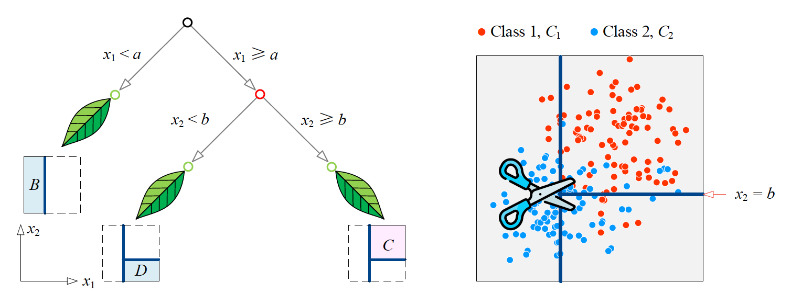
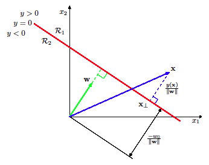
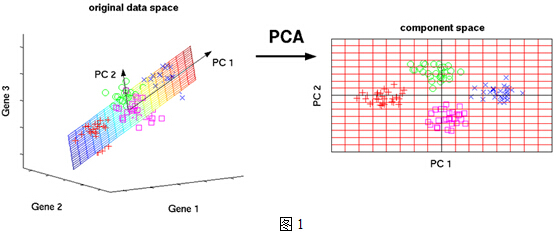

# 机器学习总述

## *机器学习分类*

* 监督学习 Supervised learning
  * KNN
  * 决策树
  * 线性回归
    * 优化角度
    * 概率角度
      * MLE
      * MAP
      * Full Bayersian Analysis
  * 线性分类
    
    * 按照软分类和硬分类分
    * 硬分类：输出标签
      * 线性判别分析/Fisher判别
      * 感知机
      * SVM
    * 软分类：输出概率
      * 连续：GDA 高斯判别分析
      * 离散
        * Naive Bayes：假设各Feautures条件独立，MAP
        * Gaussian Naive Bayes：假设各Feautures条件独立，且条件概率服从高斯分布，MAP
    
      * Logistic Regression：将输出值映射成概率空间，输出一个概率（可能性）
    
    * 按照判别式和生成式分
    
      * 判别式
        * 感知机
        * SVM
        * 逻辑回归
      * 生成式
        * 线性判别分析/Fisher判别
        * 高斯判别分析（特例朴素贝叶斯）
  * SVM
    * 线形可分：硬间隔
    * 线形不可分：软间隔+核技巧升维
    * 支撑向量回归 SVR
  * DL
* 无监督学习 Unsupervised learning
  * 降维
  * 聚类
    * K均值聚类
    * 层次聚类
    * 谱聚类
  * GMM与EM算法
* 半监督学习 Semi-supervised learning
* 强化学习 Reinforcement learning

## *频率派 VS 贝叶斯派*

### 频率派的观点

$p(x|\theta)$中的 $\theta$ 是一个常量。对于 $N$ 个观测来说观测集的概率为 $p(X|\theta)\mathop{=}\limits _{iid}\prod\limits _{i=1}^{N}p(x_{i}|\theta))$ 。为了求 $\theta$ 的大小，我们采用最大对数似然 MLE的方法
$$
\theta_{MLE}=\mathop{argmax}\limits _{\theta}\log p(X|\theta)\mathop{=}\limits _{iid}\mathop{argmax}\limits _{\theta}\sum\limits _{i=1}^{N}\log p(x_{i}|\theta)
$$
在过程中需要求令似然函数达到最大值的参数 $\theta$，这需要考虑函数的凸性质，因此本质上变成了一个优化问题。频率派发展出了一系列的统计机器学习方法

### 贝叶斯派的观点

贝叶斯派认为 $p(x|\theta)$ 中的 $\theta$ 不是一个常量。这个 $\theta$ 满足一个预设的先验的分布 $\theta\sim p(\theta)$ 。于是根据贝叶斯定理依赖观测集参数的后验可以写成下式。在此基础上有最大后验估计 MAP、完全贝叶斯分析等方法
$$
p(\theta|X)=\frac{p(X|\theta)\cdot p(\theta)}{p(X)}=\frac{p(X|\theta)\cdot p(\theta)}{\int\limits _{\theta}p(X|\theta)\cdot p(\theta)d\theta}
$$
贝叶斯的算法最后都会变成积分的问题，因为高维随机变量和随机过程的积分会非常难以求解，在此基础上出现了概率图、MCMC 等贝叶斯派机器学习方法

## *机器学习里的重要标准*

### 分类的衡量标准

* Accuracy
* Precision
* Sensitivity/Recall
* Specificity
* False Negative Rate
* False Positive Rate
* F1 Score

## *衡量距离*

这部分看 Linear Algebra 的范数与距离部分

# KNN

## *KNN分类过程*

### 使用iris数据集

* Classes

  * Setosa
  * Versicolor
  * Virginica

* Features

  * Sepal length
  * Sepal width
  * Petal length
  * Petal width

* 成对特征散点图

  

### 算法流程

1. Calculation of Euclidean Distance 计算样本数据 $X$ 任意一点 $\boldsymbol{x}$ 和查询点 $\boldsymbol{q}$​ 距离：KNN距离的衡量是非常多样的，可以使用欧式距离、曼哈顿距离、切比雪夫距离、马氏距离等等
2. get k nearest neighbor's labels 找 $X$ 中距离查询点 $\boldsymbol{q}$ 最近的k近邻
3. get the majority label 根据k近邻的已知标签，进行投票或者加权投票，k近邻中出现做多的标签就是分类结果

### 优化目标

* 普通投票

$$
p(y=c|\boldsymbol{x},\boldsymbol{k})=\frac{1}{k}\sum\limits_{i\in\mathcal{N}_k(\boldsymbol{x})}{\mathbb{I}(y_i=c)},\ \mathbb{I}(e)=\left\{\begin{array}{l}1\ if\ e\ is\ true\\0\ if\ e\ is\ false\end{array}\right.\\\hat{y}=\underset{c}{\arg\max\ }p(y=c|\boldsymbol{x},\boldsymbol{k})
$$

* 距离权重投票：距离越近的邻居对做出预测越重要
  $$
  p(y=c|\boldsymbol{x},\boldsymbol{k})=\frac{1}{Z}\sum\limits_{i\in\mathcal{N}_k(\boldsymbol{x})}{\frac{1}{d(\boldsymbol{x},x_i)+\varepsilon}\mathbb{I}(y_i=c)},\ \mathbb{I}(e)=\left\{\begin{array}{l}1\ if\ e\ is\ true\\0\ if\ e\ is\ false\end{array}\right.\\\hat{y}=\underset{c}{\arg\max\ }p(y=c|\boldsymbol{x},\boldsymbol{k})
  $$

  * $Z=\sum\limits_{i\in\mathcal{N}_k(\boldsymbol{x})}{\frac{1}{d(\boldsymbol{x},x_i)+\varepsilon}}$ is normalization constant
  * $\varepsilon$ 是用来防止分母为0的极小数

## *近邻数量k影响投票结果*

KNN的核心在于通过学习选取一个在当前数据集中表现最佳的K

### 决策边界 Decision Boundary 和模型分类

* 若决策边界是二维直线、三位平面或者高维超平面 Hyperplane，那么这个分类问题是线形的，分类是线形可分的 Linearly separable ；否则分类问题为非线形 Non-linearly separable
* 若决策边界可以通过简单或者解析函数来描述，这类模型称为参数模型 Parametric model；否则如KNN这类学习算法得到的决策边界为非参数模型 Non-parametric model

### 不同的K对决策边界影响

* 较小的K值虽然能够准确捕捉寻找数据的分类模式，但很容易受到噪声影响
* K逐步增大时，局部噪音样本对边界的影响逐渐减小，边界形状渐趋平滑
* 较大的K会抑制噪声的影响，但也会时得分类界限不明显。极端情况下取 $K=N$ 时，若采取普通投票，则预测结果将会永远等于数据集中的最大类别

## *交叉验证 Cross-Validation*

如何挑选超参数 Hyperparameter 近邻个数 K？采用交叉验证的数据集分割方式

### K折交叉验证 K-fold Cross-Validation

* 将数据集分为训练集 Training set、验证集 Validation set 和。测试集 Test set
* 测试集不动，训练集和验证集随机拆成K份（K-fold），从中挑一份作为一次训练的验证集，其余作为训练集，重复训练K
* 用 test set 来最终报告模型的效果

### 极端情况：留1法交叉验证 LOOCV -- Leave One Out Cross-Validation

每次只留一个样本作为验证集。若有N个样本，会变成N折交叉验证

当总的样本量不大的时候可以考虑使用LOOCV；若数据量很大那么运算量将非常大，因为要重复训练N次

## *KNN的问题*

###  Scaling Issues

* 因为数轴不一致或者采用了不合适的区间会导致决策边界直上直下，看起来像是一条一条直线，该图称为 Voronoi tesselation

  

* 改进

  * Data Standardization/Feature Scaling 特征归一化
  * Use the Mahalanobis distance 考虑数据亲疏关系


### The Curse of Dimensionality 维度灾难

* 高维时数据非常分散，绝大部分空间都是空的，此时的数据距离非常遥远
* 数据量需要随着 Feature 数呈几何倍数增长
* 改进：降低数据空间维度

### Memory Expensive

* 需要存入所有数据，空间复杂度 ***O(N)***
* 改进：用树型搜索结构（kd树）来存储所有的样本数据

# 决策树 Decision Tree

## *Introduction*

### 结构



* Node: Feature test, which leads to decision boundary。决策树的每一次决策划分都是针对一个feature的，因此最后的决策边界要么是横的要么是竖的，不存在斜的决策边界：Decision trees partition the input space into **cuboid regions**

* Branch: different outcome of the preceding feature test

* Leaf: region in the input space and the distribution of samples in that region


### Inference on DT

* 通过决策 Node 确定要判断的数据 $\boldsymbol{x}$ 所在的决策区域 $\mathcal{R}$，并且可以得到该区域的所有数据类别 $C=\left\{c_1,\dots,c_k\right\}$ 的 catogrical 分布
  $$
  \boldsymbol{n}_{\mathcal{R}}=\left(n_{c_1,\mathcal{R}},n_{c_2,\mathcal{R}},\dots,n_{c_k,\mathcal{R}}\right)
  $$

* 数据 $\boldsymbol{x}$ 属于该区域内 catogrical prob 最大的类别
  $$
  p(y=c|\mathcal{R})=\frac{n_{c,\mathcal{R}}}{\sum\limits_{c_i\in C}{n_{c_i,\mathcal{R}}}}\\\hat{y}=\mathop{argmax\ }\limits_{c}{p(y=c|\boldsymbol{x})}=\mathop{argmax\ }\limits_{c}{n_{c,\mathcal{R}}}
  $$

### Optimal DT

Naïve idea：穷尽所有的决策边界来找到最好的决策树

寻找 Optimal DT 是一个 NP-hard 问题，必须要借助一些 heuristic 的 impurity measures

## *Impurity measures*

### 要满足的条件

* To maximieze if classes are equally distributed in the node, i.e. highest impurity
* To minimize to 0 when the node is pure
* Be symmetric, i.e. covariant to label classes. E.g. 对于一个20个蓝球和3个红球或20个红球和3个蓝球的两种分类情况，得到的结果应该是一样的，即不关心标签

### 具体标准

* Heuristic: misclassification rate 误分类率
  * $i_E(t)=1-\max\limits_{c}{\pi_c}$，其中 $\pi_c=p(y=c|t)$，即 $c$ 类数据所在的比例，是一种categorical概率
  * 目标：以分两类L和R为例，$\max{\Delta i(s,t)}=i(t)-p_L\cdot i(t_L)-p_R\cdot i(t_R)$，其中 $i(t)$ 是分类前最大类的误分类率，$p_L,\ i(t_L)$ 分别是L类占原来的大小以及L类中最大类在分类后的误分类率
  * 由于misclassification rate的线性，会产生一些问题
    * No split performed even though combining the two tests would result in perfect classification
    * No sensitivity to changes in class probability
  
* Entropy
  $$
  \min{i_H(t)}=-\sum\limits_{c_i\in C}{\pi_{c_i}\log_2{\pi_{c_i}}}
  $$
  
  * 类似于在计算信息熵，在划分后熵越小，信息越确定，纯度越高
  
* Gini Index
  $$
  \min{i_G(t)}=\sum_{c_i\in C}{\pi_{c_i}\cdot(1-\pi_{c_i})}=1-\sum_{c_i\in C}{\pi_{c_i}^2}
  $$
  
  * 指数越大，分类效果越好
  * 相比于 Entropy 一个小优势是不需要计算log，效率会高一些
  
* ID3算法 Gain 信息增益：量化划分前后信息熵的变化，考虑划分后的权重
  $$
  Gain(D,a)=\underbrace{i_{H}(t-1)}_{Entropy\ before\ split}-\underbrace{i_H(t|a)}_{Entropy\ after\ split}
  $$

Entropy 和 Gini Index 相比于误分类率的优势在于它们的非线性，即他们相比于Impurity会更倾向于Purity


## *剪枝 Pruning*

过于复杂的树形会导致过拟合，模型泛化能力变弱，这种情况需要控制节点数量或者最大深度来控制树形规模 ，从而降低过拟合可能性

### 预剪枝 Pre-pruning

在决策树生长过程中，对每个节点在划分前先进行估计，若当前结点的划分不能带来决策树泛化性能提升，则停止划分并将当前结点标记为叶结点


上图中 $T$ 是决策树，$t$ 是内节点，将 $T\backslash T_t$ 表示为剪枝后的决策树

### 后剪枝 Post-pruning

先从训练集生成一棵完整的决策树，然后自底向上地对非叶结点进行考察，若将该结点对应的子树替换为叶结点能带来决策树泛化性能提升，则将该子树替换为叶结点

## *算法实现*

* ID3：ID3 是最早提出的决策树算法，它利用信息增益（熵变化）来选择特征
* C4.5：ID3 的改进版，不直接使用信息增益，而是引入“信息增益比”指标作为特征的选择依据
* CART：使用Gini系数来选择划分属性。既可以用于分类，也可以用于回归问题

## *Ensembles 集成学习*

### 集成学习思想

集成学习思想：通过结合不同的算法模型来improve performance

Main benefit: Reduces the variance of the model by averaging

<https://easyaitech.medium.com/一文看懂集成学习-详解-bagging-boosting-以及他们的-4-点区别-6e3c72df05b8>

* Bagging (Bootstrap Aggregating)：民主投票
* Boosting：给精英更高的投票权
* Stacking

### Bagging + DT：随机森林

<https://easyai.tech/ai-definition/random-forest/> 

如名字所暗示的那样，随机森林是由很多决策树构成的，不同决策树之间没有关联

当做分类任务时，每当新的输入样本进入就让森林中的每一棵决策树分别进行判断和分类。每个决策树会得到一个自己的分类结果，决策树的分类结果中哪一个分类最多，那么随机森林就会把这个结果当做最终的结果

### Boosting: AdaBoost and XGBoost

# 概率推断 Probabilistic Inference

对于高维的随机变量和随机过程而言，条件概率等的计算会变得极为复杂，此时不太可能对其使用MLE、MAP等概率推导方法。此时需要使用概率图模型来表达高维随机变量之间的关系，并在此基础上使用变分推导、MCMC等方法。此部分见BayersianML

统计机器学习中介绍三种概率推断方法：点估计 -- MAE和MAP，区间估计 -- Full Bayersian Analysis

## *最大似然估计 MLE（具体看概率论）*

### 掷硬币实验和假设

* 掷硬币实验服从 Bernoulli 分布：$F_i\sim Ber(\theta_i)$，已知前10次有3次Tail，7次Head，求第11次为Tail的概率
* 假设：掷硬币服从独立同分布 i.i.d

### MLE过程

* 写出第11次的概率公式：$\prod\limits_{i=1}^{10}{p(F_i=f_i|\theta)=\theta^3(1-\theta)^7}$
* $\theta_{MLE}=\underset{\theta\in[0,1]}{\arg\max\ }{f(\theta)}$，要求出 $f(\theta)$ 的最大值就要对上式求导后看是否有零点
* 直接对上式求导比较麻烦，因为单调函数log会保存原函数的单调性，因此转换为log后进行求导
* $\frac{d}{d\theta}f(\theta)=\frac{d}{d\theta}\left(\log{\left(\theta^3(1-\theta)^7\right)}\right)=\frac{d}{d\theta}\left(\log{\theta^3}+\log{(1-\theta)^7}\right)=\frac{d}{d\theta}\left(3\log{\theta}+7\log{1-\theta}\right)=\frac{3}{\theta}-\frac{7}{1-\theta}=\frac{3-10\theta}{\theta(1-\theta)}=0\rightarrow\theta=0.3$
* MLE对任意的掷硬币序列：$\theta_{MLE}=\frac{\vert T\vert}{\vert T\vert+\vert H\vert}$，$\vert T\vert, \vert H\vert$ 分别代表了Tail和Head的出现次数

## *最大后验估计 Maximum a posteriori estimation*

MLE存在一些问题，比如当掷硬币2次全是Tail的时候，第3次出现Head的MLE概率将会是0。但一般来说掷硬币的概率是五五开的，前两次出现TT的概率是25%。这就意味着，当我们只有有限的样本时，用MLE容易出现过拟合

出现这种情况的原因是我们并没有将我们对掷硬币五五开的经验考虑进去。此时考虑贝叶斯概率

MAE是建立在MLE的基础上的，从公式里就可以看到，MAE需要用到MLE得到的似然函数。同时MAE可以看做是对MLE过拟合的岭回归正则化，该证明可以从Linear Regression的频率角度得到，参考下方Linear Regression部分

### Bayesian inference

* gBayes Formula updates prior beliefs to posterior beliefs about $\theta$ after observing the data $\mathcal{D}$
  $$
  p(\theta|\mathcal{D})=\frac{p(\mathcal{D}|\theta)\cdot p(\theta)}{p(\mathcal{D})})
  $$

* $p(\mathcal{D})$ 的问题
  * $p(\mathcal{D})$ is the evidence, it acts as a normalizing constant that ensures that the posterior integrates to 1，相当于是对样本空间进行了放缩。计算 $p(\mathcal{D})$的方式是运用全概率公式和乘法公式
    $$
    p(\mathcal{D})=\int{p(\mathcal{D},\theta)d\theta}=\int{p(\mathcal{D}|\theta)p(\theta)d\theta}
    $$
  
  * 因为 $p(\mathcal{D})$ 是一个常数，因此 $posterior\propto likelihood\cdot prior$
  
* 若此时先验一直是0或者一直是一个常数，那么再多的数据都无法更新它，因此不要完全确定某件事情

### MAE过程

* MLE实际上做的是 $\theta_{MLE}=\underset{\theta}{\arg\max\ }{p(\mathcal{D|\theta})}$，即找到令出现 $\mathcal{D}$ 的可能性最大化的参数 $\theta$，但对于MAE，要做的是 $\theta_{MAE}=\underset{\theta}{\arg\max\ }{p(\theta|\mathcal{D})}$。MAE得到的是后验分布PDF的最大值点，即众数 Mode

* 对先验做出假设的方式：采用 **Conjugate Prior 共轭先验**以降低 $p(\mathcal{D})$ 积分难度。**共轭先验指的是若将先验假设为Likelihood的共轭先验，则得到的posterior也将服从和先验一样的分布**。对服从Bernoulli分布的掷硬币实验我们设其先验为Beta分布：$p(\theta)=\frac{\Gamma(a+b)}{\Gamma(a)\Gamma(b)}\theta^{a-1}(1-\theta)^{b-1},\ \theta\in[0,1]$，其中 $\Gamma$ 为Gamma分布
  * 常用的共轭先验：<https://zhuanlan.zhihu.com/p/337615279>
  * Beta分布与Bernoulli分布/二项分布
  * 指数分布与Gamma分布
  * 正态分布与正态分布
  
* 代入MAE表达式
  $$
  p(\theta|\mathcal{D})\propto p(\mathcal{D}|\theta)\cdot p(\theta)=\theta^{\vert T\vert}(1-\theta)^{\vert H\vert}\cdot\underbrace{\frac{\Gamma(a+b)}{\Gamma(a)\Gamma(b)}}_{const}\theta^{a-1}(1-\theta)^{b-1}\\\propto\theta^{\vert T\vert}(1-\theta)^{\vert H\vert}\cdot\theta^{a-1}(1-\theta)^{b-1}=\theta^{\vert T\vert+a-1}(1-\theta)^{\vert H\vert+b-1}
  $$

* 和MLE一样，对表达式取log后求导
  $$
  \frac{d}{d\theta}\log{\left(\theta^{\vert T\vert+a-1}+(1-\theta)^{\vert H\vert+b-1}\right)}=\frac{\vert T\vert+a-1}{\theta}-\frac{\vert H\vert+b-1}{1-\theta}=0\longrightarrow\theta_{MAE}=\frac{\vert T\vert+a-1}{\vert H\vert+\vert T\vert+a+b-2}
  $$

## *贝叶斯分析 Bayersian Analysis*

* 若要计算 $\theta$ 的贝叶斯可信区间 Credible Interval 等问题时，我们需要考虑 $p(\mathcal{D})$，此时做的是贝叶斯分析

* 对 $p(\mathcal{D})$ 做积分计算以求出比例常数
  $$
  p(\mathcal{D})=\int{p(\mathcal{D},\theta)d\theta}=\int{p(\mathcal{D}|\theta)p(\theta)d\theta}=\int_0^1{\textbf{C}\cdot\theta^{\vert T\vert+a-1}(1-\theta)^{\vert H\vert+b-1}}\longrightarrow\textbf{C}
  $$
  
  * Brute-force calculaiton：很麻烦
  * Pattern matching：因为对先验的假设为共轭先验，因此 unnormalized posterior 服从Beta分布，即 $p(\theta|\mathcal{D})\sim Beta(\theta,\ a+\vert T\vert,\ b+\vert H\vert)$，所以 $\textbf{C}=\frac{\Gamma(\vert T\vert+a+\vert H\vert+b)}{\Gamma(\vert T\vert+a)\cdot\Gamma(\vert H\vert+b)}$

## *后验预测分布 Posterior predictive distribution*

* MAE和贝叶斯分析的对象都是参数 $\theta$，即 $p(\theta|\mathcal{D},a,b)$，而当我们想预测下一次掷硬币的概率时的概率的时候应该做 $p(F_{new}|\mathcal{D},a,b)$，其中 $F_{new}=f\in\left\{0,1\right\}$

* 利用全概率公式和乘法律改将后验预测分布改写为似然函数和后验分布的乘积：$p(f|\mathcal{D},a,b)=\int_0^1{p(f,\theta|\mathcal{D},a,b)d\theta}=\int_0^1{p(f|\theta,\mathcal{D},a,b)p(\theta|\mathcal{D},a,b)d\theta}=\int_0^1{p(f|\theta)p(\theta|\mathcal{D},a,b)d\theta}$
* $p(f|\mathcal{D},a,b)\sim Ber(f|\frac{\vert T\vert+a}{\vert T\vert+a+\vert H\vert+b)}$

## *指数族*

# 线性回归 Linear Regression

## *Basic Linear Regression -- Optimization-based*

### 回归任务 -- 监督学习

* Given oberseved Data $\mathcal{D}=\left\{(x_i,y_i)\right\}^N_{i=1}$
  * Observations: $\boldsymbol{X}=\left\{\boldsymbol{x_1},\boldsymbol{x_2},\dots,\boldsymbol{x_N}\right\},\ \boldsymbol{x_i}\in\mathbb{R}^D$，每个sample有D个Feature，总共N个sample
  * Targets/Label: $\boldsymbol{y}=\left\{y_1,y_2,\dots,y_N\right\},\ y_i\in\mathbb{R}$
  
* Goal: Find mapping $f(\cdot)$ from inputs to targets $y_i\approx f(x_i)$

* Linear model
  * Target $y$ is generated by a deterministic function $f$ of $x$ plus random noise: $y_i=f(\boldsymbol{x_i})+\varepsilon_i,\ \varepsilon\sim\mathcal{N}(0,\beta^{-1})$，用 $\beta^{-1}$ 来代替 $\sigma^2$ 是为了最后得到的结果比较好表示，即正态分布写作
    $$
    p(x)=\sqrt{\frac{\beta}{2\pi}}\exp{\left[-\frac{\beta}{2}\left(y_i-\phi(\boldsymbol x_i)\right)^2\right]}=\sqrt{\frac{\beta}{2\pi}}\exp{\left[-\frac{\beta}{2}\left(\phi(\boldsymbol x_i)-y_i\right)^2\right]},\ -\infty
    $$
  
  * 相当于是结果 $y_i$ 的几率因为有噪音呈现正态分布变化，$\phi(\boldsymbol{x}_i)=\mu_i$。为了和之前优化方法中最小二乘保持一致，将正态分布写作 $\sqrt{\frac{\beta}{2\pi}}\exp{\left[-\frac{\beta}{2}\left(\phi(\boldsymbol x_i)-y_i\right)^2\right]}$
  
  * 选择一个线性方程作为 $f(\boldsymbol{x})$：$f_w(\boldsymbol{x}_i)=w_0+w_1x_{i1}+w_2x_{i2}+\dots+w_Dx_{iD}=w_0+\boldsymbol{w}^T\boldsymbol{x}_i$
  
  * 为了方便矩阵运算，将 bias $w_0$ 一块放进 $\boldsymbol{w}$，令 $\boldsymbol{x}$ 的第一个数据为1，即 $\tilde{\boldsymbol{x}}=(1,x_1\dots,x_D)^T\in\mathbb{R}^{D+1},\ \tilde{\boldsymbol{w}}=(w_0,w_1,\dots,w_D)^T\in\mathbb{R}^{D+1}$，后文中默认 $\boldsymbol{x}=\boldsymbol{\tilde{x}}, \boldsymbol{w}=\boldsymbol{\tilde{w}}$

### Loss Function and Solution

* Loss function: standard choice -- Least Squares $E_{LS}(\boldsymbol{w})=\frac{1}{2}\sum\limits_{i=1}^{N}{\left(f_{\boldsymbol{w}}(\boldsymbol{x_i})-y_i\right)^2}=\frac{1}{2}\sum\limits_{i=1}^{N}{\left(\boldsymbol{w}^T\boldsymbol{x_i}-y_i\right)^2}$，前面的 $\frac{1}{2}$ 是为了之后计算方便，对结果没有影响

* 目标：$\boldsymbol{w}^*=\underset{\boldsymbol{w}}{\arg\min\ }{E_{LS}(\boldsymbol{w})}=\underset{\boldsymbol{w}}{\arg\min\ }{\frac{1}{2}\sum\limits_{i=1}^{N}{(\boldsymbol{w}^Tx_i-y_i)^2}}=\underset{\boldsymbol{w}}{\arg\min\ }{\frac{1}{2}(\boldsymbol{X}_{N\times D}\boldsymbol{w}_{D\times 1}-\boldsymbol{y}_{D\times 1})^T(\boldsymbol{X}\boldsymbol{w}-\boldsymbol{y})}$，注意⚠️：这里的 $\boldsymbol{X}$ 是用 $\boldsymbol{x}_i$ 转置得到的行向量叠加起来的，因此整体的 $\boldsymbol{X}$ 矩阵没有转置 

* Optimal Solution
  * 对优化方程求梯度
    $$
    \nabla_{\boldsymbol{w}}E_{LS}(\boldsymbol{w})=\nabla_{\boldsymbol{w}}\frac{1}{2}(\boldsymbol{X}\boldsymbol{w}-\boldsymbol{y})^T(\boldsymbol{X}\boldsymbol{w}-\boldsymbol{y})=\nabla_{\boldsymbol{w}}\frac{1}{2}\left(w^T\boldsymbol{X}^T\boldsymbol{X}w-\underbrace{y^T_{1\times N}X_{N\times D}\boldsymbol{w}_{D\times 1}}_{Scalar}-\underbrace{\boldsymbol{w}_{1\times D}^T\boldsymbol{X}_{D\times N}^Ty_{N\times 1}}_{Scalar}+y^Ty\right)\\=\nabla_{\boldsymbol{w}}\frac{1}{2}\left(\boldsymbol{w}^T\boldsymbol{X}^T\boldsymbol{X}\boldsymbol{w}-2\boldsymbol{w}^T\boldsymbol{X}^Ty+y^Ty\right)=\boldsymbol{X}^T\boldsymbol{X}w-\boldsymbol{X}^Ty
    $$
  
  * 解是正规方程：$\boldsymbol{w}^*=\underbrace{(\boldsymbol{X}^T\boldsymbol{X})^{-1}\boldsymbol{X}^T}_{\boldsymbol{X}^{\dagger}}\boldsymbol{y}$

### 从投影角度来看线性回归（Power of Matrix Ch.08）

## *Nonlinear Dependency in Data*

### 引入多项式

当 $y$ 和 $x$ 之间不是线性关系时，引入非线性的多项式关系来进行回归

* 将 $f_{\boldsymbol{w}}(x)$ 改写为多项式表达：$f_{\boldsymbol{w}}(x)=w_0+\sum\limits_{j=1}^{M}{w_jx^j}$，其中 M 是多项式的阶数
* 或者更通用的使用其他的非线性基函数：$f_{\boldsymbol{w}}(x)=w_0+\sum\limits_{j=1}^{M}{w_j\phi_j(x)}$，定义 $\phi_0=1$，和线性模型一样将 bias 放入 $\phi_j$，因此有 $f_w(x)=\boldsymbol{w}^T\phi(x)$，注意：**$f$ 仍然是对 $w$ 呈线性的，尽管对 $x$ 为非线性**，因为对feature space $x$ 进行了非线形变换

### 常用的 Basis functions

* Polynomials: $\phi_j(x)=x^j$
* Gaussian: $\phi_j(x)=\exp{\frac{-(x-\mu_j)^2}{2s^2}}$
* Logistic Sigmoid: $\phi_j(x)=\sigma\left(\frac{x-\mu_j}{s}\right)$, where sigmoid function $\sigma(a)=\frac{1}{1+e^{-a}}$

### 非线性解

* $E_{LS}(\boldsymbol{w})=\frac{1}{2}\sum\limits_{i=1}^{N}{\left(\boldsymbol{w}^T\phi(x_i)-y_i\right)^2}=\frac{1}{2}(\boldsymbol{\Phi}\boldsymbol{w}-\boldsymbol{y})^T(\boldsymbol{\Phi}\boldsymbol{w}-\boldsymbol{y})$, with the design matrix of $\phi$。因为回归函数对于 $\boldsymbol{w}$ 仍然是线形的，所以求参数的时候仍然可以用正规方程
  $$
  \boldsymbol{\Phi}=\left[\begin{matrix}\phi_0(x_1)&\phi_1(x_1)&\cdots&\phi_M(x_1)\\\phi_0(x_2)&\phi_1(x_2)&&\vdots\\\vdots&\vdots&\ddots\\\phi_0(x_N)&\phi_1(x_N)&\cdots&\phi_M(x_N)\end{matrix}\right]\in\mathbb{R}^{N\times(M+1)}
  $$

* $\boldsymbol{w^*}=(\boldsymbol{\Phi^T\Phi})^{-1}\boldsymbol{\Phi}^T\boldsymbol{y}=\boldsymbol{\Phi}^{\dagger}\boldsymbol{y}$

Design matrix中的维度 $M$ 是指对数据 $x$ 的每个feature都可以进行非线性变换，所以最多可以有 $M+1$ 个 basis function（bias absorbed）。当然也可以理解为线形参数 $w$ 的维度（也就是feature的维度），$N$ 依然是数据的个数

比如这样一个非线形的回归问题，它的参数是 $\boldsymbol{w}=\left[\begin{matrix}a&b&c\end{matrix}\right]^T$
$$
f\left(\boldsymbol{\boldsymbol{x},\boldsymbol{w}}\right)=a\sin{(\boldsymbol{x}^{(2)})}+\frac{1}{2}b\lVert\boldsymbol{x}\rVert_1+\left(\boldsymbol{x}^{(1)}\right)^2\boldsymbol{x}^{(2)}c
$$

### 如何选择多项式阶数

* 做实验，比较 train dataset 和 validation dataset 的误差走向
* 采用正则化后再做实验，利用正则项的 tradeoff 来控制

### Bias-variance tradeoff 偏差-方差权衡


## *正则化 Regularizaiton*

### L2 Ridge 岭回归

$$
E_{ridge}(\boldsymbol{x})=\frac{1}{2}\sum\limits_{i=1}^N{\left[\boldsymbol{w}^T\phi(\boldsymbol{x_i})-y_i\right]^2}+\frac{\lambda}{2}\Vert\boldsymbol{w}\Vert^2_2=\frac{1}{2}(\Phi\boldsymbol{w}-\boldsymbol{y})^T(\Phi\boldsymbol{w}-\boldsymbol{y})+\frac{\lambda}{2}\Vert\boldsymbol{w}\Vert^2_2
$$


* $\Vert\boldsymbol{w}\Vert^2_2=\boldsymbol{w}^T\boldsymbol{w}=w_0^2+w_1^2+\cdots+w_M^2$ is the squared L2 norm of $w$
* $\lambda$ - regularization strength 
* 岭回归在概率的角度看就是令 $\boldsymbol{w}$ 的先验服从正态分布的MAP，推导看下一节。从而考虑了数据的分布信息

### L1 Lasso 套索回归


L1正则化可以引起稀疏解。稀疏解是比较好的，因为比较容易去理解稀疏解表示的实际意义，并降低内存消耗

从最小化损失的角度看，由于L1项求导在0附近的左右导数都不是0，因此更容易取到0解

LASSO从概率角度看是令 $\boldsymbol{w}$ 的先验服从拉普拉斯分布的MAP

### 弹性网络回归 Elastic net regression


以不同比例同时引入 $L^1$ 和 $L^2$ 正则。正则化曲面是 $L^1$ 和 $L^2$ 范数曲面按不同比例叠加的

## *Probabilistic Linear Regression*

回归任务中给出了带噪音的线性模型 $y_i=f(x_i)+\varepsilon_i,\ \varepsilon\sim\mathcal{N}(0,\beta^{-1})$，在前面的模型中我们并没有充分利用噪声的统计特性，而是直接计算了Loss来进行优化。这节中我们直接利用噪声等统计性质直接进行概率推断来估计权重。通过概率推断来做回归任务可以在完成回归的基础上得到值的概率分布，即有多大概率回归值是正确的 

### 噪声为高斯分布的MLE推断 $\boldsymbol{w}$ 等价于最小二乘误差

根据高斯分布的性质，$y_i$ 进行平移后也同样服从高斯分布，$y_i=f_{\boldsymbol{w}}(\boldsymbol{x}_i)+\varepsilon_i,\ \varepsilon\sim\mathcal{N}(0,\beta^{-1})\longrightarrow y_i\sim\mathcal{N\left(f_{\boldsymbol{w}}(\boldsymbol{x_i}),\beta^{-1}\right)}$

因此有 Likelihood of a single sample：$p(y_i|f_w(x_i),\beta)=\mathcal{N}(y_i|f_w(x_i),\beta^{-1})$

假设每一个样本之间互相独立，可以得到整个 Dataset $\mathcal{D}=\left\{X,\boldsymbol{y}\right\}$ 的概率分布：$p(\boldsymbol{y}|X,\boldsymbol{w},\beta)=\prod\limits_{i=1}^{N}{p(y_i|f_w(x_i),\beta)}$

MLE过程：

$$
E_{MLE}(\boldsymbol{w},\beta)=\boldsymbol{w}^*_{MLE},\beta^*_{MLE}=\underset{w,\beta}{\arg\max\ }{p(\boldsymbol{y}|X,\boldsymbol{w},\beta)}=\xrightarrow{log-likelihood}\underset{w,\beta}{\arg\min\ }{-\ln{p(\boldsymbol{y}|X,\boldsymbol{w},\beta)}}\\=-\ln{\left[\prod\limits_{i=1}^{N}{\sqrt{\frac{\beta}{2\pi}}\exp{\left(-\frac{\beta}{2}\left(\boldsymbol{w}^T\phi(\boldsymbol{x_i})-y_i\right)^2\right)}}\right]}=\frac{\beta}{2}\sum\limits_{i=1}^{N}{\left(\boldsymbol{w}^T\phi(\boldsymbol{x_i})-y_i\right)^2}-\frac{N}{2}\ln{\beta}+\frac{N}{2}\ln{2\pi}\\\boldsymbol{w}_{MLE}=\underset{w}{\arg\min\ }{E_{MLE}(w,\beta)}=\underset{w}{\arg\min\ }{\left[\frac{{\beta}}{2}\underbrace{\sum\limits_{i=1}^{N}{\left(\boldsymbol{w}^T\phi(\boldsymbol{x_i})-y_i\right)^2}}_{least\ square\ error}\underbrace{-\frac{N}{2}\ln{\beta}+\frac{N}{2}\ln{2\pi}}_{const}\right]}\longrightarrow\boldsymbol{w}_{MLE}=(\boldsymbol{\Phi^T\Phi})^{-1}\boldsymbol{\Phi}^T\boldsymbol{y}=\boldsymbol{\Phi}^{\dagger}\boldsymbol{y}
$$

* 从上式可以看出MAE和最小化最小二乘误差的效果是等价的，且 $\beta$ 的取值对于 $\boldsymbol{w}_{MLE}$ 的计算没有影响
* 同理可将 $\boldsymbol{w}_{MLE}$ 代入 $E_{MLE}$ 计算得到 $\frac{1}{\beta_{MLE}}=\frac{1}{N}\sum\limits_{i=1}^{N}{\left(\boldsymbol{w}^T_{MLE}\phi(x_i)-y_i\right)^2}$，具体计算过程见ML的PPT

### Weight先验也为高斯分布的MAP推断 $\boldsymbol{w}$ 等价于岭回归正则化

* 设 Weight Prior $p(\boldsymbol{w}|\alpha)=\mathcal{N}(\boldsymbol{w}|0,\alpha^{-1}\boldsymbol{I})=\left(\frac{\alpha}{2\pi}\right)^{\frac{M}{2}}\exp{-\frac{\alpha}{2}\boldsymbol{w}^T\boldsymbol{w}}$
  * Likelihood is also Gaussian, according to conjugate prior that posterior will also be Gaussian
  * 假设均值为0，防止过拟合
  
* 根据贝叶斯公式
  $$
  \boldsymbol{w}^*_{MAP}=\underset{\boldsymbol{w}}{\arg\max\ }{\ln{p(\boldsymbol{w}|\boldsymbol{X},\boldsymbol{y},\alpha,\beta)}}=\underset{\boldsymbol{w}}{\arg\max\ }{\ln{p(\boldsymbol{y}|\boldsymbol{X},\boldsymbol{w},\beta)}+\ln{p(\boldsymbol{w}|\alpha)}-\underbrace{\ln{p(\boldsymbol{y}|\boldsymbol{X},\beta,\alpha})}_{与\boldsymbol{w}无关}}
  $$

* $E_{MAP}\propto\underbrace{\frac{1}{2}\sum\limits^N{\left[\boldsymbol{w}^T\phi(x_i)-y_i\right]^2}+\frac{\lambda}{2}\Vert\boldsymbol{w}\Vert^2_2}_{ridge\ regression\ error}+const=E_{ridge}(\boldsymbol{w})+const$,  where $\lambda=\frac{\alpha}{\beta}$ 得到后对其关于 $\boldsymbol{w}$ 求导，可以发现这和最小二乘误差的岭回归表达式是一样的，证明MAP实际上就是岭回归正则化来控制过拟合。这是因为MAP考虑了Wieght的先验

若 $\beta$ 也没有给出，此时正态似然函数的共轭先验为 Normal-Gamma 分布 $p(\boldsymbol{w},\beta)=\mathcal{N}(\boldsymbol{w}|\boldsymbol{m_0},\beta^{-1}S_0)\Gamma(\beta|a_0,b_0)$，后验分布为 $p(\boldsymbol{w},\beta|\mathcal{D})=\mathcal{N}(\boldsymbol{w}|\boldsymbol{m_N},\beta^{-1}S_N)\Gamma(\beta|a_N,b_N)$。这部分推导比较复杂，可以参考 TUM ML Exercise04。下文的 $\beta$ 仍默认给出

### Full Bayesian Approach

* posterior $p(\boldsymbol{w}|\mathcal{D})=\mathcal{N}(\boldsymbol{w}|\mu,\Sigma)$, where $\mu=\beta\boldsymbol{\Sigma}\boldsymbol{\Phi}^T\boldsymbol{y},\ \Sigma^{-1}=\alpha\boldsymbol{I}+\beta\boldsymbol{\Phi}^T\boldsymbol{\Phi}$
* 当 $\alpha\rightarrow0$ 时，即先验非常平坦，没有什么特殊的偏好时，$w_{MAP}\rightarrow w_{MLE}$：$\Sigma^{-1}=\beta\mathbf{\Phi}^T\mathbf{\Phi}\Leftrightarrow\Sigma=(\beta\mathbf{\Phi}^T\mathbf{\Phi})^{-1}$，代入 $\mu=\beta(\beta\boldsymbol{\Phi}^T\boldsymbol{\Phi})^{-1}\boldsymbol{\Phi}^T\boldsymbol{y}=(\boldsymbol{\Phi}^T\boldsymbol{\Phi})^{-1}\boldsymbol{\Phi^T\boldsymbol{y}}=\boldsymbol{\Phi}^{\dagger}\boldsymbol{y}=\boldsymbol{w}_{MLE}$
* 若没有观测数据，即 $N=0$，那么后验等于先验

### Predicting for new data

* MLE
* MAP
* Posterior predictive distribution

已经得到了 $\boldsymbol{w}$ 就不再需要观测数据了，相当于此时 $\boldsymbol{y}\perp\mathcal{D}$，概率图模型的条件独立性也可以证明这一点

# 线性分类 Linear Classification

## *硬分类 Hard-decision*

### 回归任务 VS 分类任务

* Regression：输出一个连续的 $y$ 模型来进行预测
* Classification：输出一个label来判断输入的类型

### 分类任务 -- 监督学习

* Given oberseved Data $\mathcal{D}=\left\{(x_i,y_i)\right\}^N_{i=1}$
  * Observations: $\boldsymbol{X}=\left\{x_1,x_2,\dots,x_N\right\},\ x_i\in\mathbb{R}^D$，每个sample有D个Feature，总共N个sample
  * Targets/Label: $\boldsymbol{y}=\left\{y_1,y_2,\dots,y_N\right\},\ y_i\in\mathbb{R}$
  * Set of possible classes: $\mathcal{C}=\left\{1,\dots,C\right\}$
* Goal: Find mapping $f(\cdot):\R^D\rightarrow\mathcal{C}$ that maps observations $x_i$ to class labels $y_i$

### 0-1 损失

分类对就为0，分类错就为1
$$
\ell_{01}(\boldsymbol{y},\boldsymbol{\hat{y}})=\sum\limits_{i=1}^{N}{\mathbb{I}(\hat{y_i}\neq y_i)}
$$

### 用超平面作为决策边界 Hyperplane as decision boundary

对于二分类任务，可以尝试使用hyperplane作为决策边界，如果存在这样的一个决策边界就称这个数据集 $\mathcal{D}=\left\{(x_i,y_i)\right\}^N_{i=1}$ 线形可分 linearly separable

因为权重向量 $\boldsymbol{w}\cdot\boldsymbol{x}=0$，所以 $\boldsymbol{w}$ 就是hyperplane的normal vector 


$$
\boldsymbol{w}^T\boldsymbol{x}+w_0=\left\{\begin{array}{l}=0&if\ \boldsymbol{x}\ on\ the\ plane\\>0&if \ \boldsymbol{x}\ on\ normal's\ side\\<0&else\end{array}\right.
$$

### Perceptron 感知机

如何判断是在在决策边界的那一面呢？也就是说选择哪一个映射关系 Basis function $f(\cdot)$

引入一个两输入的感知机 $y=f(t)=\left\{\begin{array}{l}1&if\ t>0\\0&otherwise\end{array}\right.=\left\{\begin{array}{ll}1&(b+w_1x_1+w_2x_2)>0\\0&(b+w_1x_1+w_2x_2)\leq0\end{array}\right.$ 


其中 $w_1$ 和 $w_2$ 为权重，是控制输入信号的重要性的参数，而偏置 $b$ 是调整神经元被激活的容易程度

### 感知机算法

* 任务设定 

  * 给定一个线形二分类器
    $$
    f(\boldsymbol{x})=\boldsymbol{w}^T\boldsymbol{x}+w_0=\left\{\begin{array}{cl}1&if\ \boldsymbol{w}^T\boldsymbol{x}+w_0>0\\-1&else\end{array}\right.
    $$

  * Given dataset $\mathcal{D}=\left\{(\boldsymbol{x}_1,y_1),\dots,(\boldsymbol{x}_n,y_n)\right\}$ with label $y_i\in\left\{-1,1\right\}$

  * 采用 Hinge Loss 折页损失
    $$
    L(u,v)=\max{\left(0,\epsilon-u\cdot v\right)}=\left\{\begin{array}{ll}\epsilon-uv&if\ uv<\epsilon&\leftarrow incorrect\ prediction\\0&else&\leftarrow correct\ prediction\end{array}\right.
    $$
    之所以要小于一个正数 $\epsilon$，是因为要决策边界在分类正确的基础上还要远离一些，**避免DB和数据点贴的太近**

    其中 $u=y_i$ 是标签 ground truth，$v=w^Tx_i+b$ 是预测 prediction，代入上式，并分别对 $\boldsymbol{w}$ 和 $b$ 取梯度
    $$
    L(u,v)=\max{\left(0,\epsilon-u\cdot v\right)}=\left\{\begin{array}{ll}\epsilon-y_i\left(w^Tx_i+b\right)&if\ y_i\left(w^Tx_i+b\right)<\epsilon\\0&else\end{array}\right.\\\nabla_wL=\left\{\begin{array}{ll}-y_ix_i&if\ y_i\left(w^Tx_i+b\right)<\epsilon\\0&else\end{array}\right.,\ \nabla_bL=\left\{\begin{array}{ll}-y_i&if\ y_i\left(w^Tx_i+b\right)<\epsilon\\0&else\end{array}\right.
    $$

  * Optimization Goal
    $$
    \underset{w,b}{\arg\min}{\ \sum\limits_{i}{L\left(y_i,w^Tx_i+b\right)}}
    $$

* Learning rule SGD

  

  * 开始训练，并不能确定要花多少次迭代才能收敛
  
    可以认为SGD过程就是一个如下不断在调整DB的过程
  
    

* 扩展到多分类

  * one-verus-rest classifier：会产生重叠区域
  * Multiclass discriment $\hat{y}=\underset{c\in\mathcal{C}}{\arg\max\ }f_C(x)$

* 非线性：和线性回归中一样更换Basis function $f(\cdot) $以产生非线形。单层感知机只能表示线性空间，多层感知机可以表示非线形空间，这部分可以参考DeepLearning.md中XOR分类的例子

### Limitations

* 不能衡量不确定性
* 不能处理噪声和离群值
* 泛化能力差
* 很难进行优化
* 不能处理

## *朴素贝叶斯 Naive Bayes*

Solution: model the distribution of the class label $y$ given the data $\boldsymbol{x}$
$$
p(y=c|\boldsymbol{x})=\frac{p(\boldsymbol{x}|y=c)\cdot p(y=c)}{p(\boldsymbol{x})}\Longleftrightarrow p(Class|Features)=\frac{p(Features|Class)p(Class)}{p(Features)}
$$

如何理解贝叶斯公式？一开始给了很多带标签的数据点，然后发现这些数据的特征并不会是完全一样的，但是仍然被归为了一种类型，这相当于就是我们得到的新的Evidence用来更新我们Hypothesis，即具有怎么样特征的数据点会被分为什么种类。先验就自然服从**广义Bernoulli或者说Categorical Distribution**

### 判别式模型 VS 生成式模型

* **生成式 Generativ**：先对数据的联合分布 $p(\boldsymbol{x}|y=c)\cdot p(y=c)=p(x,y=c)$ 进行建模，然后再通过贝叶斯公式计算样本属于各类别的后验概率。说白了就是要对整体数据集有一个印象，生成一个概率模型，然后把数据扔给概率模型进行预测，甚至通过这个模型来“generate”新的数据对
* **判别式 Discriminative**：直接对后验条件概率 $p(y=c|\boldsymbol{x})$ 建模，由数据直接学习决策函数。说白了就是不关心整体数据的分布，直接给一个决策函数让它学习分类权重
* 核心思想都是比较后验概率大小，比如对于二分类问题，当给一个有D个Features的数据 $\boldsymbol{x}$，若 $p(C_1|x)>p(C_2|x)$ 则被分类为第一类，小于则分为第二类，等于时处于决策边界上

### 贝叶斯模型预测过程 & 朴素贝叶斯 Naïve Bayes

朴素贝叶斯属于软分类的生成模型

* 为**似然函数** $p(\boldsymbol{x}|y=c;\psi)$ 选择一个概率模型以及先验分布 $p(y=c|\theta)$
* Learning：用MLE学习模型参数 $\left\{\psi,\theta\right\}$，得到最优的 $\hat{\psi},\hat{\theta}$（因为没有其他方法来估计这些参数了，至少先有参数再说）
* Inference：通过得到的模型来推断新数据的分类
* 此外还可以进行Generate

**朴素贝叶斯引入了条件独立的假设，也就是说当给定标签 $C$  的时候 $p(\boldsymbol{x}|y=c,\boldsymbol{\theta}_c)$ 的各个Feauture之间条件独立**。注意随机变量独立和条件独立的区别：条件独立是在两事件A和B在给定的另一事件C发生时条件独立，也就是指当且仅当事件C发生时，A和B是相互独立的（也就是不考虑随机变量之间的相关性了）。这种独立性明显弱于随机变量相互独立。但就算是条件独立，一般也不是真实情况之所以称为 Naive 是因为这种假设很难成立

因为这种条件独立性，我们**可以给不同的Feature作出不同的似然假设**，比如假设连续数据服从高斯分布，离散数据服从Bernoulli或者Categorical等等

KDE朴素贝叶斯和高斯朴素贝叶斯的差别在于对似然函数的假设以及估算条件边际分布的不同方式。KDE朴素贝叶斯假设每个Feature可以服从不同的分布，并采用核密度估计的方法，而高斯朴素贝叶斯则假设所有class的似然函数 $p(\boldsymbol{x}|y=c)$ 的各个特征共同服从多元高斯分布（当然如果只有一个特征那就是一元高斯），因此被称作高斯朴素贝叶斯分类

### 证明：多分类任务的先验MLE

这部分证明摘自 TUM Exercise5 第一题和第二题

考虑一个生成式的多分类任务，给定先验的class probability $p(y=c)=\pi_c$ 和一个广义的类条件概率密度（似然函数） general class-conditionnal densities $p(\boldsymbol{x}|y=c,\boldsymbol{\theta}_c)$ ，给定训练集 $\mathcal{D}=\left\{x^{(n)},y^{(n)}\right\}_{n=1}^{N}$，假设数据间 i.i,d.。证明先验的MLE为 $\pi_c=\frac{N_c}{N}$

* Data Likelihood given the parameters $\left\{\pi_c,\boldsymbol{\theta}_c\right\}_{c=1}^C$
  $$
  p(\mathcal{D}|\left\{\pi_c,\boldsymbol{\theta}_c\right\}_{c=1}^C)=\prod\limits_{n=1}^{N}{\prod\limits_{c=1}^{C}{\left(p\left(\boldsymbol{x}^{(n)}|\boldsymbol{\theta}_c\right)\pi_c\right)^{y_c^{(n)}}}}\\\xrightarrow{log}\log{p(\mathcal{D}|\left\{\pi_c,\boldsymbol{\theta}_c\right\}_{c=1}^C)}=\sum\limits_{n=1}^{N}{\sum\limits_{c=1}^{C}{y_c^{(n)}\log{\pi_c}+const\ w.r.t.\ \pi_c}}
  $$

* Lagrange Function with Constraint $\sum_c{\pi_c}=1$
  $$
  \sum\limits_{n=1}^{N}{\sum\limits_{c=1}^{C}{y_c^{(n)}\log{\pi_c}}}-\lambda\left(\sum\limits_{c=1}^{C}{\pi_c}-1\right)=0\label{lagrangeFunc}
  $$

* Take deriviative of Lagrange Function w.r.t. $\pi_c$ and set the result to 0
  $$
  \frac{\sum\limits_{n=1}^{N}{y_c^{(n)}}}{\pi_c}=\lambda\rightarrow\pi_c=\frac{1}{\lambda}\sum\limits_{n=1}^{N}{y_c^{(n)}}=\frac{N_c}{\lambda}\label{eq16}
  $$

* Take deriviative of Lagrange Function w.r.t. $\lambda$ and set the result to 0 得到 $\sum\limits_{c=1}^{C}{\pi_c}=1$

* 将 $\eqref{eq16}$ 代入上式得到
  $$
  \sum\limits_{c=1}^{C}{\pi_c}=\sum\limits_{c=1}^{C}{\frac{N_c}{\lambda}=1}\rightarrow\lambda=N\\\pi_c=\frac{N_c}{N}
  $$

将之前的似然函数改为正态分布，即 $p(\boldsymbol{x}|y=c,\boldsymbol{\theta}_c)=p(\boldsymbol{x}|\boldsymbol{\theta}_c)=\mathcal{N}(\boldsymbol{x}|\mu_c,\Sigma)$，可以证

### KDE朴素贝叶斯：核密度估计

对于有D个Features并分类为 $C_k$ 的数据，条件独立性可以将似然函数写作
$$
p(\boldsymbol{x}|C_k)=\prod\limits_{j=1}^{D}{p(x_j|C_k)}
$$
求解似然概率的时候，只需要基于KDE分别估计各个特征的条件边际分布如对于只有2个特征的分类任务来说计算 $p(x_1|C_k)$ 和 $p(x_2|C_k)$

然后根据条件独立假设 $p(\boldsymbol{x}|C_k)=\prod\limits_{j=1}^{D}{p(x_j|C_k)}$ 即可求得似然函数

KDE朴素贝叶斯分类得到的决策边界不存在解析解，下一节中的高斯朴素贝叶斯可以得到决策边界的解析解

### 高斯朴素贝叶斯：似然函数服从多元高斯分布

选择似然概率假设 class conditional $p(\boldsymbol{x}|y=c)$假设多元特征向量 $\boldsymbol{x}\in\R^D$ 是连续的且对于每一种分类 $c$ 都服从多元高斯分布
$$
p(\boldsymbol{x}|y=c)\sim\mathcal{N}(\boldsymbol{x}|\boldsymbol{\mu}_c,\Sigma)=\frac{1}{(2\pi)^{D/2}\lvert\Sigma\rvert^{1/2}}\exp{\left(-\frac{1}{2}\underbrace{(\boldsymbol{x}-\boldsymbol{\mu_c})^T\Sigma^{-1}(\boldsymbol{x}-\boldsymbol{\mu_c})}_{Quadratic\ Form}\right)}
$$
然后利用MLE分别学习先验和似然参数，称这种朴素贝叶斯为高斯朴素贝叶斯

这里选用怎么样的 $\Sigma$ 将对之后的决策边界产生极大影响，这部分将在接下去的高斯判别分析部分叙述。对于高斯朴素贝叶斯，所有的分类采用相同的协方差矩阵 $\Sigma$，因为估计所有的 $\Sigma_c$ 在数值计算上表现糟糕，除非使用非常多的数据。**相较于高斯判别分析取所有对角线的 ${\color{white}\Sigma_k}$ 都不同，高斯朴素贝叶斯是所有 $\Sigma$ 都相同的一种特例**

## *高斯判别分析 Discriminative Analysis*


高斯判别分析又分为线形判别分析 Linear Discriminant Analysis LDA 和 二次判别分析 Quadratic Discriminant Analysis QDA，两者的决策边界分别为线性和二次式，如上图的决策边界所示，后面的章节将分类别讨论这六种情况

高斯判别分析的核心思想是**最小化错误分类**，与朴素贝叶斯的MAP相反，其预测分类 $\hat{y}$ 可以通过下式求得
$$
\hat{y}=\underset{C_m}{\arg\min\ }{\sum\limits_{k=1}^{K}{f(C_k|\boldsymbol{x})\cdot c(C_m|C_k)}}
$$

* $f(C_k|\boldsymbol{x})$ 为任意一个数据 $\boldsymbol{x}$ 被预测分类为 $C_k$ 类的后验概率。即令似然函数或class-conditional服从多元正态分布 $f(\boldsymbol{x}|C_k)\sim\mathcal{N}(\boldsymbol{\mu_c},\Sigma)$，这也是高斯判别分析名称的来源
  $$
  f(C_k|\boldsymbol{x})\propto{\color{red}p(\boldsymbol{x}|y=C_k)\cdot p(C_k)=p(\boldsymbol{x},y=C_k|\mu_c,\Sigma_c)}\\=\frac{1}{(2\pi)^{D/2}\lvert\Sigma\rvert^{1/2}}\exp{\left(-\frac{1}{2}(\boldsymbol{x}-\boldsymbol{\mu_c})^T\Sigma^{-1}(\boldsymbol{x}-\boldsymbol{\mu_c})\right)}\cdot p(C_k)
  $$

* 选择不同的 $\Sigma$ 将会产生不同的决策边界，接下来会讨论

* $c(C_m|C_k)$ 为惩罚因子，代表 $\boldsymbol{x}$ 正确分类为 $C_k$，但被预测分类为 $C_m$ 对应的代价，即 $c(C_m|C_k)=\left\{\begin{array}{l}1&m\neq k\\0&m=k\end{array}\right.$ 

### 总结

* LDA 决策边界为直线：假设各个分类类别的协方差 $\Sigma_k=\left[\begin{matrix}\sigma_1^2&\rho\sigma_1\sigma_2\\\rho\sigma_1\sigma_2&\sigma_2^2\\\end{matrix}\right]$ 完全一致，此时这三类的决策边界为直线
  * 第一类GDA的重要特点是 $\Sigma_k$ 为对角元素相同的对角阵。因为是对角阵，也就是相关系数 $\rho=0$，这符合Feature之间条件独立的假设，或者说Feature之间not correlated；同时因为对角元素相同，所以数据分布为正圆
  * 第二类和第三类GDA的决策边界仍为直线，只是数据的分布分别为相同正椭圆和相同旋转椭圆
* QDA 决策边界为二次曲线：各个分类类别的协方差 $\Sigma_k$ 各不相同，此时这三类的决策便捷为二次曲线

### 决策边界解析解

* 定义 $C_k$ 类的判别函数 $g_k(\boldsymbol{x})$ 如下
  $$
  g_k(\boldsymbol{x})=\ln{\left((\boldsymbol{x}|y=C_k)\cdot p(C_k)\right)}\\=\ln{\left(\frac{\exp{\left(-\frac{1}{2}(\boldsymbol{x}-\boldsymbol{\mu_c})^T\Sigma^{-1}(\boldsymbol{x}-\boldsymbol{\mu_c})\right)}}{(2\pi)^{D/2}\lvert\Sigma\rvert^{1/2}}\cdot p(C_k)\right)}\\=-\frac{1}{2}(\boldsymbol{x}-\boldsymbol{\mu_c})^T\Sigma^{-1}(\boldsymbol{x}-\boldsymbol{\mu_c})-\frac{D}{2}\ln(2\pi)-\frac{1}{2}\ln{\lvert\Sigma_k\rvert}+\ln{\left(p(C_k)\right)}
  $$

* 以两特征、两分类问题举例，$C_1,C_2$ 的判别函数分别为
  $$
  g_1(\boldsymbol{x})=-\frac{1}{2}(\boldsymbol{x}-\boldsymbol{\mu_1})^T\Sigma_1^{-1}(\boldsymbol{x}-\boldsymbol{\mu_1})-\frac{D}{2}\ln(2\pi)-\frac{1}{2}\ln{\lvert\Sigma_1\rvert}+\ln{\left(p(C_1)\right)}\\g_2(\boldsymbol{x})=-\frac{1}{2}(\boldsymbol{x}-\boldsymbol{\mu_2})^T\Sigma_2^{-1}(\boldsymbol{x}-\boldsymbol{\mu_2})-\frac{D}{2}\ln(2\pi)-\frac{1}{2}\ln{\lvert\Sigma_2\rvert}+\ln{\left(p(C_2)\right)}
  $$

* 高斯判别分析的决策便捷取决于 $g_1(\boldsymbol{x})=g_2(\boldsymbol{x})$，代入得
  $$
  g_1(\boldsymbol{x})=g_2(\boldsymbol{x})\longrightarrow \frac{1}{2}(\boldsymbol{x}-\boldsymbol{\mu_1})^T\Sigma_1^{-1}(\boldsymbol{x}-\boldsymbol{\mu_1})-\frac{1}{2}(\boldsymbol{x}-\boldsymbol{\mu_2})^T\Sigma_2^{-1}(\boldsymbol{x}-\boldsymbol{\mu_2})\\=\ln{p(C_1)}-\ln{p(C_2)}+\left(\frac{1}{2}\ln\vert\Sigma_2\vert-\frac{1}{2}\ln{\vert\Sigma_1\vert}\right)\label{dbeq}
  $$
  从上式可以看出，决策边界的形态取决于 $\Sigma_1,\Sigma_2$
  
  * 当 $\Sigma_1=\Sigma_2$ 时，$\boldsymbol{x}^T\boldsymbol{x}$ 二次项可以消去变成一个一次式，即直线LDA
  * 当 $\Sigma_1\neq\Sigma_2$ 时，$\boldsymbol{x}^T\boldsymbol{x}$ 二次项不能消去，此时是一个二次式，可以是椭圆、抛物线、双曲线等二次圆锥曲线QDA

### 第一大类LDA的第一小类：对不同的类别采用相同的 $\Sigma_K$

假设 $\Sigma_1=\Sigma_2=\left[\begin{matrix}\sigma^2&0\\0&\sigma^2\end{matrix}\right]=\sigma^2I$，有逆矩阵 $\Sigma_1^{-1}=\Sigma_2^{-1}=\frac{1}{\sigma^2}\left[\begin{matrix}1&0\\0&1\end{matrix}\right]=\frac{I}{\sigma^2}$，代入 $g_1(\boldsymbol{x})=g_2(\boldsymbol{x})$
$$
\frac{1}{2}(\boldsymbol{x}-\boldsymbol{\mu_1})^T\frac{I}{\sigma^2}(\boldsymbol{x}-\boldsymbol{\mu_1})-\frac{1}{2}(\boldsymbol{x}-\boldsymbol{\mu_2})^T\frac{I}{\sigma^2}(\boldsymbol{x}-\boldsymbol{\mu_2})=\ln{p(C_1)}-\ln{p(C_2)}\\\Rightarrow(\boldsymbol{x}-\boldsymbol{\mu_1})^T(\boldsymbol{x}-\boldsymbol{\mu_1})-(\boldsymbol{x}-\boldsymbol{\mu_2})^T(\boldsymbol{x}-\boldsymbol{\mu_2})=2\sigma^2\left(\ln{p(C_1})-\ln{p(C_2)}\right)\\=(\boldsymbol{\mu_2}-\boldsymbol{\mu_1})^T\boldsymbol{x}-\left[\sigma^2\left(\ln{p(C_1)}-\ln{p(C_2)}\right)+\frac{1}{2}\left(\boldsymbol{\mu}_2^T\boldsymbol{\mu}_2-\boldsymbol{\mu}_1^T\boldsymbol{\mu}_1\right)\right]=0
$$
空间直线矩阵运算表达式为 $\boldsymbol{w}^T\boldsymbol{x}+b=0$，这和上式有很大的相似性，即
$$
\boldsymbol{w}=(\boldsymbol{\mu_2}-\boldsymbol{\mu_1})\\b=-\left[\sigma^2\left(\ln{p(C_1)}-\ln{p(C_2)}\right)+\frac{1}{2}\left(\boldsymbol{\mu}_2^T\boldsymbol{\mu}_2-\boldsymbol{\mu}_1^T\boldsymbol{\mu}_1\right)\right]\label{wbform}
$$
因此决策边界是一条直线


### Sigmoid函数引入

假设二分类任务 $\mathcal{C}=\left\{1,2\right\}$ 和不同类之间的**相同** $\Sigma_c$，上一节中的分成第1类的后验函数可以写成如下式，其中 $\sigma=\frac{1}{1+\exp{(-x)}}$ 称为 Sigmoid 函数
$$
p(y=1|\boldsymbol{x})=\frac{p(\boldsymbol{x}|y=1)p(y=1)}{p(\boldsymbol{x})}=\frac{p(\boldsymbol{x}|y=1)p(y=1)}{p(\boldsymbol{x}|y=1)p(y=1)+p(\boldsymbol{x}|y=2)p(y=2)}\\=\frac{1}{1+\exp{(-a)}}\coloneqq\sigma(a)=\sigma(\boldsymbol{w}^T\boldsymbol{x}+w_0)\\a=\log{\frac{p(\boldsymbol{x}|y=1)p(y=1)}{p(\boldsymbol{x}|y=2)p(y=2)}}=\boldsymbol{w}^T\boldsymbol{x}+w_0\label{eqtwoclassclassification}
$$
其中 $a$ 的形式就是公式 $\eqref{dbeq}$ 决策边界相等时推得 $\eqref{wbform}$ 的形式

Sigmoid 函数的一些常用计算性质


$$
\sigma(x)=\frac{1}{1+\exp{(-x)}}=\frac{\exp{(x)}}{\exp{(x)}+1}=1-\sigma(-x)\Leftrightarrow1-\sigma(x)=\sigma(-x)\\\frac{\partial\sigma(x)}{\partial x}=\sigma(x)(1-\sigma(x))=\sigma(x)\sigma(-x)
$$

### 第一大类LDA的第二小类：相同 $\Sigma_K$， 但对角线的缩放因子不同

假设 $\Sigma_1=\Sigma_2=\left[\begin{matrix}\sigma_1^2&0\\0&\sigma_2^2\end{matrix}\right]$，代入 $g_1(\boldsymbol{x})=g_2(\boldsymbol{x})$ 后决策边界仍为直线，只是此时因为对角线的缩放因子不同，数据分布将会是两个相同的正椭圆

对这一类的推导采用Sigmoid的方法
$$
a=\log{\frac{p(\boldsymbol{x}|y=1)p(y=1)}{p(\boldsymbol{x}|y=2)p(y=2)}}\\=\frac{1}{2}(\boldsymbol{x}-\boldsymbol{\mu_1})^T\Sigma^{-1}(\boldsymbol{x}-\boldsymbol{\mu_1})-\frac{1}{2}(\boldsymbol{x}-\boldsymbol{\mu_2})^T\Sigma^{-1}(\boldsymbol{x}-\boldsymbol{\mu_2})=\ln{p(C_1)}-\ln{p(C_2)}\\\Rightarrow\left(\Sigma^{-1}(\boldsymbol{\mu}_2-\boldsymbol{\mu}_1)\right)^T\boldsymbol{x}-\frac{1}{2}\boldsymbol{\mu}_2^T\Sigma^{-1}\boldsymbol{\mu}_2+\frac{1}{2}\boldsymbol{\mu}_1^T\Sigma^{-1}\boldsymbol{\mu}_1+\log{\frac{p(y=2)}{p(y=1)}}=\boldsymbol{w}^T\boldsymbol{x}+w_0=0\\\Rightarrow\left\{\begin{array}{l}\boldsymbol{w}=\Sigma^{-1}(\boldsymbol{\mu}_2-\boldsymbol{\mu}_1)\\w_0=-\frac{1}{2}\boldsymbol{\mu}_2^T\Sigma^{-1}\boldsymbol{\mu}_2+\frac{1}{2}\boldsymbol{\mu}_1^T\Sigma^{-1}\boldsymbol{\mu}_1+\log{\frac{p(y=2)}{p(y=1)}}\end{array}\right.
$$
当 $a=0$ 的时候为决策边界，对于Sigmoid而言，此时函数值正好为0.5

* 2分类问题的LDA
  $$
  p(y=1|\boldsymbol{x})=\frac{1}{1+\exp{(-a)}}=\frac{1}{1+\exp{(-(\boldsymbol{w}^T\boldsymbol{x}+w_0))}}=\sigma(\boldsymbol{w}^T\boldsymbol{x}+w_0)
  $$
  该问题等同于一个变参数的Bernoulli分布 $y|\boldsymbol{x}\sim Ber(\sigma(\boldsymbol{w}^T\boldsymbol{x}+w_0))$

* 多分类问题的LDA
  $$
  p(y=c|\boldsymbol{x})=\frac{p(\boldsymbol{x}|y=c)p(y=c)}{\sum\limits_{c'=1}^{C}{p(\boldsymbol{x}|y=c')p(y=c')}}=\frac{\exp{(\boldsymbol{w}_c^T\boldsymbol{x}+w_{c0})}}{\sum\limits_{c'=1}^{C}{\exp{(\boldsymbol{w}_{c'}^{T}\boldsymbol{x}+w_{c'0})}}}\\\Rightarrow\left\{\begin{array}{l}\boldsymbol{w}=\Sigma^{-1}\boldsymbol{\mu}_c\\w_0=-\frac{1}{2}\boldsymbol{\mu}_c^T\Sigma^{-1}\boldsymbol{\mu}_c+\log{p(y=c)}\end{array}\right.
  $$

下图为第一大类LDA的第二小类的决策边界图


### Softmax

Softmax/归一化指数方程是Sigmoid从二维到高维的一种推广，它可以将所有的输入元素压缩到 $(0,1)$ 之间，且所有元素和为1
$$
\sigma(\boldsymbol{x}_i)=\frac{\exp{(x_i)}}{\sum\limits_{k=1}^{K}{\exp{(x_k)}}}
$$


### 第一大类LDA的第三小类：相同 $\Sigma_K$，$\rho\neq0$

假设 $\Sigma_1=\Sigma_2=\left[\begin{matrix}\sigma_1^2&\rho\sigma_1\sigma_2\\\rho\sigma_1\sigma_2&\sigma_2^2\\\end{matrix}\right]$，代入 $g_1(\boldsymbol{x})=g_2(\boldsymbol{x})$ 后决策边界仍为直线，只是此时因为对角线的缩放因子不同且加入了 $\rho$，数据分布将会是两个相同的旋转椭圆


### 第二大类QDA：每种类别的 $\Sigma_K$ 不同

$\Sigma_k$ 为不同对角阵，特征条件独立，不限制对角线元素大小，即假设条件Features之间条件独立，**该式对应高斯朴素贝叶斯方法**

决策边界解析式中没有 $x_1x_2$ 项，因此决策边界为正圆椎曲线，下面的证明过程可以看 TUM Exercise5 第8题（尤其是二次型展开过程）
$$
a=\log{\frac{p(\boldsymbol{x}|y=1)p(y=1)}{p(\boldsymbol{x}|y=2)p(y=2)}}\\=\frac{1}{2}\boldsymbol{x}^T[\Sigma_1^{-1}-\Sigma_2^{-1}]\boldsymbol{x}+\boldsymbol{x}^T[\Sigma_1^{-1}\boldsymbol{\mu}_1-\Sigma_2^{-1}\boldsymbol{\mu}_2]\boldsymbol{x}-\frac{1}{2}\boldsymbol{\mu}_1^T\Sigma_1^{-1}\boldsymbol{\mu}_1+\frac{1}{2}\boldsymbol{\mu}_2^T\Sigma_2^{-1}\boldsymbol{\mu}_2+\log{\frac{\pi_1}{\pi_2}}+\frac{1}{2}\log{\frac{\vert\Sigma_2\vert}{\vert\Sigma_1\vert}}\\=\underbrace{\boldsymbol{x}^TW_2\boldsymbol{x}}_{quadratic}+\underbrace{\boldsymbol{w}_1^T\boldsymbol{x}}_{linear}+w_0\\\left\{\begin{array}{l}W_2=\frac{1}{2}\boldsymbol{x}^T[\Sigma_1^{-1}-\Sigma_2^{-1}]\\\boldsymbol{w}_1=\Sigma_1^{-1}\boldsymbol{\mu}_1-\Sigma_2^{-1}\boldsymbol{\mu}_2\\w_0=-\frac{1}{2}\boldsymbol{\mu}_1^T\Sigma_1^{-1}\boldsymbol{\mu}_1+\frac{1}{2}\boldsymbol{\mu}_2^T\Sigma_2^{-1}\boldsymbol{\mu}_2+\log{\frac{\pi_1}{\pi_2}}+\frac{1}{2}\log{\frac{\vert\Sigma_2\vert}{\vert\Sigma_1\vert}}\end{array}\right.
$$

* 第二大类第二小类：$\Sigma_k$ 为不同对角阵，特征条件独立，对角线元素相同，此时决策边界为正圆
* 第二大类第三小类：对 $\Sigma_k$ 不做任何限制，决策边界可以为单条直线、平行直线、椭圆、双曲线、退化双曲线、抛物线等

## *软分类 -- 判别式模型*

在生成式中，$\boldsymbol{w}$ 是基于数据学习到的，如 $\boldsymbol{w}=\Sigma^{-1}(\boldsymbol{\mu}_2-\boldsymbol{\mu}_1)$。判别式模型直接对后验概率 $p(y|\boldsymbol{x})$ 建模，认为 $\boldsymbol{w}$ 是一个自变量，并建立Loss Function优化

### 二分类逻辑回归 Logistic regression

根据公式 $\eqref{eqtwoclassclassification}$ 一个线形可分数据的二分类任务可以描述为 $y|\boldsymbol{x}\sim Ber(\sigma(\boldsymbol{w}^T\boldsymbol{x}+w_0))$, where $\sigma(a)=\frac{1}{1+\exp{(-a)}}$，其中 $\boldsymbol{w},w_0$ 都是自由变量，这个模型称为逻辑回归。根据上面高斯判定分析的知识，逻辑回归的决策边界必然是线性的

尽管它的名称包含“回归”这个词，但逻辑回归实际上是一个概率分类模型，它利用了 Sigmoid 函数（或逻辑函数）将线性模型的输出映射到 `(0, 1)` 区间内，从而预测每个类别的概率。也就是说，所谓**逻辑回归的原理就是用逻辑函数把线性回归的结果从 $\color{white}(-\infty, \infty)$ 映射压缩到 `(0, 1)`**

下面推导二分类问题所需要用到的损失函数 BCE。二分类问题可以表达为输出服从伯努利分布/二项分布 $p_i=\hat{y}_i^{y_i}(1-\hat{y}_i)^{1-{y_i}},\ y_i=0,1$，标签为 $y_i=\left\{0,1\right\}$。它的意思是若ground truth为1，那么模型的输出概率为 $\hat{y}_i^{y_i}$，而ground truth为0的时候的模型输出为 $\left(1-\hat{y}_i\right)^{1-y_i}$。$p$ 可以是任意输出软分类概率的概率模型得到的预测值

假设所有样本 $(\boldsymbol{x}_i,y_i)$ i.i.d.，那么似然函数可以写成如下（Absorbing the bias term）
$$
p(\boldsymbol{y}|\boldsymbol{w},\boldsymbol{x})=\prod\limits_{i=1}^{N}{p(y_i|\boldsymbol{x}_i,\boldsymbol{w})}=\prod\limits_{i=1}^{N}{\underbrace{p(y=1|\boldsymbol{x}_i,\boldsymbol{w})^{y_i}}_{=1\ if\ y_i=0}\underbrace{\left(1-p(y=1|\boldsymbol{x}_i,\boldsymbol{w})\right)^{1-y_i}}_{=1\ if\ y_i=1}}\\=\prod\limits_{i=1}^{N}{\sigma(\boldsymbol{w^T\boldsymbol{x}_i})^{y_i}\left(1-\sigma(\boldsymbol{w}^T\boldsymbol{x}_i)\right)^{1-y_i}}
$$
我们的目标是最大化上面的总似然函数。这是因为，ground truth为1的值，且 $\sigma(\boldsymbol{w}^T\boldsymbol{x}_i)$ 后的值为大的data sample，是分类正确的，就会增大似然函数；若 gound truth 为0的值，且 $1-\sigma(\boldsymbol{w}^T\boldsymbol{x}_i)$ 很大，也就是说 $\sigma(\boldsymbol{w}^T\boldsymbol{x}_i)$ 很小的data sample，也是分类正确，增大似然函数

为了方便优化，对似然函数取log，但取了log之后由于sigmoid的输出在 $(0,1)$，所以log后必然是负的，为了不让结果是负数，在前面添加一个负号，所以目标也就变成了最小化这个Loss Function，该损失函数被称为 Binary Cross Entropy。熵越大，信息越不确定；熵越小，信息越确定。在DL中一般会算CE loss func的均值，也就是算 $1/n$，但这里就不加了
$$
\max\limits_{\boldsymbol{w}}{E(\boldsymbol{w})}=-\log{p(\boldsymbol{y}|\boldsymbol{w},\boldsymbol{x})}=-\sum\limits_{i=1}^{N}{\left(y_i\log{\sigma(\boldsymbol{w}^T\boldsymbol{x}_i})+(1-y_i)\log{\left(1-\sigma\left(\boldsymbol{w}^T\boldsymbol{x}_i\right)\right)}\right)}
$$
下面是分类结果的示意图，最后训练的结果就是线形的数据被分成了两类，分别处于 logistic 函数的两端，其中有一个绿色的数据分类的有问题


根据 https://math.stackexchange.com/questions/3869915/logistic-regression-closed-form-solution-when-using-binary-cross-entropy，$x\boldsymbol{w}=\log{\frac{y}{1-y}}$ 对于这个MLE的二分类交叉熵优化问题不存在 Closed form 解，要使用SGD等解析方法来求解

参考TUM ML exercise6 第2题，可以证明 $E(\boldsymbol{w})$ 是一个凸函数，因此通过SGD一定能找到它的全局最优解

也可以考虑添加正则项来限制过拟合

### 多分类逻辑回归 Multiclass logistic regression

使用 Softmax，取对数后得到损失函数，该损失函数被称为 Cross Entropy 交叉熵
$$
E(\boldsymbol{w})=-\log{p(\boldsymbol{y}|\boldsymbol{w},\boldsymbol{x})}=-\sum\limits_{i=1}^{N}{\sum\limits_{c=1}^{C}{y_{ic}\log{p(y_i|\boldsymbol{x}_i,\boldsymbol{w})}}}=-\sum\limits_{i=1}^{N}{\sum\limits_{c=1}^{C}{y_{ic}\log{\frac{\exp{(\boldsymbol{w}_c^T\boldsymbol{x}+w_{c0})}}{\sum\limits_{c'=1}^{C}{\exp{(\boldsymbol{w}_{c'}^{T}\boldsymbol{x}+w_{c'0})}}}}}}
$$
这里的 $y_{ic}$ 为 one-hot 表达法，即只有分类项为1，其他全部为0
$$
y_{ic}=\left\{\begin{array}{ll}1&if\ sample\ i\ belongs\ to\ class\ C\\0&others\end{array}\right.
$$

## *图像分类任务的workflow*


* 图像表示

  * 像素表示用于深度学习：Binary, Grey, RGB

  * 全局特征表示GIST（风景、室内场景、城市场景）

  * 局部特征表示SIFT+词袋模型

* 分类器：近邻、Bayes、线形分类器、SVM、神经网络、随机森林决策树等等

* 损失函数：0-1、折页、交叉熵、$L^p$等等

* 优化算法

  * 一阶：GD、SGD、Mini-Batch GD
  * 二阶：牛顿法、BFGS、LBFGS

* 训练过程

  * 训练集划分、数据预处理、数据增强
  * 应对欠拟合和过拟合
  * 超参数调整
  * 模型集成

* 评价指标

  * 正确率 Accuracy 错误率 Error rate
  * Top1、Top5指标

# 优化 Optimization

## *Convexity*

### 凸集

凸集的 Jensen's Inequility 琴生不等式定义（不涉及二阶导）：$X$ is a convex set iff for all $x,y\in X$ follows that $\lambda x+(1-\lambda)y\in X$ for $\lambda\in[0,1]$


右边的不是凸集，有一部分不满足连通性

### 凸函数

凸函数的 Jensen's Inequility 琴生不等式定义（不涉及二阶导）：$f(x)$ is a convex funnction on the convnex set $X$ iff for all $x,y\in X:\lambda f(\boldsymbol{x})+(1-\lambda)f(\boldsymbol{y})\geq f(\lambda\boldsymbol{x}+(1-\lambda)\boldsymbol{y})$ for $\lambda\in[0,1]$

凸函数的极值 local extrema 就是最值 global extrema，这种优良性质是进行优化的重要基础

**特例：直线（或者说线形）既是广义凸，也是广义凹，但既不是严格凸，也不是严格凹**。这个性质在拉格朗日对偶问题中有重要作用

### 验证 Convexity

* 二阶可微函数
  * 对于单变量函数，等价于二阶导在**区间上非负**
  * 对于多变量函数，Convexity 等价于函数的 **Hessian 矩阵在区间上半正定**
* Construction rule：类似于基本初等函数在经过操作后能保持一些性质不变一样，有一些操作可以保留 Convexity，因此若是原凸函数经过这些操作复合而成之后的新函数仍然是凸函数

Construction rule: let $f_1:\R^d\rightarrow\R,\ f_2:\R^d\rightarrow\R$ be convex functions, and $g_1:\R^d\rightarrow\R,\ g_2:\R^d\rightarrow\R$ be a concave funciton, then we have
$$
h(\boldsymbol{x})=f_1(\boldsymbol{x})+f_2(\boldsymbol{x})\ convex\\h(\boldsymbol{x})=\max\left\{f_1(\boldsymbol{x}),f_2(\boldsymbol{x})\right\}\ convex\Leftrightarrow h(\boldsymbol{x})=-\min\left\{g_1(\boldsymbol{x}),g_2(\boldsymbol{x})\right\}\\h(\boldsymbol{x})=c\cdot f_1(\boldsymbol{x})\ convex\ if\ c\geq0\\h(\boldsymbol{x})=c\cdot g(\boldsymbol{x})\ convex\ if\ c\leq0\\h(\boldsymbol{x})=f_1(A\boldsymbol{x}+\boldsymbol{n})\ convex\\h(\boldsymbol{x})=m(f_1(\boldsymbol{x}))\ convex\ if\ m:\R\rightarrow\R\ convex\ and\ nondecreasing
$$

### 凸优化问题

* 对于性质良好的凸函数来说，它的极值就是它的最值。对凸函数的优化问题称为凸优化问题。注意：**凸函数的反面不是凹函数而是非凸函数**，凸函数可求最小值，而凹函数可求最大值，它们两者本质上是等价的
* 最简单的一类问题：凸目标函数 $f$ 在区间上可导且可以得到 $f'(\boldsymbol{\theta})=0$ 的解析解
* $f(\boldsymbol{\theta})=0$ 没有解析解，例如 Logitstic Regression，此时要用类似于梯度下降等的解析方法
* $\boldsymbol{\theta}$ 有约束：使用拉格朗日乘数法将有约束优化转换为无约束优化
* $f$ 不是在整个区间上可导：subgradiennts 或者 discrete optimization
* $f$ 不是凸函数：Convex Relaxations 凸松弛

## *前导：数值微分简介*

### 导数

```python
def numerical_diff(f, x):
    h = 1e-4 #函数中传函数对象参数，闭包
    return (f(x+h) - f(x-h)) / (2*h)
```

* 不要使用太小的 h，否则会产生舍入误差 rounding error
* 利用中心差分 $\frac{f(x+h)-f(x-h)}{2h}$ 而不是前向差分 $\frac{f(x+h)-f(x)}{h}$ 来减小误差

### 数值微分的例子

```python
def funciton_1(x):
    return 0.01*x**2 + 0.1*x
print(numerical_diff(funciton_1, 5)) #0.1999999999990898
print(numerical_diff(funciton_1, 10)) #0.2999999999986347
```

### 梯度

```python
def numuerical_gradient(f, x):
    h = 1e-4
    grad = np.zeros_like(x)
    for idx in range(x.size):
        tmp_val = x[idx]
        # f(x+h) 的计算
        x[idx] = tmp_val+h
        fxh1 = f(x)
        # f(x-h) 的计算
        x[idx] = tmp_val-h
        fxh2 = f(x)
        grad[idx] = (fxh1 - fxh2) / (2*h)
        x[idx] = tmp_val #还原值
	return grad/x.size
```

## *一维优化方法：二分法*

* Key Idea
  * For differentiable $f$ search for $\theta$ with $\nabla f(\theta)=0$
  * Interval bisection 区间二分知道达到某个 stop criterion
* 扩展到多维：Coordinante Descent 坐标下降，呈现出 Zig-zag pattern，如下图

每次迭代值用到了一个维度（或一个变量）的信息，考虑综合这些信息的梯度下降法


## *Gradient Descent 梯度下降*

### Line Search 线搜索

线搜索寻找梯度方向上的最小值，转化成了一个一维问题，可以用之前一维方法来优化

过程

* Given a random starting point $\boldsymbol{\theta}\in Dom(f)$
* Repeat, until stopping criterion is met
  * $\Delta\boldsymbol{\theta}=-\nabla f(\boldsymbol{\theta})$
  * Line Search: $t^*=\underset{t>0}{\arg\min }{f(\boldsymbol{\theta}+t\cdot\Delta\boldsymbol{\theta})}$
  * Update, $\boldsymbol{\theta}=\boldsymbol{\theta}+t\cdot\Delta\boldsymbol{\theta}$
  
  ```python
  def gradient_descent(f, init_x, lr=0.01, step_num=100):
      x = init_x
      for i in range(step_num):
          grad = numerical_gradient(f, x)
          x -= lr * grad
      return x
  ```


将之前的 GD 打包成一个类，方便使用，`params` 和 `grads` 都是字典

```python
class GD:
    def __init__(self, lr=0.01):
        self.lr = lr
    def update(self, params, grads):
        for key in params.keys():
            params[keys] -= self.lr * grads[key]
 
network = TwoLayerNet(...)
optimizer = GD()
for i in range(1000):
    ###
    optimizer.update(params, grads)
    ###
```

### Convergence 收敛性

Let $p^*$ be optimal solution, $\boldsymbol{\theta}^*$ be the minimizer and $\boldsymbol{\theta}^{(0)}$ be the starting point

For a strongly convex $f$, the residual error $\rho$ for the k-th iteration  is below，该式意味着 $\lim\limits_{k\rightarrow\infty}{f\left(\boldsymbol{\theta}^{(k)}\right)}=p^*$
$$
\rho=f\left(\boldsymbol{\theta}^{(k)}\right)-p^*\leq c^k\left(f\left(\boldsymbol{\theta}^{(0)}\right)-p^*\right),\ c<1,
$$
在至多 $k$ 次迭代后，有 $f\left(\boldsymbol{\theta}^{(k)}\right)-p^*\leq\epsilon$
$$
\rho=c^k\left(f\left(\boldsymbol{\theta}^{(0)}\right)-p^*\right)\leq\epsilon\Rightarrow\log{c^k\left(f\left(\boldsymbol{\theta}^{(0)}\right)-p^*\right)}\leq\log{\epsilon}\\\Rightarrow k\log{c}+\log{\left(f\left(\boldsymbol{\theta}^{(0)}\right)-p^*\right)}\leq\log{\epsilon}\\k\leq\log{\frac{\varepsilon}{c\cdot\left(f\left(\boldsymbol{\theta}^{(0)}\right)-p^*\right)}}
$$
Linear convergence for strongly convex objective: $k\sim\log{(\rho^{-1})}$，注意这里的linear指的是当使用对数坐标系时的线性。对数时间复杂度是由二分决定的

### Distributed/Parallel Implementation 分布式/并行学习

* 优化目标函数经常可以写作 $f(\boldsymbol{\theta})=\sum_i{L_i(\boldsymbol{\theta})}+g(\boldsymbol{\theta})$
* 对于多元梯度可以根据sum rule拆分为每个数据样本的梯度之和，这方便了进行分布式计算

### Scalability analysis

* Pros
  * Linear time in number of instances
  * Linear memory consumption in problem size
  * Logarithmic time in accuracy (error)
* Cons：线搜索的代价很大，主要是因为每次都要通过二分等算法得到步长的优化解 $t^*$，因此考虑用其他办法选择步长

## *梯度下降改进*

### Learning rate adaption 学习率自适应

前面梯度下降的主要问题在于线搜索的 Computation expensive，因此避免使用线搜索，直接挑一个学习率 $\tau$ 来更新梯度，即
$$
\boldsymbol{\theta}_{t+1}\leftarrow\boldsymbol{\theta}_t-\tau\cdot\nabla f(\boldsymbol{\theta}_t)
$$

* 学习率太小：slow convergence or end up in local minima/saddle point
* 学习率太大：No convergence, oscillation or overshooting

解决方法：Learninng rate schedule 令 $\tau_t$ 是一个随着时间下降的函数

### Momentum 动量法

GD在遇到峡谷型这种有对称的情况下收敛速度会非常慢，**本质原因是因为此时的梯度方向没有朝向局部最小值方向**
$$
\boldsymbol{v}_t\leftarrow\alpha\cdot\boldsymbol{v}_{t-1}-\tau\cdot\nabla f(\boldsymbol{\theta}_t)\\\boldsymbol{\theta}_{t+1}\leftarrow\boldsymbol{\theta}_t+\boldsymbol{v}_t
$$
速度 $\boldsymbol{v}$ 一开始没有内容，但它会利用累加的历史梯度信息来更新梯度。This velocity is an **exponential weights average** of the gradients and it is vector valued，可以冲出局部最小点和鞍点。速度乘了一个 $\alpha$ 迭代这种形式称为 exponential weights average https://corporatefinanceinstitute.com/resources/capital-markets/exponentially-weighted-moving-average-ewma/

**Momentum vs. Moment**：所谓的动量 momentum 通过历史梯度信息来帮助判断前进方向，和物理学中的动量有点类似，所以称历史梯度为动量。动量是一种优化方法，没有first - or second-order momentum，但是有 first- or second-oder moment

> Momentum is a technique that was proposed on top of SGD, to allow faster convergence and escaping saddle points.
>
> Moment, is a term that represents the Taylor-series exponent. In our course context, we refer to **1st moment** which the mean of some data, and the **2nd** **moment** which is the variance.
>
> However, it is for some reason common in literature to mix the two, I guess because of the similar usage and naming.
>
> Although I'm against it, if you do see in the exam a question of a sort "what optimizers use second-momentum?", know they refer to moment, and just answer RMSprop and Adam. --i2dl piazza

当梯度在一个方向上变化越来越小时，超参数 $\alpha$ 称为动量 momentum/权重衰减 weight decay/阻力 friction，使速度的变化也渐渐小下来

累加过程中震荡方向的速度 $v$ 因为符号相反相互抵消，而平坦方向的速度 $v$ 则会逐渐累积梯度，从而该方向的梯度得到加强。Momentum speeds up movement along directions of strong improvement while ease the oscillation, therefore it helps the network to avoid local minima

```python
class Momentum:
    def __init__(self, lr=0.01, momentum=0.9):
        self.lr = lr
        self.momentum = momentum
        self.v = None
    def update(self, params, grads):
        if self.v is None:
            self.v = {}
            for key, val in params.items(): #item方法以列表返回可遍历的(键, 值) 元组数组
                self.v[key] = np.zeros_like(val)
    	for key in params.keys():
            self.v[key] = self.momentum * self.v[key] - self.lr*grads[key]
            params[key] += self.v[key]
```

### Nesterov Momentum

$$
\tilde{\boldsymbol{\theta}}^{k+1}=\boldsymbol{\theta}^k+\alpha\boldsymbol{v}^k\\\boldsymbol{v}^{k+1}=\alpha\boldsymbol{v}^k-\tau\nabla_{\boldsymbol{\theta}}L\left({\color{red}\tilde{\boldsymbol{\theta}}^{k+1}}\right)\\\boldsymbol{\theta}^{k+1}=\boldsymbol{\theta}^{k}+\boldsymbol{v}^{k+1}
$$

和原来 momentum 方法的区别在于向前看了一步，用下一步的梯度来进行更新

Gradient corrects potential overshooting of momentum already in the same step

> **在原始形式中，Nesterov Accelerated Gradient（NAG）算法相对于Momentum的改进在于，以“向前看”看到的梯度而不是当前位置梯度去更新。经过变换之后的等效形式中，NAG算法相对于Momentum多了一个本次梯度相对上次梯度的变化量，这个变化量本质上是对目标函数二阶导的近似。由于利用了二阶导的信息，NAG算法才会比Momentum具有更快的收敛速度。** -- https://zhuanlan.zhihu.com/p/22810533

### 自适应梯度法：Adagrad & RMSProp


* Adagrad 自适应梯度

  * 每个学习方向都有一个独自的学习率
  * Adagrad 记录累计梯度：$\boldsymbol{v}_t=\boldsymbol{v}_{t-1}+(\nabla f(\boldsymbol{\theta}_t))^2$，累计梯度平方较大的方向是震荡方向，较小的方向是平坦方向。相当于记录了**second-order moment of gradient**
  * 更新权值，通过记录的二阶梯度moment信息来自适应更新：$\boldsymbol{\theta}_{t+1}=\boldsymbol{\theta}_t-\frac{\tau}{\sqrt{\boldsymbol{v}_t+\epsilon}}\nabla f(\boldsymbol{\theta}_t)$

* RMSProp Root Mean Square Prop
  $$
  second-order\ moment:s^{k+1}=\beta s^k+\left(1-\beta\right)\left[\nabla f(\boldsymbol{\theta}_t)\odot\nabla f(\boldsymbol{\theta}_t)\right]\\parameters\ update:\boldsymbol{\theta}_{t+1}=\boldsymbol{\theta}_t-\alpha\frac{\nabla f(\boldsymbol{\theta}_t)}{\sqrt{s^{k+1}}+\varepsilon}
  $$

  * 由于Adagrad的weight decay方式过于激进，不断记录历史梯度平方会导致后期失去对学习率的调节作用，学习率将会一直接近0。所以RMSProp对此做出了改进
  
  * Record an exponentially weighted average of squared gradients, i.e. second-order moment of gradients 记录累计梯度平方，其他的都一样。相当于逐渐地遗忘过去的梯度，这种操作叫做指数移动平均
  
    > 滑动平均(exponential moving average)，或者叫做指数加权平均(exponentially weighted moving average)，可以用来估计变量的局部均值，使得变量的更新与一段时间内的历史取值有关
  
  * Damping the oscillations for high-variance directions，震荡方向的second-order moment很大，也就是除数比较大，那么更新参数的时候更新的就少


```python
#AdaGrad
class AdaGrad:
    def __init__(self, lr=0.01):
        self.lr = lr
        self.h = None
    def update(self, params, grads):
        if self.h is None:
            self.h = {}
            for key, val in params.items():
                self.h[key] = np.zeros_like(val)
    for key in params.keys():
        self.h[key] += grads[key] * grads[key]
        params[key] -= self.lr * grads[key] / (np.sqrt(self.h[key]) + 1e-7)
```

### Adam, Adaptive Moment Estimation 自适应矩估计

同时使用动量和自适应梯度的思想
$$
momentum:\boldsymbol{m}_t=\beta_1\boldsymbol{m}_{t-1}+(1-\beta_1)\nabla f(\boldsymbol{\theta}_t)\\adaptive\ lr:\boldsymbol{v}_t=\beta_2\boldsymbol{v}_{t-1}+(1-\beta_2)(\nabla f(\boldsymbol{\theta}_t))^2\\zero\ initialization:\hat{\boldsymbol{m}}_t=\frac{\boldsymbol{m}_t}{1-\beta_1^t},\hat{\boldsymbol{v}}_t=\frac{\boldsymbol{v}_t}{1-\beta_2^t}\\update:\boldsymbol{\theta}_{t+1}=\boldsymbol{\theta}_t+\frac{\tau}{\sqrt{\hat{\boldsymbol{v}}_t}+\epsilon}\hat{\boldsymbol{m}}_t
$$

* 动量 $\boldsymbol{m}_t=\beta_1\boldsymbol{m}_{t-1}+(1-\beta_1)\nabla f(\boldsymbol{\theta}_t)$

* 记录梯度平方 $\boldsymbol{v}_t=\beta_2\boldsymbol{v}_{t-1}+(1-\beta_2)(\nabla f(\boldsymbol{\theta}_t))^2$

* Bias correctrion 修正偏差，防止初期冷启动 0's initialization $\hat{\boldsymbol{m}}_t=\frac{\boldsymbol{m}_t}{1-\beta_1^{k+1}},\hat{\boldsymbol{v}}_t=\frac{\boldsymbol{v}_t}{1-\beta_2^T}$

  > The Bias correction normalizes the magnitude of the accumulated gradient for early steps.

* Update $\boldsymbol{\theta}$: $\boldsymbol{\theta}_{t+1}=\boldsymbol{\theta}_t+\frac{\tau}{\sqrt{\hat{\boldsymbol{v}}_t}+\epsilon}\hat{\boldsymbol{m}}_t$

## *Large Scale Optimization*

<http://www.bdpt.net/cn/2017/12/21/深度学习：原理简明教程08-深度学习优化器/>

### Batch GD的问题

之前的梯度下降方法用于实际dataset的学习中，更新一次梯度需要用到所有的样本的**平均**梯度，即以下优化目标的变更
$$
L(x)\rightarrow\sum_i{L(x_i)}\Rightarrow\frac{1}{\#sample}\nabla L(x)\rightarrow\frac{1}{\#sample}\nabla\sum_i{L(x_i)}
$$
每一次更新梯度需要用到的数据称为一个Batch，上面所有的方法统称为 Batch GD。当然以上方法中一个Batch就等同于整个dataset

* 高阶梯度优化技巧有很好的性质 .e.g.容易收敛，但是因此计算开销非常大，特别是对于多维数据。因此对多维数据只会应用一阶梯度下降
* 对于真实世界中的数据往往是以亿为单位计数的，因此即使是一阶梯度的计算和一次梯度更新，开销也是巨大的
* 不利于增量学习，或者说在线学习，一旦有新的样本过来，整个模型需要重新训练

在这种情况下发展出了 Stochastic Gradient Descent, SGD 随机梯度下降的优化方法

### Batch GD 开销实验

该实验为 i2dl exercise 5, 4. Optimization给出，给出下方一个简单的3层神经网络用来训练从cifar-10中取一个Batch size为500的数据集

```python
model = ClassificationNet(input_size=input_size, hidden_size=128, activation=Relu(), num_layer=2, num_classes=10)
```

实验目标是估算进行一次参数更新需要的memory size，下面给出计算一个8张图片的batch前向为了进行梯度更新需要保存的cache和weight

```python
def compute_network_pass_size(model):
    """Computes the size of a network pass in bytes using cached
    parameters as well as gradients"""
    num_bytes = 0

    print('Adding layer caches for forward pass:')
    for layer in model.cache.keys(): # cache是一个key 为affine、sigmoid的dict，里面分别保存了其weight
        # Add size of forward caches
        key_num_bytes = 0
        for value in model.cache[layer]:
            value_num_bytes = sys.getsizeof(value)
            key_num_bytes += value_num_bytes
        num_bytes += key_num_bytes

        print(layer, key_num_bytes)

    print('\nAdding layer gradients for backward pass:')
    for key in model.grads.keys():
        # Add size of backward gradients
        key_num_bytes = sys.getsizeof(model.grads[key])
        num_bytes += key_num_bytes
        print(key, key_num_bytes)
       
    return num_bytes
```

call得到以下结果

```
Adding layer caches for forward pass:
affine1 3147120
sigmoid1 896
affine2 18880

Adding layer gradients for backward pass:
W1 24
b1 24
W2 24
b2 24
```

利用下面的函数转换为字节数为6.03MB

```python
def GetHumanReadable(size, precision=2):
    """Takes a byte sized input and computes the closest
    human readable format, e.g., in megabytes etc."""
    suffixes = ['B', 'KB', 'MB', 'GB', 'TB']
    suffixIndex = 0
    while size > 1024 and suffixIndex < 4:
        suffixIndex += 1 
        size = size / 1024
    return "%.*f%s" % (precision, size, suffixes[suffixIndex])
```

**结论：进行一次为8张图片的Batch的前向和反向传播共需要12.06MB，那么给50000张训练集的cifar-10使用一次Batch GD总共需要36.81GB**

### Emprical Risk Minimization 经验最小化

考虑任务是一个Emprical Risk Minimization 经验最小化任务
$$
\frac{1}{n}\left(\sum\limits_{i=1}{nL_i(\boldsymbol{\theta})}\right)=\underset{i\sim\left\{1,\dots,n\right\}}{\mathbb{E}}\left[L_i(\boldsymbol{\theta})\right]
$$
准确的数据期望可以用更小的样本来近似
$$
\underset{i\sim\left\{1,\dots,n\right\}}{\mathbb{E}}\left[L_i(\boldsymbol{\theta})\right]\approx\frac{1}{\lvert S\rvert}\sum_{j\in S}{\left(L_j(\boldsymbol{\theta})\right)}
$$

### Stochastic Gradient Descent SGD 随机梯度下降

不利用所有样本进行梯度下降，而是每随机挑选一个样本，就会进行一次梯度更新。根据上述ERM原理，可以使用局部样本来代替全部的数据集，最后得到的梯度更新效果可以近似于使用整个dataset来更新

* Pros
  * 每次更新只需要计算一个样本，计算量小
  * 支持增量学习，每次只要将后来的新样本 加入学习即可
* Cons：因为SGD更新比较频繁，会造成 cost function 有严重的震荡，这会对算法的收敛性和是否能找到全局最优点产生很大的影响

### Mini-Batch SGD 小批量随机梯度下降

在SGD的基础上发展出了Mini-Batch SGD，一个Mini-Batch就是随机将这个 dataset 分成多个 mini-batch 来进行梯度下降。Mini-batch梯度下降综合了batch梯度下降与stochastic梯度下降，在每次更新速度与更新次数中间取得一个平衡

* 随机挑选一个Mini-Batch $S$
* 计算 $S$ 的梯度 
* 更新参数：$\boldsymbol{\theta}_{t+1}\leftarrow\boldsymbol{\theta}_t-\tau\cdot\frac{n}{\vert S\rvert}\cdot\sum_{j\in S}{\nabla L_j\left(\boldsymbol{\theta}_t\right)}$，其中 $n$ 是所有样本数目，$S$ 是batch-size
* 重新选一个Mini-Batch并重复

原本的梯度下降相当于Mini-Batch为1，Batch size越大，梯度估计越稳定；Batch size越小，每次的梯度variance越大，相当于引入了噪声。一次对所有样本的pass-through称为一个 Epoch

### SGD的问题

* 和GD一样，SGD可能存在在某些方向震荡的现象，效率很低
* 对所有方向只能设置相同的学习率，并且为了防止overshooting，可能需要保守地设置较小的学习率，很难冲出local minima。找到一个学习效果比较好的lr是比较难的
* SGD根据mini-Batch大小的不同，也会引入不同的噪声

单纯的使用SGD效率是不高的，因此**实际中最常用的就是Mini-Batch SGD + Adam**，备选是SGD with momentum

## *Newton method 牛顿法*

牛顿法是利用函数在某点的二阶泰勒展开，即同时利用了一阶导和二阶导信息进行近似和迭代

使用牛顿法的前提是目标优化函数 $f$ 是凸函数，即二阶黑森矩阵半正定 $\nabla^2f(\boldsymbol{\theta})\succeq0$

### 过程


loss函数 $L(\boldsymbol{\theta})$ 在点 $\boldsymbol{\theta}_0$ 的二阶泰勒展开为
$$
L(\boldsymbol{\theta})\approx L(\boldsymbol{\theta}_0)+\left(\boldsymbol{\theta}-\boldsymbol{\theta}_0\right)^T\nabla_{\boldsymbol{\theta}_0}+\frac{1}{2}\left(\boldsymbol{\theta}-\boldsymbol{\theta}_0\right)^T\boldsymbol{H}\left(\boldsymbol{\theta}-\boldsymbol{\theta}_0\right)+\mathcal{O}\left(\boldsymbol{\theta}_0\right)^3=g\left(\boldsymbol{\theta}\right)
$$
找到二次近似函数取到最低点的 $\boldsymbol{\delta}^*$，然后取 $\boldsymbol{\theta}_t=\boldsymbol{\delta}^*$ 更新参数后继续迭代。重复直到 Convergence
$$
\nabla g\left(\boldsymbol{\theta}\right)=0\rightarrow\boldsymbol{\theta}^*=\left[\nabla^2L(\boldsymbol{\theta}_0)\right]^{-1}\\\boldsymbol{\theta}^*\leftarrow\boldsymbol{\theta}_0-\left[\nabla^2L(\boldsymbol{\theta}_t)\right]^{-1}\nabla L(\boldsymbol{\theta}_t)
$$
Newton method converges faster with less iterations, and it doesn't need to assigned learning rate mannually. But Hessian is computationally expensive and Mini-batch also don't work well with second-order method

### Parallel Newton Method

* Pros
  * Good rate of convergence
  * Few passes through data needed
  * Parallel aggregation of gradient and Hessian
  * Gradient requires $\mathcal{O}(d)$ data
* Cons
  * Hessian requires $\mathcal{O}(d^2)$ data
  * Update step is $\mathcal{O}(d^3)$ due to inverse calculation and difficult to parallelize

Use Newton only for low dimentional problems

## *优化总结*

* Linear system $Ax=b$: LU, QR, Cholesky, Jacobi, Gauss-Seidel
* 非线性系统
  * 一阶方法：SGD etc.
  * 二阶方法：Newton, Gauss-Newton, Levenberg-Marquarat 这些可以CV2的非线性优化部分看到

## *分布式学习*

### Data vs. Model parallelism

### Parameter Server 参数服务器

### Distruibuted Learning in practice

# Deep Learning

这部分笔记被抽离出来和TUM i2dl课程合并后一块放在DL.md中

# SVM 与核方法

## *SVM方法简介*

### 原理


加黑圈的点为支撑向量 Support Vector。中间的深蓝色线为决策边界 DB 或者分离超平面 Separating Hyperplane。两条虚线之间的宽度叫做间隔 Margin

SVM Support Vector Machine 支撑向量机的优化目标为**最大化间隔**

### 线形可分与线形不可分

* 线形可分 Linearly Separable：运用硬间隔
* 线形不可分：运用软间隔与核技巧升维数据

## *硬间隔 Hard Margin*

### 决策边界与分类

决策边界的定义为一个超平面
$$
f(\boldsymbol{x})=\boldsymbol{w}^T\boldsymbol{x}+b=w_1x_1+w_2x_2+\dots+w_Dx_D+b=0
$$
对于一个二分类问题（$K=2$），决策边界“上方”/梯度方向的和决策边界“下方”的数据点分别满足下面两式
$$
f(\boldsymbol{x})=\boldsymbol{w}^T\boldsymbol{q}+b>0
$$

$$
f(\boldsymbol{x})=\boldsymbol{w}^T\boldsymbol{q}+b<0
$$

对于任意查询点 query point $\boldsymbol{q}$，二分类决策函数 $p(\boldsymbol{q})$ 则可以表达为
$$
p(\boldsymbol{q})=sign(\boldsymbol{w}^T\boldsymbol{q}+b)=\left\{\begin{array}{cc}+1,&\boldsymbol{w}^T\boldsymbol{q}+b>0\\0,&\boldsymbol{w}^T\boldsymbol{q}+b=0\\-1,&\boldsymbol{w}^T\boldsymbol{q}+b<0\end{array}\right.
$$
两条平行于原来超平面的超平面为分别相比于原来的超平面平移了 $s$ 距离
$$
\boldsymbol{w}^T\boldsymbol{x}+(b-s)>0\ for\ blue\ cross\\\boldsymbol{w}^T\boldsymbol{x}+(b+s)<0\ for\ green\ circls
$$


参考上图的距离关系，可以计算margin的大小
$$
d=-\frac{b}{\lVert\boldsymbol{w}\rVert},\ d_{blue}=-\frac{b-s}{\lVert\boldsymbol{w}\rVert},\ d_{green}=-\frac{b+s}{\lVert\boldsymbol{w}\rVert}\\m=d_{blue}-d_{green}=\frac{2s}{\lVert\boldsymbol{w}\rVert}
$$
因为DB的位置仅与 $\boldsymbol{w},b$ 有关，$s$ 是冗余的，所以它是什么值对之后的优化无关，因此可以进一步简化运算，令 $s=1$。将 $s$ 归一化之后也比较好理解其几何意义。margin gap 变为下式，它就是我们的**最大化优化目标**
$$
m=\frac{2}{\lVert w\rVert}
$$

因此此时有分类条件
$$
\left\{\begin{array}{ll}\boldsymbol{w}^Tx_i+b\geq+1&,for\ y_i=+1\\\boldsymbol{w}^Tx_i+b\leq-1&,for\ y_i=-1\end{array}\right.
$$
则可以将上式简化为下式，这是我们**最终的约束目标形式**
$$
(\boldsymbol{w}^Tx_i+b)\cdot y_i\geq1\Rightarrow Constraint:\ 1-(\boldsymbol{w}^Tx_i+b)\cdot y_i\leq0
$$
### 构造优化问题

最大化间隔宽度等价于最小化优化问题
$$
\left\{\begin{array}{l}\underset{x}{\arg\max\ }{\frac{2}{\boldsymbol{\Vert w\Vert}}}\equiv\underset{x}{\arg\min\ }{\frac{\Vert\boldsymbol{w}\Vert^2}{2}=\frac{\boldsymbol{w}^T\boldsymbol{w}}{2}=\frac{\boldsymbol{w}\cdot\boldsymbol{w}}{2}}\\subject\ to:\ \left(\boldsymbol{w}^T\boldsymbol{x}_i+b\right)y_i\geq1,&i=1,2,3,\dots,n\end{array}\right.
$$
构造拉格朗日函数的原问题，其中 $\boldsymbol{\lambda}=\left[\begin{matrix}\lambda_1&\lambda_2&\cdots&\lambda_n\end{matrix}\right]^T$ 为拉格朗日乘子构造的列向量
$$
L(\boldsymbol{w},b,\boldsymbol{\lambda})=\frac{\boldsymbol{w}^T\boldsymbol{w}}{2}+\sum\limits_{i=1}^{n}{\lambda_i\left[1-y_i\left(\boldsymbol{w}^T\boldsymbol{x}_i+b\right)\right]}
$$


$L(\boldsymbol{w},b,\boldsymbol{\lambda})$ 分别 w.r.t $\boldsymbol{w}$ 和 $b$ 求偏导数并令偏微分为0，得到两个等式

$$
\left\{\begin{array}{l}\nabla_{\boldsymbol{w}}L(\boldsymbol{w},b,\boldsymbol{\lambda})=\boldsymbol{w}-\sum\limits_{i=1}^{n}{\lambda_iy_i\boldsymbol{x}_i}=\boldsymbol{0}\\\nabla_{b}L(\boldsymbol{w},b,\boldsymbol{\lambda})=\sum\limits_{i=1}^{n}{\lambda_iy_i}=0\end{array}\right.\Rightarrow\left\{\begin{array}{l}\boldsymbol{w}=\sum\limits_{i=1}^{n}{\lambda_i}y_i\boldsymbol{x}_i\\\sum\limits_{i=1}^{n}{\lambda_iy_i}=0\end{array}\right.
$$
将上面两个等式带入拉格朗日函数，从而将 $L(\boldsymbol{w},b,\boldsymbol{\lambda})$ 简化为 $L(\boldsymbol{\lambda})$。因为相当于是先在全空间对 $\boldsymbol{x}$ 求最值，此时就已经**转换成了原问题的对偶问题**
$$
L(\boldsymbol{w},b,\boldsymbol{\lambda})=\frac{\boldsymbol{w}^T\boldsymbol{w}}{2}+\sum\limits_{i=1}^{n}{\lambda_i\left[1-y_i\left(\boldsymbol{w}^T\boldsymbol{x}_i+b\right)\right]}\\=\frac{\left(\sum\limits_{i=1}^{n}{\lambda_i}y_i\boldsymbol{x}_i\right)^T\left(\sum\limits_{i=1}^{n}{\lambda_i}y_i\boldsymbol{x}_i\right)}{2}+\sum\limits_{i=1}^{n}{\lambda_i\left[1-y_i\left(\sum\limits_{j=1}^{n}{\lambda_jy_j\boldsymbol{x}_j}\right)\boldsymbol{x}_i^T-y_ib\right]}\\=\sum\limits_{i=1}^{n}{\lambda_i}-\frac{1}{2}\sum\limits_{j=1}^{n}{\sum\limits_{i=1}^{n}{\lambda_i\lambda_jy_iy_j\left(\boldsymbol{x}_i^T\boldsymbol{x}_j\right)}}=g(\boldsymbol{\lambda})
$$
上式可以进一步整理成Gram矩阵的表现形式
$$
g(\boldsymbol{\lambda})=\sum\limits_{i=1}^{n}{\lambda_i-\frac{1}{2}\left[\begin{matrix}\lambda_1y^{(1)}\\\lambda_2y^{(2)}\\\vdots\\\lambda_ny^{(n)}\end{matrix}\right]^T\left[\begin{matrix}\langle\boldsymbol{x}^{(1)},\boldsymbol{x}^{(1)}\rangle&\langle\boldsymbol{x}^{(1)},\boldsymbol{x}^{(2)}\rangle&\cdots&\langle\boldsymbol{x}^{(1)},\boldsymbol{x}^{(n)}\rangle\\\langle\boldsymbol{x}^{(2)},\boldsymbol{x}^{(1)}\rangle&\langle\boldsymbol{x}^{(2)},\boldsymbol{x}^{(2)}\rangle&\cdots&\langle\boldsymbol{x}^{(2)},\boldsymbol{x}^{(n)}\rangle\\\vdots&\vdots&\ddots&\vdots\\\langle\boldsymbol{x}^{(n)},\boldsymbol{x}^{(1)}\rangle&\langle\boldsymbol{x}^{(n)},\boldsymbol{x}^{(2)}\rangle&\cdots&\langle\boldsymbol{x}^{(n)},\boldsymbol{x}^{(n)}\rangle\end{matrix}\right]\left[\begin{matrix}\lambda_1y^{(1)}\\\lambda_2y^{(2)}\\\vdots\\\lambda_ny^{(n)}\end{matrix}\right]}
$$

### 求解对偶问题

很容易看出上面这个Gram矩阵可以写成矩阵表达方式，其中 $\boldsymbol{G}=-\boldsymbol{y}\boldsymbol{y}^T\odot\boldsymbol{X}\boldsymbol{X}^T$ 是半正定Gram矩阵

$$
\boldsymbol{\lambda}^{*}=\mathop{argmax\ }\limits_{\boldsymbol{\lambda}}{g(\boldsymbol{\lambda})}=\max\limits_{\boldsymbol{\lambda}}{\left(\boldsymbol{\lambda}^T\boldsymbol{1}_N+\frac{1}{2}\boldsymbol{\lambda}^T\boldsymbol{G}\boldsymbol{\lambda}\right)}\\s.t.\ \left\{\begin{array}{l}\sum\limits_{i=1}^{n}{\lambda_iy_i=0}\\\lambda_i\geq0,&i=1,\cdots,N\end{array}\right.
$$
这是一个二次规划问题 quadratic programming。所谓的二次规划问题就是凸优化问题的一个特殊形式，当目标函数是**二次型函数且约束函数 g 是仿射函数**时，就变成一个凸二次规划问题。**凸二次规划问题的一般形式为**
$$
\min\limits_{\boldsymbol{x}}{\frac{1}{2}\boldsymbol{x}^T\boldsymbol{Q}\boldsymbol{x}+\boldsymbol{c}^T\boldsymbol{x}}\\s.t.\ \boldsymbol{W}\boldsymbol{x}\leq b
$$

* 若 Q 为**半正定矩阵**，则上面的目标函数是凸函数，相应的二次规划为**凸二次规划**问题；此时若约束条件定义的可行域不为空，且目标函数在此可行域有下界，则该问题有全局最小值
* 若Q为**正定矩阵**，则该问题有唯一的**全局最小值**
* 从上面的推导中可以看出，虽然理论上凸二次规划问题有解析解的，但对于有大量的、复杂的约束的实际问题，计算解析解有极高的复杂度，因此用解析方法来求是不现实的，要用数值方法来求这个优化问题。我们可以通过Sequential Minimal Optimization SMO算法来对其进行求解。可以利用LIBSVM等算法库
* 既然是一个数值的优化问题，就需要把数据集切分为三部分进行训练、验证和测试，最终希望得到一个泛化性能良好的SVM模型

假设通过上面的方法得到了最优值 $\boldsymbol{\lambda}^*$ 

* 通过 $\boldsymbol{w}=\sum\limits_{i=1}^{n}{\lambda_i^*}y_i\boldsymbol{x}_i^T$ 计算决策边界的 $\boldsymbol{w}$

* 因为KKT条件是强对偶性的必要条件，因此我们可以通过互补松弛条件 $\lambda_if_i(\boldsymbol{x}^*)=0$ 来求解 bias 
  $$
  \lambda_if_i(\boldsymbol{x}^*)=0\Leftrightarrow\lambda_i\left[y_i\left(\boldsymbol{w}x+b\right)-1\right]=0
  $$

  * 根据上式，假设有一个数据点不在决策边界上，那么 $f_i(\boldsymbol{x})$ 肯定不等于0，因为不在这条直线上。为了满足互补松弛条件，必然是它对应的拉格朗日乘子 $\lambda_i=0$，此时我们说这个约束是松弛的，不起作用 
  * 因此只有在margin $y_i\left(\boldsymbol{w}x+b\right)=1$ 上的training sample对决策边界的形态 $\boldsymbol{w}=\sum\limits_{i=1}^{n}{\lambda_i^*}y_i\boldsymbol{x}_i^T$ 有影响，因为它们的 $\lambda_i\neq 0$ ，这些traing sample就被称为support vector。support vector满足 $y_i\left(\boldsymbol{w}x+b\right)=1$
  
* 分类
  
  根据 $y_i\left(\boldsymbol{w}x+b\right)=1$，若 $\boldsymbol{w}x+b$ 为正，则分类结果 $y_i$ 应该为正；若 $\boldsymbol{w}x+b$ 为负，则分类结果 $y_i$ 应该为负。所以有分类函数，并代入 $\boldsymbol{w}=\sum\limits_{i=1}^{n}{\lambda_i^*}y_i\boldsymbol{x}_i^T$
  $$
  h(\boldsymbol{x})=sign\left(\boldsymbol{w}^T\boldsymbol{x}+b\right)=sign\left(\sum\limits_{i=1}^{N}{\lambda_iy_i\boldsymbol{x}_i^T\boldsymbol{x}+b}\right)
  $$

## *软间隔 Soft Margin*

### Penalty and Slackness

SVM可以采用软间隔来处理线形不可分。软间隔SVM的核心思想是牺牲部分数据点分类准确性，来换取更宽的间隔。软间隔有如下两个重要的新参数

* 松弛变量 slack variable $\xi_i\geq0$ 用来模糊间隔边界，**通过学习得到**

  
  $$
  \left\{\begin{array}{l}\boldsymbol{w}^T\boldsymbol{x}_i+b\geq+1-\xi_i&,for\ y_i=+1\\\boldsymbol{w}^T\boldsymbol{x}_i+b\leq-1+\xi_i&,for\ y_i=-1\end{array}\right.\Rightarrow(\boldsymbol{w}^T\boldsymbol{x}_i+b)\cdot y_i\geq1-\xi_i
  $$
  可以看到当 $0<\xi<1$ 时，可以将己方margin到中线当中的traing sample也纳入并分类成己方；当 $\xi>1$ 的时候，可以将处于中线到对方margin的数据也纳入并分类成己方，$\xi>1$ 就是**分类错误**了，需要进行GD优化；位于margin上的 $\xi=0$

* 惩罚因子 penalty parameter $C$ **超参数**，用来调整松弛变量惩罚项的大小

  * $C$ 越大，因为目标是最小化 $\eqref{SVM_slack}$，因为很大的惩罚就越不愿意分类错误，那么就越偏向硬间隔SVM。若 $C$ 很大是没有意义的，特别是对于线形不可分的数据，分类器很容易过拟合，那么一个稍微不一样的数据就会造成margin的剧烈变动
  * $C$ 越小，因为惩罚较小，对分类错误比较宽容，就越偏向软间隔SVM


### 求解带有松弛变量的对偶问题

$$
\left\{\begin{array}{l}\underset{\boldsymbol{x},b,\xi}{\arg\min\ }{\frac{\boldsymbol{w}\cdot\boldsymbol{w}}{2}+C\sum\limits_{i=1}^{n}{\xi_i}}\\subject\ to:\ \left\{\begin{array}{l}\left(\boldsymbol{w}^T\boldsymbol{x}_i+b\right)y_i\geq1-\xi_i,&i=1,2,3,\dots,n\\\xi_i>0\end{array}\right.\end{array}\right.\label{SVM_slack}
$$

也可以选择用 $L^2$ 范数作为penalty $\xi_i^2$ 来构造原问题

下面是原问题的对偶问题，和硬间隔SVM的几乎一样，只有 $\lambda_i\leq C$ 是不一样的，用来确保 $\lambda_i$ 有上界
$$
\max\limits_{\boldsymbol{\lambda}}{g(\boldsymbol{\lambda})}=\max\limits_{\boldsymbol{\lambda}}{\left(\boldsymbol{\lambda}^T\boldsymbol{1}_N+\frac{1}{2}\boldsymbol{\lambda}^T\boldsymbol{G}\boldsymbol{\lambda}\right)}\\s.t.\ \left\{\begin{array}{l}\sum\limits_{i=1}^{n}{\lambda_iy_i=0}\\0\leq\lambda_i{\color{red}\leq C},&i=1,\cdots,N\end{array}\right.
$$

### Hinge loss/SVM loss formulation

从直观上来将，$\xi_i>0$ 的意义就是当前sample的hyperplane到己方margin的距离，可以直接从原问题的两个约束中得到 $\xi$ 的表达式
$$
\xi_i=\left\{\begin{array}{l}1-y_i\left(\boldsymbol{w}^T\boldsymbol{x}_i+b\right),&if\ y_i\left(\boldsymbol{w}^T\boldsymbol{x}_i+b\right)<1\\0&else\end{array}\right.=\max{\left\{0,1-y_i\left(\boldsymbol{w}^T\boldsymbol{x}_i+b\right)\right\}}
$$
将 $\xi$ 的表达式带入原问题，可以得到hinge loss formulation of soft margin SVM，借助hinge loss可以直接用SGD来优化。因为hinge loss和SVM的关联性，又讲hinge loss 称为 SVM loss
$$
\underset{\boldsymbol{x},b}{\arg\min\ }{\frac{\boldsymbol{w}\cdot\boldsymbol{w}}{2}+C\underbrace{\sum\limits_{i=1}^{n}{\max{\left\{0,1-y_i\left(\boldsymbol{w}^T\boldsymbol{x}_i+b\right)\right\}}}}_{\approx Perceptron}}
$$
注意右边部分和下面perceptron算法是一样的，原来 $\varepsilon$ 就是margin
$$
L(u,v)=\max{\left(0,\epsilon-u\cdot v\right)}=\left\{\begin{array}{ll}\epsilon-y_i\left(w^Tx_i+b\right)&if\ y_i\left(w^Tx_i+b\right)<\epsilon\\0&else\end{array}\right.
$$

## *核方法 Kernel Method*

### 映射函数：实现升维


$\boldsymbol{x}\in\R^D$ 借助映射函数 $\phi(\cdot)$，经过特征映射 feature map 后得到了 $\phi(\boldsymbol{x})\in\R^M$ 向量
$$
\phi:\R^D\rightarrow\R^M,\ \ \boldsymbol{x}_i\mapsto\phi(\boldsymbol{x})
$$

下面给一个实际的映射规则
$$
\boldsymbol{x}=\left[\begin{matrix}x_1&x_2\end{matrix}\right]^T\xrightarrow{\phi(\cdot)}\phi(\boldsymbol{x})=\left[\begin{matrix}x_1^2&\sqrt{2}x_1x_2&x_2^2\end{matrix}\right]^T
$$


### 核技巧 Kernel trick

构造优化问题
$$
\left\{\begin{array}{l}\underset{x}{\arg\min\ }{\frac{\boldsymbol{w}\cdot\boldsymbol{w}}{2}}\\subject\ to:\ \left(\boldsymbol{w}^T\cdot\phi\left(\boldsymbol{x}_i\right)+b\right)y_i\geq1,&i=1,2,3,\dots,n\end{array}\right.
$$
得到对偶问题
$$
g(\boldsymbol{\lambda})=\sum\limits_{i=1}^{N}{\lambda_i}-\frac{1}{2}\sum\limits_{i=1}^{n}{\sum\limits_{j=1}^{n}{\lambda_i\lambda_jy_iy_j\phi\left(\boldsymbol{x}_
i\right)^T\phi\left(\boldsymbol{x}_j\right)}}
$$
在上式中，需要计算 feature map 后的内积 $\phi\left(\boldsymbol{x}_i\right)^T\phi\left(\boldsymbol{x}_j\right)$，这对于高维数据是很困难的。解决方法是核技巧 Kernel trick，也就是说恰好能找到一个核函数 $\kappa\left(\boldsymbol{x}_i,\boldsymbol{x}_j\right)$，它的计算效果等价于内积计算，直接算一个函数总是比求内积要高效很多。**核技巧的核心思想是通过核函数来计算数据在高维特征空间中的内积** 

上式中的 $\kappa$ 是核函数 kernel function，也就是按照某种规则**完成从一个内积运算得到的向量映射到标量的运算**
$$
\phi\left(\boldsymbol{x}_i\right)^T\phi\left(\boldsymbol{x}_j\right)\triangleq\kappa\left(\boldsymbol{x}_i,\boldsymbol{x}_j\right)\\g(\boldsymbol{\lambda})=\sum\limits_{i=1}^{N}{\lambda_i}-\frac{1}{2}\sum\limits_{i=1}^{n}{\sum\limits_{j=1}^{n}{\lambda_i\lambda_jy_iy_j\kappa\left(\boldsymbol{x}_i,\boldsymbol{x}_j\right)}}
$$

### What makes a valid kernel?

若一个核函数对应了一个feature space中的内积 $\phi(a)\cdot\phi(b)$，那么它是valid

或者通过 **Mercer's Theorem** 证明：A kernel is valid if it gives rise to a **symmetric, positive semidefinite** kernel matrix $\boldsymbol{K}$ for any input data $\boldsymbol{X}$. Kernel matrix or Gram matrix $\boldsymbol{K}\in\R^{N\times N}$ is defined as
$$
\boldsymbol{K}=\left[\begin{matrix}\kappa\left(\boldsymbol{x}_1,\boldsymbol{x}_1\right)&\kappa\left(\boldsymbol{x}_1,\boldsymbol{x}_2\right)&\cdots&\kappa\left(\boldsymbol{x}_1,\boldsymbol{x}_N\right)\\\kappa\left(\boldsymbol{x}_2,\boldsymbol{x}_1\right)&\kappa\left(\boldsymbol{x}_2,\boldsymbol{x}_2\right)&\cdots&\kappa\left(\boldsymbol{x}_2,\boldsymbol{x}_N\right)\\\vdots&\vdots&\ddots&\vdots\\\kappa\left(\boldsymbol{x}_N,\boldsymbol{x}_1\right)&\kappa\left(\boldsymbol{x}_N,\boldsymbol{x}_2\right)&\cdots&\kappa\left(\boldsymbol{x}_N,\boldsymbol{x}_N\right)\end{matrix}\right]
$$
若使用了一个non-valid kernel，原来的对偶问题为一个凸优化问题，可能会变成非凸问题

### Kernel preserving operations

在实际中检查上面valid kernel是不容易的，因此可以使用kernel preserving operations，利用已经确认为valid kernel来构造新的kernel

Let $\kappa_1:\chi\times\chi\rightarrow\R$ and $\kappa_2:\chi\times\chi\rightarrow\R$ be 2 kernels, with $\chi\in\R^N$, then the following functions $\kappa$ are kernels as well
$$
\kappa(\boldsymbol{x}_1,\boldsymbol{x}_2)=\kappa_1(\boldsymbol{x}_1,\boldsymbol{x}_2)+\kappa_2(\boldsymbol{x}_1,\boldsymbol{x}_2)\\\kappa(\boldsymbol{x}_1,\boldsymbol{x}_2)=\kappa_1(\boldsymbol{x}_1,\boldsymbol{x}_2)\cdot\kappa_2(\boldsymbol{x}_1,\boldsymbol{x}_2)\\\kappa(\boldsymbol{x}_1,\boldsymbol{x}_2)=c\cdot\kappa_1(\boldsymbol{x}_1,\boldsymbol{x}_2)\\\kappa(\boldsymbol{x}_1,\boldsymbol{x}_2)=\kappa_3\left(\phi\left(\boldsymbol{x}_1\right),\phi\left(\boldsymbol{x}_2\right)\right)\\\kappa(\boldsymbol{x}_1,\boldsymbol{x}_2)=\boldsymbol{x}_1^T\boldsymbol{A}\boldsymbol{x}_2
$$

### 不同的核的效果

* 线形核是SVM的标配：超平面叠加
  $$
  \kappa(\boldsymbol{a},\boldsymbol{b})=\boldsymbol{a}\cdot\boldsymbol{b}
  $$

* polynominal kernel 多项式核：超曲面叠加。多项式核次数不是越高越好，次数过高会造成过拟合，泛化能力低
  $$
  \kappa(\boldsymbol{a},\boldsymbol{b})=\left(\boldsymbol{a}^T,\boldsymbol{b}\right)^p\ or\ \left(\boldsymbol{a}^T\boldsymbol{b}+1\right)^P
  $$

  * quadratic kernel 二次核
  * cubic kernel 三次核

* Gaussian kernel 高斯核：高斯曲面叠加
  $$
  \kappa\left(\boldsymbol{a},\boldsymbol{b}\right)=\exp\left(-\frac{\lVert\boldsymbol{a}-\boldsymbol{b}\rVert^2}{2\sigma^2}\right)
  $$

* sigmoid kernel 不是 POS-DEF，但在实践中效果还是不错的：sigmoid曲面叠加
  $$
  \kappa\left(\boldsymbol{a},\boldsymbol{b}\right)=\tanh{\left(\kappa\boldsymbol{a}^T\boldsymbol{b}-\delta\right)}
  $$

# 降维

## *无监督学习*

### 与有监督学习的对比

有监督学习通过 Generative 和 Discriminative 两种方式来对后验 $p(y|\boldsymbol{x})$ 建模，也就是说给定带标签的数据进行学习

而无监督学习则直接对先验 $p(\boldsymbol{x})$ 进行，即通过数据本身的分布等情况找到它的hidden/latent structure

### 无监督学习的使用

可以看做是对数据的压缩 Compression 或者说降维 Dimensionality reduction

* 可以将高维数据降维到三维或二维后用来对数据做可视化
* 可以作为Deep Learning 的预处理 Pre-processing step，这种学习方法称为 Transfer Learning 迁移学习
  1. Pre-train on the whole but not labeled dataset
  2. Fine-tune on a smaller labeled dataset

### 处理高维数据的困难

实际中的数据经常有会有很多特征，导致会产生维度非常大的数据。特别是图像数据，将图像数据flatten之后喂给FC，每一个像素点就是一个维度

处理高维数据存在以下挑战

* Similarity search/computation is expensive because of high complexity of distance functions
* 有高度相关性的数据会给一些算法造成问题，比如朴素贝叶斯假设数据的Feautures是条件独立的
* Curse of dimensionality：可以证明高维数据空间是高度稀疏的，因此提取特征的难度费高。为了将高纬数据空间填满，需要指数级增长的数据量
* 高维数据很难直观理解其意义

### 目标

数据经常是一个内嵌在高纬空间中的低维流形，我们可以通过没有信息损失的降维来把这个低维数据空间找出来

Benefits

* Computational or memory savings
* Uncover the instrinsic dimensionality of the dat

## *Principal Component Analysis*

### 手动降维：Heuristic

举一个例子：要分析影响房价的因素，影响房价的因素有很多，若假设在数据集里给出了小区附近是否有日料店的信息，一般来说这个信息对房价没有很大的关系，也就是在这个feature上的数据投影的variance是小的，可以考虑将这个方向去掉

上面降维的方法上是一种根据经验的heuristic设计

* Advantages: No need for an intensive preprocessing or training phase to determine relevant demensions
* Disadvantages
  * Expert knowledge required  misjudgment possible 需要大量专业知识，比如通过生物数据判断疾病这种问题
  * Univariate feature selection ignores correlations 可能会忽略数据不同features之间的相关性

### Feauture selection/降维



Given dataset
$$
\boldsymbol{X}=\left[\begin{matrix}x_{11}&\cdots&x_{1d}\\\vdots&\ddots&\vdots\\x_{N1}&\cdots&x_{Nd}\end{matrix}\right]\in\R^{N\times d}
$$
如上图，假设三维空间中有一系列点，这些点分布在一个过原点的斜面上（若该平面不过原点，则为了满足线性空间的要求，需要对数据进行去均值），假设该斜面的基向量为 $x',y'$。我们可以用三维坐标描述这些数据点，但因为它们处于一个平面上，实际上只需要用2个维度就可以描述

我们只需要**对坐标基底进行一定的旋转变换使得一个坐标平面与该数据平面重合**，就可以达到数据降维的目的，相当于是做了一个降维的空间变换

即寻找一个正交空间变换 $\boldsymbol{F}\in\R^{d\times k}$，令 $\boldsymbol{X'}_{N\times k}=\boldsymbol{X}_{N\times d}\boldsymbol{F}_{d\times k}$，若 $k<d$，也就达到了降维的目的

注意：原始数据是线性不可分的，则降维后的数据仍然是线性不可分的

若考虑实际情况的噪声，所有数据点不可能都精确处于该平面上，而是可能分布在两侧，当这种噪声（一般假设服从高斯分布）的抖动很小时，数据的降维对其表达信息的损失是很小的。也就是说**在这个平面上数据的方差 variance 很小，我们需要找到这个方差很小的方向并把它去掉**。该投影平面的基底 $x',y'$ 被称为主成分。PCA既可以降维数据，对数据进行压缩，也可以让我们在分析数据的时候方便的得到并分析数据的特征

### 核心：寻找主成分的投影视角

如何找到这个variance很小的方向或者说如何找到一个空间变换 $\boldsymbol{F}\in\R^{d\times k}$ 呢？可以从投影视角来直观理解。在这个方向上为了降维后保持尽可能多的数据，需要使其投影值尽可能分散，方差可以用来表征这种离散程度，目标就是原数据进行基变换后最大化方差。PRML书 12.1.2 证明了最小化投影误差就等价于最大化方差

在高纬数据降维到大于二维的数据表示时，在寻找到一组主成分后，还需要继续寻找其他的投影方向。若只有方差约束，则寻找到的其他方向必然是和第一组相同。此时要最小化a和b之间的协方差，这样才能让数据之间没有（线性）关联性，否则当数据之间的（线性）关联性很大时，也就没有用不同的基底表示的意义了

因此，如下图所示，PCA的核心就在于通过**最大化Feature内数据方差，最小化Features之间协方差**来寻找主成分


注意，上面的图像可能会看起来有些像Regression，那是是有区别的，**Regression求的是到当前x轴和y轴的投影**，或者说是距离，下图可以表示它们的区别


### PCA流程

具体步骤，以将原数据 $\boldsymbol{X}=\left[\begin{array}{c}1&1&2&4&2\\1&3&3&4&4\end{array}\right]$ 降维到1维为例

1. **标准化原始维度数据（实质只需要减均值即可，不必标准化方差）**。将 $X$ 的每一行（代表一个Feature）去均值
   $$
   \boldsymbol{\tilde{X}}=\left[\begin{array}{c}1&1&2&4&2\\1&3&3&4&4\end{array}\right]-\left[\begin{array}{c}2\\3\end{array}\right]=\left[\begin{array}{c}-1&-1&0&2&0\\-2&0&0&1&1\end{array}\right]
   $$

2. **计算出多维特征的协方差矩阵，从而得到矩阵的特征值和特征向量**
   $$
   \boldsymbol{\Sigma}=\frac{1}{N}\boldsymbol{\tilde{X}}\boldsymbol{\tilde{X}}^T=\frac{1}{5}\left[\begin{array}{c}-1&-1&0&2&0\\-2&0&0&1&1\end{array}\right]\left[\begin{array}{c}-1&-1&0&2&0\\-2&0&0&1&1\end{array}\right]^T=\left[\begin{array}{c}6/5&4/5\\4/5&6/5\end{array}\right]
   $$

3. **谱分解：将特征值从大到小排序，选取前k个主成分，找到其对应的k个特征向量**
   $$
   \boldsymbol{\Sigma}=\boldsymbol{V}\boldsymbol{\Sigma}\boldsymbol{V}^T=\left[\begin{array}{c}1/\sqrt{2}&-1/\sqrt{2}\\1/\sqrt{2}&1/\sqrt{}2\end{array}\right]\left[\begin{array}{c}2&0\\0&0.4\end{array}\right]\left[\begin{array}{c}1/\sqrt{2}&-1/\sqrt{2}\\1/\sqrt{2}&1/\sqrt{}2\end{array}\right]^T
   $$

4. **将原始维度数据投影到选取的k个特征向量上，原始数据特征的维度就变成了k维**
   $$
   V=\left[\begin{array}{c}1/\sqrt{2}&-1/\sqrt{2}\\1/\sqrt{2}&1/\sqrt{}2\end{array}\right]\left[\begin{matrix}2&0\\0&0\end{matrix}\right]\ \left[\begin{array}{c}1/\sqrt{2}&-1/\sqrt{2}\end{array}\right]
   $$

5. **可以用这k维数据代表原始大维度的数据，进行后续数据处理分析**

### 数据特征

对 $\boldsymbol{X}\in\R^{N\times D}$ 去均值 demean，$\boldsymbol{1}_N$ 为全1列向量。去均值既是为了减小量纲的影响，也是为了满足线性变换的定义 
$$
\bar{\boldsymbol{x}}=\boldsymbol{\mu_X}=\left[\begin{matrix}\mu_1&\mu_2&\cdots&\mu_D\end{matrix}\right]=\frac{\left(\boldsymbol{1}_N^T\cdot\boldsymbol{X}\right)^T}{N}=\frac{\boldsymbol{X}^T\cdot\boldsymbol{1}_N}{N}
$$
Variance $Var(\bar{\boldsymbol{X}}_j)$ for each Column j (Feature j) of **demeaned** dataset，因为已经是demean的数据，所以 $\boldsymbol{\bar{x}}_j^2=0$
$$
\sigma_j=Var(\boldsymbol{X}_j)=E\left[(\boldsymbol{X}_j-E\left(\boldsymbol{X}_j\right))^2\right]=\frac{1}{N}\sum\limits_{i=1}^{N}{\left(x_{ij}-\boldsymbol{\bar{x}}_j\right)^2}=\frac{1}{N}\boldsymbol{X}_j^T\boldsymbol{X}_j-\boldsymbol{\bar{x}}_j^2\\Var(\bar{\boldsymbol{X}}_j)=\frac{1}{N}\boldsymbol{\bar{X}}_j^T\boldsymbol{\bar{X}}_j
$$
Covariance between dimensions $j_1$ and $j_2$，因为已经是demean的数据，所以 $\boldsymbol{\bar{x}}_j^2=0$
$$
Cov(\boldsymbol{X}_{j1},\boldsymbol{X}_{j2})=\frac{1}{N}\sum\limits_{i=1}^{N}{\left(x_{ij1}-\boldsymbol{\bar{x}}_{j1}\right)\left(x_{ij2}-\boldsymbol{\bar{x}}_{j2}\right)}=\frac{1}{N}\boldsymbol{X}_{j1}^T\boldsymbol{X}_{j2}-\bar{\boldsymbol{x}}_{j1}\boldsymbol{\bar{x}}_{j2}\\Cov(\boldsymbol{\bar{X}}_{j1},\boldsymbol{\bar{X}}_{j2})=\frac{1}{N}\boldsymbol{\bar{X}}_{j1}^T\boldsymbol{\bar{X}}_{j2}
$$
Covariance matrix $\boldsymbol{\Sigma}$ of dataset $\boldsymbol{X}$
$$
\boldsymbol{\Sigma}_{\boldsymbol{X}}=\frac{1}{N}\boldsymbol{X}^T\boldsymbol{X}-\boldsymbol{\bar{X}}\boldsymbol{\bar{X}}^T=\frac{1}{N}\boldsymbol{X}_c^T\boldsymbol{X}_c
$$

### 寻找主成分

$$
\boldsymbol{X}_c^T\boldsymbol{X}_c=N\boldsymbol{\Sigma}=N \left[\begin{matrix}\sigma_1^2&\rho_{1,2}&\cdots&\rho_{1,D}\sigma_1\sigma_D\\\rho_{1,2}\sigma_1\sigma_2&\sigma_2^2&\cdots&\rho_{2,D}\sigma_2\sigma_D\\\vdots&\vdots&\ddots&\vdots
\\\rho_{1,D}\sigma_1\sigma_D&\rho_{2,D}\sigma_2\sigma_D&\cdots&\sigma_D^2\end{matrix}\right]
$$

该矩阵的对角线为需要最大化的方差，而其余位置为需要最小化的协方差为0。该矩阵可以非常容易的从二维向高维推广。同时协方差为0等价于 $\boldsymbol{\bar{X}}_{j1}^T\boldsymbol{\bar{X}}_{j2}=0$ ，即第二个基的方向必然是正交于第一个基的方向

设 $\boldsymbol{X},\boldsymbol{Y}$ 分别为原数据和经过由一组基底组成的空间变换矩阵展开得到的 $\boldsymbol{F}$ 表示的基变换后得到的数据，$\boldsymbol{\Sigma_X},\boldsymbol{\Sigma_Y}$ 分别为 $\boldsymbol{X},\boldsymbol{Y}$ 的协方差矩阵
$$
\boldsymbol{\Sigma_Y}=\frac{1}{N}\boldsymbol{Y}\boldsymbol{Y}^T=\frac{1}{N}(\boldsymbol{F}\boldsymbol{X})\left(\boldsymbol{F}\boldsymbol{X}\right)^T=\frac{1}{N}\boldsymbol{F}\boldsymbol{X}\boldsymbol{X}^T\boldsymbol{F}^T=\boldsymbol{F}(\frac{1}{N}\boldsymbol{X}\boldsymbol{X}^T)\boldsymbol{F}^T=\boldsymbol{F}\boldsymbol{\Sigma_X}\boldsymbol{F}^T\rightarrow \boldsymbol{\Sigma_X}=\boldsymbol{F}^T\boldsymbol{\Sigma_Y}\boldsymbol{F}
$$
因此我们可以确定我们的目标就是为了得到形如下面的基变换后协方差矩阵（特征值从大到小排列，取前k个），从上面的形态就可以看出我们需要对角化分解原始数据的协方差矩阵 $\boldsymbol{\Sigma_X}$
$$
\boldsymbol{\Sigma}_Y=\left[\begin{array}{c}\sigma_1&0&\cdots&0&0\\0&\sigma_2&\cdots&0&0\\0&0&\cdots&\sigma_k&0\\\vdots&\vdots&\vdots&\vdots&\vdots\\0&0&0&0&0\end{array}\right]
$$

### Dimensionality reduction with PCA

总结来说，**将PCA的任务转换为了对 $\boldsymbol{\Sigma}_{\boldsymbol{X}}=\frac{1}{N}\boldsymbol{X}_c^T\boldsymbol{X}_c$ 做谱分解，即 $\boldsymbol{\Sigma}_{\boldsymbol{X}}=\boldsymbol{\Gamma}\boldsymbol{\Lambda}\boldsymbol{\Gamma}^T$**

将特征值按找从大到小的顺序排列，把小的特征值对应的基删去，因为对应的是variance小的数据，从而可以得到 $\boldsymbol{\Gamma}_{truncated}$ 以及降维之后的数据 
$$
\boldsymbol{Y}_{reduced}=\boldsymbol{\bar{X}}\cdot\boldsymbol{\Gamma}_{truncted}
$$
怎么挑保留多少个k？使用heuristic的90% rule，即一般来说前k个特征值保留了90%的能量。k is the smallest value ensuring
$$
\sum\limits_{i=1}^{k}{\lambda_i}\geq0.9\cdot\sum\limits_{i=1}^{d}{\lambda_i}
$$

### PCA复杂度

吧所有特征值计算出来的PCA复杂度为以下，三项分别为计算协方差矩阵、对角化分解以及降维
$$
\mathcal{O}(N\cdot d^2)+\mathcal{O}(d^3)+\mathcal{O}(N\cdot d\cdot k)=\mathcal{O}(N\cdot d^2+d^3)
$$

### 特征值算法

Von Miese 迭代算法/Power iteration，计算最大的特征值。令 $\boldsymbol{A}$ 为一个矩阵，$\boldsymbol{v}$ 是任意矩阵

* 迭代计算 $\boldsymbol{v}\leftarrow\frac{\boldsymbol{A}\cdot\boldsymbol{v}}{\lVert\boldsymbol{A}\cdot\boldsymbol{v}\rVert}$
* $\boldsymbol{v}$ 会收敛到最大的特征值
* 对于稀疏数据非常高效

收敛性

* 随着 $\lvert\delta_2/\delta_1\rvert$ 线形收敛
* 若第一个和第二个特征值是dissimilar的，那么会快速收敛

继续计算前k个特征值

## *PCA与SVD的关系*

### 等价性

**PCA最大化Feature内数据方差，最小化Features之间协方差的思想实际上和SVD寻找基于Frobenius距离的最优低秩估计是完全等价的**

* PCA的任务是对Gram matrix $\boldsymbol{\Sigma}_{\boldsymbol{X}}=\boldsymbol{X}_c^T\boldsymbol{X}_c$ 做谱分解后取前k个最大特征值后进行降维
* SVD的任务是直接对原数据矩阵 $\boldsymbol{X}=\boldsymbol{U}\boldsymbol{\Sigma}\boldsymbol{V}^T$ 后取前k个最大特征值后进行降维
* 当然要注意的是对Gram matrix谱分解得到的特征值 $\sigma$ 是 SVD 得到的奇异值的平方 

### SVD与低秩估计

这部分可以看 LinearAlgebra.md 的SVD部分

### SVD复杂度

$$
\mathcal{O}(n\cdot d^2)\ or\ \mathcal{O}(n^2\cdot d)
$$

注意：SVD分解几乎是唯一的，对U或V乘-1可以得到4种等价的形式

## *Matrix Factorization引入*

### Netflix推荐问题


上图中的 $\boldsymbol{R}_{480,000\times17,700}$ 是ratings 数据矩阵，其中蓝色项是训练集和验证集，绿色是测试集，白色的缺失的待预测项

Training data: 100 million ratings, 480,000 users, 17,770 movies from 2000-2005. 每个Data为一个tuple $S=(u, i)$，表示用户u用 $r_{ui}$ 评价电影ip

Test data: Last few ratings of each user (2.8 million)

Loss func: RMSE Root Mean Square Error，其中 $r_{ui}$ 是label, ture rating，$\hat{r}_{ui}$ 是预测值
$$
RMSE=\sqrt{\frac{1}{\lvert S\rvert}\sum\limits_{(u,i)\in S}{\left(r_{ui}-\hat{r}_{ui}\right)^2}}
$$

### SVD存在的问题

SVD将会把所有预测矩阵 $\boldsymbol{R}$ 缺失的entry填0，然后进行对其进行SVD分解：$\boldsymbol{R}=\boldsymbol{U}\boldsymbol{\Sigma}\boldsymbol{V}^T$，经常会把左边两个矩阵结合在一起看，即
$$
\boldsymbol{R}=\underbrace{\boldsymbol{U}\boldsymbol{\Sigma}}_{\boldsymbol{Q}}\boldsymbol{V}^T=\boldsymbol{Q}\boldsymbol{P}^T
$$
SSE

* SVD低秩估计的优化目的是去最小化重构误差 Minimum Reconstruction Error (Sum of Squared Errors SSE)，即
  $$
  \min{SSE}=\min{\sum\limits_{u=1,\dots,n\atop{i=1,\dots,d}}{\left(\boldsymbol{R}_{ui}-\left[\boldsymbol{U}\boldsymbol{\Sigma}\boldsymbol{V}^T\right]_{ui}\right)^2}}
  $$

* SSE and RMSE are monotonically realted: $RMSE=\frac{1}{const}\sqrt{SSE}$

SVD的问题

* 问题在于预测和推荐系统的目的是为了推断那些暂时缺失的数据，SVD只能用来对现有数据进行降维等处理，**不能处理缺失数据**。因为我们将缺失的数据和原本就是打分为0（用户不喜欢）的数据都设为0，那么通过最小化重构误差，那些目前为0的数据做低秩估计得到的近似矩阵对应的元素必然为0，这对预测没有任何帮助。**对于大部分的推荐系统 recommender system，如何处理缺失数据和打低分都为0的这种二意性是很重要的**
* SVD缺少稀疏性，得到的分解矩阵很dense
* 并不需要Orthogonality和Normalization

## *Latent Factor Models 隐语义模型*

推荐系统学习笔记-3.隐语义模型和矩阵分解 - 言蹊的文章 - 知乎 https://zhuanlan.zhihu.com/p/267770362

### 模型定义

Goal：直接最小化重构误差，寻找 $\boldsymbol{Q}\in\R^{n\times k}$ 和 $\boldsymbol{P}\in\R^{d\times k}$。其中 $k$ 是 latent factors 的维度，它是一个超参数，类似于K-means中簇的个数，一般设置为10-32个

实际上，Matrix Factorization或者LFM的思想与聚类思想的相似性是很高的，就是将要分类的项目归结出 $k$ 个特征进行聚类，具体每个类的实际意义代表了什么特征则需要联系实际任务，比如数据集是电影评分的时候，它的特征可能就是电影的类别等
$$
\min\limits_{\boldsymbol{P},\boldsymbol{Q}}{\sum\limits_{(u,i)\in S}{\left(r_{ui}-\boldsymbol{q}_u\cdot\boldsymbol{p}_i^T\right)^2}}
$$


* **和SVD最大的不同是只考虑有值（也就是有评分）的entries**，即 $S=\left\{\left(u,i\right)|r_{ui}\neq missing\right\}$
* 不要求 $\boldsymbol{P},\boldsymbol{Q}$ 的列向量为orthonormal
* 预测结果为一个scalar $\hat{r}_{ui}=\boldsymbol{q}_u\cdot\boldsymbol{p}_i^T$

### 迭代算法

既可以使用标准的优化算法，如SGD来解决这个问题，也可以使用一种称为 Aleternating Optimization 交替极小化 或者 Block Coordinate Minimizaiton 的优化算法来优化（就是优化里的一维优化方法？）

* 设定 $\boldsymbol{P},\boldsymbol{Q}$ 初始值：用SVD的分解结果作为初始值

* 交替的令一个变量看做是常量，然后优化另一个变量

  * 把 $\boldsymbol{Q}$ 视为常量，计算 $\boldsymbol{P}^{(t+1)}$，先对u求和，再对i求和，其中 $S_{\ast,i}=\left\{u|(u,i)\in S\right\}$，即对于i item打分的所有u用户
    $$
    \boldsymbol{P}^{(t+1)}=\mathop{argmin\ }\limits_{\boldsymbol{P}}{f(\boldsymbol{P},\boldsymbol{Q}^{(t)})}=\mathop{argmin}\limits_{\boldsymbol{P}}{\sum\limits_{(u,i)\in S}{\left(r_{ui}-\boldsymbol{q}_u\cdot\boldsymbol{p}_i^T\right)^2}}=\sum\limits_{i=1,\dots,d}{\min\limits_{\boldsymbol{p}_i}{\sum_{u\in S_{\ast,t}}{\left(r_{ui}-\boldsymbol{q}_u\cdot\boldsymbol{p}_i^T\right)^2}}}\\=\sum\limits_{i=1,\dots,d}{\min\limits_{\boldsymbol{p}_i}{\sum_{u\in S_{\ast,t}}{\left(r_{ui}-\boldsymbol{q}_u\cdot\boldsymbol{p}_i^T\right)^2}}}=\min\limits_{\boldsymbol{p}_i}{\left(\sum_{(u,1)\in S}{\left(r_{u1}-\boldsymbol{q}_u\cdot\boldsymbol{p}_1^T\right)^2}+\sum_{(u,2)\in S}{\left(r_{u2}-\boldsymbol{q}_u\cdot\boldsymbol{p}_2^T\right)^2}+\dots\right)}
    $$

  * 上面的问题变成了一个一般的最小二乘回归问题 $\underset{\boldsymbol{w}}{\arg\min\ }{\frac{1}{2}\sum\limits_{i=1}^{N}{(\boldsymbol{w}^Tx_i-y_i)^2}}$，对此有closed form solution
    $$
    \boldsymbol{p}_i^T=\left(\frac{1}{\lvert S_{\ast,i}\rvert}\sum\limits_{u\in S_{\ast,i}}{\boldsymbol{q}_u^T\boldsymbol{q}_{u}}\right)^{-1}\cdot\frac{1}{\lvert S_{\ast,i}\rvert}\sum\limits_{u\in S_{\ast,i}}{\boldsymbol{q}_u^Tr_{ui}}
    $$

  * 对 $\boldsymbol{Q}^{(t+1)}$ 的计算同理

* 重复直到收敛

**这个迭代算法实际上就是在解很多的线性回归问题**

### AO的优缺点

* Pros
* Cons
  * Solution is only an approximation
  * 不能保证找到全局最优解
  * 效果极度依赖初始化

### 用户偏好

有些用户可能会倾向于给高分，有些用户则可能比较严厉倾向于给低分，这种倾向可以靠引入偏置项 Bias 来表示

Cold start 冷启动问题：对于新加入的用户没有任何的观看历史信息，很难推荐。可以利用一些用户的先验信息，比如年龄、性别等

### 其他的MF

MF在降维、数据的可视化、预测缺失数据等方面有着巨大的价值

针对其他不同的数据特点和限制，发明了很多其他的MF算法，大部分目的都是提高 interpretability

* Non-negative MF
  * 很多时候数据矩阵都不会出现非负值，比如收入、年龄等，但是用SVD就很有可能会出现负值，which is intuitively difficult to interpret
  * 甚至有时候因此预测值也会是复负数
  * 解决方法：Non-negative MF 令分解的矩阵中出现的值都是非负的
* Boolean MF：比如表征互相关系的矩阵

## *非线形降维：低维嵌入*

### Lost of local data structure

PCA和SVD这类MF的方法保存了global data struct by eliminating trivial local data structure，即保留了variance很大的主成分，而variance小的方向则被投影掉了，这样做是会有代价的，当数据的主成分区分不大时，效果会很差，即在降维后数据之间的界限会变得模糊

Neighbor Graph Models **保留了数据的局部特征**，或者说 Neighborhood data structure


[Embedding projector - visualization of high-dimensional data (tensorflow.org)](https://projector.tensorflow.org/)

以MNIST dataset为例，可以看到三种降维方式效果区别非常明显，PCA基本就是混在一起，可视化效果很差

### Neighbor Graph Models


* Construct neighbor graph of high dimensional data

* Initialize points in low dimensional space，上图中可以看到此时在高维中数据原来的结构在被降维后被打乱了

* Optimize coordinates in low dimensional space s.t. similarities align

### t-SNE

t-SNE t-Distributed Stochastic Neighbor Embedding t分布随机近邻嵌入是一种非常流行的可视化方法

* 嵌入 Embedding：选择高维空间中的一个点，在低维空间中找到一个相对应的映射位置将其“嵌入”进去
* 近邻 Neighbor：需要通过选取有效邻居的方式来计算损失

下面是t-SNE的流程

* Compute high-dimensional similarities for input $\boldsymbol{x}_i$ 通过高斯核函数将欧氏距离转换为similarities（转换过程见LinearAlgebra.md距离）
  $$
  p_{j|i}=\frac{\exp{\left(-\frac{\lVert\boldsymbol{x}_i-\boldsymbol{x}_j\rVert^2}{2\sigma_i^2}\right)}}{\sum\limits_{k\neq i}\exp{\left(-\frac{\lVert\boldsymbol{x}_i-\boldsymbol{x}_k\rVert^2}{2\sigma_i^2}\right)}}\\p_{ii=0},\ p_{ij}=\frac{p_{j|i}+p_{i|j}}{2n}
  $$

  * 上式计算结果是一个概率，意义是 $\boldsymbol{x}_i$ 和 $\boldsymbol{x}_j$ 有多大概率是相近的
  * 要注意：$p_{i|j}$ 和 $p_{j|i}$ 不一定是相同的，因为从i看j根据它周围的环境可能相似，而反过来看就不一定了
  * 其中有一个超参数需要人为设定：可以通过Gaussian的方差 $\sigma_i$ 来控制effective number of neighbors，有点像KNN中的K，这个超参数的选择通常会对降维结果有很大的影响而且比较难确定

  

* Compute low-dimensional similarities for **to be optimized parameters** $\boldsymbol{y}_i$
  $$
  q_{j|i}=\frac{\left(1+\lVert\boldsymbol{y}_i-\boldsymbol{y}_j\rVert^2\right)^{-1}}{\sum\limits_{k}{\sum\limits_{l\neq k}{\left(1+\lVert\boldsymbol{y}_i-\boldsymbol{y}_l\rVert^2\right)^{-1}}}}
  $$
  将低维数据代入一个1自由度的t分布

* 优化目标：最小化高维和低维similarities的KL散度（KL散度见DeepLearning.md 神经网络学习的损失函数部分）
  $$
  \min\limits_{\boldsymbol{y}_i}{KL(P||Q)}=\sum\limits_{i}{\sum\limits_{j\neq i}{p_{ij}\log{\frac{p_{ij}}{q_{ij}}}}}
  $$

### 拥挤问题

[t-SNE：最好的降维方法之一 - 知乎 (zhihu.com)](https://zhuanlan.zhihu.com/p/64664346)

之所以高维数据插入高斯，低维数据插入t分布是为了抑制所谓 **Crowding problem 拥挤问题**的影响

在二维映射空间中，能容纳高维空间中的中等距离间隔点的空间，不会比能容纳高维空间中的相近点的空间大太多。哪怕是高维空间中离得较远的点，在低维空间中留不出这么多空间来映射。于是到最后高维空间中的点，尤其是远距离和中等距离的点，在低维空间中统统被塞在了一起

拥挤问题带来的一个直接后果，就是高维空间中分离的簇在低维中的界限不明显

解决方法就是高维空间保持高斯分布不变，将低维空间的分布做调整，使得两边尾巴比高维空间的高斯分布更高，即可缓解拥挤问题

### Pros and Cons

* Pros
  * t-SNE is the current standad for visualizing high-dimensional data
  * 通过引入fat-tailed t-dist 来抑制了拥挤问题
* Cons
  * 超参数很难设置，且超参数对最终降维效果影响很大
  * 复杂度较高
  * 三维以上效果不明显


### UMAP

目前还有一种常用的降维方法称为 Uniform Manifold Approximation and Projection UMAP

ML中所谓的Manifold 流形本征维度较低但嵌入在高维空间中的空间

>  a manifold has low intrinsic dimensions, and is embedded within a space of much higher dimensionality

## *非线形降维：Autoencoder*

https://zhuanlan.zhihu.com/p/84533223

https://zhuanlan.zhihu.com/p/27549418

https://zhuanlan.zhihu.com/p/80377698

自编码器是一种非常常用的非线形降维方式

考虑这样一种情况，一张图片整体往左边平移了10个像素，对于基于距离的t-SNE来说，将产生很大的距离，但对于Autoencoder这种特征提取器来说这就不是问题了，因为神经网络是 invariant to translation

### 自编码器 Autoencoder


自编码器 Autoencoder 是一种利用反向传播算法使得输出值等于输入值的神经网络，它分为两部分

* Encoder 编码器：用编码函数 $h=f(x)$ 来作为特征提取器，压缩并提取输入信息的特征。可以把编码器看作是一个无监督高效的特征提取器
* Decoder 解码器：用解码函数 $r=g(h)$ 通过提取的特征来重构原信息，解码器可以理解为一个试图去还原其原始输入的系统
* 学习的过程是最优化损失函数 $L(x,g(f(x)))$，可以看到全程使用的只有x本身无监督的值而没有用到标签

从直观上来看，自编码器可以用于特征降维，类似主成分分析PCA，但是其相比PCA其性能更强，这是由于神经网络模型可以提取更有效的新特征

为什么要使用Autoencoder进行pre-train呢？DL网络的输入往往是非常大的数量级，若直接喂给FC、CNN等网络层进行特征提取将会非常低效。先用Autoencoder**将输入压缩一下，提取到最有效特征，然后通过提取到的最有效、最显著的特征来把原数据重建出来（若没有原来数据的特征那么怎么能重构出来呢？），这一来一回相当于滤除了噪声**，然后再往后传递

### Autoencoder的特性

* 每个Autoencoder都是数据关联的 data-specific，因为特征提取器本身提取到的特征就是和数据强关联的。意味着pre-train好的Autoencoder只能用于压缩那些与训练数据类似的数据
* 自动编码器是有损的，意思是解压缩的输出与原来的输入相比是退化的
* 自动编码器是从数据样本中自动学习的，这意味着很容易对指定类的输入训练出一种特定的编码器，而不需要完成任何新工作

### 几种常见编码器

* 早期方法：Linear + nonlinearity activation (sigmoid)
* CNN流行之前：deep, fully-connected
* CNN流行后：ReLU CNN

### 利用自编码器进行迁移学习Transfer Learning

迁移学习的概念

* 迁移学习是把已经在其他dataset上训练好的模型参数迁移到新的模型来帮助新模型训练。考虑到大部分数据或任务是存在相关性的，所以通过迁移学习我们可以将已经学到的模型参数（也可理解为模型学到的知识）通过某种方式来分享给新模型从而加快并优化模型的学习效率不用像大多数网络那样从零学习
* Fine-tune 微调是指在已经有一个预训练模型后，使用有监督或无监督学习，将预训练好的模型的能力从原域 source domain 迁移到目标域 target domain 的过程。Fine-tune只是ML中的一个学习技巧，大量采用fine-tune，是因为很多人用实验证实了**相比于只从自己的训练样本训练model，效果没有使用fine-tune的好**
* 原域比较广泛，又称广域 general domain；而目标域是针对某个待解决的问题，称为任务域 task domain。若fine-tune用到了任务域的数据，叫做小样本学习 few-shot learning，若没有用到就叫做零样本学习 zero-shot learning

可以利用自编码器进行迁移学习的一个场景是因为人力限制，有一个dataset只有很少量的labeld数据和大量unlabeled数据，我们可以利用autoencoder对未标注信息进行无监督学习提取特征，然后将decoder去掉，利用labeld数据对encoder进行fine-tune后得到一个分类器

在实际中利用autoencoder进行fine-tune效果是没有直接使用VGG的pre-trained model作为特征提取器进行fine-tune效果好的，也就是说这种无监督学习的方法效果始终没有有监督的好。autoencoder是把大部分特征给记住了，但分类更多依靠的是某个特定特征

### 利用解码器生成模型来生成图像


上图是用autoencoder学习MNIST并且生成相关图像的示例，码空间为二维的

使用autoencoder作为生成模型来生成图像还存在一些缺陷，所以后来又发展出了variational autoencoder，这部分可以看DeepLearning.md的生成模型部分

# 聚类 Clustering

## *K-means*

K-means Clustering 是一种无监督学习算法，样本数据无标签，K是指将给定样本集 $\Omega$ 划分成 K 簇 Cluster $C=\left\{C_1,C_2,\dots,C_K\right\}$

以空间中 K 个点为中心进行聚类，对最靠近他们的对象归类，通过迭代的方法，逐次更新各聚类中心的值，直到得到最好的聚类结果

### 原理和优化目标

K均值聚类的每一簇样本数据用簇质心 Cluster centroid 来描述，数据离哪个簇质心近，就被分类为哪个簇。用 **one-hot encoding 的 cluster indicator** $z_i\in\left\{0,1\right\}^K$ with $z_{ik}=1$ 来表示 $\boldsymbol{x}_i$ 属于属于哪个簇

K-means的优化目标是minimize K-means objective/distortion measure，将所有给定样本点划分为K簇，并使得簇内距离平方和最小，假设采用最简单的欧式距离。下式为distortion measure 优化目标
$$
\boldsymbol{Z}^*,\boldsymbol{\mu}^*=\mathop{argmin\ }\limits_{\boldsymbol{Z},\boldsymbol{\mu}}{J\left(\boldsymbol{X},\boldsymbol{Z},\boldsymbol{\mu}\right)}=\mathop{argmin\ }\limits_{\boldsymbol{Z},\boldsymbol{\mu}}{\sum\limits_{i=1}^{N}{\sum\limits_{k=1}^{K}{z_{ik}\lVert\boldsymbol{x}_i-\boldsymbol{\mu}_k\rVert^2}}}\\\boldsymbol{x}=\left[\begin{matrix}x_1&x_2&\cdots&x_D\end{matrix}\right]^T,\ \boldsymbol{\mu}_k=\left[\begin{matrix}\mu_{k,1}&\mu_{k,2}&\cdots&\mu_{k,D}\end{matrix}\right]^T
$$
其中 $\boldsymbol{x}$ 为样本数据中任意一点，形式为列向量，$\boldsymbol{\mu}_k$ 为任意一簇 $C_k$ 样本数据的质心

簇内距离平方和是一种残差平方和 Sum of squared error SSE，用来度量数据的聚集程度。残差和误差差不多，误差用于有监督学习，因为是可以知道预测值与真实值的真实差距的，而残差用于无监督学习，因为没有标签

### 迭代过程 -- Lloyd's algorithm

交替优化 $\min\limits_{\boldsymbol{Z}}{J\left(\boldsymbol{X},\boldsymbol{Z},\boldsymbol{\mu}\right)}$ 和 $\min\limits_{\boldsymbol{\mu}}{J\left(\boldsymbol{X},\boldsymbol{Z},\boldsymbol{\mu}\right)}$ 两个子优化问题的K-means算法为 Lloyd's 算法

**在计算之前补充一个对 $\sum$ 内的某个元素求偏导的技巧**：带有求和符号的求导怎么计算？ - 锵不才的回答 - 知乎 https://www.zhihu.com/question/67307437/answer/1025977755

* 若求偏导下标和求和下标不同，就可以直接在求和符号内求导
* 若求偏导下标和求和下标相同，就可以直接把求和符号去掉：$\frac{\partial{\sum\limits_{j=1}^{N}}{\varphi_jd_{ij}}}{\partial{\varphi_j}}=d_{{ij}}$

输入为样本数据和聚类簇数K，初始化为从样本中随机选取个数据作为初始簇质心 $\boldsymbol{\mu}$，然后进入如下迭代循环

1. 初始化簇心 $\boldsymbol{\mu}=\left\{\mu_1,\mu_2,\cdots,\mu_K\right\}$

2. Update cluster indicator，即解 $\min\limits_{\boldsymbol{Z}}{J\left(\boldsymbol{X},\boldsymbol{Z},\boldsymbol{\mu}\right)}$：计算每一个样本和每一个簇质新的距离，选择最小值，确定簇划分。下面的式子意思是对于某个data sample $\boldsymbol{x}_i$ 来说，若它离簇心 $\boldsymbol{\mu}_j$ 最近，那么它的one-hot encoded $\boldsymbol{z}_i$ 中的第 $k$ 个就会被设为1，其余为0
   $$
   z_{ik}^{new}=\left\{\begin{array}{ll}1&,if\ k=\mathop{argmin\ }\limits_{j}{\lVert\boldsymbol{x}_i-\boldsymbol{\mu}_j\rVert_2^2}\\0&,else\end{array}\right.
   $$

3. Update centroids，即解 $\min\limits_{\boldsymbol{\mu}}{J\left(\boldsymbol{X},\boldsymbol{Z},\boldsymbol{\mu}\right)}$：根据当前簇的划分，更新簇心 $\boldsymbol{\mu}_1$ 和 $\boldsymbol{\mu}_2$ 的位置。因为采用的是欧式距离，所以对二次函数求导后的最小值就是k类的所有样本点的mean，相当于最小化了类内距离。下式中 $N_k=\sum\limits_{i=1}^{N}{z_{ik}}$ 就是统计属于k类的样本数

$$
\boldsymbol{\mu}_k^*=\mathop{argmin\ }\limits_{\boldsymbol{\mu}}{J\left(\boldsymbol{X},\boldsymbol{Z},\boldsymbol{\mu}\right)}\\\frac{\partial J}{\partial(\mu_k)}=0\rightarrow\sum\limits_{i=1}^{N}{\left(-2z_{ik}\left(\boldsymbol{x}_i-\boldsymbol{\mu}_k\right)\right)}=0\rightarrow\sum\limits_{i=1}^{N}{z_{ik}\boldsymbol{x}_i}=\mu_k\underbrace{\sum\limits_{i=1}^{N}z_{ik}}_{N_k}\\\mu_k^*=\frac{1}{N_k}\sum\limits_{i=1}^{N}{z_{ik}\boldsymbol{x}_i},\ where\ N_k=\sum\limits_{i=1}^{N}{z_{ik}}
$$

4. 重复直到convergence


注意：K-means 最后得到的簇质心并不是从数据中选择的。若要从样本数据点所在位置挑选合适的位置作为簇质心的话，这种方法叫做 **K中心聚类 K-medoids clustering**

K-means的最后效果极度依赖于簇心的初始化，**K-means++算法**是一种比较好的初始化方法，它的核心思想是一种heuristic：当初始化的簇质心相距比较远时，K-means的效果比较好

1. 从数据中uniformly at random 挑选数据点作为簇心 $\boldsymbol{\mu}_1$
2. 对于每一个数据点 $\boldsymbol{x}_i$ 计算它到簇心的距离 $D_i^2=\lVert\boldsymbol{x}_i-\boldsymbol{\mu}_1\rVert^2$
3. Sample the next centroid $\boldsymbol{\mu}_k$ from $\left\{\boldsymbol{x}_i\right\}$ with **probability proportional** to $D_i^2$
4. 重新计算新的距离
5. 重复上面的步骤直到选出K个初始簇心

以下为一个10轮的迭代过程，可以看到簇心的漂移过程，初始值为三个高亮黄点


### 选定聚类簇值K的方法

**肘部法则 Elbow method**


随着聚类簇数 K 不断增大，均值聚类算法对样本数据划分会逐渐变得更加精细，因此随着 K 不断增大，每个簇的聚合程度会逐渐提高，SSE 会逐渐变小

极端情况下，当 K 就取数据个数，相当于每个样本数据都被分为单独的一簇，此时 SSE 为0

肘部法则 Elbow method 指的是簇数K的增加和 SSE 的下降并不是线性关系，在簇数增加到某个程度时，SSE 的下降速度将会逐渐放缓，最佳的 K 值的选择区间就处于如上图所示的 Elbow 转折位置

**轮廓图 Silhouette plot**


轮廓图中水平轴的取值称为轮廓系数 silhouette coefficient $s_i$，可以通过下式计算
$$
s_i=\frac{b_i-a_i}{\max\left\{a_i,b_i\right\}}\in\left[-1,\ 1\right]
$$

* 簇内不相似度 $a_i$
  $$
  a_i=\frac{1}{count(C_k)-1}\sum\limits_{j\in C_k,i\neq j}{d_{i,j}}
  $$
  簇内不相似度代表样本 $i(i\in C_k)$ 到**同簇**其他样本 $j(j\in C_k,i\neq j)$ 距离平均值。$a_i$ 越小，说明样本 $i$ 越应该被划分到 $C_k$ 簇

* 簇间不相似度
  $$
  b_i=\min{\frac{1}{count(C_m)}\sum\limits_{j\in C_m}d_{i,j}}
  $$
  簇间不相似度 $b_i$ 代表样本 $i$ 到其他簇样本 $j$ 距离平均值的最小值。$b_i$ 越大，说明样本 $i$ 越不应该被被分到其他簇（说明样本点和其他簇的距离越远）

* 分析 $s_i$ 的表达式，它的取值范围处于-1和1之间

  * 当分类完全正确时，相当于 $a_i\propto\sum{d_i}=0$，那么 $s_i=\frac{b_i}{b_o}=1$
  * 当分类完全错误时候，相当于 $b_i=0$，那么 $s_i=\frac{-a_i}{a_i}=-1$
  * 当 $s_i$ 在0附近时，样本 $i$ 靠近决策边界

### 两特征聚类的决策边界

假设特征数 $D=2$，欧式距离平方和可以展开下式
$$
d^2=\left(\boldsymbol{x}-\boldsymbol{\mu}_k\right)^T\left(\boldsymbol{x}-\boldsymbol{\mu}_k\right)=(x_1-\mu_{k,1})^2+(x_2-\mu_{k,2})^2
$$
决策边界满足
$$
\left(\boldsymbol{x}-\boldsymbol{\mu}_1\right)^T\left(\boldsymbol{x}-\boldsymbol{\mu}_1\right)=\left(\boldsymbol{x}-\boldsymbol{\mu}_2\right)^T\left(\boldsymbol{x}-\boldsymbol{\mu}_2\right)
$$
展开整理后可以得到决策边界的解析表达
$$
\left(\boldsymbol{\mu}_1-\boldsymbol{\mu}_2\right)^T\left(\boldsymbol{x}-\frac{\boldsymbol{\mu}_1+\boldsymbol{\mu}_2}{2}\right)=0
$$
可以将这个结果推广为多特征，K-means采用欧式距离的时候决策边界为一超平面，超平面通过 $\boldsymbol{\mu}_1$ 和 $\boldsymbol{\mu}_2$ 中点，并垂直于 $\boldsymbol{\mu}_1$ 和 $\boldsymbol{\mu}_2$ 连线，即垂直于 $\left(\boldsymbol{\mu}_1-\boldsymbol{\mu}_2\right)$ 

## *使用其他距离的Clustering*

### K-median

Distortion measure 优化目标
$$
\boldsymbol{Z}^*,\boldsymbol{\mu}^*=\mathop{argmin\ }\limits_{\boldsymbol{Z},\boldsymbol{\mu}}{J\left(\boldsymbol{X},\boldsymbol{Z},\boldsymbol{\mu}\right)}=\mathop{argmin\ }\limits_{\boldsymbol{Z},\boldsymbol{\mu}}{\sum\limits_{i=1}^{N}{\sum\limits_{k=1}^{K}{z_{ik}\lVert\boldsymbol{x}_i-\boldsymbol{\mu}_k\rVert_1}}}
$$
Update cluster indicator
$$
z_{ik}^{new}=\left\{\begin{array}{ll}1&,if\ k=\mathop{argmin\ }\limits_{j}{\lVert\boldsymbol{x}_i-\boldsymbol{\mu}_j\rVert_1}\\0&,else\end{array}\right.
$$
Update cluster centroid
$$
\frac{\partial\lVert\boldsymbol{x}_i-\mu_k\rVert_1}{\partial\mu_k}=\sum\limits_{i=1}^{D}{\frac{\partial\lvert x_{id}-\mu_{kd}\rvert}{\partial\mu_{kd}}},\ \frac{\partial\lvert x_{id}-\mu_{kd}\rvert}{\partial\mu_{kd}}=\left\{\begin{array}{cl}1&,if\mu_{kd}>x_{id}\\-1&,if\mu_{kd}<x_{id}\\0&,if\mu_{kd}=x_{id}\end{array}\right.\\\frac{\partial J}{\partial \mu_{k}}=0\rightarrow\sum\limits_{i=1}^{N}{z_{ik}\sum\limits_{d=1}^{D}{\frac{\partial\lvert x_{id}-\mu_{kd}\rvert}{\partial\mu_{kd}}}}=0\rightarrow\sum\limits_{i=1}^{N}{z_{ik}\mathbb{I}\left[\mu_{kd}>x_{id}\right]}-\sum\limits_{i=1}^{N}{z_{ik}\mathbb{I}\left[\mu_{kd}<x_{id}\right]}=0\Rightarrow\mu_k=median
$$

### Mahalanobis ditance

Distortion measure 优化目标
$$
\boldsymbol{Z}^*,\boldsymbol{\mu}^*=\mathop{argmin\ }\limits_{\boldsymbol{Z},\boldsymbol{\mu}}{J\left(\boldsymbol{X},\boldsymbol{Z},\boldsymbol{\mu}\right)}=\mathop{argmin\ }\limits_{\boldsymbol{Z},\boldsymbol{\mu}}{\sum\limits_{i=1}^{N}{\sum\limits_{k=1}^{K}{\left(z_{ik}\left(\boldsymbol{x}_i-\mu_k\right)^T\boldsymbol{\Sigma^{-1}}\left(\boldsymbol{x}_i-\mu_k\right)\right)}}}
$$
Update cluster indicator
$$
z_{ik}^{new}=\left\{\begin{array}{ll}1&,if\ k=\mathop{argmin\ }\limits_{j}{\left(\boldsymbol{x}_i-\mu_j\right)^T\boldsymbol{\Sigma^{-1}}\left(\boldsymbol{x}_i-\mu_j\right)}\\0&,else\end{array}\right. 
$$
Update cluster centroid，利用 $\frac{\partial{x^T\boldsymbol{B}x}}{\partial x}=(\boldsymbol{B}+\boldsymbol{B}^T)x$ from Matrix Cookbook (81)
$$
\frac{\partial J}{\partial{\mu_k}}=0\rightarrow\sum\limits_{i=1}^{N}{\left(-z_{ik}\left(\boldsymbol{\Sigma}^{-1}+\boldsymbol{\Sigma}^{-T}\right)\left(\boldsymbol{x}_i-\mu_k\right)\right)}=\sum\limits_{i=1}^{N}{\left(-2z_{ik}\boldsymbol{\Sigma}^{-1}\left(\boldsymbol{x}_i-\mu_k\right)\right)}=0\\\sum\limits_{i=1}^{N}{z_{ik}\boldsymbol{\Sigma}^{-1}\boldsymbol{x}_i}=\mu_k\boldsymbol{\Sigma}^{-1}\sum\limits_{i=1}^{N}{z_{ik}}\Rightarrow\mu_k=\frac{1}{N_k}\sum\limits_{i=1}^{N}{z_{ik}\boldsymbol{x}_i}
$$

## *GMM*

### Probabilistic unsupervised learning

为数据设计一个似然函数，$p\left(\boldsymbol{x}|\boldsymbol{\theta}\right)$，它的参数 $\boldsymbol{\theta}$ 是需要我们进行估计的。为了进行估计必须要带似然函数进行一些假设，比如GMM模型的assumption是似然函数服从正态分布

在K-means聚类和GMM这种无监督学习而言，它们的目标是让每一个数据都学习到自己所属的类标签 $z$，因此我们的任务是将未知的标签 cluster indicator $z$ 也一同建模 $p\left(\boldsymbol{x},\boldsymbol{z}|\boldsymbol{\theta}\right)$

* 若是对于标签 $z$ 已知的有监督学习，比如高斯判别分析，Prior已知，可以MLE直接从数据中学习Likelihood的参数
* 无监督学习，没有数据标签，所以Likelihood和Prior的参数和值不知道，需要不断使用EM进行迭代估算，直到满足迭代停止条件

通过Marginalizaiton对无监督学习进行优化

直接对无监督学习建模 $p\left(\boldsymbol{x},\boldsymbol{z}|\boldsymbol{\theta}\right)$ 是不行的，需要通过marginalization建模 $p\left(\boldsymbol{x}|\boldsymbol{\theta}\right)$。根据全概率定理，$\boldsymbol{Z}=\left\{z_1,z_2,\cdots,z_K\right\}$ 为一组不相容分类，对样本空间 $\Omega$ 形成分割，即有下式的 **general probabilistic unsupervised model** 成立
$$
p\left(\boldsymbol{X}|\boldsymbol{\theta}\right)=\sum\limits_{\boldsymbol{Z}}{\underbrace{p\left(\boldsymbol{X},\boldsymbol{Z}|\boldsymbol{\theta}\right)}_{Joint}}=\sum\limits_{\boldsymbol{Z}}{\left[\underbrace{p\left(\boldsymbol{X}|\boldsymbol{Z},\boldsymbol{\theta}\right)}_{Likelihood}\cdot \underbrace{p\left(\boldsymbol{Z}|\boldsymbol{\theta}\right)}_{Prior}\right]}
$$
然后就可以对 $\boldsymbol{\theta}$ 进行优化了
$$
\boldsymbol{\theta}^*=\mathop{argmax\ }\limits_{\boldsymbol{\theta}}{p\left(\boldsymbol{X}|\boldsymbol{\theta}\right)}
$$
因为标签的真实值 $\boldsymbol{Z}$ 是不知道的，或者说 unobserved，只是为了简化模型，因此称其为 latent variables 隐变量。也就是说，我们的目的其实是求 $Z$ 的分布，但由于它是一个不可观测的隐变量，真实值永远不可知，所以只能通过建模确切的数据 $\boldsymbol{X}$ 所服从的分布 $p(\boldsymbol{X}|\boldsymbol{\theta})$ 从而间接求解。这个学习过程需要用EM算法

### GMM的假设

高斯混合模型 Gaussian Mixture Model GMM 是一种常用的无监督学习算法，它的想法是**用多个高斯密度函数估计样本数据分布**。GMM是一种概率模型，它假定所有数据点都是由有限个参数位置的高斯分布混合而成

* Assume cluster prior is categorical $p\left(z|\boldsymbol{\theta}\right)=Cat\left(\boldsymbol{\pi}\right)$
* Assume likelihood is normal distribution $p\left(\boldsymbol{x}|z_k,\boldsymbol{\theta}\right)=\mathcal{N}\left(\boldsymbol{x}|\boldsymbol{\mu}_k,\boldsymbol{\Sigma}_k\right)$
* The parameters consist of the set of parameters of the prior and all conditional distributions $\boldsymbol{\theta}=\left\{\boldsymbol{\pi},\boldsymbol{\mu},\boldsymbol{\Sigma}\right\}$

**一个样本 $\boldsymbol{x}$ 对应的整体的GMM分布为所有高斯分量的加权和，其中 $\pi_k$ 为其权重**
$$
p\left(\boldsymbol{x}|\boldsymbol{\pi},\boldsymbol{\mu},\boldsymbol{\Sigma}\right)=\sum\limits_{k=1}^{K}{p\left(z_k|\boldsymbol{\pi}\right)\cdot p\left(\boldsymbol{x}|z_k,\boldsymbol{\mu}_k,\boldsymbol{\Sigma}_k\right)}=\sum\limits_{k=1}^{K}{\boldsymbol{\pi}_k\cdot\mathcal{N}\left(\boldsymbol{\mu}_k,\boldsymbol{\Sigma}_k\right)}
$$
所有样本 $\boldsymbol{X}$ 的log-likelihood为
$$
\log{p\left(\boldsymbol{X}|\boldsymbol{\pi},\boldsymbol{\mu},\boldsymbol{\Sigma}\right)}=\sum\limits_{i=1}^{N}{\left(\log{\sum\limits_{k=1}^{K}{\left(\boldsymbol{\pi}_k\cdot\mathcal{N}\left(\boldsymbol{\mu}_k,\boldsymbol{\Sigma}_k\right)\right)}}\right)}\label{GMMLearningGoal}
$$

### GMM决策边界与covariance matrix的关系

决策边界的条件是两个cluster indicator的后验概率相等
$$
\gamma(z_i=1)=\gamma(z_i=2)
$$


和GDA一样，当不同类别的GMM共享一个 $\boldsymbol{\Sigma}$ 时，结果为LDA，决策边界为超平面；若每个class有自己单独的 $\boldsymbol{\Sigma}$ 时，则决策边界为quadratic超曲面

### 举例：一元高斯分布混合

对于一特征样本数据，GMM利用若干一元高斯分布的叠加来描述样本，称呼GMM的每一高斯分布为一个分量 Component。这个过程有点像KDE，只是我们不知道每个分量的参数 $\mu,\ \sigma$，需要通过EM算法来迭代优化出所有的参数

例子：一特征，假设用3个一元高斯来模拟，则有
$$
f(x)=\sum\limits_{k=1}^{K}{\underbrace{f(x|C_k)}_{Likelihood}\underbrace{p(C_k)}_{prior}}=p(C_1)f(x|C_1)+p(C_2)f(x|C_2)+p(C_3)f(x|C_3)\\=\alpha_1\mathcal{N}(x,\mu_1,\sigma_1)+\alpha_2\mathcal{N}(x,\mu_2,\sigma_2)+\alpha_3\mathcal{N}(x,\mu_3,\sigma_3)\\=\alpha_1\frac{1}{\sigma_1\sqrt{2\pi}}\exp{\left(\frac{1}{2}\left(\frac{x-\mu_1}{\sigma_1}\right)^2\right)}+\alpha_2\frac{1}{\sigma_2\sqrt{2\pi}}\exp{\left(\frac{1}{2}\left(\frac{x-\mu_2}{\sigma_2}\right)^2\right)}+\alpha_3\frac{1}{\sigma_3\sqrt{2\pi}}\exp{\left(\frac{1}{2}\left(\frac{x-\mu_3}{\sigma_3}\right)^2\right)}
$$
其中需要求的参数为每个正态分量的 $\mu,\sigma$ 以及先验（或者说是对GMM总体的贡献比重）$\alpha$，记为
$$
\boldsymbol{\theta}=\left[\begin{matrix}\alpha_1&\alpha_2&\alpha_3&\mu_1&\mu_2&\mu_3&\sigma_1&\sigma_2&\sigma_3\end{matrix}\right]
$$

### 分量数量K的选择

* 赤池信息量准则 Akaike Information Criterion AIC
  $$
  AIC=\underbrace{2M}_{Penalty}-2\ln{L}
  $$
  AIC鼓励数据拟合的优良性，尽量避免出现过拟合

* 贝叶斯信息准则 Bayesian Information Criterion BIC/施瓦茨信息准则 Schwarz Information Criterion SIC
  $$
  BIC=\underbrace{M\ln{n}}_{Penalty}-2\ln{L}
  $$
  
* 其中 $M$ 是参数量

## *Learning：EM算法*

**EM Expecation Maximization 算法用于具有隐变量的混合模型的学习/参数推导**

### Learning and Inference in GMM

GMM有两个任务：learning和inference

* Learning：MLE学习GMM的参数
  $$
  \boldsymbol{\pi}^*,\boldsymbol{\mu}^*,\boldsymbol{\Sigma}^*=\max\limits_{\boldsymbol{\pi},\boldsymbol{\mu},\boldsymbol{\Sigma}}{\log{p\left(\boldsymbol{X}|\boldsymbol{\pi},\boldsymbol{\mu},\boldsymbol{\Sigma}\right)}}
  $$

* Inference：给定参数 $\boldsymbol{\theta}=\left\{\boldsymbol{\pi},\boldsymbol{\mu},\boldsymbol{\Sigma}\right\}$，将新的某个点指派给某个簇，即计算cluster indicator的后验概率
  $$
  p\left(\boldsymbol{Z}|\boldsymbol{X},\boldsymbol{\pi},\boldsymbol{\mu},\boldsymbol{\Sigma}\right)
  $$

GMM中的Inference比较简单，下面先介绍Inference：直接运用贝叶斯公式来得到cluster indicator的后验
$$
\gamma\left(z_{ik}\right)\triangleq p\left(z_{ik}=1|\boldsymbol{x}_i,\boldsymbol{\pi},\boldsymbol{\mu},\boldsymbol{\Sigma}\right)=\frac{p\left(z_{ik}=1|\boldsymbol{\pi}\right)p\left(\boldsymbol{x}_i|z_{ik}=1,\boldsymbol{\mu}_k,\boldsymbol{\Sigma}_k\right)}{p\left(\boldsymbol{x}_i,\boldsymbol{\pi},\boldsymbol{\mu},\boldsymbol{\Sigma}\right)}
$$
Call quantity $\gamma\left(z_{ik}\right)$ the **responsibility** of component $k$ for the observation $i$

### EM算法过程

对于 $\eqref{GMMLearningGoal}$ 这种 $\log{\sum}$ 形式的优化函数是很难通过梯度来优化的，因此需要进行一些转换。在高斯判定分析模型 $\eqref{GDA}$ 中，若知道标签 $Z$ 的分布，就可以通过优化方法等计算后验，即数据和标签的联合概率分布
$$
\boldsymbol{\pi}^*,\boldsymbol{\mu}^*,\boldsymbol{\Sigma}^*=\mathop{argmax\ }\limits_{\boldsymbol{\pi},\boldsymbol{\mu},\boldsymbol{\Sigma}}{\log{p\left(\boldsymbol{X},\boldsymbol{Z}|\boldsymbol{\pi},\boldsymbol{\mu},\boldsymbol{\Sigma}\right)}}
$$
和K-mean Lloyd算法思想一样，首先给一个随机选取的 $\gamma_0\left(\boldsymbol{Z}\right)=p\left(\boldsymbol{Z}|\boldsymbol{X},\boldsymbol{\pi}^{(0)},\boldsymbol{\mu}^{(0)},\boldsymbol{\Sigma}^{(0)}\right)$ 作为迭代的开始

因此目标从直接优化 $p(\boldsymbol{X})$ 改成了优化下式的期望，优化形式变成了 $\sum{\log}$ 的形式就好优化了
$$
\boldsymbol{\pi}^*,\boldsymbol{\mu}^*,\boldsymbol{\Sigma}^*=\mathop{argmax\ }\limits_{\boldsymbol{\pi},\boldsymbol{\mu},\boldsymbol{\Sigma}}{\log{p\left(\boldsymbol{X}|\boldsymbol{\pi},\boldsymbol{\mu},\boldsymbol{\Sigma}\right)}}=\mathop{argmax\ }\limits_{\boldsymbol{\pi},\boldsymbol{\mu},\boldsymbol{\Sigma}}{\underset{\boldsymbol{Z}\sim\gamma_t(\boldsymbol{Z})}{\mathbb{E}}{\left[\log{p\left(\boldsymbol{X},\boldsymbol{Z}|\boldsymbol{\pi},\boldsymbol{\mu},\boldsymbol{\Sigma}\right)}\right]}}\\=\mathop{argmax\ }\limits_{\boldsymbol{\pi},\boldsymbol{\mu},\boldsymbol{\Sigma}}{\sum\limits_{K}{\gamma_t(z_{k})\log{p\left(\boldsymbol{X},\boldsymbol{Z}|\boldsymbol{\pi},\boldsymbol{\mu},\boldsymbol{\Sigma}\right)}}}=\mathop{argmax\ }\limits_{\boldsymbol{\pi},\boldsymbol{\mu},\boldsymbol{\Sigma}}{\sum\limits_{K}{\gamma_t(z_{k})\log{\left[{\color{red}p\left(\boldsymbol{X}|\boldsymbol{Z},\boldsymbol{\mu},\boldsymbol{\Sigma}\right)p(\boldsymbol{Z}|\boldsymbol{\pi})}\right]}}}
$$
EM算法是一个收敛迭代过程，由E步和M步两个步骤交替进行迭代，下面是GMM的EM算法过程

1. Initialize model parameters: $\boldsymbol{\theta}=\left\{\boldsymbol{\pi}^{(0)},\boldsymbol{\mu}_1^{(0)},\dots,\boldsymbol{\mu}_K^{(0)},\boldsymbol{\Sigma}_1^{(0)},\dots,\boldsymbol{\Sigma}_K^{(0)}\right\}$

2. E步：利用当前参数 $\boldsymbol{\theta}$ 通过Bayes公式计算 cluster indicator $\boldsymbol{Z}$ 的后验概率 $\gamma_t(\boldsymbol{Z})$，这部分的计算过程可以看 TUM ML exercise 12 Problem 2
   $$
   \gamma_t(z_{ik})=\frac{\boldsymbol{\pi}_k^{(t)}\mathcal{N}\left(\boldsymbol{x}_i,\boldsymbol{\mu}_k^{(t)},\boldsymbol{\Sigma}_k^{(t)}\right)}{\sum\limits_{j=1}^{K}{\boldsymbol{\pi}_j^{(t)}\mathcal{N}\left(\boldsymbol{x}_i,\boldsymbol{\mu}_j^{(t)},\boldsymbol{\Sigma}_j^{(t)}\right)}}
   $$

3. M步：计算下一轮迭代需要更新的参数 by MLE，这部分的计算过程可以看 TUM ML exercise 12 Problem 3
   $$
   \boldsymbol{\pi}_k^{(t+1)},\boldsymbol{\mu}_k^{(t+1)},\boldsymbol{\Sigma}_k^{(t+1)}=\mathop{argmax\ }\limits_{\boldsymbol{\pi},\boldsymbol{\mu},\boldsymbol{\Sigma}}{\underset{\boldsymbol{Z}\sim\gamma_t(\boldsymbol{Z})}{\mathbb{E}}{\left[\log{p\left(\boldsymbol{X},\boldsymbol{Z}|\boldsymbol{\pi},\boldsymbol{\mu},\boldsymbol{\Sigma}\right)}\right]}}\\\boldsymbol{\pi}_k^{(t+1)}=\frac{N_k}{N},\ where\ N_k=\sum\limits_{i=1}^{N}{\gamma_t(z_{ik})}\\\boldsymbol{\mu}_k^{(t+1)}=\frac{1}{N_k}\sum\limits_{i=1}^{N}{\gamma_t\left(z_{ik}\right)\boldsymbol{x}_i}\\\boldsymbol{\Sigma}_k^{(t+1)}=\frac{1}{N_k}\sum\limits_{i=1}^{N}{\left[\gamma_t\left(z_{ik}\right)\left(\boldsymbol{x}_i-\boldsymbol{\mu}_k^{(t+1)}\right)\left(\boldsymbol{x}_i-\boldsymbol{\mu}_k^{(t+1)}\right)^T\right]}
   $$

4. 重复以上两步，直到满足迭代截止条件为止

### General EM for mixture model with latent variables 

* E步：通过贝叶斯公式估计后验
  $$
  \gamma_t(\boldsymbol{Z})=p\left(\boldsymbol{Z}|\boldsymbol{X},\boldsymbol{\theta}^{(t)}\right)=\frac{p\left(\boldsymbol{X}|\boldsymbol{Z},\boldsymbol{\theta}^{(t)}\right)\cdot p(\boldsymbol{Z})}{p\left(\boldsymbol{X|\boldsymbol{\theta}^{(t)}}\right)}
  $$

* M步：maximize the expected joint log-likelihood $\log{p\left(\boldsymbol{X},\boldsymbol{Z}|\boldsymbol{\theta}\right)}$ w.r.t $\boldsymbol{\theta}$ under the current beliefs $\gamma_t(\boldsymbol{Z})$
  $$
  \boldsymbol{\theta}^{(t+1)}=\mathop{argmax\ }\limits_{\boldsymbol{\theta}}{\underset{\boldsymbol{Z}\sim\gamma_t(\boldsymbol{Z})}{\mathbb{E}}\left[\log{p\left(\boldsymbol{X},\boldsymbol{Z}|\boldsymbol{\theta}^{(t)}\right)}\right]}\\=\mathop{argmax\ }\limits_{\boldsymbol{\pi},\boldsymbol{\mu},\boldsymbol{\Sigma}}{\sum\limits_{K}{\gamma_t(z_{ik})\log{p\left(\boldsymbol{X},\boldsymbol{Z}|\boldsymbol{\pi},\boldsymbol{\mu},\boldsymbol{\Sigma}\right)}}}=\mathop{argmax\ }\limits_{\boldsymbol{\pi},\boldsymbol{\mu},\boldsymbol{\Sigma}}{\sum\limits_{K}{\gamma_t(z_{ik})\log{\left[{\color{red}p\left(\boldsymbol{X}|\boldsymbol{Z},\boldsymbol{\mu},\boldsymbol{\Sigma}\right)p(\boldsymbol{Z}|\boldsymbol{\pi})}\right]}}}\\=\mathop{argmax\ }\limits_{\boldsymbol{\pi},\boldsymbol{\mu},\boldsymbol{\Sigma}}{\sum\limits_{i=1}^{N}{\sum\limits_{k=1}^{K}{\gamma_t(z_{ik})\log{\left[{\color{red}p\left(\boldsymbol{x}_i|\boldsymbol{z}_{ik},\boldsymbol{\mu}_k,\boldsymbol{\Sigma}_k\right)p(\boldsymbol{z}_{ik}|\boldsymbol{\pi})}\right]}}}}
  $$

### EM算法的收敛性：Jensin不等式

### EM算法的收敛性：ELBO+KL散度

$q(\boldsymbol{Z})$ 是一个和为1的权重，因此对它求和，相当于什么都没做
$$
\log{p\left(\boldsymbol{X}|\boldsymbol{\theta}\right)}=\sum\limits_{\boldsymbol{Z}}{q(\boldsymbol{Z})\log{p\left(\boldsymbol{X}|\boldsymbol{\theta}\right)}}\\=\sum\limits_{\boldsymbol{Z}}{q(\boldsymbol{Z})\log{\frac{p\left(\boldsymbol{X},\boldsymbol{Z}|\boldsymbol{\theta}\right)}{p\left(\boldsymbol{Z}|\boldsymbol{X},\boldsymbol{\theta}\right)}}}=\sum\limits_{\boldsymbol{Z}}{q(\boldsymbol{Z})\log{\frac{p\left(\boldsymbol{X},\boldsymbol{Z}|\boldsymbol{\theta}\right)}{p\left(\boldsymbol{Z}|\boldsymbol{X},\boldsymbol{\theta}\right)}\cdot\frac{q(\boldsymbol{Z})}{q(\boldsymbol{Z})}}}\\=\sum\limits_{\boldsymbol{Z}}{q(\boldsymbol{Z})\log{\frac{p\left(\boldsymbol{X},\boldsymbol{Z}|\boldsymbol{\theta}\right)}{q(\boldsymbol{Z})}}}-\sum\limits_{\boldsymbol{Z}}{q(\boldsymbol{Z})\log{\frac{p\left(\boldsymbol{X},\boldsymbol{Z}|\boldsymbol{\theta}\right)}{q(\boldsymbol{Z})}}}\\=\underbrace{\underset{\boldsymbol{Z}\sim q}{\mathbb{E}}\left[\log{\frac{p\left(\boldsymbol{X},\boldsymbol{Z}|\boldsymbol{\theta}\right)}{q(\boldsymbol{Z})}}\right]}_{\mathcal{L}(q,\boldsymbol{\theta})}+\underbrace{\mathbb{KL}\left(q\Vert p\left(\cdot|\boldsymbol{X},\boldsymbol{\theta}\right)\right)}_{KL\ Divergence\geq0}
$$
式中的 $\mathcal{L}(q,\boldsymbol{\theta})$ 被称为 Evidence Lower-Bound ELBO 证据下界，因此EM算法也就被分解成了两部分：ELBO+恒大于0的KL散度


如上图所示，EM算法的过程就是ELBO不断逼近真实值

狭义EM算法：取 $q(\boldsymbol{Z})=\gamma(\boldsymbol{Z})=p(\boldsymbol{Z}|\boldsymbol{X},\boldsymbol{\theta})$，令KL散度为0

广义EM算法：有些时候甚至连后验都是无法求解的，需要对 $q(\boldsymbol{Z})$ 条件进行松弛

## *层次聚类*

### 原理

层次聚类 Hierarchical clustering 算法是一种聚类分析算法，层次聚类依据数据之间的距离远近或亲近度大小，将样本数据划分为簇

层次聚类可以通过**自下而上 Agglomerative**合并，或者**自上而下 Divisive**分割类构造分类结构聚类

### 过程：树形图

### 簇间距离

### 亲近度层次聚类

## *谱聚类*

