# Hören

## *Ohr*

### Schallwelle 声波

* 声波：longitudinale Druckwellen 纵波
* 光波：transversale elektromagnetische Wellen 横波、电磁波

### Darstellung des Ohrs

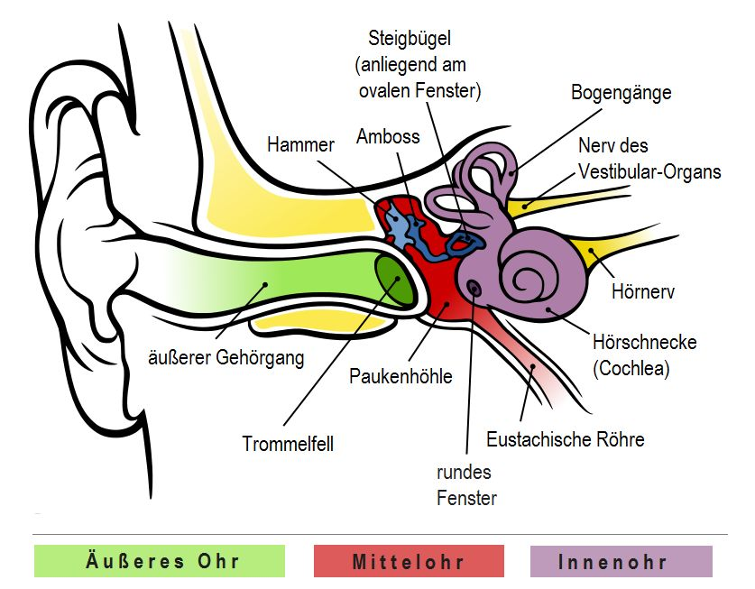

### 外耳 Äußeres Ohr

外耳主要是耳廓和外耳道 äußerer Gehörgang

外耳负责收集声波，将其传送到中耳的鼓膜处

### 中耳 Mittelohr

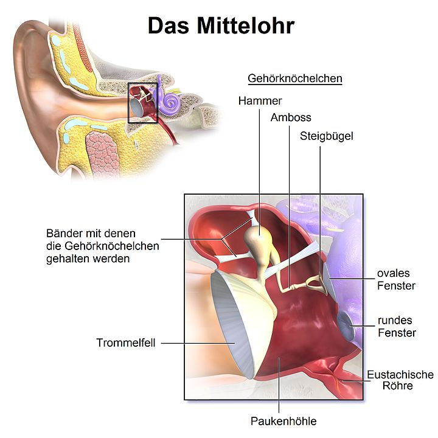

中耳的主要结构是鼓膜 Trommelfell、鼓室 Paukenhöhle 和三个听小骨 Gehörknöchelchen（构成听骨链） 组成

* 鼓膜：一个圆锥形的膜形结构

* 鼓室：是位于中耳内的一个空心小腔室，由骨质结构包围

* 听小骨：三块听小骨通过杠杆原理来放大声音的作用力，其主要目的是实现空气和耳蜗内液体之间的阻抗匹配

  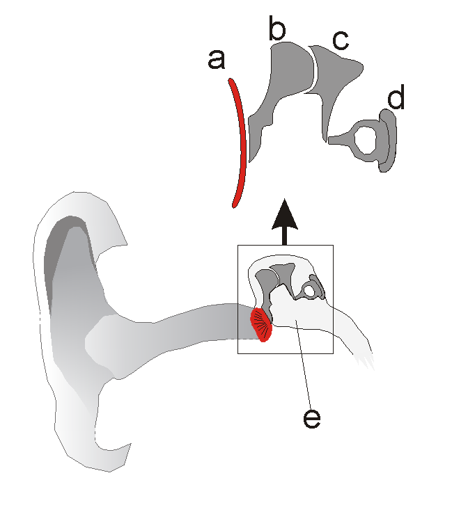

  * 砧zhen骨 Amboss
  * 锤骨 Hammer
  * 镫骨 Steigbügel

鼓膜和听骨链形成一个力学系统，**其功能是将来自外耳的声波的力放大**，并输入到内耳，为下一步的听觉转导做准备。中耳通过鼓室下部的耳咽管和咽喉相通

中耳和内耳之间的两个开口

* 圆窗 Rundes Fenster：镫骨与卵圆窗通过镫骨环状韧带相连，将力先后传递到耳前庭与耳蜗
* 卵圆窗 Ovales Fenster

### 内耳 Innenohr

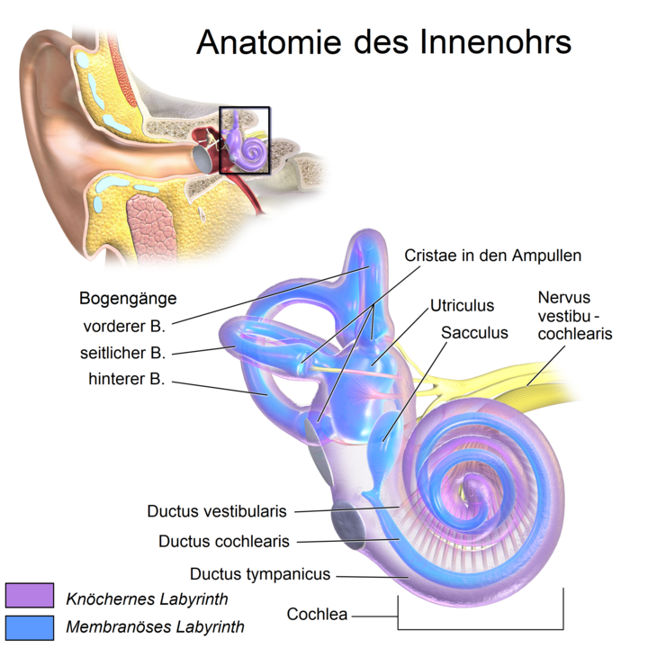

内耳的构成

* 骨迷路 Knöcherne Labyrinth

  * 前庭系统 Vestibular system：负责对头部的线性和角加速度的传感

    * 半规管 Bogengänge：感知旋转动作，三根半规管相互之间近似成直角
      * Vorderer Bogengänge 上半规管
      * Seitlicher Bogengänge 水平半规管
      * Hinterer Bogengänge 后半规管
    * 前庭 Vestibule：内含耳石 Otolithen 感知直线加速
      * 椭圆囊 Utriculus 与水平直线加速度有关，通膜半规管
      * 球囊 Sacculus 与垂直加速度有关，通向蜗管
      * 两囊间有小管联通，在椭圆囊和球囊壁上分别有椭圆囊斑和球囊斑位觉感受器，能感受头部直线变速运动的刺激

  * 耳蜗 Hörschnecke

    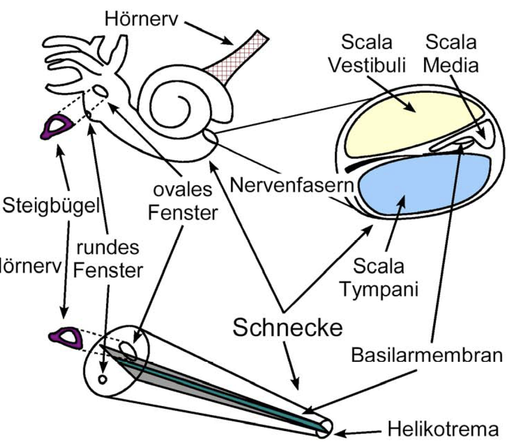

    * 耳蜗是一个骨质结构，由三个内部充满淋巴液的空腔组成，这三个空腔由上到下依次为
      * 前庭阶/前庭管 Scala vestibuli，内含外淋巴液。前庭管在底端中止于卵圆窗，是镫骨施力的部位。**因此一条完整的振动力传导路径为：砧骨->锤骨->镫骨->卵圆窗->前庭管**
      * 蜗管/中管 Scala media，内含内淋巴液
      * 鼓阶/鼓管 Scala tympani，内含外淋巴液：鼓管在底端中止于圆窗，毗邻鼓室，是声压释放的窗口。
    * 分隔三个空腔的膜
      * Reißner-Membran 分隔前庭阶和蜗管，前庭阶和鼓阶在蜗孔 Helikotrema 相通
      * Basilarmembran 基底膜分隔蜗管和鼓阶。耳蜗神经/听神经的纤维通过基底膜与内毛细胞和外毛细胞形成突触连接，其细胞体位于在耳蜗中心部的螺旋神经节内
    * Corti-Organ 柯蒂氏器是耳蜗的核心部件，坐落于基底膜之上、蜗管内部，它是听觉传感部件，负责将来自中耳的声音信号转换为相应的神经电信号。然后继续交送脑的中枢听觉系统接受进一步处理，最终实现听觉。耳蜗的病变和多种听觉障碍密切相关

* 膜迷路 Membranöses Labyrinth：是套在骨迷路内的封闭的管腔或囊，其中包含听觉和平衡觉的感受器

### Frequenzempfindlichkeit der Basilarmembrane

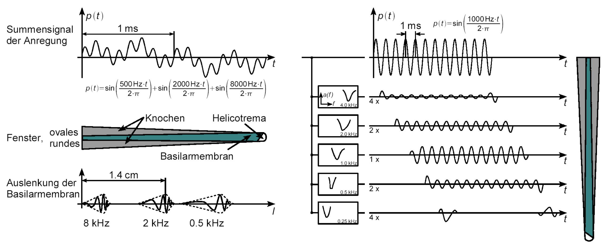

基底膜是一个贯穿耳蜗底部自顶部的膜状结构。外淋巴的机械振动，在基底膜形成一个行波，行波在基底膜的不同部位形成不同的共振幅度。**自底部至顶部，基底膜的横向宽度递增、机械张力亦递增，硬度、刚度 Steifigkeit 递减**。这两个趋势的综合作用因素是**共振频率 Eigenfrequenz 自底部至顶部的递减**。在人类，该共振频率的范围约为20-20000 Hz，即人类的正常听觉频率范围

基底膜上的距卵圆窗距离与共振频率与间的关系称为频率拓扑。基底膜的频率拓扑造成了毛细胞阵列和听神经阵列中的频率拓扑，也是上至大脑的听觉皮层的整个听觉通路的频率拓扑的根本起源。由于听觉系统具有频率拓扑性质，其工作原理形似信号处理中的傅立叶分析或某种形式的小波分析。当然在听觉通路更高级的部分，频率拓扑逐渐模糊，处理的复杂性亦非此类工程方法所能概括

## *Phychoakustik*

### Psychoakustische Messgröße

为什么要有Phychoakustik Messgröße？人能听到的声音频率范围大概为20Hz-20KHz，但人耳、大脑对声音的处理和感受并不是随着频率呈线性关系的。因此要制定 psychoakustische Messgrößen 与 physikalischen Messgrößen 进行区分

Das Ohr verarbeitet nicht alle ankommenden Schallreize linear. Geringe Empfindlichkeit bei sehr niedrige und hoch Frequenz, und höchste Empfindlichkeit bei 3-4KHz. Psychoakustische Mesgröße berücksichtigt diese Eigenschaft der Wahrnehmung und bieten daher ein subjektives Maß für das Ohr.

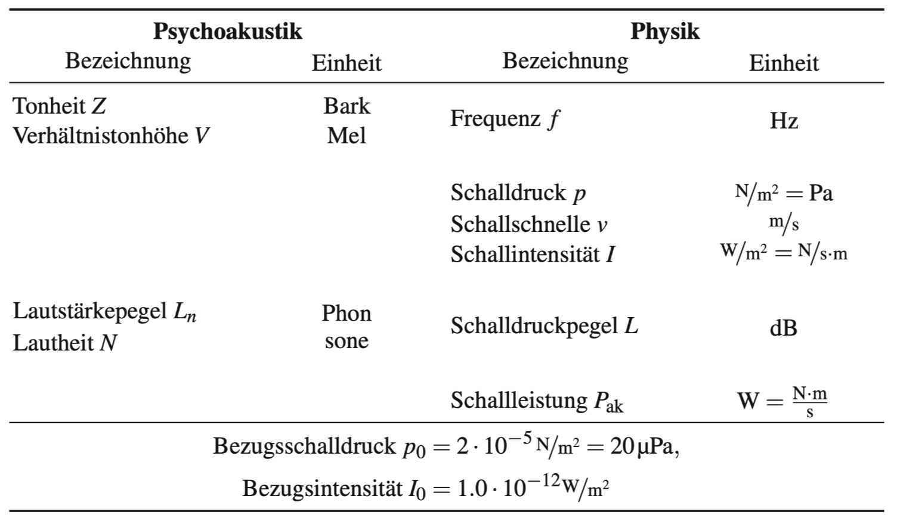

* Tonheit $Z$：Bark尺度
  * 音高 Tonhöhe/Pitch：人类心理对音符基频之感受
  * 是一种对音高的心理声学度量，从Basilarmembran的Frequnzgruppen中对应得到
* Verhältnistonhöhe $V$：Mel尺度，另一种心理声学度量
* Schalldruck 声压 $p$：Druckschwankungen in einem schallübertragenden Medium
* Schalldruckpegel $L$ 声压级
  * 表征与基准声压级 $p_0=20\mu pa$ 的相对关系 Verhältnis des gemessenen Schalldrucks und des Bezugsschalldruckes in Dezibel
  * $L=20\log_{10}{\left(p/p_0\right)}$
* Lautstärkepegel $L_n$ 响度级
  * 量度声音大小的知觉量
  * **1KHz 的正弦波所对应的声压级对应此时的响度级**，比如在下面的等响曲线中，1KHz的正弦波产生的40 dB的声压级所对应的响度为40 phon 响度级
* Lautheit $N$ 响度
  * 1 sone 表示频率为1KHz，声压级为40dB声音的响亮程度
  * 响度与响度级的关系为：$L_n=10\log{\left(N/2\right)}+40$

### Hörfläsche/Hörschwelle

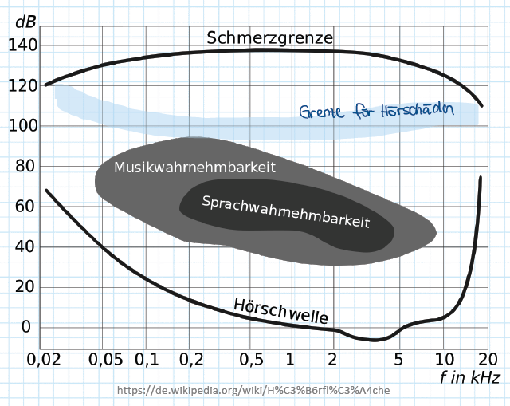

* 人类的听觉对危险信号频段和语言频段比较灵敏，特别是2-5kHz的频段范围
* 低频段灵敏度很低，可以更好入睡，并且身体里很多的声音都处于低频段，灵敏度不适合太高

> 对人类听觉来说，愈高的声压或声强 Schalldruckpegel，会造成愈大的听觉感知。而在人类的可听频率范围（20 Hz 到 20 000 Hz）中，由于听觉对 3 000 Hz 左右的声音较为敏感，该段频率也能造成较大的听觉感知 -- wikipedia

这种对不同频率下对相同db声压级的不同响度的主观听觉感受可以用等响曲线 Kurven gleicher Lautheit/Equal loudness contours 来展示

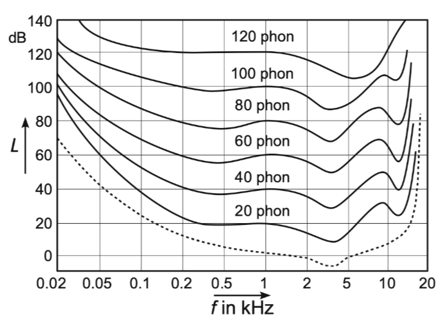

https://zhuanlan.zhihu.com/p/104192504

### Bewertungsfilter 计权声级

为了对在不同声压级下的主观响度进行进一步的修正，提出了Bewertungsfilter

常用的有适用于较低响度级（对20 phon等响曲线进行修正）的 A-Filter/A-Weighting A计权，用db(A)来表示。以及较嘈杂（对100 phon等响曲线进行修正，比如机场噪音）的D计权

https://zhuanlan.zhihu.com/p/400171691

### Frequenzgruppen

在Basilarmembrane那部分提过，由于Basilarmembrane的物理性质渐变，人能听到的声音频率范围大概为20Hz-20KHz。心理声学的单位正是基于这种听力范围而制定的

**将Basilarmembrane按照长度等分为24个区间**，每一段为1.3mm。每一个区间所对应的就是一个Bark尺度

同时还有根据音高来制定的Mel尺度，它也是和24个区间所对应的。基准关系为 $1.31 Bark=131 Mel=131Hz$

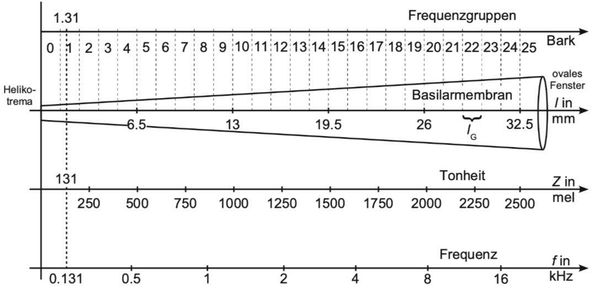

### Verdeckung 隐藏

这部分可以看DSP.md

# Sprachenverarbeitung

## *语言*

这部分看自动机与语言.md

## 语言识别模型的层次结构

## *HMM*

### Markov-Modelle und HMM

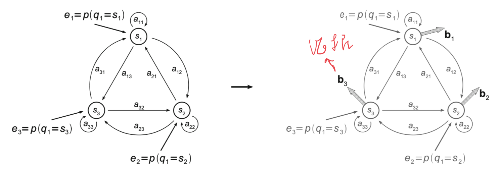

MM由转移矩阵 Übergangswahrscheinlichkeit $\boldsymbol{A}$ 和表示初始状态的 Einsprungswahrscheinlichkeiten $\boldsymbol{e}$ 来表示。用 $q_1$ 和 $q_T$ 来标记特殊的初始和结束状态
$$
\boldsymbol{A}=p\left\{q_{t+1}=s_j|q_t=s_i\right\}=\left[\begin{matrix}a_{11}&a_{12}&\cdots&a_{1N}\\a_{21}&a_{22}&\cdots&a_{2N}\\\vdots&\vdots&\ddots&\vdots\\a_{N1}&a_{N2}&\cdots&a_{NN}\end{matrix}\right],\ \boldsymbol{e}=\left[\begin{matrix}p(q_1=s_1)\\p(q_1=s_2)\\\vdots\\p(q_1=s_N)\end{matrix}\right]
$$
HMM可以直接观测到的是 证据 $v$ （也叫做Alphabet，因为是可能的输出）组成的 $B$ 证据矩阵，$s$ 状态是隐藏起来的
$$
\boldsymbol{B}=\left[\begin{matrix}p\left(v_1|s_1\right)&p\left(v_1|s_2\right)&\cdots&p\left(v_1|s_N\right)\\p\left(v_2|s_1\right)&p\left(v_2|s_2\right)&\cdots&p\left(v_2|s_N\right)\\\vdots&\vdots&\ddots&\vdots\\p\left(v_M|s_1\right)&p\left(v_M|s_2\right)&\cdots&p\left(v_M|s_N\right)\end{matrix}\right]=\left[\begin{matrix}b_{11}&b_{21}&\cdots&b_{N1}\\b_{12}&b_{22}&\cdots&b_{N2}\\\vdots&\vdots&\ddots&\vdots\\b_{1M}&b_{2M}&\cdots&b_{NM}\end{matrix}\right]
$$
HMM由 $\lambda=\left\{\boldsymbol{e},\boldsymbol{A},\boldsymbol{B}\right\}$ 来表示，它的输出为 Produktionswahrscheinlichkeit $p(\boldsymbol{o}|\lambda)$，其中 $\boldsymbol{o}=(o_1,o_2,\dots,o_T)$ 是输出序列 Beobachtung（相当于就是data sample）。这边要注意 $\boldsymbol{v}$ 和 $\boldsymbol{o}$ 的区别，$\boldsymbol{v}\in\R^M$ 是所有可能出现的状态，它有几维，那么证据矩阵 $B$ 就有几行，因为每个状态都有可能会观测到某一个证据；而 $\boldsymbol{o}$ 则是实际的输出

**状态转移图 Zustandübergangsdiagramm 和不确定的有限状态机还有贝叶斯网络都是等价的**

HMM主要有下面两类

* Ergodisches HMM: Bei dem vom **jedem** Zustand aus **jeder** andere Zustand erreicht werden kann。每一个状态都能从每一个其他状态转移而来，它的转移矩阵形式就是上面的 $\boldsymbol{A}$

* Links-Rechts-HMM/Baski-Modelle：展现了一种时间特性，只能由早先的状态转移到后面的状态，不能反过来。这在语言这种时间序列中很有用。Diese zeichnet aus, dass von einem Zustand $s_j$ kein Zustand $s_i$ erreicht werden kann mit $i<j$。

  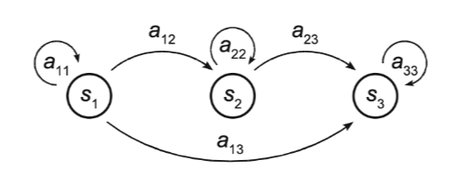
  $$
  \boldsymbol{A}=\left[\begin{matrix}a_{11}&a_{12}&\cdots&a_{1N}\\0&a_{22}&\cdots&a_{2N}\\\vdots&\vdots&\ddots&\vdots\\0&0&\cdots&a_{NN}\end{matrix}\right],\ a_{ij}=0\ für\ i<j
  $$

### Inference and Learning of HMM

HMM的inference和learning主要是下面三种

* 似然 Likelihood/滤波/状态估计：给定HMM的参数集 $\lambda$ 和观察序列 $\boldsymbol{o}$，计算似然 $P(\boldsymbol{O}|\boldsymbol{\lambda})$
* 解码 Decoding：给定HMM的参数集 $\lambda$ 和观察序列 $\boldsymbol{o}$，寻找最可能的状态转移序列 $\boldsymbol{q}$
* 学习 Learning：给定观察序列 $\boldsymbol{o}$，学习HMM的参数集 $\lambda$

## *HMM任务*

### 联合概率

在GKI.md中对于序列的时序推理有其联合概率
$$
P(\boldsymbol{X}_{0:t},\boldsymbol{E}_{1:t})=\underbrace{P(\boldsymbol{X}_0)}_{Prior}\prod\limits_{i=1}^{t}{\left(\underbrace{P(\boldsymbol{X}_i|\boldsymbol{X}_{i-1})}_{Transition}\underbrace{P(\boldsymbol{E}_i|\boldsymbol{X}_i)}_{Sensor}\right)}
$$
在MMK这门课里内容是相似的。对于某个HMM有某个输出结果 $\boldsymbol{o}$，它可能通过多条转移路径转移得到，其中沿着某条路径 $\boldsymbol{q}=\left(s_{q_1},s_{q_2},\dots,s_{q_T}\right)$ 的Pfadwahrscheinlichkeit为如下的式子，同时PfadWkt也被称为vollständiger Datenwahrscheinlichkeit
$$
p\left(\boldsymbol{o},\boldsymbol{q}|\lambda_k\right)=\underbrace{e_{q_1}b_{q_1}(o_1)}_{prior}\cdot\underbrace{a_{q_1q_2}b_{q_2}(o_2)\cdots a_{q_{t-1}q_t}b_{q_t}(o_t)\cdots a_{q_{T-1}q_T}b_{q_T}(o_T)}_{\prod\limits_{t=2}^{T}{\left[a_{q_{t-1}q_t}b_{q_t}(o_t)\right]}}=e_{q_1}b_{q_1}(o_1)\cdot\prod\limits_{t=2}^{T}{\left[a_{q_{t-1}q_t}b_{q_t}(o_t)\right]}
$$
结合所有的路径（Marginalization），可以得到某个输出结果 $\boldsymbol{o}$ 的联合概率，它被称为 unvollständiger Datenwahrscheinlichkeit，这是因为它包含了所有的信息，不仅仅是一条特定路径的信息
$$
p(\boldsymbol{o}|\lambda_k)=\sum\limits_{alle\ Pfade\ \boldsymbol{q}}{p\left(\boldsymbol{o},\boldsymbol{q}|\lambda_k\right)}=\sum\limits_{\boldsymbol{q}\in Q}{\left[e_{q_1}b_{q_1}\left(o_1\right)\prod\limits_{t=2}^{T}{\left(a_{q_{t-1}q_t}b_{q_t}(o_t)\right)}\right]}
$$
计算联合概率的时间复杂度为 $\mathcal{O}(2T\cdot N^T)$

### Vorwärtsalgorithmus 前向计算路径似然

在GKI.md中有前向算法
$$
\boldsymbol{f}_{1:t+1}=\alpha\boldsymbol{O}_{t+1}\boldsymbol{T}^T\boldsymbol{f}_{1:t},\ \boldsymbol{f}_{1:0}=P(\boldsymbol{X}_0)
$$
在MMK这门课里内容是相似的，但手动计算的时候没有用统一的矩阵形式计算，而是分成了三步

* Initialisierung
  $$
  \alpha_1(i)=e_ib_i(o_1),\ 1\leq i\leq N
  $$

* Induktion
  $$
  \alpha_{t+1}(j)=\left[\sum\limits_{i=1}^{N}{\alpha_t(i)a_{ij}}\right]b_j(o_{t+1}),\ 1\leq t\leq T-1;\ 1\leq j\leq N
  $$

* Terminierung
  $$
  P(\boldsymbol{o}|\lambda_k)=\sum\limits_{i=1}^{N}{\alpha_T(i)}
  $$

### Viterbi-Algorithmus 寻找最可能路径

$\delta_t(j)$: Wahrscheinlichkeit des wahrscheinlichsten Pfads

$\psi_t(j)$: Pfad selbst

* Initialisierung
  $$
  \delta_1(i)=e_ib_i(o_1),\ 1\leq i\leq N;\ \psi_1(i)=0
  $$

* Induktion：Viterbi算法几乎和前向算法完全一致，只是**将Induktion中的求和改为求最大值**
  $$
  \delta_t(j)=\max\limits_{1\leq i\leq N}{\left[\delta_{t-1}(i)a_{ij}\right]}\cdot b_j(o_t),\ 2\leq t\leq T;\ 1\leq j\leq N\\\psi_t(j)=\mathop{argmax\ }\limits_{1\leq i\leq N}{\left[\delta_{t-1}(i)a_{ij}\right]},\ 2\leq t\leq T;\ 1\leq j\leq N
  $$

* Terminierung
  $$
  P^*=\max\limits_{1\leq i\leq N}{\left[\delta_T(i)\right]},\ q_T^*=\mathop{argmax\ }\limits_{1\leq i\leq N}{\left[\delta_T(i)\right]}
  $$

* Ermittlung der wahrscheinlichsten Zustandsfolge：从后往前依次找最大的序列
  $$
  q_t^*=\psi_{t+1}\left(q_{t+1}^*\right),\ t=T-1,T-2,\cdots,1
  $$

### Learning：前向后向/Baum-Welch 算法

# Handschrifterkennung

## Vorverarbeitung

### Vorverarbeitugnskette

关于笔迹识别总体上可以分为Offline和Online-Erkennung。Offline的Schritzug只需要用Bitmap来表示，而Online的还要包含时间信息和空间信息，比如书写的地点、压力等。以下只考虑Online的

一个freie Eingabe可以用 $\boldsymbol{x}(t)=\left(x(t),y(t),p(t)\right)^T$ 来表示，分别为 x、y坐标和压力

考虑三种Freiheitsgrade

* Zeilenneigung/skew
* Schriftneigung/slant
* Schriftgröße/scale

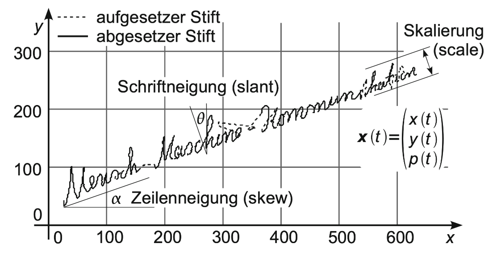

下面是总体上的预处理workflow

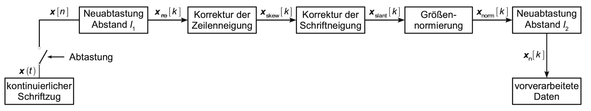

### Neuabstatung

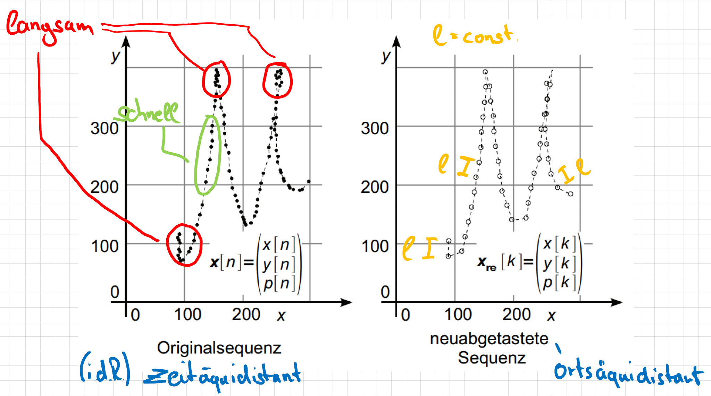

原来采样的时候采取的是等时间的采样，即 zeitäquidistante Abtastung，这会出现写的快的地方采样点洗漱，比如上图中 "M" 字体的绿色部分，而写的慢的地方采样点则很密集，比如上图中 "M" 字体的红色转弯部分。这种过采样 Übertastung 会降低之后的处理速度，因此重新采样为等距离 $l$ 的采样点，即 ortäquidistante Abtastung

Bei der Neuabtastung wird eine zeitlich äquidistant abgetastete Trajektorie $\boldsymbol{x}[n]$ bestehend aus $N$ Schriftspunkten in eine räumlich äquidistant abgetastete Folge $\boldsymbol{x}_{re}[k]$ der Länge $K$ überführt。采样的数学关系为
$$
\left|\left[\begin{matrix}x[k]\\y[k]\end{matrix}\right]-\left[\begin{matrix}x[k-1]\\y[k-1]\end{matrix}\right]\right|=\left|\left[\begin{matrix}x[k+1]\\y[k+1]\end{matrix}\right]-\left[\begin{matrix}x[k]\\y[k]\end{matrix}\right]\right|,\ 1<k<K
$$

### Korrektur der Zeilenneigung

为了对skew进行修正，首先要估计skew的程度，即通过拟合一条回归曲线，它的Regressionsgerade就是 $\alpha_0$

再确定了 $\alpha_0$ 之后，对其进行旋转
$$
\boldsymbol{x}_{skew}[k]=\left[\begin{matrix}\cos{\alpha_0}&-\sin{\alpha_0}&0\\\sin{\alpha_0}&\cos{\alpha_0}&0\\0&0&1\end{matrix}\right]\cdot\boldsymbol{x}_{re}[k],1\leq k\leq K
$$

通过Projektprofile (das Histogramm $P_y$ bestehend aus Bins in y-Richtung) 和Entropie来估计修正效果，目标是找到最小化熵的修正角 $\alpha^*$（熵越小，信息越确定，纯度越高）
$$
\alpha^*=\mathop{argmin\ }_{\alpha}{H_y(\alpha)=-\sum\limits_{j=1}^{B}{\left[P_y(j,\alpha)\cdot\mathop{ld}{P_y(j,\alpha)}\right]}}\ mit \ \mathop{ld}{\left(x\right)}=\log_{2}{x}
$$

### Korrektur der Schriftneigung

$$
\boldsymbol{x}_{slant}[k]=\left[\begin{matrix}1&-\tan{\phi_0}&0\\0&1&0\\0&0&1\end{matrix}\right]\cdot\boldsymbol{x}_{skew}[k]
$$

Slant和Skew的矫正过程基本上是一样的，只有一个不同，那就是它会使用x-ebene的Peojetktionsprofile

### Normierung der Schriftgröße

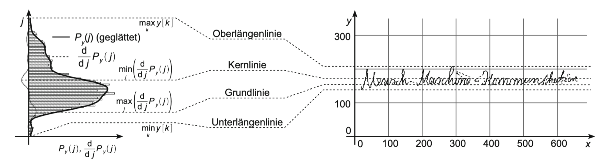
$$
Oberlängenlinie:y_{ober}=\max_{k}{\left(y[k]\right)}=y_{max}\\Kernlinie:y_{kern}=\left(\mathop{argmin\ }\limits_{j}{\left(\frac{d}{dj}P_y(j)\right)-0.5}\right)\cdot W+y_{min}\\Basislinie:y_{grund}=\left(\mathop{argmax\ }\limits_{j}{\left(\frac{d}{dj}P_y(j)\right)-0.5}\right)\cdot W+y_{min}\\Unterlängenlinie:y_{unter}=\min_{k}{\left(y[k]\right)}=y_{min}
$$

$$
\boldsymbol{x}_{norm}[k]=\frac{1}{h_{kern}}\left[\begin{matrix}x[k]-x_{min}\\y[k]-\left(y_{grund}+\frac{h_{kern}}{2}\right)\end{matrix}\right]
$$
