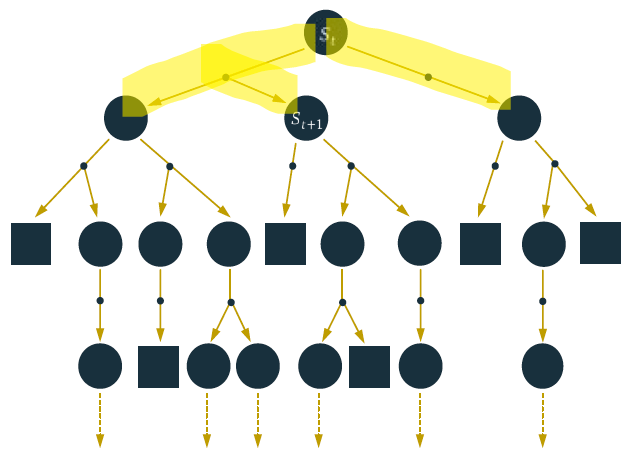
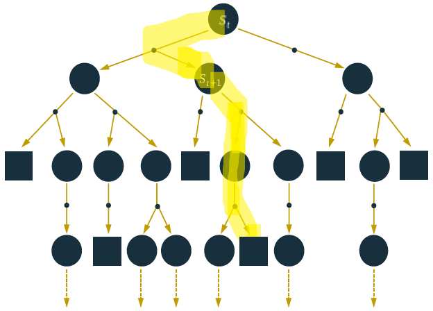
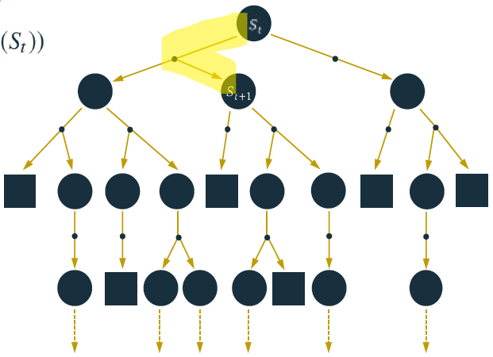
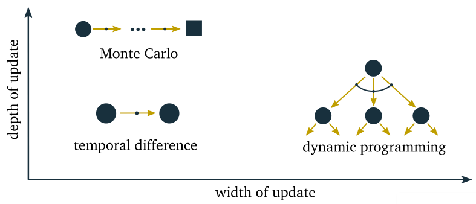

# 强化学习基础

## *多臂赌博机*

## *马尔可夫决策过程 Markov Decision Process MDP*

马尔可夫性 $P[s_{t+1}|s_t]=P[s_{t+1}|s_1,...s_t]$

### 回报和分幕

* 智能体和环境的交互能被自然地分成一系列子序列（每个序列都存在最终时刻），每个子序列被称为幕 Episodes。
  * 若每幕都以一种特殊状态终结（终结状态），该任务被称为分幕世任务
  * 若不能被自然地分成单独的幕，而是持续不断地发生，则称为持续性任务，最终时刻 $T=\infty$，此时回报也趋向于 $\infty$，因此要引入折扣因子 $\gamma$，同时也是因为未来的不确定性
* 回报是收益的总和，累计回报 $G_t=R_{t+1}+\gamma R_{t+2}+...=\sum\limits_{k=0}^{\infty}{\gamma R_{t+k+1}}$

### 策略和价值函数

* 策略：状态到动作的映射 $\pi(a|s)=p[A_t=a|S_t=s]$，策略 $\pi$ 在每个状态s指定一个动作概率
* 状态值函数 $v_{\pi}(s)=E_{\pi}\left[\sum\limits_{k=0}^{\infty}{\gamma^kR_{t+k+1}}|S_t=s\right]$ 当智能体采用策略 $\pi$ 时，累计回报服从一个分布，累计回报在状态s处的期望值为状态-值函数

状态-行为值函数 $q_{\pi}(s,a)=E_{\pi}\left[\sum\limits_{k=0}^{\infty}{\gamma^kR_{t+k+1}}|S_t=s, A_t=a\right]$

* 状态-行为值函数的贝尔曼方程 $q_{\pi}(s,a)=E_{\pi}\left[\sum\limits_{k=0}^{\infty}{R_{t+1}+\gamma q(S_{t+1},A_{t+1})}|S_t=s, A_t=a\right]$

### 最优策略和最优价值函数

* $q^{\ast}(s,a)=\max\limits_{\pi}{(s,a)}$
* 最优状态值函数 $v^{\ast}(s)=\max\limits_{a}{R_s^a}+\gamma\sum\limits_{s'\in S}{P_{SS'}^av^{\ast}(s')}$
* 最优状态-行动值函数的贝尔曼最优方程 $q^{\ast}(s)=R_s^a+\gamma\sum\limits_{s'\in S}{P_{ss'}^{a}\max\limits_{a'}{q^{\ast}(s',a')}}$

### 常用随机策略

* 贪婪策略 $\pi_\ast(a|s)=\left\{\begin{array}{c}1,&if\ a=\argmax\limits_{a\in A}{q_{\ast}(s,a)}\\0,&otherwise\end{array}\right.$

* 高斯策略
* 玻尔兹曼分布

## *基于模型的动态规划方法*

### 策略迭代 Policy Iteration

* 策略评估 Policy Evaluation：对一个给定策略的价值函数进行迭代计算
* 策略改进 Policy Improvement：对给定某个策略的价值函数，计算一个改进的策略

### 线性方程组的迭代解法

* Jacobi Iteration
* Gauss-Seidel Iteration

### 压缩映射证明策略评估的收敛性

### 值迭代 Value Iteration

### 广义策略迭代 Generalized Policy Iteration GPI

# 基于值函数的强化学习方法

和具备完整先验模型知识以及奖励的动态规划方法比，实际中完备的模型和环境知识往往是不具备的。因此需要从真实经验中进行学习。其中代表性的无模型算法为蒙特卡洛方法和时序差分方法，用它们来估计价值函数并寻找最优策略

## *基于蒙特卡洛Monte Carlo的强化学习方法*

### 什么是蒙特卡洛方法？

蒙特卡洛算法并不是一种算法的名称，而是对一类随机算法的概括。有两种常用的随机算法

* 拉斯维加斯算法：采样越多，越有机会找到最优解。适用的问题是不限制采样次数，但必须给出最优解。
* 蒙特卡洛算法：采样越多，越近似最优解。适用的问题是要求在有限采样内，必须给出一个解，但不要求是最优解。

AI下棋程序对每一步棋的运算时间和内存硬件的堆栈空间都是有要求的，而且也不要求最优解。机器下棋的算法本质都是搜索树，围棋的难度在于搜索树的树宽可以达到好几百（国际象棋只有几十）。要在有限时间内遍历这么宽的树，就只能牺牲搜索的深度（也就是所谓的远见）。而要保证搜索深度，就要放弃遍历，改为随机采样。在该用蒙特卡洛树 MCTS方法后，搜索深度就大大增加了。比如ZEN算法就是一种MCTS方法，Alphago运用的是不同于蒙特卡洛树搜索的Beam Search方法，可以达到更好的效果。

### 试探性出发假设的蒙特卡洛方法 Monte Carlo with Exploring Start

蒙特卡洛算法是逐幕做出改进的 Offline，而非在每一步都有改进。蒙特卡洛算法的基础是根据大数定律，当越来越多的回报被观察到时，所有回报的平均值就会收敛与期望值。

在给定策略 $\pi$ 的一幕中，状态 $s$ 是有可能多次出现的。若只考虑所有幕中 $s$ 在每一幕中的第一次出现的平均值来估计 $v_{\pi}(s)$ 称为首次访问型MC算法 First-visit Monte Carlo；若将一幕中所有 $s$ 的平均值来估计则称为 每次访问型MC算法 Every-visit Monte Carlo。

若无法得到环境模型，那么计算动作的价值函数（即“状态-动作“二元组）比起直接计算状态的价值更加有用一些。我们必须通过显式地确定每个动作的价值函数来确定一个策略，即用MC算法来确定 $q_*$。

但这个过程存在一个问题：并非所有的”状态-动作“二元组都会被访问到，也就是说一个给定的策略有可能只会”倾向“于访问某些二元组。在无法获取回报进行平均的情况喜爱，MC算法将无法根据经验改善动作价值函数的估计。为了实现基于动作价值函数的策略评估，我们必须保持持续的试探。试探性出发就是将指定的“状态-动作”二元组作为起点开始一幕采样，同时保证所有“状态-动作”二元组都有非零的概率可以被选作起点。这样就保证了在采样的幕个数趋向于无穷的时候，每一个“状态-动作”二元组都会被访问到无数次。

### 没有试探性出发假设的蒙特卡罗方法

试探性出发假设很难被满足。唯一的一般性解决方案就是智能体能够持续不断地选择所有可能的动作

* $\varepsilon$-greedy
  * $\pi_\ast(a|s)=\left\{\begin{array}{c}1-\varepsilon+\frac{\varepsilon}{\lvert A(s)\rvert},&if\ a=\argmax\limits_{a\in A}{Q(s,a)}\\\frac{\varepsilon}{\lvert A(s)\rvert},&if\ a\neq\argmax\limits_{a\in A}{Q(s,a)}\end{array}\right.$
  * $\varepsilon$-greedy 是RL中最基本最常用随机策略，它平衡了利用 Exploitation 和探索 Exploration
* 同轨策略 On-Policy：用于生成采样数据序列的策略和用于实际决策的待评估和改进的策略是相同的 The agent is learning On-Policy when the behaviour policy and target policy are the same
* 基于重要度采样的离轨策略 Off-Policy：用于生成采样数据序列的策略和用于实际决策的待评估和改进的策略是不同的 The agent is learning Off-Policy when the behaviour policy differs from the target policy
* 通俗理解：On-Policy：改进当前策略并重复；Off-Policy：当前的策略并不一定最好，可以换用其他的策略来寻找最优的方法

## *基于时序差分 Temporal Difference 的强化学习方法*

### 时序差分预测方法的优势

时序差分方法结合了DP和MC的优势。相比于DP，TD不需要环境模型进行学习；相比于MC，TC自然运用了一种在线的、完全递增的方法来实现：MC需要等到一幕的结束，才能基于回报值更新策略，但在一些应用场景中，一幕的时间非常就甚至是无穷长（持续性任务）

### 同轨策略 On Policy 下的时序差分控制：Sarsa State-action-reward-action

### 离轨策略 Off Policy 下的时序差分控制：Q-Learning

### n步自举法 n-Step Bootsrapping

### Deep Q-Network DQN

### DP、MC、TD的比较

## *基于值函数逼近的强化学习方法*

# 基于直接策略搜索的强化学习方法

## 基于策略梯度的强化学习方法

## 基于置信域策略优化的强化学习方法

## 基于确定性策略搜索的强化学习方法