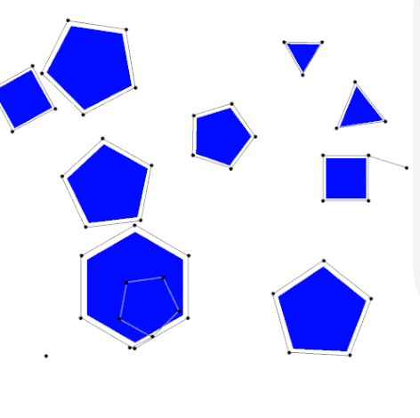

<https://atsushisakai.github.io/PythonRobotics/getting_started.html>

* Bug：未知环境下完全基于传感器的规划器，但是只能在平面构型空间使用
* 吸引/排斥势函数：可以应用于很多不同类型的构型空间，但是存在局部极小值的问题，因此不完备
* Cell Decomposition
* Roadmap

# Configuration Space

## *数学定义*

### Workspace

在RMP中假设机器人都是在2D平面 $\R^2$ 或3D $\R^3$ 空间中的，这种空间也被称为 **Workspace **$\mathcal{W}$。$\mathcal{W}$ 中经常会有障碍 Obstacles，将 $\mathcal{WO}_i$ 记作第 $i$ 个障碍。Free workspace 是扣除了障碍的无障碍空间 $\mathcal{W}_{free}=\mathcal{W}\textbackslash\bigcup_i{\mathcal{WO_i}}$

### 构型空间定义

Motion Planning一般都不会在 Workspace 中进行，而是在 Configuration space/C-space $\mathcal{Q}$ 构型空间中来进行

机器人系统的一个Configuration 构型是对该系统每个点位置的完整说明。机器人系统的Configuration space/C-space，是系统所有可能Configuration的空间。因此Configuration就是这个抽象Configuration space中的一个点。在本文中，我们用 $q$ 表示一个Configuration，用 $\mathcal{Q}$ 表示构型空间。**机器人系统的DOF是 $Q$ 的维度，或者是指定Configuration所需的最小参数数量**

用 $R(q)$ 来表示机器人不同 Configuration 对应的一系列Workspace中的点，因此Obstacle在C-space中的表示就是Workspace中机器人和Obstacle交点转换过来，即 $\mathcal{QO}_i=\left\{q|R(q)\bigcap\mathcal{WO}_i\neq\empty\right\}$。和之前一样可以定义 Free configuration space 为 $\mathcal{Q}_{free}=\mathcal{Q}\textbackslash\bigcup_i{\mathcal{QO_i}}$

### 为什么要用Configuration space？

1. 简化表示：构型空间提供了对机器人姿态的抽象表示，不需要考虑具体的环境和物体几何形状。这样可以将复杂的运动规划问题简化为在高维构型空间中寻找合适的路径
2. 避免碰撞检测复杂性：在工作空间中进行运动规划时，需要考虑环境中的障碍物和机器人的物体几何形状。这会涉及到复杂的碰撞检测算法和几何计算。而在构型空间中进行规划，避免了这些复杂性，因为碰撞检测可以在抽象的构型空间中进行
3. 多自由度支持：构型空间可以很容易地表示机器人的多自由度运动，每个自由度对应一个维度。这使得在构型空间中规划路径更加灵活和高效

尽管构型空间提供了简洁和抽象的表示，但在实际运动执行过程中，需要将构型空间中的路径映射回工作空间，以实现实际的机器人运动。这涉及到逆运动学和轨迹插值等技术

### Path

Path planning 和 Motion planning 是有区别的

* Path是在C-space中的连续曲线，它由一个连续函数表示，将某个路径参数（通常取在单位区间 $[0, 1]$内）映射到 $\mathcal{Q_{free}}$ 中的一条曲线。单位区间的选择是任意的；任何参数化方式都可以。路径规划问题的解 $c\in C^0$ 是一个连续函数
  $$
  c:[0,1]\rightarrow\mathcal{Q}\ where\ c(0)=q_{start},\ c(1)=q_{goal}\ and\ c(s)\in Q_{free}\ \forall s\in[0,1]
  $$

* 当用 $t$ 参数化的时候，$c(t)$ 是一个轨迹，速度和加速度可以被计算出来，这也就是说 $c$ 至少是二阶可导的，找到一个可行的轨迹被称为Trajectory planning/Motion planning

路径 $C:[0,1]\rightarrow cl\left(Q_{free}\right)$ 被称为半自由路径 ，其中 $cl\left(Q_{free}\right)$ 表示 $Q_{free}$ 的闭包。自由路径与半自由路径的区别在于机器人是否被允许与障碍物的边界接触。书中一般假设自由空间 $Q_{free}$ 是开集合，简单理解 $cl\left(Q_{free}\right)$ 就是与之相对应的闭集合，即在开集合的基础上加上边界点

## *Topology*

### Intro

拓扑学是数学的一个分支，研究空间的性质和变形的规律，而不依赖于度量和距离的概念。它关注的是形状、连通性和变换等概念，而不关注具体的度量或距离。

在拓扑学中，研究的对象可以是各种各样的空间，包括点、线、曲面、多维空间以及更抽象的空间结构。**拓扑学家关注的是空间中的性质和结构如何在连续变形下保持不变**。下面这张图非常传神

> 著有《一般拓扑学》一书的数学家[约翰·L·凯利](https://zh.wikipedia.org/wiki/约翰·L·凯利)曾说：拓扑学家为不知甜甜圈与咖啡杯之分别者。 -- wikipedia

拓扑学的核心概念包括：

1. 拓扑空间 Topology space：拓扑学研究的基本对象，它是一个集合，其中定义了一组满足一定公理的子集，称为开集。拓扑空间的定义不依赖于距离度量，而是基于集合之间的包含关系
2. 连通性 Connectivity：拓扑学研究空间的连通性，即空间中的点如何通过连续的路径相互连接。连通性可以分为强连通性和弱连通性，用于描述空间中的连续性和连通性程度
3. 同伦 Homotopy：同伦是拓扑学中的一个重要概念，用于描述空间中的变形和形状的等价性。如果两个空间可以通过**连续的变形**相互转化，它们被认为是同伦等价的
4. 不变量 Invariant：拓扑学研究中使用不变量来描述空间的性质和结构。不变量是一种在拓扑变换下保持不变的量，它们可以用于区分不同的空间，或者刻画空间的某些特性

### Homeomorphisms 同胚

对于一个映射 $\phi:S\rightarrow T$

1. Surjection 满射： 一个函数或映射被称为满射，若它的值域（或称为陪域）T等于或包含在目标集合中的每个元素。换句话说，对于目标集合中的每个元素，**至少存在一个定义域中的元素与之对应**。满射也被称为"onto"映射

2. Injection 单射： 一个函数或映射被称为单射，**若它的定义域S中的每个元素映射到目标集合T中的不同元素且最多映射一个**。换句话说，不同的定义域元素不会映射到相同的目标元素。单射也被称为"one-to-one"映射

3. Bijection 双射

   * 一个函数或映射被称为双射，**如果它是满射且单射**。换句话说，双射是一种既有一对一映射又有映射到每个元素的映射。对于双射，每个目标集合中的元素都有一个唯一的对应元素在定义域中。双射也被称为"one-to-one correspondence"映射
   * 双射具有良好的性质：对于任何T中的值，都可以找到它的逆，即可以在S和T之间任意转换

4. Discontinuous bijection (isomorphism) 同构

5. Homeomorphism 同胚映射： 同胚映射是拓扑空间之间的一种映射关系，它保持了空间的拓扑性质。若 $\phi:S\rightarrow T$ 是双射的，且 $\phi$ 和 $\phi^{-1}$ 都是连续的，那么称 $\phi$ 为Homeomorphism，S和T都是homeomorphic

6. Diffeomorphism 微分同胚映射： 微分同胚映射是微分流形之间的一种映射关系，它保持了流形的微分结构。如果存在两个微分流形M和N以及从M到N的映射 $f$ 和从N到M的映射 $g$，使得 $f$ 和 $g$ 都是**光滑**的，并且 $f$ 和 $g$ 的复合映射等于各自的身份映射，那么 $f$ 和 $g$ 被称为微分同胚映射，而M和N则称为微分同胚的

   

### 同胚和同伦的关系

同胚是指两个拓扑空间之间存在一种一一映射，这个映射和其逆映射都是连续的。换句话说，如果两个拓扑空间可以通过一个连续的双射来互相映射，那么它们就是同胚的。同胚可以理解为两个空间之间的一种对应关系，它保持空间的拓扑性质不变，包括点的连通性、开集的性质等。如果两个空间是同胚的，它们在拓扑学上被认为是完全等同的

而同伦则是一个更为宽松的概念。同伦定义了一种连续的变形过程，将一个空间逐渐变形为另一个空间，而变形过程中的每个中间状态也是合法的拓扑空间。同伦关注的是连续变形的过程，而不关注变形的细节。如果两个拓扑空间可以通过一个连续的变形过程相互转化，那么它们是同伦等价的。同伦等价关系可以看作是同胚关系的更加宽松的版本

同胚和同伦有什么区别？可以简单理解为，同胚关注空间之间的一一对应关系，而同伦关注空间之间的连续变形关系。同胚是更严格的关系，它要求映射是双射且连续的，而同伦则更为宽松，只要存在连续的变形过程即可。同胚关系保持了空间的所有拓扑性质，而同伦关系只保持了一些基本的连通性质

### 连通性和紧凑性

* 连通性 Connectedness
* 紧凑性 Compactness

### 为什么要关注拓扑关系？

* 拓扑关系影响我们对构型空间的表示
* 若我们的路径规划算法在某一个构型空间上有效，那么在其拓扑等价的构型空间上也基本有效

## *例子*

### Holonomic robot

可以依据DoF的可控性 controllability 划分为 non-holonomic or holonomic robot

* holonomic：在所有的自由度上都可控，比如基于万向轮的机器人 robot built on Omni-wheels
* Non-holonomic robot：可控自由度小于机器人自身的自由度，比如二维平面的小车自身有3个自由度 $\left\{x, y,\theta\right\}$，即平面坐标和车身朝向，但平面小车的可控自由度是2个，即加减速度，转动方向盘，不能随意的漂移运动

从另一个直观通俗的角度可以理解为：如果机器人可以在N维空间中朝任意方向移动，则对于N维空间是完整性的。而机器人在N维空间中不能朝任意方向移动，则认为是非完整性约束

### Circular Mobile Robot

Grid-based representation（基于网格的表示）是一种常见的构型空间表示方法。

在基于网格的表示中，构型空间被划分为一个二维或三维的网格。每个网格单元表示一个离散的构型，包括机器人或物体的位置和姿态。这些网格单元可以被标记为自由区域（表示可通过的区域）或障碍物区域（表示不可通过的区域）。通过将环境中的障碍物与自由区域相对应，我们可以在网格中建立一个表示环境的地图。

在基于网格的表示中，路径规划问题可以转化为在网格中搜索一条从起始构型到目标构型的路径。常用的搜索算法如A*算法和Dijkstra算法可以用于在网格中搜索最佳路径。

基于网格的表示具有简单和直观的优点，可以处理多种形状和复杂度的环境。然而，它也存在网格分辨率的权衡，较细的网格可以提供更准确的路径规划结果，但会增加计算和存储开销，而较粗的网格可能导致路径规划的精度损失。因此，在实际应用中，需要根据具体情况选择合适的网格分辨率。

图片对于可视化构型空间中的障碍物是有用的，但它们并不足以规划无碰撞运动。原因是网格仅对位于网格上的离散点编码了碰撞信息。路径不仅包括网格点，还包括连接网格点的曲线上的点

### 2-Joint Arm

## *Collision Detection*

常见的碰撞检测方法 - 小 Y的文章 - 知乎 <https://zhuanlan.zhihu.com/p/449795053>

<https://www.cnblogs.com/sevenyuan/p/7125642.html>

### Sphere 外接圆碰撞检测

* Pro：非常直观，只要多边形外接圆的圆心距离大于两者之间的中心距离就可以，这就只需要进行一次碰撞检测
* Con：占用了很多多余的free space

可以进一步划分圆来缩小占用的free space，划分的越多占用的free space越小，但同时需要的碰撞检测的次数也越多

### AABB

Axis Aligned Bounding Box 方法使用**与坐标轴平行**的外接矩形来分析两个物体之间的碰撞关系

* 只需要比较两个矩形的上下、左右边的大小即可，非常轻便
* 忽略了物体的旋姿态，会丢失掉一部分自由区域，适合进行粗略的碰撞检测

### OBB/分离轴SAT

Separating Axis Theorem 分离轴定理：若两个物体不发生碰撞，则一定存在一条直线能够将两个分体分离开，这条直线称为分离轴。具体做法就是取polygon每条边的法向量，然后将polygon投影上去。若可以找到任何一对不重叠的投影，就说明不发生碰撞

Oriented Bounding Box 方向包围盒

* 与AABB方法相比OBB方法将姿态考虑进来，不会丢失自由空间，适合精细的碰撞检测
* 计算复杂度提高了很多，因为旋转会涉及到大量的三角函数运算

### Polygon

## *流形 Manifolds*

### 欧几里得空间

欧几里德空间（Euclidean space）是一种常见的数学空间，用于描述我们日常生活中的物理空间。

欧几里德空间是一个多维实数空间，其中的每个点可以由一组实数坐标来表示。在二维欧几里德空间中，我们用平面笛卡尔坐标系（x，y）来描述点的位置；在三维欧几里德空间中，我们用空间笛卡尔坐标系（x，y，z）来描述点的位置

欧几里德空间具有以下性质：

1. 平行公理：通过点P和不在该直线上的点Q，存在唯一一条直线与给定直线平行。
2. 距离公理：给定两点P和Q，存在唯一的正实数d(P,Q)，表示P和Q之间的距离，并满足非负性、对称性和三角不等式。
3. 点和直线公理：任意两点之间有一条直线通过，且直线上的任意两点也在同一直线上。

欧几里德空间是一个平坦的空间，其中的直线是直的、平行线永远不会相交，并且满足传统的几何规则。我们可以在欧几里德空间中进行几何图形的构造、测量距离、计算角度等。

### 流形

流形 manifold 是一种数学概念，用于描述具有局部平坦性的空间。我们可以将流形想象为柔软的曲面，它可以弯曲和扭曲，但在小范围内看起来类似于欧几里德空间

想象一下我们生活在一个二维的平面世界。这个平面是一个二维流形，因为我们可以在平面上移动，并且任何一点附近都可以找到一个局部的平坦块。但是，如果我们将目光转向地球，我们会发现地球是一个三维流形。虽然地球的表面是弯曲的，但在我们小范围的观察中，它看起来是平坦的

流形可以具有不同的维度。例如，二维平面是一个二维流形，三维空间是一个三维流形。流形可以是有限维的，也可以是无限维的。在现实世界中，我们可以将流形应用于各种领域，如计算机图形学、机器学习、数据分析等。流形的概念帮助我们理解和处理复杂的数据结构，以及在高维空间中进行建模和分析

### 不同的流形

$T^n$: n-dimensional torus 环面

$S^n$: n-dimensional sphere in $\R^n$

嵌入维度（embedding dimension）和内在维度（intrinsic dimension）是两个在数据分析和机器学习领域中常用的概念。

嵌入维度指的是将高维数据映射到低维空间时所选择的目标维度。在许多情况下，原始数据可能具有高维度，但其中的信息可能可以用较低维度的空间来表示。通过选择适当的嵌入维度，我们可以尽可能保留数据的关键信息，同时减少计算和存储的开销。嵌入维度的选择通常是根据具体问题和数据集的特性进行的。

内在维度是指数据集中真正重要的维度，即数据所固有的维度。它是数据集中最有效表示数据的最小维度。内在维度与原始数据的维度不同，它更关注于数据中的结构和模式。通过确定内在维度，我们可以更好地理解数据集的特性，降低数据表示的冗余性，并更有效地进行数据处理和分析。

需要注意的是，嵌入维度和内在维度并不总是相等的。在某些情况下，嵌入维度可能小于内在维度，表示我们可以用更低维度的空间来表示数据。而在其他情况下，嵌入维度可能大于内在维度，表示在较低维度的表示中可能存在一些冗余信息。因此，选择合适的嵌入维度和理解数据的内在维度对于有效的数据分析和机器学习至关重要

### 可微流形

### $\R^n$ 中的流形嵌入 Embeddings of Manifolds

### $SO(3)$ 的参数化

# Bug Algorithm

<https://blog.csdn.net/weixin_43619346/article/details/108080861>

## *Bug1*

### Intro

Assumptions

* 假设机器人是一个可以准确定位（无定位误差）的点 perfect positioning
* Workspace is bounded 工作空间是有边界的
* 机器人具有感知障碍物边界、测量任意两点距离的能力

Bug1算法的效率很低，但可以保证机器人能到达任何可达的目标（概率完备）

Bug算法大多数情况下被当作是一种避障算法，属于reactive planner ，可以把起始点到目标点的直线连接当作全局路径来理解

### 算法

Bug1算法的思想是最直观的，即在未遇到障碍物时，沿直线向目标运动 motion-go-goal；在遇到障碍物后则沿着障碍物边界绕行 boundray-following，并利用一定的判断准则离开障碍物继续直行。这种应激式的算法计算简便，不需要获知全局地图和障碍物形状，具备完备性。但是其生成的路径平滑性不够好，对机器人的各种微分约束适应性比较差

* Motion-to-goal 向目标直行
* Boundary following 障碍物边界绕行

从遇到障碍时的hit point开始，机器人环绕障碍物移动直至返回 hit point，然后判断出障碍物周边上离目标最近的点，并移到这个点 leave point。开始时，机器人再次沿直线驶向目标，如果这条线仍与当前障碍物相交，则不存在到达目标的路径

### 算法伪代码

起点 $q_{start}=q_0^L$，目标点 $q_{goal}$，连接 $q_i^L$ 和 $q_{goal}$ 的每一段直线称为m-line，$q_i^H$ 称为 hit point，$q_i^L$ 称为 leave point

成功到达目的地

## *Bug2*

### intro

Bug2仍然采用Motion-to-goal和Boundary following，但是与Bug1算法不同的是，Bug2算法中的直线m-line是连接初始点和目标点的直线，**在计算过程中保持不变**。当机器人遇到障碍物时，机器人开始绕行障碍物，若机器人在绕行过程中在距离目标更近的点**再次遇到 m-line** $d(m,q_{goal})<d(q_i^H,g_{goal})$，就停止绕行，然后继续沿着m-line向目标直行，直到抵达目标

### Bug1 vs. Bug2

* Bug1算法会**详尽/完备**地搜索以找到最优的出发点
* Bug2算法会**贪婪**的将找到的第一个比较优的点作为出发点

当障碍物比较简单时，Bug2的贪婪方法效率可能比较高，但是当障碍物很复杂时，Bug2可能会因为贪婪而导致碰到更多的障碍物，从而走很多冤枉路

我们可以定量的分析一下

* Bug1算法：$L_{Bug1}\leq d(q_{start},q_{goal})+1.5\sum\limits_{i=1}^n{p_i}$，1.5是考虑最糟糕的情况：检测1圈，然后需要绕0.5圈到leave point
* Bug2算法：$L_{Bug1}\leq d(q_{start},q_{goal})+0.5\sum\limits_{i=1}^n{n_ip_i}$，$n_i$ 是碰到障碍物 $i$ 的次数

## *Tangent Bug*

TangentBug算法是对BUG2算法的改进。它利用机器人上距离传感器的读数对障碍物做出提前规避，可以获得更短更平滑的机器人路径。假设机器人上安装有360°无限角度分辨率的激光雷达（或者红外距离传感器），那么我们可以测得每束光线到达障碍物的距离

下图中细线表示距离，粗线表示不连续性

Saturated raw distance function
$$
\rho_R(x,\theta)=\left\{\begin{array}{ll}\rho(x,\theta),&if\ \rho(x,\theta)<R\\\infty,&otherwise\end{array}\right.
$$

## *辅助信息*

### Bug-ike算法的核心

Bug-like 算法主要就是两个动作：Motion-to-goal和Boundary following

* Motion-to-goal 可以理解为 $d(\cdot,n)$ 的梯度下降形式，其中 $d(\cdot,n)$ 表示机器人到目标点的距离，$n$ 要么是 $q_{goal}$ 要么是 $O_i$
* Boundary-following 就复杂很多，因为我们并没有障碍物边界的先验知识。因此Bug-like 算法之间主要的区别在于离开障碍物的位置选择

为了到达目的地，我们只能借助传感器感知到的信息，但是一个传感器的能力是有限的，我们只能先确定机器人需要什么信息，然后再确定机器人应移动到哪个位置来获取更多信息，这是所有基于传感器的规划都需要克服的问题

需要解决的三个问题是

* 机器人需要什么信息来绕过障碍物？
* 机器人如何从传感器数据中获取这些信息？
* 机器人如何使用这些信息来确定（局部）路径？

### 切线

### 距离和梯度

### 处理信息：Continuation methods

# Heuristic: Potential Functions

## *intro*

### 势函数的类比

构型空间（计算复杂）的一种替代方法是开发搜索算法，在搜索路径的同时逐步“探索”自由空间。其实Bug算法就是在没有构建配置空间的情况下在自由空间中操作，但Bug算法仅适用于简单的二维构型空间。所以下面介绍适用于更丰富机器人类别并生成比Bug方法更多样化路径的导航规划器 navigation planner，即适用于更一般的构型空间类别，包括多维和非欧几里德的构型空间

Potential function 势函数是一个可微的实值函数 $U: \R^m\rightarrow\R$。势函数的值可以看作能量，因此势的梯度就是力。梯度是一个向量 $\nabla U(q)=\left[\begin{matrix}\frac{\partial U}{\partial q_1}(q)&\frac{\partial U}{\partial q_2}(q)&\cdots&\frac{\partial U}{\partial q_m}(q)\end{matrix}\right]^T$，它指向在局部上U增长最快的方向。我们使用梯度来定义一个向量场，为流形上的每个点分配一个向量。正如其名称所示，梯度向量场为每个点分配了某个函数的梯度。当U表示能量时，梯度向量场具有沿任何闭合路径所做的功为零的属性

势函数方法将机器人的运动视为在梯度向量场中移动的正电荷粒子。梯度可以直观地看作作用在正电荷机器人上的力，它被负电荷目标所吸引。障碍物也具有正电荷，所以和机器人形成了一个排斥力，障碍物会将机器人推开。排斥力和吸引力的组合有望将机器人从起始位置引导到目标位置，同时避开障碍物

### 势方法的问题

势方法通过梯度下降来寻找极值点，只要是梯度下降就会出现局部最值的问题。在这里就是**局部极小值的位置和目标不匹配**。也就是说，很多势函数**无法得出完备的路径规划器**。解决这个问题有两种思路。但是尽管完备（或解析完备），这些方法都需要在规划前对构型空间有充分的了解，而这在大部分复杂的实际场景中可能都很难做到

1. 利用基于采样的规划器对势场进行增广
2. 2.定义只有一个局部极小值点的势函数，被称为navigation function。、

人工势场法就是在已知起点、终点和障碍物位置的情况下，构建一个人工势场来模仿自然界中类似于重力场、电磁场的作用机制。人工势场法的优点在于，它其实是一种反馈控制策略，对控制和传感误差有一定的鲁棒性；缺点在于存在局部极小值问题，因此不能保证一定能找到问题的解

## *引力势场和斥力势场*

某个点的总的势
$$
U(q)=U_{att}(q)+U_{rep}(q)
$$

### 引力 Additive Attractive

势场 $U_{att}$ 需要满足 $U_{att}$ 随着与 $q_{goal}$ 的距离单调增加。最简单的一种就是conic potential 圆锥曲线，计算到目标的比例距离公式以及梯度公式如下。其中 $\zeta$ 是用来缩放吸引势的作用的参数
$$
U(q)=\zeta\cdot d(q,q_{goal})\\\nabla U(q)\frac{\zeta}{d(q,q_{goal})}(q−q_{goal})
$$
梯度向量按大小 $\zeta$ 指向远离目标的方向，在构型空间内除了目标点以外的所有点都有定义。我们的路径就是每个点的负梯度形成的连线

选上面这种势函数在进行数值实现时，梯度下降会有很多问题，因为吸引势在原点是不连续的。因此我们倾向于选择连续可微的势函数，这样吸引势的大小随着机器人接近 $q_{goal}$ 变小。这种势函数最简单的就是随与目标的距离二次增长的，是从q开始指向远离 $q_{goal}$ 方向的向量，大小与二者之间的距离成正比。也就是说，当机器人离目标较远时，速度较快，距离变进时，速度会变慢

其中最简单的一种势函数就是二次函数，其中 $\zeta$ 为引力增益；$d(q,q_{goal})$ 为当前点 q 到目标点 $q_{goal}$ 之间的距离
$$
U_{att}(q)=\frac{1}{2}\zeta d^2(q,q_{goal})\\\nabla U(q)=\zeta\cdot\left(q-q_{goal}\right)
$$
但是单独使用二次函数也有问题，那就是当机器人离目标很远的时候会生成过大的速度，所以我们会把圆锥曲线和二次函数结合起来使用。其中 $d_{goal}^∗$ 是规划器在圆锥曲线和二次曲线之间切换时对应的与目标点的距离
$$
U_{att}(q)=\left\{\begin{array}{ll}\frac{1}{2}\zeta d^2(q,q_{goal}),&d(q,q_{goal})\leq d_{goal}^*\\d_{goal}^*\zeta d(q,q_{goal})-\frac{1}{2}\zeta\left(d_{goal}^*\right)^2,&d(q,q_{goal})> d_{goal}^*\end{array}\right.\\\nabla U_{att}(q)=\left\{\begin{array}{ll}\zeta\cdot\left(q-q_{goal}\right),&d(q,q_{goal})\leq d_{goal}^*\\\frac{d_{goal}^*\zeta(q-q_{goal})}{d(q,q_{out})},&d(q,q_{goal})> d_{goal}^*\end{array}\right.
$$

### 斥力 Repulsive Potential

排斥势会使机器人远离障碍物，排斥力的大小与机器人离障碍物的距离有关。因此排斥势往往用与最近的障碍物的距离 $D(q)$ 来定义
$$
U_{rep}(q)=\left\{\begin{array}{cl}\frac{1}{2}\eta\left(\frac{1}{D(q)}-\frac{1}{Q^*}\right)^2,&D(q)\leq Q^*\\0,&D(q)>Q*\end{array}\right.\\\nabla U_{rep}(q)=\left\{\begin{array}{cl}\eta\left(\frac{1}{D(q)}-\frac{1}{Q^*}\right)\frac{1}{D^2(q)}\nabla D(q),&D(q)\leq Q^*\\0,&D(q)>Q*\end{array}\right.
$$
$D(q)$：点 q 与其最近障碍物的距离；$\eta$ ：斥力增益；$Q^∗$ ：障碍物的作用距离阈值，大于此距离的障碍物不会产生斥力影响。$\eta$ 和 $Q$ 标量往往是通过不断试验确定

在对这个方法进行数值实现的时候，路径可能会在某个点周围振荡，因为此时这个点与不同的障碍距离相等。为了避免这种振荡，用单个障碍物的距离来重新定义排斥势函数，其中 $d_i(q)$ 是与障碍 $\mathcal{QO}_i$ 的距离，比如
$$
d_{i}(q)=\min\limits_{c\in\mathcal{QO_i}}{d(q,c)}
$$

## *距离计算*

本节介绍了两种计算距离及对应势函数的方法。第一种方法利用基于传感器的移动机器人来实现，借用Tangent-bug中通过传感器推断距离的思想。第二种方法假设构型空间被离散成像素栅格，并在栅格上计算距离

### 什么是栅格 grid

栅格 Grid 是一个二维数据结构，由一组规则的方格（通常是正方形或长方形）组成的网格。栅格可以用来表示和存储空间中的离散数据或信息

在计算机科学和地理信息系统（GIS）中，栅格常用于表示和处理空间数据，如地图、图像和遥感数据等。栅格将空间区域划分为均匀的方格，每个方格称为一个栅格单元。每个栅格单元可以包含一个值或属性，表示该位置的特征或属性信息。这种离散化的表示方式使得栅格可以用于空间分析、模拟和可视化等应用

栅格在地理信息系统中广泛应用，例如地图制作、地形分析、遥感图像处理等。在地图制作中，地图通常被分成规则的栅格单元，每个栅格单元可以表示一个特定的地理区域，并包含该区域的地理信息和属性数据。在遥感图像处理中，遥感影像可以被划分为像素栅格，每个像素栅格代表一个特定位置的颜色或强度值

栅格还被广泛应用于计算机图形学、计算机视觉和图像处理等领域。在这些领域中，图像通常被表示为一个像素栅格，每个像素存储了图像中对应位置的颜色或灰度值

### Brushfire算法

Brushfire算法利用栅格来近似距离和势函数。**当像素内完全没有障碍物的时候，其值为0；当像素完全或部分被障碍物占据时，其值为1**。算法的输入是这样的像素栅格，输出为值为与最近的障碍物的距离的像素栅格。这些值后面可以用来计算排斥势和梯度

用户或规划器在决定像素在栅格中的邻居关系时有四点和八点连接两种选择。四点连接的好处是它使用Manhattan距离/L1距离

算法流程是首先把所有与1值像素相邻的0值像素标记为2。然后，把所有和2邻接的0值像素标记为3。重复这个步骤，i.e. 所有和i相邻的0值像素都被标记为i+1，就像有森林大火从障碍物向外蔓延直到占据了所有自由像素。算法在所有像素都有指定值后停止

Brushfire算法生成了一张标注了与障碍物最近距离的地图。像素的距离梯度是指向值最小的邻居的向量。**栅格是工作空间的一种近似，所以计算出的梯度也是实际距离梯度的近似**

得到与最近障碍物的距离和梯度后，规划器可以计算出排斥函数。吸引势函数可以通过解析计算，与排斥势函数一起，规划器可以用第一节中介绍的附加吸引/排斥函数

Brushfire算法可以推广到更高维，只要选择合适的邻接关系，然后按上面描述的去迭代。尽管是可行的，但在更高维用brushfire计算上还是很难的

### Wave-Front Planner

波前规划器提供了只能用于可栅格化的空间的局部极小值问题的最简单的解决。为方便讨论，以二维空间为例。初始化时，规划器从标准的二维Grid开始，起点和目标点位置已知，目标点标记为2。首先，所有与目标相邻的0值像素标记为3。其次，所有与3邻接的标记为4。这个过程本质上**每次迭代都生成了一个从目标出发的波前，波前上所有的像素到目标的路径长度相等**。该步骤在波前到达起点所在像素的时候停止

然后，规划器通过从起点出发的梯度下降确定出一条路径。本质上，**规划器一次只决定一个像素的路径**。自由空间的可靠性（其离散化也一样）和距离函数的连续性确保波前的构造能保证总是有比当前像素值少1的相邻像素，保证了这个步骤可以生成到达目标的路径

下图是以四点邻接的波前传播的不同阶段。波前上的所有点到目标的曼哈顿距离相同。左下角的图中，波前似乎要碰撞了，后面会发现这个初始碰撞点是距离函数的一个鞍点。这个点也从一开始就传播开来。传播的回溯与一组点相关，有两种最短的回到起点的路径，从三角形的上面或者下面

波前规划器本质上生成了一个有一个局部极小值的基于栅格的势函数，所以它的解是完全的。此规划器可以找到最短路径，但是会离障碍物很近。此方法的主要缺陷就是需要搜索整个空间

和Brushfire算法一样，波前规划器也可以拓展到更高维，但是计算也会很麻烦

## *Navigation Potential Functions*

### Sphere-Space

### Star-Space

# Roadmaps

## *地图*

<https://raechim.work/notebook/part2/roadmaps.html>

### 三种地图形式

根据第2章和第4章的内容可知，规划器规划的是一条从某个指定开始构型到另一个指定结束构型的路径。若要在同一个环境中需要规划很多路径，那么就有必要构建一种数据结构来提高规划子路径的速度。这个**数据结构**就称为**map**，而**根据传感器数据生成机器人环境模型的任务**就称为**mapping**。在**室内**系统的背景下，三种地图概念占主导地位：**拓扑、几何和栅格**

* **拓扑表示主要用于表示具有图状结构的环境**。拓扑地图通过表示环境中的拓扑结构和连接关系来描述路径规划的信息。它关注区域之间的连接和通行能力，而不关注具体的几何形状和空间距离。拓扑地图通常使用图结构来表示，其中节点表示区域或位置，边表示连接关系。**拓扑地图在路径规划中可用于高层的路径规划和导航决策**
* **几何模型使用几何图元来表示环境**。几何地图以几何形状和空间距离为基础来描述环境。它以点、线、面等几何元素来表示环境的形状和位置关系。几何地图可以使用CAD模型、点云数据或传感器测量结果等来构建。在路径规划中，**几何地图可以用于具体的路径生成和避障决策**
* 栅格地图将环境离散化为规则的方格单元，每个单元表示一个空间区域。栅格地图通过在每个栅格中存储环境信息来表示地图，如障碍物、高度值等。栅格地图是一种常见的环境表示方法，它在路径规划中广泛应用。**栅格地图适用于对环境进行精确的空间分析和路径搜索**

### Roadmap拓扑

本章着重介绍一种被称为roadmaps的拓扑地图。Roadmap嵌在自由空间中，因此roadmap的节点和边也具有物理意义。比如，一个roadmap的节点对应于某个指定地点，边对应于相邻地点间的路径。因此，除了作为图之外，roadmap还是一维流形的集合，用于捕获自由空间的显著拓扑

机器人使用roadmap的方式与人们使用高速公路系统的方式大致相同，大部分运动发生在高速公路系统上，这将驾驶者从起点附近带到目标附近。类似地，使用roadmap，规划器可以先在roadmap上找到一条无碰撞路径，穿越roadmap到目标附近，然后构造一个从路线图上的点到目标的无碰撞路径。大部分运动发生在roadmap上，因此无需在多维空间中进行搜索，不管这个多维空间是工作空间还是构型空间

**DEFINITION 5.0.2 (Roadmap)** 一维曲线的联合是**roadmap** RM，如果对于所有Qfree中可以被某条路径相连的qstart和qgoal，以下性质都存在的话：

1. **Accessibility 可访问性**：存在从 $q_{start}\in Q_{free}$ 到某个 $q_{start}^′∈RM$ 的路径
2. **Departability 可离开性**：存在从某个 $q_{goal}^′\in RM$ 到 $q_{goal}\in Q_{free}$的路径
3. **Connectivity 可连通性**：在RM中存在从 $q_{start}^′$ 到 $q_{goal}^′$ 的路径

下面将介绍5种roadmap：visibility maps, deformation retracts, retract-like structures, piecewise retracts and silhouettes。Visibility maps往往适用于具有多边形障碍的构型空间。Deformation retractions类似于融化的冰或燃烧的草地。用于silhouettes法的表示是通过将机器人的多维自由空间的阴影重复投影到低维空间来构建的，直到形成一维网络

## *Visibility graph*

### definition

**Visibility map**的定义特征是，**如果节点在彼此的视线范围内，那么这些节点共享一条边；机器人自由空间中的所有点都在visibility map上至少一个节点的视线范围内。**第二点意味着visibility map，根据定义，具有可访问性和可离开性。连通性是使得每个地图的结构成为roadmap所必须明确证明的一点。本节将考虑最简单的visibility map，称为visibility graph

## *Deformation retracts*

## *silhouette method*

### Canny's Roadmap Algorithm

# Cell Decomposition

路径规划的另一个思路是单元分解法/栅格化 Cell Decomposition，其应用在位形空间中障碍是多边形的情况下尤为高效

CD的目标是将机器人的自由空间划分为一系列更简单的区域，然后将整体空间变成一张辅助图，其中利用各区的点和边来代表彼此相邻的区域

这个图展示了单元分解法在二维空间中的一种常见表示法，对于这个例子。我们基于x轴对障碍物顶点进行了分类，并按照我们之前的想法，从左到右将自由空间划分为不同的区域

可以看到这个过程，最终将二维自由空间划分为了一系列由梯形或三角形组成的区域。这么操作的好处是这些形状都是凸 convex 的，这意味着机器人可以安全地在任一单元内的任意两点间作直线运动

## *Trapezoidal Decomposition 梯形分解*

梯形分解（Trapezoidal Decomposition）是一种在计算几何学中使用的技术，用于将平面中的凸多边形分解为一系列梯形的集合。这种分解方法是基于平面扫描线算法的概念。

梯形分解的基本思想是，通过一条垂直于x轴的扫描线从上向下扫描平面中的多边形，同时记录扫描线与多边形边界的交点。在扫描线的每个交点处，会生成一个梯形，其两边是扫描线与多边形的边，上下底是扫描线与相邻交点的水平距离。

通过扫描整个多边形，我们可以得到一组梯形，它们组合起来覆盖了原始多边形的整个区域。这个梯形集合就是梯形分解的结果。梯形分解具有以下几个特点：

1. 梯形分解将多边形分解为简单的几何形状（梯形），使得后续的计算和处理更加方便。
2. 梯形分解保留了多边形的拓扑结构，即梯形之间的相对关系和连接关系与原始多边形保持一致。
3. 梯形分解可以应用于各种计算几何算法和问题，如求解交点、计算面积、寻找凸包等。

梯形分解在计算几何学和计算机图形学中有广泛的应用，特别是在处理和分析复杂多边形的过程中。它提供了一种简单而高效的方法来划分多边形，并为后续的计算和可视化操作提供了便利。

## *Morse Cell Decomposition*

莫尔斯细胞分解（Morse Cell Decomposition）是一种在拓扑学和几何学中使用的技术，用于将复杂的空间分解为更简单的组成部分。它是由数学家马歇尔·莫尔斯（Marston Morse）在20世纪30年代提出的。

莫尔斯细胞分解的基本思想是将空间划分为一系列互不相交的区域，这些区域称为莫尔斯细胞。每个莫尔斯细胞都具有特定的拓扑性质，并且可以用一种简单的形式描述。通过将整个空间划分为这些莫尔斯细胞，我们可以更好地理解和研究空间的结构和性质。

莫尔斯细胞分解的构造依赖于莫尔斯函数（Morse function），它是一个在拓扑空间上定义的光滑函数。莫尔斯函数在空间中的不同区域具有不同的性质，例如最大值、最小值和鞍点等。通过对莫尔斯函数的分析，我们可以确定莫尔斯细胞的位置和形状，并且了解它们之间的拓扑关系。

莫尔斯细胞分解在拓扑数据分析、计算几何学、拓扑优化等领域中有广泛的应用。它可以帮助研究人员理解和描述空间的结构、形变和变化，并提供了一种可视化和数学化的方法来分析复杂的几何和拓扑特征。

# Sampling-Based Algorithms

## *算法分类*

<https://www.guyuehome.com/35028>

之前介绍的构型空间上建立Roadmap和分割cell/grid本质上都是基于图搜索的路径规划算法，它们主要用于低维度空间上的路径规划问题，它在这类问题中往往具有较好的完备性，但是需要对环境进行完整的建模工作，在高维度空间中往往会出现维数灾难。有一些路径规划问题已经被证明为NP-hard

为了解决这些问题，现在将介绍**基于随机采样的路径规划算法**。这类算法适用于高维度空间，它们以概率完备性（当时间接近无限时一定有解）来代替完备性，以此来提高搜索效率

* 多查询方法 multi-query path planning/渐进最优算法 asymptotically optimal path planning 对找到的路径进行逐步优化，慢慢达到最优，侧重最优性
  * Multi-query PRM
  * PRM\*
  * RRT\*
* 单查询方法 single-query path planning 只要找到可行路径即可，侧重快速性。它可以利用multi-query生成的roadmap，是为了解决multi-query的低效发展的
  * Single-query PRM
  * RRT
  * RRT-Connect

### Multiple-query方法

Application area: static environment for planning in High-dimensional C-space, full space coverage with configuration, optimized paths. 静态高纬构型空间，全构型空间覆盖

### Single-query方法

在路径规划领域，单查询算法是指在每次路径规划请求中只执行一次查询操作来找到一条最优路径或满足特定约束条件的路径

单查询算法的主要特点是针对每个路径规划请求，算法只进行一次计算，**并输出一个路径解决方案**。这与Multi-query相对，后者可以一次处理多个路径规划请求，进行多次查询操作，并输出多个路径解决方案，用于找到一个相对最优的路径

**单查询算法的优势在于其实时性和效率**。由于每次只需进行一次查询操作，可以在给定时间内快速找到一个路径解决方案。这使得单查询算法特别适用于需要即时响应和实时路径规划的应用场景，如机器人导航、无人车路径规划

## *Sampling*

## *概率路线图 PRM*

### 基础PRM算法流程

概率路图算法 Probabilistic Road Map PRM 首先使用随机采样的方式在环境中建立路径网络图，将连续的空间转换为离散的空间，然后在路径网络图上进行路径规划，解决在高维空间中搜索效率低的问题。算法流程如下

1. 学习阶段
   1. 采样：将连续空间转换成离散空间后，在地图中随机撒点，剔除落在障碍物上的点
   2. 生成概率路图：根据点与点间的距离和作为依据判断是否存在直线通路。以某点为中心，在一定的半径范围内搜索其邻域点，将上步中得到的采样点进行连接。随后进行碰撞检测，若与障碍物无碰撞则保留该路径
2. 查询阶段
   1. 搜索路径：使用图搜索算法（比如Dijkstra算法）在上步得到的路图中搜索出一条从起点到终点的最短路径

### 采样点数目的权衡 & 通路狭窄问题

**采样点的数量**和**采样点间存在通路的最大距离**是路径规划成功与否的关键

* 采样点太少，可能会导致路径规划失败；采样点数量增加，搜索到的路径会逐渐接近最短路径，但同时搜索效率会降低
* 采样点间存在通路的最大距离对规划结果的影响和以上类似：距离太小，会导致规划失败；距离太大，会降低搜索效率，因为生成的路图中存在很多冗余通路

PRM算法参数少、结构简单，能够提高高维空间搜索效率，也能在生成概率路图时添加机器人的运动学约束，使最终生成的路径符合机器人的运动学模型。同时，随机采样得到的概率路图只需要建立一次就可以一直使用，重用性强。但由于采样过程是完全随机的，得到的节点大多数都偏离最终路径，会增加额外的计算量

### 算法实现

Input：n 为roadmap中的节点数，k为要检查的最近邻个数；Output：roadmap G

1. 步骤1、2：初始化，设 $G(V,E)$ 为一个无向图，其中顶点集V代表无碰撞的构型，连线集E代表无碰撞路径。初始状态为空
2. 步骤3～8：每次随机采样一个无碰撞的点，将这个无碰撞的点加入V中，重复n次
3. 步骤9～16：生成概率路图
   * 步骤10：对V中的每个点q，根据一定的距离范围选择k个最近邻
   * 步骤 11~15：若判断每个邻居 $q'$ 和q尚未形成路径，则将其连接形成路径，随后进行碰撞检测，若无碰撞，则保留该路径

### OBPRM

<https://blog.sciencenet.cn/blog-795645-648224.html>

Obstacle-based PRM 是为了更好的解决普通PRM的障碍通道狭窄问题的。如上图，看起来规划得到的路径就是为障碍物勾勒出了轮廓。机器人沿着这幅地图移动，总是不会碰到障碍物，最多就是移动到位于障碍物表面而已。障碍物表面的采样点称为接触位姿 contact configuration

做法就是现在障碍物内找到一个碰撞位姿1，然后在任意m个方向射出射线2，然后在那个方向用二分算法不断逼近找到大致的接触点5

当然除了二分之外还有很多启发算法用于寻找接触点

## *RRT*

Rapidly-Exploring Random Trees RRT 快速扩展随机树算法与PRM算法十分类似，都是通过抽样来在已知的地图上建立无向图，进而通过搜索方法寻找相对最优的路径。不同点在于，**PRM算法在一开始就通过抽样在地图上构建出完整的无向图，再进行图搜索；而RRT算法则是从某个点出发一边搜索，一边抽样并建图**

### Overview

有点类似于深度优先算法DFS

1. 种下两棵树的root：Grow two trees from Init position and Goal configurations
2. Expansion: Randomly sample nodes around existing nodes.
3. Connection: Connect a node in the tree rooted at Init to a node in the tree rooted at the Goal.

### Expansion

1. Pick a node x with probability $1/w(x)$。计算的权重 $w$ 是当前节点的邻居数量，邻居数越少选上的概率越大
2. Randomly sample k points around x. 随机选取x节点附近的k个点
3. For each sample y, calculate $w(y)$, which gives probability $1/w(y)$. 如果y满足三个条件就把y节点加入树里
   * has higher probability $w(y)$
   * collision free
   * can sees x，所谓的see就是存在a direct path without obstacles

### Connection

若一对节点，即init tree中的x和goal tree中的y的距离小于某个值，就把x和y连起来

结束的条件是要么两棵树成功连接，要么达到最大expantion&connection步数

## *评价RRT*

### Coverage

好的coverage应该是milestones在整个C-space上的分布是每个milestone都可以通过一条直线直接连到一个其他的milestone上

### Connectivity

若有狭窄通道 narrow passages 的话connectivity很难达到

### Expansiveness

用Expansiveness来量化coverage和connectivity。下面先介绍一些相关的定义

* Visibility set of q

  

  All configurations in F that can be connected to q by a straight-line path in F;

  All configurations seen by q;

* $\varepsilon$-good

  

  Every free configuration sees at least $\varepsilon$ fraction of the free space, $\varepsilon\in[0,1]$

* lookout of a subset S

  Subset of points in S that can see at least $\beta\in(0,1]$ fraction of $F\textbackslash S$

  

  上图中左边的部分是S，右边是 $F\textbackslash S$，也就是F扣除了S的子集

* $\left(\varepsilon,\alpha,\beta\right)$ -expansive: The free space F is $\left(\varepsilon,\alpha,\beta\right)$ -expansive if

  * Free Space F is $\varepsilon$ -good
  * For each subset $S$ of $F$, its $\beta$-lookout is at least $\alpha$ fraction of $S$, $\varepsilon,\alpha,\beta\in(0,1]$ 

$\varepsilon,\alpha,\beta$ 度量了空间的expansiveness，越高的 $\varepsilon,\alpha,\beta$ 数值说明构建具有良好的coverage和connectivity的roadmap的成本越低

Theorem 1: A roadmap of $\frac{8\ln{8/\varepsilon\alpha\gamma}}{\varepsilon\alpha}+\frac{3}{\beta}$ uniformly-sampled milestones has the correct connectivity with probability at least $1-\gamma$

## *RRT的改进*

### RRT-Connected

算法思想非常简单，和Binary Search一样。RRT-Connect在RRT的基础上引入了双树扩展环节，分别以起点和目标点为根节点生成两棵树进行双向扩展，当两棵树建立连接时可认为路径规划成功

### 渐进最优：RRT\*

渐进最优算法在路径规划过程中会不断进行优化，逐步改进路径质量，并最终收敛到全局最优解。它们通过在搜索过程中维护路径的代价信息，利用更好的连接策略和优化算法来不断改善路径的质量和效率

算法流程与RRT\*算法流程基本相同，不同之处就在于最后加入将 $X_{new}$ 加入搜素树T时父节点的选择策略

RRT\*算法在选择父节点时会有一个重连 Rewire 过程，也就是在以 $X_{new}$ 为园心、 半径为r的邻城内，找到与 $X_{new}$ 连接后路径代价（从起点移动到 $X_{new}$ 的路径长度)最小的节点 $X_{min}$，并重新选择 $X_{min}$ 作为 $X_{new}$ 的父节点，而不是 $X_{near}$

## *Smoothing Strategy*

### 平滑方法

* Check direct connecting line X of start and end for collision（蓝色线）
* Find most distant point to the connecting line X. Check if connections between the new connecting lines and end points to connecting line colliding X. If a line not colliding then new solution
* repeat the process on the remaining part

### Homotopic path

同伦确保在路径纠正之后，空间拓扑以通常计划的相同方向被访问。It is important for a surveillance robot, which needs to observe e.g., specific walls to check for paintings.

# Bayesian Method

## *贝叶斯滤波*

<https://blog.shipengx.com/archives/9fb25cec.html>

可以复习一下GKI中滤波 Filtering/状态估计 state estimation的概念：**给定目前为止所有的证据，计算当前隐状态 $X_t$ 的后验概率分布** $P(\boldsymbol{X}_t|\boldsymbol{e}_{1:t})$，从而降低过程噪音和观测噪音的干扰（过滤掉噪声）

贝叶斯滤波是基于贝叶斯公式，通过上一时刻的状态及当前时刻的输入，对当前时刻的状态作出预测，并通过当前时刻的观测对预测作出更新（也可称为纠正），最终实现对当前时刻状态的估计的一种方法。贝叶斯滤波思想是卡尔曼滤波、粒子滤波等算法的基础

**贝叶斯滤波处理的是一个随机过程**，而且往往是一个连续型随机过程

下图是贝叶斯滤波家族

### 贝叶斯公式

$$
f_{X|Y}\left(x|y\right)=\frac{f_{Y|X}\left(y|x\right)f_X(x)}{f_Y(y)}=\frac{f_{Y|X}\left(y|x\right)f_X(x)}{\int_{-\infty}^{+\infty}{f_{Y|X}\left(y|x\right)}f_X(x)dx}=\alpha\cdot f_{Y|X}\left(y|x\right)f_X(x)
$$

贝叶斯公式

* $f_X(x)$ 为先验概率密度
* $f_{Y|X}\left(y|x\right)$ 是似然概率密度，它是我们的传感器观测结果
* $f_{X|Y}\left(x|y\right)$ 是后验概率密度

### 建模

对于某状态量随机变量 $X$，从初始时刻 0 开始，对其进行观测（使用传感器），得到 $0\sim k$ 时刻的观测值 $y_0,y_1,\cdots y_k$。我们的目标是求解k时刻状态随机变量 $X_k$ 的最优估计 $\hat{x}_k$

借助贝叶斯公式，将求最优估计的问题转换为求状态随机变量 $X_k$ 的后验概率密度的期望，即 $\hat{x}_k=E\left[f_{X_k}^+(x)\right]$

**马尔可夫假设**：k时刻的状态量随机变量 $X_k$ 与且仅与上一时刻的状态量随机变量 $X_{k-1}$ 有关，$k$ 时刻的观测量随机变量 $Y_k$ 与且仅与k时刻的状态量随机变量 $X_k$ 有关，相邻时刻的随机变量之间的关系以及同一时刻的观测关系我们分别称之为**状态方程**与**观测方程**
$$
\left\{\begin{array}{l}X_k=f\left(X_{k-1}\right)+Q_k\\Y_k=h(X_k)+R_k\end{array}\right.
$$
解释一下上面用到的符号

* $f_{X_k}^-,\ f_{X_k}^+$ 分别是某时刻状态随机变量的先验概率密度和后验概率密度
* $Q_k$ 是过程噪声，它是没有被我们跟踪的但对我们关系的过程有影响的动作
* $R_k$ 是观测噪声，它是传感器自身对观测产生的干扰

### Overview

**先通过转移函数预测先验，再通过观测函数更新后验**

* 初始化：已知参数 0时刻的后验概率密度 $f_{X_0}^+$

* 预测步：利用 $k-1$ 时刻的观测结果 $y_{k-1}$ 来估计第 $k$ 个隐状态 $x_k$
  $$
  f_{X_k}^-(x)=\int_{-\infty}^{+\infty}{f_{Q_k}\left[x-f(v)\right]f_{X_{k-1}}^+\left(v\right)dv}
  $$
  **先验概率密度函数本质来源于状态方程**

* 更新步：利用刚才的预测结果和这一时刻的观察结果来更新
  $$
  f_{X_k}^+(x)=\alpha\cdot f_{R_k}\left[y_k-h(x)\right]\cdot f_{X_k}^-(x)\\\alpha=\left\{\int_{-\infty}^{+\infty}{f_{R_k}\left[y_k-h(x)\right]f_{X_k}^-(x)dx}\right\}^{-1}
  $$
  **似然概率密度函数本质来源于观测方程**

* 求解状态量在k时刻的后验估计
  $$
  \hat{x}_k^+=E\left[f_{X_k}^+(x)\right]=\int_{-\infty}^{+\infty}{xf_{X_k}^+(x)dx}
  $$

注意上面的符号，$f_{Q}(x)$ 是过程噪声随机变量 $Q$ 的概率密度函数，$f_{R}(x)$ 是观测噪声随机变量 $R$ 的概率密度函数

### 贝叶斯滤波的扩展

求解预测步中的先验概率密度函数 $f_{X_k}^-$、更新步中的归一化常数 $\alpha$、最终的最优估计 $\hat{x}_k$ 时均涉及到**无穷积分**，而大多数情况无法得到解析解，这使得贝叶斯滤波算法的直接应用十分困难

为了解决贝叶斯滤波中的无穷积分问题，通常有两种方法

1. 做理想假设
   * 卡尔曼滤波：假设状态转移函数 $f(x)$ 和观测函数 $h(x)$ 均为线性函数，过程噪声随机变量 $Q_k$ 和 观测噪声随机变量 $R_k$ 均服从0均值正态分布
   * 扩展卡尔曼滤波 Extended Kalman Filter和无迹卡尔曼滤波 Unscented Kalman Filter：假设状态转移函数 $f(x)$ 和（或）观测函数 $h(x)$ 为非线性函数，过程噪声随机变量 $Q_k$ 和 观测噪声随机变量 $R_k$ 均服从0均值的正态分布
2. 化连续为离散，从而将无穷积分转换为离散积分。具体有以下几种求解方法
   * 高斯积分（不常用）
   * 蒙特卡罗积分（粒子滤波，Particle Filter）
   * 直方图滤波

## *粒子滤波*

<https://blog.shipengx.com/archives/f3c9e219.html>

### intro

粒子滤波是贝叶斯滤波的一种非参数实现，所谓非参数就是不对滤波状态量的后验概率密度作任何假设

粒子滤波的主要思想是用一系列从后验得到的带权重的随机采样表示后验。从采样的角度考虑，粒子滤波与UKF相似，区别在于，UKF使用Sigma确定性采样，UKF通过无迹变换计算Sigma样本点的位置与权重；而粒子滤波则使用Monte-Carlo随机采样从建议分布中得到样本（粒子），并通过观测值更新粒子权重

针对粒子的权值退化问题，还涉及粒子的重采样步骤。粒子滤波算法广泛用于解决无人车的定位问题

### 重要性采样

若我们能够对概率密度函数 $p(x)$ 进行随机采样，便可通过对样本进行加权求和来近似随机变量 $X$ 和 $Y=g(X)$ 的数学期望。然而 $p(x)$ 可能很难采样，此时可以选择从一个更加容易采样的概率密度函数 $q(x)$ 中进行随机采样得到样本集合 $\mathcal{X}$，并通过 $\mathcal{X}$ 近似估计 $E(Y)$

### 序贯重要性采样 SIR

上述的重要性采样过程针对的是单一随机变量的估计，而对于贝叶斯估计而言，我们需要处理的是从0时刻到k时刻的随机过程
$$
\boldsymbol{X}=\left\{X_0,X_1,X_2,\dots,X_k\right\}
$$
为了递推地更新相邻时刻间粒子的重要性权重，我们引入**序贯重要性采样** Sequential Importance Sampling SIS 算法

## *粒子退化问题*

### 什么是粒子退化

SIS 算法在经历次多次迭代后，粒子重要性权重的方差可能将变得很大，从而引发**粒子退化问题 Particle Degeneracy Problem**。所谓粒子退化，指的是**大量粒子中只有少数粒子具有较高权重，而绝大多数粒子的权重都很小甚至接近于0**，导致计算加权均值时大量的运算资源被浪费在了小权重粒子上。粒子退化问题发生的根本原因是建议分布与真实分布的不匹配

### 粒子退化程度的度量

### 重采样

* 多项式重采样
* 分层重采样
* 系统重采样
* 残差重采样

### 重采样的副作用

若粒子的权值退化问题非常严重，那么重采样后的粒子将会是极少数个别粒子的大量副本，这意味粒子的多样性严重丧失，此时的粒子集已经无法很好地刻画原本的概率密度函数，我们称这种现象为粒子的**样本贫化 Sample Impoverishment**。样本贫化极有可能导致滤波器发散，为了处理样本贫化问题，已经发展出很多方法，例如正则粒子滤波 Regularized Particle Filter RPF

### SIR滤波器

## *SLAM*

### Localization

### Mapping

# 线性卡尔曼滤波

## *Toy example*

<https://www.bzarg.com/p/how-a-kalman-filter-works-in-pictures/>

<http://t.csdn.cn/XxCJc>

https://blog.shipengx.com/archives/3bb74af.html

### intro

**卡尔曼滤波器可以应用于任何存在不确定信息的动态系统**，并且可以对系统接下来要做的事情做出**有根据的猜测 educated guess**。即使混乱的现实干扰了对系统运动的清晰猜测，卡尔曼滤波器通常也能很好地弄清楚实际发生了什么。而且它可以利用使用者自己可能没有考虑到的各种现象之间的相关性 correlation

在GKI中学习了适用于离散系统滤波的HMM模型（用于离散语素的语言模型），而卡尔曼滤波器则非常适合用于**连续变化**的系统。它们的优点是占用的内存很少（除了**前一个状态**外，它们不需要保留任何历史记录），并且速度非常快，非常适合实时问题和嵌入式系统

下面是关于卡尔曼滤波的精辟理解

如何通俗并尽可能详细地解释卡尔曼滤波？ - Kent Zeng的回答 - 知乎 <https://www.zhihu.com/question/23971601/answer/26254459>

### Toy example of robotic

假设我们造了一个很简单的小机器人，当它在移动的时候它需要知道自己的位置用来导航。我们说我们的机器人处于状态 state $\boldsymbol{x}_k=\left[\begin{matrix}p&v\end{matrix}\right]^T$，这个状态只有两个参数，一个是 position $p$， 一个是速度 $v$

所谓的状态 state只不过是用来描述系统的一系列参数组成的一个向量，实际上我们可以取任意参数，只要机器人配备了相关的传感器，比如说温度、重量什么的。因为这里我们给机器人装了一个GPS，所以用的就是position和velocity

GPS传感器告诉了我们一些状态信息，我们的**预测 prediction**则告诉了我们机器人应该会怎样运动，但都只是间接的，并且伴随着一些不确定和不准确性。但是，如果使用所有对我们可用的信息，我们能得到一个比任何依据自身估计更好的结果吗，卡尔曼滤波器就是将这些可用信息全部结合起来的方法

### 正态分布建模

**卡尔曼滤波器假设变量都服从正态分布**，在我们的例子中的两个变量position和vector都服从正态分布 $\boldsymbol{x}_k\sim\mathcal{N}(\mu,\sigma^2)$。每个变量都有一个均值 $\mu$，表示正态分布的中心，即最可能的状态；还有一个方差 $\sigma^2$，表示不确定性的范围

在上图中，位置和速度是不相关的，这意味着由其中一个变量的状态无法推测出另一个变量可能的值。但实际中变量之间往往会存在相关性，比如位置和速度可能是**相关**的，观测特定位置的可能性取决于当前的速度，速度大可能跑的就远一点，相反速度小跑的可能就近一点

相关性是非常重要的，因为它带给了我们**更多的信息，即其中一个测量值告诉了我们其它变量可能的值，这就是卡尔曼滤波的目的，尽可能地在包含不确定性的测量数据中提取更多信息**。用对称的相关性矩阵 $\boldsymbol{\Sigma}$ 来表示相关性 

### 转移模型

因为我们基于高斯分布来建立状态变量，所以在时刻 $k$ 需要两个信息：最佳估计 $\hat{\boldsymbol{x}}_k=\left[\begin{matrix}position&velocity\end{matrix}\right]^T$（即均值 mean，其它地方常用 $\mu$ 表示)，以及 $k$ 时刻的协方差矩阵 $\boldsymbol{\Sigma}_k=\left[\begin{matrix}\Sigma_{pp}&\Sigma_{pv}\\\Sigma_{vp}&\Sigma_{vv}\end{matrix}\right]$

接下来我们根据当前时刻 $k-1$ 的状态来预测下一时刻 $k$ 的状态，用矩阵 $\boldsymbol{F}_k$ 来表示这个预测过程。在我们的例子中，直接套用最简单的匀速运动定理
$$
\left\{\begin{array}{l}p_k=p_{k-1}+\Delta t\cdot v_{k-1}\\v_k=v_{k-1}\end{array}\right.\Rightarrow\hat{\boldsymbol{x}}_k=\left[\begin{matrix}1&\Delta t\\0&1\end{matrix}\right]\hat{\boldsymbol{x}}_{k-1}=\boldsymbol{F}_k\hat{\boldsymbol{x}}_{k-1}
$$
除此之外还要更新协方差矩阵，利用下面这个公式
$$
\left\{\begin{array}{c}Cov(x)=\boldsymbol{\Sigma}\\Cov(\boldsymbol{A}x)=\boldsymbol{A}\boldsymbol{\Sigma}\boldsymbol{A}^T\end{array}\right.\Rightarrow\left\{\begin{array}{c}\hat{\boldsymbol{x}}_{k}=\boldsymbol{F}_k\hat{\boldsymbol{x}}_{k-1}\\\boldsymbol{\Sigma}_k=\boldsymbol{F}_k\boldsymbol{\Sigma}_{k-1}\boldsymbol{F}_k^T\end{array}\right.
$$

### 外部控制量

除了状态本身的变化之外，还有一些外部因素 external influence $\boldsymbol{u}$ 可能也会影响状态。以我们的例子为例，假设操纵者可以通过网络来远程控制机器人的加减速，因为加减速的程度是我们给的，所以假设我们知道**期望**的加速度 $\boldsymbol{a}$，因此上面的运动学基本方程可以进一步拓展为
$$
\left\{\begin{array}{l}p_k=p_{k-1}+\Delta t\cdot v_{k-1}+0.5\cdot\boldsymbol{a}\cdot\Delta t^2\\v_k=v_{k-1}+a\cdot\Delta t\end{array}\right.\Rightarrow\hat{\boldsymbol{x}}_k=\boldsymbol{F}_k\hat{\boldsymbol{x}}_{k-1}+\left[\begin{matrix}\frac{\Delta t}{2}\\\Delta t\end{matrix}\right]\boldsymbol{a}=\boldsymbol{F}_k\hat{\boldsymbol{x}}_{k-1}+\boldsymbol{B}_k\boldsymbol{\mu}_k
$$
其中 $\boldsymbol{B}_k$ 称为控制矩阵 control matrix，$\boldsymbol{\mu}_k$ 称为控制向量 control vector

### 外部干扰

上面说了，控制向量表示的是一个期望值，但是现实是不完美的，总是存在着各种各样的不确定性 external uncertainty，或者说各种干扰和噪音 noise，所以实际的 $\boldsymbol{a}$ 基本不可能和我们的期望值一样

原始估计中的每个状态变量更新到新的状态后仍旧服从正态分布。因此我们可以说 $\hat{\boldsymbol{x}}_{k-1}$ 的每个状态变量移动到了一个新的服从高斯分布的区域，新的协方差为 $\boldsymbol{Q}_k$。**我们将这些没有被跟踪的干扰当作协方差为 $\boldsymbol{Q}_k$ 的噪声来处理**，这产生了具有不同协方差（但具有相同的均值）的新的高斯分布

我们通过简单地添加 $\boldsymbol{Q}_k$ 来得到扩展的 $k$ 时刻的协方差
$$
\left\{\begin{array}{c}\hat{\boldsymbol{x}}_{k}=\boldsymbol{F}_k\hat{\boldsymbol{x}}_{k-1}+\boldsymbol{B}_k\boldsymbol{\mu}_k\\\boldsymbol{\Sigma}_k=\boldsymbol{F}_k\boldsymbol{\Sigma}_{k-1}\boldsymbol{F}_k^T+\boldsymbol{Q}_k\end{array}\right.
$$
由上式可知，**新的最优估计是根据上一最优估计预测得到的，并加上已知外部控制量的修正**。 而**新的不确定性由上一不确定性预测得到，并加上外部环境的干扰**

### 传感器模型：用测量值来修正估计值

传感器读取的数据的单位和尺度有可能与我们要跟踪的状态的单位和尺度不一样，用矩阵 $\boldsymbol{H}_k$ 来建模传感器
$$
\boldsymbol{\mu}_{expected}=\boldsymbol{H}_k\hat{\boldsymbol{x}}_k\\\boldsymbol{\Sigma}_{expected}=\boldsymbol{H}_k\boldsymbol{\Sigma}_k\boldsymbol{H}_k^T
$$
卡尔曼滤波的一大优点就是能处理传感器噪声，即我们的传感器或多或少都有点不可靠，原始估计中的每个状态可以对应一定范围内的传感器读数。从测量到的传感器数据中，我们大致能猜到系统当前处于什么状态。但是由于存在不确定性，某些状态可能比我们得到的读数更接近真实状态

因此假设传感器读到的数据也服从正态分布，用一个新的协方差 $\boldsymbol{R}_k$ 来表示传感器噪声，该分布的均值就是我们读取到的传感器数据 $\boldsymbol{z}_k$

### 正态分布融合

现在我们有了两个高斯分布，一个是在预测值的，一个是传感器读数的。我们必须在预测值和传感器测量值之间找到最优解，即最可能的一种状态/其实这很简单，因为二者都服从正态分布，两个正态分布的积仍然是一个正态分布，所以直接将两个正态分布相乘就行了

## *理论*

### Assumptions

1. 状态量服从正态服务
   $$
   \boldsymbol{X}\sim\mathcal{N}\left(\mu_\boldsymbol{X},\sigma_{\boldsymbol{X}}^2\right)
   $$

2. 观测量服从正态分布
   $$
   \boldsymbol{Y}\sim\mathcal{N}\left(\mu_\boldsymbol{Y},\sigma_{\boldsymbol{Y}}^2\right)
   $$

3. 过程噪声服从0均值正态分布
   $$
   \boldsymbol{Q}\sim\mathcal{N}\left(0,\sigma_{\boldsymbol{Q}}^2\right)
   $$

4. 观测噪声服从0均值正态分布
   $$
   \boldsymbol{R}\sim\mathcal{N}\left(0,\sigma_{\boldsymbol{R}}^2\right)
   $$

5. 状态转移函数为线性函数
   $$
   f(\boldsymbol{X}_k)=F\cdot\boldsymbol{X}_{k-1}+B\cdot\boldsymbol{u}_k
   $$
   $F$ 为转移比例项，或者说就是转移矩阵，对于单一状态量的卡尔曼滤波中，$F$ 为一常数；$\boldsymbol{B}$ 为控制比例项，$\boldsymbol{u}_k$ 为控制量，$\boldsymbol{B}$  和 $\boldsymbol{u}_k$ 的乘积可视为转移状态函数中的截距项。在简单系统中，常常是没有控制项 $\boldsymbol{B}$ 和 $\boldsymbol{u}_k$

6. 观测函数为线性函数
   $$
   h\left(\boldsymbol{X}_k\right)=\boldsymbol{H}\cdot\boldsymbol{X}_k
   $$
   

### 可观测性 Observability

可观测性 Observability 是指一个动态系统的性质，表示通过系统的输出观测量能够推断系统的内部状态的程度。

在控制理论和状态估计中，可观测性是指通过观测量来完全或部分地确定系统状态的能力。一个系统是可观测的意味着系统的每个状态都可以通过观测量进行准确的估计。反之，如果系统具有不可观测的状态，那么这些状态无法通过观测量单独确定。

可观测性的概念与系统的动态方程和观测方程密切相关。一个系统的动态方程描述了系统状态随时间的变化，而观测方程描述了观测量与系统状态之间的关系。在可观测性分析中，通常使用可观测性矩阵 Observability Matrix 来评估系统的可观测性。

可观测性分析对于控制系统设计和状态估计至关重要。如果系统是可观测的，那么可以通过适当的观测器设计来估计系统的状态，从而实现状态反馈控制和状态估计。然而，如果系统具有不可观测的状态，那么可能需要重新考虑观测器的设计或添加额外的观测量来提高系统的可观测性。

### 总结

【机器人位置估计】卡尔曼滤波的原理与实现 - 小明工坊的文章 - 知乎 https://zhuanlan.zhihu.com/p/67093299

“**黄金五条**”公式，且通过“**预测**”与“**更新**”两个过程来对系统的状态进行最优估计。我们采用书上为我们的表示，注意和上面文章中的区分

* Prediction：利用上一步的估计 $\hat{\boldsymbol{x}}_{t-1}$、控制信息和外部干扰信息，预测当前估计 $\hat{\boldsymbol{x}}_{t|t-1}$ 和协方差矩阵 $\boldsymbol{P}_{t|t-1}$
  $$
  \hat{\boldsymbol{x}}_{t|t-1}=\boldsymbol{F}_t\hat{x}_{t-1}+\boldsymbol{B}_t\boldsymbol{u}_t
  $$

  $$
  \boldsymbol{P}_{t|t-1}=\boldsymbol{F}_t\boldsymbol{P}_{t-1|t-1}\boldsymbol{F}_t^T+\boldsymbol{Q}_t
  $$

* Update：融合传感器信息，修正当前估计
  $$
  \hat{\boldsymbol{x}}_{t|t}=\hat{\boldsymbol{x}}_{t|t-1}+\boldsymbol{K}_t\left(\boldsymbol{y}_t-\boldsymbol{H}_t\hat{\boldsymbol{x}}_{t|t-1}\right)
  $$

  $$
  \boldsymbol{P}_{t|t}=\left(\boldsymbol{I}-\boldsymbol{K}_t\boldsymbol{H}_t\right)\boldsymbol{P}_{t|t-1}
  $$

  $$
  \boldsymbol{K}_t=\boldsymbol{P}_{t|t-1}\boldsymbol{H}_t^T\left(\boldsymbol{H}_t\boldsymbol{P}_{t|t-1}\boldsymbol{H}_t^T+\boldsymbol{R}_t\right)^{-1}
  $$

## *线性卡尔曼滤波demo*

【机器人位置估计】卡尔曼滤波的原理与实现 - 小明工坊的文章 - 知乎 https://zhuanlan.zhihu.com/p/67093299

### 设计运动

### 传感器观测值

### 卡尔曼滤波

# 非线性卡尔曼滤波

## *扩展卡尔曼滤波 EKF*

<https://blog.shipengx.com/archives/ea375326.html>

### intro

**扩展卡尔曼滤波 Extended Kalman Filter EKF** 是标准卡尔曼滤波在非线性情形下的一种扩展形式，它是一种高效递归滤波器（自回归滤波器）

EKF多了一个把预测和测量部分进行线性化的过程。EKF的基本思想是利用泰勒级数展开将非线性系统的状态转移函数 $f(x)$ 和（或）观测函数 $h(x)$ 线性化，然后直接套用卡尔曼滤波框架对信号进行滤波，因此它是一种次优滤波

### Assumptions

正态分布相关的假设1-4与线性卡尔曼滤波保持一致

线性函数相关的假设5-6发生变化，现在它们为非线性函数

### 公式总结

状态转移比例项 $\boldsymbol{F}_j$ 和观测比例项 $\boldsymbol{H}_j$ 现在分别变成了由非线性函数转移函数 $f$ 和非线性观测函数 $h$ 得到的雅可比矩阵
$$
\boldsymbol{F}_j=\left[\begin{matrix}\frac{\partial f_1}{\partial\boldsymbol{X}_{t-1}^1}&\frac{\partial f_1}{\partial\boldsymbol{X}_{t-1}^2}&\cdots&\frac{\partial f_1}{\partial\boldsymbol{X}_{t-1}^n}\\\frac{\partial f_2}{\partial\boldsymbol{X}_{t-1}^1}&\frac{\partial f_2}{\partial\boldsymbol{X}_{t-1}^2}&\cdots&\frac{\partial f_2}{\partial\boldsymbol{X}_{t-1}^n}\\\vdots&\vdots&\ddots&\vdots\\\frac{\partial f_n}{\partial\boldsymbol{X}_{t-1}^1}&\frac{\partial f_n}{\partial\boldsymbol{X}_{t-1}^2}&\cdots&\frac{\partial f_n}{\partial\boldsymbol{X}_{t-1}^n}\end{matrix}\right]|_{\boldsymbol{X}_{t-1}=\hat{\boldsymbol{X}}_{t-1}},\ \boldsymbol{H}_j=\left[\begin{matrix}\frac{\partial h_1}{\partial\boldsymbol{X}_{t-1}^1}&\frac{\partial h_1}{\partial\boldsymbol{X}_{t-1}^2}&\cdots&\frac{\partial h_1}{\partial\boldsymbol{X}_{t-1}^n}\\\frac{\partial h_2}{\partial\boldsymbol{X}_{t-1}^1}&\frac{\partial h_2}{\partial\boldsymbol{X}_{t-1}^2}&\cdots&\frac{\partial h_2}{\partial\boldsymbol{X}_{t-1}^n}\\\vdots&\vdots&\ddots&\vdots\\\frac{\partial h_n}{\partial\boldsymbol{X}_{t-1}^1}&\frac{\partial h_n}{\partial\boldsymbol{X}_{t-1}^2}&\cdots&\frac{\partial h_n}{\partial\boldsymbol{X}_{t-1}^n}\end{matrix}\right]|_{\boldsymbol{X}_{t}=\hat{\boldsymbol{X}}_{t}}
$$
黄金五条

* Prediction
  $$
  \hat{\boldsymbol{x}}_{t|t-1}=f\left(\hat{x}_{t-1}\right)
  $$

  $$
  \boldsymbol{P}_{t|t-1}=\boldsymbol{F}_{t,j}\boldsymbol{P}_{t-1|t-1}\boldsymbol{F}_{t,j}^T+\boldsymbol{Q}_t
  $$

* Update
  $$
  \hat{\boldsymbol{x}}_{t|t}=\hat{\boldsymbol{x}}_{t|t-1}+\boldsymbol{K}_t\left[\boldsymbol{y}_t-h\left(\hat{\boldsymbol{x}}_{t|t-1}\right)\right]
  $$

  $$
  \boldsymbol{P}_{t|t}=\left(\boldsymbol{I}-\boldsymbol{K}_t\boldsymbol{H}_{t,j}\right)\boldsymbol{P}_{t|t-1}
  $$

  $$
  \boldsymbol{K}_t=\boldsymbol{P}_{t|t-1}\boldsymbol{H}_{t,j}^T\left(\boldsymbol{H}_{t,j}\boldsymbol{P}_{t|t-1}\boldsymbol{H}_{t,j}^T+\boldsymbol{R}_t\right)^{-1}
  $$

对于某个非线性系统，不一定状态转移和观测都是非线性的：

* 线性的状态转移 + 非线性的观测
  此时，滤波递推公式由卡尔曼滤波的预测步两公式和扩展卡尔曼滤波的更新步三公式组成。
* 非线性的状态转移 + 线性的观测
  此时，滤波递推公式由扩展卡尔曼滤波的预测步两公式和卡尔曼滤波的更新步三公式组成。

### Pros & Cons

* Pros：EKF和标准卡尔曼滤波器的计算形式比较相似，且在线性化后可以直接套用标准卡尔曼滤波器的计算框架，计算速度很快
* Cons
  * EKF对非线性的状态转移函数和（或）观测函数使用一阶泰勒展开做了线形近似，忽略了二阶及以上的高阶项，因此精度一般，对于高度非线性问题的问题效果较差，此时需要进一步UKF甚至是粒子滤波
  * Jacobian矩阵的复杂度较高，计算易出错

EKF所应用的线性近似是否具有优势主要取决于两个因素：被近似的局部非线性话程度和不确定程度

## *EKF-SLAM框架*

<http://t.csdn.cn/mp4Ve>

### 地标提取  Landmark extraction

### 数据关联 Data association

choose data closed to predicted position (less than a threshold), 2 measurement at 2 consecutive time step and assign measurement to the positions

## *无迹卡尔曼滤波 UKF*

<https://blog.shipengx.com/archives/cfd8b171.html>

### intro

**无迹卡尔曼滤波 Unscented Kalman Filter UKF是为了解决强非线性条件下的状态估计问题**。无迹卡尔曼滤波基于无迹变换 Unscented Transform，UT，无迹变换研究的是如何通过**确定的**采样点捕获经非线性变换的高斯随机变量的后验分布的问题。通过无迹变换得到相应的统计特性后，再结合标准卡尔曼滤波框架，便得到无迹卡尔曼滤波。标准无迹卡尔曼滤波的计算量与扩展卡尔曼滤波相当，但滤波精度要优于扩展卡尔曼滤波

### 无迹变换

无迹变换 Unscented Transform 是一种用于非线性系统的状态估计和滤波的数学方法。它被广泛应用于卡尔曼滤波器的改进和非线性系统的估计问题。无迹变换的命名源于其独特的性质，可以在保持均值和协方差不变的同时，捕捉到非线性系统的更多信息

> "Unscented"一词在无迹变换中的命名并不与其字面意义相关。事实上，"unscented"这个词是根据一个相似的发音来命名的，以表示这种变换方法相对于传统的线性化方法的创新性和独特性。
>
> 在英语中，"unscented"一词的字面意思是"无香味的"，表示没有气味或无法闻到香味。但在无迹变换中，"unscented"一词不是指表示系统或数据没有香味，而是用作一个形容词来描述这种变换方法与传统方法的区别。
>
> 这种命名的选择可能是为了强调无迹变换的独特性和与传统线性化方法的不同之处。"Unscented"这个词在无迹变换中被用作一个形容词，表明这种方法是一种新颖且不同于传统线性化方法的技术。

**无迹变换的核心思想是近似概率分布比近似任意的非线性函数或变换要相对容易，具体方式是通过一组特殊选择的采样点来近似非线性系统的概率分布**。这些采样点称为无迹变换采样点，通常是由系统的均值和协方差矩阵计算得出的。与传统的线性化方法（如扩展卡尔曼滤波）不同，无迹变换通过选择一组优秀的采样点来准确地近似非线性系统的分布特性

无迹变换采样点的选择是通过一种称为Sigma点的方法实现的。Sigma点是通过将系统的均值和协方差矩阵进行变换生成的一组离散点。这些采样点被选择为系统状态空间中的一些重要点，可以捕捉到非线性系统的局部特征。在无迹变换中，通过传播这些Sigma点，可以准确地估计系统的均值和协方差

无迹变换的优点在于它对非线性系统具有较好的适应性和准确性。相比于传统的线性化方法（一阶泰勒近似），它能够更好地处理非线性函数的近似，并且不会引入过多的误差。此外，无迹变换还能够保持估计的高斯性质，使得估计结果更加可靠

### 无迹变换的主要步骤

无迹变换要解决的问题是：**已知某随机变量（多维情形下是随机向量）的概率分布（均值和方差），求其经过某非线性函数 $g(\cdot)$ 变换后的概率分布**。基于上述思想，无迹变换的主要步骤为

1. 根据某种规则对随机变量的概率分布进行**确定性采样**，并为采样点**分配权重**（均值权重和方差权重），采样点我们通常称之为Sigma点
2. 将每一个Sigma点进行**非线性变换**，得到新的Sigma点
3. 对非线性变换后的新的Sigma点进行**加权求和**，分别计算加权均值和加权方差，用加权均值和加权方差**近似表征**随机变量经非线性变换后的概率分布

### 无迹变换 UT 分类

无迹卡尔曼滤波中使用的**确定性采样方法**是Sigma点采样方法的一种具体实现，另外有中心差分卡尔曼滤波 Central Difference Kalman Filter CDKF 使用了Sigma点采样方法的另一种具体实现，这类滤波算法我们统称为Sigma点卡尔曼滤波 Sigma-Point Kalman Filter SPKF 算法

Sigma点卡尔曼滤波按照历史发展主要分为2种形式，下面我们将集中介绍

* 一般形式的无迹变换
* 比例无迹变换 Scaled Unscented Transform SUT

### 一般形式的无迹变换

假设存在n维随机向量 $\boldsymbol{X}$，其服从均值正态分布 $\boldsymbol{X}\sim\mathcal{N}\left(\mu_x,\Sigma_x\right)$。将 $\boldsymbol{X}$ 经过非线性函数 $g(\cdot)$ 进行变换后得到随机向量 $\boldsymbol{Y}$，我们使用一般形式的无迹变换估计 $\boldsymbol{Y}$ 的概率分布。主要步骤如下

1. 参数选择 & 权重计算

   一般形式的UT只设计一个引入的外部参数 $\kappa$，各Sigma点（总共为2n+1个）的权重分配为
   $$
   \boldsymbol{W}^{(i)}=\left\{\begin{array}{ll}\frac{\kappa}{n+\kappa},&i=0\\\frac{1}{2(n+\kappa)},&i=1,\cdots,2n\end{array}\right.
   $$
   $\kappa\in\R$，它表征了Sigma点相对均值的散布程度，$\kappa$ 越大，非均值处的Sigma点距离均值越远（参考步骤二），且所占权重越小，而均值处Sigma点所占权重则相对越大。对于高斯问题，$n+\kappa=3$ 是一个比较好的选择，对于非高斯问题，$\kappa$ 应该选择其它更恰当的值

2. 确定性采样

    通常情况下，Sigma点位于均值处及对称分布于主轴的协方差处（每维两个）。按照如下方法采样得到 $2n+1$ 个Sigma点，构成 $n\times(2n+1)$ 的点集矩阵 $\mathcal{X}$ 
   $$
   \mathcal{X}^{(i)}=\left\{\begin{array}{ll}\mu_x,&i=0\\\mu_x+\left(\sqrt{(n+\kappa)\Sigma_x}\right)^{(i-1)},&i=1,\cdots,n\\\mu_x-\left(\sqrt{\left(n+\kappa\right)\Sigma_x}\right)^{(i-n-1)},&i=n+1,\cdots,2n\end{array}\right.
   $$

3. Sigma点非线性变换

   将每个Sigma点（即 $\chi$ 的每一列）进行 $𝑔(\cdot)$ 的非线性变换，得到变换后的新的点集矩阵 $\mathcal{Y}$
   $$
   \mathcal{Y}^{(i)}=g\left(\chi^{(i)}\right)\ i=0,\cdots,2n
   $$

4. 加权计算近似均值 & 近似协方差
   $$
   \mu_y=\sum\limits_{i=0}^{i=2n}{W^{(i)}\mathcal{Y}^{(i)}}\\\Sigma_y=\sum\limits_{i=0}^{i=2n}{W^{(i)}\left[\mathcal{Y}^{(i)}-\mu_y\right]\left[\mathcal{Y}^{(i)}-\mu_y\right]^T}
   $$

### 比例无迹变换

1. 参数选择 & 权重计算
2. 确定性采样
3. Sigma点非线性变换
4. 加权计算近似均值 & 近似协方差

### Assumptions

与EKF一样

### 可加性条件下的UKF

### 不可加性条件下的UKF

# 卡尔曼滤波器的实现

## *SLAM中的卡尔曼滤波*

### SLAM

SLAM Simultaneous Localization and Mapping 是一种在未知环境中同时进行自主定位和地图构建的技术。它是一种重要的技术，被广泛应用于机器人、自动驾驶车辆和增强现实等领域。

SLAM的目标是让机器人或移动设备能够在未知的环境中实现自主定位，即确定自身的位置，并同时构建环境的地图。这是一个具有挑战性的任务，因为在未知环境中，机器人需要依靠传感器数据（如激光雷达、摄像头、惯性测量单元等）来感知周围环境，同时通过处理这些数据来确定自身的位置，并在此过程中构建地图。

SLAM算法通常包括以下主要步骤：

1. 数据获取：机器人通过传感器获取环境数据，例如激光雷达扫描数据、图像等。
2. 特征提取和跟踪：从传感器数据中提取特征，如地标、边缘、角点等，并通过跟踪这些特征来估计机器人的运动。
3. 自我定位：利用传感器数据和先前的运动估计，使用滤波器、优化算法（如扩展卡尔曼滤波器、粒子滤波器等）等方法来估计机器人的位置和姿态。
4. 地图构建：利用特征提取的数据和机器人的位置估计，构建环境的地图。这可以是二维地图、三维地图或拓扑地图等形式。

### 传感器融合 Sensor fusion

传感器融合是指将多个传感器的数据和信息进行整合和融合，以获取更准确、全面和可靠的环境感知结果的技术过程。传感器融合的目标是通过综合多个传感器的优势和互补性，弥补单一传感器的局限性，提高感知系统的性能和可靠性

在传感器融合中，不同类型的传感器可以包括视觉传感器（如摄像头、激光雷达）、惯性传感器（如陀螺仪、加速度计）、环境传感器（如温度传感器、气压传感器）、位置传感器（如GPS）等。每个传感器提供的信息具有不同的特点和局限性，例如精度、测量范围、采样率、噪声水平等

传感器融合的关键在于将不同传感器的数据进行整合，以提供更准确和全面的环境状态估计。这可以通过多种技术和方法来实现，如滤波器（例如卡尔曼滤波器、粒子滤波器）、融合算法（例如加权平均、概率融合）、机器学习（如神经网络、深度学习）等

传感器融合的优点包括提高感知系统的可靠性和稳定性、减少误差和不确定性、增加环境感知的鲁棒性和鉴别能力。通过融合多个传感器的信息，可以更好地理解和解释环境，从而支持自主导航、目标检测与跟踪、环境建模与地图构建、姿态估计等应用领域

## *具体实现*

无人驾驶技术入门（十三）| 手把手教你写卡尔曼滤波器 - 陈光的文章 - 知乎 https://zhuanlan.zhihu.com/p/45238681
