> **作者基于北京邮电大学鲁鹏老师的三维重建课程、高翔《视觉SLAM十四讲》、TUM(Technische Universität München)的Computer Vision II 课程撰写了该笔记，仅用作学习**

# 经典视觉SLAM框架

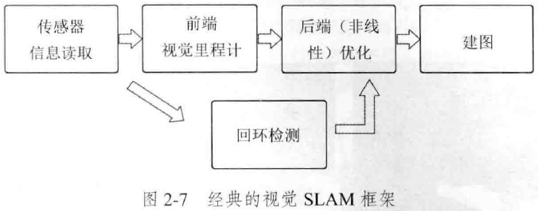

# 三维空间刚体运动

## *旋转矩阵 Rotation matrix*

### 点、向量和坐标系

* 向量内积/点乘 dot product $a\cdot b=a^Tb=\vert a\vert\vert b\vert\cos\langle a,b\rangle$
* 向量外积/叉乘 cross product $a\times b=\left\|\begin{matrix}\mathbf{e}_1&\mathbf{e}_2&\mathbf{e}_3\\a_1&a_2&a_3\\b_1&b_2&b_3\end{matrix}\right\|\triangleq a^{\wedge}b=\left[\begin{array}{c}0&-a_3&a_2\\a_3&0&-a_1\\-a_2&a_1&0\end{array}\right]b$，其中 $a^{\wedge}$ 称为反对称矩阵 Anti-Symmetric matrix 

### 坐标系间的欧式变换

* 旋转分解
  * 绕X轴 $R_X=\left[\begin{matrix}1&0&0\\0&\cos{\theta}&-\sin{\theta}\\0&\sin{\theta}&\cos{\theta}\end{matrix}\right]$
  * 绕Y轴 $R_Y=\left[\begin{matrix}\cos{\theta}&0&\sin{\theta}\\0&1&0\\-\sin{\theta}&0&\cos{\theta}\end{matrix}\right]$
  * 绕Z轴 $R_Z=\left[\begin{matrix}\cos{\theta}&-\sin{\theta}&0\\\sin{\theta}&\cos{\theta}&0\\0&0&1\end{matrix}\right]$

* 参考系的表示
  * $_B^AT$：左上角的字母为参考系，左下角的为描述对象所在参考系。因此这里表示将物体从 $\left\{A\right\}$ 参考坐标转换到 $\left\{B\right\}$ 坐标中
  * 连续参考系转换 $_B^AT\ _C^BT=_C^AT$：表示先将物体从 $\left\{A\right\}$ 参考坐标转换到 $\left\{B\right\}$ 坐标中，再将物体从 $\left\{B\right\}$ 参考坐标转换到 $\left\{C\right\}$ 坐标中，这与直接将物体从 $\left\{A\right\}$ 参考坐标转换到 $\left\{C\right\}$ 坐标中效果一样，相当于中间参考系 $\left\{B\right\}$ 不重要

* 两个坐标系之间的运动由一个旋转加上一个平移做成，这种运动称为刚体运动。刚体运动做成中，同一个向量在各个坐标系下的长度和夹角都不会发生变化，这种变换称为欧式变换 Euclidean Transform。
* $a'=\mathbf{R}a+t$ R称为旋转矩阵。n维旋转矩阵集称为特殊正交群 Special Orthogonal Group $SO(n)=\left\{\mathbf{R}\in\mathbb{R}^{n\times n}|\mathbf{R}\mathbf{R}^T=\mathbf{I}, \det{\mathbf{R}}=1\right\}$

### 变换矩阵与齐次坐标

* 多次欧式、仿射变换不是一个线性变换，因此我们引入一个数学技巧：齐次坐标。即引入第四维，其为常量1

* 将旋转和平移整合到一个变换矩阵 Transform Matrix中，变换矩阵集合称为特殊欧式群 Special Euclidean Group
  $$
  SE(3)=\left\{\mathbf{T}=\left[\begin{array}{cc}\mathbf{R}&t\\0^T&1\end{array}\right]\in\mathbb{R}^{4\times4}|\mathbf{R}\in SO(3),t\in\mathbf{R}^3\right\}
  $$

## *其他旋转表示法*

### 旋转向量/轴角 Axis-Angle

* 旋转矩阵自身具有的约束 $\det(R)=1$ 会对之后的优化求解带来麻烦，因为该矩阵的6个元素实际上是冗余的，我们需要寻找一种紧凑的方式来代表旋转
* 轴角：用一个向量，其方向与旋转轴相同，模长等于旋转角的大小
* 轴角和旋转矩阵之间转换关系
  * 轴角向旋转矩阵转换的罗德里格斯公式 Rodrigues's Formula：$\mathbf{R}=\cos{\theta}\mathbf{I}+(1-\cos{\theta}nn^T)+\sin{\theta}n^{\wedge}$
  * 旋转矩阵向轴角转换 $\theta=\arccos{\frac{tr({\mathbf{R}})-1}{2}}$

### 欧拉角 Euler Angle

* 欧拉角 $\alpha, \beta, \gamma$ 的种类

  * Proper-Euler-Angle (*z-x-z, x-y-x, y-z-y, z-y-z, x-z-x, y-x-y*) 特点是第一轴和第三轴相同

  * Tait-Bryan angles (*x-y-z, y-z-x, z-x-y, x-z-y, z-y-x, y-x-z*)，*x-y-z*（外旋）也就是滚转/俯仰/偏航角

    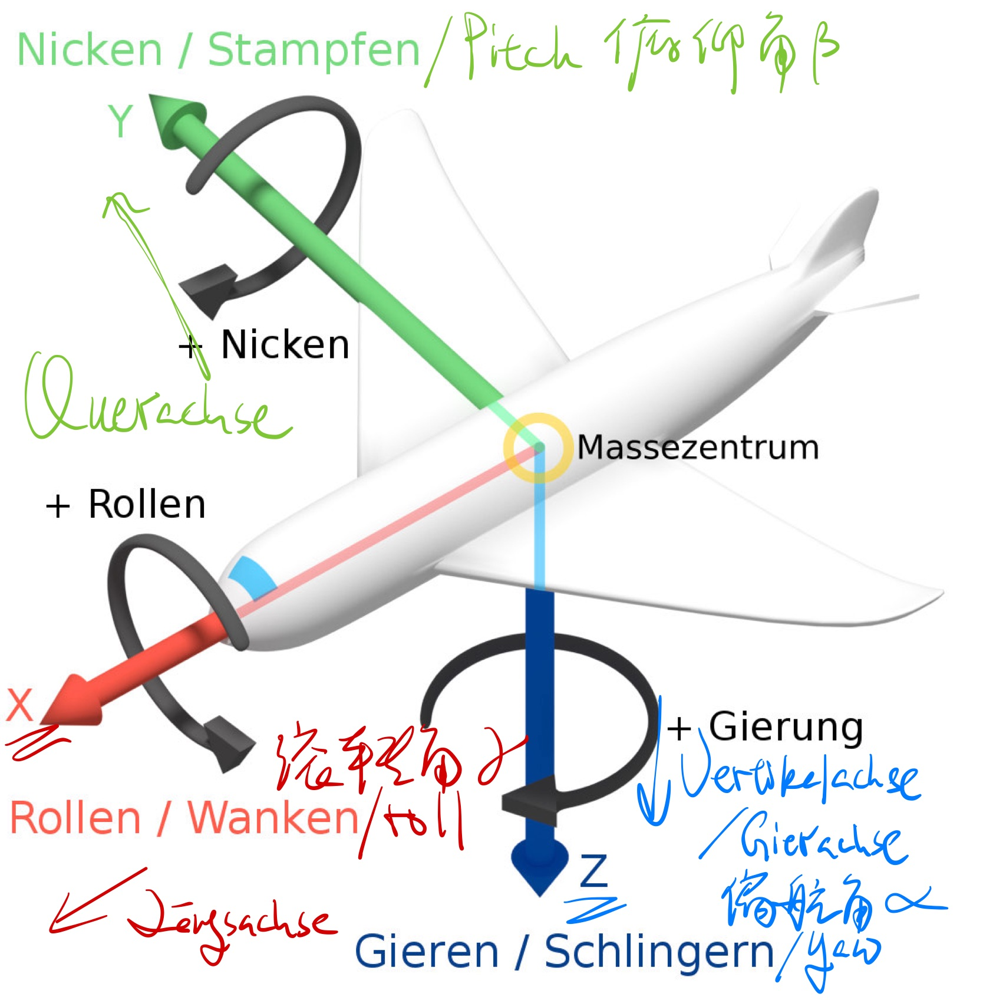

  * 单纯给出三个旋转角度是无法唯一确定旋转的，还需要给出旋转顺序和旋转轴

  * 不同的机器人生产商选择了不同的方式定义旋转。比如，史陶比（Staubli）使用的是XY’Z”，爱得普（Adept）使用ZY’Z”，库卡（KUKA）使用ZY’X”而发那科（Fanuc）与安川（Motoman）则使用XYZ。另外，ABB机器人使用四元数表达旋转，而优傲（UR）机器人使用方向矢量。以上这些定义都可以用于表达几何空间中的任何旋转。

* 欧拉角和旋转矩阵的区别

  * 外旋 Extrinsic rotations 绕固定轴进行旋转，用旋转矩阵来表示就表示外旋，对应矩阵顺次左乘。矩阵左乘表示的就是不同的坐标轴之间的变换，其结果就是向量旋转之后相对于原坐标系的位置（即原坐标系静止不动）。举个例子，给出世界坐标系和相机坐标系，知道相机坐标系相对于世界坐标系的旋转（假设为纯旋转），也就是相机的位姿，那么就若知道物体在相机坐标系中的坐标就可以看可以通过旋转矩阵计算得到世界在世界坐标系的位置
  * 内旋 Instrinsic rotations 绕自身轴也就是旋转轴旋转，用欧拉角来表示就属于内旋，对应矩阵顺次右乘。矩阵右乘的结果就是以向量本身为视角保持静止不动，而外界的坐标系在进行旋转。因此想象以静止的向量视角/动的坐标系和和以静止的坐标系/动的向量来看两者的旋转顺序完全相反
  * 比方说在问路的时候，先右转，再左转就是一种欧拉角内旋思路的指路方式，因为右和左都是根据当前的前进方向（坐标轴）而言的；而先往东走，再往北走就是一种旋转矩阵外旋的指路方式，因为都是以原坐标系为参考系的。但这种指路方式在直观上就不如第一种指路方式，因为总是要确认到底哪里是北面，这在不熟悉的城市就很困难
  * 假设 $\vec{v}=[x,y,z]$ 以x-y-z相对原坐标的顺序旋转，也就是从 $\vec{v}$ 的角度看是空间以z-y-x的顺序在进行旋转（rpy标记）
    * 欧拉角旋转 $\rightarrow R_Z\cdot R_Y\cdot R_X=\left[\begin{matrix}c\alpha c\beta&c\alpha s\beta s\gamma-s\alpha c\gamma&c\alpha s\beta c\gamma+s\alpha s\gamma\\s\alpha c\beta&s\alpha s\beta s\gamma+c\alpha c\gamma&s\alpha s\beta c\gamma-c\alpha s\gamma\\-s\beta&c\beta s\gamma&c\beta c\gamma\end{matrix}\right]$
    * 旋转矩阵 $R_Z\cdot R_Y\cdot R_X\leftarrow$
    * 可以看到两种方式得到的总旋转矩阵是一样的

* 万向锁问题 Gimbal Lock

  * 以上面的rpy为例，当俯仰角 $\beta$ 为 $\pm90\degree$ 时，旋转矩阵会变成 $\left[\begin{matrix}0&-s\alpha c\gamma&s\alpha s\gamma\\0&c\alpha c\gamma&-c\alpha s\gamma\\-1&0&0\end{matrix}\right]$，可以看到原来3个DOF只有2个DOF了，也就是说 $\alpha$ 和 $\gamma$ 不能起到对X方向的调节作用，也就是有一个方向被锁死了
  * 万向锁奇异性问题在其他所有形式的欧拉角中当中间的角度变成 $\pm90\degree$ 时都存在。理论上可以证明，只要想用3个实数来表示旋转都会不可避免地碰到奇异性问题。因为这种原理，欧拉角虽然很直观，但不适合用于插值和迭代或者滤波和优化，往往只被用于人机交互和输出验证结果

### 四元数 Quaternion

* 定义
  * 找不到不带奇异性的三维向量表示方法
  * 四元数是一种扩展复数，它既是紧凑的也没有奇异性
  * $\vec{q}=q_0+q_1\vec{i}+q_2\vec{j}+q_3\vec{k},\ q_0^2+q_1^2+q_2^2+q_3^2=1$
* 运算
* 用四元数表示旋转
* 四元数到其他旋转表示的转换

## *三维空间中的几何变换 -- 欧式、相似、放射、射影变换*

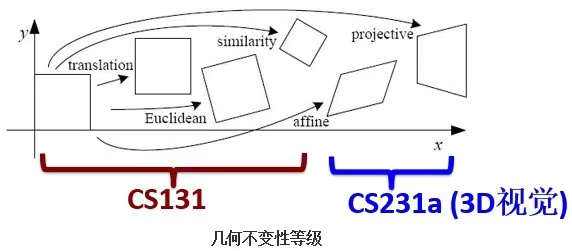

|变换名称|矩阵形式|DoF|不变性质
|:-|:-|:-|:-|
|Euclidean|$\left[\begin{array}{cc}\mathbf{R}&t\\0^T&1\end{array}\right]$|6|长度、夹角、体积
|Similarity|$\left[\begin{array}{cc}s\mathbf{R}&t\\0^T&1\end{array}\right]$|7|体积比
|Affine|$\left[\begin{array}{cc}\mathbf{A}&t\\0^T&1\end{array}\right]$|12|平行性、体积
|Perspective|$\left[\begin{array}{cc}\mathbf{A}&t\\a^T&v\end{array}\right]$|15|接触平面的相交和相切

# 李群与李代数

在SLAM中位姿式是未知的，通过观测数据求解什么样的相机位姿最符合当前观测数据是一个优化问题。而旋转矩阵由于引入了自身具有的约束这类额外约束会另求解优化问题变得困难。通过李群-李代数间的转换关系，可以把位姿估计变成无约束的优化问题从而简化求解

## *李群与李代数基础 Lie Group*

### 群 Group

* 群是一种集合加上一种运算的代数结构。群要求运算满足下列几个条件：
  * 封闭性 closeness：$\forall a_1,a_2\in A, a_1\cdot a_2\in A$
  * 结合律 associativity：$\forall a_1,a_2,a_3\in A,(a_1\cdot a_2)\cdot a_3=a_1\cdot (a_2\cdot a_3)$
  * 幺元 neutrality：$\exists a_0\in A, s.t. \forall a\in A, a_0\cdot a=a\cdot a_0=a$
  * 逆 invertibility：$\forall a^{-1}\in A, \exists a^{-1}\in A, s.t. a\cdot a^{-1}=a_0$ 整数的逆是其相反数
* 常用群
  * SO(n): Special Orthogonal group $\left\{R\in\mathbb{R}^{n\times n}|RR^T=I, \det(R)=1\right\}$
  * O(n): Orthogonal group $\left\{R\in\mathbb{R}^{n\times n}|RR^T=I\right\}$ 当$\det(R)=-1$时，称为瑕旋转，是旋转和镜像的结合
  * GL(n): General Linear group $\left\{A\in\mathbb{R}^{n\times n}|\det(A)\neq0\right\}$
  * SE(n): Special Euclidean group $\left\{A=\left[\begin{array}{c}R&T\\0&1\end{array}\right]|R\in SO(n),T\in\mathbb{R}^{n}\right\}$
  * E(n): Euclidean group $\left\{A=\left[\begin{array}{c}R&T\\0&1\end{array}\right],T\in\mathbb{R}^{n}\right\}$
  * A(n): Affine group $\left\{\begin{array}{c}A&b\\0&1\end{array}\right\}$
  * $SO(n)\subset O(n)\subset GL(n)$
  * $SE(n)\subset E(n)\subset A(n)\subset GL(n+1)$
* 李群是指具有连续（光滑）性质的群，整数加法群 $(\mathbb{Z},+)$ 这类离散群是不光滑的。而$SO(n), SE(n)$属于光滑的李群，其对于位姿估计非常重要。

### 李代数的引出

* 任意随事件变换的旋转满足 $\mathbf{R}(t)\mathbf{R}(t)^T=\mathbf{I}$
* 两边对时间求导 $\dot{\mathbf{R}}(t)\mathbf{R}(t)^T+\mathbf{R}(t)\dot{\mathbf{R}(t)^T}=0\rightarrow\dot{\mathbf{R}}(t)\mathbf{R}(t)^T=-\mathbf{R}(t)\dot{\mathbf{R}(t)^T}$
* 从而可知 $\dot{\mathbf{R}}(t)\mathbf{R}(t)^T$ 是一个反对称矩阵，对于任意反对称矩阵，我们也可以找到唯一与之对应的向量，将这个运算称为$A^{\vee}$。因此可以找到一个三维向量 $\phi(t)\in\mathbb{R}^3$ 与之对应，即 $\dot{\mathbf{R}}(t)\mathbf{R}(t)^T=\phi(t)^{\wedge}$
* 等式两边右乘 $\mathbf{R}(t)$
  $$
  \dot{\mathbf{R}}(t)\mathbf{R}(t)^T\mathbf{R}(t)=\dot{\mathbf{R}}=\phi(t)^{\wedge}\mathbf{R}(t)=\left[\begin{array}{c}0&-{\phi}_3&{\phi}_2\\{\phi}_3&0&-{\phi}_1\\-{\phi}_2&{\phi}_1&0\end{array}\right]\mathbf{R}(t)
  $$
  可以看到，要求旋转矩阵的导数，只要对其左乘一个 $\phi^{\wedge}(t)$ 矩阵即可
* 考虑$t_0=0$时，设此时旋转矩阵为 $\mathbf{R}(0)=\mathbf{I}$，根据导数定义，在$t=0$进行一阶泰勒展开得到 $\mathbf{R}(t)\approx\mathbf{R}(t_0)+\dot{\mathbf{R}}(t_0)(t-t_0)=\mathbf{I}+\phi(t_0)^{\wedge}(t)$：$\phi$ 反映了 $\mathbf{R}$ 的导数性质，故称它在 $SO(3)$的正切空间 Tangent Space上
* 解上面的微分方程可以得到 ${\color{red}\mathbf{R}=\exp{\left(\phi_0^{\wedge}(t)\right)}}$
  * 给定某时刻的 $\mathbf{R}$，就能求得一个对应的 $\phi$，它描述了 $\mathbf{R}$ 在局部的导数关系。$\phi$正是对应到 $SO(3)$ 上的李代数 $\mathfrak{so}(3)$
  * $\mathbf{R}$ 与 $\phi$ 之间的计算关系称为李群与李代数间的指数/对数映射

### 李代数的定义

* 每个李群都有与之对应的李代数。李代数描述了李群的局部性质/单位元附近的正切空间。
* 李代数 $\mathfrak{g}$由一个集合$\mathbb{V}$、一个数域$\mathbb{F}$和一个二元运算 $[,]$（称为李括号）组成。李代数需要满足如下性质
  * 封闭性：$\forall \mathbf{X},\mathbf{Y}\in\mathbb{V},[\mathbf{X},\mathbf{Y}]\in\mathbb{V}$
  * 双线性：：$\forall \mathbf{X},\mathbf{Y},\mathbf{Z}\in\mathbb{V},a,b\in\mathbb{F}$，有$[a\mathbf{X}+b\mathbf{Y},\mathbf{Z}]=a[\mathbf{X},\mathbf{Z}]+b[\mathbf{Y},\mathbf{Z}], [\mathbf{Z},a\mathbf{X}+b\mathbf{Y}]=a[\mathbf{Z},\mathbf{X}]+b[\mathbf{Z},\mathbf{Y}]$
  * 自反性：$\forall\mathbf{X}\in\mathbb{V},[\mathbf{X},\mathbf{X}]=0$
  * 雅可比等价：$\forall \mathbf{X},\mathbf{Y},\mathbf{Z}\in\mathbb{V},[\mathbf{X},[\mathbf{Y},\mathbf{Z}]]+[\mathbf{Z},[\mathbf{X}+\mathbf{Y}]],[\mathbf{Y},[\mathbf{Z},\mathbf{X}]]=0$
* 李代数 $\mathfrak{so}(3)$ 群
  * 三维向量 $\mathbb{R}^3$ 上定义的叉乘就是一种李括号 $\mathfrak{g}=(\mathbb{R^3,\mathbb{R},\times})$
  * $\mathfrak{so}(3)=\left\{\phi^{\wedge}|\ \phi\in\mathbb{R}^3\right\}$ 也就是说反对称矩阵都属于李代数群
  * $\Phi=\phi^{\wedge}=\left[\begin{array}{c}0&-{\phi}_3&{\phi}_2\\{\phi}_3&0&-{\phi}_1\\-{\phi}_2&{\phi}_1&0\end{array}\right]\in\mathbb{R^{3\times3}}$
  * $[\phi_1,\phi_2]=(\Phi_1\Phi_2-\Phi_2\Phi_1)^{\vee}$
  * $\mathfrak{so}(3)$ 是一个由三维向量组成的集合，每个向量对应一个反对称矩阵，可以用于表达旋转矩阵的导数。它与 $SO(3)$ 的关系由指数映射 $\mathbf{R}=\exp{\phi_0^{\wedge}(t)}$ 给定
* 李代数 $\mathfrak{sg}(3)$ 群
  * $\mathfrak{se}(3)=\left\{\xi=\left[\begin{array}{c}\rho\\\phi\end{array}\right]\in\mathbb{R}^6, \phi\in\mathfrak{so}(3),\xi^{\wedge}=\left[\begin{array}{cc}\phi^{\wedge}&\rho\\\mathbb{0}^T&0\end{array}\right]\right\}$
  * $[\xi_1,\xi_2]=(\xi_1^{\wedge}\xi_2^{\wedge}-\xi_2^{\wedge}\xi_1^{\wedge})^{\vee}$

## *指数与对数映射*

### SO(3)上的指数映射 $\mathfrak{so}(3)\rightarrow SO(3);\ \phi^{\wedge}\mapsto \exp{(\phi^{\wedge})}$

* 任意矩阵的指数映射可以写成一个泰勒展开 $\exp{(\phi^{\wedge})}=\sum\limits^{\infty}\limits_{n=0}{\frac{1}{n!}(\phi^{\wedge})^n}$，其只有在收敛的时候才有结果，但这个展开不能拿来计算（只用来推导稳定性）

* 拆分 $\phi=\theta\mathbf{a},\lVert a\rVert=1$，通过以下两条性质可进行计算
  * $\mathbf{a}^{\wedge}\mathbf{a}^{\wedge}=\mathbf{a}\mathbf{a}^T-\mathbf{I}$（可直接代入 $a^{\wedge}=\left[\begin{array}{c}0&-a_3&a_2\\a_3&0&-a_1\\-a_2&a_1&0\end{array}\right]$ 推导得到，下式同）
  * $\mathbf{a}^{\wedge}\mathbf{a}^{\wedge}\mathbf{a}^{\wedge}=-\mathbf{a}^{\wedge}$

  $$
  \left\{\begin{array}{l}\theta=\arccos{\left(\frac{trace(R)-1}{2}\right)}\\\mathbf{a}=\frac{1}{2\sin{\theta}}\left[\begin{array}{l}r_{32}-r_{23}\\r_{13}-r_{31}\\r_{21}-r_{12}\end{array}\right]\end{array}\right.
  $$

* 通过泰勒展开和相关项合并后可以得到 $\exp{(\phi^{\wedge})}=\cos{\theta}\mathbf{I}+(1-\cos{\theta}aa^T)+\sin{\theta}a^{\wedge}$
  * 该公式就是罗德里格斯公式，这意味着 $\mathfrak{so}(3)$ 实际上就是由旋转向量构成的空间，而指数映射就是罗德里格斯公式。通过它们可以把 $\mathfrak{so}(3)$ 中任意一个向量对应到一个位于 $SO(3)$ 中的旋转矩阵。这说明李代数空间和轴角表示方法是等价的
  
  * 相反也可以定义反方向 $SO(3)\rightarrow \mathfrak{so}(3)$ 的对数映射
    $$
    \phi=\ln{\mathbf{(R)}^{\vee}}=\left(\sum\limits_{n=0}\limits^{\infty}{\frac{(-1)^n}{n+1}(\mathbf{R}-\mathbf{I})^{n+1}}\right)^{\vee}
    $$
  
  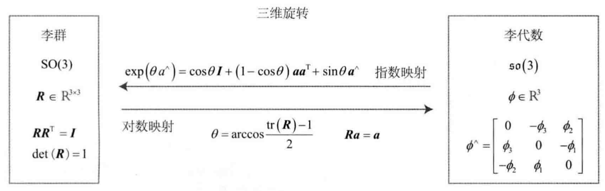
  
  

### SE(3)上的指数映射

* 指数映射：$\exp{(\xi^{\wedge})}=\left[\begin{array}{cc}\exp{\phi^{\wedge}}&\mathbf{J}\rho\\0^T&1\end{array}\right]$，$\mathbf{J}=\frac{\sin{\theta}}{\theta}\mathbf{I}+(1-\frac{\sin{\theta}}{\theta})\mathbf{a}\mathbf{a}^T+\frac{1-\cos{\theta}}{\theta}\mathbf{a}^{\wedge}$

* 对数映射

  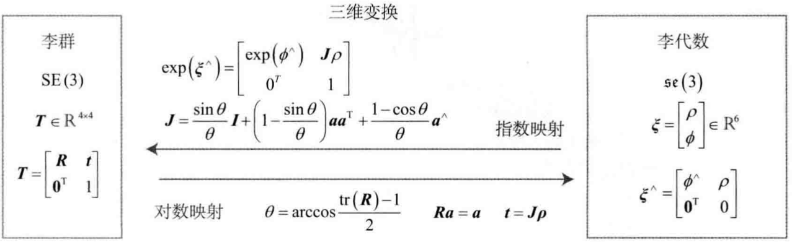

  

## *李代数求导与扰动模型*

### BCH公式与近似形式

* 两个李代数指数映射乘积由Baker-Campbell-Hausdorff（BCH）公式给出
  $$
  \ln{(\exp{A}\exp{B})}=A+B+\frac{1}{2}[A,\ B]+\frac{1}{12}[A,\ [A,\ B]]-\frac{1}{12}[B,[A,\ B]]+...
  $$
  [ ]为李括号。BCH表示当计算两个矩阵指数之积时，它们会产生一些由李括号组成的余项
  
* 特别地，当考虑 $SO(3)$ 上的李代数 $\ln{(\exp{\phi_1^{\wedge}}\exp{\phi_2^{\wedge}})}^{\vee}$，当 $\phi_1$ 或 $\phi_2$ 为小量时，小量二次以上的项都可以被忽略，此时BCH拥有线性近似表达
  $$
  \ln{(\exp{\phi_1^{\wedge}}\exp{\phi_2^{\wedge}})}^{\vee}\approx\left\{\begin{array}{c}J_l(\phi_2)^{-1}\phi_1+\phi_2,&if\ \phi_1\ is\ small\\J_r(\phi_1)^{-1}\phi_2+\phi_2,&if\ \phi_2\ is\ small\end{array}\right.\\此处的 \ J_l=\mathbf{J}=\frac{\sin{\theta}}{\theta}\mathbf{I}+(1-\frac{\sin{\theta}}{\theta})\mathbf{a}\mathbf{a}^T+\frac{1-\cos{\theta}}{\theta}\mathbf{a}^{\wedge},\ J_r(\phi)=J_l(-\phi)
  $$

* 在李群上对 $R$ 左乘小扰动 $\Delta R$，根据BCH近似，其李代数为
  $$
  \exp{(\Delta\phi^{\wedge})}\exp{(\phi^{\wedge})}=\exp{\left((\phi+J_l^{-1}(\phi)\Delta\phi)^{\wedge}\right)}
  $$

* 反之，在李代数上进行除法，让一个 $\phi$ 加上 $\Delta\phi$，那么可以近似为李群上带左右雅可比的乘法
  $$
  \exp{\left((\phi+\Delta\phi)^{\wedge}\right)}=\exp{((J_l\Delta\phi)^{\wedge})}\exp{(\phi^{\wedge})}=\exp{(\phi^{\wedge})}\exp{((J_l\Delta\phi)^{\wedge})}
  $$

### SO(3)上的李代数求导

$$
\min\limits_{T}{J(T)}=\sum\limits_{i=1}^{N}{\Vert z_i-Tp_i\Vert_2^2}
$$

* 用给李代数表示姿态，然后根据李代数加法对李代数求导
* 对李群左乘或右乘微小扰动，然后对该扰动求导

### 李代数求导

李群不满足加法，不能计算导数，转换为其李代数

$$
\frac{\partial(Rp)}{\partial\phi}\Rightarrow\frac{\partial(\exp{(\phi^{\wedge})}p)}{\partial\phi}=(-Rp)^{\wedge}J_l
$$
包含比较复杂的 $J_l$，计算麻烦

### 扰动模型（左乘）

$$
\frac{\partial(Rp)}{\partial\varphi}=\lim\limits_{\varphi\rightarrow 0}{\frac{\exp(\varphi^{\wedge})\exp(\phi^{\wedge})p-\exp(\phi^{\wedge})p}{\varphi}}=\lim\limits_{\varphi\rightarrow 0}{\frac{(I+\varphi^{\wedge})\exp(\phi^{\wedge})p-\exp(\phi^{\wedge})p}{\varphi}}\\=\lim\limits_{\varphi\rightarrow 0}{\frac{\varphi^{\wedge}Rp}{\varphi}}=\lim\limits_{\varphi\rightarrow 0}{\frac{-(Rp)^{\wedge}\varphi}{\varphi}}=-(Rp)^{\wedge}
$$

### SE(3)上的李代数求导

$$
\frac{\partial(Tp)}{\partial\delta\xi}=\lim\limits_{\delta\xi\rightarrow0}{\frac{\exp(\delta\xi^{\wedge})\exp(\xi^{\wedge})p-\exp{(\xi^){\wedge}p}}{\delta\xi}}=\lim\limits_{\delta\xi\rightarrow0}{\frac{\exp(I+\delta\xi^{\wedge})\exp(\xi^{\wedge})p-\exp{(\xi^{\wedge}})p}{\delta\xi}}\\=\lim\limits_{\delta\xi\rightarrow0}{\frac{\delta\xi^{\wedge}\exp{\xi^{\wedge}}p}{\delta\xi}}=\lim\limits_{\delta\xi\rightarrow0}{\frac{\left[\begin{array}{c}\delta\phi^{\wedge}&\delta p\\0^T&0\end{array}\right]\left[\begin{array}{c}Rp+t\\1\end{array}\right]}{d\xi}}=\lim\limits_{\delta\xi\rightarrow0}{\frac{\left[\begin{array}{c}\delta\phi^{\wedge}(Rp+t)+\delta p\\0^T\end{array}\right]}{d\xi}}\triangleq(Tp)^{\odot}
$$

## 实践 Sophus

# 相机与图像

## *相机模型*

### 针孔相机模型

* 小孔成像模型

  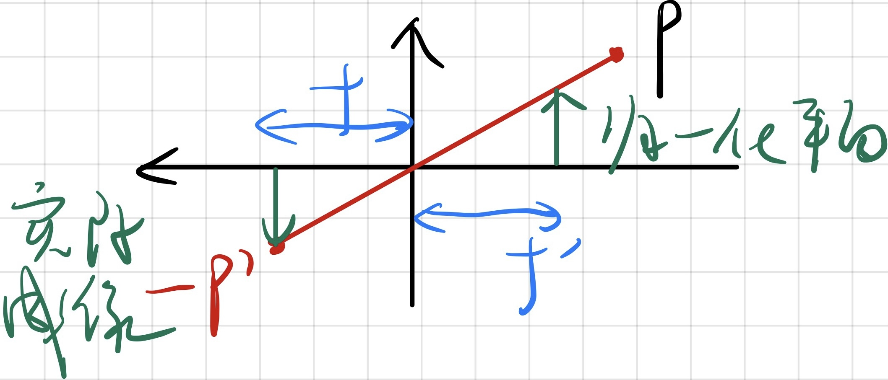

* 根据模型原理可以得到相机坐标系中 $(X, Y)$ 的点P与其投影的关系： $\frac{Z}{f}=-\frac{X}{X'}=-\frac{Y}{Y'}$

  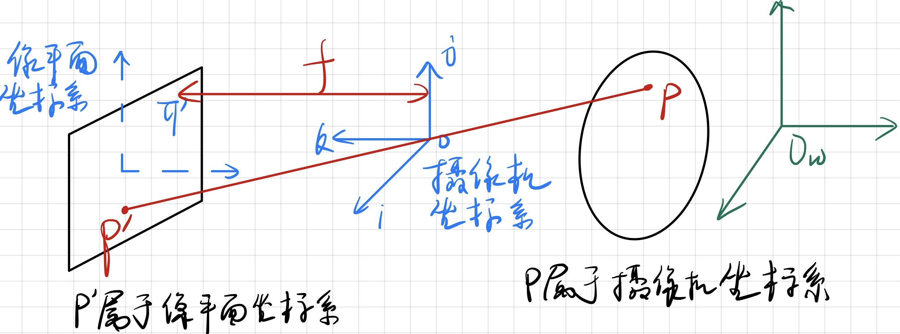

* 归一化成像平面：
  * 原式中的负号表示小孔成像得到的像和是图像的倒像。为了便于处理和简化数学表示，归一化图像平面。原理上相当于是把投影相对于小孔做了对称。实际也要翻转相机拍摄得到的倒像，因此这样的数学操作是合理的。这种情况也被称为针孔模型
  * $\frac{Z}{f}=\frac{X}{X'}=\frac{Y}{Y'}\rightarrow\left\{\begin{array}{c}X'=f\frac{X}{Z}\\Y'=f\frac{Y}{Z}\end{array}\right.$ 从该式中也可以看出，无论X和Z（或者Y和Z）有多大，在固定焦距时最后得到的投影都是相同的，也就是失去了尺度信息
  
* 相机坐标系变换为像素坐标系 $(u,v)$ 得到内参数矩阵
  * 将像素坐标系的原点定义在图像的左上角。像素坐标系与成像平面之间，相差一个缩放和一个远点的平移，设缩放倍数 $\alpha,\beta$（单位为pixel/m），平移了 $[c_x,c_y]^T$（单位为pixel）
  
  * $\left\{\begin{array}{c}u=\alpha X'+c_x\\v=\beta Y'+c_y\end{array}\right.$ 代入 $X',Y'$，合并 $f_x=\alpha f,\ f_y=\beta f$ 得到 $\left\{\begin{array}{c}u=f_x\frac{X}{Z}+c_x\\v=f_y\frac{Y}{Z}+c_y\end{array}\right.$
  
  * 左侧为齐次坐标，右侧为非齐次坐标
    $$
    \left[\begin{array}{c}u\\v\\1\end{array}\right]=\frac{1}{Z}\left[\begin{array}{c}f_x&0&c_x\\0&f_y&c_y\\0&0&1\end{array}\right]\left[\begin{array}{c}X\\Y\\Z\end{array}\right]\triangleq\frac{1}{Z}\mathbf{K}_f\mathbf{P}\rightarrow Z\left[\begin{array}{c}u\\v\\1\end{array}\right]=\left[\begin{array}{c}f_x&0&c_x\\0&f_y&c_y\\0&0&1\end{array}\right]\left[\begin{array}{c}X\\Y\\Z\end{array}\right]\triangleq \mathbf{K}_f\mathbf{P}
    $$
  
  * 考虑摄像机偏斜，引入Skwer factor $s_{\theta}$： $K=K_sK_f=\left[\begin{array}{c}f_xs_x&fs_{\theta}&c_x\\0&f_ys_y&c_y\\0&0&1\end{array}\right]$
  
    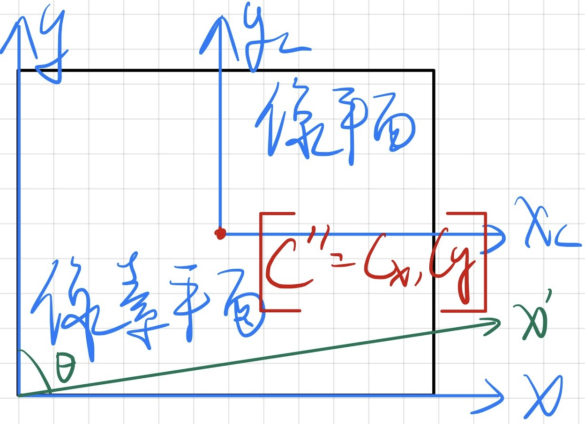
  
  * K被称为内参数矩阵 Intrinsics Matrix。K由生产厂商告知，或者通过单目棋盘格张正由标定法进行标定 Calibration
  
  * In CV II
    
    
    $$
    \lambda Z\left[\begin{array}{c}x'\\y'\\1\end{array}\right]=\left[\begin{array}{c}S_x&S_{\theta}&0\\0&S_y&O_y\\0&0&1\end{array}\right]\left[\begin{array}{c}f&0&0\\0&f&0\\0&0&1\end{array}\right]\left[\begin{array}{c}1&0&0&0\\0&1&0&0\\0&0&1&0\end{array}\right]\left[\begin{array}{c}X\\Y\\Z\\1\end{array}\right]=K_sK_f\Pi_0X
    $$
    Assuming Z to be a constant $\lambda>0$, $S_{\theta}$ skew matrix, $\Pi_0$ Standard projection matrix, $\Pi$ General projection matrix
  
* 世界坐标系变换为相机坐标系得到外参数矩阵
  * 相机是在运动的，相机坐标系是根据相机在世界坐标系（$P_w$）中的位姿所确定的。而相机的位姿根据由旋转矩阵 $\mathbf{R}$ 和平移向量 $t$ 所确定
  * $ZP_{uv}=Z\left[\begin{array}{c}u\\v\\1\end{array}\right]=\mathbf{K}\mathbf{P}=\mathbf{K}(\mathbf{R}P_w+t)=\mathbf{K}[R\ T]P_w=MP_w$
    * $[R\ T]$ 称为相机的外参数矩阵 Extrinsics Matrix
    * M为相机的总参数矩阵
  * $(RP_w+t)=[X,Y,Z]^T\rightarrow [X/Z,Y/Z,1]^T$ 最后得到的是归一化坐标。从这个模型中可以看出，如果对相机坐标同时乘以任意非零常数，归一化坐标都是一样的，这说明点的深度在投影过程中丢失了，所以单目视觉中无法得道像素点的深度值
  
* 总结
  $$
  {\color{blue}P'_{3\times 1}}={\color{red}K_{3\times 3}}[I\ \ \ 0]{\color{purple}P_{4\times 1}}={\color{red}K}[I\ \ \ 0]{\color{red}\left[\begin{array}{c}R&T\\0&1\end{array}\right]}{\color{orange}P_{w,4\times 1}}={\color{red}K[R\ \ \ T]}{\color{orange}P_w}={\color{green}M_{3\times 4}}{\color{orange}P_w}
  $$

* Preimage and Coiamge
  * Preimage 原像：像平面上一条直线L的preimage指的是过光心与直线L的平面，一个点P的preimage指的是过光心与点P的直线，所以preimage指的是可能会投影到该点活该直线的所有空间三维点的集合，它构成了一个二维的空间
  * Coimage 余像：与preimage正交的点的集合。直观上，与直线的preimage（一个平面）垂直的是一条直线；与点的preimage（一条直线）垂直的是一个平面

### 畸变 Distorsion

* 畸变是因为相机透镜在生产中或多或少的误差所造成的，不可能完全避免 Impeferc lenses and manufacturing errors

* 分类
  * 桶形畸变 Barrel distorsion
  
    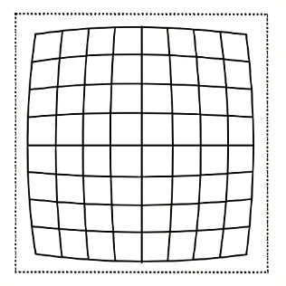
  
  * 枕形畸变 Pincushion distorsion
  
    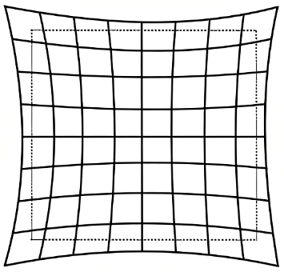
  
* 畸变模型
  * 多项式畸变模型 Polynomial distortion model
    * 径向：$\left\{\begin{array}{c}x_{corrected}=x_d(1+a_1r^2+a_2r^4)\\y_{corrected}=y_d(1+a_1r^2+a_2r^4)\end{array}\right.$
    * 切向：$\left\{\begin{array}{c}x_{corrected}=x+2p_1xy+p_2(r^2+2x^2)\\y_{corrected}=y+p_1(r^2+2y^2)+2p_2xy\end{array}\right.$
  * A more general model: FOV (Field of Vision)/ATAN (ArcTangent) model by Devernay and Faugeras
    * $g_{ATAN}(r)=\frac{1}{\omega r}\arctan{\left(2r\tan{\left(\frac{\omega}{2}\right)}\right)}$
    * Cannot be used to on camera whose FOV is greater than 180 degree
  
* Pixel coordinates of the distorted camera are $\left[\begin{array}{l}u_d\\v_d\\1\end{array}\right]=K\left[\begin{array}{c}\pi_d(\widetilde{X})\\1\end{array}\right]=K\left[\begin{array}{c}g\left(\lVert\pi(\widetilde{X})\rVert\right)\pi_d(\widetilde{X})\\1\end{array}\right]$

* 畸变矫正与插值算法（见Vision/CV2/Algorithm中的畸变矫正与线性插值算法。Tips：线性插值是畸变矫正与图像放大缩小旋转等算法的核心）

### 弱透视投影摄像机 Weak Perspective

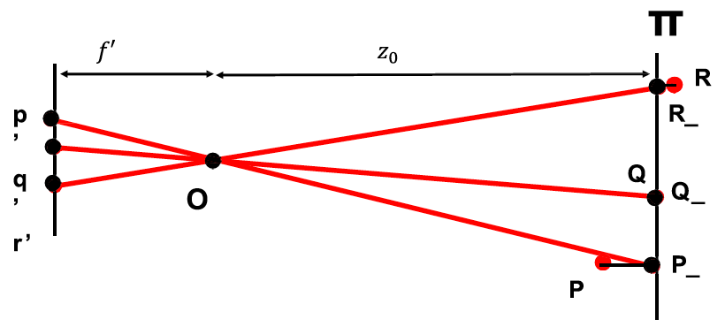

* 当被投影物体离投影面较远时，被投影物体的点都近似的在同一个面上
* $\left\{\begin{array}{c}x'=\frac{f'}{z}x\\y'=\frac{f'}{z}y\end{array}\right.\overrightarrow{z=z_0}\left\{\begin{array}{c}x'=\frac{f'}{z_0}x\\y'=\frac{f'}{z_0}y\end{array}\right.$ 令放大率m为 $m=\frac{f'}{z_0}$，此时映射变成了线性关系
* 弱透视投影在数学方面更简单，当物体较小且较远时准确，常用于图像识别任务

### 正交投影摄像机 Orthogonal Perspective $\triangleq$

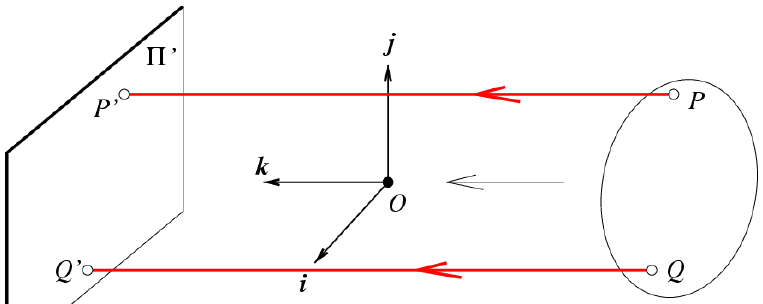

* 摄像机中心到像平面的距离无限远时
  $$
  \left\{\begin{array}{c}x'=\frac{f'}{z}x\\y'=\frac{f'}{z}y\end{array}\right.\rightarrow\left\{\begin{array}{c}x'=x\\y'=y\end{array}\right.
  $$

* 正交投影更多应用在CAD等工业设计软件中

### 双目相机模型 Stereo

### RGB-D模型

# 非线性优化

## *状态估计问题*

## *线性最小二乘*

对于广义最小二乘 Generalized Least Square $\min\limits_{x}{(a-Bx)^T\Sigma^{-1}(a-Bx)}$ 有闭合的代数解：$\widehat{x}=(B^T\Sigma^{-1}B)^{-1}B^T\Sigma^{-1}a$

## *非线性最小二乘*（见Linear Algebra）

以下三类非线性最小二乘方法的目的是用来解BA等通过李代数构建的无约束优化方程

### 一阶梯度下降和二阶牛顿法

考虑第k次迭代，对目标函数在 $x_k$ 处作泰勒展开，$F(x_k+\Delta x_k)\approx F(x_k)+J(x_k)^T \Delta x_k+\frac{1}{2}\Delta x_k H(x_k)\Delta x_k$

* 一阶梯度下降法
  * 保留泰勒展开函数的一阶导 $F(x_k+\Delta x_k)\approx F(x_k)+J(x_k)^T \Delta x_k$，它的梯度为 $J(x_k)^T$
  * 取增量为反向梯度 $\Delta x^*=-J(x_k)^T$，按照一定的方法设定步长 $\lambda$
  * 进行迭代直到误差值降到设定的阈值 $\varepsilon$ 以下
  * 梯度下降法很有可能会产生会产生锯齿形轨迹增加迭代用时
* 二阶牛顿法
  * 舍去k，假设对任意步的迭代都有效，此时保留二阶泰勒展开项，此时增量方程为 $\Delta x^*=\underset{x}{\arg\min\ }{\left(F(x)+J(x)^T\Delta x+\frac{1}{2}\Delta x^TH\Delta x\right)}$
  * 对增量方程求导得到增量 $J+H\Delta x=0\Rightarrow{\color{red}\Delta x=-\frac{J}{H}}$
  * 进行迭代直到误差值降到设定的阈值 $\varepsilon$ 以下
  * 牛顿法需要计算Hessen矩阵，这在问题规模比较大时会非常苦难，通常避免计算 $H$

### 高斯牛顿法 Gauss-Newton

* 对原函数进行一阶泰勒展开 $f(x+\Delta x)\approx f(x)+J(x)^T\Delta x$，得到增量方程 $\Delta x^*=\underset{x}{\arg\min\ }{\Delta x}{\frac{1}{2}\Vert f(x)+J(x)^T\Delta x\Vert^2}$
* 对增量方程 w.r.t $\Delta x$ 展开后求导
  $$
  \frac{1}{2}\Vert f(x)+J(x)^T\Delta x\Vert^2=\left(\frac{1}{2}(f(x)+J(x)^T\Delta x\right)^T\left(\frac{1}{2}(f(x)+J(x)^T\Delta x\right)=\frac{1}{2}\left(\Vert f(x)\Vert_2^2+2f(x)J(x)^T\Delta x+\Delta x^TJ(x)J(x)^T\Delta x\right)
  $$
  
  * w.r.t $\Delta x$ 求导并令其为0：$J(x)f(x)+J(x)J^T(x)\Delta x=0\rightarrow J(x)J^T(x)\Delta x=-J(x)f(x)\rightarrow H(x)\Delta x=g(x)$ 可以看到这个形式和二阶牛顿法的增量方程形式是很相似的，但GN方法利用 $JJ^T$ 代替了计算复杂的 $H$
  * 总结：${\color{red}\Delta=-(J^TJ)^{-1}J^Tr}$
* 算法步骤
  * 给定初始值 $x_0$
  * 对于第k次迭代，求出当前的雅可比矩阵 $J(x_k)$ 和误差 $f(x_k)$
  * 求解增量方程 $H\Delta x_k=g$
  * 若 $\Delta x_k<\varepsilon$ 则停止，否则，令 $x_{k+1}=x_k+\Delta x_k$，返回第2步
* GN方法是最优化方法中最简单的方法之一。但有可能出现 $JJ^T$ 为奇异矩阵或近似奇异矩阵的病态矩阵 ill-conditioned，此时增量的稳定性较差，导致算法不收敛；就算 $H$ 既不奇异也well-posed，若 $\Delta d$ 选择的不好，则可能不会收敛到全局或局部最优点，导致局部近似解不够准确。

### 列文伯格-马夸尔特方法 Levenberg-Marquardt

* LM方法是相比GN方法更加鲁棒的方法，但它的收敛速度可能比GN法慢，又被称为阻尼牛顿法（Damped Newton Method）
* GN方法采用的近似二阶泰勒展开只在展开点附近有较好的近似效果，所以定义一个范围 $\rho=\frac{f(x+\Delta x)-f(x)}{J(x)^T\Delta x}$ 来衡量优化效果并进行自适应调整，该范围称为信赖区域 Trust Region
* ${\color{red}-(J^TJ+\lambda I_n)^{-1}J^Tr}$
* 算法步骤
  * 给定初始值 $x_0$，以及初始优化半径 $\mu$
  * 对于第k次迭代，在GN法的基础上加上信赖区域，求解 $\underset{x_k}{\arg\min\ }{\Delta x_k}{\frac{1}{2}\Vert f(x_k)+J(x_k)^T\Delta x_k\Vert^2},\ s.t.\Vert D\Delta x_k\Vert^2\leq\mu$
  * 计算 $\rho=\frac{f(x+\Delta x)-f(x)}{J(x)^T\Delta x}$
  * 若 $\rho>\frac{3}{4}$，则设置 $\mu=2\mu$；若 $\rho<\frac{1}{4}$，则设置 $\mu=0.5\mu$。这里近似范围扩大倍数和 $\rho$ 的阈值都是经验值
  * 继续迭代
* 对于第二部中的带约束非线性需要用拉格朗日乘数法解

# 视觉里程计1：特征点法 Visual Odometry VO

SLAM系统分为前端和后段，其中前端也称为视觉里程计。视觉里程计根据相邻图像的信息估计出粗略的相机位姿，给后端提供较好的初始值

## *特征点法*

### 特征点 Feature Point

* 角点
  * 主流角点：Harris、FAST、GFTF
  * 问题：角点对于尺度变换、旋转等不鲁棒
* 局部图像特征
  * 优势
    * 对光照、旋转、尺度变换、遮挡等干扰都有效
    * 都具有较好的并行性，可以通过GPU等设备加速计算
  * 主流图像特征点
    * SIFT Scale-Invariant Feature 尺度不变特征：SIFT是一种性能优良的特征点，但其计算量很大。只利用CPU进行计算很难达到实时计算。在引入GPU并行后可以满足实时计算的要求，但同时引入GPU将导致整个SLAM系统的成本上升
    * SURF Speeded Up Robust Features 加速鲁棒性特征
    * ORB Oriented FAST and rotated BRIEF：ORB是质量与性能之间较好的平衡
  * 构成
    * 关键点 Key-point
    * 描述子 Descriptor
    * 在算法中计算特征点意思是提取关键点并其对应的描述子

### ORB特征

* FAST角点提取 Features from Accelerated Segment Test
* BRIEF描述子 Binary Robust Independent Elementary Feature

### 特征匹配

## *2D-2D：对极几何*

得到匹配点后，通过极几何关系得到帧与帧之间的运动关系（外参数矩阵）。根据相机原理的不同，有不同的计算方法

* 根据双目相机拍摄得到的2组2D匹配点：对极几何
* 当相机为双目、RBG-D时，或者通过某种方式得到了距离信息，此时是根据2组3D点匹配点进行估计：ICP
* 当匹配点为一组为3D点，一组为2D点，即得到了一些3D点和它们在相机的投影位置时，此时通过PnP求解

### 对极约束

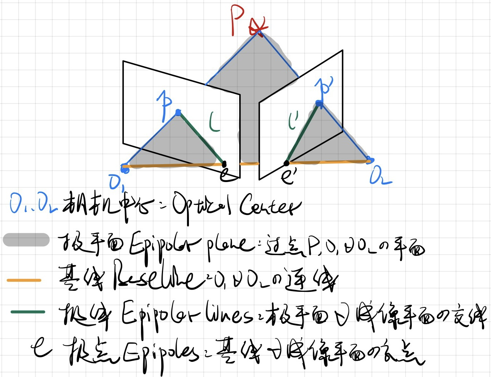

* $x_2^T\widehat{T}Rx_1=x_2^TEx_1=0$ 描述了同一场景或物体的两个视点图像间的几何关系，将搜索范围
* 推导
  * 设 $P$ 在 $o_1,\ o_2$ 两个相机坐标系下的坐标分别为 $X_1,\ X_2$，其通过 $R,\ T$ 连接：$X_2=RX_1+T$
  * $X_1,\ X_2$ 在相平面的投影为 $X_1=\lambda_1 x_1,\ X_2=\lambda_2 x_2\rightarrow \lambda_2x_2=\lambda_1Rx_1+T$
  * 因为 $T\times T=\widehat{T}T=0$， 所以两边乘 $\widehat{T}$ 消去T：$\lambda_2\widehat{T}x_2=\lambda_1\widehat{T}Rx_1+\sout{\widehat{T}T}=\lambda_1\widehat{T}Rx_1$
  * 因为 $x\cdot(T\times x)=0$ 所有左右同乘 $x_2^T$（转置是为了矩阵计算的统一性）：$\lambda_2x_2^T\widehat{T}x_2=0=\lambda_1x_2^T\widehat{T}Rx_1\leftrightarrows x_2^T\widehat{T}Rx_1=0\triangleq x_2^TEx_1=0$
* 几何定义
  * Epipolar plane 极平面
  * Epipole 极点
  * Epipolar line 极线
* 极点、极线性质
  * The coimages of epipolar lines $l_1,\ l_2$ associated with the two image points $x_1,\ x_2$ can be expressed as: $l_2\sim Ex_1,\ l_1\sim E^Tx_2$（这里分别用 $l_1，l_2$ 和 $x_1，x_2$ 代替图中左、右平面上的 $p，p'$ 和 $l，l'$）
    * 右边平面上：投影点位于极线上满足方程 $x_2^T\vec{l_2}=0$
    * 左右平面上的两个以像素坐标表示的 $x_1,\ x_2$ 满足极约束：$x_2^TEx_1=0$（此处的 $x_1,x_2$ 都为像素坐标）
    * 结合上两式：equal up to a scalar factor $l_2\sim Ex_1$
    * 同理有 $l_1\sim E^Tx_2$
  * $Ee_1=0,\ e_2^TE=0$：$e_1$ 在极线上，有 $e_1^T\vec{l_1}=0=e_1^T(E^Tx_2)=Ee_1=0$，同理有 $e_2^TE=0$
  * $l_i^Te_i=0,\ e_i^Tx_i=0$
* $E=\widehat{T}R$，$R\in SO(3)$ 已经被约束了，但是 $T$ 是没有约束的，也就是说对于任意的 $\lambda$，都有 $x_2^T\lambda \widehat{T}Rx_1=0$，都满足极约束。这很好理解，因为对于同一个三角形，对于任意放大或缩小生成的三角形都是相似的。$T$ 的尺度等价特性会造成后续三角化和重构的一系列问题

### 本质矩阵 Essential Matrix $E=t^{\wedge}R=t_{[x]}R$

* Essential space $\mathcal{E}\triangleq\left\{\widehat{T}R|R\in SO(3),\ T\in\mathbb{R}^3\right\}\sub\mathbb{R}^{3\times3}$
* Characterization of essential matrix 本质矩阵的内在性质：当且仅当 $E$ 的奇异值是 $[\sigma,\sigma,0]^T$ 的时候 $E$ 是本质矩阵
  * 引理：For a vector $T\in\mathbb{R}^3$ and a matrix $K\in\mathbb{R}^{3\times 3}$, if $\det{K}=+1$ and $T'=KT$, then $\widehat{T}=K^T\widehat{T'}K$
  * 必要性
    * 假设对于任意 $E$，至少存在一对 $T,R$ 使 $E=\widehat{T}R$，设存在一个旋转矩阵 $R_0$，定义 $a=R_0T=\left[\begin{array}{c}0&0&\Vert T\Vert\end{array}\right]^T\in\mathbb{R}^3$
    * 由于 $\det{R_0}=+1$，则根据引理可知 $\widehat{T}=R_0^T\widehat{a}R_0$
    * $EE^T=\widehat{T}RR^T\widehat{T}^T=\widehat{T}\widehat{T}^T=R_0^T\widehat{a}\widehat{a}^TR_0$，其中 $\widehat{a}\widehat{a}^T=\left[\begin{array}{c}0&-\Vert T\Vert&0\\\Vert T\Vert&0&0\\0&0&0\end{array}\right]\left[\begin{array}{c}0&\Vert T\Vert&0\\-\Vert T\Vert&0&0\\0&0&0\end{array}\right]=\left[\begin{array}{c}\Vert T\Vert^2&0&0\\0&\Vert T\Vert^2&0\\0&0&0\end{array}\right]$，因此可以证明 $E$ 的奇异值矩阵就是 $\left[\begin{array}{c}\sigma&0&0\\0&\sigma&0\\0&0&0\end{array}\right]$ 形式的
    * 证明 $U,V$ 都是行列式为+1的正交矩阵：令 $R_Z(+\frac{\pi}{2})=\left[\begin{array}{c}0&-1&0\\1&0&0\\0&0&1\end{array}\right]$
      * $\widehat{a}=R_Z(+\frac{\pi}{2})R_Z^T(+\frac{\pi}{2})\widehat{a}=R_Z(+\frac{\pi}{2})\ diag\left\{\Vert T\Vert,\ \Vert T\Vert,\ 0\right\}R_0R$
      * $E=\widehat{T}R=\widehat{T}=R_0^T\widehat{a}R_0R={\color{red}R_0^TR_Z(+\frac{\pi}{2})}{\color{green}diag\left\{\Vert T\Vert,\ \Vert T\Vert,\ 0\right\}}{\color{blue}R_0R}={\color{red}U}{\color{green}\Sigma}{\color{blue}V^T}$，可以发现 $U,V$ 都是行列式为+1的正交矩阵
  * 充分性
* 由于平移和旋转各有3个自由度，故 $t^{\wedge}R$ 共有6个自由度，但由于尺度等价性，实际上只有5个自由度，因此根据Kruppa的证明，结合更复杂的几何结构，可以将所需要的点降到5个，但同时这也会增加解的不确定数，且不能得到闭合形式解
* 基础矩阵 Fundamental Matrix $F=K_2^{-T}EK_1^{-1}$

### 八点法

* 对于一对匹配点有极约束关系 $x_2^T(K^{-T}EK^{-1})x_1=0$，估算本质矩阵 $E$
  * 有 $E=\widehat{T}R=\left[\begin{array}{c}e_{11}&e_{12}&e_{13}\\e_{21}&e_{22}&e_{23}\\e_{31}&e_{32}&e_{33}\end{array}\right]\in\mathbb{R}^{3\times 3}$。Stack $E$ into a vector $E^s=\left[e_{11},e_{12},e_{13},e_{21},e_{22},e_{23},e_{31},e_{32},e_{33}\right]^T\in\mathbb{R^9}$
  * 上面的关系可以写成一对点的Kronecker积的形式方便计算 $(x_1\otimes x_2)E$
  * 给j组对应点 $(x_1^j,x_2^j),\ j=1,2,...,n$，定义每组对应点的克罗内克积组成的为 $\chi\triangleq \left[\begin{array}{c}a^1,a^2,...,a^n\end{array}\right]^T\in\mathbb{n\times 9}$。
    * $E^s$ 构成了系数矩阵 $\chi$ 的零空间，为了有一个unique solution，$rank(\chi)\geq8$，因此至少要有8个点
    * 八点算法的意义只是指最少需要八个点来求本质矩阵，实际的算法并不是只取八个点，需要考虑噪声的问题以提高算法鲁棒性。由此可以将极几何约束表示成根据极几何约束 $(x_1\otimes x_2)E\rightarrow a^TE^s\rightarrow\chi E^s=0$ **注意：极几何约束是在相机坐标下建立的，因此先要将像素坐标表示的匹配点恢复到相机坐标齐次坐标**
  * SVD求解齐次 $E$ 最小二乘解 $\widehat{E}$
* 由于 $rank(E)=rank(\widehat{T}R)=2$，但求出来的 $E$ 是满秩的，所以Project onto the essential space of rank 2，对 $\widehat{E}$ 进行SVD分解，计算 $U\left[\begin{array}{c}\sigma_1&0&0\\0&\sigma_2&0\\0&0&0\end{array}\right]T^T$
  * 投射到 $E$ 的流形上 Manifolds：令 $\sigma=\frac{\sigma_1+\sigma_2}{2}$
  * Project onto normalized essential space: let $\sigma=1$，因为 $E$ 本身具有尺度等价性，因此这种简便的做法也是可以的
* Recover the displacement from $E$: $R=UR_Z^T(\pm\frac{\pi}{2})V^T,\ \widehat{T}=UR_Z(\pm\frac{\pi}{2})\Sigma U^T,\ Where\ R_Z^T=\left[\begin{array}{c}0&\pm1&0\\\mp1&0&0\\0&0&1\end{array}\right]$
  * 可以求解 $\widehat{T}T=0$ 的最小二乘得到 $T=U_3$
  * 这会产生四种可能的 $T,R$ 搭配情况，只有其中的一种符合实际情况（即深度信息 $\lambda$ 都是正的）。考虑到噪声，这需要通过统计哪种搭配得到深度信息为正的点最多得到
* 实际应用要采用归一化八点算法 Normalized 8 points algorithm 来降低离群值、噪声的干扰，提高算法的鲁棒性

### 利用三角测量/三角化测量深度信息以进行结构重构 Structure reconstruction via Triangulation

* 已知，考虑n对匹配点 $\lambda_2^jx_2^j=\lambda_1^jRx_1^j+\gamma T,\ (j=1,2,\cdots,n)$（以相机1为参考系），恢复每对点的深度信息 $\lambda_1,\ \lambda_2$

* 两边左乘 $\widehat{x_2^j}$，得到 $\lambda_1^j\widehat{x_2^j}Rx_1^j+\gamma \widehat{x_2^j}T=0\longleftrightarrow M^j\bar{\lambda^j}=\left[\begin{array}{c}\widehat{x_2^j}Rx_1^j|_{3\times1}&\widehat{x_2^jT}|_{3\times1}\end{array}\right]_{3\times2}\left[\begin{array}{c}\lambda_1^j\\\gamma\end{array}\right]_{2\times1}=0$
  $$
  \left[M\in\mathbb{R}^{(3n\times{(n+1)}}\right]\cdot(\vec{\lambda}\in\mathbb{R}^{n+1})\triangleq\left[\begin{array}{c}\widehat{x_2^1}Rx_1^1&0&0&0&0&\widehat{x_2^1}T\\0&\widehat{x_2^2}Rx_1^2&0&0&0&\widehat{x_2^2}T\\0&0&\cdots&0&0&\vdots\\0&0&0&\widehat{x_2^{n-1}}Rx_1^{n-1}&0&\widehat{x_2^{n-1}}T\\0&0&0&0&\widehat{x_2^n}Rx_1^n&\widehat{x_2^n}T\end{array}\right]_{3n\times(n+1)}\cdot\left[\begin{array}{c}\lambda_1^1\\\lambda_1^2\\\vdots\\\lambda_1^n\\\gamma\end{array}\right]_{n+1}=0
  $$

* 由于噪声、八点法结果的不准确等，所以要用齐次最小二乘解尺度 $\vec{\lambda}$ 向量

### 存在的问题

* 尺度不确定性：$E$ 本身具有尺度等价性，它分解得到的 $t$ 和 $R$ 也具有一个尺度等价性，$R\in SO(3)$ 自身具有约束，因此尺度等价性来自于求 $t$ 时对其做的归一化
* 初始化的纯旋转问题：单目初始化不能只有纯旋转，必须要有一定程度的平移，且平移太小也不行，会造成三角化结果不稳定，从而导致失败；没有旋转只有平移是可以的，初始化时也比较推荐这么做
* 三角化的矛盾：视差 Parallax。要提高三角化精度，要么提高特征点的提取精度，也就是提高图像分辨率，但这会导致图像尺寸变大，增加计算成本；要么增大平移量 $T$，但这样容易出现遮挡或过大的视角变换导致之后的匹配失败
* 在8点算法完成后应进行一次RANSAC选出最佳匹配点以降低噪声的影响

### 单应矩阵 Homography matrix

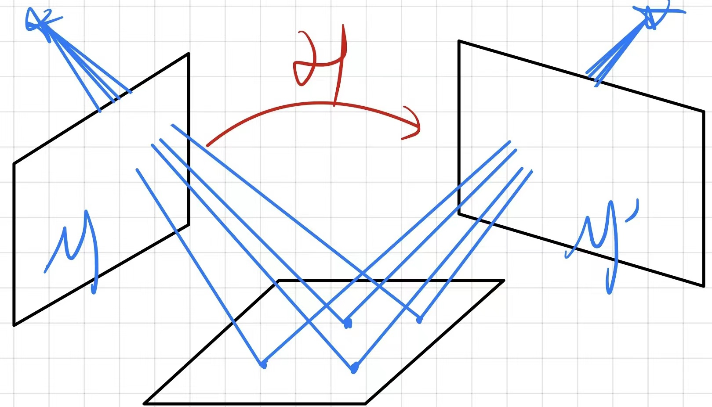

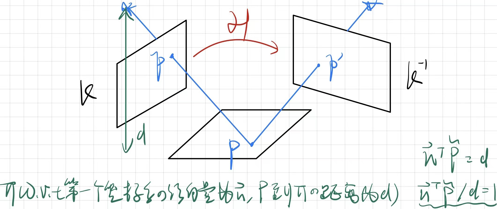

* 推导
  * $X_2=RX_1+T\rightarrow x_2^T\widehat{T}Rx_1=x_2^TEx_1=0$
  * 令取样平面P的单位法向量为 $N=\left[\begin{array}{c}n_1&n_2&n_3\end{array}\right]^T$，根据平面到直线的距离公式有 $N^TX_1=n_1X+n_2Y+n_3Z=d\leftrightarrows\frac{1}{d}N^TX_1=1,\forall X_1\in P$
  * 将 $\frac{1}{d}N^TX_1=1$ 代入 $X_2=RX_1+T$，得 $X_2=RX_1+T=RX_1+T\frac{1}{d}N^TX_1=\left(R+\frac{1}{d}TN^T\right)X_1$
  * $H=R+\frac{1}{d}TN^T,\ x_1\sim Hx_2$
  * 由于两点位于同一平面上，两边同乘 $\widehat{x_2}$ 去掉多余Scale，得到单应约束：$\widehat{x_2}Hx_1=0$。
* 单应矩阵极线

### 估计单应矩阵

* Plane as a critical surface：为什么取样点来自同一平面时八点法失效？$x_1\sim Hx_2$，对于任意 $\vec{u}$，有 $u\times x_2=\widehat{u}x_2$ 与 $Hx_1$ 正交。$x_2^T\widehat{u}Hx_1=0$，即 $\widehat{T}R$ 可以有多种 $\widehat{u}H$ 得到，约束变少了
* Homography from a pure rotation: to construct Image Mosaics 纯旋转时有 $\lim\limits_{d\rightarrow\infty}{H}=\lim\limits_{d\rightarrow\infty}{(R+\frac{1}{d}TN^T)}=R$，此时平移量为0，相当于所有点都位于无穷远处的平面上，这可以用在全景拼接上

### 四点算法

* Find $\left\{R,\frac{1}{d}T,N\right\}$ to solve $\widehat{x_2^j}^T\left(R+\frac{1}{d}TN^T\right)x_1^j=0,\ j=1,2,\cdots,n$
* 步骤
  * Compute a first approximation of the homography matrix $\chi H_L^s=0$
  * Normalization of the homograhy matrix $H=H_L/\sigma_2$
  * Decomposition of the homography matrix $H^TH=V\Sigma V^T$
* 为什么只需要4个点？通过单应约束：$\widehat{u}Hv=0=\left[\begin{array}{c}0&-u_3&u_2\\u_3&0&-u_1\\-u_2&u_1&0\end{array}\right]_{3\times3}\left[\begin{array}{c}h_{11}&h_{12}&h_{13}\\h_{21}&h_{22}&h_{23}\\h_{31}&h_{32}&h_{33}\end{array}\right]_{3\times3}\left[\begin{array}{c}v_1\\v_2\\v_3\end{array}\right]_{3\times1}=M_{{3\times1}}$，即可以可到3个约束矩阵，但因为 $rank(M)=rand(\widehat{u})=2$，所以实际上一对点可以得到2个约束方程，因此为了解 $rank(\chi)=8$，至少需要提供四对点

### 单应矩阵和本质矩阵的关系

* From Homography to Essential: $E=\widehat{T}R=\widehat{T}(H-Tu^T)=\widehat{T}H-\sout{\widehat{T}Tu^T}=\widehat{T}H$
* 两者之间的直接关系：推导 $H^TE+E^TH=0$：$H^TE+E^TH=H^T\widehat{T}H+(\widehat{T}H)^TH=H^T\widehat{T}H+H^T\widehat{T}^TH$，代入 $\widehat{T}^T=-\widehat{T}$，原式为 $H^T\widehat{T}H+H^T-\widehat{T}H=0$
* From Essential to Homography $H=\widehat{T}^TE+Tv^T$
* 当特征点或者相机发生纯旋转时，基础矩阵的自由度下降，这就出现了degenerate 退化的情况。现实中的数据总包含噪声，这时如果继续使用八点法求解基础矩阵，基础矩阵多余的自由度将会主要由噪声决定。为了能够避免退化现象造成的影响，通常我们会同时估计 $E$ 和 $H$ ，选择重投影误差比较小的那个作为最终的运动估计矩阵

## *3D-2D：PnP Perspective-n-Poinit*

### 简介

* PnP是求解3D到2D点对运动的方法。它描述了当知道n个3D空间点及其投影位置时，如何估计相机的位姿。
* 2D-2D的对极几何方法需要8个及8个以上的点对，且存在着初始化、纯旋转和尺度的问题。当两张图像中给的一张特征点的3D位置已知时，那么最少只需3个点对+1个额外点验证结果
* 3D位置可以由三角化或RGB-D相机的深度图确定。对于双目或RGB-D可以直接使用，而对于单目相机而言，必须先进行初始化，即归一化 $T$，将其作为后续计算的起始参考点，才能使用PnP

### 直接线性变换 DLT

* 考虑空间点 $P=(X,Y,Z,1)^T$，投影点 $(u,v,1)^T$（以归一化平面齐次坐标表示）
* $\vec{t}$ 一共有12维，因此最少通过6对匹配点即可实现矩阵 $T$ 的线性求解，多于6点时用SVD。分解出的旋转矩阵要满足约束 $R\leftarrow(RR^T)^{-\frac{1}{2}}R$

### P3P

* P3P需要利用给定的3个点的几何关系

  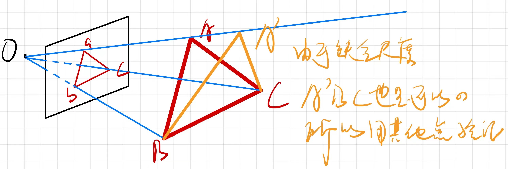

* $s\left[\begin{array}{c}u_1\\v_1\\1\end{array}\right]=\left[\begin{array}{c}t_1&t_2&t_3&t_4\\t_5&t_6&t_7&t_8\\t_9&t_{10}&t_{11}&t_{12}\end{array}\right]\left[\begin{array}{c}X\\Y\\Z\\1\end{array}\right]$

* $\Delta Oab \sim\Delta OAB,\ \Delta Obc\sim\Delta OBC,\ \Delta Oac\sim\Delta OAC$

* $\left\{\begin{array}{c}(1-u)y^2-ux^2-\cos{<b,c>}y+2uxy\cos{<a,b>}+1=0\\(1-w)x^2-wy^2-\cos{<a,c>}y+2wxy\cos{<a,b>}+1=0\end{array}\right.$

* 需要利用吴消元法来求该方程组的解析解 $(x,y)$。最多可能得到4个解，然后用一个验证点来验证得到合适的答案

### 最小化重投影误差求解PnP BA方法（BA的图模型结构特点与通用的快速求解方法见下文后端部分）

$s_i\left[\begin{array}{c}u_i\\v_i\\1\end{array}\right]=KT\left[\begin{array}{c}X_i\\Y_i\\Z_i\\1\end{array}\right]\rightarrow s_iu_i=KTP_i$

$T^{*}=\underset{T}{\arg\min\ }{\frac{1}{2}\sum\limits_{i=1}^{n}{\Vert u_i-
\frac{1}{s_i}KTP_i\Vert^2_2}}$

该问题的误差项，是将3D点的投影位置与观测位置作差，所以称为重投影误差

## *3D-3D：ICP Iterative Closest Point 迭代最近点*

### SVD方法

### 非线性优化方法

# 视觉里程计2：直接法 Direct Method

## *直接法的引出*

### 特征点法的缺点

* 关键点的提取与描述子的计算非常耗时
* 特征点实际只占一幅图像的少数，只使用特征点将会抛弃大部分可能有用的图片信息
* 相机有时会运动到特征缺失的地方，这些地方往往没有明显的纹理信息，此时很难找到足够的特征点进行匹配

### 新的方法

* Small Deformation
  * 光流法 Optical Flow：光流法描述了像素在图像之间运动的方法。利用像素强度的时序变换和相关性确定像素的运动，从而估计相机的位姿
  * 直接法 Direct method
* Wide Baseline stereo

## *2D光流 2D Optical Flow*

* 稀疏光流 Lucas-Kanade光流
* 稠密光流 Horn-Schunck光流

### LK光流

* LK光流计算步骤
  * 令 $x(t)$ 是一个随时间移动的点，$I(x,t)$ 是一个视频序列
  * Brightness Constancy Assumption 灰度不变假设：同一个空间点的像素灰度值，在各个图像中是固定不变的 $I(x(t),t)=\left[\begin{array}{c}I_x(t)\\I_y(t)\end{array}\right]=C, \forall t\Rightarrow\frac{d}{dt}I(x(t),t)=\triangledown I^T(\frac{dx}{dt})+\frac{\partial I}{\partial t}=0$，该式中的 $\frac{dx}{dt}=v$ 就为像素移动的速度
  * Constant motion in a neighborhood 用一个像素点得到的一个方程是无法确定速度 $[u\ v]$ 的，因此假设某一个窗口 $W(x)$ 内的像素 $x'$ 都具有相同的运动，从而得到了描述一个窗口内描述像素运动的方程：$\triangledown I(x',t)^Tv+\frac{\partial I}{\partial t}(x',t)=0,\ \forall x'\in W(x)$
  * 因为灰度不可能是不变的，v也是在变化的，所以求v的方法就是求解最小二乘方程 $\min E(v)\triangleq\int_{W(x)}{\lvert \triangledown I(x',t)^Tv+\frac{\partial I}{\partial t}(x',t)\rvert^2dx'}\Leftrightarrow E(x)=\Vert Ax-y\Vert^2=(Ax-y)^2$
  * 对v求导 $\frac{dE}{dv}=2Mv+2q\Leftrightarrow\frac{dE}{dx}=2A(Ax-y)=2A^2x-Ay=0$，其中 $M=\int_{W(x)}{\triangledown I\triangledown I^Tdx'}=\int_{W(x)}{\left(\left[\begin{array}{c}I_x^2&I_xI_y\\I_xI_y&I_y^2\end{array}\right]dx'\right)},\ q=\int_{W(x)}{I(t)\triangledown Idx'}$
  * 若M可逆，则 $v=-M^{-1}q$（实际上以上的过程就是用正规方程求解最小二乘的步骤拆解）；当M不可逆时，要用SVD等方法解
  * 将v的表达式回代给 $E(v)$ 在两图片之间不断迭代求位移b Translational motion，t归一化为1时间单位 $\min E(b)\triangleq\int_{W(x)}{\lvert \triangledown I^Tb+I_t\rvert^2dx'}\rightarrow\frac{dE}{db}=0\rightarrow b$；若是Affine motion，则要代入 $S'(x)p$ 而不是b
* Basic feature tracking algorithm
  * 对一个给定的时间点t，计算所有 $x\in \Omega$ 的Struct Tensor $M(x)\triangleq G_{\sigma}\ast\triangledown I\triangledown I^T=\int{G_{\sigma}(x-x')\left(\left[\begin{array}{c}I_x^2&I_xI_y\\I_xI_y&I_y^2\end{array}\right](x')dx'\right)}$
  * Mark all points $x\in \Omega$ for which the determinant of M is larger than a threshold $\theta >0$ $\det{M(x)}\geq\theta$
  * For all these points the local velocity is given by $b(x,t)=-M(x)^{-1}\left[\begin{array}{c}\int{I_xI_tdx'}\\\int{I_yI_tdx'}\end{array}\right]$
  * 对下一时刻 $t+1$ 的 $x+b$ 点重复以上迭代步骤
* $\det{M(x)\neq0}$ 并不能保证鲁棒的特征提取，因为 $\det{M(x)}$ 很有可能很小，此时要给Struct Tensor使用一个高斯核加权窗来提高求M，比如Harris角点算法就是这么做的

### 光流法处理 Small Deformation遇到的问题

* Aperture problem
* Normal motion

### 利用深度神经网络进行光流估计 Optical flow estimation with Deep Neural Networks

## Wide Baseline Matching

### Normalized Cross Correlation 归一化互相关

### Optimal Affine Transformation

## *直接法*

最小化的不是重投影误差，而是光度误差 Photometric Error (Intensity Difference)

### 直接法的推导

$e=I_1(p_1)-I_2(p_2)$

$\min\limits_{T}{J(T)}=\sum\limits_{i=1}^{N}{e_i^Te_i}$

### 直接法的讨论

* P来自稀疏关键点，称为稀疏直接
* P来自部分像素，称为半稠密 Semi-Dense
* P为所有像素，称为稠密直接法

# 后端

## *BA与图优化*

### 投影模型和BA损失函数

* Maximum Likelihood Estimation leads to: $E(R,T,X_1,\cdots,X_N)=\sum\limits_{j=1}^{N}{\left(\lvert\widetilde{x}_1^j-\pi(X_j)\rvert^2+\lvert\widetilde{x}_2^j-\pi(R,T,X_j)\rvert^2\right)}$
* For the general case of m images: $E(\left\{R_i,T_i\right\}_{i=1\cdots m},\left\{X_j\right\}_{j=1\cdots N})=\sum\limits_{i=1}^{m}{\sum\limits_{j=1}^{N}{\left(\theta_{ij}\lvert\widetilde{x}_1^j-\pi(R,T,X_j)\rvert^2\right)}}$
  * It aims at minimizing the projection error between the observed 2D coordinates and the projected 3D coordinate
  * The Equation dose not describe a direct approach, but an indirect approach. A direct approach would compare iamge intensities
  * The term $\pi(R,T,X_j)$ first transforms the point $X_j$ to the coordinate system of camera 2, and then projects it to the image plane
* Parameterized differently
  * $E\left(\left\{x_1^j,\lambda_1^j\right\}_{j=1\cdots N},R,T\right)=\sum\limits_{j=1}^{N}{\left(\lVert x_1^j-\widetilde{x}_1^j\rVert^2+\lVert \widetilde{x}_2^j-\pi(R\lambda_1^jx_1^j+T)\rVert^2\right)}$
  * $E\left(\left\{x_1^j,\lambda_1^j\right\}_{j=1\cdots N},R,T\right)=\sum\limits_{j=1}^{N}{\sum\limits_{i=1}^{2}{\lVert x_i^j-\widetilde{x}_i^j\rVert^2}}$

### BA求解

### 稀疏性和边缘化

### 鲁棒核函数

## *滑动窗口滤波和优化*

## *位姿图*

# 回环检测

## *词袋模型 Bag of Word BoW*

## *字典*

## *相似度计算*

# 建图

## *单目稠密重建*

## *RGB-D稠密重建*

三角化思路：利用两个已知投影点和投影矩阵计算3D点，估计其深度信息