# AI系统概述

## *Overview*

https://openmlsys.github.io/chapter_introduction/index.html

https://github.com/chenzomi12/DeepLearningSystem/tree/main


## *AI系统*

AI系统 / 机器学习系统 / 深度学习系统是指一类抓门用于支持和部署机器学习模型的系统

## *方向*

### 算法

对**算法、特征、业务、实际算法场景**感兴趣，可以专注深度学习各种算法知识（识别、检测、分类、校准、损失函数），然后**基于这些知识**解决实际的问题，可以训练模型，也可以结合传统图像或者其他方法一起解决。现实生活中的问题千奇百怪，一般只使用一个模型解决不了，可能会有多个模型一起上，解决方法也多种多样

### 部署

* 对**AI落地、部署、移植、算法SDK**感兴趣，可以多看工程落地的一些知识（C++、Makefile、cmake、编译相关、SDK），多参与一些实际项目攒攒经验，多熟悉一些常见的大厂造的部署轮子（libtorch、TensorRT、openvino、TVM、openppl、Caffe等），尝试转几个模型（ONNX）、写几个op（主要是补充，性能不要最优）、写几个前后处理、debug下各种奇葩的错误，让模型可以顺利在一些平台跑起来，平台可以在PC、手机、服务器等等；
* 对**算子优化、底层硬件实现**实现感兴趣的，可以重点看某一平台的硬件架构（CPU、GPU、NPU、VPU、DSP），然后学学汇编语言，看看内存结构，看看优化方法等等，做一些算子的优化，写一些OP啥的，再者涉及到profile、算子优化、内存复用等等。
* 当然还有**模型压缩、模型剪枝、量化、蒸馏**，这些其实也是部署的一部分，根据需要掌握即可

AI部署是将经过训练的AI模型整合到实际应用中的过程，以便在生产环境（例如服务器、云平台、移动设备或边缘设备）中使用。这个过程涉及到将模型从一个研究和开发环境转移到一个可以稳定、高效处理实时数据的环境。AI部署的主要目标是确保模型能够可靠地执行其预测或决策功能，同时满足性能和资源效率的要求

### 流程

* 训练一个模型，也可以是拿一个别人训练好的模型
* 针对不同平台对生成的模型进行转换，也就是俗称的parse、convert，即前端解释器
* 针对转化后的模型进行优化，这一步**很重要**，涉及到很多优化的步骤
* 在特定的平台（嵌入端或者服务端）成功运行已经转化好的模型
* 在模型可以运行的基础上，保证模型的速度、精度和稳定性

# 计算图

计算图 computational graph 是用来理解、表达和执行机器学习模型的通用数据结构

计算图将复杂的计算拆解为一系列的可执行步骤，并以图的形式展现其中的运算操作和数据流

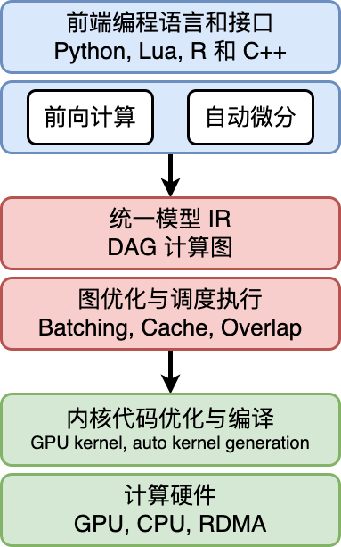

* 统一计算过程表达
* 自动化梯度计算
* 分析模型变量生命周期
* 优化程序的执行

## *计算图的组成*

计算图由基本数据结构 **张量 Tensor** 和基本运算单元 **算子 operator** 构成。计算图中通常使用节点来表示算子，节点间的有向边 directed edge 来表示张量状态，同时也描述了计算间的依赖关系。比如将下面的公式转换为对应的计算图
$$
\boldsymbol{Z}=ReLU(\boldsymbol{X}\times\boldsymbol{Y})
$$
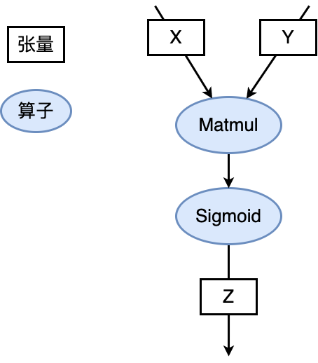

### 张量 & 算子

* 张量 Tensor 只是一个 ML/DL 的领域的 fancy 词汇，其实就是多维数组，使用秩来表示张量的轴数或维度

  * 张量自己还有属性，比如说

    * 形状 shape：存储张量的每个维度的长度，比如 `[3,3,3]`

    * 秩或维数 dim：表示张量的轴数或者维数，标量为0，向量为1

    * 数据类型 dtype：表示存储的数据类型，如bool、uint8、int16、float32、float64等

    * 存储位置 device：创建张量时可以指定存储的设备位置，如CPU、GPU等

    * 名字 name：张量的标识符

  * 实际 ML 场景中张量一般有下面几种形式

    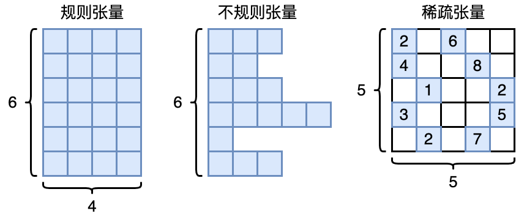

    * 正方形/矩形

    * 不规则张量：在某个轴上可能具有不同的元素个数，比如说 NLP 中的文本信息

    * 稀疏张量使用坐标表格式 Coordinate List, COO 来标识以节省空间。比如上图中的稀疏矩阵可以标识为

      ```
      行索引：[0, 0, 1, 1, 2, 2, 3, 3, 4, 4]
      列索引：[0, 2, 0, 3, 1, 4, 0, 4, 1, 3]
      元素值：[2, 6, 4, 8, 1, 2, 3, 5, 2, 7]
      ```

* 算子 Operator 就是对张量数据的某种操作，算子大致可以分为

  * 张量操作算子
    * 张量的结构操作：用于张量的形状、维度调整以及张量合并等
    * 数学运算：矩阵乘法、计算范数、行列式和特征值计算等
  * 神经网络算子：包括特征提取、激活函数、损失函数、优化算法等，是构建神经网络模型频繁使用的核心算子
  * 数据流算子：对原始数据进行处理后，转换为 ML 框架本身支持或需要的数据格式，并且按照迭代次数输入给网络进行训练或者推理，提升数据载入速度，减少内存占用空间，降低网络训练数据等待时间
    * 数据的预处理：针对图像数据和文本数据的裁剪填充、归一化、数据增强等操作
    * 数据载入：对数据集进行随机乱序 shuffle、分批次载入 batch 以及预取 prefetch 等操作
  * 控制流算子：可以控制计算图中的数据流向，同时也会影响反向梯度运算的数据流向。具体的算子有比如说条件运算符和循环运算符等。这部分下面会详细介绍
    * ML/DL 框架本身提供的控制流操作符（框架的原语）
    * 前端语言控制流操作符

### 计算依赖

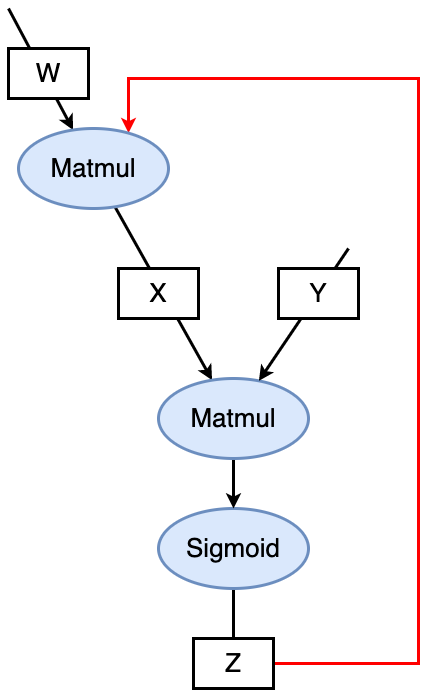

算子之间可能是会存在依赖性的，计算图这个 DAG 如果形成了环，即算子之间的循环依赖 circular dependency，会形成计算逻辑上的死循环，ML 模型无法完成训练。要么是 0 要么是无穷大

循环关系的循环展开 iteration unrolling 要给变量赋予不同的变量名，否则也会形成循环依赖

### 控制流

许多 ML/DL 模型依赖控制流进行训练和推理，基于递归神经网络和强化学习的模型就依赖于循环递归关系和依据输入数据状态条件执行计算。如上所述，目前的 ML/DL 有两套控制流

* 前端语言控制流：通过 Python 等前端语言控制流语句来进行计算图中的控制决策。使用前端语言控制流构建模型结构简便快捷，但是由于 ML/DL 框架的数据计算运行在后端硬件，造成控制流和数据流之间的分离，计算图不能完整运行在后端计算硬件上。因此这类实现方式也被称为图外方法 Out-of-Graph Approach
* ML/DL 框架控制原语：ML/DL 框架在内部设计了低级别细粒度的控制原语运算符。低级别控制原语运算符能够执行在计算硬件上，与模型结构结合使用可将整体计算图在后端运算，这种实现方式也被称为图内方法 In-Graph Approach

之所以有两套控制流的原因是因为后端的硬件可能不支持前端的（脚本）语言的运行环境

## *计算图的生成*

静态计算图意味着在执行任何实际计算之前，先完全定义好整个计算流程。图的结构被提前确定，并且一旦构建，就不能再改变。TensorFlow（1.x 版本）和 Theano 是使用静态图的知名框架

动态计算图也称为命令式或即时执行（Eager Execution）计算图，意味着图是在代码执行的同时动态创建的。PyTorch 和 TensorFlow（2.x 版本启用了 Eager Execution）都支持动态图

为了结合两者的优势，许多现代深度学习框架提供了将动态计算图转换为静态图的功能。例如，PyTorch 的 TorchScript 允许你将 PyTorch 模型转换为可以优化并在没有 Python 解释器的环境中运行的格式。TensorFlow 2.x 默认启用 Eager Execution，但同时提供了 `tf.function` 装饰器，可以将普通的 Python 函数转换为可优化的 TensorFlow 图

### 静态生成

静态生成可以根据前端语言描述的神经网络拓扑结构以及参数变量等信息构建一份固定的计算图。因此静态图在执行期间可以不依赖前端语言描述，常用于神经网络模型的部署，比如移动端人脸识别场景中的应用等

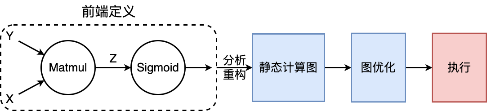

如果计算图的生成依赖于某些外部输入的控制项，在静态生成的时候无法确定，那么就需要一种叫做数据占位符 placeholder 的特殊张量来构建完整的计算图

* 静态计算图的优势

  * 计算性能

  * 可以被直接部署

* 劣势：但也正是因为上面所说的占位符的存在，静态计算图的代码要引入很多的控制流，相对动态图会比较麻烦

### 动态生成

动态图则需要在每一次执行神经网络模型依据前端语言描述动态生成一份临时的计算图，这意味着计算图的动态生成过程灵活可变，该特性有助于在神经网络结构调整阶段提高效率

## *动静态图之间的转换*

TensorFlow、MindSpore 都同时支持动态图和静态图两种模式，而 PyTorch 则需要过工具将构建的动态图神经网络模型转化为静态结构，以获得高效的计算执行效率

### 基于追踪转换

### 基于源码转换

## *计算图的调度*

在模型的训练过程中，需要优化迭代训练计算图过程中数据流载入和训练（推理）执行等多个任务之间的调度策略。微观上单次迭代需要考虑计算图内部的调度执行问题，根据计算图结构、计算依赖关系、计算控制分析算子的执行调度

优化计算图的调度和执行性能，目的是尽可能充分利用计算资源，提高计算效率，缩短模型训练和推理时间

### 算子调度执行

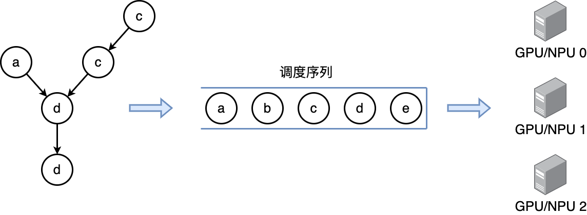

1. 根据拓扑排序算法，将计算图进行拓扑排序得到线性的算子调度序列
2. 将序列中的算子分配到指令流进行运算，尽可能将序列中的算子并行执行，提高计算资源的利用率

### 串行 & 并行

根据任务队列的执行顺序，我们可以将计算图的任务调度队列分为以下两种：

* **串行**：队列中的任务必须按照顺序进行调度执行直至队列结束
* **并行**：队列中的任务可以同时进行调度执行，加快执行效率

### 数据载入的同步 & 异步机制

一次完整计算图的训练执行过程包括了**数据载入、数据预处理、网络训练三个环节**。三个环节之间的任务调度是以串行方式进行，每一个环节都有赖于前一个环节的输出。但计算图的训练是多轮迭代的过程，多轮训练之间的三个环节可以用同步与异步两种机制来进行调度执行

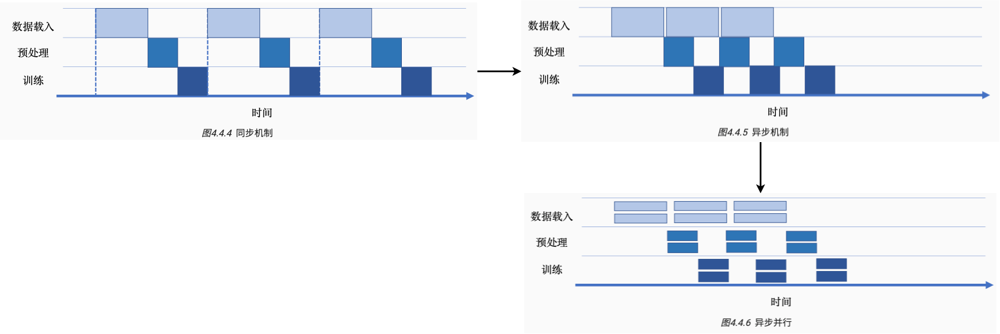

* **同步**：顺序执行任务，当前任务执行完后会等待后续任务执行情况，任务之间需要等待、协调运行
* **异步**：当前任务完成后，不需要等待后续任务的执行情况，可继续执行当前任务下一轮迭代。并且可以进一步并行化


# ONNX

[Introduction to ONNX - ONNX 1.18.0 documentation](https://onnx.ai/onnx/intro/index.html)

ONNX, Open Neural Network Exchange 是一个开源的深度学习模型格式，旨在促进不同深度学习框架之间的互操作性。它由多家公司联合发起，包括微软和 Facebook，并得到了广泛的行业支持。ONNX 的主要目标是解决模型在不同框架和工具之间迁移的问题，使得模型的开发、训练和部署更加灵活和便利

ONNX 模型格式是基于 Protobuf 的

ONNX 模型是利用计算图来表示的

ONNX 标准化了一组常用的算子

# 编程接口

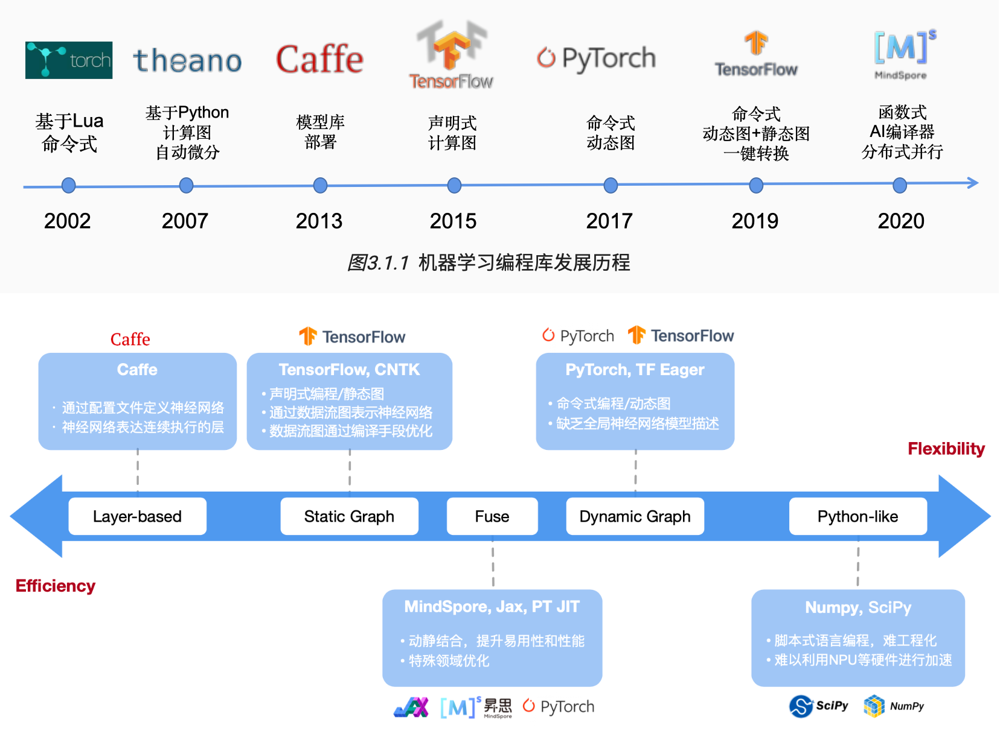

## *AI框架的作用*

### AI框架的任务

* 前端（面向用户）：如何灵活的表达一个深度学习模型
* 算子（执行计算）：如何保证每个算子的执行性能和泛化性
* 求导（更新参数）：如何自动、高效地提供求导运算
* 后端（系统相关）：如何将同一个算子跑在不同的加速设备上
* 运行时：如何自动地优化和调度网络模型进行计算


* 提供灵活的编程模型和编程接口
  * 自动推导计算图
  * 较好的支持与现有生态环境融合
  * 提供直观的模型构建方式，简洁的神经网络计算编程语言
* 提供高效和可扩展的计算能力
  * 自动编译优化算法（子表达式消除、内核融合、内存优化等）
  * 根据不同体系结构和硬件设备自动并行化（自动分布式化、扩展多计算节点等）

### 场景

* 训练场景：输入高级语言表示的神经网络代码，输出能够在不同硬件高效执行的程序
* 推理场景：输入AI框架训练出来的模型文件，输出能够在不同硬件高效执行的程序

## *AI框架的演进*

### 早期 -- 2010年之前

主要是使用 NumPy、SciPy 和 Matlab 提供的接口来直接构建

* 解决问题
  • 机器学习ML中缺乏算法库
  • 稳定和统一的神经网络NN定义
  •主要特点 -Library
  • 脚本式编程
  •通过简单配置多形式定义神经网络
  •针对特殊的ML、NN算法提供接口（MATLAB、SciPy）
  •针对矩阵计算提供特定的计算接口（NumPy）
  ．优点
  •提供了一定程度的可编程性
  •计算性能高：支持CPU加速计算


Caffe 是第一代和第二代 AI 框架的过渡 layer-based


基于 Tensorflow 的 Keras

### Base DAG

基于数据流图（一种有向无环图 DAG, Directed acyclic graph）的计算框架

* 基本数据结构：Tensor 张量

  * Tensor形状：`[2,3,4,5]`
  * 元素类型：int, float, string, etc.

* 基本运算单元：(primitive) Operator （原始）算子

  神经网络由最基本的代数算子组成，根据深度学习结构可以进一步组成复杂算子

  一个算子有 N 个输入 Tensor、M个输出 Tensor

基于 Base DAG 的两个主要框架是 Tensorflow 和 PyTorch。二者代表了深度学习框架两种不同的设计路径，TensorFlow 更注重性能，而 PyTorch 则更关注灵活性和易用性

### 朝 DSL 迈进

特定领域语言 Domain-Specific Language, DSL 就是深度学习框架的更细分，比如说 MindSpore、JAX 用于科学计算，Taichi 用于GPU的渲染等

DSL 的设计目标是兼顾编程的灵活性和计算的高效性，具体来说就是提高描述神经网络算法表达能力和编程灵活性，然后通过编译期优化技术来改善运行时性能


硬件也不一样了，SIMD、稀疏性的要求、存内计算

## *编程范式*

面向 AI 或者说深度学习有两种编程范式 programming paradigm

### 命令式编程

命令式编程 imperative programming，也称为 define-by-run 或者动态图

PyTorch

### 声明式编程

声明式编程 declarative programming，也称为 define-and-run 或者静态图

TensorFlow

### 融合

分阶段编程 multi-stage

及时编译 Just-in-time JIT

PyTorch JIT, TF Eager, MindSpore

# AI编译器前端

## *AI编译器介绍*

### AI编译器的作用

在使用各种不同的训练框架（PyTorch, TensorFlow, Paddle, MindSpore, OneFlow 等）训练完的模型最终是需要部署到硬件上，进行实时推理计算的。我们一般会使用硬件厂商自己推出的一些前向推理框架，例如在 Intel 的 CPU/GPU 上就使用 OpenVINO，在 Arm 的 CPU/GPU 上使用 NCNN/MNN 等，在 Nvidia GPU 上使用 TensorRT

这也就产生了一些问题，虽然使用自家的推理框架自然是最优的，但是这也需要部署者不断重复的写部署代码。开发者首先需要将训练的模型分别转换到特定框架可以读取的格式，并且还要考虑各个推理框架 OP 实现是否完全对齐的问题，此外最为致命的是性能问题

这些重复编码的问题其实和早期编程语言的发展很相似，因此AI编译器的作用也就和编译器的功能相似，只要输入一个训练完的模型就可以生成在不同的硬件体系结构的平台上的推理部署代码

### 架构

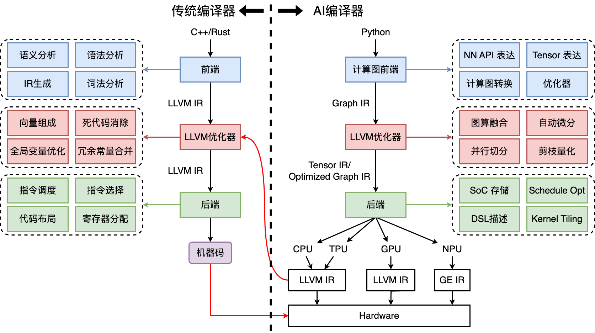

AI 编译器的首要目标是优化程序的性能，其次是降低编程难度

AI编译器的特点 & 功能

* Python 为主的动态解释器语言前端
* 多层IR设计，包括图编译、算子编译、代码生成
* 面向神经网络、深度学习的特定优化
* DSA 芯片架构的支持

## *实现自动微分*

关于自动微分, i.e. 反向传播的内容可以看 *DeepLearning.md*

自动微分的实现方式大致可以分为

* 基本表达式法 Elemental Libraries
* 操作符重载法 Operator Overloading, OO 
* 代码变换法 Source Code Transformation, ST

### 基本表达式法

### 操作符重载法

### 代码变换法

## *IR*

## *类型系统 & 静态分析*

为了有效减少程序在运行时可能出现的错误，AI编译器前端引入了类型系统 Type System 和静态分析 Static Analysis 系统。类型系统可以防止程序在运行时发生类型错误，而静态分析能够为编译优化提供线索和信息，有效减少代码中存在的结构性错误、安全漏洞等问题

### 类型系统

程序设计语言中，类型是指数值、表达式、函数等属性内容。类型系统是指类型的集合以及使用类型来规定程序行为的规则。类型系统用于定义不同的类型，指定类型的操作和类型之间的相互作用，广泛应用于编译器、解释器和静态检查工具中

### 静态分析

## *前端优化*

### 无用与不可达代码消除

### 常量传播、常量折叠

# AI编译器后端

## *计算图优化*

计算图优化往往是后端的第一步，计算图优化是在不影响模型的数值特性的基础上，通过变换图IR以达到简化计算、减少资源开销、适配硬件的执行能力、提升执行性能的目的

* 访存密集型算子：Concat、Eltwise Add、ReLU、MaxPooling
* 计算密集型算子：Conv、DeConv、FC、MatMul、LSTM

### 通用硬件优化

通用硬件优化的核心是**子图的等价变换**：在计算图中尝试匹配特定的子图结构，找到目标子图结构后，通过等价替换方式，将其替换成对硬件更友好的子图结构。所谓对硬件更友好指的是更高的IO访存效率、计算效率更高等

### 特定硬件优化

优化是根据某些硬件的特殊性质做出的

* 硬件指令限制
* 数据排布格式的限制

## *算子选择*

算子选择是将IR图上的每个计算节点映射到设备上可执行算子的过程，因为**一个IR图上的计算节点往往可以对应多个设备上的算子**，这个过程中需要考虑算子的规格，算子的执行效率等问题，算子选择目标就是从中选择最优的一个算子

IR的信息称为算子信息，算子选择要参考这些信息

* 针对不同特点的计算平台和不同的算子，为了追求最好的性能，一般都需要选择不同的数据排布格式。ML系统常见的数据排布格式有NCHW和NHWC等
* 对于不同的硬件支持不同的计算精度，例如float32、float16和int32等。算子选择需要在所支持各种数据类型的算子中选择出用户所设定的数据类型最为相符的算子

### 数据排布格式

### 数据精度

### 算子选择的过程

## *内存分配*

经过计算图优化和算子选择之后，我们可以得到IR图中每个算子的输入输出的形状（Shape）、数据类型、存储格式。根据这些信息，计算输入输出数据的大小，并为输入输出分配设备上的内存，然后将算子加载到设备上才能真正执行计算。此外，为了更充分地例用设备内存资源，可以对内存进行复用，提高内存利用率

### 内存复用

### 内存分配优化

* 内存融合
* In-Place算子

## *计算调度*

经过算子选择与内存分配之后，计算任务可以通过运行时完成计算的调度与在硬件上的执行

* 根据是否将算子编译为计算图，计算的调度可以分为单算子调度与计算图调度两种方式
* 根据硬件提供的能力差异，计算图的执行方式又可以分为逐算子下发执行的交互式执行以及将整个计算图或者部分子图一次性下发到硬件的下沉式执行两种模式

### 单算子调度

### 计算图调度

### 交互式执行

### 下沉式执行

## *算子编译器*

算子编译器是对算子进行编译优化的工具。作为AI编译器中一个重要组成部分，算子编译器把单个简单或复杂的算子经过表达和优化后编译为一个单独的可以在特定AI芯片上执行的可执行文件

# 推理系统

## *推理系统*

### 概念

* 训综 training：数据中心中更像是传统的批处理任务，需要执行数小时、数天才能完成，其一般配置较大的批尺寸追求较大的吞吐，将模型训练达到指定的准确度或错误率
* 推理 inference
   * 对于训练（Training）而言的推理，即模型前向计算，也就是对于给出的输入数据计算得到模型的输出结果；相对预测（Prediction）的推理，是统计学领域的范畴
   * 推理任务要执行7*24的服务，其常常受到响应延迟的约束，配置的批尺寸更小，模型已经稳定一般不再被训练

* 部署 deployment：训练得到的模型主要目的还是为了更有效地解决实际中的问题，因此部署是一个非常重要的阶段。模型部署的课题也非常多，包括但不仅限于：移植、压缩、加速等
* 服务化 serving：模型的部署方式是多样的，封装成一个SDK，集成到APP或者服务中；封装成一个web服务，对外暴露接口（HTTP(s) / RPC）

### 部署时的新挑战

一个典型的DL推理应用的部署、落地过程中，推理系统需要考虑和提供以下的功能

* 提供可以被用户调用的接口
* 能够完成一定的数据处理将输入数据转为向量
* 能够在指定低延迟要求下返回用户响应
* 能够利用多样的加速器进行一定的加速
* 能够随着用户的增长保持高吞吐的服务响应和动态进行扩容
* 能够可靠的提供服务，应对软硬件的失效
* 能够支持算法工程师不断更新迭代模型，应对不断变化的新框架

### 推理系统


模型训练后会保存在文件系统中，随着训练的不断推进，模型效果不断提升，可能会产生新版本的模型，并存储在文件系统中并由一定的模型版本管理协议进行管理

之后模型会通过服务系统部署上线，推理系统首先会加载模型到内存，同时会对模型进行一定的版本管理，支持新版本上线和I版本回滚，对输入数据进行批尺寸（Batch Size ）动态优化，并提供服务接口（例如，HTTP，gRPC等），供客户端调用

用户不断向推理服务系统发起请求并接受响应。除了被用户直接访问，推理系统也可以作为一个微服务，被数据中心中其他微服务所调用，完成整个请求处理中一个环节的功能与职责

推理系统中，以数据中心（云端）的服务端推理系统为主，兼顾边缘侧移动端推理的场景，但是这些策略本身大部分是数据中心与边缘侧都适用

## *部署态*

### 部署态区别

推理系统一般有两种部署态 deployment status，可以部署在云或者边缘。云端部署的推理系统更像传统Web 服务，在边缘侧部署的模型更像手机应用和IOT应用系统

* Cloud 云端：云端有更大的算力、内存，且供电也更能满足模型的功耗需求，同时与训练平台连接更加紧密，更容易使用最新版本模型，同时安全和隐私更容易保证。相比边缘侧可以达到更高的推理吞吐量。但是用户的请求需要经过网络传输到数据中心并进行返回，同时使用的是服务提供商的软硬件资源

  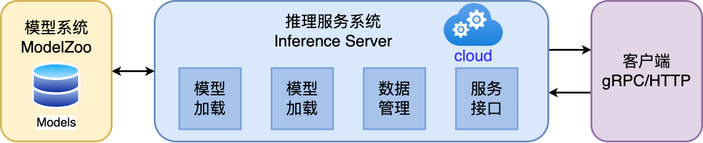

  云端面临的挑战

  * 云上提供所有人工智能服务成本高昂
  * 推理服务对网络依赖度高
  * 数据隐私问题
  * 数据传输成本
  * 很难定制化模型

* 端侧

  

  端侧 Edge 是指计算或数据处理发生在网络的边缘，而不是在中央数据中心或云中心。端侧计算通常涉及将计算资源和应用程序推送到离数据源或终端设备更近的位置，以便在离数据源较近的地方进行数据处理和决策，从而减少延迟、提高响应速度，并降低网络流量

  边缘侧设备资源更紧张（例如，手机和IOT设备），且功耗受电池约束，需要更加在意资源的使用和执行的效率。用户的响应只需要在自身设备完成，且不需消耗服务提供商的资源

  端侧面临的挑战

  * 严格约束功耗、热量、模型尺寸小于设备内存
  * 硬件算力对推理服务来说不足
  * 数据分散且难以训练
  * 模型在边缘更容易受到攻击
  * DNN平台多样，无通用解决方案

### 边缘部署方式

1. 边缘设备计算：将模型部署在设备端，聚焦如何优化模型执行降低延迟

   * 端侧模型结构设计

   * 通过模型量化、剪枝等压缩手段

   * 针对神经网络的专用芯片 ASIC设计

2. 安全计算 + 卸载到云端：将模型部署于数据中心，边缘侧通过安全通信协议将请求发送到云端，云端推理返回结果，相当于将计算卸载到云端：

   * 利用云端运行提升模型安全性
   * 适合部署端侧无法部署的大模型
   * 完全卸载到云端有可能违背实时性的需求

3. 边缘设备 + 云端服务器：利用AI模型结构特点，将一部分层切（或者其 Student 模型）分放置在设备端进行计算，其他放置在云端。这种方式一定程度上能够比方式2降低延迟，由于其利用了边缘设备的算力，但是与云端通信和计算还是会带来额外开销

4. 分布式计算：联邦学习

   * 从分布式系统角度抽象问题，A计算在多个辅助边缘设备上切片
   * 切片策略根据设备计算能力，内存约束
   * 通过细粒度的切片策略，将模型切片部署其他边缘设备
   * 运行对计算模型进行调度，并通过输入数据通过负载均衡策略进行调度

5. 跨设备offloading：决策基于经验性的权衡功耗，准确度，延迟和输入尺寸等度量和参数，不同的模型可以从当前流行的模型中选择，或者通过知识蒸馏，或者通过混合和匹配的方式从多个模型中组合层。如较强的模型放在边缘服务器，较弱模型放置在设备

## *推理引擎*

### intro

推理引擎（Inference Engine）是用于执行已训练好的机器学习或深度学习模型的软件。在AI领域，"推理"指的是使用训练好的模型对新的输入数据进行预测或分类的过程。推理引擎是部署流程中的关键部分，它负责运行模型并产生输出

推理引擎的主要特点和功能包括：

1. **高效性能**：推理引擎通常针对特定的硬件平台优化，如CPU、GPU、FPGA或专用AI加速器，以实现高效的运算性能。
2. **模型执行**：它们可以执行各种类型的机器学习和深度学习模型，包括但不限于神经网络、决策树、支持向量机等。
3. **支持多种框架**：大多数推理引擎支持多种模型格式和训练框架，如TensorFlow、PyTorch、Keras等。这通常通过模型转换工具实现，例如将模型转换为ONNX（开放神经网络交换）格式。
4. **优化和量化**：推理引擎可能包含模型优化工具，如减少模型大小（模型剪枝）、提高运行效率（量化）等，以适应部署环境的资源限制。
5. **易用性**：许多推理引擎提供简洁的API和工具，使得将模型整合到应用程序变得简单快捷。
6. **可扩展性和灵活性**：推理引擎通常设计有考虑到可扩展性和灵活性，以支持不同规模和需求的部署。

流行的推理引擎包括TensorRT（针对NVIDIA GPU优化）、OpenVINO（针对英特尔硬件优化）、ONNX Runtime（支持多种硬件和平台）等。选择合适的推理引擎取决于部署环境、性能需求和所使用的模型类型

### 整体架构

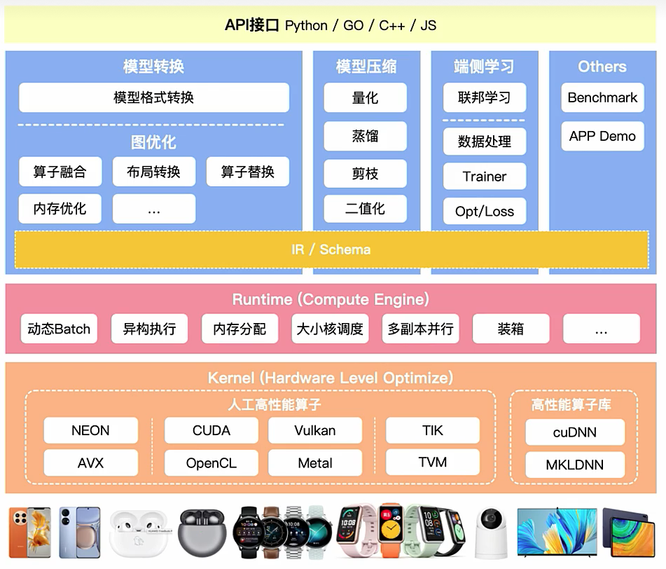

* 优化阶段
  * 模型转换工具，由转換和图优化构成
  * 模型压缩工具、端侧学习和其他组件组成
* 运行阶段：即推理引擎，负责AI模型的加载与执行，可分为调度与执行两层

## *模型转换*

### 基本介绍

### 架构与文件格式

### 自定义计算图IR

### 流程细节

## *模型小型化*

### NAS神经网络搜索

### CNN小型化结构

### Transform小型化

## *模型压缩*

模型量化 Quantization 是指以较低的推理精度损失将连续取值（通常为float32或者大量可能的离散值）的浮点型权重近似为有限多个离散值（通常为int8）的过程

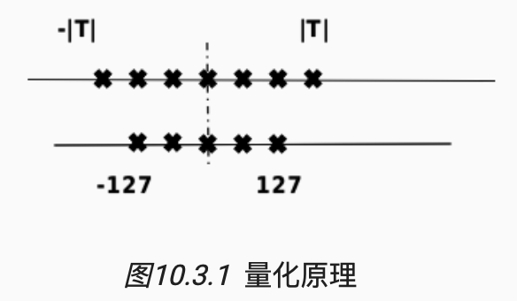

### 量化分类

* 低比特量化：工业界目前最常用的量化位数是8比特，低于8比特的量化被称为低比特量化。1比特是模型压缩的极限，可以将模型压缩为1/32，在推理时也可以使用高效的XNOR和BitCount位运算来提升推理速度

* 根据量化数据表示的原始数据范围是否均匀，还可以将量化方法分为线性量化和非线性量化

  实际的深度神经网络的权重和激活值通常是不均匀的，因此理论上使用非线性量化导致的精度损失更小，但在实际推理中非线性量化的计算复杂度较高，通常使用线性量化

  下面介绍的都是线性量化

  令r表示量化前的浮点数，量化后的整数q可以表示为如下的公式，其中clip和round分别是截断和取整的操作，$q_{}{min}$ 和 $q_{max}$ 分别是量化后的最小、最大值，s是数据的间隔，z则表示数据偏移的偏置
  $$
  q=clip(round(\frac{r}{8}+z),q_{min},q_{max})
  $$

  * 对称量化 symmetric uniform quantization 和非对称量化 uniform affine quantization

    上式中偏移量z为0的量化被称为对称量化，z不为0则是非对称量化

    对称量化可以避免量化算子在推理中计算z相关的部分，降低推理时的计算复杂度；非对称量化可以根据实际数据的分布确定最小值和最小值，可以更加充分的利用量化数据信息，使得量化导致的损失更低

  * 逐层量化和逐通道量化

* 根据量化过程中是否需要训练，可以将模型量化分为量化感知训练 Quantization Aware Training, QAT 和训练后量化 Post Training Quantization, PTQ

  * 感知量化训练 QAT 是指在模型训练过程中加入伪量化算子，通过训练时统计输入输出的数据范围可以提升量化后模型的精度，适用于对模型精度要求较高的场景
  * 训练后量化 PTQ 指对训练后的模型直接量化，只需要少量校准数据，适用于追求高易用性和缺乏训练资源的场景

### 模型的量化粒度

### 压缩四件套

### 低比特量化原理

### 感知量化训练 QAT

### 训练后量化PTQ与部署

### 模型剪枝

### 模型稀疏

模型稀疏是通过去除神经网络中部分组件（如权重、特征图、卷积核）降低网络的存储和计算代价，它和模型权重量化、权重共享、池化等方法一样，属于一种为达到降低模型计算复杂度的目标而引入的一种强归纳偏置

### 知识蒸馏原理

## *离线优化压缩*

### 低比特量化

### 二值网络

### 蒸馏

### 剪枝

## *图优化*

### 图转换优化

### 并发执行与内存分配

### 动态batch与bin Packing

### 常量折叠&冗余节点消除

### 算子融合/替换/前移

### 数据布局转换&内存优化

## *Kernel优化*

### Kernel优化架构

### Im2Col算法

### Winograd算法

### QNNPack算法

### 推理内存布局

## *推理引擎框架*

### OpenVINO

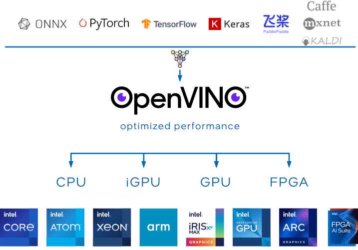

OpenVINO（Open Visual Inference and Neural Network Optimization）是一个由英特尔开发的免费工具套件，专门用于加速深度学习推理工作负载。这个框架最初是为了优化计算机视觉应用而设计，但现在它支持多种类型的深度学习模型

OpenVINO可以帮助开发者充分利用英特尔硬件的性能，提高深度学习模型的推理效率，特别是在边缘计算和计算机视觉应用方面

### TensorRT

TensorRT是NVIDIA开发的一个高性能深度学习推理（inference）引擎，专门用于生产环境。它为深度学习模型提供低延迟和高吞吐量的推理。TensorRT主要针对NVIDIA GPU进行了优化，广泛应用于从自动驾驶汽车到医疗诊断、从机器人到智能摄像头的各种领域


TensorRT是可以在NVIDIA各种GPU硬件平台下运行的一个C++推理框架。我们利用Pytorch、TF或者其他框架训练好的模型，可以转化为TensorRT的格式，然后利用TensorRT推理引擎去运行训练好的模型，从而提升这个模型在英伟达GPU上运行的速度。速度提升的比例是比较可观的

主要特点

* 性能优化
  * TensorRT可以通过各种优化方法提高深度学习模型在NVIDIA GPU上的运行效率，包括层融合、内核自动调整、精度校准（如FP32到FP16或INT8的量化）等
  * 通过针对NVIDIA GPU的特定优化，TensorRT显著减少了模型的推理时间，提高了吞吐量
  * 支持使用低精度计算，进一步加速推理过程，同时在许多应用中保持了足够的精度
* 动态张量内存：提供动态张量内存分配，以优化不同大小输入的处理效率
* 多平台兼容性：TensorRT支持在多种NVIDIA平台上运行，从数据中心的GPU到嵌入式系统和边缘设备。

应用场景

* 自动驾驶和车辆辅助系统：用于快速处理和分析来自车辆传感器的数据
* 医疗成像和诊断：加速图像处理和分析流程，帮助医生更快地做出诊断
* 机器人技术：用于提高机器人的反应速度和处理能力
* 视频分析和处理：在安全监控和内容分析中快速处理视频数据

TensorRT是在需要高性能和实时推理的应用中的理想选择，尤其是在NVIDIA GPU环境中。通过优化和加速深度学习模型的推理过程，TensorRT使得复杂的AI应用能够实时和高效地运行

### ONNX Runtime

ONNX Runtime是一个用于执行机器学习模型推理的性能优化引擎。它由Microsoft开发，专门用来执行ONNX（Open Neural Network Exchange）格式的模型。ONNX是一个开放格式，用于表示深度学习和机器学习模型，它使模型可以在不同的框架、工具、运行时和编译器之间移植

### 阿里 MNN

### 华为 MindSpore

# AI芯片

### 人工高性能算子

"人工高性能算子"（在深度学习和计算机视觉的领域中），通常指的是为了提高计算效率和性能而专门设计和优化的算法或函数。在深度学习框架中，算子（Operator）是执行特定计算任务的基本单位，如矩阵乘法、激活函数、卷积等。当这些算子被针对特定硬件或特定场景手工优化时，它们就可以被认为是“高性能算子”。

这些算子的特点和重要性包括：

### 特点

1. **高度优化**：这些算子针对特定的硬件架构（如GPU、CPU、FPGA或ASIC）进行了优化，以实现最大的运算效率。
2. **定制实现**：它们通常是针对特定应用或数据集的特性定制的，以提高在这些场景下的性能。
3. **并行计算**：在GPU等硬件上，这些算子利用并行计算的优势来加速处理。
4. **底层编程**：高性能算子的开发可能涉及底层编程语言和技术，如CUDA编程，以直接与硬件交互。

### 重要性

1. **提高模型推理效率**：在实际应用中，如自动驾驶、实时视频分析等场景，快速准确的模型推理至关重要。高性能算子可以显著提升这些应用的性能。
2. **节约资源**：通过优化计算，可以减少所需的硬件资源，降低成本和能耗。
3. **实现复杂任务**：有些高级的或特别复杂的任务（如3D图像处理或实时语言翻译）需要高度优化的算子来实现。

在实践中，开发高性能算子需要深厚的专业知识，包括对目标硬件的理解、算法优化技巧以及对应用场景的深入了解。这些算子是高性能计算和深度学习应用中不可或缺的组成部分。

# 大模型训练
