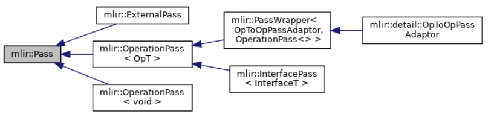

[MLIR (llvm.org)](https://mlir.llvm.org/)


EDSC, Embedded Domain Specific Constructs 嵌入式域特定构造：一个声明式的构造器库，用于以朴素 C++ API 的方式构造 MLIR 

Export 导出：一般用以说明从 MLIR 表示体系到其他语义等效的表示的操作，例如翻译 translation

Function 函数：一个有名称操作，它包含一个域 region

Import 导入：一般用以说明从其他表示到 MLIR 体系的语义等效表示的操作，例如翻译 translation


Module 单元：一个操作 operation，它包含一个域 region，这个域包含一个块 block，这个块由多个操作 operation 组成


Round-trip 往返：原表示到目标表示又回到原表示的过程

Terminator operation 终止操作：该操作 operation 终止一个块 block

Transitive lowering 传递下降：类似 `A->B->C` 的下降模式。通过部分转换 partial conversion 充分将非法操作合法化


# MLIR 的核心概念

## *传统编译器 IR 的问题*

### IR 碎片化问题

* LLVM IR 抽象级别太低，无法针对特定领域或者语言优化，因而各个语言框架有自己的 IR 和优化实现，无法重用
* IR 种类太多，针对不同种类 IR 的开发的 Pass 可能重复即不同 IR 的同类 Pass 不兼容。针对新的IR编写同类 Pass 需要重新学习 IR 语法，门槛过高
* 不同类型 IR 所做的 Pass 优化在下一层中不可见
* 不同类型 IR 间转换开销大，从图 IR 到 LLVM IR 直接转换存在较大开销

### MLIR 试图解决的问题

MLIR（多级中间表示，Multi-Level Intermediate Representation 是 LLVM 原作者 Chris Lattner 在 Google 时候开始做的项目，现在已经合入LLVM仓库。MLIR目的是做一个通用、可复用的编译器框架，减少构建 Domain Specific Compiler 的开销。MILIR 目前主要用于机器学习领域，但设计上是通用的编译器框架，比如也有 FLANG（Ilvm 中的 FORTRAN 编译器）、CIRCT（用于硬件设计）等与ML无关的项目。MLIR 现在还是早期阶段，还在快速更新迭代，发展趋势是尽可能完善功能，减少新增自定义 feature 的工作量

下面是一些用 MLIR 构建的开源项目

- tensorflow：没有 tf 就没有MLIR
- mhlo：tensorflow 组件，相当于支持动态规模的 XLA
- tfrt：tensorflow 组件，tensorflow 新的 runtime
- torch-mlir：连接 pytorch 与 mlir 生态
- onnx-mlir：连接 onnx 与 mlir 生态
- iree：深度学习 end2end 编译器
- circt：硬件设计及软硬件协同开发
- flang：FORTRAN 的编译器前端
- polygeist：C/C++ source code 变成 mlir Affine

### 与 LLVM IR 的区别 & 联系

[MLIR介绍（一）概览 - 知乎](https://zhuanlan.zhihu.com/p/465464378)


> 个人认为MLIR更适合和LLVM做比较,而不是TVM等dl compiler。LLVM和MLIR的很多概念都比
> 较像,了解LLVM的话MLIR会比较容易上手。
> LLVMIR由于当时的历史局限性,类型只设计了标量和定长vector,有个给LLVM加matrix类型的
> 提案目前看来也没有进展。而MLIR自带tensor*类型,对深度学习领域更友好。
> MLIR有Operation和Dialect的概念,Dialect,Operation,Attrribute,Type等都可以通过td文
> 件比较方便地定义出来。而LLVM定义新的intrinsic比较麻烦,定义新的IR就更麻烦了。LLVMIR
> 主要表示硬件指令操作,而MLIR能表示更多东西,比如表示神经网络的图结构。因为有Dialect,
> MLIR是组件化+,去中心的,不像LLVM的ir是一种大而全的。
> MLIR执行过程和LLVM一样,IR会过由Pass组成的Pipeline,不所地变换生成最终的IR。不同的是
> MLIR的IR可以是不同dialect的,构成了Multi-Level的效果。

## *Dialect*

### 什么是 dialect

Dialect 是 MLIR 的核心机制，它其实就代表了一层层的 IR（也可以理解为对一门 DSL 的抽象）。Dialect 是一系列用以拓展 MLIR 体系的组件，其于 MLIR 类似于各种库之于 C++。不同的方言以不同的名字空间 namespace 体现

将多个层次的 IR 通过 Dialect 方言机制进行语义的统一，共用同一套生态系统，可以使各个层次之间的跨度缩小，从而有效地实现各层次之间地协调优化

原来多种后端对应多个中间 IR，现在可以通过 dialect 之间的互相转换，只需要 graphIR 一个

### Dialect 的主要组成

* A prefix (“namespace” reservation) "命名空间" 前缀
* (optional) A list of custom types, each its C++ class 一个独有的类型系统
* A list of operations, each its name and C++ class implementation
  * Verifier for operation invariants (e.g. toy.print must have a single operand)
  * Semantics (has-no-side-effects, constant-folding, CSE-allowed, ….)
* Passes: analysis, transformations, and dialect conversions. 分析、转换
* (optional) Possibly custom parser and assembly printer 针对当前 dialect IR 自定义的解析器、打印器

## *Operation*

Operation 是 Dialect 的重要组成部分，可以看作是方言语义的基本元素

### Operaion 嵌套关系

Recursive Nesting Architecuture of Operation


* Operation 操作：表示一个代码单元。是MLIR最重要的概念之一
* Operation 的结构是一个嵌套递归结构，即 Operation `->` Region `->` Block `->` Operation `->` `...`
* Region 域：为多个 Block 的控制流图 CFG/列表
* Block 块：一个多个不含控制流 control flow 的 Operations 组成的顺序表

### MLIR 的格式

~~和 LLVM IR 以 SSA instruciton 为核心不同，MLIR 没有预定义的 instruction，全部都是 operation~~

BTW，不同 dialect 之间统一的 MLIR 形式也是 dialect conversion 高效的原因之一

MLIR 的格式类似于 LLVM IR，都是基于 SSA 的。Operation 看起来就像一个函数的定义，有输入输出

````mlir
%res:2 = "mydialect.morph"(%input#3){some.attribute = true, other_attribute = 1.5}
	:(!mydialect<"custom_type">)->(!mydialect<"other_type">, !mydialect<"other_type">)
								loc(callsite("foo" at "mysource.cc":10:8))
````


上面的完整格式可能看起来有些复杂，一般的 Operation 的格式为

```
%result = "dialect.operation_name"(%arg1, %arg2) : (type1, type2) -> type3
```

### Op 类

Op 表示的是算子类

Op 类是 `operation*` 的 wrapper

## *Module*

Module 是一个顶层的容器，用于组织和管理代码，用于包含一组函数 Functions、全局变量 Globals 和其他模块级别的实体。它类似于其他编程语言中的“模块”或“文件”，是 MLIR 程序的基本编译单元

代码中用 BuiltinOps 中的 class ModuleOp 来表示，一般都作为 operation 的最外层

## *Region & Block*

Region 是 Block 的有序列表，Region 的语义是它所包含的 Operation 所赋予的

MLIR 目前定义了两种 region：SSACFG region & Graph region。SSACFG region 描述 block 之间的控制流， graph region 则不需要块之间的控制流。算子中的 region 类型是使用 RegionKindInterface 描述的

Region 没有名称或地址，只有区域中包含的块才有。Region 必须包含在 operation 之中，并且没有类型或属性。该 Region 中的第一个 block 是一个被称为入口块 entry block 的特殊块。入口块的参数也是 region 本身的参数，入口块不能被列为任何其它快的后续块

函数体是 region 的

## *Identifiers & Keywords*

采用 EBNF 定义

```
// Identifiers
bare-id ::= (letter|[_]) (letter|digit|[_$.])*
bare-id-list ::= bare-id (`,` bare-id)*
value-id ::= `%` suffix-id
alias-name :: = bare-id
suffix-id ::= (digit+ | ((letter|id-punct) (letter|id-punct|digit)*))

symbol-ref-id ::= `@` (suffix-id | string-literal) (`::` symbol-ref-id)?
value-id-list ::= value-id (`,` value-id)*

// Uses of value, e.g. in an operand list to an operation.
value-use ::= value-id (`#` decimal-literal)?
value-use-list ::= value-use (`,` value-use)*
```

* bare-id：裸标识符是一个以字母或下划线 `_` 开头的字符串，后面可以跟字母、数字、下划线 `_`、美元符号 `$` 或点号 `.`

* value-id：值标识符以百分号 `%` 开头，后面跟一个后缀标识符 suffix-id

  值引用表示局部变量或临时值

* symbol-ref-id 符号引用：符号引用标识符以 `@` 开头，后面跟一个后缀标识符或字符串字面量，还可以通过 `::` 嵌套引用符号。比如 `@foo`、`@module::function`

  符号引用表示全局唯一的命名实体，通常用于表示函数名、全局变量名、模块名等

* value-use 值引用

# 构建 Dialect


## *构建新的 dialect*

[Creating a Dialect - MLIR](https://mlir.llvm.org/docs/Tutorials/CreatingADialect/)

[Defining Dialects - MLIR](https://mlir.llvm.org/docs/DefiningDialects/)

### 编写 dialect 的 td 文件

```tablegen
// Include the definition of the necessary tablegen constructs for defining
// our dialect. 
include "mlir/IR/DialectBase.td"

// Here is a simple definition of a dialect.
def MyDialect : Dialect {
  let summary = "A short one line description of my dialect.";
  let description = [{
    My dialect is a very important dialect. This section contains a much more
    detailed description that documents all of the important pieces of information
    to know about the document.
  }];

  /// This is the namespace of the dialect. It is used to encapsulate the sub-components
  /// of the dialect, such as operations ("my_dialect.foo").
  let name = "my_dialect";

  /// The C++ namespace that the dialect, and its sub-components, get placed in.
  let cppNamespace = "::my_dialect";
}
```


```cmake
set(LLVM_TARGET_DEFINITIONS FooTransforms.td)
mlir_tablegen(FooTransforms.h.inc -gen-rewriters)
add_public_tablegen_target(MLIRFooTransformIncGen)
```

LLVM_TARGET_DEFINITIONS 用于指定需要处理的 `.td` 文件

`mlir_tablegen` 是一个 CMake 宏，用于调用 MLIR 的 TableGen 工具

## *定义新的 operation*

### 使用 ODS 自动生成

构建 operation 采用了一种声明式的自动化工具 ODS, Operation Definition Specification：基于 TableGen，方便自定义 operation

使用 mlir-tablegen 工具从 `.td` 文件转换为 `.inc` 文件

首先在 ODS 中定义一个继承自 Op 类的基类 `Toy_Op`

```tablegen
class Toy_Op<string mnemonic, list<OpTrait> traits = []> :
    Op<Toy_Dialect, mnemonic, traits>;
// Toy_Dialect : 父类 Dialect 操作
// mnemonic : 注记符号，一般是一个字符串型的单词，代表了该操作的含义
// traits : 该操作的一些特征，放在一个列表中

```

```tablegen
def ConstantOp : Toy_Op<"constant", [NoSideEffect]> {
  // "constant"就是注记符号，[NoSideEffect]说明了该操作的一个特点
  // Provide a summary and description for this operation. 
  let summary = "constant";
  let description = [{
    Constant operation turns a literal into an SSA value. The data is attached
    to the operation as an attribute. For example:
    \```mlir
      %0 = toy.constant dense<[[1.0, 2.0, 3.0], [4.0, 5.0, 6.0]]>
                        : tensor<2x3xf64>
	\```
  }];

  /*
```
  arguments和results：定义参数和结果,参数可以是SSA操作数的属性或类型。
  通过为参数或结果提供名称，ODS将自动的生成匹配的访问器。
  arguments一般模板(results同理): 
  let arguments = (ins <data_type><data_attribute>:$<variable_name>);

  - ins: 输入 (results中该参数为 outs)
  - <data_type>: 数据类型
  - <data_structure>: 数据属性
  - ElementsAttr: 稠元(dense element)
  - <variable_name>: 变量名
    */
    // The constant operation takes an attribute as the only input.
    // `F64ElementsAttr` corresponds to a 64-bit floating-point ElementsAttr.
    let arguments = (ins F64ElementsAttr:$value);
    // The constant operation returns a single value of TensorType.
    let results = (outs F64Tensor);

  // Divert the printer and parser to `parse` and `print` methods on our operation.
  let hasCustomAssemblyFormat = 1;
  /*
  // 自定义程序的组装格式，使最终输出的 IR 格式更精简、易读
  let parser = [{ return ::parseConstantOp(parser, result); }];
  let printer = [{ return ::print(p, *this); }];
  */
    
  // ODS 可以自动生成一些简单的构建方法，用户也可自定义添加一些构造方法
  let builders = [
    // Build a constant with a given constant tensor value.
    OpBuilderDAG<(ins "DenseElementsAttr":$value), [{
      build($_builder, $_state, value.getType(), value);
    }]>,
    // Build a constant with a given constant floating-point value.
    OpBuilderDAG<(ins "double":$value)>
  ];

  // Add additional verification logic to the constant operation.
  // will generate a `::mlir::LogicalResult verify()`
  let hasVerifier = 1;
}


在这个例子中，我们定义了一个 `AllOperandsIntegers` 特征，检查操作中的所有操作数是否为整数或索引类型。这个特征可以在操作定义中通过模板参数轻松使用

### 在 TableGen 中使用 OpTrait

在 TableGen 操作定义中，可以在操作的 trait 列表中使用这些 traits。一个简单的例子如下：

```
def MyOperation : MyDialect<"my_op">,
                  Commutative,
                  Pure,
                  OpTrait::ZeroRegion,
                  OpTrait::NOperands<2>::Impl,
                  OpTrait::OneResult {
  let summary = "My custom operation with traits";
  let description = [{
    This operation is commutative, has no side effects, and
    operates on two operands returning one result.
  }];
}
```

这里，`MyOperation` 持有多个 traits，如可交换性、纯运算、没有区域（没有控制流子图），两个操作数和一个结果。这使得操作的定义精确且易于阅读，同时实现了良好的属性检查和优化支持

## *OpInterface*

OpInterface 是一套提供协议和方法的机制，允许为 operation 定义统一的接口。这些接口定义了一组方法，操作可以选择实现这些方法以提供某些行为或属性。这种机制促进了代码的可重用性和多态性，使得不同类型的操作能够以统一的方式进行处理和转换


# Dialect 转换

* Translation 翻译：用以区分转换 conversion，翻译是**非 MLIR 表示和 MLIR 表示之间**的操作，比如说高级语言（C、XLA、Toy、深度学习框架等）在接入 MLIR 之前需要做一步翻译操作
* Conversion 转换：用以区分翻译 translation，转换是 **MLIR 不同方言之间**的语义等效转换操作
* Transformation
* Canonicalization 正规化
* Lowering 下降 ：表示从高级别 IR 表示到低级别 IR 表示，语义等效表示的改变。MLIR 中通常指转换 conversion

和实现 operation 的 ODR 风格类似，实现 dialect 转换的方式是 DRR, Declarative Rewrite Rule 声明式重写规则：基于 TableGen，通过编写的声明式的重写规则，可以自动生成表达式匹配和重写函数，即生成等效的 C++ 的 `mlir::RewritePattern` 子类

## *Conversion*

## *Lowering 过程*

MLIR 是没有可以生成目标代码的 codegen 的，所以必须要将 IR 转换为 LLVM IR，这个过程称为 Lowering，属于 dialect 转换的一种

这里先引入一个 Legalization 合法化 的概念：改变当前 operation 的表示以符合 conversion target 要求


### Components

* Conversion Target: Specification of what operations are legal and under what circunnstances
* Operation Conversion: Dag-Dag patterns specifying how to transform illegal operations to legal ones
* Type Conversion 类型转换匹配: Specification of how to transform illegal types to legal ones

### Lowering Modes

有两种 lowering 的模式

* Partial: Not all input operations have to be legalized to the target。这是 MLIR 比较特色的转换方式， 可以保留原 dialect 中仍然需要的 operation，不像 LLVM IR 转换就把原来的 IR 全部转换走了
* Full: All input operations have to be legalized to the target

### Partial Lowering

### Full Lowering

1. 创建 Lower to LLVM Pass
2. Type Conversion
3. Conversion Target
4. 定义 lowering pattern


# Dialect Architecture

[机器学习编译器代码生成相关 MLIR Dialect | Lei.Chat()](https://www.lei.chat/zh/posts/mlir-codegen-dialects-for-machine-learning-compilers/#高层用于描述模型的-dialect)

既然 Dialect 的作用是类似于各种库之于 C++，那么 built-in dialect 就类似于 C++ 的标准库

MLIR 原生支持的内建 Dialect 有很多，具体可以查看 [Builtin Dialect - MLIR](https://mlir.llvm.org/docs/Dialects/Builtin/)

* Func dialect：处理函数的 dialect，包含的函数定义、调用、返回等基本操作
* Arith dialect：处理加减乘除移位等各种运算
* Math dialect：
* SCF, Standard Control Flow dialect：结构化控制流，保留 for，if 等语句
* CF, Control Flow dialect：
* Vector dialect：de
* GPU dialect：
* LLVM dialect：LLVM IR 的 binding，可以直接翻译给 LLVM 做后续编译
* SPIR-V dialect

## *Dialect 架构设计*

[【源码研读】MLIR Dialect 分层设计 - Aurelius84 - 博客园](https://www.cnblogs.com/CocoML/p/17632342.html)


一般将高层次 (high-level) 抽象递降 (lower) 到低层次 (low-level) 抽象。 递降的过程通常会进行某种形式的问题分解 (decomposition) 或者资源分配 (resource assignment) 来逐渐贴近底层硬件。 前者的例子有 tiling, vectorization 等等；后者的例子有 bufferization, 寄存器分配 (register allocation) 等等

### 高层用于描述模型的 dialect


MHLO, Machine Learning High-Level Operations Dialect 是 **XLA: HLO** 向 MLIR 的移植版本，是由 Google 开发的，用于支持将 TensorFlow 和 XLA 高级优化操作向 MLIR 表示的转换

mhlo Dialect 的背景

- **XLA (Accelerated Linear Algebra)**：是 TensorFlow 中的一个特性，用于提升深度学习模型的训练和推理效率。它通过特定的高性能编译器优化，将数学操作编译为更高效的低级代码。
- **HLO (High-Level Operations)**：是 XLA 定义的一组操作，它们用于描述机器学习计算的各个部分。这些高层次操作为编译器提供了一种描述计算的方式，而不需深入底层实现的细节。

TOSA, Tensor Operator Set Architecture Dialect

### 中间层用于递降的 dialect

高层和低层的 dialect 通常处于 MLIR 系统的边界，所以需要准确地描述某一 MLIR 之外的标的。 中间层的 dialect 则没有这样的限制，所以中间层的 dialect 具有更大的设计空间以及更高的设计灵活性。

传统的中间表示，如 LLVM IR 或者 SPIR-V，通常都是完整 (*complete*) 的； 它们包含所需的所有指令来表示整个 CPU 后者 GPU 程序。相较而言，中间层的 dialect 则可以认为是部分 (*partial*) 中间表示。 这种组织结构有助于解耦 (decoupling) 和可组合性—我们可以通过混用这一层的不同 dialect 来表示原始模型，同时不同 dialect 可以独立发展演进。 这些dialect 有的用来表示计算或者负载 (payload)，有的则表示控制流或者某种结构 (structure)

### 底层用于描述目标的 dialect

在 MLIR 中目前有两个底层 dialect：[`llvm` dialect](https://mlir.llvm.org/docs/Dialects/LLVM/) 和 [`spv` dialect](https://mlir.llvm.org/docs/Dialects/SPIR-V/)。 它们分别用来对 LLVM IR 和 SPIR-V 建模。 转换成任何一个都是对导出到外部系统的准备。 因为这两个 dialect 描述外部中间表示，它们在类型和指令方面受相应的限制。 递降到 `llvm` 或者 `spv` dialect 需要进行整体的 dialect conversion； 完成之后 IR 中不再有任何的非 `llvm` 或者 `spv` dialect 的操作。

一般而言，**上层应该已经完成各种优化，在这个层次不会再有。** 这个层次的转换多是普适的 canonicalization 和清理，以及一些用以**保障合法性**的转换


## *Standard dialect 的拆分*

Standard dialect 已被拆分和重新组织到更为专注的方言中。这种重构有助于更清晰地表述操作的用途和领域范围，并且加强模块化和可扩展性。以下是对一些关键变化的概述：

* arith Dialect
  - 这部分承担了几乎所有整数和浮点数的算术及比较操作
  - 例子包括 `arith.addi`（整数加法）、`arith.subf`（浮点数减法）、`arith.cmpi`（整数比较）、`arith.cmpf`（浮点数比较）等
* func Dialect ['func' Dialect - MLIR](https://mlir.llvm.org/docs/Dialects/Func/)
  - 用于处理函数定义及相关操作，如函数调用、参数传递和返回
  - `func.func`, `func.return` 等是该方言的典型操作
* memref Dialect
  - 处理内存相关的操作，包括分配、释放、加载和存储等动态内存操作
  - `memref.alloc`, `memref.dealloc`, `memref.load`, `memref.store` 都属于此类
* cf Dialect（Control Flow）
  - 专注于流控制相关的操作，如条件分支、循环控制等
  - `cf.br`, `cf.cond_br` 是该方言的基本操作
* tensor 和 vector Dialects
  - 这些方言分别处理张量和向量相关的操作，是高性能计算、机器学习等领域中的重要组成部分
  - 包含 `tensor.extract`, `tensor.insert` 以及 `vector.add`, `vector.mul` 等操作

### func

```mlir
func.func @function_name(%arg1: type1, %arg2: type2, ...) -> return_type {
  // 函数体
}
```

`func.func` 用于定义一个函数

## *LLVM IR*


# Type & Arrtibute

[Defining Dialect Attributes and Types - MLIR](https://mlir.llvm.org/docs/DefiningDialects/AttributesAndTypes/)

* Type：MLIR 中任何数据都必须指定 Type；MLIR 中内置了很多常用的 Type，我们也可以拓展自己的 Type，来表示更复杂的数据类型
* Attribute：MLIR 中 Attribute 可以简单理解为 Constant 常量数据值，用来定义一些常量和属性。每个 Attribute都有其 Type

## *Type*

Type 用于表示数据的类型，类似于编程语言中的数据类型（如 `int`、`float`、`struct` 等）。在 MLIR 中，Type 是静态的、不可变的对象，用于描述操作数（Operand）和结果（Result）的类型

## *Attribute*

> Attributes are the mechanism for specifying constant data on operations in places where a variable is never allowed - e.g. the comparison predicate of a [`cmpi` operation](https://mlir.llvm.org/docs/Dialects/ArithOps/#arithcmpi-arithcmpiop). Each operation has an attribute dictionary, which associates a set of attribute names to attribute values. MLIR’s builtin dialect provides a rich set of [builtin attribute values](https://mlir.llvm.org/docs/LangRef/#builtin-attribute-values) out of the box (such as arrays, dictionaries, strings, etc.). Additionally, dialects can define their own [dialect attribute values](https://mlir.llvm.org/docs/LangRef/#dialect-attribute-values).

Attribute 用于表示操作的附加信息，通常是编译时常量。Attribute 是静态的、不可变的对象，它的作用有

- **配置操作**：描述操作的特定行为、配置或约束条件，为操作提供额外的信息（如常量值、选项）
- **优化**：为编译器提供常量信息，便于优化（如常量折叠）
- **代码生成**：在生成目标代码时，属性信息用于确定操作的配置

### 属性的类型

属性可以是多种类型的值，常见的类型包括：

- 布尔值：如 `some.attribute = true`
- 数值：如整数 `other_attribute = 42` 或浮点数 `other_attribute = 1.5`
- 字符串：如 `name = "example"`
- 复杂类型：如数组、字典或自定义类型

# Pass

## *Pass 介绍*

Pass 是 MLIR 编译器框架中的基本工作单元，负责对 IR 进行分析、优化或转换





### Pass 分类

* Analysis Pass：收集 IR 的信息，但不修改 IR。比如数据流分析、依赖分析、别名分析等
* Transformation Pass 是最常用的 Pass：模式匹配并变换 pattern match & rewrite
  * Operation Pass：针对特定 Operation 的 Pass
  * Function Pass：针对 Function 的 Pass
  * Module Pass：针对整个 Module 的 Pass

* Conversion Pass：将 IR 从一种 Dialect 转换为另一种 Dialect
* Verification Pass：借助 llvm-lit & FileCheck
* 多线程运行 Pass


### OperationPass

OperationPass：用于 transform 某种类型的 operation 的 pass

需要提供下面的接口

* `void runOnOperation();`：实现 OperationPass 的具体逻辑，OperationPass 是由 Pass Manager 调用的，用于执行对 Operation 的转换或分析的 Pass
* `StringRef getName() const;`
* `std::unique_ptr<Pass> clonePass() const;`


## *定义 Pass*

## *Declarative Pass Specification*

类似于 ODS，可以使用 tablegen 来声明式地生成 pass


```tablegen
// mlir/include/mlir/Pass/PassBase.td
class PassBase<string passArg, string base> {
  // The command line argument of the pass.
  string argument = passArg;

  // The C++ base class for the pass.
  string baseClass = base;

  // A short 1-line summary of the pass.
  string summary = "";

  // A human readable description of the pass.
  string description = "";

  // A C++ constructor call to create an instance of this pass.
  // If empty, the default constructor declarations and definitions
  // 'createPassName()' and 'createPassName(const PassNameOptions &options)'
  // will be generated and the former will be used for the pass instantiation.
  code constructor = "";

  // A list of dialects this pass may produce entities in.
  list<string> dependentDialects = [];

  // A set of options provided by this pass.
  list<Option> options = [];

  // A set of statistics provided by this pass.
  list<Statistic> statistics = [];
}
```

* Base Class
  * `ModuleOp`：作用于 ModuleOp
  * `func::FuncOp`：作用于 FuncOp
  * `mlir::FunctionOpInterface`：作用于 interface 的 pass
* constructor：使用哪一个 C++ 构造函数来构造这个 pass，如果为空的话，TableGen 会生成 `createPassName()` & `createPassName(const PassNameOptions &options)`
* Option
* dependentDialects：如果依赖别的dialect，则添加该 part，例如 linalgOp 中可能会使用 affine_map 和 arithop


mlir/include/mlir/TableGen/Pass.h 则提供了 TableGen 如何生成对应的 C/C++ 代码的方法

### 例子

```c++
struct MyPass : PassWrapper<MyPass, OperationPass<ModuleOp>> {
  MyPass() = default;
  MyPass(const MyPass &) {}

  ...

  // Specify any options.
  Option<bool> option{
      *this, "example-option",
      llvm::cl::desc("An example option"), llvm::cl::init(true)};
  ListOption<int64_t> listOption{
      *this, "example-list",
      llvm::cl::desc("An example list option")};

  // Specify any statistics.
  Statistic statistic{this, "example-statistic", "An example statistic"};
};

/// Expose this pass to the outside world.
std::unique_ptr<Pass> foo::createMyPass() {
  return std::make_unique<MyPass>();
}

/// Register this pass.
void foo::registerMyPass() {
  PassRegistration<MyPass>();
}
```

上面的 pass 所对应的 tablegen 为

```tablegen
def MyPass : Pass<"my-pass", "ModuleOp"> {
  let summary = "My Pass Summary";
  let description = [{
    Here we can now give a much larger description of `MyPass`, including all of
    its various constraints and behavior.
  }];

  // A constructor must be provided to specify how to create a default instance
  // of MyPass. It can be skipped for this specific example, because both the
  // constructor and the registration methods live in the same namespace.
  let constructor = "foo::createMyPass()";

  // Specify any options.
  let options = [
    Option<"option", "example-option", "bool", /*default=*/"true",
           "An example option">,
    ListOption<"listOption", "example-list", "int64_t",
               "An example list option">
  ];

  // Specify any statistics.
  let statistics = [
    Statistic<"statistic", "example-statistic", "An example statistic">
  ];
}
```


### Option

## *`walk()`*


```c++
/// Traversal order for region, block and operation walk utilities.
enum class WalkOrder { PreOrder, PostOrder };
```

* PreOrder：Top Down 先序
* PostOrder：Bottom Up 后序，默认


```c++
class WalkResult {
  enum ResultEnum { Interrupt, Advance, Skip } result;
```

* Interrupt
* Advance：继续 walk
* Skip


### 适合使用裸 `walk()` 的场景


def-use chain?

## *Pattern 遍历*

### 适合使用 Pattern 的场景

## *Pattern*

### PatternSet

PatternSet 是一组 Patterns，在多个 Passes 间共享

## *PassManager*


Pass 可以组合成 Pass Pipeline（Pass 管道），按顺序执行多个 Pass


Pass 的执行顺序由以下因素决定：

- **Pass 管理器的配置**：Pass 管理器会根据 Pass 的依赖关系和配置决定执行顺序。
- **Pass 的依赖关系**：某些 Pass 可能依赖于其他 Pass 的结果，Pass 管理器会自动处理这些依赖。
- **Pass 的类型**：不同类型的 Pass 有不同的执行顺序（例如，Module Pass 在 Function Pass 之前执行）

### PassManager 的功能

PassManager 是控制 Pass 执行的核心工具。以下是 PassManager 的关键功能：

- **添加 Pass**：将 Pass 添加到 PassManager 中
- **设置执行顺序**：通过嵌套 PassManager 或指定依赖关系来控制执行顺序。PassManager 会自动处理 Pass 之间的依赖关系。例如：
  - 如果 Pass A 依赖于 Pass B，PassManager 会确保 Pass B 在 Pass A 之前执行。
  - 如果 Pass A 和 Pass B 之间没有依赖关系，PassManager 可能会并行执行它们（如果支持并行）
- **运行 Pass**：执行所有添加的 Pass

```c++
PassManager pm(ctx);

// 添加 Pass
pm.addPass(createMyPass1());
pm.addPass(createMyPass2());

// 运行 Pass
if (failed(pm.run(module))) {
    llvm::errs() << "Pass failed!\n";
}
```

### 嵌套 PassManager

MLIR 支持嵌套 PassManager，可以在一个 PassManager 中嵌套另一个 PassManager，从而更精细地控制 Pass 的执行顺序

```c++
PassManager outerPm(ctx);
PassManager innerPm(ctx);

// 添加 Pass 到内部 Pass 管理器
innerPm.addPass(createMyPass1());
innerPm.addPass(createMyPass2());

// 将内部 Pass 管理器添加到外部 Pass 管理器
outerPm.addPass(createModulePass(std::move(innerPm)));

// 运行外部 Pass 管理器
if (failed(outerPm.run(module))) {
    llvm::errs() << "Pass failed!\n";
}
```

### Registration

MLIR 使用 **Pass 注册表**（Pass Registry）来管理 Pass 的注册和发现。开发者可以通过以下方式注册 Pass：

- **静态注册**：使用 `mlir::PassRegistration` 注册 Pass
- **动态注册**：在运行时动态注册 Pass

# 多面体优化 & ·Polly & Affine Dialect

## *多面体模型*


## *Polly*


Polly 是 LLVM 项目的一个子项目，它提供了自动并行化和循环优化的功能。Polly 使用高级多维数组索引（Affine Expressions）来理解、表示和优化循环嵌套，特别是那些对于性能至关重要的计算密集型循环

Polly 基于一种叫做多面体模型的数学表示，使用这种方法，可以进行复杂的优化

Polly 主要应用于需要大规模数值计算的科学和工程领域，例如物理模拟、矩阵运算和图像处理。在这些领域，循环结构往往占据了程序的绝大部分计算时间，并且有明确的数据依赖模式可供分析和优化


## *Affine*

['affine' Dialect - MLIR](https://mlir.llvm.org/docs/Dialects/Affine/#dimensions-and-symbols)

Affine dialect 专门用于表示和优化仿射循环嵌套 Affine Loop Nests 和 仿射内存访问 Affine Memory Accesses。Affine Dialect 的目标是提供一种高级抽象，用于描述循环和内存访问模式，并支持自动优化（如循环变换、并行化、向量化等）

### 核心概念

* 仿射循环 Affine Loops

  - 仿射循环是指循环的上下界和步长是仿射函数（Affine Function）

  - 仿射函数是线性函数加上一个常数，例如 `i + 2 * j + 3`

仿射内存访问 Affine Memory Accesses

- 仿射内存访问是指内存访问的索引是仿射函数
- 例如，`A[i + 2 * j + 3]` 是一个仿射内存访问

仿射映射 Affine Maps

- 仿射映射定义了索引空间到内存空间的映射关系。
- 例如，`affine_map<(i, j) -> (i + j, i - j)>` 表示将二维索引 `(i, j)` 映射到二维内存空间。

仿射条件 Affine Conditions

- 仿射条件是指条件表达式是仿射函数。
- 例如，`if (i + j < 10)` 是一个仿射条件

### Operations

# Vector & Linalg

## *Vector*

### 向量类型

向量类型 Vector Types 表示一组固定大小的标量元素

- 语法：`vector<num_elements x element_type>`
  - `num_elements`：向量的长度
  - `element_type`：向量元素的类型（例如 `f32`、`i16` 等）
- 示例：
  - `vector<4 x f32>`：包含 4 个 `f32` 元素的向量
  - `vector<8 x i16>`：包含 8 个 `i16` 元素的向量

### 向量操作

Vector Dialect 提供了一组操作，用于创建、操作和转换向量

常见的操作包括：

- **`vector.extract`**：从向量中提取一个元素
- **`vector.insert`**：将元素插入向量
- **`vector.broadcast`**：将标量广播为向量
- **`vector.contract`**：执行向量收缩操作（例如点积）
- **`vector.transfer_read`** 和 **`vector.transfer_write`**：从内存加载向量或将向量存储到内存
- **`vector.shape_cast`**：改变向量的形状（例如从 2D 向量转换为 1D 向量）

### 向量化模式

向量化模式 Vectorization Patterns 指的是 Vector Dialect 支持将标量操作提升为向量操作，从而实现自动向量化

例如，可以将循环中的标量加法提升为向量加法

## *linalg*

linalg dialect 专门用于表示和优化线性代数操作 Linear Algebra Operations

# Bufferization & Memref Dialect

## *Bufferization*

[Bufferization - MLIR](https://mlir.llvm.org/docs/Bufferization/)

Bufferization  是 MLIR 中的一个概念，它指将高层次的内存操作（比如 `tensor` 张量操作算子、抽象内存访问）转换为低层次的具体内存操作（ `memref` 算子所表示的缓冲区分配、加载/存储操作）

它的主要任务包括：

- **内存分配**：为数据分配具体的缓冲区
- **内存访问**：将抽象的内存访问转换为具体的加载/存储操作
- **内存布局**：确定数据在缓冲区中的存储方式（如行优先、列优先）


## *memref*

memref 是 MLIR 中用于表示内存引用的 dialect，广泛应用于编译器优化和代码生成。它提供了一种高效的方式来描述内存布局、形状和访问模式，特别适合处理多维数组和张量

### 基本语法

```mlir
memref<形状x元素类型, 内存布局, 内存空间>
```

- **形状**：描述多维数组的维度（如 `2x3x4` 表示 2x3x4 的三维数组）
- **元素类型**：内存中存储的数据类型（如 `f32`、`i64` 等）
- **内存布局**（可选）：描述数据在内存中的存储方式
  * 行优先 `row_major`
  * 列优先 `column_major`
  * 自定义布局，比如 `affine_map<(d0, d1) -> (d1, d0)>`
- **内存空间**（可选）：标识内存所在的物理空间（如 GPU 显存、共享内存等）

### memory-space


### 操作

- **分配内存**：

  ```
  %mem = memref.alloc() : memref<4x4xf32>
  ```

- **释放内存**：

  ```
  memref.dealloc %mem : memref<4x4xf32>
  ```

- **加载数据**：

  ```
  %val = memref.load %mem[%i, %j] : memref<4x4xf32>
  ```

- **存储数据**：

  ```
  memref.store %val, %mem[%i, %j] : memref<4x4xf32>
  ```

- **获取子视图**：

  ```
  %subview = memref.subview %mem[0, 0][2, 2][1, 1] : memref<4x4xf32> to memref<2x2xf32, strided<[4, 1]>>
  ```

# MLIR 配套工具

## *mlir-opt*

mlir-opt 是一个用于为 MLIR 代码跑 passes & lowering 的命令行 entry-point

# Support

和 Clang 中的 Support 作用一样，就是封装 MLIR 对 OS 系统调用接口的使用，从而提供跨平台的支持


### LogicalResult

> This class represents an efficient way to signal success or failure. It
> should be preferred over the use of `bool` when appropriate, as it avoids
> all of the ambiguity that arises in interpreting a boolean result. This
> class is marked as NODISCARD to ensure that the result is processed. Users
> may explicitly discard a result by using `(void)`, e.g.
> `(void)functionThatReturnsALogicalResult();`. Given the intended nature of
> this class, it generally shouldn't be used as the result of functions that
> very frequently have the result ignored. This class is intended to be used
> in conjunction with the utility functions below.

LogicalResult 是一个用于表示操作成功或失败的简单类型。它类似于 C++ 中的 `bool`，但专门设计用于 MLIR 的 API 中，以提供更清晰的语义和更好的错误处理支持

- `success()`：表示操作成功
- `failure()`：表示操作失败