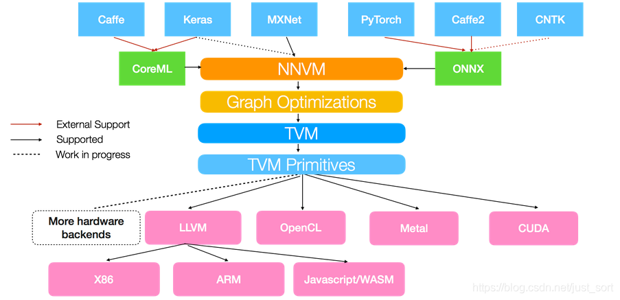
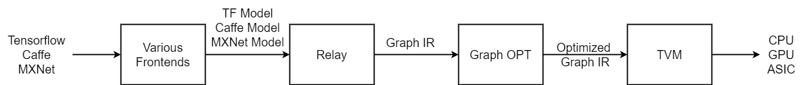

# 介绍

## *架构*

TVM, Tensor Virtual Machine 张量虚拟机。利用 TVM，工程师可以在任意硬件后端高效地优化和运行计算

从上图可以看出 TVM 架构的核心部分就是 NNVM 编译器。注意⚠️：最新的 TVM 已经将 NNVM 升级为了 Realy，选择上面这张图只是因为它比较清楚

## *安装*

### Docker

### 源代码编译

scheduler 可以简单理解为是一系列优化选择的集合，这些选择不会影响整个计算的结果，但对计算的性能却至关重要

## *支配树*

dominator tree

## *算子融合*

### 算子融合流程

- 通过 AST 转换为 Relay IR，遍历 Relay IR
- 建立 DAG 用于后支配树分析
- 应用算子融合算法，遍历每个 Node 到它的支配点的所有路径是否符合融合规则，完成融合后，遍历节点创新的 DAG 图

### 融合规则

- injective(one-to-one map)：映射函数，比如加法，点乘等。
- reduction：约简，如 sum/max/min，输入到输出具有降维性质，如 sum/max/min。
- complex-out-fusable(can fuse element-wise map to output)：计算复杂类型的融合，如 conv2d。
- opaque(cannot be fused)：无法被融合的算子，如 sort。
- 20