# 神经网络概述概述

## *Overview*

https://openmlsys.github.io/chapter_introduction/index.html

https://github.com/chenzomi12/DeepLearningSystem/tree/main

关于神经网络部署系统的概念很多，比如 AI 编译器、神经网络运行时 neural network runtime、推理系统 inference system 等，但其实它们的概念都有重叠，笔者暂时是没法分清楚的

总而言之就是神经网路部署需要一套工具链、软件库或者说运行时环境，它们专门用于执行训练好的深度学习模型。它们负责管理在特定设备或平台上的模型加载、优化、执行等任务

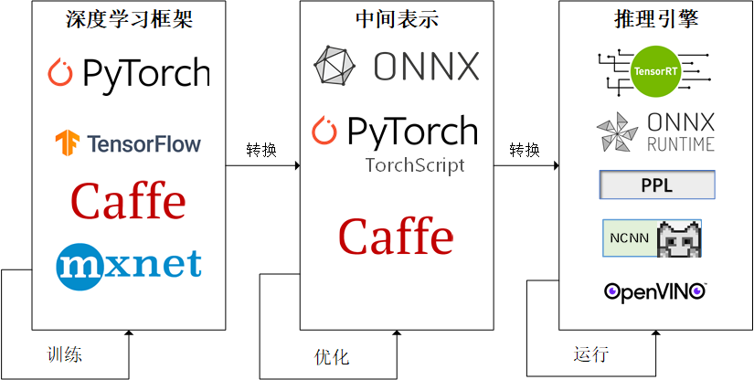

## *AI编译器/部署框架介绍*

### AI编译器的作用

在使用各种不同的训练框架（PyTorch, TensorFlow, Paddle, MindSpore, OneFlow 等）训练完的模型最终是需要部署到硬件上，进行实时推理计算的。我们一般会使用硬件厂商自己推出的一些前向推理框架，例如在 Intel 的 CPU/GPU 上就使用 OpenVINO，在 Arm 的 CPU/GPU 上使用 NCNN/MNN 等，在 Nvidia GPU 上使用 TensorRT

这也就产生了一些问题，虽然使用自家的推理框架自然是最优的，但是这也需要部署者不断重复的写部署代码。开发者首先需要将训练的模型分别转换到特定框架可以读取的格式，并且还要考虑各个推理框架 OP 实现是否完全对齐的问题，此外最为致命的是性能问题

这些重复编码的问题其实和早期编程语言的发展很相似，因此AI编译器的作用也就和编译器的功能相似，只要输入一个训练完的模型就可以生成在不同的硬件体系结构的平台上的推理部署代码

### 架构

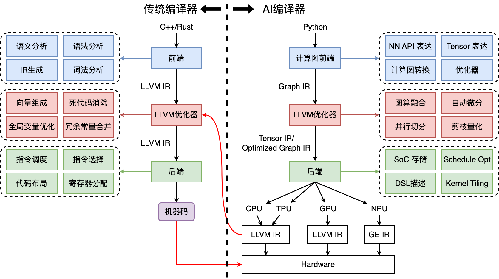

AI 编译器的首要目标是优化程序的性能，其次是降低编程难度

AI编译器的特点 & 功能

* Python 为主的动态解释器语言前端
* 多层IR设计，包括图编译、算子编译、代码生成
* 面向神经网络、深度学习的特定优化
* DSA 芯片架构的支持

## *主流框架*

### OpenVINO

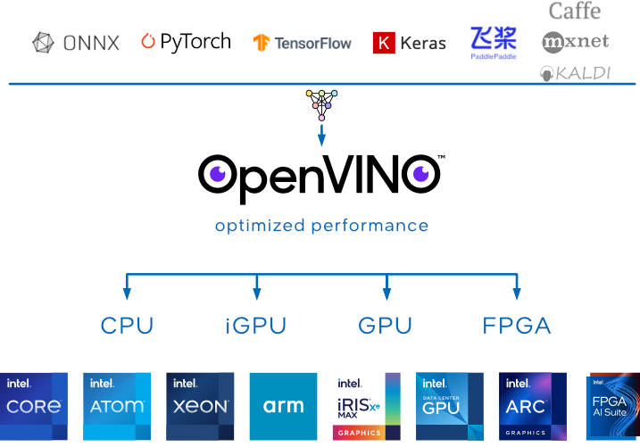

OpenVINO（Open Visual Inference and Neural Network Optimization）是一个由英特尔开发的免费工具套件，专门用于加速深度学习推理工作负载。这个框架最初是为了优化计算机视觉应用而设计，但现在它支持多种类型的深度学习模型

OpenVINO可以帮助开发者充分利用英特尔硬件的性能，提高深度学习模型的推理效率，特别是在边缘计算和计算机视觉应用方面

### TensorRT

TensorRT是NVIDIA开发的一个高性能深度学习推理（inference）引擎，专门用于生产环境。它为深度学习模型提供低延迟和高吞吐量的推理。TensorRT主要针对NVIDIA GPU进行了优化，广泛应用于从自动驾驶汽车到医疗诊断、从机器人到智能摄像头的各种领域


TensorRT是可以在NVIDIA各种GPU硬件平台下运行的一个C++推理框架。我们利用Pytorch、TF或者其他框架训练好的模型，可以转化为TensorRT的格式，然后利用TensorRT推理引擎去运行训练好的模型，从而提升这个模型在英伟达GPU上运行的速度。速度提升的比例是比较可观的

主要特点

* 性能优化
  * TensorRT可以通过各种优化方法提高深度学习模型在NVIDIA GPU上的运行效率，包括层融合、内核自动调整、精度校准（如FP32到FP16或INT8的量化）等
  * 通过针对NVIDIA GPU的特定优化，TensorRT显著减少了模型的推理时间，提高了吞吐量
  * 支持使用低精度计算，进一步加速推理过程，同时在许多应用中保持了足够的精度
* 动态张量内存：提供动态张量内存分配，以优化不同大小输入的处理效率
* 多平台兼容性：TensorRT支持在多种NVIDIA平台上运行，从数据中心的GPU到嵌入式系统和边缘设备。

应用场景

* 自动驾驶和车辆辅助系统：用于快速处理和分析来自车辆传感器的数据
* 医疗成像和诊断：加速图像处理和分析流程，帮助医生更快地做出诊断
* 机器人技术：用于提高机器人的反应速度和处理能力
* 视频分析和处理：在安全监控和内容分析中快速处理视频数据

TensorRT是在需要高性能和实时推理的应用中的理想选择，尤其是在NVIDIA GPU环境中。通过优化和加速深度学习模型的推理过程，TensorRT使得复杂的AI应用能够实时和高效地运行

### ONNX Runtime

ONNX Runtime是一个用于执行机器学习模型推理的性能优化引擎。它由Microsoft开发，专门用来执行ONNX（Open Neural Network Exchange）格式的模型。ONNX是一个开放格式，用于表示深度学习和机器学习模型，它使模型可以在不同的框架、工具、运行时和编译器之间移植

### 阿里 MNN

### 华为 MindSpore

## *部署态*

### 部署态区别

推理系统一般有两种部署态 deployment status，可以部署在云或者边缘。云端部署的推理系统更像传统Web 服务，在边缘侧部署的模型更像手机应用和IOT应用系统

* Cloud 云端：云端有更大的算力、内存，且供电也更能满足模型的功耗需求，同时与训练平台连接更加紧密，更容易使用最新版本模型，同时安全和隐私更容易保证。相比边缘侧可以达到更高的推理吞吐量。但是用户的请求需要经过网络传输到数据中心并进行返回，同时使用的是服务提供商的软硬件资源

  

  云端面临的挑战

  * 云上提供所有人工智能服务成本高昂
  * 推理服务对网络依赖度高
  * 数据隐私问题
  * 数据传输成本
  * 很难定制化模型

* 端侧

  

  端侧 Edge 是指计算或数据处理发生在网络的边缘，而不是在中央数据中心或云中心。端侧计算通常涉及将计算资源和应用程序推送到离数据源或终端设备更近的位置，以便在离数据源较近的地方进行数据处理和决策，从而减少延迟、提高响应速度，并降低网络流量

  边缘侧设备资源更紧张（例如，手机和IOT设备），且功耗受电池约束，需要更加在意资源的使用和执行的效率。用户的响应只需要在自身设备完成，且不需消耗服务提供商的资源

  端侧面临的挑战

  * 严格约束功耗、热量、模型尺寸小于设备内存
  * 硬件算力对推理服务来说不足
  * 数据分散且难以训练
  * 模型在边缘更容易受到攻击
  * DNN平台多样，无通用解决方案

### 边缘部署方式

1. 边缘设备计算：将模型部署在设备端，聚焦如何优化模型执行降低延迟

   * 端侧模型结构设计

   * 通过模型量化、剪枝等压缩手段

   * 针对神经网络的专用芯片 ASIC设计

2. 安全计算 + 卸载到云端：将模型部署于数据中心，边缘侧通过安全通信协议将请求发送到云端，云端推理返回结果，相当于将计算卸载到云端：

   * 利用云端运行提升模型安全性
   * 适合部署端侧无法部署的大模型
   * 完全卸载到云端有可能违背实时性的需求

3. 边缘设备 + 云端服务器：利用AI模型结构特点，将一部分层切（或者其 Student 模型）分放置在设备端进行计算，其他放置在云端。这种方式一定程度上能够比方式2降低延迟，由于其利用了边缘设备的算力，但是与云端通信和计算还是会带来额外开销

4. 分布式计算：联邦学习

   * 从分布式系统角度抽象问题，A计算在多个辅助边缘设备上切片
   * 切片策略根据设备计算能力，内存约束
   * 通过细粒度的切片策略，将模型切片部署其他边缘设备
   * 运行对计算模型进行调度，并通过输入数据通过负载均衡策略进行调度

5. 跨设备offloading：决策基于经验性的权衡功耗，准确度，延迟和输入尺寸等度量和参数，不同的模型可以从当前流行的模型中选择，或者通过知识蒸馏，或者通过混合和匹配的方式从多个模型中组合层。如较强的模型放在边缘服务器，较弱模型放置在设备

## *方向*

### 算法

对**算法、特征、业务、实际算法场景**感兴趣，可以专注深度学习各种算法知识（识别、检测、分类、校准、损失函数），然后**基于这些知识**解决实际的问题，可以训练模型，也可以结合传统图像或者其他方法一起解决。现实生活中的问题千奇百怪，一般只使用一个模型解决不了，可能会有多个模型一起上，解决方法也多种多样

### 部署

* 对**AI落地、部署、移植、算法SDK**感兴趣，可以多看工程落地的一些知识（C++、Makefile、cmake、编译相关、SDK），多参与一些实际项目攒攒经验，多熟悉一些常见的大厂造的部署轮子（libtorch、TensorRT、openvino、TVM、openppl、Caffe等），尝试转几个模型（ONNX）、写几个op（主要是补充，性能不要最优）、写几个前后处理、debug下各种奇葩的错误，让模型可以顺利在一些平台跑起来，平台可以在PC、手机、服务器等等；
* 对**算子优化、底层硬件实现**实现感兴趣的，可以重点看某一平台的硬件架构（CPU、GPU、NPU、VPU、DSP），然后学学汇编语言，看看内存结构，看看优化方法等等，做一些算子的优化，写一些OP啥的，再者涉及到profile、算子优化、内存复用等等。
* 当然还有**模型压缩、模型剪枝、量化、蒸馏**，这些其实也是部署的一部分，根据需要掌握即可

AI部署是将经过训练的AI模型整合到实际应用中的过程，以便在生产环境（例如服务器、云平台、移动设备或边缘设备）中使用。这个过程涉及到将模型从一个研究和开发环境转移到一个可以稳定、高效处理实时数据的环境。AI部署的主要目标是确保模型能够可靠地执行其预测或决策功能，同时满足性能和资源效率的要求

### 流程

* 训练一个模型，也可以是拿一个别人训练好的模型
* 针对不同平台对生成的模型进行转换，也就是俗称的parse、convert，即前端解释器
* 针对转化后的模型进行优化，这一步**很重要**，涉及到很多优化的步骤
* 在特定的平台（嵌入端或者服务端）成功运行已经转化好的模型
* 在模型可以运行的基础上，保证模型的速度、精度和稳定性


# 量化

[模型量化了解一下？ - 知乎](https://zhuanlan.zhihu.com/p/132561405)

## *量化加速的原理*

模型量化是一种深度学习模型优化技术，通过将模型的权重和激活从较高精度（如32位浮点数）转换为较低精度（如16位浮点数、8位整数等），可以理解为将信号的连续取值近似为有限多个离散值的过程，即一种信息压缩的方法

从而减少模型的存储需求、提高推理速度、降低能耗。这种技术对于资源受限的设备（如移动设备、嵌入式系统）特别有价值

### DNN 中的 MAC 计算

MAC 计算的步骤为

1. 乘法 multiply：计算每个输入单元和对应权重的乘积。对于一个神经元，输入是一个向量（例如神经层的输入特征），并且每个输入都有对应的权重。乘法步骤逐个计算这些乘积
2. 累加 accumulate：将所有乘积结果累加起来。对于整个神经网络层，这是对每个神经元都重复进行的运算
3. 偏置 bias：在累加结果完成后，通常还会加上一个偏置值，这是神经网络中另一个可训练的参数

DNN 中的应用

- 卷积层：在卷积层中，MAC 运算用于对卷积核与输入特征图的局部区域进行元素乘积后求和。这是卷积操作的核心计算步骤。
- 全连接层：在全连接层，每一个神经元的输出是其所有输入与各自权重的乘积和加上偏置的结果，因此需要较大量的 MAC 运算

MAC 计算占据了 DNN 中 80%-90% 的内容

### 整数乘法就一定比浮点数乘法快吗？

问题在于访存

### 量化中常见的精度

在深度学习中，FP32 曾是主流格式，但随着对内存和速度的需求增加，FP16 开始更多地应用于训练过程。然而，在对计算结果精准性有高需求的科学领域，FP64 仍然是必不可少的数据格式。选择使用 FP32 还是 FP64，通常取决于应用的精度要求、计算能力和内存资源

- 浮点数
  -  FP32 和 FP64 是浮点数（floating point number）的数据表示格式，用于数值计算和科学计算中，分别代表单精度和双精度浮点数。它们遵循 IEEE 754 标准
  -  FP16 代表 16 位浮点数，也称为半精度浮点数 half precision
  -  FP8 是一种浮点数格式，不过它的规格并没有像 FP16 和 FP32（单精度浮点数）那样标准化
- 整形：INT8, INT4

### 常见的量化方案/精度

W4A16

## *量化方法*

[深度学习模型量化：原理与应用-CSDN博客](https://blog.csdn.net/magic_ll/article/details/132167012)

模型量化方法本质上是函数映射。建立了高精度的浮点数据和量化后低精度的定点数据之间的数据映射

* 根据映射函数是否为线性，将其分为线性量化和非线性量化

  * 线性量化：8bit量化（最常用）
    * 对称量化
    * 非对称量化

  * 非线性量化
    * 二值量化（1bit量化）
      * 聚类量化
      * 对数量化

  实际的深度神经网络的权重和激活值通常是不均匀的，因此理论上使用非线性量化导致的精度损失更小，但在实际推理中非线性量化的计算复杂度较高，通常使用线性量化

* 根据量化的粒度（共享量化参数的范围）来分

  * **逐层**量化以一个层为单位，整个layer的权重共用一组缩放因子 S 和偏移量 Z
  * **逐组**量化以组为单位，每个 group 使用一组 S 和 Z
  * **逐通道**量化则 per channel 以通道为单位，每个 channel 单独使用一组 S 和 Z

* 根据激活值的量化方法来分

  * 在线量化 online 指激活值的 S 和 Z 在实际推断过程中根据实际的激活值动态计算
  * 离线量化 offline 指提前确定好激活值的 S 和 Z

### 线性量化

线性量化又称为 8bit 量化，即量化目标是将 FP32/FP16 转换为 INT8/FP8。8bit 量化是目前工程上应用最为成熟的方案。该方案非常好的平衡了推理速度和精度之间的矛盾。Google 的 Tensorflow 采用的是非对称量化，NVIDIA 采用的则是对称量化

对称量化和非对称量化使用的公式是一样的

令 R 表示量化前的原始浮点数，量化后的定点整数 Q，Z 是偏移量（或零点/最小值对应的量化数值，又被称为 Zero Point)，S 是缩放系数 scaling factor

可以表示为如下的公式，其中 round_fn 是取整函数

* 量化 quant：浮点转定点
  $$
  Q=\text{clip}\left(\text{round\_fn}(\frac{R}{S}+Z)\right)
  $$

* 反量化 dequant：定点转浮点
  $$
  R=(Q-Z)*S
  $$

S 和 Z 的值通过下面的公式得到，$R_{min}$ 和 $R_{max}$ 分别是量化之前进行量化操作的一批数据之中的最小、最大值，$Q_{min}$ 和 $Q_{max}$ 分别是量化之后的数据格式能够表示的最小、最大值范围，比如 INT8 就是 `[-128, 127]`
$$
S=\frac{R_{max}-R_{min}}{Q_{max}-Q_{min}}\\Z=Q_{max}-\frac{R_{max}}{S}
$$
如果将输入数据中存在偏离正常分布的较远离群点，则会导致较大的量化精度损失。因此实际使用中，还需要对超过阈值的值进行截断 clip 的操作
$$
x_{clipped}=\max(min\_value,\min(x,max\_value))
$$
上面的过程可以用下面的 C 代码来表示

```c
float valut = 1.0; float scale = 1.0;
int qt32 = round_fn(value / scale);
char qt8 = clip(qt32, Q_MIN, Q_MAX);
```

上式中偏移量 Z 为 0 的量化被称为对称量化，Z 不为 0 则是非对称量化

对称量化可以避免量化算子在推理中计算 Z 相关的部分，降低推理时的计算复杂度；非对称量化可以根据实际数据的分布确定最小值和最小值，可以更加充分的利用量化数据信息，使得量化导致的损失更低

* 对称量化 symmetric uniform quantization / absmax quant

  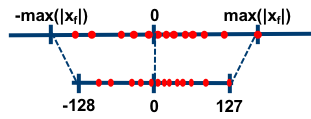

  如上图所示，对称量化将输入数据映射到 `[-128,127]` 的范围内,但在实际使用中使用的是 `[-127,127]`

* 非对称量化 uniform affine quantization / zeropoint quant

  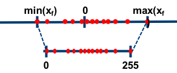

* Ristretto

### round_fn

round 函数是很有讲究的，一个最麻烦的事情就是如何处理 .5 这个值，即如何 round half，在不同的芯片上面 round 模式都不一样

* **Round half to even（四舍六入五留双）**：
  - 这种规则也被称为银行家舍入法（bankers' rounding）。它的主要目标是减少统计偏差
  - 如果数字正好在舍入边界上（例如，*.5的小数），那么它会舍入到最近的偶数
  - 例如：2.5被舍入为2，3.5被舍入为4
* **Round half away from zero（四舍五入）**：
  - 这是最常见的舍入方式，也被称为数学舍入法
  - 当数字达到.5时，总是朝远离零的方向舍入
  - 对于正数，舍入上去；对于负数，舍入下去
  - 例如：2.5被舍入为3，-2.5被舍入为-3
* **Round half toward zero（四舍五弃）**：
  - 这种方法在达到半位时，总是朝接近零的方向舍入
  - 无论是正数还是负数，遇到0.5会向零方向舍去
  - 例如：2.5被舍入为2，-2.5被舍入为-2
* **Round half down（四舍五弃）**：
  - 遇到精度临界值时，.5总是舍弃
  - 不管是正数还是负数，遇到0.5总是向下舍去
  - 例如：2.5被舍入为2，-2.5被舍入为-3
* **Round half up（四舍五入）**：
  - 通常指向上舍入到更大的整数
  - 对于正数和负数一致：加0.5后向上取整
  - 例如：2.5被舍入为3，-2.5被舍入为-2

### 量化子图

量化子图 quantized subgraph 是计算图中量化计算的部分

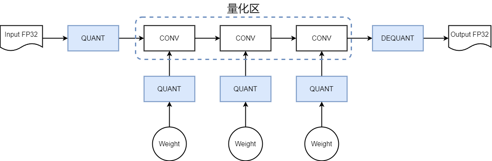

量化区指的是区域内所有的都是整数（INT8 或 INT16）计算

确保是一个完整的量化子图，否则可能比不量化，即直接用 FP32 来算还要慢，因为量化算子不是计算密集型，而是访存密集型的，它要把所有的数据都过一遍

## *非线性量化方法*

### 二值量化

低比特量化：工业界目前最常用的量化位数是 8bit，低于 8bit 的量化被称为低比特量化。1bit，即二值量化是模型压缩的极限，可以将模型压缩为 1/32，在推理时可以使用高效的位运算 XNOR 和 BitCount 位运算来提升推理速度

有两种方法实现权重的二值化

* 使用符号函数
  $$
  w_b=\left\{\begin{array}{l}+1&if\ w\geq0\\-1&otherwise\end{array}\right.
  $$

* 以一定概率随机量化，如下
  $$
  w_b=\left\{\begin{array}{l}+1&with\ prob\ p=\sigma(w)\\-1&with\ prob\ 1-p\end{array}\right.
  $$
  
  其中概率的计算方式如下
  $$
  \sigma(x)=clip(\frac{x+1}{2},0,1)=\max(0,\min(1,\frac{x+1}{2}))
  $$
  

为了保持精度，权重在前向传播和反向传播计算的时候进行二值化，但是在进行参数更新的时候使用浮点类型。虽然二值量化的效率非常高，但是对保存模型精度的挑战非常大，落地困难

### 聚类量化

### Power of 2（华为昇腾）

有些硬件可能无法直接计算除法，需要通过其他硬件模拟计算除法，导致效率很低，因此通过 offset 来逼近除法

### 对数量化/移位量化

两个同底的幂指数进行相乘，那么等价于其指数相加，降低了计算强度。同时加法也被转变为索引计算。但没有看到有在三大平台上实现对数量化的加速库，可能其实现的加速效果不明显。只有一些专用芯片上使用了对数量化

## *量化算子的实现*

### 量化乘法

### 量化加法

### 量化激活

### 量化矩阵乘

GEMM

### 非线性运算的量化

诸如 Exp,Tanh,Sigmoid,Softmax,Swish,Resize, 等内部包含非线性运算的非线性算子是不可以直接量化的，因为不能用整型来计算，必须要用浮点数

在不同处理器上做法不同

* 在 CPU、GPU 上，它们本身是具备浮点运算能力的，所以这类算子的计算不量化，以全精度模式运行
* 在 FPGA、ASIC 和 DSP 上，需要更改算子计算逻辑，以线性运算拟合或直接查表

## *离线优化压缩*

由于不需要动态计算量化参数，通常离线量化的推断速度更快些，通常有三种方法来确定相关的量化参数 S 和 Z

1. 指数平滑平均
   将校准数据集投喂给模型，收集每个量化的层的输出特征图，计算每个 batch 的 S 和 Z，并通过指数平滑平均更新 S 和 Z
2. 直方图截断
   由于有的特征图会出现偏离较远的奇异值，导致 max 非常大，所以可以通过直方图截取的形式，比如抛弃最大的前1%数据，以前1%分界点的数值作为 max 计算量化参数
3. KL散度校准
   参考：[8-bit Inference with TensorRT](https://aijishu.com/link?target=http%3A%2F%2Fon-demand.gputechconf.com%2Fgtc%2F2017%2Fpresentation%2Fs7310-8-bit-inference-with-tensorrt.pdf)
   TensorRT 的校准方案，通过 KL 散度（也称为相对熵，用以描述两个分布之间的差异）来评估量化前后分布的差异，搜索并选取 KL 散度最小的量化参数

## *量化训练*

根据量化过程中是否需要训练划分量化方法

* 感知量化训练/训练中量化 Quantization Aware Training, QAT 是指在模型训练过程中加入伪量化算子，通过训练时统计输入输出的数据范围可以提升量化后模型的精度，适用于对模型精度要求较高的场景
* 训练后量化/静态量化 Post Training Quantization, PTQ 指对训练后的模型直接量化，只需要少量校准数据，适用于追求高易用性和缺乏训练资源的场景
* 动态量化 Dynamic Quantization 指在推理过程中，动态地将部分浮点运算转换为整数运算。这种方法适用于在推理时在不重新训练模型的情况下进行浮点到整数的转换

### 感知量化训练 QAT

量化感知训练（Quantization-Aware Training, QAT）是一种在深度学习模型训练过程中模拟量化操作的技术。其核心目的是通过在训练阶段引入量化误差，使模型能够适应低精度表示，从而在最终量化后减少精度损失，保持较高的性能

QAT的主要步骤包括：

1. 预训练模型：首先使用浮点数（如FP32）进行模型训练，以获得基准性能。
2. 插入伪量化节点：在模型的关键位置（如权重和激活值）插入伪量化节点（FakeQuant），模拟量化过程中的舍入和钳位操作。这些节点在正向传播中模拟量化，在反向传播中传递量化误差，使模型逐步适应量化带来的影响
3. 梯度近似：由于量化操作不可微分，QAT通常采用梯度近似技术（如直通估计器，STE）来近似量化操作的梯度，从而实现基于梯度的优化
4. 优化参数：通过模拟量化的前向传播和梯度近似的反向传播，优化模型参数，使模型在量化后仍能保持较高的精度

### 训练后量化 PTQ 与部署

### 模型剪枝

## *模型稀疏*

模型稀疏 Model Sparsity 的思想类似于 Dropout，它是通过去除神经网络中部分组件（如权重、特征图、卷积核）降低网络的存储和计算代价，它和模型权重量化、权重共享、池化等方法一样，属于一种为达到降低模型计算复杂度的目标而引入的一种强归纳偏置

在 DL 和 ML 中，我们经常遇到需要使用大量参数的模型（如 DNN）。然而，并不是所有这些参数都是必需的或者在训练后仍然具有较大的幅值。稀疏化的过程是为了减少这些不必要的参数，通过将它们变为零，从而得到一个更小、更高效的模型


[模型的非结构化稀疏-PaddlePaddle深度学习平台](https://www.paddlepaddle.org.cn/lite/v2.12/user_guides/sparse.html)

### 两种模型稀疏策略

常见的稀疏方式可分为结构化稀疏和非结构化稀疏

* 结构化稀疏在某个特定维度（特征通道、卷积核等等）上对卷积、矩阵乘法做剪枝操作，然后生成一个更小的模型结构，这样可以复用已有的卷积、矩阵乘计算，无需特殊实现推理算子
* 非结构化稀疏以每一个参数为单元稀疏化，然而并不会改变参数矩阵的形状，只是变成了含有大量零值的稀疏矩阵，所以更依赖于推理库、硬件对于稀疏后矩阵运算的加速能力

从效果上看，结构化稀疏在较低稀疏度时，还能使模型获得一定的加速能力，但是在高稀疏度时往往会引入较大的精度损失；非结构化稀疏更能在高稀疏度时，可以达到几倍的推理加速，同时精度损失不大

# 量化误差

在进行缩放后为了将浮点型转换为整数过程中增加了 round 操作丢失了小数部分。在后续计算或反量化为浮点型时存在无法完全还原的情况，这就是精度损失

# 模型压缩

## *模型小型化*

### NAS神经网络搜索

### CNN小型化结构

### Transform小型化

## *知识蒸馏原理*

知识蒸馏 Knowledge Distillation，也被称为教师-学生 teacher-student 神经网络学习算法，已经受到业界越来越多的关注。大型深度网络在实践中往往会获得良好的性能，因为当考虑新数据时，过度参数化会提高泛化性能。在知识蒸馏中，小网络（学生网络）通常是由一个大网络（教师网络）监督，算法的关键问题是如何将教师网络的知识传授给学生网络。通常把一个全新的更深的更窄结构的深度神经网络当作学生神经网络，然后把一个预先训练好的神经网络模型当作教师神经网络

# 计算图

计算图 computational graph 是用来理解、表达和执行机器学习模型的通用数据结构

$C=\{N,E,I,O\}$ 一个计算图可以表示为一个由节点 Node、边集 Edge、输入边 Input、输出边 Ouput 组成的四元组

* 计算图是一个有向联通无环图 DAG，其中节点也被称作为算子
* 算子必定有边相连，输入边，输出边不为空
* 计算图中可以有重边，即两个算子之间可以有多条边（不过不建议这么做，会在解析图的时候造成困难）

计算图将复杂的计算拆解为一系列的可执行步骤，并以图的形式展现其中的运算操作和数据流

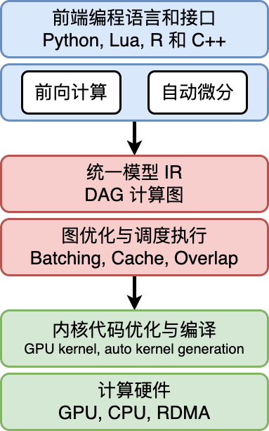

* 统一计算过程表达
* 自动化梯度计算
* 分析模型变量生命周期
* 优化程序的执行

## *计算图的组成*

计算图由基本数据结构 **张量 Tensor** 和基本运算单元 **算子 operator** 构成。计算图中通常使用节点来表示算子，节点间的有向边 directed edge 来表示张量状态，同时也描述了计算间的依赖关系。比如将下面的公式转换为对应的计算图
$$
\boldsymbol{Z}=ReLU(\boldsymbol{X}\times\boldsymbol{Y})
$$
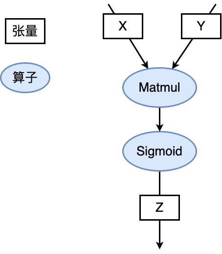

### 张量 & 算子

* 张量 Tensor 只是一个 ML/DL 的领域的 fancy 词汇，其实就是多维数组，使用秩来表示张量的轴数或维度

  * 张量自己还有属性，比如说

    * 形状 shape：存储张量的每个维度的长度，比如 `[3,3,3]`

    * 秩或维数 dim：表示张量的轴数或者维数，标量为0，向量为1

    * 数据类型 dtype：表示存储的数据类型，如bool、uint8、int16、float32、float64等

    * 存储位置 device：创建张量时可以指定存储的设备位置，如CPU、GPU等

    * 名字 name：张量的标识符

  * 实际 ML 场景中张量一般有下面几种形式

    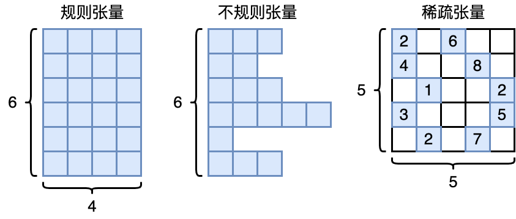

    * 正方形/矩形

    * 不规则张量：在某个轴上可能具有不同的元素个数，比如说 NLP 中的文本信息

    * 稀疏张量使用坐标表格式 Coordinate List, COO 来标识以节省空间。比如上图中的稀疏矩阵可以标识为

      ```
      行索引：[0, 0, 1, 1, 2, 2, 3, 3, 4, 4]
      列索引：[0, 2, 0, 3, 1, 4, 0, 4, 1, 3]
      元素值：[2, 6, 4, 8, 1, 2, 3, 5, 2, 7]
      ```

* 算子 Operator 就是对张量数据的某种操作，算子大致可以分为

  * 张量操作算子
    * 张量的结构操作：用于张量的形状、维度调整以及张量合并等
    * 数学运算：矩阵乘法、计算范数、行列式和特征值计算等
  * 神经网络算子：包括特征提取、激活函数、损失函数、优化算法等，是构建神经网络模型频繁使用的核心算子
  * 数据流算子：对原始数据进行处理后，转换为 ML 框架本身支持或需要的数据格式，并且按照迭代次数输入给网络进行训练或者推理，提升数据载入速度，减少内存占用空间，降低网络训练数据等待时间
    * 数据的预处理：针对图像数据和文本数据的裁剪填充、归一化、数据增强等操作
    * 数据载入：对数据集进行随机乱序 shuffle、分批次载入 batch 以及预取 prefetch 等操作
  * 控制流算子：可以控制计算图中的数据流向，同时也会影响反向梯度运算的数据流向。具体的算子有比如说条件运算符和循环运算符等。这部分下面会详细介绍
    * ML/DL 框架本身提供的控制流操作符（框架的原语）
    * 前端语言控制流操作符

算子是神经网络的最小调度单位，但遗憾的是，它并不是原子的：一个复杂的算子可以被更细粒度的算子所表示：比如 GEMM 可以用 Matmul + Bias 来表示

### 计算依赖

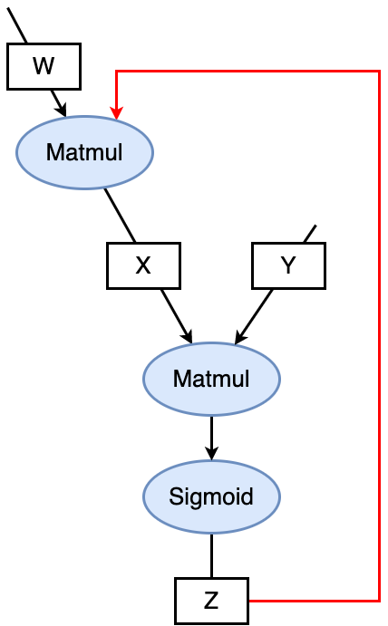

算子之间可能是会存在依赖性的，计算图这个 DAG 如果形成了环，即算子之间的循环依赖 circular dependency，会形成计算逻辑上的死循环，ML 模型无法完成训练。要么是 0 要么是无穷大

循环关系的循环展开 iteration unrolling 要给变量赋予不同的变量名，否则也会形成循环依赖

### 控制流

许多 ML/DL 模型依赖控制流进行训练和推理，基于递归神经网络和强化学习的模型就依赖于循环递归关系和依据输入数据状态条件执行计算。如上所述，目前的 ML/DL 有两套控制流

* 前端语言控制流：通过 Python 等前端语言控制流语句来进行计算图中的控制决策。使用前端语言控制流构建模型结构简便快捷，但是由于 ML/DL 框架的数据计算运行在后端硬件，造成控制流和数据流之间的分离，计算图不能完整运行在后端计算硬件上。因此这类实现方式也被称为图外方法 Out-of-Graph Approach
* ML/DL 框架控制原语：ML/DL 框架在内部设计了低级别细粒度的控制原语运算符。低级别控制原语运算符能够执行在计算硬件上，与模型结构结合使用可将整体计算图在后端运算，这种实现方式也被称为图内方法 In-Graph Approach

之所以有两套控制流的原因是因为后端的硬件可能不支持前端的（脚本）语言的运行环境

## *计算图的生成*

静态计算图意味着在执行任何实际计算之前，先完全定义好整个计算流程。图的结构被提前确定，并且一旦构建，就不能再改变。TensorFlow（1.x 版本）和 Theano 是使用静态图的知名框架

动态计算图也称为命令式或即时执行（Eager Execution）计算图，意味着图是在代码执行的同时动态创建的。PyTorch 和 TensorFlow（2.x 版本启用了 Eager Execution）都支持动态图

为了结合两者的优势，许多现代深度学习框架提供了将动态计算图转换为静态图的功能。例如，PyTorch 的 TorchScript 允许你将 PyTorch 模型转换为可以优化并在没有 Python 解释器的环境中运行的格式。TensorFlow 2.x 默认启用 Eager Execution，但同时提供了 `tf.function` 装饰器，可以将普通的 Python 函数转换为可优化的 TensorFlow 图

### 静态生成

静态生成可以根据前端语言描述的神经网络拓扑结构以及参数变量等信息构建一份固定的计算图。因此静态图在执行期间可以不依赖前端语言描述，常用于神经网络模型的部署，比如移动端人脸识别场景中的应用等

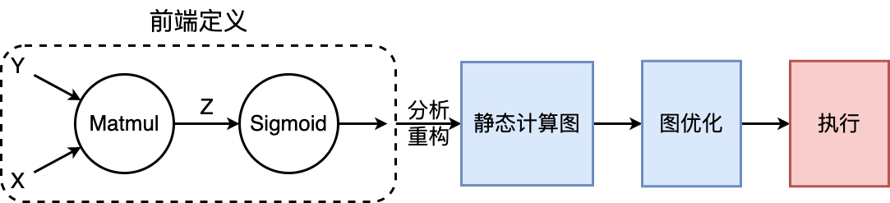

如果计算图的生成依赖于某些外部输入的控制项，在静态生成的时候无法确定，那么就需要一种叫做数据占位符 placeholder 的特殊张量来构建完整的计算图

* 静态计算图的优势

  * 计算性能

  * 可以被直接部署

* 劣势：但也正是因为上面所说的占位符的存在，静态计算图的代码要引入很多的控制流，相对动态图会比较麻烦

### 动态生成

动态图则需要在每一次执行神经网络模型依据前端语言描述动态生成一份临时的计算图，这意味着计算图的动态生成过程灵活可变，该特性有助于在神经网络结构调整阶段提高效率

## *动静态图之间的转换*

TensorFlow、MindSpore 都同时支持动态图和静态图两种模式，而 PyTorch 则需要过工具将构建的动态图神经网络模型转化为静态结构，以获得高效的计算执行效率

### 基于追踪转换

### 基于源码转换

## *计算图的调度*

在模型的训练过程中，需要优化迭代训练计算图过程中数据流载入和训练（推理）执行等多个任务之间的调度策略。微观上单次迭代需要考虑计算图内部的调度执行问题，根据计算图结构、计算依赖关系、计算控制分析算子的执行调度

优化计算图的调度和执行性能，目的是尽可能充分利用计算资源，提高计算效率，缩短模型训练和推理时间

### 算子调度执行

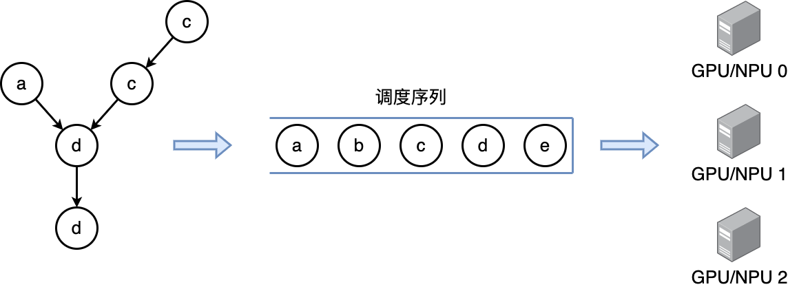

1. 根据拓扑排序算法，将计算图进行拓扑排序得到线性的算子调度序列
2. 将序列中的算子分配到指令流进行运算，尽可能将序列中的算子并行执行，提高计算资源的利用率

### 串行 & 并行

根据任务队列的执行顺序，我们可以将计算图的任务调度队列分为以下两种：

* **串行**：队列中的任务必须按照顺序进行调度执行直至队列结束
* **并行**：队列中的任务可以同时进行调度执行，加快执行效率

### 数据载入的同步 & 异步机制

一次完整计算图的训练执行过程包括了**数据载入、数据预处理、网络训练三个环节**。三个环节之间的任务调度是以串行方式进行，每一个环节都有赖于前一个环节的输出。但计算图的训练是多轮迭代的过程，多轮训练之间的三个环节可以用同步与异步两种机制来进行调度执行


* **同步**：顺序执行任务，当前任务执行完后会等待后续任务执行情况，任务之间需要等待、协调运行
* **异步**：当前任务完成后，不需要等待后续任务的执行情况，可继续执行当前任务下一轮迭代。并且可以进一步并行化

# IR For DNN

为了在不同的硬件上部署，我们要抹平 DNN 可能存在的差异性，将训练框架得到的模型进行统一表达

## *ONNX*

[Introduction to ONNX - ONNX 1.18.0 documentation](https://onnx.ai/onnx/intro/index.html)

ONNX, Open Neural Network Exchange 是一个开源的深度学习模型格式，旨在促进不同深度学习框架之间的互操作性。它由多家公司联合发起，包括微软和 Facebook，并得到了广泛的行业支持。ONNX 的主要目标是解决模型在不同框架和工具之间迁移的问题，使得模型的开发、训练和部署更加灵活和便利

ONNX 模型格式是基于 Protobuf 的

ONNX 模型是利用计算图来表示的

ONNX 标准化了一组常用的算子


DNN 可视化工具 Netron


ONNX 本身存在一些问题，所以软件厂商也很热衷于发明自己的标准 


## *模型转换*

### 基本介绍

### 架构与文件格式

### 自定义计算图IR

### 流程细节

# AI编译器前端

## *实现自动微分*

关于自动微分, i.e. 反向传播的内容可以看 *DeepLearning.md*

自动微分的实现方式大致可以分为

* 基本表达式法 Elemental Libraries
* 操作符重载法 Operator Overloading, OO 
* 代码变换法 Source Code Transformation, ST

### 基本表达式法

### 操作符重载法

### 代码变换法

## *IR*

## *类型系统 & 静态分析*

为了有效减少程序在运行时可能出现的错误，AI编译器前端引入了类型系统 Type System 和静态分析 Static Analysis 系统。类型系统可以防止程序在运行时发生类型错误，而静态分析能够为编译优化提供线索和信息，有效减少代码中存在的结构性错误、安全漏洞等问题

### 类型系统

程序设计语言中，类型是指数值、表达式、函数等属性内容。类型系统是指类型的集合以及使用类型来规定程序行为的规则。类型系统用于定义不同的类型，指定类型的操作和类型之间的相互作用，广泛应用于编译器、解释器和静态检查工具中

### 静态分析

## *前端优化*

### 无用与不可达代码消除

### 常量传播、常量折叠

# AI编译器后端


## *算子融合*

[【AI系统】算子融合 - ZOMI酱酱 - 博客园](https://www.cnblogs.com/ZOMI/articles/18558994)

### 试图解决的问题

算子融合 Operator Fusion/OpFusion 是 AI 编译优化中一个重要的技术。其主要目标是将多个计算操作（算子）合并成一个操作，以减少内存访问、提高数据局部性，从而提升执行效率

算子融合主要是为了减少模型训练过程中的读入数据量，同时 	减少中间结果的写回操作，降低访存操作。它主要想解决我们遇到的内存墙和并行强墙问题：

- **内存墙**：主要是访存瓶颈引起。算子融合主要通过对计算图上存在数据依赖的生产者 producer-消费者 consumer 算子进行融合，从而提升中间 Tensor 数据的访存局部性，以此来解决内存墙问题。这种融合技术也统称为 Buffer 融合。在很长一段时间，Buffer 融合一直是算子融合的主流技术。早期的 AI 框架，主要通过手工方式实现固定 Pattern 的 Buffer 融合
- **并行墙**：主要是由于芯片多核增加与单算子多核并行度不匹配引起。可以将计算图中的算子节点进行并行编排，从而提升整体计算并行度。特别是对于网络中存在可并行的分支节点，这种方式可以获得较好的并行加速效果

### 算子融合的形式

## *计算图优化*

计算图优化往往是后端的第一步，计算图优化是在不影响模型的数值特性的基础上，通过变换图IR以达到简化计算、减少资源开销、适配硬件的执行能力、提升执行性能的目的

* 访存密集型算子：Concat、Eltwise Add、ReLU、MaxPooling
* 计算密集型算子：Conv、DeConv、FC、MatMul、LSTM

### 通用硬件优化

通用硬件优化的核心是**子图的等价变换**：在计算图中尝试匹配特定的子图结构，找到目标子图结构后，通过等价替换方式，将其替换成对硬件更友好的子图结构。所谓对硬件更友好指的是更高的IO访存效率、计算效率更高等

### 特定硬件优化

优化是根据某些硬件的特殊性质做出的

* 硬件指令限制
* 数据排布格式的限制

## *算子选择*

算子选择是将IR图上的每个计算节点映射到设备上可执行算子的过程，因为**一个IR图上的计算节点往往可以对应多个设备上的算子**，这个过程中需要考虑算子的规格，算子的执行效率等问题，算子选择目标就是从中选择最优的一个算子

IR的信息称为算子信息，算子选择要参考这些信息

* 针对不同特点的计算平台和不同的算子，为了追求最好的性能，一般都需要选择不同的数据排布格式。ML系统常见的数据排布格式有NCHW和NHWC等
* 对于不同的硬件支持不同的计算精度，例如float32、float16和int32等。算子选择需要在所支持各种数据类型的算子中选择出用户所设定的数据类型最为相符的算子

### 数据排布格式

### 数据精度

### 算子选择的过程

## *内存分配*

内存分配模块主要负责给图中算子的输入、输出分配 device 内存。经过计算图优化和算子选择之后，我们可以得到 Graph IR 中每个算子的输入输出的形状 shape、数据类型、存储格式。根据这些信息，计算输入输出数据的大小，并为输入输出分配 device 上的内存，然后将算子加载到 device 上才能真正执行计算。此外，为了更充分地例用 device 内存资源，可以对内存进行复用，提高内存利用率

得到张量的尺寸大小后，往往还需要对内存大小进行对齐操作。内存通常以 4 字节、8 字节或 16 字节为一组进行访问，如果被搬运的内存大小不是这些值的倍数，内存后面会填充相应数量的空数据以使得内存长度达到这些值的倍数。因此访问非对齐的内存可能会更加耗时

### 内存复用问题抽象

内存复用是指分析张量的生命周期，将生命周期结束的张量的设备内存释放回内存池并用于后续张量的内存分配

### 

### 内存融合


### In-Place算子

在内存分配流程中，会为每个算子的输入和输出都分配不同的内存。然而对很多算子而言，为其分配不同的输入和输出地址，会浪费内存并且影响计算性能

例如优化器算子，其计算的目的就是更新神经网络的权重；例如Python语法中的 `+=` 和 `*=` 操作符，将计算结果更新到符号左边的变量中；例如 `a[0]=b` 语法，将 `a[0]` 的值更新为 b。**诸如此类计算有一个特点，都是为了更新输入的值**

下面以张量的 `a[0]=b` 操作为例介绍 In-Place 的优点。左边是非 In-Place 操作的实现，step1 将张量 a 拷贝到张量 a’，step2 将张量 b 赋值给张量 a’，step3 将张量 a’ 拷贝到张量 a。右边是算子 In-Place 操作的实现，仅用一个步骤将张量 b 拷贝到张量 a 对应的位置上。对比两种实现，可以发现 In-Place 操作节省了两次拷贝的耗时，并且省去了张量 a’ 内存的申请

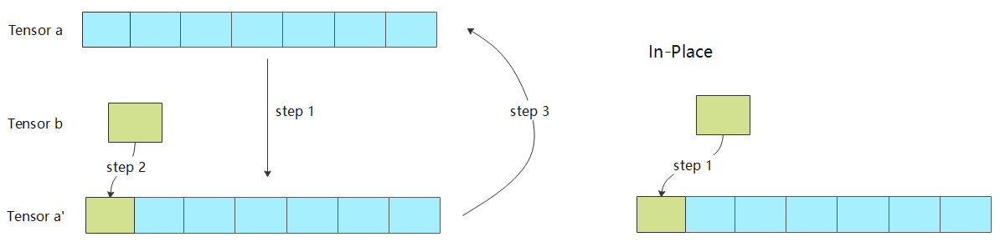

## *计算调度*

经过算子选择与内存分配之后，计算任务可以通过运行时完成计算的调度与在硬件上的执行

* 根据是否将算子编译为计算图，计算的调度可以分为单算子调度与计算图调度两种方式
* 根据硬件提供的能力差异，计算图的执行方式又可以分为逐算子下发执行的交互式执行以及将整个计算图或者部分子图一次性下发到硬件的下沉式执行两种模式

### 单算子调度

### 计算图调度

### 交互式执行

### 下沉式执行

## *算子编译器*

算子编译器是对算子进行编译优化的工具。作为AI编译器中一个重要组成部分，算子编译器把单个简单或复杂的算子经过表达和优化后编译为一个单独的可以在特定AI芯片上执行的可执行文件

# 推理系统

## *推理系统*

### 概念

* 训综 training：数据中心中更像是传统的批处理任务，需要执行数小时、数天才能完成，其一般配置较大的批尺寸追求较大的吞吐，将模型训练达到指定的准确度或错误率
* 推理 inference
   * 对于训练（Training）而言的推理，即模型前向计算，也就是对于给出的输入数据计算得到模型的输出结果；相对预测（Prediction）的推理，是统计学领域的范畴
   * 推理任务要执行7\*24的服务，其常常受到响应延迟的约束，配置的批尺寸更小，模型已经稳定一般不再被训练

* 部署 deployment：训练得到的模型主要目的还是为了更有效地解决实际中的问题，因此部署是一个非常重要的阶段。模型部署的课题也非常多，包括但不仅限于：移植、压缩、加速等
* 服务化 serving：模型的部署方式是多样的，封装成一个SDK，集成到APP或者服务中；封装成一个web服务，对外暴露接口（HTTP(s) / RPC）

### 部署时的新挑战

一个典型的DL推理应用的部署、落地过程中，推理系统需要考虑和提供以下的功能

* 提供可以被用户调用的接口
* 能够完成一定的数据处理将输入数据转为向量
* 能够在指定低延迟要求下返回用户响应
* 能够利用多样的加速器进行一定的加速
* 能够随着用户的增长保持高吞吐的服务响应和动态进行扩容
* 能够可靠的提供服务，应对软硬件的失效
* 能够支持算法工程师不断更新迭代模型，应对不断变化的新框架

### 推理系统


模型训练后会保存在文件系统中，随着训练的不断推进，模型效果不断提升，可能会产生新版本的模型，并存储在文件系统中并由一定的模型版本管理协议进行管理

之后模型会通过服务系统部署上线，推理系统首先会加载模型到内存，同时会对模型进行一定的版本管理，支持新版本上线和I版本回滚，对输入数据进行批尺寸（Batch Size ）动态优化，并提供服务接口（例如，HTTP，gRPC等），供客户端调用

用户不断向推理服务系统发起请求并接受响应。除了被用户直接访问，推理系统也可以作为一个微服务，被数据中心中其他微服务所调用，完成整个请求处理中一个环节的功能与职责

推理系统中，以数据中心（云端）的服务端推理系统为主，兼顾边缘侧移动端推理的场景，但是这些策略本身大部分是数据中心与边缘侧都适用

# 图优化

### 图转换优化

### 并发执行与内存分配

### 动态batch与bin Packing

### 常量折叠&冗余节点消除

### 算子融合/替换/前移

### 数据布局转换&内存优化

## *Kernel优化*

### Kernel优化架构

### Im2Col算法

### Winograd算法

### QNNPack算法

### 推理内存布局
