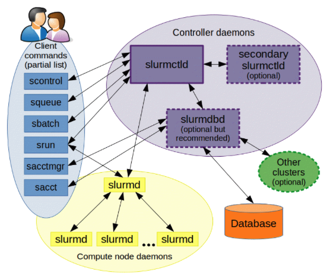

# Intro to BEAST Lab

## *BEAST*

https://www.lrz.de/presse/ereignisse/2020-11-06_BEAST/

> *Meet the BEAST at LRZ*
>
> *Researchers at LRZ are building the Bavarian Energy, Architecture, and Software Testbed in order to help proactively use and shape emerging technologies.*
>
> The Leibniz Supercomputing Centre (LRZ) is implementing the “Hightech Agenda” of the Bavarian State Government in its field of expertise and is launching the ambitious "Future Computing" program. Firstly, it is setting up a test environment with the latest computer technologies available on the market. Secondly, it is developing offers to train both staff members as well as the next generation of HPC scientists to exploit and explore new computer technologies and  high-performance computing (HPC) systems in collaboration with selected key scientific partners.
>
> "We want to intensively research the latest computer systems and architectures, their energy requirements, and mode of operation, without disturbing the services for our users at the production systems at LRZ," explains the  computer scientist Josef Weidendorfer, who heads the Future Computing group g at the LRZ. To his end, login and storage servers are already available in Garching, as well as two AMD Rome systems and two servers with Marvell ThunderX2 processors, each with graphics cards as accelerators. The centre will install a Cray CS500 system by mid-October, which uses the same Fujitsu A64FX processors as Fugaku, a Japanese system that is currently the world’s fastest supercomputer. Over the next few years, the test environment will be steadily expanded to include more systems and components. LRZ leadreship envisions this test environment as becoming a permanent fixture of the research work at the centre and it will also serve to evaluate new computer architectures for Bavaria's largest scientific computing center.
>
> ## Super-Tech at LRZ: Preparing for the next generation of high-performance computers
>
> "Bavarian Energy, Architecture, and Software Testbed" or  BEAST, is the name the LRZ has chosen for this innovative collection of computer and storage technologies that LRZ’s specialists are now putting through their paces.
>
> "BEAST serves as a rich environment to prepare for the next generation of supercomputers,” says Prof. Dr. Dieter Kranzlmüller, Director of LRZ. "We use it to investigate which computer architectures are suitable for larger systems and for parallelization. With the experience we gain through BEAST, we will be able to plan the successor to SuperMUC-NG and future services even better and more soundly."  In research, the amount of data that supercomputers have to handle  is currently growing. Applications such as machine learning and artificial intelligence also require new chip design, or even totally different  computer architectures.
>
> The needs posed by these emerging technologies have already begun influencing HPC systems, and in the near future, the need to help organize work or memory performance more efficiently will only grow. As a result, new ideas for computers are  needed, and HPC centres need to play an active role in research into the benefits of new technologies and architectures. In the long run, BEAST will therefore contain prototypes and the latest systems, which LRZ wants to further develop and build together with manufacturers and with key research partners. "BEAST is not a conventional LRZ service," Kranzlmüller continues. "However, joint development and co-design of new technology is pushing supercomputing and will ultimately pay off for science and society.
>
> ## Open for questions from researchers and students
>
> Although BEAST is not a service of  LRZ in the traditional sense, selected user groups will be given access to the systems. LRZ specialists will be the first users of these novel systems in order  to familiarize themselves with new computer systems and processors. Further, HPC software, such as the monitoring tool DCDB or the smart control system Wintermute, need to be adapted for  future systems. "With BEAST, we can prepare ourselves to offer modern, complex architectures and necessary software environments at service quality," says Weidendorfer. "The test environment also enables less goal-oriented and significantly more experimental research projects. We are therefore opening the test environment to selected researchers who are working on next-generation hardware". These researchers will be able to configure operating systems and hardware according to individual needs and modify them for their own applications. The LRZ will actively accompany and support this work and observe how hardware can be built and used more efficiently.
>
> ## Gather contacts and get to know innovative technology
>
> BEAST is interesting for young scientists and junior technical staff: LRZ, in collaboration with the two Munich universities, now offers an internship for computer science students interested in modern computer architectures and their energy-efficient use, allowing the next generation of HPC experts early exposure to emerging technologies that will likely play major roles in their professional careers. These internship opportunities aim to motivate students to make use of the latest computer technologies for bachelor or master theses.
>
> Participants will use BEAST to familiarize themselves with the technologies of the future and also make valuable contacts. They will regularly solve research questions and practical tasks on and with the new systems. In addition, technology companies will describe and contextualize new system designs and discuss them with young scientists. The BEAST internship will be coordinated by Dr. Karl Fürlinger (Ludwigs-Maximilians University Munich ), Dr. Weidendorfer, and the computer scientist Bengisu Elis (Technical Uuniversity of Munich).
>
> "I'm researching how to optimize communication in Graphic Processing Units (GPU),” Elis says. "With BEAST, I can compare combinations of GPU and CPU architectures from different vendors, and I can also test and improve the performance and portability of my code on different systems, BEAST offers valuable resources to increase the quality of my work, the idea that these can also contribute to improve the future systems of the LRZ is an additional incentive".

### 翻译

LRZ的研究人员正在建立Bavarian Energy, Architecture, and Software Testbed 测试平台，以积极地使用和塑造新兴技术。

LRZ正在在巴伐利亚州政府的 Hightech Agenda 下实施其专业领域的计划，并启动了雄心勃勃的 Future Computing 计划。首先，LRZ正在建立一个测试环境，其中包括市场上最新的计算机技术。其次，LRZ正在与选定的重要科学合作伙伴合作，开发培训方案，旨在培养员工和下一代HPC科学家，以开发和探索新的计算机技术和高性能计算（HPC）系统。

“我们希望深入研究最新的计算机系统和架构、它们的能源需求和运行模式，同时不干扰LRZ生产系统的用户服务。”，负责LRZ未来计算小组的计算机科学家Josef Weidendorfer解释道。为此，Garching已经提供了登录和存储服务器，以及两个AMD Rome系统和两个Marvell ThunderX2处理器的服务器，每个服务器都配备了图形卡作为加速器。该中心将于十月中旬安装一台Cray CS500系统，该系统使用与Fugaku 富岳相同的Fujitsu A64FX处理器，后者是目前全球最快的超级计算机。在未来几年内，测试环境将不断扩展，包括更多的系统和组件。LRZ的领导层将此测试环境视为中心研究工作的永久设施，并将用于评估巴伐利亚最大的科学计算中心的新计算机架构。 

**LRZ的超级技术：为下一代高性能计算做准备**

Bavarian Energy, Architecture, and Software Testbed 或 BEAST，这是LRZ为其专家们现在正在努力测试的计算机和存储技术集合选择的名字。

"BEAST是一个丰富的环境，用于为下一代超级计算机做准备，” LRZ主任Dieter Kranzlmüller教授说。 "我们用它来研究哪种计算机架构适合更大的系统和并行化。通过BEAST获得的经验，将使我们能够更好地更有力地规划SuperMUC-NG的继任者和未来的服务。" 在研究中，超级计算机必须处理的数据量目前正在增长。应用程序，如机器学习和人工智能，还需要新的芯片设计，甚至完全不同的计算机架构。

这些新兴技术提出的需求已经开始影响HPC系统，不久的将来，需要更有效地帮助组织工作或内存性能。因此，需要新的计算机构想法，而HPC中心需要在研究新技术和架构的好处方面发挥积极作用。从长远来看，BEAST将包含原型和最新的系统，LRZ希望能够进一步开发和与制造商以及重要的研究合作伙伴一起建设。 "BEAST不是LRZ的传统服务，"Kranzlmüller继续说道。 "然而，新技术的联合开发和共同设计推动了超级计算，并最终将为科学和社会付出回报。

**为研究人员和学生提供问题咨询**

尽管BEAST不是LRZ传统意义上的服务，但已经选择了一些用户组来访问这些系统。LRZ的专家将是这些新颖系统的第一批用户，以熟悉新的计算机系统和处理器。此外，HPC软件，如监控工具DCDB或智能控制系统Wintermute，需要为未来系统进行适应。"Weidendorfer表示，"借助BEAST，我们可以为自己提供现代、复杂的架构和必要的软件环境，以达到服务质量，"。"测试环境还能够进行不那么具体目标的、更为实验性的研究项目。因此，我们将测试环境开放给一些研究人员，他们正在研究下一代硬件。"这些研究人员将能够根据个人需求配置操作系统和硬件，并对其进行修改，以适应自己的应用程序。LRZ将积极陪同和支持这项工作，观察如何能更有效地构建和使用硬件。 

**建立联系和了解创新技术**

BEAST对年轻科学家和初级技术人员很有吸引力：LRZ现在与两所慕尼黑大学合作，为对现代计算机架构及其节能使用感兴趣的计算机科学学生提供实习机会，使下一代HPC专家早日接触新兴技术，这些技术可能在他们的职业生涯中扮演重要角色。这些实习机会旨在激励学生利用最新的计算机技术来撰写学士或硕士论文。 

参与者将利用BEAST熟悉未来技术，并建立宝贵的联系。他们将定期解决有关新系统的研究问题和实际任务。此外，技术公司将描述和背景化新的系统设计，并与年轻科学家讨论它们。BEAST实习将由Karl Fürlinger博士（LMU）、Weidendorfer博士以及计算机科学家Bengisu Elis（TUM）协调。 

"我正在研究如何优化图形处理单元（GPU）中的通信，"Elis说。"有了BEAST，我可以比较来自不同供应商的GPU和CPU架构的组合，还可以在不同系统上测试和改进我的代码的性能和可移植性，BEAST为提高我的工作质量提供了宝贵的资源，这些资源也可以有助于改进LRZ未来的系统，这是一个额外的激励。"

### Testbed

Testbed 测试床 指的是一个用于测试、评估和开发新硬件、软件、算法或应用程序的环境。HPC测试床通常用于以下目的：

1. **性能评估**：测试床用于评估HPC系统的性能，包括处理器、内存、存储、网络等组件的性能。这有助于研究人员和工程师了解系统的极限，并为优化工作负载做准备。
2. **新硬件和软件测试**：在HPC中，新的硬件、操作系统、编程工具或库经常被引入。测试床允许研究人员测试新技术，评估其性能，验证其可行性，并发现可能存在的问题。
3. **算法开发和测试**：研究人员和工程师使用HPC测试床来开发、优化和测试高性能算法。这包括并行计算、大规模数据处理、机器学习、数值模拟等方面的算法。
4. **应用程序开发**：在HPC环境中，应用程序的性能非常重要。测试床用于开发和测试HPC应用程序，以确保它们能够有效地利用HPC系统的硬件资源。
5. **安全性和可靠性测试**：测试床还可以用于评估HPC系统的安全性和可靠性，包括对潜在威胁的测试和系统的容错性。

HPC测试床通常由一组HPC集群、服务器、网络设备和专门的性能监测工具组成。这些测试床可能模拟大规模HPC系统的特性，允许研究人员进行实际测试和评估，而不必在生产环境中引入风险。

### Brief intro of SuperMUC-NG

## *Hardware of BEAST*

### Intel Icelake

Xeon系列的微架构演进依次为：Nehalem 2008 `->` Sandy Bridge 2011 `->` Ivy Bridge 2012 `->` Haswell 2013 `->` Broadwell 2014 `->` Skylake 2015 `->` Cascade Lake 2019 `->` Ice Lake 2019 `->` Sapphire Rapids 2023

Intel Xeon (Icelake) Platinum 8360Y: https://www.intel.cn/content/www/cn/zh/products/sku/212459/intel-xeon-platinum-8360y-processor-54m-cache-2-40-ghz/specifications.html

通过 `lscpu` 来查询一下cpu信息

```
Architecture:                    x86_64
CPU op-mode(s):                  32-bit, 64-bit
Byte Order:                      Little Endian
Address sizes:                   52 bits physical, 57 bits virtual
CPU(s):                          144
On-line CPU(s) list:             0-143
Thread(s) per core:              2
Core(s) per socket:              36
Socket(s):                       2
NUMA node(s):                    2
Vendor ID:                       GenuineIntel
CPU family:                      6
Model:                           106
Model name:                      Intel(R) Xeon(R) Platinum 8360Y CPU @ 2.40GHz
Stepping:                        6
Frequency boost:                 enabled
CPU MHz:                         1847.196
CPU max MHz:                     2401.0000
CPU min MHz:                     800.0000
BogoMIPS:                        4800.00
Virtualization:                  VT-x
L1d cache:                       3.4 MiB
L1i cache:                       2.3 MiB
L2 cache:                        90 MiB
L3 cache:                        108 MiB
NUMA node0 CPU(s):               0-35,72-107
NUMA node1 CPU(s):               36-71,108-143
Vulnerability Itlb multihit:     Not affected
Vulnerability L1tf:              Not affected
Vulnerability Mds:               Not affected
Vulnerability Meltdown:          Not affected
Vulnerability Mmio stale data:   Mitigation; Clear CPU buffers; SMT vulnerable
Vulnerability Retbleed:          Not affected
Vulnerability Spec store bypass: Mitigation; Speculative Store Bypass disabled via prctl and seccomp
Vulnerability Spectre v1:        Mitigation; usercopy/swapgs barriers and __user pointer sanitization
Vulnerability Spectre v2:        Mitigation; Enhanced IBRS, IBPB conditional, RSB filling, PBRSB-eIBRS SW sequence
Vulnerability Srbds:             Not affected
Vulnerability Tsx async abort:   Not affected
Flags:                           fpu vme de pse tsc msr pae mce cx8 apic sep mtrr pge mca cmov pat pse36 clflush dts acpi mmx fxsr sse sse2 ss ht tm pbe syscall nx pdpe1gb rdtscp lm constant_tsc art arch_perfmon pebs bts rep_good nopl xtopology nonstop_ts
                                 c cpuid aperfmperf pni pclmulqdq dtes64 monitor ds_cpl vmx smx est tm2 ssse3 sdbg fma cx16 xtpr pdcm pcid dca sse4_1 sse4_2 x2apic movbe popcnt tsc_deadline_timer aes xsave avx f16c rdrand lahf_lm abm 3dnowprefetch cpuid_f
                                 ault epb cat_l3 invpcid_single ssbd mba ibrs ibpb stibp ibrs_enhanced tpr_shadow vnmi flexpriority ept vpid ept_ad fsgsbase tsc_adjust bmi1 hle avx2 smep bmi2 erms invpcid rtm cqm rdt_a avx512f avx512dq rdseed adx smap avx
                                 512ifma clflushopt clwb intel_pt avx512cd sha_ni avx512bw avx512vl xsaveopt xsavec xgetbv1 xsaves cqm_llc cqm_occup_llc cqm_mbm_total cqm_mbm_local split_lock_detect wbnoinvd dtherm ida arat pln pts hwp hwp_act_window hwp_
                                 epp hwp_pkg_req avx512vbmi umip pku ospke avx512_vbmi2 gfni vaes vpclmulqdq avx512_vnni avx512_bitalg tme avx512_vpopcntdq la57 rdpid fsrm md_clear pconfig flush_l1d arch_capabilities
```

### AMD Milan-X

Zen架构代表了AMD Ryzen 霄龙系列处理器的微架构：AMD Epyc是AMD推出的x86架构服务器微处理器产品线，采用Zen微架构。于2017年6月发表并开始供货，取代推出已有14年历史的Opteron系列。

第一代霄龙处理器 Naples 基于Zen微架构 `->` 第二代霄龙处理器 Rome 基于Zen2微架构 `->` 第三代霄龙处理器 Milan 基于Zen3微架构 `->` 第四代霄龙处理器 Genoa, Bergamo and Siena 基于Zen4微架构

EPYC 7773X: https://www.amd.com/zh-hans/products/cpu/amd-epyc-7773x

### Marvell ThunderX2

Marvell Technology Group 是一家总部位于美国加利福尼亚州圣克拉拉的半导体公司。Marvell成立于1995年，是一家全球领先的半导体解决方案提供商，专注于开发和制造高性能处理器、控制器、存储解决方案、网络连接性产品和其他半导体设备。

Marvell ThunderX 是Marvell公司的一个服务器处理器系列，专为数据中心和云计算市场设计。ThunderX系列处理器采用ARM架构，以提供高性能、能效和多核处理能力，以满足大规模服务器和高性能计算需求。

ThunderX2 CN9980采用AArch64 ISA和Vulcan 微架构。

### Fujitsu A64FX

Fujitsu A64FX是一款高性能、面向科学计算和高性能计算的ARM架构处理器

### Nvidia V100

### AMD MI-100

## *软件*

### 编译器

GCC在每一种CPU系统上都有

介绍一下其他的编译器

* Intel oneAPI C/C++ Compiler (only on ice and milan)

  命令为 `icx/icpx`，可以使用 `man icc` 来查询手册

  Icx是由Intel开发的C++编译器。它是Intel工具套件中的一部分，通常与Intel的开发工具和库一起使用，用于编译和优化C++代码

* Cray C/C++ Compiler

  命令为 `cc/CC`，可以使用 `man craycc/man crayCC` 来查询手册

### gcc 优化等级


1. **-O0**：没有优化。此等级生成最简单、最容易调试的代码，但性能通常较低。
2. **-O1**：启用基本的优化。这一级别启用一些简单的优化，如函数内联和一些代码移动。它可以提高性能，同时保留了较好的调试能力。
3. **-O2**：启用更多的优化。此等级会应用更多的代码转换，包括循环展开和更强大的优化。这通常会提高代码的性能，但会增加编译时间。
4. **-O3**：启用高级优化。它启用了大多数常用的优化，包括函数内联、循环展开、自动矢量化等。这可以显著提高生成的代码的性能，但仍然保留了对浮点精度和符号运算的一定程度的保守性。因此，它适用于大多数情况下，可以在不牺牲太多数值精度的情况下提高性能。
5. **-Ofast**：极高级别的优化。此等级启用了所有常见的优化，同时允许牺牲一些数值精度以提高性能。它适用于那些对数值精度要求不高的高性能应用。
6. **-Os**：优化代码大小。这一级别旨在减小生成的可执行文件的大小，而不是提高性能。它会删除一些不必要的代码和数据，适合于资源有限的环境。
7. **-Og**：适用于调试的优化。这一级别会进行一些优化，同时保留了较好的调试能力。它是为了在调试期间获得较好的性能和调试能力的平衡。
8. **-O**：默认优化等级。这一级别通常等同于 `-O1` 或 `-O2`，具体取决于编译器版本和配置。

一些参数的意义如下

* `-flto`

  在GCC编译器中，选项 `-flto` 表示 "Link Time Optimization"，即链接时优化。它是一种编译器优化技术，它将编译阶段的优化延伸到链接阶段，以进一步提高生成的可执行文件的性能。

  使用 `-flto` 选项，编译器将在编译时生成中间表示（IR），然后将这些中间表示保存在目标文件中。在链接时，编译器会再次优化这些中间表示，并生成最终的可执行文件。这使得编译器能够进行全局的优化，跨足够多的源文件，从而产生更高效的代码。

* `march=native`

  `march=native` 是GCC编译器的一个选项，用于优化生成的机器代码以最大限度地利用当前主机的CPU架构。这个选项告诉编译器使用当前主机的本机（native）CPU架构，以便生成特定于该CPU的指令集的代码。

  使用 `-march=native` 时，GCC会检测当前主机的CPU架构，并根据检测结果生成与该架构最兼容的机器代码。这可以提高程序的性能，因为生成的代码会更好地利用当前CPU的特性和指令集扩展。

  注意：使用 `-march=native` 选项可能会导致生成的代码在其他CPU架构上不兼容，因为它会针对当前主机的CPU进行优化。因此如果计划在多个不同CPU架构的计算机上运行相同的二进制程序，应谨慎使用这个选项。

  这个选项通常用于在特定主机上编译和运行程序，以获得最佳性能。**如果要生成可移植的代码，不建议使用 `-march=native`**，而应选择适当的目标架构标志，例如 **`-march=core2`**、**`-march=corei7`** 等。这将生成适用于特定CPU架构的代码，而不仅仅是当前主机的本机架构。

### Modules Environment

Module environment 是一个专门管理环境变量的工具，一般应用于软件或运行库等设备有多个版本，且需要分别配置这些环境变量

```shell
$ module list                  # list loaded modules
$ module avail                 # list all compilers / packages available
$ module load <package-name>   # load a module
$ module unload <package-name> # unload a module
$ module switch <package-name> # switch module ( unload and load )
```

# SLURM

## *任务调度工具*

### 什么是任务调度工具

任务调度工具 Job Scheduling Tool 是用于在HPC集群或分布式计算环境中管理和调度作业的软件工具。它们用于有效地分配计算资源，如处理器、内存和存储，以满足不同用户或应用程序的需求。任务调度工具的主要目标是提高计算资源的利用率，减少等待时间，确保公平的资源分配，以及简化管理和监控任务的执行。

以下是一些常见的HPC任务调度工具：

* Simple Linux Utility for Resource Management, SLURM 极简Linux资源管理工具：SLURM是一种广泛使用的任务调度工具，特别用于Linux环境。它支持作业管理、资源分配、节点管理、负载平衡等功能，并被许多HPC集群采用
* Torque/Maui：Torque是一个开源的批处理系统，与Maui调度器一起使用。它提供了作业管理和节点管理功能，而Maui负责资源分配和作业调度
* Grid Engine：Grid Engine是一种用于管理和调度计算任务的开源工具。它支持作业队列管理、资源分配、负载平衡和可视化监控
* PBS, Portable Batch System：PBS是一种任务调度工具的通用标准，有多个实现，包括OpenPBS、PBS Professional等。它支持各种资源管理和作业调度功能
* LSF, Load Sharing Facility：LSF是IBM开发的任务调度工具，用于大型HPC集群和超算。它支持复杂的作业调度和资源管理需求
* Moab：Moab是Maui调度器的商业版本，提供高级的资源管理和调度功能，特别适用于大规模HPC环境
* Slurm-Workload Manager：Slurm是一个开源的HPC任务调度工具，与SLURM配套使用。它提供了资源管理、作业调度和监控功能

### SLURM简介

https://slurm.schedmd.com/overview.html

BEAST中使用的是SLURM

> **slurm 任务调度工具**（前身为**极简Linux资源管理工具**，英文：**Simple Linux Utility for Resource Management**，取首字母，简写为**SLURM**），或 **Slurm**，是一个用于 Linux 和 Unix 内核系统的[自由开源](https://zh.wikipedia.org/wiki/自由开源)的任务调度工具，被世界范围内的[超级计算机](https://zh.wikipedia.org/wiki/超级计算机)和[计算机群](https://zh.wikipedia.org/wiki/计算机集群)广泛采用。它提供了三个关键功能。第一，为用户分配一定时间的专享或非专享的资源(计算机节点)，以供用户执行工作。第二，它提供了一个框架，用于启动、执行、监测在节点上运行着的任务(通常是并行的任务，例如 [MPI](https://zh.wikipedia.org/wiki/訊息傳遞介面))，第三，为任务队列合理地分配资源。
>
> 大约60％的[500强](https://zh.wikipedia.org/wiki/TOP500)超级计算机上都运行着Slurm，包括2016年前世界上最快的计算机[天河-2](https://zh.wikipedia.org/wiki/天河二号)。
>
> Slurm使用基于Hilbert曲线调度或肥胖 网络拓扑结构的[最适算法](https://zh.wikipedia.org/wiki/曲線擬合)，以便优化并行计算机中的任务分配。-- wikipedia

Slurm 是一个开源、容错性强、高度可扩展的集群管理和作业调度系统，适用于大型和小型 Linux 集群。Slurm 在运行时不需要对内核进行修改，而且相对自包含。作为一个集群工作负载管理器，Slurm 具有三个关键功能

* 它为用户分配对资源（计算节点）的独占和/或非独占访问权限，以供一段时间内执行工作
* 它提供了一个启动、执行和监控工作（通常是并行作业）的框架，这些工作在分配的节点集上执行
* 它通过管理待处理工作队列来仲裁资源的争用。可以使用可选插件进行会计、高级预约、团体调度（并行作业的时间共享）、后台调度、拓扑优化的资源选择、按用户或银行账户的资源限制以及复杂的多因素作业优先级算法

## *SLURM的结构*

### SLURM架构

https://blog.csdn.net/qq_31910613/article/details/102916309



* 控制器守护进程 controller daemons
  * 集中式管理器 slurmctld是SLURM资源管理系统的中枢服务，它用于监视资源和工作
    * 在发生故障的情况下，可能还有一个可选的备份管理器 secondary slurmctld 来承担这些职责
    * 每个计算服务器（节点）都有一个 slurmd 守护进程，可以类比为远程 shell：它等待工作、执行工作、返回状态，然后等待更多工作
    * slurmd 守护进程提供了容错性强的分层通信
  * 可选的但是推荐运行的 slurmdbd（Slurm 数据库守护进程）：可用于记录单个数据库中管理的多个 Slurm 集群的记账信息
  * 可选的 slurmrestd（Slurm REST API 守护进程），可用于通过其 REST API 与 Slurm 进行交互。
* 用户命令：下面会具体介绍命令
* 节点监控进程 slurmd
  * slurmd 运行在每个计算节点上，负责收集节点上的资源状态并向控制进程报告。slurmd 接收来自控制进程与用户命令的请求，进行作业步任务加载、作业取消等操作
  * slurmstepd 作业管理进程是由slurmd在加载作业步任务或批处理作业时派生出来的。slurmstepd进程管理本节点上一个作业步的所有任务，负责计算任务启动、标准IO转发、信号传递、记账信息收集以及并行环境初始化等功能

### SLURM对Job的划分


上图是由 Slurm 守护程序管理的实体以及对它们的划分

* 节点 nodes：Slurm 中的计算资源，就是整个上图
* 分区 partitions：用于将节点分组成逻辑集合。可以将分区视为作业队列，每个队列具有各种约束条件，如作业大小限制、作业时间限制、允许使用的用户等
* 作业 jobs：分配给用户的资源，以供在指定时间内使用。作业按优先级顺序分配节点，直到该分区内的资源（节点、处理器、内存等）耗尽。一旦作业分配了一组节点，用户就能够以分配内的任何配置形式启动并行工作
* 作业步 job steps：它们是作业内的一组（可能是并行的）任务

可以启动一个单一作业步骤，利用分配给作业的所有节点，或者可以独立使用分配的一部分资源启动多个作业步骤。Slurm 提供了对分配给作业的处理器资源的资源管理，以便可以同时提交多个作业步骤并排队，直到作业的分配内有可用资源为止

## *SLURM的使用*

### 三种提交模式

https://www.bkunyun.com/help/docs/cloudE18

* `srun`

  ```shell
  srun [OPTIONS...] executable [args...]
  srun -p gpu -w g[1100-1101] -N 2 -n 80 -t 20 A.exe # 示例
  ```

  srun 属于交互式提交作业，有屏幕输出，但容易收到网络波动影响，断网或关闭窗口会导致作业中断。一般仅在调试程序时使用此方式提交作业。下面是一些参数的意义

  * -N 3：指定节点数为3
  * -n 12：指定进程数为12
  * -c 12：指定每个进程（任务）使用的CPU核 为12，一般运行OpenMP等多线程程序时需，普通MPI程序不需要指定
  * --gres=gpu:4：指定每台机器使用4张GPU卡
  * -p gpu：指定提交作业到GPU队列
  * -w g[100-101]：指定提交作业到 g100、g101 节点
  * -x g[100, 106]：排除 g100、g106 节点
  * --o out.log：指定标准输出到 out.log 文件
  * -e err.log：指定重定向错误输出到 err.log 文件
  * -J JOBNAME：指定作业名为 JOBNAME
  * -t 20：限制运行 20 分钟

* `sbatch`

  Slurm 支持利用 sbatch 命令采用批处理方式运行作业，sbatch 命令在脚本正确传递给作业调度系统后立即退出，同时获取到一个作业号。作业等所需资源满足后开始运行

* `salloc`

  salloc 命令用于申请节点资源

### 其他命令

* 查看状态
  * sinfo 用于报告系统状态
  * sacct 用于获取有关正在运行或已完成的作业和作业步骤的信息
  * sview 命令以图形方式报告系统和作业状态，包括网络拓扑
  * squeue 用于报告作业状态
* 作业控制
  * srun、salloc、sbatch
  * scancel 用于终止排队或运行中的作业
* scontrol 管理工具，可用于监视和/或修改集群的配置和状态信息
* sacctmgr 管理数据库的管理工具。它可用于识别集群、有效用户、有效银行账户等。对于所有功能都提供了 API

## *LRZ集群的SLURM节点*

### 节点分类

### 在集群上运行并行程序

# Assignment 1

## *Vector Triad Microbenchmark*

```c++
for (i=0; i<N; i ++) {
	A[i] = B[i] + C[i] * D[i];
}
```


## *Experiments and Measurements*

### Sequential Performance

### Parallel Performance


Cycling time：什么时候可以进行下一次的寻址


Read的延迟很大、电荷会泄漏，需要不断刷新


50% miss rate -> filter


L1和L2的管理算法是不同的


可以只利用time locality或只利用spatial locality，或者两者都利用


Tag 是一种Metadata

是并行还是顺序的获取Tag和Data


