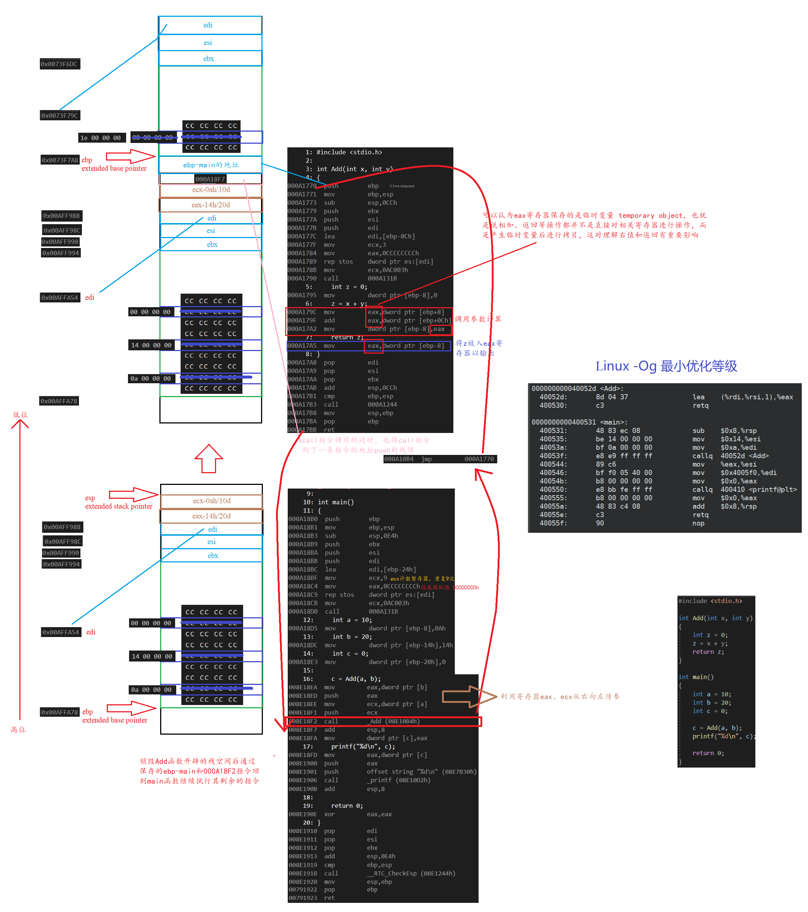
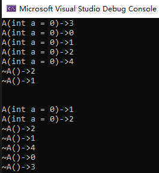
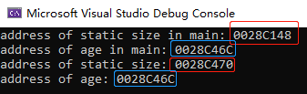

# *程序概览和基本语法概念*

## *C语言标准：ANSI C -> C99 -> C11*

## *基本概念*

```c
#include <stdio.h>
int main()
{
    int num;
    num = 6;
    printf("HelloWorld!\n");
    printf("My faveourite number is %d", num);
    return 0;
}
```

* `#include <stdio.h>`：#include 称为C预处理器指令，导入头文件<stdio.h>
* `int main()`：main函数是一个程序的入口，必须要有，但实际上在调用main函数还有系统底层的函数
* `// /* */`：单行注释和跨行注释
* `int num` `num = 6;`
  * 变量/标识符（Variable/Identifier）的声明和初始化，标识符在使用之前必须要进行声明和初始化，C99之前变量的声明一定要放在块顶部，C99标准允许其放在任意位置
  * 命名变量时必须要用字母或下划线开始，不能用数字和其他字符，通常_或__开头的变量是留给操作系统和C库函数的
  * int是一个数据类型，是一个关键词（keyword），不能被用作变量名
* `\n`为转义序列 excape sequence
* `%d`为占位符
* `return 0;`返回值，函数需要一个返回值，即使不写这条语句函数也会默认返回0，但写这条语句可以养成一种统一的代码风格

## *C语言数据类型及其在内存中的存储*

### C语言数据类型

* 基本内置类型 Bulit-in type
* int类型
* 其他整数类型 short, long
* 使用字符：char类型
  * char类型用于存储字符，但由于在计算机中使用ASCII码来存储字符，因此char实际上是整型。每个char占用一个bit位
  * 用单引号括起来的单个字符被称为字符常量 character constant `char grade ='A'`
  * C语言语法中没有规定char是有符号还是无符号，但为了保持统一，大部分编译器（包括vscode）中char都是**有符号**的
  * char是signed char还是unsigned char是取决于编译器的，C标准中没有规定，但大部分编译器中都是signed char
  * 编码规则（详见收藏的博客）
    * ASCII码
      * 65D-90D 大写字母；97D-122D 小写字母
      * 0D NULL；32D 空格；48D-57D 1-9
    * GBK码 汉字内码扩展规范：一个汉字占用两个字节
    * UTF-8：Unicode的一种规范，一个汉字占用三个字节
    * Windows中自适应的ANSI编码系统
  * 转义序列 escape sequence

    转义序列|含义
    :-|:-
    \a|警报(ANSIC)
    \b|退格
    \f|换页
    \n|换行
    \r|回车
    \t|水平制表符
    \v|垂直制表符
    \\\ |反斜杠
    \\'|单引号
    \\"|单引号
    \?|问号
    \0oo|八进制
    \xhh|十六进制

* _Bool类型
* 可移植类型：stdint.h和inttypes.h
* float、double和long double
* 负数和虚数类型
* 其他类型
* 类型大小：`sizeof` 是C语言的内置运算符，以字节位单位给出指定类型的大小，C99和C11提供%zd转换说明匹配sizeof的返回类型。注意，sizeof返回的是 `size_t` 无符号整型：为什么要使用 `size_t`？<https://jeremybai.github.io/blog/2014/09/10/size-t>，主要是考虑到可移植性和效率问题（C Primer Plus P84）

### 整形在内存中的存储采用补码

* 整形表示方式
  * 原码
  
  * 反码
  
  * 补码
  
  * 转换关系
  
    
  
* 进制转换

  

* 大小端介绍
  
  
  
  * 什么是大端和小端
    * 大端 Big endian：低地址高字节，即**数据的高字节保存在内存的低地址中，而数据的低字节保存在内存的高地址中**，比较符合阅读习惯
    * 小端 Liitle endian：低地址低字节
  * 为什么会有大端和小端
  * 判断内存是以大端存储还是小端存储
    * 利用指针
  
        ```c
        int i = 1; // 01 00 00 00
        if (1 == *(char*)&i) // 将int*强制转换成char*后对该指针解引用，char*只能得到1字节的内存
            printf("Little endian\n");
        else
            printf("Big endian\n");
        ```
  
    * 利用联合体
  
        ```c
        int CheckSys()
        {
            union Un
            {
                char c;
                int i;
            }u;
        
            u.i = 1;
            return u.c; // 两者共用地址，若是小端则返回1，否则返回0
        }
        ```

### 浮点型在内存中的存储

## *字符串和格式化输入/输出 (C Primer Plus 第4章)*

### 字符串 Character string 简介

* char类型数组和null字符 `\0`
  * 字符串 string 和字符 char ：字符用 `''` 框起来，是C语言的一种基本类型，属于整形。 而字符串用 `""` 框起来，字符串在C语言中没有专门用来存储的变量类型，需要被存储在char类型的数组中
  * 字符串的最后一个字符必须是用来表示结尾的空字符 `\0`，因此数组的熔炼给必须至少比待存储字符串中的字符数多1
* 计算数组大小和元素个数
  * `sizeof(str)/sizeof(str[0])` sizeof将会包括字符串末尾 `\0` 之前的所有char字节
    * `char str[100]="I love Jiaxing."; sizeof(str);` 其结果为100
    * 结尾标识符 `\0` 也会被计入字符串所占字节数：`sizeof("abc\\n")=6`
  * `strlen()` 从第一个字符开始计算字符串中字符数，直到遇到空字符，然后返回空字符前字符总个数
    * `char str[100]="I love Jiaxing。"; strlen(str);` 其结果为15（包含空格和标点符号）
    * `\0` 不算入 `strlen()` 的结果：`strlen("abc\\n")=5`
    * 转义字符算作一个字符长度：`strlen("abc\n")=4`
    * 八进制和十六进制Ascii码转义序列
      * 不能使用十进制，只有八进制和十进制。Ascii码范围 `0-127D <-> 0-177O <-> 0-80H`
      * 八进制范围：000-177，经过试验，超出该范围一定区间貌似也可以通过VS编译
      * 十六进制范围：x00-xff
      * 转义字符之后的至多连续三位数字（十六进制则第一位为x）需要被解释为同一个转义字符
        * `strlen("abc\\123n")=6`
        * `strlen("abc\\x23n")=6`

### 格式化输入输出I/O函数：printf()和scanf()

* printf()函数
  * 转换说明 Conversion specification：格式字符串中的转换说明一定要与后面的每个项相匹配，若忘记这个基本要求会导致严重的后果；若没有匹配项，则根据系统和编译器不同结果也不同
    * 转换说明表格

        转换说明|输出
        :-|:-
        %a和%A|浮点数、十六进制数和p计数法
        %c|单个字符
        %d|有符号十进制整数
        %i|有符号十进制整数，和%d相同
        %f|所有类型的浮点数（统一转换为double）
        %e和%E|浮点数，e计数法
        %g和%G|根据值的不同自动选择
        %o|无符号八进制整数
        %p|指针
        %s|字符串
        %u|无符号十进制整数
        %x和%X|无符号十六进制整数，使用十六进制数0f和0F
        %%|打印一个百分号

    * printf()的转换说明修饰符

        修饰符|含义
        :-|:-
        标记|见下表
        数字|最小字段宽度：即打印几个字符（包括小数和小数点）
        .数字|精度。举例：`%5.2f` 打印一个浮点数，字段宽度为5字符，保留2位小数，默认为6位小数
        %m.ns|m：输出字符串的宽度，n：左起截取目标字符串n个字符，并且是右对齐补空格
        h|和整形转换说明一起使用，表示short int或unsigned short int类型的值
        hh|和整型转换说明一起使用，表示signed char或unsigned char类型的值
        j|和整型转换说明一起使用，表示intmax_t或untmax_t类型的值，这些类型定义在stdint.h中
        l|和整形转换说明一起使用，表示long int或unsigned long int类型的值
        ll|和整形转换说明一起使用，表示long long int或unsigned long long int类型的值（C99）
        L|和浮点转换一起使用，表示long double类型的值
        t|和整形转换一起使用，表示ptrdiff_t类型的值（C99）
        z|和整形转换一起使用，表示size_t类型的值（C99）

    * printf()中的标记

        标记|含义
        :-|:-
        -|待打印项左对齐（默认为右对齐）
        +|有符号值为正，则在值前面显示加号；为负则显示负号
        空格|有符号值为正，则在值前面显示前导空格（不显示任何符号），若为负，则在值前面显示减号
        #|把结果转换为另一种形式，若是%o，则以0开始；若是%x或%X，则以0x或0X开始
        0|用前导0代替空格填充字段宽度

  * 转换说明的意义：把给定的值翻译成要求的值并打印出来。程序把传入的值根据其类型按照一定方式放入内存，printf()函数根据转换说明（不是根据变量类型）从内存中读取值，并不会改变内存中的数据，只是一种翻译方式
    * 使用不匹配的转换说明将造成严重的后果，例如%lf用成了%f
    * **printf()和scanf()中对于浮点数的处理是不同的：printf()中没有float的转换类型，所有的float都会被强制转换为double，因此统一用%f，%Lf用于long double。而在scanf()中%f为float型，%lf为double型**
  * printf()**返回打印字符的个数**，如果有输出错误，则返回一个负值
  * 打印长字符串和数字不需要转换说明

* scanf()函数
  * 参数需要传入指针
  * scanf()函数使用空白，即**换行符、制表符和空格**把输入分成多个字段
  * scanf()函数每次读取一个字符，***除了%c模式外跳过开头所有的空白字符开始读取第一个非空白字符***，并保存非空白字符直到再次遇到空白。当scanf()把字符串放进指定数组中时，他会在字符序列的末尾加上'\0'，让数组中的内容成为一个字符串
  * 程序在下一次读取输入时，先读到的是上一次读取丢弃放入缓冲区的字符
  * 格式字符串中的普通字符：除空格字符外的普通字符必须与输入字符串严格匹配。如`scanf("%d,%d"，&a, &b)`意味着必须使用逗号
  * scanf()的返回值：返回成功读取的项数，如果没有读到数输入错误返回0，如果退出则返回EOF

### getchar()和putchar()

1. 这两个函数只用于处理字符，所以它们比更通用的scanf()和printf()函数更快、更简洁，同时它们也不需要转换说明。
2. ctype.h系列的字符函数

## *运算符、表达式和语句*

### 临时变量

计算机并不认识操作符，所有的实现都需要借助临时变量，因此除了单目操作符和赋值操作符（生成的临时变量中存储的值会给左边）外，其他的操作符的结果都不会改变左边的原值。同时通过临时变量也会发生类型转换

### 操作符

* 算术操作符：`+ - * / %`
* 移位操作符：
  * 左移 `<<`：规则为左边抛弃，右边补0
  * 右移 `>>`：右移操作符具体采用算数移位还是逻辑移位取决于编译器
    * 逻辑移位：左边用该值的符号位填充，右边抛弃
    * 算数移位：右边抛弃，左边补0
  * 对于移位运算符，不要移动负数位，这是C语言标准未定义的，比如 `num >> -1`
* 位操作符：`& | ^`，其中 `^` 由于其特殊的性质，因此使用非常巧妙
  * `^`性质（只有整数异或有）
    * `a^a=0` 相同的偶数个数字异或=0
    * `a^0=a` 一个数和0异或等于原数
    * 可以推得相同的奇数个数字异或=原数
  * 应用场景
    * 不能创建临时变量实现两个数的交换（这个方法速度很快，但只能作用于整数）

        ```c
        a = a^b;
        b = a^b; // b == a^b^b == a
        a = a^b; // a == a^b^a^b^b == b
        ```

    * 找单身狗问题：一个数组中只有一个数字出现了一次，其他都出现了两次，找出这个数字。利用第二条性质

        ```c
        int arr[9] = { 1,1,2,3,3,4,4,5,5 };
        int sz = sizeof(arr) / sizeof(int);
        int ret = 0;
        for (int i = 0; i < sz; i++)
        {
            ret ^= arr[i];
        }
        printf("ret: %d\n", ret);
        ```

    * 利用 `&` 求一个整数存储在内存中的二进制中1的个数：`if (1 == (num>>i) & 1) count++`

* 逻辑操作符：`&& ||` 的短路原则：`&&` 从左到右进行检测，若左边的条件不满足，后面的就不需要运算了，利用该性质可以简化一些算法
* 赋值操作符：`= -= += *= /=`
  * 注意两个字符串之间不能使用 `==` ，其比较的将会是首字符的地址，要使用专门的 `strcmp`
  * 赋值操作符的返回结果是最左边的值，下面的例子中，a赋值给c，c赋值给b，最终return的值为b

    ```c
    int test()
    {
        int a = 2;
        int b = 3;
        int c = 4;
        return b = c = a;
    }
    ```

* 单目操作符：`! - + & sizeof ~ -- ++ * (强转)`
* 关系操作符：`> == != <`
* 条件操作符：`exp1 ? exp2 : exp3`
* 逗号表达式：从左到右依次执行，整个表达式的结果为左后一个表达式的结果
* 下标引用、函数调用和结构成员：`[] () . ->`

### 优先级 Operator Precedence

* 只有对所有编译器唯一确定运算顺序的运算才是正确的，在一个语句里用太多的自加自减会引起混乱。仅仅有操作符的优先级和结合性是无法唯一确定某些表达式的计算路径的
* 优先级表<http://c.biancheng.net/view/161.html>

### 类型转换 Type Conversion

* 自动类型转换/隐式类型转换：编译器在编译阶段自动进行，能转就转，不能转就编译失败，==类型转换的特征是会产生临时变量==
  * 算术转换（长度大于int）：若操作符的各个操作数属于不同的类型，那么编译器会自动按照类型转换从高到低顺序的进行算术转换：long double, double, float, unsignedlong long, long long, unsigned long, long, unsigned int, int。算术转换时内存中二进制表示的值没有变，只是计算机解释值的方式变了。隐式类型的转换各种赋值操作符的两侧（`>=` 这种也是），这里有一个经典的错误可以看Cpp.md的string类模拟实现部分的insert部分
  * 整型提升（长度小于等于int）：当传参和计算时，char和short被转换为int，float转换为double：整型提升是按照变量的数据类型的符号位来提升的
    * 有符号数
      * 负数的整型提升：高位补充1
      * 正数的整型提升：高位补充0
    * 无符号数：高位补充0
  * 截断：前面的都是属于小范围类型转换为大范围类型，截断是当大范围类型转换为小范围类型
  
* 强制类型转换/显式类型转换 `(int)a`：需要用户自己处理

* 一道例题

    ```c
    char c1 = 3;
    // 0000 0011
    char c2 = 127;
    // 0111 1111
    char c3 = c1 + c2;
    // char整形的赋值运算要进行整型提升
    // 00000000 00000000 00000000 00000011
    // 00000000 00000000 00000000 01111111
    // 00000000 00000000 00000000 10000010 结果
    // 运行完后结果被截断为 10000010存放到char c3中
    printf("%d\n", c3);
    // 以整形打印，进行整型提升
    // 11111111 11111111 11111111 1000010（补）
    // -> 11111111 11111111 11111111 1000001 -> 10000000 00000000 0000000 01111110（原） = -126
    ```

==类型转换的特征是会产生临时变量==，而临时变量具有常性

```cpp
int i = 0;
double d = i;
//double& rd = i; //错误，引用的不是i，而是由于类型转换所以i产生的中间变量
const double& rd = i; //正确
const double& rd = static_cast<double>(i); //C++规范写法

//---------------------
class A {};
class B : public A {};
B bb;
A aa1 = bb;
A& ra1 = bb; //向上转换切片，所以没有产生中间变量，也就不需要const了
```

## *循环 Loop*

* while循环是最早出现的
* for循环是后期产生的，将控制变量的初始化、条件判断、循环条件的调整集成到一起
* do while循环至少进行一次，使用场景有限

## *分支和跳转*

### if语句：0表示假，其余为真（包括负数）

* 多重选择 else if
* else与if的配对：else与离它最近的if配对，除非最近的if被花括号括起来了
* 多层嵌套的if语句

### 循环辅助

* continue：执行到该语句时，会跳过本次迭代的剩余部分，并开始下一轮迭代。若continue语句在嵌套循环内，则只会影响包含该语句的内层循环
* break：终止（跳出）当前循环，并继续执行下一阶段的代码。若是在嵌套循环内，break只会跳出当前层循环，一个break只能跳一层
* return：return直接跳出多重循环，将值return给外面调用的接收者
* continue和break在迭代中可以终止当前层的迭代

### 多重选择：switch和break

* 程序根据整形表达值跳转至相应得case标签处，然后执行剩余的==所有语句==，除非遇到break语句跳出。表达式和case标签都必须是==整数值==（包括char），标签必须是常量或完全由常量组陈给的表达式。如果没有case标签与表达式匹配，控制则转至标有default的语句（如果有的话）；否则将转至执行紧跟在switch语句后面的语句
* switch语句中的break：如果不使用break将无法实现分支，因为如果不用break将会顺序执行
* default：如果所有的case标签都不匹配，那么将会跳过这个switch结构，因此最好写上一个default语句。

    ```c
    #include <stdio.h>
    int main()
    {
        int day = 0;
        switch(day)
        {
            default:
                printf("Wrong Input!\n");
                break;
            case 1:
            case 2:
            case 3:
            case 4:
            case 5:
                printf("Workday.\n");
                break;
            case 6:
            case 7:
                printf("Weekend.\n");
                break;
        }
        return 0;
    }
    ```

* 如果表达式是浮点型或者范围，那么就不能使用switch，用if else结构方便

## *Debug和Release版本*

* Debug调试版本：包括了调试信息，并且不做任何优化，便于程序员调试程序
* Release发布版本：编译器进行了各种优化，使得程序在代码大小和运行速度上都是最优的，以便用户使用，但不能进行调试

# 数组和指针

## *数组*

### 数组创建、初始化与访问

* 数组是一组相同类型元素的集合

* 全局变量建立在静态区和常值区，自动初始化为0；局部变量若不初始化则为随机值（也就是函数体内默认不初始化）

    ```c
    int arr1[10] = {0};
    int arr2[10] = {1, 2, 3, 4, 5}; // 不完全初始化，剩余的编译器会给0
    char arr2[] = {0};
    char arr3[] = "Hello"; // 编译器会自动给数组大小，此时编译器会自动添加最后一个元素'\0'
    char arr3[] = {'H', 'e', 'l', 'l', 'o'}; // 编译器会自动给数组大小，此时最后一个元素是'o';
    int arr4; // 自动初始化为0
    int n = 6;
    int arr5[n]; // C99允许变长数组

    int main()
    {
        int arr6[6]; // 随机值
        return 0;
    }
    ```

* 计算数组大小

    ```c
    int sz=sizeof(arr)/sizeof(int)
    ```

* 二维数组的创建，以2行3列的二维数组 $\left[\begin{array}{c}1&2&3\\4&5&6\end{array}\right]_{2\times 3}$ 为例

    ```c
    int arr[2][3] = {1, 2, 3, 4, 5, 6};
    int arr[4][5] = {1, 2, 3, 4, 5, 6}; // 不完全初始化
    int arr[2][3] = {{1, 2, 3}, {4, 5, 6}};
    int arr[][3] = {{1, 2, 3}, {4, 5, 6}}; //二维数组如果有初始化，行可以省略，列不能省略
    ```

*  二维数组在内存中也是连续存放的
* 特别注意，二维数组如果有初始化，行可以省略，列不能省略。因为二维数组在内存中的排列是如上图所示，将每行数组按列顺序排放，所以需要列的大小来确定每行数据在内存中的间隔。

### 数组的访问与越界

* 访问数组元素使用下标引用操作符 `[]`，数组下标从0开始
* 数组在内存中以顺序表的方式地址由低到高连续存放，在特征决定了数组可以通过下标和指针运算访问
* 当访问的下标超过数组的大小范围时数组越界
  * 编译器并不一定会报错，但这仍然是错误的，若使用会引起其他错误
  * 编译器对数组越界的检查类似于警察查酒驾的抽查，只检查重点路段，即只检查容易犯错的点，比如数组后一位、后两位。具体规则视不同的编译器而定。而且只针对越界写，不检查越界读
* 编译器的特殊规定：允许指向数组元素的指针与指向数组最后一个元素后面的那个内存位置的指针进行比较，但是不允许与指向第一个元素之前的那个内存位置的指针进行比较

### 数组作为函数参数

* 数组名默认代表的是首元素的地址，但有如下两个<mark>例外</mark>
  * `sizeof(数组名)`，此时数组名代表的是整个数组，`sizeof`计算的是整个数组的大小
  * `&数组名`，取出的是整个数组的地址，从下图的 `&arr` 和 `&arr+1` 的结果可知其取得是整个数组的地址
* 数组名是数组首元素的地址：下图的验证可以看到，`arr` 和 `&arr[0]` 结果完全一致
  
  
  
  * 注意：虽然 `arr` 和 `&arr` 地址是一样的，但是它们是两个概念，前者是首元素地址，而后者是整个数组的地址，这从对它们进行+1运算就可以看出结果是不同的
* 例子：冒牌排序传数组时产生的错误
  * [ ] 错误：只传入 `arr`，此时传入的是 `arr` 的首元素地址，因此 `sz==1`

    ```c
    void bubble_sort(int* arr) 
    {
        int sz = sizeof(arr)/sizeof(int);
        // Bubble Sort...
    }
    ```

  * [x] 正确：同时传入 `arr` 和 `sz`

    ```c
    // 本质上传入的是 void bubble_sort(int* arr)
    // 写成数组形式 void bubble_sort(int arr[]) 只是为了让语法上更容易理解（本人感觉并没有更容易理解）
    void bubble_sort(int* arr, int sz) {/* Bubble Sort...*/}
    int main()
    {
        int arr[] = {};
        int sz = sizeof(arr)/sizeof(int);
        bubble_sort(arr, sz);
        return 0;
    }
    ```

## *指针 Pointer*

### 概念

* 指针变量是用来存放地址的变量
* 32位计算机的指针变量为4字节，64位的则为8字节

### 指针类型

* 指针的运算
  
  
  
  * 指针类型决定了指针变量在运算时每一步的大小
* 指针的解引用 Dereference：指针的类型决定了，对指针解引用的时候能操作几个字节

### 野指针 Wild Pointer

* 概念：野指针就是指针指向的位置是不可知的，随机的
* 成因
  * 指针未初始化
  * 指针越界访问
  * 指针指向的空间被释放
* 避免产生野指针的方法
  * 指针初始化
  * 避免越界
  * 指针指向空间被释放后使指针指向 `NULL`
  * 避免返回局部变量的地址，因为局部变量所在的块栈帧销毁时空间被返回系统
  * 指针使用之前检查有效性

    ```c
    if (p == NULL)
    {
        perror("Wild Pointer");
        exit(-1);
    }
    ```

### 指针运算

* 指针+-整数

    ```c
    int arr[10] = {0};
    int* ptr = arr;
    ptr + 2 == arr[2]
    ```

* 指针-指针的绝对值=中间相差的字节个数/单个指针所指向数据类型的字节数，也就是元素个数，这是编译器的特殊规定
  
  
  
  * 前提是两个指针必须指向的是同一块内存空间
* 指针的关系运算
* 指针访问数组元素的两种方式
  * `*(ptr + 3)`
  * `ptr[3]`

### 保护数组中的数据：const限定符的作用

* 修饰变量：置入常量区
  * 局部变量：一旦写定就不能再更改了，所以const对象必须初始化。通常被用来修饰只读的数组和字符串
  * 全局变量：这种写法应当尽量避免，很容易造成定义冲突
  * 编译器通常不为普通const常量分配存储空间，而是将它们保存在符号表中，这使得它成为一个编译期间的常量，没有了存储与读内存的操作，使得它的效率也很高
* 常量指针与指针常量
  * const修饰指针的三种情况
    * 常量指针：`int const *p` 或者 `const int* p`：修饰的是 \*p，不能修改\*p所指向的值，但可以修改p地址本身
    * 指针常量：`int* const p`：p一个指针常量，不能修改指针p，即p指向的地址不可修改，但*p指向的地址所存储的值可以修改
    * `const int* const p`：同时是指针常量和常量指针
  * 只允许权限缩小或平移，不允许权限放大
    * 当对常变量取地址时，必须要将指针指向的量设为const，否则会有权限放大问题；把const数据或非const数据的地址（权限缩小）初始化为指向const的指针或为其赋值是合法的

        ```c
        const int arr[] = {0};
        const int* ptr = arr; // 原来是const的数据，其指针指向的量也必须设置为const
        ```

    * 但是只能把非const的指针赋给普通数据，否则会权限放大

        ```c
        const int arr[3] = { 0,1,2 };
        int* ptr = arr; // 编译器不会报错，但ptr权限被放大了，可以通过*ptr修改arr中的数据，这种写法仍然是错误的
        ptr[2] = 3
        ```

* 修饰函数参数
  * 防止修改指针指向的内容
  * 防止修改指针指向的地址

* 修饰函数返回值

    若以传指针返回加const修饰，那么函数返回的内容不能被修改，且该返回值只能以加const修饰的同类型指针接收

    ```C
    const char* GetString(void);
    char* str = GetString(); // 错误
    const char* str = GetString(); // 正确
    ```

### 二级指针 Pointer to Pointe：指针的指针，当要改变的是指针本身时，需要传二级指针

### 指针数组 Array of pointers `int* arr[]`

```c
int data1[] = { 1,2,3,4,5 };
int data2[] = { 2,3,4,5,6 };
int data3[] = { 3,4,5,6,7 };

int* arr[3] = { data1, data2, data3 }; // 指针数组是一个数组，不是指针
```

# 指针进阶

## *字符指针*

### 字符指针的定义

*  
* `"abcedf"` 是一个开在常量区的字符串，ptr指向该字符串的首字符 `'a'`

### 常量字符指针与字符数组的区别


* `const char* p` 是一个指向常量区字符串首字符的指针，常量区对于完全一样的字符串只会开一个
* `char arr[]` 是一个字符串数组

## *数组指针 Pointer to Array*

### 数组指针的定义

* `int (*p)[10]`，其数据类型是 `int (*)[10]`
* p先和 `*` 相结合，说明p是一个指针变量，然后指向一个大小为10个整形的数组，所以p是一个数组指针
* 这里要注意 `[]` 的优先级是高于 `*` 的，所以必须加上 `()`来保证p先和 `*` 结合
* 辨析：技巧在于通过操作符的优先级来判定。以最后一个为例。`[]` 操作符的优先级最高，因此paar必定先和 `[]` 结合，因此它必然是一个10元素的数组，然后可以将 `paar[10]` 去掉，得到的元素类型是 `int (*)[5]`，`*` 的优先级此时高于 `[]`，因此它是一个指向5个int数据的数组指针，合起来就是数组指针数组
  * `int arr[5]`：arr是一个整形数组，数组中有5个int数据
  * `int* parr[5]`：paar是一个指针数组，数组中有5个int*数据
  * `int (*paar)[10]`：paar是一个数组指针，指向的是有10个int元素的数组
  * `int (*paar[10])[5]`：paar是一个数组指针数组，数组中有10个元素，每个元素是由5个数组指针的数组

### 数组指针的使用

* 数组指针在一维数组传参不实用，不如直接使用数组名进行传参

    ```c
    // 这种方式并不好，多次解引用兜了一个大圈子
    void print1(int(*p)[10], int sz)
    {
        for (int i = 0; i < sz; i++)
            printf("%d ", *(*p + i)); // 对数组指针解引用得到的就是数组名，也就是首元素的地址
        printf("\n");
    }

    // 直接遍历加法
    void print2(int* arr, int sz)
    {
        for (int i = 0; i < sz; i++)
            printf("%d ", arr + i); // 对数组指针解引用得到的就是数组名，也就是首元素的地址
        printf("\n");
    }

    int main()
    {
        int arr[10] = { 1,2,3,4,5,6,7,8,9,10 };
        int sz = sizeof(arr) / sizeof(int);
        print1(&arr, sz);
        print2(arr, sz)

        return 0;
    }
    ```

* 数组指针可以用在二维数组的传参中

    ```c
    void print(int(*p)[5], int row, int col)
    {
        for (int i = 0; i < row; i++)
        {
            for (int j = 0; j < col; j++)
            {
                // p+i是指向第i行的
                // *(p+i)相当于是拿到指向第i行的，也就是相当于第i行的首元素
                // 实际上 p[i][j]也是转换成这种形式的解引用进行计算的
                printf("%d ", *(*(p + i) + j));
            }
            printf("\n");
        }
    }
    
    int main()
    {
        int arr[3][5] = { {1,2,3,4,5},{2,3,4,5,6},{3,4,5,6,7} };
        int row = sizeof(arr) / sizeof(arr[0]);
        int col = sizeof(arr[0]) / sizeof(int);
        print(&arr, row, col);
    
        return 0;
    }
    ```

## *数组参数、指针参数*

* 数组形式传参：形参写成数组形式：一维数组传参时形参部分的数组大小可以写上，也可以省略，甚至写错也没事（不建议），因为传参时传的是数组首元素地址，不会创建新的数组，因此写多少都没有意义。写成数组形式只是形式上统一，方便阅读和理解
* 指针/地址形式传参：形参写成地址形式，这是数组传参的本质。个人比较喜欢这种传参方式

## *函数指针相关*

### 函数指针 Handler

```c
int Add(int x, int y);
// Add和&Add都是函数地址
int (*pf)(int, int); // 函数指针的类型
```

* 函数名本身和&函数名都是函数地址
* 调用函数时 `*pf(2, 3)` 和 `pf(2, 3)` 结果是一样的，此时 `*` 没有影响

### 函数指针数组

```c
int Add(int x, int y);
int Sub(int x, int y);
int Mul(int x, int y);
int Div(int x, int y);

int (*pf1)(int, int) = Add;
int (*pf2)(int, int) = Sub;
int (*pf3)(int, int) = Mul;
int (*pf4)(int, int) = Div;

int (*pf[4])(int, int) = {Add, Sub, Mul, Div} // 函数指针数组初始化
int (*(*pf[4]))(int int) // 指向函数指针数组的指针
```

### 回调函数 Callback

以C库里的qsort函数为例，参数中的 `compar` 是一个函数指针，需要用户自己实现

```c
void qsort (void* base, size_t num, size_t size,
            int (*compar)(const void*,const void*));
```

**回调函数就是一个通过函数指针调用的函数**。若把函数指针（地址）作为函数参数传递给另一个函数，这个动作称为登记回调 register a callback，当这个函数指针被用来调用其他所指向的函数时，称其为回调函数 callback

回调函数不是由该函数的实现方直接调用，而是在特定的事件或事件发生时由另外的一方来调用，用于对该事件或条件进行响应

注意：传参的时候传的只是函数指针对象 `cmp` ，不是函数callback `cmp(x1, x2)` 。主调函数进行传参的时候需要把回调函数的参数一同传入，然后再主调函数内部通过callback的handle（也就是函数指针）来进行callback

```c
void callback(int a, int b);
void handle(int a, int b, void (*callback)(int, int))
{
    //...
    callbcak(a, b);
}
```

# 栈帧

## *函数调用时的栈帧开辟 Creation and Destruction of Stack Frame*



### 静态变量栈帧开辟的对比

```cpp
#include <iostream>
using std::cout;
using std::endl;

class A
{
public:
    A(int a = 0)
    {
        _a = a;
        cout << "A(int a = 0)->" <<_a<< endl;
    }

    ~A()
    {
        cout << "~A()->" <<_a<<endl;
    }
private:
    int _a;
};

A aa3(3); // 静态变量

void f()
{
    static int i = 0; // 具有块作用域的静态变量
    static A aa0(0);
    A aa1(1);
    A aa2(2);
    static A aa4(4);
}
int main()
{
    f();
    cout << endl << endl;
    f();

    return 0;
}
```

<div align="center"></div>

虽然内存上的栈和静态区和数据结构中的栈在概念上是不一样的，但它们也有着先进后出的特点。静态区和常态区的变量是最先开辟和最后销毁的

* 构造顺序：3 0 1 2 4 1 2
* 析构顺序：~2 ~1 ~2 ~1 ~4 ~0 ~3

## *可变参数列表*

### 使用

[(53条消息) va_list 原理以及用法_va_list 需要什么_L_Jason先生的博客-CSDN博客](https://blog.csdn.net/ID314846818/article/details/51074283)

```c
#include <stdarg.h>
void va_start(va_list ap, last);  //允许访问可变参数函数参数（函数宏）
type va_arg(va_list ap, type); //访问下一个可变参数函数参数（函数宏）
int vsnprintf (char * s, size_t n, const char * format, va_list arg );
void va_end(va_list ap); //结束可变参数函数参数的遍历（函数宏）
void va_copy(va_list dest, va_list src);
```

函数的可变参数用 `...` 来代表，比如 `void logMessage(int level, char *format, ...)`

1. 首先定义一个`va_list` 型的变量，这个变量是指向参数的指针
2. 然后用 `va_start` 宏，初始化刚定义的 `va_list` 变量
3. 返回可变参数有两种方式
   * 用 `va_arg` 宏，返回可变的参数，`va_arg` 的第二个参数是寻找的参数的类型。若函数有多个可变参数的，依次调用 `va_arg`获取各个参数
   * 用 `vsnprintf` 将格式化数据从可变参数列表写入缓冲区
4. 最后用 `va_end` 宏，结束可变参数的获取

### 原理

## *存储类别 Storage class*

* 从硬件上看，被存储的每个值都会占用一点的物理内存，C语言把这样的一块内存称为对象 Object
* 从软件上看，程序用标识符 identifier来指定 designate 对象的内容，可以用作用域和链接了描述标识符

### 作用域 scope

* 作用域的不同实际上是因为不同的数据存储在不同的内存部分上 
* 作用域的分类
  * 块作用域 Block scope：块作用域是用一对花括号 `{}` 限定的代码区。实质上是出了块作用域后分配的栈空间会被回收
  * 函数作用域 Function scope：仅用于goto语句，延展作用域
  * 函数原型作用域 Function prototype scope：仅用于函数原型中的形参。函数原形作用域的范围是从形参定义处到原型声明结束，这意味着在除变长数组外的函数声明中，形参的变量名无关紧要（因为该作用域不会影响到块作用域），只有形参的数据类型有用
  * 文件作用域 File scope /全局变量 Global variable：保存在常量区，在整个进程中都存在
* 在全局作用域和局部作用域中有相同名字的变量时，**采用就近原则，其有不同的地址**。如以下的代码输出结果为1：test中的a为局部变量，在test函数结束后被销毁，打印的a为全局变量a

### 链接 Linkage

* 无链接：用于块作用域、函数作用域和函数原型作用域的变量都具是无链接，即它们仅仅属于自己的定义它们的块
* 外部链接：全局变量可以被同一工程的所有文件使用，因此具有外部链接
* 内部链接：用 `staic` 将全局变量声明为具有内部链接的静态变量，只能被当前文件使用

### 存储期 Storage duration /生命周期 Life cycle

* 静态存储期：文件作用域变量  具有静态存储期。注意：`static` 关键字声明了其链接属性而非存储期，无论是内部文件链接还是外部文件链接都具有静态存储期。也就是它们位于内存的静态区、常量区，在整个进程中都存在
* 线程存储期
* 自动存储期：块作用域的变量的存储期取决于栈的开辟和回收
* 动态分配存储期

### 静态变量 static variable

* 块作用域的静态变量：所谓 `static` 定义的静态变量意思不是它不会变，而是指该变量存储于静态区上，不会随着栈帧的开辟和销毁而变化。在块作用域中定义静态变量，可以使得函数在被重复调用时当前值不变。

    ```c
    for (int i = 0; i < 10; i++)
    {
        static int a = 2;
        int b = 2;
        a++;
        b++;
        printf("a:%d, b:%d\n", a, b);
    }
    ```

    

* 内部链接的静态变量：也可以用 `staic` 将全局变量声明为具有内部链接的静态变量，只能被当前文件使用，从而避免重复定义冲突。这样定义会使每个对象文件中的统一变量/函数具有不同的地址
* 外部链接的静态变量：拥有文件作用域的变量自动拥有静态存储期。直接定义在函数外面就可以，所以也成为外部变量 external variable

### 声明和定义

* 函数或变量在声明时，并没有给它实际的物理内存空间，它有时候可保证你的程序编译通过；函数或变量在定义时，它就在内存中有了实际的物理空间。
* 声明是可以在不同文件中多次声明的，因为不会分配空间，最后只会去链接完成后生成的符号表里找。但定义只能定义一次，若多次定义就会造成冲突
* 头文件中不要定义全局变量，如 `int x`，因为这是一个具有外部链接、文件作用域的全局变量，即使没有初始化也会被自动定义为0，这时候若该头文件被多次包含，就会造成多次定义冲突。
* 避免多次定义冲突
  * 如上所述使用 `static` 将全局变量定义为只有内部链接的静态变量
  * 或者在头文件中采用 `extern` 进行声明式定义 defining declaration，然后在其他c/cpp文件中重新定义。`extern` 表明该声明不是定义，因为它指示编译器去别处查询其定义
  * ，可以发现两种不同的方法的区别。
    * 红色为使用 `static`，因为每一个被定义的具有内部链接的静态变量/函数都属于各自的文件，所以它们是给各自独立的，因此拥有不同的地址
    * 蓝色为使用 `extern`，对同一个变量的声明和定义是针对同一个变量/函数的，所以只有一个地址
* 结构体或类没有定义开空间，却可以计算 `sizeof()` 的原因是因为结构体/类的定义相当于是建造蓝图，可以确定之后会开多少空间

```cpp
// Person.h
#pragma once
#include <iostream>
using std::cout;
using std::endl;

// int age; // 定义，因为是一个全局变量，编译器会给全局变量开空间
extern int age; // 声明
// 在头文件中定义全局变量要谨慎，头文件可能被多个文件包
// 当它们链接到一块时就会冲突，因此设为extern，且需要声明和定义分离
static int size;  // 也可以这么定义，链接属性不一样，仅当前文件可见
// 若仅当前文件可见，编译器就不会把它放到符号表里，那么也就不会冲突了
// 且此时若Person.h同时被Person.cpp和Main.cpp包含，那么size并不是同一个

// 为什么不能使用条件编译 #ifdef 解决冲突问题？ 

class Person
{
public:
    void PrintPersonInfo(); // 声明
private:
    char _name[20]; // 声明
    char _gender[3];
    int _age;
}
```

```cpp
// Person.cpp
#include "Person.h"
int age = 0; // 定义
void Person::PrintPersonInfo()
    cout << _name << " " <<_gender << " " << _age << endl;
```

```cpp
// Main.cpp
#include "Person.h"
int main()
{
    cout << sizoef(Person) << endl;
    Person p1; // 类的实例化
    Person p2;
    return 0;
}
```

# 输入验证和字符串函数

## *表示字符串和字符串I/O*

### 在程序中定义字符串

* 字符串字面量：字符串常量属于静态存储类别 static storage class，这说明如果在函数中使用字符串常量 ，该字符串只会被储存一次，在整个程序的生命期内存在，即使函数被调用多次
* 字符串数组和初始化
* 数组和指针区别
  * 数组形式：字符串在程序运行时被载入到静态存储区中，程序在没有运行到相关代码时不会在栈区创建数组，数组形式意味着在栈区开辟了一个字符串常量的临时拷贝。可以进行arr+i操作，但不能进行++arr的操作。同时如果是定义在函数中，该数组是一个自动变量，该拷贝在函数结束时栈区被销毁，可能会造成野指针问题
  * 指针形式：创建了一个指针变量，其指向堆区中字符串常数的首地址，可以进行++arr的操作

    ```c
    char* GetMemory(void)
    {
        char p[] = "hello world";
        return p;
    }

    int main()
    {
        char* str = NULL;
        str = GetMemory();
        printf(str);
        return 0;
    }
    ```

    运行后不会打印"hello world"，只会打印乱码。虽然"hello world"字符串定义在了GetMemory()中，但字符串常量是静态变量保存于内存的静态区中，在GetMemory()退出后并不会被销毁，其定义在GetMemory()中只意味着其位于GetMemory()的定义域中。但问题在于虽然"hello world"字符串常量不会被销毁，但char p[]意味着开辟了新的内存空间给p数组，而其是"hello world"的一份临时拷贝，在GetMemory()退出时被销毁。因此返回的p指向了一个被系统回收的区域，即野指针问题。将数组写成指针形式可以规避这个问题。

    ```c
    char* GetMemory(void)
    {
        char* p = "hello world"; // *p指向的空间是静态区不会被销毁
        return p;
    }

    int main()
    {
        char* str = NULL; 
        str = GetMemory(); 
        printf(str);
        return 0;
    }
    ```

  * 字符串数组

### 指针和字符串

## *字符串输入*

* 分配空间：必须为输入的字符串提供足够的空间。和直接存储字符串不同，存储输入的字符串时编译器不会自动计算字符串的长度
* gets()函数 `char* gets(char* buffer);`
  * 读取整行输入，直至遇到换行符，然后丢弃换行符，存储其余字符，并在这些字符的末尾添加一个\0使其称为一个C字符串
  * gets()函数只有一个参数，是无法判断输入的内容是否放的进数组中的，容易产生缓冲区溢出，利用其甚至可以造成系统安全上的漏洞，因此不建议使用
* gets()的替代品
  * 单字符IO：getchar()
  * fgets() `char* fgets(char* string, int n, FILE* stream );`
  * fgets()被设计用于处理文件输入
  * fgets()第二个参数用于控制读入字符的最大数量
  * 与gets()丢弃换行符不同，fgets()会保留换行符，因此要与fputs()配对使用
* gets_s()
* sget_s()
* scanf()函数：scanf()使用%s来读取字符串，但它读到空白字符就停止了，因此scanf()更像是用来读取一个单词，而非一整句话。scanf()的典型用法就是读取并转换混合数据类型为某种标准形式

## *字符串输出*

1. puts()
2. fputs()
3. prinf()

## *自定义输入/输出函数*

## *字符串函数 (C Primer Plus 第11章)*

### 求字符串长度：strlen()函数 O(N)

```c
size_t my_strlen(const char* str) //因为这个函数不会修改str，const增加鲁棒性
{
    assert(str != NULL) //防范野指针
    int count;
    while (*str++ != '\0')
        count++;
    return count;
}
```

* 字符串已经以 '\0' 作为结束标志，strlen函数返回的是在字符串中'\0'前面出现的字符个数（不包含'\0'）
* 注意函数的返回值为size_t，是无符号的，要用%zd格式打印

    ```c
        if (strlen("abc") - strlen("qwerty") > 0)
            printf(">\n");
        else 
            printf("<=\n");
    ```

    结果将会打印>，因为strlen返回无符号整型size_t，结果虽然是负数，但会被强制转换为大于0的无符号整型。如果要使用的话可以进行强制类型转换 `if (int)(strlen("abc")) - (int)strlen("qwerty") > 0)`

### 长度不受限制的字符串函数

* strcpy()函数 O(N)

    ```c
    char* my_strcpy(char* dest, const char* src)
    {
        assert(dest && src);
        char* ret = dest; // 保存起始位置
        while(*dest++ = *src++); // 赋值语句的返回值是最左边的值
        // 执行顺序为先解引用，再赋值，最后指针++
        return ret;
    }
    ```

  * src必须以'\0'结束，strcpy()中的'\0'拷贝到dest
  * src只用于读取不修改，因此设为const src以增强其鲁棒性
  * dest必须足够大，以确保能存放字符串，放不下会报错 `- Stack around the variable 'dest' was corrupted. 栈空间损坏`
  * dest不能是常量字符串，必须是新开的栈空间
  * 返回是 `char*` 是为了实现链式访问，如 `printf("%s\n", my_strcpy(dest, src));`，如果返回是void则不能链式访问
* strcat()函数 将src追加到dest后面 -- 先找尾再拷贝，效率较低

    ```c
    char* my_strcat(char* dest, const char* src)
    {
        assert(dest && src);
        char* ret = dest;
        // 1.用strlen找到dest中开始拷贝的位置，即第一个'\0'的位置
        while (*dest)
        {
            dest++; // 如果判断条件里写*dest++，则当dest已经为'\0'时，dest还会再++一次
            // 此时dest就会将'\0'包括进去，那么即使之后的代码有效，在打印时由于打印到'\0'就不再打印了，所以打印无效
        }
        // 2.用strcpy将src从头开始将dest拷贝到目标位置，src的'\0'被覆盖
        while (*dest++ = *src++);
        return ret;
    }
    
    //第一步的另一种写法
    while (*dest++);
    dest--;
    
    int main()
    {
        char arr1[20] = "hello ";
        char arr2[] = "bit";
        my_strcat(arr1, arr2);
        printf("%s\n", arr1);
        return 0;
    }
    ```

  * dest从'\0'开始被src首字符开始覆盖，src的'\0'也被一同拷贝
  * 设计思路：先用strlen找到dest'\0'的位置（即开始拷贝的位置），然后用strcpy将src拷贝到dest之前找到的位置
  * 用my_strcat函数，字符串自己给自己追加的时候会造成死循环，某些C语言库中的strcat函数解决了这个问题
* strcmp()函数

    ```c
    int my_strcmp(const char* s1, const char* s2)
    {
        assert(s1 && s2);
        while (*s1 == *s2)
        {
            if (*s1 == '\0') // 判断*s1, *s2都可以
                return 0; //相等
            s1++;
            s2++;
        }
        //if (*s1 > *s2) //不相等
        //return 1;
        //else
        //return -1;
        return *s1 - *s2;
    }
    ```

  * `"abc" < "abcdef"` 或者 `arr1 < arr2`这么写是在比较首元素地址的大小
  * C语言标准规定，若str1>str2，则返回大于0的数字，<则返回小于0的数字，=返回0
  * strcmp函数比较的不是字符串的长度，而是比较字符串中对应位置上的字符的ASCII码大小，如果相同，就比较下一对，直到不同或者都遇到'\0'

### 长度受限制的字符串函数

* strncpy

    ```c
    char *strncpy( char *strDest, const char *strSource, size_t count ); 
    ```

  * 限制了操作的字符个数
  * str2长度小于count时不够的时候其余位置会拿'\0'填充
  * src也会将自己末尾的'\0'一同拷贝到dest
* strncat
  * src也会将自己末尾的'\0'一同拷贝到dest
  * 可以自己给自己追加了，不会像strcat一样造成死循环
* strncmp

### 字符串查找

* strstr：找子串，返回str2在str1中第一次出现的位置，若没有找到则返回NULL

    

    ```c
    char* my_strstr(const char* str1, const char* str2)
    {
        assert(str1 && str2);
    
        const char* s1 = str1;// 加上const和str1保持一致
        // 否则权限被放大了(指向同一个地址，一个可以被修改，一个不能被修改)
        const char* s2 = str2;
        const char* curr = s1; // curr记录从何处开始匹配
        
        while (*curr) // 走到curr为\0为止
        {
            // 匹配失败重置
            s1 = curr; // 匹配失败s1和s2需要复位
            s2 = str2; 
            while (*s1 && *s2 && *s1 == *s2)
            {
                s1++;
                s2++;
            }
            if (!*s2) // s2被找完了，也就是说s2匹配成功
                return (char*)curr; // 返回这一次匹配开始的起始位置，强转为返回类型char*
            curr++; // 匹配失败curr往前一个
        };
        return NULL; // 找不到
    }
    
    int main()
    {
        char str1[] = "abcdeqcdeferwrew\0xxx";
        char str2[] = "cdef";
        printf("%s\n", my_strstr(str1, str2));
        printf("%s\n", strstr(str1, str2));
        return 0;
    }
    ```

  * 查找子串还可以用KMP算法实现
* strtok：查找自定义分隔符（token）

    ```c
    char *strtok( char *strToken, const char *sep);
    ```

  * sep参数是个字符串，定义了用作分隔符的字符集合
  * strToken为一个字符串，里面包含了0个或者多个被sep分割的字符串段
  * strtok函数的第一个参数
  * strtok()找到str中的下一个标记，并将其用'\0'结尾，返回一个指向这个标记的指针。strtok()会改变被操作的字符串，所以在使用strtok函数切分的字符串一般都是临时拷贝的内容并且可修改
  * strtok函数的第一个参数不为NULL时，函数将找到str中第一标记，strtok函数将保存它在字符串中的位置；strtok函数的第一个参数为NULL时，函数将在同一个字符串中被保存的位置开始，查找下一个标记

    ```c
    printf("%s\n", strtok(arr, sep)); //只找第一个标记
    printf("%s\n", strtok(NULL, sep)); //是从上一次保存好的位置开始继续往后找
    printf("%s\n", strtok(NULL, sep)); //函数内部有一个静态指针变量保存字符串位置，
    //函数调用结束后不会被销毁，可以下一次调用时被用到
    printf("%s\n", strtok(NULL, sep));
    ```

  * 不区分分隔符的出现顺序，相同的分隔符只要写一个
  * 实际使用不可能手动写n次 `printf("%s\n", strtok(NULL, sep))`，要写成循环的形式，具体使用方式如下代码所示

    ```c
    int main()
    {
        char arr[] = "wj.feng@tum.de";
        char buf[30] = { 0 };
    
        strcpy(buf, arr); //strok会修改原数据，因此使用buf拷贝
        const char* sep = "@."; //不区分分隔符的出现顺序，相同的分隔符只要写一个
        char* str = NULL;
        for (str = strtok(buf, sep); str != NULL; str = strtok(NULL, sep))
            printf("%s\n", str); 
        return 0;
    }
    ```

### 错误信息报告： strerror

```c
// strerror 头文件：#include <errno.h>
// 全局变量：errno（错误码）比如说404就是一种错误码
int main()
{
    printf("%s\n", strerror(0));
    printf("%s\n", strerror(1));
    printf("%s\n", strerror(2));
    printf("%s\n", strerror(3));

    int* p = (int*)malloc(INT_MAX);
    if (p == NULL) 
    {
        printf("%s\n", strerror(errno)); //库函数malloc出错时会把错误码放到errno里
        //errno是全局变量，会被更新的
        perror("malloc"); //与strerror（不打印）使用场景不同
        //perror是直接打印错误码对应的字符串，可以加上自定信息（如"malloc"）
        return 1;
    }
    return 0;
}
```

### 内存操作函数：str类函数只能用于字符型类型，其他数据如int类数组就不能用

* memcpy

    ```c
    //void * memcpy ( void * destination, const void * source, size_t num );
    void* my_memcpy(void* dest, const void* src, size_t count)
    //void* 可以用来接收任意类型的指针，使用时必须要进行强制转换
    {
        assert(dest && src);
        void* ret = dest;
        while (count--)
        {
            *(char*)dest = *(char*)src; // 解引用拷贝
            dest = (char*)dest + 1;
            src = (char*)src + 1;
            //或者这么写，但这可能有编译器计算路径不确定的问题，还是不要用了
            //((char*)dest)++; //++优先级高于强制类型转换
            //((char*)src)++; 
        }
        return ret;
    }
    ```

  * 函数从src位置开始往后复制count个字节的数据到dest
  * 这个函数在遇到'\0'的时候不会停下来
  * 不能用于src和dest有重叠的情况，复制情况未定义，要用memmove
* memmove

    <div align="center"></div>

    ```c
    // 第一种写法，前->后/后->前/后->前
    // void* memmove (void* destination, const void* source, size_t num);
    void* my_memmove(void* dest, const void* src, size_t count) {
        assert(dest && src);
        void* ret = dest;
        //1
        if (dest < src) {//前->后
            while (count--) {
                *(char*)dest = *(char*)src;
                dest = (char*)dest + 1;
                src = (char*)src + 1;
                //++(char*)dest; // 在某些编译器下可能会因为运算符优先级出现问题
                //++(char*)src;
            }
        }
        else {//后->前
            while (count--)
                *((char*)dest + count) = *((char*)src + count); // 以count=20为例，则第一个之间相差19个字节
        }
        return ret;
    }
    
    int main() {
        int arr1[10] = { 1,2,3,4,5,6,7,8,9,10 };
        int sz = sizeof(arr1) / sizeof(arr1[0]);
        //int arr2[10] = { 0 }; //创建一个临时空间不是一个好的写法，因为很难给定到底给多少大小，因此还是用自己的空间
        ////my_memcpy(arr2, arr1, 20);
        //my_memcpy(arr1 + 2, arr1, 20); //从3开始复制 期望结果: 1 2 1 2 3 4 5 8 9 10
        ////实际结果：1 2 1 2 1 2 1 8 9 10
        ////memcopy不适合重叠内存拷贝（自己拷贝到自己），要用memmove
    //my_memmove(arr1 + 2, arr1, 20);
        my_memmove(arr1, arr1 + 2, 20);
    
        int i = 0;
        for (i = 0; i < sz; i++)
            printf("%d ", arr1[i]);
        return 0;
    }
    ```
    
    ```c
    //第二种写法，前->后/后->前/前->后
    void* my_memmove(void* dest, const void* src, size_t count) {
        assert(dest && src);
        void* ret = dest;
        if (dest > src && dest < ((char*)src + count)) {//后->前
            while (count--) {
                *(char*)dest = *(char*)src;
                dest = (char*)dest + 1;
                src = (char*)src + 1;
            }
        }
        else {//前->后
            while (count--)
                *((char*)dest + count) = *((char*)src + count);
        }
        return ret;
    }
    ```
    
    * my_memmove对于在不同的arr之间也是可以使用的，因为dest和src的地址必然有大小之分，但都可以进行拷贝
    * 既然memmove的功能比memcpy的功能强大，为什么还不废除memcpy？因为memcpy早于memmove出现，出于兼容早期版本C语言等目的是不能随便废除memcpy函数的
    * 同时相比于my_memcpy，为了方便使用，VS编译器库函数中的memcpy也实现了重叠拷贝
    
* memset：内存设置

    ```c
    //memset 初始化内存单位
    //void* memset(void* dest, int c, size_t count);
    int main() {
        int arr[] = { 1,2,3,4,5 };
        memset(arr, 0xFF, 20); //以字节为单位来初始化内存单元的
        return 0;
    }
    ```
    
* memcmp

    ```c
    //memcmp
    //int memcmp(const void* ptr1, const void* ptr2, size_t num); //因为要兼容所有数据类型，所以用了void*，因此这里是一个字节一个字节进行比较的
    //形参与实参数据类型不一致时，强制转换为形参的数据类型void*
    int main() {
        int arr1[5] = { 1,2,3,4,5 };
        int arr2[5] = { 1,2,3,4,0x11223305 };
        int ret = memcmp(arr1, arr2, 18); //1，逐字节比较
        int ret = memcmp(arr1, arr2, 17); //0
        printf("%d\n", ret);
        return 0;
    }
    ```

## *字符串示例：字符串排序*

1. 排序指针而非字符串
2. 选择排序（冒泡排序）

# 自定义类型：结构体、枚举和联合

## *结构体 struct*

### 结构体类型的声明

* 一般声明、定义和初始化

    ```c
    struct A {
        int x;
        int y;
        char c;
    }a1, *a2; // 声明类型的同时定义变量a1和struct A类型的指针变量*a2
    
  struct A a3 = {1, 2, 'a'}; // 初始化变量a2
  ```
  
  * 访问结构体成员操作符`.`：`a1.x`
  * 对结构体指针解引用操作符`->`：`a2->x`
  
* 只使用一次的匿名结构体声明，省略tag

    匿名结构体的成员即使一样，在编译器看来也是不同类型的结构体

    ```c
    struct {
        int a;
        char b;
        float c;
    }a[20], *p;
    ```
    
* 结构的自引用
  * 这样写是错误的，如何计算结构体大小？无限套娃

    ```c
    struct Node {
        int data;
        struct Node next;
    };
    ```
    
  * 引用自身struct数据的地址，因为指针的大小是固定的。应用：链表
  
    ```c
    struct Node {
        int data;
        struct Node* next;
    };
    ```
  
* typedef类型重命名，可以在用的时候少写一个struct（原来的时候struct XXX才是一个完整的数据类型）

### 结构体声明、定义和初始化

```c
struct Point {
    int x;
    int y;
}p1; //声明类型的同时定义变量p1
struct Point p2; //定义结构体变量p2
//初始化：定义变量的同时赋初值。
struct Point p3 = {x, y};
```

### 结构体内存对齐 Memory Alignment

* 为什么存在结构对齐？
  * 平台移植原因：不是所有的硬件平台都能访问任意地址上的任意数据的。某些硬件平台只能在某些地址处取某些特定类型的数据，否则抛出硬件异常
  * 性能原因：数据结构（尤其是栈）应该尽可能地在自然边界上对齐。为了访问未对齐的内存，处理器需要做两次内存访问，而对齐的内存访问仅需要一次访问。总体来说，结构体的内存对齐是拿空间来换时间
* 结构体的对齐规则
  * 第一个成员在与结构体变量偏移量为0的地址处
  * 其他成员变量要对齐到默认对齐数的整数倍的地址处
     * 某成员的对齐数=编译器默认的一个对齐数与该成员大小的较小值
     * VS中默认的对齐数为8
     * Linux中没有对齐数，自身的大小就是对齐数
  * 结构体总大小为最大对齐数（每个成员变量都有一个对齐数）的整数倍
  * 若嵌套了结构体，嵌套的结构体对齐到自己的最大对齐数的整数倍处，结构体的整体大小就是所有对齐数（含嵌套结构体的对齐数）的整数倍
  * 设计结构体：核心思想是让占用空间小的成员尽量集中在一起

    ```c
    // VS默认对齐数为8
    struct S1 {
        char c1; //0
        int i; //4-7
        char c2; //8-11
    };
    // 共12字节
    struct S2 {
        char c1 //0
        char c2;//1
        int i;//4-7
    };
    // 共8字节
    struct S3 {
        double d; //8
        char c; //9
        int i; //16
    };
    // 共16字节
    struct S4 {
        char c1; //0
        struct S3 s3; //8-23
        double d; //24-31 最大对其数为16
    };
    // 共32字节
    ```
  
* 修改默认对齐数 ```#pragma pack(n)```

    ```c
    #pragma pack(8) // 设置默认对齐数为8
    struct s
    {
        char c1;
        int i;
        char c2;
    };
    #pragma pack() // 取消设置的默认对齐数，还原为默认
    ```

### 结构体传参

## *位段 bit field*

### 位段定义

* 位段的成员必须是 `int, unsigned int, signed int` 或 `char` 类型
* 位段的成员名后面有一个冒号和一个数字，该数字表示设计的字节数

### 位段的内存分配


* 由于是int，先给了32位的内存空间，用掉了2+5+10位，剩下的15位给30不够，又申请了32位，但是到底是用原来的15位还是直接用新的32位在C语言标准中是不确定的，因此没有跨平台性
* 位段的空间上是按照需要以4个字节（int）或者1个字节（char）的方式来开辟的
* 位段设计的目的是为了节省空间，所以不对其
* 位段设计很多不确定因素，因此位段是不跨平台的，注重可移植的程序应该避免使用位段

### 位段的跨平台问题

* int位段被当成有符号数还是无符号数是不确定的
* 位段中最大位的数目不能确定
* 位段中的成员在内存中从左向右分配还是从右向左分配标准尚未定义
* 当一个结构包含两个位段，第二个位段成员比较大而无法放进第一个位段剩余的位时，是否该舍弃还是利用剩余的位也是不确定的

### 位段的应用：数据传输报文

## *枚举 enum*

### 枚举的定义

```c
enum Sex // 性别
{
    MALE,
    FEMALE,
    SECRET
}；

enum Color // 颜色
{
    RED=1,
    GREEN=2,
    BLUE=4
};
```

* 枚举数据都是容易穷举的量
* 枚举常量都是有值的，如 `Sex` 例子，默认从0开始，一次递增1。也可以如 `Color` 一样在定义的时候赋初值

### 和 `#define` 相比枚举的优点

* 增加代码的可读性和可维护性
* 和 `#define` 定义的标识符比较枚举有类型检查，更加严谨
* 由于限制了使用范围，进行了封装，所以可以防止命名污染
* 在预编译之后 `#define` 已经被常量替换掉了，但枚举不替换，便于调试
* 使用方便，一次可以定义多个常量

### 枚举的使用

## *联合 union*

### 联合类型的定义


联合的特征是其成员共用同一块空间（所以联合也叫共用体），从上图可以发现，所有成员的地址是一样的

### 联合的特点

* 联合的大小至少是最大成员的大小
* 当最大成员大小不是最大对齐数的整数倍的时候，就要对齐到最大对齐数的整数倍

# 动态内存管理

## *为什么存在动态内存分配*

我们已经掌握的内存开辟方式有

```c
int val = 20; //在栈空间上开辟四个字节
char arr[10] = {0}; //在栈空间上开辟10个字节的连续空间
```

但是上述的空间开辟的方式有两个特点：

* 空间开辟大小是固定的
* 数组在申明的时候，必须指定数组的长度，它所需要的内存在编译时分配
但是对于空间的需求不仅仅是上述的情况，很多时候我们到底需要多少空间，是随着程序的运行逐渐变化的，因此静态的空间开辟就不能满足需要了，需要进行动态内存开辟

## 动态内存分配函数

### malloc()和free()

    ```c
    #include <stdlib.h>
    void* malloc (size_t size);
    void free (void* ptr);
    ```

* malloc()向内存申请一块连续可用的匿名空间，并返回指向这块空间的指针
  * 若开辟成功，返回开辟成功空间的地址
  * 若开辟失败，则返回一个NULL指针，因此malloc的返回值一定要做检查。否则如果开辟失败而不知道，会产生对野指针解引用等问题
* 返回值的类型是void*，所以mallloc()并不知道开辟空间的类型，具体在使用的时候使用者自己进行强制转换

     ```c
     int* ptr = (int*) malloc(40); //开辟40个字节的int型空间
     int* p = ptr; //free()要从开辟空间的起始地址开始，所以不能直接用ptr
     if (p == NULL) //检查动态内存空间开辟是否成功
     {
          perror("malloc");
          return 1;
     }
        
     int i = 0;
     for(i=0; i<10; i++)
     {
          *p = i;
          p++;
     }
        
     free(ptr); //释放空间
     ptr = NULL; //ptr释放后变成野指针，置空
     ```

  * 若参数size未定，则malloc()的行为是标准未定义的，由编译器决定
* free()用来释放回收动态开辟的内存
  * 若参数ptr指向的空间不是动态开辟的，则free()的行为未定义
  * 若参数ptr是NULL，则函数什么事都不做

### glibc中malloc实现原理

### calloc

    ```c
    void* calloc (size_t num, size_t size);
    ```

calloc()的功能是为num个大小为size的元素开辟一块空间，并且把空间中的每个字节初始化为0；其与malloc()的区别只在于calloc()会在返回地址之前把申请的空间的每个字节初始化为全0

### realloc

realloc()让动态内存开辟更加灵活。有时我们发现过去申请的空间太小了，有时我们又觉得太大了，那为了合理的使用内存，我们一定会对内存的大小进行灵活的调整。realloc()就可以做到对动态开辟内存大小的调整

```c
void* realloc (void* ptr, size_t size);
```

* ptr为要调整的内存地址
* size为调整之后新的内存空间的大小
* 若开辟成功，则返回新空间的地址，否则返回NULL
* 扩容时有两种情况
* 原有空间之后有足够大的空间：直接扩展内存，原空间数据存放的数据不变
* 原有空间之后的空间已经被用掉了，没有足够大的空间用来扩容
  * 在堆空间上找一个新的可用连续匿名空间，返回其地址
  * 拷贝原空间的数据到扩容的地址上
  * free原空间

```c
int* p = (int*)malloc(40);

if (p == NULL)
{
     perror("malloc");
     return 1;
}

int* ptr = (int*)realloc(p, 80); //将空间扩容为存储80字节的int数据的空间
if (ptr != NULL)
{
    p = ptr;
}

free(p);
p = NULL;
```

## *常见的动态内存错误*

### 对NULL指针的解引用操作

```c
void test() {
    int* p = (int*)malloc(INT_MAX); //需要开辟的内存过大，malloc开辟失败，返回NULL
    *p = 20;
    free(p);
}
```

解决办法：对malloc函数的返回值进行判断后再使用

### 对动态内存开辟空间的越界访问

```c
void test() {
     int i = 0;
     int* p = (int*)malloc(10 * sizeof(int));
     if (p == NULL)
          exit(EXIT_FAILURE);
     for (i=0; i<=10; i++) //i<=10 访问11个int，造成越界
          *(p+i) = i;
     free(p);
}
```

### 对非动态开辟内存使用free()

```c
int a = 10;
int* p = &a;
free(p);
```

### 使用free()释放一块动态内存的一部分

```c
int* p = (int*)malloc(40);
p++;
free(p);
```

### 对同一块动态内存多次释放

```c
int* p = (int*)malloc(40);
free(p);
free(p);
```

### 动态开辟内存忘记释放，造成内存泄漏 Memory leak

```c
void test() {
     int* p = (int*)mallloc(40);
     if (p != NULL)
          *p = 20;
}

int main() {
     test();
     while(1);
     return 1; //没有free()
}
```

## *柔性数组/动态数组/伸缩性数组（C99） Flexible array*

### 柔性数组的特点

* 结构中的柔性数组成员前面必须至少有一个其他成员，且柔性数组一定要放在结构体最后
* sizeof返回的这种结构大小不包括柔性数组的内存
* 包含柔性数组成员的结构用malloc()进行内存的动态分配，并且分配的内存应该大于结构的大小，以适应柔性数组的预期大小

```c
#include <stdio.h> 
#include <stdlib.h>

struct S
{
    int num;
    int arr[];
}

int main()
{
    //柔性数组用malloc()初始化
    struct S* ps = (struct S*)malloc(sizeof(struct S) + 40);
    if (ps == NULL)
    {
        perror("malloc\n");
        return 1;
    }
    ps->num = 100;

    int i = 0;
    for(i=0; i<10; i++)
        ps->arr[i] = i;

    for(i=0; i<10; i++)
        printf("%d ", ps->arr[i]);

    //realloc()扩容
    struct S* ptr = (struct S*)realloc(ps, (sizeof(struct S) + 80));
    if (ptr == NULL)
    {
        perror("realloc\n");
        return 1;
    }
    else
        ps = ptr;

    //释放
    free(ps);
    ps = NULL;

    return 0;
}
```

### 柔性数组的使用

### 柔性数组的优势

# 文件IO

# 程序环境和预处理

## *编译+链接*

### 程序的翻译环境和执行环境

在ANSIC的任何一种实现中，存在两个不同的环境

* 翻译环境，在这个环境中源代码被转换为可执行的及其指令，即编译器
* 执行环境，用于实际执行代码，即操作系统

### 翻译环境

<div align="center"></div>

* 组成一个程序的每个源文件通过编译过程分别转换为目标代码 Object Code
* 每个目标文件有链接器 Linker 捆绑在一起，形成一个单一而完整的可执行程序 .exe
* 链接器同时也会引入标准C库中任何被该程序所用到的函数，并且搜索用户提供的自定义库，将其一块链接到程序中
* 注意：.h头文件本身是不参与编译过程的，.h中的声明本身只是为了方便使用者

### 单一文件编译阶段

<div align="center"></div>

* 第二编译阶段将会检查程序是否存在语法错误，若有则报编译错误
* 第四链接阶段将会通过符号表查找函数地址是否存在，若无则报链接错误

## *模块化编程*

## *`#define`*

* #define 定义标识符
* #define 定义宏 Macro
* #define 替换规则
* #和##
* 带副作用的宏参数
* 宏和函数对比
* 命名约定：宏名全部大写；函数名首字母大写、驼峰命名法

## *其他预处理指令*

### 预定义符号

```c
printf("file:%s line:%d\n", __FILE__, __LINE__);
```

### `#undef`

### 命令行定义

### 条件编译

### 文件包括 `#include`

* C标准库头文件包括使用尖括号 `<>`
  * Linux C标准库头文件地址 `/usr/include`
  * VS环境的C标准头文件地址
* 本地文件包括使用双引号 `""`：当使用 `""` 时，默认先去本地地址寻找，若找不到再去C标准库地址找
* 嵌套文件包括
