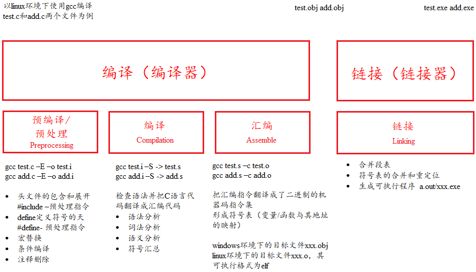
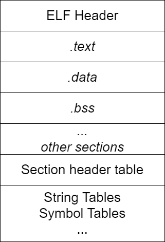

# 信息的表示和处理

## *信息存储*

### 进制间转换方式

速记：$x$ 是2的非负整数 $n$ 次幂时，即 $x=2^n$ 时，$x$ 对应的二进制表示就是1后面跟 $n$ 个0；对于16进制数，$n=i+4j,\ 0\leq i\leq3$，$x$ 开头的数字为 $1(i=0),\ 2(i=1),\ 4(i=2),\ 8(i=3)$，后面跟着 $j$ 个十六进制的0


十进制 $x$ 转十六进制：可以反复地用16除 $x$，得到一个商 $q$ 和一个余数 $r$，即 $x=q\cdot16+r$，不断对 $q$ 重复这个过程，最先得到的 $r$ 是低位，最后得到的 $r$ 是高位，将 $r$ 从高到低排列出来就得到转换的十六进制数。十进制转二进制同理，只是反复地用2除 $x$

### 字节顺序（大小端）


* 什么是大端和小端

  * 大端 Big endian：**低地址高字节**，即**数据的高字节保存在内存的低地址中，而数据的低字节保存在内存的高地址中**，比较符合阅读习惯
  * 小端 Little endian：**低地址低字节**

* 判断内存是以大端存储还是小端存储

  * 利用指针

    ```c
    int i = 1; // 01 00 00 00
    if (1 == *(char*)&i) // 将int*强制转换成char*后对该指针解引用，char*只能得到1字节的内存
        printf("Little endian\n");
    else
        printf("Big endian\n");
    ```

  * 利用联合体

    ```c
    int CheckSys()
    {
        union Un
        {
            char c;
            int i;
        }u;
    
        u.i = 1;
        return u.c; // 两者共用地址，若是小端则返回1，否则返回0
    }
    ```

## *整数表示*

### 整型数据类型

C语言标准定义了每种数据类型必须能够表示的**最小的取值范围**

### 无符号数的编码

设一个有 $w$ 位的整数数据类型，有位向量 $\vec{x}=\left[x_{w-1},x_{w-2},\cdots,x_{0}\right]$，其中每个位 $x_i$ 的取值为0或1。用一个函数 $B2U_w$ Binary to Unsigned 来表示从二进制到无符号数
$$
B2U_w\left(\vec{x}\right)\triangleq\sum\limits_{i=0}^{w-1}{x_i2^i}
$$
一个 $w$ 为的二进制位向量 $\vec{x}$ 可以表示的最大无符号数为 $UMax_w$，它的二进制为 $\left[11\cdots1\right]_w$
$$
UMax_w\triangleq\sum\limits_{i=0}^{w-1}{2^i}=2^w-1
$$
无符号数编码具有唯一性，因为 $B2U_w$ 是一个双射 bijection，即可以进行反向操作从无符号数唯一映射到二进制，用函数 $U2B_w$ 来表示。关于溢出 overflow 的问题写在下面整数加法的小段里

### 补码 two's-complement

C语言标准并没有要求要用补码形式来表示有符号整数，但是几乎所有的机器都是这么做的

这里要理清一个概念：用补码还是原码来表示一个数是**语言层次的概念**（高级语言和机器语言），对于计算机而言是无所谓的，都是二进制串。数据的类型通常是通过程序中的变量类型来指定的。变量类型告诉计算机如何对二进制串进行解释，以及如何对其进行运算。CPU的硬件通过指令中的操作码、操作数和前缀等信息来识别有符号数和无符号数，并根据不同的类型选择适当的运算方法和指令

为了表示负数，引入了原码 Sign-Magnitude（用最高位表示符号位，其他位表示大小）、反码 Ones' complemen（整数和原码相同，其他位取反）t 和补码表示。因为原码和反码对0的表示有两种和其他原因，补码是最好的选择


用补码来表示有符号数时，可以直接使用和无符号数一样的加法电路，所以不用额外设计电路，简化了硬件。如果使用原码进行两个正数之间的减法运算，还需要使用单独设计减法电路并且使用比较电路来决定谁大谁小，这非常低效。**设计补码的初衷是为了便利减法运算**，这是因为**减去一个数的原码等于加上它的补码**。考虑下面两个例子

* 钟表上是10点，要回到5点，既可以回拨/减去5小时，也可以前拨/加上7小时，这是因为在12小时进制中，7是-5对模12的补数
* 对于4位2进制数

$$
B_{comp}=\left\{\begin{array}{cl}B&,B\geq0\\2^n-B&,B<0\end{array}\right.
$$

补码的最高有效位 $x_{w-1}$ 称为符号位 sign bit，被解释为负权 negative weight，它的权重为 $-2^{w-1}$。用函数 $B2T_w$ Binary to Two's-complement 定义
$$
B2T_w\left(\vec{x}\right)\triangleq-x_{w-1}2^{w-1}+\sum\limits_{i=0}^{w-2}{x_i2^i}
$$
补码能表示的最小值是位向量 $\left[10\cdots0\right]_w$，最小整数值是 $TMin_w=-2^{w-1}$；最大值的位向量是 $\left[01\cdots1\right]_w$，最大整数值为 $TMax_w=\sum\limits_{i=0}^{w-2}{2^i}=2^{w-1}-1$ 

* $B2T_w$ 是一个双射，是从 $TMin_w$ 到 $TMax_w$ 之间的映射，即 $B2T_w:\left\{0,1\right\}^w\rightarrow\left\{TMin_w,\cdots,TMax_w\right\}$。它的反函数为 $T2B_w$
* 不对称性：$\lvert TMin\rvert=\lvert TMax\rvert+1$，因为一半的位模式用来表示负数，而另一半则用来表示0和正数
* $UMax_w=2TMax_w+1$

### 有符号数和无符号数之间的转换

强制类型转换的结果保持**位值不变，只是改变了解释这些位的方式**。C语言中有符号数和无符号数运算的时候，有符号数会被隐式转换为无符号数
$$
T2U_w(x)\triangleq B2U_w\left(T2B_w(x)\right),\ x\in\left[TMin_w,TMax_w\right]\\U2T_w(x)\triangleq B2T_w\left(U2B_w(x)\right),\ x\in\left[0,UMax_w\right]
$$


上图给出了补码与无符号数相互转换以及各自溢出回绕的情况。特别注意对应关系：-1和 $UMax$，它们的位模式都为全1

给定位模式的补码与无符号数之间的关系可以表示为函数 $T2U_w$ 和函数 $U2T_w$
$$
T2U_w(x)=\left\{\begin{array}{cc}x+2^w,&x<0\\x,&x\geq0\end{array}\right.\\U2T_w(x)=\left\{\begin{array}{cc}u,&u\leq TMax_w\\u-2^w,&u>TMax_w\end{array}\right.
$$

### 扩展位

* 无符号数的0扩展 zero extension 高位添0
* 补码数的符号扩展：高位添符号位

$$
B2T_{w+k}\left(\left[\underbrace{x_{w-1},\cdots,x_{w-1}}_{k\ times},x_{w-1},x_{w-2},\cdots,x_0\right]\right)=B2T_w\left(\left[x_{w-1},x_{w-2},\cdots,x_0\right]\right)
$$

### 截断 truncating

* 截断无符号数
  $$
  B2U_w\left(\left[x_{w-1},x_{w-2},\cdots,x_0\right]\right)\mod{2^k}=B2U_w\left(\left[x_{k-1},x_{k-2},\cdots,x_0\right]\right)
  $$

* 截断补码数：和截断无符号数一样，但要将最高位转换为符号位
  $$
  B2T_k\left(\left[x_{k-1},x_{k-2},\cdots,x_0\right]\right)=U2T_k\left(B2U_w\left(\left[x_{w-1},x_{w-2},\cdots,x_0\right]\right)\mod{2^k}\right)
  $$

## *整数运算*

### 无符号加法

无符号数原码的算数运算溢出 overflow/Überlauf：**完整的整数结果不能放到数据类型的字长限制中去**

对于两个无符号数 $x$ 和 $y$，因为它们能表示的无符号最大值为 $UMax_w=2^w-1$，所以 $\geq2^w$ 的值会被截断，相当于是 $\mod{2^w}$。定义无符号数加法 $+_w^u$
$$
x+_w^uy=\left\{\begin{array}{cc}x+y,&x+y<2^w\\x+y-2^w,&2^w\leq x+y\leq2^{w+1}\end{array}\right.
$$
上式中的溢出也可以表示为 $\left(x+y\right)\mod{2^w}$

### 补码加法


有符号数补码的算数运算溢出是**两个操作数的符号位同时发生改变**，有两种溢出情况

* 正溢出 positive overflow：正+正->负
* 负溢出 negative overflow：负+负->正

$$
x+_w^ty=\left\{\begin{array}{ccc}x+y-2^w,&2^{w-1}\leq x+y&positive\ overflow\\x+y,&-2^{w-1}\leq x+y<2^{w-1}&normal\\x+y+2^w,&x+y<-2^{w-1}&negative\ overflow\end{array}\right.=U2T_w\left[\left(x+y\right)\mod{2^w}\right]
$$

### 补码非

对 $TMin_w$ 的非操作要做出特殊规定，因为 $-TMin_w=TMax_w+1$，这会发生补码正溢。规定 $TMin$ 的非就是自身，因为 $TMin_w+TMin_w=2*-2^{w-1}=-2^w=0$ 。所以有
$$
-_w^tx=\left\{\begin{array}{ll}TMin_w,&x=TMin_w\\-x,&x>TMin_w\end{array}\right.
$$


求反的操作就是符号位不变，数值位取反，然后+1（对正数来说是原码求补码，求负数来说是补码求源码）

C语言中 `int` 的 $TMin$ 的定义为什么要写成 `(-INT_MAX - 1)` 的形式呢？因为编译器在解析 `-X` 的数据类型时，不会将其看作是一个整体，而是先翻译正数 `X`，再通过符号位不变，数值位取反，然后+1的方式求其补码。因为补码的非对称性，$\lvert TMin\rvert=\lvert TMax\rvert+1$，若直接写成 `-INT_MIN` 的形式，直接就溢出了

### 乘法

* 无符号乘法
  $$
  x\times\ ^u_wy=\left(x\times y\right)\mod{2^w}
  $$

* 补码乘法

* 乘常数

### 除法

## *浮点数*

### 二进制小数

$$
b=\sum\limits_{i=-n}^{m}{2^i\times b_i}
$$

浮点 `.` 的左边是2的正幂，右边是2的负幂，比如
$$
101.11_2=1\times2^2+0\times2^1+1\times2^0+1\times2^{-1}+1\times2^{-2}=5\frac{3}{4}
$$
正如十进制无法精确表示 $1/3$ 这类数一样，小数的二进制表达法也只能表示可以被写成 $x\times2^y$ 这样的数，其他的值只能够近似表达，增加二进制的长度可以提高精度。形如 $0.11\dots1_2$ 的数表示的是刚好小于1的数，可以用 $1.0-\varepsilon$ 来表示

手算浮点数的二进制转十进制就是上面的加权展开，十进制转二进制则先拆分整数部分和浮点数部分，整数部分和之前一样，对小数部分采用**乘2取整**法。若某次相乘得到整数就结束，否则就可以一直乘下去

### IEEE浮点数

用定点方式来存储浮点数是非常不方便的：有很多小数不能精确表达且影响了能够存储的数字的最大值。对此制定了IEEE浮点数标准，用一个三元组 $V=\left(s,E,M\right)$ 来表示浮点数
$$
V=\left(-1\right)^s\times M\times 2^E
$$

* 公式成分
  * 符号位 sign $s$，$s=0,1$ 分别表示正数和负数，而对于数值0的符号则作为特殊情况处理
  * 尾数 significand $M$，首字母来源于mantissa。它是一个二进制小数，范围是 $1\sim2-\varepsilon$ 或者 $0\sim1-\varepsilon$
  * 阶码 exponent $E$。它的做作用是对浮点数加权。这个权重是2的 $E$ 次幂
* 对浮点数的编码，将浮点数的位划分为三个字段。这套编码制度被称为移码 offset binary
  * 一个单独的符号位 $s$ 
  * $k$ 位阶码字段 $\exp=e_{k-1}e_{k-2}\cdots e_1e_0$ 编码阶码 $E$。**阶码表示的是2为base的幂的次数**（IEEE754以2为base，IEEE854扩展到10为base）
  * $n$ 位小数字段 $frac=f_{n-1}f_{n-2}\cdots f_1f_0$ 编码尾数 $M$，但尾数的值还取决于阶码 $\exp$。**尾数表示的是小数部分**


上图中给出了IEEE 754的两种浮点数编码

* 32位单精度浮点数 single precision：$s$ 为1位，$k=8,\ n=23$ 
* 64位双精度浮点数 double precision：$s$ 为1位，$k=11,\ n=52$ 
* 80 bits Extended precision only for intel

**为什么用移码来表示浮点数而不是使用补码？**首先我们可以确定的是我们需要能够分辨阶数的正负，所以解码必须能够提供类似与补码那种可以取分正负的机制。使用移码是为了比较阶码的时候可以直接比较无符号数 $e$。若使用补码表示浮点数的阶码时，需要进行符号位判断，并根据符号位的值来确定阶码的实际值。这个额外的处理增加了计算的复杂性和延迟

### 根据 $\exp$ 来分类尾数 $M$


* 规格化 normalized：当 $\exp$ 的位模式既不全为0也不为全1
  * 阶码的值是 $E=e-Bias$，其中 $e$ 是无符号数，而 $Bias=2^{k-1}-1$ 的偏置
    * 单精度的表示范围是 $\left[1,254\right]-\left(2^7-1\right)=\left[-126,+127\right]$
    * 双精度的表示范围是 $\left[1,2046\right]-\left(2^{10}-1\right)=\left[-1022,+1023\right]$
  * 隐含的以1开头的表示 implied leading 1：$M=1+f$ ，即 $M$ 可以看作是一个表达式为 $1.f_{n-1}f_{n-2}\cdots f_{0}$ 的数字。可以通过调整阶码来调整尾数 $M$ 在 $1\leq M<2$ 之间

* 非规格化 denormalized：当 $\exp$ 的位模式为全0，可以用来表示0
  * 特点
    * Exponent 是 $E=1-Bias$，而不是 $E=0-Bias$，这样设计的目的是为了让非规格化值**平滑过渡**到规格值，非常巧妙的设计。可以看书上8位浮点数的例子
    * 没有隐含的1开头，即 $M=f$
  * 非规格化数的作用
    * 提供了一种表示数值0的方法
    * 表示那些非常接近于0.0的数

* 特殊值 special value：当 $\exp$ 的位模式为全1
  * 当小数字段是全0的时候，得到的值是 $-\infty$ 或 $+\infty$，用来表示两个非常大的数相乘，或者除数为0时表示溢出的结果
  * 若小数段不是全0，则得到的值是 $NaN$（Not a Number），表示没有合适的答案，比如对-1开方，$\infty-\infty$ 等情况

### 舍入 rounding

IEEE浮点格式定义了四种不同的舍入方式

* Nearest even **default** 向偶数舍入/向最近值舍入：小于一半向下，大于一半向上，正好一半向偶数舍入（四舍六入五取偶）。通过向偶数舍入可以避免造成统计值偏差
* Towards zero 向零舍入：正数向下舍入，负数向上舍入
* Round down 向下舍入 $-\infty$
* Round up 向上舍入 $+\infty$

### 浮点计算

* 浮点数加法
  * 对阶 exponent alignment：将指数较小的浮点数进行尾数向右移位，指数同步增大，直到两个操作数的指数等
  * 求和：对尾数求和
  * 规格化
    * If M ≥ 2, shift M right, increment E
    * if M < 1, shift M left k positions, decrement E by k
    * Overflow if E out of range
    * Round M to fit frac precision
* 浮点数乘法，步骤也是对阶、求和和规格化

因为需要对阶和rounding，浮点数计算满足交换律，但不满足结合率。比如对于单精度浮点数的加法 `(3.14 + 1e10)-1e10 -> 0` 和 `3.14+(1e10-1e10) -> 3.14` 的结果是不同的，前者 `3.14+1e10` 时，3.14直接被rounding掉了

自然现象中的变化程度基本不会达到2的7次方，因而前一时刻的浮点数可以和后一时刻的相加并且结果在预期内。但如果是非自然情况下，比如说金融行业中，就可能会出现不连续的数据变化（Bill Gates的资产 + 我的资产 = Bill Gates的资产Lol）

# *程序概览和基本语法概念*

## *C语言标准：ANSI C -> C99 -> C11*

## *基本概念*

```c
#include <stdio.h>
int main()
{
    int num;
    num = 6;
    printf("HelloWorld!\n");
    printf("My faveourite number is %d", num);
    return 0;
}
```

* `#include <stdio.h>`：#include 称为C预处理器指令，导入头文件<stdio.h>
* `int main()`：main函数是一个程序的入口，必须要有，但实际上在调用main函数还有系统底层的函数
* `// /* */`：单行注释和跨行注释
* `int num` `num = 6;`
  * 变量/标识符（Variable/Identifier）的声明和初始化，标识符在使用之前必须要进行声明和初始化，C99之前变量的声明一定要放在块顶部，C99标准允许其放在任意位置
  * 命名变量时必须要用字母或下划线开始，不能用数字和其他字符，通常_或__开头的变量是留给操作系统和C库函数的
  * int是一个数据类型，是一个关键词（keyword），不能被用作变量名
* `\n`为转义序列 excape sequence
* `%d`为占位符
* `return 0;`返回值，函数需要一个返回值，即使不写这条语句函数也会默认返回0，但写这条语句可以养成一种统一的代码风格

## *C语言数据类型*

### C语言数据类型

* 基本内置类型 Bulit-in type
* int类型
* 其他整数类型 short, long
* 使用字符：char类型
  * char类型用于存储字符，但由于在计算机中使用ASCII码来存储字符，因此char实际上是整型。每个char占用一个bit位
  * 用单引号括起来的单个字符被称为字符常量 character constant `char grade ='A'`
  * C语言语法中没有规定char是有符号还是无符号，但为了保持统一，大部分编译器（包括vscode）中char都是**有符号**的
  * char是signed char还是unsigned char是取决于编译器的，C标准中没有规定，但大部分编译器中都是signed char
  * 编码规则（详见收藏的博客）
    * ASCII码
      * 65D-90D 大写字母；97D-122D 小写字母
      * 0D NULL；32D 空格；48D-57D 1-9
    * GBK码 汉字内码扩展规范：一个汉字占用两个字节
    * UTF-8：Unicode的一种规范，Ascii码字符仍不变，占用和标准Ascii编码一样的一个字节，一个汉字占用三个字节
    * Windows中自适应的ANSI编码系统
  * 转义序列 escape sequence

    转义序列|含义
    :-|:-
    \a|警报(ANSIC)
    \b|退格
    \f|换页
    \n|换行
    \r|回车
    \t|水平制表符
    \v|垂直制表符
    \\\ |反斜杠
    \\'|单引号
    \\"|单引号
    \?|问号
    \0oo|八进制
    \xhh|十六进制

* _Bool类型
* 可移植类型：stdint.h和inttypes.h
* float、double和long double
* 负数和虚数类型
* 其他类型
* 类型大小：`sizeof` 是C语言的内置运算符，以字节位单位给出指定类型的大小，C99和C11提供%zd转换说明匹配 `sizeof` 的返回类型。注意，`sizeof` 返回的是 `size_t` 无符号整型：为什么要使用 `size_t`？<https://jeremybai.github.io/blog/2014/09/10/size-t>，主要是考虑到可移植性和效率问题（C Primer Plus P84）

## *字符串和格式化输入/输出 (C Primer Plus 第4章)*

### 字符串 Character string 简介

* char类型数组和null字符 `\0`
  * 字符串 string 和字符 char ：字符用 `''` 框起来，是C语言的一种基本类型，属于整形。 而字符串用 `""` 框起来，字符串在C语言中没有专门用来存储的变量类型，需要被存储在char类型的数组中
  * 字符串的最后一个字符必须是用来表示结尾的空字符 `\0`，因此数组的熔炼给必须至少比待存储字符串中的字符数多1
* 计算数组大小和元素个数
  * `sizeof(str)/sizeof(str[0])` sizeof将会包括字符串末尾 `\0` 之前的所有char字节
    * `char str[100]="I love Jiaxing."; sizeof(str);` 其结果为100
    * 结尾标识符 `\0` 也会被计入字符串所占字节数：`sizeof("abc\\n")=6`
  * `strlen()` 从第一个字符开始计算字符串中字符数，直到遇到空字符，然后返回空字符前字符总个数
    * `char str[100]="I love Jiaxing。"; strlen(str);` 其结果为15（包含空格和标点符号）
    * `\0` 不算入 `strlen()` 的结果：`strlen("abc\\n")=5`
    * 转义字符算作一个字符长度：`strlen("abc\n")=4`
    * 八进制和十六进制Ascii码转义序列
      * 不能使用十进制，只有八进制和十进制。Ascii码范围 `0-127D <-> 0-177O <-> 0-80H`
      * 八进制范围：000-177，经过试验，超出该范围一定区间貌似也可以通过VS编译
      * 十六进制范围：x00-xff
      * 转义字符之后的至多连续三位数字（十六进制则第一位为x）需要被解释为同一个转义字符
        * `strlen("abc\\123n")=6`
        * `strlen("abc\\x23n")=6`

### 格式化输入输出I/O函数：printf()和scanf()

* printf()函数
  * 转换说明 Conversion specification：格式字符串中的转换说明一定要与后面的每个项相匹配，若忘记这个基本要求会导致严重的后果；若没有匹配项，则根据系统和编译器不同结果也不同
    * 转换说明表格

        转换说明|输出
        :-|:-
        %a和%A|浮点数、十六进制数和p计数法
        %c|单个字符
        %d|有符号十进制整数
        %i|有符号十进制整数，和%d相同
        %f|所有类型的浮点数（统一转换为double）
        %e和%E|浮点数，e计数法
        %g和%G|根据值的不同自动选择
        %o|无符号八进制整数
        %p|指针
        %s|字符串
        %u|无符号十进制整数
        %x和%X|无符号十六进制整数，使用十六进制数0f和0F
        %%|打印一个百分号

    * printf()的转换说明修饰符

        修饰符|含义
        :-|:-
        标记|见下表
        数字|最小字段宽度：即打印几个字符（包括小数和小数点）
        .数字|精度。举例：`%5.2f` 打印一个浮点数，字段宽度为5字符，保留2位小数，默认为6位小数
        %m.ns|m：输出字符串的宽度，n：左起截取目标字符串n个字符，并且是右对齐补空格
        h|和整形转换说明一起使用，表示short int或unsigned short int类型的值
        hh|和整型转换说明一起使用，表示signed char或unsigned char类型的值
        j|和整型转换说明一起使用，表示intmax_t或untmax_t类型的值，这些类型定义在stdint.h中
        l|和整形转换说明一起使用，表示long int或unsigned long int类型的值
        ll|和整形转换说明一起使用，表示long long int或unsigned long long int类型的值（C99）
        L|和浮点转换一起使用，表示long double类型的值
        t|和整形转换一起使用，表示ptrdiff_t类型的值（C99）
        z|和整形转换一起使用，表示size_t类型的值（C99）

    * printf()中的标记

        标记|含义
        :-|:-
        -|待打印项左对齐（默认为右对齐）
        +|有符号值为正，则在值前面显示加号；为负则显示负号
        空格|有符号值为正，则在值前面显示前导空格（不显示任何符号），若为负，则在值前面显示减号
        #|把结果转换为另一种形式，若是%o，则以0开始；若是%x或%X，则以0x或0X开始
        0|用前导0代替空格填充字段宽度

  * 转换说明的意义：把给定的值翻译成要求的值并打印出来。程序把传入的值根据其类型按照一定方式放入内存，printf()函数根据转换说明（不是根据变量类型）从内存中读取值，并不会改变内存中的数据，只是一种翻译方式
    * 使用不匹配的转换说明将造成严重的后果，例如%lf用成了%f
    * `printf()` 和 `scanf()` 中对于浮点数的处理是不同的：**`printf()` 中没有float的转换类型，所有的float都会被强制转换为double，因此统一用%f，%Lf用于long double。而在 `scanf()` 中%f为float型，%lf为double型**
  * `printf()` **返回打印字符的个数**，如果有输出错误，则返回一个负值
  * 打印长字符串和数字不需要转换说明

* `scanf()` 函数
  
  * 参数需要传入指针
  * `scanf()` 函数使用空白，即**换行符、制表符和空格**把输入分成多个字段
  * `scanf()` 函数每次读取一个字符，***除了%c模式外跳过开头所有的空白字符开始读取第一个非空白字符***，并保存非空白字符直到再次遇到空白。当scanf()把字符串放进指定数组中时，他会在字符序列的末尾加上'\0'，让数组中的内容成为一个字符串
  * 程序在下一次读取输入时，先读到的是上一次读取丢弃放入缓冲区的字符
  * 格式字符串中的普通字符：除空格字符外的普通字符必须与输入字符串严格匹配。如`scanf("%d,%d"，&a, &b)`意味着必须使用逗号
  * scanf()的返回值：返回成功读取的项数，如果没有读到数输入错误返回0，如果退出则返回EOF

### getchar()和putchar()

1. 这两个函数只用于处理字符，所以它们比更通用的scanf()和printf()函数更快、更简洁，同时它们也不需要转换说明。
2. ctype.h系列的字符函数

## *运算符、表达式和语句*

### 临时变量

计算机并不认识操作符，所有的实现都需要借助临时变量，因此除了单目操作符和赋值操作符（生成的临时变量中存储的值会给左边）外，其他的操作符的结果都不会改变左边的原值。同时通过临时变量也会发生类型转换

### 操作符

* 算术操作符：`+ - * / %`
* 移位操作符 shift operator：
  * 左移 `<<`：规则为左边抛弃，右边补0
  * 右移 `>>`：右移操作符具体采用算数移位还是逻辑移位取决于编译器
    * 逻辑移位：左边用该值的符号位填充，右边抛弃
    * 算术移位：右边抛弃，左边补0。算数移位主要是为了实现快速的除以2的幂
  * 对于移位运算符，不要移动负数位，这是C语言标准未定义的，比如 `num >> -1`
* 位操作符：`& | ^`，其中 `^` 由于其特殊的性质，因此使用非常巧妙
  * `^`性质（只有整数异或有）
    
    * `a^a=0` 相同的偶数个数字异或=0
    * `a^0=a` 一个数和0异或等于原数
    * 可以推得相同的奇数个数字异或=原数
  * 应用场景
    * 不能创建临时变量实现两个数的交换（这个方法速度很快，但只能作用于整数）
  
        ```c
        a = a^b;
        b = a^b; // b == a^b^b == a
        a = a^b; // a == a^b^a^b^b == b
        ```
  
    * 找单身狗问题：一个数组中只有一个数字出现了一次，其他都出现了两次，找出这个数字。利用第二条性质
  
        ```c
        int arr[9] = { 1,1,2,3,3,4,4,5,5 };
        int sz = sizeof(arr) / sizeof(int);
        int ret = 0;
        for (int i = 0; i < sz; i++)
        {
            ret ^= arr[i];
        }
        printf("ret: %d\n", ret);
        ```
  
    * 利用 `&` 求一个整数存储在内存中的二进制中1的个数：`if (1 == (num>>i) & 1) count++`
  
* 逻辑操作符：`&& ||` 的**短路原则 short-circuit evaluation**：`&&` 从左到右进行检测，若左边的条件不满足，后面的就不需要运算了，利用该性质可以简化一些算法
* 赋值操作符：`= -= += *= /=`
  * 注意两个字符串之间不能使用 `==` ，其比较的将会是首字符的地址，要使用专门的 `strcmp`
  * 赋值操作符的返回结果是最左边的值，下面的例子中，a赋值给c，c赋值给b，最终return的值为b

    ```c
    int test()
    {
        int a = 2;
        int b = 3;
        int c = 4;
        return b = c = a;
    }
    ```

* 单目操作符：`! - + & sizeof ~ -- ++ * (强转)`
* 关系操作符：`> == != <`
* 条件操作符：`exp1 ? exp2 : exp3`
* 逗号表达式：从左到右依次执行，整个表达式的结果为左后一个表达式的结果
* 下标引用、函数调用和结构成员：`[] () . ->`

### 优先级 Operator Precedence

* 只有对所有编译器唯一确定运算顺序的运算才是正确的，在一个语句里用太多的自加自减会引起混乱。仅仅有操作符的优先级和结合性是无法唯一确定某些表达式的计算路径的
* 优先级表<http://c.biancheng.net/view/161.html>

### 类型转换 Type Conversion

* 自动类型转换/隐式类型转换 implicit conversion：编译器在编译阶段自动进行，能转就转，不能转就编译失败，**类型转换的特征是会产生临时变量**
  * 算术转换（长度大于int）arithmetic conversion：若操作符的各个操作数属于不同的类型，那么编译器会自动按照类型转换从低到高顺序的进行算术转换：long double, double, float, unsignedlong long, long long, unsigned long, long, unsigned int, int。算术转换时内存中二进制表示的值没有变，只是计算机解释值的方式变了。隐式类型的转换各种赋值操作符的两侧（`>=` 这种也是），这里有一个经典的错误可以看Cpp.md的string类模拟实现部分的insert部分
  * 整型提升（长度小于等于int）integral promotion：当传参和计算时，char和short被转换为int，float转换为double：整型提升是按照变量的数据类型的符号位来提升的
    * 有符号数
      * 负数的整型提升：高位补充1
      * 正数的整型提升：高位补充0
    * 无符号数：高位补充0
  * 截断：前面的都是属于小范围类型转换为大范围类型，截断是当大范围类型转换为小范围类型
  * 其他隐式类型转换
    * 数组名自动转换为指向数组首元素的指针（除sizeof外）
    * 指针转换
    * 转换成布尔类型：0转换为flase，否则转换为true
    * 转换成常量（权限缩小）
    * 类类型定义的转换
  
* 强制类型转换/显式类型转换 `(int)a`：需要用户自己处理。关于C++对强制类型转换的修改看 Cpp.md

* 一道例题

    ```c
    char c1 = 3;
    // 0000 0011
    char c2 = 127;
    // 0111 1111
    char c3 = c1 + c2;
    // char整形的赋值运算要进行整型提升
    // 00000000 00000000 00000000 00000011
    // 00000000 00000000 00000000 01111111
    // 00000000 00000000 00000000 10000010 结果
    // 运行完后结果被截断为 10000010存放到char c3中
    printf("%d\n", c3);
    // 以整形打印，进行整型提升
    // 11111111 11111111 11111111 1000010（补）
    // -> 11111111 11111111 11111111 1000001 -> 10000000 00000000 0000000 01111110（原） = -126
    ```

**类型转换的特征是会产生临时变量**，而临时变量具有常性

```cpp
int i = 0;
double d = i;
//double& rd = i; //错误，引用的不是i，而是由于类型转换所以i产生的中间变量
const double& rd = i; //正确
const double& rd = static_cast<double>(i); //C++规范写法

//---------------------
class A {};
class B : public A {};
B bb;
A aa1 = bb;
A& ra1 = bb; //向上转换切片，所以没有产生中间变量，也就不需要const了
```

## *循环 Loop*

* while循环是最早出现的
* for循环是后期产生的，将控制变量的初始化、条件判断、循环条件的调整集成到一起
* do while循环至少进行一次，使用场景有限

## *分支和跳转*

### if语句：0表示假，其余为真（包括负数）

* 多重选择 else if
* else与if的配对：else与离它最近的if配对，除非最近的if被花括号括起来了
* 多层嵌套的if语句

### 循环辅助

* continue：执行到该语句时，会跳过本次迭代的剩余部分，并开始下一轮迭代。若continue语句在嵌套循环内，则只会影响包含该语句的内层循环
* break：终止（跳出）当前循环，并继续执行下一阶段的代码。若是在嵌套循环内，break只会跳出当前层循环，一个break只能跳一层
* return：return直接跳出多重循环，将值return给外面调用的接收者
* continue和break在迭代中可以终止当前层的迭代

### 多重选择：switch和break

* 程序根据整形表达值跳转至相应得case标签处，然后执行剩余的**所有语句**，除非遇到break语句跳出。表达式和case标签都必须是**整数值**（包括char），标签必须是常量或完全由常量组陈给的表达式。如果没有case标签与表达式匹配，控制则转至标有default的语句（如果有的话）；否则将转至执行紧跟在switch语句后面的语句
* switch语句中的break：如果不使用break将无法实现分支，因为如果不用break将会顺序执行
* default：如果所有的case标签都不匹配，那么将会跳过这个switch结构，因此最好写上一个default语句。

    ```c
    #include <stdio.h>
    int main()
    {
        int day = 0;
        switch(day)
        {
            default:
                printf("Wrong Input!\n");
                break;
            case 1:
            case 2:
            case 3:
            case 4:
            case 5:
                printf("Workday.\n");
                break;
            case 6:
            case 7:
                printf("Weekend.\n");
                break;
        }
        return 0;
    }
    ```

* 如果表达式是浮点型或者范围，那么就不能使用switch，用if else结构方便

## *Debug和Release版本*

* Debug调试版本：包括了调试信息，并且不做任何优化，便于程序员调试程序
* Release发布版本：编译器进行了各种优化，使得程序在代码大小和运行速度上都是最优的，以便用户使用，但不能进行调试

# 程序的机器级表示

## *程序编码*

### 机器级代码 Machine-level code

机器级代码是连接高级语言与CPU的中间状态，它有两个含义，一是最终经过编译、汇编和链接的目标代码 object code（二进制指令），二是汇编代码则是机器代码的文本比哦啊是，给出程序中的每一条指令。每条指令会继续根据不同的CPU指令集 Instruction-Set 继续翻译成CPU可以理解的二进制代码

编译器较高的优化登记会导致汇编代码产生严重变形，可读性严重下降。`-Og` 是减少GCC的优化程度，提高汇编程序的可读性，其中-g是 gdb debugging。较高的优化等级可以通过 `-O1`、`-O2` 等选项指定

### CPU简单的历史与概念

x86架构泛指所有的intel系列芯片，因为第一个系列芯片叫做8086。386是真正开创了PC的一款CPU，开始运行Unix系统了。intel提出的IA64（Itanium处理器）没有在市场上获得成功，反而是AMD将32位CPU扩展到了64位

从2003年开始，CPU的设计与制造由于功耗等限制不再只追求cpu的频率，而是通过多核来实现多任务处理速度和能耗之间的平衡

指令集：提供一系列指令，指示CPU该确切的做什么。指令集是一种抽象，不同的指令实现的目标可能是一样的，但底层的硬件操作不同，这也就给了优化的机会

历史上出现过很多知名的指令集架构，比如Alpha， SPARC，PowerPC，MIPS等，但是今天最流行的指令集架构是**x86(-64)，ARM，RISC-V**

ARM Acorn RISC Machine 架构，比x86更简单，功耗更低。RISC是精简指令集，之前用的都是CISC 复杂指令集

## *代码实例*

### 得到汇编代码

CSAPP书上的代码例子为

```c
// mstore.c
long mult2(long, long);

void multstore(long x, long y, long *dest)
{
    long t = mult2(x, y);
    *dest = t;
}
```

可以通过 `gcc -Og -S mstore.c` 得到 `mstore.s` 汇编代码

```assembly
    .file   "mstore.c"
    .text
    .globl  multstore
    .type   multstore, @function
multstore:
.LFB0:
    .cfi_startproc
    pushq   %rbx
    .cfi_def_cfa_offset 16
    .cfi_offset 3, -16
    movq    %rdx, %rbx
    call    mult2
    movq    %rax, (%rbx)
    popq    %rbx
    .cfi_def_cfa_offset 8
    ret
    .cfi_endproc
.LFE0:
    .size   multstore, .-multstore
    .ident  "GCC: (GNU) 4.8.5 20150623 (Red Hat 4.8.5-44)"
    .section    .note.GNU-stack,"",@progbits
```

所有以 `.` 开头的文件是要喂给debugger、linker的，用来指导它们的工作。通常可以忽略它们

### 查看目标代码文件

`gcc -Og -c mstore.c` 可以得到目标代码文件 `mstore.o`

目标代码文件是二进制的，无法直接查看，可以通过GDB工具来查看它的十六进制序列版本。即 `gdb mstore.o`，然后在 `(gdb) `  prompt后面输入命令 `x/14xb multstore`

```assembly
(gdb) x/14xb multstore
0x0 <multstore>:	0x53	0x48	0x89	0xd3	0xe8	0x00	0x00	0x00
0x8 <multstore+8>:	0x00	0x48	0x89	0x03	0x5b	0xc3
```

### 反汇编器 disassembler

反汇编器可以将目标代码文件的二进制序列中复原出汇编代码，Linux中为GNU软件objdump。`objdump -d mstore.o`

```assembly
0000000000000000 <multstore>:
//Offset    Bytes                   Equivalent assembly language
       0:	53                   	push   %rbx
       1:	48 89 d3             	mov    %rdx,%rbx
       4:	e8 00 00 00 00       	callq  9 <multstore+0x9>
       9:	48 89 03             	mov    %rax,(%rbx)
       c:	5b                   	pop    %rbx
       d:	c3                   	retq
```

### 数据格式

因为是从16位扩展到32位的，所以intel用术语 **字 word** 来表示16位数据类型，32位为双字 double words，64位为四字 quad words

`char*` 代表的是指针类型，也用 `q` 来表示。双精度浮点数用的也是 `l` 来表示，但不会产生歧义，因为浮点数专用一套指令和寄存器


### ATT与intel汇编代码格式

GCC、Objdump等GNU工具的默认格式是ATT格式（Bell lab from AT&T）。Microsoft、intel文档等工具则采用intel格式。用 `gcc -Og -S -masm=intel mstore.c` 来生成intel格式的汇编代码

```assembly
    .file   "mstore.c"
    .intel_syntax noprefix
    .text
    .globl  multstore
    .type   multstore, @function
multstore:
.LFB0:
    .cfi_startproc
    push    rbx
    .cfi_def_cfa_offset 16
    .cfi_offset 3, -16
    mov rbx, rdx
    call    mult2
    mov QWORD PTR [rbx], rax
    pop rbx
    .cfi_def_cfa_offset 8
    ret
    .cfi_endproc
.LFE0:
    .size   multstore, .-multstore
    .ident  "GCC: (GNU) 4.8.5 20150623 (Red Hat 4.8.5-44)"
    .section    .note.GNU-stack,"",@progbits
```

可以看到，intel格式的汇编代码和之前的ATT格式的汇编代码有很大的区别

* intel格式忽略了指示大小的后缀，比如是 `push` 而不是 `pushq`
* intel格式忽略了寄存器名字前面的 `%` 符号
* intel格式用不同的方式来描述内存中的位置，比如 `mov QWORD PTR [rbx], rax`，而不是 `movq    %rax, (%rbx)`
* 当带有多个操作数的指定情况下，列出操作数的顺序相反

## *访问信息*

### 寄存器的演进

寄存器是位于CPU中的，用来适配CPU高速数据取用需要的高速存储器

1. 8086：8个16位寄存器。即从 `%ax` 到 `%sp`
2. IA32架构：寄存器扩展为32位，标号为 `%eax` 到 `%esp`，%e.. 表示extended
3. x86-64：16个存储64位值的通用目的寄存器 general-purpose registers。以 `%r` 开头，%r.. 表示register

从IA32到x86-64：生成1字节和2字节数字的指令会保持剩下的字节不变；生成4字节数字的指令会把高位4个字节置0

### 操作数指示符

大多数指令有一个或多个操作数 operand，指示出执行一个操作中要使用的源数据值，以及防止结果的目的的位置

* 立即数 immediate 用来表示常数值，以 `$` 开头 + 标准C语言表示，注意默认是十进制，十六进制一定要用 `0x` 标识
* 寄存器 register：表示16个寄存器中的一个，比如 `%rax`。用符号 $r_a$ 来表示任意寄存器 $a$，用引用 $R[r_a]$ 来表示**寄存器内存的值**，相当于是把寄存器集合看成是一个数组 $R$，用寄存器标识符作为下标索引
* 内存引用 memory reference/寻址：**根据计算出来的有效地址访问某个内存位置**，用 `()` 括起来

通俗的解释一下三个操作数：立即数是一个普通的数，寄存器里面存了一个数，可以直接用来加减乘除等，但是**一旦立即数和内存引用被`()`了，那么它们里面存的数就是一个地址了，会被用来去寻找内存对应地址存的数据**

操作数格式与寻址模式 Addressing modes


最后一个内存引用方式 $Imm(r_b,r_i,s)$ 是最常用的。$r_b$ 是基址寄存器 base register，$r_i$ 是变址寄存器 index register，$s$ 是比例因子 scale factor，只能取1、2、4或8，用来适应不同的数据类型，比如int和long。举例：`9(%rax, %rdx, 4) == M[9 + R[%rax] + 4R[%rdx]]`

C数组可以进行算数运算来寻址就是借助了底层 $Imm(r_b,r_i,s)$ 这种寻址模式。这里也可以看出来C的设计很大一部分是参考了底层的汇编语言的，既形成了机器语言所没有的高级语言特性，又保留了一部分机器语言的灵活性

### 数据传送指令 `MOV`

`MOV` 指令用于将数据从源位置复制到目的位置，不做任何变化

* 数据类型匹配，传送不同字长的数据都是以32位补码数字作为源数据的，除了 `movabsq` 扩展到64位
* 小到大需要填充高位：`MOVZ` 零扩展和 `MOVS` 符号扩展

理论中应该有9种MOV的搭配方式。immediate不能作为dest，因为它是常数，去掉了3种。另外出于硬件设计的便利性，**不能直接将一个内存位置复制到另一个内存位置**，而是会采用DMA来协调完成（**内存->寄存器，寄存器->内存两步走**），去掉了1种。因此一共有5种source和destination的组合

为什么是两个临时变量：因为不能从内存直接传值给内存，还是要写成两句，中间用个寄存器。比如下面这个例子，c语言可以只用一个临时变量，但需要有一句 `*xp = *yp;`，编译后就是两个寄存器

```cpp
void swap(int* xp, int* yp)
{
    int tmp = *xp; //临时变量tmp放在了寄存器里
    *xp = *yp; //不能是内存到内存的直接操作，要放到一个寄存器里
    *yp = tmp;
}
```

```assembly
    movl    (%rdi), %eax
    movl    (%rsi), %edx
    movl    %edx, (%rdi)
    movl    %eax, (%rsi)
    ret
```

### `lea`

`lea () r_a` 加载有效地址，load effective address 的形式是从内存读数据到寄存器，但实际上 `()` 根本没有进行内存引用（也就是说对括号里的数字（当然此时代表了地址）进行寻址），而是直接将 `()` 里的数字（地址）写入目标寄存器，**相当于 `()` 此时是无效的！**

因为可以直接取到数字/地址，所以用 `lea` 来实现C语言里的 `&` 操作符。注意：指针是C语言给的一种抽象，机器代码里指针就是地址·

GCC特别喜欢用它来描述间接的算数运算，下面给出一个例子

```c
long scale(long x, long y, long z)
{
    long t = x + 4 * y + 12 * z;
    return t;
}
```

当开启高优化等级的时候（`-O1` 或 `-O2`），可以得到下面的汇编代码

```assembly
# x in %rdi, y in %rsi, z in %rdx 实参没有保存在内存中，而是临时放在寄存器中
leaq    (%rdi,%rsi,4), %rax # x + 4y 放入新的寄存器rax中
leaq    (%rdx,%rdx,2), %rdx # 3z = z + 2z
leaq    (%rax,%rdx,4), %rax # x + 4y + 12z
ret
```

`lea` 容易与 `mov` 混淆，区别在于，`mov` 的作用是移动数据，如果操作数是 `()` ，它会对其寻址（即内存引用），但 `lea` 则不会对 `()` 内存引用，而是直接将 `()` 括号内的地址写入目标寄存器

lea功能等于一个线性方程，因为有独立的电路来实现，所以比常规的用add和mul的方法计算速度更快

### 算数运算

下面的所有运算都会设置条件码

* 一元操作符：`INC` ++（ZF+OF）、`DEC` --（ZF+OF）、`NEG` 取负、`NOT` 取补
* 二元操作符
  * `ADD`、`SUB`、`IMUL`、`XOR`（CF+OF）、`OR`、`AND`
  * 汇编没有除法，因为它的效率非常低 https://cjting.me/2021/03/16/the-missing-div-instruction-part1/
* 移位（CF）：`SHL` Shift Logical Left 左移、`SAL` 算数左移、`SAR` 算数右移、`SHR` 逻辑右移

### 特殊的算数操作：为什么要区分有符号数和无符号数？

https://www.cnblogs.com/walkerlala/p/5686014.html

为什么对于`ADD`、`SUB` 不需要区分有符号数还是无符号数，而乘除法却要区分操作数是有符号数还是无符号数来分别使用 `IMUL` 和 `MUL` 呢？

首先要明确，对于机器而言，其实没有什么补码、原码或者有符号数、无符号数之分，**有符号数和无符号数的加法对于CPU而言是完全等价的**，CPU只是对二进制串进行简单的加法运算（加减乘除都是以加法器为基础扩展开来的）。有符号数和无符号数是语言层次的概念，是用户定义了如何看待某个二进制串计算结果

那么是如何做到可以识别语言层级的 `signed` 和 `unsigned` 呢？需要借助条件码的帮助。The CARRY flag and OVERFLOW flag in binary arithmetic: http://teaching.idallen.com/dat2343/10f/notes/040_overflow.txt。在这篇文章中清楚的说明了不论是无符号数还是有符号数都要设置 Carry Flag 和 Overflow Flag 的条件码寄存器，但是对于无符号数来说只有CF是有作用的，而对于有符号数只有OF有效

```assembly
0000-0001 = 1111 # CF and OV will be set simultanesouly
```

从上面的例子中可以看出，加法是有可能会同时设置CF和OF两个条件码寄存器的，而我们只要去检查CF和OF就可以得到相应的结果了，所以`ADD`、`SUB` 不需要区分有符号数还是无符号数

但是对于乘除法就不同了，不同于加减法设置CF和OF与用户看待操作数的视角无关，乘除法的结果是否要设置OF，要看操作数是有符号数还是无符号数。比如 `-1*-2=2`，比如有符号数，它没有溢出，但是如果是无符号数，显然就溢出了，所以要区分两条机器指令

注意：`imulq` 和 `idivq` 既有单操作数形式，也有双操作数形式，注意区分

## *控制流 Control*

**`%rip` instruction pointer：存储当前正在执行的指令的地址**

### 条件码

除了整数寄存器，CPU还维护了一组条件码寄存器 condition codes，用来描述最近的算数或逻辑操作的属性。可以检测这些寄存器来执行条件分支指令。它们不是直接设置的，而是根据其他指令操作后的结果设置的

* CF Carry Flag (for unsigned)：进位标志，最近的操作使最高位产生了进位，**可以用来检查无符号操作的溢出**
* SF Sign Flag (for signed)：符号标志，最近的操作得到的结果为负数
* ZF Zero Flag：零标志，最近的操作的出的结果为0
* OF Overflow Flag (for signed)：溢出标志，最近的操作导致一个**补码溢出**（正溢出或负溢出）

所有算数和逻辑运算都会设置条件码，`leq` 不会设置，因为它是针对地址的运算

`CMP` 和 `TEST` 只会设置条件码而不会改变任何其他寄存器

* `CMP` 根据两个操作数之差来设置条件码，相当于是只设置条件码的 `SUB`。注意ATT格式中 `CMP` 的两个操作数顺序是反的（即右操作数减去左操作数）

  ```assembly
  comq %rsi, %rdi # a in %rdi, b in %rsi -> 根据 t = a - b 的结果来设置条件码
  ```

* `TEST` 是不设置条件码的 `AND`，不会影响到OF和ZF。常用 `testq %rax, %rax` 来检查 `%rax` 是负数、零还是正数

  ```assembly
  # 多位测试：测试al寄存器的位 0 和位 3 是否置 1
  test al, 00001001b #测试位 0 和位 3，其中00001001b是掩码
  # 只有当&结果为0时ZF才置1，表明位 0 和位 3已经被清除
  ```

### 条件码的使用

最近的一次指令会设置条件码，比如算数指令、`SET`、`TEST`、`CMP`，然后可以利用新置的条件码进行以下操作

* 根据条件码的某种组合将**一个字节**设置为0或者为1：`SET` 指令族
  * `SET` 指令的操作数是低位单字节寄存器，比如 `%al`，然后用 `movzbl` 将寄存器的高位清零（虽然是四字l，但会自动把更高位的其他4位也清零）
  * `SET` 指令族里有很多同义名 synonym，比如 `setq` 当大于时设置 和 `setnle` 当不小于等于时设置 效果是一样的。底层到底用哪一条机器指令取决于编译器和汇编器
  * 区分有符号数和无符号数的算数运算
    * 有符号数：利用SF^OF（异或）和ZF的组合
    * 无符号数：利用CF和ZF标志的组合
* 可以条件跳转到程序的某个其他的部分：`jump` 指令可以改变一组机器代码指令的执行顺序
* 借助条件码，用 `CMOV` 来实现条件分支

### General translation of conditional branch with `jX`

`jX` 指令族

* 无条件跳转，相当于条件码一直为1
  * 直接跳转：跳转目标是作为指令的一部分编码的，比如 `jmp .L1` 跳转到 `.L1` 标号 label处
  * 间接跳转：跳转目标是从寄存器或内存位置中读出来的，比如 `jmp *(%rax)`，从 `%rax` 寄存器内存引用得到里面存放的地址后跳转到该地址
* 有条件跳转：利用条件码的组合条件进行跳转，比如 `je` 是当条件码ZF置1时（相等/零）进行跳转

用 `jX` 指令族实现 `if-else` 条件分支：**`jX` 类似于 `goto` 跳转**

```c
long lt_cnt = 0;
long ge_cnt = 0;
long absdiff_se(long x, long y)
{
    long result;
    if (x < y) {
        lt_cnt++;
        result = y - x;
    }
    else {
        ge_cnt++;
        result = x - y;
    }
    return result;
}
```

可以得到汇编代码

```assembly
# long absdiff_se(long x, long y)
# x in %rdi, y in %rsi 
1 absdiff_se:
2 	cmpq %rsi, %rdi               # Compare x:y
3 	jge .L2 If >=                 # goto x_ge_y
4 	addq $1, lt_cnt(%rip)         # lt_cnt++ 
5 	movq %rsi, %rax 
6 	subq %rdi, %rax               # result = y - x 
7 	ret Return 
8 .L2: #x_ge_y: label标志 类似于goto跳转到这里
9 	addq $1, ge_cnt(%rip)         # ge_cnt++
10 	movq %rdi, %rax 
11 	subq %rsi, %rax               # result = x - y 
12 	ret Return
```

### Conditional Move `CMOV` 来实现条件分支

现代CPU的分支预测逻辑 brach prediction logic 整体上是高效的，但预测错误的时候要走回头路就会造成严重的效率浪费。因此在一些情况下可以通过 Conditonal Move 来进行优化。条件传送指令族 `CMOV`（即根据条件码做出反应的 `MOV`）无需预测测试的结果就可以执行条件传送，效率高

考虑 `jX` 用过的例子，注意不同之处在于取消了自加命令，这是因为 `CMOV` 不能在会造成分支side-effect的时候使用

```c
long absdiff_se(long x, long y)
{
    long result;
    if (x < y) 
        result = y - x; //分支取消了自加
    else
        result = x - y;
    return result;
}
```

它的汇编代码为

```assembly
# long absdiff(long x, long y)
# x in %rdi, y in %rsi
1 absdiff: 
2 	movq %rsi, %rax 
3 	subq %rdi, %rax                 # rval = y-x 
4 	movq %rdi, %rdx 
5 	subq %rsi, %rdx                 # eval = x-y 
6 	cmpq %rsi, %rdi                 # Compare x:y 
7 	cmovge %rdx, %rax               # If >=, rval = eval 
8 	ret Return tval
```

因此类似于 `v = test-expr ? then-expr : else-expr` 这种有简单分支的三目运算符一般会使用 `CMOV`

为什么不一直使用 `CMOV` 来提高效率？

* 计算两个分支的效率比较低（特别是当一个分支的计算负载很大，比如说算密码）
* 有些时候有可能某个分支甚至是违法的，比如对空指针解引用等
* 有些时候则是会有副作用 side-effect ，比如一个分支是 `x+=3` 这种会改变变量

### 循环

汇编没有专门的一条指令来实现循环，而是要条件测试和跳转组合起来实现循环的效果

* do while循环：至少执行一次
* while循环：可能判断完条件不满足，直接退出了，一次也不执行
  * jump-to-middle
  * guarded-do，GCC较高的优化等级 `-O1` 会采用这种方式

* for循环
  * jump-to-middle
  * guarded-do


### `switch`

## *过程 Procedure*

Procedure遵守一套被普遍承认的约定（不是强制化的协议），称为应用二进制接口 Application Binary Interface ABI。ABI是机器代码级别的规范，比如如何使用寄存器、调用过程中的细节等等，它与可执行代码的二进制兼容性有关

AMD64的ABI：https://web.archive.org/web/20080528070803/http://www.x86-64.org/documentation.html

### Mechanisms in Procedures

* 传递控制 Passing control
  * To beginning of procedure code
  * Back to return point
* 传递数据 Passing data
  * Procedure arguments
  * Return value
* 分配和释放内存 Allocating and deallocating memory
  * Allocate during procedure execution
  * Deallocate upon return

### 运行时栈 Run-time stack


C语言过程调用机制的一个关键特性（大多数其他语言也类似）在于**使用了虚拟内存的栈数据段提供的后进先出的内存管理原则**。程序可以用栈来管理它的过程所需要的存储空间，栈和程序寄存器存放着传递控制和数据、分配内存所需要的信息

不论代码里总共有多少函数，在单一时候只有一个函数被调用。调用函数的信息总是处于栈底，而被调用函数的信息则被放到栈顶，当结束调用后，可以LIFO的被释放掉

**栈帧 stack frame 是为一个过程开辟的特定栈内存空间**。栈是从高地址向低地址增长，假设过程P caller 调用Q callee，栈空间其依次为：P可能压入的6-n号参数 -> P的返回指令地址 -> 最多6个用于传参的寄存器 -> Q的局部变量

栈帧为什么要设计成从高地址向低地址增长呢？个人理解是为了方便寻址，比如说 `long a = 1234` 这么一个初始化语句，和它相关的汇编代码是如下。如果栈帧设计成从低地址向高地址增长，那么寻址就要写成 `movq $1234, -8(%rsp)` 了，这样不自然

```assembly
subq $8 %rsp # 新分配8字节的栈帧
movq $1234, 8(%rsp) # 寻址分配
```

### 压栈和弹出栈

压栈和弹出栈的意思是**往栈里写入或弹出数据**

x86-64的16个寄存器中具有特殊用途的是 `%rsp` 寄存器，它专用于存储栈指针；`%rbp` 寄存器存的是栈底指针（即调用函数的栈顶），固定不变的 `%rbp` 可以用来定位函数活动记录中的各个数据

* `pushq Src`

  通过递减栈指针进行压栈。将一个四字值压入栈中，首先要将栈指针减8字节（之所以是8字节是因为x86-64的最大数据类型是8字节的，对齐到8字节），然后将值写到新的栈顶地址，等价于下面的指令

  ```assembly
  subq $8, %rsp       # Decrement stack pointer
  movq %rbp, (%rsp)   # 将%rbp里存的地址写到栈顶
  ```

  当然这两条指令是无法替代 `pushq`，因为 `pushq` 一共就1字节，上面两条指针加起来要8字节

* `popq Dest`：弹出数据/释放数据，不需要去抹去原来的数据，仅仅是移动一下栈指针就可以了

  ```assembly
  moveq (%rsp), %rax  # Read %rax from stack
  addq $8, %rsp
  ```

### 转移控制 Control transfer

* 利用5字节的 `callq Q` 指令将控制权从函数P转移到函数Q（指令的后缀q只是为了表明这是x86-64中的指令）
  * 更改PC中的指令地址：只需要简单地将往PC寄存器 `%rip` 里放Q代码指令的起始地址就可以了，CPU会自动执行PC里放的指令。**没有指令能够直接显式更改 `%rip`，`callq` 指令会隐式地来修改 `%rip`**
  * 保存返回地址：同时为了顺利地从Q返回时还能接上原来P的执行流，要保存好P函数里 `call Q` 指令后紧跟着的那条指令A，方便Q执行完后返回到这里，所以要将A也压入栈顶。同样的，这个功能也是 `callq` 隐式完成的压栈，从汇编代码上看不出来
  * `callq` 的效果相当于是 `jup` + `pushq`
* `retq` 指令
  * 从栈中弹出返回处的指令地址A
  * 把PC设置为A
  * 把返回数据存到 `%rax` 中

### 数据传送

整数和指针（scaler data 标量数据）

* 被调用过程最多可用6个寄存器来传参：以4字节寄存器为例，使用寄存器传参的顺序是 `%edi`、`%esi`、`%edx`、`%ecx`、`%r8d`、`%r9d`
* 6个以上的其余参数需要通过保存在调用函数P的栈帧空间来传递，即上图运行时栈中的参数构造区 Argument build area
* ``%rax` 用来返回数据，要注意的时若返回的数据太大，比如说一个返回一个结构题就需要两次中转，即返回的时候要再压栈保存一个temp（自我修养300）。因此Cpp中才会鼓励传引用传参

高级语言如果被设计成可返回多个值时，编译器/解释器在实现时会把多个返回值放在栈里

x86-64定长栈帧的大小一般为32到128个字节之间，取决于不同的编译器。因为是定长的，所以不需要使用 `%ebp` 来限定栈帧空间，此时 `%rbp` 可用作一个普通寄存器。但对于可变参数，是无法知道将分配多少空间的，所以要用 `%rbp` 来限定

递归：超过最大递归深度称为stack overflow `ulimit -s` 可以看到一个进程的栈的**最大值**为 8192 KB = 8MB。mac可以用 `limit` 命令查看

### 栈上的局部存储

对于以下这些情况，需要将数据放在栈上

* 寄存器的数量不足够存放所有的本地数据
* 查看参数的地址（&运算），因为无法创建寄存器的地址，所以会将参数存到栈帧里，然后返回它的栈地址

### 寄存器内容的局部存储

寄存器是所有caller和callee共享的，需要设法保存每一个函数的寄存器数据。ABI有两种convention

* Caller saved 调用者保存：caller将要调用其他函数的时候，寄存器放的数据要放到caller的栈里。**这种convention比较常用**。`%r10` 和 `%r11` 用来保存临时数据
* Callee saved 被调用者保存，使用寄存器 `%rbx`、`%rbp`（特殊）、`%r12`～ `%r15` 来保存临时数据
  * 在callee使用寄存器之前，callee把caller的寄存器数据放到callee的栈帧里
  * 在callee return之前，把保存在栈帧里的数据重新装载回相应的寄存器里

## *函数调用时的栈帧开辟过程*

### 一个具体的例子


1. 局部变量是怎么创建的？
   通过寄存器拷贝传入的参数创建一份临时拷贝，然后push到自己的栈上

2. 为什么局部变量的值是随机值
   在建立函数栈帧空间的时候编译器为其中的部分空间赋了随机值。赋多少空间，赋什么值取决于编译器，VS2019编译器赋的是 `CCCCCCCCh`

3. 函数是怎么传参的？传参的顺序是怎样的？
   从右向左建立栈帧传擦

4. 形参和实参是什么关系？
   从上图中可以看到，OOA179C和000A179F两条指令表示从 `%ebp`上面的两个压入的参数取值，然后放置在寄存器中，所以形参是实参的一份临时拷贝

5. 函数调用时怎么做的？
   通过call指令，调用函数，函数的地址就是其第一条指令的地址。将传入的参数置于原栈帧空间的栈顶。

6. 函数调用结束后时怎么返回的？
   将 `%esp` 和 `%ebp` pop，清空其栈帧空间，通过存储的ebp-main和call的下一条指令回到上一步调用函数的栈帧中

   当Add的栈帧被销毁时，z也会被销毁，因此不能直接返回Add中的临时变量z。做法是将return的值装载到一个寄存器中，并将寄存器中保存的值给原函数中的接收变量。如果是将临时变量z设置为静态变量z，即 `static int z`。那么z会被保存到静态区中，并不会被销毁。但编译器仍然会选择将z的值加入到寄存器中生成临时拷贝后返回给上层

7. 为什么子函数可以使用上级变量或者全局变量，但反过来不行，或者为什么同级函数不能互相调用变量？
   全局变量保存在静态区中不会被销毁，需要使用时随时可以调用

8. C语言不允许函数里定义函数，只能是一个函数call一个外面定义好的函数应该也是在调用栈链上调用者的变量不能传递的关系，只能通过寄存器传参

### 静态变量栈帧开辟的对比

```cpp
#include <iostream>
using std::cout;
using std::endl;

class A
{
public:
    A(int a = 0)
    {
        _a = a;
        cout << "A(int a = 0)->" <<_a<< endl;
    }

    ~A()
    {
        cout << "~A()->" <<_a<<endl;
    }
private:
    int _a;
};

A aa3(3); // 静态变量

void f()
{
    static int i = 0; // 具有块作用域的静态变量
    static A aa0(0);
    A aa1(1);
    A aa2(2);
    static A aa4(4);
}
int main()
{
    f();
    cout << endl << endl;
    f();

    return 0;
}
```


虽然内存上的栈和静态区和数据结构中的栈在概念上是不一样的，但它们也有着先进后出的特点。静态区和常态区的变量是最先开辟和最后销毁的构造顺序：3 0 1 2 4 1 2

* 析构顺序：~2 ~1 ~2 ~1 ~4 ~0 ~3

## *缓冲区溢出攻击*

C对于数组引用不进行任何边界检查，而栈中又有很多重要的信息，因此对越界数组元素的写操作会破坏存储在栈中的状态信息，若程序利用被破坏的状态重新加载寄存器或执行ret来跳转到其他程序，这就会是一个巨大的安全隐患

### [`gets()`](#gets) 的安全隐患

```c
char *gets(char *s)
{
    int c;
    char *dest = s;
    while ((c = getchar()) != '\n' && c != EOF)
        *dest++ = c; //++的优先级高于*
    if (c == EOF && dest == s)
    	return NULL;
    *dest++ = '\0';
    return s;
}

void echo()
{
    char buff[8];
    gest(buff); //读缓冲区
    puts(buff); //写缓冲区
}
```

查看汇编

```assembly
# void echo() 
1 echo: 
2 	subq $24, %rsp  # Allocate 24 bytes on stack 
3 	movq %rsp, %rdi # Compute buf as %rsp 
4 	call gets       # Call gets 
5 	movq %rsp, %rdi # Compute buf as %rsp
6 	call puts       # Call puts 
7 	addq $24, %rsp  # Deallocate stack space 
8 	ret             # Return
```


上图是echo call puts的时候的栈帧，puts可以写到buff里

* 当写0-7字节的时候，没有破坏
* 写8-23字节的时候，echo中的栈信息被破坏
* 写24-31的时候，puts的栈里保存的echo的返回地址被破坏

### 缓冲区溢出攻击的形式

缓冲区溢出的攻击方式就是输入给程序一个字符串，这个字符串包含一些可执行代码的字节编码，称为攻击编码 exploit code，另外还有一些字节码会覆盖ret地址，它会指向攻击编码。比如1988年11月的Internet蠕虫病毒

* 攻击代码会使用系统调用启动一个shell程序，从而给攻击者部分系统调用权限
* 攻击代码会试图修复栈破坏，让它看起来是调用正常返回了

### 对抗措施

* 栈随机化 stack randomization

  * 内存地址空间预留一段0-n字节的合适的空间来进行随机化，栈随机化是地址空间布局随机化 Address-Space Layout Randomization ASLR 技术的一部分
  * 可以通过空操作雪橇 nop sled 来暴力破解，对于一个32位操作系统，随机化范围为 $2^{23}$，破解起来还是相对轻松的
  * 栈随机化增加了破解系统难度，但没有提供很强的安全保障

* 栈破坏检测 stack corruption detection

  GCC的栈报护者机制 stack protector：在栈帧中任何局部缓冲区与栈状态之间存储一个特殊的金丝雀值 canary 或者哨兵值 guard value，检查这个值是否被修改过，若是调用一个错误处理例程

  > 金丝雀值这个名字源于历史上用这种鸟在煤矿中察觉有毒气体

  
* 限制可执行代码区域 limiting executable code regions：扩展页表中的标记位，单独设置可执行权限

# 数组和指针

## *数组*

### 数组创建、初始化与访问

* 数组是一组相同类型元素的集合

* 全局变量建立在静态区和常值区，自动初始化为0；局部变量若不初始化则为随机值（也就是函数体内默认不初始化）

    ```c
    int arr1[10] = {0};
    int arr2[10] = {1, 2, 3, 4, 5}; // 不完全初始化，剩余的编译器会给0
    char arr2[] = {0};
    char arr3[] = "Hello"; // 编译器会自动给数组大小，此时编译器会自动添加最后一个元素'\0'
    char arr3[] = {'H', 'e', 'l', 'l', 'o'}; // 编译器会自动给数组大小，此时最后一个元素是'o';
    int arr4; // 自动初始化为0
    int n = 6;
    int arr5[n]; // C99允许变长数组

    int main()
    {
        int arr6[6]; // 随机值
        return 0;
    }
    ```

* 计算数组大小

    ```c
    int sz = sizeof(arr)/sizeof(int)
    ```

* 二维数组的创建，以2行3列的二维数组 $\left[\begin{array}{c}1&2&3\\4&5&6\end{array}\right]_{2\times 3}$ 为例

    ```c
    int arr[2][3] = {1, 2, 3, 4, 5, 6};
    int arr[4][5] = {1, 2, 3, 4, 5, 6}; // 不完全初始化
    int arr[2][3] = {{1, 2, 3}, {4, 5, 6}};
    int arr[][3] = {{1, 2, 3}, {4, 5, 6}}; //二维数组如果有初始化，行可以省略，列不能省略
    ```

* 二维数组在内存中也是连续存放的

    

* 特别注意，二维数组如果有初始化，行可以省略，列不能省略。因为二维数组在内存中的排列是如上图所示，将每行数组按列顺序排放，所以需要列的大小来确定每行数据在内存中的间隔。

### 数组的访问与越界

* 访问数组元素使用下标引用操作符 `[]`，数组下标从0开始
* 数组在内存中以顺序表的方式地址由低到高连续存放，在特征决定了数组可以通过下标和指针运算访问
* 当访问的下标超过数组的大小范围时数组越界
  * 编译器并不一定会报错，但这仍然是错误的，若使用会引起其他错误
  * 编译器对数组越界的检查类似于警察查酒驾的抽查，只检查重点路段，即只检查容易犯错的点，比如数组后一位、后两位。具体规则视不同的编译器而定。而且只针对越界写，不检查越界读
* 编译器的特殊规定：允许指向数组元素的指针与指向数组最后一个元素后面的那个内存位置的指针进行比较，但是不允许与指向第一个元素之前的那个内存位置的指针进行比较

### 数组作为函数参数

* **数组不允许拷贝和赋值**：不能将数组的内容拷贝给其他数组作为初始化，也不能用数组为其他数组赋值
* 数组名默认代表的是首元素的地址，但有如下两个**例外**

  * `sizeof(数组名)`，此时数组名代表的是整个数组，`sizeof`计算的是整个数组的大小
  * `&数组名`，取出的是整个数组的地址，从下图的 `&arr` 和 `&arr+1` 的结果可知其取得是整个数组的地址
* 数组名是数组首元素的地址：下图的验证可以看到，`arr` 和 `&arr[0]` 结果完全一致

  

  注意：虽然 `arr` 和 `&arr` 地址是一样的，但是它们是两个概念，前者是首元素地址，而后者是整个数组的地址，这从对它们进行+1运算就可以看出结果是不同的

  因为不能拷贝数组，所以不能通过值拷贝的方式来传参。因此当为函数传递一个数组时，实际上传递的是指向数组首元素的指针（自动转换）
* 例子：冒牌排序传数组时产生的错误
  * [ ] 错误：只传入 `arr`，此时传入的是 `arr` 的首元素地址，因此 `sz==1`

    ```c
    void bubble_sort(int* arr) 
    {
        int sz = sizeof(arr)/sizeof(int);
        // Bubble Sort...
    }
    ```

  * [x] 正确：同时传入 `arr` 和 `sz`

    ```c
    // 本质上传入的是 void bubble_sort(int* arr)
    // 写成数组形式 void bubble_sort(int arr[]) 只是为了让语法上更容易理解（本人感觉并没有更容易理解）
    void bubble_sort(int* arr, int sz) {/* Bubble Sort...*/}
    int main()
    {
        int arr[] = {};
        int sz = sizeof(arr)/sizeof(int);
        bubble_sort(arr, sz);
        return 0;
    }
    ```

* 数组传参的3种方式

  * 使用标记指定数组长度，即字符串数组用一个 `'\'` 来表示数组结尾
  * 使用标准库的迭代器规范：同时传递首指针和尾后指针
  * 显示传递一个表示数组大小的行参


## *指针 Pointer*

### 概念

* 指针变量是用来存放地址的变量
* 32位计算机的指针变量为4字节，64位的则为8字节

### 指针类型

* 指针的运算
  
  
  
  指针类型决定了指针变量在运算时每一步的大小
* 指针的解引用/间接引用 Dereference：指针的类型决定了，对指针解引用的时候能操作几个字节；通过变量名直接引用变量，由系统自动完成变量名和其存储地址之间转换的方式，称为变量的直接引用/直接访问方式

### 野指针 Wild Pointer

* 概念：野指针就是指针指向的位置是不可知的，随机的（此时页表没有维护对应的物理地址映射）
* 成因
  * 指针未初始化
  * 指针越界访问
  * 指针指向的空间被释放
* 避免产生野指针的方法
  * 指针初始化
  * 避免越界
  * 指针指向空间被释放后使指针指向 `NULL`
  * 避免返回局部变量的地址，因为局部变量所在的块栈帧销毁时空间被返回系统
  * 指针使用之前检查有效性

    ```c
    if (p == NULL)
    {
        perror("Wild Pointer");
        exit(-1);
    }
    ```

### 指针运算

* 指针+-整数

    ```c
    int arr[10] = {0};
    int *ptr = arr;
    ptr + 2 == arr[2]
    ```

* 指针-指针的绝对值=中间相差的字节个数/单个指针所指向数据类型的字节数，也就是元素个数，这是编译器的特殊规定
  
  
  
  前提是两个指针必须指向的是同一块内存空间
* 指针的关系运算
* 指针访问数组元素的两种方式
  * `*(ptr + 3)`
  * `ptr[3]`

### 保护数组中的数据：const限定符的作用

看Cpp.md中的总结

### 二级指针 Pointer to Pointe

指针的指针，当要改变的是指针本身时，需要传二级指针

### 指针数组 Array of pointers `int* arr[]`

```c
int data1[] = { 1,2,3,4,5 };
int data2[] = { 2,3,4,5,6 };
int data3[] = { 3,4,5,6,7 };

int* arr[3] = { data1, data2, data3 }; // 指针数组是一个数组，不是指针
```

## *字符指针*

### 字符指针的定义


`"abcedf"` 是一个开在常量区的字符串，ptr指向该字符串的首字符 `'a'`

### 常量字符指针与字符数组的区别


* `const char* p` 是一个指向常量区字符串首字符的指针，常量区对于完全一样的字符串只会开一个
* `char arr[]` 是一个字符串数组

## *数组指针 Pointer to Array*

### 数组指针的定义

* `int (*p)[10]`，其数据类型是 `int (*)[10]`
* p先和 `*` 相结合，说明p是一个指针变量，然后指向一个大小为10个整形的数组，所以p是一个数组指针
* 这里要注意 **`[]` 的优先级高于 `*`**，所以必须加上 `()`来保证p先和 `*` 结合
* 辨析：技巧在于通过操作符的优先级来判定。以最后一个为例。`[]` 操作符的优先级最高，因此paar必定先和 `[]` 结合，因此它必然是一个10元素的数组，然后可以将 `paar[10]` 去掉，得到的元素类型是 `int (*)[5]`，`*` 的优先级此时高于 `[]`，因此它是一个指向5个int数据的数组指针，合起来就是数组指针数组
  * `int arr[5]`：arr是一个整形数组，数组中有5个int数据
  * `int* parr[5]`：paar是一个指针数组，数组中有5个int*数据
  * `int (*paar)[10]`：paar是一个数组指针，指向的是有10个int元素的数组
  * `int (*paar[10])[5]`：paar是一个数组指针数组，数组中有10个元素，每个元素是由5个数组指针的数组

### 数组指针的使用

* 数组指针在一维数组传参不实用，不如直接使用数组名进行传参

    ```c
    // 这种方式并不好，多次解引用兜了一个大圈子
    void print1(int(*p)[10], int sz)
    {
        for (int i = 0; i < sz; i++)
            printf("%d ", *(*p + i)); // 对数组指针解引用得到的就是数组名，也就是首元素的地址
        printf("\n");
    }

    // 直接遍历加法
    void print2(int* arr, int sz)
    {
        for (int i = 0; i < sz; i++)
            printf("%d ", arr + i); // 对数组指针解引用得到的就是数组名，也就是首元素的地址
        printf("\n");
    }

    int main()
    {
        int arr[10] = { 1,2,3,4,5,6,7,8,9,10 };
        int sz = sizeof(arr) / sizeof(int);
        print1(&arr, sz);
        print2(arr, sz)

        return 0;
    }
    ```

* 数组指针可以用在二维数组的传参中

    ```c
    void print(int(*p)[5], int row, int col)
    {
        for (int i = 0; i < row; i++)
        {
            for (int j = 0; j < col; j++)
            {
                // p+i是指向第i行的
                // *(p+i)相当于是拿到指向第i行的，也就是相当于第i行的首元素
                // 实际上 p[i][j]也是转换成这种形式的解引用进行计算的
                printf("%d ", *(*(p + i) + j));
            }
            printf("\n");
        }
    }
    
    int main()
    {
        int arr[3][5] = { {1,2,3,4,5},{2,3,4,5,6},{3,4,5,6,7} };
        int row = sizeof(arr) / sizeof(arr[0]);
        int col = sizeof(arr[0]) / sizeof(int);
        print(&arr, row, col);
    
        return 0;
    }
    ```

## *数组参数、指针参数*

* 数组形式传参：形参写成数组形式：一维数组传参时形参部分的数组大小可以写上，也可以省略，甚至写错也没事（不建议），因为传参时传的是数组首元素地址，不会创建新的数组，因此写多少都没有意义。写成数组形式只是形式上统一，方便阅读和理解
* 指针/地址形式传参：形参写成地址形式，这是数组传参的本质。个人比较喜欢这种传参方式

## *函数指针相关*

### 函数指针 Handler

```c
int Add(int x, int y);
// Add和&Add都是函数地址
int (*pf)(int, int); // 函数指针的类型
```

* 函数名本身和&函数名都是函数地址
* 调用函数时 `*pf(2, 3)` 和 `pf(2, 3)` 结果是一样的，此时 `*` 没有影响

### 函数指针数组

```c
int Add(int x, int y);
int Sub(int x, int y);
int Mul(int x, int y);
int Div(int x, int y);

int (*pf1)(int, int) = Add;
int (*pf2)(int, int) = Sub;
int (*pf3)(int, int) = Mul;
int (*pf4)(int, int) = Div;

int (*pf[4])(int, int) = {Add, Sub, Mul, Div} // 函数指针数组初始化
int (*(*pf[4]))(int int) // 指向函数指针数组的指针
```

### 回调函数 Callback/谓词 predicate

以C库里的qsort函数为例，参数中的 `compar` 是一个函数指针，需要用户自己实现

```c
void qsort (void* base, size_t num, size_t size,
            int (*compar)(const void*,const void*));
```

**回调函数就是一个通过函数指针调用的函数**。若把函数指针（地址）作为函数参数传递给另一个函数，这个动作称为登记回调 register a callback，当这个函数指针被用来调用其他所指向的函数时，称其为回调函数 callback

回调函数不是由该函数的实现方直接调用，而是在特定的事件或事件发生时由另外的一方来调用，用于对该事件或条件进行响应

注意：传参的时候传的只是函数指针对象 `cmp` ，不是函数callback `cmp(x1, x2)` 。主调函数进行传参的时候需要把回调函数的参数一同传入，然后再主调函数内部通过callback的handle（也就是函数指针）来进行callback

```c
void callback(int a, int b);
void handle(int a, int b, void (*callback)(int, int))
{
    //...
    callbcak(a, b);
}
```

## *数组相关机器代码*

### 一维数组和多维数组

### C99变长数组

```c
long vframe(long n, long idx, long *q)
{
    long i;
    long *p[n];
    p[0] = &i;
    for (i = 1; i < n; i++)
        p[i] = q;
    return *p[idx];
}
```

## *可变参数列表*

### 使用

[(53条消息) va_list 原理以及用法_va_list 需要什么_L_Jason先生的博客-CSDN博客](https://blog.csdn.net/ID314846818/article/details/51074283)

```c
#include <stdarg.h>
void va_start(va_list ap, last);  //允许访问可变参数函数参数（函数宏）
type va_arg(va_list ap, type); //访问下一个可变参数函数参数（函数宏）
int vsnprintf (char * s, size_t n, const char * format, va_list arg );
void va_end(va_list ap); //结束可变参数函数参数的遍历（函数宏）
void va_copy(va_list dest, va_list src);
```

函数的可变参数用 `...` 来代表，比如 `void logMessage(int level, char *format, ...)`

1. 首先定义一个`va_list` 型的变量，这个变量是指向参数的指针
2. 然后用 `va_start` 宏，初始化刚定义的 `va_list` 变量
3. 返回可变参数有两种方式
   * 用 `va_arg` 宏，返回可变的参数，`va_arg` 的第二个参数是寻找的参数的类型。若函数有多个可变参数的，依次调用 `va_arg`获取各个参数
   * 用 `vsnprintf` 将格式化数据从可变参数列表写入缓冲区
4. 最后用 `va_end` 宏，结束可变参数的获取

### 原理

## *存储类别 Storage class*

* 从硬件上看，被存储的每个值都会占用一点的物理内存，C语言把这样的一块内存称为对象 Object
* 从软件上看，程序用标识符 identifier来指定 designate 对象的内容，可以用作用域和链接了描述标识符

### 作用域 scope

* 作用域的不同实际上是因为不同的数据存储在不同的内存部分上

  

* 作用域的分类
  * 块作用域 Block scope：块作用域是用一对花括号 `{}` 限定的代码区。实质上是出了块作用域后分配的栈空间会被回收
  * 函数作用域 Function scope：仅用于goto语句，延展作用域
  * 函数原型作用域 Function prototype scope：仅用于函数原型中的形参。函数原形作用域的范围是从形参定义处到原型声明结束，这意味着在除变长数组外的函数声明中，形参的变量名无关紧要（因为该作用域不会影响到块作用域），只有形参的数据类型有用
  * 文件作用域 File scope /全局变量 Global variable：保存在常量区，在整个进程中都存在
  
* 在全局作用域和局部作用域中有相同名字的变量时，**采用就近原则，其有不同的地址**。如以下的代码输出结果为1：test中的a为局部变量，在test函数结束后被销毁，打印的a为全局变量a

### 链接 Linkage

* 无链接：用于块作用域、函数作用域和函数原型作用域的变量都具是无链接，即它们仅仅属于自己的定义它们的块
* 外部链接：全局变量可以被同一工程的所有文件使用，因此具有外部链接
* 内部链接：用 `staic` 将全局变量声明为具有内部链接的静态变量，只能被当前文件使用

### 存储期 Storage duration /生命周期 Life cycle

* 静态存储期：文件作用域变量  具有静态存储期。注意：`static` 关键字声明了其链接属性而非存储期，无论是内部文件链接还是外部文件链接都具有静态存储期。也就是它们位于内存的静态区、常量区，在整个进程中都存在
* 线程存储期
* 自动存储期：块作用域的变量的存储期取决于栈的开辟和回收
* 动态分配存储期

### 静态变量 static variable

* 块作用域的静态变量：所谓 `static` 定义的静态变量意思不是它不会变，而是指该变量存储于静态区上，不会随着栈帧的开辟和销毁而变化。在块作用域中定义静态变量，可以使得函数在被重复调用时当前值不变

    ```c
    for (int i = 0; i < 10; i++)
    {
        static int a = 2;
        int b = 2;
        a++;
        b++;
        printf("a:%d, b:%d\n", a, b);
    }
    ```

    

* 内部链接的静态变量：也可以用 `staic` 将全局变量声明为具有内部链接的静态变量，只能被当前文件使用，从而避免重复定义冲突。这样定义会使每个对象文件中的统一变量/函数具有不同的地址
* 外部链接的静态变量（即全局变量）：拥有文件作用域的变量自动拥有静态存储期。直接定义在函数外面就可以，所以也成为外部变量 external variable

### 声明和定义 declearation and definition

* 函数或变量在声明时，并没有给它实际的物理内存空间，它有时候可保证你的程序编译通过；函数或变量在定义时，它就在内存中有了实际的物理空间。
* 声明是可以在不同文件中多次声明的，因为不会分配空间，最后只会去链接完成后生成的符号表里找。但定义只能定义一次，若多次定义就会造成冲突
* 头文件中不要定义全局变量，如 `int x`，因为这是一个具有外部链接、文件作用域的全局变量，即使没有初始化也会被自动定义为0，这时候若该头文件被多次包含，就会造成多次定义冲突。
* 避免多次定义冲突
  * 如上所述使用 `static` 将全局变量定义为只有内部链接的静态变量
  * 或者在头文件中采用 `extern` 进行声明式定义 defining declaration，然后在其他c/cpp文件中重新定义。`extern` 表明该声明不是定义，因为它指示编译器去别处查询其定义
  * ，可以发现两种不同的方法的区别
    * 红色为使用 `static`，因为每一个被定义的具有内部链接的静态变量/函数都属于各自的文件，所以它们是给各自独立的，因此拥有不同的地址
    * 蓝色为使用 `extern`，对同一个变量的声明和定义是针对同一个变量/函数的，所以只有一个地址
* 结构体或类没有定义开空间，却可以计算 `sizeof()` 的原因是因为结构体/类的定义相当于是建造蓝图，可以确定之后会开多少空间

```cpp
// Person.h
#pragma once
#include <iostream>
using std::cout;
using std::endl;

// int age; // 定义，因为是一个全局变量，编译器会给全局变量开空间
extern int age; // 声明
// 在头文件中定义全局变量要谨慎，头文件可能被多个文件包
// 当它们链接到一块时就会冲突，因此设为extern，且需要声明和定义分离
static int size;  // 也可以这么定义，链接属性不一样，仅当前文件可见
// 若仅当前文件可见，编译器就不会把它放到符号表里，那么也就不会冲突了
// 且此时若Person.h同时被Person.cpp和Main.cpp包含，那么size并不是同一个

// 为什么不能使用条件编译 #ifdef 解决冲突问题？ 

class Person
{
public:
    void PrintPersonInfo(); // 声明
private:
    char _name[20]; // 声明
    char _gender[3];
    int _age;
}
```

```cpp
// Person.cpp
#include "Person.h"
int age = 0; // 定义
void Person::PrintPersonInfo()
    cout << _name << " " <<_gender << " " << _age << endl;
```

```cpp
// Main.cpp
#include "Person.h"
int main()
{
    cout << sizoef(Person) << endl;
    Person p1; // 类的实例化
    Person p2;
    return 0;
}
```

# 输入验证和字符串函数

## *表示字符串和字符串I/O*

### 在程序中定义字符串

* 字符串字面量：字符串常量属于静态存储类别 static storage class，这说明如果在函数中使用字符串常量 ，该字符串只会被储存一次，在整个程序的生命期内存在，即使函数被调用多次
* 字符串数组和初始化
* 数组和指针区别
  * 数组形式：字符串在程序运行时被载入到静态存储区中，程序在没有运行到相关代码时不会在栈区创建数组，数组形式意味着在栈区开辟了一个字符串常量的临时拷贝。可以进行arr+i操作，但不能进行++arr的操作。同时如果是定义在函数中，该数组是一个自动变量，该拷贝在函数结束时栈区被销毁，可能会造成野指针问题
  * 指针形式：创建了一个指针变量，其指向堆区中字符串常数的首地址，可以进行++arr的操作

    ```c
    char* GetMemory(void)
    {
        char p[] = "hello world";
        return p;
    }

    int main()
    {
        char* str = NULL;
        str = GetMemory();
        printf(str);
        return 0;
    }
    ```

    运行后不会打印"hello world"，只会打印乱码。虽然"hello world"字符串定义在了GetMemory()中，但字符串常量是静态变量保存于内存的静态区中，在GetMemory()退出后并不会被销毁，其定义在GetMemory()中只意味着其位于GetMemory()的定义域中。但问题在于虽然"hello world"字符串常量不会被销毁，但char p[]意味着开辟了新的内存空间给p数组，而其是"hello world"的一份临时拷贝，在GetMemory()退出时被销毁。因此返回的p指向了一个被系统回收的区域，即野指针问题。将数组写成指针形式可以规避这个问题。

    ```c
    char* GetMemory(void)
    {
        char* p = "hello world"; // *p指向的空间是静态区不会被销毁
        return p;
    }

    int main()
    {
        char* str = NULL; 
        str = GetMemory(); 
        printf(str);
        return 0;
    }
    ```

  * 字符串数组

### 指针和字符串

## *字符串输入*

* 分配空间：必须为输入的字符串提供足够的空间。和直接存储字符串不同，存储输入的字符串时编译器不会自动计算字符串的长度
* <span id="gets">gets()函数 `char* gets(char* buffer);`</span>
  * 读取整行输入，直至遇到换行符，然后丢弃换行符，存储其余字符，并在这些字符的末尾添加一个\0使其称为一个C字符串
  * gets()函数只有一个参数，是无法判断输入的内容是否放的进数组中的，容易产生缓冲区溢出，利用其甚至可以造成系统安全上的漏洞，因此不建议使用
* gets()的替代品
  * 单字符IO：getchar()
  * fgets() `char* fgets(char* string, int n, FILE* stream );`
  * fgets()被设计用于处理文件输入
  * fgets()第二个参数用于控制读入字符的最大数量
  * 与gets()丢弃换行符不同，fgets()会保留换行符，因此要与fputs()配对使用
* gets_s()
* sget_s()
* scanf()函数：scanf()使用%s来读取字符串，但它读到空白字符就停止了，因此scanf()更像是用来读取一个单词，而非一整句话。scanf()的典型用法就是读取并转换混合数据类型为某种标准形式

## *字符串输出*

1. puts()
2. fputs()
3. prinf()

## *自定义输入/输出函数*

## *字符串函数 (C Primer Plus 第11章)*

### 求字符串长度：strlen()函数 O(N)

```c
size_t my_strlen(const char* str) //因为这个函数不会修改str，const增加鲁棒性
{
    assert(str != NULL) //防范野指针
    int count;
    while (*str++ != '\0')
        count++;
    return count;
}
```

* 字符串已经以 '\0' 作为结束标志，strlen函数返回的是在字符串中'\0'前面出现的字符个数（不包含'\0'）
* 注意函数的返回值为size_t，是无符号的，要用%zd格式打印

    ```c
        if (strlen("abc") - strlen("qwerty") > 0)
            printf(">\n");
        else 
            printf("<=\n");
    ```

    结果将会打印>，因为strlen返回无符号整型size_t，结果虽然是负数，但会被强制转换为大于0的无符号整型。如果要使用的话可以进行强制类型转换 `if (int)(strlen("abc")) - (int)strlen("qwerty") > 0)`

### 长度不受限制的字符串函数

* strcpy()函数 O(N)

    ```c
    char* my_strcpy(char* dest, const char* src)
    {
        assert(dest && src);
        char* ret = dest; // 保存起始位置
        while(*dest++ = *src++); // 赋值语句的返回值是最左边的值
        // 执行顺序为先解引用，再赋值，最后指针++
        return ret;
    }
    ```

  * src必须以'\0'结束，strcpy()中的'\0'拷贝到dest
  * src只用于读取不修改，因此设为const src以增强其鲁棒性
  * dest必须足够大，以确保能存放字符串，放不下会报错 `- Stack around the variable 'dest' was corrupted. 栈空间损坏`
  * dest不能是常量字符串，必须是新开的栈空间
  * 返回是 `char*` 是为了实现链式访问，如 `printf("%s\n", my_strcpy(dest, src));`，如果返回是void则不能链式访问
* strcat()函数 将src追加到dest后面 -- 先找尾再拷贝，效率较低

    ```c
    char* my_strcat(char* dest, const char* src)
    {
        assert(dest && src);
        char* ret = dest;
        // 1.用strlen找到dest中开始拷贝的位置，即第一个'\0'的位置
        while (*dest)
        {
            dest++; // 如果判断条件里写*dest++，则当dest已经为'\0'时，dest还会再++一次
            // 此时dest就会将'\0'包括进去，那么即使之后的代码有效，在打印时由于打印到'\0'就不再打印了，所以打印无效
        }
        // 2.用strcpy将src从头开始将dest拷贝到目标位置，src的'\0'被覆盖
        while (*dest++ = *src++);
        return ret;
    }
    
    //第一步的另一种写法
    while (*dest++);
    dest--;
    
    int main()
    {
        char arr1[20] = "hello ";
        char arr2[] = "bit";
        my_strcat(arr1, arr2);
        printf("%s\n", arr1);
        return 0;
    }
    ```

  * dest从'\0'开始被src首字符开始覆盖，src的'\0'也被一同拷贝
  * 设计思路：先用strlen找到dest'\0'的位置（即开始拷贝的位置），然后用strcpy将src拷贝到dest之前找到的位置
  * 用my_strcat函数，字符串自己给自己追加的时候会造成死循环，某些C语言库中的strcat函数解决了这个问题
* strcmp()函数

    ```c
    int my_strcmp(const char* s1, const char* s2)
    {
        assert(s1 && s2);
        while (*s1 == *s2)
        {
            if (*s1 == '\0') // 判断*s1, *s2都可以
                return 0; //相等
            s1++;
            s2++;
        }
        //if (*s1 > *s2) //不相等
        //return 1;
        //else
        //return -1;
        return *s1 - *s2;
    }
    ```

  * `"abc" < "abcdef"` 或者 `arr1 < arr2`这么写是在比较首元素地址的大小
  * C语言标准规定，若str1>str2，则返回大于0的数字，<则返回小于0的数字，=返回0
  * strcmp函数比较的不是字符串的长度，而是比较字符串中对应位置上的字符的ASCII码大小，如果相同，就比较下一对，直到不同或者都遇到'\0'

### 长度受限制的字符串函数

* strncpy

    ```c
    char *strncpy( char *strDest, const char *strSource, size_t count ); 
    ```

  * 限制了操作的字符个数
  * str2长度小于count时不够的时候其余位置会拿'\0'填充
  * src也会将自己末尾的'\0'一同拷贝到dest
* strncat
  * src也会将自己末尾的'\0'一同拷贝到dest
  * 可以自己给自己追加了，不会像strcat一样造成死循环
* strncmp

### 字符串查找

* strstr：找子串，返回str2在str1中第一次出现的位置，若没有找到则返回NULL

    

    ```c
    char* my_strstr(const char* str1, const char* str2)
    {
        assert(str1 && str2);
    
        const char* s1 = str1;// 加上const和str1保持一致
        // 否则权限被放大了(指向同一个地址，一个可以被修改，一个不能被修改)
        const char* s2 = str2;
        const char* curr = s1; // curr记录从何处开始匹配
        
        while (*curr) // 走到curr为\0为止
        {
            // 匹配失败重置
            s1 = curr; // 匹配失败s1和s2需要复位
            s2 = str2; 
            while (*s1 && *s2 && *s1 == *s2)
            {
                s1++;
                s2++;
            }
            if (!*s2) // s2被找完了，也就是说s2匹配成功
                return (char*)curr; // 返回这一次匹配开始的起始位置，强转为返回类型char*
            curr++; // 匹配失败curr往前一个
        };
        return NULL; // 找不到
    }
    
    int main()
    {
        char str1[] = "abcdeqcdeferwrew\0xxx";
        char str2[] = "cdef";
        printf("%s\n", my_strstr(str1, str2));
        printf("%s\n", strstr(str1, str2));
        return 0;
    }
    ```

  * 查找子串还可以用KMP算法实现
* strtok：查找自定义分隔符（token）

    ```c
    char *strtok( char *strToken, const char *sep);
    ```

  * sep参数是个字符串，定义了用作分隔符的字符集合
  * strToken为一个字符串，里面包含了0个或者多个被sep分割的字符串段
  * strtok函数的第一个参数
  * strtok()找到str中的下一个标记，并将其用'\0'结尾，返回一个指向这个标记的指针。strtok()会改变被操作的字符串，所以在使用strtok函数切分的字符串一般都是临时拷贝的内容并且可修改
  * strtok函数的第一个参数不为NULL时，函数将找到str中第一标记，strtok函数将保存它在字符串中的位置；strtok函数的第一个参数为NULL时，函数将在同一个字符串中被保存的位置开始，查找下一个标记

    ```c
    printf("%s\n", strtok(arr, sep)); //只找第一个标记
    printf("%s\n", strtok(NULL, sep)); //是从上一次保存好的位置开始继续往后找
    printf("%s\n", strtok(NULL, sep)); //函数内部有一个静态指针变量保存字符串位置，
    //函数调用结束后不会被销毁，可以下一次调用时被用到
    printf("%s\n", strtok(NULL, sep));
    ```

  * 不区分分隔符的出现顺序，相同的分隔符只要写一个
  * 实际使用不可能手动写n次 `printf("%s\n", strtok(NULL, sep))`，要写成循环的形式，具体使用方式如下代码所示

    ```c
    int main()
    {
        char arr[] = "wj.feng@tum.de";
        char buf[30] = { 0 };
    
        strcpy(buf, arr); //strok会修改原数据，因此使用buf拷贝
        const char* sep = "@."; //不区分分隔符的出现顺序，相同的分隔符只要写一个
        char* str = NULL;
        for (str = strtok(buf, sep); str != NULL; str = strtok(NULL, sep))
            printf("%s\n", str); 
        return 0;
    }
    ```

### 错误信息报告： strerror

```c
// strerror 头文件：#include <errno.h>
// 全局变量：errno（错误码）比如说404就是一种错误码
int main()
{
    printf("%s\n", strerror(0));
    printf("%s\n", strerror(1));
    printf("%s\n", strerror(2));
    printf("%s\n", strerror(3));

    int* p = (int*)malloc(INT_MAX);
    if (p == NULL) 
    {
        printf("%s\n", strerror(errno)); //库函数malloc出错时会把错误码放到errno里
        //errno是全局变量，会被更新的
        perror("malloc"); //与strerror（不打印）使用场景不同
        //perror是直接打印错误码对应的字符串，可以加上自定信息（如"malloc"）
        return 1;
    }
    return 0;
}
```

### 内存操作函数：str类函数只能用于字符型类型，其他数据如int类数组就不能用

* memcpy

    ```c
    //void * memcpy ( void * destination, const void * source, size_t num );
    void* my_memcpy(void* dest, const void* src, size_t count)
    //void* 可以用来接收任意类型的指针，使用时必须要进行强制转换
    {
        assert(dest && src);
        void* ret = dest;
        while (count--)
        {
            *(char*)dest = *(char*)src; // 解引用拷贝
            dest = (char*)dest + 1;
            src = (char*)src + 1;
            //或者这么写，但这可能有编译器计算路径不确定的问题，还是不要用了
            //((char*)dest)++; //++优先级高于强制类型转换
            //((char*)src)++; 
        }
        return ret;
    }
    ```

  * 函数从src位置开始往后复制count个字节的数据到dest
  * 这个函数在遇到'\0'的时候不会停下来
  * 不能用于src和dest有重叠的情况，复制情况未定义，要用memmove
* memmove

    

    ```c
    // 第一种写法，前->后/后->前/后->前
    // void* memmove (void* destination, const void* source, size_t num);
    void* my_memmove(void* dest, const void* src, size_t count) {
        assert(dest && src);
        void* ret = dest;
        //1
        if (dest < src) {//前->后
            while (count--) {
                *(char*)dest = *(char*)src;
                dest = (char*)dest + 1;
                src = (char*)src + 1;
                //++(char*)dest; // 在某些编译器下可能会因为运算符优先级出现问题
                //++(char*)src;
            }
        }
        else {//后->前
            while (count--)
                *((char*)dest + count) = *((char*)src + count); // 以count=20为例，则第一个之间相差19个字节
        }
        return ret;
    }
    
    int main() {
        int arr1[10] = { 1,2,3,4,5,6,7,8,9,10 };
        int sz = sizeof(arr1) / sizeof(arr1[0]);
        //int arr2[10] = { 0 }; //创建一个临时空间不是一个好的写法，因为很难给定到底给多少大小，因此还是用自己的空间
        ////my_memcpy(arr2, arr1, 20);
        //my_memcpy(arr1 + 2, arr1, 20); //从3开始复制 期望结果: 1 2 1 2 3 4 5 8 9 10
        ////实际结果：1 2 1 2 1 2 1 8 9 10
        ////memcopy不适合重叠内存拷贝（自己拷贝到自己），要用memmove
    //my_memmove(arr1 + 2, arr1, 20);
        my_memmove(arr1, arr1 + 2, 20);
    
        int i = 0;
        for (i = 0; i < sz; i++)
            printf("%d ", arr1[i]);
        return 0;
    }
    ```
    
    ```c
    //第二种写法，前->后/后->前/前->后
    void* my_memmove(void* dest, const void* src, size_t count) {
        assert(dest && src);
        void* ret = dest;
        if (dest > src && dest < ((char*)src + count)) {//后->前
            while (count--) {
                *(char*)dest = *(char*)src;
                dest = (char*)dest + 1;
                src = (char*)src + 1;
            }
        }
        else {//前->后
            while (count--)
                *((char*)dest + count) = *((char*)src + count);
        }
        return ret;
    }
    ```
    
    * my_memmove对于在不同的arr之间也是可以使用的，因为dest和src的地址必然有大小之分，但都可以进行拷贝
    * 既然memmove的功能比memcpy的功能强大，为什么还不废除memcpy？因为memcpy早于memmove出现，出于兼容早期版本C语言等目的是不能随便废除memcpy函数的
    * 同时相比于my_memcpy，为了方便使用，VS编译器库函数中的memcpy也实现了重叠拷贝
    
* memset：内存设置

    ```c
    //memset 初始化内存单位
    //void* memset(void* dest, int c, size_t count);
    int main() {
        int arr[] = { 1,2,3,4,5 };
        memset(arr, 0xFF, 20); //以字节为单位来初始化内存单元的
        return 0;
    }
    ```
    
* memcmp

    ```c
    //memcmp
    //int memcmp(const void* ptr1, const void* ptr2, size_t num); //因为要兼容所有数据类型，所以用了void*，因此这里是一个字节一个字节进行比较的
    //形参与实参数据类型不一致时，强制转换为形参的数据类型void*
    int main() {
        int arr1[5] = { 1,2,3,4,5 };
        int arr2[5] = { 1,2,3,4,0x11223305 };
        int ret = memcmp(arr1, arr2, 18); //1，逐字节比较
        int ret = memcmp(arr1, arr2, 17); //0
        printf("%d\n", ret);
        return 0;
    }
    ```

## *字符串示例：字符串排序*

1. 排序指针而非字符串
2. 选择排序（冒泡排序）

# 自定义类型：结构体、枚举和联合

## *结构体 struct*

### 结构体类型的声明

* 一般声明、定义和初始化

    ```c
    struct A {
        int x;
        int y;
        char c;
    }a1, *a2; // 声明类型的同时定义变量a1和struct A类型的指针变量*a2
    
  struct A a3 = {1, 2, 'a'}; // 初始化变量a2
  ```
  
  * 访问结构体成员操作符`.`：`a1.x`
  * 对结构体指针解引用操作符`->`：`a2->x`
  
* 只使用一次的匿名结构体声明，省略tag

    匿名结构体的成员即使一样，在编译器看来也是不同类型的结构体

    ```c
    struct {
        int a;
        char b;
        float c;
    }a[20], *p;
    ```
    
* 结构的自引用
  * 这样写是错误的，如何计算结构体大小？无限套娃

    ```c
    struct Node {
        int data;
        struct Node next;
    };
    ```
    
  * 引用自身struct数据的地址，因为指针的大小是固定的。应用：链表
  
    ```c
    struct Node {
        int data;
        struct Node* next;
    };
    ```
  
* typedef类型重命名，可以在用的时候少写一个struct（原来的时候struct XXX才是一个完整的数据类型）

### 结构体声明、定义和初始化

```c
struct Point {
    int x;
    int y;
}p1; //声明类型的同时定义变量p1
struct Point p2; //定义结构体变量p2
//初始化：定义变量的同时赋初值。
struct Point p3 = {x, y};
```

### 结构体内存对齐 Memory Alignment

* 为什么存在结构对齐？
  * 平台移植原因：不是所有的硬件平台都能访问任意地址上的任意数据的。某些硬件平台只能在某些地址处取某些特定类型的数据，否则抛出硬件异常
  * 性能原因：数据结构（尤其是栈）应该尽可能地在自然边界上对齐。为了访问未对齐的内存，处理器需要做两次内存访问，而对齐的内存访问仅需要一次访问。总体来说，结构体的内存对齐是拿空间来换时间
* 结构体的对齐规则
  * 第一个成员在与结构体变量偏移量为0的地址处
  * 其他成员变量要对齐到默认对齐数的整数倍的地址处
     * 某成员的对齐数=编译器默认的一个对齐数与该成员大小的较小值
     * VS中默认的对齐数为8
     * Linux中没有对齐数，自身的大小就是对齐数
  * 结构体总大小为最大对齐数（每个成员变量都有一个对齐数）的整数倍
  * 若嵌套了结构体，嵌套的结构体对齐到自己的最大对齐数的整数倍处，结构体的整体大小就是所有对齐数（含嵌套结构体的对齐数）的整数倍
  * 设计结构体：核心思想是让占用空间小的成员尽量集中在一起

    ```c
    // VS默认对齐数为8
    struct S1 {
        char c1; //0
        int i; //4-7
        char c2; //8-11
    };
    // 共12字节
    struct S2 {
        char c1 //0
        char c2;//1
        int i;//4-7
    };
    // 共8字节
    struct S3 {
        double d; //8
        char c; //9
        int i; //16
    };
    // 共16字节
    struct S4 {
        char c1; //0
        struct S3 s3; //8-23
        double d; //24-31 最大对其数为16
    };
    // 共32字节
    ```
  
* 修改默认对齐数 ```#pragma pack(n)```

    ```c
    #pragma pack(8) // 设置默认对齐数为8
    struct s
    {
        char c1;
        int i;
        char c2;
    };
    #pragma pack() // 取消设置的默认对齐数，还原为默认
    ```

### 结构体传参

## *位段 bit field*

### 位段定义

* 位段的成员必须是 `int, unsigned int, signed int` 或 `char` 类型
* 位段的成员名后面有一个冒号和一个数字，该数字表示设计的字节数

### 位段的内存分配


* 由于是int，先给了32位的内存空间，用掉了2+5+10位，剩下的15位给30不够，又申请了32位，但是到底是用原来的15位还是直接用新的32位在C语言标准中是不确定的，因此没有跨平台性
* 位段的空间上是按照需要以4个字节（int）或者1个字节（char）的方式来开辟的
* 位段设计的目的是为了节省空间，所以不对其
* 位段设计很多不确定因素，因此位段是不跨平台的，注重可移植的程序应该避免使用位段

### 位段的跨平台问题

* int位段被当成有符号数还是无符号数是不确定的
* 位段中最大位的数目不能确定
* 位段中的成员在内存中从左向右分配还是从右向左分配标准尚未定义
* 当一个结构包含两个位段，第二个位段成员比较大而无法放进第一个位段剩余的位时，是否该舍弃还是利用剩余的位也是不确定的

### 位段的应用：数据传输报文

## *枚举 enum*

### 枚举的定义

```c
enum Sex // 性别
{
    MALE,
    FEMALE,
    SECRET
}；

enum Color // 颜色
{
    RED=1,
    GREEN=2,
    BLUE=4
};
```

* 枚举数据都是容易穷举的量
* 枚举常量都是有值的，如 `Sex` 例子，默认从0开始，一次递增1。也可以如 `Color` 一样在定义的时候赋初值

### 和 `#define` 相比枚举的优点

* 增加代码的可读性和可维护性
* 和 `#define` 定义的标识符比较枚举有类型检查，更加严谨
* 由于限制了使用范围，进行了封装，所以可以防止命名污染
* 在预编译之后 `#define` 已经被常量替换掉了，但枚举不替换，便于调试
* 使用方便，一次可以定义多个常量

### 枚举的使用

## *联合 union*

### 联合类型的定义


联合的特征是其成员共用同一块空间（所以联合也叫共用体），从上图可以发现，所有成员的地址是一样的

### 联合的特点

* 联合的大小至少是最大成员的大小
* 当最大成员大小不是最大对齐数的整数倍的时候，就要对齐到最大对齐数的整数倍

## *自定义类型的汇编代码*

# 动态内存管理

## *为什么存在动态内存分配*

我们已经掌握的内存开辟方式有

```c
int val = 20; //在栈空间上开辟四个字节
char arr[10] = {0}; //在栈空间上开辟10个字节的连续空间
```

但是上述的空间开辟的方式有两个特点：

* 空间开辟大小是固定的
* 数组在申明的时候，必须指定数组的长度，它所需要的内存在编译时分配
但是对于空间的需求不仅仅是上述的情况，很多时候我们到底需要多少空间，是随着程序的运行逐渐变化的，因此静态的空间开辟就不能满足需要了，需要进行动态内存开辟

## 动态内存分配函数

### `malloc()` 和 `free()`

```c
#include <stdlib.h> //不写也可以，stdlib库是C程序默认链接的
void* malloc (size_t size);
void free (void* ptr);
```

* `malloc()` 向内存申请一块连续可用的匿名空间，并返回指向这块空间的指针
  
  * 若开辟成功，返回开辟成功空间的地址
  * 若开辟失败，则返回一个NULL指针，因此malloc的返回值一定要做检查。否则如果开辟失败而不知道，会产生对野指针解引用等问题
* 返回值的类型是 `void*`，所以 `mallloc()` 并不知道开辟空间的类型，具体在使用的时候使用者自己进行强制转换

     ```c
     int* ptr = (int*) malloc(40); //开辟40个字节的int型空间
     int* p = ptr; //free()要从开辟空间的起始地址开始，所以不能直接用ptr
     if (p == NULL) //检查动态内存空间开辟是否成功
     {
          perror("malloc");
          return 1;
     }
        
     int i = 0;
     for(i=0; i<10; i++)
     {
          *p = i;
          p++;
     }
        
     free(ptr); //释放空间
     ptr = NULL; //ptr释放后变成野指针，置空
     ```

  * 若参数size未定，则 `malloc()` 的行为是标准未定义的，由编译器决定
* `free()` 用来释放回收动态开辟的内存
  
  * 若参数ptr指向的空间不是动态开辟的，则 `free()` 的行为未定义
  * 若参数ptr是NULL，则函数什么事都不做

### glibc中malloc实现原理

### calloc

```c
void* calloc (size_t num, size_t size);
```

`calloc()` 的功能是为num个大小为size的元素开辟一块空间，并且把空间中的每个字节初始化为0；其与 `malloc()` 的区别只在于 `calloc()` 会在返回地址之前把申请的空间的每个字节初始化为全0

### realloc

`realloc()` 让动态内存开辟更加灵活。有时我们发现过去申请的空间太小了，有时我们又觉得太大了，那为了合理的使用内存，我们一定会对内存的大小进行灵活的调整。`realloc()` 就可以做到对动态开辟内存大小的调整

```c
void* realloc (void* ptr, size_t size);
```

* ptr为要调整的内存地址
* size为调整之后新的内存空间的大小
* 若开辟成功，则返回新空间的地址，否则返回NULL
* 扩容时有两种情况
* 原有空间之后有足够大的空间：直接扩展内存，原空间数据存放的数据不变
* 原有空间之后的空间已经被用掉了，没有足够大的空间用来扩容
  * 在堆空间上找一个新的可用连续匿名空间，返回其地址
  * 拷贝原空间的数据到扩容的地址上
  * free原空间

```c
int* p = (int*)malloc(40);

if (p == NULL)
{
     perror("malloc");
     return 1;
}

int* ptr = (int*)realloc(p, 80); //将空间扩容为存储80字节的int数据的空间
if (ptr != NULL)
    p = ptr;

free(p);
p = NULL;
```

## *常见的动态内存错误*

### 对NULL指针的解引用操作

```c
void test() {
    int* p = (int*)malloc(INT_MAX); //需要开辟的内存过大，malloc开辟失败，返回NULL
    *p = 20;
    free(p);
}
```

解决办法：对malloc函数的返回值进行判断后再使用

### 对动态内存开辟空间的越界访问

```c
void test() {
     int i = 0;
     int* p = (int*)malloc(10 * sizeof(int));
     if (p == NULL)
          exit(EXIT_FAILURE);
     for (i=0; i<=10; i++) //i<=10 访问11个int，造成越界
          *(p+i) = i;
     free(p);
}
```

### 对非动态开辟内存使用 `free()`

```c
int a = 10;
int* p = &a;
free(p);
```

### 使用free()释放一块动态内存的一部分

```c
int* p = (int*)malloc(40);
p++;
free(p);
```

### 对同一块动态内存多次释放

```c
int* p = (int*)malloc(40);
free(p);
free(p);
```

### 动态开辟内存忘记释放，造成内存泄漏 Memory leak

```c
void test() {
     int* p = (int*)mallloc(40);
     if (p != NULL)
          *p = 20;
}

int main() {
     test();
     while(1);
     return 1; //没有free()
}
```

内存泄漏的具体内容可以看Cpp.md

## *柔性数组/动态数组/伸缩性数组（C99） Flexible array*

### 柔性数组的特点

* 结构中的柔性数组成员前面必须至少有一个其他成员，且柔性数组一定要放在结构体最后
* `sizeof` 返回的这种结构大小不包括柔性数组的内存
* 包含柔性数组成员的结构用malloc()进行内存的动态分配，并且分配的内存应该大于结构的大小，以适应柔性数组的预期大小

```c
#include <stdio.h> 
#include <stdlib.h>

struct S
{
    int num;
    int arr[];
}

int main()
{
    //柔性数组用malloc()初始化
    struct S* ps = (struct S*)malloc(sizeof(struct S) + 40);
    if (ps == NULL)
    {
        perror("malloc\n");
        return 1;
    }
    ps->num = 100;

    int i = 0;
    for(i=0; i<10; i++)
        ps->arr[i] = i;

    for(i=0; i<10; i++)
        printf("%d ", ps->arr[i]);

    //realloc()扩容
    struct S* ptr = (struct S*)realloc(ps, (sizeof(struct S) + 80));
    if (ptr == NULL)
    {
        perror("realloc\n");
        return 1;
    }
    else
        ps = ptr;

    //释放
    free(ps);
    ps = NULL;

    return 0;
}
```

### 柔性数组的使用

### 柔性数组的优势

# 文件IO

# 程序环境和预处理

预处理 -> 编译 -> 汇编 -> 链接（VMA分配） -> 生成ELF -> OS装载到内存（物理地址空间分配） -> 进程跑起来

## *编译+链接*

### 程序的翻译环境和执行环境

在ANSIC的任何一种实现中，存在两个不同的环境

* 翻译环境，在这个环境中源代码被转换为可执行的及其指令，即编译器
* 执行环境，用于实际执行代码，即操作系统

### 翻译环境


* 组成一个程序的每个源文件通过编译过程分别转换为目标代码 Object Code
* 每个目标文件有链接器 Linker 捆绑在一起，形成一个单一而完整的可执行程序 .exe
* 链接器同时也会引入标准C库中任何被该程序所用到的函数，并且搜索用户提供的自定义库，将其一块链接到程序中
* 注意：.h头文件本身是不参与编译过程的，.h中的声明本身只是为了方便使用者

### 单一文件编译阶段



* 第二编译阶段将会检查程序是否存在语法错误，若有则报编译错误
* 第四链接阶段将会通过符号表查找函数地址是否存在，若无则报链接错误

## *模块化编程*

## *`#define`*

* #define 定义标识符
* #define 定义宏 Macro
* #define 替换规则
* #和##
* 带副作用的宏参数
* 宏和函数对比
* 命名约定：宏名全部大写；函数名首字母大写、驼峰命名法

## *宏和函数的选择*

### 宏和函数相比较的优点

1. 宏通常被用来进行较简单的计算
2. 函数的调用需要进行栈帧空间的开辟和销毁。调用一个简单函数所需要的栈空间的开辟和销毁所需要的内存和时间比其实际用于用于运算的内存和时间大得多
3. 更为重要的是函数的参数必须声明为特定的类型，所以函数只能在类型合适的表达式上使用，反之宏可以适用于任何的数据类型

### 宏和函数相比较的缺点

1. 每次使用宏的时候，一份宏定义的代码都会被插入到程序中。除非宏比较短，否则可能大幅度增加程序的长度
2. 宏是没法调试的
3. 宏由于类型无关，也就不够严谨
4. 宏可能会带来运算优先级的问题，程序容易出错

```c
//malloc()开辟动态内存
//1.一般方法，不方便多次开辟
int* p = (int*)malloc(10 * sizeof(int));

//2.预定义器进行替换
#define MALLOC(num, type) (type*)malloc(num * sizeof(type))

int* p2 = MALLOC(10, int);
char* p3 = MALLOC(20, char);
```

## *文件*

## *其他预处理指令*

### 预定义符号

```c
printf("file:%s line:%d\n", __FILE__, __LINE__);
```

### `#undef`

### 命令行定义

### 条件编译

### 文件包括 `#include`

* C标准库头文件包括使用尖括号 `<>`
  * Linux C标准库头文件地址 `/usr/include`
  * VS环境的C标准头文件地址
* 本地文件包括使用双引号 `""`：当使用 `""` 时，默认先去本地地址寻找，若找不到再去C标准库地址找
* 嵌套文件包括

# 目标文件

## *目标文件的格式及内容*

### 目标文件的格式

PC平台流行的可执行文件 Executable file 的格式，它们都是COFF COmmon File Format 格式（Unix System V Release 3 提出，引入了段 Segment 机制）的变种

* Win系统的PE Portable Executable
* Linux的ELF Executable Linkable Format（System V Release 4提出）
* Unix最早的可执行文件为 `a.out`
* MacOS的Mach-O（Mach Object）

根据ELF文件标准的规定，除了可执行文件外一共有三类采用与可执行文件中相同格式的文件，它们和可执行文件格式采用同一种格式存储。事实上也几乎和可执行文件没有多少区别，所以在Win中统称它们为PE-COFF文件，而**Linux中统称它们为ELF文件**

* 可重定位文件 Relocatable File/目标文件 Object file 是源代码编译以后但还没有经过链接的中间文件，可以用来进行链接即Win中的 `.obj` 和Linux中的 `.o` 文件。静态链接库 Static Linking Library 也属于这一类文件，Win中的 `.lib` 和 Linux中的 `.a`
* 共享目标文件 Shared Object File：动态链接库 Dynamic Linking Library，Win中的 `.DLL` 和Linux中的 `.so`
  * 与其他共享目标文件与可执行文件结合，作为进程一部分来运行
  * 与其他可重定位文件和共享目标链接，产生新的目标文件
* 核心转储文件 Core  Dump File：进程意外终止时记录的信息

Linux中可以用 `file` 命令来查看相应文件的格式

```bash
[WJFeng@centos-s-1vcpu-1gb-fra1-01 test]$ file mstore.o
mstore.o: ELF 64-bit LSB relocatable, x86-64, version 1 (SYSV), not stripped

[WJFeng@centos-s-1vcpu-1gb-fra1-01 test]$ file main
main: ELF 64-bit LSB executable, x86-64, version 1 (SYSV), dynamically linked (uses shared libs), for GNU/Linux 2.6.32, BuildID[sha1]=afc9d0ee27b299049bb9101db8fd118ad042697e, not stripped
```

### 目标文件里有什么

目标文件里是高级语言编译+机器语言汇编后形成的包含代码和数据的二进制文本，以及用于链接的符号表、调试信息、字符串等。目标文件会将这些信息按照不同的属性分段存储。下面列出最重要的几个段

* 文件头 File header：描述了整个文件的文件属性并且包括了一个段表 Section Table
* 程序指令：`.text` 代码段
* 程序数据
  * `.data` 数据段和只读数据段：已初始化的全局变量和局部静态变量
  * `.bss` BSS段（Block Started by Symbol）：未初始化的全局变量和局部静态变量默认为0，BSS段为它们预留位置，并不占据空间

为什么要将程序指令和数据分离？

* 设置不同的读写权限，防止程序代码被意外更改
* 数据缓存和指令缓存分离，该删程序的局部性从而提高缓存的命中率
* 内存共享：因为代码段是共享的，所以运行多个相同进程或者 `fork` 出子进程后只需要在内存中加载同一份代码，节省了大量内存空间

实际中还有很多其他的段，可以查阅自我修养书的表3-2

## *例子：`SimpleSecion.o`*

```c
int printf(const char* format, ...);

int global_init_var = 84;
int global_uninit_var;

const char* ch = "abcdef";

void func1(int i)
{
    printf("%d\n", i);
}

int main(void)
{
    static int static_var = 85;
    static int static_var2;

    int a = 1;
    int b;
    func1(static_var + static_var2 + a + b);

    return a;
}
```


### 概况

利用 `objdump -h SimpleSecion.o` 打印基本信息/header

```assembly
SimpleSection.o：     file format elf64-x86-64

Sections:
Idx Name          Size      VMA               LMA               File off  Algn
  0 .text         00000054  0000000000000000  0000000000000000  00000040  2**0
                  CONTENTS, ALLOC, LOAD, RELOC, READONLY, CODE
  1 .data         00000014  0000000000000000  0000000000000000  00000098  2**3
                  CONTENTS, ALLOC, LOAD, RELOC, DATA
  2 .bss          00000004  0000000000000000  0000000000000000  000000ac  2**2
                  ALLOC
  3 .rodata       0000000b  0000000000000000  0000000000000000  000000ac  2**0
                  CONTENTS, ALLOC, LOAD, READONLY, DATA
  4 .comment      0000002e  0000000000000000  0000000000000000  000000b7  2**0
                  CONTENTS, READONLY
  5 .note.GNU-stack 00000000  0000000000000000  0000000000000000  000000e5  2**0
                  CONTENTS, READONLY
  6 .eh_frame     00000058  0000000000000000  0000000000000000  000000e8  2**3
                  CONTENTS, ALLOC, LOAD, RELOC, READONLY, DATA
```

也可以利用 `size SimpleSection.o` 来查看三个核心段的长度

```assembly
   text	   data	    bss	    dec	    hex	filename
    183	     20	      4	    207	     cf	SimpleSection.o
```

### <span id="静态链接示例">各个段</span>

利用 `objdump -s -d SimpleSection.o` 进行反汇编

```assembly
SimpleSection.o：     文件格式 elf64-x86-64

Contents of section .text: # 代码段
#偏移量       十六进制表示的代码内容           ASCII码表示的代码内容
 0000 554889e5 4883ec10 897dfc8b 45fc89c6  UH..H....}..E...
 0010 bf000000 00b80000 0000e800 000000c9  ................
 0020 c3554889 e54883ec 10c745fc 01000000  .UH..H....E.....
 0030 8b150000 00008b05 00000000 01c28b45  ...............E
 0040 fc01c28b 45f801d0 89c7e800 0000008b  ....E...........
 0050 45fcc9c3                             E...
Contents of section .data: # 数据段
 0000 54000000 00000000 00000000 00000000  T...............
 0010 55000000                             U...
Contents of section .rodata: # 只读数据段
 0000 61626364 65660025 640a00             abcdef.%d..
Contents of section .comment:
 0000 00474343 3a202847 4e552920 342e382e  .GCC: (GNU) 4.8.
 0010 35203230 31353036 32332028 52656420  5 20150623 (Red
 0020 48617420 342e382e 352d3434 2900      Hat 4.8.5-44).
Contents of section .eh_frame:
 0000 14000000 00000000 017a5200 01781001  .........zR..x..
 0010 1b0c0708 90010000 1c000000 1c000000  ................
 0020 00000000 21000000 00410e10 8602430d  ....!....A....C.
 0030 065c0c07 08000000 1c000000 3c000000  .\..........<...
 0040 00000000 33000000 00410e10 8602430d  ....3....A....C.
 0050 066e0c07 08000000                    .n......

Disassembly of section .text:

0000000000000000 <func1>: # 十六进制表示的汇编指令对应上面.text的十六进制表示的代码内容
   0:	55                   	push   %rbp
   1:	48 89 e5             	mov    %rsp,%rbp
   4:	48 83 ec 10          	sub    $0x10,%rsp
   8:	89 7d fc             	mov    %edi,-0x4(%rbp)
   b:	8b 45 fc             	mov    -0x4(%rbp),%eax
   e:	89 c6                	mov    %eax,%esi
  10:	bf 00 00 00 00       	mov    $0x0,%edi
  15:	b8 00 00 00 00       	mov    $0x0,%eax
  1a:	e8 00 00 00 00       	callq  1f <func1+0x1f>
  1f:	c9                   	leaveq
  20:	c3                   	retq

0000000000000021 <main>:
  21:	55                   	push   %rbp
  22:	48 89 e5             	mov    %rsp,%rbp
  25:	48 83 ec 10          	sub    $0x10,%rsp
  29:	c7 45 fc 01 00 00 00 	movl   $0x1,-0x4(%rbp)
  30:	8b 15 00 00 00 00    	mov    0x0(%rip),%edx        # 36 <main+0x15>
  36:	8b 05 00 00 00 00    	mov    0x0(%rip),%eax        # 3c <main+0x1b>
  3c:	01 c2                	add    %eax,%edx
  3e:	8b 45 fc             	mov    -0x4(%rbp),%eax
  41:	01 c2                	add    %eax,%edx
  43:	8b 45 f8             	mov    -0x8(%rbp),%eax
  46:	01 d0                	add    %edx,%eax
  48:	89 c7                	mov    %eax,%edi
  4a:	e8 00 00 00 00       	callq  4f <main+0x2e>
  4f:	8b 45 fc             	mov    -0x4(%rbp),%eax
  52:	c9                   	leaveq
  53:	c3                   	retq
```

* `.text` 代码段
* `.data` 数据段：存储已经初始化了的全局（静态）变量和（局部）静态变量
* `.rodata` 只读数据段：存储只读数据，如字符串常量，将这个段的权限设置为只读就是支持了 `const` 关键字
* `.bss` 段：只有4个字节，甚至在通过 `-s` 打印段内容的时候都没有打出来

## *ELF文件结构描述*



ELF文件可以分为上面的部分，主要是3大块：Header、各种段、辅助用的段表 Section Header table、符号表等

### C语言如何获取ELF文件的内容？

ELF文件是一种二进制格式的文件，它存储着可执行文件、共享库、目标文件等程序的机器码和数据。C语言本身不能直接读取和解析ELF文件，但是可以通过操作系统提供的系统调用和库函数来读取和处理文件

由于缺乏统一的ABI，目标文件的格式在不同硬件、不同OS的系统上大相径庭，即使是同样ELF格式的文件之间可能也存在很大的差异。高级语言为了避免直接面对这种差异，引入了BFD库 Binary File Descriptor Library，来提供一种统一的接口来处理不同的目标文件格式。BFD把目标文件抽象成一个统一的模型，里面定义了各种不同的数据结构，比如Header等，`<elf.h>` 里面就定义了很多

C语言可以使用标准库中的`fopen()`函数打开一个文件，然后使用`fread()`函数把ELF文件的二进制内容读到缓冲区。对于ELF文件，C语言需要**使用特定的数据结构来解析其结构和内容**。 这些数据结构定义在系统的 ``/usr/include/elf.h` 头文件中，可以使用它们来读取和解析ELF文件的头部、节区、符号表等信息

ELF文件中的程序代码和数据要被OS通过页映射等方式装载进内存中运行（看下面可执行文件的装载），C语言程序可以通过调用系统提供的函数来使用这些程序和数据。例如，在Linux系统中，可以使用`dlopen()`函数加载共享库，使用`dlsym()`函数获取共享库中的函数指针，并调用该函数

下面给出一个通过 `<elf.h>` 中定义的数据结构来读取ELF文件内容的代码

```c
#include <stdio.h>
#include <elf.h>

int main(int argc, char **argv) {
    if (argc < 2) {
        printf("Usage: %s <ELF file>\n", argv[0]);
        return 1;
    }

    FILE *file = fopen(argv[1], "r");
    if (!file) {
        printf("Failed to open file: %s\n", argv[1]);
        return 1;
    }

    Elf64_Ehdr elf_header;
    fread(&elf_header, sizeof(elf_header), 1, file);
    fclose(file);

    printf("ELF file class: %d\n", elf_header.e_ident[EI_CLASS]);
    printf("ELF file data encoding: %d\n", elf_header.e_ident[EI_DATA]);
    printf("ELF file version: %d\n", elf_header.e_ident[EI_VERSION]);
    printf("ELF file type: %d\n", elf_header.e_type);
    printf("ELF file entry point address: 0x%lx\n", elf_header.e_entry);
    // ... and so on for other fields in the ELF header

    return 0;
}
```

### ELF Header 和 `<elf.h>` 定义的数据结构内容

为了提高兼容性，`elf.h` 利用固定长度变量类型 typedef 了一堆自己的变量体系，比如 `typedef Elf32_Addr uint32_t;`

下面给出 `Elf32_Ehdr` 结构体（当然还有64位的兼容版本）

```c
typedef struct
{
  unsigned char e_ident[EI_NIDENT]; /* Magic number and other info */
  Elf32_Half    e_type;         /* Object file type */
  Elf32_Half    e_machine;      /* Architecture */
  Elf32_Word    e_version;      /* Object file version */
  Elf32_Addr    e_entry;        /* Entry point virtual address */
  Elf32_Off e_phoff;        /* Program header table file offset */
  Elf32_Off e_shoff;        /* Section header table file offset */
  Elf32_Word    e_flags;        /* Processor-specific flags */
  Elf32_Half    e_ehsize;       /* ELF header size in bytes */
  Elf32_Half    e_phentsize;        /* Program header table entry size */
  Elf32_Half    e_phnum;        /* Program header table entry count */
  Elf32_Half    e_shentsize;        /* Section header table entry size */
  Elf32_Half    e_shnum;        /* Section header table entry count */
  Elf32_Half    e_shstrndx;     /* Section header string table index */
} Elf32_Ehdr;
```

用 `readelf -h SimpleSection.o` 命令来查看ELF文件的文件头，可以看到它们之间的对应关系，因此我们可以反向推测 `readelf` 这个程序必然是利用了 `<elf.h>` 里Header的相关数据结构和接口

```assembly
ELF Header:
  Magic:   7f 45 4c 46 02 01 01 00 00 00 00 00 00 00 00 00
  Class:                             ELF64
  Data:                              2's complement, little endian
  Version:                           1 (current)
  OS/ABI:                            UNIX - System V
  ABI Version:                       0
  Type:                              REL (Relocatable file)
  Machine:                           Advanced Micro Devices X86-64
  Version:                           0x1
  Entry point address:               0x0
  Start of program headers:          0 (bytes into file)
  Start of section headers:          1136 (bytes into file)
  Flags:                             0x0
  Size of this header:               64 (bytes)
  Size of program headers:           0 (bytes)
  Number of program headers:         0
  Size of section headers:           64 (bytes)
  Number of section headers:         14
  Section header string table index: 13
```

* `e_ident` 这个数组里包括了Header的Magic（前四个字节，Ascii为`\DEC ELF`）、Class、Data、Version、OS/ABI、ABI Version 6个成员，其他结构体成员则是一一对应
* OS通过 `e_type` 成员来判断ELF文件的类型，而不是通过文件的扩展名。1为可重定位 `ET_REL`，2为可执行 `ET_EXEC`，3为共享目标文件 `ET_DYN`
* `e_shoff` 给出段表在ELF中的偏移位置

### 段表 Section header table

段表保存了所有段的基本属性结构，例如段名、长度、偏移、读写权限等等

用 `readelf -S SimpleSection.o` 来查看完整的段表结构（ `objdump -h` 省略了辅助性的段，比如符号表 ）

```assembly
There are 14 section headers, starting at offset 0x470: # e_shoff的值是1130D，对应的十六进制是0x470

Section Headers:
  [Nr] Name              Type             Address           Offset
       Size              EntSize          Flags  Link  Info  Align
  [ 0]                   NULL             0000000000000000  00000000
       0000000000000000  0000000000000000           0     0     0
  [ 1] .text             PROGBITS         0000000000000000  00000040
       0000000000000054  0000000000000000  AX       0     0     1
  [ 2] .rela.text        RELA             0000000000000000  00000348
       0000000000000078  0000000000000018   I      11     1     8
  [ 3] .data             PROGBITS         0000000000000000  00000098
       0000000000000014  0000000000000000  WA       0     0     8
  [ 4] .rela.data        RELA             0000000000000000  000003c0
       0000000000000018  0000000000000018   I      11     3     8
  [ 5] .bss              NOBITS           0000000000000000  000000ac
       0000000000000004  0000000000000000  WA       0     0     4
  [ 6] .rodata           PROGBITS         0000000000000000  000000ac
       000000000000000b  0000000000000000   A       0     0     1
  [ 7] .comment          PROGBITS         0000000000000000  000000b7
       000000000000002e  0000000000000001  MS       0     0     1
  [ 8] .note.GNU-stack   PROGBITS         0000000000000000  000000e5
       0000000000000000  0000000000000000           0     0     1
  [ 9] .eh_frame         PROGBITS         0000000000000000  000000e8
       0000000000000058  0000000000000000   A       0     0     8
  [10] .rela.eh_frame    RELA             0000000000000000  000003d8
       0000000000000030  0000000000000018   I      11     9     8
  [11] .symtab           SYMTAB           0000000000000000  00000140
       0000000000000198  0000000000000018          12    11     8
  [12] .strtab           STRTAB           0000000000000000  000002d8
       0000000000000069  0000000000000000           0     0     1
  [13] .shstrtab         STRTAB           0000000000000000  00000408
       0000000000000066  0000000000000000           0     0     1
Key to Flags:
  W (write), A (alloc), X (execute), M (merge), S (strings), I (info),
  L (link order), O (extra OS processing required), G (group), T (TLS),
  C (compressed), x (unknown), o (OS specific), E (exclude),
  l (large), p (processor specific)
```

ELF中关于段的信息存储在一个结构体数组中，数组的长度就是#段+1，因为第一个数组元素是无效的 `NULL`。结构体 `Elf32_Shdr` 被称为段描述福 Section descriptor

```c
typedef struct
{
  Elf32_Word    sh_name;        /* Section name (string tbl index) */
  Elf32_Word    sh_type;        /* Section type */
  Elf32_Word    sh_flags;       /* Section flags */
  Elf32_Addr    sh_addr;        /* Section virtual addr at execution */
  Elf32_Off sh_offset;      /* Section file offset */
  Elf32_Word    sh_size;        /* Section size in bytes */
  Elf32_Word    sh_link;        /* Link to another section */
  Elf32_Word    sh_info;        /* Additional section information */
  Elf32_Word    sh_addralign;       /* Section alignment */
  Elf32_Word    sh_entsize;     /* Entry size if section holds table */
} Elf32_Shdr;
```

### 字符串表 String table

`.strtab` 字符串表 String Table 用来保存普通的字符串，比如符号

`.shstrtab` 段表字符串表 Section Header String Table，用来保存段表中用到的字符串，最常见的就是段名 `sh_name` 里保存的就是 `.shstrtab` 数组里的index

## *链接的接口 -- 符号*

目标文件的相互链接实际上是对目标文件之间地址的引用，即对函数和变量的地址的引用 Referencing

比如说目标文件B要用到目标文件A中的函数 `test`，就称目标文件A**定义 Define**了函数 `test`，称目标文件B（直接）**引用 Reference**了定义在目标文件A中的函数 `test`

从链接的角度我们也可以回答之前一个非常容易混淆的概念，即什么是定义 define，什么是声明 declare。所有出现在本目标文件的符号表中的符号（函数+变量）都是定义；若没有出现在符号表中就是声明，也就是说只有用 `extern` 关键字修饰的变量和另外声明的函数才是声明，意思是去其他的目标文件中找对应符号的地址

除了 `extern` 以外所有的全部是都是定义，只是它们处于的段不同，导致初始化方式不同而已，即全局（静态）变量和用 `static` 关键字声明的（局部）静态变量放在 `.data` 段（或者说程序加载后放在静态区），自动被初始化为0；而函数的局部变量属于函数的栈，若没有显式初始化的话就会被被随机化

### 符号种类

链接过程中很关键的一部分就是要对符号进行管理，所以每一个目标文件中都会有一个相应的符号表 Symbol Table，这个表里面记录了目标文件中所用到的所有符号，每个定义的符号有一个对应的值，称为**符号值 Symbol Value**，对于函数和变量来说就是它们的地址

除了函数和变量外，还有几种不太常用的符号。可以把所有的符号分成下面几种

* 全局符号：定义在本目标文件中，可以被其他目标文件引用
* 外部符号 External Symbol：定义在其他目标文件中的符号，在本目标文件中仅仅是声明，比如 `SimpleSection.c` 里声明的函数 `printf`
* 段名，这种符号往往是由编译器产生的，它的值就是该段的起始地址
* 局部符号，用 `static` 修饰。**只在文件内部可见，对链接没有作用**，链接器会忽略它们，不会被放到符号表里
* 行号信息，可选

注意：块内的未用 `static` 或 `extern` 变量修饰的内容都在 `.text` 中，里面其实都不存在符号的概念，因为它们都以寄存器或者局部栈的形式被产生和销毁，所以**压根不会被放到符号表里**

### ELF符号表结构

用 `nm SimpleSection.o` 来查看符号表

```assembly
0000000000000008 D ch
0000000000000000 T func1
0000000000000000 D global_init_var
0000000000000004 C global_uninit_var
0000000000000021 T main
                 U printf
0000000000000010 d static_var.1732
0000000000000000 b static_var2.1733
```

当然也可以用 `readelf -s SimpleSection.o` 来获得更详细的符号表信息

```assembly
Symbol table '.symtab' contains 17 entries:
   Num:    Value          Size Type    Bind   Vis      Ndx Name
     0: 0000000000000000     0 NOTYPE  LOCAL  DEFAULT  UND
     1: 0000000000000000     0 FILE    LOCAL  DEFAULT  ABS SimpleSection.c
     2: 0000000000000000     0 SECTION LOCAL  DEFAULT    1
     3: 0000000000000000     0 SECTION LOCAL  DEFAULT    3
     4: 0000000000000000     0 SECTION LOCAL  DEFAULT    5
     5: 0000000000000000     0 SECTION LOCAL  DEFAULT    6
     6: 0000000000000010     4 OBJECT  LOCAL  DEFAULT    3 static_var.1732
     7: 0000000000000000     4 OBJECT  LOCAL  DEFAULT    5 static_var2.1733
     8: 0000000000000000     0 SECTION LOCAL  DEFAULT    8
     9: 0000000000000000     0 SECTION LOCAL  DEFAULT    9
    10: 0000000000000000     0 SECTION LOCAL  DEFAULT    7
    11: 0000000000000000     4 OBJECT  GLOBAL DEFAULT    3 global_init_var
    12: 0000000000000004     4 OBJECT  GLOBAL DEFAULT  COM global_uninit_var
    13: 0000000000000008     8 OBJECT  GLOBAL DEFAULT    3 ch
    14: 0000000000000000    33 FUNC    GLOBAL DEFAULT    1 func1
    15: 0000000000000000     0 NOTYPE  GLOBAL DEFAULT  UND printf
    16: 0000000000000021    51 FUNC    GLOBAL DEFAULT    1 main
```

ELF文件中的符号表是一个 `Elf32_Sym` 结构体的数组，和段结构体数组一样，第一个元素是无效 `NULL`，其他的每一个结构体代表一个符号。`Elf32_Sym` 结构体定义如下

```c
typedef struct
{
  Elf32_Word    st_name;        /* Symbol name (string tbl index) */
  Elf32_Addr    st_value;       /* Symbol value 符号值 */
  Elf32_Word    st_size;        /* Symbol size */
  unsigned char st_info;        /* Symbol type and binding 符号类型和绑定信息 */
  unsigned char st_other;       /* Symbol visibility */
  Elf32_Section st_shndx;       /* Section index 符号所在段 */
} Elf32_S
```

* `st_info`：低4位表示符号类型 Symbol Type（未知、数据对象、函数、段等），高28位表示符号绑定信息 Symbol Binding（局部、全局、弱引用）
* `st_shndx` 符号所在段，需要注意下面的特殊值，特别是要特别注意[COMMON块](#COMMON)问题
  * `SHN_ABS -> 0xfff1`：表示文件名的符号
  * `SHN_COMMON -> 0xfff2`：该符号是一个COMMON块类型的符号，一般来说未初始化的全局符号就是这种类型的，比如 `global_unint_var`
  * `SHN_UNDEF -> 0`：该符号未定义，要去其他目标文件中找
* `st_value` 符号值
  * 若不是COMMON块，`st_value` 表示该符号在段中的偏移
  * 若符号是COMMON块，`st_value` 表示该符号的对其属性
  * 在可执行文件中，`st_value` 表示符号的虚拟地址

### 特殊符号

使用 `ld` 作为链接器的时候，`ld` 会产生很多特殊的符号。这些符号并没有在程序中定义，但是可以直接声明并且引用过它们

### 弱符号/强符号与弱引用/强引用

针对**符号定义**来说，符号可以分为下面这两种。C/C++的编译器默认函数和初始化了的全局变量为强符号（注意：不要和符号修饰与函数重载搞混！符号修饰与函数重载的对象是函数签名不同的对象，这里的强弱符号指的是完全相同的符号），未初始化的全局变量为弱符号。可以通过GCC的编译选项 `__attribute__((weak))` 来定义任何一个强符号为弱符号

* 强符号 Strong Symbol
  * 不允许强符号被多次定义（不同的目标文件中不能有同名的强符号），如果发现多个强符号定义，就直接报链接错误
  * 若一个符号既被定义为强符号，又被定义为弱符号，就定义为强符号
* 弱符号 Weak Symbol：若有多个弱符号，就选择占用空间最大的那个，比如 `int global` 和 `long global` 选择定义为 `long global`

对符号的引用的宽容度也有差异

* 强引用 Strong reference：符号表里找不到对应的符号，链接器会直接报符号未定义错误 undefined reference
* 弱引用 Weak reference：不会报链接错误，将符号值直接设为0。默认为0，用 `__attribute__((weakref))` 关键字来扩展

弱符号和弱引用在用户自定义库函数是很有用的，库中的弱符号、弱引用可以被用户定义的强符号覆盖。比如当一个程序同时支持单线程和多线程的时候，可以用一个弱引用来判断当先程序是链接到单线程的还是多线程的Glibc库

### <span id="COMMON">COMMON块</span>

首先要明确一个概念，**链接器是不知道变量或者函数类型的，即变量类型对于链接器来说是透明的**。因为对于机器语言来说，只需要用特定的指令操作就行了。后来出现的高级语言才使用了变量类型的概念，高级语言的变量类型被编译器翻译成汇编代码后这些信息就已经隐式地转换成了汇编代码中的具体指令了

弱符号机制允许多个同名符号存在，并从中挑占用空间最大的那个，那么问题就来了，既然链接器都不知道变量符号的类型，那么又该怎么决定判断留哪一个呢。COMMON块就是发明出来补这个漏洞的

**编译器会将未初始化的全局变量定义为弱符号**。除了用自定义库来覆盖共享库这个原因外，产生弱符号机制的还有一个原因据说是因为早先C程序员经常忘记在声明变量时添加 `extern`，导致总体符号表中总是出现多个同名变量符号导致链接错误，因为这个错误出现的过于频繁，干脆直接把未初始化全局变量设置为COMMON形式的符号。也可以用 `int global __attribute__((nocommon));` 来设置非COMMON，即设置为强符号

# 静态链接

## *链接简介*

### 为什么要链接？

链接器的历史比编译器长，因为编译器是用来将高级语言翻译成机器汇编语言，而链接器的服务对象则是比汇编语言更低级的二进制代码

早期的纸带程序中，在纸带上的指令要跳转时也需要确定跳转目标的地址。但是程序不可能是一成不变的，总是要修改、在中间增删指令的，修改的指令之后所有的指令、数据的地址就需要全部更新。**重新计算各个目标的地址的过程被称为重定位 Relocation**。在汇编器出现之前，这种重复性的计算任务都是人工完成的

随着单一程序规模的不断扩大，先驱者逐步发明了汇编语言，一段二进制指令可以用助记符 Mnemonic来表示了。若发生了指令的增删，自动化的**汇编器 Assembler**也会在翻译的同时**自动完成重定位**的工作了。**符号 Symbol** 的概念随着汇编语言的普及而被广泛使用，**它用来表示一个地址**，一个字程序（函数）的identifier就是这个代码段的起始地址，而一个变量的identifier就是这个变量的地址

随着汇编语言的出现，单个程序的代码量成倍膨胀。为了提高阅读、检查的效率，必须要推进代码的模块化设计，即将单一大体积程序拆分成不同功能的独立模块。比如把若干变量和函数组织成一个模块

在一个程序被分割成多个模块后，这些模块之间如何拼接起来形成一个完整的可执行程序，或者说不同的模块间如何通信是一个问题。通信问题主要是两个，即模块之间的函数如何调用？模块之间的变量如何访问？它们都需要知道被调用对象的地址，这个通信问题被称为**模块间的符号引用 Symbol referencing 问题**，它需要通过**链接 Linking** 来协调

### 链接的主要内容

链接的主要内容就是**协调各个独立编译的模块之间的相互引用，使得各个模块之间能够正确地编译**。本质上来说链接器只不过是代替人工自动化地完成跨模块之间的进行重定位的工作，它主要有三个方面的工作

* 地址和空间分配 Address and storage allocation
* 符号决议 Symbol resolution
  * 对于动态链接，也被称为符号绑定 Symbol binding、名称绑定 Name binding、地址绑定 Address binding、指令绑定 Instructiion binding
  * 对于静态链接，也被称为名称决议 Name resolution

* 重定位 Relocation

使用链接器，**可以直接引用其他模块的函数和全局变量而无须知道它们的地址**。对于没有见过的符号会直接给全0，真正的虚拟地址等之后链接器给出。每个要被修正的地方叫做一个重定位入口 Relocation entry

头文件并不参加链接和编译。编译器第一步要做的就是简单的把头文件在包含它的源文件中展开。不知你是否能理解这句话。也就是头文件里面有什么内容，通通把它移到包含这个头文件的源文件里

## *内容详解*

### 空间与地址分配

链接器的任务之一是要分配地址和空间，但是这个地址和空间有两层含义，一是物理上的输出的可执行文件中的空间，二是装载后的虚拟地址空间。对于 `.text`、`.data` 这种有实际数据的段，两种空间都要分配，但对于 `.bss` 这种预留的段，只需要分配虚拟地址空间，不需要分配实际物理空间

链接器所指的分配地址和空间**指的是进程空间的虚拟地址分配**，因为这会影响到后面对地址的计算。物理内层的地址分配属于OS进程装载的任务

* [ ] Naive 按序叠加：会产生大量零散的段，因为每个段都要对齐，所以会产生大量的内部碎片和空间浪费。对于x86来说，对齐单位是一个页，即4096字节，因此就算是只有一个字节的段，实际上都要占据一个页的空间

  

* [x] 相似段合并：一个更实际的方法是将相同性质的段合并在一起，实际中基本都采用这种**两步链接 Two-pass Linking** 的方法，所谓两步链接就是将链接过程分为下面两步

  
  
  * 空间与地址分配：扫描所有的输入目标文件，获得它们所有的段属性数据，然后将收集所有符号表并合并成一个全局符号表，借此计算出输出文件中各个段合并后的长度与位置，并建立映射关系
  * 符号解析与重定位：符号解析 symbol resolution 就是通过重定位表去全局符号表里找符号被分配的虚拟地址，重定位就是更新符号的虚拟地址

### 举例

* `a.c`

  ```c
  // a.c
  extern int shared;
  
  int main()
  {
      int a = 100;
      swap(&a, &shared);
  }
  ```

  `objdump -h a.o` 查看 `a.O` 链接前目标文件的段地址分配情况，可以看到在链接之前，目标文件中的所有段的VMA都是0，因为虚拟空间还没有被分配，所以它们默认都为0。VMA和LMA大部分情况下相同

  ```assembly
  a.o:     file format elf64-x86-64
  
  Sections:                   # 链接前VMA和LMA都是0
  Idx Name          Size      VMA               LMA               File off  Algn
    0 .text         00000027  0000000000000000  0000000000000000  00000040  2**0
                    CONTENTS, ALLOC, LOAD, RELOC, READONLY, CODE
    1 .data         00000000  0000000000000000  0000000000000000  00000067  2**0
                    CONTENTS, ALLOC, LOAD, DATA
    2 .bss          00000000  0000000000000000  0000000000000000  00000067  2**0
                    ALLOC
    3 .comment      0000002e  0000000000000000  0000000000000000  00000067  2**0
                    CONTENTS, READONLY
    4 .note.GNU-stack 00000000  0000000000000000  0000000000000000  00000095  2**0
                    CONTENTS, READONLY
    5 .eh_frame     00000038  0000000000000000  0000000000000000  00000098  2**3
                    CONTENTS, ALLOC, LOAD, RELOC, READONLY, DATA
  ```

* `b.c`

  ```c
  // b.c
  int shared = 1;
  
  void swap(int *a, int *b)
  {
      *a ^= *b ^= *a ^= *b;
  }
  ```

  `objdump -h b.o` 查看 `b.O` 链接前目标文件的段地址分配情况

  ```assembly
  b.o:     file format elf64-x86-64
  
  Sections:                   # 链接前VMA和LMA都是0
  Idx Name          Size      VMA               LMA               File off  Algn
    0 .text         0000004a  0000000000000000  0000000000000000  00000040  2**0
                    CONTENTS, ALLOC, LOAD, READONLY, CODE
    1 .data         00000004  0000000000000000  0000000000000000  0000008c  2**2
                    CONTENTS, ALLOC, LOAD, DATA
    2 .bss          00000000  0000000000000000  0000000000000000  00000090  2**0
                    ALLOC
    3 .comment      0000002e  0000000000000000  0000000000000000  00000090  2**0
                    CONTENTS, READONLY
    4 .note.GNU-stack 00000000  0000000000000000  0000000000000000  000000be  2**0
                    CONTENTS, READONLY
    5 .eh_frame     00000038  0000000000000000  0000000000000000  000000c0  2**3
                    CONTENTS, ALLOC, LOAD, RELOC, READONLY, DATA
  ```

* `ld a.o b.o -e main -o ab` 用 `ld` 链接，以 `main` 作为入口（`ld` 默认的程序入口为 `_start`）。查看链接后目标文件的段地址分配情况。可以看到，链接过后的目标文件的VMA和LMA就已经有值了

  ```assembly
  ab:     file format elf64-x86-64
  
  Sections:
  Idx Name          Size      VMA               LMA               File off  Algn
    0 .text         00000071  00000000004000e8  00000000004000e8  000000e8  2**0
                    CONTENTS, ALLOC, LOAD, READONLY, CODE
    1 .eh_frame     00000058  0000000000400160  0000000000400160  00000160  2**3
                    CONTENTS, ALLOC, LOAD, READONLY, DATA
    2 .data         00000004  0000000000601000  0000000000601000  00001000  2**2
                    CONTENTS, ALLOC, LOAD, DATA
    3 .comment      0000002d  0000000000000000  0000000000000000  00001004  2**0
                    CONTENTS, READONLY
  ```

### 重定位

```assembly
a.o:     file format elf64-x86-64


Disassembly of section .text:

0000000000000000 <main>:
   0:	55                   	push   %rbp
   1:	48 89 e5             	mov    %rsp,%rbp
   4:	48 83 ec 10          	sub    $0x10,%rsp
   8:	c7 45 fc 64 00 00 00 	movl   $0x64,-0x4(%rbp) # 分配地址为0
   f:	48 8d 45 fc          	lea    -0x4(%rbp),%rax
  13:	be 00 00 00 00       	mov    $0x0,%esi
  18:	48 89 c7             	mov    %rax,%rdi
  1b:	b8 00 00 00 00       	mov    $0x0,%eax
  20:	e8 00 00 00 00       	callq  25 <main+0x25>
  25:	c9                   	leaveq
  26:	c3                   	retq
```

用 `objdump -d a.o` 查看 `a.o` 的汇编代码，结合 `a.c` 来看，`share` 和 `swap` 两个符号是链接器不知道的，所以将 `shared` 和 `swap` 的虚拟地址暂时设为 0x00000000，等待链接器来重定位

链接器在完成之前的地址和空间分配之后就已经确定下来所有符号的虚拟地址了，此时链接器就可以将每个需要重定位的符号重定位了。链接器如何知道哪些符号是需要重定位呢？通过目标文件里的辅助段[重定位表](#重定位表)

通过 `objdump -d ab` 可以看到经过链接后的目标文件，其中`share` 和 `swap` 两个符号的虚拟地址已经填上去了

```assembly
ab:     file format elf64-x86-64


Disassembly of section .text:

00000000004000e8 <main>:
  4000e8:	55                   	push   %rbp
  4000e9:	48 89 e5             	mov    %rsp,%rbp
  4000ec:	48 83 ec 10          	sub    $0x10,%rsp
  4000f0:	c7 45 fc 64 00 00 00 	movl   $0x64,-0x4(%rbp)
  4000f7:	48 8d 45 fc          	lea    -0x4(%rbp),%rax
  4000fb:	be 00 10 60 00       	mov    $0x601000,%esi   # VMA填上去了
  400100:	48 89 c7             	mov    %rax,%rdi
  400103:	b8 00 00 00 00       	mov    $0x0,%eax
  400108:	e8 02 00 00 00       	callq  40010f <swap>    # VMA填上去了
  40010d:	c9                   	leaveq
  40010e:	c3                   	retq
```

### <span id="重定位表">重定位表</span>

当链接器完成空间分配后，要对某些符号进行重定位，链接器是怎么知道哪些符号需要重定位呢？通过目标文件里的重定位表

可以通过 `objdump -r a.o` 查看。每一个要重定位的符号叫做一个重定位入口 Relocation entry。偏移 Offset则是该入口在段内的位置

```assembly
a.o:     file format elf64-x86-64

RELOCATION RECORDS FOR [.text]:
OFFSET           TYPE              VALUE
000000000000000d R_X86_64_32       shared
000000000000001c R_X86_64_PC32     swap-0x0000000000000004


RELOCATION RECORDS FOR [.eh_frame]:
OFFSET           TYPE              VALUE
0000000000000020 R_X86_64_PC32     .text
```

和段表等一样，重定位表也是一个首项为无效 `NULL`  的结构体数组，它的结构体如下所示

```c
/* Relocation table entry without addend (in section of type SHT_REL).  */

typedef struct
{
  Elf32_Addr    r_offset;       /* Address */
  Elf32_Word    r_info;         /* Relocation type and symbol index */
} Elf32_Rel;
```

# 动态链接

## *为什么需要动态链接*

### 静态链接的问题

* 大量的存储空间浪费：一个目标文件要将所有它需要的目标文件全部链接导入后才能生成可执行文件，但往往很多文件用到的目标文件都是相同的，这就存在大量重复的代码，造成了很大的空间浪费
* 版本更新问题：对于一个20MB的 `Program1.o`，若它的链接用到了一个1MB的 `lab.o`，那么当 `lab.o` 要进行更新时，必须重新编译链接后推送，用户需要重新下载20MB的可执行文件

### 动态链接的引入

动态链接 Dynamic Linking 是指将链接过程推迟到运行时再进行。用一个比喻来类比，静态链接就是在车间把所有零部件组装成整车后放到4S店里销售，而动态链接就是只有等到订单之后，车间才会把所有零件组装起来（当然这个比喻有点不准确，因为不同的车辆之间不可能使用同一批零件）

比如说 `Program1.o` 中用到了 `Lib.o`，那么OS把 `Program1.o` 装载进内存后，发现它有对 `Lib.o` 的依赖关系，那么就把 `Lib.o` 页装载进内存，然后此时发现需要的零部件都到齐了，再进行链接。若此时有一个 `Program2.o`，它也依赖于 `Lib.o`。那么把 `Program2.o` 装载进内存后，发现 `Lib.o` 已经在之前 `Program1.o` 动态编译的时候加载进内存了，所以不需要再加在一次，可以直接用 `Lib.o` 链接

Pros and Cons of Dynamic Linking

* Pros
  * 减少了空间浪费
  * 减小耦合度，让更个功能模块之间更加独立
  * 程序的可扩展性更强，动态链接是制作程序插件 Plug-in 的原理
* Cons
  * 当程序所依赖的某个模块更新后，由于新模块与旧模块之间不兼容，导致了原有的程序无法启动 DLL Hell
  * 程序每次被装载都要重新链接，因此存在一定的性能损失，当时经过延迟绑定 Lazy Binding 等优化后，可以尽可能地减少性能损失，动态链接与静态链接的速度差异大概可以控制在5%以内

### 动态链接文件

Linux中的ELF动态链接文件被称为**动态共享对象 DSO Dynamic Shared Objects**，简称共享对象，扩展名为 `.so` ；Win中的动态链接文件被称为**动态链接库 Dynamical Linking Library**，扩展名为 `.dll`

动态链接的执行者是动态链接器 Dynamic Linker

### 例子

* `Program1.c`

  ```c
  #include "Lib.h"
  
  int main()
  {
      foobar(1);
      return 0;
  }
  ```

* `Program2.c`

  ```c
  #include "Lib.h"
  
  int main()
  {
      foobar(2);
      return 0;
  }
  ```

* `Lib.c`

  ```c
  include <stdio.h>
  
  void foobar(int i)
  {
      printf("Printing from Lib.so %d\n", i);
  }
  ```

* `Lib.h`

  ```c
  #ifndef LIB_H
  #define LIB_H
  
  void foobar(int i);
  
  #endif
  ```

`gcc -fPIC -shared -o Lib.so Lib.c` 产生共享对象

`gcc -o Program1 Program1.c ./Lib.so` 和 `gcc -o Program2 Program2.c ./Lib.so` 分别编译链接 `Programm1.c` 和 `Programm2.c`

用 `file Lib.so` 来查看一下共享对象的文件类型

```
$ file Lib.so
Lib.so: ELF 64-bit LSB shared object, x86-64, version 1 (SYSV), dynamically linked, BuildID[sha1]=fe9d79dbda9002eed7116d070b8086dff2c6bc91, not stripped
```


若 `foobar()` 是一个静态目标对象中的函数，则链接器直接进行空间分配和重定位；若 `foobar()` 是一个定在某个动态共享对象中的函数，那么链接器就会将这个符号的引用标记成一个动态链接的符号，不会对它进行地址重定位，把这个过程留到装载时再进行

装载的时候不仅需要映射动态链接文件本身，还有运行库和动态链接器

## *动态链接的地址分配*

### 固定装载地址的问题

共享对象在编译时不能假设集资在进程虚拟地址空间中的位置，而可执行文件可以确定它在进程虚拟空间中的起始位置，因为可执行文件是第一个被加载的文件，它可以选择一个固定空闲的地址

### 装载时重定位

链接时重定位 Link Time Relocation

装载时重定位 Load Time Relocation

### 地址无关代码 PIC

地址无关代码 Position-independent Code PIC

## *PIC的具体分析*

可以将共享对象模块中的地址引用按照是否为跨模块分为两类：模块内部引用和模块外部引用；按照不同的引用方式又可以分为指令引用和数据引用。因此一共有4种情况

### 模块内部调用或跳转

### 模块内部数据访问

### 模块间数据访问

### 模块间调用或跳转

## *动态链接相关结构*

### `.interp` 段

### `.dynamic` 段

### 动态符号表

### 动态链接重定位表

## *动态链接的步骤和实现*

## *显式形式时链接*

## *共享库的管理*

# 可执行文件的装载

## *装载方式*

### VM前：覆盖装入


## *进程虚拟内存空间分布*

### 堆栈

### 段地址对齐

### 进程栈初始化

## *Linux内核装载ELF过程概览*

# 运行库

*入口函数和程序初始化*

### 入口函数

名义上main函数的声明为如下

```c
int main(int argc, char* argv[]);
```

程序开始执行main的时候，全局变量的初始化过程已经结束了，main的两个参数argc和argv也已经传入。因此main并不是真正的程序入口。这一点从[静态链接示例 ](#静态链接示例)就可以看出来，main的指令里并没有处理全局变量的内容

入口函数或入口点 entry point 实际上是**一个程序的初始化和结束部分**，它往往是运行库的一部分。一个典型的程序运行步骤如下

1. OS在创建进程后，把控制权交到了程序的入口，即运行库的某个入口函数
2. 入口函数初始化运行库和程序运行环境：堆和栈、系统IO、线程、全局变量构造等
3. 入口函数在完成初始化后，调用main函数，正式开始程序主体部分
4. main函数执行完毕后，返回到入口函数，入口函数要进行清理工作：全局变量析构、堆销毁、关闭IO等，然后进行系统调用结束进程

### glibc的 `_start` 的静态/可执行文件链接的实现

`_start -> __libc_start_main -> main -> exit -> _exit`

### 运行库与IO

## *C/C++运行库*

### C语言标准库 Standard Lib

ANSI C标准库只提供了**函数的API头文件**，具体的运行库实现则是由不同平台或编译器厂商提供的。例如，Linux和Windows平台下的两个主要C语言运行库分别为glibc (GNU C Library) 和 MSVCRT (Microsoft Visual C Run-time)

C语言的标准库非常轻量，仅仅包含了数学函数、字符/字符串处理、IO等基本内容

* `stdio.h` 标准输入输出与文件操作
* `ctype.h` 字符操作
* `string.h` 字符串操作
* `math.h` 数学函数
* `stdlib.h` 资源管理与格式转换
* `time.h` 时间/日期
* `assert.h` 断言
* `limits.h & float.h` 各种常数
* `stdarg.h` 变长参数
* `setjmp.h` 非局部跳转

### C语言运行库 Run-time Lib CRT

任何一个run起来的C程序，都需要一套庞大的代码体系来支持其运行。这套代码至少要包括入口函数，以及其所依赖的函数所构成的函数集合。同时，C运行库还会支持一些C标准库未规定的内容，比如线程库pthread，因此说C运行库是C标准库的超集

不同的C运行库实现可能会有一些细微的差别，但它们都遵循了ANSI C标准库所定义的API，因此在编写符合标准的C程序时，应该只使用ANSI C标准库所定义的函数和头文件，而不是依赖于特定的C标准库实现

一个C运行库大致包括了如下内容

* 启动与退出：包括入口函数及入口函数所依赖的其他函数
* C标准库所规定的API的具体实现
* IO：IO功能的封装和实现
* 堆：堆的封装和实现
* 语言实现：语言中一些特殊功能的实现
* 调试：实现调试功能的代码

## *运行库与多线程*

## *glibc C++ 全局构造/析构的实现*

## *IO*
