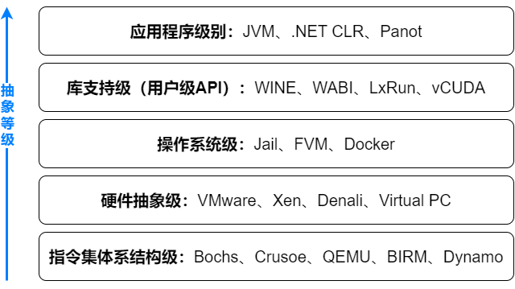
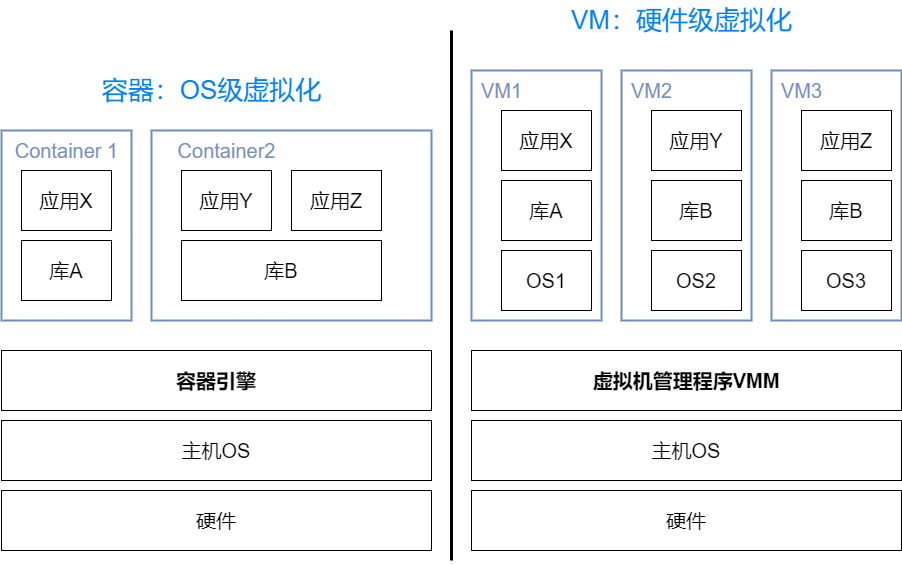
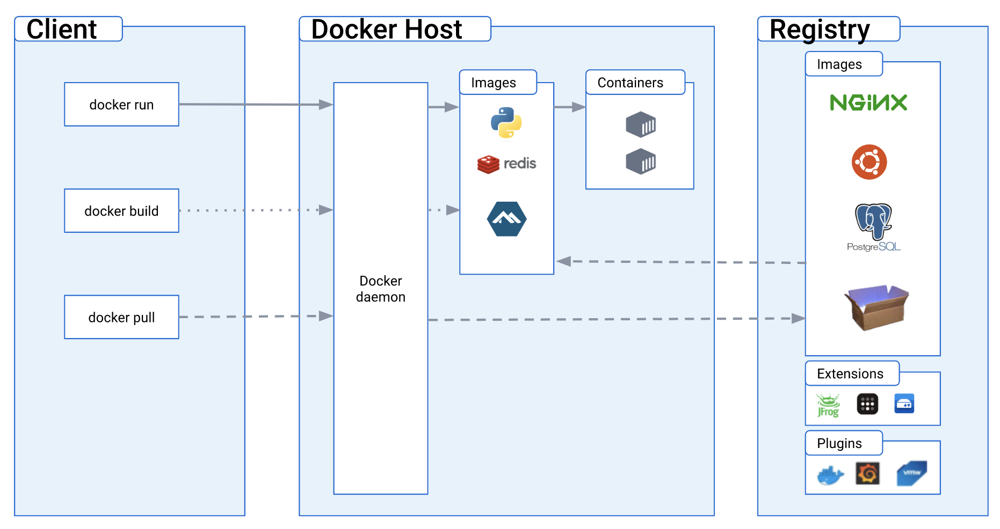

# Cloud System Engineering

## *Introduction*

### Benefits of Cloud Computing

> 云计算就是通过 Internet（以下统称“云”）提供计算服务（包括服务器、存储、数据库、网络、软件、分析和智能），以提供快速创新、弹性资源和规模经济。对于云服务，通常你只需使用多少支付多少，从而帮助降低运营成本，使基础设施更有效地运行，并能根据业务需求的变化调整对服务的使用 -- Microsoft Azure https://azure.microsoft.com/zh-cn/resources/cloud-computing-dictionary/what-is-cloud-computing

* Scalability 可扩展性
* Cost-effective
* Flexibility
* Reliability
* Collaboration

### Types of Cloud Computing

* Public cloud 公有云
* Private cloud 私有云
* Hybrid cloud 混合云

### Types of Cloud Service


* **Infrastructure as a Service** IaaS 包含云 IT 的基本构建块，IaaS provides virtualized computing resources。它通常提供对网络功能、计算机（虚拟或专用硬件）和数据存储空间的访问。IaaS 提供最高级别的灵活性，用户可以对 IT 资源进行管理控制。它与许多 IT 部门和开发人员熟悉的现有 IT 资源最为相似。IaaS is ideal when **complete control** over their computing environment is required。下面是几个最常见的 IaaS providers

  * AWS

    > Amazon Elastic Compute Cloud（Amazon EC2）提供最广泛、最深入的计算平台，拥有超过 500 个实例，可选择最新的处理器、存储、网络、操作系统和购买模型，以帮助您最好地满足工作负载的需求。我们是首家支持英特尔、AMD 和 Arm 处理器的主要云提供商，既是唯一具有按需 EC2 Mac 实例的云，也是唯一具有 400 Gbps 以太网网络的云。我们为机器学习培训提供最佳性价比，同时也为云中的每个推理实例提供了最低的成本。与任何其他云相比，有更多的 SAP、高性能计算 (HPC)、机器学习 (ML) 和 Windows 工作负载在 AWS 上运行。 -- AWS

  * Microsoft Azure

  * Google Cloud Platform

* **Platform as a Service** PaaS 无需管理底层基础设施（一般是硬件和操作系统），从而可以将更多精力放在应用程序的部署和管理上面。这有助于提高效率，因为用户不用操心资源购置、容量规划、软件维护、补丁安装或与应用程序运行有关的任何无差别的繁重工作。PaaS is ideal for organizations that want to focus on application development and deployment without having to manage the underlying infrastructure

  * Heroku
  * Google Appengine
  * Fly.io

* **Software as a Service** SaaS 提供了一种完善的产品，其运行和管理皆由服务提供商负责。在大多数情况下，人们所说的 SaaS 指的是最终用户应用程序（如基于 Web 的电子邮件）。使用 SaaS 产品，用户无需考虑如何维护服务或管理基础设施。用户只需要考虑如何使用该特定软件。SaaS is ideal for organizations that want to avoid the upfront costs and ongoing maintenance associated with traditional software applications

  * Salesforce, Microsoft Office 365, Google Workspace
  * Mail/Office tools, Customer relationship management CRM, Enterprise resource planning ERP

## *虚拟化与容器*

### 虚拟化层次

虚拟化技术 Virtualization 通过在同一个硬件主机上多路复用虚拟机的方式来共享昂贵的硬件资源，从而提高资源利用效率和应用程序灵活度。硬件资源（CPU、内存、IO）和软件资源（OS和库）可以在不同的功能层虚拟化




* 指令集体系结构级：使用物理主机的ISA（指令集架构 Instruction Set Architecture）模拟出另外一个ISA。效率极低，因为一条源指令只能需要数十条甚至上百条指令来实现
* 硬件抽象级：共用同一份硬件资源，通过Hypervisor或VMM（虚拟机监视器 Virtual Machine Monitor）这一种新增的处于硬件与不同OS之间的软件层来管理资源，最著名的就是全虚拟化的VMware和半虚拟化Xen
* 操作系统级：共用同一份操作系统资源，将部分系统资源隔离形成容器，最重要的应用之一就是用Docker来部署服务
* 库支持级：大部分应用程序使用用户级库的API而非系统调用，通过API钩子可以控制应用程序和其他系统部分之间的通信连接
* 应用程序级：也称为进程级虚拟化，虚拟化层本身就作为一个进程跑在OS上面，最典型的就是JVM

### 硬件系统级和操作系统级的虚拟化对比

也可以说是虚拟机和容器的对比



每个VM都需要一套完整的OS，在一个物理PC上能够同时运行的VM是很有限的

而容器非常轻量化。容器引擎 container engine负责启动及停止容器，作用和VMM比较相似

* 容器是对应用程序及其依赖关系的封装，属于操作系统级的虚拟化
* 容器解决的问题就是环境依赖造成部署困难的问题，或者说“程序能在我的OS上运行，但是在别人的OS上却运行不了”

容器的一个主要缺点在于所有容器共享主机的内核，所以容器只能运行与主机一样的内核

### 不同级别虚拟化性能的大致比较

下表中X越多，说明performance越好

| 实现级别 | 高性能 | 应用程序灵活性 | 实现复杂度 | 应用程序隔离性 |
| :------: | :----: | :------------: | :--------: | :------------: |
|  ISA级   |   X    |     XXXXX      |    XXX     |      XXX       |
|  硬件级  | XXXXX  |      XXX       |   XXXXX    |      XXXX      |
|   OS级   |  XXXX  |       XX       |    XXX     |       XX       |
| 用户库级 |  XXX   |       XX       |     XX     |       XX       |
|  进程级  |   XX   |       XX       |   XXXXX    |     XXXXX      |

### 实现虚拟化的工具

全虚拟化是指在虚拟机中模拟硬件的完整功能，包括CPU、内存、存储和网络等。在全虚拟化中，虚拟机不知道自己正在运行在虚拟化环境中，而是认为自己正在直接运行在物理硬件上。为了实现全虚拟化，需要对虚拟机操作系统的指令进行翻译，这会导致性能开销，因为每个指令都需要进行额外的处理。常见的全虚拟化技术包括VMware ESXi和Microsoft Hyper-V等。

半虚拟化是指虚拟机操作系统知道自己正在运行在虚拟化环境中，可以与虚拟化层进行交互，以实现更高的性能和更少的开销。在半虚拟化中，虚拟机操作系统会使用虚拟化层提供的API来访问硬件资源，而不是直接访问硬件。这减少了指令翻译的需要，并且能够更好地利用硬件资源。常见的半虚拟化技术包括Xen和KVM等。

因此，全虚拟化和半虚拟化之间的主要区别在于虚拟化的方式和性能开销。全虚拟化模拟完整的硬件功能，导致性能开销，而半虚拟化操作系统知道自己正在运行在虚拟化环境中，可以与虚拟化层进行交互，从而减少性能开销。

### 虚拟化种类

在一个Data center里面，一台服务器主要就是三个组成部分：Compute(CPU)、Storage(Disk or SSD)、Network。因此虚拟化也就着重在这三个层面

* Compute: VM or Container
* Network
* Storage https://www.redhat.com/zh/topics/data-storage/file-block-object-storage#
  * Object storage 对象存储
  * Block storage 块存储

## *Cloud software systems- Distributed systems in the cloud*

### 云计算和分布式系统的联系

"云计算" 是指将计算资源（如服务器、存储、网络等）通过网络连接，提供给用户使用的一种服务模式。而 "分布式系统" 则是指将多个独立的计算机或节点组成一个整体，以共同协作完成某项任务或提供某种服务

这两个概念的紧密关系在于，云计算通常是基于分布式系统实现的。云计算提供的计算资源往往来自于多个节点或服务器，这些节点可以在地理位置上分散，也可以在技术层面上分散，它们之间需要通过网络连接和协作完成任务。因此，云计算平台本质上就是一个分布式系统，通过对多个节点的统一管理和协调，向用户提供高效、可靠的计算资源服务

另外，分布式系统在实现过程中需要面对一些挑战，例如节点故障、网络延迟等，而云计算平台需要解决的问题也包括如何有效地管理和协调多个节点，保证系统的可靠性和高可用性等。因此，云计算和分布式系统在很多方面存在相似之处，二者的紧密关系在于，分布式系统提供了云计算实现的基础技术和理论支持，而云计算则在很大程度上推动了分布式系统的发展和应用

### 为什么让系统分布式？

* Inherently distributed
* For better reliability
* For better performance
* To solve bigger probelms 

### Challenges of a distributed system

* Fault tolerance
* Availability
* Recovery
* Consistency or correctness
* Scalability
* Security

### RPC

通常情况下，使用 socket 进行网络通信时，是通过发送和接收数据包来实现的，而不涉及到对远程计算机上的过程的调用。

而 RPC 则允许一个计算机程序通过网络调用另一个计算机程序中的子程序，这是一种更高层次的抽象，使得远程计算机上的过程可以像本地过程一样被调用，因此在实现远程过程调用时，RPC 是一个更为方便和高效的选择。RPC 底层使用的通信协议可以是 socket，也可以是其他的通信协议

序列化？Interface Definition Language 

## *Deployment Models in the Cloud*

Deployment: Process of delivering software from a development environment to a live environment

### Baremetal

安全性：数据库的部署

### virtual machines

### containers

### serverless

# 技术架构的演进

Baremetal 单机架构：应用服务和数据库服务共用一台服务器。出现在互联网早期，访问量比较小，单机就可以满足需求

# AWS

# Docker的使用

## *Docker简介*

Docker是一个开放平台，用于开发、发布和运行应用程序。 Docker允许用户将应用程序与基础架构分离，以便快速交付软件。使用Docker，用户可以以与管理应用程序相同的方式管理基础架构。通过利用Docker的代码快速发布、测试和部署方法，可以显著缩短编写代码和在生产环境中运行代码之间的延迟

### `Docker run` 命令的使用

```shell
docker run -i -t ubuntu /bin/bash
```

当键入上面的命令时，发生了下面这些事

1. 如果用户没有本地的ubuntu镜像，Docker会从用户配置的registry中拉取它，就像手动运行 `docker pull ubuntu` 一样
2. Docker创建一个新的容器，就像手动运行了 `docker container create` 命令一样
3. Docker为容器分配一个读写文件系统，作为其最终层。这允许正在运行的容器在其本地文件系统中创建或修改文件和目录
4. Docker创建一个网络接口，将容器连接到默认网络，因为用户没有指定任何网络选项。这包括分配容器的IP地址。默认情况下，容器可以使用主机机器的网络连接连接到外部网络
5. Docker启动容器并执行 `/bin/bash`。因为容器正在交互式地运行并附加到用户的终端（由于 `-i` 和 `-t` 标志），用户可以使用键盘提供输入，同时将输出记录到其终端
6. 当用户输入 `exit` 以终止 `/bin/bash` 命令时，容器停止但不被删除。用户可以再次启动它或将其删除

## *zDocker的命令*


### 镜像的命令

* `docker pull` 下载镜像。如果不写tag，就默认下载latest
* `docker rmi -f 镜像ide` 删除指定的镜像 
* `docker commit` 命令用于从容器的更改创建一个新的映像。将容器的文件更改或设置提交到新映像可能很有用

### 容器的命令

有了镜像才可以创建容器

* `docker run [可选参数] image`

  * --name="Name" 容器名字

  * -d 后台方式运行

  * -it 使用交互方式运行，进入容器查看内容。需要指定一个shell，比如 `/bin/bash`

  * -p 指定容器的端口

* `docker ps` 查看目前运行的容器

  * `docker ps -a` 查看运行过的所有容器
  * `docker ps -a -n=1` 查看最近运行过的1个容器
  * `docker ps -q` 显示容器编号

* 退出容器

  * exit 直接停止并退出容器
  * Ctrl+P+Q 容器不停止退出

* 删除容器 

  * `docker rm 容器id` 删除指定容器，不能删除正在运行的容器，若要强制删除，就用 `rm -f`
  * `docker rm -f $(docker ps -aq) ` 删除所有的容器

* 启动和停止容器的操作

  * 启动容器 `docker start 容器id`
  * 重启容器 `docker restart 容器id`
  * 停止当前正在运行的容器 `docker sotp 容器id`
  * 强制停止当前容器 `docker kill 容器id`

### 常用其他命令

* 后台启动容器
* 日志 `docker logs -f -t --tail NUM` 显示日志条数
* 查看容器中进程信息 `docker top 容器id`
* 查看镜像原数据 `docker inspect`

### 进入容器的命令和拷贝命令

* `docker exec -it 容器id shell`，进入容器后开启一个新的中断，可以在里面操作（常用）
* `docker attach 容器id`，进入容器横在执行的终端，不会启动新的进程
* `docker cp 容器id:容器内路径` 目的主机路径

## *Workflow*


编写Dockerfile -> build 生成 images -> run 形成 containers -> push 到远程库

### Dockerfile编写

https://docs.docker.com/engine/reference/builder/

https://docs.docker.com/build/building/packaging/#dockerfile

Cheatsheet: https://kapeli.com/cheat_sheets/Dockerfile.docset/Contents/Resources/Documents/index

Docker 可以通过读取 Dockerfile 中的指令自动构建镜像。Dockerfile 是一个文本文件，包含了用户可以在命令行上调用的所有命令，以组装镜像

```dockerfile
# Comment
INSTRUCTION arguments
```

Dockerfile的格式如上，它不是case-sensitive，但还是建议将指令写成大写的。**指令必须要从 `FROM` 开始**

* `FROM <image>`：指定初始镜像

  > An image’s **parent image** is the image designated in the `FROM` directive in the image’s Dockerfile. All subsequent commands are based on this parent image. A Dockerfile with the `FROM scratch` directive uses no parent image, and creates a **base image**.

* `RUN <command>`：在容器内执行指定的指令，并把结果保存下来

* `WORKDIR <directory>`：对任何后续的RUN、CMD、ENTRYPOINT、ADD或COP指令设置工作目录，该命令可以多次使用

* `COPY <src> <dest>`：把一个文件从主机的src拷贝到镜像文件系统的dest

* `CMD <command>`

  * 用来定义当启动基于某个镜像的容器时的默认程序
  * 每一个Dockerfile只能有一个CMD


## *用Java开发*

# Docker原理

## *Docker架构*



Docker采用CS架构。Docker客户端和Docker守护进程通信，后者负责build、run和分发Docker容器。Docker客户端和守护进程可以在同一系统上运行，或者可以将Docker客户端连接到远程Docker守护进程

Docker客户端和守护进程使用REST API通过UNIX套接字或网络接口进行通信。另一个Docker客户端是Docker Compose，它可以让用户使用由一组容器组成的应用程序

### 组成

* Docker daemon

  Docker 守护进程（dockerd）监听 Docker API 请求并管理 Docker 对象，例如镜像、容器、网络和volume。一个守护进程也可以与其他守护进程通信以管理 Docker 服务

* Client

  Docker 客户端（docker）是许多 Docker 用户与 Docker 交互的主要方式。当用户使用诸如 `docker run` 等命令时，客户端会将这些命令发送给 dockerd，后者会执行它们。docker 命令使用 Docker API。Docker 客户端可以与多个守护进程通信

* Registries 仓库

  Docker registry是存储Docker镜像的地方。Docker Hub是一个公共的registry，任何人都可以使用，而且Docker默认会在Docker Hub上寻找镜像。用甚至可以运行自己的私有registry

  当使用 `docker pull` 或 `docker run` 命令时，需要的镜像会从配置的registry中拉取。当你使用 `docker push` 命令时，用户的镜像会被推送到配置的registry中

### Docker 对象

Docker中有镜像、容器、网络、volume、插件等对象

* 镜像 image

  在运行容器时，它使用一个独立的文件系统。这个自定义的文件系统由一个容器镜像提供。由于镜像包含了容器的文件系统，所以它必须包含运行应用程序所需的一切——所有依赖项、配置、脚本、二进制文件等等。镜像还包含了容器的其他配置，如环境变量、默认运行命令和其他元数据

  **Docker镜像就好像是一个模版**，可以通过这个模版来创建容器服务，即通过镜像来创建容器服务

  用户可以创建自己的镜像，也可以仅使用由其他人创建并在注册表中发布的镜像。要构建自己的镜像，用户可以创建一个 **Dockerfile**，其中有一个简单的yaml语法来定义创建镜像和运行它所需的步骤。 Dockerfile 中的每个指令都会在镜像中创建一个层。当更改 Dockerfile 并重新构建镜像时，只有那些已更改的层会重新构建。这就是镜像相对于其他虚拟化技术轻量、小巧、快速的部分原因

* 容器 container

  一个容器就是在用户的计算机上运行的与主机机器上所有其他进程隔离的沙盒进程。该隔离利用了 Linux 内核名称空间和 cgroups 的功能，这些功能已经存在于 Linux 中很长时间。Docker 已经努力让这些功能易于使用和管理。总结一下，一个容器：

  * 是一个可运行的映像的实例。您可以使用 DockerAPI 或 CLI 创建、启动、停止、移动或删除容器
  * 可以在本地机器、虚拟机或云中运行
  * 可移植（可在任何操作系统上运行。
  * 与其他容器隔离，运行自己的软件、二进制文件和配置

## *Build*


instance 实例 一个虚拟机

# Swarm