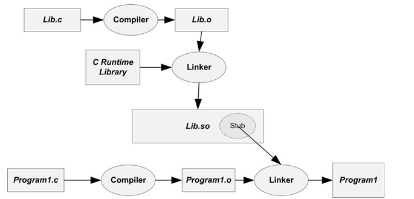
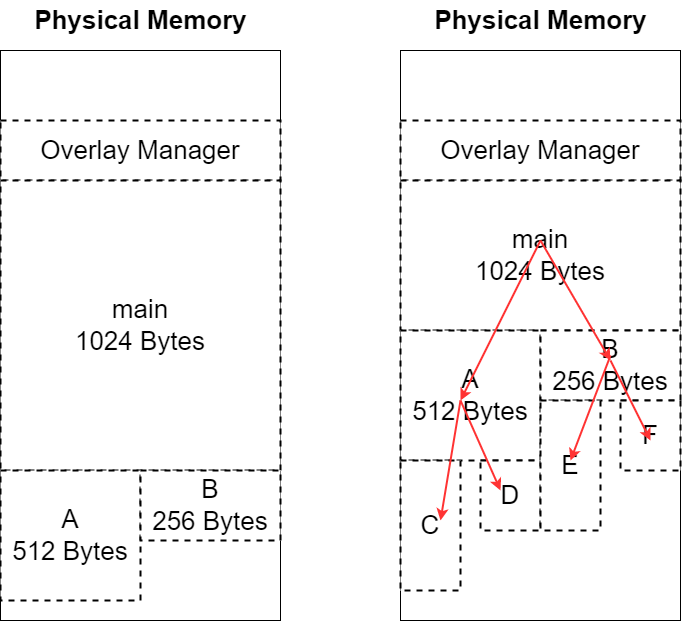

# 运算符 & 数据类型

## *C语言标准*

ANSI C `->` C99 `->` C11 `->` C17

1. C89（ANSI C）
   * 于1989年发布，是第一个被广泛接受的 C 语言标准
   * 引入了函数原型、标准头文件、void 指针等特性
2. C99 于1999年发布
   * 引入了新的数据类型，如`bool`、`int8_t`、`int64_t` 等
   * 支持单行注释（`//`）
   * 引入了变长数组、复杂声明、可变参数函数等新特性
3. C11 于2011年发布
   * 引入了多线程支持，包括线程、互斥锁、条件变量等
   * _Generic 关键字，泛型表达式支持
   * `_Noreturn` 关键字，用于指示函数不会返回
4. C17（C18）
   * 于2017年发布，但在某些情况下被称为 C18
   * 引入了`_Alignas` 和 `_Alignof` 关键字，用于对齐数据
   * 新增标准库函数，如 `strnlen`、`strlcpy`、`strlcat` 等

## *C语言数据类型*

### 数据类型分类

* 基本内置类型 Bulit-in type

  * 空类型 void
  * 算数类型
    * 整型
      * bool类型：C99引入了 `_Bool`，通常都用bool作为别名
      * 整数：short、int、long及其对应的无符号类型
      * 字符：char类型
    * 浮点型：float、double和long double
* 自定义数据类型：struct、union、enum
* 复合类型
  * 数组

  * 指针

  * Const

* 可移植类型：stdint.h和inttypes.h
* 其他类型

  * `size_t`：类型大小 `sizeof` 是C语言的内置运算符，以字节位单位给出指定类型的大小，C99和C11提供%zd转换说明匹配 `sizeof` 的返回类型。注意，`sizeof` 返回的是 `size_t` 无符号整型：为什么要使用 `size_t`？<https://jeremybai.github.io/blog/2014/09/10/size-t>，主要是考虑到可移植性和效率问题（C Primer Plus P84）
  * `ptrdiff_t`
  * 独立于平台的控制宽度的整数类型
  * 特定于平台的整数类型

### 字面值

在编程中，字面值 literal 是表示数据常量的编码表示。字面值表示了数据的具体值，通常不需要进一步计算或处理，而是直接表示一个特定的常量值。在C++和其他编程语言中，字面值用于初始化变量、赋值、传递参数等情况。

C++中常见的字面值包括以下几种

* 整数字面值：表示整数值的字面值。例如：`42`, `-10`, `0xFF`
* 浮点数字面值：表示浮点数值的字面值。例如：`3.14`, `-0.01`, `2.0e6`
* 字符字面值：表示单个字符的字面值。用单引号括起来，例如：`'A'`, `'5'`, `'!'`
* 字符串字面值：表示字符串的字面值，用双引号括起来，例如：`"Hello, World"`, `"C++"`
* 布尔字面值：表示布尔值的字面值，有`true`和`false`两个选项
* 空指针字面值：用于表示空指针的字面值，通常用于指针操作
* 用户定义字面值：C++允许用户定义自己的字面值，以扩展语言的功能

### 类型安全

类型安全是指程序设计语言的一个特性，它确保在程序中的编译时或运行时阶段，类型的一致性得到维护。简而言之，类型安全可以防止在程序中发生一些常见的类型错误

在类型安全的编程语言中，变量、对象、表达式等都具有明确定义的类型，并且编译器或解释器会强制确保这些类型在程序执行过程中得到正确的使用。这样做的目的是减少程序中的错误，并提高代码的可靠性和可维护性。

* 一些静态类型语言（如Java、C++、Swift）在编译时进行类型检查，通过在编译期间检查类型的一致性来防止类型错误

  ```java
  public class TypeSafetyExample {
      public static void main(String[] args) {
          // 声明一个整数变量
          int x = 10;
  
          // 尝试将整数变量赋给字符串变量（编译时错误）
          // 这会导致编译器报错，因为类型不匹配
          String str = x; // 编译错误: Type mismatch
      }
  }
  ```

* 动态类型语言（如Python、JavaScript）通常在运行时进行类型检查，以确保变量在使用时具有正确的类型

  ```python
  # 声明一个整数变量
  x = 10
  
  # 尝试将整数变量赋给字符串变量（运行时错误）
  # 在运行时才会发现错误，因为Python是动态类型语言
  str_value = x  # 运行时错误: TypeError
  ```

在类型安全的环境中，如果程序员试图执行不安全的类型转换或操作，编译器或解释器会发出警告或错误，从而帮助识别和修复潜在的问题。这有助于减少在运行时发生的类型相关错误，提高代码的可靠性

## *运算符、表达式和语句*

### 临时变量

计算机并不认识操作符，所有的实现都需要借助临时变量，因此除了单目操作符和赋值操作符（生成的临时变量中存储的值会给左边）外，其他的操作符的结果都不会改变左边的原值。同时通过临时变量也会发生类型转换

### 操作符

* 算术操作符：`+ - * / %`

* 移位操作符 shift operator：
  * 左移 `<<`：规则为左边抛弃，右边补0
  * 右移 `>>`：右移操作符具体采用算数移位还是逻辑移位取决于编译器
    * 逻辑移位：左边用该值的符号位填充，右边抛弃
    * 算术移位：右边抛弃，左边补0。算数移位主要是为了实现快速的除以2的幂
  * 对于移位运算符，不要移动负数位，这是C语言标准未定义的，比如 `num >> -1`
  
* 位操作符：`& | ^`，其中 `^` 由于其特殊的性质，因此使用非常巧妙
  * `^`性质（只有整数异或有）
    
    * `a^a=0` 相同的偶数个数字异或=0
    * `a^0=a` 一个数和0异或等于原数
    * 可以推得相同的奇数个数字异或=原数
  * 应用场景
    * 不能创建临时变量实现两个数的交换（这个方法速度很快，但只能作用于整数）
  
        ```c
        a = a ^ b;
        b = a ^ b; // b == a^b^b == a
        a = a ^ b; // a == a^b^a^b^b == b
        ```
  
    * 找单身狗问题：一个数组中只有一个数字出现了一次，其他都出现了两次，找出这个数字。利用第二条性质
  
        ```c
        int arr[9] = { 1,1,2,3,3,4,4,5,5 };
        int sz = sizeof(arr) / sizeof(int);
        int ret = 0;
        for (int i = 0; i < sz; i++)
        {
            ret ^= arr[i];
        }
        printf("ret: %d\n", ret);
        ```
  
    * 利用 `&` 求一个整数存储在内存中的二进制中1的个数：`if (1 == (num>>i) & 1) count++`
  
* 逻辑操作符：`&& ||` 的**短路原则 short-circuit evaluation**：`&&` 从左到右进行检测，若左边的条件不满足，后面的就不需要运算了，利用该性质可以简化一些算法

* 赋值操作符：`= -= += *= /=`
  * 注意两个字符串之间不能使用 `==` ，其比较的将会是首字符的地址，要使用专门的 `strcmp`
  
  * ⚠️同一行赋值会有坑
  
    ```c
    int x, y = 2; // 只会赋值y，x被默认初始化为0
    // 想要同时赋值
    int x = 2, y = 2;
    // or
    int x = 2;
    int y = x;
    ```

  * 赋值操作符的返回结果是最左边的值，下面的例子中，a赋值给c，c赋值给b，最终return的值为b
  
    ```c
    int test()
    {
        int a = 2;
        int b = 3;
        int c = 4;
        return b = c = a;
    }
    ```
  
* 单目操作符：`! - + & sizeof ~ -- ++ * (强转)`

* 关系操作符：`> == != <`

* 条件操作符：`exp1 ? exp2 : exp3`

* 逗号表达式：从左到右依次执行，整个表达式的结果为最后一个表达式的结果

* 下标引用、函数调用和结构成员：`[] () . ->`

### 舍入问题

C语言的整数除法是向零舍入的，也就是说余数若是正数就向下舍入，余数若是负数就向下舍入

在支持IEEE浮点数标准的机器上默认向偶数舍入的，但是C语言标准并没有规定机器必须使用IEEE浮点数标准

`<math.h>` 还提供了一些函数实现其他的舍入功能

* `round()`：将传入的小数四舍五入为最接近的整数
* `floor()`：将传入的小数向下取整为最接近的整数
* `ceil()`：将传入的小数向上取整为最接近的整数

一种常用的四舍五入的写法是将小数加上0.5，然后将其强转为整数

```c
float num = 2.6;
int result = (int)(num + 0.5);
```

### 优先级 Operator Precedence

* 只有对所有编译器唯一确定运算顺序的运算才是正确的，在一个语句里用太多的自加自减会引起混乱。仅仅有操作符的优先级和结合性是无法唯一确定某些表达式的计算路径的
* 优先级表<http://c.biancheng.net/view/161.html>

### 类型转换 Type Conversion

* 自动类型转换/隐式类型转换 implicit conversion：编译器在编译阶段自动进行，能转就转，不能转就编译失败，**类型转换的特征是会产生临时变量**
  * 算术转换（长度大于int）arithmetic conversion
  
    * 转换级别 conversion rank若操作符的各个操作数属于不同的类型，那么编译器会自动按照类型转换从低到高顺序的进行算术转换
  
      * 无符号数的rank不低于其对应的有符号数，因此如果是同级别的有符号整型和无符号整型碰在一起，要把有符号整型隐式转换为无符号整型
      * `char/signed char/unsigned char ` 是同级别的
      * bool型的rank是最低的
      * 浮点数的rank高于整型
  
      ```
      bool -> char/signed char/unsigned char -> short -> unsigned short -> int -> unsigned int -> long -> unsinged long -> long long -> unsigned long long -> float -> double -> long double
      ```
  
    * 算术转换时内存中二进制表示的值没有变，只是计算机解释值的方式变了。隐式类型的转换各种赋值操作符的两侧（`>=` 这种也是），这里有一个经典的错误可以看Cpp.md的string类模拟实现部分的insert部分
  
  * 整型提升（长度小于等于int）integer promotion：整型提升是按照变量的数据类型的符号位来提升的
  
    整数提升保留值，其中包括符号。如果在所有的原始值中，较小的类型可以被表示为一个int，那么
  
    * 有符号数
      * 负数的整型提升：高位补充1
      * 正数的整型提升：高位补充0
    * 无符号数：高位补充0
  
  * 截断：前面的都是属于小范围类型转换为大范围类型，截断是当大范围类型转换为小范围类型
  
  * 其他隐式类型转换
    * 数组名自动转换为指向数组首元素的指针（除sizeof外）
    * 指针转换
    * 转换成布尔类型：0转换为flase，否则转换为true
    * 转换成常量（权限缩小）
    * 类类型定义的转换
  
* 强制类型转换/显式类型转换 `(int)a`：需要用户自己处理。关于C++对强制类型转换的修改看 Cpp.md

* 一道例题

    ```c
    char c1 = 3;
    // 0000 0011
    char c2 = 127;
    // 0111 1111
    char c3 = c1 + c2;
    // char整形的赋值运算要进行整型提升
    // 00000000 00000000 00000000 00000011
    // 00000000 00000000 00000000 01111111
    // 00000000 00000000 00000000 10000010 结果
    // 运行完后结果被截断为 10000010存放到char c3中
    printf("%d\n", c3);
    // 以整形打印，进行整型提升
    // 11111111 11111111 11111111 1000010（补）
    // -> 11111111 11111111 11111111 1000001 -> 10000000 00000000 0000000 01111110（原） = -126
    ```

**类型转换的特征是会产生临时变量**，而临时变量具有常性

```cpp
int i = 0;
double d = i;
//double& rd = i; //错误，引用的不是i，而是由于类型转换所以i产生的中间变量
const double& rd = i; //正确
const double& rd = static_cast<double>(i); //C++规范写法

//---------------------
class A {};
class B : public A {};
B bb;
A aa1 = bb;
A& ra1 = bb; //向上转换切片，所以没有产生中间变量，也就不需要const了
```

# 循环 & 分支

## *循环 Loop*

* while循环是最早出现的

* for循环是后期产生的，将控制变量的初始化、条件判断、循环条件的调整集成到一起

  ```c
  for (初始化表达式; 循环条件; 循环后操作) {
      // 循环体
  }
  ```

  所以有时候可以扩展到用两个变量同时控制

  ```c
  for (int i = 0, j = 0; i < n && j < n; i++, j++) {
      if (board[i][j] == "Q" && (i != row && j != col)) return false;
  }
  ```

* do while循环至少进行一次，使用场景有限

## *分支和跳转*

### if语句：0表示假，其余为真（包括负数）

* 多重选择 else if
* else与if的配对：else与离它最近的if配对，除非最近的if被花括号括起来了
* 多层嵌套的if语句

### 循环辅助

* continue：执行到该语句时，会跳过本次迭代的剩余部分，并开始下一轮迭代。若continue语句在嵌套循环内，则只会影响包含该语句的内层循环
* break：终止（跳出）当前循环，并继续执行下一阶段的代码。若是在嵌套循环内，break只会跳出当前层循环，一个break只能跳一层
* return：return直接跳出多重循环，将值return给外面调用的接收者
* continue和break在迭代中可以终止当前层的迭代

### 多重选择：switch和break

* 程序根据整形表达值跳转至相应得case标签处，然后执行剩余的**所有语句**，除非遇到break语句跳出。表达式和case标签都必须是**整数值**（包括char），标签必须是常量或完全由常量组陈给的表达式。如果没有case标签与表达式匹配，控制则转至标有default的语句（如果有的话）；否则将转至执行紧跟在switch语句后面的语句
* switch语句中的break：如果不使用break将无法实现分支，因为如果不用break将会顺序执行
* default：如果所有的case标签都不匹配，那么将会跳过这个switch结构，因此最好写上一个default语句

    ```c
    int main() {
        int day = 0;
        switch(day) {
            default:
                printf("Wrong Input!\n");
                break;
            case 1:
            case 2:
            case 3:
            case 4:
            case 5:
                printf("Workday.\n");
                break;
            case 6:
            case 7:
                printf("Weekend.\n");
                break;
        }
        return 0;
    }
    ```
    
* 如果表达式是浮点型或者范围，那么就不能使用switch，用if else结构方便

## *无条件转移*

### 局部跳转goto

`goto` 是C语言中的关键字，用于无条件地将控制转移到程序中的标签位置。尽管 `goto` 在编程中有一些争议，并且在大多数情况下被认为是不推荐使用的，但在某些情况下，它仍然可以提供一种简洁的控制流

```c
goto label;

// ...

label:
    // 语句
```

虽然 `goto` 可以在一些特殊情况下提供简便的解决方案，但过度使用它可能导致代码难以理解、维护和调试。在现代编程中，通常更推荐使用结构化的控制流语句（如 `if`、`for`、`while`）来实现逻辑

### 非局部跳转/长跳转

goto 语句存在一个限制，即不能从当前函数跳转到另一函数

库函数 `setjmp()` 和 `longjmp()` 可执行非局部跳转 nonlocal goto。非局部 nonlocal 是指跳转的目标为当前执行函数之外的某个位置

```c
#include <setjmp.h>
int setjmp(jmp_buf env);
			// Returns 0 on initial call, nonzero on return via longyjmp()
void longjmp(jmp_buf env, int val);
```

setjmp 为后续由 longjmp 执行的跳转确立了跳转目标。该目标正是程序发起 `setjmp()` 调用的位置

setjmp 把当前进程环境的各种信息保存到 env 参数中

长跳转只有在极少数的时候能用上，比如说系统编程的信号相关的处理。平时能避免使用就避免使用

# 数组和指针

## *数组*

### 数组创建、初始化与访问

* 数组是一组相同类型元素的集合

* 全局变量建立在静态区和常值区，自动初始化为0；局部变量若不初始化则为随机值（也就是函数体内默认不初始化）

    ```c
    int arr1[10] = {0};
    int arr2[10] = {1, 2, 3, 4, 5}; // 不完全初始化，剩余的编译器会给0
    char arr2[] = {0};
    char arr3[] = "Hello"; // 编译器会自动给数组大小，此时编译器会自动添加最后一个元素'\0'
    char arr3[] = {'H', 'e', 'l', 'l', 'o'}; // 编译器会自动给数组大小，此时最后一个元素是'o';
    int arr4; // 自动初始化为0
    int n = 6;
    int arr5[n]; // C99允许变长数组

    int main()
    {
        int arr6[6]; // 随机值
        return 0;
    }
    ```

* 计算数组大小

    ```c
    int sz = sizeof(arr)/sizeof(int)
    ```

* 二维数组的创建，以2行3列的二维数组 $\left[\begin{array}{c}1&2&3\\4&5&6\end{array}\right]_{2\times 3}$ 为例

    ```c
    int arr[2][3] = {1, 2, 3, 4, 5, 6};
    int arr[4][5] = {1, 2, 3, 4, 5, 6}; // 不完全初始化
    int arr[2][3] = {{1, 2, 3}, {4, 5, 6}};
    int arr[][3] = {{1, 2, 3}, {4, 5, 6}}; //二维数组如果有初始化，行可以省略，列不能省略
    ```

* 二维数组在内存中也是连续存放的

    

* 特别注意，二维数组如果有初始化，行可以省略，列不能省略。因为二维数组在内存中的排列是如上图所示，将每行数组按列顺序排放，所以需要列的大小来确定每行数据在内存中的间隔。

### 数组的访问与越界

* 访问数组元素使用下标引用操作符 `[]`，数组下标从0开始
* 数组在内存中以顺序表的方式地址由低到高连续存放，在特征决定了数组可以通过下标和指针运算访问
* 当访问的下标超过数组的大小范围时数组越界
  * 编译器并不一定会报错，但这仍然是错误的，若使用会引起其他错误
  * 编译器对数组越界的检查类似于警察查酒驾的抽查，只检查重点路段，即只检查容易犯错的点，比如数组后一位、后两位。具体规则视不同的编译器而定。而且只针对越界写，不检查越界读
* 编译器的特殊规定：允许指向数组元素的指针与指向数组最后一个元素后面的那个内存位置的指针进行比较，但是不允许与指向第一个元素之前的那个内存位置的指针进行比较

### 数组作为函数参数

* **数组不允许拷贝和赋值**：不能将数组的内容拷贝给其他数组作为初始化，也不能用数组为其他数组赋值
* 数组名默认代表的是首元素的地址，但有如下两个**例外**

  * `sizeof(数组名)`，此时数组名代表的是整个数组，`sizeof`计算的是整个数组的大小
  * `&数组名`，取出的是整个数组的地址，从下图的 `&arr` 和 `&arr+1` 的结果可知其取得是整个数组的地址
* 数组名是数组首元素的地址：下图的验证可以看到，`arr` 和 `&arr[0]` 结果完全一致

  

  注意：虽然 `arr` 和 `&arr` 地址是一样的，但是它们是两个概念，前者是首元素地址，而后者是整个数组的地址，这从对它们进行+1运算就可以看出结果是不同的

  因为不能拷贝数组，所以不能通过值拷贝的方式来传参。因此当为函数传递一个数组时，实际上传递的是指向数组首元素的指针（自动转换）
* 例子：冒牌排序传数组时产生的错误
  * [ ] 错误：只传入 `arr`，此时传入的是 `arr` 的首元素地址，因此 `sz==1`

    ```c
    void bubble_sort(int* arr) 
    {
        int sz = sizeof(arr)/sizeof(int);
        // Bubble Sort...
    }
    ```

  * [x] 正确：同时传入 `arr` 和 `sz`

    ```c
    // 本质上传入的是 void bubble_sort(int* arr)
    // 写成数组形式 void bubble_sort(int arr[]) 只是为了让语法上更容易理解（本人感觉并没有更容易理解）
    void bubble_sort(int* arr, int sz) {/* Bubble Sort...*/}
    int main()
    {
        int arr[] = {};
        int sz = sizeof(arr)/sizeof(int);
        bubble_sort(arr, sz);
        return 0;
    }
    ```

* 数组传参的3种方式

  * 使用标记指定数组长度，即字符串数组用一个 `'\'` 来表示数组结尾
  * 使用标准库的迭代器规范：同时传递首指针和尾后指针
  * 显示传递一个表示数组大小的行参


## *指针 Pointer*

### 概念

* 指针变量是用来存放地址的变量
* 一个指针的大小取决于是64位编译模式还是32位编译模式，32位的指针变量为4字节，64位的则为8字节。和机器的位数并没有直接关系

### 指针类型

* 指针的运算
  
  
  
  指针类型决定了指针变量在运算时每一步的大小
* 指针的解引用/间接引用 Dereference：指针的类型决定了，对指针解引用的时候能操作几个字节；通过变量名直接引用变量，由系统自动完成变量名和其存储地址之间转换的方式，称为变量的直接引用/直接访问方式

### 野指针 Wild Pointer

* 概念：野指针就是指针指向的位置是不可知的，随机的（此时页表没有维护对应的物理地址映射）
* 成因
  * 指针未初始化
  * 指针越界访问
  * 指针指向的空间被释放
* 避免产生野指针的方法
  * 指针初始化
  * 避免越界
  * 指针指向空间被释放后使指针指向 `NULL`
  * 避免返回局部变量的地址，因为局部变量所在的块栈帧销毁时空间被返回系统
  * 指针使用之前检查有效性

    ```c
    if (p == NULL)
    {
        perror("Wild Pointer");
        exit(-1);
    }
    ```

### 指针运算

* 指针+-整数

    ```c
    int arr[10] = {0};
    int *ptr = arr;
    ptr + 2 == arr[2]
    ```

* 指针-指针的绝对值=中间相差的字节个数/单个指针所指向数据类型的字节数，也就是元素个数，这是编译器的特殊规定
  
  
  
  前提是两个指针必须指向的是同一块内存空间
* 指针的关系运算
* 指针访问数组元素的两种方式
  * `*(ptr + 3)`
  * `ptr[3]`

### 应用：sizeof 的实现

sizeof 是用宏定义实现的运算符，它不是一个函数，在使用的时候加不加括号都行。**实现原理就是利用了不同类型的指针的步长是不同的**

* 非数组的 sizeof

  ```c
  #defne _sizeof(T) ( (size_t)((T*)0 + 1))
  ```

* 数组的 sizeof

  ```c
  #define array_sizeof(T)   ( (size_t)(&T+1)  - (size_t)(&T)  )
  ```

### 保护数组中的数据：const限定符的作用

看Cpp.md中的总结

### 二级指针 Pointer to Pointe

指针的指针，当要改变的是指针本身时，需要传二级指针

### 指针数组 Array of pointers `int* arr[]`

```c
int data1[] = { 1,2,3,4,5 };
int data2[] = { 2,3,4,5,6 };
int data3[] = { 3,4,5,6,7 };

int* arr[3] = { data1, data2, data3 }; // 指针数组是一个数组，不是指针
```

## *`restricted` 优化*

如何理解C语言关键字restrict？ - Milo Yip的回答 - 知乎
https://www.zhihu.com/question/41653775/answer/92088248

当两个或以上的指针指向同一数据的时候称为 pointer alasing，比如

```c
int i = 0;
int *a = &i;
int *b = &i;
```

```c
int foo (int *x, int *y) {
    *x = 5;
    *y = 6;
    return *x + *y;
}
foo(a, b); // 得到12
```

如果用上面的这个函数调用foo得到的是12。为了保证结果正确，编译器需要在 `*y=6` 改变了值之后重新读取 `*x` 指向的值

```assembly
foo:
	movl $5, (%rdi)   # 存储 5 至 *x
	movl $6, (%rsi)   # 存储 6 至 *y
	movl (%rdi), %eax # 重新读取 *x（因为有可能被上一行指令造成改变）
	addl $6, %eax     # 加上 6
	ret
```

如果不重新读取的后果就是取到的 `*x` 是旧值 5，返回的是11，在这个函数调用的语境下，结果是不正确的

restrict 是为了告诉编译器额外信息（两个指针不指向同一数据），从而让编译器来优化机器码

```c
int rfoo (int *restrict x, int *restrict y) { /**/ }
```

```assembly
rfoo:
	movl $11, %eax # 在编译期已计算出 11
	movl $5, (%rdi) # 存储 5 至 *x
	movl $6, (%rsi) # 存储 6 至 *y
	ret
```

注意：如果声明了restrict但仍然是pointer aliasing，则是一种未定义的情况，不要这么做！

> 以个人经验而言，编写代码时通常会忽略 pointer aliasing的问题。更常见是在性能剖测时，通过反编译看到很多冗余的读取指令，才会想到加入restrict 关键字来提升性能。

## *字符指针*

### 字符指针的定义


`"abcedf"` 是一个开在常量区的字符串，ptr指向该字符串的首字符 `'a'`

### 常量字符指针与字符数组的区别


* `const char* p` 是一个指向常量区字符串首字符的指针，常量区对于完全一样的字符串只会开一个。证据就是上图中ptr1和ptr2的地址相同，都指向常量区中的 `abcdef\0`
* `char arr[]` 则是栈区中一个新的字符串数组，它是把 `abcdef\0` 拷贝过来，所以 arr1 和 arr2 的地址是不同的

## *数组指针 Pointer to Array*

### 数组指针的定义

* `int (*p)[10]`，其数据类型是 `int (*)[10]`，**`[]` 是类型的一部分！**
* p先和 `*` 相结合，说明p是一个指针变量，然后指向一个大小为10个整形的数组，所以p是一个数组指针
* 这里要注意 **`[]` 的优先级高于 `*`**，所以必须加上 `()`来保证p先和 `*` 结合
* 辨析：技巧在于通过操作符的优先级来判定。以最后一个为例。`[]` 操作符的优先级最高，因此paar必定先和 `[]` 结合，因此它必然是一个10元素的数组，然后可以将 `paar[10]` 去掉，得到的元素类型是 `int (*)[5]`，`*` 的优先级此时高于 `[]`，因此它是一个指向5个int数据的数组指针，合起来就是数组指针数组
  * `int arr[5]`：arr是一个整形数组，数组中有5个int数据
  * `int* parr[5]`：paar是一个指针数组，数组中有5个int*数据
  * `int (*paar)[10]`：paar是一个数组指针，指向的是有10个int元素的数组
  * `int (*paar[10])[5]`：paar是一个数组指针数组，数组中有10个元素，每个元素是由5个数组指针的数组

### 数组指针的使用

* 数组指针在一维数组传参不实用，不如直接使用数组名进行传参

    ```c
    // 这种方式并不好，多次解引用兜了一个大圈子
    void print1(int(*p)[10], int sz) {
        for (int i = 0; i < sz; i++)
            printf("%d ", *(*p + i)); // 对数组指针解引用得到的就是数组名，也就是首元素的地址
        printf("\n");
    }
    
    // 直接遍历加法
    void print2(int* arr, int sz) {
        for (int i = 0; i < sz; i++)
            printf("%d ", arr + i); // 对数组指针解引用得到的就是数组名，也就是首元素的地址
        printf("\n");
    }
    
    int main() {
        int arr[10] = { 1,2,3,4,5,6,7,8,9,10 };
        int sz = sizeof(arr) / sizeof(int);
        print1(&arr, sz);
        print2(arr, sz)
    
        return 0;
    }
    ```
    
* 数组指针可以用在二维数组的传参中

    ```c
    void print(int(*p)[5], int row, int col) {
        for (int i = 0; i < row; i++) {
            for (int j = 0; j < col; j++) {
                // p+i是指向第i行的
                // *(p+i)相当于是拿到指向第i行的，也就是相当于第i行的首元素
                // 实际上 p[i][j]也是转换成这种形式的解引用进行计算的
                printf("%d ", *(*(p + i) + j));
            }
            printf("\n");
        }
    }
    
    int main() {
        int arr[3][5] = { {1,2,3,4,5},{2,3,4,5,6},{3,4,5,6,7} };
        int row = sizeof(arr) / sizeof(arr[0]);
        int col = sizeof(arr[0]) / sizeof(int);
        print(&arr, row, col);
    
        return 0;
    }
    ```

## *数组参数、指针参数*

* 数组形式传参：形参写成数组形式：一维数组传参时形参部分的数组大小可以写上，也可以省略，甚至写错也没事（不建议），因为传参时传的是数组首元素地址，不会创建新的数组，因此写多少都没有意义。写成数组形式只是形式上统一，方便阅读和理解
* 指针/地址形式传参：形参写成地址形式，这是数组传参的本质。个人比较喜欢这种传参方式

## *函数指针相关*

### 函数指针 Handler

```c
int Add(int x, int y);
// Add和&Add都是函数地址
int (*pf)(int, int); // 函数指针的类型
```

* 函数名本身和&函数名都是函数地址
* 调用函数时 `*pf(2, 3)` 和 `pf(2, 3)` 结果是一样的，此时 `*` 没有影响

### 函数指针数组

```c
int Add(int x, int y);
int Sub(int x, int y);
int Mul(int x, int y);
int Div(int x, int y);

int (*pf1)(int, int) = Add;
int (*pf2)(int, int) = Sub;
int (*pf3)(int, int) = Mul;
int (*pf4)(int, int) = Div;

int (*pf[4])(int, int) = {Add, Sub, Mul, Div} // 函数指针数组初始化
int (*(*pf[4]))(int int) // 指向函数指针数组的指针
```

### 回调函数 Callback/谓词 predicate

以C库里的qsort函数为例，参数中的 `compar` 是一个函数指针，需要用户自己实现

```c
void qsort (void* base, size_t num, size_t size,
            int (*compar)(const void*,const void*));
```

**回调函数就是一个通过函数指针调用的函数**。若把函数指针（地址）作为函数参数传递给另一个函数，这个动作称为登记回调 register a callback，当这个函数指针被用来调用其他所指向的函数时，称其为回调函数 callback

回调函数不是由该函数的实现方直接调用，而是在特定的事件或事件发生时由另外的一方来调用，用于对该事件或条件进行响应

注意：传参的时候传的只是函数指针对象 `cmp` ，不是函数callback `cmp(x1, x2)` 。主调函数进行传参的时候需要把回调函数的参数一同传入，然后再主调函数内部通过callback的handle（也就是函数指针）来进行callback

```c
void callback(int a, int b);
void handle(int a, int b, void (*callback)(int, int))
{
    //...
    callbcak(a, b);
}
```

### 函数指针的类型别名

给函数指针起类型别名特别的反直觉，和对普通类型起别名不一样

```c++
typedef bool (*fooPtr)(int, int); // foo3Ptr == bool (*)(int, int)
typedef bool foo(int, int); // foo == bool (int, int)
// 推荐使用C++11的方式
using fooPtr = bool (*)(int, int);
using foo = bool (int, int)
```

## *数组相关机器代码*

### 一维数组和多维数组

### C99变长数组

```c
long vframe(long n, long idx, long *q)
{
    long i;
    long *p[n];
    p[0] = &i;
    for (i = 1; i < n; i++)
        p[i] = q;
    return *p[idx];
}
```

## *可变参数列表函数*

### 使用

[(53条消息) va_list 原理以及用法_va_list 需要什么_L_Jason先生的博客-CSDN博客](https://blog.csdn.net/ID314846818/article/details/51074283)

```c
#include <stdarg.h>
void va_start(va_list ap, last);  //允许访问可变参数函数参数（函数宏）
type va_arg(va_list ap, type); //访问下一个可变参数函数参数（函数宏）
int vsnprintf (char * s, size_t n, const char * format, va_list arg );
void va_end(va_list ap); //结束可变参数函数参数的遍历（函数宏）
void va_copy(va_list dest, va_list src);
```

`<stdarg.h>` 为函数提供了可变参数，它用 `...` 来代表，比如 `void logMessage(int level, char *format, ...)`

它的使用步骤如下

1. 提供一个最后一个参数（parmN后的参数）是 `...` 的函数原型
2. 在函数中定义一个`va_list` 型的变量，这个变量是指向参数的指针
3. 然后用 `va_start` 宏，初始化刚定义的 `va_list` 变量
4. 返回可变参数有两种方式
   * 用 `va_arg` 宏，返回可变的参数
     * 函数原型中必须有一个参数是给出参数的数量
     * `va_arg` 的第二个参数是寻找的参数的类型
     * 若函数有多个可变参数的，依次调用 `va_arg`获取各个参数
   * 用 `vsnprintf` 将格式化数据从可变参数列表写入缓冲区
5. 最后用 `va_end` 宏，清理并结束可变参数的获取

下面给出分别用 va_arg 和 vsnprintf的两种使用方式

* va_arg

  ```c
  #include <stdio.h>
  #include <stdarg.h>
  
  // 可变参数函数示例
  int sum(int num, ...) {
      int result = 0;
      // 定义一个va_list类型的变量args
      va_list args;
      // 初始化args，使其指向参数列表的第一个参数
      va_start(args, num);
  
      // 遍历参数列表
      for (int i = 0; i < num; ++i) {
          // 从参数列表中获取一个参数
          int value = va_arg(args, int);
          // 累加参数值到结果
          result += value;
      }
      // 结束对参数列表的访问
      va_end(args);
      return result;
  }
  
  int main() {
      // 调用可变参数函数，传递不定数量的参数
      int result1 = sum(3, 1, 2, 3);
      int result2 = sum(5, 10, 20, 30, 40, 50);
      // 输出结果
      printf("Result 1: %d\n", result1);
      printf("Result 2: %d\n", result2);
  
      return 0;
  }
  ```

* vsnprintf

  ```c
  #include <stdio.h>
  #include <stdarg.h>
  
  // 使用vsnprintf格式化字符串的函数示例
  void formatString(char *result, size_t size, const char *format, ...) {
      va_list args;
      // 初始化args，使其指向参数列表的parmN
      va_start(args, format);
      // 使用vsnprintf格式化字符串
      vsnprintf(result, size, format, args);
      // 结束对参数列表的访问
      va_end(args);
  }
  
  int main() {
      char buffer[100];
      // 使用formatString函数格式化字符串
      formatString(buffer, sizeof(buffer), "This is a formatted string with %d and %s.", 42, "parameters");
      // 输出结果
      printf("Formatted string: %s\n", buffer);
  
      return 0;
  }
  ```

### 原理

call函数时从右向左建立栈帧传参，最多可以用寄存器传递6个参数，大于6个的通过栈来传参，自函数要通过rsp和偏移来取用多余的参数

C语言中可变参数函数实现原理 - 何处不江南的文章 - 知乎
https://zhuanlan.zhihu.com/p/26712052

```c
typedef  char *  va_list;
/*
   Storage alignment properties -- 堆栈按X对齐
*/
#define  _AUPBND        (sizeof (X) - 1) 
#define  _ADNBND        (sizeof (X) - 1)
 
/* Variable argument list macro definitions -- 变参函数内部实现需要用到的宏 */                  
#define _bnd(X, bnd)    (((sizeof (X)) + (bnd)) & (~(bnd)))
#define va_start(ap, A)  (void) ((ap) = (((char *) &(A)) + (_bnd (A,_AUPBND))))
#define va_arg(ap, T)   (*(T *)(((ap) += (_bnd (T, _AUPBND))) - (_bnd (T,_ADNBND))))
#define va_end(ap)     (void) 0
```

`va_start()` 后会指向parmN的最后一位+1，然后用 `var_arg()` 不断取

### 例子：printf的实现

```c
// from glibc
int printf (const char *format, ...) {
  va_list arg;
  int done;

  va_start (arg, format);
  done = vfprintf (stdout, format, arg);
  va_end (arg);

  return done;
}
```

printf很明显就是直接用可变参数配合vsnprintf实现的。其实具体的实现都位于 `vfprintf` 中

### 可变参数列表的类型安全问题

**使用可变参数列表不是类型安全的，因为它破坏了编译时的类型安全检查**。我们以printf为例

printf 不是类型安全的主要原因在于它的参数列表是可变的，即它接受任意数量和类型的参数。printf 的格式字符串中包含了格式化指令，例如 `%d` 表示一个整数，`%f` 表示一个浮点数等。然而**编译器无法在编译时对这些格式字符串和实际传递给 printf 的参数进行类型匹配的检查。如果格式字符串中的格式化指令与实际传递给 printf 的参数类型不匹配，就会导致运行时的未定义行为**

例如：

```c
int num = 42;
printf("%s\n", num);  // 错误的使用：%s 期望一个字符串，但传递了一个整数
```

在这个例子中，`printf` 的格式字符串指定了一个字符串 `%s`，但实际传递的参数是一个整数。这样的错误在编译时无法被捕获，而在运行时可能导致不稳定的行为或程序崩溃

相比之下，类型安全的函数或语言会在编译时检查类型匹配，防止这类错误。例如，使用 C++ 的 `std::cout` 进行输出是类型安全的

```c++
int num = 42;
std::cout << num << std::endl;  // 正确的使用
```

在这个例子中，`std::cout` 是类型安全的输出流，它会在编译时检查 `<<` 操作符的类型匹配，从而防止类型不匹配的错误

## *存储类别 Storage class*

* 从硬件上看，被存储的每个值都会占用一点的物理内存，C语言把这样的一块内存称为对象 Object
* 从软件上看，程序用标识符 identifier来指定 designate 对象的内容，可以用作用域和链接了描述标识符

### 作用域 scope

* 作用域的不同实际上是因为不同的数据存储在不同的内存部分上

  

* 作用域的分类
  * 块作用域 Block scope：块作用域是用一对花括号 `{}` 限定的代码区。实质上是出了块作用域后分配的栈空间会被回收
  * 函数作用域 Function scope：仅用于goto语句，延展作用域
  * 函数原型作用域 Function prototype scope：仅用于函数原型中的形参。函数原形作用域的范围是从形参定义处到原型声明结束，这意味着在除变长数组外的函数声明中，形参的变量名无关紧要（因为该作用域不会影响到块作用域），只有形参的数据类型有用
  * 文件作用域 File scope /全局变量 Global variable：保存在常量区，在整个进程中都存在
  
* 在全局作用域和局部作用域中有相同名字的变量时，**采用就近原则，其有不同的地址**。如以下的代码输出结果为1：test中的a为局部变量，在test函数结束后被销毁，打印的a为全局变量a

### 链接 Linkage

* 无链接：用于块作用域、函数作用域和函数原型作用域的变量都具是无链接，即它们仅仅属于自己的定义它们的块
* 外部链接：全局变量可以被同一工程的所有文件使用，因此具有外部链接
* 内部链接：用 `staic` 将全局变量声明为具有内部链接的静态变量，只能被当前文件使用

### 存储期 Storage duration /生命周期 Life cycle

* 静态存储期：文件作用域变量  具有静态存储期。注意：`static` 关键字声明了其链接属性而非存储期，无论是内部文件链接还是外部文件链接都具有静态存储期。也就是它们位于内存的静态区、常量区，在整个进程中都存在
* 线程存储期
* 自动存储期：块作用域的变量的存储期取决于栈的开辟和回收
* 动态分配存储期

### 静态变量 static variable

* 块作用域的静态变量：所谓 `static` 定义的静态变量意思不是它不会变，而是指该变量存储于静态区上，不会随着栈帧的开辟和销毁而变化。在块作用域中定义静态变量，可以使得函数在被重复调用时当前值不变

    ```c
    for (int i = 0; i < 10; i++) {
        static int a = 2;
        int b = 2;
        a++;
        b++;
        printf("a:%d, b:%d\n", a, b);
    }
    ```
    
    
    
* 内部链接的静态变量：也可以用 `staic` 将全局变量声明为具有内部链接的静态变量，只能被当前文件使用，从而避免重复定义冲突。这样定义会使每个对象文件中的统一变量/函数具有不同的地址

    补充：C++中也可以用匿名命名空间来获得内部链接的效果。当将变量、函数、类等限定在一个匿名命名空间内，使得它们在当前文件（编译单元）中是唯一可见的

* 外部链接的静态变量（即全局变量）：拥有文件作用域的变量自动拥有静态存储期。直接定义在函数外面就可以，所以也成为外部变量 external variable

### 声明和定义 declearation and definition

* 函数或变量在声明时，并没有给它实际的物理内存空间，它有时候可保证你的程序编译通过；函数或变量在定义时，它就在内存中有了实际的物理空间。
* 声明是可以在不同文件中多次声明的，因为不会分配空间，最后只会去链接完成后生成的符号表里找。但定义只能定义一次，若多次定义就会造成冲突
* 头文件中不要定义全局变量，如 `int x`，因为这是一个具有外部链接、文件作用域的全局变量，即使没有初始化也会被自动定义为0，这时候若该头文件被多次包含，就会造成多次定义冲突。
* 避免多次定义冲突
  * 如上所述使用 `static` 将全局变量定义为只有内部链接的静态变量
  * 或者在头文件中采用 `extern` 进行声明式定义 defining declaration，然后在其他c/cpp文件中重新定义。`extern` 表明该声明不是定义，因为它指示编译器去别处查询其定义
  * ，可以发现两种不同的方法的区别
    * 红色为使用 `static`，因为每一个被定义的具有内部链接的静态变量/函数都属于各自的文件，所以它们是给各自独立的，因此拥有不同的地址
    * 蓝色为使用 `extern`，对同一个变量的声明和定义是针对同一个变量/函数的，所以只有一个地址
* 结构体或类没有定义开空间，却可以计算 `sizeof()` 的原因是因为结构体/类的定义相当于是建造蓝图，可以确定之后会开多少空间

```cpp
// Person.h
#pragma once
#include <iostream>
using std::cout;
using std::endl;

// int age; // 定义，因为是一个全局变量，编译器会给全局变量开空间
extern int age; // 声明
// 在头文件中定义全局变量要谨慎，头文件可能被多个文件包
// 当它们链接到一块时就会冲突，因此设为extern，且需要声明和定义分离
static int size;  // 也可以这么定义，链接属性不一样，仅当前文件可见
// 若仅当前文件可见，编译器就不会把它放到符号表里，那么也就不会冲突了
// 且此时若Person.h同时被Person.cpp和Main.cpp包含，那么size并不是同一个 

class Person {
public:
    void PrintPersonInfo(); // 声明
private:
    char _name[20]; // 声明
    char _gender[3];
    int _age;
}；
```

```cpp
// Person.cpp
#include "Person.h"
int age = 0; // 定义
void Person::PrintPersonInfo()
    cout << _name << " " <<_gender << " " << _age << endl;
```

```cpp
// Main.cpp
#include "Person.h"
int main() {
    cout << sizoef(Person) << endl;
    Person p1; // 类的实例化
    Person p2;
    return 0;
}
```

# 字符串函数

## *字符串*

### 字符串 character string 简介

* 用单引号括起来的单个字符被称为字符常量 character constant `char grade ='A'`
* char类型用于存储字符，但由于在计算机中使用对应的字符集来存储字符，因此char实际上是整型。每个char占用一个bit位
* C语言语法中没有规定char是有符号还是无符号（**char是未定义行为**），但为了保持统一，大部分编译器（包括vscode）中char都是**有符号**的。虽然如此，因为是未定义行为，所以最好还是不要直接使用char来存储数据，要么用signed char，要么用unsigned char，这两个是C标准明确定义的
* char类型数组和null字符 `\0`
  * 字符串 string 和字符 char ：字符用 `''` 框起来，是C语言的一种基本类型，属于整形。 而字符串用 `""` 框起来，字符串在C语言中没有专门用来存储的变量类型，需要被存储在char类型的数组中
  * 字符串的最后一个字符必须是用来表示结尾的空字符 `\0`，因此数组的熔炼给必须至少比待存储字符串中的字符数多1

### 字符集和编码规则

字符集是指系统支持的所有抽象字符的集合，通常一个字符集的字符是稳定不变的，比如Unicode。而编码方法是利用数字和字符集建立对应关系的一套方法，比如Unicode的三种编码方式 UTF-32、16、8。字符集需要和编码方式对应，如果这个对应关系发生了错乱就会出现乱码 garbled

* ASCII码

  * 65D-90D 大写字母；97D-122D 小写字母
  * 0D NULL；32D 空格；48D-57D 1-9
* Unicode：现在的计算机世界逐渐达成了一致，尽量以 Unicode 作为字符集标准。Unicode 字符集的最大个数为0x10FFFF（ISO 10646），所以4字节的空间肯定能放下一个Unicode
  * UTF-32：一个UTF-32编码肯定可以放下一个Unicode字符，但是空间浪费比较大
  * UTF-16
    * 分段映射：字符编码减去0x10000后剩下的20比特位分为高位和低位，高10位的映射范围为0xD800~0xDBFF，低10位的映射范围为0xDC00~0xDFFF
    * UTF-16的优势是可以用固定长度的编码表达常用的字符，所以计算字符长度和查找字符也比较方便。空间浪费也显著小于UTF-16

  * UTF-8
    * 采用前缀编码的方式实现的一种可变长度的编码方式。虽然空间利用率比较高，但会对绑定的变量尺寸设计造成困难。这部分在 *Cpp基础.md* - C++对C语言缺陷的修正部分 - 新的字符串类型支持中有描述
    * 具体来说最常用的Ascii码字符仍不变，占用和标准Ascii编码一样的一个字节，一个汉字占用三个字节

* GBK码 汉字内码扩展规范：一个汉字占用两个字节
* Windows中自适应的ANSI编码系统

### 内码和外码


* 内码是指计算机内部操作的字符集编码：定长 UTF-32/16 方便计算机的操作（方便寻址、对齐等）
* 外码是指与外界交换使用的字符集编码：变长 UFT-8 节省存储空间和宽带

### 换行符问题

换行符是一种特殊字符，用于指示文本中的新行或新行段。不同的操作系统和编程环境使用不同的换行符。以下是一些常见的换行符：

* 回车符 Carriage Return, CR：通常用 `\r` 表示，Ascii码为0x0D。在macOS操作系统中使用，表示光标返回到当前行的开头，然后进行下一行的文本输入
* 换行符 Line Feed，LF：通常用 `\n` 表示，Ascii码为0x0A。在Unix、Linux等操作系统中常用，表示在文本中开始新的一行
* 回车符后跟换行符 Carriage Return and Line Feed，CRLF：通常用 `\r\n` 表示。在DOS和Windows操作系统中广泛使用，表示光标返回到当前行的开头，然后进行下一行的文本输入。在互联网和电子邮件中，也常使用CRLF作为行结束符
* 水平制表符 Horizontal Tab，HT：通常用 `\t` 表示。虽然不是换行符，但它可以在文本中创建水平制表位，用于缩进文本。

换行符分歧的来源：http://www.cppblog.com/prayer/archive/2009/08/19/93854.html

> 在计算机还没有出现之前，有一种叫做电传打字机（Teletype Model 33，Linux/Unix下的tty概念也来自于此）的玩意，每秒钟可以打 10 个字符。但是它有一个问题，就是打完一行换行的时候，要用去0.2秒，正好可以打两个字符。要是在这 0.2 秒里面，又有新的字符传过来，那么这个字符将丢失。
>
> 于是，研制人员想了个办法解决这个问题，就是在每行后面加两个表示结束的字符。一个叫做“回车”，告诉打字机把打印头定位在左边界；另一个叫做“换行”，告诉打字机把纸向下移一行。这就是“换行”和“回车”的来历，从它们的英语名字上也可以看出一二。
>
> 后来，计算机发明了，这两个概念也就被搬到了计算机上。那时，存储器很贵，一些科学家认为在每行结尾加两个字符太浪费了，加一个就可以。于是，就出现了分歧。

在一个平台上使用另一种换行符的文件文件很多时候都会带来很多问题，特别是在编辑程序代码时，有时候代码在编辑器中显示正常，但在编辑时却会因为换行符问题而出错。很多文本/代码编辑器带有换行符转换功能，使用这个功能可以将文本文件中的换行符在不同格式之间切换

Unix使用 `\n`，macOS使用 `\r`，Win使用 `\r\n`。如果不做切换换行符处理的直接后果就是Unix/Mac系统下的文件在 Windows里打开的话，所有文字会变成一行；而Windows里的文件在Unix/Mac下打开的话，在每行的结尾可能会多出一个^M符号（ ^M 是ascii中的\r，之所以叫^M是因为Linux中用ctrl+M来换行）

## *表示字符串和字符串IO*

### 在程序中定义字符串

* 字符串字面量：字符串常量属于静态存储类别 static storage class，这说明如果在函数中使用字符串常量 ，该字符串只会被储存一次，在整个程序的生命期内存在，即使函数被调用多次
* 字符串数组和初始化
* 数组和指针区别
  * 数组形式：字符串在程序运行时被载入到静态存储区中，程序在没有运行到相关代码时不会在栈区创建数组，数组形式意味着在栈区开辟了一个字符串常量的临时拷贝。可以进行arr+i操作，但不能进行++arr的操作。同时如果是定义在函数中，该数组是一个自动变量，该拷贝在函数结束时栈区被销毁，可能会造成野指针问题
  * 指针形式：创建了一个指针变量，其指向堆区中字符串常数的首地址，可以进行++arr的操作

    ```c
    char* GetMemory(void) {
        char p[] = "hello world";
        return p;
    }
    
    int main() {
        char* str = NULL;
        str = GetMemory();
        printf(str);
        return 0;
    }
    ```
    
    运行后不会打印"hello world"，只会打印乱码。虽然"hello world"字符串定义在了 `GetMemory()` 中，但字符串常量是静态变量保存于内存的静态区中，在`GetMemory()` 退出后并不会被销毁，其定义在 `GetMemory()` 中只意味着其位于 `GetMemory()` 的定义域中。但问题在于虽然"hello world"字符串常量不会被销毁，但 `char p[]` 意味着开辟了新的内存空间给p数组，而其是"hello world"的一份临时拷贝，在 `GetMemory()` 退出时被销毁。因此返回的p指向了一个被系统回收的区域，即野指针问题。将数组写成指针形式可以规避这个问题

    ```c
    char* GetMemory(void) {
        char* p = "hello world"; // *p指向的空间是静态区不会被销毁
        return p;
    }
    
    int main() {
        char* str = NULL; 
        str = GetMemory(); 
        printf(str);
        return 0;
    }
    ```
    
  * 字符串数组

### 指针和字符串

## *字符串输入*

### `getchar()` & `putchar()`

1. 这两个函数只用于处理字符，所以它们比更通用的 `scanf()` 和 `printf()` 函数更快、更简洁，同时它们也不需要转换说明
2. ctype.h系列的字符函数
    * 分配空间：必须为输入的字符串提供足够的空间。和直接存储字符串不同，存储输入的字符串时编译器不会自动计算字符串的长度
    * <span id="gets">`gets()` 函数 `char* gets(char* buffer);`</span>
      * 读取整行输入，直至遇到换行符，然后丢弃换行符，存储其余字符，并在这些字符的末尾添加一个\0使其称为一个C字符串
      * gets()函数只有一个参数，是无法判断输入的内容是否放的进数组中的，容易产生缓冲区溢出，利用其甚至可以造成系统安全上的漏洞，因此不建议使用
    * `gets()` 的替代品
      * 单字符IO：`getchar()`
      * `fgets()`  `char* fgets(char* string, int n, FILE* stream );`
      * `fgets()` 被设计用于处理文件输入
      * `fgets()` 第二个参数用于控制读入字符的最大数量
      * 与 `gets()` 丢弃换行符不同，`fgets()` 会保留换行符，因此要与 `fputs()` 配对使用
    * `gets_s()`
    * `sget_s()`

### `scanf()`

`scanf()` 使用%s来读取字符串，但它读到空白字符就停止了，因此 `scanf()` 更像是用来读取一个单词，而非一整句话。`scanf()` 的典型用法就是读取并转换混合数据类型为某种标准形式

* 参数需要传入指针
* `scanf()` 函数使用空白，即**换行符、制表符和空格**把输入分成多个字段
* `scanf()` 函数每次读取一个字符，***除了%c模式外跳过开头所有的空白字符开始读取第一个非空白字符***，并保存非空白字符直到再次遇到空白。当scanf()把字符串放进指定数组中时，他会在字符序列的末尾加上'\0'，让数组中的内容成为一个字符串
* 程序在下一次读取输入时，先读到的是上一次读取丢弃放入缓冲区的字符
* 格式字符串中的普通字符：除空格字符外的普通字符必须与输入字符串严格匹配。如`scanf("%d,%d"，&a, &b)`意味着必须使用逗号
* `scanf()` 的返回值：返回成功读取的项数，如果没有读到数输入错误返回0，如果退出则返回EOF

## *字符串输出*

1. `puts()`：只能输出字符串，并且输出结束后会自动换行
2. `fputs()`

### format

printf是用变长参数列表实现的，这部分可以看变长参数列表中的printf模拟实现

打印的格式 format 就是一个 `const char *` 的字符串数组，vfprintf 读取它的内容，并依此设置输出的格式

format的内容有两种

* 普通字符：将原样不动地复制到stdout

* 转换说明及其修饰符

  * **用于控制 printf 中参数的转换和打印**。每个转换说明都由一个百分号字符 `%` 开始，以转换说明结束，从而指定输出数据的类型、宽度、精度等 

  * printf 的格式控制字符串 format 中的转换说明组成为

    ```
    %[flags][width][.precision][length]specifier
    i.e. 
    %[标志][最小宽度][.精度][类型长度]说明符
    ```

  * 根据不同的 format 字符串，函数可能需要一系列的附加参数，每个参数包含了一个要被插入的值，替换了 format 参数中指定的每个 % 标签。参数的个数应与 % 标签的个数相同

### `prinf()`

* 转换说明 Conversion specification：格式字符串中的转换说明一定要与后面的每个项相匹配，若忘记这个基本要求会导致严重的后果；若没有匹配项，则根据系统和编译器不同结果也不同

  * 转换说明表格

    | 转换说明 | 输出                                     |
    | :------- | :--------------------------------------- |
    | %a和%A   | 浮点数、十六进制数和p计数法              |
    | %c       | 单个字符                                 |
    | %d       | 有符号十进制整数                         |
    | %i       | 有符号十进制整数，和%d相同               |
    | %f       | 所有类型的浮点数（统一转换为double）     |
    | %e和%E   | 浮点数，e计数法                          |
    | %g和%G   | 根据值的不同自动选择                     |
    | %o       | 无符号八进制整数                         |
    | %p       | 指针                                     |
    | %s       | 字符串                                   |
    | %u       | 无符号十进制整数                         |
    | %x和%X   | 无符号十六进制整数，使用十六进制数0f和0F |
    | %%       | 打印一个百分号                           |

  * `printf()` 的转换说明修饰符

    | 修饰符 | 含义                                                         |
    | :----- | :----------------------------------------------------------- |
    | 标记   | 见下表                                                       |
    | 数字   | 最小字段宽度：即打印几个字符（包括小数和小数点）             |
    | .数字  | 精度。举例：`%5.2f` 打印一个浮点数，字段宽度为5字符，保留2位小数，默认为6位小数 |
    | %m.ns  | m：输出字符串的宽度，n：左起截取目标字符串n个字符，并且是右对齐补空格 |
    | h      | 和整形转换说明一起使用，表示short int或unsigned short int类型的值 |
    | hh     | 和整型转换说明一起使用，表示signed char或unsigned char类型的值 |
    | j      | 和整型转换说明一起使用，表示intmax_t或untmax_t类型的值，这些类型定义在stdint.h中 |
    | l      | 和整形转换说明一起使用，表示long int或unsigned long int类型的值 |
    | ll     | 和整形转换说明一起使用，表示long long int或unsigned long long int类型的值（C99） |
    | L      | 和浮点转换一起使用，表示long double类型的值                  |
    | t      | 和整形转换一起使用，表示ptrdiff_t类型的值（C99）             |
    | z      | 和整形转换一起使用，表示size_t类型的值（C99）                |

  * `printf()` 中的标记

    | 标记 | 含义                                                         |
    | :--- | :----------------------------------------------------------- |
    | -    | 待打印项左对齐（默认为右对齐）                               |
    | +    | 有符号值为正，则在值前面显示加号；为负则显示负号             |
    | 空格 | 有符号值为正，则在值前面显示前导空格（不显示任何符号），若为负，则在值前面显示减号 |
    | #    | 把结果转换为另一种形式，若是%o，则以0开始；若是%x或%X，则以0x或0X开始 |
    | 0    | 用前导0代替空格填充字段宽度                                  |

* 转换说明的意义：把给定的值翻译成要求的值并打印出来。程序把传入的值根据其类型按照一定方式放入内存，printf()函数根据转换说明（不是根据变量类型）从内存中读取值，并不会改变内存中的数据，只是一种翻译方式

  * 使用不匹配的转换说明将造成严重的后果，例如%lf用成了%f
  * `printf()` 和 `scanf()` 中对于浮点数的处理是不同的：**`printf()` 中没有float的转换类型，所有的float都会被强制转换为double，因此统一用%f，%Lf用于long double。而在 `scanf()` 中%f为float型，%lf为double型**

* `printf()` **返回打印字符的个数**，如果有输出错误，则返回一个负值

* 打印长字符串和数字不需要转换说明

* 转义序列 escape sequence

  | 转义序列 | 含义        |
  | :------- | :---------- |
  | \a       | 警报(ANSIC) |
  | \b       | 退格        |
  | \f       | 换页        |
  | \n       | 换行        |
  | \r       | 回车        |
  | \t       | 水平制表符  |
  | \v       | 垂直制表符  |
  | \\\      | 反斜杠      |
  | \\'      | 单引号      |
  | \\"      | 单引号      |
  | \?       | 问号        |
  | \0oo     | 八进制      |
  | \xhh     | 十六进      |

## *自定义输入/输出函数*

### strol 

### sprintf

和printf很像，但printf是打印到stdout，sprintf 则用于将格式化的数据写入一个字符串 str 中

```c
int sprintf(char *str, const char *format, ...);
```

* str 是目标字符串的指针，数据将被写入到这个字符串中
* format：格式控制字符串，指定了输出的格式，类似于 printf 中的格式字符串
* 最后一个参数是可变参数，说明该函数可以把多个元素组合成一个字符串

```c
char buffer[50];
int num = 42;
float fnum = 3.14;

// 使用 sprintf 将格式化的数据写入字符串
sprintf(buffer, "The number is %d and the float is %.2f", num, fnum);
```

存在的问题

* 只能使用 C 风格字符串作为格式化结果，程序员需要手工管理存放字符串的内存空间
* `sprintf` 只能对有限的几种内置类型（例如整数、浮点数和 C 风格字符串等） 进行格式化，不支持也无法拓展支持格式化其他类型的数据
* `printf` 系列函数一直存在的安全性问题，因为这些函数不是类型安全的

### snprintf

snprintf 与 sprintf 类似，但是它多了一个参数，用于指定最大写入字符数，从而避免缓冲区溢出

````c
int snprintf(char *str, size_t size, const char *format, ...);
````

size：指定目标字符串的最大写入字符数，包括终止的 null 字符

```c
char buffer[20]; // 注意: 这里设置目标字符串的大小为 20
int num = 42;
float fnum = 3.14;

// 使用 snprintf 将格式化的数据写入字符串，限制最大写入字符数为 20
snprintf(buffer, sizeof(buffer), "The number is %d and the float is %.2f", num, fnum);
```

### vsnprintf

```c
int vsnprintf(char *str, size_t size, const char *format, va_list ap);
```

vsnprintf和snprintf唯一的区别是它使用一个 `va_list` 来获取参数，而不是靠可变参数 `...` 来获取

## *字符串函数 (C Primer Plus 第11章)*

### 计算数组大小和元素个数

* `sizeof(str)/sizeof(str[0])` sizeof将会包括字符串末尾 `\0` 之前的所有char字节
  * `char str[100]="I love Jiaxing."; sizeof(str);` 其结果为100
  * 结尾标识符 `\0` 也会被计入字符串所占字节数：`sizeof("abc\\n")=6`
* `strlen()` 从第一个字符开始计算字符串中字符数，直到遇到空字符，然后返回空字符前字符总个数
  * `char str[100]="I love Jiaxing。"; strlen(str);` 其结果为15（包含空格和标点符号）
  * `\0` 不算入 `strlen()` 的结果：`strlen("abc\\n")=5`
  * 转义字符算作一个字符长度：`strlen("abc\n")=4`
  * 八进制和十六进制Ascii码转义序列
    * 不能使用十进制，只有八进制和十进制。Ascii码范围 `0-127D <-> 0-177O <-> 0-80H`
    * 八进制范围：000-177，经过试验，超出该范围一定区间貌似也可以通过VS编译
    * 十六进制范围：x00-xff
    * 转义字符之后的至多连续三位数字（十六进制则第一位为x）需要被解释为同一个转义字符
      * `strlen("abc\\123n")=6`
      * `strlen("abc\\x23n")=6`

### 求字符串长度：`strlen()` 函数 *O(N)*

```c
size_t my_strlen(const char* str) { //因为这个函数不会修改str，const增加鲁棒性
    assert(str != NULL) //防范野指针
    int count;
    while (*str++ != '\0')
        count++;
    return count;
}
```

* 字符串已经以 '\0' 作为结束标志，strlen函数返回的是在字符串中'\0'前面出现的字符个数（不包含'\0'）
* 注意函数的返回值为size_t，是无符号的，要用%zd格式打印

    ```c
    if (strlen("abc") - strlen("qwerty") > 0)
        printf(">\n");
    else 
        printf("<=\n");
    ```

    结果将会打印>，因为strlen返回无符号整型size_t，结果虽然是负数，但会被强制转换为大于0的无符号整型。如果要使用的话可以进行强制类型转换 `if (int)(strlen("abc")) - (int)strlen("qwerty") > 0)`

### 长度不受限制的字符串函数

* `strcpy()` 函数 ***O(N)***

    ```c
    char* my_strcpy(char* dest, const char* src) {
        assert(dest && src);
        char* ret = dest; // 保存起始位置
        while(*dest++ = *src++); // 赋值语句的返回值是最左边的值
        // 执行顺序为先解引用，再赋值，最后指针++
        return ret;
    }
    ```
    
  * src必须以'\0'结束，`strcpy()` 中的'\0'拷贝到dest
  * src只用于读取不修改，因此设为const src以增强其鲁棒性
  * dest必须足够大，以确保能存放字符串，放不下会报错 `- Stack around the variable 'dest' was corrupted. 栈空间损坏`
  * dest不能是常量字符串，必须是新开的栈空间
  * 返回是 `char*` 是为了实现链式访问，如 `printf("%s\n", my_strcpy(dest, src));`，如果返回是void则不能链式访问
  
* `strcat()` 函数 将src追加到dest后面 -- 先找尾再拷贝，效率较低

    ```c
    char* my_strcat(char* dest, const char* src) {
        assert(dest && src);
        char* ret = dest;
        // 1.用strlen找到dest中开始拷贝的位置，即第一个'\0'的位置
        while (*dest) {
            dest++; // 如果判断条件里写*dest++，则当dest已经为'\0'时，dest还会再++一次
            // 此时dest就会将'\0'包括进去，那么即使之后的代码有效，在打印时由于打印到'\0'就不再打印了，所以打印无效
        }
        // 2.用strcpy将src从头开始将dest拷贝到目标位置，src的'\0'被覆盖
        while (*dest++ = *src++);
        return ret;
    }
    
    //第一步的另一种写法
    while (*dest++);
    dest--;
    
    int main() {
        char arr1[20] = "hello ";
        char arr2[] = "bit";
        my_strcat(arr1, arr2);
        printf("%s\n", arr1);
        return 0;
    }
    ```
    
    * dest从`'\0'` 开始被src首字符开始覆盖，src的 `'\0'` 也被一同拷贝
    * 设计思路：先用strlen找到dest'\0'的位置（即开始拷贝的位置），然后用strcpy将src拷贝到dest之前找到的位置
    
* 用my_strcat函数，字符串自己给自己追加的时候会造成死循环，某些C语言库中的strcat函数解决了这个问题

* `strcmp()` 函数

    ```c
    int my_strcmp(const char* s1, const char* s2) {
        assert(s1 && s2);
        while (*s1 == *s2) {
            if (*s1 == '\0') // 判断*s1, *s2都可以
                return 0; //相等
            s1++;
            s2++;
        }
        //if (*s1 > *s2) //不相等
        //return 1;
        //else
        //return -1;
        return *s1 - *s2;
    }
    ```
    
    * `"abc" < "abcdef"` 或者 `arr1 < arr2`这么写是在比较首元素地址的大小
  * C语言标准规定，若str1>str2，则返回大于0的数字，<则返回小于0的数字，=返回0
  * **strcmp函数比较的不是字符串的长度，而是比较字符串中对应位置上的字符的ASCII码大小**，如果相同，就比较下一对，直到不同或者都遇到'\0'

### 长度受限制的字符串函数

* strncpy

    ```c
    char *strncpy( char *strDest, const char *strSource, size_t count ); 
    ```

  * 限制了操作的字符个数
  * str2长度小于count时不够的时候其余位置会拿'\0'填充
  * src也会将自己末尾的'\0'一同拷贝到dest
* strncat
  * src也会将自己末尾的'\0'一同拷贝到dest
  * 可以自己给自己追加了，不会像strcat一样造成死循环
* strncmp

### 字符串查找

* strstr：找子串，返回str2在str1中第一次出现的位置，若没有找到则返回NULL

    

    ```c
    char* my_strstr(const char* str1, const char* str2) {
        assert(str1 && str2);
    
        const char* s1 = str1;// 加上const和str1保持一致
        // 否则权限被放大了(指向同一个地址，一个可以被修改，一个不能被修改)
        const char* s2 = str2;
        const char* curr = s1; // curr记录从何处开始匹配
        
        while (*curr) { // 走到curr为\0为止
            // 匹配失败重置
            s1 = curr; // 匹配失败s1和s2需要复位
            s2 = str2; 
            while (*s1 && *s2 && *s1 == *s2) {
                s1++;
                s2++;
            }
            if (!*s2) // s2被找完了，也就是说s2匹配成功
                return (char*)curr; // 返回这一次匹配开始的起始位置，强转为返回类型char*
            curr++; // 匹配失败curr往前一个
        };
        return NULL; // 找不到
    }
    
    int main() {
        char str1[] = "abcdeqcdeferwrew\0xxx";
        char str2[] = "cdef";
        printf("%s\n", my_strstr(str1, str2));
        printf("%s\n", strstr(str1, str2));
        return 0;
    }
    ```
    
    * 标准库中查找子串用KMP算法实现
* strtok：查找自定义分隔符（token）

    ```c
    char *strtok( char *strToken, const char *sep);
    ```

  * sep参数是个字符串，定义了用作分隔符的字符集合
  * strToken为一个字符串，里面包含了0个或者多个被sep分割的字符串段
  * strtok函数的第一个参数
  * `strtok()` 找到str中的下一个标记，并将其用'\0'结尾，返回一个指向这个标记的指针。`strtok()` 会改变被操作的字符串，所以在使用strtok函数切分的字符串一般都是临时拷贝的内容并且可修改
  * strtok函数的第一个参数不为NULL时，函数将找到str中第一标记，strtok函数将保存它在字符串中的位置；strtok函数的第一个参数为NULL时，函数将在同一个字符串中被保存的位置开始，查找下一个标记

    ```c
    printf("%s\n", strtok(arr, sep)); //只找第一个标记
    printf("%s\n", strtok(NULL, sep)); //是从上一次保存好的位置开始继续往后找
    printf("%s\n", strtok(NULL, sep)); //函数内部有一个静态指针变量保存字符串位置，
    //函数调用结束后不会被销毁，可以下一次调用时被用到
    printf("%s\n", strtok(NULL, sep));
    ```

  * 不区分分隔符的出现顺序，相同的分隔符只要写一个
  * 实际使用不可能手动写n次 `printf("%s\n", strtok(NULL, sep))`，要写成循环的形式，具体使用方式如下代码所示

    ```c
    int main()
    {
        char arr[] = "wj.feng@tum.de";
        char buf[30] = { 0 };
    
        strcpy(buf, arr); //strok会修改原数据，因此使用buf拷贝
        const char* sep = "@."; //不区分分隔符的出现顺序，相同的分隔符只要写一个
        char* str = NULL;
        for (str = strtok(buf, sep); str != NULL; str = strtok(NULL, sep))
            printf("%s\n", str); 
        return 0;
    }
    ```

### 错误信息报告： strerror

```c
// strerror 头文件：#include <errno.h>
// 全局变量：errno（错误码）比如说404就是一种错误码
int main() {
    printf("%s\n", strerror(0));
    printf("%s\n", strerror(1));
    printf("%s\n", strerror(2));
    printf("%s\n", strerror(3));

    int* p = (int*)malloc(INT_MAX);
    if (p == NULL) {
        printf("%s\n", strerror(errno)); //库函数malloc出错时会把错误码放到errno里
        //errno是全局变量，会被更新的
        perror("malloc"); //与strerror（不打印）使用场景不同
        //perror是直接打印错误码对应的字符串，可以加上自定信息（如"malloc"）
        return 1;
    }
    return 0;
}
```

### 内存操作函数：str类函数只能用于字符型类型，其他数据如int类数组就不能用

* memcpy

    ```c
    //void * memcpy ( void * destination, const void * source, size_t num );
    void* my_memcpy(void* dest, const void* src, size_t count) {
    	//void* 可以用来接收任意类型的指针，使用时必须要进行强制转换
        assert(dest && src);
        void* ret = dest;
        while (count--) {
            *(char*)dest = *(char*)src; // 解引用拷贝
            dest = (char*)dest + 1;
            src = (char*)src + 1;
            //或者这么写，但这可能有编译器计算路径不确定的问题，还是不要用了
            //((char*)dest)++; //++优先级高于强制类型转换
            //((char*)src)++; 
        }
        return ret;
    }
    ```
    
    * 函数从src位置开始往后复制count个字节的数据到dest
  * 这个函数在遇到'\0'的时候不会停下来
  * 不能用于src和dest有重叠的情况，复制情况未定义，要用memmove
* memmove

    

    ```c
    // 第一种写法，前->后/后->前/后->前
    // void* memmove (void* destination, const void* source, size_t num);
    void* my_memmove(void* dest, const void* src, size_t count) {
        assert(dest && src);
        void* ret = dest;
        //1
        if (dest < src) {//前->后
            while (count--) {
                *(char*)dest = *(char*)src;
                dest = (char*)dest + 1;
                src = (char*)src + 1;
                //++(char*)dest; // 在某些编译器下可能会因为运算符优先级出现问题
                //++(char*)src;
            }
        }
        else {//后->前
            while (count--)
                *((char*)dest + count) = *((char*)src + count); // 以count=20为例，则第一个之间相差19个字节
        }
        return ret;
    }
    
    int main() {
        int arr1[10] = { 1,2,3,4,5,6,7,8,9,10 };
        int sz = sizeof(arr1) / sizeof(arr1[0]);
        //int arr2[10] = { 0 }; //创建一个临时空间不是一个好的写法，因为很难给定到底给多少大小，因此还是用自己的空间
        ////my_memcpy(arr2, arr1, 20);
        //my_memcpy(arr1 + 2, arr1, 20); //从3开始复制 期望结果: 1 2 1 2 3 4 5 8 9 10
        ////实际结果：1 2 1 2 1 2 1 8 9 10
        ////memcopy不适合重叠内存拷贝（自己拷贝到自己），要用memmove
    //my_memmove(arr1 + 2, arr1, 20);
        my_memmove(arr1, arr1 + 2, 20);
    
        int i = 0;
        for (i = 0; i < sz; i++)
            printf("%d ", arr1[i]);
        return 0;
    }
    ```
    
    ```c
    //第二种写法，前->后/后->前/前->后
    void* my_memmove(void* dest, const void* src, size_t count) {
        assert(dest && src);
        void* ret = dest;
        if (dest > src && dest < ((char*)src + count)) {//后->前
            while (count--) {
                *(char*)dest = *(char*)src;
                dest = (char*)dest + 1;
                src = (char*)src + 1;
            }
        }
        else {//前->后
            while (count--)
                *((char*)dest + count) = *((char*)src + count);
        }
        return ret;
    }
    ```
    
    * my_memmove对于在不同的arr之间也是可以使用的，因为dest和src的地址必然有大小之分，但都可以进行拷贝
    * 既然memmove的功能比memcpy的功能强大，为什么还不废除memcpy？因为memcpy早于memmove出现，出于兼容早期版本C语言等目的是不能随便废除memcpy函数的
    * 同时相比于my_memcpy，为了方便使用，VS编译器库函数中的memcpy也实现了重叠拷贝
    
* memset：内存设置

    ```c
    //memset 初始化内存单位
    //void* memset(void* dest, int c, size_t count);
    int main() {
        int arr[] = { 1,2,3,4,5 };
        memset(arr, 0xFF, 20); //以字节为单位来初始化内存单元的
        return 0;
    }
    ```
    
* memcmp

    ```c
    //memcmp
    //int memcmp(const void* ptr1, const void* ptr2, size_t num); //因为要兼容所有数据类型，所以用了void*，因此这里是一个字节一个字节进行比较的
    //形参与实参数据类型不一致时，强制转换为形参的数据类型void*
    int main() {
        int arr1[5] = { 1,2,3,4,5 };
        int arr2[5] = { 1,2,3,4,0x11223305 };
        int ret = memcmp(arr1, arr2, 18); //1，逐字节比较
        int ret = memcmp(arr1, arr2, 17); //0
        printf("%d\n", ret);
        return 0;
    }
    ```

# 自定义类型：结构体、枚举和联合

## *结构体 struct*

### 结构体类型的声明

* 一般声明、定义和初始化

    ```c
    struct A {
        int x;
        int y;
        char c;
    }a1, *a2; // 声明类型的同时定义变量a1和struct A类型的指针变量*a2
    
  struct A a3 = {1, 2, 'a'}; // 初始化变量a2
  ```
  
  * 访问结构体成员操作符`.`：`a1.x`
  * 对结构体指针解引用操作符`->`：`a2->x`
  
* 只使用一次的匿名结构体声明，省略tag

    匿名结构体的成员即使一样，在编译器看来也是不同类型的结构体

    ```c
    struct {
        int a;
        char b;
        float c;
    }a[20], *p;
    ```
    
* 结构的自引用
  * 这样写是错误的，如何计算结构体大小？无限套娃

    ```c
    struct Node {
        int data;
        struct Node next;
    };
    ```
    
  * 引用自身struct数据的地址，因为指针的大小是固定的。应用：链表
  
    ```c
    struct Node {
        int data;
        struct Node* next;
    };
    ```
  
* typedef类型重命名，可以在用的时候少写一个struct（原来的时候struct XXX才是一个完整的数据类型），但是这并不是必须的，即使省略 struct 编译器也知道它是一个结构体类型

### 结构体声明、定义和初始化

```c
struct Point {
    int x;
    int y;
} p1; //声明类型的同时定义变量p1
struct Point p2; //定义结构体变量p2
//初始化：定义变量的同时赋初值。
struct Point p3 = {x, y};
```

### 结构体内存对齐 Memory Alignment

* 对齐指的是结构体的每个成员的起始地址要对齐到某个整数地址、整个结构体的总大小要对齐到某个整数

* 为什么存在结构对齐？

  * 平台移植原因：不是所有的硬件平台都能访问任意地址上的任意数据的。某些硬件平台只能在某些地址处取某些特定类型的数据，否则抛出硬件异常
  * 性能原因：数据结构（尤其是栈）应该尽可能地在自然边界上对齐。为了访问未对齐的内存，处理器需要做两次内存访问，而对齐的内存访问仅需要一次访问。总体来说，结构体的内存对齐是拿空间来换时间

  CPU访问非对齐的内存时为何需要多次读取再拼接？<http://t.csdn.cn/GWQ1g> 

* 结构体的对齐规则
  * 第一个成员在与结构体变量偏移量为0的地址处

  * 其他成员变量要对齐到对齐数的整数倍的地址处
     * Windows: **`bool`** and **`char`** on 1-byte boundaries, **`short`** on 2-byte boundaries, **`int`**, **`long`**, and **`float`** on 4-byte boundaries, and **`long long`**, **`double`**, and **`long double`** on 8-byte boundarie
     
       https://learn.microsoft.com/en-us/cpp/cpp/alignment-cpp-declarations?view=msvc-170
     
     * Linux 的区别貌似就是最大对齐到4字节，而不是8字节
     
  * 结构体总大小为最大对齐数（每个成员变量都有一个对齐数，编译器的默认对齐数不算）的整数倍

     

     ```c
     // Linux 没有默认对齐数，成员本身的长度就是默认对齐数
     struct S1 {
         char c1; // 0
         int i;   // int 要对齐到 4，4-7
         char c2; // 8
                  // 填充 9-11
     };
     
     std::cout << "Size of S1: " << sizeof(S1) << std::endl; // 共12字节
     std::cout << "Alignmen of S1.c1: " << offsetof(struct S1, c1) << std::endl; // 0
     std::cout << "Alignmen of S1.i: " << offsetof(struct S1, i) << std::endl;   // 4
     std::cout << "Alignmen of S1.c2: " << offsetof(struct S1, c2) << std::endl; // 8
     
     struct S2 {
         char c1; // 0
         char c2; // 1
         int i;   // 4-7
         char c3; // 8
         char c4; // 9
                  // 填充 10-11
     }; 
     std::cout << "Size of S2: " << sizeof(S2) << std::endl; // 共8字节
     std::cout << "Alignmen of S2.c1: " << offsetof(struct S2, c1) << std::endl; // 0
     std::cout << "Alignmen of S2.c2: " << offsetof(struct S2, c2) << std::endl; // 1
     std::cout << "Alignmen of S2.i: " << offsetof(struct S2, i) << std::endl;   // 4
     std::cout << "Alignmen of S2.c3: " << offsetof(struct S2, c3) << std::endl; // 8
     std::cout << "Alignmen of S2.c4: " << offsetof(struct S2, c4) << std::endl; // 9
     
     struct S3 {
         double d; // 0-7
         char c;   // 8
         int i;    // 12-15
     };
     std::cout << "Size of S3: " << sizeof(S3) << std::endl; // 共16字节
     std::cout << "Alignmen of S3.d: " << offsetof(struct S3, d) << std::endl; // 0
     std::cout << "Alignmen of S3.c: " << offsetof(struct S3, c) << std::endl; // 8
     std::cout << "Alignmen of S3.i: " << offsetof(struct S3, i) << std::endl; // 12
     ```

  * **嵌套的结构体的大小不会影响结构体的最大对齐数**：嵌套的结构体对齐到自己的最大对齐数的整数倍处，结构体的整体大小就是所有对齐数（含嵌套结构体的对齐数）的整数倍

     下面这个例子是结构体里嵌套结构体时的对齐情况的。s3 在 s4 中是对齐到 8 的，因为 s3 本身的对齐数是 8 (double)

     ```c++
     struct S4 {
         char c1;      //0
         struct S3 s3; //8-23
         double d;     //24-31 最大对齐数为16
     };
     
     std::cout << "Size of S4: " << sizeof(S4) << std::endl; // 共32字节
     std::cout << "Alignmen of S4.c1: " << offsetof(struct S4, c1) << std::endl;
     std::cout << "Alignmen of S4.s3: " << offsetof(struct S4, s3) << std::endl;
     std::cout << "Alignmen of S4.d: " << offsetof(struct S4, d) << std::endl;
     
     std::cout << "Size of S3: " << sizeof(S3) << std::endl; // 16
     std::cout << "Size of S4: " << sizeof(S4) << std::endl; // 32
     std::cout << "S4 is aligned to: " << alignof(struct S4) << std::endl; // 8
     ```

* 设计结构体：核心思想是让占用空间小的成员尽量集中在一起

### 获取 & 修改对齐数

* offsetof 可以用来确定某个结构体成员相对于结构体起始地址的偏移量

    ```c
    struct Person {
        char name[20];
        int age;
        float height;
    };
    
    int main() {
        // 计算结构体成员的偏移量
        size_t name_offset = offsetof(struct Person, name);
        size_t age_offset = offsetof(struct Person, age);
        size_t height_offset = offsetof(struct Person, height);
        return 0;
    }
    ```

    它的实现大概是这样的，和 sizeof 一样，都是利用不同指针的步长

    ```c
    // <stddef.h>
    #define offsetof(type, member) ((size_t)(&((type *)0)->member))
    ```

* 修改默认对齐数 `#pragma pack(n)`

    ```c
    #pragma pack(8) // 设置默认对齐数为8
    struct s {
        char c1;
        int i;
        char c2;
    };
    #pragma pack() // 取消设置的默认对齐数，还原为默认
    ```

## *位段 bit field*

### 位段定义

* 位段的成员必须是 `int, unsigned int, signed int` 或 `char` 类型
* 位段的成员名后面有一个冒号和一个数字，该数字表示设计的字节数

### 位段的内存分配


* 由于是int，先给了32位的内存空间，用掉了2+5+10位，剩下的15位给30不够，又申请了32位，但是到底是用原来的15位还是直接用新的32位在C语言标准中是不确定的，因此没有跨平台性
* 位段的空间上是按照需要以4个字节（int）或者1个字节（char）的方式来开辟的
* 位段设计的目的是为了节省空间，所以不对其
* 位段设计很多不确定因素，因此位段是不跨平台的，注重可移植的程序应该避免使用位段

### 位段的跨平台问题

* int位段被当成有符号数还是无符号数是不确定的
* 位段中最大位的数目不能确定
* 位段中的成员在内存中从左向右分配还是从右向左分配标准尚未定义
* 当一个结构包含两个位段，第二个位段成员比较大而无法放进第一个位段剩余的位时，是否该舍弃还是利用剩余的位也是不确定的

### 位段的应用：数据传输报文

## *枚举 enum*

### 枚举的定义

```c
enum Sex // 性别
{
    MALE,
    FEMALE,
    SECRET
}；

enum Color // 颜色
{
    RED=1,
    GREEN=2,
    BLUE=4
};
```

* 枚举数据都是容易穷举的量
* 枚举常量都是有值的，如 `Sex` 例子，默认从0开始，一次递增1。也可以如 `Color` 一样在定义的时候赋初值
* 每个枚举常量返回的类型就是枚举类的类型，比如MALE的类型是Sex

### 和 `#define` 相比枚举的优点

* 增加代码的可读性和可维护性
* 和 `#define` 定义的标识符比较枚举有类型检查，更加严谨
* 由于限制了使用范围，进行了封装，所以可以防止命名污染
* 在预编译之后 `#define` 已经被常量替换掉了，但枚举不替换，便于调试
* 使用方便，一次可以定义多个常量

## *联合 union*

### 联合类型的定义


联合的特征是其成员共用同一块空间（所以联合也叫共用体），从上图可以发现，所有成员的地址是一样的

### 联合的特点

* 联合的大小至少是最大成员的大小
* 当最大成员大小不是最大对齐数的整数倍的时候，就要对齐到最大对齐数的整数倍

# 动态内存管理

## *为什么存在动态内存分配*

我们已经掌握的内存开辟方式有

```c
int val = 20; //在栈空间上开辟四个字节
char arr[10] = {0}; //在栈空间上开辟10个字节的连续空间
```

但是上述的空间开辟的方式有两个特点：

* 空间开辟大小是固定的
* 数组在申明的时候，必须指定数组的长度，它所需要的内存在编译时分配
但是对于空间的需求不仅仅是上述的情况，很多时候我们到底需要多少空间，是随着程序的运行逐渐变化的，因此静态的空间开辟就不能满足需要了，需要进行动态内存开辟

## 动态内存分配函数

### `malloc()` 和 `free()`

```c
#include <stdlib.h> //不写也可以，stdlib库是C程序默认链接的
void* malloc (size_t size);
void free (void* ptr);
```

* `malloc()` 向内存申请一块连续可用的匿名空间，并返回指向这块空间的指针
  
  * 若开辟成功，返回开辟成功空间的地址
  * 若开辟失败，则返回一个NULL指针，因此malloc的返回值一定要做检查。否则如果开辟失败而不知道，会产生对野指针解引用等问题
* 返回值的类型是 `void*`，所以 `mallloc()` 并不知道开辟空间的类型，具体在使用的时候使用者自己进行强制转换

     ```c
     int* ptr = (int*) malloc(40); //开辟40个字节的int型空间
     int* p = ptr; //free()要从开辟空间的起始地址开始，所以不能直接用ptr
     if (p == NULL) { //检查动态内存空间开辟是否成功
          perror("malloc");
          return 1;
     }
        
     int i = 0;
     for(i=0; i<10; i++) {
          *p = i;
          p++;
     }
        
     free(ptr); //释放空间
     ptr = NULL; //ptr释放后变成野指针，置空
     ```
     
     * 若参数size未定，则 `malloc()` 的行为是标准未定义的，由编译器决定
* `free()` 用来释放回收动态开辟的内存
  
  * 若参数ptr指向的空间不是动态开辟的，则 `free()` 的行为未定义
  * 若参数ptr是NULL，则函数什么事都不做

### calloc

```c
void* calloc (size_t num, size_t size);
```

`calloc()` 的功能是为num个大小为size的元素开辟一块空间，并且把空间中的每个字节初始化为0；其与 `malloc()` 的区别只在于 `calloc()` 会在返回地址之前把申请的空间的每个字节初始化为全0

### realloc

`realloc()` 让动态内存开辟更加灵活。有时我们发现过去申请的空间太小了，有时我们又觉得太大了，那为了合理的使用内存，我们一定会对内存的大小进行灵活的调整。`realloc()` 就可以做到对动态开辟内存大小的调整

```c
void* realloc (void* ptr, size_t size);
```

* ptr为要调整的内存地址
* size为调整之后新的内存空间的大小
* 若开辟成功，则返回新空间的地址，否则返回NULL
* 扩容时有两种情况
* 原有空间之后有足够大的空间：直接扩展内存，原空间数据存放的数据不变
* 原有空间之后的空间已经被用掉了，没有足够大的空间用来扩容
  * 在堆空间上找一个新的可用连续匿名空间，返回其地址
  * 拷贝原空间的数据到扩容的地址上
  * free原空间

```c
int* p = (int*)malloc(40);

if (p == NULL) {
     perror("malloc");
     return 1;
}

int* ptr = (int*)realloc(p, 80); //将空间扩容为存储80字节的int数据的空间
if (ptr != NULL) p = ptr;

free(p);
p = NULL;
```

## *常见的动态内存错误*

### 对NULL指针的解引用操作

```c
void test() {
    int* p = (int*)malloc(INT_MAX); //需要开辟的内存过大，malloc开辟失败，返回NULL
    *p = 20;
    free(p);
}
```

解决办法：对malloc函数的返回值进行判断后再使用

### 对动态内存开辟空间的越界访问

```c
void test() {
     int i = 0;
     int* p = (int*)malloc(10 * sizeof(int));
     if (p == NULL)
          exit(EXIT_FAILURE);
     for (i=0; i<=10; i++) //i<=10 访问11个int，造成越界
          *(p+i) = i;
     free(p);
}
```

### 对非动态开辟内存使用 `free()`

```c
int a = 10;
int* p = &a;
free(p);
```

### 使用 `free()` 释放一块动态内存的一部分

```c
int* p = (int*)malloc(40);
p++;
free(p);
```

### 对同一块动态内存多次释放

```c
int* p = (int*)malloc(40);
free(p);
free(p);
```

### 动态开辟内存忘记释放，造成内存泄漏 Memory leak

```c
void test() {
     int* p = (int*)mallloc(40);
     if (p != NULL)
          *p = 20;
}

int main() {
     test();
     while(1);
     return 1; //没有free()
}
```

内存泄漏的具体内容可以看Cpp.md

## *柔性数组/动态数组/伸缩性数组（C99）*

### 柔性数组的特点

柔性数组 Flexible Array Member 允许在结构体的末尾定义一个数组，但是该数组的大小是在运行时确定的。柔性数组的声明方式是在结构体中使用一个未命名的数组成员，该数组成员的大小为0。这个特性通常用于创建动态分配的结构体，其中结构体的最后一个成员是一个数组，而数组的大小在运行时动态确定

* 结构中的柔性数组成员前面必须至少有一个其他成员，且柔性数组一定要放在结构体最后
* `sizeof` 返回的这种结构大小不包括柔性数组的内存
* 包含柔性数组成员的结构用 `malloc()` 进行内存的动态分配，并且分配的内存应该大于结构的大小，以适应柔性数组的预期大小

### 柔性数组的使用

```c
struct S {
    int num;
    int arr[];
}

int main() {
    //柔性数组用malloc()初始化
    struct S* ps = (struct S*)malloc(sizeof(struct S) + 40);
    if (ps == NULL) {
        perror("malloc\n");
        return 1;
    }
    ps->num = 100;

    int i = 0;
    for(i=0; i<10; i++)
        ps->arr[i] = i;

    for(i=0; i<10; i++)
        printf("%d ", ps->arr[i]);

    //realloc()扩容
    struct S* ptr = (struct S*)realloc(ps, (sizeof(struct S) + 80));
    if (ptr == NULL) 
        perror("realloc\n");
        return 1;
    }
    else
        ps = ptr;

    //释放
    free(ps);
    ps = NULL;

    return 0;
}
```

# IO

### fopen & fclose

```c
#include <stdio.h>
FILE *fopen(const char *filename, const char *mode);
int fclose(FILE *stream);
```

* filename：字符串，表示要打开的文件的路径和名称

  可以是绝对地址也可以是相对地址。注意⚠️：如果写的是 `path/to/file.txt` 这种形式的话，如果中间的文件夹不存在的话是不会自动创建的，此时返回的是空指针，所以如果这么写的话要提前确认中间文件夹是否存在，不存在则创建之

* mode：字符串，表示打开文件的模式，例如读取、写入、追加等。常见的模式包括

  * `"r"`：只读模式，打开文件用于读取
  * `"w"`：写入模式，如果文件存在则截断文件为零长度，如果文件不存在则创建文件
  * `"a"`：追加模式，打开文件用于写入，如果文件不存在则创建文件，写入的数据追加到文件末尾
  * `"r+"`：读写模式，打开文件用于读取和写入
  * `"w+"`：读写模式，如果文件存在则截断文件为零长度，如果文件不存在则创建文件
  * `"a+"`：读写模式，打开文件用于读取和写入，写入的数据追加到文件末尾

# 不常用的C库设施介绍

## *时钟*

在C语言中，时钟通常是通过标准库中的 `<time.h>` 头文件提供的函数来处理的。这个头文件包含了一些有关时间的函数，其中最常用的是 `clock()`、`time()` 和 `difftime()`

### `clock()`

`clock()` 函数用于返回程序执行起始以来的时钟周期数。这个值通常用于测量程序的执行时间。它返回的是一个类型为 `clock_t` 的整数值

```c
#include <time.h>

int main() {
    clock_t start_time, end_time;
    double cpu_time_used;

    start_time = clock();

    // Your code to measure execution time

    end_time = clock();
    cpu_time_used = ((double) (end_time - start_time)) / CLOCKS_PER_SEC;

    printf("CPU time used: %f seconds\n", cpu_time_used);

    return 0;
}
```

在上面的例子中，`CLOCKS_PER_SEC` 是一个常量，表示每秒的时钟周期数

### `time()`

`time()` 函数用于获取当前的系统时间。它返回一个 `time_t` 类型的值，表示自1970年1月1日午夜以来经过的秒数。

```c
#include <time.h>

int main() {
    time_t current_time;
    time(&current_time);
    printf("Current time: %s", ctime(&current_time));

    return 0;
}
```

`ctime()` 函数用于将 `time_t` 值转换为字符串表示形式

### `difftime()`

`difftime()` 函数用于计算两个 `time_t` 类型值之间的时间差，以秒为单位

```c
#include <time.h>

int main() 
    time_t start_time, end_time;
    // Set start_time and end_time to some values
    double time_difference = difftime(end_time, start_time);
    printf("Time difference: %f seconds\n", time_difference);

    return 0;
}
```

# 程序环境和预处理

预处理 -> 编译 -> 汇编 -> 链接（VMA分配） -> 生成ELF -> OS装载到内存（物理地址空间分配） -> 进程跑起来

## *编译+链接*

### 程序的翻译环境和执行环境

在ANSIC的任何一种实现中，存在两个不同的环境

* 翻译环境，在这个环境中源代码被转换为可执行的及其指令，即编译器
* 执行环境，用于实际执行代码，即操作系统

### 翻译环境


* 组成一个程序的每个源文件通过编译过程分别转换为目标代码 Object Code
* 每个目标文件有链接器 Linker 捆绑在一起，形成一个单一而完整的可执行程序 .exe
* 链接器同时也会引入标准C库中任何被该程序所用到的函数，并且搜索用户提供的自定义库，将其一块链接到程序中
* 注意：.h头文件本身是不参与编译过程的，.h中的声明本身只是为了方便使用者

### 单一文件编译阶段


* 第二编译阶段将会检查程序是否存在语法错误，若有则报编译错误
* 第四链接阶段将会通过符号表查找函数地址是否存在，若无则报链接错误

## *模块化编程*

## *`#define`*

### #、##和#@

在C/C++的宏定义中，有几个特殊的预处理运算符，它们用于处理宏参数和文本的展开。这些运算符包括`#`、`##`、`#@`，它们各自有不同的作用

1. `#` 运算符（字符串化操作符）：
   * 在宏定义中，`#`运算符用于将宏参数转化为字符串常量
   * 例如，`#define STRINGIFY(x) #x`，当调用`STRINGIFY(foo)`，它会展开为字符串常量`"foo"`
2. `##` 运算符（标记粘合操作符）：
   * `##`运算符用于将两个符号（标识符、宏参数等）粘合在一起，创建一个新的符号
   * 通常在宏定义中使用，以根据需要生成新的标识符或符号
   * 例如，`#define CONCAT(x, y) x##y`，当调用`CONCAT(foo, bar)`，它会展开为新的标识符 `foobar`
3. `#@` 运算符（字符化操作符）：
   * `#@`运算符用于在预处理时，将宏参数转化为字符常量，并将结果包装在单引号内
   * 通常用于将宏参数包装成一个字符常量
   * 例如，`#define CHAR(x) #@x`，当调用`CHAR(a)`，它会展开为字符常量`'a'`

### 预定义宏


### 可变参数宏 `__VA_ARGS__`

C99引入了可变参数宏 Variadic Macro `__VA_ARGS__`。变参宏允许宏接受可变数量的参数，类似于函数可以接受可变参数列表

当定义一个变参宏时，省略号（`...`）用来表示宏的参数可以是可变数量的。在宏的替换体中，`__VA_ARGS__` 会被实际传给宏的可变参数所替代

变参宏常用于日志的打印上，比如下面的例子中 `DEBUG` 宏接受一个格式化字符串和随后的若干参数。在宏定义中的 `format, ...` 表明第一个参数是 `format`，后面跟着的是可变的参数列表。在宏的替换文本中，`__VA_ARGS__` 代表传递给 `DEBUG` 的可变参数列表，它们将传递给 `fprintf` 函数

```c++
#include <stdio.h>

// 定义一个变参宏，其中...表示接受可变数量的参数
#define DEBUG(format, ...) fprintf(stderr, format, __VA_ARGS__)

int main() {
    // 使用变参宏，给出格式化字符串和随后的多个参数
    DEBUG("Error: %s in %s, line %d\n", "Failed to open file", __FILE__, __LINE__);

    return 0;
}
```

### `__VA_OPT__`（C++ 20）

`__VA_OPT__` 是C++20引入的为了解决变参宏的值为空的时候的情况

## *宏和函数的选择*

### 宏和函数相比较的优点

1. 宏通常被用来进行较简单的计算
2. 函数的调用需要进行栈帧空间的开辟和销毁。调用一个简单函数所需要的栈空间的开辟和销毁所需要的内存和时间比其实际用于用于运算的内存和时间大得多
3. 更为重要的是函数的参数必须声明为特定的类型，所以函数只能在类型合适的表达式上使用，反之宏可以适用于任何的数据类型

### 宏和函数相比较的缺点

1. 每次使用宏的时候，一份宏定义的代码都会被插入到程序中。除非宏比较短，否则可能大幅度增加程序的长度
2. 宏是没法调试的
3. 宏由于类型无关，也就不够严谨
4. 宏可能会带来运算优先级的问题，程序容易出错

```c
//malloc()开辟动态内存
//1.一般方法，不方便多次开辟
int* p = (int*)malloc(10 * sizeof(int));

//2.预定义器进行替换
#define MALLOC(num, type) (type*)malloc(num * sizeof(type))

int* p2 = MALLOC(10, int);
char* p3 = MALLOC(20, char);
```

## *文件*

## *其他预处理指令*

### 预定义符号

```c
printf("file:%s line:%d\n", __FILE__, __LINE__);
```

### `#undef`

### 命令行定义

### 条件编译

`if`、`#elif`、`#else` 和 `#endif`：`#if` 指令允许在编译时对表达式进行求值，根据结果来决定是否包含特定的代码。`#elif` 用于在多个条件之间进行选择，`#else` 用于表示上述条件都不满足时的情况。`#endif` 用于结束条件编译区域

```c
#if defined(_WIN32)
// Windows 平台特定的代码
#elif defined(__linux__)
// Linux 平台特定的代码
#else
// 其他平台的代码
#endif
```

### 文件包括 `#include`

* C标准库头文件包括使用尖括号 `<>`
  * Linux C标准库头文件地址 `/usr/include`
  * VS环境的C标准头文件地址
* 本地文件包括使用双引号 `""`：当使用 `""` 时，默认先去本地地址寻找，若找不到再去C标准库地址找
* 嵌套文件包括

### #pragma

`#pragma` 是一个预处理指令，用于向编译器传递特定的指令或控制信息。它通常用于控制编译器的行为或提供平台或编译器相关的指令。

`#pragma` 的作用可以根据具体的指令而有所不同，以下是一些常见的用途：

1. 最常用：`#pragma once` 是一种头文件保护宏（Header Guard）的替代方案，用于确保头文件只被编译一次。它的作用是防止同一个头文件在同一个编译单元（translation unit）中被多次包含，若被多次包含会因为redifination造成生成的符号冲突报错
2. 编译器指令：`#pragma` 可以用于向编译器传递特定的编译器指令，以控制编译器的行为。例如，`#pragma warning` 可以用于控制编译器警告的级别或禁止特定的警告
3. 优化指令：`#pragma` 可以用于控制编译器的优化选项。例如，`#pragma optimize` 可以指示编译器对特定的代码块进行优化
4. 扩展特性：`#pragma` 可以用于启用或禁用编译器的扩展特性。例如，某些编译器提供了特定的 `#pragma` 指令，用于启用或禁用特定的语言扩展或特性
5. 对齐方式：`#pragma` 可以用于控制数据的对齐方式。例如，`#pragma pack` 可以指定结构体的对齐方式

请注意，`#pragma` 指令的具体效果取决于编译器和平台的支持。不同的编译器可能支持不同的 `#pragma` 指令，或者可能存在编译器特定的指令

# 头文件

## *头文件组织*

C文件以 `.C` 结尾，C++文件以 `.CC` 结尾，头文件则以 `.h` 结尾

### 条件编译保护避免头文件相互引用

https://mmma.top/2023/05/06/C++防止头文件被重复引入/

头文件的相互引用 Circular Dependency 是指在一个项目中，多个头文件之间互相包含（`#include`）对方的头文件，形成了一个循环依赖关系

所有头文件都应该有 `#define` 保护来**防止头文件被重复包含**，不要使用 `#paragram once` 编译指示这种预处理指令。根据 在 C++ 中防止头文件被重复包含时为什么同时使用 #ifndef 和 #pragma once？ - 望山的回答 - 知乎 <https://www.zhihu.com/question/40990594/answer/1675549910> 的回答，`#paragram once` 编译指示在早期的GCC编译器（GCC3.4版本之前）中不支持，但是它仍然被广泛使用，所以在Win上编程时可以同时使用条件编译和编译指示

头文件宏的命名格式应该基于所在项目的源代码树的全路径，即 `<PROJECT>_<PATH>_<FILE>_H_`

举个例子：项目foo中的头文件 `foo/src/bar/baz.h` 可以按如下方式保护

```cpp
#ifndef FOO_BAR_BAZ_H_
#define FOO_BAR_BAZ_H_
// 各种声明
#endif
```

### 前置声明改善循环依赖

前置声明 forward declaration 是类、函数和模板的纯声明，不伴随其定义

虽然前置声明可以在一定程度上改善类、函数等之间的互相依赖，但同时会引入很多新的问题。所以尽量避免前置声明那些定义在其他项目中的实体，函数和类模板总是使用 `#include`

### `#include` 的路径及顺序避免隐藏依赖

隐藏依赖 hidden dependency 指的是一个头文件中的声明是依赖于其他头文件的。比如说下面的例子

```cpp
// A.h 头文件中有
struct BS bs;
// B.h 头文件中有
struct BS { /*...*/ };
```

那么在 `A.cc` 中调用就可能会出现隐藏依赖问题

```cpp
// 隐藏依赖问题
#include "A.h"
#include "B.h"

// 调整顺序就不会有隐藏依赖问题了
#include "B.h"
#include "A.h"
```

**编译器通常在逐行处理源代码的同时进行语法分析和语义分析，而不是等待所有头文件都引入后再统一检查**。这是因为编译器需要在处理源文件的过程中及时发现和报告错误，而不是等到整个编译单元都被处理完后才进行检查。因此错误的原因是

1. **A.h 中的前置声明**：在 `A.h` 中 `struct BS bs;` 这行代码只是一个前置声明，告诉编译器将会有一个名为 `bs` 的 `BS` 结构体的实例。但是，编译器并不知道 `BS` 结构体的具体定义，因为它还没有看到 `B.h` 中的内容
2. **B.h 中的结构体定义**：在 `B.h` 中定义了 `BS` 结构体的具体内容。但是，这个定义在 `A.h` 中的前置声明之后，编译器不知道它，因此 `A.c` 中的代码在编译时无法正确解析 `bs` 的类型

理解的核心关键在于：在链接之前，所有的cpp文件全部都是独立编译的，它只是通过头文件展开后的声明以及之后所形成的符号表知道了有其他符号的存在，比如说上面的例子中，`A.cc` 中先导入了。因此隐藏依赖问题是出现在编译阶段，即无法找到对应的符号；而重复定义和多重包含等问题则出现在链接阶段，即不知道到底该引用哪一个符号

导入头文件的顺序应为：相关头文件 `->` C库 `->` C++库 `->` 其他库的头文件 `->` 本项目内的头文件，这样设计能最先检查出相关头文件中的问题

进行 `#include` 的原则当前代码的符号是用到了对应头文件中的声明时才**按需导入**，大规模的程序不能设计成把所有要用的头文件在某一个头文件中全inlcude了，然后其他文件只用include这个头文件的形式。如果头文件对应的所有源文件都是库文件那还好，如果是自己写的，还要不定时的修改，那所有的文件都要不断重新编译。这种情况就是头文件形成了一个全连接图


## *例子*

```c++
// singleton.h
#ifndef SINGLETON_H_
#define SINGLETON_H_

class Singleton {
  public:
    static Singleton *getInstance() { return _instance; }

  private:
    Singleton() {}
    Singleton(const Singleton &) = delete;

  private:
    static Singleton *_instance;
};

Singleton *Singleton::_instance = new Singleton();

#endif // SINGLETON_H_
```

```c++
// singleton.cc
#include "singleton.h"
int main() { return 0; }
```

```c++
// test.cc
#include "singleton.h"
void test() {}
```

明明使用了 `#ifnedef` 还是报了重定义错误，为什么？

一定要理解 `#ifndef` 头文件保护是为了防止隐藏依赖的，像上面的情况，两个独立的编译单元，i.e. singleton.cc 和 test.cc，`SINGLETON_H_` 都没有被定义过，所以 `Singleton::_instance` 就还是被定义了两遍，这样在链接的时候就报错了

保持 `singleton.h` 不变，如果是下面的文件组织，就是可以避免隐藏依赖的情况了

```c++
// test.H
#include "singleton.h"
void test() {}
```

```c++
// singleton.cc
#include "singleton.h"
#include "test.h"
int main() { return 0; }
```

这时候包含关系就会变成


### 处理类成员变量的定义

那么为什么一个头文件中包含了一个 class 的声明，为什么它被多个 cc 文件include 就不会报重定义错误呢？其实上面的错误主要是因为**定义了 `Singleton::_instance` 类成员变量** 引起的，如果一个完全相同的类（笔者的意思是不是两种同名类，但内容不同的情况）只是声明，那么不会引起重定义错误

因此解决类成员变量的重定义有两种方法

1. 声明和定义分离，定义到 `.cc` 文件

2. C++17支持用 inline 定义类的非常量静态成员变量的能力

   ```c++
   inline Singleton *Singleton::_instance = new Singleton();
   ```

## *通过拓扑排序确定代码源文件的编译依赖关系*

# 目标文件

## *目标文件的格式及内容*

### 复习：Linux的进程地址空间


上图是 *操作系统理论.md* 中重要的 Linux/x86-32 中典型的进程内存结构，它对我们理解目标文件有着重要意义。当然具体内容还是看 *操作系统理论.md* 

### 目标文件的格式

PC平台流行的可执行文件 Executable file 的格式，它们都是COFF COmmon File Format 格式（Unix System V Release 3 提出，引入了段 Segment 机制）的变种

* Win系统的PE Portable Executable
* Linux的ELF Executable Linkable Format（System V Release 4提出）
* Unix最早的可执行文件为 `a.out`
* MacOS的Mach-O（Mach Object）

根据ELF文件标准的规定，除了可执行文件外一共有三类采用与可执行文件中相同格式的文件，它们和可执行文件格式采用同一种格式存储。事实上也几乎和可执行文件没有多少区别，所以在Win中统称它们为PE-COFF文件，而**Linux中统称它们为ELF文件**

* 可重定位文件 Relocatable File/目标文件 Object file 是源代码编译以后但还没有经过链接的中间文件，可以用来进行链接即Win中的 `.obj` 和Linux中的 `.o` 文件。静态链接库 Static Linking Library 也属于这一类文件，Win中的 `.lib` 和 Linux中的 `.a`
* 共享目标文件 Shared Object File：动态链接库 Dynamic Linking Library，Win中的 `.DLL` 和Linux中的 `.so`
  * 与其他共享目标文件与可执行文件结合，作为进程一部分来运行
  * 与其他可重定位文件和共享目标链接，产生新的目标文件
* 核心转储文件 Core  Dump File：进程意外终止时记录的信息

Linux中可以用 `file` 命令来查看相应文件的格式

```bash
[WJFeng@centos-s-1vcpu-1gb-fra1-01 test]$ file mstore.o
mstore.o: ELF 64-bit LSB relocatable, x86-64, version 1 (SYSV), not stripped

[WJFeng@centos-s-1vcpu-1gb-fra1-01 test]$ file main
main: ELF 64-bit LSB executable, x86-64, version 1 (SYSV), dynamically linked (uses shared libs), for GNU/Linux 2.6.32, BuildID[sha1]=afc9d0ee27b299049bb9101db8fd118ad042697e, not stripped
```

### 目标文件里有什么

目标文件里是高级语言编译+机器语言汇编后形成的包含代码和数据的二进制文本，以及用于链接的符号表、调试信息、字符串等。目标文件会将这些信息按照不同的属性分段存储，这些段基本就对应于进程地址空间的段。下面列出最重要的几个段

* 文件头 File header：描述了整个文件的文件属性并且包括了一个段表 Section Table
* 程序指令：`.text` 代码段
* 程序数据
  * `.data` 数据段和只读数据段：已初始化的全局变量和局部静态变量
  * `.bss` BSS段（Block Started by Symbol）：在程序启动之前，系统将本段内所有内存初始化为 0。出于历史原因，此段常被称为 BSS 段，这源于老版本的汇编语言助记符 block started by symbol 。将经过初始化的全局变量和静态变量与未经初始化的全局变量和静态变量分开存放，其主要原因在于程序在磁盘上存储时，没有必要为未经初始化的变量分配存储空间。可执行文件只需要记录未初始化数据段的位置及所需大小，直到运行时再由程序加载器来分配这一空间

为什么要将程序指令和数据分离？

* 设置不同的读写权限，防止程序代码被意外更改
* 数据缓存和指令缓存分离，该删程序的局部性从而提高缓存的命中率
* 内存共享：因为代码段是共享的，所以运行多个相同进程或者 `fork` 出子进程后只需要在内存中加载同一份代码，节省了大量内存空间

实际中还有很多其他的段，可以查阅自我修养书的表3-2

## *例子：`SimpleSecion.o`*

```c
int printf(const char* format, ...);

int global_init_var = 84;
int global_uninit_var;

const char* ch = "abcdef";

void func1(int i) {
    printf("%d\n", i);
}

int main(void) {
    static int static_var = 85;
    static int static_var2;

    int a = 1;
    int b;
    func1(static_var + static_var2 + a + b);

    return a;
}
```


### 概况

利用 `objdump -h SimpleSecion.o` 打印基本信息/header

```assembly
SimpleSection.o：     file format elf64-x86-64

Sections:
Idx Name          Size      VMA               LMA               File off  Algn
  0 .text         00000054  0000000000000000  0000000000000000  00000040  2**0
                  CONTENTS, ALLOC, LOAD, RELOC, READONLY, CODE
  1 .data         00000014  0000000000000000  0000000000000000  00000098  2**3
                  CONTENTS, ALLOC, LOAD, RELOC, DATA
  2 .bss          00000004  0000000000000000  0000000000000000  000000ac  2**2
                  ALLOC
  3 .rodata       0000000b  0000000000000000  0000000000000000  000000ac  2**0
                  CONTENTS, ALLOC, LOAD, READONLY, DATA
  4 .comment      0000002e  0000000000000000  0000000000000000  000000b7  2**0
                  CONTENTS, READONLY
  5 .note.GNU-stack 00000000  0000000000000000  0000000000000000  000000e5  2**0
                  CONTENTS, READONLY
  6 .eh_frame     00000058  0000000000000000  0000000000000000  000000e8  2**3
                  CONTENTS, ALLOC, LOAD, RELOC, READONLY, DATA
```

也可以利用 `size SimpleSection.o` 来查看三个核心段的长度

```assembly
   text	   data	    bss	    dec	    hex	filename
    183	     20	      4	    207	     cf	SimpleSection.o
```

### <span id="静态链接示例">各个段</span>

利用 `objdump -s -d SimpleSection.o` 进行反汇编

```assembly
SimpleSection.o：     文件格式 elf64-x86-64

Contents of section .text: # 代码段
#偏移量       十六进制表示的代码内容           ASCII码表示的代码内容
 0000 554889e5 4883ec10 897dfc8b 45fc89c6  UH..H....}..E...
 0010 bf000000 00b80000 0000e800 000000c9  ................
 0020 c3554889 e54883ec 10c745fc 01000000  .UH..H....E.....
 0030 8b150000 00008b05 00000000 01c28b45  ...............E
 0040 fc01c28b 45f801d0 89c7e800 0000008b  ....E...........
 0050 45fcc9c3                             E...
Contents of section .data: # 数据段
 0000 54000000 00000000 00000000 00000000  T...............
 0010 55000000                             U...
Contents of section .rodata: # 只读数据段
 0000 61626364 65660025 640a00             abcdef.%d..
Contents of section .comment:
 0000 00474343 3a202847 4e552920 342e382e  .GCC: (GNU) 4.8.
 0010 35203230 31353036 32332028 52656420  5 20150623 (Red
 0020 48617420 342e382e 352d3434 2900      Hat 4.8.5-44).
Contents of section .eh_frame:
 0000 14000000 00000000 017a5200 01781001  .........zR..x..
 0010 1b0c0708 90010000 1c000000 1c000000  ................
 0020 00000000 21000000 00410e10 8602430d  ....!....A....C.
 0030 065c0c07 08000000 1c000000 3c000000  .\..........<...
 0040 00000000 33000000 00410e10 8602430d  ....3....A....C.
 0050 066e0c07 08000000                    .n......

Disassembly of section .text:

0000000000000000 <func1>: # 十六进制表示的汇编指令对应上面.text的十六进制表示的代码内容
   0:	55                   	push   %rbp
   1:	48 89 e5             	mov    %rsp,%rbp
   4:	48 83 ec 10          	sub    $0x10,%rsp
   8:	89 7d fc             	mov    %edi,-0x4(%rbp)
   b:	8b 45 fc             	mov    -0x4(%rbp),%eax
   e:	89 c6                	mov    %eax,%esi
  10:	bf 00 00 00 00       	mov    $0x0,%edi
  15:	b8 00 00 00 00       	mov    $0x0,%eax
  1a:	e8 00 00 00 00       	callq  1f <func1+0x1f>
  1f:	c9                   	leaveq
  20:	c3                   	retq

0000000000000021 <main>:
  21:	55                   	push   %rbp
  22:	48 89 e5             	mov    %rsp,%rbp
  25:	48 83 ec 10          	sub    $0x10,%rsp
  29:	c7 45 fc 01 00 00 00 	movl   $0x1,-0x4(%rbp)
  30:	8b 15 00 00 00 00    	mov    0x0(%rip),%edx        # 36 <main+0x15>
  36:	8b 05 00 00 00 00    	mov    0x0(%rip),%eax        # 3c <main+0x1b>
  3c:	01 c2                	add    %eax,%edx
  3e:	8b 45 fc             	mov    -0x4(%rbp),%eax
  41:	01 c2                	add    %eax,%edx
  43:	8b 45 f8             	mov    -0x8(%rbp),%eax
  46:	01 d0                	add    %edx,%eax
  48:	89 c7                	mov    %eax,%edi
  4a:	e8 00 00 00 00       	callq  4f <main+0x2e>
  4f:	8b 45 fc             	mov    -0x4(%rbp),%eax
  52:	c9                   	leaveq
  53:	c3                   	retq
```

* `.text` 代码段
* `.data` 数据段：存储已经初始化了的全局（静态）变量和（局部）静态变量
* `.rodata` 只读数据段：存储只读数据，如字符串常量，将这个段的权限设置为只读就是支持了 `const` 关键字
* `.bss` 段：只有4个字节，甚至在通过 `-s` 打印段内容的时候都没有打出来

## *ELF文件结构描述*


ELF文件可以分为上面的部分，主要是3大块：Header、各种段、辅助用的段表 Section Header table、符号表等

### C语言如何获取ELF文件的内容？

ELF文件是一种二进制格式的文件，它存储着可执行文件、共享库、目标文件等程序的机器码和数据。C语言本身不能直接读取和解析ELF文件，但是可以通过操作系统提供的系统调用和库函数来读取和处理文件

由于缺乏统一的ABI，目标文件的格式在不同硬件、不同OS的系统上大相径庭，即使是同样ELF格式的文件之间可能也存在很大的差异。高级语言为了避免直接面对这种差异，引入了BFD库 Binary File Descriptor Library，来提供一种统一的接口来处理不同的目标文件格式。BFD把目标文件抽象成一个统一的模型，里面定义了各种不同的数据结构，比如Header等，`<elf.h>` 里面就定义了很多

C语言可以使用标准库中的`fopen()`函数打开一个文件，然后使用`fread()`函数把ELF文件的二进制内容读到缓冲区。对于ELF文件，C语言需要**使用特定的数据结构来解析其结构和内容**。 这些数据结构定义在系统的 ``/usr/include/elf.h` 头文件中，可以使用它们来读取和解析ELF文件的头部、节区、符号表等信息

ELF文件中的程序代码和数据要被OS通过页映射等方式装载进内存中运行（看下面可执行文件的装载），C语言程序可以通过调用系统提供的函数来使用这些程序和数据。例如，在Linux系统中，可以使用`dlopen()`函数加载共享库，使用`dlsym()`函数获取共享库中的函数指针，并调用该函数

下面给出一个通过 `<elf.h>` 中定义的数据结构来读取ELF文件内容的代码

```c
#include <stdio.h>
#include <elf.h>

int main(int argc, char **argv) {
    if (argc < 2) {
        printf("Usage: %s <ELF file>\n", argv[0]);
        return 1;
    }

    FILE *file = fopen(argv[1], "r");
    if (!file) {
        printf("Failed to open file: %s\n", argv[1]);
        return 1;
    }

    Elf64_Ehdr elf_header;
    fread(&elf_header, sizeof(elf_header), 1, file);
    fclose(file);

    printf("ELF file class: %d\n", elf_header.e_ident[EI_CLASS]);
    printf("ELF file data encoding: %d\n", elf_header.e_ident[EI_DATA]);
    printf("ELF file version: %d\n", elf_header.e_ident[EI_VERSION]);
    printf("ELF file type: %d\n", elf_header.e_type);
    printf("ELF file entry point address: 0x%lx\n", elf_header.e_entry);
    // ... and so on for other fields in the ELF header

    return 0;
}
```

### ELF Header 和 `<elf.h>` 定义的数据结构内容

为了提高兼容性，`elf.h` 利用固定长度变量类型 typedef 了一堆自己的变量体系，比如 `typedef Elf32_Addr uint32_t;`

下面给出 `Elf32_Ehdr` 结构体（当然还有64位的兼容版本）

```c
typedef struct {
    unsigned char e_ident[EI_NIDENT]; /* Magic number and other info */
    Elf32_Half    e_type;         /* Object file type */
    Elf32_Half    e_machine;      /* Architecture */
    Elf32_Word    e_version;      /* Object file version */
    Elf32_Addr    e_entry;        /* Entry point virtual address */
    Elf32_Off e_phoff;        /* Program header table file offset */
    Elf32_Off e_shoff;        /* Section header table file offset */
    Elf32_Word    e_flags;        /* Processor-specific flags */
    Elf32_Half    e_ehsize;       /* ELF header size in bytes */
    Elf32_Half    e_phentsize;        /* Program header table entry size */
    Elf32_Half    e_phnum;        /* Program header table entry count */
    Elf32_Half    e_shentsize;        /* Section header table entry size */
    Elf32_Half    e_shnum;        /* Section header table entry count */
    Elf32_Half    e_shstrndx;     /* Section header string table index */
} Elf32_Ehdr;
```

用 `readelf -h SimpleSection.o` 命令来查看ELF文件的文件头，可以看到它们之间的对应关系，因此我们可以反向推测 `readelf` 这个程序必然是利用了 `<elf.h>` 里Header的相关数据结构和接口

```assembly
ELF Header:
  Magic:   7f 45 4c 46 02 01 01 00 00 00 00 00 00 00 00 00
  Class:                             ELF64
  Data:                              2's complement, little endian
  Version:                           1 (current)
  OS/ABI:                            UNIX - System V
  ABI Version:                       0
  Type:                              REL (Relocatable file)
  Machine:                           Advanced Micro Devices X86-64
  Version:                           0x1
  Entry point address:               0x0
  Start of program headers:          0 (bytes into file)
  Start of section headers:          1136 (bytes into file)
  Flags:                             0x0
  Size of this header:               64 (bytes)
  Size of program headers:           0 (bytes)
  Number of program headers:         0
  Size of section headers:           64 (bytes)
  Number of section headers:         14
  Section header string table index: 13
```

* `e_ident` 这个数组里包括了Header的Magic（前四个字节，Ascii为`\DEC ELF`）、Class、Data、Version、OS/ABI、ABI Version 6个成员，其他结构体成员则是一一对应
* OS通过 `e_type` 成员来判断ELF文件的类型，而不是通过文件的扩展名。1为可重定位 `ET_REL`，2为可执行 `ET_EXEC`，3为共享目标文件 `ET_DYN`
* `e_shoff` 给出段表在ELF中的偏移位置

### 段表 Section header table

段表保存了所有段的基本属性结构，例如段名、长度、偏移、读写权限等等

用 `readelf -S SimpleSection.o` 来查看完整的段表结构（ `objdump -h` 省略了辅助性的段，比如符号表 ）

```assembly
There are 14 section headers, starting at offset 0x470: # e_shoff的值是1130D，对应的十六进制是0x470

Section Headers:
  [Nr] Name              Type             Address           Offset
       Size              EntSize          Flags  Link  Info  Align
  [ 0]                   NULL             0000000000000000  00000000
       0000000000000000  0000000000000000           0     0     0
  [ 1] .text             PROGBITS         0000000000000000  00000040
       0000000000000054  0000000000000000  AX       0     0     1
  [ 2] .rela.text        RELA             0000000000000000  00000348
       0000000000000078  0000000000000018   I      11     1     8
  [ 3] .data             PROGBITS         0000000000000000  00000098
       0000000000000014  0000000000000000  WA       0     0     8
  [ 4] .rela.data        RELA             0000000000000000  000003c0
       0000000000000018  0000000000000018   I      11     3     8
  [ 5] .bss              NOBITS           0000000000000000  000000ac
       0000000000000004  0000000000000000  WA       0     0     4
  [ 6] .rodata           PROGBITS         0000000000000000  000000ac
       000000000000000b  0000000000000000   A       0     0     1
  [ 7] .comment          PROGBITS         0000000000000000  000000b7
       000000000000002e  0000000000000001  MS       0     0     1
  [ 8] .note.GNU-stack   PROGBITS         0000000000000000  000000e5
       0000000000000000  0000000000000000           0     0     1
  [ 9] .eh_frame         PROGBITS         0000000000000000  000000e8
       0000000000000058  0000000000000000   A       0     0     8
  [10] .rela.eh_frame    RELA             0000000000000000  000003d8
       0000000000000030  0000000000000018   I      11     9     8
  [11] .symtab           SYMTAB           0000000000000000  00000140
       0000000000000198  0000000000000018          12    11     8
  [12] .strtab           STRTAB           0000000000000000  000002d8
       0000000000000069  0000000000000000           0     0     1
  [13] .shstrtab         STRTAB           0000000000000000  00000408
       0000000000000066  0000000000000000           0     0     1
Key to Flags:
  W (write), A (alloc), X (execute), M (merge), S (strings), I (info),
  L (link order), O (extra OS processing required), G (group), T (TLS),
  C (compressed), x (unknown), o (OS specific), E (exclude),
  l (large), p (processor specific)
```

ELF中关于段的信息存储在一个结构体数组中，数组的长度就是#段+1，因为第一个数组元素是无效的 `NULL`。结构体 `Elf32_Shdr` 被称为段描述福 Section descriptor

```c
typedef struct
{
    Elf32_Word    sh_name;        /* Section name (string tbl index) */
    Elf32_Word    sh_type;        /* Section type */
    Elf32_Word    sh_flags;       /* Section flags */
    Elf32_Addr    sh_addr;        /* Section virtual addr at execution */
    Elf32_Off sh_offset;      /* Section file offset */
    Elf32_Word    sh_size;        /* Section size in bytes */
    Elf32_Word    sh_link;        /* Link to another section */
    Elf32_Word    sh_info;        /* Additional section information */
    Elf32_Word    sh_addralign;       /* Section alignment */
    Elf32_Word    sh_entsize;     /* Entry size if section holds table */
} Elf32_Shdr;
```

### 字符串表 String table

`.strtab` 字符串表 String Table 用来保存普通的字符串，比如符号

`.shstrtab` 段表字符串表 Section Header String Table，用来保存段表中用到的字符串，最常见的就是段名 `sh_name` 里保存的就是 `.shstrtab` 数组里的index

## *链接的接口 -- 符号*

目标文件的相互链接实际上是对目标文件之间地址的引用，即对函数和变量的地址的引用 Referencing

比如说目标文件B要用到目标文件A中的函数 `test`，就称目标文件A**定义 Define**了函数 `test`，称目标文件B（直接）**引用 Reference**了定义在目标文件A中的函数 `test`

从链接的角度我们也可以回答之前一个非常容易混淆的概念，即什么是定义 define，什么是声明 declare。所有出现在本目标文件的符号表中的符号（函数+变量）都是定义；若没有出现在符号表中就是声明，也就是说只有用 `extern` 关键字修饰的变量和另外声明的函数才是声明，意思是去其他的目标文件中找对应符号的地址

除了 `extern` 以外所有的全部是都是定义，只是它们处于的段不同，导致初始化方式不同而已，即全局（静态）变量和用 `static` 关键字声明的（局部）静态变量放在 `.data` 段（或者说程序加载后放在静态区），自动被初始化为0；而函数的局部变量属于函数的栈，若没有显式初始化的话就会被被随机化

### 符号种类

链接过程中很关键的一部分就是要对符号进行管理，所以每一个目标文件中都会有一个相应的符号表 Symbol Table，这个表里面记录了目标文件中所用到的所有符号，每个定义的符号有一个对应的值，称为**符号值 Symbol Value**，对于函数和变量来说就是它们的地址

除了函数和变量外，还有几种不太常用的符号。可以把所有的符号分成下面几种

* 全局符号：定义在本目标文件中，可以被其他目标文件引用
* 外部符号 External Symbol：定义在其他目标文件中的符号，在本目标文件中仅仅是声明，比如 `SimpleSection.c` 里声明的函数 `printf`
* 段名，这种符号往往是由编译器产生的，它的值就是该段的起始地址
* 局部符号，用 `static` 修饰。**只在文件内部可见，对链接没有作用**，链接器会忽略它们，不会被放到符号表里
* 行号信息，可选

注意：块内的未用 `static` 或 `extern` 变量修饰的内容都在 `.text` 中，里面其实都不存在符号的概念，因为它们都以寄存器或者局部栈的形式被产生和销毁，所以**压根不会被放到符号表里**

### ELF符号表结构

用 `nm SimpleSection.o` 来查看符号表

```assembly
0000000000000008 D ch
0000000000000000 T func1
0000000000000000 D global_init_var
0000000000000004 C global_uninit_var
0000000000000021 T main
                 U printf
0000000000000010 d static_var.1732
0000000000000000 b static_var2.1733
```

当然也可以用 `readelf -s SimpleSection.o` 来获得更详细的符号表信息

```assembly
Symbol table '.symtab' contains 17 entries:
   Num:    Value          Size Type    Bind   Vis      Ndx Name
     0: 0000000000000000     0 NOTYPE  LOCAL  DEFAULT  UND
     1: 0000000000000000     0 FILE    LOCAL  DEFAULT  ABS SimpleSection.c
     2: 0000000000000000     0 SECTION LOCAL  DEFAULT    1
     3: 0000000000000000     0 SECTION LOCAL  DEFAULT    3
     4: 0000000000000000     0 SECTION LOCAL  DEFAULT    5
     5: 0000000000000000     0 SECTION LOCAL  DEFAULT    6
     6: 0000000000000010     4 OBJECT  LOCAL  DEFAULT    3 static_var.1732
     7: 0000000000000000     4 OBJECT  LOCAL  DEFAULT    5 static_var2.1733
     8: 0000000000000000     0 SECTION LOCAL  DEFAULT    8
     9: 0000000000000000     0 SECTION LOCAL  DEFAULT    9
    10: 0000000000000000     0 SECTION LOCAL  DEFAULT    7
    11: 0000000000000000     4 OBJECT  GLOBAL DEFAULT    3 global_init_var
    12: 0000000000000004     4 OBJECT  GLOBAL DEFAULT  COM global_uninit_var
    13: 0000000000000008     8 OBJECT  GLOBAL DEFAULT    3 ch
    14: 0000000000000000    33 FUNC    GLOBAL DEFAULT    1 func1
    15: 0000000000000000     0 NOTYPE  GLOBAL DEFAULT  UND printf
    16: 0000000000000021    51 FUNC    GLOBAL DEFAULT    1 main
```

ELF文件中的符号表是一个 `Elf32_Sym` 结构体的数组，和段结构体数组一样，第一个元素是无效 `NULL`，其他的每一个结构体代表一个符号。`Elf32_Sym` 结构体定义如下

```c
typedef struct
{
    Elf32_Word    st_name;        /* Symbol name (string tbl index) */
    Elf32_Addr    st_value;       /* Symbol value 符号值 */
    Elf32_Word    st_size;        /* Symbol size */
    unsigned char st_info;        /* Symbol type and binding 符号类型和绑定信息 */
    unsigned char st_other;       /* Symbol visibility */
    Elf32_Section st_shndx;       /* Section index 符号所在段 */
} Elf32_S
```

* `st_info`：低4位表示符号类型 Symbol Type（未知、数据对象、函数、段等），高28位表示符号绑定信息 Symbol Binding（局部、全局、弱引用）
* `st_shndx` 符号所在段，需要注意下面的特殊值，特别是要特别注意[COMMON块](#COMMON)问题
  * `SHN_ABS -> 0xfff1`：表示文件名的符号
  * `SHN_COMMON -> 0xfff2`：该符号是一个COMMON块类型的符号，一般来说未初始化的全局符号就是这种类型的，比如 `global_unint_var`
  * `SHN_UNDEF -> 0`：该符号未定义，要去其他目标文件中找
* `st_value` 符号值
  * 若不是COMMON块，`st_value` 表示该符号在段中的偏移
  * 若符号是COMMON块，`st_value` 表示该符号的对其属性
  * 在可执行文件中，`st_value` 表示符号的虚拟地址

### 特殊符号

使用 `ld` 作为链接器的时候，`ld` 会产生很多特殊的符号。这些符号并没有在程序中定义，但是可以直接声明并且引用过它们

### 弱符号/强符号与弱引用/强引用

针对**符号定义**来说，符号可以分为下面这两种。C/C++的编译器默认函数和初始化了的全局变量为强符号（注意：不要和符号修饰与函数重载搞混！符号修饰与函数重载的对象是函数签名不同的对象，这里的强弱符号指的是完全相同的符号），未初始化的全局变量为弱符号。可以通过GCC的编译选项 `__attribute__((weak))` 来定义任何一个强符号为弱符号

* 强符号 Strong Symbol
  * 不允许强符号被多次定义（不同的目标文件中不能有同名的强符号），如果发现多个强符号定义，就直接报链接错误
  * 若一个符号既被定义为强符号，又被定义为弱符号，就定义为强符号
* 弱符号 Weak Symbol：若有多个弱符号，就选择占用空间最大的那个，比如 `int global` 和 `long global` 选择定义为 `long global`

对符号的引用的宽容度也有差异

* 强引用 Strong reference：符号表里找不到对应的符号，链接器会直接报符号未定义错误 undefined reference
* 弱引用 Weak reference：不会报链接错误，将符号值直接设为0。默认为0，用 `__attribute__((weakref))` 关键字来扩展

弱符号和弱引用在用户自定义库函数是很有用的，库中的弱符号、弱引用可以被用户定义的强符号覆盖。比如当一个程序同时支持单线程和多线程的时候，可以用一个弱引用来判断当先程序是链接到单线程的还是多线程的Glibc库

### <span id="COMMON">COMMON块</span>

首先要明确一个概念，**链接器是不知道变量或者函数类型的，即变量类型对于链接器来说是透明的**。因为对于机器语言来说，只需要用特定的指令操作就行了。后来出现的高级语言才使用了变量类型的概念，高级语言的变量类型被编译器翻译成汇编代码后这些信息就已经隐式地转换成了汇编代码中的具体指令了

弱符号机制允许多个同名符号存在，并从中挑占用空间最大的那个，那么问题就来了，既然链接器都不知道变量符号的类型，那么又该怎么决定判断留哪一个呢。COMMON块就是发明出来补这个漏洞的

**编译器会将未初始化的全局变量定义为弱符号**。除了用自定义库来覆盖共享库这个原因外，产生弱符号机制的还有一个原因据说是因为早先C程序员经常忘记在声明变量时添加 `extern`，导致总体符号表中总是出现多个同名变量符号导致链接错误，因为这个错误出现的过于频繁，干脆直接把未初始化全局变量设置为COMMON形式的符号。也可以用 `int global __attribute__((nocommon));` 来设置非COMMON，即设置为强符号

# 静态链接

## *链接简介*

### 为什么要链接？

链接器的历史比编译器长，因为编译器是用来将高级语言翻译成机器汇编语言，而链接器的服务对象则是比汇编语言更低级的二进制代码

早期的纸带程序中，在纸带上的指令要跳转时也需要确定跳转目标的地址。但是程序不可能是一成不变的，总是要修改、在中间增删指令的，修改的指令之后所有的指令、数据的地址就需要全部更新。**重新计算各个目标的地址的过程被称为重定位 Relocation**。在汇编器出现之前，这种重复性的计算任务都是人工完成的

随着单一程序规模的不断扩大，先驱者逐步发明了汇编语言，一段二进制指令可以用助记符 Mnemonic来表示了。若发生了指令的增删，自动化的**汇编器 Assembler**也会在翻译的同时**自动完成重定位**的工作了。**符号 Symbol** 的概念随着汇编语言的普及而被广泛使用，**它用来表示一个地址**，一个字程序（函数）的identifier就是这个代码段的起始地址，而一个变量的identifier就是这个变量的地址

随着汇编语言的出现，单个程序的代码量成倍膨胀。为了提高阅读、检查的效率，必须要推进代码的模块化设计，即将单一大体积程序拆分成不同功能的独立模块。比如把若干变量和函数组织成一个模块

在一个程序被分割成多个模块后，这些模块之间如何拼接起来形成一个完整的可执行程序，或者说不同的模块间如何通信是一个问题。通信问题主要是两个，即模块之间的函数如何调用？模块之间的变量如何访问？它们都需要知道被调用对象的地址，这个通信问题被称为**模块间的符号引用 Symbol referencing 问题**，它需要通过**链接 Linking** 来协调

### 链接的主要内容

链接的主要内容就是**协调各个独立编译的模块之间的相互引用，使得各个模块之间能够正确地编译**。本质上来说链接器只不过是代替人工自动化地完成跨模块之间的进行重定位的工作，它主要有三个方面的工作

* 地址和空间分配 Address and storage allocation
* 符号决议 Symbol resolution
  * 对于动态链接，也被称为符号绑定 Symbol binding、名称绑定 Name binding、地址绑定 Address binding、指令绑定 Instructiion binding
  * 对于静态链接，也被称为名称决议 Name resolution

* 重定位 Relocation

使用链接器，**可以直接引用其他模块的函数和全局变量而无须知道它们的地址**。对于没有见过的符号会直接给全0，真正的虚拟地址等之后链接器给出。每个要被修正的地方叫做一个重定位入口 Relocation entry

**头文件并不参加链接和编译**。编译器第一步要做的就是简单的把头文件在包含它的源文件中展开，也就是头文件里面有什么内容，通通把它移到包含这个头文件的源文件里

## *内容详解*

### 空间与地址分配

链接器的任务之一是要分配地址和空间，但是这个地址和空间有两层含义，一是物理上的输出的可执行文件中的空间，二是装载后的虚拟地址空间。对于 `.text`、`.data` 这种有实际数据的段，两种空间都要分配，但对于 `.bss` 这种预留的段，只需要分配虚拟地址空间，不需要分配实际物理空间

链接器所指的分配地址和空间**指的是进程空间的虚拟地址分配**，因为这会影响到后面对地址的计算。物理内层的地址分配属于OS进程装载的任务

* [ ] Naive 按序叠加：会产生大量零散的段，因为每个段都要对齐，所以会产生大量的内部碎片和空间浪费。对于x86来说，对齐单位是一个页，即4096字节，因此就算是只有一个字节的段，实际上都要占据一个页的空间

  

* [x] 相似段合并：一个更实际的方法是将相同性质的段合并在一起，实际中基本都采用这种**两步链接 Two-pass Linking** 的方法，所谓两步链接就是将链接过程分为下面两步

  
  
  * 空间与地址分配：扫描所有的输入目标文件，获得它们所有的段属性数据，然后将收集所有符号表并合并成一个全局符号表，借此计算出输出文件中各个段合并后的长度与位置，并建立映射关系
  * 符号解析与重定位：符号解析 symbol resolution 就是通过重定位表去全局符号表里找符号被分配的虚拟地址，重定位就是更新符号的虚拟地址

### 举例

* `a.c`

  ```c
  // a.c
  extern int shared;
  
  int main()
  {
      int a = 100;
      swap(&a, &shared);
  }
  ```

  `objdump -h a.o` 查看 `a.O` 链接前目标文件的段地址分配情况，可以看到在链接之前，目标文件中的所有段的VMA都是0，因为虚拟空间还没有被分配，所以它们默认都为0。VMA和LMA大部分情况下相同

  ```assembly
  a.o:     file format elf64-x86-64
  
  Sections:                   # 链接前VMA和LMA都是0
  Idx Name          Size      VMA               LMA               File off  Algn
    0 .text         00000027  0000000000000000  0000000000000000  00000040  2**0
                    CONTENTS, ALLOC, LOAD, RELOC, READONLY, CODE
    1 .data         00000000  0000000000000000  0000000000000000  00000067  2**0
                    CONTENTS, ALLOC, LOAD, DATA
    2 .bss          00000000  0000000000000000  0000000000000000  00000067  2**0
                    ALLOC
    3 .comment      0000002e  0000000000000000  0000000000000000  00000067  2**0
                    CONTENTS, READONLY
    4 .note.GNU-stack 00000000  0000000000000000  0000000000000000  00000095  2**0
                    CONTENTS, READONLY
    5 .eh_frame     00000038  0000000000000000  0000000000000000  00000098  2**3
                    CONTENTS, ALLOC, LOAD, RELOC, READONLY, DATA
  ```

* `b.c`

  ```c
  // b.c
  int shared = 1;
  
  void swap(int *a, int *b)
  {
      *a ^= *b ^= *a ^= *b;
  }
  ```

  `objdump -h b.o` 查看 `b.O` 链接前目标文件的段地址分配情况

  ```assembly
  b.o:     file format elf64-x86-64
  
  Sections:                   # 链接前VMA和LMA都是0
  Idx Name          Size      VMA               LMA               File off  Algn
    0 .text         0000004a  0000000000000000  0000000000000000  00000040  2**0
                    CONTENTS, ALLOC, LOAD, READONLY, CODE
    1 .data         00000004  0000000000000000  0000000000000000  0000008c  2**2
                    CONTENTS, ALLOC, LOAD, DATA
    2 .bss          00000000  0000000000000000  0000000000000000  00000090  2**0
                    ALLOC
    3 .comment      0000002e  0000000000000000  0000000000000000  00000090  2**0
                    CONTENTS, READONLY
    4 .note.GNU-stack 00000000  0000000000000000  0000000000000000  000000be  2**0
                    CONTENTS, READONLY
    5 .eh_frame     00000038  0000000000000000  0000000000000000  000000c0  2**3
                    CONTENTS, ALLOC, LOAD, RELOC, READONLY, DATA
  ```

* `ld a.o b.o -e main -o ab` 用 `ld` 链接，以 `main` 作为入口（`ld` 默认的程序入口为 `_start`）。查看链接后目标文件的段地址分配情况。可以看到，链接过后的目标文件的VMA和LMA就已经有值了

  ```assembly
  ab:     file format elf64-x86-64
  
  Sections:
  Idx Name          Size      VMA               LMA               File off  Algn
    0 .text         00000071  00000000004000e8  00000000004000e8  000000e8  2**0
                    CONTENTS, ALLOC, LOAD, READONLY, CODE
    1 .eh_frame     00000058  0000000000400160  0000000000400160  00000160  2**3
                    CONTENTS, ALLOC, LOAD, READONLY, DATA
    2 .data         00000004  0000000000601000  0000000000601000  00001000  2**2
                    CONTENTS, ALLOC, LOAD, DATA
    3 .comment      0000002d  0000000000000000  0000000000000000  00001004  2**0
                    CONTENTS, READONLY
  ```

### 重定位

```assembly
a.o:     file format elf64-x86-64


Disassembly of section .text:

0000000000000000 <main>:
   0:	55                   	push   %rbp
   1:	48 89 e5             	mov    %rsp,%rbp
   4:	48 83 ec 10          	sub    $0x10,%rsp
   8:	c7 45 fc 64 00 00 00 	movl   $0x64,-0x4(%rbp) # 分配地址为0
   f:	48 8d 45 fc          	lea    -0x4(%rbp),%rax
  13:	be 00 00 00 00       	mov    $0x0,%esi
  18:	48 89 c7             	mov    %rax,%rdi
  1b:	b8 00 00 00 00       	mov    $0x0,%eax
  20:	e8 00 00 00 00       	callq  25 <main+0x25>
  25:	c9                   	leaveq
  26:	c3                   	retq
```

用 `objdump -d a.o` 查看 `a.o` 的汇编代码，结合 `a.c` 来看，`share` 和 `swap` 两个符号是链接器不知道的，所以将 `shared` 和 `swap` 的虚拟地址暂时设为 0x00000000，等待链接器来重定位

链接器在完成之前的地址和空间分配之后就已经确定下来所有符号的虚拟地址了，此时链接器就可以将每个需要重定位的符号重定位了。链接器如何知道哪些符号是需要重定位呢？通过目标文件里的辅助段[重定位表](#重定位表)

通过 `objdump -d ab` 可以看到经过链接后的目标文件，其中`share` 和 `swap` 两个符号的虚拟地址已经填上去了

```assembly
ab:     file format elf64-x86-64


Disassembly of section .text:

00000000004000e8 <main>:
  4000e8:	55                   	push   %rbp
  4000e9:	48 89 e5             	mov    %rsp,%rbp
  4000ec:	48 83 ec 10          	sub    $0x10,%rsp
  4000f0:	c7 45 fc 64 00 00 00 	movl   $0x64,-0x4(%rbp)
  4000f7:	48 8d 45 fc          	lea    -0x4(%rbp),%rax
  4000fb:	be 00 10 60 00       	mov    $0x601000,%esi   # VMA填上去了
  400100:	48 89 c7             	mov    %rax,%rdi
  400103:	b8 00 00 00 00       	mov    $0x0,%eax
  400108:	e8 02 00 00 00       	callq  40010f <swap>    # VMA填上去了
  40010d:	c9                   	leaveq
  40010e:	c3                   	retq
```

### <span id="重定位表">重定位表</span>

当链接器完成空间分配后，要对某些符号进行重定位，链接器是怎么知道哪些符号需要重定位呢？通过目标文件里的重定位表

可以通过 `objdump -r a.o` 查看。每一个要重定位的符号叫做一个重定位入口 Relocation entry。偏移 Offset则是该入口在段内的位置

```assembly
a.o:     file format elf64-x86-64

RELOCATION RECORDS FOR [.text]:
OFFSET           TYPE              VALUE
000000000000000d R_X86_64_32       shared
000000000000001c R_X86_64_PC32     swap-0x0000000000000004


RELOCATION RECORDS FOR [.eh_frame]:
OFFSET           TYPE              VALUE
0000000000000020 R_X86_64_PC32     .text
```

和段表等一样，重定位表也是一个首项为无效 `NULL`  的结构体数组，它的结构体如下所示

```c
/* Relocation table entry without addend (in section of type SHT_REL).  */

typedef struct
{
  Elf32_Addr    r_offset;       /* Address */
  Elf32_Word    r_info;         /* Relocation type and symbol index */
} Elf32_Rel;
```

# 动态链接

## *为什么需要动态链接*

### 静态链接的问题

* 大量的存储空间浪费：一个目标文件要将所有它需要的目标文件全部链接导入后才能生成可执行文件，但往往很多文件用到的目标文件都是相同的，这就存在大量重复的代码，造成了很大的空间浪费
* 版本更新问题：对于一个20MB的 `Program1.o`，若它的链接用到了一个1MB的 `lab.o`，那么当 `lab.o` 要进行更新时，必须重新编译链接后推送，用户需要重新下载20MB的可执行文件

### 动态链接的引入

动态链接 Dynamic Linking 是指**将链接过程推迟到运行时再进行**。用一个比喻来类比，静态链接就是在车间把所有零部件组装成整车后放到4S店里销售，而动态链接就是只有等到订单之后，车间才会把所有零件组装起来（当然这个比喻有点不准确，因为不同的车辆之间不可能使用同一批零件）

比如说 `Program1.o` 中用到了 `Lib.o`，那么OS把 `Program1.o` 装载进内存后，发现它有对 `Lib.o` 的依赖关系，那么就把 `Lib.o` 页装载进内存，然后此时发现需要的零部件都到齐了，再进行链接。若此时有一个 `Program2.o`，它也依赖于 `Lib.o`。那么把 `Program2.o` 装载进内存后，发现 `Lib.o` 已经在之前 `Program1.o` 动态编译的时候加载进内存了，所以不需要再加载一次，可以直接用 `Lib.o` 链接

Pros and Cons of Dynamic Linking

* Pros
  * 减少了空间浪费
  * 减小耦合度，让更个功能模块之间更加独立
  * 程序的可扩展性更强，动态链接是制作程序插件 Plug-in 的原理
* Cons
  * 当程序所依赖的某个模块更新后，由于新模块与旧模块之间不兼容，导致了原有的程序无法启动 DLL Hell
* 程序每次被装载都要重新链接，因此存在一定的性能损失，不过经过延迟绑定 Lazy Binding 等优化后，可以尽可能地减少性能损失，动态链接与静态链接的速度差异大概可以控制在5%以内

### 动态链接文件

Linux中的ELF动态链接文件被称为**动态共享对象 DSO Dynamic Shared Objects**，简称共享对象，扩展名为 `.so` ；Win中的动态链接文件被称为**动态链接库 Dynamical Linking Library**，扩展名为 `.dll`

动态链接的执行者是动态链接器 Dynamic Linker

### 例子

* `Program1.c`

  ```c
  #include "Lib.h"
  
  int main()
  {
      foobar(1);
      return 0;
  }
  ```

* `Program2.c`

  ```c
  #include "Lib.h"
  
  int main()
  {
      foobar(2);
      return 0;
  }
  ```

* `Lib.c`

  ```c
  include <stdio.h>
  
  void foobar(int i)
  {
      printf("Printing from Lib.so %d\n", i);
  }
  ```

* `Lib.h`

  ```c
  #ifndef LIB_H
  #define LIB_H
  
  void foobar(int i);
  
  #endif
  ```



1. `gcc -fPIC -shared -o Lib.so Lib.c` ：由 `Lib.c` 产生共享对象（动态库）`Lib.so`，其中 -shared 和 -fPIC 分别是用共享库和生成地址无关代码
2. ``gcc -o Program1 Program1.c ./Lib.so` 和 `gcc -o Program2 Program2.c ./Lib.so` 分别编译链接 `Programm1.c` 和 `Programm2.c`

用 `file Lib.so` 来查看一下共享对象的文件类型

```
$ file Lib.so
Lib.so: ELF 64-bit LSB shared object, x86-64, version 1 (SYSV), dynamically linked, BuildID[sha1]=fe9d79dbda9002eed7116d070b8086dff2c6bc91, not stripped
```

若 `foobar()` 是一个静态目标对象中的函数，则链接器直接进行空间分配和重定位；若 `foobar()` 是一个定在某个动态共享对象中的函数，那么链接器就会将这个符号的引用标记成一个动态链接的符号，不会对它进行地址重定位，把这个过程留到装载时再进行

装载的时候不仅需要映射动态链接文件本身，还有运行库和动态链接器

## *动态链接的地址分配*

共享对象在被加载时，如何确定它在进程虚拟地址空间中的位置？

### 固定装载地址的问题

早期的静态共享库 Static Shared Libray 采用的就是由OS（最早期是人工）来分配固定装载地址。这个过程极其缓慢，且会带来库升级后难以重新链接的问题。注意区分静态共享库与静态库、动态共享库的区分

为了解决固定装载地址的问题，**共享对象在编译时不能预设自己在进程虚拟地址空间中的位置**。与静态库相对的是，可执行文件可以确定它在进程虚拟空间中的起始位置，因为可执行文件是第一个被加载的文件，它可以选择一个固定空闲的地址，在32位Linux OS中这个地址往往是 0x08040000

### 装载时重定位

静态链接的**链接时重定位 Link Time Relocation**：静态链接是在编译时将所有需要的目标文件和库文件链接在一起，生成一个单独的可执行文件。由于静态链接生成的可执行文件包含了所有的符号信息和代码，所以链接时重定位可以直接进行。也就是说，所有符号地址都可以在链接时解析，这样生成的可执行文件在加载和执行时不需要再进行重定位。因此，静态链接的可执行文件通常比较大，但执行时速度较快

动态链接的**装载时重定位 Load Time Relocation**：动态链接是在程序运行时将需要的共享库加载到内存中，并将程序与这些库进行链接。由于共享库是在程序运行时才加载的，所以不能在链接时进行所有的地址解析和重定位。为了解决这个问题，动态链接通常采用装载时重定位的方式，即在共享库加载到内存时，动态链接器会对共享库中的符号地址进行解析和重定位，将符号地址映射到正确的内存地址上。这样，程序才能正确地调用共享库中的函数和变量。由于动态链接器需要进行符号解析和地址重定位的工作，所以动态链接的程序启动时间比静态链接的程序长一些，但是由于共享库的代码可以被多个进程共享，所以动态链接通常会减小程序的内存占用

### 地址无关代码 PIC

但是单独依靠装载时重定位是无法解决问题的。一个动态库被装载进内存后，它的指令是被所有调用它的进程共享共享的，所以不能直接去重定位动态库中的引用，因为每个进程的内存布局和地址空间不同，装载时重定位会根据每个进程的实际情况修改指令中的地址引用。这样，即使多个进程共享了同一份指令，但经过重定位后，动态共享库中的这条地址相对于每个进程的指令虚拟地址实际上是不同的。**重定位就是更新符号的虚拟地址**

该问题要通过**地址无关代码 Position-independent Code PIC** 来解决。PIC的思想是既然每一次重定位共享库中的待重定位指令都需要修改它，就把这部分共享的指令抽离出来和进程的数据放在一块，数据是每个进程独享一份的。这样其余的指令部分仍然保持不变

## *PIC的具体分析*

### 共享对象的4种地址引用方式


可以将共享对象模块中的地址引用按照是否为跨模块分为两类：模块内部引用和模块外部引用；按照不同的引用方式又可以分为指令引用和数据引用。因此一共有4种情况


* 模块内部调用或跳转
* 模块内部数据访问
* 模块间数据访问
* 模块间调用或跳转

### 共享模块的全局变量问题

## *动态链接相关结构*

### `.interp` 段

### `.dynamic` 段

```c
/* Dynamic section entry.  */

typedef struct
{
    Elf32_Sword   d_tag;          /* Dynamic entry type */
    union
    {
        Elf32_Word d_val;         /* Integer value */
        Elf32_Addr d_ptr;         /* Address value */
    } d_un;
} Elf32_Dyn;
```

### 动态符号表

### 动态链接重定位表

## *动态链接的步骤和实现*

## *显式形式时链接*

## *共享库的管理*

# 可执行文件的装载

## *装载方式*

动态装载：把程序最常用的部分留驻在内存中，不太常用的部分放到磁盘上

装载方式以虚拟内存页映射机制的发明为分割，可以分为覆盖装入 Overlay 和页映射 Paging

页映射机制可以看 *操作系统.md* 中的分页部分。页装载则会根据局部性原理由OS进行调度

### 虚拟内存前：覆盖装入



覆盖装入在没有发明虚拟存储之前使用比较广泛，现在基本上已经被淘汰了，只有一些比较老的系统才会使用

程序员在编写程序的时候必须手动将程序分割位若干份，也就是上图中的一个个小块。然后编写一个小的代码来管理这些模块何时应该驻留在内存中而何时则应该被放到磁盘上。这个管理员被称为 **Overlay Manager 覆盖管理器**。实际上覆盖管理器在页映射机制中就是OS本身

如上图右边所示，按照被划分的程序之间的依赖关系可以将其组织成树状结构的调用路径

## *进程虚拟内存空间分布*

### 堆栈

### 段地址对齐

### 进程栈初始化

## *Linux内核装载ELF过程概览*

# 运行库

## *源代码阅读技巧*

以 glibc-2.31 为例 https://ftp.gnu.org/gnu/glibc/

```cmd
$ wget https://ftp.gnu.org/gnu/glibc/glibc-2.31.tar.gz
$ tar -xzvf glibc-2.31.tar.gz
```

### _GNU_SOURCE

`_GNU_SOURCE` 是一个用于预处理的宏定义，它用于启用特定于GNU编译器（如GCC）和GNU C库（glibc）的扩展功能和特性。具体来说，当在程序中包含 `_GNU_SOURCE` 宏定义时，编译器和标准库会根据 GNU 扩展启用额外的功能和特性，这些功能和特性在标准C或C++中不一定可用

`_GNU_SOURCE` 宏通常用于以下情况：

* 启用 GNU C 库的扩展功能：通过定义 `_GNU_SOURCE`，可以启用 glibc 提供的一些额外的非标准函数和特性。例如，这可以包括特定于 GNU 的线程函数、内存分配函数等
* 启用 POSIX 标准扩展：一些 POSIX 扩展功能在标准C或C++中不是默认可用的。通过定义 `_GNU_SOURCE`，可以启用这些 POSIX 扩展，使它们在程序中可用
* 启用一些 GNU 编译器扩展：一些 GNU 编译器（如 GCC）提供了特定于编译器的扩展功能。通过定义 `_GNU_SOURCE`，可以启用这些扩展功能

需要注意的是，使用 `_GNU_SOURCE` 可能会使代码在不同编译器和平台上不具有可移植性，因为这些扩展功能不一定在所有编译器和标准库中都可用。因此，除非明确需要使用这些特定于 GNU 的特性，否则最好避免在通用的跨平台代码中使用 `_GNU_SOURCE`。如果要编写可移植的代码，建议仅依赖于标准C或C++功能，而不使用非标准或特定于编译器/库的扩展

### GCC 的 \_\_attribute\_\_ 属性说明符

`__attribute__` 机制是 GNU C 编译器（如 GCC）提供的一种用于控制编译器行为和注释的机制。它允许程序员使用一些特殊的属性来告诉编译器如何处理变量、函数、结构等元素，或者对代码进行一些特殊的优化或警告

`__attribute__` 机制是通过宏的多层封装实现的

以下是一些常见的 `__attribute__` 属性和它们的用途，比较重要的 `__attribute__((alias))` 见下

* `__attribute__((noreturn))`: 这个属性用于标记函数，表示该函数不会返回。这对于像 `exit()` 这样的函数很有用，因为它们在调用之后程序将终止，从不会返回

    ```c
    void my_exit() __attribute__((noreturn));
    ```

* `__attribute__((packed))`: 这个属性用于结构体，它告诉编译器要尽量减小结构体的内存占用，不要进行字节对齐

    ```c
    struct MyStruct {
        int a;
        char b;
    } __attribute__((packed));
    ```

* `__attribute__((unused))`: 这个属性可以用于变量或函数，它告诉编译器忽略未使用的警告

    ```c
    int unused_variable __attribute__((unused));
    ```

* `__attribute__((constructor))` 和 `__attribute__((destructor))`: 这些属性用于标记函数，指示它们应该在程序启动或结束时自动执行，通常用于初始化或清理工作

    ```c
    void my_init_function() __attribute__((constructor));
    void my_cleanup_function() __attribute__((destructor));
    ```

* `__attribute__((aligned(N)))`: 这个属性用于指定变量或结构体的对齐方式，其中 `N` 是对齐要求的字节数。

    ```c
    int aligned_variable __attribute__((aligned(16)));
    ```

* `__attribute__((warn_unused_result))`: 这个属性用于标记函数，表示调用该函数的返回值应该被检查，以避免警告。

    ```c
    int get_value() __attribute__((warn_unused_result));
    ```

这些只是 `__attribute__` 机制的一些示例。GNU C 编译器提供了许多其他的属性，用于更精细地控制编译器行为。这些属性可以帮助程序员优化代码、消除警告、进行特定的代码处理等。然而，需要注意的是，`__attribute__` 机制通常不是标准 C 或 C++ 的一部分，因此在不同的编译器之间可能会有一些差异

### alias

https://www.cnblogs.com/justinyo/archive/2013/03/12/2956438.html

定义在 `include/libc-symbols.h` 下面

`__attribute__((alias))` 是 GNU C 编译器（如 GCC）提供的一个属性，它用于创建一个符号别名，将一个变量、函数或符号关联到另一个符号上。这可以用于在编译期间将一个符号的名称关联到另一个名称，从而使它们在链接时被视为同一符号

```c
/* Define ALIASNAME as a strong alias for NAME.  */
# define strong_alias(name, aliasname) _strong_alias(name, aliasname)
# define _strong_alias(name, aliasname) \
  extern __typeof (name) aliasname __attribute__ ((alias (#name))) \
    __attribute_copy__ (name);

/* Define ALIASNAME as a weak alias for NAME.
   If weak aliases are not available, this defines a strong alias.  */
# define weak_alias(name, aliasname) _weak_alias (name, aliasname)
# define _weak_alias(name, aliasname) \
  extern __typeof (name) aliasname __attribute__ ((weak, alias (#name))) \
    __attribute_copy__ (name);
```

* 强别名 strong_alias

  * 使用 `__attribute__((alias))` 属性创建强别名

  * 强别名会将一个符号完全替代为另一个符号，它们在链接时被视为完全相同的符号，没有区别

  * 如果两个符号具有相同的名称，则 `strong_alias` 可以用于将它们显式地关联在一起

  * 强别名会完全替代原始符号，因此它们具有相同的可见性和强度

* 弱别名 (`weak_alias`)：

  * 使用 `__attribute__((weak))` 属性创建弱别名
  * 弱别名不会完全替代原始符号，而是在原始符号不存在时才会起作用
  * 如果原始符号存在，弱别名将被忽略，原始符号将被使用
  * 弱别名常用于提供一个默认实现，但允许用户覆盖它

### MVSC

## *入口函数和程序初始化*

### 入口函数

名义上main函数的声明为如下

```c
int main(int argc, char **argv[]);
```

程序开始执行main的时候，全局变量的初始化过程已经结束了，main的两个参数argc和argv也已经传入。因此main并不是真正的程序入口。这一点从[静态链接示例 ](#静态链接示例)就可以看出来，main的指令里并没有处理全局变量的内容

入口函数或入口点 entry point 实际上是**一个程序的初始化和结束部分**，它往往是运行库的一部分。一个典型的程序运行步骤如下

1. OS在创建进程后，把控制权交到了程序的入口，即运行库的某个入口函数
2. 入口函数初始化运行库和程序运行环境：堆和栈、系统IO、线程、全局变量构造等
3. 入口函数在完成初始化后，调用main函数，正式开始程序主体部分
4. main函数执行完毕后，返回到入口函数，入口函数要进行清理工作：全局变量析构、堆销毁、关闭IO等，然后进行系统调用结束进程

### glibc的 `_start` 的静态/可执行文件链接的实现

`_start -> __libc_start_main -> main -> exit -> _exit`

为什么是二级指针 `char **argv[]`？因为每个 `argv[i]` 本身是一个字符指针，表示命令行参数中的一个字符串，所以 `argv` 是一个二级指针

### 运行库与IO

## *C/C++运行库*

### C语言标准库 Standard Lib

ANSI C标准库只提供了**函数的API头文件**，具体的运行库实现则是由不同平台或编译器厂商提供的。例如，Linux和Windows平台下的两个主要C语言运行库分别为glibc (GNU C Library) 和 MSVCRT (Microsoft Visual C Run-time)

C语言的标准库非常轻量，仅仅包含了数学函数、字符/字符串处理、IO等基本内容

* `stdio.h` 标准输入输出与文件操作
* `ctype.h` 字符操作
* `string.h` 字符串操作
* `math.h` 数学函数
* `stdlib.h` 资源管理与格式转换
* `time.h` 时间/日期
* `assert.h` 断言
* `limits.h & float.h` 各种常数
* `stdarg.h` 变长参数
* `setjmp.h` 非局部跳转

### C语言运行库 Run-time Lib CRT

任何一个run起来的C程序，都需要一套庞大的代码体系来支持其运行。这套代码至少要包括入口函数，以及其所依赖的函数所构成的函数集合。同时，C运行库还会支持一些C标准库未规定的内容，比如线程库pthread，因此说C运行库是C标准库的超集

不同的C运行库实现可能会有一些细微的差别，但它们都遵循了ANSI C标准库所定义的API，因此在编写符合标准的C程序时，应该只使用ANSI C标准库所定义的函数和头文件，而不是依赖于特定的C标准库实现

一个C运行库大致包括了如下内容

* 启动与退出：包括入口函数及入口函数所依赖的其他函数
* C标准库所规定的API的具体实现
* IO：IO功能的封装和实现
* 堆：堆的封装和实现
* 语言实现：语言中一些特殊功能的实现
* 调试：实现调试功能的代码

## *运行库与多线程*

## *glibc C++ 全局构造/析构的实现*

## *IO*

# C语言 & 汇编混编

将C语言 & 汇编混编有两种方式

1. 编写完整的函数放入一个独立的汇编代码文件中，用汇编器和链接器把它和C语言汇编后的目标文件合并起来
2. 使用GCC的内联汇编 inline assembly 特性，用asm伪指令可以在C程序中包含简短的汇编代码

## *内联汇编的语法*

内联汇编是一种在高级语言中嵌入汇编代码的技术。在编写使用高级语言编写的程序时，有时候需要直接使用汇编语言来实现一些特定的操作或优化性能。内联汇编允许在高级语言代码中插入汇编代码片段，以便在程序中使用汇编语言的功能

内联汇编通常使用关键字 `asm`（GNU扩展） 或 `__asm__`（C标准） 来表示。内联汇编的语法可以因编译器而异，因为不同的编译器可能有不同的语法和约定

### 基本语法

<https://vader.blog.csdn.net/article/details/123017796>

C语言的内嵌汇编 - KunQAQrz的文章 - 知乎 <https://zhuanlan.zhihu.com/p/348372132>

```c
asm [volatile][inline]( /* volatile : 可选，禁止编译器对汇编代码进行优化 */
  "Assemblerlnstructions"   /* 汇编指令间使用'\n'分隔 */
  :"=Constraints"(输出参数)
  :"Constraints"(输入参数)
  : // Clobber列表
)
```

* Assemblerlnstructions 汇编指令是一个纯字符串，用于指定汇编程序代码。该字符串可以包含汇编器能识别的任何指令。不过GCC本身不解析汇编器指令，也不知道它们的意思，甚至不知道它们是否是有效的汇编器输入

  可以将多个汇编程序指令放在一个 AssemblerInstructions 中，使用分隔符将其分开。大多数情况都可以使用的分隔符是换行符，加上一个制表符 `n\t`。一些汇编器也允许用分号 `;` 作为分隔符，但是要注意有一些汇编器将分号解析为一段注释的开始

* Constraints 约束符指定了GCC如何在寄存器和内存中分配操作数。它告诉编译器如何将C语言变量映射到寄存器或内存，并在汇编代码中使用这些映射

  ```c
  asm("movl %1, %0"
      : "=r" (output_variable)  // 输出操作数的约束
      : "r" (input_variable));  // 输入操作数的约束
  ```

* Clobber列表：汇编代码可能会修改一些寄存器的内容，而编译器并不了解这一点。因此，需要在内联汇编代码块中列出可能被修改的寄存器，以便编译器可以正确地保存和恢复这些寄存器

  ```c
  asm("汇编指令"
      : output_operands
      : input_operands
      : "eax", "ebx", "memory");  // 被破坏的寄存器和内存
  ```

### 一个例子

```c
#include <stdio.h>

int main() {
    int result;

    // 内联汇编，将两个整数相加
    asm("movl $10, %%eax;"
        "movl $20, %%ebx;"
        "addl %%ebx, %%eax;"
        "movl %%eax, %0;"
        : "=r" (result)  // 输出约束，将结果存入result变量
        :
        : "%eax", "%ebx" // 输入约束，指定使用的寄存器
    );

    printf("Result: %d\n", result);

    return 0;
}
```

内联汇编将两个整数相加，然后将结果存储在变量 result 中

### 问题

内联汇编是一种底层的编程技术，通常应该谨慎使用，因为它破坏了高级语言的抽象性，并可能导致代码的可移植性下降。在大多数情况下，高级语言编译器能够生成有效且高性能的机器代码，因此只有在必要时才应该考虑使用内联汇编

## *约束*

### 常用的约束符

约束符 constraint character 用于指定操作数的约束，以告诉编译器如何处理这些操作数。这些限制符通常以 `%` 开始，后面跟着一个数字或字母。以下是一些常用的内联汇编约束符号

### 约束修饰符

约束修饰符 constraint modifier character 用于更精确的控制约束符

* `=`
* `+`
* `&`
* `%`

### 示例代码
