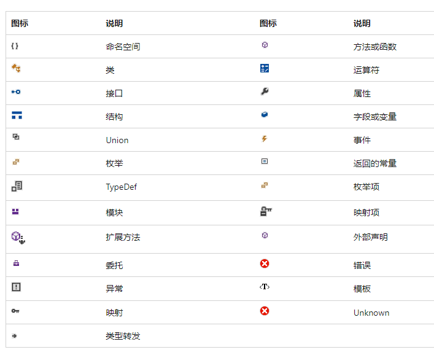

# 使用IDE

VS文档：<[Visual Studio 文档 | Microsoft Learn](https://learn.microsoft.com/zh-cn/visualstudio/windows/?view=vs-2022)>



## *生成配置*

### Debug和Release版本

* Debug调试版本：包括了调试信息，并且不做任何优化，便于程序员调试程序
* Release发布版本：编译器进行了各种优化，使得程序在代码大小和运行速度上都是最优的，以便用户使用，但不能进行调试

只有DEBUG版的程序才能设置断点、单步执行、使用 TRACE/ASSERT等调试输出语句。release不包含任何调试信息，所以体积小、运行速度快

对于x86来说，Debug和Release编译生成的obj和链接后可执行文件会分别放在Debug和Release文件夹中；而x86则是将Debug和Release分别凡在名为x64的文件夹中

## *项目结构*

### 如何组织一个项目？

新建的vs工程的配置文件主要包括两部分：Solution（解决方案）和Project（工程）配置文件

一个解决方案里可能包含多个工程。**每个工程是一个独立的软件模块，比如一个程序、一个代码库等。**这样的好处是解决方案可以共享文件和代码库

### 解决方案文件

VS 采用两种文件类型（`.sln` 和 `.suo`）来存储解决方案设置，下面提到的除了`.sln` 之外的文件都放在 `.vs/解决方案名/版本号/` 中

* `*.sln` Visual Studio.Solution  环境提供对项目、项目项和解决方案项在磁盘上位置的引用，可以将它们组织到解决方案中。比如是生成Debug还是Release，是通用CPU还是专用的等。`*.sln`文件可以在开发小组的开发人员之间共享。 `.sln` 就是打开文件的索引，正确引导用户进入环境、进入工程
* `*.suo`  Solution User Operation 解决方案用户选项，记录所有将与解决方案建立关联的选项，以便在每次打开时，它都包含用户所做的自定义设置。比如说VS窗口布局、项目最后编译的而又没有关掉的文件在下次打开时用，打的断点等。注意： `*.suo` 文件是用户特定的文件，不能在开发人员之间共享

sdf 和 ipch文件与VS提供的智能感知、代码恢复、团队本地仓库功能有关，如果不需要，可以禁止，就不会产生sdf 和 ipch这两个文件了，VS重新加载解决方案时速度会加快很多。另外这两个文件会导致VS工程变得很大，如果此时用git进行管理，git中的管理文件也会变得很大

* `*.sdf`文件：SQL Server Compact Edition Database File（`.sdf`）文件，是工程的信息保存成了数据库文件。sdf文件是VS用于intellisense的
  * 若没有参加大型的团队项目，不会涉及到高深的调试过程，这个文件对于用户来说是没什么用的，可以放心删除。若后来又需要这个文件了，只打开工程里的 `.sln` 文件重新编译链接就ok了
  * 同时我们注意到，当我们打开工程的时候还会产生一个 `*.opensdf` 的临时文件，不需关心，该文件关闭工程就会消失，是update `*.sdf`文件的缓冲。如果完全不需要，也觉得sdf文件太大，那么可以：在Visual Studio里进入如下设置：进入“Tools > Options”，选择“Text Editor >C/C++ > Advanced”，然后找到“Fallback Location”。然后把“Always use Fallback Location”和“Do Not Warn if Fallback Location”设置成“True”。这样每次打开工程，不会再工程目录生成 `*.sdf` 文件了
  * VS2015之后生成的 `*.db` 文件是sqlite后端用于intellisense的新数据库，相当于之前的 `*.sdf` SQL Server Compact数据库。它与VS2015提供的智能感知、代码恢复、团队本地仓库功能有关，VS重新加载解决方案时速度超快
* ipch文件夹：用来加速编译，里面存放的是precompiled headers，即预编译好了的头文件
* 禁止这两类文件生成的设置方法是：工具 `->` 选项 `->` 文本编辑器 `->` C/C++ `->` 高级，把回退位置和警告设置为true或者禁用数据库设为true，这样就不会产生那个文件了

上面的文件只是起一个组织的作用，将各个信息凝聚在一起，从而形成一个解决方案。不要随意的删掉着写看似没用的文件，删掉代码也不会丢失，但是，有时候环境配置好后，使用也比较方便，对于这两个文件，没必要动它。为了减少项目文件的大小，和这两个文件没有关系，但是如果操作不当，会导致解决方案打不开。那么解决办法就只有重建项目，然后导入代码文件了，只是会浪费一些时间而已，又要重新组织项目文件
### 工程配置文件

 Project的配置文件种类主要包括：`*.vcxproj`、`*.vcxproj.filters`、`*.vcxproj.user`、`*.props`.（注意区分`*.vcproj` 和 `*.vcxproj` 的区别，前者是vs2008及以前版本的工程配置文件，后者是vs2010及以后的工程配置文件）

* `*.vcxproj`文件是真正的项目配置文件，以**标准XML格式**的形式记录了工程的所有配置，如包含的文件名、定义的宏、包含的头文件地址、包含的库名称和地址、系统的种类等等。此外，还可以使用过滤条件决定配置是否有效
* `*.vcxproj.filters` 文件是项目下文件的虚拟目录，用于组织项目中源代码文件的视图层次结构的XML文件。它定义了在 Visual Studio 中的解决方案资源管理器中如何显示和组织项目文件。该文件通常包含项目中的文件夹结构和源代码文件的过滤器（例如，源文件、头文件、资源文件等）。通过在`*.vcxproj.filters`文件中定义过滤器，可以在 Visual Studio 中更好地组织和浏览项目文件
* `*.vcxproj.user` 是XML格式的用户配置文件，用于保存用户个人的数据，比如配置debug的环境PATH等等。用于存储针对特定用户的项目设置。这些设置通常包括编译器选项、调试器设置、运行时环境等。每个用户在打开或修改项目时，可以在该文件中保存自己的首选项和个性化设置
* `*.props` 是属性表文件，用于保存一些配置，可以根据需求，导入到项目中使用。使用起来很灵活，比如使用一个开源库，我们新建一个工程，往往需要做不少配置，如果不用属性表文件的话，那么我们每次创建一个工程都要配置一遍，太浪费时间了。如果我们能将配置保存起来，每次新建项目将配置加进来就好了，属性表文件就很好的实现了这一点

## *IntelliSence*

IntelliSense 是一项由 Microsoft 开发的智能代码补全和代码提示功能，旨在提高开发人员在集成开发环境（IDE）中编写代码的效率和准确性。它在多个 Microsoft IDE（如 Visual Studio、Visual Studio Code）和其他编辑器中得到广泛支持。

IntelliSense 使用静态代码分析、语义分析和用户输入上下文来为开发人员提供有关代码的实时信息和建议。它的主要功能包括：

1. 代码自动补全：IntelliSense 会根据正在输入的代码上下文，提供相关的代码补全选项。它可以自动完成代码片段、类、函数、变量等，并显示对应的参数列表和函数签名。
2. 代码导航：IntelliSense 可以帮助开发人员快速浏览代码库，并提供与代码相关的导航功能。这包括跳转到定义、查看函数调用层次结构、查找引用等。
3. 实时错误检查：IntelliSense 可以在代码编写过程中进行实时的语法和语义错误检查，并显示相应的错误和警告。这样可以帮助开发人员及早发现和修复问题，提高代码质量。
4. 文档注释：IntelliSense 可以显示与代码相关的文档注释、函数说明和参数描述，使开发人员能够更好地理解代码的含义和使用方式。
5. 提示和上下文帮助：IntelliSense 可以根据用户输入的上下文，提供有关可用选项的提示和帮助。它可以显示函数签名、参数类型、属性和方法列表等信息，以便开发人员更准确地编写代码

# 数据类型

## *引用*

注意：这部分特指左值引用

### 引用的概念

引用 reference 不是新定义一个变量，而是给已存在变量取了一个别名，**编译器不会为引用变量开辟内存空间，它和它引用的变量共用同一块内存空间**

`&` 操作符：和类型在一起的是引用，和变量在一起的是取地址

### 引用特性

* 引用在定义时必须初始化
* 一个变量可以有多个引用
* 某个引用一旦已经引用了一个实体后，不能再引用其他实体
* 除了const和类以外，其他的引用必须严格类型匹配

```cpp
int a = 1;
int& b = a; // 必须初始化

int& c = a; // 同一个变量可以有多个引用

int x = 10;
b = x; // 将会同时赋值给b和a，因为b和a是同一个地址

c = x; // 这个例子并不是说c重新引用了x这个实体，而是说x通过c这个引用间接赋值给了c所引用的a
// 因为&c代表的是给c取地址，所以其实C++中并没有语法来表示重新引用其他实体
```

### <span id="lvalue">使用场景</span>

* 函数传参：**函数传参本质上和变量的初始化过程是一样的**，都是把一个右值传给左值
  
  * 传值传参 passed by value 需要拷贝。C中常用指针来传递参数，从而达到修改输出的目的，但是比如在链表中要修改指针自身的时候要传二级指针就很麻烦
  
  * 引用传参 passed by reference/传引用调用 called by reference
  
    * 输出型参数，突破函数只能返回一个值的限制
  
      ```cpp
      typedef struct SeqList {
              //...
      }SL;
      void SLPushBack(SL& s, int x) {
              //...
      }
      int main() {
              SL sl;
              SLPushBack(sl); // 不用传指针了
      }
      ```
  
    * 大对象传参，减少拷贝，提高效率
  
* 做返回值
  * 传值返回（见C语言中的函数栈帧），小对象放寄存器，大对象放上层栈帧
    > 做法是将return的值装载到一个寄存器中，并将寄存器中保存的值给原函数中的接收变量。如果是将临时变量z设置为静态变量z，即 `static int z`。那么z会被保存到静态区中，并不会被销毁。但编译器仍然会选择将z的值加入到寄存器中生成临时拷贝后返回给上层
  * 传引用返回的问题
    * 若要return一个在函数栈帧中新开辟的变量，则return的结果是未定义的。因为栈帧调用结束时，系统会清理栈帧并置成随机值，那么这里ret的结果就是随机值。因此该程序使用引用返回本质是不对的，越界后结果没有保证。因此传引用返回的前提是**出了函数作用域，返回对象就销毁了，那么一定不能用引用返回，一定要用传值返回**
    * 修改方式
      * 将Count中的int放到静态区中，这样Count调用结束，栈帧销毁后，静态区中的int也不会被销毁
      * malloc出来的内存是在堆上也不会被销毁，因此传引用返回可以应用到顺序表等数据结构中提高效率

        ```cpp
        // 错误
        int& Count() {
                int n = 0;
                n++;
                // ...
                return n;
        }
        // 放到静态区中传引用返回
        int& Count() {
                static int n = 0;
                n++;
                // ...
                return n;
        }
        int main() {
                int ret = Count();
                return 0;
        }
        ```
    
  * 传引用返回的优势
    * 输出型返回对象，调用者可以修改返回对象，比如 `operator[]`
    * 减少拷贝

### 例子：传引用与传值在类中的应用

```cpp
// 实例
#include <iostream>
using std::cout;
using std::endl;
class A {
public:
    A(int a = 0) {
        _a = a;
        cout << "A(int a = 0)->" << _a << endl;
    }
    // A aa2(aa1);
    A(const A& aa) {
        _a = aa._a;
        cout << "A(const A& aa)->" << _a << endl;
    }
    ~A() {
        cout << "~A()->" << _a << endl;
    }
private:
    int _a;
};

void func1(A aa) {} //传值传参
void func2(A& aa) {} //传引用传参

A func3() {
    static A aa(3);
    return aa;
}
A& func4() {
    static A aa(4);
    return aa;
}
```

* 中间临时量 temporary object 问题，具体看《程序员的自我修养--链接、装载与库》10.2.3函数返回值传递机制
  
  * 函数的返回对于1-8字节的小对象，直接通过eax寄存器存放的临时量返回。注意：**这个临时对象编译器默认将其设置为const，即临时变量具有常性**
  * 对于大于8字节的大对象，会在上层栈帧开辟temp空间返回
  
* 输入

  

  * 传值输入：需要调用拷贝函数，压栈时创建临时的形参，将实参拷贝给形参后调用形参，调用拷贝构造函数有栈帧开销和拷贝临时量的空间浪费，从上图试验中可以看出，传值需要多调用拷贝和析构，开销很大
  * 传引用输入：不需要调用拷贝构造函数，直接传递引用
  * 结论：传引用和传值对于内置类型效果不明显，都需要4个或8个字节。但对自定义类型效果明显，传引用不需要调用拷贝构造进行拷贝 

* 输出

  

  * 传值输出：需要调用拷贝构造函数拷贝生成一个**临时量**，然后将临时量的值返回给外层函数的接收变量，栈帧销毁后一块销毁，即传值返回不会直接返回原来栈帧中的对象，而是返回对象的拷贝。调用拷贝构造函数有栈帧开销和拷贝临时量的空间浪费
  * 传引用输出：不需要调用拷贝构造函数，直接传递引用
  * 结论
    * 调用拷贝构造函数有栈帧开销
    * 自定义类型有时需要深拷贝
    * 自定义类型往往比较大

### 指针与引用的关系

* 指针和引用用途基本是相似的，但指针更强大也更危险
* 使用场景
  * 链表定义中不能使用引用，因为引用必须要初始化赋值且引用不能更改指向
* 语法特性及底层原理
  * 语法角度来看引用没有开空间，指针开了4或8字节空间
  * 底层原理来看，引用底层是用指针实现的

## *联合体*

### 受限联合体

联合体的多个对象共用一片内存的情况对于节省内存来说是非常实用的，比如 `std::allocator` 在管理其 free list 时就用到了联合体

但是联合体在C++中的使用并不广泛，因为C++98规定了联合体的成员变量的类型不能是一个非平凡 non-trivial 类型，也就是说它的成员类型不能有自定义构造函数。比如说下面的联合体U的成员变量x3就不行

```c++
// C++98
Union U {
	int x1;
	float x2;
	std::string x3; // 错误
}
```

### 非受限联合体

> C++委员会在新的提案当中多次强调 “我们没有任何理由限制联合类型使用的类型” 。在这份提案中有一段话非常好地阐述了 C++的设计理念,同时也批判了联合类型的限制对这种理念的背叛，这段话是这样说的：当面对一个可能被滥用的功能时，语言的设计者往往有两条路可走，一是为了语言的安全性禁止此功能，另外则是为了语言的能力和灵活性允许这个功能，C++的设计者一般会采用后者。但是联合类型的设计却与这一理念背道而驰。这种限制完全没有必要,去除它可以让联合类型更加实用。

实际上指针就是第二种设计思路的很好体现。因此C++11解除了上面这种不合理的规定

但是当引入了非受限联合体之后又一个迫在眉睫的问题出现了。如何精确初始化联合体的成员对象？因为每个成员都共享部分内存，按顺序依次初始化显然是不合理的。因此C++11把这个任务交给了程序员来完成。若联合体中有成员是非平凡类型，那么这个联合类型的特殊成员函数将被设置为隐式删除，也就是说我们必须自己至少提供联合类型的构造和析构函数

而若要写构造和析构，又很难知道到底会用到哪些数据类型。所以一种推荐的方法是给出空的构造和析构函数，这样可以通过编译。然后在使用的时候用定位new来初始化

```c++
union U { 
	U() {}
	~U() {}
    int xl;
    float x2;
    std::string x3;
    std::vector<int> x4;
};

int main() {
	U u;
	new (&u.x3) std::string ("hello world"); // 定位new
    std::cout << u.x3 <＜ std::endl;
    u.x3.~basic_string();
    new (&u.x4) std::vector<int>;
    u.x4.push_back (58);
    std::cout << u.x4[0] << std::endl;
    u.x4.~vector();
}
```

另外，联合体中若要使用静态成员的话，定义和使用方法和类中是一样的

虽然C++11非受限联合体的引入表明了C++委员会对C++灵活性的坚持，但union仍然用的不多。且C++17之后大部分情况都可以用 `std::variant` 来代替联合体

## *枚举*

### 枚举类型的弊端

### 强枚举类型

## *新的字符串类型支持*

### C++98 wchar_t 的问题

C++98提供了一个wchar_t字符类型用它表示一个Unicode宽字符，并且为此提供了前缀L

§问题在于标准在定义 wchar_t 时并没有规定其占用内存的大小，这就导致了不同平台的实现差异。Win上wchar_t是一个16位长度的类型，而在Linux和macOS上wchar_t却是32位的。这就导致了不可跨平台

C++11 char16_t & char32_t

由于上面说的wchar_t由于定义不明确带来的移植困难，所以C++98时代实际上只能过通过char和char数组来存放Unicode宽字符，这非常不方便

C++11的char16_t和char32_t的出现解决了这个问题，它们明确规定了其所占内存空间的大小。char16_t和char32_t分别专门用来存放UTF-16和UTF-32编码的字符类型

### 前缀问题

同时C++11还为3种编码提供了新前缀，用于声明3种编码字符和字符串的字面量：UTF-8的前缀u8、UTF-16的前缀u和UTF-32的前缀U

不过在使用u8的时候存在一些问题。在C++11中u8只能作为字符串字面量（比如说 `"hello world"`）的前缀，而无法作为字符（比如说 `'c'`）的前缀。这个问题直到C++17才得以解决

```c++
char utf8c = u8'a'; // C++17 标准 
```

### C++20 char_8

因为UTF-8采用的是可变长编码，因此C++标准始终没有提供专用于支持它的数据类型。所以只能遗址用char数组来保存UTF-8编码字符

```c++
char utf8[] = u8"你好世界";
```

C++20新引入的类型char8_t可以代替char作为UTF-8的字符类型。char8_t具有和unsigned char相同的符号属性、存储大小、对齐方式以及整数转换等级


# C++函数

## *C++版本*

C with classes `->` C++1.0 `->` ... `->` C++98（C++标准第一个版本，引入STL库）`->` C++11（增加了许多特性，使得C++更像是一种新语言）`->` C++14 `->` C++17 `->` C++20（自C++11以来最大的发行版，引入了许多新的特性）`->` C++23

## *命名空间 namespace*

 在大型的Project中，同一个作用域中可能存在大量同样命名的变量/函数/结构体等，C编译器无法解决这种冲突，C++通过命名空间解决了该冲突

C++最外层的命名空间是全局命名空间 global namespace。全局命名空间以隐式的方式声明，并且是在所有程序中都存在的。可以用 `::` 域访问符来显式地说明一个全局命名空间中的内容

### 定义命名空间

```cpp
namespace wjF {
    int rand = 1; // 定义变量
    int Swap (int* left, int* right) { // 定义函数
            int tmp = *left;
            *left = *right;
            *right = tmp;
    }
    struct Node {// 定义结构体或类
            struct Node* next;
            int val;
    };
}
```

* 命名空间嵌套

  ```cpp
  namespace N1 {
      // 各种定义...
      namespace N2 {
              // 各种定义...
      }
  }
  ```

* 同一个工程中允许多个相同名称的命名空间，编译器最后会合成为同一个命名空间

### 命名空间的展开和使用

* 不展开，加命名空间/指定空间访问

  ```cpp
  // 指定空间访问的操作符为 ::
  std::cout << "Hello World!" << std::endl; 
  ```

* using 声明（using declaration）：部分展开

  ```cpp
  using std::cout;
  using std::endl;
  std::cout << "Hello World!" << std::endl; 
  ```

* using 指示（using directive）：完全展开 

  ```cpp
  using namespace std;
  ```

建议：项目中，尽量不要展开std库。可以指定空间访问+展开常用的；日常练习可以展开

### 内联命名空间

C++11增强了命名空间的特性，提出了内联命名空间的概念，内联命名空间能够把空间内函数和类型隐式导出到父命名空间中，这样即使不指定子命名空间也可以使用其空间内的函数和类型了

内联命名空间的主要作用是用来帮助库作者无缝升级库代码，让用户尽量少地修改代码也能自由选择新老库版本。一般将当前最新版本的接口以内联的方式导出到父命名空间中

```c++
namespace Parent {   
    namespace V1 {       
        void foo() { std::cout << "foo v1.0" << std::endl; }   
    }    
    inline namespace V2 {       
        void foo() { std::cout << "foo v2.0" << std::endl; }   
    } 
}
```

### 模板特例化 & 命名空间

模板特例化必须定义在原始模板所属的命名空间中，只要我们在命名空间总声明了特例化，就能在命名空间外部定义它了

```c++
// 必须将模板特例化声明成std的成员
namespace std {
    template<> struct hash<Foo>;
}
template<> struct std::hash<Foo> {} // 命名空间外定义
```

## *缺省参数/默认参数*

### 缺省参数概念

缺省参数 Default Parameter 是声明或定义函数时为函数的参数指定一个默认值。在调用该函数时，若没有指定实参则采用该形参的默认值，否则使用指定的实参

* 半缺省参数必须是位于左边，且不能间隔着给

  ```cpp
  void Func(int a, int b, int c=30); // 正确
  void Func(int a=10, int b=20, int c); // 错误，必须是在左边
  void Func(int a, int b=20, int c); // 错误，不能间隔着给
  ```

* 缺省参数不能在函数声明和定义中同时出现。当分离定义时，以声明为准，因为在汇编形成符号表时以声明中的定义为准

* 缺省值必须是常量或者全局变量，不能是局部变量

  ```cpp
  // wz、def和ht的声明必须出现在函数之外
  sz wd = 80;
  char def = ' ';
  sz ht();
  string screen(sz = ht(), sz = wd, char = def);
  string window = screen(); //调用screen(ht(), 80, ' ');
  void f2() {
      def = '*'; //重新赋值，改变默认实参的值
      sz wd = 100; //局部变量构成隐藏，但没有改变默认值
      window = screen(); //调用screen(ht(), 80, '*');
  }
  ```

### 缺省参数分类

* 全缺省参数

  ```cpp
  void Func(int a=10, int b=20, int c=30);
  ```

* 半缺省参数

  ```cpp
  void Func(int a, int b=20, int c=30);
  ```

### 缺省参数声明的问题

在给定的namespace中一个形参只能被赋予一次默认实参，因此函数的后续声明只能为之前没有默认值的形参添加默认实参，而且该形参右侧的所有形参必须都有默认值

通常应该在函数声明中指定默认实参，并将该声明放在头文件中

## *函数重载*

### 函数重载概念

* 函数重载 Function Overloading 允许在**同一作用域**中声明几个功能类似的同名函数。函数重载很方便，就像在使用同一个函数一样
* C++的名字查找发生在类型检查之前，所以函数重载必须是在同一作用域，否则会构成同名隐藏
* 函数重载类型
  * 参数个数不同

    ```cpp
    int func(int a, double b);
    int func(int a, double b, char c);
    ```

  * 参数类型不同。因为权限的放大缩小，所以若只有const不同也构成重载

    ```cpp
    int func(int a, char b);
    int func(double a, double b);
    ```

  * 参数类型顺序不同

    ```cpp
    int func(int a, double b);
    int func(double a, int b);
    ```

    注意：**只有返回值不同是不构成函数重载的**，因为编译器是根据传递的实参类型推断想要的是哪个函数，所以若只有返回类型不同则无法识别

### 函数匹配

函数匹配 function matching/重载匹配 overload resolution

* 编译器找到最佳匹配 best match，并生成调用该函数的代码
* 无匹配错误 no match
* 二义性调用 ambiguous call

### C++支持函数重载的原理 -- 符号修饰 Name-decoration/符号改编 Name-mangling

只有声明的函数或变量在本目标文件中是没有分配虚拟地址的，只有在定义之后才会分配内存地址。在编译器的链接过程中，会去找总符号表（同名的cpp文件和其头文件生成一份符号表），里面记录着不同函数的地址。只有声明的函数可以通过定义文件的符号表找到自己的地址，若没有找到就会报链接错误（编译阶段只报语法错误）

在Linux中利用`objdump -S`指令，可以发现在Linux的gcc编译器中，C语言编译器直接用函数名作为其符号表的命名，比如`<Func>`；而C++编译器则会进行函数名修饰，比如分别为`<_Z4Funcid>`和`<_Z4Funcii>`。修饰规则比较复杂，每种编译器在不同系统的修饰规则也不同。关于GCC的基本C++修饰规则可以看自我修养P88

binutils工具包里面了一个 `c++filt` 工具来解析被修饰过的名称

```shell
$ c++filt _Z4Funcid
Func(int, double)
```

符号修饰规则不仅用于函数重载，对于全局（静态）变量和（局部）静态变量也要进行符号修饰防止冲突

因为不同的编译器使用的符号修饰规则是不同的，所以不同的编译器编译产生的ELF文件是无法通过链接器连接到一块的，因为在符号表里找不到需要的符号，这是导致不同编译器之间不能互操作的主要原因之一

### C和C++互相调用库 `extern "C"`

* 生成静态库.lib和动态库.dll

* C++调用C库
  * C++中在调用C的头文件时使用 `extern "C"`：告诉C++的编译器，这里面的函数使用C的库实现的，用C的规则去链接查找它们

    ```cpp
    extern "C" {
            #include "....h"
            // ...
    }
    extern "C" int var; //单独声明某个符号为C语言符号
    ```
    
  * 附加库目录
  
    
  
  * 附加依赖项
  
    

一种更通用的方式是在系统头文件中添加 `__cplusplus` 条件编译，这样可以让C++能调用C，也能让C调用C++。比如说C语言共享库 `string.h` 中的 `memset` 函数

```cpp
#ifdef __cplusplus
extern "C" {
#endif
void *memset(void *, int, size_t);
#ifdef __cplusplus
}
#endif
```

## *内联函数 Inline*

* 定义：以 `inline` 修饰的函数叫做内联函数，编译时C++编译器会在调用内联函数的地方展开，**没有函数调用建立栈帧的开销**，而是直接替换成了一些机器代码，因此内联函数提升程序运行的效率
* 使用场景：堆排序和快速排序中需要被频繁调用的Swap函数

### C语言中用宏函数来避免建立和销毁栈帧

* 宏的优点：复用性变强、宏函数提高效率，减少栈帧开销、不用进行传入参数的类型检查（用enum）
* 宏的缺点：可读性差，复杂不易编写、没有类型安全检查、不方便调试（预处理阶段就被替换掉了）

```cpp
#define ADD(a, b) ((a) + (B))
// 记住两个特殊场景
ADD(1, 2) * 3;
ADD(a | b, a&b);
```

### inline特性

* inline是一种以空间换时间的做法，若编译器将函数当成内联函数处理，在编译阶段，会用函数体替代函数调用。缺陷是可能会使文件目标变大；优势是少了调用开销，提高程序运行效率
* inline对于编译器而言只是一个建议，不同编译器关于inline实现机制可能不同
* inline不建议声明和定义分离，分离会导致链接错误。inline不会被放进编译生成的符号表里，因为inline定义的函数符号是不会被调用的，只会被展开使用。推荐声明+定义全部写在头文件中（这也符合模块化设计声明和定义分离的设计初衷，便于使用）

## *C++的强制类型转换*

<https://learn.microsoft.com/zh-cn/cpp/cpp/casting-operators?view=msvc-170>

### 为什么C++需要四种类型转换

C++继承了C语言的隐式类型转换和显式类型转换体系，可以看C.md类型转换部分。C++不建议使用隐式类型转换，比如它提供了explicit来禁止隐式转换，这样可以避免一些不易察觉的错误的发生。C++更推荐使用在真的知道自己在做什么的时候使用规范的C++显示强制类型转换

使用隐式类型转换的另一个问题是会给阅读代码的人造成困惑，无法知道隐式转换到底是写代码的人的刻意为之，还是一个隐藏的bug

这里有一个经典的错误可以看Cpp.md的string类模拟实现部分的insert部分：[经典隐式类型转换错误](#经典隐式类型转换错误)

强制类型转换的形式为 **`cast_name<type>(expression);`**

RTTI思想和 `dynamic_cast` 会在[多态](#RTTI)部分介绍

### `static_cast` 用于非多态类型转换

<https://learn.microsoft.com/zh-cn/cpp/cpp/static-cast-operator?view=msvc-170>

```cpp
double d = 12.34;
int a = static_cast<int>(d);

void *p = &d;
double *dp = static_cast<double*>(p); //规范使用void*转换
```

`static_cast` 是一种**相对安全**的类型转换运算符，它可以将一种类型转换为另一种类型。`static_cast` 可以执行隐式类型转换，例如将整数类型转换为浮点类型，也可以执行显式类型转换，例如将指针类型转换为整数类型。`static_cast` 进行类型转换时会执行一些类型检查和转换，以确保类型转换是合法的

* 任何具有明确定义的类型转换，只要不包含底层const，都可以使用 `static_cast`
* 任意空指针转换都可以用 `void *` 做媒介
* **存在继承的但没有多态的类**之间的类型转换：派生转基类 上行 derived-to-base 是允许的，但反过来下行 derived-to-base 是不允许的，因为编译器无法自动确定如何构造一个派生类对象，因为基类对象可能不包含派生类的所有数据成员，也不调用派生类的构造函数。这可能导致未定义行为，例如访问未初始化的成员或调用未定义的行为
* 存在继承的但没有多态的类指针/引用之间的转换是可以转的：上行可以，下行是不安全的，用派生类的指针可以看到的范围大于等于基类的指针，可能会造成危险的越界。不是很理解为什么编译器为什么不和上一条对象转换一样直接把这个下行给禁止了，据说是因为运行时检查会有开销，静态情况下无法判断类继承情况，所以提供了这种方式让开发人员自己斟酌使用
* 存在多态的类指针/引用之间的转换可以随便转但是某些下行是不安全的，要用dynamic_cast

举两个内存池项目中的例子

1. 有 ` T *obj = nullptr;` 和 `char *_memory = nullptr;`，`obj = (T *)_memory` 可以通过编译，而 `obj = static_cast<T *>(_memory) ` 会报错：`invalid ‘static_cast’ from type ‘char*’ to type ‘TreeNode*’ 。编译器检查到这两个类之间没有定义明确的类型转换，故禁止了转换
2. `void *next = *(static_cast<void **>(_freeList)` 从 `*` 转换成 `**` 是可以的

### `reinterpret_cast` 用于对位进行简单的重新解释

C++类型转换之reinterpret_cast - 叫啥名呢的文章 - 知乎 https://zhuanlan.zhihu.com/p/33040213

`reinterpret_cast<type>(expression)` 可以为运算对象的位模式提供低层次上的重新解释，而**不进行任何类型检查或转换**。type和expresssion至少有一个是指针/引用

`reinterpret_cast` 主要用于以下情况：

1. `static_cast` 处理两个指针之间的转换时，必须要用 `void *` 来做转换媒介。如果我们确定两个指针或引用之间的相互转换不会有任何问题，则可以用 `reinterpret_cast` 将指针或引用类型直接转换为另一个指针或引用类型

2. 在某些特殊情况下，当需要使用指针或引用类型表示不同的对象类型时，可以使用 `reinterpret_cast` 进行类型转换。这通常发生在涉及底层硬件或操作系统接口的代码中

   ```c++
   int i = 10;
   int *i_ = reinterpret_cast<int *>(i); // 现在 *i == 0x0a了，可以用它去寻址
   
   int a = 1;
   int* pa = &a; // 假设pa是0x0b
   int pi = reinterpret_cast<int>(pa); // 现在pi就是11了
   ```

3. 在某些情况下，`reinterpret_cast` 也可以用于类型擦除，即将模板类型擦除为一个没有模板参数的类型，以便可以在运行时处理它们

`reinterpret_cast`的危险性 ⚠️：需要注意的是，使用 `reinterpret_cast` 进行类型转换时必须非常小心。由于它不执行任何类型检查或转换，如果类型转换不正确，可能会导致未定义的行为或错误的结果。因此，应该尽可能避免使用 `reinterpret_cast`，而优先考虑使用其他更安全的类型转换运算符，例如 `static_cast` 或 `dynamic_cast`

### `const_cast`

通过 `const_cast` 去除或者添加底层const属性 cast away the const，但是在**去除const属性后再进行写就是未定义的行为了**

```cpp
const char *pc;
char *p = const_cast<char*>(pc); //p和pc指向的是同一块区域，但p现在是非常量了
*pc = 2;
```

`const_cast` 常用于有函数重载的上下文中

```c++
const std::string &shorterString(const std::string &s1, const std::string &s2) {
	return s1.size() <= s2.size() ? s1 : s2;
}
// 如果是在学习、测试中这么写没什么问题
std::string &shorterString(std::string &s1, std::string &s2) {
	return s1.size() <= s2.size() ? s1 : s2;
}
// 但如果是在公司的工程项目中这么写则是很不好的代码，因为这是重复代码，重复代码就是说改了第一个就要手动改第二个
// 所以应该写成下面这种，当然前提是我们真的没有对原来的const写
std::string &shorterString(std::string &s1, std::string &s2) {
    auto &r = shorterString(const_cast<const std::string &>(s1), // 给参数添加const
                            const_cast<const std::string &>(s2));
    return const_cast<std::string &>(r);
}
```

# 类成员

## *类的定义 & 实例化*

### 类方法的分离式编译

```cpp
// .h 文件中的声明
class className {// 类名
    // class默认成员访问权限为private
    int attribute = 1; // 类属性和方法用 "." 操作符调用，即 className.attribute
    void Method_declaration(); // 定义为类的一部分的函数称为成员函数 member fucntion 或 类方法 method
}
// .cpp 文件中的类方法定义
void className::Method_definition() {/*...*/}
```

* 类函数的声明必须要在类内部，而类函数的声明则既可以在类内部也可以在类外部
* 小函数若想成为inline，直接在类里面定义即可。但具体是否会作为inline处理取决于编译器。即定义在类内部的方法是隐式的inline函数
* 若是大函数，应该声明和定义分离。一般情况下都使用这种定义方式。之所以要将大的类方法的声明和定义分离编译的原因在于
  * 编译时间：将大的方法定义在头文件中会导致每次包含该头文件的源文件都要重新编译整个方法，这会增加编译时间。如果方法定义在.cc文件中，只有在.cc文件被修改时才需要重新编译，其他包含该头文件的源文件不会受到影响，提高了编译效率
  * 头文件膨胀：将大型方法定义在头文件中可能会导致头文件变得非常庞大。这会增加编译器的负担，降低编译性能，并且会导致每个包含该头文件的源文件都包含了相同的庞大代码，增加了可执行文件的大小。这对于大型项目来说是不可取的
  * 依赖关系：将大的方法定义在头文件中可能导致头文件之间产生不必要的依赖关系。如果一个头文件中包含了大量其他头文件，并且这些头文件又包含了其他头文件，可能会形成复杂的依赖链，使得代码难以维护和理解
  * 潜在错误：将大的方法定义在头文件中可能会导致重复定义的问题，因为多个源文件包含了相同的方法定义。这会导致链接错误，因为编译器无法确定应该使用哪个定义

* [类方法在类外定义时需要遵守类的作用域的规定](#类方法的定义方式)

### 访问限定符 Access Modifier

```cpp
class A {
public:
    void PrintA()
        cout << _a << endl;
private:
    char _a;
};
```

* 分类
  * public 公有：可以被任意实体访问
  * protected 保护：只允许派生类及本类的成员函数访问
  * private 私有：只允许本类的成员函数访问
* 访问限定符的说明
  * 访问权限作用域从该访问限定符出现的未知开始直到下一个访问限定符出现时为止
  * 若后面没有访问限定符，作用域就到 `}` 为止
  * 三者都是只对类作用域外有效，即类内无论是什么限定符都可以互相取
  * struct定义的类默认访问权限是public，而class定义的类默认访问权限则是private
* C++中struct和class的区别：C++需要兼容C语言，所以C++中struct可以当成结构体使用。但C++中的struct既可以定义变量，也可以定义函数。因此C++中将struct升级成了class。区别是**struct定义的类默认访问权限是public，而class定义的类默认访问权限则是private**

### 封装 Encapsulation

隐藏对象的属性和实现细节，即隐藏成员变量。仅对外公开接口来和对象进行交互（即开放成员函数接口）

```cpp
cout << st.a[st.top] << endl; // 这样调栈顶数据是错误的，因为类属性受保护。
// 而且很有可能出错，因为使用者并不知道底层的实现，top到底指向哪一个数据？
cout << st.Top() << endl;  // 这样是正确的，要使用给的函数接口
```

C语言没办法封装，可以规范的使用函数访问数据，也可以不规范的直接访问数据；C++使用封装，必须规范使用函数访问数据，不能直接访问数据

注意下面一个例子，在类内声明，在类外定义也是可以无视限定符的

```cpp
class A {
public:
    void Print(); //类成员声明
private:
    int _a;
};

void A::Print() { 
    cout << _a << endl; 
} //类成员定义
```

### 类的实例化 

实例化 Instantiation 是指在程序运行时为一个对象或数据结构分配内存空间，并初始化该对象或数据结构的过程。当实例化一个对象时，系统会为该对象分配足够的内存来存储其属性和方法，并执行必要的初始化操作，以确保对象处于一个有效的状态

类的声明不会占用物理空间。一个类可以实例化出多个对象，实例化出的对象占用实际的物理空间，存储类成员变量

## *类的作用域*

每个类都有自己的作用域。在类的作用域外，访问普通的数据和函数成员时只能对对象、引用或者指针使用成员访问运算符 `.` 和 `->`；而访问类的静态成员、全局变量、静态函数等具有类的全局作用域的标识符需要用域运算符 `::` 访问

### 类中符号的特殊编译过程 -- 两阶段处理

**类的定义分为两步处理**

1. 编译成员的声明
2. 知道类全部可见后才会编译函数体

总结来说：**编译器处理完类中的全部声明之后才会处理成员函数的定义**。这种两阶段的处理可以简化类代码的组织方式，因为类方法定义要直到整个类可见之后才会被处理，所以它能使用类中声明的任何符号。如果不这么处理的话，类方法就只能使用那些它可见的函数成员了

下面的例子中：在Account类中声明 `Money balance();` 方法的时候会去上层找 Money 的声明；而因为 balance 方法体是在类成员的所有声明被编译之后才去处理的，因此它返回的bal是类中的成员属性 `Money bal` 而不是之前定义的 `string bal`

```c++
typedef double Money;
string bal;
class Account {
public:
	Money balance() { return bal; }
private:
	Money bal;
// ...
};
```

### <span id="类方法的定义方式">类方法的定义方式</span>

变量搜索遵循局部优先，因此在C++文件中定义类函数时要用 `::` 指定类的作用域

比如下面这个例子中定义了一个 `Window_mgr` 的类，其中声明了一个 `addScreen` 的方法。在类外定义该方法的时候同时提供了类名和函数名，`Window_mgr::addScreen` 说明了是定义在 `Window_mgr` 类域中的方法 `addScreen`

注意：一旦函数名指定了在类域中之后，定义的剩余部分，即参数列表和函数体中要用到的类数据等都不需要再额外通过域访问符 `::` 再一次说明了。例外的是返回类型是出现在函数名之前的，所以返回类型若是类相关的，则仍然需要指定

```c++
class Window_mgr {
public:
    // add a Screen to the window and returns its index
    ScreenIndex addScreen(const Screen&);
    // other members as before
};

// return type is seen before we're in the scope of Window_mgr
Window_mgr::ScreenIndex Window_mgr::addScreen(const Screen &s) {
    screens.push_back(s);
    return screens.size() - 1;
}
```

### 类中的名字查找

之前的两阶段编译过程方便了类方法的定义，但对于**一般的类成员的声明仍然需要遵循一般声明顺序的限制**，即当前声明需要用到的其他东西都必须在此之前可见，若在当前作用域中找不到，就需要到上层的作用域中找。即一般的名字查找过程

**名字查找 name lookup 指的是寻找与所用名字最匹配的声明的过程**。回顾一下一般的名字查找过程

1. 在名字所在的块作用域中寻找其声明语句，只考虑在名字的使用之前出现的声明
2. 若没有找到，则继续到外层的作用域查找
3. 若最终没有找到匹配的声明，则程序报错

下面这个例子展示了一个类中名字查找的过程，一共给出了三种 `dummy_fcn`，分别是在类内的隐式inline定义和在类外的两种定义。注意：**不建议使用其他成员的名字作为某个成员函数的参数**，下面的例子只是为了更好的展示跟理解

```c++
// note: this code is for illustration purposes only and reflects bad practice
// it is generally a bad idea to use the same name for a parameter and a member
int height; // defines a name subsequently used inside Screen
class Screen {
public:
    typedef std::string::size_type pos;
    // which height? the parameter
    void dummy_fcn(pos height) {
    	cursor = width * height; 
    }
private:
    pos cursor = 0;
    pos height = 0, width = 0;
};

void Screen::dummy_fcn(pos height) {
    cursor = width * this->height; // member height
    // alternative way to indicate the member
    cursor = width * Screen::height; // member height
}

// bad practice: don't hide names that are needed from surrounding scopes
void Screen::dummy_fcn(pos height) {
    cursor = width * ::height;// which height? the global one
}
```

### 类型名的特殊处理

笔者首先做了一个小实验来证明一般的块作用域是可以重复 `typedef` 覆盖的，下面的代码可以通过编译

```c++
int main() {
  typedef int word;
  for (int i = 0; i < 10; i++) {
    typedef int word2;
    word2 x = 2;
    cout << typeid(x).name() << endl;
  }
  return 0;
}
```

类里面同样用 `typedef` 或者 `using` 给类型起别名，但和一般的块作用域不同的是在类中不允许重复 `typedef` 覆盖。比如下面的代码是错的

```c++
typedef double Money;
class Account {
public:
	Money balance() { return bal; } // uses Money from the outer scope
private:
	typedef double Money; // error: cannot redefine Money
	Money bal;
	// ...
};
```

但是要注意的是，尽管在类中重新起类型别名是一种错误的行为，但编译器并不对此负责，有些编译器是可以顺利编译这样的代码的

## <span id="类对象模型">*类对象模型*</span>

### 类对象的可能存储方式

* [ ] 对象中包含类的各个成员：问题是每个对象中成员变量都需要调用同一份函数，导致大量的冗余代码
* [ ] 实例化的每个对象成员变量都是独立空间，是不同变量。但是每个对象调用的成员函数都是同一个。没有被采用，在虚表和多态部分采用
* [x] 公共代码区
  * 只保存**非静态的成员变量**，成员函数存放在公共的代码段
  * 编译链接时就根据函数名去公共代码区找到函数的地址，然后call函数地址

### 公共代码区内存模型

```c++
class Foo {
public:
    void test();
private:
    int a_;
    double b_
    static int c_;
}
```

每个Foo的实例拥有各自的非static属性，共享方法和static属性


我们可以验证一下，下面代码可以顺利运行，说明没有对空指针解引用，所以实际使用的是公共代码区

```cpp
class A {
public:
    void func() {
        cout << "void A::func()" << endl; 
    }
};

int main() {
    A* ptr = nullptr;
    ptr->func();
    return 0;
}
```

### 类的内存对齐规则

影响C++对象大小的3个因素：非静态数据成员、[虚函数](#虚表)和字节对齐

* 属性和C语言中自定义类型的对齐规则一样。下面是几个要特别注意的点
  * 类中变量占有n个字节，那么这个变量应放在n的整数倍的位置上
  * long数据类型在Win64上占有4字节，在Linux64上占8字节
  * class最后会向内部最大对象补齐

* 方法属于公共区代码，所以不计入类的大小。但是即使属性和方法都为空，也会为其分配1字节占位。不存储实际数据，标识对象存在
* 因为内存对齐的存在，类内属性的声明顺序就要注意

注意一下继承的时候的内存对齐情况。比如说下面B的大小应该为12字节，因为继承的A部分要首先内部对齐，然后B的部分再对齐。而不是A和B的成员直接排列起来，这样的话就应该是4+2+2=8字节了。只有A的内部先对齐了才能满足之后的切片

```c++
struct A {
    int a;      // 4
    short b;    // 2 -> 4
};
struct B : public A {
    short c;    // 2 -> 4
}
```

## *this指针*

### this指针的引出

```cpp
class Date {
public:
    void Init(int year, int month, int day) {
        _year = year;
        _month = month;
        _day = day;
    }
    void Print() {
        cout <<_year<< "-" <<_month << "-"<< _day <<endl;
    }
private:
    int _year;
    int _month;
    int _day;
    int a;
}
```

```cpp
Date d1;
d1.Init(2022, 7, 17);
Date d2;
d2.Init(2022, 7, 18);
d1.Print();
d2.Print();
```

产生两个对象d1和d2，但是方法中并没有区分作用的对象是哪一个，函数是怎么知道该设置哪一个对象呢？

类中的方法会在第一个形参处放置一个额外的隐式this指针用来访问调用它的那个对象，当然下图中右边的类方法是不对的，因为不允许显式地给出this指针，这里只是为了说明用

编译器负责把调用者的地址传给this


### this指针的特性

* this指针是所有**非静态**成员函数的第一个隐形形参
* this指针是一指针常量：语法规定不能修改this指针（`T* const this`），因为this指针是被const保护的只读，但可以修改this指针指向的内容
* 也不能在实参和形参位置显式地传递this指针。但可以在类函数的内部使用（不使用也会自动加）
* this指针本质上是成员函数的形参，当对象调用该成员函数时，将对象地址作为实参传递给this形参，所以对象中不存储this指针。VS下将this指针优化到了寄存器中，因为在频繁使用时可以提高效率
* 问题：this指针可以为空吗？可以！参考下面两段对比代码

    ```cpp
    class A {
    public:
        void Print()
            cout << "Print()" << endl;
    private:
            int _a;
    };
    
    int main {
        A* p = nullptr;
        p->Print();
        return 0;
    }
    ```
    
    不会崩溃，虽然p是空指针，但并没对它解引用，因此程序正常运行

    ```cpp
    class B {
    public:
        void Print()
            // 相当于是 cout << this->_b << endl;
            cout << _b << endl;
    private:
            int _b;
    };
    
    int main {
        B* p = nullptr;
        p->Print();
        return 0;
    }
    ```
    
    程序会崩溃，因为对空指针解引用了！

## <span id="const成员函数">*const成员函数*</span>

### 介绍

this指针是一个 `T* const this` 的指针常量，我们不能修改this指针本身，也就说不能莫名其妙把调用者改成其他人。但是仍然可以通过this指针来修改调用者的属性，比如通过 `this->_year` 就可以获取 `_year` 属性了

虽然this指针式一个指针常量，但它仍然可以修改指向地址的内容，因此const对象是不能赋给this指针，也就不能调用相关的方法（权限放大），需要另外设计一套const方法

如果我们想保持类属性不变怎么办呢，一个方法当然是可以直接把类属性设置为const，但是这样任何其他的方法也就不能修改属性了，不够灵活。可以通过将某个特定方法设置为const，即const成员函数 const member function 来达成，此时的this指针就相当于变成了 `const T* const this` 

C++中类的const成员函数声明和定义的时候要加上const

```c++
class MyClass {
public:
    int getValue() const; // 声明常量成员函数
};
int MyClass::getValue() const {
    return someValue;
}
```

### 权限放大问题

```cpp
class Date {
Public:
    // ...
    void Date::Print() {
        cout << _year << "/" << _month << "/" << _day << endl;
    }
    bool Date::operator<(const Date& d) {
        return !(*this >= d);
    }
}
int main() {
    Date d1(2022, 7, 25);
    const Date d2(2022, 7, 26);

    d1.Print();
    //  d2.Print(); // 编译报错，权限放大
    d1 < d2;
    //  d2 < d1; // 编译报错，权限放大
}
```

* `Date* const this` this指针是一个指针常量，指针本身不能被修改，但可以修改指针指向的内容。当将一个不可修改的const Date d2 常变量传给一个常量指针 `Date* const this` 时，权限就被放大了

* `d2 < d1`，因为 `<` 运算符重载时，第一个参数是this指针常量，和上面的错误是一样的，都是权限放大

* 若要支持以上的调用，我们必须将this指针设置为常量指针。`void Date::Print() const` 修饰的this指向的内容，也就是保证了成员函数内部不会修改成员变量const对象和非const对象都可以调用这个成员函数（权限平移）

  ```cpp
  void Date::Print() const {
      cout << _year << "/" << _month << "/" << _day << endl;
  }
  bool Date::operator<(const Date& d) const {
      return !(*this >= d);
  }
  ```

## *static成员*

### 概念

**有些时候类需要它的一些成员与类本身直接相关，而不是与类的各个对象保持关联**。比方说银行账户类会规定基准利率，这个基准利率是对每个账户对象一致成立的，所以它属于这个类的共性，因此没有必要让每个类对象都存储它。当修改它的时候应该要对所有的类对象都成立

静态成员就是专门给这个类访问，**静态成员变量一定要在类外进行初始化**，注意在类外定义的时候必须要用 `::` 指定类域，否则编译器找不到

```cpp
class A {
public:
    A() { ++_scount; }
    A(const A& t) { ++_scount; }
    ~A() { --_scount; }
    static int GetACount() { return _scount; } // 静态成员函数，没有this指针，不能访问非静态成员
private:
    static int _scount; // 静态成员变量声明
};

// 在类外面定义初始化静态成员变量
int A::_scount = 0;

int main() {
    A a1;
    A a2;
    cout << a1.GetACount() << endl; // 用静态成员函数来取
}
```

### 静态成员定义的特殊性

静态成员的声明、定义和使用的方式都非常奇特，下面是它的特性

* 静态成员为所有类对象所共享，属于整个类，**也属于这个类的所有对象，并不单独属于某个具体的对象，这点在 `std::shared_ptr` 的设计中是一个坑**，存放在静态区

* 和友元一样，静态成员变量**必须在类外定义和初始化**（但是静态成员函数可以在类内定义），定义时不添加static关键字，类中只是声明，如 `int A::scount = 0;`，若是模板的话要把模板也给带上。初始化列表不能用来初始化静态成员

* 静态成员变量也受访问限定符的限制

* 当static是公有的时候，类静态成员可用 `类名::静态成员` 或者 `对象.静态成员` 来访问。但是若私有，则只能通过 `类名::静态成员` 访问或静态成员函数来获取，这是因为类静态成员不属于某个类对象，而是存放于静态区中，属于类域

* **静态成员函数没有隐藏的this指针，不能访问任何非静态成员**，也不能声明const成员函数，因为const的对象是this指针，同样也不能在static函数体内使用this指针

* **这条性质非常特殊，需要强行记下来**

  一般的静态变量不能给缺省值，只能在类外面给初始值

  但是有例外：`const static int`、`const static char`、`const static bool` 类型的静态变量可以给缺省值，比如哈希桶中的素数size扩容就用到了这个特性

  或者更准确地可以理解为，**上面三种类型的静态常量的初始值如果在类内声明时指定的，那么在类外定义时反而不允许赋初始值**；反过来如果在类外定义指定了初值，那么类内声明就不可以给出

  非常匪夷所思，明明是类内声明却可以给出初始值，但就是这么规定的

  甚至只要不获取它们的地址，那么甚至可以在不提供类外定义的情况下只声明并使用它们

  ```c++
  class GamePlayer {
  public:
      int get_numturns() { return num_turns; }
  private:
      const static int num_turns = 5; // const static 类型的声明，在这里初始化了！
      int scores_[num_turns];
  }
  const int GamePlyaers::num_turns; // const static 类型的定义，只要不获取它们的地址，可以不给出
  ```

### 一个应用：设计一个只能在栈上定义对象的类

若把构造函数定义为public，那么类对象可以定义在任何地方。但若把构造函数定义为private，然后给一个静态函数，里面定义类后返回

静态成员函数没有this指针，不需要访问对象来调用。若不用static，就会产生调用成员函数需要现创建对象的矛盾，因为调用成员函数需要this指针指向对象

```cpp
class StackOnly {
public:
    static StackOnly CreateObj() {
        StackOnly so;
        return so;
    }
private:
    StackOnly(int x = 0, int y = 0)
        :_x(x)
        , _y(0)
    {}
    int _x = 0;
    int _y = 0;
};
```

### 调用问题

* 静态成员函数可以调用非静态成员函数吗？不能，因为静态成员函数没有this指针
* 非静态函数可以调用类的静态成员函数吗？可以，因为静态成员属于整个类和类的所有对象

## *友元 Friend*

https://blog.csdn.net/weixin_46098577/article/details/116596183

有一些函数虽然不属于类，但类也要用到他们并且允许他们访问类的非公有成员从而实现某些功能。友元提供了一种突破封装的方式，在一些使用场景下提供了便利。但是友元会增加耦合度，破坏封装，所以要尽可能少地使用友元

### 全局函数做友元

友元函数可以直接访问类的私有成员，它是**定义在类外部的普通函数**，不属于任何类，但**友元的声明只能够在类的内部**，声明时需要加 `friend` 关键字

注意：友元在类内部的声明不是通常意义上的声明，相当于仅仅是指定了访问的权限，还需要在头文件的**类外部再次声明**然后在c文件中定义

* 运用场景
  * 重载运算符：`operator<<` 、`operator>>` 当定义为类成员函数时，cout的输出流对象在和隐含的this指针抢占第一个参数的位置。为了保证第一个形参为cout，需要将改运算符重载定义为全局函数，但此时又会导致它是类外成员而无法取得类属性成员，因此要借助友元函数帮助
  * 多个类之间共享数据，如有一个函数 `void func(const A& a, const B& b, const C& c)`，设置func同时成为A、B、C类的友元函数以获取多个类之中的数据
* 说明
  * 友元函数可以访问类的所有成员，包括私有保护成员，但不是类的成员函数，所有它没有this指针
  * 友元函数不能用 `const` 修饰，因为在类中 `const` 修饰的是this指针
  * 友元函数可以在类定义的任何地方声明，不受类访问限定符限制
  * 一个函数可以是多个类的友元函数
  * 友元函数的调用与普通函数的调用原理相同
  * 若需要将不同的重载函数都声明为友元，则不同的重载函数需要**分别声明**为友元函数

### 成员函数做友元

类中的一个方法单独作为一个友元

### 友元类

* 友元类的所有成员函数都可以是另一个类的成员函数，都可以访问另一个类中的非公有成员
* 特性
  * 友元关系是单向的，不具有交换性
  * 友元关系不能传递
  * 友元关系不能继承

# 构造函数

## *类的默认成员函数*

### 分类

对于一个空类，编译器会自动生成6个不会显示实现的默认成员函数

* 初始化和清理
  * Constructor 构造函数主要完成初始化工作
    * 大部分类都不会让编译器默认生成构造函数，都要自己写。显式地写一个全缺省函数，非常好用
    * 特殊情况下才会默认生成。比如用两个栈生成一个队列时
    * 每个类最好都要提供默认构造函数
  * Destructor 析构函数
    * 申请了内存资源的类需要显式写析构函数，如Stack, Queue，否则会造成内存泄漏
    * 不需要显式地写析构函数
      * 一些没有资源需要清理的类比如Date
      * 或者是MyQueue这样的类中会调用自定义结构的默认析构函数完成清理
* 拷贝操作
  * Copy constructor 拷贝构造
    * 和析构一样，若申请了内存资源则需要显式定义
    * 不需要显式地写拷贝构造
      * 如Date这种默认生成会完成浅拷贝
      * 或者是MyQueue这样的类中会调用自定义结构的默认拷贝复制函数完成任务
  * Assignment operator overloading （拷贝）赋值运算符重载：和拷贝构造一样也会面临自定义结构的浅拷贝问题，因此自定义结构也需要显式定义
* 移动操作
* 取地址 & const取地址重载：主要是普通对象和const对象取地址，这两个很少会自己实现，默认生成的够用了

### 三/五法则总结

三五法则看 *EffectiveModernCpp.md* 的条款17

## *构造函数 Constructor*

### 概念

* 构造函数自动初始化类的**非static成员属性**。构造函数的名字与类名相同，没有返回值。创建类类型对象时由编译器自动调用，以保证每个数据成员都有一个合适的初始值，并且在对象整个生命周期内只调用一次
* 构造函数的任务不是构造对象和开辟栈帧空间，而是对实例化对象进行初始化

### 特性

```cpp
// 函数重载，给默认值
Date() {
    _year = 1;
    _month = 0;
    _day = 0;
}
Date(int year, int month, int day) {
    _year = year;
    _month = month;
    _day = day;
}
// 调用
Date d1(2022, 9, 15);
Date d2; // 赋默认值
---------------------------------------------------------
// 或者是直接给缺省参数，这样实现比较好
Date(int year=1, int month=0, int day=0) {
    _year = year;
    _month = month;
    _day = day;
}
```

* 函数名与类名相同
* 无返回值
* 对象实例化时编译器自动调用对应的构造函数
* 构造函数可以重载
* 因为构造函数无论如何要取得类属性的控制权，所以它**不能被声明为const**

### 默认构造函数

若没有显式地为对象提供初始值，则类会通过默认构造函数来 default constructor 控制默认初始化过程

**若没有显式定义构造函数，那么编译器就会自动生成函数体为空的默认构造函数**（也称为合成的默认构造函数 synthesized default constructor）。注意：**拷贝构造也是构造函数**，如果定义了拷贝构造，编译器也不会生成默认构造函数

**若定义了非默认构造就不会生成默认构造，必须手动定义一个默认构造，或者用 `default` 强制生成**

* 若类中没有显式定义构造函数，则C++编译器会自动生成一个**无参的默认构造函数**（空默认构造），一旦用户显式定义编译器将不再生成
  * C++把类型分成了两类
    * 内置类型/基本类型：int, double, char, pointer, ...（`.data` 段放已经初始化的数据和只读数据、`.bss` 段放未初始化的数据和只读数据，默认值为0。栈中的数据则是随机值）
    * 自定义类型：struct, class, ...
  * **C++设计的缺陷**：默认生成的构造函数对**内置类型不做处理**；而自定义类型成员会去调用它的默认构造函数

    ```cpp
    class Time {
    public:
    Time() {// 构造函数
        cout << "Time()" << endl;
        _hour = 0;
        _minute = 0;
        _second = 0;
    }
    private:
        int _hour;
        int _minute;
        int _second;
    };
    class Date {
    public:
        // 没有自己写的构造函数，编译器会自动生成
        void Print()
            cout << _year << " " << _month << " " << _day << endl;
    private:
        int _year; // 内置类型
        int _month; // 内置类型
        int _day; // 内置类型
        Time _t; // 构造类型
    };
    // 用默认构造函数调用
    Date d;
    ```
    
    
    
    通过调试可以发现，内置类型的 `_year, _month, _day` 都是随机值，没有被初始化，但自定义类型 `_t` 被初始化了
    
    * 这个缺陷在C++11中打了**补丁**：可以为内置类型成员变量在类中声明时给默认值（缺省参数）来修正
    
    ```cpp
    // 一定要注意，这个不是给初始值，而是为了修正构造函数不处理内置类型的缺陷给的缺省值！！！
    private:
        int _year = 1;
        int _month = 0;
        int _day = 0;
        Time _t; // Time* _t 指针也是内置类型，不会被初始化
    ```

* 默认构造函数并不仅仅指默认生成的构造函数，而是有**三类构造函数**都可以称为默认构造函数。其特点是**不传参数就可以调用的，且只能存在一种**
  * 我们不写，由编译器自动生成的
  
  * 我们自己写的全缺省构造函数
  
  * 我们自己写的无参构造函数（空参数列表）
  
  * 若写了一个其他的非默认构造函数，那么一定要自己实现上面的三个默认构造函数之一。因为编译器不会自动生成默认构造函数，此时编译器会报如下的错误
    > **没有合适的默认构造函数可用**
    
  * 注意：如何调用默认构造函数？不要加 `()`
    
    ```cpp
    // 假设有Sales_data类
    Sales_data obj(); // 意思是声明一个返回类型为Sales_data的obj函数
    Sales_data obj; // 意思是默认构造实例化Sales_data的一个对象obj
    ```

## *初始化列表在构造函数中的角色*

### 构造函数体赋值/函数体内初始化的问题

```cpp
class Time {
public:
    Time(int hour = 0) {// 全缺省的默认构造函数，否则会报“没有可用的默认构造函数”的错
        _hour = hour;
    }
private:
    int _hour;
};
class Date() {
public:
    Date(int year, int hour) {
        _year = year;
        Time t(hour);
        _t = t;
        // 自定义结构Time成员hour是私有的，无法直接被Date取到
        // 只能通过在Date的构造函数中新建一个Time类后再赋值给Date的属性_t
    }
private:
    int _year;
    Time _t;
};
int main() {
    Date d(2022, 1);
    return 0;
}
```

* **初始化是在初始化列表中完成的。构造函数体中的语句是赋值，而不是初始化**。初始化只能有一次，而构造函数体内可以多次赋值
* 若类成员中包含本身没有默认构造函数的自定义结构时初始化会很麻烦，如上所示，自定义结构Time成员hour是私有的，无法直接被Date取到，只能通过在Date的构造函数中新建一个Time类后再赋值给Date的属性 `_t`（前提是自定义类有自己的默认构造函数）
* 通过上述方式初始化起始本质也是通过初始化列表初始化的，相当于绕了一个大圈子

### 初始化列表

为了编写能处理不同数量实参的函数，C++11引入了初始化列表 Initialization list 和[可变参数模板](#可变参数模板)两种机制，其中初始化列表适用于所有实参类型相同的情况，而可变参数模板则适用于实参类型不同的情况

```c++
template<class T> class initializer_list;
```

下面是 `std::initializer_list` 支持的接口

* `initializer_list<T> lst{a, b, c...};` 这是初始化列表最重要的功能，若想要往 `initializer_list` 形参中传递一个值序列，则必须把序列放在一对 `{}` 中
*  `size()` 返回列表中的元素数量
* `being(), end()` 同样支持迭代器

### 在类中应用初始化列表

* 示例

    ```cpp
    class Time {
    public:
        // 全缺省的默认构造函数，否则会报“没有可用的默认构造函数”的错
        Time(int hour = 0) { _hour = hour; }
    private:
        int _hour;
    };
    class Date {
    public:
        // 初始化列表可以认为是类成员定义的地方
        Date(int year, int hour, int& ref)
            :_year(year)
            , _t(hour)
            , _ref(ref)
            , _n(10)
        {}
    private:
        // 声明
        int _year = 0; // 内置对象给缺省值，该缺省值是给初始化列表的，此时内置类型若没有显式给值就会用这个缺省值
        Time _t; // 自定义类型成员
        int& _ref; // 引用成员变量
        const int _n; // const成员变量
    };
    
    int main() {
        int y = 0;
        Date d(2022, 1, y); // 对象整体定义
    }
    ```
    
* **初始化列表可以认为是成员变量初始化的地方**。初始化列表是**被自动调用**的，即使是完全空的构造函数也会自动调用，因此可以认为构造函数里的是二次赋值，private里的只是声明，真正的初始化是在初始化列表之中。也就是说**实例化的过程是：类属性声明（若有缺省值就直接初始化）`->` 初始化列表赋值 `->` 构造函数内部赋值（若有的话） **
* 注意点
  * 每个成员变量在初始化列表中只能出现一次，因为初始化只能有一次
  * 当类中包含以下成员时，其**必须**放在初始化列表位置进行初始化
    * 自定义类型成员，且该类没有默认构造函数时，否则会编译错误
    * 引用成员变量，引用在定义时必须初始化
    * const成员变量，const只有一次定义机会，之后不能重新赋值
  * 推荐使用初始化列表进行初始化
    * 有默认构造函数的自定义类型也推荐用初始化列表。通过调试可以发现，有默认构造函数的自定义结构通过构造函数初始化时也是借助构造函数，然后再赋值。不如直接使用列表初始化，只需要调用一次构造函数即可
    * 内置类型也推荐使用初始化列表，当然内置类型在函数体内初始化也没有明显的问题
  * 统一的建议：能使用初始化列表就使用初始化列表来初始化，基本不会有什么问题，肯定比在函数体内好
* 尽量使用初始化列表初始化
* **成员变量在类中的声明次序就是其在初始化列表中的初始化顺序，与其在初始化列表中的先后次序无关**

    

    可以发现上面程序的结果是1和随机值。这是因为根据声明，`_a2` 在初始化列表中应该首先被定义，其定义值为 `_a1`，然而此时 `_a1` 还没有被定义，所以其为随机值

## *C++11委托构造*

### 冗余的构造函数

C++11的新特性：委托构造 delegating constructor 调用所属类的其他构造函数来执行它自己的初始化过程。这个特性使得构造函数之间可以相互协作，共享公共的初始化逻辑

```c++
class Sales_data { 
public:     
    // nondelegating constructor initializes members from corresponding arguments
    Sales_data(std::string s, unsigned cnt, double price) : 
        bookNo(s), units_sold(cnt), revenue(cnt*price) 
    {} 
    // remaining constructors all delegate to another constructor
    Sales_data() : Sales_data("", 0, 0) {}
    Sales_data(std::string s) : Sales_data(s, 0,0) {}
    Sales_data(std::istream &is) : Sales_data() { read(is, *this); }     // other members as before 
};
```

## *类的双向类型转换*

转换构造函数 converting constructor 用于**将其他类型转换为类的对象**，转换构造函数没有返回类型

类型转换运算符 converting operator 用于**将类的对象转换为其他类型**，类型转换运算符具有返回类型

### 转换构造函数

构造函数不仅可以构造与初始化对象，对于**单个参数**或者**除第一个参数无默认值其余均有默认值**的构造函数，还具有类型转换的作用。把这种特殊的构造函数称为**转换构造函数 converting constructor**

**内置类型是可以隐式类型转换成自定义类型的**，编译器会自动先调转换构造产生一个临时量，然后再掉拷贝构造把临时量拷贝给对象（有些编译器自动优化为只有自定义）。可以用下面的程序在Linux上通过 `-fno-elide-constructors` 关闭编译器的所有优化后得到结果

```c++
class A {
public:
  A(int a) : a_(a) {
    std::cout << "A(int a)" << std::endl;
  }
  A(const A &a) {
    std::cout << "A(const A& a)" << std::endl;
  }
private:
  int a_ = 0;
};

A a = 10;
/* 打印结果
A(int a)
A(const A& a)
*/
```

* 转换构造函数是一种特殊的构造函数，用于将其他类型的对象转换为类的对象
* 它被用于隐式地执行类型转换，当需要将一个对象从一种类型转换为另一种类型时，编译器会自动调用适当的转换构造函数
* 转换构造函数在类内声明，没有返回类型，并且以类名作为函数名
* 虽然不可以指定返回类型，但是会**隐式返回一个当前类**

```cpp
class MyInt {
public:
    MyInt(int value) : m_value(value) {}  // 转换构造函数将 int 类型转换为 MyInt 类型
    // ...
private:
    int m_value;
};

int main() {
    int num = 42;
    MyInt myNum = num;  // 隐式调用转换构造函数将 int 类型转换为 MyInt 类型
    // ...
}
```

### 类型转换运算符

```cpp
operator CONVERTE_TYPE() const;
```

* 类型转换运算符 converting operator 是一种特殊的成员函数，用于将类的对象转换为其他类型
* 它被用于隐式或显式地执行类型转换，当需要将一个对象从一种类型转换为另一种类型时，编译器会自动调用适当的类型转换运算符
* 类型转换运算符在类内声明，以 `operator` 关键字开头，后面跟着要转换的目标类型
* 类型转换运算符有返回类型，用于表示转换结果
* 类型转换运算符通常不应该改变待转换对象的内容，所以一般要被定义为const成员

```cpp
class MyDouble {
public:
    operator double() const { return m_value; }  // 类型转换运算符将 MyDouble 类型转换为 double 类型
    // ...
private:
    double m_value;
};

int main() {
    MyDouble myNum(3.14);
    double num = myNum;  // 隐式调用类型转换运算符将 MyDouble 类型转换为 double 类型
    // ...
}
```

注意：`Date d1(2022);` 和 `Date d2 = 2022;` 虽然结果是一样的，但过程并不一样，前者是直接调用构造函数，而后者包含了先构造（创建临时变量）和拷贝构造（隐式类型转换）以及编译器的优化

### <span id="隐式调用">什么是隐式调用 implicit call</span>

隐式调用指的是**编译器自动执行的函数调用，而无需显式地在代码中指定函数名和参数**。它是通过一定的规则和转换机制来进行的，以便在需要的地方自动进行类型转换和函数调用

隐式调用可以发生在多种情况下，其中包括

1. **隐式类型转换**：当参数的类型与函数的参数类型不完全匹配时，编译器可以根据一组转换规则自动进行类型转换，以便使函数调用成为可能。例如，将一个整数传递给一个接受浮点数参数的函数，编译器可以隐式地将整数转换为浮点数
2. **拷贝构造函数的隐式调用**：当通过赋值操作符、函数返回值或者函数参数传递对象时，编译器会隐式调用拷贝构造函数来创建对象的副本。这样可以使得对象在不同的代码段中进行传递和复制
3. **隐式转换构造函数的调用**：当创建一个对象时，编译器会根据参数的类型选择适当的构造函数进行调用。如果构造函数具有一个参数且不是 `explicit` 的，那么编译器可以隐式地调用这个构造函数，以便根据参数类型创建对象

### `explicit` 关键字：禁止单参数类的隐式类型转换

隐式类型转换往往给用户带来的不是帮助，而是各种bug。比如说若常用的string类的自动转换和转换为bool型的隐式类型转换经常会带来一些问题

看下面这个例子，Dog类有一个单参数构造函数，它提供了隐式转换的能力。然后我们使用一个string来拷贝构造它。这个例子中看不出什么大的危害

```c++
class Dog {
public:
	Dog(string name) : name_{name} {} 
	string get_name() { return name_; }
private:
	string name_;
};

int main() {
  string dogname = "dog";
  Dog d = dogname;
	cout << "my name is " << d.get_name() << endl;
  return 0;
};
```

单参数的构造函数既可以用于隐式类型转换（由编译器自动搜索匹配完成），也可以通过显式地调用构造函数来完成。鉴于上面说的额隐式转换地问题，可以通过 `explicit` 关键字来禁止这种**单参数**的隐式类型转换，强制用户显式地调用构造函数。只有在用户知道自己在做什么，也就是说用 `static_cast<>` 显示的给出类型转换时转换才可以突破 `explicit` 关键字的封锁

```c++
explicit Dog(string name) : name_{name} {} 
```

`explicit` 只能用于有一个实参的构造函数，需要多个实参的构造函数不能用于执行隐式转换，所以无须将这些构造函数指定为 `explicit`

拷贝构造是一个实参的引用，拷贝构造函数本质上也是一个单参数的构造函数，所以当用explicit禁止了**某种参数类型**的单参数构造的时候也禁止了**这种参数类型的**拷贝构造的隐式调用

### 匿名对象 Anonymous object 及其单参数构造函数

`Date(2000);` 生命周期只有这一行

可以在有仿函数参数的函数模板中使用

## *析构函数 Destructor*

### 析构函数的作用

析构函数与构造函数功能基本相反，用来用于清理对象所分配的资源，比如说释放动态分配的内存、关闭文件、释放锁等，所以一个空的析构函数，即默认生成的合成析构函数 synthesized destructor 仍然可以完成析构任务，毕竟也不是这个空的析构函数来回收内存资源的。注意：**对象销毁工作并不是由析构函数来完成的，而是在析构阶段之后由编译器来完成的**

无论何时一个对象被销毁，就会自动调用其析构函数。由于析构函数自动运行，我们的程序可以按需要分配资源，而（通常）无须担心何时释放这些资源

* 变量在离开其作用域时被销毁
* 当一个对象被销毁时，其成员被销毁
* 容器（无论是标准库容器还是数组）被销毁时，其元素被销毁
* 对于动态分配的对象，当对指向它的指针应用delete运算符时被销毁
* 对于临时对象，当创建它的完整表达式结束时被销毁

### 特性

* 析构函数名是在类名前加上字符 `~`
* 无参数无返回值类型，无参数所以析构函数不能重载
* 一个类只能有一个析构函数。若无显式定义，系统会自动生成默认的析构函数
* 对象生命周期结束时，C++编译系统自动调用析构函数
* 若析构函数中没有很多工作时，有些编译器会把它优化掉
* 默认生成的析构函数和构造函数类似
  * **内置类型不处理**，但这里不是设计bug，而是系统无法处理。因为系统无法判断当前指针是否是动态开辟内存出来的还是有其他作用
  * **自定义类型成员会去调用它的析构**

    ```cpp
    class Stack {
    public:
        Stack(int capacity = 4) {
            _array = (DataType*)malloc(sizeof(DataType) * capacity);
            if (NULL == _array) {
                    perror("malloc fail!\n");
                    return;
            }
            _size = 0;
            _capacity = capacity;
        }
        void Push(DataType data) {
            _array[_size] = data;
            _size++;
        }
        ~Stack() {// Destructor
            cout << "~Stack()->" << _array << endl;
            free(_array);
            _size = _capacity = 0;
            _array = nullptr;
        }
    private:
        DataType* _array;
        int _size;
        int _capacity;
    };
    class MyQueue {
    public:
        void Push(int x){}
    private:
        size_t _size = 0;
        Stack _st1;
        Stack _st2;
    };
    // 调用
    int main {
        Myqueue q;
        return 0;
    }
    ```
    
    
    
    在析构函数 `~Stack()` 中打印了一下，可以发现在自定义类型Myqueue析构时调用了两次Stack的析构函数
* 若类中没有动态开辟内存时，析构函数可以不写，直接使用编译器生成的默认析构函数；有动态开辟内存时则一定要写，否则会造成内存泄漏

# 拷贝控制

## *拷贝构造函数 Copy constructor*

### 概念

```cpp
int a = 1;
int b = a; // 普通变量的复制

Date d1(2022, 7, 23);
Date d2(d1); // 类对象的拷贝
Date d3 = d1; // 也可以这么拷贝

// 拷贝构造函数
Date(const Date& d) {
    _year = d._year;
    _month = d._month;
    _day = d._day;
}
```

和普通变量一样，有时候想要创建一个一摸一样的新对象。为达成这种性质，需要给类添加拷贝构造函数

拷贝构造函数是构造函数的一个重载形式

### 拷贝构造要传引用

**拷贝构造函数的参数只有一个且必须是类类型对象的（常量）引用**，使用传值方式编译器直接报错，因为会引发无穷递归调用

> illegal copy constructor: first parameter must not be a 'Date'

* 以传值方式传参需要开辟临时空间，从而拷贝传入的参数

* 但是为了拷贝传入的参数，本身又需要调用拷贝构造函数，从而形成了无穷递归
  
  先做下图试验，通过调试可以发现：对于两个普通的函数 `get1, get2`，当其实参采用类传值传参时会调用类的拷贝构造函数，而传引用则不会。这说明**传参的时候为了创建类实参的临时拷贝，**本身就需要调用类的拷贝构造函数
  
  
  
  也就是说，传参要调用拷贝构造函数，我们必须拷贝它的实参来创建一个临时变量，但为了拷贝实参，又需要再次调用拷贝构造函数，无限循环
  
  
  
* 添加 `const` 将引用设置为只读，防止误操作对实参的改变

### 默认拷贝构造的浅拷贝问题

若未显式定义拷贝构造，编译器会生成默认的拷贝构造函数，或者称为合成拷贝构造函数 synthesized copy constructor。默认的拷贝构造函数对象将非static成员的内存存储按字节序完成拷贝，这种拷贝叫做**浅拷贝/位拷贝 shallow copy/bit-wise copy**

浅拷贝问题指的是在对象的拷贝操作中，仅仅进行成员变量的简单拷贝，**而没有对成员变量中指针指向的动态内存进行深度复制**的情况。这可能导致多个对象共享同一块内存，进而在释放内存时出现问题

* 对于内置类型不显式定义也可以，但若有内存开辟则拷贝的是指向开辟空间的指针，那么浅拷贝会存在以下问题
  * 一个对象修改会应先给另一个对象
  
  * 会析构两次，即free同一块内存空间两次，程序崩溃
  
    
  
* 解决方法：自己实现深拷贝 Deep copy/值拷贝 Member-wise copy，深拷贝的实现见string章节

### 拷贝构造函数的典型调用场景

拷贝构造函数一般作为拷贝初始化使用

* 用 `=` 来拷贝初始化，即使用已存在对象创建新对象
* 将一个对象作为实参传递给一个**非引用**类型的形参
* 从一个返回类型为**非引用**类型的函数返回一个对象
* 用初始化列表来初始化一个数组中的元素或一个聚合类中的成员
* 容器使用 `push` 或 `insert` 成员（注意emplace是直接构造）

### 通过 `explicit` 禁止拷贝构造

 `explicit` 声明的**某种特定类型**的构造函数只能用于直接初始化，不能用于拷贝初始化（即拷贝构造）。不过这种情况是比较少见的

```cpp
explicit Sales_data(const std::string &s): bookNo(s) {}
Sales_data item1(null_book); // 正确，直接初始化
Sales_data item2 = null_book; //错误，explicit禁止了拷贝构造
```

## *赋值运算符重载 Assignment Operator Overloading*

### 赋值运算符重载

```cpp
Date& operator=(const Date& d) {
    // this出了类域还存在
    if (this != &d) {// 避免自己给自己赋值
        _year = d._year;
        _month = d._month;
        _day = d ._day;
    }
    return *this; // 返回this指向的值为了支持连续赋值 d2 = d1 = d3
}
```

赋值运算符重载的特性
* 参数类型：const Date& **传引用**提高效率，且不修改Date类，因此用const保护
* 返回值类型：返回引用可以避免传值拷贝，提高返回效率，有返回值的目的是为了**支持连续赋值**。如果传指针返回，外面接受还需要解引用，非常别扭
* 要检查是否自己给自己赋值（不写也不会报错，只是为了提高效率）
* 返回 `*this`：要符合连续赋值的含义
* 赋值运算符只能重载成类的成员函数不能重载成全局函数，会被覆盖。赋值运算符如果不显式实现，编译器会生成一个默认的。此时用户再在类外自己实现一个全局的赋值运算符重载，就和编译器在类中生成的默认赋值运算符重载冲突了，故赋值运算符重载只能是类的成员函数

### 默认赋值运算符重载的浅拷贝问题

**用户没有显式实现时，编译器会生成一个默认赋值运算符重载，进行浅拷贝**，会产生和默认拷贝构造函数的浅拷贝一样的问题。若有自定义类型成员就必须要显式实现

而且相比于默认构造函数的浅拷贝，赋值的对象是一个已经存在的对象，所以默认赋值运算符重载还会引起**内存泄漏**的问题

**拷贝构造和赋值运算符重载的浅拷贝问题可以看[string类模拟实现](#深拷贝)**

### 赋值运算符重载和拷贝构造的区分

```cpp
class A;
A a1;
A a2(a1); // 拷贝构造
A a3 = a1; // 拷贝构造
A a4;
a4 = a1; // 赋值
```

拷贝构造是针对还没有定义的对象的，而赋值是已经存在的对象

## *阻止拷贝*

构造函数如果显式定义了就不会生成默认构造函数，但拷贝构造与赋值运算符重载函数不同，**即使已经显式定义了拷贝构造，编译器仍然会生成默认拷贝构造和默认的赋值运算符重载**。这种特性有时候会带来一些麻烦，因此有时候有必要阻止它们生成

```cpp
istream& (const istream&) = delete;
```

比如说istream禁止了默认拷贝构造，因为不应该有多个对象写同一个输入流

### C++11之前：声明为private

如果我们为类显式定义了拷贝构造，那么编译器就不会默认生成了。因此当我们把拷贝构造的访问权限设置为private，并且只提供声明不提供定义。那么自然在类作用域外就无法拷贝

但是仅仅这样做是不够的，因为成员函数和友元函数仍然可以调用私有函数。所以程序员要记得不能用这两种函数来调用拷贝构造，若无意间调用了会因为没有提供定义而报链接错误

C++11之前普遍都是这么实现的，比如 `ios_base`

```c++
protected: ios_base();  
private: ios_base (const ios_base&);
```

### C++11：delete关键字

在函数的参数列表后面加上delete关键字来定义为删除的函数 deleted function。借此可以将之前声明为private这种链接时报错提前到编译时报错

和default不同，delete可以用于任何函数，因为这样可以避免函数重载的多重匹配问题

注意：不允许将析构函数声明为delete

### 默认的拷贝控制成员可能是delete

若一个类有数据成员不能默认构造、拷贝、赋值或销毁，则对应的成员函数将被定义为delete

* 若**类的某个成员**的拷贝构造函数是删除的或不可访问的，则类的默认拷贝构造函数被定义为delete
* 若**类的某个成员**的赋值运算符是删除的或不可访问的或者类有一个const的或者引用成员，则类的默认赋值运算符被定义为delete

## *取地址及const取地址操作符重载*

* 它们是默认成员函数，我们不写编译器也会自动生成。自动生成就够用了，所以一般是不需要我们自己写的
* 非常特殊的场景：不想让别人取到这个类型对象的地址（或者设置为私有直接报错）

```cpp
Date* Date::operator&() {
    return nullptr;
}
const Date* Date::operator&() const {
    return nullptr;
}
```

# 移动控制

## *左值引用与右值引用*

### C++98的左值和右值

* C++98的左值 lvalue 一般是指一个指向特定内存的具有名称的值（具名对象），它有一个相对稳定的内存地址，且生命周期较长

  **左值的特点是可以取地址**，一般是一个变量或者返回引用的表达式。**除了const**不能被赋值外其他可以放到赋值符号左边。因此为了适应const的变化，C标准新增了一个术语：**可修改的左值 modifiable lavalue**，用于标识可修改的对象。也可以称为对象定位值 object locator value

  字符串常量是一个不可修改的左值，比方说下面的p是一个指向常量区字符串首字符的指针，常量区对于完全一样的字符串只会开一个

  ```c++
  const char *p = "hello world";
  const char (strPtr)[12] = &"hello world";
  ```

* C++98的右值 rvalue 则是不指向稳定内存地址的匿名值（不具名对象），它的生命周期很短

  右值是指表达式或临时的、临时性的值，其值只能被读取，不能被修改。右值通常是在表达式求值过程中产生的临时结果。例如，字面值、临时对象、返回右值引用的函数调用等都是右值

  个人认为一个更好的理解方式是除常量外，若一个表达式能产生临时变量就可以认为这个表达式是右值，从函数的栈帧建立过程中我们就已经发现了这一点。或者说从编译的角度来看需要把内存单元中的内容通过寄存器来进行间接转移

  ```c++
  //右值举例
  10;
  x + y;
  fmin(x, y); //function
  string("hello"); //匿名对象
  ```

左值和右值的概念是相对于赋值操作而言的，而赋值的操作就是要把值存储到内存上

* 当一个对象被用作左值的时候，用的是对象的身份（在内存中的位置）
* 当一个对象被用作右值的时候，用的是对象的值（内存单元中的内容）

### 复习概念：表达式 &值类别

表达式 expression 是由操作数 operands 和运算符 operators 组成的组合，用来执行特定的计算操作并生成一个结果。表达式可以包括各种数据类型的变量、常量、运算符以及函数调用等。**表达式和字面量就是最简单的表达式**

表达式是可求值的，求值的结果 result 有两个属性：类型和值类别 value categories

值类别不是左值就是右值，C++11还会继续细分

### C++11中对右值的进一步划分

[C++11 中的左值、右值和将亡值 - 简书 (jianshu.com)](https://www.jianshu.com/p/4538483a1d8a)


* 左值 lvalue和纯右值 pure rvalue 就是C++98中理解的那些
  * 左值
    * 函数名和变量名
    * 返回左值引用的函数调用
    * **前置自增/自减运算符连接的表达式 `++i/--i`**
    * 由赋值运算符或复合赋值运算符连接的表达式 `a=b、a+=b、a%=b`，因为他们返回的都是 `*this` 的引用
    * 解引用表达式 `*p`
    * **字符串字面值 `"abc"`**

  * 纯右值
    * **除字符串字面值以外的字面值**
    * 返回非引用类型的函数调用
    * **后置自增/自减运算符连接的表达式 `i++/i--`**
    * 算术表达式 `a+b、a&b、a<<b`
    * 逻辑表达式 `a&&b、a||b、~a`
    * 比较表达式 `a==b、a>=b、a<b`
    * 取地址表达式 `&a`

* 将亡值 expiring value/xvalue，因为将亡值可以是从左值转换来的，所以既可以算作左值，也可以算作右值。有以下几种方式将左值转换为将亡值
  * 返回右值引用的函数的调用表达式
  * 转换为右值引用的转换函数的调用表达式，其实就是 `static_cast<T &&>(x)` 以及封装了 static_cast 的 `std::move`
  * C++17引入了临时量实质化，具体可以看 *Cpp1720.md*


### 左值引用

左值引用除了const之外，只能引用左值不可以引用右值

但**const左值可以引用右值**，这样就不会因为左值改变而改变被引用的右值，因为const不能被改变

const左值可以引用右值这个特点在引用传参的时候被用到了，即引用传参时既可以接收左值也可以接收右值，事实上**const左值引用可以接受任何值**

```cpp
//左值引用可以引用右值吗：const的左值引用可以
//double& r1 = x + y; //错误
const double& r1 = x + y;
template<class T>
void Func(const T& T) {}
```

### 右值引用 rvalue reference

```cpp
int&& rr1 = 10;
double&& rr2 = x + y;
double&& rr3 = fmin(x, y);
```

右值引用只能引用右值，不能引用左值。可以通过上面的三种方式将泛左值转换为将亡值后右值引用

需要注意的是右值是不能取地址的，但是引用后就可以了，因为**右值引用的结果仍是左值**，编译器会给右值开一块空间，此时就可以对别名取地址了

```cpp
int&& rr1 = 10;
rr1 = 20; //合法
int b = 1;
int&& rr2 = move(b); //合法
```

## *右值引用使用场景和意义*

**引用的核心价值是减少拷贝**。标准库容器、string和 `shared_ptr` 类既支持移动也支持拷贝。IO类和 `unique_ptr` 类可以移动但不能构造

### 左值引用的短板

首先回顾一下左值引用的使用场景：做参数和做返回值[左值引用](#lvalue)

```cpp
string to_string(int val); // 返回一个在to_string函数中的string临时对象，不能传引用返回，只能传值拷贝返回
void to_string(int val, string& str);

vector<vector<int>> generate(int numRows); // 返回时要拷贝一个vector<vector<int>>的开销太大了
void generate(int numRows, vector<vector<int>>& w);
```

在上面的情境中，当要返回一个临时对象时，是不可以使用传引用返回的，因为栈帧被消灭了

考虑解决方案：全局变量会有线程安全问题，用new的话可能会有内存泄漏问题

但用输出型参数进行改造会又不太符合使用习惯，因为一般只要用外面一个变量接收一下就行了

### 右值引用和移动构造补齐短板


右值引用的核心：在传值情况下通过移动构造（直接和要消亡的右值进行资源交换）减少深拷贝

右值引用不是像左值引用直接起作用的，而是通过识别右值来提供移动构造起作用的

**C++11后的容器及其插入相关操作都支持了右值引用**，主要就是解决了拷贝开销很大的问题，解决了传值返回这些类型对象的问题，比如push_back、insert

```cpp
vector<string> v;
string s1("hello");
v.push_back(s1); //左值插入，深拷贝
v.push_back(string("world")); //c++11支持了右值引用插入，匿名对象是一个右值
```

## *移动构造 & 移动赋值*

### 异常对于移动构造、赋值的影响

一般会把移动构造、移动赋值的声明和定义都指定为 `noexcept`，原因有二

1. 移动构造和移动赋值转移数据的过程一旦开始就无法中断，不像拷贝构造和拷贝赋值，大不了就是丢弃已经拷贝好的内容。因此移动构造和移动复制不能被抛出异常打断函数进程
2. 因为移动构造和移动赋值都是在转移数据，不会分配任何资源，所以一般来说是不会抛出任何异常的。编译器默认所有的函数都是要抛出异常的，因此会对这些函数做一些额外的处理。如果我们能确保某个方法不会抛出异常，则应该显式告诉编译器，这样可以提高效率

格式是

```c++
string(string &&s) noexcept;
string &operator=(string &&rhs) noexcept;
```

### 确保移动后的源对象必须可析构

在移动操作完成后，源对象会被编译器调用析构销毁。因此在编写移动操作时，必须确保移动后的源对象进入一个可析构的状态

一般是通过将相关指针置成 nullptr 实现的

### 合成移动操作

编译器生成合成移动操作的条件跟若用户没有定义，编译器会自动生成合成拷贝构造、拷贝赋值不同

编译器生成合成移动操作的条件是

1. 一个类没有定义任何自己版本的拷贝控制成员
2. 该类的非静态成员都能移动构造或移动赋值

和拷贝操作一样，合成移动操作对于内置类型可以直接移动，对于自定义类型则会去调用自定义类型的移动操作

若我们将移动操作设置为default默认生成，但上面的两个条件又不满足时，编译器自动将移动操作设置为delete

### 合成移动操作被定义为delete的条件

基本上和合成拷贝控制被定义为delete一样，即若一个类有数据成员不能默认构造、拷贝、赋值或销毁，则对应的成员函数将被定义为delete

有一个例外：若类的某个成员定义了自己的拷贝控制且未定义移动操作，或者有类成员未定义自己的拷贝构造函数且编译器无法为其合成移动操作时，编译器会把合成移动操作设置为delete。即**定义了一个移动构造函数或移动赋值运算符的类也必须定义自己的拷贝操作，否则，这些成员默认地都被定义为delete**

## *返回值优化*

返回值优化有两种方式

* RVO, Return Value Optimization 返回语句的操作数为临时对象
* NRVO, Named Return Value Optimization 返回语句的操作数为具名对象

C++11标准中，返回值优化技术被称为复制消除 copy elision。若使用GCC作为编译器，URVO是默认开启的，取消优化需要额外指定编译参数 `-fno-elideconstructors`

C++17开始，GCC抢孩子要求开启URVO，无法关闭

### RVO

RVO的本质是调整返回值函数的原型


这部分在C++2022.08.05的课程有讲

编译器在release下的优化是取消了中间临时变量，直接将要返回的值拷贝给接收变量，Linux可以通过 `-fno-elide-constructors` 关闭编译器的所有优化

但是不能因此而取消中间临时变量，因为根据建立栈帧的顺序，ret必须要紧跟着func栈帧才能被找到，并且进行优化

```cpp
int ret1 = func(x); //只有直接用变量来接收编译器才会进行优化
int ret2;
// ...
ret2 = func(y); //这时候就不会优化的
```


### NRVO


# 运算符重载

## *运算符重载*

以Date类的实现为例，详细实现见 Lecture6_class4_date_20220724

### 运算符重载 Operator Overloading

* 运算符重载是为了让自定义类型对象也可以使用运算符像内置对象那样进行运算
* 重载的运算符是具有特殊名字的函数：它们的名字由关键字 operator 和其后要定义的运算符号共同组成
* 除了 `.* :: sizeof ?: .` 5个运算符外其他的运算符都可以被重载，但是不建议重载 `&`、`|`、`&&`、`||`，因为前两个无法保留运算对象对象求职顺序，而后两个则无法保留短路性质
* 重载运算符函数的参数数量与该运算符作用的运算对象数量一样多
* 当一个重载的运算符是成员对象时，this绑定到左侧运算对象

### 是否选择作为成员函数

* 赋值 `=`、下标 `[]`、调用 `()` 和成员访问箭头 `->` 运算符必须是成员
* 复合赋值运算符一般来说应该是成员，但这并非必须的，这一点与赋值运算符略有不同
* 改变对象状态的运算符或者与给定类型密切相关的运算符，如递增、递减和解引用运算符，通常应该是成员
* 具有**对称性**的运算符可能转换任意一端的运算对象，例如算术、相等性、关系和位运算符等，因此它们通常应该是普通的非成员函数
* [输入输出运算符必须是非成员函数](#IO运算符重载)

### 运算符重载的复用实现

* 几乎所有的类的运算符重载都只需要自己实现 `= == >` 或者 `= == <`，其他的比较运算符重载（不是加减乘除！）都可以复用这几个运算符
* Date类的 `+= =`复用 （`-= =` 同理）
  * 用+=复用+
  * 用+复用+=：缺点式拷贝次数过多，一直在调用+中的=

    ```cpp
    Date& Date::operator+=(int day) {
        // 要改变自身，所以可以直接对自身操作，采用传引用返回
        if (day < 0)
            return *this -= -day;
        _day += day;
        while (_day > GetMonthDay(_year, _month)) {
            _day -= GetMonthDay(_year, _month);
            ++_month;
            if (_month == 13) {
                _year++;
                _month = 1;
            }
        }
        return *this;
    }
    Date Date::operator+(int day) const {
        // Date ret(*this); // 拷贝构造
        Date tmp = *this; // 注意这里也是拷贝构造，两个已经存在的值才是赋值。两种写法等价
        tmp += day; // 用 += 复用
        return tmp; // 传值拷贝构造
    }
    ```
    
    根据加法的性质，两数相加会生成临时变量，并将临时变量赋给接收值，因此需要新建一个tmp临时变量并采用传值返回。同时拷贝构造所产生的临时变量在栈帧销毁后也被销毁了，所以只能传值返回，不能传引用，否则会引起野指针问题
  
* 一个类需要重载哪些运算符要看哪些运算符对这个类型有意义，比如Date类除法和乘法就没有意义
* 前置++和后置++重载：特殊处理，使用函数重载，**默认无参为前置，有参为后置**

    ```cpp
    Date& operator++() {// 前置
        *this += 1;
        return *this;
    }
    Date operator++(int) {// 后置，传的参数没有效果，仅仅是用来区分
        Date tmp(*this);
        *this += 1;
        return tmp;
    }
    ```
    复用+=，因为前置++会直接改变\*this，因此可以传引用返回，而后置++是先用再++，因此要保留一个\*this的备份tmp，所以要传值返回tmp

### 对称性运算符

## <span id="IO运算符重载">*IO运算符重载*</span>

### IO运算符重载的一般形式

* 输出

  ```c++
  ostream &operator<<(ostream &os, const MyClass &item);
  ```

  * 参数：第一个形参是一个非常量ostream对象的引用 `ostream&`，之所以是非常量是因为要把输出对象写入输出流，之所以是引用则是因为ostream把拷贝构造设置为delete，禁止流对象的拷贝获取，所以使用引用。因为是输出，所以不会修改输出对象，因此第二个参数是输出对象的常量引用
  * 返回值：返回ostream引用

* 输入：和输出基本一样，区别在于一般&&第二个参数是必须是非常量**，因为输入的目的就是要用流对象的内容来修改目标对象

  ```c++
  istream &operator>>(istream &is, MyClass &item);
  ```

### 非成员函数 + 友元

与iostream标准库兼容的IO运算符必须是普通的非成员函数。因为iostream标准库中第一个形参必须是iostream对象，若定义为成员函数则第一个对象是隐含的 `*this` 指针，因此一定要定义为非成员函数

若定义为类的非成员函数，则IO运算符重载娶不到类的私有数据，IO运算符通常都需要读写类的非公有数据成员，所以IO运算符一般都会被声明为友元来获取权限

例子

回顾C++IO流的内容，`<<` 流输出运算和 `>>` 流输入，因为C++库里写好了运算符重载。`cout`对象能做到自动识别类型，这是因为所有内置类型构成了函数重载

为了支持对自定义类型Date类的流输入和流输出，我们需要分别为 `istream` 和 `ostream` 类重载针对Date类的 `>>` 和 `<<` 运算符重载

```cpp
class Date {
	// 友元函数 -- 这个函数内部可以使用Date对象访问私有保护成员
	friend ostream& operator<<(ostream& out, const Date& d);
	friend istream& operator>>(istream& in, Date& d);
	//...
}
//流输出重载
inline ostream& operator<<(ostream& out, const Date& d) {
    //无法访问私有，使用友元
    //out << _year << "-" << _month << "-" << _day << endl;
	out << d._year << "-" << d._month << "-" << d._day << endl;
	return out;
}
//流提取重载
inline istream& operator>>(istream& in, Date& d) {
	in >> d._year >> d._month >> d._day;
	assert(d.CheckDate());
	return in;
}
```

实习的细节

* 因为是针对`istream` 和 `ostream` 类运算符重载，所以第一个参数必须是 `istream& in` 和 `ostream& out`，所以这个重载不能写在Date类里面，因为在Date里的话默认第一个参数是this指针，因此一定要在Date类外实现
* 在Date类外定义的话又会产生取不到私有的 `_year` 等Date类成员的问题
* 所以最后的解决方案是将重载函数设置为Date类的友元，以便让其取到Date类成员

## <span id="仿函数">*调用运算符重载 -- 仿函数*</span>

仿函数 Functor 又称为函数对象 function object

在优先级队列中需要比较元素的大小以进行建堆。但在建堆的逻辑中，比较大小是写死的，若此时要将大堆切换成小堆，就需要进入源码中改比较的顺序。这在实际中是不可能的。因此在类实例化时候就需要提供一个“开关”进行控制

仿函数是一个类/结构体，它的目标是使一个类的使用看上去像一个函数。 其实现就是类中实现一个 `bool operator()`（**`()`也是运算符！**)，这个类就有了类似函数的行为，就是一个仿函数类了

模板参数只允许是类，因此仿函数就可以很好的放入模板中进行泛型编程

```cpp
namespace wjf { //9.24的课
    template<class T> //less和greater在std中都被提供了
    struct less {//用class也行，但要设置为public
        bool operator()(const T& l, const T& r) const {
            return l < r;
        }
    };
    template<class T>
    class greater { //用class也行，但要设置为public
        public:
        bool operator()(const T& l, const T& r) const {
            return l > r;
        }
    };
}

//调用，二者等价
wjf::less<int> lsFunc; //仿函数是一个类，别忘了实例化
cout << lsFunc(1, 2) << endl; //看起来就像是一个普通的函数调用
cout << lsFunc.operator()(1, 2) << endl; //本质就是调用运算符重载
```

要注意的点是**类实例化时要传入的是类型，而函数重载时传入的则是对象**。比如`std::sort()`是一个函数重载，它在调用的时候要传入一个 `Compare comp`的对象（`std::greater<int>()` 对象有括号），而对于priority_queue类实例化则传入的是 `less<int>`这种类型

```cpp
vector<int> v;
sort(v.begin(), v.end(), less<int>()); // 传入一个匿名对象

priority_queue<int, vector<int>, Compare = less<int>> pq; // 传入一个类型
// 优先级队列的STL参数设计有写问题，因为一般不太会更改默认容器vector，但是有可能更改排序方式，即Compare，因此应该将Compare放在第二位比较好
```

### 标准库中定义的仿函数

[cplusplus.com/reference/functional/?kw=functional](https://cplusplus.com/reference/functional/?kw=functional)

容器中有用到一些仿函数，比如 sort 用到的 `greater` 默认升序、priority_queue 用到的 `less` 默认降序

# 特殊类

## *聚合类*

由于C++17对聚合类的定义做出了大幅扩展，将这部分内容转移到了 *C++17/20.md* 中同一描述

## *内部类 Inner Class（Java常用）*

### 概念

如果一个类定义在另一个类的内部，这个内部类就叫做内部类。内部类是一个独立的类，它不属于外部类，更不能通过外部类的对象去访问内部类的成员。外部类对内部类没有任何优越的访问权限

### 特性

* 内部类受外部类的类域限制，也受访问限定符的限制
* 内部类天生是外部类的友元
* sizeof(外部类)==外部类，和内部类没有关系

## *特殊类设计*

Cpp 第44节课，2小时左右开始

### 不能被拷贝的类

* C++98

  ```cpp
  class CopyBan {
      // ...
  private:
      CopyBan(const CopyBan&);
      CopyBan& operator=(const CopyBan&);
      //...
  };
  ```

  * 将拷贝构造函数与赋值运算符重载只声明不定义
  * 将拷贝构造和赋值运算符重载定义为私有，这样就不能在类外面实现了
  * 如果非要说缺点的话，那就是还有一种情况，可以在类里重新定义拷贝构造

* C++11：使用 `delete` 关键字禁止编译器默认生成拷贝构造和复制运算符重载

  ```cpp
  class CopyBan {
      // ...
      CopyBan(const CopyBan&)=delete;
      CopyBan& operator=(const CopyBan&)=delete;
      //...
  };
  ```

* 防拷贝应用
  * `unique_ptr`
  * thread
  * mutex
  * istream
  * ostream

### 只能在堆上创建对象的类

创建类有三种构造方法+1种拷贝方法

```cpp
HeapOnly obj1; //栈上
static HeapOnly obj2; //静态区
HeapOnly* obj3 = new HeapOnly; //堆上
HeapOnly obj4(obj1); //拷贝
```

要创建对象需要通过构造函数和拷贝构造，**只要想办法把它们堵死到只能在堆上创建对象就可以**

* 首先考虑一下能否通过析构函数私有来解决

  ```cpp
  class HeapOnly {
  private:
      ~HeapOnly() {}
  private:
      int _a;
  }
  
  int main() {
      HeapOnly hp1; // 报错，自动调用析构
      static HeapOnly hp2; // 报错，自动调用析构
      HeapOnly* ptr = new HeapOnly; // 通过，自定义类型不会自动调用析构
      // delete ptr; // 需要手动调用，此时报错
    	return 0;
  }
  ```

  hp1和hp2是可以的，因为它们强制调用析构函数，但是ptr是自定义类型，不会调用默认析构函数，所以反而避开了私有析构

* 实际采用的方法是

  * 将类的构造、拷贝构造声明成私有，防止别人调用拷贝在栈上生成对象。赋值拷贝可写可不写，因为都禁止了构造，也不会有对象被new出来


  * 提供一个静态的成员函数，在该静态成员函数中完成堆对象的创建

    * 调用成员函数 `CreateObject` 需要现有类对象，然后类对象又只能通过成员函数得到，一个经典的先有鸡还是先有蛋问题
    * 因此将 `CreateObject` 设置为不需要没有this指针的静态成员函数，且构造函数不需要this指针就可以调用

    ```cpp
    class HeapOnly {
    public:
        static HeapOnly* CreateObject() {
            return new HeapOnly // new出来的对象返回指针，不需要调拷贝构造
        }
    private:
        HeapOnly() {}
        HeapOnly(const HeapOnly&) = delete; //防拷贝
        HeapOnly& operator=(const HeapOnly &hp) = delete; //禁止赋值拷贝
    };
    ```


### 只能在栈上创建对象的类

**栈的局部对象传值返回必然要调用拷贝构造**，因为有编译器优化，把传值返回的拷贝构造省去了，相当于直接构造。要new对象必须要调用其构造函数，设置成私有后new就不能访问构造函数了

这里也不是移动构造，因为默认移动构造必须要不写构造函数

第二种思路是可以重载 `operator new()` 和 `operator delete()`，使无法从堆上创建对象。但这种写法有缺陷，无法阻止全局new对象和静态对象生成

```cpp
class StackOnly {
public:
    static StackOnly* CreateObject() {
        return StackOnly(); //编译器优化，传值返回没有拷贝构造
    }
    //// 不能禁拷贝构造，因为局部对象传值返回要调用
    //StackOnly(const StackOnly&) = delete; //防拷贝
    //StackOnly &operator=(const StackOnly &st) = delete;
    
    //void* operator new(size_t size) = delete;
	//void operator delete(void* p) = delete;
private:
    StackOnly() {}
};

static StackOnly copy2(st1); //不禁拷贝就不能解决这种拷贝，这是一个缺陷
```

### 不能被继承的类

* C++98：基类构造函数私有化，这样派生类就不能调用基类的构造函数，则无法继承
* C++11：用 `final` 关键字修饰基类，也就称为所谓的最终类

```cpp
//C++98
class NonInherit {
public:
	static NonInherit GetInstance() {
		return NonInherit();
	}
private:
	NonInherit() {}
};
//C++11
class A final {};
```

### 只能创建一个对象的类（单例模式 Singleton）

[快速记忆23种设计模式 - 知乎 (zhihu.com)](https://zhuanlan.zhihu.com/p/128145128)

设计模式 Design Pattern：是一套被反复使用、多数人知晓的、经过分类的代码设计经验总结，具体可以看上面的文章。比较重要的有适配器模式、单例模式、迭代器模式、观察者模式和工厂模式

Java对设计模式的要求是比较高的，因为Java本身的库设计就用到了很多设计模式。而C++等语言则没有很普遍使用设计模式。设计模式是有益的工具，可以提高代码的可读性、可维护性和灵活性。然而，过度使用设计模式可能导致复杂性增加、过度工程化、不必要的复用、过度抽象化和性能损失等劣势。在应用设计模式时，应根据具体的问题和需求进行合理的权衡，避免滥用和不必要的复杂性

单例模式 Singleton Pattern：一个类只能创建一个对象。该模式可以保证系统中在当前进程中该类只有一个实例，并提供一个访问它的全局访问点，该实例被所有程序模块共享。比如在某个服务器程序中，该服务器的配置信息存放在一个文件中，这些配置数据由一个单例对象统一读取，然后服务进程中的其他对象再通过这个单例对象获取这些配置信息

单例模式在何时创建这个唯一的对象有区别，即

* 饿汉模式 Eager Initialization：不管将来用不用，程序启动时就创建一个唯一的实例对象

  **构造私有、禁止拷贝，在类外定义全局static成员并用new实例赋值给它用来保存唯一一个实例，类内必须定义static成员以让构造取到、提供一个Get方法生成一个实例**

  ```cpp
  class Singleton {
  public:
  	static Singleton* GetInstance() {
  		return _spInst;
  	}
  	void Print() {
  		cout << _spInst << endl;
  	}
  private:
  	Singleton() {}
  	Singleton(const Singleton&) = delete; //防拷贝
  
  	int _a;
  	//static Singleton _sInst; //仅仅是声明，否则构造私有取不到，声明为类成员就能令定义时取到
  	static Singleton* _spInst; //仅仅是声明
  };
  
  //Singleton Singleton::_sInst; // 定义成全局的，而不是私有的，满足饿汉模式的要求（main函数之前就被初始化）
  Singleton* Singleton::_spInst = new Singleton; //类外才是定义，生成唯一一个实例
  
  int main() {
  	Singleton::GetInstance()->Print(); //只能这么取，因为不能实例化
  	return 0;
  }
  ```

* 懒汉模式 Lazy Initialization：用到的时候在初始化创建（延迟加载）。若单例对象构造十分耗时或者会占用很多资源，而有可能这个对象程序运行时并不会用到。若此时在程序时也要对这个对象进行初始化就会令程序启动非常缓慢

  ```cpp
  static Singleton* GetInstance() {
      if (_spInst == nullptr) {  //第一次调用的时候创建对象
          _spInst = new Singleton;
      }
  	return _spInst;
  }
  Singleton* Singleton::_spInst = nullptr; //定义
  ```

实际中**懒汉比较常用**，因为饿汉有时候初始化速度太慢，并且当多个单例存在顺序依赖问题时，饿汉静态成员的初始化顺序是不确定的，而懒汉可以控制初始化顺序

单例不用析构，但是不属于内存泄漏，因为这个类一直在使用。不过可以在析构函数里写信息到文件中持久化，可以通过一个垃圾回收的内部类来实现

```cpp
class Singleton {
    // 实现一个内嵌垃圾回收类
    class CGarbo {
    public:
        ~CGarbo(){
        if (Singleton::_spInst)
            delete Singleton::_spInst;
        }
    };
}
// 定义一个静态成员变量，程序结束时，系统会自动调用它的析构函数从而释放单例对象
static CGarbo Garbo;
```

# 继承 Inheritance

## *继承的概念及定义*

继承是类层次设计的复用

### 继承格式

```cpp
class Person {
public:
    void Print();
protected:
    string _name;
    int _age;
};

class Student : public Person { // 指明类派生列表
protected:
    int _stuID;
};
```

其中Person被称为父类/基类 Base class，而Student被称为子类/派生类 Derived class，Person前的访问限定符规定了派生类的继承方式

派生类通过块域 `{}` 符号之前的类派生列表 class derivation list 来明确指出它是从哪个基类继承而来的

### 基类和派生类对象赋值转换：切片


* 每一个派生类对象都是一个特殊的基类成员。如上图所示，每一个派生类对象中，都首先存放着基类成员。注意：C++标准并没有明确规定派生类的对象在内存中的存放方式，但我们可以假设是这么存储的
* 派生类对象可以赋值给基类对象、基类的指针和基类的引用，这种赋值方式称为切片/切割 slicing
* 反过来基类对象不能赋值给派生类对象
* 因为派生类对象中含有与其基类对应的组成部分，所以基类的指针或者引用可以通过强制类型转换绑定到派生类的指针或者引用。这种转换称为派生类到基类的类型转换 derive-to-base，编译器可以执行隐式的这类转换
* 必须是基类的指针是指向派生类对象时才是安全的。若基类是多态类型，可以使用RTTI的 `dynamic_cast` 来进行识别后进行安全转换

### 继承关系 & 派生访问限定符

类成员/继承方式| public继承 | protected继承 | private继承
:-:|:-:|:-:|:-:
基类的public成员|派生类的public成员|派生类的protected成员|派生类的private成员
基类的protected成员|派生类的protected成员|派生类的protected成员|派生类的private成员
基类的private成员|在派生类中不可见|在派生类中不可见|在派生类中不可见

* 派生访问限定符的目的是控制派生类用户（包括派生类的派生类在内）对于基类成员的访问权限
* 不可见/隐藏 hide 是指基类的私有成员虽然被继承到了派生类对象中，但是语法上限制派生类对象不管在类内还是类外都**不能**去访问它
* 当省略继承方式时，**class的默认继承方式是private**，而struct的默认继承方式是public
* 继承访问限定符是一个很冗余的设定，**实际运用中一般只会使用public继承，然后通过类成员是用public还是protected修饰来区分类内外是否可以访问**

### using改变派生类对基类的访问权限

该特性是在C++11引入的。派生类可以用using来将protected继承和private继承改变为public

注意：派生类只能通过using来改变那些它若通过public继承可以访问到的基类成员，即基类的public和protected成员，private成员无论如何它都访问不到

## *继承中的作用域*

* 在继承体系中基类和派生类都有独立的作用域
* 基类和派生类中有同名成员时，派生类成员将直接屏蔽对基类中同名成员的直接访问，这种情况叫做**隐藏 hide**，也叫做**重定义**。若在派生类中想要访问基类中被隐藏的成员，可以通过指定基类域的方式，即 `基类::基类成员` 显式访问
* 对于成员函数只要函数名相同就构成隐藏。注意在不同类域中的同名函数不是函数重载
* 实际中最好不要定义相同命名的成员

### 友元和静态成员的继承

* 友元关系不能被继承，也就是说基类友元不能访问派生类私有和保护成员
* 基类定义了static静态成员，则整个继承体系里面只有一个这样的成员，无论派生出多少个派生类，都只有一个static成员实例
* 不能说基类或派生类对象中包含了所有基类或派生类的成员变量，静态变量就不属于基类或派生类对象，而是属于整个类

## *派生类的构造函数*

**派生类的构造函数、拷贝构造、赋值拷贝、析构等都需要调用基类的对应函数**

### 派生类的默认构造函数

* 自己的成员还是一样调用自己的默认构造函数
* 若基类有默认构造函数，则派生类的构造函数会自动调用基类的默认构造函数来初始化继承自基类的成员
* 若基类仅提供了不带缺省值的构造函数或者说没有可用的默认构造函数时，这个时候派生类就需要为继承的基类成员提供显式构造。注意，必须调用整个基类的构造函数而不是为基类成员单独赋值，这被称为合成版本

### 基类虚析构函数

析构函数同上。但析构函数有一个特殊点：在继承体系中，基类和派生类的析构函数会被编译器统一处理成 `destructor()` 从而会构成隐藏，此时如果无法形成多态区分的话肯定是给什么指针调用哪个析构函数

有两种解决方法，第一种思路是在调用基类的析构函数时需要指定类域，这种思路是错误的。因为为了保证先派生类析构，再基类析构的正确析构顺序，编译器会在派生类析构后自动调用基类析构函数，用户不应该显式地给出基类的析构函数

```c++
class Student : public Person {
public:
    Student(const char* name, int num)
        :Person(name)
        , _num(num)
    {}
protected:
    int _num;
};
~Student() {
    //Person::~Person(); // 指定类域，避免隐藏
    // ...
} 
```

第二种解决方法是利用多态的性质，将基类的析构设置为virtual，此时可以形成多态，那么再用相对应的指针或引用去调用的时候就可以了

```c++
class Base {
public:
    virtual ~Base() {
        std::cout << "Base destructor" << std::endl;
    }
};

class Derived : public Base {
public:
    ~Derived() {
        std::cout << "Derived destructor" << std::endl;
    }
};

int main() {
    Base* ptr = new Derived;
    delete ptr; // 借助多态，这里会调用Derived的析构来正确回收资源
    return 0;
}
```

若不设置为virtual，则当对基类类型指针delete的时候的行为是未定义的，此时只会调用基类的析构，而且因为触发多态的条件之一是要用基类的指针或引用来指向派生类对象，所以若不设置为虚析构，析构的时候只会调用基类的析构。这样很有可能会造成资源泄露，比如说当派生类的非继承资源中有new的内存、文件句柄、数据库连接等的时候

不要多此一举把不打算作基类的普通类的析构设置为析构，此时根本没有多态的需要，平白引入了虚表浪费了空间

### 继承构造函数

C++11标准允许让用户用一条作用于直接基类的using语句来继承直接基类的**所有**的自定义的构造函数。注意：只适用于自定义的构造函数，默认构造、拷贝构造、移动构造等无法继承

继承构造函数就是一种语法糖，避免了在派生类中重复冗余的构造

```c++
class BulkQuote : public DiscQuote {
public:
    using DiscQuote::DiscQuote; // 用using声明来继承直接基类的所有构造函数
    double net_price(std::size_t) const;
}
```

* 做这种用途的using声明不具有改变访问级别的功能
* 继承的构造函数会保持其explicit和constexpr特性（若直接基类的构造函数有定义的话）
* 当构造函数含有默认实参的时候，默认实参不会被继承。派生类将获得多个继承的构造函数，其中每个构造函数分别省略掉一个含有默认实参的形参

## *派生类的拷贝控制*

### 派生类的默认拷贝构造和

* 自己的成员还是一样调用自己的默认拷贝构造函数 -- 内置类型浅拷贝，自定义类型调用它的拷贝构造
* 继承自基类的成员需要调用基类的拷贝构造函数进行初始化
* 当派生类中需要深拷贝时，需要显式提供派生类拷贝构造函数：利用赋值转换切片原理为基类赋值，或者利用强制类型转换取数据 `*(Person)*this`
* 复制运算符重载同上，只是要注意显式调用基类的 `operator=` 以避免隐藏

    ```cpp
    // ...
    Student(const Student& s) // 派生类显式的拷贝构造
        :Person(s) // 赋值转换切片
    {}
    Student& operator=(const Student& s) {
        if (this != &s) {
            Person::operator=(s); // 显式调用基类的operator=
            _num = s._num;
        }
        return *this;
    }
    ```

### 赋值拷贝

## *菱形继承与虚拟继承*

### 继承分类

* 单继承 Single Inheritance：一个派生类只有一个直接基类称这个继承关系为单继承

    * 直接基类 direct base：直接基类是派生类直接从其中继承成员的基类
    * 间接基类 indirect base：间接基类是派生类通过大于1个中间类间接继承成员的基类

* 多继承 Multiple Inheritance：一个派生类有两个或以上直接基类时称这个继承关系为多继承

    

* 菱形继承 Diamond Inheritance：是多继承的一种特殊情况

    

### 多继承的指针偏移问题


* 对于同一个多继承的派生类对象，当进行切片时，基类的继承顺序会有影响。如上例，由于先继承了Base1，后继承了Base2，所以根据栈的性质Base1对象放在低地址，而Base2产生了指针偏移，由于Base1中只有一个int对象，因此Base2放在离Base1有4个字节远的高地址
* 当分别进行切片时，p1看到的就是头四个字节，p2看到的范围为p1+4，而d则看到了全部，这就是切片的原理

### 菱形继承问题

菱形继承会带来很多问题，所以实际中都会避免定义成菱形继承，菱形继承的情况很少见，比如C++ IO流库中的iostream，底层机制会非常复杂。Java吸取了C++的教训，根本不允许定义菱形继承

* 菱形继承的二义性问题：通过指定类作用域解决

    ```cpp
    Assistant at;

    //// 菱形继承的二义性问题
    //at._name = "张三";
    at.Student::_name = "张三";
    at.Teacher::_name = "李四";
    ```

* 数据冗余问题：同样的一个人有多个年龄、性别？Student和Teacher的类成员已经有了 `_age` 和 `_sex`，但经过继承和修改后，派生类可能有不同的数据，这是多继承带来的问题，单继承就没有这个问题，因为单继承的基类属性只有一份。需要通过菱形虚拟继承来解决

    

### 虚拟继承

通过声明为虚拟继承 virtual inheritance 可以解决上面的问题。声明为虚拟继承是令某个类做出声明，承诺愿意共享它的基类，其中共享的基类子对象曾为虚基类 virtual base class

通过这种机制，不论虚基类在继承体系中出现了多少次，在派生类中都只包含唯一一个共享的虚基类子对象

虚拟继承的构造顺序有所不同，首先需要使用提供给最底层派生类的构造函数的初始值来初始化虚基类部分，其余的按继承顺序依次初始化。若仍然按照原来的顺序初始化会把虚基类初始化多次

* 菱形虚拟继承的底层：取决于虚继类的 `_a`大不大，若很大就能节省空间，比如说当 `_a` 是一个4000字节的类对象时，我们只需要增加一个4字节虚继表指针就可以换来少存储一个冗余的 `_a` 对象
  * 若不使用虚拟继承，则编译器会根据继承顺序，算好空间后依次存放数据

    

  * 使用了虚拟继承，此时在原来存放着继承量的地方就会改为存放指针（该指针空间称为虚继表），指针中存放的是一个偏移量，这个偏移量阐明了继承值和虚拟继承后的共同虚继类之间差了几个字节，从而帮助编译器找到

    

  * 同时在虚拟继承后，设置为虚拟继承的类的底层存储方式也要发生变化。若不保持一致的模型，则会对其他指针的访问产生歧义，B类原来只需要开8个字节的大小，现在为了保存一个虚继表指针，变成了12字节

    

* 总结：当大量数据时，虚拟继承对底层的改造是有可能影响数据的，尽量不要设计出菱形继承和虚拟继承

## *继承和组合*

* 继承：is-a
* 组合：has-a

# 多态 Polymorphism

## *多态的定义及实现*

### 构成多态的两个条件

多态是在不同继承关系的类对象，去调用统一函数，却产生了不同的行为。构成多态有两个条件

* 必须通过基类的指针或者引用调用虚函数来执行动态绑定 dynamic binding
* 被调用的函数必须是虚函数，且派生类必须对基类的虚函数进行重写

```c++
class A {
public:
  virtual void print() {
    cout << "A" << endl;
  }
};

class B : public A {
public:
  void print() {
    cout << "B" << endl;
  }
};

int main() {
  B b;
  A *a = &b;
  a->print();
  return 0;
}
```

### 虚函数重写的条件 Override of virtual function

* 若想要形成某个成员函数的多态行为，就必须将成员函数声明为虚函数。虚函数是被 `virtual` 关键字修饰的类成员函数
* 对虚函数的重写/覆盖：派生类中重新定义一个跟基类完全相同的虚函数，即派生类虚函数与基类虚函数的返回值类型（例外是若虚函数返回本身的指针或引用，此时是不同的）、函数名字、参数列表完全相同，不要求参数的缺省值是否相同，此时称派生类的虚函数重写了基类的虚函数。不符合重写就是隐藏关系

### 虚函数重写的三个例外

* 派生类虚函数不加 `virtual`，依旧构成重写，这是因为编译器认为派生类从基类那里已经继承了virtual，也就是说基类中的虚函数在派生类中隐含地也是一个虚函数。这种特例其实是为了析构函数的重写所准备的。实际中最好也加上构成同一的形式

  ```cpp
  class Person { virtual void BuyTicket(); };
  class Student : public Person { void BuyTicket(); };
  ```

* 析构函数的重写：若基类的析构函数为虚函数，此时无论派生类析构函数是否定义或是否加virtual，二类都构成重写。这是因为编译器对析构函数的特殊处理，即编译后析构函数的名称同一处理为destructor

  ```cpp
  // 析构函数构成虚函数重写
  class Person { virtual ~Person() {}; };
  class Student : public Person { ~Student () {}; };
  ```

* 协变返回类型 Covariant returns type：返回值可以不同，但要求必须是父子关系的指针或者引用。注意：可以不是虚函数所属类的父子关系，只要是构成父子关系的类都可以

    ```cpp
    class Person { virtual Person* BuyTicket(); };
    class Student : public Person { virtual Student* BuyTicket(); };
    
    class Person { virtual A* BuyTicket(); }; // B是A的派生类，A和B与Person和Student无关
    class Student : public Person { virtual B* BuyTicket(); };
    ```

### C++ 11 override 和 final

* <span id="final">若一个虚函数不想被重写，可以被定义为 final，但这种场景极少。因为虚函数的目标就是为了重写 `virtual void BaseFunc() final {};`</span>

* 一般来说定义了虚函数就是要被重写的，如果因为程序员自己出错，比如说参数不匹配等原因导致了没有重写，这种错误是比较难检查出来的。可以用 override 来检查派生类虚函数是否完成重写，**若没有完成重写就编译报错**。这和 Java 中的 `@Override` 强制重写不同，Java的 `@Override` 是写给基类的，说明一定要重写这个方法，而C++的 override 是写给派生类的

  ```c++
  virtual void DerivedFunc() override {}; // 强制重写
  ```

## *抽象类/接口类*

### 概念

C++ 中，虽然没有像一些其他编程语言（如 Java 和 C#）那样内置的 `interface` 关键字，但是可以通过抽象基类和纯虚函数来实现接口的概念

* 纯虚函数 Pure virtual function 不需要定义，直接在虚函数的后面写上 `=0` 就行。`=0` 只能出现在类内部的虚函数声明处
* 含有纯虚函数或者直接继承纯虚函数而未重写覆盖它的类叫做抽象类/接口类 abstract base class 。抽象类不能实例化出对象，派生类继承后也不能实例化出对象，只有重写纯虚函数后才能实例化出对象。一个大的概念就很适合定义成抽象类，比如树、花、车等，然后再定义具体的派生类，比如桃树、玫瑰花、BYD等
* 纯虚函数规范了派生类必须重写，相当于规定了派生类必须实现哪些接口，这也体现出了接口继承的概念

```cpp
class Car {
public:
    virtual void Drive() = 0;
}

class BYD : public Car {
public:
    virtual void Drive() {/*override*/}
}
```

### 实现继承与接口继承

* 实现继承 Implementation inheritance：普通函数的继承是一种实现继承，派生类继承了基类的普通函数，继承的是函数的实现
* 接口继承 Interface inheritance：虚函数的继承是一种接口继承，派生类继承的仅仅是基类虚函数的接口，因此要求返回值类型、函数名和参数列表完全相同。目的就是为了重写以达成多态。所以如果不需要实现多态，就不要把函数定义成虚函数

### 实现接口

接口在 C++ 中通常通过以下步骤实现：

1. 创建抽象基类：定义一个抽象基类 Abstract Base Class，该类中声明纯虚函数（没有实现的虚函数）来定义接口的方法。抽象基类不能被实例化，只能被用作其他类的基类

   ```c++
   class Interface {
   public:
       virtual void method1() = 0;  // 纯虚函数声明
       virtual void method2() = 0;
   };
   ```

2. 派生具体类：从抽象基类派生具体类，实现接口中声明的纯虚函数

   ```c++
   class ConcreteClass : public Interface {
   public:
       void method1() override {
           // 实现 method1 的具体逻辑
       }
   
       void method2() override {
           // 实现 method2 的具体逻辑
       }
   };
   ```

3. 使用接口：可以通过接口类型的指针或引用来访问具体类的对象，实现对接口的使用

   ```c++
   void someFunction(Interface* obj) {
       obj->method1();  // 调用接口方法
       obj->method2();
   }
   
   int main() {
       ConcreteClass concreteObj;
       someFunction(&concreteObj);  // 将具体类对象传递给接口
       return 0;
   }
   ```

需要注意的是，C++ 中的接口是通过抽象基类和纯虚函数实现的，并且一个类可以实现多个接口（通过继承多个抽象基类）。在 C++20 及更高版本中，引入了 `concept` 的概念，可以用于更直观地定义和使用接口

## <span id="RTTI">*RTTI*</span>

### 动态绑定 & 静态绑定

动态绑定 dynamic binding 也称为运行时绑定 run-time binding & 静态绑定 static binding

满足多态以后的函数并不是在编译时确定的，而是运行起来以后到对象的栈中找到的，所以指向谁调用谁，这也被称为运行时决议 Execution-time resolution；不满足多态的函数地址则在编译时就被确定了，这也被称为编译时决议 Compile-time resolution

为什么说多态是运行期的？因为要查虚表！在编译的时候只是知道虚函数在虚表中的偏移量，只有运行起来了，通过偏移量找到了虚表的对应项，然后再得到了虚函数的确切地址才行。而虚函数中可能还有其他的调用，或者动态资源的申请释放等等，这些全部都只能在运行时边走边看了

### RTTI思想

Run-time Type Identification 运行时类型识别允许C++这种静态语言可以在程序运行时动态确定对象的实际类型

C++通过以下方式来支持RTTI

* `dynamic_cast` 运算符：基类的指针是指向基类对象还是派生类对象
* `decltype` 运算符：推导一个对象类型，这个类型可以用来定义另一个对象。关于decltype运算符在 *EffectiveModernCpp.md* 中有详细说明
* `typeid` 运算符：获取对象类型

### `dynamic_cast` 用于多态类型的转换

`dynamic_cast`和其他三类用于增强C++规范的类型转换不同，**它专用于区分基类指针是指向派生类还是指向基类**，即用于**将一个基类对象的指针/引用安全地转换为派生类对象的指针或引用**，即动态转换

基类对象是无论如何都不允许转派生类的，但允许基类的指针或引用转换为派生类对象的指针或引用

* 向上转型：派生类对象指针或引用指向基类对象或引用，也就是切片，不需要进行转换

  ```cpp
  class A {};
  class B : public A {};
  B bb;
  A aa1 = bb;
  A& ra1 = bb; //向上转换切片，所以没有产生中间变量，也就不需要const了
  ```

* 向下转型：基类对象指针或引用指向派生类对象或引用

  * 基类指针强制转派生类有越界的风险，因为指针相当于规定了能看到的内存空间为多大，而基类的大小小于等于派生类
  * 只能用于基类含有虚函数的多态类
  * 这时候只有使用 `dynamic_cast` 才是安全的。安全是什么意思？
    * 如果指针是指向派生类，那么可以转换是安全的
    * 如果指针是指向基类，那么不能转换，转换表达式返回nullptr

```c++
Base* ptr = new Derived;
Derived* derivedPtr = dynamic_cast<Derived*>(ptr);
if (derivedPtr) {
    std::cout << "Dynamic cast successful." << std::endl;
} else {
    std::cout << "Dynamic cast failed." << std::endl;
}
```

### type_info

`std::type_info`存储了类的信息。主要支持的接口是

* 重载了 `==` 和 `!=` 用来比较

* `before()`：确定它们表示的类型在类型继承层次结构中的顺序

  ```c++
  class Base {};
  class Derived : public Base {};
  
  int main() {
      const std::type_info& ti1 = typeid(Derived);
      const std::type_info& ti2 = typeid(Base);
  
      if (ti1.before(ti2)) {
          std::cout << "Derived is before Base in the type hierarchy." << std::endl;
      } else {
          std::cout << "Derived is not before Base in the type hierarchy." << std::endl;
      }
  
      return 0;
  }
  ```

* `name()`：最常用的接口，用来返回type名

  实际上C++标准对于 `std::type_info::name()` 的调用不保证返回任何有意义的内容，到底返回什么完全由不同的编译器厂商来确定

  GNU和Clang的编译器的返回值比较复杂难懂，i是int，f是float，d是double，c是char，P是指针，K是常量类型。涉及到自定义类型就更加复杂

  而微软的MSVC编译器返回的就很直接明了，基本上该是什么类型就返回什么类型

* `hash_code()`：返回type的哈希值

### typeid

typeid 是 C++ 中用于获取对象的类型信息。它通常与动态类型检查和多态性一起使用，以确定对象的实际类型

* typeid的返回类型是type_info，由于type_info删除了拷贝构造，所以只能用引用或指针来接收
* typeid的返回值会忽略const和volatile饰词

## *不同多态情况下的内存分布*

[【C++】c++单继承、多继承、菱形继承内存布局（虚函数表结构） - tomato-haha - 博客园 (cnblogs.com)](https://www.cnblogs.com/tomato-haha/p/17445753.html)

总结：满足多态条件时（函数重写+基类指针/引用调用），会产生虚表存储虚函数的指针，调用时取对象自己的虚表里找到重写的多态函数

### <span id="虚表">虚函数表/虚表</span>

虚表 virtual table/**vtbl** 是一种数据结构，用于存储类的虚函数的地址，允许在运行时动态分派到正确的函数实现，实现多态性

* 和一般的[类对象模型](#类对象模型)一样，虚函数在编译好后也是放在公共代码段中，虚表中放的只是虚函数指针
* 虚表的本质是一个虚函数指针数组，一般情况这个数组最后放了一个nullptr

注意：**虚表和菱形继承产生的虚继表是完全不同的东西**。虚表是C++实现多态（或者说动态绑定）的底层机制，虚继表应对菱形继承的数据冗余和二义性问题。当既是菱形继承，又发生了多态时，二者会同时产生，变得非常复杂

下面我们来看一下最基础的无继承的时候的虚表

```c++
class Base {
public:
  virtual void func1() {
    cout << "Base::func1()" << endl;
  }
  virtual void func2() {
    cout << "Base::func2()" << endl;
  }
private:
  int b;
};
```


### 单继承

```c++
class Base {
public:
  virtual void func1() {
    cout << "Base::func1()" << endl;
  }
  virtual void func2() {
    cout << "Base::func2()" << endl;
  }
private:
  int b_;
};

class Derived : public Base {
public:
  virtual void func1() {
    cout << "Derive::func1()" << endl;
  }
  virtual void func3() {
    cout << "Derive::func3()" << endl;
  }
  void func4() {
    cout << "Derive::func4()" << endl;
  }
private:
  int d_;
};

  Base b;
  Derived d1;
  Derived d2;
```

虚表地址、虚表内容与虚函数是否完成重写有密切关系。不过这种关系的处理也与编译器有关，下面是VS的情况

* 同一个类的不同对象共用一张虚表
* 在任何情况下，即无论派生类是否和基类的内容完全一致，是否有完成重写，**派生类和基类都会使用不同的虚表**，但里面的虚函数指针视情况不同
  * 若基类定义了虚函数，然而派生类并没有重写，其存储的虚函数指针是相同的

  * 若派生类完成了对基类的虚函数的重写，虚函数地址也不同


注意：上面的例子中派生类有基类没有的独立的虚函数 `virtual void func3();`，该虚函数的函数指针也会被放进虚表里，但VS 2019中的监视窗口是看不到这个函数指针的，这应该是一个bug；反过来若基类有派生类没有就看得到。可以通过设计打印函数来观察

```c++
typedef void(*VFPTR)(); // 因为上面的成员函数都是空函数指针，所以对空函数指针重定义，对函数指针起别名的方式不太一样，可以看下C语言的内容
// 即使虚函数的返回类型不是void，或者有其他参数（这种情况下VS2019也会报错），它的函数指针也会被强转为空函数指针
void PrintVFTable(VFPTR table[]) {
    for (size_t i = 0; table[i] != nullptr; i++) {// VS中虚表以nullptr结尾，而Linux没有这个设计
    //  for (size_t i = 0; i < 3; i++) // VS中虚表以nullptr结尾，而Linux没有这个设计
        printf("vft[%d]: %p ", i, table[i]);
        //table[i]();
        VFPTR pf = table[i];
        pf();
    }
}
int main() { PrintVFTable((VFPTR*)(*(int*)(&s1))); /*...*/}
```

现在再来理解一下构成多态的条件1，如果我们不使用基类的指针或引用来调用虚函数执行动态绑定，而是用赋值切片 `B b = d;`，执行的是 `B b = static_cast<D>(d);`，静态强转。那么此时b只能看到基类的虚表，那么自然也就只能执行基类的方法了

而当用基类的指针或引用来调用虚函数执行动态绑定，`B *b = D;`，此时执行的则是 `B b = reinterpret_cast<D*> d;`

### 继承对于this指针的启发

如果暂时不考虑类的每个非静态方法隐含的第一个this指针参数的话，在上面的图中我们可以发现在代码段中是可能存在两个完全相同的函数的，比如两个func1，由于是重写，这两个函数完全相同

实际上在调用的时候少些一个指针并不是什么多大的遍历，由继承得到的启发式，引入this指针的真正原因可能是因为为了避免继承虚函数的时候无法区别重写的虚函数

### 多继承

```c++
class Base1 {
public:
  virtual void func1() {
    cout << "Base1::func1()" << endl;
  }
  virtual void func2() {
    cout << "Base1::func2()" << endl;
  }
private:
  int b1_;
};

class Base2 {
public:
  virtual void func1() {
    cout << "Base2::func1()" << endl;
  }
  virtual void func2() {
    cout << "Base2::func2()" << endl;
  }
private:
  int b2_;
};

class Derived : public Base1, public Base2 {
public:
  virtual void func1() {
    cout << "Derive::func1()" << endl;
  }
  virtual void func3() {
    cout << "Derive::func3()" << endl;
  }
private:
  int d_;
};
```


* 多继承中派生类中独立的虚函数会按照继承顺序放到第一个继承的基类的虚表中
* **Derive的func1对两个基类都进行重写，理论上应该共用一份func1**，但两个虚表中的func1地址却不一样。这是因为VS中jump指令对func1进行了多次封装，最后实际上调用的都是同一个func1

### 菱形继承

菱形继承、菱形虚拟继承中的虚函数表非常复杂：尽量不要写出这样的继承

因为菱形继承过于复杂，也不实用，具体的实验可以看上面的博客

### 多态原理总结

* 多态的本质原理：若符合多态的两个条件，那么调用时，会到指向对象的虚表中找到对应的虚函数地址，进行调用。比如在上述代码中当传入d对象时，会调用d对象的栈
* 普通函数调用：编译连接时确定函数的地址，运行时直接调用
* 必须通过基类的指针或者引用调用虚函数原因在于利用了切片原理，由于派生类对象继承了基类的结构并把基类结构放在最前面，因此传入派生类进行切片后编译器看到的也是基类的结构，但里面的虚表保存的是派生类中的虚函数位置，这就产生了传入什么对象就调用什么对象的虚函数

## *继承和多态的一些面试问题*

* 如何定义一个不能被继承的类
  * 方法1：C++98：1、基类构造函数私有 2、派生类对象实例化，无法调用构造函数

      ```cpp
      class A {
      private:
          A() {}
      protected:
          int _a;
      };
      
      class B : public A
      {};
      
      int main() {
          B b;
          return 0;
      }
      ```
      
  * 方法2：C++11新增了一个final关键字（最终类） `class A final`，此时 class A 不能用作基类
* 什么是多态？
* 什么是重载、重写/覆盖、重定义/隐藏？
* 多态的实现原理：满足多态条件时（函数重写+基类指针/引用调用），会产生虚表存储虚函数的指针，调用时取对象自己的虚表里找到重写的多态函数
* inline函数可以是虚函数吗？内联函数没有地址不能被放进虚函数，这和虚函数是互斥的。但是是可以实现的，若设置为virtual，编译器会忽略inline设置，因为inline是一个对编译器的建议性关键字，优先级很低
* 静态成员可以是虚函数吗？不可以，因为静态函数都是编译时决议，无法访问虚表
* 构造函数可以是虚函数吗？不可以，因为对象中的虚表指针是在构造函数初始化列表阶段才初始化的
* 析构函数可以是虚函数吗？什么场景下析构函数是虚函数？可以，且最好把基类的虚表设置为虚函数，形成多态（见重写的例外情况），一个例子就是异常类的析构函数
* 拷贝构造和operator=可以是虚函数吗？拷贝构造不可以，拷贝构造也是构造有初始化列表；operator=可以，但是没有意义，因为赋值的参数需要是同类，这不能完成重写，但若是使用和基类拷贝构造相同的参数，又不能达到派生类拷贝的目的，因此没有意义
* 对象访问普通函数快还是虚函数快？若不构成多态，就都是编译时决议，则一样快；若构成多态，则普通函数快，因为多态调用是运行时决议要通过虚表调用
* 虚函数表是在什么阶段生成的？存在哪里？虚表存在内存的常量区，在编译阶段就生成好了。注意不要和虚函数表的指针是在构造函数的初始化列表阶段生成的，此时去常量区找到虚表的地址并把它放到类对象里

# 复杂的const问题

C++11引入的constexpr关键字是相当令人困惑的，只有随着后续的C++14和C++17对它的调整，才让它变得更好用一些。因为constexpr是这样一个跨越了多个C++标准的关键字，我们不在这边给出，可以查看 *EffectiveModernCpp.md* 的条款15

因为函数的传参行为和const与变量、引用和指针的初始化是一样的，所以直接用函数传参的例子来总结const

```cpp
// const与变量没有权限关系
// 因为变量都是拷贝，没有内存关系
void test_v1(const int i) { printf("%d\n", i); }
void test_v2(int ci) { printf("%d\n", ci); }

// const与引用有权限放大问题
// 只能是int或const int 赋值给 const int&，不能const int赋值给int&
void test_r1(const int &ri) { printf("%d\n", ri); }
void test_r2(int &ri) { printf("%d\n", ri); }

// const与指针有权限放大问题
// 只能是int*或const int* 赋值给 const int*，不能const int*赋值给int*
void test_p1(const int *pi) { printf("%d\n", *pi); }
void test_p2(int *pi) { printf("%d\n", *pi); }

int main()
{
    int i = 1;
    test_v1(i);

    const int ci = 2;
    test_v2(ci);

    int *pi = &i;
    const int *cpi2 = &i; //用const int*指向int* 权限缩小ok
    const int *cpi = &ci;
    //int *pci = &ci; //用int*指向const int* 权限放大了报错

    test_r1(i);
    test_r1(ci);
    test_r2(i);
    //test_r2(ci); //权限放大

    test_p1(pi);
    test_p1(cpi);
    test_p2(pi);
    //test_p2(cpi); //权限放大
    return 0;
}
```

## *const与变量*

const的核心思想是让一个对象不可被修改，一旦尝试修改就报错

```c
const int buffSize = 512; // 规定缓冲区的大小
buffSize = 1024; // 对const赋值，会直接报错
```

### 修饰变量：置入常量区

* 局部变量：一旦写定就不能再更改了，所以const对象必须初始化。通常被用来修饰只读的数组和字符串
* 全局变量：这种写法应当尽量避免，很容易造成定义冲突
* 编译器通常不为普通const常量新开存储空间，而是将它们保存在符号表中，这使得它成为一个编译期间的常量，没有了存储与读内存的操作，使得它的效率也很高

### const与初始化

因为const对象一旦创建后它的值就不能再被更改，所以**const对象必须要被初始化**

**利用const对象去初始化另外一个对象不会对被初始化的对象造成任何影响**，这是因为const对象处于 `.rodata` 段（所谓的常量区域），而新的变量可能在任意位置（`.rodata`、`.data`、`.text`），初始化只是将const对象的值放到寄存器里，然后再mov给新的对象。一旦拷贝完成，const对象和被初始化的新对象也就没有半毛钱关系了

### const的底层

对于全局const常量，比如 `const char* ch = "abcdef";` 都会放到 `.rodata`（常量区）只读段。这个段属性（标识位） `sh_flag` 为 `SHF_ALLOC`，没有 `SHF_WRITE`，所以不允许修改它（自我修养P79）

全局const常量会将 `ch` 加入符号表中，因此在其他文件中使用它也需要extern声明，和普通变量的定义和声明是一样的

而局部const变量，则不会放入符号表中，在栈帧中放到某个页中，通过将页属性设置为只读就可以保证局部变量为只读

## *const与引用*

### 常量引用 Reference to const 与权限放大问题

引用对象是const，即对常量的引用或者叫常量引用：对常量的引用不能被用作修改它所绑定的对象，注意：**常量引用本身必须是任意类型的const**，因为若引用本身不是const，就会有权限放大问题

```cpp
int a = 10;
int& b = a; // 权限平移
cout << typeid(a).name() << endl;
cout << typeid(b).name() << endl;

const int c = 20;
cout << typeid(c).name() << endl;
// int& d = c; // 权限放大，这么写是错误
const int d = c;

int e = 30;
const int& f = e; // 权限缩小，即e可以通过其他方式改变，但f不能改变e

int ii = 1;
double dd = ii; // 隐式类型转换
```

* 权限不能放大，但可以缩小，也就是说**可以用常量来引用非常量，但反过来不行**
* const引用具有很强的接受度，因为其权限比较小
* 若使用引用传参且函数内若不改变传入参数，建议尽量用const传参

### 例外：常量引用的类型不必严格匹配

```cpp
// double dd = (double)ii;
// cout << typeid(ii).name() << endl;
// 强制转换只是创建了一个double的临时变量，不改变原变量ii

// 和整体提升过程一样 在转换过程中产生的是具有常性的 const double 临时变量
// double& rdd = ii; // 因此这么写是错误的，本质原因是权限缩小
const double& rdd = ii;

const int& x = 10; // 甚至可以引用常量
```

初始化常量引用时允许用任意表达式作为初始值，只要该表达式的结果能隐式转换成功

## *const与指针*

### 常量指针与指针常量

const修饰指针的三种情况

* 常量指针 pointer to const/底层const low-level const：`int const *p` 或者 `const int *p`：cosnt修饰的是 `*p`，不能修改 `*p`所指向的值，但可以修改p地址本身
* 指针常量 const pointer/顶层const top-level const：`int* const p`：p一个指针常量，不能修改指针p，即p指向的地址不可修改，但 `*p` 指向的地址所存储的值可以修改
* `const int* const p`：同时是指针常量和常量指针


底层const和顶层const是C++ Primer引入的概念。可以这么理解：顶层const是对象本身，而底层const则是从底层来看是某个对象的地址。注意：**对顶层const取指针会得到一个底层const**，因为底层const指向常量

```c++
const int* const p; // 分别是底层const和顶层const
const int a = 10; // 顶层const
const int& ra = 10; // 底层const，引用就是用指针来实现的
```

快速的记忆方法：从右到左，遇到p就翻译成p is a，遇到 `*` 就翻译成 point to，比如`int const *p` 是 p is a point(er) to int const；`int* const p` 是 p is const point to int 。如何理解常量指针与指针常量？ - 李鹏的回答 - 知乎 https://www.zhihu.com/question/19829354/answer/44950608

一个永远不会忘记的方法，**const默认是修饰它左边的符号的，如果左边没有，那么就修饰它右边的符号**

1.  `const int *p` 左边没有，看右边的一个，是int，自然就是p指针指向的值不能改变

2.  `int const *p` 此时左边有int，其实和上面一样，还是修饰的int
3.  `int* const p` 修饰的是*，指针不能改变
4.  `const int *const p` 第一个左边没有，所以修饰的是右边的int，第二个左边有，所以修饰的是 * ，因此指针和指针指向的值都不能改变
5.  `const int const *p` 这里两个修饰的都是int了，所以重复修饰了，有的编译器可以通过，但是会有警告，你重复修饰了，有的可能直接编译不过去

### 权限问题

只允许权限缩小或平移，不允许权限放大。简单的说就是 `int*`和 `const int*` 都可以赋值给 `const int*`，但是 `const int*` 不能赋值给 `int*`

* 当对常变量取地址时，必须要**将指针指向的量设为const**（常量指针 `int const *p`），否则会有权限放大问题；将指向const的指针常量用const数据或非const数据的地址（权限缩小）初始化为或赋值是合法的。

  ```c
  const int arr[] = {0};
  const int *ptr = arr; // 原来是const的数据，其指针指向的量也必须设置为const
  ```

  注意这里不要混淆了，不能用const数据初始化指针常量，属于权限放大

* 但是只能把非const的指针赋给普通数据，否则会权限放大

  ```c
  const int arr[3] = { 0,1,2 };
  int *ptr = arr; // 编译器不会报错，但ptr权限被放大了，可以通过*ptr修改arr中的数据，这种写法仍然是错误的
  ptr[2] = 3
  ```

注意：当执行对象拷贝操作时，顶层const会被忽略。也就是说const对象是可以赋值给普通对象的。顶层const被忽略的原因在于，当执行对象拷贝的时候，对新的拷贝对象的操作不会影响到原来的对象，此时不会像底层const存在权限放大或缩小的问题

下面的例子中指针报错报的是 `const int*` 类型的值不能用于初始化 `int*` 类型的实体，而不是 `const int* const` 类型的值不能用于初始化 `int*` 类型的实体的原因就是因为顶层const被忽略了

```c++
  const int a = 10;
  int b = a; // 顶层const被忽略

  const int *const p = new int(10); 
  int *p1 = p; // 错误，权限扩大。 "const int*”类型的值不能用于初始化"int*”类型的实体
  int *const p2 = p; // 错误，权限扩大
  const int * p3 = p; // 错误，权限扩大

  int *p4 = &a; // 错误，权限扩大
  
  const int &r1 = 20;
  int &r2 = a; // 错误
  int &r3 = r1; // 错误
```

### constexpr变量

constexpr 是 C++11 引入的一个关键字，用于声明一个“常量表达式函数”，也可以用于声明一个“常量表达式变量”

constexpr指针的初始值必须是nullptr或者是0，或者是存储在某个固定地址中的对象

nstexpr 的出现是为了方便程序员声明常量表达式，从而提高程序的效率。使用 constexpr 声明的常量表达式可以在编译时就被求值，从而避免了在运行时进行计算。**字面值类型 literal type** 是指在编译时就要被计算确定的值，因此 constexpr 不能被定义在函数体内，除了地址不变的static局部静态对象，所以 constexpr 引用能绑定到静态局部对象上

除了用于声明常量表达式函数和变量之外，`constexpr` 还可以用于要求函数或变量在编译时就必须被求值，避免栈开销，否则编译器会报错。这种约束可以帮助程序员写出更加高效和可靠的代码

```cpp
constexpr int factorial(int n) {
    return (n <= 1) ? 1 : (n * factorial(n - 1));
}

int main() {
    constexpr int result = factorial(5); // 在编译时就被求值
    static_assert(result == 120, "factorial(5) should be 120");
}
```

### 指针、常量和类型别名

## *const与函数*

函数传参时等同于变量赋值，所以它的规则和前面const与变量、引用、指针的关系一模一样

### const传参和返回的作用

* 修饰函数参数

  * 防止修改指针指向的内容
  * 防止修改指针指向的地址

* 修饰函数返回值

  若以传指针返回加const修饰，那么函数返回的内容不能被修改，且该返回值只能以加const修饰的同类型指针接收

  ```C
  const char* GetString(void);
  char* str = GetString(); // 错误
  const char* str = GetString(); // 正确
  ```

### const与函数重载

若参数只有const区别，不会构成函数重载

```cpp
void test(int x) {};
void test(const int x) {}; //redefinition 

void test(int &x) {};
void test(const int &x) {}; //正确 
void test(int *x) {};
void test(const int *x) {}; //正确 
```

但**若形参是某种类型的指针或引用，则通过区分其指向的是常量对象还是非常量对象可以实现函数重载**

当传递一个非常量对象或者指向非常量对象的指针时，编译器会优先选用非常量版本的函数

### constexpr函数

constexpr是C++11标准引入的关键字

* 函数的返回类型及所有形参的类型都得是字面值类型（即算数类型、引用、指针等编译时确定的值）

* 函数体中个必须有且只有一条return语句

  ```cpp
  constexpr int new_sz() { return 42; }
  ```

constexpr函数和inline一样，主要是为了加快调用速度

inline和constexpr的多个定义要完全一致，所以一般都直接在头文件中定义一次

## *const与类*

在[const成员函数](#const成员函数)里有说明了

# C++的IO流

## *IO类关系总览*

### C语言的IO函数

* `scanf()/printf()` 处理终端/控制台IO
* `fscanf()/fprintf()` 处理文件IO
* `sscanf()/sprintf()` 处理字符串IO

C语言是面向对象的，只能指针内置类型

### C++IO流设计

什么是流 Stream？流是对有序连续且具有方向性的数据的抽象描述。C++流是指信息从外设向计算机内存或从内存流出到外设的过程

为了实现这种流动，C++实现了如下的标准IO库继承体系，其中 `ios` 为基类，其他类都是直接或间接派生于它


* `<iostream>` 类处理控制台终端
* `<fstream>` 类处理文件
* `<sstream>` 类处理字符串缓冲区
* C++暂时还不支持网络流的IO库

### C++标准IO流

C++标准库提供给了4个**全局流对象** `cin`，`cout`，`cerr`，`clog`。从下图可以看到 **`std::cin` 是一个 `istream` 类的全局流对象**


C++对这部分的设计并不是特别好，因此这几个对象在输出上基本没有区别，只是应用该场景略有不同

使用 `cin` 进行标准输入即数据通过键盘输入到程序中；使用 `cout` 进行标准输出，即数据从内存流向控制台(显示器)；使用 `cerr` 用来进行标准错误的输出；使用 `clog` 进行日志的输出

* `cin` 为缓冲流，相当于是一个 `char buff[N]`对象，键盘输入的数据保存在缓冲区中，当要提取时，是从缓冲区中

* 空格和回车都可以作为数据之间的分隔符，所以多个数据可以在一行输入，也可以分行输入。但若是字符型和字符串，则空格（ASCII码为32）无法用 `cin` 输入。字符串中也不能有空哦个，回车符也无法读入

  ```cpp
  // 2022 11 28
  // 输入多个值，默认都是用空格或者换行分割
  int year, month, day;
  cin >> year >> month >> day;
  scanf("%d%d%d", &year, &month, &day);
  scanf("%d %d %d", &year, &month, &day); //不需要去加空格
  
  //20221128 无空格
  scanf("%4d%2d%2d", &year, &month, &day); //scanf可以通过加宽度直接处理
  //cin在这种情况下反而会比较麻烦
  string str;
  cin >> str;
  year = stoi(str.substr(0, 4));
  month = stoi(str.substr(4, 2));
  day = stoi(str.substr(6, 2));
  ```

* `cin, cout` 可以直接输入和输出内置类型数据，因为标准库已经将所有内置类型的输入和输出全部重载了

  

* 对于自定义类型，可以重载运算符 `<<` 和 `>>`

  

  如上图是对string类的 `>>` 运算符重载，意思是支持了 `istream& is` 和 `string& str` 之间的 `>>` 运算

  这部分可以参考Date类中的 `<<` 重载

* OJ中的输入与输出

  ```cpp
  // 单个元素循环输入
  while(cin>>a) {
      // ...
  }
  // 多个元素循环输入
  while(c>>a>>b>>c) {
  	// ...
  }
  // 整行接收
  while(cin>>str) {
  	// ...
  }
  ```

  OJ中有时候可能会出现用 cin 和 cout 效率过不了的问题，可以考虑采用 `printf` 和 `scanf`。这是因为C++为了要兼容C语言，内部需要采取和C语言输入输出函数同步顺序的一些处理，因此可能会导致效率的下降

  因此还是建议在OJ中用 `printf` 和 `scanf`

### `istream` 类型对象转换为逻辑条件判断值

考虑有多组测试用例的情况，比如上面的代码中输入多组日期，那么要用

```cpp
char buff[128];
while (scanf("%s", buff) != EOF) {}
// or
while (cin >> str) {} //如何实现逻辑判断？
```

对于 `scanf()` 而言，这是一个函数调用，返回的是接收到的值的数目，因此很好理解，若写入失败（满了）或按 `ctrl+z`，就返回EOF，ASCII码中 `EOF==0`，因此while循环会被终止，可是 cin 是一个全局流对象，为什么它也等价于一个逻辑值，从而可以作为while循环的判断条件呢？

内置类型是可以隐式类型转换成自定义类型的，编译器会自动调构造和拷贝构造（有些编译器自动优化为只有自定义），反过来自定义类型也可以转换为内置类型，但是此时需要显式重载 `operator TYPE()`，比如重载 `operator bool()` 将自定义类型转换成bool内置类型

`cin >> str` 的返回值是 `istream` 对象，因此在istream类内部实现了 `operator bool()` ，因此当 `while (istream& obj)` 可以进行逻辑判断

`operator bool()` 全部是复用的ios基类的实现

## *判断IO状态*

### 条件状态

IO类定义了一些函数和标志，来帮助用户访问和操纵流的条件状态 condition state

在C++的输入输出库中，`std::ios_base::iostate` 是一个枚举类型，用于表示流的状态。它包括以下几个值：

* `std::ios_base::goodbit`：表示流的状态良好，没有错误
* `std::ios_base::badbit`：表示流的状态非常糟糕，可能发生了无法恢复的错误
* `std::ios_base::failbit`：表示流的操作失败，但错误是可恢复的
* `std::ios_base::eofbit`：表示流已经到达了文件末尾 End Of File

### 操作条件状态

提供了以下接口来查询流 `s` 的状态

```c++
s.eof(); // 若流s的eofbit置位，则返回true
s.fai1(); // 若流s的failbit或badbit置位，则返回true
s.bad(); // 若流s的badbit置位，则返回true
s.good(); // 若流s处于有效状态，则返回true
s.clear(); // 将流s中所有条件状态位复位，将流的状态设置为有效。返回void
s.clear(flags) // 根据给定的flags标志位，将流s中对应条件状态位复位。flags的类型为strm::iostate。返回void
s.setstate(flags) // 根据给定的 flags 标志位，将流s中对应条件状态位置位。flags的类型为strm::iostate。返回void
s.rdstate() // 返回流s的当前条件状态，返回值类型为 strm::iostate
```

下面是一个查询的例子

```c++
std::ifstream inputFile("example.txt");
std::ios_base::iostate state = inputFile.rdstate();

if (state & std::ios_base::failbit) {
    std::cout << "Fail bit is set." << std::endl;
}

if (state & std::ios_base::eofbit) {
    std::cout << "EOF bit is set." << std::endl;
}

if (state == std::ios_base::goodbit) {
    std::cout << "No errors or EOF." << std::endl;
}
```

## *C++文件IO流*

### 使用文件流对象

C++用文件IO流的使用步骤

1. 定义一个文件流对象
   * `std::ifstream` 只输入用
   * `std::ofstream` 只输出
   * `std::fstream` 既输入又输出
2. 使用文件流对象的成员函数打开一个磁盘文件，使得文件流对象和磁盘文件之间建立联系
3. 使用提取和插入运算符对文件进行读写操作，或使用成员函数进行读写
4. 关闭文件 `close()`

### 文件模式

打开模式，注意**C++根据文件内容的数据格式分为二进制文件和文本文件**

* `std::ios::in` 读
* `std::ios::out` 写
* `std::ios::app` 追加
* `std::ios::binary` 二进制流
* `std::ios::ate`输出在末尾
* `std::ios::trunc` 截断

一个`std::fstream` 的demo

```c++
#include <iostream>
#include <fstream>

int main()
{
    std::fstream file("data.txt", std::ios::in | std::ios::out | std::ios::app); // 打开文件

    if (file.is_open()) { // 确保文件成功打开
        file << "Hello, World!" << std::endl; // 写入数据到文件
        file.seekg(0); // 将文件指针移动到文件开头

        std::string line;
        while (std::getline(file, line)) { // 读取文件内容
            std::cout << line << std::endl; // 输出每行内容
        }
        file.close(); // 关闭文件
    } else {
        std::cout << "Failed to open the file." << std::endl;
    }

    return 0;
}
```


## *stringstream*

istringstream、ostringstream 和 stringstream，分别用来进行流的输入、输出和输入输出操作

## *输出格式控制*

# C++内存管理

## *C/C++内存分布（详见操作系统）*


* 堆会多申请一些空间来存放和堆自身有关的属性信息，即cookie数据
* static修饰局部变量的本质就是将该变量开辟在全局区域
* 启动可执行程序，也就是系统新建进程时会换入除堆和栈之外的代码，堆和栈只有在真正要用的时候才会开始开辟内存

### 一道经典例题

```cpp
int globalVar = 1; //globalVar存在数据段（静态区）
static int staticGlobalVar = 1; //staticGlobalVar存在数据段（静态区）
void Test() {
    static int staticVar = 1; //staticVar存在数据段（静态区）
    int localVar = 1; //localVar存在栈上
    int num1[10] = { 1, 2, 3, 4 }; //num1存在栈上
    char char2[] = "abcd"; //这个表达式的意义是将常量区的"abcd\0"拷贝一份放到栈上给char2数组，char2存在栈上，*char2指向首元素也在栈上
    const char* pChar3 = "abcd"; //直接指向常量区的字符串
    int* ptr1 = (int*)malloc(sizeof(int) * 4);
    int* ptr2 = (int*)calloc(4, sizeof(int));
    int* ptr3 = (int*)realloc(ptr2, sizeof(int) * 4);
    free(ptr1);
    free(ptr3);
}
```

这道题最容易出错的地方在于 `char2` 和 `pChar3` ，如下图`“abcd\0”` 是位于常量区的字符串，前者的意义是把该字符串拷贝一份给char2数组，后足的意义是 `pChar3` 这个指针指向常量区的字符串


## *new & delete封装*

### 基本操作

```cpp
int *p1 = (int*)malloc(sizeof(int));
int *p2 = new int;
int *p3 = new int[5]; //申请5个int的数组
int *p4 = new int(5); //申请1个int对象，初始化为5
//C++11支持用初始化列表初始化数组
int *p5 = new int[5]{1,2,3,4,5};

delete p2;
delete[] p3; //括号要匹配
```

* `new/delete` 不是函数，而是操作符，C++没有和calloc和realloc对应的操作符

* new/delete操作内置类型：new/delete跟malloc/free没有本质的区别，只有用法的区别，new/delete简化了一些和注意操作符匹配

* new/delete操作自定义类型：**new/delete 是为自定义类型准备的。不仅在堆上申请出来，还会调用构造函数初始化和析构函数清理**。若使用malloc那么即使是对自定义类型的初始化都很难，比如类成员是私有的不提供接口获取怎么办呢？

* 注意 `new/delete` 和 `new[]/delete[]` 匹配使用，否则可能就会出问题

* `malloc` 失败返回 `NULL`，每次都要检查返回值防止野指针；`new` 失败时抛异常 `std::bad_alloc`，不需要检查返回值，但是要throw或者try catch

  ```cpp
  try {
      char *p = new char[100];
  }
  catch (const exception& e) {
      // ...
  }
  ```

### `[]` 不匹配错误的底层原因

注意：对于内存的处理与编译器类型有很大的关系，下面的情况仅针对VS系列

内置类型因为没有构造和析构函数，所以影响没有那么大，但对于自定义类型影响就大了

由于语法设计问题，`new T[5]` 给了要new的元素个数，这告诉编译器要对于T类元素调用1次malloc+5次构造，但是 `delete[]` 就没有告诉编译器到底应该要调用多少次析构+1次free


为了解决这个问题，VS系列采取的方法是在多new一个int的空间，即在new出来的空间头上记录有几个元素，这就产生了指针偏移问题，因为返回的指针实际上是真正的头指针+4

因此若是 `delete[]` 就会自动进行指针偏移，此时如果不匹配的使用 `delete` 就会取到错误的头指针，因为实际的头指针为 `(char*)ptr-4` ，编译器就会报错

在对数组进行typedef的时候很容易犯错，因为它意味着当使用new来生成typedef类型的对象时，我们不知道究竟是用哪种形式的delete，比如说下面这种情况

```c++
typedef std::string AddressLines[4];
std::string *pal = new AddressLines;
delete pal; // new和delete不匹配
delete [] pal; // 正确
```

对于这种错误没有什么好的解决方案，要么是在typedef的名字上显示著名是否是数组，要么尽可能避免用数组，比如用vector来替代数组

## *new与delete操作符的底层原理*

### 实现原理

* new操作符 = `operator new()` 全局函数申请空间 + 调构造函数 + 返回指向对象的指针
* `new T[N]` =`operator new[]()` 全局函数申请N个对象空间 + 调N次构造函数 + 返回指向对象的指针

* delete操作符 = 调析构函数清理对象中的资源 + `operator delete` 全局函数释放内存空间
* `delete T[N]` = 调N次析构函数清理N个对象空间中的资源 + N次 `operator delete[]()` 全局函数释放内存空间

### `operator new()` 与 `operator delete()` 全局函数

`operator new()` 与 `operator delete()` 是系统提供的全局函数。注意：`operator new()` 不是new的运算符重载，这个函数的名字就叫它，实际上我们根本没有办法去重载 `new` 和 `delete` 的

`new` 在底层调用 `operator new()` 全局函数（注意不是运算符重载）来申请空间， `delete` 在底层通过 `operator delete()` 全局函数来释放空间

* `operator new()` 源代码

    ```cpp
    void *__CRTDECL operator new(size_t size) _THROW1(_STD bad_alloc) {
        // try to allocate size bytes
        void *p;
        while ((p = malloc(size)) == 0) { //调malloc
            if (_callnewh(size) == 0) {
                // report no memory
                // 如果申请内存失败了，这里会抛出bad_alloc 类型异常
                static const std::bad_alloc nomem;
                _RAISE(nomem);
            }
        }
        return (p);
    }
    ```

    * 该函数实际通过malloc来申请空间，当malloc申请空间成功时直接返回
    * 封装malloc的原因是若申请空间失败，符合C++ new的失败机制：抛异常
    * 可以直接使用这个全局函数 `char *p = (char*)operator new(100);`，当然实际中是不会这么用的

* `operator delete()` 源代码

    ```cpp
    #define free(p) _free_dbg(p, _NORMAL_BLOCK) //free的实现，封装free宏
    void operator delete(void *pUserData) {
        _CrtMemBlockHeader * pHead;
        RTCCALLBACK(_RTC_Free_hook, (pUserData, 0));
        if (pUserData == NULL)
            return;
        _mlock(_HEAP_LOCK); /* block other threads */
        __TRY
            /* get a pointer to memory block header */
            pHead = pHdr(pUserData);
            /* verify block type */
            _ASSERTE(_BLOCK_TYPE_IS_VALID(pHead->nBlockUse));
            _free_dbg( pUserData, pHead->nBlockUse ); //_free_dbg就是free的实现
        __FINALLY
            _munlock(_HEAP_LOCK); /* release other threads */
        __END_TRY_FINALLY
        return;
    }
    ```
    
    `operator delete()`：该函数最终是通过free来释放空间的。实际上是可以直接free的，但为了和 `operator new()` 凑一对，又进行了一次封装

### 重载 `operator new()` 与 `operator delete()`

一般不需要重载，除非在申请和释放空间的时候有某些特殊的需求，比如

* 打印日志信息

* 重载一个类专属的 `operator new()`：利用STL容器专属的空间配置器（容器专用的内存池），当然实际STL的源码封装和下面的思路是不同的，可以看上面的封装

  ```cpp
  struct ListNode {
      int _val;
      ListNode* _next;
      static allocator<ListNode> alloc; //所有类对象共享一个空间配置器
      void* operator new(size_t n) { //重载类专属的operator new()
          void* obj = _alloc.allocate(1);
          return obj;
      }
      
      void operator delete(void* ptr) {
          _alloc.deallocate(ptr, 1);
      }
  }
  ```

每个类可以实现自己专属的 operator new，自定义的operator new会默认覆盖库里的operator new

### 定位new表达式（placement-new）

使用格式：`new(place_address)type` 或 `new(place_address)type(initializer-list)` 

定位new表达式是在**已经分配好的内存空间中**再调用构造函数初始化一个对象，因为malloc开出了空间后再去通过 `->` 是取不到私有类成员的

使用场景：因为new出来的已经调用构造初始化过了，所以**定位new是专门给malloc用的**，要是直接用一般的new的话直接给初始值就行了也不会有没有初始化的问题。**一般都会配合内存池进行使用**，因为内存池都是通过malloc向系统系统申请的，因此内存池分配出的内存是没有初始化过的，所以若是自定义类型对象，需要使用定位new

```cpp
class A {};
A *p1 = (A*)malloc(sizeof(A)); //空间已经开好了！
if (p1 == nullptr) {
    perror("malloc fail");
}
new(p1)A(10); //初始化为10
```

一种定位new的特殊用法：nothrow对象告诉new不要抛出异常

```c++
int *p1 = new (nothrow) int;
```

## *内存泄漏*

### 什么是内存泄漏 memory leak

在main函数退出后，所有的栈、堆空间都会被OS回收，所以内存泄漏不是指分配的内存没了。而是指当进程长期运行时，比如服务器、应用软件等**失去了对分配内存的控制**，也就是丢失了某块内存的指针

特别是在某一个循环中不断泄漏内存后，因为OS会认为这块内容一直都在被用户使用，所以就会造成OS的可用内存越来越少，最终造成进程甚至是整台主机的宕机

### 内存泄漏分类

* 堆内存泄漏：程序的设计错误导致在某个局部调用的函数中通过 `malloc` 或 `new` 得到的动态开辟内存没有被释放，并且丢失了这块内容的指针入口
* 系统资源泄漏：指OS为程序分配的系统资源，如socket或者其他fd、管道等没有使用对应的函数释放掉，导致系统资源的浪费，严重可导致系统效能减少，系统执行不稳定。这种资源泄漏是无法通过关闭进程来重置的，某些时候只能通过重启系统

### 如何检测内存泄漏

检测工具内部原理：申请内存时用一个容器记录下来，释放内存时，从容器中删除掉

`valgrind`

### 如何避免内存泄漏
## *SGI-STL空间配置器*

### STL中的内存管理架构


STL容器需要频繁申请释放内存，若每次都要调用malloc进行申请会有以下缺点

* 空间申请与释放需要用户自己管理，容易造成内存泄漏
* 频繁向系统申请内存块，容易造成内存碎片也影响程序运行效率
  * 外碎片问题：频繁向系统申请小块内存，有足够内存但是不连续，无法申请大块内存
  * 内碎片问题：内存块挂起来管理，由于按照一定规则对齐，就会导致内存池中的内碎片
* 直接使用malloc与new进行申请，每块空间有额外空间浪费，因为要记录开的内存空间的相关信息，如大小等
* 代码结构不清晰
* 未考虑线程安全

因此需要设计高效的内存管理机制，空间配置并不是什么特殊的数据结构，只是对malloc的深度封装以提高它的效率

### 一级空间配置器


`std::allocator` 被设计为两层：一级空间配置器 `__malloc_alloc_template` 和二级空间配置器 `default_alloc_template`

**一级空间配置器是二级空间配置器当申请空间大于128 Byte时的特例**，一级空间配置器就是直接用 `__malloc_alloc_template` 封装了malloc和free，二层空间配置器的底层则是对malloc和free的多次封装

```c++
static void *allocate(size_t n) {
    void *result = malloc(n);
    if (0 == result) result = oom_malloc(n);
    return result;
}

static void deallocate(void *p, size_t /* n */) {
    free(p);
}
```

SGI-STL默认选择使用一级还是二级空间配置器，通过 `USE_MALLOC` 宏进行控制

### 二级空间配置器设计

二级空间配置器采用哈希桶上对应的自由链表来管理内存池的方式来管理内存

因为已经是小于128字节的内存才会使用二级空间配置器，因此如果继续用1字节进行切割的话那么小内存就太碎了，而且用户申请的时候的内存基本以4字节的倍数为主，其他大小的空间几乎很少用到，因此STL中的设计是将内存对齐到8字节，也就是说128个字节内存有16个桶。选对齐到8字节也是因为每个内存块里都要存一个union，至少要有一个存下指针的8字节空间

**比较有特色的是自由链表中小块内存的连接方式是用联合体 union**来实现的（tcmalloc中采用的都是直接存下一个内存块的地址）。这个联合体的设计还是很巧妙的，因为当把这个内存分出去的时候，前面原来写地址的部分可以被覆盖了，因为我们已经不会用这个地址去找自由链表上的下一个小内存块了（连接关系已经重新建立了）。而这块小内存用完之后，还给自由链表的时候，里面的用户数据也不需要了，又可以重新写地址了

这种哈希桶上自由链表的头插头删都是***O(1)***的，效率相比于每次都要去跟系统要高太多了


内存池 Memory Pool 就是先申请一块比较大的内存块作为备用。当需要内存时，直接取内存池中去取。首位两个指针相当于是限制这个蓄水池的闸门。若池中空间不够了，就继续向内存中malloc取。若用户不使用了就可以直接交还给内存中，内存池可以位之后需要的用户重新派发这些回收的内存

那么这块内存池该采取怎么样的数据结构进行管理呢？考虑到主要问题在于归还内存的时候可能并不是按照给的时候的顺序给的，即使归还了之后也要重新将内存分派出去，那么如何知道内存块的大小呢？若将内存池设计成链表的话，需要挨个遍历效率低。因此二级空间配置器设计成了**哈希桶**的形式

注意：内存池和哈希表实现的二级空间配置器是两个结构，空间配置器是一个管理结构，它会去找内存池要，内存池可以通过malloc向内存要资源从而不断扩展，相当于 `end_free` 这个闸门一直在外后走。**在同一个进程中所有的容器共享一个空间配置器**，因此STL空间配置器是用单例模式 Singleton Pattern设计的（虽然源码里并不是完全的单例，但是全部属性都用了static所以页差不多），不同的容器之间只要都是用了空间配置器，那么他们之间就可以互相调用内存块

### SGI-STL二级空间配置的空间申请与回收

* 前期准备

  用联合体来维护哈希桶结构：这块内存空间是两用的，申请了之后所有的都可以用，但如果只是挂在哈希桶上，那么需要用头4个或头8个字节来存下一个结点的地址

  ```cpp
  union obj {
      union obj * free_list_link;
      char client_data[1]; /* The client sees this. */
  };
  ```

* 申请空间

  * 先去对应size的哈希桶要切好的内存块，如果没有就继续往后面的大哈希桶 x 要，如果有的话就切size大小的给用户，然后把切剩余的空间 `x-size` 挂到相应的哈希桶的自由链表上
  * 若还是找不到空的内存块就要向内存池中索要空间了：每次直接向堆去申请都会给20个切好的小内存，返回头上那个给用户，然后将多余的19个小内存块全部挂到对应的哈希桶的自由链表上

* 空间回收

  ```cpp
  // 函数功能：用户将空间归还给空间配置器
  // 参数：p空间首地址 n空间总大小
  static void deallocate(void *p, size_t n) {
      obj *q = (obj *)p;
      obj ** my_free_list;
  	// 如果空间不是小块内存，交给一级空间配置器回收
      if (n > (size_t) __MAX_BYTES) {
          malloc_alloc::deallocate(p, n);
          return;
      }
      // 找到对应的哈希桶，将内存挂在哈希桶中（头插）
      my_free_list = free_list + FREELIST_INDEX(n); //找到对应桶的序号
      q->free_list_link = *my_free_list; //头插
      *my_free_list = q;
  }
  ```

### 空间配置器的二次封装

每个容器的模版参数都有一个空间配置器，默认的是 `std::allocator`，但也可以用用户自己的，只要满足空间配置器的API要求，即allocate、deallocate、construct和destroy

下面是源码：以stl_list容器为例，STL中的容器都遵循类似的封装步骤。封装了一个专门针对 `list_node` 的申请类，这样就不需要显式传 `size` 了

之后 `create_node()` 的 construct 封装的是定位new，用来给申请到的内存赋值


## *标准库空间配置器的使用*

`std::allocator` 的相关内容定义在 `<memeory>` 中

### allocator方法


* `allocator<T> a`：定义一个名为a的allocator对象，它可以为类型为T的对象分配内存
* `a.allocate(n)`：分配一段原始的、未构造 unconstructed 的内存，保存n个类型为T的对象，所谓未构造是指内存可能包含任意值，这些值可能是未定义的或者是垃圾值
* `a.construct(p, args)`
  * **为了使用allocate返回的未构造原始内存，必须用 construct构造对象**。若使用未构造的内存，其行为是未定义的
  * p必须是一个类型为 `T*` 的指针，指向一块未构造的原始内存；arg被传递给类型为T的构造函数，用来在p指向的内存中构造一个对象
* `a.deallocate(p, n)`：释放从 `T* p` 地址开始的内存，这块内存连续保存了n个类型为T的对象；p必须是一个先前由allocate返回的指针，且n必须是p创建时所要求的大小。**在调用deallocate之前，用户必须对每个在这块内存中创建的对象调用destroy进行析构清理**
* `a .destroy(p)`：p为 `T*` 类型的指针，此算法对p指向的对象执行析构函数

### 拷贝和填充未初始化内存的算法

下面这些函数在给定目的位置创建元素，而不是由系统分配内存给它们

* `uninitialized_copy (b, e, b2)`
  * 从迭代器begin和end指出的输入范围中拷贝元索到迭代器b2指定的未构造的原始内存中。b2指向的内存必须足够大，能容纳输入序列中元素的拷贝
  * 返回最后一个构造的元素之后的位置

* `uninitialized_copy_n (b, n, b2)`：从迭代器b指向的元素开始，拷贝n个元素到b2开始的内存中
* `uninitialized_fill(b, e, t)`：在迭代器b和e指定的原始内存范围中创建对象，对象的值均为t的拷贝
* `uninitialized_fill_n(b, n, t)`；从迭代器b指向的内存地址开始创建n个对象。b必须指向足够大的未构造的原始内存，能够容纳给定数量的对象


# 异常

## *C++异常概念*

### C语言中的错误码

C语言采用的是传统的错误处理机制

* 终止程序，如 `assret`，缺陷是比较粗暴，难以排查，因为只有很严重的错误才应该直接终止程序
* 返回错误码，如 `perror` 等，缺陷是需要程序员自己根据错误码来排查对应的错误

### C++异常概念

异常是一种处理错误的方式，当一个函数发现自己无法处理的错误时就可以抛异常，让函数的直接或间接地调用者来处理这个错误

异常体系的三个关键字

* `throw`：当问题出现时，程序会抛出一个异常，则是通过使用 `throw` 关键字来完成的
* `catch`：在用户想要处理问题的地方，通过 `catch` 来捕获异常，可以有多个 `catch`
* `try`：`try` 块中的代码标识符将被激活的特定异常，它后面通常跟着一个或多个 `catch` 块。`try` 块中的代码被称为保护代码

```cpp
while (1) {
    try {
        Func(); // 保护代码里写throw来处理错误
    }
    catch (const char* errmsg) {
        //...
    }
    catch (int msgNO) {
        //...
    }
    //...
    catch (...) { // 捕获任意类型的异常，防止出现未捕获异常时，程序直接终止
        cout << "Unknown exception" << endl;
    }
}
```

## *异常的使用*

### 异常的抛出和匹配原则

* 异常是通过抛出对象而引发的，该对象的类型决定了应该激活哪个catch的处理代码
* 被选中的处理代码是**调用链 call chain**中与该对象类型匹配且离抛出异常位置最近的那一个
* 抛出异常对象后，会生成一个异常对象的拷贝，因为抛出的异常对象可能是一个局部临时对象，类似于传值返回
* `catch (...)` 可以捕获任意类型的异常，问题是不知道异常错误是什么。这是C++中**保证程序健壮性的最后一道底线**，必须要写
* 实际中抛出和捕获的匹配原则有个例外，并不都是类型完全匹配，可以抛出派生类对象，使用基类捕获（切片）

### 在函数调用链中异常栈展开匹配原则


* 首先检查 `throw` 本身是否在 `try` 块内部，如果是的话就再查找匹配的 `catch` 语句，若有匹配的就跳到catch的地方进行处理
* 没有匹配的 `catch` 则退出当前函数栈，继续在调用函数的栈中进行查找匹配的 `catch`
* 若达到main函数栈依旧没有匹配的 `catch` 就报错，此时调用 `void terminate() noexcept;` 终止程序
* 找到匹配的 `catch` 字句并处理以后，会继续沿着 `catch` 字句后面继续处理

### 异常的重新抛出

有可能单个的catch不能完全处理一个异常，在进行一些校正处理以后，希望再交给更外层的调用链函数来处理，catch则可以通过重新抛出将异常传递给更上层的函数进行处理

```cpp
void Func() {
	// 这里可以看到如果发生除0错误抛出异常，另外下面的array没有得到释放
	// 所以这里捕获异常后并不处理异常，异常还是交给外面处理，这里捕获了再重新抛出去
	int* array = new int[10];
	int len, time;
	cin >> len >> time;

	try {
		cout << Division(len, time) << endl;
	}
	catch (...) {
		cout << "delete []" << array << endl;
		delete[] array;

		throw; // 捕获什么抛出什么
	}
	cout << "delete []" << array2 << endl;
	delete[] array2;
}
```

## *异常安全*

### 异常安全级别

异常安全 exception safety 指的是程序在面临异常情况时，能够保持数据的完整性和一致性，而不会导致内存泄漏或不确定的行为。异常可以是由于运行时错误、不合法的输入或其他不可预测的情况引发的，而异常安全的代码应该能够正确地处理这些异常，而不会破坏程序的状态

异常安全通常包括以下几种级别：

* 异常安全基本保证 basic guarantee/弱安全保证 weak guarantee：在抛出异常后，程序状态仍然有效，没有资源泄漏，但可能会存在某些未定义行为。这是最低级别的异常安全，通常是最容易实现的级别
* 异常安全强保证 strong guarantee：在抛出异常之前，程序状态不会改变，如果异常被捕获，程序状态将完全回滚到原始状态，就好像没有发生异常一样
* 异常安全不抛出异常 no-throw guarantee：代码在执行期间绝不抛出异常，这通常需要通过设计和编写代码来避免可能导致异常的操作

实现异常安全的关键在于合理地使用资源管理、异常处理和回滚机制。这通常包括使用智能指针、RAII技术，以及适当地处理异常情况。通过确保在异常发生时资源得到正确释放和状态得到正确恢复，可以减小程序因异常而导致的问题，提高代码的可靠性和稳定性

* 构造函数完成对象的构造和初始化，最好不要在构造函数中抛出异常，否则可能导致对象不完整或没有完全初始化

  ```c++
  template <typename T> class Foo {
  public:
      Foo(std::size_t n)
      try : a_(n), data_(new T[n]) { /**/ }
      catch (const std::bad_alloc &e) {
          std::cout << e.what() << std::endl;
          throw;
      }
  private:
      int a_;
      int *data_;
  };
  ```

* 析构函数主要完成资源的清理，最好不要在析构函数中抛出异常，否则可能导致资源泄露

* C++中异常经常会导致资源泄漏的问题，比如在 `new` 和 `delete` 中抛出了异常，导致内存泄漏（如下面的例子），且处理这种情况很麻烦。或者在 `lock` 和 `unlock` 之间抛出了异常导致死锁。C++经常使用RAII来解决以上问题

  ```cpp
  void Func() {
  	// 1、如果p1这里new 抛异常会如何？
  	// 2、如果p2这里new 抛异常会如何？
  	// 3、如果div调用这里又会抛异常会如何？
  	int* p1 = new int;
  	int* p2 = new int;
  
  	cout << div() << endl;
  
  	delete p1;
  	delete p2;
  	cout << "释放资源" << endl;
  }
  ```

异常规范是一种最好遵守的建议，但它不能做到强制程序员遵守，因为C++需要兼容C语言，而C语言中并没有异常体系

### 不抛出保证

C++11中新增关键字 `noexcept`，表示不会抛异常。编译器默认所有的函数都是要抛出异常的，因此会对这些函数做一些额外的处理。若我们能确保某个方法不会抛出异常，则应该显式告诉编译器，即将方法声明为noexcept，这样可以提高效率

noexcpet的特殊用法

* `noexcept(bool)`：一般bool是一个constexpr的值，相当于是一个模板开关

* 下面的noexcpet是一个表达式，根据内部函数是否抛出异常来返回true/false

  ```c++
  noexcept(noexcept(std::swap(x, y)))
  ```

### 强异常保证

## *异常体系*

### 自定义异常体系


### C++异常体系


注意一个点，除零错误不是C++的标准异常，因此如果不throw来try除零的代码，不会抛异常

`throw std::invalid_argument("mannually throw");` 常被用来手动抛出异常

## *异常的优缺点*

### 优点

* 比起错误码而言可以展示更丰富的信息，甚至可以包含堆栈调用的信息，帮助用户更好地定位程序bug
* 调用链很深的情况下，可以直接抛异常给外层接受处，不需要层层返回
* 很多的第三方库都包含异常，比如 `boost, gtest, gmock` 等等常用的库，使用它们的时候也需要使用异常
* 部分函数使用异常更好处理，比如构造函数没有返回值，不方便使用错误码方式处理，比如越界使用异常或者直接 `assert` 终止程序

### 缺点

* 导致程序地执行流乱跳，非常混乱，有点像 `goto`。程序的运行有时候往往超乎用户想象，此时用比如打断点的方式可能就不能很好的调试程序。这个缺点是最严重的，其他缺点都或多或少有解决方法
* 异常要拷贝对象，有一些多余的性能开销，但这个问题随着硬件发展已经几乎可以忽略
* C++没有垃圾回收机制 Garbage Collection GC，需要用户自己管理资源。有了异常就非常容易造成内存泄漏、死锁等异常安全问题。这个需要使用RAII来处理资源的管理问题
* C++标准库的异常体系定义的不好，导致不同公司、不同项目之间会自定义各自的异常体系，非常混乱
* 虽然C++有异常规范，但由于各种历史原因，规范不是强制的。异常要尽量规范使用，否则会造成严重后果

### 和Java对比

在C++中，异常处理机制是作为一种可选的语言特性提供的，而不是强制性的。这意味着开发人员可以选择是否使用异常处理机制，并且可以在代码中自由地控制如何处理异常

此外，C++的异常处理机制也有一些局限性和不足之处。例如

1. 异常处理的成本较高：与Java相比，C++的异常处理机制需要更多的时间和空间成本，因为它涉及到堆栈展开和对象销毁等操作，而这些操作可能会导致性能下降
2. 异常的类型不够严格：在C++中，异常可以是任何类型的对象，包括内置类型和自定义类型。这意味着异常的类型不够严格，可能会导致不必要的异常处理或者异常被忽略
3. 异常的语义不够明确：C++的异常处理机制并没有明确定义异常的语义，例如何时应该抛出异常、何时应该捕获异常等问题。这可能会导致开发人员在使用异常处理时出现混淆或错误

因此，尽管C++提供了异常处理机制，但它并没有像Java那样将异常处理视为必不可少的语言特性。在实际开发中，开发人员需要权衡使用异常处理的成本和好处，并根据实际情况选择是否使用异常处理

异常总体而言，利大于弊，所以在大型工程中还是要鼓励使用异常，而且基本所有的面向对象语言都用异常来处理错误

# 智能指针 Smart Pointer

## *智能指针的使用及原理*

### 为什么要使用指针指针？

后来发展的面向对象语言因为借鉴了C++缺乏有效资源管理的机制，都发展出了垃圾回收机制。智能指针是C++为了补不设置垃圾回收机制的坑，且垃圾回收对于主程序而言是一个独立的进程，会有一定的性能消耗，C++考虑到性能也就没有采取垃圾回收的方法

但智能指针主要是为了**保证异常安全**，因为异常实际上和goto一样打乱了正常的程序执行流，以前依靠正常的程序执行流来手动delete回收资源的方法现在就很难行得通了 

### RAII思想

RAII Resource Acquisition Is Initialization 资源获取即初始化 是一种**利用对象生命周期来控制程序资源**（如内存、文件句柄、网络接连、互斥量等等）的技术。Java中也会利用这种思想，虽然Java有垃圾回收机制，但同样会面对加锁和解锁时内存资源没有正常释放的问题

在对象构造时获取资源，最后在对象析构的时候析构资源，**不论在任何情况下当对象退出所在的内存空间**，也就是说其生命周期结束后，**一定会调用析构进行清理**，这是由语法定义决定的。**相当于把管理一份资源的责任托管给了一个对象**。这样做有两大好处

* 不需要显式地释放资源
* 采用这种方式，对象所需的资源在其生命周期内始终保持有效

### 原理与模拟实现

模拟实现主要有3个方面

* RAII行为
* 支持指针操作
* 核心问题是浅拷贝会多次析构的问题，解决方法是引用计数

下面的只是一个非常简单的模拟实现，实际中还要考虑很多其他的问题，标准库中的智能指针有几千行代码

```cpp
//利用RAII设计delete资源的类
template<class T> class SmartPtr {
public:
	SmartPtr(T* ptr)
		:_ptr(ptr)
	{}
	
	~SmartPtr() {
		cout << "delete: " << _ptr << endl;
		delete _ptr;
	}
    //要支持指针操作行为
    T& operator*() {
		return *_ptr;
	}

	T* operator->() {
		return _ptr;
	}
    
private:
	T* _ptr; // 把指针封装进类 
};

void Func() {
	SmartPtr<int> sp1(new int); //若这里new出问题抛异常，那么退出后由类对象析构进行处理
	SmartPtr<int> sp2(new int); //若这里new出问题抛异常，那么sp1和sp2也会调用析构处理
    cout << div() << endl; //若这里出问题，也是一样的
}
```

## *智能指针先行者*

### C++98: `std::auto_ptr`

上面实现的“智能指针”有浅拷贝问题：和迭代器的行为非常类似，都是**故意要浅拷贝**，因为我们**想要用拷贝的指针去管理同一份资源**，但是对上面实现的智能指针就会出现浅拷贝析构问题，因为我们定义了 `~SmartPtr()` 来处理对象的析构。而迭代器浅拷贝析构不会报错的原因是因为轮不到迭代器进行析构，迭代器只是用来遍历的封装指针，而析构函数不会处理内置类型和指针。容器才会将所有的内容一块析构掉

对此 `std::auto_pair` 的解决方法是**管理权转移**，就是把管理的指针直接交给拷贝对象，然后自己置空。这是一种极为糟糕的处理方式，**类似对左值进行了右值处理**，直接把原指针指向的资源让给了目标指针。会导致被拷贝对象悬空，再次进行解引用就会出现对空指针解引用问题。因此绝大部分公司都明确**禁止使用这个指针类来进行资源管理**

```cpp
//管理权转移的实现
auto_ptr(auto_ptr<T>& sp)
:_ptr(sp._ptr) {
	sp._ptr = nullptr;
}

auto_ptr<T>& operator=(auto_ptr<T>& ap) {
	// 检测是否为自己给自己赋值
	if (this != &ap) {
		// 释放当前对象中资源
		if (_ptr)
			delete _ptr;
		// 转移ap中资源到当前对象中
		_ptr = ap._ptr;
		ap._ptr = NULL;
	}
	return *this;
}
```

### C++11: `std::unique_ptr`

C++11 的 `std::unique_ptr` 是从先行者boost库中吸收过来的，原型是 `scoped_ptr`

在同一时刻只能有一个 `std::unique_ptr` 指向它所管理的对象。做法非常的简单粗暴，直接禁止了拷贝构造，没有从根本上解决问题。只适用于一些不需要拷贝的场景

```cpp
//C++98只能通过声明而不实现+声明为私有的方式来做，但C++11可以用delete关键字
unique_ptr(unique_ptr<T>& ap) = delete; //禁止生成默认拷贝构造
unique_ptr<T>& operator=(unique_ptr<T>& ap) = delete; //禁止生成默认赋值重载
```

例外是 `std::unique_ptr` 支持移动构造

## *`std::shared_ptr` 模拟*

### 引用计数机制

**`std::shared_ptr` 是智能指针和面试中的重点**

采取和进程PCB块中的程序计数一样的思想，即引用计数 reference count：每个对象释放时，--计数，最后一个析构对象时，释放资源

利用静态成员变量实现是不对的，因为静态变量是属于类的所有对象的，**因此在有多个类的实例时会共享一个计数器**，这就起不到计数的作用了

考虑两种情况

* 拷贝构造：`shared_ptr<T> p(q)` 拷贝 `shared_ptr q`，会递增管理资源的计数器
* 赋值运算符重载：`p = q` 赋值，递减p计数器，递增q计数器，若p计数器为0，则释放其原来指向的资源


```cpp
template<class T, class D = Delete<T>> class shared_ptr 
public:
    shared_ptr(T* ptr = nullptr)
        : _ptr(ptr) , _pCount(new int(1)) // 给一个计数器
        {}
    ~shared_ptr() { Release(); }

    void Release() {
        if (--(*_pCount) == 0) { //给对象赋值是建立在*this目标已经定义的情况下的
            // 此时计数器至少为1，若没有这步，直接更改指向对象会造成内存泄漏
            cout << "Delete: " << _ptr << endl;
            //delete _ptr;
            D()(_ptr);
            delete _pCount;
        }
    }

    shared_ptr(shared_ptr<T>& sp)
        :_ptr(sp._ptr) , _pCount(sp._pCount)
        { (*_pCount)++; }

    shared_ptr<T>& operator=(const shared_ptr<T>& sp) {
        if (_ptr == sp._ptr) { return *this; } //防止自己给自己赋值
        Release(); // 原来管理的对象可能要释放
        
        _ptr = sp._ptr;
        _pCount = sp._pCount;
        (*_pCount)++;
        return *this;
    }

    T& operator*() { return *_ptr; }
    T* operator->() { return _ptr; }
    T* get() { return _ptr; } // 给weak_ptr使用
private:
    T* _ptr;
    int* _pCount; //计数器
    D _del;
};
```

### `std::weak_ptr` 应对循环引用问题


如上图所示，当退出 `test_shared_ptr2()` 时，n1和n2指针虽然销毁了，但new出来的空间还在，分别被右边的 `_prev` 和左边的 `_next` 管理，此时两个计数器都回到1。然后就产生了一个逻辑矛盾的销毁路径。这个问题被称为循环引用 circular reference

该问题用 `std::weak_ptr` 来解决， `std::weak_ptr` 不是常规智能指针，没有RAII，也不支持直接管理资源

 `std::weak_ptr` 主要用 `std::shared_ptr` 来构造，因此不会增加计数，**本质就是不参与资源管理**，但是可以访问和修改资源

```cpp
template<class T>
class weak_ptr { //自己实现，库里的比这个复杂得多
public:
    weak_ptr()
        :_ptr(nullptr)
        {}

    weak_ptr(const shared_ptr<T>& sp) //支持对shared_ptr的拷贝构造
        :_ptr(sp.get())
        {}

    weak_ptr(const weak_ptr<T>& wp)
        :_ptr(wp._ptr)
        {}
}
```

以下是利用 `std::weak_ptr` 解决循环引用问题

```cpp
struct Node {
    int _val;
    std::weak_ptr<Node> _next;//解决循环引用，不会增加计数
    std::weak_ptr<Node> _prev;

    ~Node() {
        cout << "~Node()" << endl;
    }
};

//循环引用，没有报错是因为main退出后会自动清理资源
//但很多程序是需要长时间运行的，在这种情况下的内存泄漏是很可怕的
void test_shared_ptr2() {
    std::shared_ptr<Node> n1(new Node);
    std::shared_ptr<Node> n2(new Node);
    n1->_next = n2;
    n2->_prev = n1;
}
```

## *`std::share_ptr` 的使用*

### 部分接口

* `make_shared<T>(args)` 返回一个shared_ptr，指向一个动态分配的类型为T的对象，使用args来初始化此对象
* `shared_ptr<T> p(q)` 拷贝 `shared_ptr q`，会递增管理资源的计数器
* `p = q` 赋值，递减p计数器，递增q计数器，若p计数器为0，则释放其原来指向的资源
* `unique()` 若计数器数目为1返回true，否则返回false
* `use_count()` 返回计数器数目，可能会很慢，一般用于调试
* `reset()`：将智能指针指向另一个对象
* `get()`

### 结合使用new和智能指针

### 定制删除器

如上面自己实现的 `shared_ptr` 所示，析构的时候其实不知道到底该用 `delete` 或 `delete[]`，甚至有可能数据是用malloc出来的，为了规范，此时应该要用free。特别是 `[]` 问题，不匹配的结果是很可怕的

因此就要给一个模板，显式传入要用哪种delete方式

`std::shared_ptr` 不是实现的类模板，而是实现了构造函数的函数模板，这样比较直观也符合逻辑，但这种实现方式是很复杂的，和上面我们自己实现的用类模板不一样

下面给出两个仿函数的例子

```cpp
template<class T> struct DeleteArray {
    void operator()(T* ptr) {
        cout << "delete" << ptr << endl;
        delete[] ptr;
    }
};

template<class T> struct Free {
    void operator()(T* ptr) {
        cout << "free" << ptr << endl;
        free(ptr);
    }
};

//调用仿函数对象
std::shared_ptr<Node> n1(new Node[5], DeleteArray<Node>());
std::shared_ptr<Node> n2(new Node);
std::shared_ptr<int> n3(new int[5], DeleteArray<int>());
std::shared_ptr<int> n4((int*)malloc(sizeof(12)), Free<int>());
```

但大部分情况下，都会直接使用lambda来传

```cpp
//lambda
std::shared_ptr<Node> n1(new Node[5], [](Node* ptr) {delete[] ptr; });
std::shared_ptr<Node> n2(new Node);
std::shared_ptr<int> n3(new int[5], [](int* ptr) {delete[] ptr; });
std::shared_ptr<int> n4((int*)malloc(sizeof(12)), [](int* ptr) {free(ptr); });
```

### `std::shared_ptr` 的线程安全

# 模板 & 泛型编程

## *模板的定义*

泛型编程 Generic Programming：编写与类型无关的通用代码，是代码复用的一种手段

模板是泛型编程的基础，模板是一种静态的多态，因为它在编译的时候就确定了

###  模版要定义在头文件里

当编译器遇到一个模版定义时，它不会生成代码，**只有当实例化模版的时候编译器才会生成代码**。这种特性会影响到如何组织代码以及错误何时才会被检测到

若在本模块中找不到函数和变量的地址（即定义），那么会在链接阶段去总符号表里找，所以函数和变量只要在头文件中有一个声明就可以，定义可以放到某个模块的c文件中。但是类和模版不同，它们是在编译阶段实例化数据的“蓝图”，每一个用到它们的文件都必须知道它们的具体定义，而不仅仅是声明。所以**完整的类和模版必须要定义在头文件中**

涉及到模版的报错往往非常复杂，非常难以debug。这也是使用模版的一个缺点

**模板不能进行分离编译**，否则会因为两次编译导致链接错误，因此要统一放在头文件里，但在同一个文件里可以分离编译

### 控制实例化 -- 外部模板

前面说过只有当实例化模版的时候编译器才会生成代码，若不同的编译单元使用了同一份实例化模板的时候，那么在各自的编译单元都会生成对应的模板，这会导致严重的代码膨胀

和避免全局变量重定义一样，我们可以使用外部模板 extern template 来控制实例化，从而减少代码膨胀。外部模板的形式如下

```c++
extern template class Foo; // 实例化声明
template class Foo {} // 实例化定义
```

外部模板意味着指示编译器在之后的链接过程中去其他编译单元中找到，也就是整体程序共享了一个实例化模板。因此要**确保至少有一个实例化定义，而且extern声明必须出现在任何使用此实例化模板的代码之前**

### 模板的优缺点

* 优点
  * 模板复用了代码，节省资源，更快的迭代开发，STL库的诞生很大程度上得益于此
  * 增强了代码的灵活性
* 缺点
  * 模板只是将重复的代码交给编译器实现，因此模板也会导致代码膨胀问题，从而导致编译时间变长
  * 出现模板编译错误时，错误信息非常凌乱，不易定位错误

## *函数模板*

### 模板参数

函数模板 function template 代表了一个函数家族，该函数模板与类型无关，在使用时被参数化，根据实参类型产生函数的特定类型版本

```c++
// 模板参数定义了模板类型，类似函数参数，但函数参数定义了参数对象
// typename后面类型名字T是随便取的，一般是大写字母或者单词首字母大写 T、Ty、K、V，代表了一个模拟类型/虚拟类型
template<typename T> void Swap(T& left, T& right) {
    T temp = left;
    left = right;
    right = temp;
}
// swap在std中有模板定义了
```

模板定义以关键字template开始，后跟一个模板参数列表 template parameter list，这是一个以逗号分隔的一个或多个模板参数 template parameter 的列表。模板定义中，模板参数列表不能为空

模板参数有两种

* 模板类型参数 type parameter

* 非类型模板参数 nontype parameter：非类型模板参数表示一个值而非一个类型，通过一个特定的类型名而非关键字class或typename来指定它

  ```c++
  template<class T, size_t N = 10> class array {
  public:
  private:
      T _a[N];
  };
  ```

  * 非类型模板参数只能用于整形、指针或引用，浮点数、类对象以及字符串是不允许作为非类型模板参数的
  * 非类型的模板参数必须在编译期就能确认结果

函数模板可以声明为inline或constexpr的，说明符放在模板参数列表之后，返回类型之前

```c++
template<typename T> inline T min(const T&, const T&);
```

### 函数模板的实例化

**函数模板实例化的原理：模板实参推断 template argument deduction 和函数模板实例化 instantiation**

函数模板是一个设计图，他本来并不是真正用来执行任务的函数，每次调用相关函数编译器都要根据函数模板进行一次类型推演产生相关函数

* 隐式实例化 implicit instantiation：让编译器根据实参**自动推演**模板参数的实际类型。模板中不会进行隐式类型转换，编译器不知道该转成哪一个会报错，需要用户自已进行强制类型转换
* 显式实例化 explicit instantiation：在函数名后的 `<>` 中由用户指定模板参数的实际类型
  * 参数需要强转时可以使用

      ```cpp
      // Add(1.1, 2) // 报错
      Add((int)1.1, 2); // 用户强转输入
      Add<int>(1.1, 2); // 模板的显式实例化
      ```

  * 需要指定返回类型时一定要显式实例化

    ```cpp
    // 已经定义了一个A类
    template<class T> T* Func(int n) {
        T* a = new T[n];
        return a;
    }
    // 不能自动推演返回类型T
    Func<A>(10); // 显式实例化
    ```

## *类模板*

### 模板定义

```cpp
// template<typename T>
// 上下两种类模板都可以
template<class T> class Foo {
    Foo();
    // 在类模板内可以简化模板类名的使用
    Foo& some_function() {}
private:
    T* _a;
};
// 同一个头文件的类模板外定义
template<typename T> inline Foo() {}
```

* 类模板实例化的方法和函数模版实例化时候的自动推演不同，**类模板必须要显式实例化**，也就是说需要显式给出 `<>` 里面的类型，这些类型被称为显式模版实参 explicit template argument 列表，它们会被绑定到模版参数
* 类模板名字不是真正的类，实例化的结果 `Stack<int>` 才是真正的类，若不显式实例化，编译器无法判断
* **在头文件中的类模板之外定义成员函数的时候必须要把关键字template及其后的类模板参数列表带上**
* 在类模板内可以简化模板类名的使用，此时不需要写参数列表；在类模板外的类函数内也可以

默认情况下，类模板的成员函数只有当程序要用到它的时候才会实例化 

### 类模板的static成员

类模板同样可以声明static成员，但是使用类模板的static成员和在普通类中使用static成员有一些区别

```c++
template<typename T> class Foo {
public:
    static std::size_t count() { return ctr; }
private:
    static std::size_t ctr;
}
```

类模板的每个实例都有一个独有的static对象

### typename的特殊使用

查看 *EffectiveCpp.md* 的条款42

### 成员模板

成员模板 member template 是普通类或类模板中的模板函数，**成员模板不能是虚函数**

当在类模板外定义类模板的成员模板时要依次给出类模板参数列表和函数模板参数列表

```c++
template<typename T>
template<typename It>
Blob<T>::Blob<It b, It e>
    :data_(std::make_shared<std::vector<T>>(n, e)) {}
```

## *友元与模板*

## *模版参数*

### 模板的作用域

**非依赖名字 non-dependent name** 和**依赖名字 dependent name** 是模板编程中的两个重要概念。其中，非依赖名字是指不依赖于模板参数的名字，例如全局变量、函数名、类型名等，而依赖名字则是指依赖于模板参数的名字，例如模板参数名、模板内部定义的类型名等

在C++模板的实例化过程中，编译器需要在模板定义时和模板实例化时分别对非依赖名字和依赖名字进行名称查找

* 对于非依赖名字，**编译器必须在模板定义时就确定其含义**，因此这些名字必须是**可见**的
* 对于依赖名字，编译器只有在**模板实例化**时才能确定其含义，因此这些名字可以在模板定义时不可见，但必须在模板实例化时可见

声明的**可见性 Visibility**指的是在哪些作用域内可以访问该声明。一般来说，声明在其所在的作用域内是可见的，即在该作用域内可以使用该声明。若声明是在一个内层作用域中，而其外层作用域中已经存在同名的声明，那么该内层作用域中的声明会隐藏外层作用域中的同名声明，此时外层作用域中的声明不可见

```cpp
template <typename T>
void foo(T x) {
    int y = 10;  // 可见的非依赖名字
    x += y;     // 可见的依赖名字
    // ...
}

int main() {
    int x = 5;
    foo(x);
    return 0;
}
```

在这个例子中，`foo`是一个函数模板，接受一个类型为`T`的参数`x`。在`foo`函数模板内部，我们定义了一个整数变量`y`，它是一个可见的非依赖名字。同时，`x`是一个依赖名字，它依赖于模板参数`T`。在`main`函数中，我们定义了一个整数变量`x`，然后调用了`foo`函数模板，将变量`x`作为参数传递进去

```cpp
template <typename T>
void foo(T x) {
    bar(x);  // 不可见的非依赖函数名
}

int main() {
    int x = 5;
    foo(x);
    void bar(int);  // 定义了一个非依赖函数bar，但在foo模板定义时不可见
    return 0;
}
```

在这个例子中，`foo`是一个函数模板，接受一个类型为`T`的参数`x`。在`foo`函数模板内部，我们尝试调用一个名为`bar`的非依赖函数。然而，在`main`函数中定义的`bar`函数虽然与`foo`调用的`bar`同名，但是在`foo`模板定义时并不可见。这样的情况下，在编译时编译器无法找到可用的`bar`函数定义，导致编译错误

### 默认模板实参

C++11标准以前只允许为类模板提供默认模板实参 default template argument，而C++11标准允许为类和函数都提供默认实参。比如说下面这个例子中 compare有一个默认模板实参 `less<T>` 和一个默认函数实参 `F()`

```c++
template<typename T, typename F = less<T>>
int compare (const T &v1, const T &v2，F f = F()) {
    if (f(v1, v2)) return -1;
    if (f(v2, v1)) return 1;
    return 0;
}
```

当使用一个类模板的时候，模板名之后的尖括号是必须要带上的，尖括号指出类必须从一个模板实例化而来。即使是一个类模板为其所有模板参数都提供了默认实参的时候，也要带上尖括号，这说明我们希望用那些默认实参来实例化一个类模板

```c++
template<class T = int> class Numbers { // T默认为int
public:
	Numbers(T v= 0) : val_(v) {}
private:
	T val_;
};
Numbers<long double> lots_of_precision;
Numbers<> average _precision; //空<>表示我们希望使用默认类型
```

## *实参推断*

### 类型转换

### 函数指针 & 实参推断

## *模板特化*

模板的特化 Specialization -- **针对某些类型进行特殊化处理**

### 函数模板特化

```cpp
// 函数模板
template<typename T> bool Greater(T left, T right) {
    return left > right;
}
// 若输入的参数是指针，就不会进行实例化，而是直接进入下面的特化
template<> bool Greater<Date*>(Date* left, Date* right) {
    return *left > *right;
}
```

* 必须要现有一个基础的函数模板
* 关键字 `template` 后面接一对空的尖括号 `<>`
* 函数名后跟一对 `<>`，尖括号中指定需要特化的类型
* 必须要使用模板参数关键字 `typename` 或 `class`，这两者在定义模板是等价的，不能将 `class` 换成 `struct`

### 类模板特化

* 正常模板

    ```cpp
    template<class T1, class T2>
    class Data{};
    ```

* 全特化 full specialization：将模板参数列表中所有的参数都确定化

    ```cpp
    template<>
    class Data<int, char>{};
    ```

* 偏特化 partial specialization，它有下面两种形式
  * 部分特化：将模板参数类表中的一部分参数特化

    ```cpp
    template<class T1>
    class Data<T1, int>{};
    
    //调用
    Data(int, int); // 此时会进入特化，因为第二个参数类型匹配
    ```

  * 参数更进一步的限制

    ```cpp
    template<class T1, class T2>
    class Data<T1*, T2*>{};
    
    template<class T1&, class T2&>
    class Data<T1&, T2&>{};
    ```

## *模板参数的匹配原则*

* 一个非模板函数可以和一个同名的函数模板同时存在，而且该函数模板还可以被实例化为这个非模板函数
* 匹配的非模板参数函数/类 > 最匹配、最特化 > 一般模板产生实例

### 例题

* 下列的模板声明中，其中几个是正确的

    ```cpp
    1)template // 错误
    2)template<T1,T2> // 错误，缺少模板参数关键字 typename或class
    3)template<class T1,T2> // 错误，缺少模板参数关键字 typename或class
    4)template<class T1,class T2> // 正确
    5)template<typename T1,T2> // 错误，缺少模板参数关键字 typename或class
    6)template<typename T1,typename T2> // 正确
    7)template<class T1,typename T2> // 正确
    8)<typename T1,class T2> // 错误，没有template关键字
    9)template<typeaname T1, typename T2, size_t N> // 正确
    10)template<typeaname T, size_t N=100, class _A=alloc<T>> // 正确
    11)template<size_t N> // 正确
    ```

* 以下程序的输出结果为

    ```cpp
    template<typename Type>
    Type Max(const Type &a, const Type &b) {
        cout<<"This is Max<Type>"<<endl;
        return a > b ? a : b;
    }
    template<>
    int Max<int>(const int &a, const int &b) {
        cout<<"This is Max<int>"<<endl;
        return a > b ? a : b;
    }
    template<>
    char Max<char>(const char &a, const char &b) {
        cout<<"This is Max<char>"<<endl;
        return a > b ? a : b;
    }
    int Max(const int &a, const int &b) {
        cout<<"This is Max"<<endl;
        return a > b ? a : b;
    }
    int main() {
        Max(10,20); // "This is Max" // 可以直接匹配非模板参数，虽然形参是引用和权限缩小，但非模板参数仍然是最匹配的
        Max(12.34,23.45); // "This is Max<Type>" // 没有匹配的特化模板或显式实例化的实例，因此要调用模板
        Max('A','B'); // "This is Max<char>" // 已经给出了特化模板，直接匹配
        Max<int>(20,30); // "This is Max<int>" 直接进行了显式实例化，但因为给出了int条件下的特化，所以使用特化模板
        return 0;
    }
    ```
    
* 以下程序运行结果为

    ```cpp
    template<class T1, class T2>
    class Data {
    public: 
        Data() { cout << "Data<T1, T2>" << endl; }
    private:
        T1 _d1;
        T2 _d2;
    };
    template <class T1>
    class Data<T1, int> {
    public:
        Data() { cout << "Data<T1, int>" << endl; }
    private:
        T1 _d1;
        int _d2;
    };
    template <typename T1, typename T2>
    class Data <T1*,T2*> {
    public:
        Data() { cout << "Data<T1*, T2*>" << endl; }
    private:
        T1 _d1;
        T2 _d2;
    };
    template <typename T1, typename T2>
    class Data <T1&, T2&> {
    public:
        Data(const T1& d1, const T2& d2)
        : _d1(d1)
        , _d2(d2)
        {cout << "Data<T1&, T2&>" << endl;}
    private:
        const T1 & _d1;
        const T2 & _d2;
    };
    int main() {
        Data<double, int> d1; // "Data<T1, int>" 第二个参数int已经最匹配了 class Data<T1, int>
        Data<int, double> d2; // "Data<T1, T2>" 没有最匹配的特化模板，需要进行模板实例化
        Data<int*, int*> d3; // "Data<T1*, T2*>"
        Data<int&, int&> d4(1, 2); // "Data<T1&, T2&>"
        return 0;
    }
    ```

## *可变参数模板*

### 声明 & 实例化

可变参数在C语言中就有了，比如printf的参数就是一个可变参数，底层是用一个数组来接收的

C++11把可变参数扩展到了模板中。一个可变参数模板 variadic template 就是一个接受可变数目参数的模板函数或模板类。可变数目的参数被称为参数包 parameter packet，用 `...` 来表示，一般命名为Args。存在两种参数包
* 模板参数包 template parameter packet：表示零个或多个模板参数 `typename... Args` 或 `class... Args`
* 函数参数包 function parameter packet：表示零个或多个函数参数

```c++
template<typename T, typename... Args> void foo(const T &t, const Args&... rest);
```

可以使用 `sizeof...` 操作符来获取包中的元素

```cpp
template<typename T, typename... Args> 
void foo(const T &t, const Args&... rest);
	cout << sizeof...(args) << endl;
	////不能这么用
	//for (int i = 0; i < sizeof...(args); i++) {
	//	cout << args[i] << " ";
	//}
	//cout << endl;
}
```

编译器从函数的实参推断模板参数类型。对于一个可变参数模板，编译器还会推断包中参数的数目

```c++
int i= 0: double d =3.14; string s = "how now brown cow"; 
£oo(i, s, 42, d); // 包中有三个参数
foo(s, 42, "hi"); // 包中有两个参数 
foo(d, s); // 包中有一个参数
foo ("hi"); // 空包
// 相当于编译器为foo实例化出了四个版本
void foo (const int &, const string&, const int &, const double&); 
void foo (const stringa, const int&, const char 13]&); 
void foo (const double&, const string&); 
void foo (const char [31&);
```

### 递归函数方式展开参数包

函数参数包可以以递归调用的方式来展开。参数包里没有参数的时候就不能递归调用原函数了，要定义一个非可变参数的函数重载，类似于递归的base condition。非可变参数版本的声明必须在作用域中，否则会导致可变参数版本会无限递归

对于最后一次调用，非可变参数模板比可变参数模板更特例化，因此编译器会选择非可变参数的版本

```cpp
// 非可变参数版本
void ShowList() {
	cout << endl;
}
// Args... args 代表N个参数包（N >= 0）
template<class T, class ...Args>
void ShowList(const T& val, Args... args) {
	cout << "ShowList(val：" << sizeof...(args) << " -- 参数包：";
	cout << val << "）" << endl;
	ShowList(args...);
}
```

### 逗号表达式展开参数包

### 包扩展

### 转发参数包

可以组合使用可变参数模板与 `std::forward` 来编写函数，以实现保留实参性质不变地传递给其他函数

# 范型算法

## *STL*

<http://c.biancheng.net/stl/stl_basic/>

Standard Template Library 标准模板库是C++标准库 `std` 的重要组成部分，其不仅是一个可复用的组件库，而且是一个包含数据结构的软件框架

### STL版本

原始HP版本 -> PJ版本 -> RW版本 -> SGI版本（主要被使用的版本）

### STL六大组件

* Container 容器：容器就是各种常用的数据结构用C++实现，C++可以提供但C语言不能提供的原因主要是得益于C++提供了模板这种泛型编程方式
  * 序列式容器 Sequential container：底层为线性序列的数据结构，里面存储的是元素本身。string、vector、list、deque，具体见下
  * 关联式容器 Associative container：存储的是 `<key, value>` 结构的键值对。map、set、multimap、multiset，具体见下
  * C++11新增了array静态数组容器，和普通数组的主要区别在于对越界的检查更加严格，因为 `array[]` 的本质是函数调用 -- 运算符重载
  
* Iterator 迭代器：迭代器再不暴露底层实现细节的情况下，提供了统一的方式（即从上层角度看，行为和指针一样）去访问容器。屏蔽底层实现细节，体现了封装的价值和力量。迭代器被认为是algorithm和container的粘合剂，因为algorithm要通过迭代器来影响container

    

  * 迭代器按方向和是否能修改对象分类：iterator、const_iterator、reverse_iterator、const_reverse_iterator
  * [迭代器按功能分类](#迭代器按功能分类)
  
* Functor 仿函数：greater、less ...。定义在 `<functional>` 中，里面是一些模版类，用来声明内建的函数对象
  
* Algorithm 算法：find、swap、reverse、sort、merge ...
  
* Allocator 空间配置器

* Adapter 适配器/配接器：对容器进行复用。复用deque的stack、queue、priority_queue

### STL缺陷

* 更新维护满
* 不支持线性安全你，在并发环境下需要自己加锁，且锁的粒度比较大
* 极度追求效率，导致内部比较复杂，如类型萃取，迭代器萃取
* STL的使用会有代码膨胀的问题

### 常用容器对比

<http://t.csdn.cn/SoSD9>

| 容器          | string             |    vector    |       list       |        deque         |  set   | multiset |  map   | multimap |
| ------------- | ------------------ | :----------: | :--------------: | :------------------: | :----: | :------: | :----: | :------: |
| 数据结构      | 动态开辟的char数组 | 动态开辟数组 | 带头双向循环列表 | 二维数组：分段buffer | 红黑树 |  红黑树  | 红黑树 |  红黑树  |
| 元素类型      | 值                 |      值      |        值        |          值          |   值   |    值    |   KV   |    KV    |
| 可重复？      | ✅                  |      ✅       |        ✅         |          ✅           |   ❌    |    ✅     |   ❌    |    ✅     |
| 可随机访问    | ✅                  |      ✅       |        ❌         |          ✅           |   ❌    |    ❌     |   ❌    |    ❌     |
| 迭代器类型    | 随机存取           |   随机存取   |       双向       |       随机存取       |  前向  |   前向   |  前向  |   前向   |
| 元素搜索速度  | 慢                 |      慢      |      非常慢      |          慢          |   快   |    快    |   快   |    快    |
| 快速插入删除  | 尾端               |     尾插     |     任何位置     |         头尾         |        |          |        |          |
| 允许reserve？ | 式                 |      是      |        否        |                      |        |          |        |          |

* 序列容器
  * vector
    * vector是动态开辟的数组，它在堆中分配连续的内容。记录了尾部的地址，所以尾插、尾删很快，在中间和开始处添加、删除元素操作需要挪动数据，若数据是结构或类，那么移动的同时还会进行构造和析构操作，所以在中间或头上的操作性能不高
    * vecotr应对对任何元素的访问都是***O(1)***，所以**vector常用来保存需要经常进行随机访问的内容，井且不需要经常对中间元素进行添加、删除操作**
  * string：string和vector一样也是一个动态开辟数组，但它里面只放了char，是C++对字符串的封装，实现了很多字符串的操作接口，用起来很方便
  * list
    * list是一个允许常数时间插入和删除的顺序容器，支持双向迭代器
    * list在任何地方添加、删除元素的性能都很高，它不需要移动内存块（vector与list的区别主要就是顺序存储与链式存储的区别）。当然也不需要
      对每个元素都进行构造与析构，所以常用来做随机操作容器，但是访问list里面的元素时位于开头和最后的访问最快。访问其它元素都是***O(N)***，因为要顺序查找。因此如果需要经常随机访问的话，还是使用vector比较好
  * deque
    * 双端队列融合了vector和list的优点，既支持list的任意位置插入删除，又支持vector的下标随机访问
    * 但是因为deque实现随机访问的机制比较复杂，其实插入删除和随机访问都没有做好（不过随机访问的效率也很高了！）。所以相比vector和list，deque非常适合做头尾的插入删除；但如果是中间插入删除多用list，而随机访问多用vector
    * 通过复用deque得到的适配器 adapter 有 stack、queue、priority_queue
* 关联容器
  * set & map：红黑树结构，有序，不允许重复的key
  * unordered_set & unordered_map：哈希结构，无序，不允许重复的key
  * multiset & multimap：红黑树结构，有序，允许重复的key
* 其他：array、bitset

### 常用构造函数

具体的内容可以看 <https://cplusplus.com> 和STL的Cheat sheet，这里只是做一些常用容器的构造器的解释。以vector为例

* 空构造 empty constructor (default constructor)

  ```cpp
  explicit vector (const allocator_type& alloc = allocator_type());
  std::vector<int> first;                                         // empty vector of ints
  ```

* 填充构造 fill constructor

  ```cpp
  explicit vector (size_type n);
  vector (size_type n, const value_type& val, const allocator_type& alloc = allocator_type());
  std::vector<int> second(6, 100);                                // 6 ints with value 100
  ```

* 范围构造 range constructor

  ```cpp
  template <class InputIterator> vector (InputIterator first, InputIterator last, const allocator_type& alloc = allocator_type());
  std::vector<int> third (second.begin(), second.end());          // iterating through second
  ```

* 拷贝构造 copy constructor

  ```cpp
  vector (const vector& x);
  vector (const vector& x, const allocator_type& alloc);         
  std::vector<int> fourth (third)                                 // a copy of third
  ```

* 移动构造 move constructor

  ```cpp
  vector (vector&& x);
  vector (vector&& x, const allocator_type& alloc);
  ```

* 初始化列表 initializer list

  ```cpp
  vector (initializer_list<value_type> il, const allocator_type& alloc = allocator_type());
  std::vector<int> a{1, 2, 3, 4, 5};
  std::vector<int> a = {1, 2, 3, 4, 5};
  ```

### 常用API

具体的内容可以看 <https://cplusplus.com> 和STL的Cheat sheet，这里只是做一些常用容器的API的解释。下面的API是不同的容器的，注意判别到底哪些容器有哪些API

注意：C++没有从给定一个元素的key返回下标的方法

* 容量相关
  * `size()`：返回有效数据的数量，除了 `forward_list` 之外的所有容器都有这个方法 
  * `max_size()`：返回容器在当前系统和库实现中可能达到的最大元素数量的值，它可以帮助程序员在设计代码时，考虑到容器可能的最大规模，从而更好地规划内存和资源的使用
  * `capacity()` ：开出的来动态数组大小，只有vector有
  * `reserve(n)`：预分配空间，不初始化，vector和unordered系列有
  * `resize(n, val)`：重新分配空间 + 初始化，顺序容器有
  * `shrink_to_fit()`：缩小capacity到和size相同
* Element access
  * `[]` & `at(n)`：返回位置n的数据，`at` 有范围检查，越界会报 `std::out_of_range` 异常，`[]` 不检查越界，越界会导致未定义行为
  * `front()` & `back()`：返回头、尾元素的引用
* Modifier
  * `push_back()`
  * `pop_back()`
  * `insert(pos, n)`
  * `erase(pos)`
  * `swap()`
  * `clear()`：清空所有元素
  * `emplace(pos, args)`：直接构造并插入，目的是在不额外复制或移动对象的情况下，直接在容器内部构造对象，从而避免了额外的拷贝开销
  * `emplace_back()`

## *STL库在C++11中的变化*

### 新增加容器：array、forward_list 以及 unordered 系列

增加array的初衷是为了替代C语言的数组，因为委员会认为C语言的数组由于其越界判定问题所以特别不好，数组的越界写是抽查，所以不一定能查出来；越界读除了常数区和代码区外基本检查不出来

forward_list和list的区别是它是一个单向链表，所以只有正向迭代器，在只需要正向迭代的情况下它的效率可能更高

 array容器进行越界判定的方式是和vector类似的`[]`运算符重载函数。所以从越界检查的严格性和安全性角度来看还是有意义的。但因为用数组还是很方便而且用array不如用vector+resize。另一个问题是array和数组都是开在栈上，而vector是在栈上。所以C++11标准新增的array容器就变成了一个鸡肋

## *lambda表达式*

### 像函数一样使用的可调用对象/类型

用户可以在使用很多泛型算法时自己定制可调用对象 callable object。所谓的可调用对象就是可以对其使用调用运算符 `()` 的对象

* 函数指针
*  函数表达式**对象**
*  调用运算符重载 -- [仿函数/函数对象](#仿函数)

当类或函数模板需要用到仿函数时，此时可以用lambda表达式替换，因为这样可以将其隐藏到类或函数中封装

可以将lambda表达式理解为一个匿名函数表达式

### lambda表达式语法

```c++ 
[ capture-list ] ( parameters ) specifiers exception -> return-type { body }
```

没有函数名，记法：`[](){}`。其中mutable是可选，参数类型（等价于指定一个空列表）和返回类型（编译器自动推断）是可以省略的，但必须永远包含捕获列表和函数体，即 `[]{}`

* `[capture-list]` 捕捉列表：编译器根据 `[]` 来判断接下来的代码是否为lambda函数，捕捉列表能够**捕捉父作用域的变量**供lambda函数使用。因为lambda本质上就是一个类，所以捕获的变量相当于是lambda把他们变成了自己的类成员一样
* `(parameters)` **可选**参数列表：和普通函数的参数列表一致，若无参就可以和括号一同省略
* `specifiers`**可选**限定符：**默认情况下，lambda函数总是一个const函数**，C++11可以用mutable可以取消其常量性。使用该修饰符时，参数列表不可省略（也就是括号不能省略）
* `exception` **可选**异常说明符：使用noexcept来指明lambda是否会抛出异常
* `->return-type` **可选**返回值类型：必须使用尾置返回来指定返回类型。没有返回值或返回值类型明确情况下都可以省略，由编译器自动推导返回类型，因此lambda表达式在大多数情况下都不会写返回值类型
* `{ body }` 函数体

下面是一些lambda的例子

```c++
//两个数相加的lambda
auto add1 = [](int a, int b)->int { return a + b; };
cout << add1(1, 2) << endl;

//省略返回值
auto add2 = [](int a, int b){ return a + b; };
cout << add2(2, 3) << endl;

// add_by
std::function<int(int)> make_adder(int add_by) {
    return [=](int ival) { return ival + add_by; };
}

int main() {
    auto add_by_12 = make_adder(12); // 已经将add_by捕获了
    std::cout << add_by_12(30) << std::endl;
    return 0;
}
```

### 捕捉列表的使用

* 捕捉方式
  * 显式捕获
    * `[var]`：表示以值传递方式捕捉变量var，也就是说拷贝了var，对新var的改变不会改变原来的var
    
    * `[&var]`：表示引用传递捕捉变量var，注意：以引用捕捉并不意味着lambda内对捕捉的变量对修改可以影响它，若想这么做得加mutable
    
    * `[this]`：捕获this指针可以让我们使用this类型的成员变量和函数
    
      ```c++
      class A { 
      public:     
          void print() { std::cout << "class A" << std::endl; }
          void test() { 
              auto foo = [this] { print(); } 
          	foo();
          }
      private:
          int x_;
      };
      
      int main() {
          A a;
          a.test;
          return 0;
      }
      ```
    
  * 隐式捕获
    * `[=]`：表示值传递的方式捕捉所有父作用域中的变量（包括this）。但实际上C++实现的是实际用了什么才捕获什么，并不是无脑的真的把父作用域中的内容都捕获进来
    * `[&]`：表示引用传递捕捉所有父作用域中的变量（包括this）
    
  * `[]`：不捕捉
  
* 注意点
  * 父作用域指的是所有包含lambda函数的语句块
  * 允许混合捕捉，即语法上捕捉列表可由显式的或隐式的多个捕捉项组成，并以逗号分割，此时第一个捕捉项必须是隐式捕捉。比如 `[=, &a]`，以值传递捕捉所以值，但对a采取引用捕捉
  * 捕捉列表不允许变量重复传递，否则会编译错误，比如 `[=, a]` 这种捕捉方式，已经以值传递方式捕捉了所有变量了，包括a
  * 以引用或者指针方式捕获一个变量时，必须保证在lambda执行时变量是存在的
  * 能捕获的变量必须是一个自动存储类型，简单来说就是非静态的局部变量
  
* 使用建议
  * 捕获一个普通变量时，比如int, string或其他非指针类型，通常可以采用简单的值捕获方式。所以只需关注变量在捕获时，值是否是所需的值就行
  * 若捕获一个指针或迭代器或引用，就必须保证在lambda被执行的时候，绑定到迭代器，指针或引用的对象仍然存在，而且需要保证对象是预期的值。因为有可能在捕获的时候还是预期的值，但是在执行lambda之前有代码改变了绑定对象的值，在执行lambda时就变成不是预期的值了
  * 尽量减少捕获的数据量，来避免潜在的捕获导致的问题。可能的话，尽量避免捕获指针或引用

### 尾置返回

尾置返回 trailing return type 是C++11引入的新内容，它主要有三种使用场景

1. 返回类型比较复杂的函数

   比如说要返回一个有10个int元素的数值的指针的 `int (*p)[10]`（注意和指针数组 `int *p[10]` 的区别，回顾 *C.md*），只需要把原来写返回类型的地方改成auto就行了

   ```c++
   int (*functionName(int i))[10]; // 声明一个返回 int (*)[10] 数组指针的函数 functionName
   auto functionName(int i) -> (int *)[10]; // 使用尾置返回
   ```

2. 返回类型依赖于参数类型的函数很有效

   ```c++
   template<typename It>
   auto fcn(It beg, It end) -> decltype(*beg) {
       // ...
       return *beg;
   }
   ```

3. lambda语句


### lambda底层原理

和范围for底层是迭代器直接替换一样，**lambda的底层就是仿函数类**。比如说下面这个lmabda表达式，编译器对它的理解方式就是对应的一个类

```c++
// lambda表达式
size_t sz = 10;
auto SizeComp = [sz](const std::string &a) { return a.size() > sz; }
// 类
class SizeComp {
public:
    SizeComp(size_t n) : sz_(n) {}
    bool operator() (const std::string& a) const { 
    	return a.sz() > sz_;
    }
private:
    size_t sz_;
};
```

在下图的汇编代码中也可以看到，二者的汇编代码结构几乎完全相同

lambda 函数是在程序运行时动态创建的。它们不是在编译时静态生成的函数，而是在代码中被定义的地方动态创建的，因此它们也被称为匿名函数或闭包，所谓的闭包可以简单地理解为一个匿名且可以包含定义时作用域上下文的函数对象

lambda函数对于用户是匿名的，但对于编译器是有名的，其名称就是**lambda_uuid**


### 语法糖

语法糖 syntactic sugar 指的是一种编程语言的语法特性或语法结构，它们不会引入新的功能，但是使代码更易读、更易写，更符合人类编程习惯。这些语法特性通常是为了提高代码的可读性和编写效率而添加到编程语言中的，但在编程语言的底层，它们通常会被转化成更基本的语法结构或操作

语法糖的存在旨在使代码更加清晰和直观，以减少编程错误和提高开发效率。它可以让开发人员更专注于解决问题而不是处理繁琐的语法细节

一些常见的语法糖包括：

* 迭代语法糖：例如，for-each 循环可以隐藏底层的迭代细节，使代码更简洁
* 对象成员访问语法糖：某些语言允许使用点符号来访问对象的属性和方法，这可以使代码更易读
* 字符串插值：允许在字符串中嵌入变量或表达式，以增加字符串的可读性
* 自动类型推断：编程语言可以根据上下文推断变量的类型，而无需显式指定类型
* lambda 表达式：简化匿名函数的创建和使用

### C++14：广义捕获 & 泛型lambda表达式

广义捕获 generalized capture

* 简单捕获，即C++11中的 `[var]`、`[&var]`、`[this]` 等捕获形式
* 初始化捕获，C++14引入的新特性

初始化捕获解决了只能捕获lambda定义上下文的变量，而无法捕获表达式结果以及自定义捕获变量名的问题。比如说下面这种形式

```c++
int x = 5;
auto foo = [x = x + 1]{ return x; }; // 注意：左边的x是lambda作用域的，右边的是父作用域的
```

初始化捕获的使用场景

* 使用移动操作减少代码运行的开销

  ```c++
  std::string x = "hello c++ ";
  auto foo = [x = std::move(x)]{ return x + "world"; };
  ```

* 在异步调用时复制 this 对象

C++14对lambda的另一个改进是支持了泛型lambda，即具备了模板的能力。但是它的定义方式却用不到 template 关键字，实际上泛型 lambda 只需要使用 auto 占位符

```c++
auto foo = [](auto a) { return a; };
int three = foo(3);
char const* hello = foo("hello");
```

## *包装器 Wrapper*

### 包装器解决的2个问题

**可调用对象的种类过多引起的效率问题**

C++中可调用对象很多，`ret=func(x)` 中的 `func()` 既可以是函数指针，也可以是仿函数对象，还可以是lambda表达式

```cpp
template<class F, class T>
T useF(F f, T x) {};

// 函数名
cout << useF(f, 11.11) << endl;
cout << useF(f, 22.22) << endl;
// 函数对象
cout << useF(Functor(), 11.11) << endl;
// lamber表达式
cout << useF([](double d)->double{ return d/4; }, 11.11) << endl;
```

当有如上的用可调用对象作为模板参数的时候，如果直接这么写，**即使传入的本质上参数和返回值完全相同的不同可调用对象，函数模板也会实例化多份**。试验结果如下，圈起来的是可调用对象的地址，当传入不同的可调用对象时，会生成不同的函数模板，前两个传入的都是函数地址，因此使用的是同一份模板。**这会导致代码膨胀+效率降低**


**为可调用对象提供了一个统一的参数**

上面的 `useF(F f, T x) {};` 是一个函数模板，里面的参数F是一个为可调用对象设计的统一接口，可以往里面放任何的可调用对象。若没有包装器机制，就只能是调固定类型的函数指针、仿函数或者lambda函数了，最尴尬的是**当模板参数的类型是lambda可调用对象的时候，甚至连类型都写不了**

### function包装器

这个问题可以用function包装器来解决。包装器是一个**函数专用的类模板，其特点是统一类型**，减轻编译器自动推导的压力

```cpp
//包装器的头文件和使用方法
#incldue <fucntional>
template <class Ret, class... Args>
class function<Ret(Args...)>; //Ret 为被调用函数的返回类型， Args 为调用函数的参数包
```

具体到上面的情况为如下

```cpp
// def for f, Functor()
std::function<double(double)> func1 = f;
cout << useF(func1, 11.11) << endl;
// 函数对象
std::function<double(double)> func2 = Functor();
cout << useF(func2, 11.11) << endl;
// lamber表达式
std::function<double(double)> func3 = [](double d)->double { return d/4; };
cout << useF(func3, 11.11) << endl;
```

此时就可以统一使用一个函数模板了


介绍一个应用：[150. 逆波兰表达式求值 - 力扣（LeetCode）](https://leetcode.cn/problems/evaluate-reverse-polish-notation/)

### 类成员函数的包装问题

类的静态成员函数可以直接包装，因为它的参数没有多this指针。但是对于类的非静态成员函数参数中有一个多出来的this指针需要特殊处理

* 在包装的时候，类非静态成员函数的包装器要多一个不可省略的参数 `Plus`（C++11规定了传类名，而不是 `this`），并且还要非静态成员函数的地址，也是C++的规定
* 并且若采用函数名调用，需要在参数中添加一个匿名对象，比如 `func5(Plus(), 11.11, 11.11);`

```cpp
class Plus {
public:
	static int plusi(int a, int b) {
		return a + b;
	}
	double plusd(double a, double b) {
		return a + b;
	}
};
//调用包装器
std::function<int(int, int)> func4 = Plus::plusi;
cout << useF(func4, 11.11) << endl;
std::function<double(Plus, double, double)> func5 = &Plus::plusd; //非静态成员函数要取地址，C++规定, Plus相当于是this指针
cout << useF(func5, 11.11) << endl;
func5(Plus(), 11.11, 11.11); //直接调用要传入匿名对象
```

### `std::bind()` 解决参数数量、顺序不匹配的问题

在下面这种情况时，因为map数据结构的类型需要的输入包装器已经写死了是要以int为返回值，以两个int为输入，此时无法匹配map带有三个参数的非静态类成员函数的function包装器

```cpp
map<string, std::function<int(int, int)>> opFuncMap = { //第二个模板参数必须要传入两个参数的
    {"普通函数指针", f},
    {"函数对象", Functor() },
    {"成员函数指针", &Plus::plusi} //报错
}
```

可以用 `std::bind()` 通用函数适配器来**调整可调用对象的参数个数和顺序**。`std::bind` 函数是一个函数模板，它会生成一个新的可调用对象。它的一般形式为

```c++
auto newCallable = std::bind(callable, arg_list);
```

下面是一个例子

```cpp
class Plus {
public:
	Plus(int x = 2)
		:_x(x)
	{}
	int plusi(int a, int b) {
		return (a + b)*_x;
	}
private:
	int _x;
};

int main() {
	std::function<int(Plus, int, int)> func3 = &Plus::plusi;
	cout << func3(Plus(), 100, 200) << endl;

	std::function<int(int, int)> func4 = std::bind(&Plus::plusi, Plus(10), \
		std::placeholders::_1, std::placeholders::_2); //绑定参数，std::placeholder是占位符
   
    //调整顺序
	cout << func4(100, 200) << endl;
	return 0;
}
```

`std::placeholder::_1` 是一个占位符，还剩下几个绑定后的参数就用几个占位符


* 调整参数个数，一般是实际要传入的参数个数比接受的传入参数个数要多

  * 举一个简单的例子：将一个5参数的f绑定到一个2参数的g上，其中g的第一个参数作为f的第3个参数，g的第二个参数作为f的第5个参数

    ```c++
    using namespace std::placeholders;
    auto g = std::bind(f, a, b, _1, c, _2);
    // g(_1, _2) -> f (a, b, _1, c, _2)
    ```

  * 用到上面的例子中

    ```c++
    //绑定两个参数
    std::function<int(int, int)> func4 = std::bind(&Plus::plusi, Plus(10), \
    	100, std::placeholders::_1); //绑定参数，std::placeholder是占位符
    ```

* 调整参数顺序

  * 仍然是简单的例子：将一个5参数的f绑定到一个2参数的g上，其中g的第一个参数作为f的第5个参数，g的第二个参数作为f的第3个参数

    ```c++
    using namespace std::placeholders;
    auto g = std::bind(f, a, b, _2, c, _1);
    // g(_1, _2) -> f (a, b, _2, c, _1)
    ```

  * 用到上面的例子中

    ```c++
    std::function<int(int, int)> func4 = std::bind(&Plus::plusi, Plus(10), \
        std::placeholders::_2, std::placeholders::_1); //绑定参数，std::placeholder是占位符
    ```


**绑定参数的原理是相当于先把某些参数传进去了，然后返回一个已经传入部分参数的函数继续接收参数**

若传入的参数是引用或者不能参数无法拷贝的时候要对参数做特殊处理，比如说参数是 iostream 的时候。使用 `std::ref` 和 `std::cref()`（常量）

```c++
ostream &os;
auto g = std::bind(f, a, ref(os) , _1, c, _2);
```

### 包装器在TCP server 派发任务中的应用

看计算机网络套接字编程 TCP server 部分

## *特殊迭代器*

大部分迭代器都会在下面string、vector、list等容器的模拟实现中介绍，这里只介绍另外几种不太常用的特殊迭代器

### 插入迭代器

插入器 inserter 是一种迭代器适配器，插入迭代器 insert iterator 被绑定到一个容器上，可用来向容器插入元素

当对一个插入迭代器赋值时，比如说 `it=t`。该迭代器会自动调用容器对应的插入操作来向给定容器的指定位置插入一个元素。所以就是底层封装好了插入操作

插入器有三种类型，差别在于元素插入的位置

* `back_inserter`：只有在容器支持push_back时才可以使用，创建一个使用push_back的迭代器
* `front_inserter`：只有在容器支持push_front时才可以使用，创建一个使用push_front的迭代器
* `inserter`：可以指定插入到具体的pos之前

### iostream的流迭代器

流迭代器 stream iterator 被绑定到输入或输出流上，可用来遍历所关联的IO流

### 移动迭代器

C++11引入的专用移动迭代器 move iterator 不是用来拷贝元素，而是移动元素

标准库提供的 `make_move_iterator` 函数将一个普通迭代器转换为一个移动迭代器，该函数接受一个迭代器参数，返回一个移动迭代器

## *常用 `<algorithm>` 库函数*

### `<algorithm>` 库

STL常用算法 `<algorithm><functional><numeric>` - 本羊已老矣的文章 - 知乎 <https://zhuanlan.zhihu.com/p/426355690>

`<algorithm>` 是所有STL头文件中最大的一个，范围涉及比较、交换、查找、遍历、复制、修改的函数模版

注意 `<algorithm>` 里面定义的通用函数模版和容器自身的方法名字可能一样，比如 `std::find()`、`std::swap()` 等等，注意判别

这些函数都定义在std命名空间中，若没展开std命名空间则都需要加 `std::`，下面为了方便起见都省略了

### 查找

* `find`：查找指定元素，找到则返回指定元素的迭代器，找不到则返回结束迭代器

  ```cpp
  template <class InputIterator, class T>
  InputIterator find (InputIterator first, InputIterator last, const T& val);
  ```

  > Returns an iterator to the first element in the range [first,last) that compares equal to val. If no such element is found, the function returns last.

* `find_if`：和find相比多了一个用于判断的仿函数

* `adjacent_find`：查找相邻的重复元素。返回**第一个**相邻重复的位置的迭代器

* `binary_search`：通过二分查找来查找制定的元素是否存在，返回bool，复杂度***O(logN)***

* `count`：统计元素个数。返回一个int型数据

* `count_if`

* `max_element` & `min_element`：获取容器中最大、最小值的pos迭代器

* `distance`：返回两个迭代器之间的距离

* `lower_bound` & `upper_bound`

### 排序

* `reverse`：注意reverse范围左闭右开不包括last

  > Reverses the order of the elements in the range [first,last).

* `sort`：在原容器上排序，默认升序，可以通过仿函数自定义

  ```cpp
  template <class RandomAccessIterator> void sort (RandomAccessIterator first, RandomAccessIterator last);
  template <class RandomAccessIterator, class Compare> void sort (RandomAccessIterator first, RandomAccessIterator last, Compare comp);
  ```

  * sort要使用随机迭代器，也就是vector、array、deque那种支持***O(1)***随机访问的迭代器
  * sort的底层是不稳定快排，也就是说若有相同的元素，sort不保证不改变它们原来的顺序，若要保证稳定性需要用 `stable_sort`
  * sort在排序时需要交换容器中元素的存储位置。此时若容器中存储的是自定义的类对象，则该类的内部必须提供移动构造函数和移动赋值运算符

* `partial_sort(first, middle, last)`

  * 从 `[first,last)` 范围内，筛选出 `middle-first` 个最小的元素并排序存放在 `[first，middle)` 区间中
  * `partial_sort_copy`：范围排序并copy放到新的里

* `is_sorted(first, last)`：判断 `[first, last)` 范围内是否已经排好序，默认检测是否按升序排序

* `random_shuffle`：随机打乱指定范围内的元素顺序

* `merge`：将两个容器元素合并，并存储到另一容器中。前提是两个容器必须是有序的

### 拷贝 & 替换

* `swap`：[swap存在一些问题](#swap的问题)
* `replace`
* `replace_if`
* `copy`

# string

string是一个特殊的动态数组，与普通动态数组的不同之处是它的操作对象是字符，并且最后一个数据默认是 `\0`

## *标准库中的string常用接口*

### string类介绍

> `std::string`. Strings are objects that represent sequences of characters. String是一xi个char类型的动态增长数组

### 常见构造

**string的构造函数是添加了 `\0` 的，满足C语言字符串规范**


* 默认初始化空串 default
* 使用 `()` call构造函数通过C字符串直接初始化 direct initialization
* 使用 `=` 拷贝初始化 copy initializaiton

### 容量操作

* `size` 与 `length` 是一样的，只是因为string类产生的比较早，用的是 `length`，后来出现了其他容器后统一规范为 `size`

  `string.size()` 返回的是一个无符号的 `string::size_type` 类型的数据，所以当求了size之后，就不要和int混用了以免出错
* `reserve(size_t n)`：预留空间
* `clear`：清空有效字符
* `resize(size_t n, char c)`：将有效字符的个数改成n个，多出的空间用字符c填充（开空间+初始化）

### 访问及遍历操作

* `operator[]` 重载的意义：可以像操作数组一样用 `[]` 去读写访问对象
* `at` 和 `operator[]` 的区别是越界以后抛异常

### 迭代器 iterator：范围for的底层实现，范围for的底层就是无脑直接替换迭代器

* iterator是属于容器的一个类，它的用法很像指针，可能是指针也可能不是
* string和vector不太使用迭代器，因为 `operator[]` 更方便，但是对于其他的容器如list、map、set来说只能用迭代器来访问。迭代器是所有容器的通用访问方式，用法类似
* C++中的迭代区间都是左闭右开 `[ )`，右开是因为方便遍历到 `\0` 时正好结束
* `begin` & `end`: return iterator to beginning/end
* `rbegin` & `rend`: return reverse iterator
* 四种迭代器
  * iterator/reverse_iterator
  * const_iterator/const_reverse_iterator

```cpp
// 迭代器示例
void PrintString(const string& str) {
    string::const_iterator it = str.begin();
//auto it = str.begin(); // auto自动推导
    while (it != str.end())
//*it = 'x';
        cout << *it++ << " ";
    cout << endl;

    string::const_reverse_iterator rit = str.rbegin();
    while (rit != str.rend())
        cout << *rit++ << " ";
    cout << endl;
}
```

### 修改操作

* `operator+=` 在字符串后追加字符串str
* `push_back` 和 `append`
  * 不如 +=，基本都是用 +=
  * 也可以使用迭代器，来控制插入字符的某一段

    ```cpp
    string s("hello");
    string str(" world");
    s.append(str.begin(), str.end());
    ```

* `insert` 效率很低
* `find` 和 `rfind`：返回 size_t，返回第一个/最后一个找到的位置，找不到则返回 `npos`，这时会解释为一个非常大的数，这是因为默认不存在这么大的字符串
* `substr` 从pos位置开始取n个字节长度的子串
* `c_str`：用来兼容C字符串，C不支持string类型。比如说 `printf()` 无法直接输出string，可借助 `c_str()` 来输出`

    ```cpp
    printf("%s", s.c_str()); // print string
    
    string filename("test.cpp");
    FILE* fout = fopen(filename.c_str(), "r");
    assert(fout);
    // ...
    ```

### 非成员函数

* getline：cin和scanf一样，输入以空格或换行符为间隔标志，因此会自动把空格去掉。getline和C语言中的fgetf函数功能一样，帮助取到一句有空格的字符串
* operator+：尽量少用，传值返回导致深拷贝效率低

### string 和其他数据类型之间的转换

* atoi
* stoi, stol, stof, stod, ...
* to_sring, to_wstring

## *string模拟实现中构造函数的问题*

### 错误写法一

```cpp
class String {
public:
    String(const char* str)
        :_str(str) // 给的是const char* 常量字符串，会报错
    {}
private:
    char* _str; // 因为_str是要提供接口被修改的，所以不能是const
    size_t _size;
    size_t _capacity;
}
```

直接给常量字符串会出很多问题，因此考虑开辟空间后复制

### 错误写法二：给nullptr

```cpp
String() // 提供一个空的
    :_str(nullptr)
    , _size(0)
    , _capacity(0) // _capacity不包括\0
{}
const char* c_str() const {
    return _str;
}

// 调用c_str接口
String s1;
cout << s1.c_str() << endl;
```

若空串给的是nullptr，调用的时候会发生对空指针解引用问题

### 正确写法一

```cpp
String() // 提供一个空的
    :_str(new char[1]) // 多new一个\0
    , _size(0)
    , _capacity(0) // _capacity不包括\0
{
    _str[0] = '\0';
}
String(const char* str)
    :_str(new char[strlen(str) + 1]) // 多new一个\0
    , _size(strlen(str))
    , _capacity(strlen(str)) // _capacity不包括\0
{
    strcpy(_str, str);
}
```

### 正确写法二：全缺省参数

```cpp
// 全缺省参数同样不能给nullptr，strlen直接对nullptr解引用了
String(const char* str="") //隐含了一个\0 
// String(const char* str="\0") // 其实这样给编译器还会再给一个\0，也就是\0\0
    :_str(new char[strlen(str) + 1]) // 多new一个\0
    , _size(strlen(str))
    , _capacity(strlen(str)) // _capacity不包括\0
{
    strcpy(_str, str);
}
```

`strlen()` 是一个***O(N)***的函数，可以进一步改造

### 错误写法三

```cpp
class String {
    String(const char* str="")
        :_size(strlen(str))
        , _capacity(_size) // _capacity不包括\0
        , _str(new char[_capacity + 1]) // 多new一个\0
    {
        strcpy(_str, str);
    }
private:
    char* _str; 
    size_t _size;
    size_t _capacity;
}
```

这么写是错误的，因为初始化顺序是按照声明的顺序来，若这么写初始化列表\_size，\_capacity都是随机值。若更改声明的顺序会产生很多的维护问题

### 正确写法三

因为类成员都是内置类型，所以不使用初始化列表以避免初始化顺序依赖问题

```cpp
class string {
public:
    string(const char* str="") {
        _size = strlen(str);
        _capacity = _size;
        _str = new char[_capacity + 1];
        strcpy(_str, str);
    }
    ~string() {
        delte[] _str;
        _str = nullptr;
        _size = _capacity = 0;
    }
private:
    char* _str; 
    size_t _size;
    size_t _capacity;
}
```

## *string类的部分接口*

### `size` 和 `operator[]`

```cpp
size_t size() const {// 普通对象和const对象都可以使用
    return _size;
}

//const对象只读
const char &operator[](size_t pos) const
{
    assert(pos < _size);
    return _str[pos];
}

char &operator[](size_t pos) { // 返回引用 可读可写
    assert(pos < _size); // string的遍历可以直接用 while(s[i++])，因为operator[]使用了_size，自动判断结束
    return _str[pos];
}
```

### stirng类中的迭代器就是原生指针

```cpp
typedef char* iterator; // 在string中的迭代器就是对原生指针的封装
typedef const char* const_iterator;
// 左闭右开
iterator begin() {
    return _str;
}
iterator end() {
    return _str + _size;
}
const_iterator begin() const {
    return _str;
}
const_iterator end() const {
    return _str + _size;
}
```

### string类的增删查改

* `reserve` 作用：避免最初的扩容开销、用来复用

    ```cpp
    char* my_strcpy(char* dest, const char* src);
    void reserve(size_t n) {
        if (n > _capacity) {
            char* tmp = new char[n + 1];
            strcpy(tmp, _str);
            delete[] _str;
    
            _str = tmp;
            _capacity = n;
        }
    }
    ```
    
* `push_back`：尾插一个字符
  * 直接实现

    ```cpp
    void push_back(char ch) {
        // 满了就扩容
        if (_size == _capacity)
            reserve(_capacity == 0 ? 4 : 2 * _capacity);
        _str[_size] = ch;
        _str[++_size] = '\0';
    }
    ```
    
  * `insert` 复用：`insert(_size, ch);`
  
* `append`：尾插一个字符串
  
  * 直接实现
  
    ```cpp
    void append(const char* str) {
        size_t len = strlen(str);
        // 满了就扩容
        if (_size + len > _capacity)
            reserve(_size + len);
        strcpy(_str + _size, str);
        // strcat(_str, str); // 不要用strcat，因为要找尾，效率比strcpy低
        _size += len;
    }
    ```
    
  * `insert` 复用：`insert(_size, str);`

* `operator+=`
  * `push_back` 复用

    ```cpp
    string& operator+=(char ch) {
        push_back(ch);
        return *this;
    }
    ```
    
  * `append` 复用
  
    ```cpp
    string& operator+=(const char* str) {
        append(str);
        return *this;
    }
    ```
  
* `insert`
  * 插入单字符

    ```cpp
    string& insert(size_t pos, char ch) {
        assert(pos <= _size); // =的时候就是尾插
        // 满了就扩容
        if (_size == _capacity)
            reserve(_capacity == 0 ? 4 : 2 * _capacity);
        // 挪数据
        size_t end = _size + 1;
        while (end > pos) {
            _str[end] = _str[end - 1];
            --end;
        }
        // 插入字符
        _str[pos] = ch;
        ++_size;
    
        return *this;
    }
    ```
  
    <span id="经典隐式类型转换错误">在这里会有两个坑</span>

    * 一开始的思路是如下的，将end定义为 `size_t`，但此时当pos=0时，因为end是一个无符号数，0-1会直接让end变成一个很大的数字，因此程序会陷入死循环。
    * 然后考虑把end改为定义成int，但是当执行 `end>=pos` 这个运算时，由于**隐式类型转换**的存在，又会把end提升为一个无符号数，又出现了死循环。因此最后的设计是上面的
  
    ```cpp
    // 不好的设计1
    // ...
    size_t end = _size;
    while (end >= pos) { //隐式类型转换
        _str[end+1] = _ str[end]
        --end;
    }
    ```

    ```cpp
    // 不好的设计2
    // ...
    int end = _size;
    while (end >= (int)pos) {
        _str[end+1] = _ str[end]
        --end;
    }
    ```
  
    这样设计不好，应该将位置下标设计为size_t，挪动设置为 `_str[end] = _str[end-1]` 防止越界
  
  * 插入字符串
  
    ```cpp
    string& insert(size_t pos, const char* str) {
        assert(pos <= _size);
        size_t len = strlen(str);
        // 满了就扩容
        if (_size + len > _capacity)
            reserve(_size + len);
        // 挪数据
        size_t end = _size + len;
        while (end >= pos + len) {
            _str[end] = _str[end - len];
            --end;
        }
        // 插入字符串
        strncpy(_str + pos, str, len);
        _size += len;
        return *this;
    }
    ```

## <span id="深拷贝">*深拷贝 Deep Copy*</span>

### 浅拷贝 Shallow Copy

浅拷贝问题在之前的默认拷贝构造函数和默认赋值运算符重载中已经遇到过，默认拷贝构造是浅拷贝，对于str这种开辟了空间的变量，指针指向的是同一个内存空间。当析构的时候会释放同一个内存空间多次。为解决这一个问题需要用户需要手动写深拷贝，即创造两份内存空间

### 深拷贝传统写法

```cpp
string(const string& s)
    :_str(new char[s._capacity + 1])
    , _size(s._size)
    , _capacity(s._capacity)
{
    strcpy(_str, s._str);
}
```

对于 `operator=`，不考虑dest空间是否足够容纳src，因为如果要考虑的话会有各种情况，比较复杂。**直接将dest释放掉**，然后给一个新new的src容量的空间tmp后再拷贝

```cpp
string& operator=(const string& s) {
    if (this != &s) {// 防止自己给自己赋值
        char* tmp = new char[s._capacity + 1]; // 先new tmp再 delete[] _str 的原因是因为防止new失败反而破坏了_str
        strcpy(tmp, s._str);
        delete[] _str;
        _str = tmp;
        _size = s._size;
        _capacity = s._capacity;
    }
    return *this;
}
```

### 现代写法：安排一个打工人

* 拷贝构造的现代写法

  ```cpp
  void swap(string& tmp) {
      std::swap(_str, tmp._str); // sdt::表明调用的是std库中的swap，否则编译器会优先调用局部域中的swap（也就是自己变成迭代了）
      std::swap(_size, tmp._size);
      std::swap(_capacity, tmp._capacity);
  }
  
  string(const string& s)
      :_str(nullptr)
      , _size(0)
      , _capacity(0) // 不给初始值的话，tmp里的内置类型是随机值，而delete随机值会崩溃
  {
      string tmp(s._str);
      swap(tmp); // this->swap(tmp); 用的是自己写的当前域下的swap，优先访问局部域
  }
  ```

* `operator=`的两种写法

  * 利用tmp

    ```CPP
    string& operator=(const string& s) {
        if (this != &s) {// 防止自己给自己赋值
            string tmp(s);
            swap(*this, tmp); // 这里的swap是string自己定义的swap
        }
        return *this;
    }
    ```
    
  * 传值传参，直接让s顶替tmp当打工人

    ```cpp
    string& operator=(string s) {
        swap(s);
        return *this;
    }
    ```

### <span id="swap的问题">swap的问题</span>


std提供的swap函数代价很高，需要进行3次拷贝（1次拷贝，2次赋值），因为需要借助中间变量。对于简单的内置变量当然无所谓，但若是一个很大的类或结构体那效率就很低了。所以可以自己写swap，通过复用库里的`std::swap`来交换一些开销小的内容

下面这种写法是错误的，会报栈溢出，因为 `std::swap` 会调用赋值运算符来为中间变量赋值，此时 `std::swap` 和赋值会形成重复调用，造成迭代栈溢出


## *写时拷贝 Copy-on Write COW*

<https://coolshell.cn/articles/12199.html>

### 浅拷贝的问题及其解决方案

* 析构两次。解决方案：增加一个引用计数，每个对象析构时，--引用计数，最后一个析构的对象释放空间
* 一个对象修改影响另外一个对象。解决方案：写时拷贝，本质是一种延迟拷贝，即谁去写谁做深拷贝，若没人写就可以节省空间了

### 引用计数+写时拷贝

# vector & list

## *vector 顺序表*

### 定义


* vector是一个类模板，对应的是数据结构中的顺序表/数组。比如声明一个存储int数据的数组 `vector<int> v1;`

* vector成员

  

### vector迭代器在 insert 和 erase 中的失效问题

* 问题一：当insert（在pos前插入数据）中进行扩容时因为**会重新分配空间**会出现迭代器失效问题
  * 旧的pos发生了越界造成了野指针问题。如下图所示，在扩容后pos指针不会有变化，已经不处于新开的空间中了，即不处于老的\_start和\_finish之间
  
    
  
  * 解决失效问题：扩容前计算pos和_start的相对位置，扩容后令原pos重新指向
  
* 问题二：扩容/缩容引发野指针问题。**在p位置修改插入数据以后不要访问p，因为p可能失效**。这是因为调用insert的时候pos是传值传参，内部对pos的修改不会影响实参。STL库中的实现也没有给pos设置为传引用传参，因为这又会引起一些其他的问题，因此我们尽量跟STL保持一致；**erase库中的实现有可能会出现缩容的情况，但是很少，此时也不要在erase后解引用访问**

  ```c++
  vector<int> v1;
  v1.push_back(1);
  v1.push_back(2);
  v1.push_back(3);
  v1.push_back(4);
  vector<int>::iterator pos = find(v1.begin(), v1.end(), 3);
  if (pos != v1.end())
      v1.insert(pos, 30);
  for (auto e : v1) { cout << e << " "; } //可能会访问野指针
  cout << endl;
  ```

* 问题三：因为数据挪动，pos在insert/erase之后位置发生了改变
  * 问题代码

    ```cpp
    void erase(iterator pos) {
        assert(pos >= _start && pos < _finish);
        // 从前往后挪动数据
        iterator begin = pos + 1;
        while (begin < _finish) {
            *(begin - 1) = *begin;
            begin++;
        }
        _finish--;
    }
    void test() {
        while (it != v.end()) {
            if (*it % 2 == 0)
                v.erase(it);
            it++;
        }
    }
    ```
    
    
    
  * 修正：**每次insert/erase之后要更新迭代器（`++`），STL规定了erase/insert要返回删除/插入位置的下一个位置迭代器**

    ```cpp
    // STL规定了erase要返回删除位置的下一个位置迭代器
    iterator erase(iterator pos) {
        assert(pos >= _start && pos < _finish);
        // 从前往后挪动数据
        iterator begin = pos + 1;
        while (begin < _finish) {
            *(begin - 1) = *begin;
            begin++;
        }
        _finish--;
        return pos; // 返回删除数据的下一个位置 还是pos
    }
    void test() {
        while (it != v.end()) {
            if (*it % 2 == 0)
                //v.erase(it);
                it = v.erase(it);
            else
                it++; // erase之后更新迭代器
        }
    }
    ```

总结：insert/erase之后不要直接访问pos。一定要更新，直接访问可能会出现各种意料之外的结果，且各个平台和编译器都有可能不同。这就是所谓的迭代器失效

### 拷贝构造与高维数组的浅拷贝问题

<https://www.jb51.net/article/272165.htm#_lab2_1_3>

* 高维数组或容器里存的数据是另外的容器的时候，就会涉及到更深层次的深拷贝问题

    

    原因是因为对于类似于在string的深拷贝实现使用的是memcpy函数，若容器中寸的还是容器类的数据类型，那么它进行的仍然是浅拷贝。上图是利用杨辉三角OJ题做的试验，存储的数据类型是 `vector<vector<int>>`，可以看到左图虽然外层vector实现了深拷贝，但内容的数据仍然是浅拷贝。右边进行了修正

* 深拷贝构造的写法：本质上是调用对象T实现的深拷贝复制运算符
  * 传统写法

    ```cpp
    // 传统写法1 
    vector(const vector<T>& v) {// v2(v1)
        _start = new T[v.size()]; // 开v.capacity()个空间也可以，各有各的优势和劣势
        // 不能使用memcpy，memcpy也是浅拷贝，当出现类似与vector<vector<int>> 这种多维数组就会有问题
        // memcpy(_start, v._start, sizeof(T) * v.size());
        for (size_t i = 0; i < v.size(); i++)
                _start[i] = v._start[i]; //本质上是调用对象T实现的深拷贝复制运算符
        _finish = _start + v.size();
        _end_of_storage = _start + v.size();
    }
    // 传统写法2
    vector(const vector<T>& v)
        :_start(nullptr)
        , _finish(nullptr)
        , _end_of_storage(nullptr)
    {
        reserve(v.size());
        for (const auto& e : v) // 若是vector则传值要深拷贝，因此用引用
            push_back(e); // push_back 会自动处理_finish和_end_of_storage
    }
    ```
    
  * 现代写法
  
    ```cpp
    // 现代写法
    // 提供一个迭代器区间构造
    template <class InputIterator>
    vector(InputIterator first, InputIterator last)
        :_start(nullptr)
        , _finish(nullptr)
        , _end_of_storage(nullptr) {
        while (first != last) {
            push_back(*first);
            first++;
        }
    }
    void swap(vector<T>& v) {
        std::swap(_start, v._start);
        std::swap(_finish, v._finish);
        std::swap(_end_of_storage, v._end_of_storage);
    }
    vector<T> operator=(vector<T> v) {
        swap(v);
        return *this;
    }
    vector(const vector<T>& v)
        :_start(nullptr)
        , _finish(nullptr)
        , _end_of_storage(nullptr)
    {
        vector<T> tmp(v.begin(), v.end());
        swap(tmp);
    }
    ```

## *list 链表*

List是一个允许常数时间插入和删除的顺序容器，支持双向迭代器

### list的特殊operation

* `splice`：直接转移、拼接一个list到另外一个list上
* `remove`
* `srot` 排升序：属于list的sort和algorithm库中的sort的区别在于list的空间不连续，而algorithm的适用对象是连续空间，不能用于list。这是因为algorithm的底层qsort需要实现三数取中法。**list的sort底层是MergeSort**，而且list的归并不需要额外的空间了
* list排序 VS vector排序：大量数据的排序vector效率远高于list，虽然MergeSort和qsort的效率都是***O(NlogN)***，但是vector的随机访问提供了巨大优势。**不要使用列表排序！**

### list的insert迭代器不失效，erase迭代器仍然失效

* List的insert是在pos位置之前插入，它采取的方式新建一个newcode，然后改变指针指向，并没有挪动数据，因此迭代器的位置不会改变也不会出现野指针问题
* 但是当erase时迭代器仍然会失效：pos被erase，也就是被free了，这时候访问就是野指针问题。因此erase的返回值也是iterator，方便进行更新

### list的数据结构与迭代器模拟实现

list的增删查改实现可以参考数据结构中的双向带头循环列表的实现

list的实现重点在于迭代器，因为list的迭代器不像vector是每一个元素的原生指针，而是指向一个节点node，节点中才规定了连接关系

* C++中更倾向于使用独立的类封装，而不是使用内部类。因此list的设计由三个独立的类组成： `list_node` 类、迭代器和 `list` 总体分别封装成独立的类（这里 `list_npde` 和迭代器 直接用了 `struct`，因为要将类成员设置为公有，供 `list` 使用）
* C++用**带头双向循环链表**来实现list，所以每个node里要带prev、next和头节点

    ```cpp
    template<class T>
    struct list_node {// 用struct和STL库保持一致
    // 同时struct默认公有，可以让其他成员调用
        list_node(const T& x = T()) // T() 为数据类型的默认构造函数
            :_data(x)
            , _next(nullptr)
            , _prev(nullptr)
        {}
        T _data;
        list_node<T> *_next;
        list_node<T> *_prev;
    }
    ```
    
* 迭代器类封装方便迭代器的运算符重载

    ```cpp
    template<class T, class Ref, class Ptr> // 准备多个模板参数是为了const_iterator复用
    struct _list_iterator {
        typedef list_node<T> Node;
        typedef _list_iterator<T, Ref, Ptr> iterator;
    
        Node *_node; // 迭代器类的唯一成员变量，实际上迭代器就是封装的Node*
    
        _list_iterator(Node* _node)
            :_node(node)
            {}
        // 对迭代器结构体的运算符重载：!= == * ++ -- ->
        bool operator!=(const iterator& it) const;
        bool operator==(const iterator& it) const;
        Ref operator*();
        Ptr operator->();
        iterator& operator++() // 前置++
    }
    ```
    
  * **不需要析构函数**，默认的析构函数不会处理Node* 指针这种内置类型。这是合理的，因为不可能在用户使用迭代器操作后，把list中的节点给销毁了
  * **也不需要写拷贝构造**，因为拷贝得到的迭代器必然要指向同一个地址，因此默认的浅拷贝就够了。而浅拷贝不会报错的原因是因为轮不到迭代器进行析构，迭代器只是指针的封装，而析构不会去处理内置类型和指针。list容器会将所有的一块析构掉
  * `_list_iterator` 不支持 `+ += - < >` 等操作符，因为空间地址不连续，这些操作没有意义
  * const_iterator 和 iterator 的区别是是否能够修改数据，即是返回T& 还是 const T&。不能使用函数重载，因为仅仅只有返回值不同的话是不构成函数重载的。因此考虑使用类模板复用的方式
  * `++` 等操作的返回值为iterator的原因是因为也要支持 const_iterator 等其他迭代器，即要支持 `typedef _list_iterator<T, Ref, Ptr> iterator` 模板实例化后得到的所有迭代器
  
* list总体

    ```cpp
    template<class T>
    class list {
        typedef list_node<T> Node; // Node是只给当前类使用的封装，因此设置为私有
    public:
        typedef _list_iterator<T, T&, T*> iterator; // 普通迭代器
        typedef _list_iterator<T, const T&, const T*> cosnt_iterator; // const迭代器 
        typedef __reverse_iterator<iterator, T&, T*> reverse_iterator; // 反向迭代器
        typedef __reverse_iterator<const_iterator, const T&, const T*> const_reverse_iterator // const反向迭代器
        // 迭代器+增删查改接口
    private:
        Node* _head; // 类成员变量只有一个哨兵位头结点
    }
    ```
    
* 迭代器中特殊的运算符重载 `->`
  * 考虑当list中存的是一个自定义类型Pos

    ```cpp
    struct Pos {
        int _a1;
        int _a2;
        Pos(int a1 = 0, int a2 = 0)
            :_a1(a1)
            , _a2(a2)
        {}
    };
    
    list<Pos> lt;
    lt.push_back(Pos(10, 20));
    lt.push_back(Pos(10, 21));
    ```
  
  * `T* operator->()` 返回的是lt中存储的一个结构体指针*Pos，若要取到其实中的数据应该要 `it->->_a1`，因为it里首先存的是node，node里才存的是数据。但编译器为了提高可读性，进行了特殊处理，即省略了一个 `->`，自动取到的就是Pos中的一个数据。因此当lt中存储的是自定义类型或者内置类型时，`->` 都可以看作是迭代器指针取数据
  
    ```cpp
    T& operator*()
        return _node->_data;
    T* operator->()
        return &(operator*()); 
    ```

### list的反向迭代器，采用适配器（复用）的方向进行设计

* <span id="迭代器按功能分类">迭代器按功能分类</span>
  
  前两种迭代器是通用的，而后三种则是不同容器的迭代器，与容器的实现方式有关，比如vector的迭代器封装的是数组元素的指针，因为动态数组是连续的，可以通过硬件达成***O(1)***的直接寻址。而链表的元素地址不是连续的，查找的时候需要线性复杂度，所以不能***O(1)***实现+-（不是不能实现！）
  
  * InputIterator：输入迭代器，允许按顺序遍历容器中的元素，但每个元素只能被遍历一次（只能向前走一步），即只支持 `value = *iter`。这种类型的迭代器通常用于只读操作，如遍历集合并读取其中的元素
  
  * OutputIterator：输出迭代器，允许按顺序将值写入容器中（只能向前走一步），即只支持 `*iter = value`。但与 `InputIterator`不同，它并不关心从容器读取值的操作。这种类型的迭代器通常用于只写操作，如通过迭代器将数据写入某个容器
  
  * ForwardIterator：只支持++，不支持--：比如forward_list、unordered_map、unordered_set
  
  * BidirectionalIterator：既支持++，也支持--：比如list、map、set
  
  * RandomAccessIterator：不仅支持++--，还支持+-，支持***O(1)***复杂度对元素的随机访问。比如vector、deque
  
    
  
* 实现方法
  * 普通思维：拷贝一份正向迭代器，对其进行修改
  * STL的设计：对iterator进行复用。反向迭代器里封装的是正向迭代器，正向迭代器里封装的是指针或节点

    ```cpp
    template<class Iterator, class Ref, class Ptr>
    struct __reverse_iterator {
        Iterator _curr; // 类成员，当前的正向迭代器
        typedef __reverse_iterator<Iterator, Ref, Ptr> RIterator;
        __reverse_iterator(Iterator it)
            :_curr(it)
        {}
    }
    
    RIterator operator++() {// 前置++，++方向置为反向
        --_curr;
        return *this;
    }
    RIterator operator--();
    Ref operator*(); // operator*的实现比较特殊，采用了和iterator的对称设计，见下方
    Ptr operator->();
    bool operator!=(const RIterator& it);
    ```
  
* `Ref operator*()` 的特殊设计：将 `end` 与 `rbegin` 以及 `begin` 与 `rend` 设计为对称关系

    

* 只要实现了正向迭代器，那么 `reverse_iterator` 可以复用到其他的容器上，除了 `forward_list`，`unordered_map` 和 `unordered_set` 不能被复用，因为这些容器的迭代器不支持 `--`

# stack & queue

## *deque容器*


* deque每次既不是开一个节点，也不是进行realloc，而是开多个可以存多个数据的小buffer
* Double ended queue 双端队列融合了vector和list的优点，既支持list的任意位置插入删除，又支持vector的下标随机访问
* 设计缺陷：
  * 相比vector，`operator[]` 的计算稍显复杂，大量使用会导致性能下降
  * 中间插入删除效率不高
  * 从底层角度看迭代器的设计非常复杂

    

    * curr为当前数据
    * first和last表示当前buffer的开始和结束
    * node反向指向中控位置，方便遍历时找下一个buffer

* 结论：相比vector和list，deque非常适合做头尾的插入删除，很适合去做stack和queue的默认适配容器；但如果是中间插入删除多用list，而随机访问多用vector

## *stack & queue适配器*

### stack


* 适配器 adapter 是一种设计模式，该种模式是将一个类的接口转换成客户希望的另外一个接口。其实就是复用以前的代码
* stack默认复用的容器是deque，也可以复用vector和list

### queue


queue 和 stack 一样都是默认复用 deque 的适配器

### priority_queue 优先级队列容器适配器


* `priority_queue` 可以实现最大值/最小值在队头，通过建堆来实现
* 仿函数Compare默认为`std::less`，大数优先，即默认降序。T要支持 `operator<()`；Compare为`std::greater`时为小数优先，T要支持 `operator>()`
* 虽然 `priority_queue` 的底层是堆，但用它复用的容器来控制下标
* `priority_queue` 的默认容器为vector，这是因为要进行大量的下标随机访问，用deque或list都不好

# map & set

## *pair 键值对*

```cpp
template <class T1, class T2>
struct pair
{
    typedef T1 first_type;
    typedef T2 second_type;
    T1 first;
    T2 second;
    pair(): first(T1()), second(T2()){}
    pair(const T1& a, const T2& b): first(a), second(b){}
};
```

* 将键值对打包成了一个结构体，这样便于解引用操作
* 用 `make_pair` 自动推导生成键值对

## *set和map的重要接口*

根据应用场景的不同，STL总共实现了两种不同结构的关联式容器：树形结构与哈希结构

树形结构的关联式容器主要有四种：map、set、multimap、multiset。这四种容器的共同点式使用平衡搜索树（即红黑树）作为其底层结构

### set

和vector不同， 当我们需要存储一组元素并且需要保持元素的唯一性时，我们可以使用`std::set`。这里有一个例子，假设我们正在开发一个程序来统计一篇文章中出现了多少个不同的单词

```cpp
std::string article = "This is a sample article for demonstrating std::set in C++ programming. "
                      "It shows how to count the number of unique words in an article.";

std::set<std::string> uniqueWords;
std::istringstream iss(article);
std::string word;

// 分割文章中的单词并插入到 std::set 中
while (iss >> word) {
    // 清除单词中的标点符号
    word.erase(std::remove_if(word.begin(), word.end(), ::ispunct), word.end());
    uniqueWords.insert(word);
}
std::cout << "Number of unique words in the article: " << uniqueWords.size() << std::endl;
```

**set是没有 `operator[]` 随机访问的，也就是说不能通过key来找到下标**

`lower_bound(val)` 返回的是 >= val的；`upper_bound(val)` 返回的是 > val的

* `find(key)`返回的是中序第一个找到的key
* `erase(key)`删除的是所有的符合项
* `count(key)`返回key对应项的个数，若不允许冗余，则返回0或1，可以用来判断是否存在

### map

* insert
  * `pair<iterator,bool> insert (const value_type& val)`
  * >The single element versions (1) return a pair, with its member pair::first set to an iterator pointing to either the newly inserted element or to the element with an equivalent key in the map. The pair::second element in the pair is set to true if a new element was inserted or false if an equivalent key already existed.
  * 返回类型是first为迭代器的pair是为operator[]准备的，否则就返回一个bool就可以了，没必要返回迭代器
* operator[]
  * 给一个key，若能找到符合的key，返回val&：相当于查找+修改val的功能
  * 若没有符合的，就插入默认构造生成的pair，即 `pair(key, V())`，并返回val&：相当于插入+修改的功能
  * 底层是利用insert实现的

    ```cpp
    V& operator[](const K& key)
    {
        pair<iterator, bool> ret = insert(make_pair(key, V()));
        return ret.first->second; //first是迭代器，对first解引用得到pair结构体，再取second
    }
    ```

* at相比于operator[]就只是查找+修改，若找不到就抛_out_of_range_exce的异常，这和python字典的功能相同

### multiset & multimap

Multiset & multimap允许键值冗余，没有operator[]，只能通过find来找

## *set和map的模拟实现*

### 泛型编程

map和set的底层都是一棵泛型结构的RBTree，通过不同实例化参数，实现出map和set。对于map而言传的是`<Key, Pair<Key, Value>>`，对于set而言传的是`<Key, Key>`

```cpp
template<class K, class T, class KeyOfT>
struct RBTree {}

template<class K>
class set {//...
private:
    RBTree<K, K, SetKeyOfT> _t;
}

template<class K, class V>
class map {//...
private:
    RBTree<K, pair<K, V>, MapKeyOfT> _t;
}
```

### 节点的比较大小问题

对于set而言，`curr->_data` 可以直接比较，因为此时的data只是一个Key；但对于map而言，此时的data是一个pair键值对，需要用一个仿函数 KeyOfT 取出 pair 中的 Key 来实现大小比较

```cpp
struct SetKeyOfT
{
    const K& operator()(const K& key) {return key;}
};

struct MapKeyOfT
{
    const K& operator()(const pair<K, V>& kv) {return kv.first;}
};
```

### 迭代器

* set和map的迭代器和list迭代器的封装非常类似，也都使用了泛型编程。set和map的迭代器主要特殊点在于其 `operator++, operator--` 操作

* `begin()` 返回的是最左节点，即中序的第一个节点；因为迭代器的范围是左闭右开，所有`end()` 返回的是 `nullptr`

* `++` 返回的是中序下一个。因为是三叉链所以不需要借助辅助栈，可以直接找父亲

  * 若右子树不为空，`++` 就是找右子树中序下一个（最左节点）
  * 若右子树为空，`++` 找祖先里面当前孩子分支不是祖先的右的祖先。若找到了空的祖先，则说明走完了

  ```cpp
  Self& operator++() // 前置
  {
      if (_node->_right)
      {  // 右子树不为空就去找右子树的最左节点
          Node* left = _node->_right;
          while (left->_left)
              left = left->_left;
          _node = left;
      }
      else // 右子树为空就去找祖先里面当前孩子分支不是祖先的右的祖先
      {
          Node* parent = _node->_parent;
          Node* curr = _node;
          while (parent && curr == parent->_right) // parent为空就说明走完了
          {
              curr = curr->_parent;
              parent = curr->_parent;
          }
          _node = parent;
      }
      return *this;
  }
  ```

* `--` 返回的是中序前一个

  * 若左子树不为空，`--`就是找左子树中序上一个（最右节点）
  * 若左子树为空，`--`找祖先里面当前孩子分支不是祖先的左的祖先。若找到了空的祖先，则说明走完了

  ```cpp
  Self& operator--() {// 前置
      if (_node->_left) {
          Node* right = _node->_left;
          while (right->_right)
              right = right->_right;
          _node = right;
      }
      else {
          Node* parent = _node->_parent;
          Node* curr = _node;
          while (parent && curr == parent->_left) {
              curr = curr->_parent;
              parent = curr->_parent;
          }
          _node = parent;
      }
      return *this;
  }
  ```


##  *unordered_map/unordered_set*

* unordered系列容器是C++11新增的，其底层是Hash。在java中叫做 TreeMap/TreeSet & HashMap/HashSet
* 大量数据的增删查改用unordered系列效率更高，特别是查找，因此提供了该系列容器
* 与map/set的区别：map和set遍历是有序的，unordered系列是无序的

* map和set是双向迭代器，unordered系列是单向迭代器

### 用底层哈希桶进行封装

和用红黑树封装map和set一样，unordered_map和unordered_set的底层都是泛型结构的哈希桶，通过不同实例化参数，实现出unordered_map和unordered_set。对于unordered_map而言传的是`<Key, Pair<Key, Value>>`，对于unordered_set而言传的是`<Key, Key>`

### 迭代器

unordered系列是单向迭代器（哈希桶是单列表）

一个类型K去做set和unordered_set的模板参数的要求

* set要求能支持小于比较，或者显式提供比较的仿函数
* unordered_set
  * K类型对象可以转换整形取模或者提供转换成整形的仿函数
  * K类型对象可以支持等于比较，或者提供等于比较的仿函数。因为要找桶中的数据

# 标准库特殊设施

## *tuple类型*

## *BITSET类型*

## *正则表达式*

C++对正则表达式的支持是在C++11标准中引入的。正则表达式库是C++11标准库的一部分，它为C++程序员提供了一种强大的方式来处理文本模式匹配和处理。这个标准引入了 `<regex>` 头文件以及与正则表达式相关的类和函数，使得在C++中使用正则表达式变得更加方便和高效

C++11的 `<regex>` 是从Unix和JavaScript的功能中拷贝来的

### 字符串匹配 `regex_match()`

```c++
bool regex_match(const char *str, regex reg,
                 regex_constants::match_flag_type mfd=regex_constants::match_default);
//满足正则标准返回true ，不满足返回false
```

所谓的字符串匹配就是用来验证正则规则是否匹配的，比如说下面这个判断用户名是否是字符串的例子

```C++
char userName[ 20]="";
while (1) {
    cout << "输入用户名:";
    cin >> userName;
    // 注意C++中 \ 变为 \\（转义）
    regex reg("^\\w+([-+.]\\w+)*@\\w+([-.]\\w+)*\\.\\w+([-.]\\w+)*$");
    bool result = regex_match(userName, reg);
    if (result == true) {
        cout << "输入的是有效邮箱！" << endl;
        break;
    } else {
        cout << "输入的不是邮箱!重新输入" << endl;
    }
}
```

### `regex_constants`

上面 `regex_match` 函数里的第三个参数是一个可选项，它会影响匹配过程

* `regex_constants::icase`：在匹配过程中忽略大小写
* `regex_constants::nosubs`：不保存匹配的子表达式
* `regex_constants::optimize`：执行速度优先于构造速度
* `regex_constants::ECMAScript`：使用ECMA-262指定的语法
* `regex_constants::basic`：使用POSIX基本的正则表达式语法
* `regex_constants::extended`：使用POSIX扩展的正则表达式语法
* `regex_constants::awk`：使用POSIX版本的awk语言的语法
* `regex_constants::grep`：使用POSIX版本的grep的语法
* `regex_constants::egrep`：使用POSIX版本的egrep的语法

### 字符串捕获 `regex_search()`

```c++
bool regex_search(const char *str, smatch result, regex reg,
                  regex_constants::match_flag_type mfd=regex_constants::match_default);
//找到了返回true ，不满足返回false
```

其中smatch是 `<regex>` 中的一个容器类，用于保存在string中搜索到的结果，可以通过smatch的prefix和suffix方法来获取前缀、后缀

但是 `regex_serach()` 只能找到第一个匹配的子串，后续的匹配项还要配合Regex 迭代器 `sregex_iterator` 来继续找

### 字符串替换 `regex_replace()`

```c++
string regex_replace(string str, regex regx, string replacestr);
```

## *随机数*

### 随机数引擎和分布

### 其他随机数分布

# C++11 特性总结

## *一些新的关键字*

### 范围 for

范围for的底层就是直接替换迭代器实现，这在之前的STL容器的迭代器实现中已经说明了

### final 与 override

这两个关键字在继承与多态部分有使用过，链接：[C++ 11 override 和 final](#final)

### `default` 与 `delete`

* `default` 强制生成某个内联的默认成员函数，若希望default生成的是非内联的就要在类外定义使用default

* `delete` 禁止生成某个默认成员函数

  ```cpp
  //用delete关键字实现一个只能在堆上创建对象的类
  class HeapOnly {
  public:
  	//禁止析构生成，哪里都不能构造类对象
  	~HeapOnly() = delete;
  };
  
  int main() {
  	//自定义类型会调析构，指针不会
  	HeapOnly* ptr = new HeapOnly;
  	return 0;
  }
  ```

* 区别

  * default只能用于6个默认类成员函数，delete可以用于任何函数
  * delete必须出现在第一次函数声明
