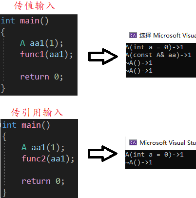
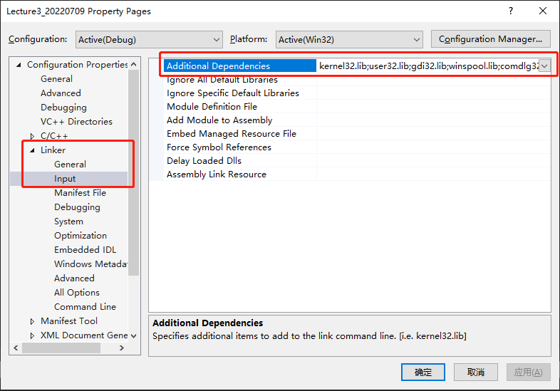
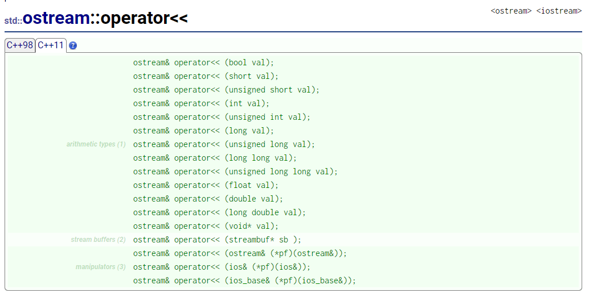
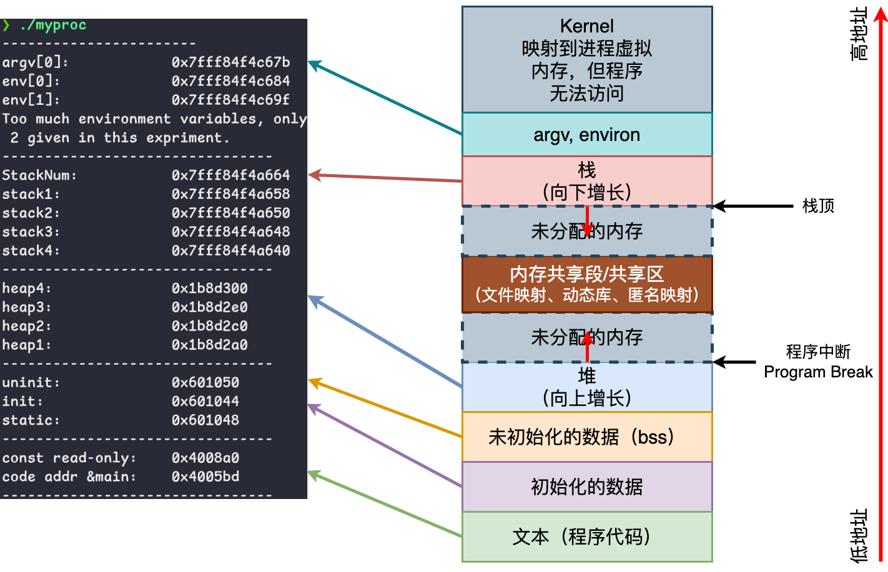
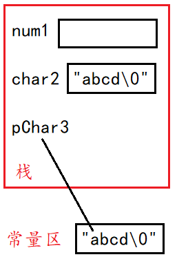

-- https://www.modernescpp.com/index.php/c23-the-next-c-standard/

# 数据类型

## *引用*

注意：这部分特指左值引用

### 引用的概念

引用 reference 不是新定义一个变量，而是给已存在变量取了一个别名，**编译器不会为引用变量开辟内存空间，它和它引用的变量共用同一块内存空间**

`&` 操作符：和类型在一起的是引用，和变量在一起的是取地址

### 引用特性

* 引用本身不能修改。但可以通过引用来修改它所引用的东西的值
* 引用在定义时必须初始化，且必须用左值初始化
* 一个变量可以有多个引用
* 某个引用一旦已经引用了一个实体后，不能再引用其他实体
* 除了const和类以外，其他的引用必须严格类型匹配

```cpp
int a = 1;
int& b = a; // 必须初始化

int& c = a; // 同一个变量可以有多个引用

int x = 10;
b = x; // 将会同时赋值给b和a，因为b和a是同一个地址

c = x; // 这个例子并不是说c重新引用了x这个实体，而是说x通过c这个引用间接赋值给了c所引用的a
// 因为&c代表的是给c取地址，所以其实C++中并没有语法来表示重新引用其他实体
```

### 引用的本质

上面的引用特性，特别是前两条，其实和顶层const /  const pointer 的特性是一样的

```c++
int a = 10;
int* const pa = &a; // 顶层 const
int& ra = a; // 引用，引用就是用指针来实现的
```

其实引用的底层就是指针：**引用是一个指向不可变的、被编译器自动解引用的指针，即，引用是一个被编译器自动解引用的“本身是常量的指针”**

### <span id="lvalue">使用场景</span>

* 函数传参：**函数传参本质上和变量的初始化过程是一样的**，都是把一个右值传给左值
  
  * 传值传参 passed by value 需要拷贝。C中常用指针来传递参数，从而达到修改输出的目的，但是比如在链表中要修改指针自身的时候要传二级指针就很麻烦
  
  * 引用传参 passed by reference/传引用调用 called by reference
  
    * 输出型参数，突破函数只能返回一个值的限制
  
      ```cpp
      typedef struct SeqList {
              //...
      }SL;
      void SLPushBack(SL& s, int x) {
              //...
      }
      int main() {
              SL sl;
              SLPushBack(sl); // 不用传指针了
      }
      ```
  
    * 大对象传参，减少拷贝，提高效率
  
* 做返回值
  * 传值返回（见C语言中的函数栈帧），小对象放寄存器，大对象放上层栈帧
    > 做法是将return的值装载到一个寄存器中，并将寄存器中保存的值给原函数中的接收变量。如果是将临时变量z设置为静态变量z，即 `static int z`。那么z会被保存到静态区中，并不会被销毁。但编译器仍然会选择将z的值加入到寄存器中生成临时拷贝后返回给上层
  * 传引用返回的问题
    * 若要return一个在函数栈帧中新开辟的变量，则return的结果是未定义的。因为栈帧调用结束时，系统会清理栈帧并置成随机值，那么这里ret的结果就是随机值。因此该程序使用引用返回本质是不对的，越界后结果没有保证。因此传引用返回的前提是**出了函数作用域，返回对象就销毁了，那么一定不能用引用返回，一定要用传值返回**
    * 修改方式
      * 将Count中的int放到静态区中，这样Count调用结束，栈帧销毁后，静态区中的int也不会被销毁
      * malloc出来的内存是在堆上也不会被销毁，因此传引用返回可以应用到顺序表等数据结构中提高效率

        ```cpp
        // 错误
        int& Count() {
                int n = 0;
                n++;
                // ...
                return n;
        }
        // 放到静态区中传引用返回
        int& Count() {
                static int n = 0;
                n++;
                // ...
                return n;
        }
        int main() {
                int ret = Count();
                return 0;
        }
        ```
    
  * 传引用返回的优势
    * 输出型返回对象，调用者可以修改返回对象，比如 `operator[]`
    * 减少拷贝

### 例子：传引用与传值在类中的应用

```cpp
// 实例
#include <iostream>
using std::cout;
using std::endl;
class A {
public:
    A(int a = 0) {
        _a = a;
        cout << "A(int a = 0)->" << _a << endl;
    }
    // A aa2(aa1);
    A(const A& aa) {
        _a = aa._a;
        cout << "A(const A& aa)->" << _a << endl;
    }
    ~A() {
        cout << "~A()->" << _a << endl;
    }
private:
    int _a;
};

void func1(A aa) {} //传值传参
void func2(A& aa) {} //传引用传参

A func3() {
    static A aa(3);
    return aa;
}
A& func4() {
    static A aa(4);
    return aa;
}
```

* 中间临时量 temporary object 问题，具体看《程序员的自我修养--链接、装载与库》10.2.3 函数返回值传递机制
  
  * 函数的返回对于1-8字节的小对象，直接通过eax寄存器存放的临时量返回。注意：**这个临时对象编译器默认将其设置为const，即临时变量具有常性**
  * 对于大于8字节的大对象，会在上层栈帧开辟temp空间返回
  
* 输入

  

  * 传值输入：需要调用拷贝函数，压栈时创建临时的形参，将实参拷贝给形参后调用形参，调用拷贝构造函数有栈帧开销和拷贝临时量的空间浪费，从上图试验中可以看出，传值需要多调用拷贝和析构，开销很大
  * 传引用输入：不需要调用拷贝构造函数，直接传递引用
  * 结论：传引用和传值对于内置类型效果不明显，都需要4个或8个字节。但对自定义类型效果明显，传引用不需要调用拷贝构造进行拷贝。内置类型还是传值好一些

* 输出

  

  * 传值输出：需要调用拷贝构造函数拷贝生成一个**临时量**，然后将临时量的值返回给外层函数的接收变量，栈帧销毁后一块销毁，即传值返回不会直接返回原来栈帧中的对象，而是返回对象的拷贝。调用拷贝构造函数有栈帧开销和拷贝临时量的空间浪费
  * 传引用输出：不需要调用拷贝构造函数，直接传递引用
  * 结论
    * 调用拷贝构造函数有栈帧开销
    * 自定义类型有时需要深拷贝
    * 自定义类型往往比较大

### 指针与引用的关系

* 指针和引用用途基本是相似的，但指针更强大也更危险
* 使用场景
  * 链表定义中不能使用引用，因为引用必须要初始化赋值且引用不能更改指向
* 语法特性及底层原理
  * 语法角度来看引用没有开空间，指针开了4或8字节空间
  * 底层原理来看，引用底层是用指针实现的
* Google 风格规定：不可变的非内置类型参数用 const 引用，可变的非内置类型参数用指针

## *联合体*

### 受限联合体

联合体的多个对象共用一片内存的情况对于节省内存来说是非常实用的，比如 `std::allocator` 在管理其 free list 时就用到了联合体

但是联合体在C++中的使用并不广泛，因为C++98规定了联合体的成员变量的类型不能是一个非平凡 non-trivial 类型，也就是说它的成员类型不能有自定义构造函数。比如说下面的联合体U的成员变量x3就不行

```c++
// C++98
Union U {
	int x1;
	float x2;
	std::string x3; // 错误
}
```

### 非受限联合体

> C++委员会在新的提案当中多次强调 “我们没有任何理由限制联合类型使用的类型” 。在这份提案中有一段话非常好地阐述了 C++的设计理念,同时也批判了联合类型的限制对这种理念的背叛，这段话是这样说的：当面对一个可能被滥用的功能时，语言的设计者往往有两条路可走，一是为了语言的安全性禁止此功能，另外则是为了语言的能力和灵活性允许这个功能，C++的设计者一般会采用后者。但是联合类型的设计却与这一理念背道而驰。这种限制完全没有必要,去除它可以让联合类型更加实用。

实际上指针就是第二种设计思路的很好体现。因此C++11解除了上面这种不合理的规定

但是当引入了非受限联合体之后又一个迫在眉睫的问题出现了。如何精确初始化联合体的成员对象？因为每个成员都共享部分内存，按顺序依次初始化显然是不合理的。因此C++11把这个任务交给了程序员来完成。若联合体中有成员是非平凡类型，那么这个联合类型的特殊成员函数将被设置为隐式删除，也就是说我们必须自己至少提供联合类型的构造和析构函数

而若要写构造和析构，又很难知道到底会用到哪些数据类型。所以一种推荐的方法是给出空的构造和析构函数，这样可以通过编译。然后在使用的时候用定位new来初始化

```c++
union U { 
	U() {}
	~U() {}
    int xl;
    float x2;
    std::string x3;
    std::vector<int> x4;
};

int main() {
	U u;
	new (&u.x3) std::string ("hello world"); // 定位new
    std::cout << u.x3 <＜ std::endl;
    u.x3.~basic_string();
    new (&u.x4) std::vector<int>;
    u.x4.push_back (58);
    std::cout << u.x4[0] << std::endl;
    u.x4.~vector();
}
```

另外，联合体中若要使用静态成员的话，定义和使用方法和类中是一样的

虽然C++11非受限联合体的引入表明了C++委员会对C++灵活性的坚持，但union仍然用的不多。且C++17之后大部分情况都可以用 `std::variant` 来代替联合体

## *枚举*

### 枚举类型的弊端

* 不安全的隐式类型转换：一个枚举类型不允许转换为另一个枚举类型，整型也无法隐式转换为枚举类型，但是**枚举类型可以隐式转换为整形**。从而导致两个枚举类型做运算，比如说比较的时候是可以的

  ```c++
  enum School {
  	principal,
  	teacher,
  	student
  };
  enum Company {
  	chairman,
  	manager,
  	employee
  };
  
  School x = student;
  Company y = manager;
  bool b = student >= manager; // 不同类型之间的比较操作
  b - x < employee;;
  int y = student; // 隐式转换为int
  
  School x = chairman; // 类型不匹配，无法通过编译
  Company y = student; // 类型不匹配，无法通过编译
  X= 1;                // 整型无法隐式转换到枚举类型
  ```

* 作用域问题：枚举类型会把其内部的枚举标识符导出到枚举被定义的作用域。也是就说，我们使用枚举标识符的时候，可以跳过对于枚举类型的描述。比如说上面的例子中定义student和manager的时候就没有给出枚举类型

  若在同一作用域中的不同枚举类型定义了相同名字的枚举标识就会引发编译错误

  ```c++
  enum HighSchool {
      student,
      teacher,
      principal
  }
  enum Universtiy {
      student,        // 枚举内标识符重复
      professor,
      principal       // 枚举内标识符重复
  }
  ```

解决作用域问题有两种思路

* 使用命名空间

  ```c++
  enum HighSchool {
      student,
      teacher,
      principal
  }
  namespace foo {
  enum Universtiy {
      student,
      professor,
      principal
  }
  }
  ```

* 用类对枚举类型进行二次封装

  ```c++
  class AuthorityType {
      enum InternalType {
          ITBan，
          ITGuest，
          ITMember，
          ITAdmin，
          ITSystem，
      };
  Internalrype self_;
  public:
  	AuthorityType (Internalrype self) : self_(self) {}
  	bool operator<(const AuthorityType &other) const { return self_ < other.self_; }
  	bool operator>(const AuthorityType &other) const { return self_ > other.self_; }
  	// ... 其他的运算符重载
  	const static AuthorityType Ban, Guest, Member, Admin, System;
  };
  
  #define DEFINE_AuthorityType(x) const AuthorityType AuthorityType::x(AuthorityType::IT ## x)
  DEEINE_AuthorityType(System);
  DEFINE_AuthorityType(Admin);
  DEFINE_AuthorityType(Member);
  DEFINE_AuthorityType(Guest);
  DEFINE_AuthorityType(Ban);
  ```

  解释一下上面的宏定义：## 运算符用于将两个符号（标识符、宏参数等）粘合在一起，创建一个新的符号。比如说当调用`CONCAT(foo, bar)`，它会展开为新的标识符 `foobar`

  ```c++
  #define CONCAT(x, y) x##y
  ```

  在我们的场景中，调用DEFINE_AuthorityType(x)的效果就是定义了一个 const AuthorityType类型的变量 AuthorityType::x，它用AuthorityType::Tx（拼接后）来初始化

  现在将枚举类型变量封装成类私有数据成员，保证无法被外界访问。访问枚举类型的数据成员也必须通过对应的常量静态对象。另外根据C++标准，访问静态对象必须要用 `::` 指定对象所属类型。也就是说，如果我们想访问 ITSystem 枚举常量的时候要用 `AuthorityType::System` 才能编译通过

  虽然这在一定程度上解决了之前的问题，但让代码变得很冗长

* 枚举常量的类型未定义，MSVC可能处理为int，GCC处理为unsigned int

### 强枚举类型

C++98的枚举类型存在上面这些弊端，C++11推出了强枚举类型 strongly typed enum class试图来克服这些问题。为了兼容C++98的枚举，也保留了老版本的enum。以下是新特性

* 枚举标识符属于强枚举类型的作用域，此时无法从外部直接访问它们，必须要加上枚举类型名

* 枚举标识符不会隐式转换为整型，之前出现过的两个不同枚举类的枚举常量比较的情况不会出现了

* 能指定强枚举类型的底层类型，**底层类型默认为int类型**。在定义的时候通过 `:` 来指定枚举常量的类型

  ```c++
  enum class HighSchool : unsigned int {
      student,
      teacher,
      principal
  }
  ```

通过在enum后加上class来定义强枚举类型

C++11除了让强枚举类型可以指定枚举常量的数据类型，也可以让老枚举类型指定

### 初始化列表有底层类型的枚举类型（17）

C++17支持让强枚举类型通过初始化列表来初始化，因为强枚举类型有默认的底层类型int，而枚举类型则一定要是指定了底层类型之后才允许使用初始化列表来初始化

```c++
enum class HighSchool {
    student,
    teacher,
    principal
}

HighSchool h{1};
```

### 使用using打开强枚举类型

## *C++的强制类型转换*

<https://learn.microsoft.com/zh-cn/cpp/cpp/casting-operators?view=msvc-170>

### 为什么C++需要四种类型转换

C++继承了C语言的隐式类型转换和显式类型转换体系，可以看C.md类型转换部分。C++不建议使用隐式类型转换，比如它提供了explicit来禁止隐式转换，这样可以避免一些不易察觉的错误的发生。C++更推荐使用在真的知道自己在做什么的时候使用规范的C++显示强制类型转换

使用隐式类型转换的另一个问题是会给阅读代码的人造成困惑，无法知道隐式转换到底是写代码的人的刻意为之，还是一个隐藏的bug

这里有一个经典的错误可以看Cpp.md的string类模拟实现部分的insert部分：[经典隐式类型转换错误](#经典隐式类型转换错误)

强制类型转换的形式为 **`cast_name<type>(expression);`**

RTTI思想和 `dynamic_cast` 会在 *面向对象.md* - 多态部分介绍

### `static_cast` 用于非多态类型转换

<https://learn.microsoft.com/zh-cn/cpp/cpp/static-cast-operator?view=msvc-170>

```cpp
double d = 12.34;
int a = static_cast<int>(d);

void *p = &d;
double *dp = static_cast<double*>(p); //规范使用void*转换
```

`static_cast` 是一种**相对安全**的类型转换运算符，它可以将一种类型转换为另一种类型。`static_cast` 可以执行隐式类型转换，例如将整数类型转换为浮点类型，也可以执行显式类型转换，例如将指针类型转换为整数类型。`static_cast` 进行类型转换时会执行一些类型检查和转换，以确保类型转换是合法的

* f任何具有明确定义的类型转换，只要不包含底层const，都可以使用 `static_cast`
* 任意空指针转换都可以用 `void *` 做媒介
* **存在继承的但没有多态的类**之间的类型转换：派生转基类 上行 derived-to-base 是允许的，但反过来下行 base-to-derived 是不允许的，因为编译器无法自动确定如何构造一个派生类对象，因为基类对象可能不包含派生类的所有数据成员，也不调用派生类的构造函数。这可能导致未定义行为，例如访问未初始化的成员或调用未定义的行为
* 存在继承的但没有多态的类指针/引用之间的转换是可以转的：上行可以，下行是不安全的，用派生类的指针可以看到的范围大于等于基类的指针，可能会造成危险的越界。不是很理解为什么编译器为什么不和上一条对象转换一样直接把这个下行给禁止了，据说是因为运行时检查会有开销，静态情况下无法判断类继承情况，所以提供了这种方式让开发人员自己斟酌使用
* 存在多态的类指针/引用之间的转换可以随便转但是某些下行是不安全的，要用dynamic_cast

举两个内存池项目中的例子

1. 有 ` T *obj = nullptr;` 和 `char *_memory = nullptr;`，`obj = (T *)_memory` 可以通过编译，而 `obj = static_cast<T *>(_memory) ` 会报错：`invalid ‘static_cast’ from type ‘char*’ to type ‘TreeNode*’ 。编译器检查到这两个类之间没有定义明确的类型转换，故禁止了转换
2. `void *next = *(static_cast<void **>(_freeList)` 从 `*` 转换成 `**` 是可以的

### `reinterpret_cast` 用于对位进行简单的重新解释

C++类型转换之reinterpret_cast - 叫啥名呢的文章 - 知乎 https://zhuanlan.zhihu.com/p/33040213

`reinterpret_cast<type>(expression)` 可以为运算对象的位模式提供低层次上的重新解释，而**不进行任何类型检查或转换**。type和expresssion至少有一个是指针/引用

`reinterpret_cast` 主要用于以下情况：

1. `static_cast` 处理两个指针之间的转换时，必须要用 `void *` 来做转换媒介。如果我们确定两个指针或引用之间的相互转换不会有任何问题，则可以用 `reinterpret_cast` 将指针或引用类型直接转换为另一个指针或引用类型

2. 在某些特殊情况下，当需要使用指针或引用类型表示不同的对象类型时，可以使用 `reinterpret_cast` 进行类型转换。这通常发生在涉及底层硬件或操作系统接口的代码中

   ```c++
   int i = 10;
   int *i_ = reinterpret_cast<int *>(i); // 现在 *i == 0x0a了，可以用它去寻址
   
   int a = 1;
   int* pa = &a; // 假设pa是0x0b
   int pi = reinterpret_cast<int>(pa); // 现在pi就是11了
   ```

3. 在某些情况下，`reinterpret_cast` 也可以用于类型擦除，即将模板类型擦除为一个没有模板参数的类型，以便可以在运行时处理它们

`reinterpret_cast`的危险性 ⚠️：需要注意的是，使用 `reinterpret_cast` 进行类型转换时必须非常小心。由于它不执行任何类型检查或转换，如果类型转换不正确，可能会导致未定义的行为或错误的结果。因此，应该尽可能避免使用 `reinterpret_cast`，而优先考虑使用其他更安全的类型转换运算符，例如 `static_cast` 或 `dynamic_cast`

### `const_cast`

通过 `const_cast` 去除或者添加底层const属性 cast away the const，但是在**去除const属性后再进行写就是未定义的行为了**

```cpp
const char *pc;
char *p = const_cast<char*>(pc); //p和pc指向的是同一块区域，但p现在是非常量了
*pc = 2;
```

`const_cast` 常用于有函数重载的上下文中

```c++
const std::string &shorterString(const std::string &s1, const std::string &s2) {
	return s1.size() <= s2.size() ? s1 : s2;
}
// 如果是在学习、测试中这么写没什么问题
std::string &shorterString(std::string &s1, std::string &s2) {
	return s1.size() <= s2.size() ? s1 : s2;
}
// 但如果是在公司的工程项目中这么写则是很不好的代码，因为这是重复代码，重复代码就是说改了第一个就要手动改第二个
// 所以应该写成下面这种，当然前提是我们真的没有对原来的const写
std::string &shorterString(std::string &s1, std::string &s2) {
    auto &r = shorterString(const_cast<const std::string &>(s1), // 给参数添加const
                            const_cast<const std::string &>(s2));
    return const_cast<std::string &>(r);
}
```

## *nullptr*

本章内容部分选自 *Effective Modern C++* 的条款8：优先考虑使用nullptr而非0和NULL

我们可以通过auto 自动推导来看看nullptr、0和NULL分别是什么类型

```c++
auto a = 0;
auto b = NULL;
auto c = nullptr;
cout << typeid(a).name() << endl; // int
cout << typeid(b).name() << endl; // Win是int，Linux是long
cout << typeid(c).name() << endl; // std::nullptr_t
```

### 正确调用指针版本的函数重载

nullptr 不会造成0和NULL稍不留意就会遭遇的重载决议问题

```c++
void f(int); // f的三个重载版本
void f(bool);
void f(void*);

f(0); // 调用的是f(int)，而不是 f(void*）
f(NULL); // 可能通不过编译，但一般会调用f(int)。从来不会调用f(void*)
```

Linux中NULL的类型为long，long到int、bool和 `void *` 的转换可能是同样好的，此时编译器会报错

对于没有nullptr可用的C++98程序员而言，指导原则是不要同时重载指针类型和整型

下面是 `std::nullptr_t` 的定义， `std::nullptr_t` 可以隐式转换到所有的裸指针 raw pointer（即非智能指针），包括 `void *`。这就是为什么nullptr可以用来赋值给任意类型指针的原因了

```c++
#include <cstddef>
typedef decltype(nullptr) nullptr_t;
```

### 模板推导时不能混用

```c++
template<typename FuncType,
			typename MuxType,
			typename Ptr Typey>
auto lockAndCall (FuncType func,
				MuxType& mutex,
				PtrType ptr) -> decltype (func(ptr)) {
    MuxGuard g(mutex);
	return func(ptr);
}
```

## *优先使用 using 别名声明*

本章选自 *Effective Modern Cpp.md* - 条款9：优先考虑别名声明而非typedef

C语言和C++98都提供了用 typedef 给类型起别名，从而简化一些特别长的自定义类型

C++11规定了一种新的方法，称为**别名声明 alias declaration** ，用关键字using来定义类型别名，比如

```c++
using iterator = _list_iterator<T, Ref, Ptr>;
```

但是给指针这种复合类型和常量起类型别名要小心一点，因为可能会产生一些意想不到的后果

using 相较于 typedef 的优势主要是在跟模板相关的时候

* typedef 只能给一个实例化的类起别名，比如

  ```c++
  typedef Blob<string> StrBlob;
  ```

  若给要给模板起别名，则必须要在定义的类里面

  ```c++
  template<typename T> class myVector1 {
      typedef std::vector<T> type;
  }
  ```

* C++11标准允许我们为类模板直接定义一个类型别名，比如说下面的代码中，将twin定义为两个成员类型相同的一个模板pair的别名

  ```c++
  template<typename T> using myVector2 = std::vector<T>;
  ```

但真正的好处在于 using 可以避免使用 typenmame 来避免二义性

```c++
template<template T> Widge {
	typename myVector1<T>::type myVec1; // 使用了依赖名，要用typename
	myVector2<T> myVec2; // 不需要typename
}
```

## *新的字符串类型支持*

### C++98 wchar_t 的问题

C++98提供了一个wchar_t字符类型用它表示一个Unicode宽字符，并且为此提供了前缀L

§问题在于标准在定义 wchar_t 时并没有规定其占用内存的大小，这就导致了不同平台的实现差异。Win上wchar_t是一个16位长度的类型，而在Linux和macOS上wchar_t却是32位的。这就导致了不可跨平台

C++11 char16_t & char32_t

由于上面说的wchar_t由于定义不明确带来的移植困难，所以C++98时代实际上只能过通过char和char数组来存放Unicode宽字符，这非常不方便

C++11的char16_t和char32_t的出现解决了这个问题，它们明确规定了其所占内存空间的大小。char16_t和char32_t分别专门用来存放UTF-16和UTF-32编码的字符类型

### 前缀问题

同时C++11还为3种编码提供了新前缀，用于声明3种编码字符和字符串的字面量：UTF-8的前缀u8、UTF-16的前缀u和UTF-32的前缀U

不过在使用u8的时候存在一些问题。在C++11中u8只能作为字符串字面量（比如说 `"hello world"`）的前缀，而无法作为字符（比如说 `'c'`）的前缀。这个问题直到C++17才得以解决

```c++
char utf8c = u8'a'; // C++17 标准 
```

### C++20 char_8

因为UTF-8采用的是可变长编码，因此C++标准始终没有提供专用于支持它的数据类型。所以只能遗址用char数组来保存UTF-8编码字符

```c++
char utf8[] = u8"你好世界";
```

C++20新引入的类型char8_t可以代替char作为UTF-8的字符类型。char8_t具有和unsigned char相同的符号属性、存储大小、对齐方式以及整数转换等级

## *格式化字符串库（20）*

### `std::format`

std::format - Lancern的文章 - 知乎 https://zhuanlan.zhihu.com/p/355166681

`std::format` 是 C++20 中引入的一个格式化字符串的库，它允许你以一种更简洁和类型安全的方式进行字符串格式化。在使用 `std::format` 之前，通常我们使用 `sprintf` 或者其他类似的函数，但这些函数存在一些安全性和易用性的问题。`std::format` 的设计旨在解决这些问题

`std::format` 的使用基本和Python的格式化字符串是一模一样的。`std::format` 是一个函数模板，其原型为

```c++
template <typename ...Args>
std::string format(std::string_view fmt, const Args&... args);
```

`std::format` 接受一个格式化字符串（所谓格式化字符串是一种包含占位符的字符串，这些占位符在运行时被具体的值替代。这样的字符串通常用于输出信息时，以便以一种结构化和可读的方式呈现数据）作为第一个参数，然后使用**花括号 `{}` 表示占位符**，占位符中的内容将被后续参数替换

```c++
#include <format>
#include <iostream>

int main() {
    // 格式化字符串
    std::string formattedString = std::format("Hello, {}!", "world");
    // 输出结果
    std::cout << formattedString << std::endl;

    return 0;
}
```

### 为自定义类型指定格式化方法

`std::format` 可以支持对自定义的数据类型进行格式化

### 补充：第三方fmt库

`fmtlib/fmt ` 格式化库提供了类似于 C++20 中的 `std::format` 的字符串格式化功能，它的目标是提供高性能的、类型安全的字符串格式化，语法上类似于 Python 中的字符串格式化

`fmt::format` 和 C++20 中的 `std::format` 在使用上非常相似，因为 `fmt::format` 的设计灵感就来自于 C++20 中的 `std::format`。两者都提供了类似的语法和功能，以一种更现代和类型安全的方式进行字符串格式化

主要的相似之处包括：

1. 使用花括号 `{}` 作为占位符
2. 支持多种类型的格式化，包括整数、浮点数、字符串等
3. 允许在占位符中使用格式说明符，例如 `:.2f` 表示浮点数保留两位小数

虽然在使用上很相似，但需要注意的是，`std::format` 是标准 C++ 的一部分，而 `fmt::format` 是一个单独的第三方库（fmt库），它在C++20之前就已经存在了，并为那些尚未升级到C++20的项目提供了类似的功能

在C++20及之后的标准中，优先选择使用 `std::format`，因为它是标准库的一部分，有望成为C++中的通用标准。而对于早期标准的项目，或者对于不支持C++20的编译器，可以考虑使用 `fmt::format` 这个第三方库

## *属性*

### 属性标准的出来

程序员又需要和编译器沟通的需求，从而可以为某些实体添加一些编译时额外的信息（有点类似于 `#pragma`），这种指令被称为属性 attribute

为了避免又创造出一个新的关键词乃至于引起一些需要维护老代码的麻烦，同时又必须让这些扩展内容不至于污染标准的命名空间，所以C++98标准保留了一个特殊的用户命名空间：双下划线关键词，以方便各大编译器厂商能够根据需要添加相应的语言扩展

在C++11之前，GCC和MSVC就已经支持了这一功能，比如 GCC 的 `__attribute__` 和 MSVC 的 `__declspec`

由于早先的属性实现基本上完全是由编译器自行实现的，彼此之间并不兼容，甚至部分关键属性导致了语言的分裂。为了规范和便于使用，C++11～C++20 出台了几个标准属性

### 标准属性说明符的语法

```c++
[[attr]] [[attr1, attr2, attr3(args)]] [[namespace::attr(args)]]
```

以双中括号开头、以反双中括号结尾,括号中是具体的属性

### noreturn (11)

### carries_dependency (11)

### deprecated (14)

### fallthrough (17)

### nodiscard (17)

### maybe_unused (17)

### likely & unlikely (20)

### no_unique_address (20)

# 基本语法更新

## *mutable关键字*

`mutable` 关键字是C++引入的修饰符，它主要用于放宽常量成员函数（即const成员函数）内部对某个特定成员变量的修改限制

在一个类中，如果将成员函数声明为了 `const`，这表明该函数不会修改类对象的任何成员变量。普通的成员变量在这样的 `const` 成员函数里是无法被修改的，因为编译器会进行检查以保证这一点

然而在某些情况下，我们可能需要在`const`成员函数中改变一些成员变量的值，而这些变量通常是那些不影响对象外部状态（例如，它们可能只是用于缓存或者懒加载等功能）的变量。在这种情况下，可以使用`mutable`关键字来修饰这些成员变量

比方说下面的例子中

```C++
class MyClass {
public:
    mutable int cache; // 可以在const成员函数中被修改
    int value;

    MyClass() : cache(0), value(0) {}

    void setValue(int v) const {
        // 这里可以修改cache，因为它被声明为mutable
        cache = v * v; 
        // 下面这行会产生编译错误，因为value不是mutable
        // value = v; 
    }
};
```

在上面的例子中，尽管`setValue`函数被声明为`const`，我们仍然能够修改`cache`成员变量，因为它被声明为`mutable`。但是，`value`成员变量没有被声明为`mutable`，所以在这个`const`函数中不能修改它，否则会产生编译错误

**`mutable`关键字的合理使用场景应当非常谨慎，因为它破坏了`const`成员函数的语义**。应当只在那些不属于对象逻辑状态的成员变量上使用它，比如用于性能优化的缓存、计数、互斥锁等

## *流程控制*

### 范围 for（11、17）

关于范围 for 的具体实现可以看 *STL.md*

### 支持初始化语句的if & switch（17）

C++17允许在执行条件语句之前执行一个初始化语句

```c++
if (init; condition) {}
else if (init; condition) {}
else {}
```

在初始化语句中声明的变量能够在 if 的作用域继续使用。事实上，该变量的生命周期会一直伴随整个 if 结构，包括 else if 和 else 部分

因为 if 中初始化的变量的生命周期仅仅在这个 if 中，所以配合 lock_guard 自动加锁、解锁是个不错的主意

```c++
if (std::lock_guard<std::mutex> lock(mx); shared_flag) {
    shared_flag = false;
}
```

switch同理，下面的例子出自 *现代C++语言核心特性解析*

```c++
switch (std::unique_lock<std::mutex> lk(cv_m); cv.wait_for(lk, 100ms)) {
    case std::cv_status::timeout:  
        break;
    case std::cv_status::no_timeout:
        break;
}
```

## *range（20）*

https://zhuanlan.zhihu.com/p/86809598

## *三向比较（20）*

# C++函数

## *C++版本*

C with classes `->` C++1.0 `->` ... `->` C++98（C++标准第一个版本，引入STL库）`->` C++11（增加了许多特性，使得C++更像是一种新语言）`->` C++14 `->` C++17 `->` C++20（自C++11以来最大的发行版，引入了许多新的特性）`->` C++23

## *命名空间 namespace*

 在大型的Project中，同一个作用域中可能存在大量同样命名的变量/函数/结构体等，C编译器无法解决这种冲突，C++通过命名空间解决了该冲突

C++最外层的命名空间是全局命名空间 global namespace。全局命名空间以隐式的方式声明，并且是在所有程序中都存在的。可以用 `::` 域访问符来显式地说明一个全局命名空间中的内容

### 定义命名空间

```cpp
namespace wjF {
    int rand = 1; // 定义变量
    int Swap (int* left, int* right) { // 定义函数
            int tmp = *left;
            *left = *right;
            *right = tmp;
    }
    struct Node {// 定义结构体或类
            struct Node* next;
            int val;
    };
}
```

* 命名空间嵌套

  ```cpp
  namespace N1 {
      // 各种定义...
      namespace N2 {
              // 各种定义...
      }
  }
  ```

* 同一个工程中允许多个相同名称的命名空间，编译器最后会合成为同一个命名空间

### 命名空间的展开和使用

* 不展开，加命名空间/指定空间访问

  ```cpp
  // 指定空间访问的操作符为 ::
  std::cout << "Hello World!" << std::endl; 
  ```

* using 声明（using declaration）：部分展开

  ```cpp
  using std::cout;
  using std::endl;
  std::cout << "Hello World!" << std::endl; 
  ```

* using 指示（using directive）：完全展开 

  ```cpp
  using namespace std;
  ```

建议：项目中，尽量不要展开std库。可以指定空间访问+展开常用的；日常练习可以展开

### 内联命名空间

C++11增强了命名空间的特性，提出了内联命名空间的概念，内联命名空间能够把空间内函数和类型隐式导出到父命名空间中，这样即使不指定子命名空间也可以使用其空间内的函数和类型了

内联命名空间的主要作用是用来帮助库作者无缝升级库代码，让用户尽量少地修改代码也能自由选择新老库版本。一般将当前最新版本的接口以内联的方式导出到父命名空间中

```c++
namespace Parent {   
    namespace V1 {       
        void foo() { std::cout << "foo v1.0" << std::endl; }   
    }    
    inline namespace V2 {       
        void foo() { std::cout << "foo v2.0" << std::endl; }   
    } 
}
```

### 模板特例化 & 命名空间

模板特例化必须定义在原始模板所属的命名空间中，只要我们在命名空间总声明了特例化，就能在命名空间外部定义它了

```c++
// 必须将模板特例化声明成std的成员
namespace std {
    template<> struct hash<Foo>;
}
template<> struct std::hash<Foo> {} // 命名空间外定义
```

### 简化命名空间写法

有时候打开一个嵌套命名空间可能只是为了向前声明某个类或者函数，但是却需要编写冗长的嵌套代码，这无疑是一种麻烦

```c++
namespace A {
    namespace B {
        namespace C{
            void foo() {}
        }
    }
}
```

C++17允许更简洁的嵌套命名空间写法

```c++
// 两种写法等价
namespace A::B::C {
    void foo() {}
}

```

C++20进一步简化了内联命名空间的定义方法。inline 可以出现在除第一个 namespace 之外的任意 namespace 之前

```c++
namespace A::B::inline C {
    int foo1() {} 
}
namespace A::inline B::C {
    int foo2() {} 
}
```

## *缺省参数/默认参数*

### 缺省参数概念

缺省参数 Default Parameter 是声明或定义函数时为函数的参数指定一个默认值。在调用该函数时，若没有指定实参则采用该形参的默认值，否则使用指定的实参

* 半缺省参数必须是位于左边，且不能间隔着给

  ```cpp
  void Func(int a, int b, int c=30); // 正确
  void Func(int a=10, int b=20, int c); // 错误，必须是在左边
  void Func(int a, int b=20, int c); // 错误，不能间隔着给
  ```

* 缺省参数不能在函数声明和定义中同时出现。当分离定义时，以声明为准，因为在汇编形成符号表时以声明中的定义为准

* 缺省值必须是常量或者全局变量，不能是局部变量

  ```cpp
  // wz、def和ht的声明必须出现在函数之外
  sz wd = 80;
  char def = ' ';
  sz ht();
  string screen(sz = ht(), sz = wd, char = def);
  string window = screen(); //调用screen(ht(), 80, ' ');
  void f2() {
      def = '*'; //重新赋值，改变默认实参的值
      sz wd = 100; //局部变量构成隐藏，但没有改变默认值
      window = screen(); //调用screen(ht(), 80, '*');
  }
  ```

### 缺省参数分类

* 全缺省参数

  ```cpp
  void Func(int a=10, int b=20, int c=30);
  ```

* 半缺省参数

  ```cpp
  void Func(int a, int b=20, int c=30);
  ```

### 缺省参数声明的问题

在给定的namespace中一个形参只能被赋予一次默认实参，因此函数的后续声明只能为之前没有默认值的形参添加默认实参，而且该形参右侧的所有形参必须都有默认值

通常应该在函数声明中指定默认实参，并将该声明放在头文件中

## *函数重载*

### 函数重载概念

* 函数重载 Function Overloading 允许在**同一作用域**中声明几个功能类似的同名函数。函数重载很方便，就像在使用同一个函数一样
* C++的名字查找发生在类型检查之前，所以函数重载必须是在同一作用域，否则会构成同名隐藏
* 函数重载类型
  * 参数个数不同

    ```cpp
    int func(int a, double b);
    int func(int a, double b, char c);
    ```

  * 参数类型不同。因为权限的放大缩小，所以若只有const不同也构成重载

    ```cpp
    int func(int a, char b);
    int func(double a, double b);
    ```

  * 参数类型顺序不同

    ```cpp
    int func(int a, double b);
    int func(double a, int b);
    ```

    注意：**只有返回值不同是不构成函数重载的**，因为编译器是根据传递的实参类型推断想要的是哪个函数，所以若只有返回类型不同则无法识别

### 函数匹配

函数匹配 function matching/重载匹配 overload resolution

* 编译器找到最佳匹配 best match，并生成调用该函数的代码
* 无匹配错误 no match
* 二义性调用 ambiguous call

### C++支持函数重载的原理 -- 符号修饰 Name-decoration/符号改编 Name-mangling

只有声明的函数或变量在本目标文件中是没有分配虚拟地址的，只有在定义之后才会分配内存地址。在编译器的链接过程中，会去找总符号表（同名的cpp文件和其头文件生成一份符号表），里面记录着不同函数的地址。只有声明的函数可以通过定义文件的符号表找到自己的地址，若没有找到就会报链接错误（编译阶段只报语法错误）

在Linux中利用`objdump -S`指令，可以发现在Linux的gcc编译器中，C语言编译器直接用函数名作为其符号表的命名，比如`<Func>`；而C++编译器则会进行函数名修饰，比如分别为`<_Z4Funcid>`和`<_Z4Funcii>`。修饰规则比较复杂，每种编译器在不同系统的修饰规则也不同。关于GCC的基本C++修饰规则可以看自我修养P88

binutils工具包里面了一个 `c++filt` 工具来解析被修饰过的名称

```shell
$ c++filt _Z4Funcid
Func(int, double)
```

符号修饰规则不仅用于函数重载，对于全局（静态）变量和（局部）静态变量也要进行符号修饰防止冲突

因为不同的编译器使用的符号修饰规则是不同的，所以不同的编译器编译产生的ELF文件是无法通过链接器连接到一块的，因为在符号表里找不到需要的符号，这是导致不同编译器之间不能互操作的主要原因之一

### C和C++互相调用库 `extern "C"`

* 生成静态库.lib和动态库.dll

* C++调用C库
  * C++中在调用C的头文件时使用 `extern "C"`：告诉C++的编译器，这里面的函数使用C的库实现的，用C的规则去链接查找它们

    ```cpp
    extern "C" {
            #include "....h"
            // ...
    }
    extern "C" int var; //单独声明某个符号为C语言符号
    ```
    
  * 附加库目录
  
    
  
  * 附加依赖项
  
    

一种更通用的方式是在系统头文件中添加 `__cplusplus` 条件编译，这样可以让C++能调用C，也能让C调用C++。比如说C语言共享库 `string.h` 中的 `memset` 函数

```cpp
#ifdef __cplusplus
extern "C" {
#endif
void *memset(void *, int, size_t);
#ifdef __cplusplus
}
#endif
```

## *内联函数 Inline*

* 定义：以 `inline` 修饰的函数叫做内联函数，编译时C++编译器会在调用内联函数的地方展开，**没有函数调用建立栈帧的开销**，而是直接替换成了一些机器代码，因此内联函数提升程序运行的效率
* 使用场景：堆排序和快速排序中需要被频繁调用的Swap函数

### C语言中用宏函数来避免建立和销毁栈帧

* 宏的优点：复用性变强、宏函数提高效率，减少栈帧开销、不用进行传入参数的类型检查（用enum）
* 宏的缺点：可读性差，复杂不易编写、没有类型安全检查、不方便调试（预处理阶段就被替换掉了）

```cpp
#define ADD(a, b) ((a) + (B))
// 记住两个特殊场景
ADD(1, 2) * 3;
ADD(a | b, a&b);
```

### inline特性

* inline是一种以空间换时间的做法，若编译器将函数当成内联函数处理，在编译阶段，会用函数体替代函数调用。缺陷是可能会使文件目标变大；优势是少了调用开销，提高程序运行效率
* inline对于编译器而言只是一个建议，不同编译器关于inline实现机制可能不同
* **inline不建议声明和定义分离，分离会导致链接错误。inline不会被放进编译生成的符号表里**，因为inline定义的函数符号是不会被调用的，只会被展开使用。推荐声明+定义全部写在头文件中（这也符合模块化设计声明和定义分离的设计初衷，便于使用）

### inline 定义类的非常量静态成员（17）

当定义类的非常量静态成员在头文件中，如果是没有做头文件的包含控制的话当 include 到多个文件中，头文件中的类的非常量静态成员会因为类型重定义报链接错误。关于这个错误可以看 *C.md* - 头文件部分的 Singleton 例子

C++17 将 inline 扩展到定义类的非常量静态成员变量的能力

## *`std::optional`（17）*

https://blog.csdn.net/qq_21438461/article/details/131892081

### 设计理念

`<optional>` 是 C++17 中引入的标准库类型之一，用于**表示一个可能包含值的对象** `std::optinal` represents a variable that may or may not contain a value。它的主要目的是解决函数返回可能失败或无效的情况，而无需依赖自定义特殊的错误代码或异常。在某种程度上，它类似于指针，但它提供了更多的语义信息和安全性保障

一般会用特殊值或者指针，比如说 -1 或 nullptr 来作为出错或者特殊的状态，然而使用指针可能会引入空指针的问题，增加了代码的复杂性。而如果使用特殊值则可能会限制函数的返回值范围，或者引入额外的错误检查代码

另外 `std::optional`没有异常处理的开销，因为它不需要抛出和捕获异常

使用 `std::optional` 可以更清晰地表达代码的意图，减少错误处理的复杂性。它可以用于代替指针，避免空指针异常，也可以用于避免抛出异常的开销

### 成员函数

Workflow：`std::optional` 可以存储一个值，也可以为空。首先可以使用 `.has_value()` 成员函数来检查是否有值。如果存储了一个值，可以使用 `.value()` 成员函数来获取这个值

* `has_value()`：检查`std::optional`是否包含值
* `T& value()`：访问`std::optional`包含的值
* `T value_or(T&& default_value)`：访问`std::optional`包含的值，如果没有值，则返回默认值
* `void reset()`：清空 `std::optional`包含的值
* `T& emplace( Args&&... args )`：替换`std::optional`包含的值

### 实现

```c++
// 简化实现
template <typename T>
class optional {
    union {
        T value; // 实际的值
        char dummy; // 用于表示没有值的情况
    };
    bool has_value; // 标记是否包含值
};
```

为了实现既可以表示有效值也可以表示无效值的效果，内部采用 union

### 应用

* 处理可能不存在的返回值，如果是值不存在的情况就返回一个同样定义在 `<optional>` 中的常量 `std::nullopt` 就可以了

  ```c++
  #include <iostream>
  #include <optional>
  
  std::optional<int> divide(int a, int b) {
      if (b != 0) {
          return a / b;
      } else {
          return std::nullopt; // 表示没有值
      }
  }
  
  int main() {
      auto result = divide(10, 2);
      if (result.has_value()) {
          std::cout << "Result: " << result.value() << std::endl;
      } else {
          std::cout << "Division by zero!" << std::endl;
      }
      return 0;
  }
  ```

* 优化代码可读性

* 在元模版编程中的作用


## *结构化绑定（17）*

### 多个返回值的场景

结构化绑定 structured binding

### 结构化绑定的类型

* 绑定到原生数组
* 绑定到结构体和类对象
* 绑定到元祖和类元祖的对象

# 复杂的const问题

C++11引入的constexpr关键字是相当令人困惑的，只有随着后续的C++14和C++17对它的调整，才让它变得更好用一些。因为constexpr是这样一个跨越了多个C++标准的关键字，我们不在这边给出，可以查看 *EffectiveModernCpp.md* 的条款15

因为函数的传参行为和const与变量、引用和指针的初始化是一样的，所以直接用函数传参的例子来总结const

```cpp
// const与变量没有权限关系
// 因为变量都是拷贝，没有内存关系
void test_v1(const int i) { printf("%d\n", i); }
void test_v2(int ci) { printf("%d\n", ci); }

// const与引用有权限放大问题
// 只能是int或const int 赋值给 const int&，不能const int赋值给int&
void test_r1(const int &ri) { printf("%d\n", ri); }
void test_r2(int &ri) { printf("%d\n", ri); }

// const与指针有权限放大问题
// 只能是int*或const int* 赋值给 const int*，不能const int*赋值给int*
void test_p1(const int *pi) { printf("%d\n", *pi); }
void test_p2(int *pi) { printf("%d\n", *pi); }

int main()
{
    int i = 1;
    test_v1(i);

    const int ci = 2;
    test_v2(ci);

    int *pi = &i;
    const int *cpi2 = &i; //用const int*指向int* 权限缩小ok
    const int *cpi = &ci;
    //int *pci = &ci; //用int*指向const int* 权限放大了报错

    test_r1(i);
    test_r1(ci);
    test_r2(i);
    //test_r2(ci); //权限放大

    test_p1(pi);
    test_p1(cpi);
    test_p2(pi);
    //test_p2(cpi); //权限放大
    return 0;
}
```

## *const与变量*

const的核心思想是让一个对象不可被修改，一旦尝试修改就报错

```c
const int buffSize = 512; // 规定缓冲区的大小
buffSize = 1024; // 对const赋值，会直接报错
```

### 修饰变量：置入常量区

* 局部变量：一旦写定就不能再更改了，所以const对象必须初始化。通常被用来修饰只读的数组和字符串
* 全局变量：这种写法应当尽量避免，很容易造成定义冲突
* 编译器通常不为普通const常量新开存储空间，而是将它们保存在符号表中，这使得它成为一个编译期间的常量，没有了存储与读内存的操作，使得它的效率也很高

### const与初始化

因为const对象一旦创建后它的值就不能再被更改，所以**const对象必须要被初始化**

**利用const对象去初始化另外一个对象不会对被初始化的对象造成任何影响**，这是因为const对象处于 `.rodata` 段（所谓的常量区域），而新的变量可能在任意位置（`.rodata`、`.data`、`.text`），初始化只是将const对象的值放到寄存器里，然后再mov给新的对象。一旦拷贝完成，const对象和被初始化的新对象也就没有半毛钱关系了

### const的底层

对于全局const常量，比如 `const char* ch = "abcdef";` 都会放到 `.rodata`（常量区）只读段。这个段属性（标识位） `sh_flag` 为 `SHF_ALLOC`，没有 `SHF_WRITE`，所以不允许修改它（自我修养P79）

全局const常量会将 `ch` 加入符号表中，因此在其他文件中使用它也需要extern声明，和普通变量的定义和声明是一样的

而局部const变量，则不会放入符号表中，在栈帧中放到某个页中，通过将页属性设置为只读就可以保证局部变量为只读

## *const与指针*

### 常量指针 & 指针常量

https://www.cnblogs.com/zpcdbky/p/4902688.html 这篇文章很好地阐述了为什么常量指针 & 指针常量的定义是一团乱麻，几乎是学一次忘一次。指针常量 & 常量指针是中文翻译的产物，是非常糟糕的翻译，不要去记这个翻译

个人觉得记忆的最好方式还是通过编译器如何 parse 指针的角度来区分。因为 `int*` 才是一个完整的类型，所以 `*` 的左边是修饰类型的（即地址指向的对象的类型），`*` 的右边是修饰对象本身的


const修饰指针的三种情况

* 常量指针 pointer to const/底层const low-level const：`int const *p` 或者 `const int *p`：cosnt修饰的是 `*p`，不能修改 `*p`所指向的值，但可以修改p地址本身
* 指针常量 const pointer/顶层const top-level const：`int* const p`：p一个指针常量，不能修改指针p，即p指向的地址不可修改，但 `*p` 指向的地址所存储的值可以修改
* `const int* const p`：同时是指针常量和常量指针

底层const和顶层const是C++ Primer引入的概念。可以这么理解：顶层const是指const修饰的是对象的本身，而底层const则是从底层来看是某个对象的地址，const修饰的是这个地址指向的对象。注意：**对顶层const取指针会得到一个底层const**，因为底层const指向常量

注意⚠️：处于简洁的目的，在笔者的笔记中采用 pointer to const 和 const pointer 的记法

### 一些记忆方法（deprecated）

下面是一些记忆方法，其实并没有什么用，因为写了也就不删了

快速的记忆方法：从右到左，遇到p就翻译成p is a，遇到 `*` 就翻译成 point to，比如`int const *p` 是 p is a point(er) to int const；`int* const p` 是 p is const point to int 。如何理解常量指针与指针常量？ - 李鹏的回答 - 知乎 https://www.zhihu.com/question/19829354/answer/44950608

一个永远不会忘记的方法，**const默认是修饰它左边的符号的，如果左边没有，那么就修饰它右边的符号**

1.  `const int *p` 左边没有，看右边的一个，是int，自然就是p指针指向的值不能改变

2.  `int const *p` 此时左边有int，其实和上面一样，还是修饰的int
3.  `int* const p` 修饰的是\*，指针不能改变
4.  `const int *const p` 第一个左边没有，所以修饰的是右边的int，第二个左边有，所以修饰的是 * ，因此指针和指针指向的值都不能改变
5.  `const int const *p` 这里两个修饰的都是int了，所以重复修饰了，有的编译器可以通过，但是会有警告，你重复修饰了，有的可能直接编译不过去

### 权限问题

只允许权限缩小或平移，不允许权限放大。简单的说就是 `int*`和 `const int*` 都可以赋值给 `const int*`，但是 `const int*` 不能赋值给 `int*`

* 当对常变量取地址时，必须要**将指针指向的量设为const**（常量指针 `int const *p`），否则会有权限放大问题；将指向const的 pointer to const 用const数据或非const数据的地址（权限缩小）初始化为或赋值是合法的

  ```c
  const int arr[] = {0};
  const int *ptr = arr; // 原来是const的数据，其指针指向的量也必须设置为const
  ```

  注意这里不要混淆了，不能用const数据初始化 const pointer，属于权限放大

* 但是只能把非const的指针赋给普通数据，否则会权限放大

  ```c
  const int arr[3] = { 0,1,2 };
  int *ptr = arr; // 编译器不会报错，但ptr权限被放大了，可以通过*ptr修改arr中的数据，这种写法仍然是错误的
  ptr[2] = 3
  ```

注意：当执行对象拷贝操作时，顶层const会被忽略。也就是说const对象是可以赋值给普通对象的。顶层const被忽略的原因在于，当执行对象拷贝的时候，对新的拷贝对象的操作不会影响到原来的对象，此时不会像底层const存在权限放大或缩小的问题

下面的例子中指针报错报的是 `const int*` 类型的值不能用于初始化 `int*` 类型的实体，而不是 `const int* const` 类型的值不能用于初始化 `int*` 类型的实体的原因就是因为顶层const被忽略了

```c++
  const int a = 10;
  int b = a; // 顶层const被忽略

  const int *const p = new int(10); 
  int *p1 = p; // 错误，权限扩大。 "const int*”类型的值不能用于初始化"int*”类型的实体
  int *const p2 = p; // 错误，权限扩大
  const int * p3 = p; // 错误，权限扩大

  int *p4 = &a; // 错误，权限扩大
  
  const int &r1 = 20;
  int &r2 = a; // 错误
  int &r3 = r1; // 错误
```

### constexpr变量

constexpr 是 C++11 引入的一个关键字，用于声明一个“常量表达式函数”，也可以用于声明一个“常量表达式变量”

constexpr指针的初始值必须是nullptr或者是0，或者是存储在某个固定地址中的对象

constexpr 的出现是为了方便程序员声明常量表达式，从而提高程序的效率。使用 constexpr 声明的常量表达式可以在编译时就被求值，从而避免了在运行时进行计算。**字面值类型 literal type** 是指在编译时就要被计算确定的值，因此 constexpr 不能被定义在函数体内，除了地址不变的static局部静态对象，所以 constexpr 引用能绑定到静态局部对象上

除了用于声明常量表达式函数和变量之外，`constexpr` 还可以用于要求函数或变量在编译时就必须被求值，避免栈开销，否则编译器会报错。这种约束可以帮助程序员写出更加高效和可靠的代码

```cpp
constexpr int factorial(int n) {
    return (n <= 1) ? 1 : (n * factorial(n - 1));
}

int main() {
    constexpr int result = factorial(5); // 在编译时就被求值
    static_assert(result == 120, "factorial(5) should be 120");
}
```

### 指针、常量和类型别名

## *const与引用*

### 常量引用 Reference to const 与权限放大问题

引用对象是const，即对常量的引用或者叫常量引用：对常量的引用不能被用作修改它所绑定的对象，注意：**常量引用本身必须是任意类型的const**，因为若引用本身不是const，就会有权限放大问题

```cpp
int a = 10;
int& b = a; // 权限平移
cout << typeid(a).name() << endl;
cout << typeid(b).name() << endl;

const int c = 20;
cout << typeid(c).name() << endl;
// int& d = c; // 权限放大，这么写是错误
const int d = c;

int e = 30;
const int& f = e; // 权限缩小，即e可以通过其他方式改变，但f不能改变e

int ii = 1;
double dd = ii; // 隐式类型转换
```

* 权限不能放大，但可以缩小，也就是说**可以用常量来引用非常量，但反过来不行**
* const引用具有很强的接受度，因为其权限比较小
* 若使用引用传参且函数内若不改变传入参数，建议尽量用const传参

### 例外：常量引用的类型不必严格匹配

```cpp
// double dd = (double)ii;
// cout << typeid(ii).name() << endl;
// 强制转换只是创建了一个double的临时变量，不改变原变量ii

// 和整体提升过程一样 在转换过程中产生的是具有常性的 const double 临时变量
// double& rdd = ii; // 因此这么写是错误的，本质原因是权限缩小
const double& rdd = ii;

const int& x = 10; // 甚至可以引用常量
```

初始化常量引用时允许用任意表达式作为初始值，只要该表达式的结果能隐式转换成功

## *const与函数*

函数传参时等同于变量赋值，所以它的规则和前面const与变量、引用、指针的关系一模一样

### const传参和返回的作用

* 修饰函数参数

  * 防止修改指针指向的内容
  * 防止修改指针指向的地址

* 修饰函数返回值

  若以传指针返回加const修饰，那么函数返回的内容不能被修改，且该返回值只能以加const修饰的同类型指针接收

  ```C
  const char* GetString(void);
  char* str = GetString(); // 错误
  const char* str = GetString(); // 正确
  ```

### const与函数重载

若参数是非指针或引用的普通变量，此时是拷贝传参，忽略 constness，所以此时不会构成函数重载

```cpp
void test(int x) {};
void test(const int x) {}; //redefinition 

void test(int &x) {};
void test(const int &x) {}; //正确 
void test(int *x) {};
void test(const int *x) {}; //正确 
```

但**若形参是某种类型的指针或引用，则通过区分其指向的是常量对象还是非常量对象可以实现函数重载**

当传递一个非常量对象或者指向非常量对象的指针时，编译器会优先选用非常量版本的函数（匹配优先）

### constexpr函数

constexpr是C++11标准引入的关键字

* 函数的返回类型及所有形参的类型都得是字面值类型（即算数类型、引用、指针等编译时确定的值）

* 函数体中个必须有且只有一条return语句

  ```cpp
  constexpr int new_sz() { return 42; }
  ```

constexpr函数和inline一样，主要是为了加快调用速度

inline和constexpr的多个定义要完全一致，所以一般都直接在头文件中定义一次

## *const与类*

在[const成员函数](#const成员函数)里有说明了

# C++的IO流

## *IO类关系总览*

### C语言的IO函数

* `scanf()/printf()` 处理终端/控制台IO
* `fscanf()/fprintf()` 处理文件IO
* `sscanf()/sprintf()` 处理字符串IO

C语言是面向对象的，只能指针内置类型

### C++IO流设计

什么是流 Stream？流是对有序连续且具有方向性的数据的抽象描述。C++流是指信息从外设向计算机内存或从内存流出到外设的过程

为了实现这种流动，C++实现了如下的标准IO库继承体系，其中 `ios` 为基类，其他类都是直接或间接派生于它


* `<iostream>` 类处理控制台终端
* `<fstream>` 类处理文件
* `<sstream>` 类处理字符串缓冲区
* C++暂时还不支持网络流的IO库

### ios 基类的成员函数

继承自 ios 的其他 IO 类都会有这些成员函数

* state flag

  ```c++
  bool good() const;
  bool eof() const; // 是否到末尾
  bool fail() const;
  bool bad() const;
  ```

* formatting 格式化

* 其他的

### C++标准IO流

C++标准库提供给了4个**全局流对象** `cin`，`cout`，`cerr`，`clog`。从下图可以看到 **`std::cin` 是一个 `istream` 类的全局流对象**


C++对这部分的设计并不是特别好，因此这几个对象在输出上基本没有区别，只是应用该场景略有不同

使用 `cin` 进行标准输入即数据通过键盘输入到程序中；使用 `cout` 进行标准输出，即数据从内存流向控制台(显示器)；使用 `cerr` 用来进行标准错误的输出；使用 `clog` 进行日志的输出

* `cin` 为缓冲流，相当于是一个 `char buff[N]`对象，键盘输入的数据保存在缓冲区中，当要提取时，是从缓冲区中

* 空格和回车都可以作为数据之间的分隔符，所以多个数据可以在一行输入，也可以分行输入。但若是字符型和字符串，则空格（ASCII码为32）无法用 `cin` 输入。字符串中也不能有空哦个，回车符也无法读入

  ```cpp
  // 2022 11 28
  // 输入多个值，默认都是用空格或者换行分割
  int year, month, day;
  cin >> year >> month >> day;
  scanf("%d%d%d", &year, &month, &day);
  scanf("%d %d %d", &year, &month, &day); //不需要去加空格
  
  //20221128 无空格
  scanf("%4d%2d%2d", &year, &month, &day); //scanf可以通过加宽度直接处理
  //cin在这种情况下反而会比较麻烦
  string str;
  cin >> str;
  year = stoi(str.substr(0, 4));
  month = stoi(str.substr(4, 2));
  day = stoi(str.substr(6, 2));
  ```

* `cin, cout` 可以直接输入和输出内置类型数据，因为标准库已经将所有内置类型的输入和输出全部重载了

  

* 对于自定义类型，可以重载运算符 `<<` 和 `>>`

  

  如上图是对string类的 `>>` 运算符重载，意思是支持了 `istream& is` 和 `string& str` 之间的 `>>` 运算

  这部分可以参考Date类中的 `<<` 重载

* OJ中的输入与输出

  ```cpp
  // 单个元素循环输入
  while(cin>>a) {
      // ...
  }
  // 多个元素循环输入
  while(c>>a>>b>>c) {
  	// ...
  }
  // 整行接收
  while(cin>>str) {
  	// ...
  }
  ```

  OJ中有时候可能会出现用 cin 和 cout 效率过不了的问题，可以考虑采用 `printf` 和 `scanf`。这是因为C++为了要兼容C语言，内部需要采取和C语言输入输出函数同步顺序的一些处理，因此可能会导致效率的下降

  因此还是建议在OJ中用 `printf` 和 `scanf`

### `istream` 类型对象转换为逻辑条件判断值

考虑有多组测试用例的情况，比如上面的代码中输入多组日期，那么要用

```cpp
char buff[128];
while (scanf("%s", buff) != EOF) {}
// or
while (cin >> str) {} //如何实现逻辑判断？
```

对于 `scanf()` 而言，这是一个函数调用，返回的是接收到的值的数目，因此很好理解，若写入失败（满了）或按 `ctrl+z`，就返回EOF，ASCII码中 `EOF==0`，因此while循环会被终止，可是 cin 是一个全局流对象，为什么它也等价于一个逻辑值，从而可以作为while循环的判断条件呢？

内置类型是可以隐式类型转换成自定义类型的，编译器会自动调构造和拷贝构造（有些编译器自动优化为只有自定义），反过来自定义类型也可以转换为内置类型，但是此时需要显式重载 `operator TYPE()`，比如重载 `operator bool()` 将自定义类型转换成bool内置类型

`cin >> str` 的返回值是 `istream` 对象，因此在istream类内部实现了 `operator bool()` ，因此当 `while (istream& obj)` 可以进行逻辑判断

`operator bool()` 全部是复用的ios基类的实现

## *判断IO状态*

### 条件状态

IO类定义了一些函数和标志，来帮助用户访问和操纵流的条件状态 condition state

在C++的输入输出库中，`std::ios_base::iostate` 是一个枚举类型，用于表示流的状态。它包括以下几个值：

* `std::ios_base::goodbit`：表示流的状态良好，没有错误
* `std::ios_base::badbit`：表示流的状态非常糟糕，可能发生了无法恢复的错误
* `std::ios_base::failbit`：表示流的操作失败，但错误是可恢复的
* `std::ios_base::eofbit`：表示流已经到达了文件末尾 End Of File

### 操作条件状态

提供了以下接口来查询流 `s` 的状态

```c++
s.eof();            // 若流s的eofbit置位，则返回true
s.fai1();           // 若流s的failbit或badbit置位，则返回true
s.bad();            // 若流s的badbit置位，则返回true
s.good();           // 若流s处于有效状态，则返回true
s.clear();          // 将流s中所有条件状态位复位，将流的状态设置为有效。返回void
s.clear(flags);     // 根据给定的flags标志位，将流s中对应条件状态位复位。flags的类型为strm::iostate。返回void
s.setstate(flags);  // 根据给定的 flags 标志位，将流s中对应条件状态位置位。flags的类型为strm::iostate。返回void
s.rdstate();        // 返回流s的当前条件状态，返回值类型为 strm::iostate
```

下面是一个查询的例子

```c++
std::ifstream inputFile("example.txt");
std::ios_base::iostate state = inputFile.rdstate();

if (state & std::ios_base::failbit) {
    std::cout << "Fail bit is set." << std::endl;
}

if (state & std::ios_base::eofbit) {
    std::cout << "EOF bit is set." << std::endl;
}

if (state == std::ios_base::goodbit) {
    std::cout << "No errors or EOF." << std::endl;
}
```

## *C++文件IO流*

### 使用文件流对象

C++用文件IO流的使用步骤

1. 定义一个文件流对象
   * `std::ifstream` 只输入用
   * `std::ofstream` 只输出
   * `std::fstream` 既输入又输出
2. 使用文件流对象的成员函数打开一个磁盘文件，使得文件流对象和磁盘文件之间建立联系
3. 使用提取和插入运算符对文件进行读写操作，或使用成员函数进行读写
4. 关闭文件 `close()`

### 文件模式

打开模式，注意**C++根据文件内容的数据格式分为二进制文件和文本文件**

* `std::ios::in` 读
* `std::ios::out` 写
* `std::ios::app` 追加
* `std::ios::binary` 二进制流
* `std::ios::ate`输出在末尾
* `std::ios::trunc` 截断

一个`std::fstream` 的demo

```c++
#include <iostream>
#include <fstream>

int main() {
    std::fstream file("data.txt", std::ios::in | std::ios::out | std::ios::app); // 打开文件

    if (file.is_open()) { // 确保文件成功打开
        file << "Hello, World!" << std::endl; // 写入数据到文件
        file.seekg(0); // 将文件指针移动到文件开头

        std::string line;
        while (std::getline(file, line)) { // 读取文件内容
            std::cout << line << std::endl; // 输出每行内容
        }
        file.close(); // 关闭文件
    } else {
        std::cout << "Failed to open the file." << std::endl;
    }

    return 0;
}
```


```c++
stream& getline (istream& is, string& str, char delim);
istream& getline (istream&& is, string& str, char delim);

istream& getline (istream& is, string& str);
istream& getline (istream&& is, string& str);
```

### 应用：读取文件中的一行到vector中

```c++
class FileRead {
 public:
  explicit FileRead(const std::string& file_path) : ifile_(file_path) {}
  ~FileRead() { ifile_.close(); }
  bool ReadLine(std::vector<std::string>* results);

 private:
  std::ifstream ifile_;
};

bool FileRead::ReadLine(std::vector<std::string>* results) {
  std::string line;
  // line = "0.09 0.07 0.08 1/462 2829426"
  std::getline(ifile_, line);
  if (ifile_.eof() || line.empty()) {
    return false;
  }

  std::istringstream line_ss(line);
  while (!line_ss.eof()) {
    std::string word;
    line_ss >> word;
    results->push_back(word);
  }
}
```


## *stringstream*

`std::stringstream` 是一个内存字符串流，它允许用户在内存中进行字符串的输入和输出，就像平时在文件或者标准输入输出流中所做的那样

### 情景

在C语言中，如果想要将一个整形变量的数据转化为字符串格式，有如下两种方法

1. 使用 itoa 函数
2. 使用 sprintf 函数

但是两个函数在转化时，都得**需要先给出保存结果的缓冲区空间**，但是空间要给多大是不太好界定的， 而且**转化格式不匹配时，可能还会得到错误的结果甚至程序崩溃**

在C++中，可以使用stringstream类对象来避开此问题

### 使用

istringstream、ostringstream 和 stringstream，分别用来进行流的输入、输出和输入输出操作。使用之前要包含头文件 `<sstream>`

其中 istringstream 的 `operator>>` 被称为 extraction operator，ostringstream 的 `operator<<` 被称为 insert operator

* extraction operator 拆分一句话，它会省略空格（和制表符？）

  ```c++
  std::string sentence = "I love you";
  std::istringstream sentSS(sentence);
  std::string word;
  while (sentSS >> word) {
  	std::cout << word << std::endl;
  }
  ```

* insert operator 组成一句话

  ```c++
  std::ostringstream output;
  output << "I " << "love " << "you";
  std::cout << output.str() << std::endl;
  ```

  insert operator 不像 extraction operator，它并不会在插入不同数据之间自动添加分隔符，需要用户手动添加

stringstream主要用来

* 将数值类型数据格式化为字符串

  ```c++
  #include <sstream>
  int main() {
    int a = 12345678;
    string sa;
    // 将一个整形变量转化为字符串，存储到string类对象中 stringstream s;
    s << a;
    s >> sa;
    // clear()
    // 注意多次转换时，必须使用clear将上次转换状态清空掉
    // stringstreams在转换结尾时(即最后一个转换后),会将其内部状态设置为badbit //
    // 因此下一次转换是必须调用clear()将状态重置为goodbit才可以转换
    // 但是clear()不会将stringstreams底层字符串清空掉
    // s.str("");
    // 将stringstream底层管理string对象设置成"",
    // 否则多次转换时，会将结果全部累积在底层string对象中
    s.str("");
    s.clear();  // 清空s, 不清空会转化失败 double d = 12.34;
    s << d;
    s >> sa;
    string sValue;
    sValue = s.str();  // str()方法:返回stringsteam中管理的string类型 cout <<
                       // sValue << endl;
    return 0;
  }
  ```

* 字符串拼接

  ```c++
  int main() {
    stringstream sstream;
    // 将多个字符串放入 sstream 中
    sstream << "first"
            << " "
            << "string,";
    sstream << " second string";
    cout << "strResult is: " << sstream.str() << endl;
    // 清空 sstream
    sstream.str("");
    sstream << "third string";
    cout << "After clear, strResult is: " << sstream.str() << endl;
    return 0;
  }
  ```

* 序列化和反序列化结构数据

  ```c++
  struct ChatInfo {
    string _name;  // 名字
    int _id;       // id
    Date _date;    // 时间
    string _msg;   // 聊天信息
  };
  int main() {
    // 结构信息序列化为字符串
    ChatInfo winfo = {"张三", 135246, {2022, 4, 10}, "晚上一起看电影吧"};
    ostringstream oss;
    oss << winfo._name << " " << winfo._id << " " << winfo._date << " "
        << winfo._msg;
    string str = oss.str();
    cout << str << endl << endl;
    // 我们通过网络这个字符串发送给对象，实际开发中，信息相对更复杂
    // 一般会选用Json、xml等方式进行更好的支持 
    // 字符串解析成结构信息
    ChatInfo rInfo;
    istringstream iss(str);
    iss >> rInfo._name >> rInfo._id >> rInfo._date >> rInfo._msg;
    cout << "-------------------------------------------------------" << endl;
    cout << "姓名:" << rInfo._name << "(" << rInfo._id << ") ";
    cout << rInfo._date << endl;
    cout << rInfo._name << ":>" << rInfo._msg << endl;
    cout << "-------------------------------------------------------" << endl;
    return 0;
  }
  ```

### 注意点

* stringstream实际是在其底层维护了一个string类型的对象用来保存结果

* 多次数据类型转化时，一定要用 `clear()` 来清空，才能正确转化，但 `clear()` 不会将stringstream底层的string对象清空

* 可以使用 `s. str("")` 方法将底层 string 对象设置为 `""` 空字符串

* 可以使用 `s.str()` 将让stringstream返回其底层的string对象

* stringstream使用string类对象代替字符数组，可以避免缓冲区溢出的危险，而且其会对参数类型进行推演，不需要格式化控制，也不会出现格式化失败的风险，因此使用更方便、更安全


不过，stringstream 不论是从语法上还是从本质上都与直接拼接字符串没有任何区别。在需要大规模进行字符串格式化的场景下，这种方式代码冗长、语法噪音极多，很不直观。因此推荐使用 C++20 引入的 `std::format`

## *C++IO的格式化*

C++20引入了新的 `std::format` 库，推荐使用它或者 fmtlib/fmt 这个替代 `std::format` 的格式化库

### 格式化IO

标准库定义了一组操纵符 manipulator 来修改流的格式状态。一个操纵符是一个函数或是一个对象，会影响流的状态，并能用作输入或输出运算符的运算对象。比如说 `std::endl` 就是一个操作符

* 指定整型值的进制：十进制 `dec`、十六进制 `hex`、八进制 `oct`
* `std::left`：指定了输出流的左对齐格式。即，在输出文本时，数据将在其字段宽度内左对齐，默认情况下是右对齐。
* `std::setw(40)`：设置了字段的宽度。在这里，它将字段的宽度设置为 40 个字符。这意味着后续输出的数据将在 40 个字符的宽度内显示，不足的部分会用空格填充

### 未格式化IO

### 流随机访问

# C++内存管理

## *C/C++内存分布*

### 复习：Linux/x86-32 中典型的进程内存结构

详见 *操作系统.md* & *C.md*



### 一道经典例题

```cpp
int globalVar = 1; //globalVar存在数据段（静态区）
static int staticGlobalVar = 1; //staticGlobalVar存在数据段（静态区）
void Test() {
    static int staticVar = 1; //staticVar存在数据段（静态区）
    int localVar = 1; //localVar存在栈上
    int num1[10] = { 1, 2, 3, 4 }; //num1存在栈上
    char char2[] = "abcd"; //这个表达式的意义是将常量区的"abcd\0"拷贝一份放到栈上给char2数组，char2存在栈上，*char2指向首元素也在栈上
    const char* pChar3 = "abcd"; //直接指向常量区的字符串
    int* ptr1 = (int*)malloc(sizeof(int) * 4);
    int* ptr2 = (int*)calloc(4, sizeof(int));
    int* ptr3 = (int*)realloc(ptr2, sizeof(int) * 4);
    free(ptr1);
    free(ptr3);
}
```

这道题最容易出错的地方在于 `char2` 和 `pChar3` ，如下图`“abcd\0”` 是位于常量区的字符串，前者的意义是把该字符串拷贝一份给char2数组，后足的意义是 `pChar3` 这个指针指向常量区的字符串



## *new & delete封装*

### 基本操作

```cpp
int *p1 = (int*)malloc(sizeof(int));
int *p2 = new int;
int *p3 = new int[5]; //申请5个int的数组
int *p4 = new int(5); //申请1个int对象，初始化为5
//C++11支持用初始化列表初始化数组
int *p5 = new int[5]{1,2,3,4,5};

delete p2;
delete[] p3; //括号要匹配
```

* `new/delete` 不是函数，而是操作符，C++没有和calloc和realloc对应的操作符

* new/delete操作内置类型：new/delete跟malloc/free没有本质的区别，只有用法的区别，new/delete简化了一些和注意操作符匹配

* new/delete操作自定义类型：**new/delete 是为自定义类型准备的。不仅在堆上申请出来，还会调用构造函数初始化和析构函数清理**。若使用malloc那么即使是对自定义类型的初始化都很难，比如类成员是私有的不提供接口获取怎么办呢？

* 注意 `new/delete` 和 `new[]/delete[]` 匹配使用，否则可能就会出问题

* `malloc` 失败返回 `NULL`，每次都要检查返回值防止野指针；`new` 失败时抛异常 `std::bad_alloc`，不需要检查返回值，但是要throw或者try catch

  ```cpp
  try {
      char *p = new char[100];
  }
  catch (const exception& e) {
      // ...
  }
  ```

### `[]` 不匹配错误的底层原因

注意：对于内存的处理与编译器类型有很大的关系，下面的情况仅针对VS系列

内置类型因为没有构造和析构函数，所以影响没有那么大，但对于自定义类型影响就大了

由于语法设计问题，`new T[5]` 给了要new的元素个数，这告诉编译器要对于T类元素调用1次malloc+5次构造，但是 `delete[]` 就没有告诉编译器到底应该要调用多少次析构+1次free


为了解决这个问题，VS系列采取的方法是在多new一个int的空间，即在new出来的空间头上记录有几个元素，这就产生了指针偏移问题，因为返回的指针实际上是真正的头指针+4

因此若是 `delete[]` 就会自动进行指针偏移，此时如果不匹配的使用 `delete` 就会取到错误的头指针，因为实际的头指针为 `(char*)ptr-4` ，编译器就会报错

在对数组进行typedef的时候很容易犯错，因为它意味着当使用new来生成typedef类型的对象时，我们不知道究竟是用哪种形式的delete，比如说下面这种情况

```c++
typedef std::string AddressLines[4];
std::string *pal = new AddressLines;
delete pal; // new和delete不匹配
delete [] pal; // 正确
```

对于这种错误没有什么好的解决方案，要么是在typedef的名字上显示著名是否是数组，要么尽可能避免用数组，比如用vector来替代数组

### new 加不加括号的问题


## *new与delete操作符的底层原理*

### 实现原理

* new操作符 = `operator new()` 全局函数申请空间 + 调构造函数 + 返回指向对象的指针
* `new T[N]` =`operator new[]()` 全局函数申请N个对象空间 + 调N次构造函数 + 返回指向对象的指针

* delete操作符 = 调析构函数清理对象中的资源 + `operator delete` 全局函数释放内存空间
* `delete T[N]` = 调N次析构函数清理N个对象空间中的资源 + N次 `operator delete[]()` 全局函数释放内存空间

### `operator new()` 与 `operator delete()` 全局函数

`operator new()` 与 `operator delete()` 是系统提供的全局函数。注意：`operator new()` 不是new的运算符重载，这个函数的名字就叫它，实际上我们根本没有办法去重载 `new` 和 `delete` 的

下面是new和delete的函数签名，他

```c++
void *operator new(std::size_t);
void operator delete(void *rawMemroy) noexcept; // delete的rawMemory和size参数都会由编译器自动填上
void operator delete(void *rawMemroy, std::size_t size) noexcept;
```

`new` 在底层调用 `operator new()` 全局函数（注意不是运算符重载）来申请空间， `delete` 在底层通过 `operator delete()` 全局函数来释放空间

* `operator new()` 源代码

    ```cpp
    void *__CRTDECL operator new(size_t size) _THROW1(_STD bad_alloc) {
        // try to allocate size bytes
        void *p;
        while ((p = malloc(size)) == 0) { //调malloc
            if (_callnewh(size) == 0) {
                // report no memory
                // 如果申请内存失败了，这里会抛出bad_alloc 类型异常
                static const std::bad_alloc nomem;
                _RAISE(nomem);
            }
        }
        return (p);
    }
    ```

    * 该函数实际通过malloc来申请空间，当malloc申请空间成功时直接返回
    * 封装malloc的原因是若申请空间失败，符合C++ new的失败机制：抛异常
    * 可以直接使用这个全局函数 `char *p = (char*)operator new(100);`，当然实际中是不会这么用的

* `operator delete()` 源代码

    ```cpp
    #define free(p) _free_dbg(p, _NORMAL_BLOCK) //free的实现，封装free宏
    void operator delete(void *pUserData) {
        _CrtMemBlockHeader * pHead;
        RTCCALLBACK(_RTC_Free_hook, (pUserData, 0));
        if (pUserData == NULL)
            return;
        _mlock(_HEAP_LOCK); /* block other threads */
        __TRY
            /* get a pointer to memory block header */
            pHead = pHdr(pUserData);
            /* verify block type */
            _ASSERTE(_BLOCK_TYPE_IS_VALID(pHead->nBlockUse));
            _free_dbg( pUserData, pHead->nBlockUse ); //_free_dbg就是free的实现
        __FINALLY
            _munlock(_HEAP_LOCK); /* release other threads */
        __END_TRY_FINALLY
        return;
    }
    ```
    
    `operator delete()`：该函数最终是通过free来释放空间的。实际上是可以直接free的，但为了和 `operator new()` 凑一对，又进行了一次封装

### 重载 `operator new()` 与 `operator delete()`

一般不需要重载，除非在申请和释放空间的时候有某些特殊的需求，比如

* 打印日志信息

* 重载一个类专属的 `operator new()`：利用STL容器专属的空间配置器（容器专用的内存池），当然实际STL的源码封装和下面的思路是不同的，可以看上面的封装

  ```cpp
  struct ListNode {
      int _val;
      ListNode* _next;
      static allocator<ListNode> alloc; //所有类对象共享一个空间配置器
      void* operator new(size_t n) { //重载类专属的operator new()
          void* obj = _alloc.allocate(1);
          return obj;
      }
      
      void operator delete(void* ptr) {
          _alloc.deallocate(ptr, 1);
      }
  }
  ```

每个类可以实现自己专属的 operator new，自定义的operator new会默认覆盖库里的operator new

## *定位new*

### 标准库定位new

全局范围的标准库中是有定位new placement-new的，它们的函数签名如下。定位new接受一个指针，用来指定在何处构建对象，其中的pMemory需要用户给出

```c++
void *operator new(std::size_t); // 普通new
void *operator new(std::size_t, void *pMemory) noexcept; // 定位new
void *operator new(std::size_t, const std::nothrow_t &) noexcept; // nothrow new
```

使用格式：`new(pMemory)object` 或 `new(pMemory)type(initializer-list)` 

定位new表达式是在**已经分配好的内存空间中**再调用构造函数初始化一个对象。定位new 是在已分配的内存块上执行对象构造操作，而不是分配内存。它的主要目的是为了构造对象，而不是分配内存

定位new也可以自定义重载，但是一定同时也要自定义重载定位delete，具体的可以看 *EffectiveCpp.md* 的条款52

### 使用场景

因为普通new出来的已经调用构造初始化过了，所以**定位new是专门给malloc用的**，要是直接用一般的new的话直接给初始值就行了也不会存在没有初始化的问题。**内存池的构建需要使用定位new**，因为内存池都是通过malloc向系统系统申请的，因为内存池分配出的内存是没有初始化过的裸内存，所以若是自定义类型对象，需要使用定位new

```cpp
class A {};
A *p1 = (A*)malloc(sizeof(A)); //空间已经开好了！
if (p1 == nullptr) {
    perror("malloc fail");
}
new(p1)A(10); //初始化为10
```

另外一种使用方法就是强行改变已经new出来的对象，因为大部分类对象的成员都是私有的，不可能在类外不经由接口而直接通过 `.` 或 `->` 去改变数据，用定位new这种二次构造就可以

placement new构造起来的对象数组，要显式的调用他们的析构函数来销毁（析构函数并不释放对象的内存），千万不要使用delete，这是因为placement new构造起来的对象或数组大小并不一定等于原来分配的内存大小，使用delete会造成内存泄漏或者之后释放内存时出现运行时错误

一种定位new的特殊用法：nothrow对象告诉new不要抛出异常

```c++
int *p1 = new (nothrow) int;
```

## *内存泄漏*

### 什么是内存泄漏 memory leak

在main函数退出后，所有的栈、堆空间都会被OS回收，所以内存泄漏不是指分配的内存没了。而是指当进程长期运行时，比如服务器、应用软件等**失去了对分配内存的控制**，也就是丢失了某块内存的指针

特别是在某一个循环中不断泄漏内存后，因为OS会认为这块内容一直都在被用户使用，所以就会造成OS的可用内存越来越少，最终造成进程甚至是整台主机的宕机

### 内存泄漏分类

* 堆内存泄漏：程序的设计错误导致在某个局部调用的函数中通过 `malloc` 或 `new` 得到的动态开辟内存没有被释放，并且丢失了这块内容的指针入口
* 系统资源泄漏：指OS为程序分配的系统资源，如socket或者其他fd、管道等没有使用对应的函数释放掉，导致系统资源的浪费，严重可导致系统效能减少，系统执行不稳定。这种资源泄漏是无法通过关闭进程来重置的，某些时候只能通过重启系统

### 如何检测内存泄漏

检测工具内部原理：申请内存时用一个容器记录下来，释放内存时，从容器中删除掉

`valgrind`

### 如何避免内存泄漏

# 内存对齐

## *C++11之前控制内存对齐*

在 *C.md* - 运行库 - 源代码阅读技巧中介绍过 GCC 的 `__attribute__` 和 MSVC 的 `__declspec` 属性说明符

在 C++ 11之前为了知道结构体某个数据段的对齐数是多少，一般是通过 offsetof 来实现的

```c++
#define ALIGNOF(type, result) \   
	struct type##_alignof_trick{ char c; type member; }; \
    result = offsetof(type##_alignof_trick, member)
```

至于修改默认对齐数可以用 `#pragma pack(n)`

## *alignof & alignas（11）*

alignof 和 alignas 是 C++11 引入的用于控制内存对齐的关键字，其中 alignof 可以计算出结构体某个数据段的对齐数，alignas 可以修改结构体数据段的对齐数

### alignof

```c++
// alignas 生效的情况

struct Info {
  uint8_t a;  // 1
  uint16_t b; // 2
  uint8_t c;  // 3
              // 填充 4
};

std::cout << sizeof(Info) << std::endl;   // 6  2 + 2 + 2
std::cout << alignof(Info) << std::endl;  // 2

struct alignas(4) Info2 {
  uint8_t a;  // 1
  uint16_t b; // 4-5
  uint8_t c;  // 6
              // 填充 7-8
};

std::cout << sizeof(Info2) << std::endl;   // 8  4 + 4
std::cout << alignof(Info2) << std::endl;  // 4
```

C++标准规定了 alignof 只能接受一个类型，但是 GCC 对此做出了扩展，它也可以接受一个变量

### alignas

alignas 除了上面的一般用法，还有两个特殊之处

* 若 alignas 小于自然对齐的最小单位，则被忽略
* 控制

## *其他关于对齐字节长度的支持*

### 其他方法

C++11除了 alignof 和 alignas 之外，还提供了一些其他的类模版和函数模版来支持进一步的对齐控制

### 使用 new 分配指定对齐字节长度的对象（17）

C++17 可以让 new 运算符接受一个 `std::align_val_t` 类型的参数来获得分配对象需要的对齐字节长度来实现根据对齐字节长度分配对象

```c++
void* operator new(std::size_t, std::align_val_t);
void* operator new[](std::size_t, std::align_val_t);
```

实际上，编译器会自动从类型对齐字节长度的属性中获取这个参数并且传参，不需要传入额外的参数

# 异常

## *C++异常概念*

### C语言中的错误码

C语言采用的是传统的错误处理机制

* 终止程序，如 `assret`，缺陷是比较粗暴，难以排查，因为只有很严重的错误才应该直接终止程序
* 返回错误码，如 `perror` 等，缺陷是需要程序员自己根据错误码来排查对应的错误

### C++异常概念

异常是一种处理错误的方式，当一个函数发现自己无法处理的错误时就可以抛异常，让函数的直接或间接地调用者来处理这个错误

异常体系的三个关键字

* `throw`：当问题出现时，程序会抛出一个异常，则是通过使用 `throw` 关键字来完成的
* `catch`：在用户想要处理问题的地方，通过 `catch` 来捕获异常，可以有多个 `catch`
* `try`：`try` 块中的代码标识符将被激活的特定异常，它后面通常跟着一个或多个 `catch` 块。`try` 块中的代码被称为保护代码

```cpp
while (1) {
    try {
        Func(); // 保护代码里写throw来处理错误
    }
    catch (const char* errmsg) {
        //...
    }
    catch (int msgNO) {
        //...
    }
    //...
    catch (...) { // 捕获任意类型的异常，防止出现未捕获异常时，程序直接终止
        cout << "Unknown exception" << endl;
    }
}
```

## *异常的使用*

### 异常的抛出和匹配原则

* 异常是通过抛出对象而引发的，该对象的类型决定了应该激活哪个catch的处理代码
* 被选中的处理代码是**调用链 call chain**中与该对象类型匹配且离抛出异常位置最近的那一个
* 抛出异常对象后，会生成一个异常对象的拷贝，因为抛出的异常对象可能是一个局部临时对象，类似于传值返回
* `catch (...)` 可以捕获任意类型的异常，问题是不知道异常错误是什么。这是C++中**保证程序健壮性的最后一道底线**，必须要写
* 实际中抛出和捕获的匹配原则有个例外，并不都是类型完全匹配，可以抛出派生类对象，使用基类捕获（切片）

### 在函数调用链中异常栈展开匹配原则


* 首先检查 `throw` 本身是否在 `try` 块内部，如果是的话就再查找匹配的 `catch` 语句，若有匹配的就跳到catch的地方进行处理
* 没有匹配的 `catch` 则退出当前函数栈，继续在调用函数的栈中进行查找匹配的 `catch`
* 若达到main函数栈依旧没有匹配的 `catch` 就报错，此时调用 `void terminate() noexcept;` 终止程序
* 找到匹配的 `catch` 字句并处理以后，会继续沿着 `catch` 字句后面继续处理

### 异常的重新抛出

有可能单个的catch不能完全处理一个异常，在进行一些校正处理以后，希望再交给更外层的调用链函数来处理，catch则可以通过重新抛出将异常传递给更上层的函数进行处理

```cpp
void Func() {
	// 这里可以看到如果发生除0错误抛出异常，另外下面的array没有得到释放
	// 所以这里捕获异常后并不处理异常，异常还是交给外面处理，这里捕获了再重新抛出去
	int* array = new int[10];
	int len, time;
	cin >> len >> time;

	try {
		cout << Division(len, time) << endl;
	}
	catch (...) {
		cout << "delete []" << array << endl;
		delete[] array;

		throw; // 捕获什么抛出什么
	}
	cout << "delete []" << array2 << endl;
	delete[] array2;
}
```

## *异常安全*

### 异常安全级别

异常安全 exception safety 指的是程序在面临异常情况时，能够保持数据的完整性和一致性，而不会导致内存泄漏或不确定的行为。异常可以是由于运行时错误、不合法的输入或其他不可预测的情况引发的，而异常安全的代码应该能够正确地处理这些异常，而不会破坏程序的状态

异常安全通常包括以下几种级别：

* 异常安全基本保证 basic guarantee/弱安全保证 weak guarantee：在抛出异常后，程序状态仍然有效，没有资源泄漏，但可能会存在某些未定义行为。这是最低级别的异常安全，通常是最容易实现的级别
* 异常安全强保证 strong guarantee：在抛出异常之前，程序状态不会改变，如果异常被捕获，程序状态将完全回滚到原始状态，就好像没有发生异常一样
* 异常安全不抛出异常 no-throw guarantee：代码在执行期间绝不抛出异常，这通常需要通过设计和编写代码来避免可能导致异常的操作

实现异常安全的关键在于合理地使用资源管理、异常处理和回滚机制。这通常包括使用智能指针、RAII技术，以及适当地处理异常情况。通过确保在异常发生时资源得到正确释放和状态得到正确恢复，可以减小程序因异常而导致的问题，提高代码的可靠性和稳定性

* 构造函数完成对象的构造和初始化，最好不要在构造函数中抛出异常，否则可能导致对象不完整或没有完全初始化

  ```c++
  template <typename T> class Foo {
  public:
      Foo(std::size_t n)
      try : a_(n), data_(new T[n]) { /**/ }
      catch (const std::bad_alloc &e) {
          std::cout << e.what() << std::endl;
          throw;
      }
  private:
      int a_;
      int *data_;
  };
  ```

* 析构函数主要完成资源的清理，最好不要在析构函数中抛出异常，否则可能导致资源泄露

* C++中异常经常会导致资源泄漏的问题，比如在 `new` 和 `delete` 中抛出了异常，导致内存泄漏（如下面的例子），且处理这种情况很麻烦。或者在 `lock` 和 `unlock` 之间抛出了异常导致死锁。C++经常使用RAII来解决以上问题

  ```cpp
  void Func() {
  	// 1、如果p1这里new 抛异常会如何？
  	// 2、如果p2这里new 抛异常会如何？
  	// 3、如果div调用这里又会抛异常会如何？
  	int* p1 = new int;
  	int* p2 = new int;
  
  	cout << div() << endl;
  
  	delete p1;
  	delete p2;
  	cout << "释放资源" << endl;
  }
  ```

异常规范是一种最好遵守的建议，但它不能做到强制程序员遵守，因为C++需要兼容C语言，而C语言中并没有异常体系

### 不抛出保证

C++11中新增关键字 `noexcept`，表示不会抛异常。编译器默认所有的函数都是要抛出异常的，因此会对这些函数做一些额外的处理。若我们能确保某个方法不会抛出异常，则应该显式告诉编译器，即将方法声明为noexcept，这样可以提高效率

noexcpet的特殊用法

* `noexcept(bool)`：一般bool是一个constexpr的值，相当于是一个模板开关

* 下面的noexcpet是一个表达式，根据内部函数是否抛出异常来返回true/false

  ```c++
  noexcept(noexcept(std::swap(x, y)))
  ```

### 强异常保证

## *使用 noexcept*

下面的内容来自于 *Effective Modern C++* - 条款14 只要函数不会抛出异常，就应该声明为noexcept

### 声明为noexcept的好处

开解？栈需要保存上下文来防止出错

### swap & copy

### 隐式noexcept

C++98中允许内存释放函数，即 `operator delete` & `operator delete[]`，以及析构函数抛出异常是一种糟糕的行为（*EffectiveCpp.md* 条款8）

C++11中则将这种约定升级成了语法特性：所有内存释放函数和析构函数都默认的为隐式noexcept。析构函数未隐式地声明为noexcpet的唯一场合是所在类中有数据成员（包括继承而来的成员以及在其他数据成员中包含的数据成员）的类别显式地将其析构函数声明为可能抛出异常的，即 `noexcept(false)`


宽松契约 wide contract

狭窄契约 narrow contract

## *异常体系*

### 自定义异常体系


### C++异常体系


注意一个点，除零错误不是C++的标准异常，因此如果不throw来try除零的代码，不会抛异常

`throw std::invalid_argument("mannually throw");` 常被用来手动抛出异常

## *异常的优缺点*

### 优点

* 比起错误码而言可以展示更丰富的信息，甚至可以包含堆栈调用的信息，帮助用户更好地定位程序bug
* 调用链很深的情况下，可以直接抛异常给外层接受处，不需要层层返回
* 很多的第三方库都包含异常，比如 `boost, gtest, gmock` 等等常用的库，使用它们的时候也需要使用异常
* 部分函数使用异常更好处理，比如构造函数没有返回值，不方便使用错误码方式处理，比如越界使用异常或者直接 `assert` 终止程序

### 缺点

* 导致程序地执行流乱跳，非常混乱，有点像 `goto`。程序的运行有时候往往超乎用户想象，此时用比如打断点的方式可能就不能很好的调试程序。这个缺点是最严重的，其他缺点都或多或少有解决方法
* 异常要拷贝对象，有一些多余的性能开销，但这个问题随着硬件发展已经几乎可以忽略
* C++没有垃圾回收机制 Garbage Collection GC，需要用户自己管理资源。有了异常就非常容易造成内存泄漏、死锁等异常安全问题。这个需要使用RAII来处理资源的管理问题
* C++标准库的异常体系定义的不好，导致不同公司、不同项目之间会自定义各自的异常体系，非常混乱
* 虽然C++有异常规范，但由于各种历史原因，规范不是强制的。异常要尽量规范使用，否则会造成严重后果

### 和Java对比

在C++中，异常处理机制是作为一种可选的语言特性提供的，而不是强制性的。这意味着开发人员可以选择是否使用异常处理机制，并且可以在代码中自由地控制如何处理异常

此外，C++的异常处理机制也有一些局限性和不足之处。例如

1. 异常处理的成本较高：与Java相比，C++的异常处理机制需要更多的时间和空间成本，因为它涉及到堆栈展开和对象销毁等操作，而这些操作可能会导致性能下降
2. 异常的类型不够严格：在C++中，异常可以是任何类型的对象，包括内置类型和自定义类型。这意味着异常的类型不够严格，可能会导致不必要的异常处理或者异常被忽略
3. 异常的语义不够明确：C++的异常处理机制并没有明确定义异常的语义，例如何时应该抛出异常、何时应该捕获异常等问题。这可能会导致开发人员在使用异常处理时出现混淆或错误

因此，尽管C++提供了异常处理机制，但它并没有像Java那样将异常处理视为必不可少的语言特性。在实际开发中，开发人员需要权衡使用异常处理的成本和好处，并根据实际情况选择是否使用异常处理

异常总体而言，利大于弊，所以在大型工程中还是要鼓励使用异常，而且基本所有的面向对象语言都用异常来处理错误

# 智能指针的原理

## *智能指针的设计理念*

### 为什么要使用指针指针？

后来发展的面向对象语言因为借鉴了C++缺乏有效资源管理的机制，都发展出了垃圾回收机制。智能指针 Smart Pointer 是C++为了补不设置垃圾回收机制的坑，且垃圾回收对于主程序而言是一个独立的进程，会有一定的性能消耗，C++考虑到性能也就没有采取垃圾回收的方法

智能指针其实主要是为了**保证异常安全**，因为异常实际上和goto一样打乱了正常的程序执行流，以前依靠正常的程序执行流来手动delete回收资源的方法现在就很难行得通了 

### RAII思想

RAII, Resource Acquisition Is Initialization 资源获取即初始化 是一种**利用对象生命周期来控制程序资源**（如内存、文件句柄、网络接连、互斥量等等）的技术。Java中也会利用这种思想，虽然Java有垃圾回收机制，但同样会面对加锁和解锁时内存资源没有正常释放的问题

在对象构造时获取资源，最后在对象析构的时候析构资源，**不论在任何情况下当对象退出所在的内存空间**，也就是说其生命周期结束后，**一定会调用析构进行清理**，这是由语法定义决定的。**相当于把管理一份资源的责任托管给了一个对象**。这样做有两大好处

* 不需要显式地释放资源
* 采用这种方式，对象所需的资源在其生命周期内始终保持有效

### 原理与模拟实现

模拟实现主要有3个方面

* RAII行为
* 支持指针操作
* 核心问题是浅拷贝会多次析构的问题，解决方法是引用计数

下面的只是一个非常简单的模拟实现，实际中还要考虑很多其他的问题，标准库中的智能指针有几千行代码

```cpp
//利用RAII设计delete资源的类
template<class T> class SmartPtr {
public:
	SmartPtr(T* ptr)
		:_ptr(ptr)
	{}
	
	~SmartPtr() {
		cout << "delete: " << _ptr << endl;
		delete _ptr;
	}
    //要支持指针操作行为
    T& operator*() {
		return *_ptr;
	}

	T* operator->() {
		return _ptr;
	}
    
private:
	T* _ptr; // 把指针封装进类 
};

void Func() {
	SmartPtr<int> sp1(new int); //若这里new出问题抛异常，那么退出后由类对象析构进行处理
	SmartPtr<int> sp2(new int); //若这里new出问题抛异常，那么sp1和sp2也会调用析构处理
    cout << div() << endl; //若这里出问题，也是一样的
}
```

## *智能指针先行者*

### C++98: `std::auto_ptr`

上面实现的“智能指针”有浅拷贝问题：和迭代器的行为非常类似，都是**故意要浅拷贝**，因为我们**想要用拷贝的指针去管理同一份资源**，但是对上面实现的智能指针就会出现浅拷贝析构问题，因为我们定义了 `~SmartPtr()` 来处理对象的析构。而迭代器浅拷贝析构不会报错的原因是因为轮不到迭代器进行析构，迭代器只是用来遍历的封装指针，而析构函数不会处理内置类型和指针。容器才会将所有的内容一块析构掉

对此 `std::auto_pair` 的解决方法是**管理权转移**，就是把管理的指针直接交给拷贝对象，然后自己置空。这是一种极为糟糕的处理方式，**类似对左值进行了右值处理**，直接把原指针指向的资源让给了目标指针。会导致被拷贝对象悬空，再次进行解引用就会出现对空指针解引用问题。因此绝大部分公司都明确**禁止使用这个指针类来进行资源管理**

```cpp
//管理权转移的实现
auto_ptr(auto_ptr<T>& sp)
:_ptr(sp._ptr) {
	sp._ptr = nullptr;
}

auto_ptr<T>& operator=(auto_ptr<T>& ap) {
	// 检测是否为自己给自己赋值
	if (this != &ap) {
		// 释放当前对象中资源
		if (_ptr)
			delete _ptr;
		// 转移ap中资源到当前对象中
		_ptr = ap._ptr;
		ap._ptr = NULL;
	}
	return *this;
}
```

### C++11: `std::unique_ptr`

C++11 的 `std::unique_ptr` 是从先行者boost库中吸收过来的，原型是 `scoped_ptr`

在同一时刻只能有一个 `std::unique_ptr` 指向它所管理的对象。做法非常的简单粗暴，直接禁止了拷贝构造，没有从根本上解决问题。只适用于一些不需要拷贝的场景

```cpp
//C++98只能通过声明而不实现+声明为私有的方式来做，但C++11可以用delete关键字
unique_ptr(unique_ptr<T>& ap) = delete; //禁止生成默认拷贝构造
unique_ptr<T>& operator=(unique_ptr<T>& ap) = delete; //禁止生成默认赋值重载
```

例外是 `std::unique_ptr` 支持移动构造

## *`std::shared_ptr` 模拟*

### `std::share_ptr` 的部分接口

* `make_shared<T>(args)` 返回一个shared_ptr，指向一个动态分配的类型为T的对象，使用args来初始化此对象
* `shared_ptr<T> p(q)` 拷贝 `shared_ptr q`，会递增管理资源的计数器
* `p = q` 赋值，递减p计数器，递增q计数器，若p计数器为0，则释放其原来指向的资源
* `unique()` 若计数器数目为1返回true，否则返回false
* `use_count()` 返回计数器数目，可能会很慢，一般用于调试
* `reset()`
  * 有参，重新指定智能指针所管理的对象
  * 无参，用于解除所有权并释放原有的资源

* `get()`

### 模拟实现

实现要点

1. 基础的计数机制
2. 线程安全（`++`、`--` 是原子的）
3. 自定义删除器

```c++
#include <iostream>
#include <mutex>

// for test
class A {
 public:
  ~A() { std::cout << "~A()" << std::endl; }
  int _a1 = 0;
  int _a2 = 0;
};

template <typename T>
struct Delete {
  void operator()(T *ptr) {
    std::cout << "delete" << std::endl;
    delete ptr;
  }
};

template <typename T>
struct DeleteArray {
  void operator()(T *ptr) {
    std::cout << "delete array" << std::endl;
    delete[] ptr;
  }
};

template <typename T>
class Free {
 public:
  void operator()(T *ptr) {
    std::cout << "free" << std::endl;
    free(ptr);
  }
};

template <typename T, typename D = Delete<T>>
class SharedPtr {
 public:
  SharedPtr(T *ptr = nullptr)
      : _ptr(ptr), _pCount(new int(1)), _mutex(new std::mutex) {
    std::cout << "New Shared Pointer" << std::endl;
  }

  SharedPtr(SharedPtr<T> &sp)
      : _ptr(sp._ptr), _pCount(sp._pCount), _mutex(sp._mutex) {
    AddCount();
  }

  ~SharedPtr() { Release(); }

  void Release() {
    if (--(*_pCount) == 0) {
      delete _pCount;
      D()(_ptr);
    }
  }

  void AddCount() {
    std::cout << "pCount++" << std::endl;
    _mutex->lock();
    (*_pCount)++;
    _mutex->unlock();
  }

  SharedPtr<T> &operator=(const SharedPtr<T> &sp) {
    if (sp._ptr == _ptr) {
      return *this;
    } else {
      Release();
      _ptr = sp._ptr;
      _pCount = sp._pCount;
      AddCount();
      return *this;
    }
  }

  T &operator*() { return *_ptr; }

  T *operator->() { return _ptr; }
    
  SharedPtr(SharedPtr<T> &&sp) noexcept
      : _ptr(sp._ptr), _pCount(sp._pCount), _mutex(sp._mutex) {
    sp._ptr = nullptr;
    sp._pCount = nullptr;
    sp._mutex = nullptr;
  }

  SharedPtr<T> &operator=(SharedPtr<T> &&sp) noexcept {
    if (this != sp) {
      Release();
      _ptr = sp._ptr;
      _pCount = sp._pCount;
      _mutex = sp._mutex;
      sp._ptr = nullptr;
      sp._pCount = nullptr;
      sp._mutex = nullptr;
    }
    return *this;
  }

 private:
  T *_ptr;
  int *_pCount;
  std::mutex *_mutex;
};
```

碰到的问题就是为什么计数器要设计为 `int*`，而不是 int，因为要让同一个管理目标共享一个计数器，如果是 int 的话那就一人一个了。那接下来的问题就是为什么不设计为 `static int _pCount`？这个设计仔细一想就很离谱，静态成员变量是属于类的，这样的话相当于是不论 shared_ptr 管理什么对象，都会影响计数器。实际上笔者模拟实现的 shared_ptr 的所有成员变量都是指针

### 引用计数机制

**`std::shared_ptr` 是智能指针和面试中的重点**，另外 `std::shared_ptr` 的使用中由于其结构还需要注意效率的问题，具体可以看 *EffectiveModernCpp.md* 的智能指针部分

采取和进程PCB块中的程序计数一样的思想，即引用计数 reference count：每个对象释放时，--计数，最后一个析构对象时，释放资源

利用静态成员变量实现是不对的，因为静态变量是属于类的所有对象的，**因此在有多个类的实例时会共享一个计数器**，这就起不到计数的作用了

考虑两种情况

* 拷贝构造：`shared_ptr<T> p(q)` 拷贝 `shared_ptr q`，会递增管理资源的计数器
* 赋值运算符重载：`p = q` 赋值，递减p计数器，递增q计数器，若p计数器为0，则释放其原来指向的资源


### 定制删除器

如上面自己实现的 `shared_ptr` 所示，在析构 shared_ptr 所管理的资源的时候，因为我们不知道管理对象 `_ptr` 到底是怎么被 new 出来的，所以其实不知道到底该用 `delete` 还是 `delete[]`，甚至有可能数据是 malloc 出来的，为了规范，此时应该要用free。特别是 `[]` 问题，不匹配的结果是很可怕的

因此就要给一个模板，显式传入要用哪种delete方式

`std::shared_ptr` 不是实现的类模板，而是实现了构造函数的函数模板，这样比较直观也符合逻辑，但这种实现方式是很复杂的，和上面我们自己实现的用类模板不一样

下面给出两个仿函数的例子

```cpp
template<class T> struct DeleteArray {
    void operator()(T* ptr) {
        cout << "delete" << ptr << endl;
        delete[] ptr;
    }
};

template<class T> struct Free {
    void operator()(T* ptr) {
        cout << "free" << ptr << endl;
        free(ptr);
    }
};

//调用仿函数对象
std::shared_ptr<Node> n1(new Node[5], DeleteArray<Node>());
std::shared_ptr<Node> n2(new Node);
std::shared_ptr<int> n3(new int[5], DeleteArray<int>());
std::shared_ptr<int> n4((int*)malloc(sizeof(12)), Free<int>());
```

但大部分情况下，都会直接使用lambda来传

```cpp
//lambda
std::shared_ptr<Node> n1(new Node[5], [](Node* ptr) {delete[] ptr; });
std::shared_ptr<Node> n2(new Node);
std::shared_ptr<int> n3(new int[5], [](int* ptr) {delete[] ptr; });
std::shared_ptr<int> n4((int*)malloc(sizeof(12)), [](int* ptr) {free(ptr); });
```

### `std::shared_ptr` 的线程安全

`std::shared_ptr` 的引用计数是原子操作，这意味着它可以在多线程环境中安全地使用。引用计数是 `std::shared_ptr` 用于跟踪对象被共享的次数的机制

然而，尽管引用计数本身是线程安全的，但共享指针的其他操作（例如创建、复制、销毁等）可能会导致竞态条件。例如，多个线程同时尝试增加引用计数可能会导致计数不正确的结果。为了解决这个问题，C++11 引入了 `std::make_shared` 和 `std::allocate_shared`，它们使用单一的内存分配来创建智能指针，从而避免了某些潜在的竞态条件

### `std::weak_ptr` 应对循环引用问题


如上图所示，当退出 `test_shared_ptr2()` 时，n1和n2指针虽然销毁了，但new出来的空间还在，分别被右边的 `_prev` 和左边的 `_next` 管理，此时两个计数器都回到1。然后就产生了一个逻辑矛盾的销毁路径。这个问题被称为循环引用 circular reference

该问题用 `std::weak_ptr` 来解决，`std::weak_ptr` 不是常规智能指针，它不是RAII，也不支持直接管理资源或者访问资源

 `std::weak_ptr` 主要用 `std::shared_ptr` 来构造，因此不会增加计数，**本质就是不参与资源管理**，但是可以访问和修改资源

```cpp
template<class T>
class weak_ptr { //自己实现，库里的比这个复杂得多
public:
    weak_ptr()
        :_ptr(nullptr)
        {}

    weak_ptr(const shared_ptr<T>& sp) //支持对shared_ptr的拷贝构造
        :_ptr(sp.get())
        {}

    weak_ptr(const weak_ptr<T>& wp)
        :_ptr(wp._ptr)
        {}
}
```

以下是利用 `std::weak_ptr` 解决循环引用问题

```cpp
struct Node {
    int _val;
    std::weak_ptr<Node> _next;//解决循环引用，不会增加计数
    std::weak_ptr<Node> _prev;

    ~Node() {
        cout << "~Node()" << endl;
    }
};

//循环引用，没有报错是因为main退出后会自动清理资源
//但很多程序是需要长时间运行的，在这种情况下的内存泄漏是很可怕的
void test_shared_ptr2() {
    std::shared_ptr<Node> n1(new Node);
    std::shared_ptr<Node> n2(new Node);
    n1->_next = n2;
    n2->_prev = n1;
}
```

### 结合使用new和智能指针


# 智能指针的使用

本章来自 *Effective Modern C++*

## *条款18：使用 `std::unique_ptr` 管理具备专属所有权的资源*

可以认为在默认情况下 `std::unique_ptr` 和裸指针有着有着相同的尺寸。`std::unique_ptr` 独享一份资源，不允许拷贝，只允许移动

### unique_ptr作为工厂函数的返回值类型


工厂函数接受一个类实例，然后内部需要把开辟出来的资源返回出来，所以要用智能指针

```c++
// 抽象产品
class Investment {
public:
    virtual ~Investment() {}
};
// 具体产品
class Stock : public Investment {
public:
    Stock(int a) { std::cout << "Stock(int a)" << std::endl; }
    ~Stock() override { std::cout << "~Stock()" << std::endl; }
};
class Bond : public Investment {
public:
    Bond(int a, int b) { std::cout << "Bond(int a, int b)" << std::endl; }
    ~Bond() override { std::cout << "~Bond()" << std::endl; }
};
class RealEstate : public Investment {
public:
    RealEstate(int a, int b, int c) { std::cout << "RealEstate(int a, int b, int c)" << std::endl; }
    ~RealEstate() override { std::cout << "~RealEstate()" << std::endl; }
};
```

下面是工厂函数，我们的工厂函数用传入的参数作为区分来构建相应的对象

```c++
// 工厂函数
template <typename... Ts>   // 返回指向对象的std::unique_ptr，对象使用给定实参创建
std::unique_ptr<Investment> makeInvestment(Ts &&...params) { // 条宽25 对万能引用用forward
    std::unique_ptr<Investment> uptr{nullptr};
    constexpr int numArgs = sizeof...(params);
    if constexpr (numArgs == 1) {
        uptr.reset(new Stock(std::forward<Ts>(params)...));
    }
    if constexpr (numArgs == 2) {
        uptr.reset(new Bond(std::forward<Ts>(params)...));
    }
    if constexpr (numArgs == 3) {
        uptr.reset(new RealEstate(std::forward<Ts>(params)...));
    }
    return uptr;
}
```

unique_ptr 可以高效地转换为shared_ptr，所以它适合做返回值。因为无法确定用户是否需要专属所有权语义还是共享所有权语义

```c++
std::shared_ptr<Investment> sp = makeInvestment(arguments);
```

### 自定义删除器

具有很多状态的自定义删除器 custom deleter 会产生大size的 `std::unique_ptr` 对象

用lambda作自定义删除器比较好。lambda是一个匿名对象，因为匿名对象没有数据对象（若没有捕捉）

```c++
auto delInvmt = [](Investment *pInvestment) { // lambda作为自定义删除器
    std::cout << "delete" << std::endl;
    delete pInvestment;
};

template <typename... Ts>
std::unique_ptr<Investment, decltype(delInvmt)> // 更改后的返回类型
makeInvestment2(Ts &&...params) {
    std::unique_ptr<Investment, decltype(delInvmt)> // 应返回的指针
        uptr(nullptr, delInvmt);
    constexpr int numArgs = sizeof...(params);
    if constexpr (numArgs == 1) {
        uptr.reset(new Stock(std::forward<Ts>(params)...));
    }
    if constexpr (numArgs == 2) {
        uptr.reset(new Bond(std::forward<Ts>(params)...));
    }
    if constexpr (numArgs == 3) {
        uptr.reset(new RealEstate(std::forward<Ts>(params)...));
    }
    return uptr;
}
// C++14
template <typename... Ts> auto makeInvestment3(Ts &&...params) {}
```

当要使用自定义析构器时，其必须被指定为 `std::unique_ptr` 的第二个模版实参

## *条款19：使用 `std::shared_ptr` 管理具备共享所有权的资源*

### `std::shared_ptr` 对象模型


`std::shared_ptr` 比正常指针大一倍，因为里面有两个指针，一个是指向管理的堆上的T类型的对象的指针，另一个指针是指向堆上的控制块的指针

从上面的结构图也可以看出自定义删除器是不会增加 `std::shared_ptr` 的大小的，删除器的size只会影响在堆上的控制块的大小。这点与 `std::unique_ptr` 不同，自定义删除器是 unique_ptr 的一部分

### 引用计数机制的性能影响

* 如上面的对象模型所示，引用计数需要的控制块会让`std::shared_ptr` 比正常指针大一倍
* 引用计数的控制块内存必须动态分配
* 引用计数的递增和递减必须是原子操作

### 控制块的生成时机

* 使用 `std::make_shared<T>` 的时候
* 从具备专属所有权的智能指针 unique_ptr 或 auto_ptr（当然请绝对不要使用auto_ptr）出发构造 shared_ptr
* 向 shared_ptr 的构造函数中传入一个裸指针

### `std::shared_ptr` 多控制块引起类浅拷贝问题

从上面的结构图可以看出，堆上的T类型对象和控制块是一一对应的关系（并没有说他们的存放地址是相连的）。但如果2个控制块与同一个T类型对象关联到一块，那么大概率会有多次释放的风险

结论是无论一个T类型对象有多少个shared_ptr指向它，都应该只有一个控制块

```c++
class A { /**/ };
{
    auto pa = new A();
    std::shared_ptr<A> sp1(pa);
    std::shared_ptr<A> sp2(pa);
}
// ... 程序崩溃
```

因为控制块会在向 shared_ptr 的构造函数中传入一个裸指针创建，上面的控制块创建了两回，指向同一个A对象，所以出了作用域后两次析构程序崩溃了

修改的方法就是用 shared_ptr 的拷贝构造

```c++
class A { /**/ };
{
    std::shared_ptr<A> sp1(new A());
    std::shared_ptr<A> sp2(sp1); // 拷贝
}
// OK
```

### 使用this指针作为 `std::shared_ptr` 的构造函数实参

```c++
class Widget; // 前向声明
std::vector<std::shared_ptr<Widget>> processedWidgets;

class Widget {
public:
    void process() { processedWidgets.emplace_back(this); }
};

// 两次析构错误
{
    auto w = std::shared_ptr<Widget>();
    w->process();
}
```

在 `std::shared_ptr<Widget>()` 处会创建一次控制块，因为this指针和裸指针的效果是一样的，所以在emplace_back的时候会调用 `{}` 初始化又创建了一次

当希望一个托管到shared_ptr的类能够安全地由this指针创建一个shared_ptr的时候，要使用 `std::enable_sahred_from_this<T>`，它是一种CRTP

```c++
class Widget : public std::enable_shared_from_this<Widget> {
public:
    void process() { processedWidgets.emplace_back(shared_from_this()); }
};
```

另外说一下，下面的写法虽然可以通过编译，但非常不合理，因为托管给shared_ptr的是一个栈上的地址，shared_ptr应该要管理堆上开辟的地址

```c++
{
    Widget w;
    w.process();
}
```

所以完整的版本应该像下面这么写

```c++
class Widget : public std::enable_shared_from_this<Widget> {
public:
    template <typename... Ts>
    static std::shared_ptr<Widget> create(Ts &&...params) {
        return std::shared_ptr<Widget>(new Widget(std::forward<Ts>(params)...));
    }
    void process() {
        processedWidgets.emplace_back(shared_from_this());
    }
private:
    Widget(int data) : _data(data){}; //禁用构造
    int _data;
};
```

## *条款20：当 `std::shared_ptr` 可能悬空时使用 `std:weak_ptr`*

waek_ptr 不能单独使用，它必须要通过传入一个共享指针来创建。weak_ptr不会增加引用计数

shared_ptr对管理的资源有完全的管理权限、使用权和所有权；而weak_ptr不干涉对象的共享所有权，它所做的只是检查对象是否还在

```c++
auto spw = std::make_shared<Widget>(); // spw 引用计数 Reference Counter, RC为1
std::waek_ptr<Widget> wpw(spw);        // wpw 指向与spw所持有相同的Widget，RC仍然为1
spw = nullptr;                        // RC变为0，Widget 被销毁，wpw悬空，不过此时空间还没有被OS回收
```

### 监视资源是否释放

悬空 dangle 就是指指向了一个空指针，也可以叫做失效 expired。weak_ptr常用来检查它对应的资源是否是空指针

虽然weak_ptr不能掌握资源是否释放，但有3种方式可以检查资源是否已经释放了

* `wpw.expired() == true` 来看资源是否已经被释放了

* 若wpw过期了，则lock的结果，即spw1为空

  ```c++
  std::shared_ptr<Widget> spw1 = wpw.lock(); // 若wpw过期，则spw1为nullptr
  ```

* 若wpw过期了，则抛异常

  ```c++
  std::shared_ptr<Widget> spw2(wpw); // 抛异常
  ```

会延迟空间的回收

### 一种使用场景

```c++
std::unique_ptr<const Widget> loadWidget(int id) {
    // 耗时操作
    std::unique_ptr<const Widget> uptr{new Widget(id)};
    return uptr;
}

std::shared_ptr<const Widget> fastLoadWidget(int id) {
    static std::unordered_map<int, std::weak_ptr<const Widget>> cache;
    auto objPtr = cache[id].lock();
    if (!objPtr) {
        objPtr = loadWidget(id);
        cache[id] = objPtr;
    }
    return objPtr;
}
```

上面loadWidget是很费时的工厂函数，因为可能牵涉到了IO等操作。若找到了就返回对应的Widget托管指针，否则就调用费时的loadWidget

其实上面的实现还是有问题的，因为cache中可能会堆积大量的失效weak_ptr。可以考虑用观察者模式来改写

### `std::weak_ptr` 应对循环引用问题


## *条款21：使用 `std::make_unique` & `std::make_shared`，而不是直接new*

### make_xxx 的优势

* 减少代码重复

  ```c++
  auto wpw1(std::make_unique<Widget>()); // 写一次类型
  std::unique_ptr<Widget> wpw2(new Widget); // 写两次类型
  ```

* 使用make_xxx更安全

  ```c++
  void processWidget(std::shared_ptr<Widget> spw, int priority); // 声明
  processWidget(std::shared_ptr<Widget>(new Widget), computePriority()); // 调用
  ```

  如果Widget先被new出来，但是computePriority抛异常导致processWidget无法执行，那么此时就没有人释放new出来的Widget了。本质就是无法保证new和computePriority的异常安全

  下面的写法是异常安全的，可以解决问题

  ```c++
  processWidget(std::make_shared<Widget>(), computePrioriy());
  ```

* 使用 `std::make_shared` 比直接 new shared_ptr 要高效

  用new的时候实际上malloc了两次，一次malloc管理对象，一次malloc申请控制块。而 make_shared 就直接把管理对象和管理块一块申请了出来。当然这条规则不适用于 unique_ptr，它没有管理快

  ```c++
  std::shared_ptr<Widget> spw(new Widget);
  auto spw = std::make_shared<Widget>();
  ```

### make_xxx的局限性

* make_shared和make_unique的通病

  * 使用自定义删除器时只能使用new，没法给make_xxx传自定义删除器。因为自定了删除器之后相当于是一种新的类型，但make_xxx只接受了原生的智能指针

  * 无法通过 `{}` 来初始化指向的对象，原因是 `{}` 无法完美转发（条款30）

    ```c++
    auto spv = std::make_shared<std::vector<int>>(10, 20); // OK！ 
    auto spv = std::make_shared<std::vector<int>>({10, 20}); // 错误！
    ```

* make_shared独有的问题

  * 若类中重载了 operator new/delete，使用 make_shared 不会执行重载函数。此时只能使用 shared_ptr 或使用 `std::allocated_shared`

  * 使用 make_shared，管理对象和控制块会一块申请，同样也会一块释放。所以当weak_ptr存在时，对象的销毁与内存释放之间的间隔时间可能很长

    ```c++
    auto sptr = std::make_shared<Widget>();
    std::weak_ptr<Widget> wptr(sptr);
    sptr = nullptr; // 执行到这里的时候sptr指向的Widget已经马上调用析构把Widget销毁了
    // 但只有当wptr被销毁时OS才会释放内存
    ```

## *条款22：使用Pimpl惯用法时，将特殊成员函数的定义放到实现文件中*

https://fengjungle.blog.csdn.net/article/details/123150564

### Pimpl惯用法

Pimpl, Pointer to implementation 指向实现的指针是一种C++中的惯用法 idiom，因为它局限于对指针的使用，所以称不上是一种设计模式 design pattern

将类的实现细节从其公共接口中分离出来，将这些细节封装在内部实现类中


类的私有对象不能在类外使用，而且这些声明中的私有对象还有可能暴露接口的实现方式 


现在这样的话如果Gadget发生了重构，main.cc也不需要再次编译，因为它并没有用到Gadget头文件，只需要重新编译Widget.cc就可以了

必须要使用指针，因为此时找不到Impl的定义，无法确定大小，指针的大小是确定的

### Pimpl惯用法的优点

* 减少编译依赖性：Pimpl模式可以减少类的头文件中的编译依赖性。因为类的私有实现细节被封装在内部实现类中，外部代码只需要包含类的公共头文件，而不需要知道类的具体实现细节。这可以显著减少重新编译的需求，提高了项目的构建效率
* 提高封装性：Pimpl模式提高了类的封装性，因为内部实现细节被隐藏起来，外部代码无法访问它们。这有助于防止外部代码直接修改类的内部状态，从而提高了代码的稳定性和可维护性
* 降低二进制兼容性风险：当你需要更改类的实现细节时，只需在内部实现类中进行更改，而不需要更改类的公共接口。这降低了向后兼容性破坏的风险，因为类的公共接口保持不变
* 允许延迟实际的对象创建：Pimpl模式允许你延迟对象的创建，只在需要的时候才创建内部实现类的实例。这对于提高性能和减少资源消耗非常有用，尤其是对于大型对象或对象集合
* 隐藏库依赖性：内部实现类可以包含库的特定细节，从而将库依赖性隔离在内部。这有助于减少对外部库的直接依赖，从而提高了代码的可维护性和可移植性提高安全性：通过将内部实现细节隐藏在内部实现类中，可以提高代码的安全性，减少不当访问和滥用的风险

不过因为Pimpl多封装了一层，所以当阅读源代码的时候也会更加痛苦

# 模块（20）

模块 module 是C++20引入的新特性，它的主要用途是将大型工程中的代码拆分成独立的逻辑单元，以方便大型工程的代码管理

