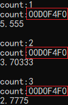
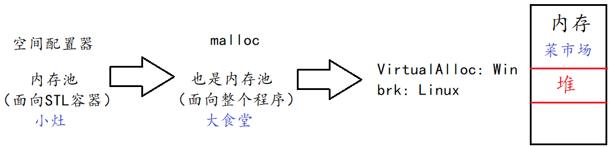
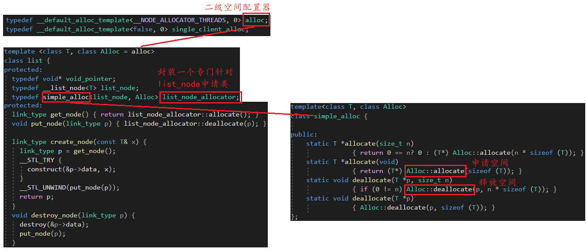
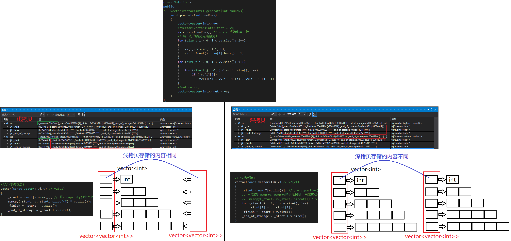
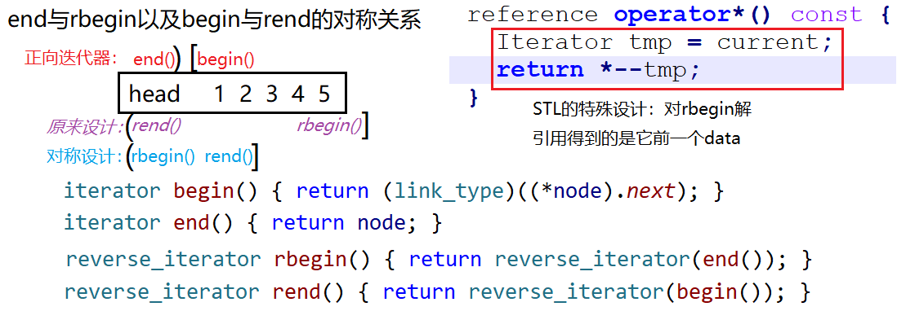
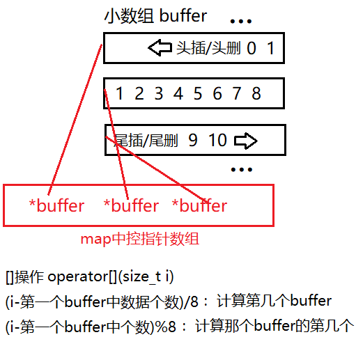
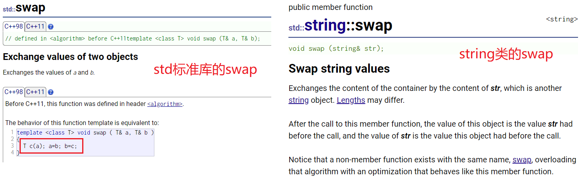

# 获取源代码 & STL介绍

## *SGI-STL的获取 & 代码组织*

参考侯捷的 *STL源码剖析*，源码使用 Cygnus C++ 2.91.57 for Windows

```cmd
$ git clone https://github.com/lwbaptx/sgi-stl.git
```

所有的文件可以分为

* C++标准规范下的C头文件（无扩展名），比如 cstdio, cstdlib, cstring 等
* C++标准程序库中不属于STL范畴的，比如 stream, string 等相关文件
* STL标准头文件（无扩展名），比如 vector, deque, list, map, algorithm, functional 等
* C++ Standard定案前，HP所规范的STL头文件，比如 vector.h, deque.h, list.h, map.h, algo.h, function.h 等
* SGI-STL内部实现，具体实现都放在 `stl_xxx.h` 中

## *GNU 标准库*

源代码位于GCC的 `\gcc\libstdc++-v3` 目录中

### GNU标准库与SGI-STL的关系

[关于 GNU 的 STL 版本更替_gnu stl-CSDN博客](https://blog.csdn.net/KCDCY/article/details/125143637)

我们可以随便打开一个位于 `/usr/include/c++/11/bits` 的头文件，都会有如下的版权信息

```
// Copyright (C) 2001-2021 Free Software Foundation, Inc.
//
// This file is part of the GNU ISO C++ Library.  This library is free
// software; you can redistribute it and/or modify it under the
// terms of the GNU General Public License as published by the
// Free Software Foundation; either version 3, or (at your option)
// any later version.

// This library is distributed in the hope that it will be useful,
// but WITHOUT ANY WARRANTY; without even the implied warranty of
// MERCHANTABILITY or FITNESS FOR A PARTICULAR PURPOSE.  See the
// GNU General Public License for more details.

// Under Section 7 of GPL version 3, you are granted additional
// permissions described in the GCC Runtime Library Exception, version
// 3.1, as published by the Free Software Foundation.

// You should have received a copy of the GNU General Public License and
// a copy of the GCC Runtime Library Exception along with this program;
// see the files COPYING3 and COPYING.RUNTIME respectively.  If not, see
// <http://www.gnu.org/licenses/>.

/*
 *
 * Copyright (c) 1994
 * Hewlett-Packard Company
 *
 * Permission to use, copy, modify, distribute and sell this software
 * and its documentation for any purpose is hereby granted without fee,
 * provided that the above copyright notice appear in all copies and
 * that both that copyright notice and this permission notice appear
 * in supporting documentation.  Hewlett-Packard Company makes no
 * representations about the suitability of this software for any
 * purpose.  It is provided "as is" without express or implied warranty.
 *
 *
 * Copyright (c) 1996
 * Silicon Graphics Computer Systems, Inc.
 *
 * Permission to use, copy, modify, distribute and sell this software
 * and its documentation for any purpose is hereby granted without fee,
 * provided that the above copyright notice appear in all copies and
 * that both that copyright notice and this permission notice appear
 * in supporting documentation.  Silicon Graphics makes no
 * representations about the suitability of this  software for any
 * purpose.  It is provided "as is" without express or implied warranty.
 */
```

Free Software Foundation 自由软件基金会在 2001-2021 这段时间都不再直接使用 SGI STL，而是对其进行了整合。如果下载2001年之前的libstdc++，可以找到SGI-STL

### GNU 标准库的组成

另外介绍一下GNU的C++标准库的组织

C/C++ 标准库主要包含3部分： STL、IO流及本地化、C的函数库

C 标准库的头文件一般位于 `/usr/include` 目录下，C++标准库的头文件则一般放在 `/usr/include/c++/11` 下

- **顶层头文件**：这些文件通常直接位于 `11` 目录下，例如 `<vector>`, `<string>`, `<map>`, `<algorithm>`, `<iostream>`, `<thread>` 等，它们对应于 C++ 标准库的各种组件，提供了模板类的定义、函数声明、类型定义等接口
- **bits 子目录**：这个目录通常包含标准头文件的实现细节。许多头文件都会包括这里的文件，但这些文件不是为直接使用而设计的。例如 `bits/stl_vector.h` 或者 `bits/ios_base.h` 这样的文件，它们包含 `std::vector` 和 IO 流类的底层实现代码
- **ext 子目录**：包含 GNU 扩展的头文件，这些扩展并不是 C++ 标准的一部分，但它们提供了额外的功能，有时也遵循特定的技术规范。例如，可以在这里找到 `__gnu_cxx` 命名空间内的哈希表和池分配器等实现
- **debug 和 profile 子目录**：这些目录提供了工具用于调试和性能分析。例如，当使用 `#include <debug/vector>` 而不是标准的 `<vector>` 时，就会得到一个包含额外检查以帮助调试的 `std::vector` 实现
- **parallel 子目录**：包含支持并行算法的组件，允许利用多处理器架构进行并行计算
- **tr1 子目录**：包含对 TR1 (Technical Report 1) 的支持，TR1 是 C++11 正式发布之前的一个标准提案，提供了一些现在已经集成进 C++11 或更新标准中的功能
- **backward 子目录**：这个目录通常包含向后兼容的头文件，旨在帮助从较旧的 C++ 版本迁移到新版本

### `.tcc` 文件

`tcc`文件是一种源文件，通常包含模板类的实现代码。这些文件并不是C++标准的一部分，而是libstdc++特有的约定

在C++编程中，模板的定义通常需要在每个使用它们的文件中都可见。这是因为编译器在编译带有模板使用的代码时需要看到模板定义，以便进行模板实例化。一种常见的做法是将模板定义放在头文件中，并且在每次使用模板时包含这些头文件

C++里面模板的实现不能放在 `.cpp` 文件中,必须写在头文件中，如果模板函数实现较复杂，就会导致头文件臃肿和杂
乱，所以STL就把较复杂的模板实现抽出来放在 `.tcc` 文件里面，然后当做头文件来包含

- **头文件**（通常以`.h`结尾）包含模板的声明。这些是其他代码在使用模板时需要知道的部分
- **模板实现文件**（以`.tcc`结尾）则包含模板的定义和实现代码，这些文件仅在需要时才由相应的头文件包含进来

例如，对于一个名为`Vector`的模板类，可能会有以下两个文件：

- `Vector.h` - 包含`Vector`模板类的声明
- `Vector.tcc` - 包含`Vector`模板类成员函数的具体实现

只有当实际需要模板的定义时，`Vector.h`头文件才会在其内部通过`#include "Vector.tcc"`语句包含`tcc`文件。这样的组织方式可以让用户只通过包含`.h`文件就能够使用模板类，同时可以隐藏实现细节，并且有助于减小编译依赖和提高编译速度

## *STL*

<http://c.biancheng.net/stl/stl_basic/>

Standard Template Library 标准模板库是C++标准库 `std` 的重要组成部分，其不仅是一个可复用的组件库，而且是一个包含数据结构的软件框架

### STL版本

原始HP版本 -> PJ版本 -> RW版本 -> SGI版本（主要被使用的版本）

* HP 版本（Hewlett-Packard）
  * STL最初由Alexander Stepanov和Meng Lee在惠普公司（HP）内部开发，后来开源了
  * HP版本被认为是STL的雏形，后面的版本基本都是以该版本为蓝图
  * 原始HP版本的STL是基于泛型编程思想的，但它还没有形成C++标准库的一部分
* PJ版本（P.J. Plauger）
  * P.J. Plauger在HP的基础上进行了改进和扩展，并将其引入到C++标准委员会
  * PJ版本是STL的第一个公开版本，但并未完全符合C++标准，被Visual C++编译器所采用，且未开源
* RW版本（Rogue Wave Software）
  * Rogue Wave Software接手了STL的开发，并在1990年代中期发布了RW版本
  * RW版本对STL进行了一些改进和优化，使其更符合C++标准，但仍然存在一些问题
* SGI版本（Silicon Graphics, Inc.）
  * SGI版本是STL的第一个完全符合C++标准的版本，由SGI的Matt Austern负责
  * SGI版本在1994年成为C++标准的一部分，大大促进了STL的广泛采用。其本身也是最被广泛使用的STL，被GCC所采用。代码开源且易读
  * SGI版本对STL的设计和性能进行了进一步优化，并为后来的STL实现奠定了基础

### STL六大组件

* Container 容器：容器就是各种常用的数据结构用C++实现，C++可以提供但C语言不能提供的原因主要是得益于C++提供了模板这种泛型编程方式

  * 序列式容器 sequential container：底层为线性序列的数据结构，里面存储的是元素本身。string、vector、list、deque，具体见下
  * 关联式容器 associative container：存储的是 `<key, value>` 结构的键值对 key-value pair。map、set、multimap、multiset，具体见下
  * C++11新增了array静态数组容器，和普通数组的主要区别在于对越界的检查更加严格，因为 `array[]` 的本质是函数调用 -- 运算符重载

* Iterator 迭代器：迭代器在不暴露底层实现细节的情况下，提供了统一的方式（即从上层角度看，行为和指针一样）去访问容器。屏蔽底层实现细节，体现了封装的价值和力量。迭代器被认为是algorithm和container的粘合剂，因为algorithm要通过迭代器来影响container

  

  * 迭代器按方向和是否能修改对象分类：iterator、const_iterator、reverse_iterator、const_reverse_iterator
  * [迭代器按功能分类](#迭代器类型)

* Functor 仿函数：greater、less 等。定义在 `<functional>` 中，里面是一些模版类，用来声明内建的函数对象

* Algorithm 算法：find、swap、reverse、sort、merge 等

* Allocator 空间配置器

* Adapter 适配器/配接器：对容器进行复用。复用deque的stack、queue、priority_queue

### STL缺陷

* 更新维护满
* 不支持线性安全你，在并发环境下需要自己加锁，且锁的粒度比较大
* 极度追求效率，导致内部比较复杂，如类型萃取，迭代器萃取
* STL的使用会有代码膨胀的问题

### 常用容器对比

<http://t.csdn.cn/SoSD9>

| 容器          | string             |    vector    |       list       |        deque         |  set   | multiset |  map   | multimap |
| ------------- | ------------------ | :----------: | :--------------: | :------------------: | :----: | :------: | :----: | :------: |
| 数据结构      | 动态开辟的char数组 | 动态开辟数组 | 带头双向循环列表 | 二维数组：分段buffer | 红黑树 |  红黑树  | 红黑树 |  红黑树  |
| 元素类型      | 值                 |      值      |        值        |          值          |   值   |    值    |   KV   |    KV    |
| 可重复？      | ✅                  |      ✅       |        ✅         |          ✅           |   ❌    |    ✅     |   ❌    |    ✅     |
| 可随机访问    | ✅                  |      ✅       |        ❌         |          ✅           |   ❌    |    ❌     |   ❌    |    ❌     |
| 迭代器类型    | 随机存取           |   随机存取   |       双向       |       随机存取       |  前向  |   前向   |  前向  |   前向   |
| 元素搜索速度  | 慢                 |      慢      |      非常慢      |          慢          |   快   |    快    |   快   |    快    |
| 快速插入删除  | 尾端               |     尾插     |     任何位置     |         头尾         |        |          |        |          |
| 允许reserve？ | 式                 |      是      |        否        |                      |        |          |        |          |

* 序列容器
  * vector
    * vector是动态开辟的数组，它在堆中分配连续的内容。记录了尾部的地址，所以尾插、尾删很快，在中间和开始处添加、删除元素操作需要挪动数据，若数据是结构或类，那么移动的同时还会进行构造和析构操作，所以在中间或头上的操作性能不高
    * vecotr在给出索引（即下标）时对任何元素的访问都是***O(1)***，所以**vector常用来保存需要经常进行随机访问的内容，井且不需要经常对中间元素进行添加、删除操作**
  * string：string和vector一样也是一个动态开辟数组，但它里面只放了char，是C++对字符串的封装，实现了很多字符串的操作接口，用起来很方便
  * list
    * list是一个允许常数时间插入和删除的顺序容器，支持双向迭代器
    * list在任何地方添加、删除元素的性能都很高，它不需要移动内存块（vector与list的区别主要就是顺序存储与链式存储的区别）。当然也不需要
      对每个元素都进行构造与析构，所以常用来做随机操作容器，但是访问list里面的元素时位于开头和最后的访问最快。访问其它元素都是***O(N)***，因为要顺序查找。因此如果需要经常随机访问的话，还是使用vector比较好
  * deque
    * 双端队列融合了vector和list的优点，既支持list的任意位置插入删除，又支持vector的下标随机访问
    * 但是因为deque实现随机访问的机制比较复杂，其实插入删除和随机访问都没有做好（不过随机访问的效率也很高了！）。所以相比vector和list，deque非常适合做头尾的插入删除；但如果是中间插入删除多用list，而随机访问多用vector
    * 通过复用deque得到的适配器 adapter 有 stack、queue、priority_queue
* 关联容器
  * set & map：红黑树结构，有序，不允许重复的key
  * unordered_set & unordered_map：哈希结构，无序，不允许重复的key
  * multiset & multimap：红黑树结构，有序，允许重复的key
* 其他：array、bitset

### 常用构造函数

具体的内容可以看 <https://cplusplus.com> 和STL的Cheat sheet，这里只是做一些常用容器的构造器的解释。以vector为例

* 空构造 empty constructor (default constructor)

  ```cpp
  explicit vector (const allocator_type& alloc = allocator_type());
  std::vector<int> first;                                         // empty vector of ints
  ```

* 填充构造 fill constructor

  ```cpp
  explicit vector (size_type n);
  vector (size_type n, const value_type& val, const allocator_type& alloc = allocator_type());
  std::vector<int> second(6, 100);                                // 6 ints with value 100
  ```

* 范围构造 range constructor

  ```cpp
  template <class InputIterator> vector (InputIterator first, InputIterator last, const allocator_type& alloc = allocator_type());
  std::vector<int> third (second.begin(), second.end());          // iterating through second
  ```

* 拷贝构造 copy constructor

  ```cpp
  vector (const vector& x);
  vector (const vector& x, const allocator_type& alloc);         
  std::vector<int> fourth (third)                                 // a copy of third
  ```

* 移动构造 move constructor

  ```cpp
  vector (vector&& x);
  vector (vector&& x, const allocator_type& alloc);
  ```

* 初始化列表 initializer list

  ```cpp
  vector (initializer_list<value_type> il, const allocator_type& alloc = allocator_type());
  std::vector<int> a{1, 2, 3, 4, 5};
  std::vector<int> a = {1, 2, 3, 4, 5};
  ```

### 容器/匹配器常用API

具体的内容可以看 <https://cplusplus.com> 和STL的Cheat sheet，这里只是做一些常用容器的API的解释。下面的API是不同的容器的，注意判别到底哪些容器有哪些API

注意：C++没有从给定一个元素的key返回下标的方法

* 容量相关

  * `size()`：返回有效数据的数量，除了 `forward_list` 之外的所有容器都有这个方法 
  * `max_size()`：返回容器在当前系统和库实现中可能达到的最大元素数量的值，它可以帮助程序员在设计代码时，考虑到容器可能的最大规模，从而更好地规划内存和资源的使用
  * `capacity()` ：开出的来动态数组大小，只有vector有
  * `reserve(n)`：预分配空间，不初始化，vector和unordered系列有
  * `resize(n, val)`：重新分配空间 + 初始化，顺序容器有
  * `shrink_to_fit()`：缩小capacity到和size相同

* Element access

  * `[]` & `at(n)`：返回位置n的数据，`at` 有范围检查，越界会报 `std::out_of_range` 异常，`[]` 不检查越界，越界会导致未定义行为
  * `front()` & `back()`：返回头、尾元素的引用

* Modifier

  * `push_back()`

  * `pop_back()`

  * `insert(pos, n)`

  * `erase(pos)`

  * `swap()`

  * `clear()`：清空容器中的所有元素

    [vector::clear() 方法的使用细节_vector中的clear-CSDN博客](https://blog.csdn.net/rl529014/article/details/50740487)

  * `emplace(pos, args)`：直接构造并插入，目的是在不额外复制或移动对象的情况下，直接在容器内部构造对象，从而避免了额外的拷贝开销

  * `emplace_back()`

## *包装器 Wrapper*

### 包装器解决的2个问题

**可调用对象的种类过多引起的效率问题**

C++中可调用对象很多，`ret=func(x)` 中的 `func()` 既可以是函数指针，也可以是仿函数对象，还可以是lambda表达式

```cpp
template<class F, class T>
T useF(F f, T x) {};

// 函数名
cout << useF(f, 11.11) << endl;
cout << useF(f, 22.22) << endl;
// 函数对象
cout << useF(Functor(), 11.11) << endl;
// lamber表达式
cout << useF([](double d)->double{ return d/4; }, 11.11) << endl;
```

当有如上的用可调用对象作为模板参数的时候，如果直接这么写，**即使传入的本质上参数和返回值完全相同的不同可调用对象，函数模板也会实例化多份**。试验结果如下，圈起来的是可调用对象的地址，当传入不同的可调用对象时，会生成不同的函数模板，前两个传入的都是函数地址，因此使用的是同一份模板。**这会导致代码膨胀+效率降低**


**为可调用对象提供了一个统一的参数**

上面的 `useF(F f, T x) {};` 是一个函数模板，里面的参数F是一个为可调用对象设计的统一接口，可以往里面放任何的可调用对象。若没有包装器机制，就只能是调固定类型的函数指针、仿函数或者lambda函数了，最尴尬的是**当模板参数的类型是lambda可调用对象的时候，甚至连类型都写不了**

### function包装器

这个问题可以用function包装器来解决。包装器是一个**函数专用的类模板，其特点是统一类型**，减轻编译器自动推导的压力

```cpp
//包装器的头文件和使用方法
#incldue <fucntional>
template <class Ret, class... Args>
class function<Ret(Args...)>; //Ret 为被调用函数的返回类型， Args 为调用函数的参数包
```

具体到上面的情况为如下

```cpp
// def for f, Functor()
std::function<double(double)> func1 = f;
cout << useF(func1, 11.11) << endl;
// 函数对象
std::function<double(double)> func2 = Functor();
cout << useF(func2, 11.11) << endl;
// lambda表达式
std::function<double(double)> func3 = [](double d)->double { return d/4; };
cout << useF(func3, 11.11) << endl;
```

此时就可以统一使用一个函数模板了



介绍一个应用：[150. 逆波兰表达式求值 - 力扣（LeetCode）](https://leetcode.cn/problems/evaluate-reverse-polish-notation/)

### 类成员函数的包装问题

类的静态成员函数可以直接包装，因为它的参数没有多this指针。但是对于类的非静态成员函数参数中有一个多出来的this指针需要特殊处理

* 在包装的时候，类非静态成员函数的包装器要多一个不可省略的参数 `Plus`（C++11规定了传类名，而不是 `this`），并且还要非静态成员函数的地址，也是C++的规定
* 并且若采用函数名调用，需要在参数中添加一个匿名对象，比如 `func5(Plus(), 11.11, 11.11);`

```cpp
class Plus {
public:
	static int plusi(int a, int b) {
		return a + b;
	}
	double plusd(double a, double b) {
		return a + b;
	}
};
//调用包装器
std::function<int(int, int)> func4 = Plus::plusi;
cout << useF(func4, 11.11) << endl;
std::function<double(Plus, double, double)> func5 = &Plus::plusd; //非静态成员函数要取地址，C++规定, Plus相当于是this指针
cout << useF(func5, 11.11) << endl;
func5(Plus(), 11.11, 11.11); //直接调用要传入匿名对象
```

### `std::bind()` 解决参数数量、顺序不匹配的问题

在下面这种情况时，因为map数据结构的类型需要的输入包装器已经写死了是要以int为返回值，以两个int为输入，此时无法匹配map带有三个参数的非静态类成员函数的function包装器

```cpp
map<string, std::function<int(int, int)>> opFuncMap = { //第二个模板参数必须要传入两个参数的
    {"普通函数指针", f},
    {"函数对象", Functor() },
    {"成员函数指针", &Plus::plusi} //报错
}
```

可以用 `std::bind()` 通用函数适配器来**调整可调用对象的参数个数和顺序**。`std::bind` 函数是一个函数模板，它会生成一个新的可调用对象。它的一般形式为

```c++
auto newCallable = std::bind(callable, arg_list);
```

下面是一个例子

```cpp
class Plus {
public:
	Plus(int x = 2)
		:_x(x)
	{}
	int plusi(int a, int b) {
		return (a + b)*_x;
	}
private:
	int _x;
};

int main() {
	std::function<int(Plus, int, int)> func3 = &Plus::plusi;
	cout << func3(Plus(), 100, 200) << endl;

	std::function<int(int, int)> func4 = std::bind(&Plus::plusi, Plus(10), \
		std::placeholders::_1, std::placeholders::_2); //绑定参数，std::placeholder是占位符
   
    //调整顺序
	cout << func4(100, 200) << endl;
	return 0;
}
```

`std::placeholder::_1` 是一个占位符，还剩下几个绑定后的参数就用几个占位符


* 调整参数个数，一般是实际要传入的参数个数比接受的传入参数个数要多

  * 举一个简单的例子：将一个5参数的f绑定到一个2参数的g上，其中g的第一个参数作为f的第3个参数，g的第二个参数作为f的第5个参数

    ```c++
    using namespace std::placeholders;
    auto g = std::bind(f, a, b, _1, c, _2);
    // g(_1, _2) -> f (a, b, _1, c, _2)
    ```

  * 用到上面的例子中

    ```c++
    //绑定两个参数
    std::function<int(int, int)> func4 = std::bind(&Plus::plusi, Plus(10), \
    	100, std::placeholders::_1); //绑定参数，std::placeholder是占位符
    ```

* 调整参数顺序

  * 仍然是简单的例子：将一个5参数的f绑定到一个2参数的g上，其中g的第一个参数作为f的第5个参数，g的第二个参数作为f的第3个参数

    ```c++
    using namespace std::placeholders;
    auto g = std::bind(f, a, b, _2, c, _1);
    // g(_1, _2) -> f (a, b, _2, c, _1)
    ```

  * 用到上面的例子中

    ```c++
    std::function<int(int, int)> func4 = std::bind(&Plus::plusi, Plus(10), \
        std::placeholders::_2, std::placeholders::_1); //绑定参数，std::placeholder是占位符
    ```


**绑定参数的原理是相当于先把某些参数传进去了，然后返回一个已经传入部分参数的函数继续接收参数**

若传入的参数是引用或者不能参数无法拷贝的时候要对参数做特殊处理，比如说参数是 iostream 的时候。使用 `std::ref` 和 `std::cref()`（常量）

```c++
ostream &os;
auto g = std::bind(f, a, ref(os) , _1, c, _2);
```

### 通用的函数调用器 invoke (17, 2o, 23)

[C++函数式编程 | Zhao Zhengyang (zzy979.github.io)](https://zzy979.github.io/posts/cpp-functional-programming/#6标准库函数对象)

```C++
INVOKE(std::forward<F>(f), std::forward<Args>(args)...)

template< class F, class... Args>
constexpr std::invoke_result_t<F, Args...>
  invoke(F&& f, Args&&... args) noexcept(/* see below */);

// since q C++23
template< class R, class F, class... Args >
constexpr R
    invoke_r( F&& f, Args&&... args ) noexcept(/* see below */);
```

`std::invoke` 是 C++17标准库中引入的一个函数模板，用于统一地调用可调用对象（函数、函数指针、成员函数指针、仿函数等）。它解决了在 C++ 中调用可调用对象的一致性和灵活性问题

### reference_wrapper

```C++
template <class T> class reference_wrapper;
```

类模板`std::reference_wrapper`将引用包装为一个可拷贝、可赋值的对象，通常用于将引用存储在STL容器中，或者将对象按引用方式传递给`std::bind`、`std::thread`、`std::make_pair`等

注：普通引用本身无法拷贝和赋值，必须借助`std::reference_wrapper`实现，而指针本身就支持这些操作。实际上，`std::reference_wrapper`的底层实现就是保存了一个指针

`std::reference_wrapper<T>`对象可隐式转换为`T&`。如果保存的引用是可调用的（即函数对象），则`std::reference_wrapper`也可以使用相同的参数调用

通常不直接使用这个类模板，而是使用辅助函数`std::ref`和`std::cref`来创建`std::reference_wrapper`对象

```C++
template <class T> reference_wrapper<T> ref (T& elem) noexcept;
template <class T> reference_wrapper<T> ref (reference_wrapper<T>& x) noexcept;
template <class T> void ref (const T&&) = delete;
```

### 包装器在TCP server 派发任务中的应用

看计算机网络套接字编程 TCP server 部分

# lambda表达式

本章条款来自 *Effective Modern C++*

## *lambda的基本使用*

### 像函数一样使用的可调用对象/类型

用户可以在使用很多泛型算法时自己定制可调用对象 callable object。所谓的可调用对象就是可以对其使用调用运算符 `()` 的对象

* 函数指针
* 函数表达式**对象**
* 调用运算符重载 -- 仿函数/函数对象

当类或函数模板需要用到仿函数时，此时可以用lambda表达式替换，因为这样可以将其隐藏到类或函数中封装

可以将lambda表达式理解为一个匿名函数表达式

### lambda表达式语法

```c++ 
[ capture-list ] ( parameters ) specifiers exception -> return-type { body }
```

没有函数名，记法：`[](){}`。其中mutable是可选，参数类型（等价于指定一个空列表）和返回类型（编译器自动推断）是可以省略的，但必须永远包含捕获列表和函数体，即 `[]{}`

* `[capture-list]` 捕捉列表：编译器根据 `[]` 来判断接下来的代码是否为lambda函数，捕捉列表能够**捕捉父作用域的变量**供lambda函数使用。因为lambda本质上就是一个类，所以**捕获的变量相当于是lambda把他们变成了自己的类成员一样**
* `(parameters)` **可选**参数列表：和普通函数的参数列表一致，若无参就可以和括号一同省略
* `specifiers`**可选**限定符：**默认情况下，lambda函数总是一个const函数**，C++11可以用mutable可以取消其常量性。使用该修饰符时，参数列表不可省略（也就是括号不能省略）
* `exception` **可选**异常说明符：使用noexcept来指明lambda是否会抛出异常
* `->return-type` **可选**返回值类型：必须使用尾置返回来指定返回类型。没有返回值或返回值类型明确情况下都可以省略，由编译器自动推导返回类型，因此lambda表达式在大多数情况下都不会写返回值类型
* `{ body }` 函数体

下面是一些lambda的例子

```c++
//两个数相加的lambda
auto add1 = [](int a, int b)->int { return a + b; };
cout << add1(1, 2) << endl;

//省略返回值
auto add2 = [](int a, int b){ return a + b; };
cout << add2(2, 3) << endl;

// add_by
std::function<int(int)> make_adder(int add_by) {
    return [=](int ival) { return ival + add_by; };
}

int main() {
    auto add_by_12 = make_adder(12); // 已经将add_by捕获了
    std::cout << add_by_12(30) << std::endl;
    return 0;
}
```

### 捕捉列表的使用

* 捕捉方式

  * 显式捕获：显式地指定哪些外部变量需要被捕捉

    * `[var]`：表示以值传递方式捕捉变量var，也就是说拷贝了var，对新var的改变不会改变原来的var

    * `[&var]`：表示引用传递捕捉变量var，注意：以引用捕捉并不意味着lambda内对捕捉的变量对修改可以影响它，若想这么做得加mutable

    * `[this]`：捕获this指针可以让我们使用this类型的成员变量和函数

      ```c++
      class A { 
      public:     
          void print() { std::cout << "class A" << std::endl; }
          void test() { 
              auto foo = [this] { print(); } 
          	foo();
          }
      private:
          int x_;
      };
      
      int main() {
          A a;
          a.test;
          return 0;
      }
      ```

  * 隐式捕获：编译器根据lambda函数体内部使用的变量来自动推导捕捉方式

    * `[=]`：表示值传递的方式捕捉所有父作用域中的变量（包括this）。但实际上C++实现的是实际用了什么才捕获什么，并不是无脑的真的把父作用域中的内容都捕获进来
    * `[&]`：表示引用传递捕捉所有父作用域中的变量（包括this）

  * `[]`：不捕捉

* 注意点

  * 父作用域指的是所有嵌套包含lambda函数的语句块
  * 允许混合捕捉，即语法上捕捉列表可由显式的或隐式的多个捕捉项组成，并以逗号分割，此时第一个捕捉项必须是隐式捕捉。比如 `[=, &a]`，以值传递捕捉所以值，但对a采取引用捕捉
  * 捕捉列表不允许变量重复传递，否则会编译错误，比如 `[=, a]` 这种捕捉方式，已经以值传递方式捕捉了所有变量了，包括a
  * 以引用或者指针方式捕获一个变量时，必须保证在lambda执行时变量是存在的
  * 能捕获的变量必须是一个自动存储类型，简单来说就是**非静态的局部变量**

* 使用建议

  * 捕获一个普通变量时，比如int, string或其他非指针类型，通常可以采用简单的值捕获方式。所以只需关注变量在捕获时，值是否是所需的值就行
  * 若捕获一个指针或迭代器或引用，就必须保证在lambda被执行的时候，绑定到迭代器，指针或引用的对象仍然存在，而且需要保证对象是预期的值。因为有可能在捕获的时候还是预期的值，但是在执行lambda之前有代码改变了绑定对象的值，在执行lambda时就变成不是预期的值了
  * 尽量减少捕获的数据量，来避免潜在的捕获导致的问题。可能的话，尽量避免捕获指针或引用

### 尾置返回

尾置返回 trailing return type 是C++11引入的新内容，它主要有三种使用场景

1. 返回类型比较复杂的函数

   比如说要返回一个有10个int元素的数值的指针的 `int (*p)[10]`（注意和指针数组 `int *p[10]` 的区别，回顾 *C.md*），只需要把原来写返回类型的地方改成auto就行了

   ```c++
   int (*functionName(int i))[10]; // 声明一个返回 int (*)[10] 数组指针的函数 functionName
   auto functionName(int i) -> (int *)[10]; // 使用尾置返回
   ```

2. 返回类型依赖于参数类型的函数很有效

   ```c++
   template<typename It>
   auto fcn(It beg, It end) -> decltype(*beg) {
       // ...
       return *beg;
   }
   ```

3. lambda语句

C++11只允许单语句的 lambda 表达式自动推导其尾置返回，而C++14则放宽到了包含多语句的一切 lambda 表达式和函数式（此时不需要尾置返回了）

### 无状态lambda表达式

## *lambda原理*

### lambda底层原理

和范围for底层是迭代器直接替换一样，**lambda的底层就是仿函数类**。比如说下面这个lmabda表达式，编译器对它的理解方式就是对应的一个类

```c++
// lambda表达式
size_t sz = 10;
auto SizeComp = [sz](const std::string &a) { return a.size() > sz; }
// 类
class SizeComp {
public:
    SizeComp(size_t n) : sz_(n) {}
    bool operator() (const std::string& a) const { 
    	return a.sz() > sz_;
    }
private:
    size_t sz_;
};
```

在下图的汇编代码中也可以看到，二者的汇编代码结构几乎完全相同

lambda 函数是在程序运行时动态创建的。它们不是在编译时静态生成的函数，而是在代码中被定义的地方动态创建的，因此它们也被称为匿名函数或闭包，所谓的闭包可以简单地理解为一个匿名且可以包含定义时作用域上下文的函数对象

lambda函数对于用户是匿名的，但对于编译器是有名的，其名称就是**lambda_uuid**


### 语法糖

语法糖 syntactic sugar 指的是一种编程语言的语法特性或语法结构，它们不会引入新的功能，但是使代码更易读、更易写，更符合人类编程习惯。这些语法特性通常是为了提高代码的可读性和编写效率而添加到编程语言中的，但在编程语言的底层，它们通常会被转化成更基本的语法结构或操作

语法糖的存在旨在使代码更加清晰和直观，以减少编程错误和提高开发效率。它可以让开发人员更专注于解决问题而不是处理繁琐的语法细节

一些常见的语法糖包括：

* 迭代语法糖：例如，for-each 循环可以隐藏底层的迭代细节，使代码更简洁
* 对象成员访问语法糖：某些语言允许使用点符号来访问对象的属性和方法，这可以使代码更易读
* 字符串插值：允许在字符串中嵌入变量或表达式，以增加字符串的可读性
* 自动类型推断：编程语言可以根据上下文推断变量的类型，而无需显式指定类型
* lambda 表达式：简化匿名函数的创建和使用

## *条款31：避免默认捕获模式*

## *条款32：使用初始化捕获将对象移入闭包*

## *条款33：对auto&&类型的参数使用delctype并将其转发*

## *条款34：优先使用lambda，而非 `std::bind`*

## *新的捕获方式*

### 广义捕获 & 泛型lambda表达式（14）

广义捕获 generalized capture

* 简单捕获，即C++11中的 `[var]`、`[&var]`、`[this]` 等捕获形式
* 初始化捕获，C++14引入的新特性

初始化捕获解决了只能捕获lambda定义上下文的变量，而无法捕获表达式结果以及自定义捕获变量名的问题。比如说下面这种形式

```c++
int x = 5;
auto foo = [x = x + 1]{ return x; }; // 注意：左边的x是lambda作用域的，右边的是父作用域的
```

初始化捕获的使用场景

* 使用移动操作减少代码运行的开销

  ```c++
  std::string x = "hello c++ ";
  auto foo = [x = std::move(x)]{ return x + "world"; };
  ```

* 在异步调用时复制 this 对象

C++14对lambda的另一个改进是支持了泛型lambda，即具备了模板的能力。但是它的定义方式却用不到 template 关键字，实际上泛型 lambda 只需要使用 auto 占位符

```c++
auto foo = [](auto a) { return a; };
int three = foo(3);
char const* hello = foo("hello");
```

### 常量lambda和捕获 `*this`（17）

### 捕获 `[=, this]`（20）

# `<algorithm>` 库函数

STL常用算法 `<algorithm><functional><numeric>` - 本羊已老矣的文章 - 知乎 <https://zhuanlan.zhihu.com/p/426355690>

`<algorithm>` 是所有STL头文件中最大的一个，范围涉及比较、交换、查找、遍历、复制、修改的函数模版

注意 `<algorithm>` 里面定义的通用函数模版和容器自身的方法名字可能一样，比如 `std::find()`、`std::swap()` 等等，注意判别

这些函数都定义在std命名空间中，若没展开std命名空间则都需要加 `std::`，下面为了方便起见都省略了

## *查找*

### find

* `find`：查找指定元素，找到则返回指定元素的迭代器，找不到则返回结束迭代器

  ```cpp
  template <class InputIterator, class T>
  InputIterator find (InputIterator first, InputIterator last, const T& val);
  ```

  > Returns an iterator to the first element in the range [first,last) that compares equal to val. If no such element is found, the function returns last.

* `find_if`：和find相比多了一个用于判断的一元谓词仿函数

  ```C++
  template <class InputIterator, class UnaryPredicate>
  InputIterator find_if (InputIterator first, InputIterator last, UnaryPredicate pred);
  ```

  find_if 在指定的范围内搜索第一个使给定谓词返回 true 的元素。它不会改变容器中的元素，只用来查找符合特定条件的元素

  它的行为等价于

  ```C++
  template<class InputIterator, class UnaryPredicate>
  InputIterator find_if (InputIterator first, InputIterator last, UnaryPredicate pred) {
    while (first!=last) {
      if (pred(*first)) return first;
      ++first;
    }
    return last;
  }
  ```

* `adjacent_find`：查找相邻的重复元素。返回**第一个**相邻重复的位置的迭代器

* `binary_search`：通过二分查找来查找制定的元素是否存在，返回bool，复杂度***O(logN)***

* `count`：统计元素个数。返回一个int型数据

* `count_if`

* `max_element` & `min_element`：获取容器中最大、最小值的pos迭代器

  ```c++
  template <class ForwardIterator>
  ForwardIterator max_element (ForwardIterator first, ForwardIterator last);
  
  template <class ForwardIterator, class Compare>
  ForwardIterator max_element (ForwardIterator first, ForwardIterator last, Compare comp);
  ```

* `distance`：返回两个迭代器之间的距离

* `lower_bound` & `upper_bound`：返回 `[first, last)` 之间不小于/不大于 val 的迭代器。应该采用的是二分法查找，所以复杂度是 ***O(logN)***

  ```c++
  template <class ForwardIterator, class T>
  ForwardIterator lower_bound (ForwardIterator first, ForwardIterator last, const T& val);
  
  template <class ForwardIterator, class T, class Compare>
  ForwardIterator lower_bound (ForwardIterator first, ForwardIterator last, const T& val, Compare comp);
  ```

## *排序*

### 严格弱序

https://blog.csdn.net/River_Lethe/article/details/78618788

Strict Weak Ordering 严格弱序关系是在STL容器比较器用于定义元素之间顺序关系的一种特定形式的弱序关系。严格弱序关系具有以下特征：

1. **传递性 Transitivity**：如果 A 在 B 之前，B 在 C 之前，那么 A 必须在 C 之前
2. **对称性 Symmetry**：如果元素 A 可以与元素 B 进行比较，那么元素 B 也可以与元素 A 进行比较，并且它们之间的结果应该相反。也就说**两个元素不能同时严格弱序于对方**
3. **不可比性 Irreflexivity**：如果存在两个关键字，**任何一个都不严格弱序于另一个**，则这两个关键字是相等的

在 STL 中，`<` 就是一种严格弱序，`<=` 则不是

为什么要使用严格弱序，而不是弱序？主要是因为弱序 `<=` 无法判断两个元素是否相等

```
a < b # a 小于 b
a > b # a 大于 b
!(a < b) && !(b < a) # a == b
```

如果我们用 `<=` 的话，此时 `!(a <= b) && !(b <= a) == false` 左右都会返回 true，最后返回的就永远都是 false，也就是说没办法判断两个元素相等了 

### sort

* sort：在原容器上排序，**默认升序（`std::less`）**，可以通过仿函数自定义

  ```cpp
  template <class RandomAccessIterator> void sort (RandomAccessIterator first, RandomAccessIterator last);
  template <class RandomAccessIterator, class Compare> void sort (RandomAccessIterator first, RandomAccessIterator last, Compare comp);
  ```

  * sort 要使用随机迭代器，也就是 vector、array、deque 那种支持 ***O(1)*** 随机访问的迭代器

  * sort 的底层是不稳定快排（事件复杂度 ***O(NlogN)***），也就是说若有相同的元素，sort 不保证不改变它们原来的顺序，若要保证稳定性需要用 `stable_sort`

  * sort 在排序时需要交换容器中元素的存储位置。此时若容器中存储的是自定义的类对象，则该类的内部必须提供移动构造函数和移动赋值运算符

  * 关于 Compare 这个可调用对象，下面是 `std::less` 和 `std::greater` 两个最常用的仿函数

    如果 Compare 返回的是 true，那么第一个参数应该放在第二个参数之前，所以 `std::greater` 是排降序

    ```c++
    template <class T> struct less : binary_function <T, T, bool> {
      bool operator() (const T& x, const T& y) const { return x < y; }
    };
    
    template <class T> struct greater : binary_function <T, T, bool> {
      bool operator() (const T& x, const T& y) const { return x > y; }
    };
    ```

    注意⚠️：Compare 可调用类型必须满足严格弱序 strict weak ordering，比如只能是 `<` ，不能是 `<=`

* `partial_sort(first, middle, last)`

  * 从 `[first,last)` 范围内，筛选出 `middle-first` 个最小的元素并排序存放在 `[first，middle)` 区间中
  * `partial_sort_copy`：范围排序并 copy 放到新的里

* `is_sorted(first, last)`：判断 `[first, last)` 范围内是否已经排好序，默认检测是否按升序排序

### shuffle

* shuffle：使用用户给定的随机数生成器对指定范围进行随机排列

  ```c++
  template <class RandomAccessIterator, class URNG>
  void shuffle (RandomAccessIterator first, RandomAccessIterator last, URNG&& g);
  ```

  ```c++
  std::vector<int> myVector = {1, 2, 3, 4, 5};
  std::default_random_engine rng(std::random_device{}());
  std::shuffle(myVector.begin(), myVector.end(), rng);
  // 现在，myVector 包含原始元素的随机排列
  ```

  时间复杂度：***O(N)***

* random_shuffle：使用 STL 默认的随机数生成器对指定范围进行随机排列

  在 C++14 及以后的版本中，`std::random_shuffle` 已经被标记为已弃用，推荐使用 `std::shuffle`

### 其他

* reverse：注意reverse范围左闭右开不包括last

  > Reverses the order of the elements in the range [first,last).

  ```c++
  template <class BidirectionalIterator>
  void reverse (BidirectionalIterator first, BidirectionalIterator last);
  ```

  事件复杂度：***O(N/2)***

* `merge`：将两个容器元素合并，并存储到另一容器中。前提是两个容器必须是有序的

## *STL中 `std::sort` 的实现*

### 实现逻辑

`std::sort` 当数据量大时用的就是快排，分段归并排序。一旦分段后的数据量小于某个门槛，为避免QuickSort快排的递归调用带来过大的额外负荷，就改用**Insertion Sort插入排序**。如果递归层次过深，还会改用**HeapSort堆排序**

### 代码阅读

### 面试问题

1. 数据量大和数据量小都适合用快速排序吗？小数据量不合适
2. 快速排序的复杂度不是稳定的 ***O(logN)***，最坏情况下是 ***O(N^2)***（反转数组），此时改如何改善？
   1. 每次选取 prior 前将数组打乱
   2. 三数取中法：每次选取 `(first+last)/2` 或 `(fist+last+((first+last))/3`
3. 快速排序递归实现时，怎么解决递归层次过深的问题？改成堆排序
4. 递归过深会引发什么问题？栈溢出
5. 怎么控制递归深度避免爆栈？如果达到递归深度了还没排完序怎么办？
   1. 计数器来判断深度，到达一定深度之后换方法
   2. 将递归转换为迭代
   3. 优化递归算法：可以通过优化递归算法来减少递归深度。比如可以使用记忆化搜索或动态规划来消除重复计算。另外，尾递归优化也是一个常用的优化递归算法的方法。

## *拷贝*

```c++
template <class InputIterator, class OutputIterator> 
OutputIterator copy (InputIterator first, InputIterator last, OutputIterator result);
```

复杂度为 ***O(N)***，N 是元素个数

## *替换*

* `swap`：[swap存在一些问题](#swap的问题)
* `replace`
* `replace_if`
* `copy`


## *运算*

```C++
template <class InputIterator, class Function>
UnaryFunction for_each (InputIterator first, InputIterator last, UnaryFunction fn);
```

`std::for_each` 是一个非修改性算法，它对指定范围内的每个元素执行一个给定的函数或函数对象

- `first`, `last` - 输入迭代器定义了要处理的元素范围 `[first, last)`
- `f` - 一个函数或者函数对象，被应用于范围内的每个元素

`for_each` 通常用于执行某些操作，比如打印所有元素或对每个元素进行某种变换。需要注意的是，虽然 `for_each` 通常不修改传递给它的函数或函数对象，但是可以通过引用捕获局部变量来改变外部状态

### 求和

https://stackoverflow.com/questions/3221812/how-to-sum-up-elements-of-a-c-vector

* 不使用库函数的话可以用范围for，或者迭代器遍历等方法来求

  ```c++
  for (auto& n : vector) sum_of_elems += n;
  ```

* `std::accumulate`

  ```c++
  template <class InputIterator, class T> T accumulate (InputIterator first, InputIterator last, T init);
  template <class InputIterator, class T, class BinaryOperation> 
  T accumulate (InputIterator first, InputIterator last, T init, BinaryOperation binary_op);
  ```

  注意⚠️：init 不仅仅指定了返回的 sum 的初始，还有它的数据类型。比方说计算一个 `vector<double>`，但是我们给的 init 是一个 int，那么返回的也是 int

  accumulate不仅仅可以用来求和，也可以通过 `binary_op` 这个函数对象来定义对两个值进行操作的其他规则，这使得`accumulate`函数可以进行不同类型的累积操作，例如求和、乘积、取最大值、取最小值等

  ```c++
  #include <iostream>
  #include <vector>
  #include <numeric> // accumulate 函数所在的头文件
  
  // 定义一个函数对象，用于计算两个值的乘积
  template<class T>
  struct Product {
      T operator()(const T& x, const T& y) const {
          return x * y;
      }
  };
  
  int main() {
      std::vector<int> numbers = {1, 2, 3, 4, 5};
  
      // 使用 accumulate 函数计算元素的乘积，初始值为 1，操作为 Product<int>()
      int product = std::accumulate(numbers.begin(), numbers.end(), 1, Product<int>());
  
      std::cout << "Product of elements: " << product << std::endl; // 输出120
  
      return 0;
  }
  ```

* `std::reduce`（C++17）

  为什么C++17 添加了std::reduce - 未平的文章 - 知乎 https://zhuanlan.zhihu.com/p/605943911。据这篇文章说是因为 MapReduce 引入的，在多核高并发场景下比 accumulate 更高效

  使用方式基本和 accumulate 是一样的

# 空间配置器

[《STL源码剖析》第2章 空间配置器 | 野渡 的博客 (wendeng.github.io)](https://wendeng.github.io/2019/05/13/c++基础/《STL源码剖析》第2章 空间配置器/#6-1-chunk-alloc——从内存池中取空间供free-list使用)

## *intro*

为什么不说allocator是内存配置器而说它是空间配置器呢？这是因为空间配置器的配置不一定是内存，其实也可以是硬盘或者其他辅助存储介质

### SGI-STL空间配置器偏离STL标准

SGI-STL的配置器与众不同，也与标准规范不同，**其名称是 alloc 而非 allocator**，而且不接受任何参数

其实SGI也定义了一个符合部分标准，名为allocator的配置器，但是它自己不使用，也不建议我们使用，主要原因是效率不佳。**它只是把C++的操作符 `::operator new` 和 `::operator delete` 做了一层简单的封装而已**，可以用但是不建议我们使用

### 分工

*Cpp基础.md* - C++内存管理中说过 new 和 delete 都可以分为两步，即调用 `operator new` 开辟内存空间 + 调用对象的构造函数 / 调用对象的析构函数清理 + 调用 `operator delete` 释放内存空间。SGI Allocator将这步工作也区分开来

* 创建对象：`std::allocate()` + `::construct()`
* 销毁对象：`::destroy()` + `std::deallocate()`

```
<memory> -------> <stl_construct.h>
        |-------> <stl_alloc.h>
        |-------> <stl_uninitialized.h>
```

* `<memory>`：根据STL标准，作为总的空间配置器的头文件
* `<stl_construct.h>`：定义了全局函数 `construct()` 和 `destroy()`，它们负责对象的构造和析构，属于STL标准
* `<stl_alloc.h>`：定义了一、二级空间配置器，统称为alloc。实现 `std::allocate()` 和 `std::deallocate()`
* `<stl_uninitialized.h>`：定义了用于对象初值设置的全局函数，属于STL标准


* `allocator<T> a`：定义一个名为a的allocator对象，它可以为类型为T的对象分配内存
* `a.allocate(n)`：分配一段原始的、未构造 unconstructed 的内存，保存n个类型为T的对象，所谓未构造是指内存可能包含任意值，这些值可能是未定义的或者是垃圾值
* `a.construct(p, args)`
  * **为了使用allocate返回的未构造原始内存，必须用 construct构造对象**。若使用未构造的内存，其行为是未定义的
  * p必须是一个类型为 `T*` 的指针，指向一块未构造的原始内存；arg被传递给类型为T的构造函数，用来在p指向的内存中构造一个对象
* `a.deallocate(p, n)`：释放从 `T* p` 地址开始的内存，这块内存连续保存了n个类型为T的对象；p必须是一个先前由allocate返回的指针，且n必须是p创建时所要求的大小。**在调用deallocate之前，用户必须对每个在这块内存中创建的对象调用destroy进行析构清理**
* `a .destroy(p)`：p为 `T*` 类型的指针，此算法对p指向的对象执行析构函数

### STL中的内存管理架构



STL容器需要频繁申请释放内存，若每次都要调用malloc进行申请会有以下缺点

* 空间申请与释放需要用户自己管理，容易造成内存泄漏
* 频繁向系统申请内存块，容易造成内存碎片也影响程序运行效率
  * 外碎片问题：频繁向系统申请小块内存，有足够内存但是不连续，无法申请大块内存
  * 内碎片问题：内存块挂起来管理，由于按照一定规则对齐，就会导致内存池中的内碎片
* 直接使用malloc与new进行申请，每块空间有额外空间浪费，因为要记录开的内存空间的相关信息，如大小等
* 代码结构不清晰
* 未考虑线程安全

因此需要设计高效的内存管理机制，空间配置并不是什么特殊的数据结构，只是对malloc的深度封装以提高它的效率

## *对象的构造 & 析构*

```C++
#include <new.h> // 定位new
template <class T1, class T2>
inline void construct(T1* p, const T2& value) {
  new (p) T1(value); // 定位new：new(pMemory)type(initializer-list)
}

template <class ForwardIterator>
inline void
__destroy_aux(ForwardIterator first, ForwardIterator last, __false_type) {
  for ( ; first < last; ++first)
    destroy(&*first);
}

template <class ForwardIterator> 
inline void __destroy_aux(ForwardIterator, ForwardIterator, __true_type) {}

template <class ForwardIterator, class T>
inline void __destroy(ForwardIterator first, ForwardIterator last, T*) {
  typedef typename __type_traits<T>::has_trivial_destructor trivial_destructor;
  __destroy_aux(first, last, trivial_destructor());
}

template <class ForwardIterator>
inline void destroy(ForwardIterator first, ForwardIterator last) {
  __destroy(first, last, value_type(first));
}

template <class T>
inline void destroy(T* pointer) {
    pointer->~T();
}

inline void destroy(char*, char*) {}
inline void destroy(wchar_t*, wchar_t*) {}
```

### 构造

`construct()` 很简单，就是调用了一下定位new，将初值 `T2& value` 设定到指针 `T1 *p` 所指向的空间上就可以了

### 析构

`destroy()` 分为两个版本

1. 直接调用析构
2. 接受两个迭代器，萃取出 `traivial_destructor` 特征，来决定是否析构迭代器范围内的所有对象

## *alloc*

### 层次设计 sub-allocation


`std::allocator` 被设计为两层：一级空间配置器 `__malloc_alloc_template` 和二级空间配置器 `default_alloc_template`

是否同时启用两级空间配置取决于是否定义了 `__USE_MALLOC`，没定义就是启用了。这个宏的名字取的不好，因为无论是一级还是二级空间配置器，最终调用的都是 `malloc()` & `free()`


### simple_alloc wrapper

无论alloc被定义为一级还是二级配置器，SGI-STL还为它再包装一个 simple_alloc 接口类（这里的接口类不是说simple_alloc是一个纯虚基类）如下，使 allocator 的接口能够符合STL规格

```C++
template<class T, class Alloc>
class simple_alloc {

public:
    static T *allocate(size_t n)
                { return 0 == n? 0 : (T*) Alloc::allocate(n * sizeof (T)); }
    static T *allocate(void)
                { return (T*) Alloc::allocate(sizeof (T)); }
    static void deallocate(T *p, size_t n)
                { if (0 != n) Alloc::deallocate(p, n * sizeof (T)); }
    static void deallocate(T *p)
                { Alloc::deallocate(p, sizeof (T)); }
};
```

simple_alloc 内部四个成员函数其实都是单纯的转调用，调用传递给配置器（可能是一级也可能是二级）的成员函数。这个接口使配置器的配置单位从bytes转为个别元素的大小 `sizeof(T)`

每个容器的模版参数都有一个空间配置器，默认的是 `std::allocator`，但也可以用用户自己的，只要满足空间配置器的API要求，即allocate、deallocate、construct和destroy

SGI-STL容器全都使用这个simple_alloc接口，举个vector的例子

```C++
// stl_vector.h
template <class T, class Alloc = alloc>
class vector {
// ...
protected:
    typedef simple_alloc<value_type, Alloc> data_allocator;
    void deallocate() {
        if (start) data_allocator::deallocate(start, end_of_storage - start);
    }
// ...
};
```

再以stl_list容器为例，STL中的容器都遵循类似的封装步骤。封装了一个专门针对 `list_node` 的申请类，这样就不需要显式传 `size` 了

之后 `create_node()` 的 construct 封装的是定位new，用来给申请到的内存赋值



### 一级空间配置器

**一级空间配置器是二级空间配置器当申请空间大于128 Byte时的特例**，一级空间配置器就是直接用 `__malloc_alloc_template` 封装了malloc和free，二级空间配置器的底层则是对malloc和free的多次封装

```c++
template <int inst>
class __malloc_alloc_template {
private:
    static void *oom_malloc(size_t);
    static void *oom_realloc(void *, size_t);

    #ifndef __STL_STATIC_TEMPLATE_MEMBER_BUG
        static void (* __malloc_alloc_oom_handler)();
    #endif

public:

    static void * allocate(size_t n) {
        void *result = malloc(n);
        if (0 == result) result = oom_malloc(n);
        return result;
    }

    static void deallocate(void *p, size_t /* n */) { free(p); }

    static void * reallocate(void *p, size_t /* old_sz */, size_t new_sz) {
        void * result = realloc(p, new_sz);
        if (0 == result) result = oom_realloc(p, new_sz);
        return result;
    }

    static void (* set_malloc_handler(void (*f)()))() {
        void (* old)() = __malloc_alloc_oom_handler;
        __malloc_alloc_oom_handler = f;
        return(old);
    }
};
```

`__malloc_alloc_template` 实际上算不上是一个模板类，因为它的非类型模板参数inst根本没有用上

另外值得一提的是因为 `__malloc_alloc_template` 并不是直接封装的 `operator new`，所有不能使用 `set_new_handler()` 来设置错误处理函数。它提供了类似的 `set_malloc_handler()`

```C++
template <int inst>
void * __malloc_alloc_template<inst>::oom_malloc(size_t n) {
    void (* my_malloc_handler)();
    void *result;

    for (;;) { // 不断尝试获取内存空间
        my_malloc_handler = __malloc_alloc_oom_handler;
        if (0 == my_malloc_handler) { __THROW_BAD_ALLOC; }
        (*my_malloc_handler)();
        result = malloc(n);
        if (result) return(result);
    }
}
```

### 二级空间配置器的内存池设计

二级空间配置器采用哈希桶上对应的自由链表来管理内存池的方式来管理内存

因为已经是小于128字节的内存才会使用二级空间配置器，因此如果继续用1字节进行切割的话那么小内存就太碎了，而且用户申请的时候的内存基本以4字节的倍数为主，其他大小的空间几乎很少用到，因此STL中的设计是将内存对齐到8字节，也就是说128个字节内存有16个桶。选对齐到8字节也是因为每个内存块里都要存一个union，至少要有一个存下指针的8字节空间

**比较有特色的是自由链表中小块内存的连接方式是用联合体 union**来实现的（tcmalloc中采用的都是直接存下一个内存块的地址）。这个联合体的设计还是很巧妙的，因为当把这个内存分出去的时候，前面原来写地址的部分可以被要放的数据覆盖了，因为我们已经不会用这个地址去找自由链表上的下一个小内存块了（连接关系已经重新建立了）。而这块小内存用完之后，还给自由链表的时候，里面的用户数据也不需要了，又可以重新写地址了

这种哈希桶上自由链表的头插头删都是***O(1)***的，效率相比于每次都要去跟系统要高太多了


内存池 Memory Pool 就是先申请一块比较大的内存块作为备用。当需要内存时，直接取内存池中去取。首位两个指针相当于是限制这个蓄水池的闸门。若池中空间不够了，就继续向内存中malloc取。若用户不使用了就可以直接交还给内存中，内存池可以位之后需要的用户重新派发这些回收的内存

那么这块内存池该采取怎么样的数据结构进行管理呢？考虑到主要问题在于归还内存的时候可能并不是按照给的时候的顺序给的，即使归还了之后也要重新将内存分派出去，那么如何知道内存块的大小呢？若将内存池设计成链表的话，需要挨个遍历效率低。因此二级空间配置器设计成了**哈希桶**的形式

注意：内存池和哈希表实现的二级空间配置器是两个结构，空间配置器是一个管理结构，它会去找内存池要，内存池可以通过malloc向内存要资源从而不断扩展，相当于 `end_free` 这个闸门一直在外后走。**在同一个进程中所有的容器共享一个空间配置器**，因此STL空间配置器是用单例模式 Singleton Pattern设计的（虽然源码里并不是完全的单例，但是全部属性都用了static所以页差不多），不同的容器之间只要都是用了空间配置器，那么他们之间就可以互相调用内存块

### SGI-STL二级空间配置的空间申请与回收

* 前期准备

  用联合体来维护哈希桶结构：这块内存空间是两用的，申请了之后所有的都可以用，但如果只是挂在哈希桶上，那么需要用头4个或头8个字节来存下一个结点的地址

  ```cpp
  union obj {
      union obj * free_list_link;
      char client_data[1]; /* The client sees this. */
  };
  ```

* 申请空间

  * 先去对应size的哈希桶要切好的内存块，如果没有就继续往后面的大哈希桶 x 要，如果有的话就切size大小的给用户，然后把切剩余的空间 `x-size` 挂到相应的哈希桶的 free_list 上
  * 若还是找不到空的内存块就要向内存池中索要空间了：`chunk_alloc()` 用于从内存池中往 free_list 上补充内存块。每次直接向堆去申请都会给20个切好的小内存，返回头上那个给用户，然后将多余的19个小内存块全部挂到对应的哈希桶的 free_list 上

* 空间回收

  ```cpp
  // 函数功能：用户将空间归还给空间配置器
  // 参数：p空间首地址 n空间总大小
  static void deallocate(void *p, size_t n) {
      obj *q = (obj *)p;
      obj ** my_free_list;
  	// 如果空间不是小块内存，交给一级空间配置器回收
      if (n > (size_t) __MAX_BYTES) {
          malloc_alloc::deallocate(p, n);
          return;
      }
      // 找到对应的哈希桶，将内存挂在哈希桶中（头插）
      my_free_list = free_list + FREELIST_INDEX(n); //找到对应桶的序号
      q->free_list_link = *my_free_list; //头插
      *my_free_list = q;
  }
  ```

## *对象的初始化操作*

## *标准库空间配置器的使用*

相关内容定义在 `<memeory>` 中

### 拷贝和填充未初始化内存的算法

下面这些函数在**未初始化的**给定目的位置创建元素，即上面说过的 `operator new` 两个步骤的第二步

* `uninitialized_copy (b, e, b2)`
  * 从迭代器begin和end指出的输入范围中拷贝元索到迭代器b2指定的未构造的原始内存中。b2指向的内存必须足够大，能容纳输入序列中元素的拷贝
  * 返回最后一个构造的元素之后的位置

* `uninitialized_copy_n (b, n, b2)`：从迭代器b指向的元素开始，拷贝n个元素到b2开始的内存中
* `uninitialized_fill(b, e, t)`：在迭代器b和e指定的原始内存范围中创建对象，对象的值均为t的拷贝
* `uninitialized_fill_n(b, n, t)`；从迭代器b指向的内存地址开始创建n个对象。b必须指向足够大的未构造的原始内存，能够容纳给定数量的对象

### 实现

## *GNU-STL中的allocator实现*

相比于SGI-STL使用alloc作为空间配置器，GNU-STL使用的是标准的 `std::allocator`

# 迭代器 & Traits技法

由于 *STL源码剖析* 使用的Cygnus C++ 2.91.57 for Windows 早于C++11出现，SGI-STL 中使用的迭代器和我们现在熟知的GCC的标准库实现的 `type_traits` 在形式上还是有较大的差距的。不过阅读这一部分的代码有助于我们更加理解萃取的核心思想，因为它们的实现思想上有一定的相似性

## *Traits技法*

### 独立迭代器的问题

迭代器模式是一种设计模式：迭代器模式提供了一种方法来顺序访问一个聚合对象中的各个元素，**而同时又不必暴露该对象的的内部表示**

*STL源码剖析* 中提供了一种将迭代器作为独立类的实现，它的问题是违背了上述迭代器模式的设计准则

**独立的迭代器并不能满足我们的要求，所以STL将迭代器的实现交给了容器，每种容器都会以嵌套的方式在内部定义专属的迭代器**

**迭代器依附于具体的容器，即不同的容器有不同的迭代器实现**。 比如说对于泛型算法find，只要给它传入不同的迭代器，就可以对不同的容器进行查找操作。迭代器的穿针引线，有效地实现了算法对不同容器的访问

### 模板偏特化实现萃取

[《STL源码剖析》第3章 迭代器与traits编程技法 | 野渡 的博客 (wendeng.github.io)](https://wendeng.github.io/2019/05/15/c++基础/《STL源码剖析》第3章 迭代器与traits编程技法/#2-1-迭代器型别value-type)

萃取实现的核心在于**模板参数推导机制+内嵌类型定义机制**，为了能处理原生指针这种特殊的迭代器，在traits这个模板class上引入了**偏特化机制**

```C++
template<typename Iterator> //萃取前
typename Iterator::value_type func(Iterator iter) {
    return *iter;
}

//通过iterator_traits作用后的版本
template<typename Iterator>  //萃取后
typename iterator_traits<Iterator>::value_type func(Iterator iter) { 
    return *iter;
}
```

通过萃取机的封装，**我们可以通过类模板的特化来支持原生指针的版本**。如此一来，无论是智能指针，还是原生指针，`iterator_traits::value_type` 都能起作用

```C++
template<typename Iterator>
struct iterator_traits { //类型萃取机
    typedef typename Iterator::value_type value_type;
};

//iterator_traits的偏特化版本，针对迭代器是原生指针的情况
template<typename T>
struct iterator_traits<T*> {
    typedef T value_type;
};

// 针对const T*类型的偏特化版本
template<typename T>
struct iterator_traits<const T*> {
    typedef T value_type;
}
```

为了让这套萃取的机制能够正常运行，每一个迭代器必须要遵循一个规则，即需要自行以内嵌类型定义 nested typedef 的形式定义出相应的类型 associated types

## *STL中的迭代器类型*

### 萃取类型

STL中最常用到的迭代器相关类型有5种

```C++
// stl_iterator.h
template <class Iterator>
struct iterator_traits {
  typedef typename Iterator::iterator_category iterator_category;
  typedef typename Iterator::value_type        value_type;
  typedef typename Iterator::difference_type   difference_type;
  typedef typename Iterator::pointer           pointer;
  typedef typename Iterator::reference         reference;
};
// 很多iterator_traits的特化模板...
```

- value_type：迭代器所指向对象的类型。原生指针也是一种迭代器，比如说原生指针 `int*`，int即为指针所指对象的类型，即其value_type
- difference_type：用来表示两个迭代器之间的距离，对于原生指针，STL以C++内建的 `ptrdiff_t` 作为原生指针的difference_type
- reference_type：迭代器所指对象的类型的引用，reference_type一般用在迭代器的 `*` 运算符重载上，如果value_type是T，那么对应的reference_type就是 `T&`；如果value_type是const T，那么对应的reference_type就是 `const T&`
- pointer_type：相应的指针类型，对于指针来说，最常用的功能就是 `operator*` 和 `operator->` 两个运算符
- iterator_category的作用是标识迭代器的移动特性和可以对迭代器执行的操作，从iterator_category上，可将迭代器分为Input Iterator、Output Iterator、Forward Iterator、Bidirectional Iterator、Random Access Iterator五类，这样分可以尽可能地提高效率。不同的iterator_category见下

### 迭代器类型

为什么要分成多种类型的迭代器？因为设计算法时，我们应该尽量针对上面某种迭代器提供一个明确定义，并针对更强化的某种迭代器提供另一种定义，这样才能在不同情况下提供最大效率。比如，有个算法可接受Forward Iterator，但是wine吧传入一个Random Access Iterator，虽然可用（Random Access Iterator也是一种Forward Iterator），但是不一定是最佳的，因为Random Access Iterator可能更加臃肿，效率不一定高

对于一个算法，它该调用哪个类型的迭代器，可以在编译时就确定下来，STL使用了重载函数机制达成了这个目标

前两种迭代器是通用的，而后三种则是不同容器的迭代器，与容器的实现方式有关，比如vector的迭代器封装的是数组元素的指针，因为动态数组是连续的，可以通过硬件达成***O(1)***的直接寻址。而链表的元素地址不是连续的，查找的时候需要线性复杂度，所以不能***O(1)***实现 `+-`（不是不能实现！）

* InputIterator：输入迭代器，允许按顺序遍历容器中的元素，但每个元素只能被遍历一次（只能向前走一步），即只支持 `value = *iter`。这种类型的迭代器通常用于只读操作，如遍历集合并读取其中的元素

* OutputIterator：输出迭代器，允许按顺序将值写入容器中（只能向前走一步），即只支持 `*iter = value`。但与 `InputIterator`不同，它并不关心从容器读取值的操作。这种类型的迭代器通常用于只写操作，如通过迭代器将数据写入某个容器

* ForwardIterator：只支持 `++`，不支持 `--`：比如forward_list、unordered_map、unordered_set

* BidirectionalIterator：既支持 `++`，也支持 `--`：比如list、map、set

* RandomAccessIterator：不仅支持 `++,--`，还支持 `+,-`，支持***O(1)***复杂度对元素的随机访问。比如vector、deque

  

~~上图中的箭头并不是C++类继承的关系，而是STL架构中 concept 概念 和 refinement 强化的关系~~

## *特殊迭代器*

大部分迭代器都会在下面string、vector、list等容器的模拟实现中介绍，这里只介绍另外几种不太常用的特殊迭代器

### 插入迭代器

插入器 inserter 是一种迭代器适配器，插入迭代器 insert iterator 被绑定到一个容器上，可用来向容器插入元素

当对一个插入迭代器赋值时，比如说 `it=t`。该迭代器会自动调用容器对应的插入操作来向给定容器的指定位置插入一个元素。所以就是底层封装好了插入操作

插入器有三种类型，差别在于元素插入的位置

* `back_inserter`：只有在容器支持push_back时才可以使用，创建一个使用push_back的迭代器
* `front_inserter`：只有在容器支持push_front时才可以使用，创建一个使用push_front的迭代器
* `inserter`：可以指定插入到具体的pos之前

### iostream的流迭代器

流迭代器 stream iterator 被绑定到输入或输出流上，可用来遍历所关联的IO流

### 移动迭代器

C++11引入的专用移动迭代器 move iterator 不是用来拷贝元素，而是移动元素

标准库提供的 `make_move_iterator` 函数将一个普通迭代器转换为一个移动迭代器，该函数接受一个迭代器参数，返回一个移动迭代器

## *`__type__traits`*

`__type__traits` 将萃取进一步从迭代器推广到了所有SGI-STL中的类型。前缀 `__` 意味着这是SGI内部使用的，而不是STL标准规范


萃取类型的特性时，我们希望得到一个”真“或”假“（以便决定采取什么策略），但其结果不应该只是个bool值，应该是个有着真/假性质的”对象”，因为我们希望利用响应的结果来进行参数推导，而编译器只有面对class object形式的参数，才会做参数推导，所以萃取类型的特性时，返回 `__true_type__` 或 `__false_type__`

```C++
struct __true_type { };
struct __false_type { };
```


```C++
template <class type>
struct __type_traits { 
   typedef __true_type     this_dummy_member_must_be_first;
                   /* Do not remove this member. It informs a compiler which
                      automatically specializes __type_traits that this
                      __type_traits template is special. It just makes sure that
                      things work if an implementation is using a template
                      called __type_traits for something unrelated. */

   /* The following restrictions should be observed for the sake of
      compilers which automatically produce type specific specializations 
      of this class:
          - You may reorder the members below if you wish
          - You may remove any of the members below if you wish
          - You must not rename members without making the corresponding
            name change in the compiler
          - Members you add will be treated like regular members unless
            you add the appropriate support in the compiler. */
 

   typedef __false_type    has_trivial_default_constructor;
   typedef __false_type    has_trivial_copy_constructor;
   typedef __false_type    has_trivial_assignment_operator;
   typedef __false_type    has_trivial_destructor;
   typedef __false_type    is_POD_type;
};
```

### this_dummy_member_must_be_first 的作用

`this_dummy_member_must_be_first`字段在这个`__type_traits`结构体中的作用是占位符，用于向编译器提示这个特化的`__type_traits`模板是特殊的。这与参数推导没有直接关系，更多是与实现细节有关

假设我们有一个STL（标准模板库）实现，其中包含一个特化的`__type_traits`类模板用于提供关于类型属性的信息。这些信息可以被编译器或者其他模板代码用于优化或选择不同的实现路径。为了确保自动特化和库的协作，`this_dummy_member_must_be_first`字段充当了一个明确的信号

# vector & list

## *vector 顺序表*

### 定义

```c++
template < class T, class Alloc = allocator<T> > class vector; // generic template
```

vector是一个类模板，对应的是数据结构中的顺序表/数组。比如声明一个存储int数据的数组 `vector<int> v1;`

下图是vector的数据结构，其中start和finish分别指向已经使用空间的头和尾，end_of_storage则指向vector当前分配空间的尾部


### vector迭代器在 insert 和 erase 中的失效问题

vector的空间是会随着存储数据的变化而重新分配空间，从而动态缩小或扩大的，一旦重新分配空间，则原来已经使用的迭代器就全部失效了

* 问题一：当insert（在pos前插入数据）中进行扩容时因为**会重新分配空间**会出现迭代器失效问题

  * 旧的pos发生了越界造成了野指针问题。如下图所示，在扩容后pos指针不会有变化，已经不处于新开的空间中了，即不处于老的\_start和\_finish之间

    

  * 解决失效问题：扩容前计算pos和_start的相对位置，扩容后令原pos重新指向

* 问题二：扩容/缩容引发野指针问题。**在p位置修改插入数据以后不要访问p，因为p可能失效**。这是因为调用insert的时候pos是传值传参，内部对pos的修改不会影响实参。STL库中的实现也没有给pos设置为传引用传参，因为这又会引起一些其他的问题，因此我们尽量跟STL保持一致；**erase库中的实现有可能会出现缩容的情况，但是很少，此时也不要在erase后解引用访问**

  ```c++
  vector<int> v1;
  v1.push_back(1);
  v1.push_back(2);
  v1.push_back(3);
  v1.push_back(4);
  vector<int>::iterator pos = find(v1.begin(), v1.end(), 3);
  if (pos != v1.end())
      v1.insert(pos, 30);
  for (auto e : v1) { cout << e << " "; } //可能会访问野指针
  cout << endl;
  ```

* 问题三：因为数据挪动，pos在insert/erase之后位置发生了改变

  * 问题代码

    ```cpp
    void erase(iterator pos) {
        assert(pos >= _start && pos < _finish);
        // 从前往后挪动数据
        iterator begin = pos + 1;
        while (begin < _finish) {
            *(begin - 1) = *begin;
            begin++;
        }
        _finish--;
    }
    void test() {
        while (it != v.end()) {
            if (*it % 2 == 0)
                v.erase(it);
            it++;
        }
    }
    ```

    

  * 修正：**每次insert/erase之后要更新迭代器（`++`），STL规定了erase/insert要返回删除/插入位置的下一个位置迭代器**

    ```cpp
    // STL规定了erase要返回删除位置的下一个位置迭代器
    iterator erase(iterator pos) {
        assert(pos >= _start && pos < _finish);
        // 从前往后挪动数据
        iterator begin = pos + 1;
        while (begin < _finish) {
            *(begin - 1) = *begin;
            begin++;
        }
        _finish--;
        return pos; // 返回删除数据的下一个位置 还是pos
    }
    void test() {
        while (it != v.end()) {
            if (*it % 2 == 0)
                //v.erase(it);
                it = v.erase(it);
            else
                it++; // erase之后更新迭代器
        }
    }
    ```

总结：insert/erase之后不要直接访问pos。一定要更新，直接访问可能会出现各种意料之外的结果，且各个平台和编译器都有可能不同。这就是所谓的迭代器失效

### 拷贝构造与高维数组的浅拷贝问题

<https://www.jb51.net/article/272165.htm#_lab2_1_3>

* 高维数组或容器里存的数据是另外的容器的时候，就会涉及到更深层次的深拷贝问题

  

  原因是因为对于类似于在string的深拷贝实现使用的是memcpy函数，若容器中寸的还是容器类的数据类型，那么它进行的仍然是浅拷贝。上图是利用杨辉三角OJ题做的试验，存储的数据类型是 `vector<vector<int>>`，可以看到左图虽然外层vector实现了深拷贝，但内容的数据仍然是浅拷贝。右边进行了修正

* 深拷贝构造的写法：本质上是调用对象T实现的深拷贝复制运算符

  * 传统写法

    ```cpp
    // 传统写法1 
    vector(const vector<T>& v) {// v2(v1)
        _start = new T[v.size()]; // 开v.capacity()个空间也可以，各有各的优势和劣势
        // 不能使用memcpy，memcpy也是浅拷贝，当出现类似与vector<vector<int>> 这种多维数组就会有问题
        // memcpy(_start, v._start, sizeof(T) * v.size());
        for (size_t i = 0; i < v.size(); i++)
                _start[i] = v._start[i]; //本质上是调用对象T实现的深拷贝复制运算符
        _finish = _start + v.size();
        _end_of_storage = _start + v.size();
    }
    // 传统写法2
    vector(const vector<T>& v)
        :_start(nullptr)
        , _finish(nullptr)
        , _end_of_storage(nullptr)
    {
        reserve(v.size());
        for (const auto& e : v) // 若是vector则传值要深拷贝，因此用引用
            push_back(e); // push_back 会自动处理_finish和_end_of_storage
    }
    ```

  * 现代写法

    ```cpp
    // 现代写法
    // 提供一个迭代器区间构造
    template <class InputIterator>
    vector(InputIterator first, InputIterator last)
        :_start(nullptr)
        , _finish(nullptr)
        , _end_of_storage(nullptr) {
        while (first != last) {
            push_back(*first);
            first++;
        }
    }
    void swap(vector<T>& v) {
        std::swap(_start, v._start);
        std::swap(_finish, v._finish);
        std::swap(_end_of_storage, v._end_of_storage);
    }
    vector<T> operator=(vector<T> v) {
        swap(v);
        return *this;
    }
    vector(const vector<T>& v)
        :_start(nullptr)
        , _finish(nullptr)
        , _end_of_storage(nullptr)
    {
        vector<T> tmp(v.begin(), v.end());
        swap(tmp);
    }
    ```

## *emplace_back*

```c++
template < class T, class Alloc = allocator<T> > class vector {
public:
    void push_back (const T& val); // 并不是类型推导，T 在 vector 定义的时候就已经定下来了
    void push_back (T&& val);
    template <typename... Args> void emplace_back(Args&&... args);
};
```

在 *模版.md* - 条款24：区分右值引用 & 万能引用 - 可变参数模板的万能引用 部分用 emplace_back 举过例子。其中 push_back 不属于万能引用，因为它的参数类型 T 是由 vector 的定义来决定的

实际上 emplace_back（C++11） 和 pop_back 的功能是一样的，都是往容器中插入元素。区别在于二者的性能

### 实验

```c++
class Test {
	Test(int data1, int data2) {}
};

std::vector<Test> tests;
tests.reserve(6);
// 传左值
tests.push_back(tt) // 一次拷贝构造
tests.emplace_back(tt); // 一次拷贝构造
// 传右值
tests.push_back(Test(10, 20)); // 一次移动拷贝
tests.emplace_back(Test(10, 20)); // 一次移动拷贝
// 直接传两个 int
tests.push_back({10, 20}); // 一次移动拷贝
tests.emplace_back(10, 20); // 不需要移动
```

最大的区别是第三次实验，首先 push_back 和 emplace_back 的传参方式就不一样

* push_back 必须要传一个初始化列表进去，初始化列表会自动调用合适的构造器，这是因为 push_back 的参数在 vector 定义时就已经确认了
* 但 emplace_back 则不必传初始化列表，当然传也是可以的。因为 emplace_back 用了可变参数模版，所以它想传几个参数就传几个

另外，emplace_back 相比于 push_back 省去了移动拷贝

如何实现的呢？push_back 还是需要通过初始化列表构造一个Test的临时变量，然后进行移动。而 emplace_back 则是通过可变参数模版接受了 Test 的构造函数所需要的多个参数，然后直接在 emplace_back 函数内部原地创建出一个 Test 对象来，所以省去了一次移动拷贝

### 编译时的性能对比

因为 emplace_back 使用了可变参数模版，所以在编译时就需要实例化模版，当参数不同的调用多的话，无疑会增加编译时的开销

### push_back的优势场景

既然emplace_back理论上总是比push_back要高效，那么为什么不总是使用emplace_back呢？这是因为push_back在实际中

## *list 链表*

List是一个允许常数时间插入和删除的顺序容器，支持双向迭代器

### list的特殊operation

* `splice`：删除 + 插入拼接，直接转移、拼接一个list到另外一个list上，当然也可以自己对自己操作，注意此时实现的并不是 swap 的功能，想要 swap list 元素可以用 `std::iter_swap()`

  

* `remove`

* `sort` 排升序：属于list的sort和algorithm库中的sort的区别在于list的空间不连续，而algorithm的适用对象是连续空间，不能用于list。这是因为algorithm的底层qsort需要实现三数取中法。**list的sort底层是MergeSort**，而且list的归并不需要额外的空间了

* list排序 VS vector排序：大量数据的排序vector效率远高于list，虽然 MergeSort 和 qsort 的效率都是***O(NlogN)***，但是vector的随机访问提供了巨大优势。**不要使用列表排序！**

### list的insert迭代器不失效，erase迭代器仍然失效

* List的insert是在pos位置之前插入，它采取的方式新建一个newcode，然后改变指针指向，并没有挪动数据，因此迭代器的位置不会改变也不会出现野指针问题
* 但是当erase时迭代器仍然会失效：pos被erase，也就是被free了，这时候访问就是野指针问题。因此erase的返回值也是iterator，方便进行更新

### list的数据结构与迭代器模拟实现

list的增删查改实现可以参考数据结构中的双向带头循环列表的实现

list的实现重点在于迭代器，因为list的迭代器不像vector是每一个元素的原生指针，而是指向一个节点node，节点中才规定了连接关系

* C++中更倾向于使用独立的类封装，而不是使用内部类。因此list的设计由三个独立的类组成： `list_node` 类、迭代器和 `list` 总体分别封装成独立的类（这里 `list_npde` 和迭代器 直接用了 `struct`，因为要将类成员设置为公有，供 `list` 使用）

* C++用**带头双向循环链表**来实现list，所以每个node里要带prev、next和头节点

  ```cpp
  template<class T>
  struct list_node {// 用struct和STL库保持一致
  // 同时struct默认公有，可以让其他成员调用
      list_node(const T& x = T()) // T() 为数据类型的默认构造函数
          :_data(x)
          , _next(nullptr)
          , _prev(nullptr)
      {}
      T _data;
      list_node<T> *_next;
      list_node<T> *_prev;
  }
  ```

* 迭代器类封装方便迭代器的运算符重载

  ```cpp
  template<class T, class Ref, class Ptr> // 准备多个模板参数是为了const_iterator复用
  struct _list_iterator {
      typedef list_node<T> Node;
      typedef _list_iterator<T, Ref, Ptr> iterator;
  
      Node *_node; // 迭代器类的唯一成员变量，实际上迭代器就是封装的Node*
  
      _list_iterator(Node* _node)
          :_node(node)
          {}
      // 对迭代器结构体的运算符重载：!= == * ++ -- ->
      bool operator!=(const iterator& it) const;
      bool operator==(const iterator& it) const;
      Ref operator*();
      Ptr operator->();
      iterator& operator++() // 前置++
  }
  ```

  * **不需要析构函数**，默认的析构函数不会处理Node* 指针这种内置类型。这是合理的，因为不可能在用户使用迭代器操作后，把list中的节点给销毁了
  * **也不需要写拷贝构造**，因为拷贝得到的迭代器必然要指向同一个地址，因此默认的浅拷贝就够了。而浅拷贝不会报错的原因是因为轮不到迭代器进行析构，迭代器只是指针的封装，而析构不会去处理内置类型和指针。list容器会将所有的一块析构掉
  * `_list_iterator` 不支持 `+ += - < >` 等操作符，因为空间地址不连续，这些操作没有意义
  * const_iterator 和 iterator 的区别是是否能够修改数据，即是返回T& 还是 const T&。不能使用函数重载，因为仅仅只有返回值不同的话是不构成函数重载的。因此考虑使用类模板复用的方式
  * `++` 等操作的返回值为iterator的原因是因为也要支持 const_iterator 等其他迭代器，即要支持 `typedef _list_iterator<T, Ref, Ptr> iterator` 模板实例化后得到的所有迭代器

* list总体

  ```cpp
  template<class T>
  class list {
      typedef list_node<T> Node; // Node是只给当前类使用的封装，因此设置为私有
  public:
      typedef _list_iterator<T, T&, T*> iterator; // 普通迭代器
      typedef _list_iterator<T, const T&, const T*> cosnt_iterator; // const迭代器 
      typedef __reverse_iterator<iterator, T&, T*> reverse_iterator; // 反向迭代器
      typedef __reverse_iterator<const_iterator, const T&, const T*> const_reverse_iterator // const反向迭代器
      // 迭代器+增删查改接口
  private:
      Node* _head; // 类成员变量只有一个哨兵位头结点
  }
  ```

* 迭代器中特殊的运算符重载 `->`

  * 考虑当list中存的是一个自定义类型Pos

    ```cpp
    struct Pos {
        int _a1;
        int _a2;
        Pos(int a1 = 0, int a2 = 0)
            :_a1(a1)
            , _a2(a2)
        {}
    };
    
    list<Pos> lt;
    lt.push_back(Pos(10, 20));
    lt.push_back(Pos(10, 21));
    ```

  * `T* operator->()` 返回的是lt中存储的一个结构体指针 `*Pos`，若要取到其实中的数据应该要 `it->->_a1`，因为it里首先存的是node，node里才存的是数据。但编译器为了提高可读性，进行了特殊处理，即省略了一个 `->`，自动取到的就是Pos中的一个数据。因此当lt中存储的是自定义类型或者内置类型时，`->` 都可以看作是迭代器指针取数据

    ```cpp
    T& operator*()
        return _node->_data;
    T* operator->()
        return &(operator*()); 
    ```

### list的反向迭代器，采用适配器（复用）的方向进行设计

* 实现方法

  * 普通思维：拷贝一份正向迭代器，对其进行修改

  * STL的设计：对iterator进行复用。反向迭代器里封装的是正向迭代器，正向迭代器里封装的是指针或节点

    ```cpp
    template<class Iterator, class Ref, class Ptr>
    struct __reverse_iterator {
        Iterator _curr; // 类成员，当前的正向迭代器
        typedef __reverse_iterator<Iterator, Ref, Ptr> RIterator;
        __reverse_iterator(Iterator it)
            :_curr(it)
        {}
    }
    
    RIterator operator++() {// 前置++，++方向置为反向
        --_curr;
        return *this;
    }
    RIterator operator--();
    Ref operator*(); // operator*的实现比较特殊，采用了和iterator的对称设计，见下方
    Ptr operator->();
    bool operator!=(const RIterator& it);
    ```

* `Ref operator*()` 的特殊设计：将 `end` 与 `rbegin` 以及 `begin` 与 `rend` 设计为对称关系

  

* 只要实现了正向迭代器，那么 `reverse_iterator` 可以复用到其他的容器上，除了 `forward_list`，`unordered_map` 和 `unordered_set` 不能被复用，因为这些容器的迭代器不支持 `--`

# stack & queue

## *deque容器*



* deque 每次既不是开一个节点，也不是进行 realloc，而是开多个可以存多个数据的小 buffer
* Double ended queue 双端队列融合了 vector 和 list 的优点，既支持 list 的任意位置插入删除，又支持vector 的下标随机访问
* 设计缺陷：
  * 相比 vector，`operator[]` 的计算稍显复杂，大量使用会导致性能下降
  * 中间插入删除效率不高
  * 从底层角度看迭代器的设计非常复杂

    

    * curr 为当前数据
    * first 和 last 表示当前 buffer 的开始和结束
    * node 反向指向中控位置，方便遍历时找下一个 buffer

* 结论：相比 vector 和 list，deque 非常适合做头尾的插入删除，很适合去做 stack 和 queue 的默认适配容器；但如果是中间插入删除多用 list，而随机访问多用 vector

## *stack & queue适配器*

### stack

```c++
template <class T, class Container = deque<T> > class stack;
```

* 适配器 adapter 是一种设计模式，该种模式是将一个Target类的抽象接口转换成客户希望的另外一个接口。其实就是复用以前的代码，具体可以看 *EIST软件工程.md*
* stack的底层容器是可插拔的（也就是说我们可以控制使用哪种容器来实现栈的功能）：stack默认复用的容器是deque，也可以复用vector和list

### queue

```c++
template <class T, class Container = deque<T> > class queue;
```

queue 和 stack 一样都是默认复用 deque 的适配器

### priority_queue 优先级队列容器适配器

```c++
template <class T, class Container = vector<T>,  
			class Compare = less<typename Container::value_type> > class priority_queue;
```

* `priority_queue` 可以实现最大值/最小值在队头，通过建堆来实现
* 仿函数Compare默认为`std::less`，注意⚠️：**此时是大数优先（大根堆），即默认降序**，这和 `std::sort` 用 `std::less` 排升序反过来了。T要支持 `operator<()std::greateroperator>()`
* 虽然 `priority_queue` 的底层是堆，但用它复用的容器来控制下标
* `priority_queue` 的默认容器为vector，这是因为要进行大量的下标随机访问，用deque或list都不好

### 重要接口

如前所述，stack、queue、priority_queue 是没有遍历功能的，所以也就没有迭代器、insert这些借口

这三种容器适配器都有

* `bool empty() const;`：容器是否为空，空返回1，非空返回0
* `size_type size() const;`：返回底层容器的size
* `void pop();`：删除栈顶、队头元素
* `void push (const value_type& val);`：往栈顶、队尾插入一个元素
* `template <class... Args> void emplace (Args&&... args);`
* 获取元素
  * queue：`front()` 获取队头元素，`back()` 获取队尾元素
  * stack：`top()` 获取栈顶元素
  * priority_queue：`top()` 获取堆顶元素

# map & set

## *pair 键值对*

```cpp
template <class T1, class T2>
struct pair {
    typedef T1 first_type;
    typedef T2 second_type;
    T1 first;
    T2 second;
    pair(): first(T1()), second(T2()){}
    pair(const T1& a, const T2& b): first(a), second(b){}
};
```

* 将键值对打包成了一个结构体，这样便于解引用操作
* 用 `make_pair` 自动推导生成键值对

## *set & map 及其模拟实现*

根据应用场景的不同，STL总共实现了两种不同结构的关联式容器：树形结构与哈希结构

树形结构的关联式容器主要有四种：map、set、multimap、multiset。这四种容器的共同点式使用平衡搜索树（即红黑树）作为其底层结构，所以底层是自动排序好的

### set

和vector不同， 当我们需要存储一组元素并且需要**保持元素的唯一性**时，我们可以使用`std::set`，set没有存储元素的功能，**它的作用就是告诉我们对应的key是否存在**。这里有一个例子，假设我们正在开发一个程序来统计一篇文章中出现了多少个不同的单词

```cpp
std::string article = "This is a sample article for demonstrating std::set in C++ programming. "
                      "It shows how to count the number of unique words in an article.";

std::set<std::string> uniqueWords;
std::istringstream iss(article);
std::string word;

// 分割文章中的单词并插入到 std::set 中
while (iss >> word) {
    // 清除单词中的标点符号
    word.erase(std::remove_if(word.begin(), word.end(), ::ispunct), word.end());
    uniqueWords.insert(word);
}
std::cout << "Number of unique words in the article: " << uniqueWords.size() << std::endl;
```

`lower_bound(val)` 返回的是 >= val的；`upper_bound(val)` 返回的是 > val的

### multiset & multimap

Multiset & multimap允许键值冗余，没有 `operator[]`，只能通过find来找

### 泛型编程

map和set的底层都是一棵泛型结构的RBTree，通过不同实例化参数，实现出map和set。对于map而言传的是`<Key, Pair<Key, Value>>`，对于set而言传的是`<Key, Key>`

```cpp
template<class K, class T, class KeyOfT>
struct RBTree {}

template<class K>
class set { //...
private:
    RBTree<K, K, SetKeyOfT> _t;
}

template<class K, class V>
class map { //...
private:
    RBTree<K, pair<K, V>, MapKeyOfT> _t;
}
```

### 节点的比较大小问题

对于set而言，`curr->_data` 可以直接比较，因为此时的data只是一个Key；但对于map而言，此时的data是一个pair键值对，需要用一个仿函数 KeyOfT 取出 pair 中的 Key 来实现大小比较

```cpp
struct SetKeyOfT {
    const K& operator()(const K& key) {return key;}
};

struct MapKeyOfT {
    const K& operator()(const pair<K, V>& kv) {return kv.first;}
};
```

### 迭代器

* set和map的迭代器和list迭代器的封装非常类似，也都使用了泛型编程。set和map的迭代器主要特殊点在于其 `operator++, operator--` 操作

* `begin()` 返回的是最左节点，即中序的第一个节点；因为迭代器的范围是左闭右开，所有`end()` 返回的是 `nullptr`

* `++` 返回的是中序下一个。因为是三叉链所以不需要借助辅助栈，可以直接找父亲

  * 若右子树不为空，`++` 就是找右子树中序下一个（最左节点）
  * 若右子树为空，`++` 找祖先里面当前孩子分支不是祖先的右的祖先。若找到了空的祖先，则说明走完了

  ```cpp
  Self& operator++() // 前置
  {
      if (_node->_right) {
          // 右子树不为空就去找右子树的最左节点
          Node* left = _node->_right;
          while (left->_left)
              left = left->_left;
          _node = left;
      } else { 
          // 右子树为空就去找祖先里面当前孩子分支不是祖先的右的祖先
          Node* parent = _node->_parent;
          Node* curr = _node;
          while (parent && curr == parent->_right) { 
              // parent为空就说明走完了
              curr = curr->_parent;
              parent = curr->_parent;
          }
          _node = parent;
      }
      return *this;
  }
  ```
  
* `--` 返回的是中序前一个

  * 若左子树不为空，`--`就是找左子树中序上一个（最右节点）
  * 若左子树为空，`--`找祖先里面当前孩子分支不是祖先的左的祖先。若找到了空的祖先，则说明走完了

  ```cpp
  Self& operator--() { // 前置
      if (_node->_left) {
          Node* right = _node->_left;
          while (right->_right)
              right = right->_right;
          _node = right;
      } else {
          Node* parent = _node->_parent;
          Node* curr = _node;
          while (parent && curr == parent->_left) {
              curr = curr->_parent;
              parent = curr->_parent;
          }
          _node = parent;
      }
      return *this;
  }
  ```


##  *unordered_map & unordered_set*

* unordered系列容器是C++11新增的，其底层是Hash。在java中叫做 TreeMap/TreeSet & HashMap/HashSet
* 大量数据的增删查改用unordered系列效率更高，特别是查找，因此提供了该系列容器
* 与map/set的区别：map和set遍历是有序的，unordered系列是无序的

* map和set是双向迭代器，unordered系列是单向迭代器

### 用底层哈希桶进行封装

和用红黑树封装map和set一样，unordered_map和unordered_set的底层都是泛型结构的哈希桶，通过不同实例化参数，实现出unordered_map和unordered_set。对于unordered_map而言传的是`<Key, Pair<Key, Value>>`，对于unordered_set而言传的是`<Key, Key>`

### 迭代器

unordered系列是单向迭代器（哈希桶是单列表）

一个类型K去做set和unordered_set的模板参数的要求

* set要求能支持小于比较，或者显式提供比较的仿函数
* unordered_set
  * K类型对象可以转换整形取模或者提供转换成整形的仿函数
  * K类型对象可以支持等于比较，或者提供等于比较的仿函数。因为要找桶中的数据

## *重要接口*

### unordered_set

* Element access：**set是没有 `operator[]` 随机访问的，也就是说不能通过key来找到下标**，也没有 at
* 查找元素
  * `find(key)` 返回的是中序第一个找到的key
  * **`count(key)`** 返回key对应项的个数，若不允许冗余，则返回0或1，可以用来判断是否存在
* 修改：insert、`erase(key)`

### unordered_map

* 初始化

  ```c++
  explicit unordered_map ( size_type n = /* see below */, const hasher& hf = hasher(), 
                          const key_equal& eql = key_equal(), const allocator_type& alloc = allocator_type() );
  ```

  注意⚠️：这里给的 `n` 并不是 unordered_map 中的元素个数，而是哈希桶的数量。如果不给出 `n` 的话开多少个桶取决于具体的库实现

  在做算法题的时候直接 `unordered_map<int, int> dict;` 默认初始化就行

* 修改

  * insert

    * `pair<iterator,bool> insert (const value_type& val)`

    * >The single element versions (1) return a pair, with its member pair::first set to an iterator pointing to either the newly inserted element or to the element with an equivalent key in the map. The pair::second element in the pair is set to true if a new element was inserted or false if an equivalent key already existed.

      返回值 `pair::first` 指向新插入的元素的迭代器，`pair::second` 为 true 如果是新插入，为 false 如果 key 已经存在

    * 返回类型是 first 为迭代器的 pair 是为 `operator[]` 准备的，否则就返回一个 bool 就可以了，没必要返回迭代器

  * `size_type erase ( const key_type& k )` 返回删除的key对应的元素个数，因为 unorderd_map 不允许冗余，所以删除成功就是 1，否则为 0

* Element access

  * `operator[]`

    * 给一个 key，若能找到符合的 key，返回 val&：相当于查找+修改 val 的功能

    * 若没有符合的，就**插入默认构造生成的新 pair**，即 `pair(key, V())`，并返回val&，其中 value 会被初始化，比如 int 类型被初始化0，string 被初始化空串。相当于插入+修改的功能

    * 底层是利用insert实现的

      ```c++
      V& operator[](const K& key) {
          pair<iterator, bool> ret = insert(make_pair(key, V()));
          return ret.first->second; //first是迭代器，对first解引用得到pair结构体，再取second
      }
      ```

  * `at` 相比于 `operator[]` 就只是查找+修改，**若找不到就抛 `std::out_of_range` 的异常**，这和python字典的功能相同

  * 遍历

    ```c++
    for (const auto& kv : some_map) {
        std::cout << kv.first << kv.second << std::endl;
    }
    ```

* 查找元素：find、count

  * 在使用 count 的时候笔者犯过几次错误，那就是当用 unordered_map 来计数的时候，**count 只是用来判断 key 是否存在**，要取到值得用 `operator[]`

    ```c++
    unordered_map<int, int> dict;
    if (dict.count(key)) {
    	int num = dict[key];
    }
    ```

* 关于 unordered_map 的排序问题

  如果只是想对 key 排序，那么可以把 unordered_map 转换为 map 或者 multimap

  如果是想对 value 排序的话，首先不能使用 `std::sort`，因为 sort 需要的是 RandomAccessIterator，而 map 是 Bidirectional Iterator，unordered_map 则是 forward iterator

  解决方法是把 unordered_map 的所有 pair 倒入一个 vector（RandomAccessIterator），然后再用 sort，当然 sort 要自己给出 Compare 函数来指定是对 `pair->second`，即 value 进行比较

### multimap

* upper_bound：返回一个指向第一个大于 key 的元素的迭代器

  ```c++
  iterator upper_bound (const key_type& k);const_iterator upper_bound (const key_type& k) const;
  ```

* lower_bound：返回一个指向第一个不小于 key 的元素的迭代器。如果找到了一个与 key 相等的元素

  ```c++
  iterator lower_bound (const key_type& k);const_iterator lower_bound (const key_type& k) const;
  ```

# string

关于string的实现笔者不会使用SGI-STL，而是直接使用的GNU标准库中的实现

## *STL中的string类*

`std::string` 的操作接口很丰富也很灵活，利用string操作字符串是leetcode等算法题的重要部分，所以关于string类的接口类的使用及其效率分析可以看 *刷题.md*。这里的内容主要是string类的实现以及其中涉及到的深浅拷贝等优化问题的分析

### basic_string 模版

> `std::string`. Strings are objects that represent sequences of characters. **String是一个char类型的动态增长数组 ** -- cplusplus.com

string是一个特殊的动态数组，与普通动态数组的不同之处是它的操作对象是字符，并且最后一个数据默认是 `\0`

```c++
template < class charT, class traits = char_traits<charT>, class Alloc = allocator<charT> >   
class basic_string;
// basic_string::traits_type                   // basic_string::allocator_type           
```

basic_string 是 C++ 标准库中表示字符串的模板类。它是一个通用的字符串类模板，提供了一组成员函数和操作符，用于处理字符串的各种操作

string 是 basic_string 的一个实例化模板

```C++
// gcc/libstdc++-v3/include/bits/stringfwd.h
  /// A string of @c char
  typedef basic_string<char>    string;   
  /// A string of @c wchar_t
  typedef basic_string<wchar_t> wstring;   

#ifdef _GLIBCXX_USE_CHAR8_T
  /// A string of @c char8_t
  typedef basic_string<char8_t> u8string;
#endif

#if __cplusplus >= 201103L
  /// A string of @c char16_t
  typedef basic_string<char16_t> u16string; 
  /// A string of @c char32_t
  typedef basic_string<char32_t> u32string; 
#endif
```

### `std::string` 的问题

`std::string` 也是内存连续存储，且可以伸缩的，所以实际表现类似于 `std::vector`，在很多情况下都容易引起数据拷贝

* 在实际项目中，拷贝 `std::vector` 或 `std::string` 会引起效率问题，我们更想要的是 copy-on-write string、不可变string、基于引用计数的string等。在实际使用的过程中，`std::string` 的最大问题就是它不适用于作为参数传递，因为它非常容易导致不必要的数据拷贝
* 此外，由于各个标注库实现的方式不同，会给跨平台一直带来风险

所以现在不少大型项目都会自己实现相关的string类。在实际使用过程中一般有以下替代品：

- `boost::string_ref`（chrome: StringPiece）
- `std::string_view` (c++17后才可用)
- 不直接传递一个string，而是传递它的迭代器

## *basic_string 实现*

### 数据结构

如下为关于basic_string的部分说明

```C++
   *  A string looks like this:
   *
   *  @code
   *                                     [_Rep]
   *                                     _M_length   // 长度
   *  [basic_string<char_type>]          _M_capacity // 容量
   *  _M_dataplus                        _M_refcount // 引用，使用了COW
   *  _M_p ---------------->             unnamed array of char_type // 指向实际的数据
   *  @endcode
```


basic_string 中只有一个非静态成员变量

```C++
mutable _Alloc_hider  _M_dataplus;
```

`_Alloc_hider` 是个结构体类型

```C++
// Use empty-base optimization: http://www.cantrip.org/emptyopt.html
struct _Alloc_hider : _Alloc {
    _Alloc_hider(_CharT* __dat, const _Alloc& __a) : _Alloc(__a), _M_p(__dat) { }
    _CharT* _M_p; // The actual data.
};
```

那么上面提到过的 `_M_length`、`_M_capacity` 和 `_M_refcount` 这三个数据成员是放在哪里呢


basic_string仅仅包含一个成员`_M_dataplus`，它会指向一个`_Rep`的结构，`_Rep`中才会实际存放字符串的内容和长度等信息。初始化过程中，对于短字符串，会先存放在栈中，待生成`_Rep`指针后才会将数据拷贝至`_Rep`中，这样可以避免初始化短字符串的时候去申请动态内存空间


```C++
template<typename _CharT, typename _Traits, typename _Alloc>
   basic_string<_CharT, _Traits, _Alloc>::
   basic_string(const _CharT* __s, size_type __n, const _Alloc& __a)
   : _M_dataplus(_S_construct(__s, __s + __n, __a), __a)
   { }
```


```C++
_CharT* basic_string<_CharT, _Traits, _Alloc>::
  _S_construct(size_type __n, _CharT __c, const _Alloc& __a)
{
  // Check for out_of_range and length_error exceptions.
  _Rep* __r = _Rep::_S_create(__n, size_type(0), __a);
  if (__n)
    _M_assign(__r->_M_refdata(), __n, __c);

  __r->_M_set_length_and_sharable(__n);
  return __r->_M_refdata();
}
```

`_S_construct` 的主要作用就是根据输入的参数来构造一个string的内存区域，并返回指向该内存的指针，值得注意的是返回的指针并不是string内存空间的起始地址

该函数前两个参数 `__n` 和 `__c`, 说明了它的作用是构造一个内存空间，并用 `__n` 个 `__c` 字符来初始化它，这正好也是string的一个构造函数的功能；`_Rep::_S_create` 是用来构造一个空的string内存空间，并返回一个 `_Rep` 指针，`_Rep` 的定义如下

```C++
struct _Rep_base
{
  size_type   _M_length;
  size_type   _M_capacity;
  _Atomic_word _M_refcount;
};

struct _Rep : _Rep_base
{
  _CharT* _M_refdata() throw()
    { return reinterpret_cast<_CharT*>(this + 1); }

  static _Rep* _S_create(size_type, size_type, const _Alloc&);
  ...
}
```

通过 `_Rep` 来管理这些变量，这样string只需要保存一个 `_Rep` 指针即可

`_M_refdata()` 用来获取指向数据部分的指针


## *string模拟实现中构造函数的问题*

### 标准库中的构造实现

**string的构造函数是添加了 `\0` 的，满足C语言字符串规范**


* 默认初始化空串 default
* 使用 `()` call构造函数通过C字符串直接初始化 direct initialization
* 使用 `=` 拷贝初始化 copy initializaiton

### 错误写法一

```cpp
class String {
public:
    String(const char* str)
        :_str(str) // 给的是const char* 常量字符串，会报错
    {}
private:
    char* _str; // 因为_str是要提供接口被修改的，所以不能是const
    size_t _size;
    size_t _capacity;
}
```

直接给常量字符串会出很多问题，因此考虑开辟空间后复制

### 错误写法二：给nullptr

```cpp
String() // 提供一个空的
    :_str(nullptr)
    , _size(0)
    , _capacity(0) // _capacity不包括\0
{}
const char* c_str() const {
    return _str;
}

// 调用c_str接口
String s1;
cout << s1.c_str() << endl;
```

若空串给的是nullptr，调用的时候会发生对空指针解引用问题

### 正确写法一

```cpp
String() // 提供一个空的
    :_str(new char[1]) // 多new一个\0
    , _size(0)
    , _capacity(0) // _capacity不包括\0
{
    _str[0] = '\0';
}
String(const char* str)
    :_str(new char[strlen(str) + 1]) // 多new一个\0
    , _size(strlen(str))
    , _capacity(strlen(str)) // _capacity不包括\0
{
    strcpy(_str, str);
}
```

### 正确写法二：全缺省参数

```cpp
// 全缺省参数同样不能给nullptr，strlen直接对nullptr解引用了
String(const char* str="") //隐含了一个\0 
// String(const char* str="\0") // 其实这样给编译器还会再给一个\0，也就是\0\0
    :_str(new char[strlen(str) + 1]) // 多new一个\0
    , _size(strlen(str))
    , _capacity(strlen(str)) // _capacity不包括\0
{
    strcpy(_str, str);
}
```

`strlen()` 是一个***O(N)***的函数，可以进一步改造

### 错误写法三

```cpp
class String {
    String(const char* str="")
        :_size(strlen(str))
        , _capacity(_size) // _capacity不包括\0
        , _str(new char[_capacity + 1]) // 多new一个\0
    {
        strcpy(_str, str);
    }
private:
    char* _str; 
    size_t _size;
    size_t _capacity;
}
```

这么写是错误的，因为初始化顺序是按照声明的顺序来，若这么写初始化列表\_size，\_capacity都是随机值。若更改声明的顺序会产生很多的维护问题

### 正确写法三

因为类成员都是内置类型，所以不使用初始化列表以避免初始化顺序依赖问题

```cpp
class string {
public:
    string(const char* str="") {
        _size = strlen(str);
        _capacity = _size;
        _str = new char[_capacity + 1];
        strcpy(_str, str);
    }
    ~string() {
        delte[] _str;
        _str = nullptr;
        _size = _capacity = 0;
    }
private:
    char* _str; 
    size_t _size;
    size_t _capacity;
}
```

## *string类的部分接口模拟实现*

### `size` 和 `operator[]`

```cpp
size_t size() const {// 普通对象和const对象都可以使用
    return _size;
}

//const对象只读
const char &operator[](size_t pos) const
{
    assert(pos < _size);
    return _str[pos];
}

char &operator[](size_t pos) { // 返回引用 可读可写
    assert(pos < _size); // string的遍历可以直接用 while(s[i++])，因为operator[]使用了_size，自动判断结束
    return _str[pos];
}
```

### stirng类中的迭代器就是原生指针

```cpp
typedef char* iterator; // 在string中的迭代器就是对原生指针的封装
typedef const char* const_iterator;
// 左闭右开
iterator begin() {
    return _str;
}
iterator end() {
    return _str + _size;
}
const_iterator begin() const {
    return _str;
}
const_iterator end() const {
    return _str + _size;
}
```

### string类的增删查改

* `reserve` 作用：避免最初的扩容开销、用来复用

    ```cpp
    char* my_strcpy(char* dest, const char* src);
    void reserve(size_t n) {
        if (n > _capacity) {
            char* tmp = new char[n + 1];
            strcpy(tmp, _str);
            delete[] _str;
    
            _str = tmp;
            _capacity = n;
        }
    }
    ```
    
* `push_back`：尾插一个字符
  
  * 直接实现
  
    ```cpp
    void push_back(char ch) {
        // 满了就扩容
        if (_size == _capacity)
            reserve(_capacity == 0 ? 4 : 2 * _capacity);
        _str[_size] = ch;
        _str[++_size] = '\0';
    }
    ```
    
  * `insert` 复用：`insert(_size, ch);`
  
* `append`：尾插一个字符串
  
  * 直接实现
  
    ```cpp
    void append(const char* str) {
        size_t len = strlen(str);
        // 满了就扩容
        if (_size + len > _capacity)
            reserve(_size + len);
        strcpy(_str + _size, str);
        // strcat(_str, str); // 不要用strcat，因为要找尾，效率比strcpy低
        _size += len;
    }
    ```
    
  * `insert` 复用：`insert(_size, str);`

* `operator+=`
  * `push_back` 复用

    ```cpp
    string& operator+=(char ch) {
        push_back(ch);
        return *this;
    }
    ```
    
  * `append` 复用
  
    ```cpp
    string& operator+=(const char* str) {
        append(str);
        return *this;
    }
    ```
  
* `insert`
  * 插入单字符

    ```cpp
    string& insert(size_t pos, char ch) {
        assert(pos <= _size); // =的时候就是尾插
        // 满了就扩容
        if (_size == _capacity)
            reserve(_capacity == 0 ? 4 : 2 * _capacity);
        // 挪数据
        size_t end = _size + 1;
        while (end > pos) {
            _str[end] = _str[end - 1];
            --end;
        }
        // 插入字符
        _str[pos] = ch;
        ++_size;
    
        return *this;
    }
    ```
  
    <span id="经典隐式类型转换错误">在这里会有两个坑</span>

    * 一开始的思路是如下的，将end定义为 `size_t`，但此时当pos=0时，因为end是一个无符号数，0-1会直接让end变成一个很大的数字，因此程序会陷入死循环。
    * 然后考虑把end改为定义成int，但是当执行 `end>=pos` 这个运算时，由于**隐式类型转换**的存在，又会把end提升为一个无符号数，又出现了死循环。因此最后的设计是上面的
  
    ```cpp
    // 不好的设计1
    // ...
    size_t end = _size;
    while (end >= pos) { //隐式类型转换
        _str[end+1] = _ str[end]
        --end;
    }
    ```

    ```cpp
    // 不好的设计2
    // ...
    int end = _size;
    while (end >= (int)pos) {
        _str[end+1] = _ str[end]
        --end;
    }
    ```
  
    这样设计不好，应该将位置下标设计为size_t，挪动设置为 `_str[end] = _str[end-1]` 防止越界
  
  * 插入字符串
  
    ```cpp
    string& insert(size_t pos, const char* str) {
        assert(pos <= _size);
        size_t len = strlen(str);
        // 满了就扩容
        if (_size + len > _capacity)
            reserve(_size + len);
        // 挪数据
        size_t end = _size + len;
        while (end >= pos + len) {
            _str[end] = _str[end - len];
            --end;
        }
        // 插入字符串
        strncpy(_str + pos, str, len);
        _size += len;
        return *this;
    }
    ```

## <span id="深拷贝">*深拷贝 Deep Copy*</span>

### 浅拷贝 Shallow Copy

浅拷贝问题在之前的默认拷贝构造函数和默认赋值运算符重载中已经遇到过，默认拷贝构造是浅拷贝，对于str这种开辟了空间的变量，指针指向的是同一个内存空间。当析构的时候会释放同一个内存空间多次。为解决这一个问题需要用户需要手动写深拷贝，即创造两份内存空间

### 深拷贝传统写法

```cpp
string(const string& s)
    :_str(new char[s._capacity + 1])
    , _size(s._size)
    , _capacity(s._capacity)
{
    strcpy(_str, s._str);
}
```

对于 `operator=`，不考虑dest空间是否足够容纳src，因为如果要考虑的话会有各种情况，比较复杂。**直接将dest释放掉**，然后给一个新new的src容量的空间tmp后再拷贝

```cpp
string& operator=(const string& s) {
    if (this != &s) {// 防止自己给自己赋值
        char* tmp = new char[s._capacity + 1]; // 先new tmp再 delete[] _str 的原因是因为防止new失败反而破坏了_str
        strcpy(tmp, s._str);
        delete[] _str;
        _str = tmp;
        _size = s._size;
        _capacity = s._capacity;
    }
    return *this;
}
```

### 现代写法：安排一个打工人

* 拷贝构造的现代写法

  ```cpp
  void swap(string& tmp) {
      std::swap(_str, tmp._str); // sdt::表明调用的是std库中的swap，否则编译器会优先调用局部域中的swap（也就是自己变成迭代了）
      std::swap(_size, tmp._size);
      std::swap(_capacity, tmp._capacity);
  }
  
  string(const string& s)
      :_str(nullptr)
      , _size(0)
      , _capacity(0) // 不给初始值的话，tmp里的内置类型是随机值，而delete随机值会崩溃
  {
      string tmp(s._str);
      swap(tmp); // this->swap(tmp); 用的是自己写的当前域下的swap，优先访问局部域
  }
  ```

* `operator=`的两种写法

  * 利用tmp

    ```CPP
    string& operator=(const string& s) {
        if (this != &s) {// 防止自己给自己赋值
            string tmp(s);
            swap(*this, tmp); // 这里的swap是string自己定义的swap
        }
        return *this;
    }
    ```
    
  * 传值传参，直接让s顶替tmp当打工人

    ```cpp
    string& operator=(string s) {
        swap(s);
        return *this;
    }
    ```

### <span id="swap的问题">swap的问题</span>



std提供的swap函数代价很高，需要进行3次拷贝（1次拷贝，2次赋值），因为需要借助中间变量。对于简单的内置变量当然无所谓，但若是一个很大的类或结构体那效率就很低了。所以可以自己写swap，通过复用库里的`std::swap`来交换一些开销小的内容

下面这种写法是错误的，会报栈溢出，因为 `std::swap` 会调用赋值运算符来为中间变量赋值，此时 `std::swap` 和赋值会形成重复调用，造成迭代栈溢出


## *写时拷贝 Copy-on Write COW*

<https://coolshell.cn/articles/12199.html>

### 浅拷贝的问题及其解决方案

* 析构两次。解决方案：增加一个引用计数，每个对象析构时，--引用计数，最后一个析构的对象释放空间
* 一个对象修改影响另外一个对象。解决方案：写时拷贝，本质是一种延迟拷贝，即谁去写谁做深拷贝，若没人写就可以节省空间了

### 引用计数+写时拷贝

## *COW 的问题*

[std::string的Copy-on-Write：不如想象中美好 - PromisE_谢 - 博客园 (cnblogs.com)](https://www.cnblogs.com/promise6522/archive/2012/03/22/2412686.html)

## *SSO*

SSO, Small String, Optimization

[SSO - 小串优化快速一览 - hzSomthing (hedzr.com)](https://hedzr.com/c++/algorithm/small-string-optimization-in-short/)

[C++中std::string的COW及SSO实现 | 高明飞的博客 (gaomf.cn)](https://gaomf.cn/2017/07/26/Cpp_string_COW_SSO/)

## *string_view (17)*

# 其他数据结构

## *array类型（11）*

`std::array` 是C++11新增的序列容器，和其他容器的区别是，array的大小是固定的，无法动态扩展或者收缩。这也就意味着，在使用该容器的过程无法借由增加或移除元素而改变其大小，它只允许访问或者替换存储的元素

封装关系：vector `->` array `->` 原生数组

增加array的初衷是为了替代C语言的数组，因为C++委员会认为C语言的数组由于其越界判定问题所以特别不好，数组的越界写是抽查，所以不一定能查出来；越界读除了常数区和代码区外基本检查不出来

array容器进行越界判定的方式是和vector类似的`[]`运算符重载函数。所以从越界检查的严格性和安全性角度来看还是有意义的。但因为用数组还是很方便而且用array不如用vector+resize

另一个特点是array和数组都是开在栈上，避免了动态内存分配的开销和可能出现的内存碎片问题，而vector是在堆上。利用这个特点有助于矢量化，所以array在高性能并行编程中用的很多，这部分可以看 *ParallelProgramming.md*

为了尽量模拟原生数组，array设计成了一种聚合类，所以它用 `{}` 初始化还有很多坑，可以看 *EffectiveModernCpp.md* 的条款7

## *tuple类型*

## *bitset类型*

```c++
template <size_t N> class bitset;
```

 `std::bitset` 是一个模板类，用于表示固定大小的位集合（bitset），其中每个位都可以是 0 或 1。它提供了一种高效的方式来处理位级别的操作，并且可以用于解决一些位操作相关的问题

### 构造

```c++
constexpr bitset() noexcept;
constexpr bitset (unsigned long long val) noexcept;
// string
template <class charT, class traits, class Alloc>
explicit bitset (const basic_string<charT,traits,Alloc>& str, typename basic_string<charT,traits,Alloc>::size_type pos = 0,  
                 typename basic_string<charT,traits,Alloc>::size_type n = basic_string<charT,traits,Alloc>::npos,
                 charT zero = charT('0'), charT one = charT('1'));
// C-string
template <class charT>
explicit bitset (const charT* str, 
                 typename basic_string<charT>::size_type n = basic_string<charT>::npos, 
                 charT zero = charT('0'), charT one = charT('1'));
```

支持从一个整形或者 string/C字符串中构造

默认每一位为０，给出的参数位数不足的用0填充

### 方法

* 位访问
  * `operator[]`
  * test 用来查下标处的元素是０还是 1，和 `operator[]` 功能一样，只是会对越界做检查，类似于vector的at
  * count：返回置位的个数
  * `bool test (size_t pos) const;`：是否在pos位置位
  * any：是否有任何位置位
  * none：是否所有位都没有置位
  * all：是否所有位都置位了
  * size
* 位操作
  * set
  * reset
  * flip


### 应用

计算汉明距离

## *any（17）*

C++17引入了`std::any`库，它是一种类型安全的容器，**可存储任意类型的数据**。`std::any` 类型对于不知道确切数据类型，但需要在同一容器中存储不同类型数据的情况非常有用

与`void*`不同，`std::any`可以检查是否存储了值，并且可以安全地检索和转换存储的值。使用 `std::any` 的时候，可以放入任何类型的对象，并在之后查询或取回原始类型的值。这比 `void*` 更安全，因为 `std::any` 会保留类型信息，并且不需要进行手动的类型转换

```c++
#include <any>
#include <iostream>

int main() {
    // 创建一个空的 any 对象
    std::any a;

    // 给 any 对象赋予不同类型的值
    a = 1; // 存储 int
    std::cout << std::any_cast<int>(a) << std::endl; // 输出：1

    a = 3.14; // 现在存储 double
    std::cout << std::any_cast<double>(a) << std::endl; // 输出：3.14

    a = true; // 现在存储 bool
    std::cout << std::any_cast<bool>(a) << std::endl; // 输出：true

    // 检查 any 是否有内容
    if (!a.has_value()) {
        std::cout << "a is empty" << std::endl;
    }

    // 错误的类型转换将抛出 std::bad_any_cast 异常
    try {
        std::cout << std::any_cast<float>(a) << std::endl; // 运行时错误：bad_any_cast
    } catch (const std::bad_any_cast& e) {
        std::cout << e.what() << std::endl; // 输出：bad any_cast
    }

    // 可以使用 .type() 来获取当前存储值的类型信息
    const std::type_info& ti = a.type();
    std::cout << "Current type: " << ti.name() << std::endl; // 输出可能依赖于具体实现

    // 使用 std::any_cast 来直接提取值（如果类型正确）
    if (a.type() == typeid(bool)) {
        bool b = std::any_cast<bool>(a);
        std::cout << "Bool value: " << b << std::endl; // 输出：Bool value: true
    }

    // 清空 any 对象中的值
    a.reset();

    if (!a.has_value()) {
        std::cout << "a is now empty" << std::endl; // 输出：a is now empty
    }

    return 0;
}
```

在上面的例子中，我们创建了一个 `std::any` 对象 `a` 并对其进行了多次赋值操作。当尝试用 `std::any_cast` 转换为错误类型时，程序捕获并处理了 `std::bad_any_cast` 异常。通过 `has_value()` 方法，我们可以检查 `std::any` 对象是否包含值。使用 `reset()` 方法来清除存储的值，并使 `std::any` 对象为空。使用 `type()` 方法可以得到当前存储值的类型信息。

请注意，频繁使用 `std::any` 可能会引入性能开销，因为类型擦除和运行时类型识别通常涉及额外的间接性和动态分配。所以在考虑使用 `std::any` 时，确保这些代价是合理的


### any的实现

[Modern C++ std::any的实现原理_std any 源码-CSDN博客](https://blog.csdn.net/zhaiminlove/article/details/136335896)

# 标准库特殊设施

## *正则表达式*

C++对正则表达式的支持是在C++11标准中引入的。正则表达式库是C++11标准库的一部分，它为C++程序员提供了一种强大的方式来处理文本模式匹配和处理。这个标准引入了 `<regex>` 头文件以及与正则表达式相关的类和函数，使得在C++中使用正则表达式变得更加方便和高效

C++11的 `<regex>` 是从Unix和JavaScript的功能中拷贝来的

### 字符串匹配 `regex_match()`

```c++
bool regex_match(const char *str, regex reg,
                 regex_constants::match_flag_type mfd=regex_constants::match_default);
//满足正则标准返回true ，不满足返回false
```

所谓的字符串匹配就是用来验证正则规则是否匹配的，比如说下面这个判断用户名是否是字符串的例子

```C++
char userName[ 20]="";
while (1) {
    cout << "输入用户名:";
    cin >> userName;
    // 注意C++中 \ 变为 \\（转义）
    regex reg("^\\w+([-+.]\\w+)*@\\w+([-.]\\w+)*\\.\\w+([-.]\\w+)*$");
    bool result = regex_match(userName, reg);
    if (result == true) {
        cout << "输入的是有效邮箱！" << endl;
        break;
    } else {
        cout << "输入的不是邮箱!重新输入" << endl;
    }
}
```

### `regex_constants`

上面 `regex_match` 函数里的第三个参数是一个可选项，它会影响匹配过程

* `regex_constants::icase`：在匹配过程中忽略大小写
* `regex_constants::nosubs`：不保存匹配的子表达式
* `regex_constants::optimize`：执行速度优先于构造速度
* `regex_constants::ECMAScript`：使用ECMA-262指定的语法
* `regex_constants::basic`：使用POSIX基本的正则表达式语法
* `regex_constants::extended`：使用POSIX扩展的正则表达式语法
* `regex_constants::awk`：使用POSIX版本的awk语言的语法
* `regex_constants::grep`：使用POSIX版本的grep的语法
* `regex_constants::egrep`：使用POSIX版本的egrep的语法

### 字符串捕获 `regex_search()`

```c++
bool regex_search(const char *str, smatch result, regex reg,
                  regex_constants::match_flag_type mfd=regex_constants::match_default);
//找到了返回true ，不满足返回false
```

其中smatch是 `<regex>` 中的一个容器类，用于保存在string中搜索到的结果，可以通过smatch的prefix和suffix方法来获取前缀、后缀

但是 `regex_serach()` 只能找到第一个匹配的子串，后续的匹配项还要配合Regex 迭代器 `sregex_iterator` 来继续找

### 字符串替换 `regex_replace()`

```c++
string regex_replace(string str, regex regx, string replacestr);
```

## *随机数*

### rand & srand

C++11之前使用的是C库函数 rand 和 srand

* rand

  * rand 函数用于生成伪随机整数。它返回一个介于0和 RAND_MAX 之间的整数值，通常情况下 RAND_MAX 的值为32767，但可以根据实现的不同而有所变化

    ```C
    int rand(void);
    ```

  * 使用  rand 函数时，通常需要结合  srand 函数来初始化随机数生成器的种子。如果不显式初始化种子，rand 将使用默认的种子（通常是基于系统时间的），这会导致在每次程序运行时生成不同的伪随机数序列

* Srand 用于设置随机数生成器的种子值，影响后续通过 `rand` 函数生成的伪随机数序列。伪随机数是通过数学算法生成的，看起来像是随机的，但实际上是可预测的，因为它们的生成是基于种子值的

  注意：rand 函数生成的伪随机数序列是基于随机数生成器的初始状态（种子值）以及生成算法来确定的。在随机数生成器内部，根据这个种子值进行一系列的状态转换和计算，所以虽然每次使用相同的种子值调用 srand，函数生成的随机数序列仍然可以看作是随机的

  ```c++
  void srand(unsigned int seed);
  srand(time(NULL)); // 使用当前时间作为种子值
  ```

一旦使用 `srand` 设置了种子值，接下来使用 `rand` 函数将生成基于该种子的伪随机数。例如：

```C
srand(42); // 设置种子值为42

int random_number = rand(); // 生成伪随机数
```

需要注意以下几点：

* 如果不使用 `srand` 设置种子值，`rand` 函数将使用默认的种子值，通常是基于系统时间的，因此每次程序运行时都会生成不同的伪随机数序列
* 使用相同的种子值调用 `srand` 将导致生成相同的伪随机数序列，这对于需要可重现的随机性非常有用
* 伪随机数生成器的质量取决于实现，某些实现可能不够随机，因此在需要高质量随机数的应用中，可能需要考虑使用更先进的随机数生成方法

### 随机数引擎和分布

C标准库的rand只提供int类型的随机数，实际中是大量需要随机浮点数的。程序员为了从随机int数得到随机float数，会试图转换 rand生成的随机数的范围、类型或分布，而这常常会引入非随机性

C++11标准定义在头文件 `<random>` 中的随机数库通过一组协作的类来解决这些问题

* 随机数引擎类 random-number engines：生成随机 unsigned 整数序列
* 随机数分布类 random-number distribution：使用引擎返回服从特定概率分布的随机数

```c++
Engine e;            // 默认构造函数；使用该引擎类型默认的种子
Engine e(s)          // 使用鏊型值s作为种子
e.seed(s)            // 使用种子s重置引擎的状态
e.min()              // 此引擎可生成的最小值和最大值
e.max()
Engine::result_type  // 此引擎生成的 unsigned 整型类型
e.discard(u)         // 将引擎推进u步：u的类型为 unsigned long long
```

### 其他随机数分布


# range（20）

https://zhuanlan.zhihu.com/p/86809598

[ | Microsoft Learn](https://learn.microsoft.com/zh-cn/cpp/standard-library/ranges?view=msvc-170)

C++20引入的ranges库是对STL算法库的扩展，使得算法和迭代器可以通过组合变得更加强大。Ranges库的核心g概念为

* range 可迭代区间的抽象概念
* range algo 可接受Ranges的算法
* **view 视图**，它是间接表示可迭代序列**范围 range**的轻量级对象
* range adaptor 创建Views的适配器


C++中的`ranges`库提供了一种新的方式来操作和遍历序列。这个库是基于Range-v3库，并在C++20标准中正式引入。Ranges提供了更为现代、函数式编程风格的工具，使得对容器和序列的操作更加灵活和表达性强。

### 基础概念

- **Range**：所有拥有`begin()`和`end()`成员函数的可迭代对象或可被发现的自由函数（ADL, Argument-dependent name lookup）
- **View**：一种特殊类型的Range，它是延迟计算的，不拥有数据，通常用于表示经过过滤或转换的Range视图。和 `std::string_view` 的设计哲学类似
  - view本身也符合range的特征，可以用迭代器遍历
  - view对于数据的遍历都是lazy evaluation

- **Range Adaptor**：
- **Algorithm**：用于操作Range的函数，例如查找、排序、复制等
- **Pipeline**：通过`|`运算符链接多个range/view/algorithm，实现链式调用，类似Unix管道

### 如何使用Ranges

以下是C++ ranges库的一些基本用例。

#### 1. 范围循环 (Range-based loop)

使用C++11引进的范围循环已经可以简化对集合的遍历，而C++20的ranges进一步增强了这种方式。

```
cpp复制代码#include <vector>
#include <iostream>
#include <ranges>

int main() {
    std::vector<int> nums = {0, 1, 2, 3, 4, 5};

    for (int val : nums | std::views::filter([](int n) { return n % 2 == 0; })
                        | std::views::transform([](int n) { return n * 2; })) {
        std::cout << val << ' '; // 输出: 0 4 8
    }

    return 0;
}
```

#### 2. Views

Views是对范围的轻量级、非拥有参考。他们使得变换数据序列变得非常高效，因为他们是惰性评估的。

```
cpp复制代码#include <vector>
#include <ranges>
#include <iostream>

int main() {
    std::vector<int> vec{1, 2, 3, 4, 5, 6};

    auto even_numbers = vec | std::views::filter([](int n){ return n % 2 == 0; });
    // even_numbers现在是一个view，包含vec中所有的偶数

    for (int n : even_numbers) {
        std::cout << n << " "; // 输出: 2 4 6
    }
}
```

#### 3. 算法

C++20 ranges库也提供了与传统STL算法相对应的ranges兼容版本。

```
cpp复制代码#include <vector>
#include <ranges>
#include <iostream>
#include <algorithm>

int main() {
    std::vector<int> vec{1, 2, 3, 4, 5, 6};

    // 使用ranges版本的find算法
    auto it = std::ranges::find(vec, 3);
    if (it != vec.end()) {
        std::cout << *it << '\n'; // 输出: 3
    }
}
```

使用ranges，你可以创建更加声明性的代码，减少模板噪声，以及利用管道操作来创建复杂的数据处理流水线。此外，由于views的延迟求值特性，它们可以提高性能并减少内存占用，尤其是在处理大型数据集时


### iota

`iota()` 是定义在 `<numeric>` 头文件中的标准库算法。它用于对一个序列容器填充递增的值。这个函数需要三个参数：开始迭代器、结束迭代器和初始值。序列的第一个元素被设置为初始值，之后每个后续元素的值都比前一个元素的值大 1

```C++
template <class ForwardIterator, class T>
void iota(ForwardIterator first, ForwardIterator last, T value);
```

```C++
#include <iostream>
#include <vector>
#include <numeric> // iota 函数所在的头文件

int main() {
    std::vector<int> v(10); // 创建一个大小为 10 的 vector

    // 使用 iota 填充 v，起始值为 0
    std::iota(v.begin(), v.end(), 0);

    // 输出 vector 的内容
    for (int n : v) {
        std::cout << n << ' ';
    }

    return 0;
}
```


# 疑惑

```c++
void push_back (const value_type& val);
void push_back (value_type&& val);
```

为什么明明是引用，但插入的还是一个拷贝？