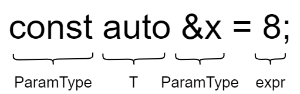
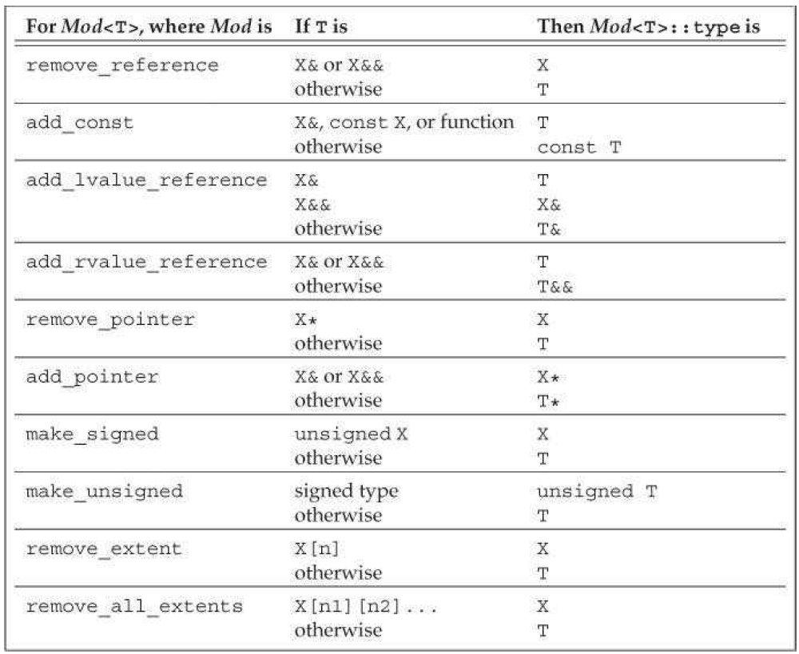
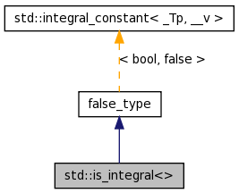

# 类型推导

本章来自 *Effective Modern C++*

## *条款1：理解模板类型推导*

```c++
template<typename T> void f(ParamType param); // 函数模板
f(expr); // 函数调用
```

在编译期间，根据实际传入的expr和预设的ParamType的不同类型的排列组合来推导模板类型T

ParamType = 饰词 + T，饰词有 cosnt、volatile、`&`、`&&`、`*` 等

### ParamType 既非指针也非引用

此时就是**按值传递**，也就是说无论传入的是什么，param都会是它的一个副本。所以下面的性质是很好理解的，反正函数模板内部得到的都是一个实参拷贝，是不会拷贝它的性质的（原理就是所处区域不一样，一个栈区的拷贝常量区里的内存，不会拷贝它常量区的性质），所以对它做什么都不会影响原来的值

1. **忽略expr的引用性 reference-ness、顶层常量性 top-level constness、volatile性**。注意一个点：右值引用得到的仍然是一个左值引用，所以当expr是一个右值引用时候的，它等同于一个左值引用，所以引用性同样会被忽略

   注意我们说的是忽略顶层const，底层const会被保留，因为语义上指向对象的const性质应该要被保留下来

2. 将expr剩余的类别与ParamType的类别再进行匹配，缺啥补啥

```c++
template<typename T> void f(T param)
int x = 27;
const int cx = x;
const int& rx = x;
const char* const ptr = "hello world";

f(x);   // x被推导为 int
f(cx);  // cx被推导为 int
f(rx);  // rx被推导为 int
f(ptr); // ptr被推导为 const char *
```

### ParamType 是指针或左值/右值引用，但不是万能引用

1. **忽略expr的引用性**，expr的底层常量性和顶层常量性都会被保留下来（回忆：只有当执行对象拷贝的时候才能忽略expr的顶层常量性，这里不是对象拷贝了）
2. 将expr剩余的类别与ParamType的类别再进行匹配

```c++
template<typename T> void f(const T& param)
int x = 27;
const int cx = x;
const int& rx = x;

f(x);   // x被推导为 const int&
f(cx);  // cx被推导为 const int&
f(rx);  // rx被推导为 const int&，rx本身的引用性被忽略
```

### ParamType 是万能引用 `T&&`

在模板推导时 `T&&` 是一个万能引用。注意：只有纯净的 `T&&` 是万能引用，`const T&&` 是一个右值引用

* 若传入的expr是个左值，则T和ParamType都会被推导为左值引用。**这是在模板类型推导中，T被推导为引用类别的唯一场景**。这种情况被称为引用折叠 reference collapse，相当于 `int & + int && -> int &`，相当于三个引用折叠成了一个引用
* 若传入的expr是个右值，运用ParamType是非万能引用的指针或引用时的规则

```c++
template<typename T> void f(T&& param)
int x = 27;
const int cx = x;
const int& rx = x;

f(x);   // 左值x被推导为 int&，引用折叠
f(cx);  // 左值cx被推导为 const int&，引用折叠
f(rx);  // 左值rx被推导为 const int&，引用折叠
f(20);  // 右值，被推导为 int&&
```

### 数组和函数指针实参的退化问题

在上面三种情况中，当传入的模板参数T是数组和函数的时候，要考虑其退化情况。注意：如果用了调用符 `()` 就是调用了，此时返回类型适用上面的规则

退化其实在C语言的函数及传参部分就早已经有过了，其实就是数组/函数名等价于首元素指针。它仍然对模板的类型推导有着重要作用，因此这里再提一下

**在一些语境下，数组和函数会退化成指向其首元素的指针**，比如说函数形参接受的实参实际上都是以指针形式来处理的

* 初始化的情况。注意：对数组名或函数名取地址的指针类型 $\neq$ 名字退化成的指针类型

  ```c++
  int array[5] = { 0, 1, 2, 3, 4 }; // array的数据类型是int[5]
  int *ptr = &array;                // 数组名退化为指向其首元素的指针
  int (*ptr2)[5] = &array;          // 数组名取地址的类型为int数值指针，不等于数组名的类型，即int指针
  int (&ptr)[5] = array;            // 数组引用
  ```

* 数组名作为参数传递时会发生退化，下面三种传递方法是完全等价的

  ```c++
  void foo(int a[100]);
  void foo(int a[5]);
  void foo(int *a);
  ```

  传递数组指针就不等价了

  ```c++
  void fun(int (*a)[5]);
  void fun(int (*a)[100 ]);
  ```

要注意下面两种const的情况

* 数组名退化成指针的同时顶层const也退化为底层const

  ```c++
  const char str[] = "hello world";
  f("hello world") // const char str*
  ```

* 函数指针没有底层const，底层const意味着可以修改函数内部的内容了，所以当有底层const的函数指针时，编译器会报错。而函数引用的底层const则会直接被编译器忽略

另外还有一种很特殊的情况：尽管函数无法声明真正的数组类别的形参，但是它们却能够将形参声明成数组的引用

```C++
const char name[] = "hello world";

template<typename T>
void f(T& param);

f(name);
```

上面的T的类别会被推导成实际的数组类型，即 `const char [12]`

可以利用声明数组引用这一能力创造出一个模板，用来推导出数组中含有的元素个数

```C++
template<typename T, std::size_t N>
constexpr std::size_t arraySize(T (&)[N]) noexcept
{
    return N;
}
```

## *条款2：理解auto类型推导*

### auto类型推导 = 模板类型推导

auto类型推导和模板类型推导的规则基本上完全一致，它们之间可以建立起一一映射的关系，它们之间也确实存在双向的算法变换

```c++
template<typename T> void f(ParamType param);
auto ParamType x = expr;
```



采用auto进行变量声明时，**auto 的型别饰词取代了ParamType，即auto是要推导的对象**，所以此时也是根据 auto 的型别饰词分成三种类型来讨论。并且同样的，数组和函数的退化情况也同样适用于auto

```c++
auto x = 28;           // auto的饰词既非指针也非引用，x绑定的类型为 int
const auto cx = x;     // auto的饰词既非指针也非引用，cx绑定的类型为 const int
const auto& rx = x;    // auto的饰词是个左值引用，但不是万能引用，rx绑定的类型为 const int&
auto&& uref1 = x;      // auto的饰词是万能引用，左值，uref1绑定的类型为 int&
auto&& uref2 = cx;     // auto的饰词是万能引用，左值，uref2绑定的类型为 const int&
auto&& uref3 = rx;     // auto的饰词是万能引用，发生引用折叠，uref3绑定的类型为 const int&
```

### auto推导初始化列表

auto类型推导和模板类型推导的唯一区别在于，**当用于auto声明变量的初始化表达式是使用大括号括起时，推导所得的型别就属于 `std::initializer_list`，而模板类型推导则不支持**

```c++
template<typename T> void f(T param);
f({1, 2, 3}); // 错误，无法推导 T 的类别
auto x = {1, 2, 3}; // x 被推导为 initializer_list<int>

// 可以通过将ParamType声明为初始化列表来通过编译
template<typename T> void f(std::initializer_list<T> param);
f({1, 2, 3}); // 正确，T的类型为int，从而f的实参类别被推导为std::initializer_list<int>
```

在这种情况下，若 `{}` 内的类型推导失败（最常见的原因可能是因为元素的数据类型不一致），那么也会导致auto的类型推导失败

```c++
auto x = {1, 2, 3.0}; // 错误，不知道该用哪个initializer_list
```

注意⚠️：下面两种写法auto本来都会推导出 `initializer_list`，但是在C++17推出后，`auto x3{20}` 的auto推导类型不再是 `initializer_list`

```c++
auto x3{20}; // x3 被推断为 int
auto x4 = {27}; // x4 被推断为 initializer_list<int>
```

此外，C++14中又引入了一种**auto可以用作模板类型推导**的方式，需要配合decltype一块使用，具体见下一条条款

auto 会把 `{}` 推导为 `initializer_list` 是一个C++11程序中的经典错误，因为很多时候程序员的本意都并非如此，正因为如此，**很多程序员都只有在必要的时候才采用 `{}` 初始化**。至于什么是必要的时候，可以看 *面向对象.md* - 列表初始化部分

### 使用auto的注意事项

* 当用一个auto关键字声明多个变量的时候，编译器遵从由左往右的推导规则，以**最左边**的表达式推断auto的具体类型

  ```c++
  int n = 1;
  auto *pn = &n, m = 10;
  auto *pn = &n, m = 10.0; // 编译失败，声明类型不统一
  ```

  因为 &n 的类型是 `int *`，所以pn类型被推导为 `int *`，auto被推为int

* 当使用条件表达式初始化auto声明的变量时，编译器总是使用表达能力更强的类型

  ```c++
  auto i = true ? 5 : 8.0; // i 的数据类型为 double
  ```

* 虽然C++11标准支持在声明时初始化（当然本质上是给初始化列表用的），但是auto依旧无法在这种情况下声明非静态成员变量。静态成员可以在声明处给值，但是必须是const staic

  ```c++
  class MyClass {
  private:
      auto x_ = 1; // 错误，无法通过编译
      static const auto y_ = 2; // 允许
  }
  ```

* C++20之前无法在函数形参中使用auto声明形参

  ```c++
  void foo(auto param) {} // C++20
  ```

* 从C++14开始，auto可以为lambda表达式声明形参。这部分可以看 *STL.md* - lambda 的使用部分

## *条款3：理解decltype*

[【C++深陷】之“decltype”-CSDN博客](https://blog.csdn.net/u014609638/article/details/106987131)

模板类型推断有时候会把 const、volatile、引用 等性质忽略掉，如果是想要获取相符的类型，可以用 decltype (declared type) 关键字来获取名字或表达式的实际类别

### 推导规则

重温一下概念：表达式 expression 是由操作数 operands 和运算符 operators 组成的组合，用来执行特定的计算操作并生成一个结果。表达式可以包括各种数据类型的变量、常量、运算符以及函数调用等。表达式的结果不是左值就是右值。比如说取地址和取引用都是表达式，他们返回左值

推导规则可以分为两大类

* decltype + 变量：所有信息都会被保留，数组与函数名也不会退化
* decltyp + 表达式：表达式返回的不是左值就是右值
  * 左值得到左值引用 `T&`
  * 右值得到该类型 T
  * 将亡值得到 `T&&`
* decltype + 函数/仿函数调用：返回返回值的类型。其实这条就是上面 decltype + 表达式的规则，因为函数调用就是表达式，但是有点容易混淆，所以单独列出来说一下

```c++
int a = 10;
int *aptr = &a;
decltype(*aptr) b1; // *a 表达式返回的是左值引用，结果为int &
decltype(&a) b2; // &a 表达式返回的是地址的右值引用， 结果为int
decltype(std::move(a)) b3; // 将亡值，结果为int &&
```

注意：`int a` 是一个变量，`decltype(a)` 得到的类型是int。若想要用它的表达式属性，可以用 `()` 括起来，`decltype((a))` 返回的是 `int &`，这如果是在函数内部使用将是灾难性的，因为返回了一个右值的引用，是一种未定义行为

decltype 并不会真的取计算表达式的值，编译器只是会分析表达式并得到类型

```c++
decltype(foo_func(param)) my_var; // foo_func 并没有被执行
```

### 使用场景

C++11中decltype的主要用途大概就是用来声明那些返回值型别依赖于形参类型的函数模板

考虑写一个返回容器 `[]` 调用的函数模板，虽然大多数时候 `operator[]` 都会返回和容器数据类型T相同的 `T&`，但是若保存的数据类型是bool就不行了，比如 `std::vector<bool>` 返回的是`std::vector<bool>::reference` 类型（至于为什么这么处理在条款6中有说明）。因此我们要对其进行delctype推导

* C++11的写法： trailing return，此时auto是一个返回值的置位符

  ```c++
  template <typename Container, typename Index> 
  auto testFun(Container &c, Index i) -> decltype(c[i]) {
      // ... do something
      return c[i]
  }
  ```

* C++14的写法，因为 C++14 将自动推导返回值推广到了包含多语句的一切 lambda 表达式和函数式，所以此时可以把尾置返回去掉了

  * 错误的写法：可以直接写auto，但是此时要注意**auto走的是模板推导**，此时其饰词既不是引用，也不是指针，所以当接受的 expr 是引用的时候，输入的引用性会被忽略，所以auto得到的不是一个引用，而是一个值拷贝。此时相当于是把5赋值给一个返回值（即一个右值），因此无法通过编译，也就无法实现修改

    ```c++
    // 返回的是T，而不是T&
    template <typename Container, typename Index> 
    auto testFun_error(Container &c, Index i) {
        // ... do something
        return c[i]
    }
    
    testFun_error(c, 2) = 5; // 无法修改
    
    auto x = c[i] // 等价于推导 x，c[i] 是一个引用
    ```
  
  * 正确的写法：使用 `decltype(auto)`，它的作用简单来说就是**告诉编译器用 decltype 的推导表达式规则来推导 auto，而不是走 auto 的模板推导**。此时等价于C++11的auto占位符写法，意思是保存引用性质，否则引用性会被模板脱掉
  
    ```c++
    template <typename Container, typename Index> 
    delctype(auto) testFun_right(Container &c, Index i) {
        // ... do something
        return c[i]
    }
    ```
  
  * 也可以采用转发的方式来保留引用性质
  
    ```c++
    template <typename Container, typename Index> 
    delctype(auto) testFun_right(Container &&c, Index i) {
        // ... do something
        return std::forward<Container>(c)[i];
    }
    ```

### `decltype(auto)`

注意：在使用 `decltype(auto)` 的时候，它必须单独声明，不能结合指针、引用以及cv饰词

```C++
int i;
int&& f();                       // 函数声明
auto xla = i;                    // xla 推导类型为 int
decltype(auto) x1d = i;          // xld 推导类型为 int
auto x2a = (i);                  // x2a 推导类型为 int
decltype(auto) x2d = (i);        // x2d 推导类型为 int&
auto x3a = f();                  // x3a 推导类型为 int，函数调用，PramType是值拷贝，所以忽略其引用性
decltype(auto) x3d = f();        // x3d 推导类型为 int&&，decltype完整返回返回数据类型
auto x4a = { 1, 2 };             // x4a 推导类型为 std::initializer_list<int>
decltype(auto) x4d = { 1, 2 };   // 编译失败，{1，2}不是表达式
auto *x5a = &i;                  // x5a推导类型为 int*
decltype(auto) *x5d = &1;        // 编泽失败，decltype(auto)必须单独声明
```

C ++17中和auto一样，`decltype(auto)` 也能作为非类型模板形参的占位符，其推导规则和上面介绍的保持一致

```c++
template<decltype(auto) N> void f() { std::cout << N << std::endl; }
```

## *条款4：掌握查看类型推导结果的方法*

这一条款主要说了一下用IDE、编译器和typeid 运行时输出来查看类型的方法

核心是typeid和type_info，这部分在 *面向对象.md* - 多态 - RTTI 中有比较详细的笔记了

## *类模版的模版实参推导（17, 20）*

### 通过初始化构造推导类模板（17）

在一开始接触标准库中的 `std::make_pair` 和 `std::make_tuple` 这类函数的时候我一直弄不明白为什么要专门搞一类这样的函数，直接用初始化列表来构造不就好了吗？

事实上实例化类模板必须显式指定模板实参，比如下面这么实例化tuple模版，非常冗长麻烦

```C++
std::tuple<int, double, const char*> v{5, 11.7, "hello world"};
```

因为函数模板可以通过函数的实参列表推导出模板实参，所以才出现了`std::make_pair` 和 `std::make_tuple` ，配合auto类型自动推导可以将上面的模版实例化简化为下面的形式

```C++
auto v = std::make_tuple(5, 11.7, "hello world");
```

C++17进一步支持了类模板的模板实参推导，因此上面的模版实例化可以进一步简化为

```C++
std::tuple v{ 5, 11.7, "hello world" }
```

注意⚠️：不同于函数模板，类模板的模板实参是不允许部分推导的

### 别名模板的类模板实参推导（20）

# auto

本章来自 *Effective Modern C++*

## *条款5：优先使用auto，而非显式类型声明*

auto除了避免程序员书写那些过于冗长的类型之外，还能阻止那些因为手动指定类型带来的潜在错误和性能影响


C++14之后lambda形参也可以使用auto了，这直接就变成了一个模板

lambda表达式的返回值一定要用auto

### 类型的跨平台性

当使用 `std::vector<int> v` 的方法 `v.size()` 的时候，它的返回值是 `std::vector<int>::size_type`，这个类型在不同系统上的大小是不同的，如果我们一直用 size_t 来接受的话可能会造成移植问题，所以用auto来自动推导比较好

### 避免因为类型写错而导致的无用的拷贝

```c++
int a = 10;
//float &b = a; // 编译器报错
const float &b = a;
```

C++中有一个上面这种很怪异的现象，引用的时候一定要类型匹配，否则编译器会报错。但是如果是用const引用就可以了。Primer中给出的解释是创建了临时变量然后隐式转换了

现在考虑下面这个场景，我们想要遍历 `std::unordered_map<std::string, int> m` 这个map，通过编译器我们发现auto的实际推导类型为 `std::pair<const std::string, int>`，这和我们显式给出的 `std::pair<const std::string, int>` 并不相符。根据上面的例子，我们可以认为中间必然是会有拷贝和隐式转换的消耗

```c++
std::unordered_map<std::string, int> m{{"hello", 10}，{"world"，5}, { "heihei", 20}};
for (const std::pair<std::string, int> &p : m) { /*遍历*/ }
for (const auto &p : m){ /*遍历*/ }
```

为了避免这种潜在的因为类型错误而导致的性能开销，应该优先使用auto


## *条款6：auto推导若非己愿，使用显式类型初始化惯用法*

### 代理类

代理类 proxy class 是指以模仿和增强一些类型的行为为目的而存在的类

```c++
class MyArray {
public:
    class MyArraySize {
    public:
        MyArraySize(int size) : theSize(size) {}
        int size() const { return theSize; }
        operator int() const { return theSize; }
    private:
        int theSize;
    };

    MyArray(MyArraySize size) : size_(size), data_(new int[size.size()]) {}
    int operator[](int index) {
        return data_[index];
    }
    ~MyArray { delete int[size.size()]; }
    bool operator==(const MyArray &temp) {
        return data_ == temp.data_;
    }
    MyArraySize size() { return size_; }
private:
    int *data_;
    MyArraySize size_;
};
```

上面的内部类MyArraySize就是一个代理类，它是在模仿int

```c++
class MyArray_ {
public:
    MyArray_(int size) : size_(size), data_(new int[size]) {}
    ~MyArray_() { delete int[size_]; }
private:
    int *data_;
    int size_;
};

void func1(MyArray_ arr) {/**/}
```

如果直接用int会怎么样？上面的MyArray_就是直接用了int。一个很明显的问题就是因为它只吃了一个单参数构造，所以当调用 `func1(10)` 的时候发生参数的隐式转换了

为了禁止隐式转换，这时候要把 `MyArray_` 设置为 explicit 来禁止隐式转换，调用的时候 `func1(MyArray_(10))` 这样就可以了

# 右值引用的底层原理

本章来自 *Effective Modern C++*

理解本章的核心是要记住：**所有形参都是左值引用**。因为左值是可以取地址的，形参是在栈空间上分配地址的，因此所有形参都是左值

万能引用配合转发的核心代码是

```C++
template<typename T>
void fwd(T&& param)             // 万能引用接受任意实参
{
    f(std::forward<T>(param));  // forward完美转发该实参到f
}
```

## *条款23 & 28：理解 `std::move` & `std::forward`（引用折叠）*

### `std::move`

我们首先来看一种错误的实现

```c++
template<typename T>
T &&myMove(T &&param) {
    return static_cast<T &&>(param);
}

int mmm = 10;
int &&nnn1 = mymove(10); // 通过编译
int &&nnn2 = mymove(mm); // 编译报错
```

* `mymove(10)`：万能引用接收右值输入，万能引用再接收输出，得到一个 `int &&myMove<int>(int &&param)` 的模板
* `mymove(mm)`：万能引用接收左值输入，会发生三次引用折叠，即输入一次，`static_cast` 一次，最后输出再一次，所以实际得到的是一个 `int &myMove<int &>(int &param)`，这不符合右值输出所以报错了

标准库中则大概是下面这么实现的，使用了萃取器 `remove_reference` 脱去了内部左值的引用性质

```c++
// C++11
template<typename T>
typename remove_reference<T>::type&& move(T &&param) {
    using ReturnType = typename std::remove_reference<T>::type &&; // 类型萃取
    return static_cast<ReturnType>(param);
}
// C++14
template<typename T>
decltype(auto) move2(T &&param) {
    using ReturnType = std::remove_reference_t<T> &&;
    return static_cast<ReturnType>(param);
}
```

右值绑定到右值引用上的效果和左值绑定到左值引用上的效果是一摸一样的，并不会发生什么突然的析构

### `std::move` 只是在声明资源适合移动

```c++
int a = 3;
int &&b = std::move(a);
a++; // 未定义行为，仅为了实验说明，工程中不要这么做！
cout << a << endl; // 4
b++;
cout << b << endl; // 5
```

上面的实验并不会报错，a在被move了之后还可以被访问，就说明此时a的资源都还在。注意：上面的实验中访问move了之后的资源是一种未定义行为，因为此时我们是无法确定资源是否还在的（当然在上面这种很简单的情况下我们知道资源暂时还没有被移动），所以在工程中不能写出这样的代码

根据move的定义，我们可以看到move的作用并不是用了之后马上就把资源转移给右值引用，然后直接把资源回收销毁了。资源的回收销毁仍然是由析构以及OS完成的。move的作用仅仅是将类型强转为 `&&`，因此有些人提议说move应该被叫做rvalue_cast

总结来说，move的作用是强转为 `&&`，而强转为 `&&` 的作用则是告诉编译器：**该对象适合被移动，然后编译器会在条件满足的情况下移动它的资源**。比方说 `std::move(const std::string str);` 实际上执行的仍然是复制。我们得到的教训是如果要对某个对象执行移动操作时，则不要将其声明为常量。因为**针对常量对象执行移动操作将变成复制操作**。移动构造只能接受非常量的右值作为参数

### 试图移动常量对象

```C++
class Annotation {
public:
	explicit Annotation(const std::string text)
	: value(std::move(text)) // 将text "移动入" value,
    { ... }                   // 这段代码实际的所作所为和乍看之下有所不同！
private:
	std::string value;
};
```

string有下面这样的构造函数，对于一个const的右值而言，它仍然会走拷贝构造，因为移动构造有权限放大的问题
```C++
string(const string& rhs);  // 拷贝构造
string(string&& rhs);       // 移动构造
```

### 引用折叠

实参在传递给函数模板时，推导出来的模板形参会将实参是左值还是右值的信息编码到结果类型中。但是**这种编码操作只有在实参被用以初始化的形参为万能引用时才会发生**

**引用折叠 reference collapsing** 是专用于类型推导的概念，会出现在四种情境中：模板类型推导、auto类型推导、typedef 或using别名声明以及decltype中

如果是形参不匹配，比如左值赋给右值，只是会报类型不匹配的编译错误而已，因为此时根本就不是万能引用！

一共有四种搭配形式，即左值-左值、左值-右值、右值-左值和右值-右值。**若任一引用为左值引用，则结果为左值引用给，否则（即在两个皆为右值引用的情况下）结果为右值引用**

### `std::forward`

在类型推断那一章中我们看到，当万能引用接收参数时，传入左值就一定是一个左值引用，但传入右值也一定会产生左值引用。所以万能引用接收参数实际上丢失了参数到底是左值还是右值的原信息

但有些时候我们是需要这种信息的，因为我们可能会需要根据是左值还是右值来做自适应操作。这时候我们就需要用`std::forward<T>` 来保留其引用性质

比方说下面这种情况，不论传入的是左值还是右值，若用的是 `process(param)` 都只会调用左值版本；若用的是 `process(std::move(param))`，则都只会调用右值版本

```c++
void process(const A &lvalArg) { // 左值版本
    std::cout << "deal 1valArg" << std::endl;
}
void process(A &&rva1Arg) { // 右值版本
	std::cout << "deal rvalArg" << std::endl;
}
template<typename T> void logAndProcess(T &&param) {
	// process(param); // 一定调用左值版本
	// process(std::move(param)); // 一定调用右值版本 
	process(std::forward<T>(param)); // 实参用右值初始化时，转换为一个右值
}
```

**`std::forward<T>` 的本质是有条件的move，只有当模板参数T用右值初始化时才转换为右值**，而 `std::move` 的本质就是无论左值还是右值统统转为右值

引用折叠是forward能实现的关键，引用折叠会在类别推导中（模板、auto）的形参、类型强制转换和返回值处发挥作用

它的参考实现如下。`std::forward<T>` 是借助模板中保留的引用信息对两种引用进行了两次重载

```c++
// C++11
// 左值，函数体内第一次引用折叠得到T&，返回值处第二次引用折叠得到T&
template <class T>
T&& forward(typename remove_reference<T>::type& param) noexcept {
    return static_cast<T&&>(param);
}
// 右值，右值引用时忽略expr的引用性，得到T，函数体内强转为T&&，返回值除同理得到T&&
template <class T>
T&& forward(typename remove_reference<T>::type&& param) noexcept {
    return static_cast<T&&>(param);
}

// C++14
template <class T>
T&& forward(remove_reference_t<T>& param) noexcept {
    return static_cast<T&&>(param);
}
template <class T>
T&& forward(remove_reference_t<T>&& param) noexcept {
    return static_cast<T&&>(param);
}
```

## *条款24：区分右值引用 & 万能引用*

`T&&` 有两层含义，第一种就是普通的右值引用，它的目标是识别出可移动对象，然后绑定到右值上

第二种含义是万能引用 universal reference（也称为通用引用和转发引用 forwarding references），出现在模板和auto这两种类型推导的场景中

```c++
template<typename T> void f(T&& param); // T是个万能引用
auto&& var2 = var; // var2是个万能引用
```

### 模板的万能引用

要求是 `T&&` + 类型推导

```c++
template <typename T> void func(T &&param) { /**/ }
int a = 10;
func(a); // 推导为 int&
func(10); // T推导为int，总体推导为int&&
```

判断是否是万能引用很简单，那就是**看模板类型到底是不是自动推导出来的**，不能人为的给它帮助。下面的三种情况都不是万能引用

* 显式给出T

  ```c++
  func<int>(10); // T显式设置为int，总体为int&&
  func<int>(a); // 报错，T显式设置为int，所以总体只能是int&&，但是这里正常推导应该为int&
  ```

* 之前有提到过万能引用**只能是单独给出的**，不能有任何cv饰词，模板的万能引用同理，比如下面的

  ```c++
  template <typename T> void func(std::vector<T> &&param); // 不是万能引用！
  template <typename T> void func(const T &&param); // 同理，不是万能引用！
  ```

* 下面push_back中的也不是万能引用，因为**T的类型是和vector的数据类型强绑定的**

  ```c++
  template < class T, class Alloc = allocator<T> > class vector {
  public:
      push_back(T &&x);
  };
  ```

### 可变参数模板的万能引用

要求是 `Args&&...` + 类型推导

和push_back不同，下面emplace_back的参数包 `Args&&...` 和vector的T没关系

```c++
template < class T, class Alloc = allocator<T> > class vector {
public:
    void push_back (const T& val); // 并不是类型推导，T 在 vector 定义的时候就已经定下来了
    void push_back (T&& val);
    template <typename... Args> void emplace_back(Args&&... args);
};
```

### auto的万能引用

要求是 `auto&&/auto&&...` + 类型推导

auto万能引用在C++14中大量出现，因为C++14支持lambda可以声明 `auto&&` 形参

```c++
// C++14s
auto timeFuncInvocation = [](auto &&func, auto&&... params) {
    std::forward<decltype(func)>(func)(
    	std::forward<decltype(params)>(params...)
    )
}
```

## *条款25：对右值引用用 `std::move`，对万能引用用 `std::forward`*

当转发右值引用给其他函数时，应当对其实施向右值的无条件强制型别转换（通过 `std::move`) ，因为它们一定绑定到右值；而当转发万能引用时，应当对其实
施向右值的有条件强制型别转换（通过 `std::forward` ) ，因为它们不一定绑定到右值

### move & forward的正确用法

* 右值就说明了绑定的对象很适合移动

  ```c++
  class Widget {
  public:
      // rhs 这个函数参数是个右值引用，但进入函数内部后仍然是一个左值，所以要move它的成员
  	Widget(widget&& rhs) 
  		: name(std::move(rhs.name)) 
          , p(std::move(rhs.p))
      {}
  private:
  	std::string name;
  	std::shared_ptr<SomeDataStructure> p;
  };
  ```

* 而万能引用则是要有选择性的转发，它只是有可能会绑定到右值。由于万能引用几乎总是要用到转发，因此万能引用也被称为转发引用 forwarding references

  ```c++
  class Widget {
  public:
  	template<typename T>
  	void setName(T&& newName) { // newName是个万能引用
  		name = std::forward<T>(newName);
      }
  private:
  	std::string name;
  	std::shared_ptr<SomeDataStructure> p;
  };
  ```

### 反例

* 不要对右值用forward，虽然这在语法和功能上不会造成错误，因为左值引用传给引用。使用move代码清晰，语义上复合逻辑，且可以消除传递错误类型的可能性

  ```C++
  class Widget {
  public:
  	Widget(Widget&& rhs)
  	: s(std::move(rhs.s))
  	{ ++moveCtorCalls; }
  private:
  	static std::size_t moveCtorCalls;
  	std::string s;
  };
  
  // 在该使用move的地方不恰当地使用forward
  class Widget {
  public:
  	Widget(Widget&& rhs)
  	: s(std::forward<std::string>(rhs.s))
  	{ ++moveCtorCalls; }
  };
  ```

* 绝对不要对万能引用用move，这次并不只是会造成代码冗余了，而是会实打实地产生功能上的错误。本来一个想要保留左值引用的变量直接被move转移走了

### 分别对左值和右值重载的问题

```C++
class Widget {
public:
	template<typename T>
    void setName(T&& newName)             // newName is
    { name = std::forward<T>(newName); }  // universal reference
	// ...
};

// 不好的实现：分别重载
class Widget {
public:
	void setName(const std::string& newName) // set from
    	{ name = newName; }                  // const lvalue
    
	void setName(std::string&& newName)      // set from
    	{ name = std::move(newName); }       // rvalue
	// ...
};
```

分别对左值和右值重载的问题主要有两个问题

* 效率问题，如果是用万能引用的话，newName会被直接给Widget内部的string的构造函数（这也是为什么emplace_back的效率高于push_back）。而分别重载的时候虽然传进来的时候是右值引用，但右值引用也是一种左值，所以在函数体内若不用move，那么就全部都是拷贝

  调用链为：一次 `std:: string` 的构造函数（以创建临时对象），一次 `std::string` 的移动赋值运算符（以移动newName 到w.name) ，还有一次 `std::string` 的析构函数（以销毁临时变量）

* 最大的问题是可扩展性太差：若有n个参数，那么就需要有 $2^n$ 个重载函数，因为需要为每个参数都提供左值和右值的重载

  ```C++
  template <class T, class... Args>
  shared_ptr<T> make_shared(Args&&... args);
  ```

### 仅在最后一次使用move或forward


### 返回值优化

在按值返回的函数中，若返回的是绑定到一个右值引用或者一个万能引用的对象，则返回右值引用要用 `std::move`，返回万能引用要用 `std::forward`

```c++
Widget func(Widget &&w) { return std::move(w); }

template <typename T> 
```

## *条款26：避免在万能引用上重载*

### 万能引用普通函数的重载

```C++
std::multiset<std::string> names;                // global data structure
template<typename T>
void logAndAdd(T&& name)
{
    auto now = std::chrono::system_clock::now(); // get current time
	log(now, "logAndAdd");                       // make log entry
 	names.emplace(std::forward<T>(name));        // add name to global data structure
}
// 重载万能引用
std::string nameFromIdx(int idx);      // return name corresponding to idx
void logAndAdd(int idx)                // new overload
{
    auto now = std::chrono::system_clock::now();
    log(now, "logAndAdd");
    names.emplace(nameFromIdx(idx));
}

short nameIdx;
logAndAdd(nameIdx); // 报错！
```

按照普适的重载决议规则，精确匹配就优先于提升后才能匹配。因此形参类型为万能引用的版本才是被调用到的版本

也就是说当参数是short时，万能引用产生了比int更好的重载。当把short类型的形参name转发给names的时候，因为string没有接受short的构造函数，所以编译报错了

形参为万能引用的函数，是C + +中最贪婪的。**万能引用会在具现过程中，和几乎任何实参型别都会产生精确匹配**。这就是为何把重载和万能引用这两者结合起来几乎总是馈主意：一旦万能引用成为重载候选，它就会吸引走大批的实参型别

### 万能引用构造函数的重载

### 在上面的基础上加入继承

## *条款27：熟悉万能引用重载的替代方法*

### 使用传值来替代通用引用

### 使用tag dispatch

### 使用enable_if实现真正的重载

### 编译器断言 static_assert

### 权衡

## *条款29：假定移动成本不存在、成本高、未被使用*

## *条款30：熟悉完美转发的失败情形*

转发的含义是一个函数把自己的形参传递（转发）给另一个函数而已。其目的是为了让第二个函数（转发目的函数）接受第一个函数（转发发起函数）所接受的同一对象

所以转发就排除了按值传参和指针形参，一般都是指处理引用类型的形参的情况

给定目标函数`f`和转发函数`fwd`, 当以某特定实参调用`f`会执行某操作，而用同一实参调用`fwd`会执行不同的操作，则称完美转发失败 perfect forwarding fails

````C++
f( expression );   // if this does one thing,
fwd( expression ); // but this does something else, fwd fails to perfectly forward expression to f
````

### `{}` 初始化

### 空指针

### const static 成员变量

### bitfields

# emplace_back

## *条款41：对于移动成本低且总是被拷贝的可拷贝对象，考虑按值传递*

## *emplace_back的使用*

# 模板的基本概念

泛型编程 Generic Programming：编写与类型无关的通用代码，是代码复用的一种手段

模板是泛型编程的基础，模板是一种静态的多态，因为它在编译的时候就确定了

## *模板的编译*

### 模板报错的不同阶段

* 编译的词法分析阶段：词法分析就是关键字，标识符什么的有没有拼写错误

* 编译的语法分析阶段：弱遇到模板的使用，就要对这句话进行语法分析，语法分析就是检查句子是否合理通顺被，参数数量不对很明显不符合语法

* 编译的目标代码生成阶段

  当编译器遇到一个模板定义时，它不会生成代码，**只有当实例化模板的时候编译器才会生成代码**，这个阶段发生在编译器后端的目标代码生成阶段。而这种特性会影响到如何组织代码以及错误何时才会被检测到

  若在本模块中找不到函数和变量的地址（即定义），那么会在链接阶段去总符号表里找，所以函数和变量只要在头文件中有一个声明就可以，定义可以放到某个模块的c文件中。但是类和模板不同，它们是在编译阶段实例化数据的“蓝图”，每一个用到它们的文件都必须知道它们的具体定义，而不仅仅只是其声明。所以**完整的类和模板必须要定义在头文件中**

* 链接阶段：虽然实例化代码产生了，但是代码可能因为运行时的类型不匹配，比如说类型不支持某种运算符等原因，只有在真正执行代码的时候才会发现，所以可能出现在链接执行的时候。TODO：到底这种报错是什么时候？

**模板不能进行分离编译**，否则会因为两次模板实例化导致链接错误，**因此要统一放在头文件里**，但在同一个文件里可以分离编译

### 控制实例化 -- 外部模板（11）

前面说过只有当实例化模板的时候编译器才会生成代码，若不同的编译单元使用了同一份实例化模板的时候，那么在各自的编译单元都会生成对应的模板，这会导致严重的代码膨胀

和避免全局变量重定义一样，我们可以使用外部模板 extern template 来控制实例化，从而减少代码膨胀。外部模板的形式如下

```c++
extern template class Foo; // 实例化声明
template class Foo {} // 实例化定义
```

外部模板意味着指示编译器在之后的链接过程中去其他编译单元中找到，也就是整体程序共享了一个实例化模板。因此要**确保至少有一个实例化定义，而且extern声明必须出现在任何使用此实例化模板的代码之前**

### 连续右尖括号的解析优化（11）

C++11之前，编译器根据贪婪原则总会把两个连续的右尖括号 `>>` parse为右移，但是 `>>` 在模板中是很常见的，对此的解决方案是加空格，即写成 `> >`

新的标准优化了这个问题，编译器会智能识别左尖括号并进行匹配。不过这也可能带来新老代码的兼容性问题

### 变量模板（14）

### 模板的优缺点

* 优点
  * 模板复用了代码，节省资源，更快的迭代开发，STL库的诞生很大程度上得益于此
  * 增强了代码的灵活性
* 缺点
  * 模板只是将重复的代码交给编译器实现，因此模板也会导致代码膨胀问题，从而导致编译时间变长
  * 出现模板编译错误时，错误信息非常凌乱，不易定位错误

## *名称查找 & ADL*

c++11-17 模板核心知识（十三）—— 名称查找与ADL - 张雅宸的文章 - 知乎
https://zhuanlan.zhihu.com/p/338917913

## *函数模板*

### 模板参数

函数模板 function template 代表了一个函数家族，该函数模板与类型无关，在使用时被参数化，根据实参类型产生函数的特定类型版本

```c++
// 模板参数定义了模板类型，类似函数参数，但函数参数定义了参数对象
// typename后面类型名字T是随便取的，一般是大写字母或者单词首字母大写 T、Ty、K、V，代表了一个模拟类型/虚拟类型
template<typename T> void Swap(T& left, T& right) {
    T temp = left;
    left = right;
    right = temp;
}
// swap在std中有模板定义了
```

模板定义以关键字template开始，后跟一个模板参数列表 template parameter list，这是一个以逗号分隔的一个或多个模板参数 template parameter 的列表。模板定义中，模板参数列表不能为空

模板参数有两种

* 模板类型参数 type parameter

* 非类型模板参数 nontype parameter：非类型模板参数表示一个值而非一个类型，通过一个特定的类型名而非关键字class或typename来指定它

  ```c++
  template<class T, size_t N = 10> class array {
  public:
  private:
      T _a[N];
  };
  ```

  * 非类型模板参数只能用于整形、枚举、指针（包括 `std::nullptr_t`）或引用，浮点数、类对象以及字符串是不允许作为非类型模板参数的
  * 非类型的模板参数必须在编译期就能确认结果，比如说传一个 `const int N = 10;`

函数模板可以声明为inline或constexpr的，说明符放在模板参数列表之后，返回类型之前

```c++
template<typename T> inline T min(const T&, const T&);
```

### 允许非类型模板形参中的字面量类类型（20）


### 函数模板的实例化

C++中实例化有两种意义

1. 对象实例化：创建类的一个具体对象的行为
2. 模板实例化：当使用模板（无论是函数模板还是类模板）时，需要为模板参数提供具体的类型或值。编译器使用这些具体的信息来生成相应的代码。这个过程被称为模板实例化。例如当 `std::vector<int>`，意思是指示编译器为 `int` 类型生成 `std::vector` 模板的特定代码实现

**函数模板实例化的原理：模板实参推断 template argument deduction 和函数模板实例化 instantiation**

函数模板是一个设计图，它本来并不是真正用来执行任务的函数，每次调用相关函数编译器都要根据函数模板进行一次类型推演产生相关函数

* 隐式实例化 implicit instantiation：不需要给出 `<>`，让编译器根据实参**自动推演**模板参数的实际类型

  ```C++
  template <typename T>
  T max(T a, T b) {
      return (a > b) ? a : b;
  }
  
  max(3, 7); // 隐式实例化
  ```

  注意：模板中不会进行隐式类型转换，编译器不知道该转成哪一个会报错，需要用户自已进行强制类型转换

* 显式实例化 explicit instantiation：在函数名后的 `<>` 中由用户指定模板参数的实际类型

  * 参数需要强转时可以使用

    ```cpp
    // Add(1.1, 2) // 报错
    Add((int)1.1, 2); // 用户强转输入
    Add<int>(1.1, 2); // 模板的显式实例化
    ```

  * 需要指定返回类型时一定要显式实例化

    ```cpp
    // 已经定义了一个A类
    template<class T> T* Func(int n) {
        T* a = new T[n];
        return a;
    }
    // 不能自动推演返回类型T
    Func<A>(10); // 显式实例化
    ```

## *类模板*

### 模板定义

```cpp
// template<typename T>
// 上下两种类模板都可以
template<class T> class Foo {
    Foo();
    // 在类模板内可以简化模板类名的使用
    Foo& some_function() {}
private:
    T* _a;
};
// 同一个头文件的类模板外定义
template<typename T> inline Foo() {}
```

* 类模板实例化的方法和函数模板实例化时候的自动推演不同，**类模板必须要显式实例化**，也就是说需要显式给出 `<>` 里面的类型，这些类型被称为显式模板实参 explicit template argument 列表，它们会被绑定到模板参数
* 类模板名字不是真正的类，实例化的结果 `Stack<int>` 才是真正的类，若不显式实例化，编译器无法判断
* **在头文件中的类模板之外定义成员函数的时候必须要把关键字template及其后的类模板参数列表带上**
* 在类模板内可以简化模板类名的使用，此时不需要写参数列表；在类模板外的类函数内也可以

默认情况下，类模板的成员函数只有当程序要用到它的时候才会实例化 

### 类模板的static成员

类模板同样可以声明static成员，但是使用类模板的static成员和在普通类中使用static成员有一些区别

```c++
template<typename T> class Foo {
public:
    static std::size_t count() { return ctr; }
private:
    static std::size_t ctr;
}
```

类模板的每个实例都有一个独有的static对象

### 成员模板

成员模板 member template 是普通类或类模板中的模板函数，**成员模板不能是虚函数**

当在类模板外定义类模板的成员模板时要依次给出类模板参数列表和函数模板参数列表

```c++
template<typename T>
template<typename It>
Blob<T>::Blob<It b, It e>
    :data_(std::make_shared<std::vector<T>>(n, e)) {}
```

## *typename 应对歧义*

以下内容部分来自 *EffectiveCpp.md* 的条款42 - understand the two meanings of typename

[知无涯之C++ typename的起源与用法 (feihu.me)](https://feihu.me/blog/2014/the-origin-and-usage-of-typename/#问题浮现)

### 一些概念

* 限定名和非限定名

  * 限定名 qualified name 是限定了命名空间的名称，比如下面的 `std::cout` 和 `std::endl`

    ```c++
    std::cout << "Hello Wolrd" << std::endl;
    ```

  * 非限定名 unqualified name 是没有用域访问符限定的，比如下面的 `cout` 和 `endl`

    ```c++
    using namepsace std;
    cout << "Hello Wolrd" << endl;
    ```

* 依赖名和非依赖名

  依赖名 dependent name 是指依赖于模板参数的名称，而非依赖名 non-dependent name 则是指不依赖于模板参数的名称

  下面的非依赖名因为是内置类型int是在模板声明的时候就已知的，而依赖名则要等到模板实例化了之后才能确定下来

  ```c++
  template<typename T> class Foo {
      // 非依赖名
  	int i;
      vector<int> vi;
      vector<int>::iterator vitr;
  	// 依赖名，依赖于模板参数T
      T t;
      vector<T> vt;
      vector<T>::iterator viter;
  }
  ```

### typename 的引入

由于历史的原因，Stroustrup 在设计模板的时候没有引入一个新的关键字，用的仍然是 class，很多旧的编译器只支持 class。事实上：直到 C++17 typename才被引入！

虽然 class 有些别扭，但总归还是能用的。下面是真正引入 typename 的原因

```c++
template<typename T> void foo() {
    T::iterator * iter; // 故意写成这样
}
```

若是对于一个确定的类型 vector 来说，我们知道 `vector::iterator` 肯定是一个迭代类型，即 vector 的迭代器。但是对于 `T::iterator` 来说，有三种可能性

```c++
template class Foo {
    static void iterator();
    static int iterator;
    typedef int iterator;
}
```

* T 的静态数据
* T 的静态函数
* 嵌套定义在 T 中的嵌套类型

因此解释 `T::iterator * iter` 也有歧义，要么解释为一种乘法运算，即静态数据 `T::iterator` 与某种已经声明的变量 iter 的乘积；要么解释为声明为 T 中的嵌套类型 `T::iterator` 的一个变量

这种在模板定义中的二义性是无法接受的。因此引入了 typename，即**对于用于模板定义的依赖于模板参数的类型，只有在实例化的参数中存在这个类型名，或者这个名称前使用了`typename`关键字来修饰，编译器才会将该名称当成是类型**。而在默认情况下，嵌套的从属名称不是类型，所以只要是依赖于模板参数的类型声明都要加 typename，不可以省略

```c++
template<typename T> void foo() {
    typename T::iterator * iter; // 现在这么写会被认为是声明一个iter
    T::iterator * iter;          // 一个乘法 
    typename T::iterator iter;   // 虽然现在不加typename也没有歧义，但只要是依赖于模板参数的类型声明都要加typename，不可以省略
}
```

### 两种不能使用 typename 的例外

typename 不能放在基类列表中的嵌套从属类型名称之前，也不能放在成员初始化列表中的基类标识符之前

```c++
template<typename T>
class Derived : public Base<T>::Nested { // 继承基类列表不能用typename
public:
	explicit Derived(int x)
		:Base<T>::Nested(x) // 初始化列表中不能用typename
    {
		typename Base<T>::Nested temp;// 其他情形下，需要使用typename//指明是嵌套从属类型名称
    }
};
```

### C++20 增加的可以忽略 typenmame 的情况

C++20 增加了一些可以忽略 typename 关键字的情况，这些情况都是可以通过程序的语义信息来推断出是一个类型的场景，但是这也和相关的编译器实现有关

## *友元与模板*

C++11 允许声明友元类不需要 class 标识符，这为在模板中使用友元创造了一些便利

https://blog.csdn.net/caroline_wendy/article/details/16916441

## *模板参数*

### 模板的作用域

**非依赖名字 non-dependent name** 和**依赖名字 dependent name** 是模板编程中的两个重要概念。其中，非依赖名字是指不依赖于模板参数的名字，例如全局变量、函数名、类型名等，而依赖名字则是指依赖于模板参数的名字，例如模板参数名、模板内部定义的类型名等

在C++模板的实例化过程中，编译器需要在模板定义时和模板实例化时分别对非依赖名字和依赖名字进行名称查找

* 对于非依赖名字，**编译器必须在模板定义时就确定其含义**，因此这些名字必须是**可见**的
* 对于依赖名字，编译器只有在**模板实例化**时才能确定其含义，因此这些名字可以在模板定义时不可见，但必须在模板实例化时可见

声明的**可见性 Visibility**指的是在哪些作用域内可以访问该声明。一般来说，声明在其所在的作用域内是可见的，即在该作用域内可以使用该声明。若声明是在一个内层作用域中，而其外层作用域中已经存在同名的声明，那么该内层作用域中的声明会隐藏外层作用域中的同名声明，此时外层作用域中的声明不可见

```cpp
template <typename T>
void foo(T x) {
    int y = 10;  // 可见的非依赖名字
    x += y;     // 可见的依赖名字
    // ...
}

int main() {
    int x = 5;
    foo(x);
    return 0;
}
```

在这个例子中，`foo`是一个函数模板，接受一个类型为`T`的参数`x`。在`foo`函数模板内部，我们定义了一个整数变量`y`，它是一个可见的非依赖名字。同时，`x`是一个依赖名字，它依赖于模板参数`T`。在`main`函数中，我们定义了一个整数变量`x`，然后调用了`foo`函数模板，将变量`x`作为参数传递进去

```cpp
template <typename T>
void foo(T x) {
    bar(x);  // 不可见的非依赖函数名
}

int main() {
    int x = 5;
    foo(x);
    void bar(int);  // 定义了一个非依赖函数bar，但在foo模板定义时不可见
    return 0;
}
```

在这个例子中，`foo`是一个函数模板，接受一个类型为`T`的参数`x`。在`foo`函数模板内部，我们尝试调用一个名为`bar`的非依赖函数。然而，在`main`函数中定义的`bar`函数虽然与`foo`调用的`bar`同名，但是在`foo`模板定义时并不可见。这样的情况下，在编译时编译器无法找到可用的`bar`函数定义，导致编译错误

### 默认模板实参（11）

C++11标准以前只允许为类模板提供默认模板实参 default template argument（找不出这么规定的合理原因），而C++11标准允许为类和函数都提供默认实参。比如说下面这个例子中 compare有一个默认模板实参 `less<T>` 和一个默认函数实参 `F()`

```c++
template<typename T, typename F = less<T>>
int compare (const T &v1, const T &v2，F f = F()) {
    if (f(v1, v2)) return -1;
    if (f(v2, v1)) return 1;
    return 0;
}
```

**当使用一个类模板的时候，必须带上模板名之后的尖括号**，尖括号指出类必须从一个模板实例化而来。即使是一个类模板为其所有模板参数都提供了默认实参的时候，也要带上尖括号，这说明我们希望用那些默认实参来实例化一个类模板

```c++
template<class T = int> class Numbers { // T默认为int
public:
	Numbers(T v= 0) : val_(v) {}
private:
	T val_;
};
Numbers<long double> lots_of_precision;
Numbers<> average _precision; //空<>表示我们希望使用默认类型
```

默认模版参数有两条要注意的点

* 默认模板参数的用法和函数缺省值一样，只能是从右往左写
* 模板的默认模板参数是不会影响模板实参的推导的，也就是说推导出的类型的优先级高于默认参数

## *模板特化*

模板的特化 Specialization 允许程序员为**同名**的模板提供特定类型的模板参数，即**针对某些类型进行特殊化处理**

### 函数模板全特化

比如说下面这个例子，Greater 模板无法应对输入是指针的情况，因为需要对输入解引用才行

```cpp
// 函数模板
template<typename T> bool Greater(T left, T right) {
    return left > right;
}
// 若输入的参数是指针，就不会进行实例化，而是直接进入下面的特化
template<> bool Greater<Date*>(Date* left, Date* right) {
    return *left > *right;
}
```

* 必须要先有一个基础的函数模板。**特例化的本质是实例化一个模板，而非重载它**。基础模板的作用一个保底的作用，如果特化失败了，就走基础模板
* 必须为原函数模板的每个模板参数都提供实参，关键字 `template` 后面接一对空的尖括号 `<>`，表明将原模板的所有模板参数提供实参
* 函数名后跟一对 `<>`，尖括号中指定需要特化的类型，不指定的话有些情况可能会有歧义

### 类模板特化

走特化的类完全是一个独立的新类

* 正常模板

  ```cpp
  template<class T1, class T2>
  class Data{};
  ```

* 全特化 full specialization：将模板参数列表中所有的参数都确定化

  ```cpp
  template<>
  class Data<int, char>{};
  ```

* 相比于函数模板，类模板还支持偏特化 partial specialization，它有下面两种形式

  * 部分特化：将模板参数类表中的一部分参数特化

    ```cpp
    template<class T1>
    class Data<T1, int>{};
    
    //调用
    Data(int, int); // 此时会进入特化，因为第二个参数类型匹配
    ```

  * 不给出模板参数的具体类型，而是对参数本身更进一步的限制，比如下面的规定 T 是一个指针或引用

    ```cpp
    template<class T1, class T2>
    class Data<T1*, T2*>{};
    
    template<class T1&, class T2&>
    class Data<T1&, T2&>{};
    ```

### 类成员不支持独立的偏特化


## *模板参数的匹配原则*

* 一个非模板函数可以和一个同名的函数模板同时存在，而且该函数模板还可以被实例化为这个非模板函数
* 匹配的非模板参数函数/类 `>` 最匹配、最特化 `>` 一般模板产生实例

### 例题

* 下列的模板声明中，其中几个是正确的

  ```c++
  1)template // 错误
  2)template<T1,T2> // 错误，缺少模板参数关键字 typename或class
  3)template<class T1,T2> // 错误，缺少模板参数关键字 typename或class
  4)template<class T1,class T2> // 正确
  5)template<typename T1,T2> // 错误，缺少模板参数关键字 typename或class
  6)template<typename T1,typename T2> // 正确
  7)template<class T1,typename T2> // 正确
  8)<typename T1,class T2> // 错误，没有template关键字
  9)template<typeaname T1, typename T2, size_t N> // 正确
  10)template<typeaname T, size_t N=100, class _A=alloc<T>> // 正确
  11)template<size_t N> // 正确
  ```

* 以下程序的输出结果为

  ```cpp
  template<typename Type>
  Type Max(const Type &a, const Type &b) {
      cout<<"This is Max<Type>"<<endl;
      return a > b ? a : b;
  }
  template<>
  int Max<int>(const int &a, const int &b) {
      cout<<"This is Max<int>"<<endl;
      return a > b ? a : b;
  }
  template<>
  char Max<char>(const char &a, const char &b) {
      cout<<"This is Max<char>"<<endl;
      return a > b ? a : b;
  }
  int Max(const int &a, const int &b) {
      cout<<"This is Max"<<endl;
      return a > b ? a : b;
  }
  int main() {
      Max(10,20); // "This is Max" // 可以直接匹配非模板参数，虽然形参是引用和权限缩小，但非模板参数仍然是最匹配的
      Max(12.34,23.45); // "This is Max<Type>" // 没有匹配的特化模板或显式实例化的实例，因此要调用模板
      Max('A','B'); // "This is Max<char>" // 已经给出了特化模板，直接匹配
      Max<int>(20,30); // "This is Max<int>" 直接进行了显式实例化，但因为给出了int条件下的特化，所以使用特化模板
      return 0;
  }
  ```

* 以下程序运行结果为

  ```cpp
  template<class T1, class T2>
  class Data {
  public: 
      Data() { cout << "Data<T1, T2>" << endl; }
  private:
      T1 _d1;
      T2 _d2;
  };
  template <class T1>
  class Data<T1, int> {
  public:
      Data() { cout << "Data<T1, int>" << endl; }
  private:
      T1 _d1;
      int _d2;
  };
  template <typename T1, typename T2>
  class Data <T1*,T2*> {
  public:
      Data() { cout << "Data<T1*, T2*>" << endl; }
  private:
      T1 _d1;
      T2 _d2;
  };
  template <typename T1, typename T2>
  class Data <T1&, T2&> {
  public:
      Data(const T1& d1, const T2& d2)
      : _d1(d1)
      , _d2(d2)
      {cout << "Data<T1&, T2&>" << endl;}
  private:
      const T1 & _d1;
      const T2 & _d2;
  };
  int main() {
      Data<double, int> d1; // "Data<T1, int>" 第二个参数int已经最匹配了 class Data<T1, int>
      Data<int, double> d2; // "Data<T1, T2>" 没有最匹配的特化模板，需要进行模板实例化
      Data<int*, int*> d3; // "Data<T1*, T2*>"
      Data<int&, int&> d4(1, 2); // "Data<T1&, T2&>"
      return 0;
  }
  ```

## *模板继承*

模板继承 template inheritance 是一种强大的技术，它允许我们通过继承来复用和扩展模板的功能

[【C++】泛型编程 ⑧ ( 类模板继承语法 | 普通类 继承 类模板语法 | 类模板 继承 类模板语法 | 继承类模板必须指定具体的类型参数列表 | 继承 类模板 必须重写构造函数 )-腾讯云开发者社区-腾讯云](https://cloud.tencent.com/developer/article/2361526)

### 普通类继承模板类

- 需要指定具体的类型参数列表
- 需要重写构造函数 , 其中必须调用 类模板 具体类 的构造函数 

### 模板类继承模板类

这种情况要明确一个概念，就是派生类的模板参数和基类的模板参数没有任何关系（多数时候模板参数都会被命名为 T）

# 现代模板

## *TMP*

### 什么是模板元编程

模板元编程 Template Metaprogramming, TMP 是一种在编译时计算的技术，TMP是被发现的，而不是发明的。TMP实际上结合了两种编程范式，即模板编程和元编程

**一句话总结：TMP 就是尽量将值都变成[编译时常量](#编译时常量)，这样就可以在编译期完成大量的计算，节省运行时的开销**

TMP 通过在编译期间生成代码来扩展和优化程序，它可以用来生成总体更高效的代码。在编译器或预处理器的帮助下，程序员可以使用模板和元编程技术来在编译时期执行一些计算、生成代码或进行类型推断等操作，从而提高程序的性能、灵活性和可维护性。TMP能够得到更小的可执行文件，更短的运行时间和更少的内存需求，但同时也需要更长的编译时间

元数据 Metadata 的意思是描述数据的数据，而元编程的意思也是类似的，就是用模板编程，因为模板是形成代码的代码

> meta X = X about X -- 李宏毅

### 模板元函数

模板元编程通常以模板元函数 metafunction 的形式进行

模板元函数的核心思想是**利用编译器在编译时对模板进行展开和计算，生成目标代码，从而在编译阶段完成计算任务，而不是在运行时**。这样可以提高程序的性能和灵活性，因为一些计算可以在编译时就确定，而不需要在运行时进行

输入输出既可以为数值，也可以为类型。比如说下面这个 Factorial 元韩素

```c++
#include <iostream>

template <int N>
struct Factorial {
    static const int value = N * Factorial<N - 1>::value;
};

template <>
struct Factorial<0> {
    static const int value = 1;
};

int main() {
    const int result = Factorial<5>::value; // 计算 5 的阶乘
    std::cout << "Factorial<5>::value = " << result << std::endl;
    return 0;
}
```

在这个例子中，模板元函数 `Factorial` 接受一个整数模板参数 N，并使用递归方式计算 N 的阶乘。当 N 为 0 时，有明确的基础值为 1。对于其他的 N，使用递归来计算 N 的阶乘

在编译时，编译器将展开模板，并且在编译期间完成阶乘的计算。因此，在运行时，`Factorial<5>::value` 的值已经在编译期间确定，不需要在运行时进行计算

## *可变参数模板的使用*

### 声明 & 实例化

可变参数（用 `...` 来表示）在 C 语言中就已经引入了，比如 printf 的参数就是一个可变参数，底层是用 `va_list` 来接收的，具体可以看 *C.md* - 数组和指针 - 可变参数列表

**C++11 把可变参数扩展到了模板中**。一个可变参数模板 variadic template 就是一个接受可变数目参数的模板函数或模板类。可变数目的参数被称为参数包 parameter packet，**用 `...` 来表示**，一般命名为 Args。存在两种参数包

* 模板参数包 template parameter packet：表示零个或多个模板参数以固定形式 `typename... Args` 或 `class... Args` 来表示

  在类模板中，模板形参包必须是模板形参列表的最后一个形参

* 函数参数包 function parameter packet：表示零个或多个函数参数，以固定形式 `T...` 表示

  在函数模板中，模板形参包不必出现在最后，只要保证后续的形参类型能够通过实参推导或者具有默认参数即可

```c++
template<typename T, typename... Args> void foo(const T &t, const Args&... rest);
// 可变参数模板 + 万能引用 -> 自动推导，这种形式的函数在模板编程中大量被使用
template<typename... Args> void foo2(Args&&... args); 
```

可以使用 `sizeof...` 操作符来获取包中的元素

```cpp
template<typename T, typename... Args> 
void foo(const T &t, const Args&... rest);
	cout << sizeof...(args) << endl;
	////不能这么用
	//for (int i = 0; i < sizeof...(args); i++) {
	//	cout << args[i] << " ";
	//}
	//cout << endl;
}
```

编译器从函数的实参推断模板参数类型。对于一个可变参数模板，编译器还会推断包中参数的数目

```c++
int i= 0: double d =3.14; string s = "how now brown cow"; 
£oo(i, s, 42, d); // 包中有三个参数
foo(s, 42, "hi"); // 包中有两个参数 
foo(d, s); // 包中有一个参数
foo ("hi"); // 空包
// 相当于编译器为foo实例化出了四个版本
void foo (const int &, const string&, const int &, const double&); 
void foo (const stringa, const int&, const char 13]&); 
void foo (const double&, const string&); 
void foo (const char [31&);
```

### 递归函数方式展开参数包

函数参数包可以以递归调用的方式来展开。参数包里没有参数的时候就不能递归调用原函数了，要定义一个非可变参数的函数重载，类似于递归的base condition。非可变参数版本的声明必须在作用域中，否则会导致可变参数版本会无限递归

对于最后一次调用，非可变参数模板比可变参数模板更特例化，因此编译器会选择非可变参数的版本

```cpp
// 非可变参数版本
void ShowList() {
	cout << endl;
}
// Args... args 代表N个参数包（N >= 0）
template<class T, class ...Args>
void ShowList(const T& val, Args... args) {
	cout << "ShowList(val：" << sizeof...(args) << " -- 参数包：";
	cout << val << "）" << endl;
	ShowList(args...);
}
```

### 逗号表达式展开参数包

### 包扩展

### 转发参数包

可以组合使用可变参数模板与 `std::forward` 来编写函数，以实现保留实参性质不变地传递给其他函数

## *条款 9：优先使用 using 别名声明*

本章选自 *Effective Modern Cpp.md* - 条款9：优先考虑别名声明而非 typedef

C 语言和 C++98 都提供了用 typedef 给类型起别名，从而简化一些特别长的自定义类型

C++11 规定了一种新的方法，称为**别名声明 alias declaration** ，用关键字 using 来定义类型别名，比如

```c++
using iterator = _list_iterator<T, Ref, Ptr>;
```

用 using 给函数指针起别名的时候会比较清晰，比如

```C++
// FP的类型是一个函数指针, 该函数形参包括个int和一个const std::string &，没有返回值
typedef void (*FP)(int , canst std::string&); // 使用type define
// 和以上这旬意义相同
using FP = void (*)(int, canst std: :string&); // 使用别名声明
```

但是给指针这种复合类型和常量起类型别名要小心一点，因为可能会产生一些意想不到的后果

### 别名模板

using 相较于 typedef 的优势主要是在跟模板相关的时候，别名声明可以模板化，这种情况下它们被称为**别名模板 alias template**

* **typedef 只能给一个已经被模板实例化的模板起别名**，即 typedef 并不创建新的类型，它仅仅为现有类型起一个别名

  ```c++
  typedef Blob<string> StrBlob;
  ```

  所以若是要给模板起别名，则必须要在定义的类里面，只有模板实例化后（T 的类型被确定下来了）的模板才能够起别名

  ```c++
  template<typename T> class myVector1 {
      typedef std::vector<T> type;
  }
  ```

* 而 C++11 标准允许我们直接为一个未模板实例化的类模板直接定义一个类型别名，**它的实例化过程是用自己的模版参数替换掉原始模版的模版参数**

  ```c++
  template<typename T> using myVector2 = std::vector<T>;
  ```

### 减少 typename 的使用

如果试图在模板中使用上面 typedef 产生的依赖于 T 的 myVector1 时情况还会变得更糟，因为此时为了避免二义性要使用 typename

而如果使用的是 using，则可以不需要[使用 typenmame 来避免二义性](#typename 应对歧义)

```c++
template<template T> Widge {
	typename myVector1<T>::type myVec1; // 使用了依赖名，要用typename
	myVector2<T> myVec2; // 不需要typename
}
```

### 萃取中的应用

萃取库 `<type_traits>` 提供了一整套萃取模板，以 remove_reference 为例

````C++
// C++ 11
template<class T> struct remove_reference { typedef T type; };
template<class T> struct remove_reference<T&> { typedef T type; };
template<class T> struct remove_reference<T&&> { typedef T type; };
````

要得到去掉引用的类型比如要使用 `remove_reference<T>::type`。在大部分实际代码中，如果想将它们应用到模板内的类型形参，那就还是要每次都在前面加上 typename。C++11 之所以这么实现，有其历史原因（*Effective Modern Cpp* 书上没有展开这个冗长的历史细节）

但出于上面使用别名模板的好处，在 C++14 中引入了 `xxx_t` 的别名模板

```C++
template< class T >
using remove_reference_t = typename remove_reference<T>::type; // since C++14
```

## *折叠表达式（17）*

https://zhxilin.github.io/post/tech_stack/1_programming_language/modern_cpp/cpp17/fold_expressions/

## *模板实参推导（17、20）*

 C++17以前，实例化模板类必须显式指定模板实参

模板类型推动也适用于非类型模板参数

和函数模板不同，类模板不允许部分推导

## *用户自定义推导（17）*

### 使用用户自定义推导

用户自定义推导的语法类似于返回类型后置，用一个 `->` 来引导到我们需要的结果

```c++
template<class T1, class T2>
class A {
public:
    T1 id;
    T2 name;
}

template<class T1, class T2>
A(T1, T2) -> A<T1, T2>;
```

### 聚合类型类模板的推导指引

# constexpr

部分选自条款15：情况允许的话尽量使用constexpr

## *运行时 & 编译时*

### 动态类型 & 静态类型 / 运行时 & 编译时

静态类型：编译时的类型，运行前就确定了，是变量声明时的类型或表达式生成的类型

动态类型：运行时才确定的类型，是变量或表达式表示的内存中的对象的类型

什么是运行时？

* **多态性**：在面向对象编程中，多态性是一种重要的概念，它允许你使用基类的指针或引用来操作派生类的对象。在运行时，程序可能会面对不同的派生类对象，需要能够识别并调用正确的方法。这就是虚函数和动态类型检查的作用。通过虚函数表和RTTI，程序能够在运行时根据对象的实际类型调用适当的方法
* **运行时数据结构**：有些数据结构在编译时无法确定其元素的确切类型，例如，通用容器类（例如`std::vector`或`std::list`）可以容纳各种类型的对象。在这种情况下，动态类型检查允许你在运行时访问和操作这些对象，因为它们的类型可能在运行时才能确定
* **用户输入和外部数据**：当程序需要处理来自用户输入或外部数据源的数据时，它通常不知道数据的确切类型。动态类型检查使程序能够适应不同的数据类型并采取相应的措施，而不会在编译时强制限制
* 函数调用在大部分情况下都是运行期的
  * 通常会传递参数给函数。这些参数的值通常在运行时根据程序的状态和输入数据确定。例如，您可以在运行时传递不同的参数值给函数，这将影响函数的行为和结果
  * 有些函数执行复杂的计算，这些计算需要在运行时根据程序的状态和输入来进行。这些计算的结果只有在运行时才能得到，因此函数的调用也是在运行时确定的

### 编译时常量

编译时常量 compile-time constants 是指那些在编译期就已经确定下来的常量值。这些常量值不会在程序运行时改变，并且它们的值在编译过程中就能被编译器计算出来。使用编译时常量可以提高程序的性能，因为它避免了运行时的计算和存储开销

C++ 中被编译器处理为编译时常量的情况主要包括：

* **字面量（Literals）**： 字面量，如整数 `42`、浮点数 `3.14`、字符 `'a'` 和字符串 `"hello"` 都是编译时常量
* **枚举常量（Enumerated constants）**： 枚举定义中的每个枚举值都是编译时常量
* **`const` 修饰的变量**： 使用 `const` 修饰的变量通常需要在声明时就初始化，而且其值不能更改。如果它们是基本数据类型并且使用常量表达式初始化，那么它们通常是编译时常量
* **`constexpr` 表达式或变量**： 在 C++11 及之后的标准中，`constexpr` 关键字用于表示变量或函数是常量表达式，它们的值或返回值必须能在编译时确定
* **模板参数（Template non-type parameters）**： 非类型模板参数，如模板参数列表中的整型值，是编译时常量
* **`static` 存储期的常量初始化**： 具有静态存储期（静态变量或全局变量）的 `const` 初始化通常也是编译时常量
* **萃取（Type Traits）**： 如 `std::is_integral<int>::value` 或 `std::true_type`/`std::false_type` 类型中的 `value` 成员是编译时布尔常量
* **结构体或类中静态成员的常量初始化**： 如果一个类有一个 `static const` 成员变量，并且使用常量表达式进行初始化，则该成员也是编译时常量
* **预处理器定义的宏**： 使用预处理器 (`#define`) 定义的常量也在预处理阶段展开，因此它们在编译时是已知的

编译时常量（表达式） constant expressions 是在编译时可以计算出结果的表达式，它的值在编译时就已经确定，值会被固定到生成的目标文件中，因此在运行时是不会改变的。常量表达式可以用于各种上下文，如数组大小、枚举值、模板参数等。C++11 引入了更广泛的常量表达式支持，C++14、C++17 和后续版本进一步扩展了常量表达式的功能

常量表达式必须满足以下要求：

* 表达式中只能包含编译时已知的值，包括字面值、常量、枚举常量等
* 表达式必须是在编译时可计算的，不能依赖于运行时输入
* 表达式不能包含非常量的函数调用（即在编译时无法确定结果的函数）

### 变量 & 常量

```c++
int a = 1; // 运行时变量
const int b = 2; // 运行时常量 -> 一般会被编译期优化为编译期常量
constexpr int c = 3; // 编译期常量
```

`int a = 10;` 中的 `a` 变量在编译时分配了存储空间，但这并不是它是一个运行时值的原因。它是一个运行时值的原因在于变量 `a` 的值是在程序运行时确定的，而不是在编译就能确定下来的

通俗的讲就是a的值可以在当程序运行时被随时改变，`int a = 10;` 中的 `10` 被分配给变量 `a`。如果改变代码中的值，例如 `int a = 20;`，那么 `a` 的值会在运行时改变。这种在程序执行过程中动态确定变量值的性质使 `a` 成为一个运行时值

在编译时，编译器分配了存储空间来容纳变量 `a`，但它并不知道变量的具体值，直到程序运行时才会确定。编译器只负责生成程序代码以便在运行时分配存储空间和设置初始值。因此，`a` 是一个在运行时确定其值的变量

如上面的例子所示，const是一个运行时常量，因为它的初始化可能是由一个函数完成的，比如下面

```c++
int get_index0() { return 0; }
const int index0 = get_index0();
```

但是编译器会尽可能将它优化成constexpr，即编译时常量

### 编译期确定的场景

编译期确定的一般有 case 语句、数组长度、枚举成员的值以及非类型的模板参数

编译期确定的共同特性就是这些值要作为“模板使用”。比如 case 语句，条件要在编译时知道，编译期才能为此生成机器代码。非动态数组长度则告诉了编译器要开空间的大小，从而设置相关偏移量

若该数组在函数中，数组内存就会被预留在该函数的栈帧中；若这个数组是类的一个成员，那么编译器要确定数组的大小以确定这个类成员的大小。无论是哪种情况，编译器都要知道这个数组具体的size

**C++语言的高效性可以通过尽量提高编译期的比例来获得**，大量的工作在编译期完成了，运行时所需要做的工作也就相应变少了

## *constexpr 的语义*

### constexpr vs. const

const 并未提供和 constexpr 同样的保证，因为 const 对象不一定经由编译期已知值来初始化。比如说下面的例子中只能说明 array 在 `.data` 段，受只读保护，但它和在编译器确定则没有关系

```C++
int sz;
const auto array = sz;
```

所有 constexpr 对象都是 const 对象，但并非所有的 const 对象都是 constexpr 对象。如果想让编译器提供保证，让变量拥有一个值，用于要求编译期常量的语境，那么能达到这个目的的工具是 constexpr，而非 const

### constexpr 函数

constexpr 函数在调用时若传入的是编译期常量，则产出编译期常量；如果传入的是直至运行期才知晓的值，则产出运行期值

* constexpr 函数可以用在要求编译期常量的语境中。在这样的语境中，若传给一个 constexpr 函数的实参值是在编译期已知的，则结果也会在编译期间计算出来。若任何一个实参值在编译期未知，则代码将无法通过编译
* 在调用 constexpr 函数时，若传入的值有一个或多个在编译期未知，则它的运作方式和普通函数无异，亦即它也是在运行期执行结果的计算。这意味着，若函数执行的是同样的操作，仅仅应用的语境一个是要求编译期常量的，一个是用千所有其他值的话，那就不必写两个函数。constexpr 函数就可以同时满足所有需求

## *constexpr 的使用*

### C++11 的限制

C++11 对 constexpr 的使用给出了 6 个限制，导致它的使用非常不灵活

对于普通变量而言，constexpr 只是一个加强版的 const，但 constexpr 修饰函数时，情况则会变得极为复杂

* 修饰普通函数

  * 规则 a：函数的返回值类型不能是 void

    ```c++
    // C++11
    constexpr void Foo() {/**/} // 返回值为void报错
    ```

  * 规则 b：函数体只能是一条 `return expr`，expr 还必须是一个常量表达式（若函数有形参，则将形参替换到 expr中后，expr 必须仍然是一个常量表达式）

    ```c++
    // C++11
    constexpr int abs_(int x) { // 多条语句报错
        if (x > 0) return x;
        else return -x; 
    }
    ```

  * 规则 c：若传给 constexpr 函数运行时的值，那么 cocnstptr 函数会退化为普通函数

    ```c++
    // C++11
    int a = 1;
    const int b = 2;
    constexpr int res_error = abs_(a); // 编译器报错，传入运行时变量，constexpr函数要退化为普通函数
    int res_correct = abs_(a);
    int res = abs_(b); // 这样也会退化！
    ```

    如果没有退化机制的话就应该需要通过重载函数来适应，即下面这么写。当然函数列表出现 constexpr 肯定是错的，因为没有常量是一定要赋初值的

    ```c++
    constexpr int abs_(constexpr int x) { return x > 0 ? x : -x; }
    int abs_(int x) { return x > 0 ? x : -x; }
    ```

    退化机制非常友好，它意味着我们不用为了同时满足编译期和运行期计算而定义两个相似的函数

* 修饰构造函数

  * 规则 d：构造函数初始化列表中必须是常量表达式
  * 规则 e：构造函数的函数体必须为空
  * 规则 f：所有和这个类相关的成员，析构函数都必须是默认的

* 规则 g：修饰类成员函数：constexpr 声明的成员函数具有 const 属性，所以此时参数列表后的 const 饰词就不需要了

### C++14

C++14 改善了 constexpr 函数的用法，打破了规则 a、b、e、g，并且添加了一条规则：constexpr 函数可以修改生命周期和常量表达式相同（即局部变量）的对象

```c++
// C++14
constexpr void Foo() {
    int a = 10;
    a = 20;
}
```

### if constexpr (17)

C++17引入了 `if constexpr` 的用法，此时可以让分支判断发生在编译期

```c++
void check () {
    if constexpr(sizeof(int) > sizeof(double)) { /**/ }
    else { /**/ } // 若上面的条件错误，else这部分甚至都不会被编译
}
```

## *static_assert (11, 17)*

常用的assert是运行时断言，只有程序运行起来之后才有可能触发它。通常情况下运行时断言只会在 Debug 模式下使用,因为断言的行为比较粗暴，它会直接显示错误信息并终止程序。在 Release 版本中，通常会忽略断言（头文件 cassert 已经通过宏 NDEBUG 对 Debug 和 Release 版本做了区分处理，所以可以直接使用 assert）

### 静态断言的使用

静态断言的需求来自于想在模板实例化的时候对模板实参进行约束，运行时断言因为一定要让程序跑起来才行所以没办法实现这种需求，而静态断言可以在编译期就检查出断言错误

C++11 标准规定了，使用 static_assert 需要传入两个实参：常量表达式和诊断消息字符串。注意⚠️：第一个实参必须是常量表达式，因为编译器无法计算运行时才能确定结果的表达式

静态断言一种常用的方式是和萃取共同使用，用来检查模版的参数是否符合某种性质

```C++
template<class T> class E {   
    static_assert(std::is_base_of<A, T>::value, "T is not base of A");
};
```

### 单参数static_assert

在大多数情况下使用 static_assert 的时候输入的诊断信息字符串就是常量表达式本身，所以让常量表达式作为诊断信息字符串参数的默认值是非常理想的

比如说下面定义的宏就可以实现这种用法

```C++
#define LAZY_STATIC_ASSERT(B) static_assert(B, #B)
```

可能是该需求比较普遍的原因，C++17标准支持了单参数的static_assert，在支持 C++17 标准的环境中，可以忽略第二个参数

# 萃取

## *介绍*

### 什么是萃取

其实 traits 的概念很好理解，不要被它的中文翻译“萃取”吓到了，**traits 就是提取模板的某些特征，萃取的操作对象是模板的模板参数**。这属于元编程范式的一种，用于获取和描述类型或迭代器的特性。这在泛型编程和 TMP 中非常有用，以便在编译时确定对象或类型的特性

trait 不是 C++ 中的关键字或预定义结构，而是 C++ 程序员遵循的一种技术和约定。对该技术的要求之一是，**它必须像对自定义类型一样对待内置类型**。意味着在类型中嵌套信息之类的无法实现，因为没有办法在指针内部嵌套信息。因此类型的traits信息必须是在类型的外部再次封装的模板

### 萃取的分类

* 固定萃取 fixed traits：给定一个类型，萃取出另一种类型，这两个类型之间的对应关系是固定的，所以称为固定萃取
  * 迭代器萃取
  * 引用类型的增加和删除
  * 退化
  
* 值萃取 value traits：给定一个类型，萃取出一个值
* 类型萃取 type traits：发源于 boost 库，这种思想被程序员所接受。在**编译期**取得类型相关的信息，实现了类型信息的提取和变换

## *固定萃取*

### 类型转换模板（萃取器）

标准库的类型转换 type transformation 模板定义在头文件 `<type_traits>` 中，类型转换也是一种萃取器



我们来看其中一个模板 `remove_reference` 是如何实现的，这个模板的作用就是**脱去引用类型，得到非引用部分的类型**。它是通过多次模板特化得到的

```c++
// 最通用版本
template<class T> struct remove_reference {
    typedef T type;
}
// 部分的特例化模板
template<class T> struct remove_reference<T&> { // 脱去左值引用
    typedef T type;
}
template<class T> struct remove_reference<T&&> { // 脱去右值引用
    typedef T type;
}
```

C++11 和 C++14 使用的方式不太一样，C++14 引入了 `std::remove_remove_reference_t`，它不需要 typename 和 `::type` 就能使用。具体原因在[条款9](#条款9：优先使用using别名声明)中有说明了

```c++
template<class T> Foo {
    using remove_refrence_t1 = typename std::remove_reference<T>::type; // C+=11
    using remove_refrence_t2 = std::remove_remove_reference_t<T>; // C++14
}
```

### 引用类型的移除和增加

在[条款23](#条款23：理解 `std::move` & `std::forward)有介绍了 remove_reference 萃取类的使用，它的作用就是脱去引用。下面介绍一下如何增加引用类型

用到了下面几个萃取模板

* `std::is_lvalue_reference` 和 `std::is_rvalue_reference` 萃取类模板：判断某个类型是否是左值引用类型或者右值引用类型
* `std::add_lvalue_reference` 类模板：给进来一个类型，返回该类型对应的左值引用类型
* `std::add_rvalue_reference` 类模板：给进来一个类型，返回该类型对应的右值引用类型

https://blog.csdn.net/baidu_41388533/article/details/109742442

### 退化 decay

`std::decay` 是一个类型萃取其（type trait），其作用类似于在参数传递过程中隐式类型转换规则的结果。更具体来说，`std::decay` 模拟了在函数模板参数传递时发生的数组到指针、函数到指针的转换以及对基本类型进行的右值引用的转换

使用 `std::decay` 可以得到与传递给函数模板的非引用类型模板参数相同的类型转换结果。`std::decay` 对类型 `T` 的处理如下：

1. 如果 `T` 是数组类型，则 `std::decay<T>::type` 会变为指向数组第一个元素的指针类型
2. 如果 `T` 是函数类型，则 `std::decay<T>::type` 会变为指向该函数的指针类型
3. 如果 `T` 是左值引用或右值引用类型，则 `std::decay<T>::type` 会变为被引用的类型
4. 对于其他类型 `T`，如果 `T` 是 const 或/和 volatile 限定的，则这些限定符会被删除

```C++
// <type_traits>

// since C++11
template< class T >
struct decay; 

// since C++14
template< class T >
using decay_t = typename decay<T>::type;
```

移除引用和 cv 饰词，转换数组或函数到对应的指针类型

下面是使用的例子

```C++
#include <type_traits>
#include <iostream>

int main() {
    // 数组类型将退化为指针类型
    typedef std::decay<int[5]>::type A;
    static_assert(std::is_same<A, int*>::value, "Type A should be int*");
    
    // 函数类型将退化为函数指针类型
    typedef std::decay<void()>::type B;
    static_assert(std::is_same<B, void(*)()>::value, "Type B should be void(*)()");
    
    // 左值引用和右值引用类型将退化为值类型
    typedef std::decay<int&>::type C;
    static_assert(std::is_same<C, int>::value, "Type C should be int");

    typedef std::decay<int&&>::type D;
    static_assert(std::is_same<D, int>::value, "Type D should be int");
    
    return 0;
}
```

## *对类型信息进行查询、比较以及操作*

### 类型属性

- `is_const<T>`：检查 `T` 是否为 const 类型
- `is_volatile<T>`：检查 `T` 是否为 volatile 类型
- `is_trivial<T>`：检查 `T` 是否为 trivial 类型
- `is_trivially_copyable<T>`：检查 `T` 是否能够以字节为单位进行拷贝
- `is_standard_layout<T>`：检查 `T` 的布局是否符合 C++ 标准布局（standard layout）
- `is_pod<T>`（C++20 前有效）： 检查 `T` 是否为 Plain Old Data (POD) 类型
- `is_empty<T>`：检查 `T` 是否为一个空类（不含非静态数据成员）

### 类型比较

- `is_same<T, U>`：检查两个类型是否相同
- `is_base_of<Base, Derived>`：检查 `Base` 是否为 `Derived` 的基类
- `is_convertible<From, To>`：检查 `From` 类型是否能够转换为 `To` 类型
- `conditional<bool B, class T, class F>`：如果B为true，则推导为T；如果B为false，则推导为F

### 类型特性

- `is_constructible<T, Args...>`：检查是否可以用 `Args...` 参数构造 `T` 类型对象
- `is_default_constructible<T>`：检查 `T` 是否有默认构造函数
- `is_copy_constructible<T>`：检查 `T` 是否有拷贝构造函数
- `is_move_constructible<T>`：检查 `T` 是否有移动构造函数
- `is_assignable<T, U>`：检查 `T` 类型对象是否可以从 `U` 类型赋值
- `is_copy_assignable<T>`：检查 `T` 是否有拷贝赋值运算符
- `is_move_assignable<T>`：检查 `T` 是否有移动赋值运算符

### 类型关系

- `is_convertible<From, To>`：检查 `From` 类型是否能隐式转换到 `To` 类型
- `is_invocable<F, ArgTypes...>`：检查函数 `F` 是否可以使用参数 `ArgTypes...` 调用

### 修饰符特性

- `is_reference<T>`：检查 `T` 是否为引用类型
- `is_array<T>`：检查 `T` 是否为数组类型
- `is_function<T>`：检查 `T` 是否为函数类型
- `is_pointer<T>`：检查 `T` 是否为指针类型
- `is_enum<T>`：检查 `T` 是否为枚举类型
- `is_union<T>`：检查 `T` 是否为联合体类型
- `is_class<T>`：检查 `T` 是否为类类型
- `is_integral<T>`：检查 `T` 是否为整型
- `is_floating_point<T>`：检查 `T` 是否为浮点型
- `is_scalar<T>`：检查 `T` 是否为标量类型

### 其他特性

- `is_nothrow_constructible<T, Args...>`：检查是否可以无异常地用 `Args...` 构造 `T` 对象
- `has_virtual_destructor<T>`：检查 `T` 是否有虚析构函数

## *迭代器萃取*

以下内容部分来自 *Effective C++* - 条款47：请使用萃取类表现类型信息 Use traits classes for information about types

[C++ 类型萃取的实现 | The Ship of Zenlian](https://zenlian.github.io/cpp-traits/)

### `std::advance` 简介

```c++
template <class InputIterator, class Distance>  void advance (InputIterator& it, Distance n);
```

`std::advance` 是C++11引入的迭代器泛型算法。作用是把一个迭代器移动n个位置，若 `n>0`，则向后移动；若 `n<0`，则向前移动。注意：若迭代器是随机访问迭代器，则不论n是多少，仅向后或向前移动一个位置

考虑一下`std::advance` 是如何实现的。首先它要支持的迭代器有很多种类型，所以实现并不只是 `it += n` 就完成了，需要考虑不同的迭代器类型

### 迭代器类型萃取

现在通过迭代器萃取来实现 `std::advance`

迭代器萃取：迭代器萃取是用于获取和描述迭代器的特性的技术，**通俗地说迭代器萃取就是问迭代器是哪种类型**。在泛型编程中，经常需要了解迭代器的特性，以确定它支持哪些操作，例如遍历、递增、递减等。通过迭代器萃取可以在编译时确定迭代器的特性，从而编写通用的算法，这些算法可以与不同类型的迭代器一起使用

在 *Cpp基础&11.md* - vector & list - list 链表 - list的反向迭代器，采用适配器（复用）的方向进行设计 部分中讲过迭代器可以分成5种类型（C++20之前）：即InputIterator、OutputIterator、ForwardIterator、BidirectionalIterator、RandomAccessIterator

* 首先为不同的迭代器类型创造标签 tag

  ```c++
  struct input_iterator_tag {};
  struct output_iterator_tag {};
  struct forward_iterator_tag : public input_iterator_tag { };
  struct bidirectional_iterator_tag : public forward_iterator_tag {};
  struct random_access_iterator_tag : public bidirectional_iterator_tag {};
  ```

* 然后泛型算法通过给它们打上标签来判断它们是哪种类型

  ```c++
  template< /*...*/ > // 省略模板参数
  class list {
  public:
      // 实际iterator是在类外定义的，这里为了方便说明定义为内部类
      class iterator { 
  		public:
          // 用tag表示自己是一个bidirectional迭代器
          typedef bidirectional_iterator_tag iterator_category;
          //...
      };
      //...
  };
  ```

* 最后用一个统一的 `iterator_traits` 模板类统一获取迭代器的类型信息

  ```c++
  template<typename IterT>
  struct iterator_traits {
      typedef typename IterT::iterator_category iterator_category;
      //...其他容器
  };
  ```

  想要知道迭代器的类型，泛型算法明明可以直接 `list::iterator_category` 来获取 tag 却还要进一步封装一个模板呢？这并不是多此一举，而是为了将指针统一进去，因为指针不可能有嵌套类

  所以还要为 `iterator_traits` 再添加一个内置指针类型的模板偏特化

  ```c++
  template<typename IterT>
  struct iterator_traits<IterT*> {
      typedef random_access_iterator_tag iterator_category;
  }
  ```

  `iterator_traits` 模板类就是所谓的萃取器 traits。这个名字听起来很高大上，实际就是告诉一个信息容器，给一个输入，然后提供一个输出告诉你对应的性质信息

### 用萃取器来实现 `std::advance`

```c++
typename<typename IterT, typename DistT>
void advance(IterT& iter, DistT d) {
    if (typeid(typename std::iterator_traits<IterT>::iterator_category)
       == typeid(std::random_access_iterator_tag)) {
        // ...
    }
}
```

如果用上面这种 if 判断会产生大量的运行时开销

为了提高运行速度，采用函数重载的方式，这样再编译器就可以进行判断了

```c++
// 针对 random access 迭代器
template<typename IterT, typename DistT>
void doAdvance(IterT& iter, DistT d, random_access_iterator_tag) {
    iter += d;
}
// 针对 bidirectional 迭代器
template<typename IterT, typename DistT>
void doAdvance(IterT& iter, DistT d, bidirectional_iterator_tag) {
    if (d >= 0) { while (d--) ++iter; }
    else { while (d++) --iter; }
}
// 针对 input 迭代器
template<typename IterT, typename DistT>
void doAdvance(IterT& iter, DistT d, input_iterator_tag) {
    if (d < 0) {
        throw std::out_of_range("Negetive distance");
    }
    while (d--) ++iter;
}
// 由于 forward_iterator_tag 继承于 input_iterator_tag，
// advance 的实现也一样
// 不需要给 forward 迭代器再定义一个重载版本
```

`std::advance` 只需要额外传入一个参数调用 `doAdvance` 即可

```c++
template<typename IterT, typename DistT>
void advance(IterT& iter, DistT d) {
    doAdvance(iter, d,
             iterator_traits<IterT>::iterator_category());
}
```

## *萃取的实现*

这部分的萃取实现和 SGI-STL 中的 `__type__traits` 的实现有异曲同工之妙，可以参考 *STL.md*

### `integral_constant` 模板类

https://blog.csdn.net/FlushHip/article/details/82993411

`integral_constant` 模版类是 type_traits 的基石，type_traits 中的大部分类都直接或间接继承自 integral_constant。integral_constant 的意思就是 "of or denoted by an integer"，即**提供了一个编译期的整形常量**

下面是 integral_constant 的源代码

```C++
// type_traits
/// integral_constant
template <typename _Tp, _Tp __v>
struct integral_constant {
  static constexpr _Tp value = __v;
  typedef _Tp value_type;
  typedef integral_constant<_Tp, __v> type;
  constexpr operator value_type() const noexcept { return value; }
#if __cplusplus > 201103L

#define __cpp_lib_integral_constant_callable 201304

  constexpr value_type operator()() const noexcept { return value; }
#endif
};

template <typename _Tp, _Tp __v>
constexpr _Tp integral_constant<_Tp, __v>::value;

/// The type used as a compile-time boolean with true value.
using true_type = integral_constant<bool, true>;

/// The type used as a compile-time boolean with false value.
using false_type = integral_constant<bool, false>;

/// bool_constant for C++11
template <bool __v>
using __bool_constant = integral_constant<bool, __v>;

#if __cplusplus >= 201703L
#define __cpp_lib_bool_constant 201505
/// Alias template for compile-time boolean constant types.
template <bool __v>
using bool_constant = integral_constant<bool, __v>;
#endif
```

* integral_constant 模版类有两个模版参数：一个是类型参数 `_Tp`，另一个是 `_Tp` 类型的非类型参数 `__v`。可以发现 integral_constant 的成员只有一个静态变量 value（遵循静态变量在类外定义的要求）
* 另外一个要点就是萃取的老套路了，即两个类中的 type_def，提供给使用者
* 提供了 `operator()` 仿函数实现

### `integral_constant` 的应用：boolean 类型

```C++
/// The type used as a compile-time boolean with true value.
typedef integral_constant<bool, true>     true_type;

/// The type used as a compile-time boolean with false value.
typedef integral_constant<bool, false>    false_type;

template<bool __v>
using __bool_constant = integral_constant<bool, __v>;
```

`true_type` & `false_type` 在编译时被赋值为 `true` 和 `false` 是因为它们是模板类 `integral_constant` 的**显式特化**。`true_type` 本质上是一个使用具体值初始化的 `integral_constant` 模板实例，这个过程在编译时进行并确定了其值

凡是带前缀 `is_*` 的类的**偏特化**或**特化**都继承自`true_type`，因为 integral_constant 中实现了 `operator()`，所以只要调用的时候直接可以返回一个 bool

上面的代码中还定义了一个别名模板，`template<bool __v>` 意味着这是一个模板别名的定义，它接受一个名为 `__v` 的布尔类型非类型参数，并且在右边使用 `integral_constant<bool, __v>` 作为模板的实例化。这是辅助类型重定义，可以用在模板函数重载中

### 为什么需要定义 `true_type` & `false_type` ？

我们在[编译时常量](#编译时常量)和 TMP 的定义都说过，当模板参数为非类型参数（整型、浮点型 etc.）时编译器才会在编译时处理它

那你可能会问，直接用 bool 不也可以吗？

重要的是，这些类型不仅仅携带了一个静态常量布尔值，**还表达了类型信息**。由于它们是不同的类型，可以用来启用基于类型的函数重载和模板特化，这是编译时逻辑（如 SFINAE）的核心机制之一

例如，通过 `std::true_type` 和 `std::false_type`，我们可以创建两个针对不同情况的重载函数或特化类模板

```C++
#include <type_traits>
#include <iostream>

void function_impl(std::true_type) {
    std::cout << "Handling true type.\n";
}

void function_impl(std::false_type) {
    std::cout << "Handling false type.\n";
}

template <bool B>
void function() {
    function_impl(std::integral_constant<bool, B>{});
}

int main() {
    function<true>();  // 输出 "Handling true type."
    function<false>(); // 输出 "Handling false type."
}
```

上面的代码展示了如何根据 `std::true_type` 或 `std::false_type` 选择不同的实现。当调用 `function<true>()` 或 `function<false>()`，它会调用相应的 `function_impl` 版本

如果只使用了布尔非类型模板参数，将不能利用函数重载或模板特化来区分不同的情况，因为 `true` 和 `false` 属于相同的类型 `bool`。即便是一个变量的值在编译时已知，C++ 的重载决议也不会考虑非类型模板参数的值

另外，使用 `std::true_type` 和 `std::false_type` 还可以传递更丰富的信息，比如可以从一个类型轻松地继承以创建新的类型特征，并且可以提供默认的类型行为

### `true_type` & `false_type` 的应用

凡是带前缀 `is_*` 的类的**偏特化**或**特化**都继承自`true_type`，我们以 `is_integral` 为例，它用于**编译时检查一个给定的类型是否是内置整数类型**



```c++
// 基本模板继承自 std::false_type，适用于大部分类型
template <class T>
struct is_integral : std::false_type {};

// 特化版本适用于实际的整数类型
template <>
struct is_integral<int> : std::true_type {};

template <>
struct is_integral<unsigned int> : std::true_type {};

template <>
struct is_integral<long> : std::true_type {};

// 以此类推，为所有内置整数类型提供特化...
```

按照约定和设计哲学，**类型特征的默认行为应该反映出最常见或最安全的情况**

对于 `std::is_integral`，大多数类型都不是内置的整数类型。因此，默认的 `std::is_integral` 模板结构体继承自 `std::false_type`，以表示除非指定了特化，否则任何类型默认都不被视为整型

这种设计方式使得我们可以只为那些真正是整数的类型提供 `std::true_type` 特化，并为所有其他类型提供一个合理的默认行为。使用 `std::false_type` 作为默认行为，意味着在编写泛型代码时，如果没有为某个特定的类型提供特化，编译器就会假设它不是整数类型。这样做有助于防止程序员错误地将非整数类型当作整数类型处理，并能够在编译时捕获这些错误

那么上面的 `is_integral` 具体来说是怎么使用的呢？

```C++
std::cout << "int is integral: " << std::is_integral<int>::value << std::endl; // int is integral: 1
std::cout << "float is integral: " << std::is_integral<float>::value << std::endl; // float is integral: 0

// C++11 之后，可以使用 _v 后缀来直接获取值
std::cout << "int is integral: " << std::is_integral_v<int> << std::endl;
std::cout << "float is integral: " << std::is_integral_v<float> << std::endl;
```

int 走的是模板特化，float 没有模板特化，走的是基础模板。也就是说，可以验证 int 是一个内置类型，而 float 不是

# SFINAE

## *SFINAE规则*

C++模板进阶指南：SFINAE - 空明流转的文章 - 知乎 https://zhuanlan.zhihu.com/p/21314708

[C++ SFINAE简介和std::enable_if_t的简单使用-CSDN博客](https://blog.csdn.net/wangx_x/article/details/122867422)

[SFINAE - cppreference.com](https://en.cppreference.com/w/cpp/language/sfinae)

SFINAE, Substitution Failure Is Not An Error 替换失败并非错误是一种模版推导特性

SFINAE 的意思是：当使用模板函数时，编译器会根据传入的参数来推导适配最合适的模板函数。而在某些情况下，推导过程会发现某一个或者某几个模板函数推导起来其实是无法编译通过的，但只要有一个可以正确推导并编译出来，则那些推导得到的可能产生编译错误的模板函数就并不会引发编译错误，也就是匹配失败不是错误

### 模版形参替换的时机

在 SFINAE 规则中，模板形参的替换有两个时机，这些替换会覆盖到函数模板和模板形参中的所有类型和表达式

1. 首先是在模板推导的最开始阶段，当明确地指定替换模板形参的实参时进行替换
2. 其次在模板推导的最后，如果没有显式给出模版参数的类型，那么模板形参会根据实参进行推导或使用默认的模板实参

### 编译错误

C++标准规定：在直接上下文中使用模板实参替换形参后，若类型或者表达式不符合语法，那么替换失败；而替换后在非直接上下文中产生的副作用导致的错误则被当作编译错误

标准委员会发现定义编译错误比替换失败更加容易，所以他们提出了编译错误的情况。以下是编译错误的情况，除了编译错误都是替换失败

* 处理表达式外部某些实体时发生的错误，比如实例化某模板或生成某隐式定义的成员函数等 
* 由于实现限制导致的错误。关于这一点可以理解为，虽然程序员写出的可能是正确的代码，但是编译器实现上的限制造成了错误甚至编译器崩溃都被认为是编译错误
* 由于访问违规导致的错误
* 由于同一个函数的不同声明的词法顺序不同，导致替换顺序不同或者根本无法替换产生的错误

SFINAE 的引入使模板匹配更加精准，它能让某些实参享受特殊待遇的函数版本，让剩下的一部分使用通用的函数版本

## *代表性例子*

下面的例子来自 RxCpp 的 rx-prefdef.hpp，这里既用到了大量TMP技术，比如萃取、SFINAE、类型推导等

```C++
struct tag_subscriber {};
template<class T>
class is_subscriber
{
    struct not_void {};
    template<class C>
    static typename C::subscriber_tag* check(int);
    template<class C>
    static not_void check(...);
public:
    static const bool value = std::is_convertible<decltype(check<rxu::decay_t<T>>(0)), tag_subscriber*>::value;
};
```


```C++
template<class C>
static typename C::subscriber_tag* check(int);
template<class C>
static not_void check(...);
```

- 第一个 `check` 模板尝试返回一个类型为 `typename C::subscriber_tag*` 的指针。在这里，如果模板参数 `C` 中存在名为 `subscriber_tag` 的成员类型，则此模板可以成功替换并形成一个有效的函数签名。如果 `C` 不包含名为 `subscriber_tag` 的成员类型，那么替换会失败，但根据 SFINAE 规则，这不会导致编译错误，只是这个重载版本被编译器丢弃
- 第二个 `check` 模板是一个具有可变参数的函数，它接受任何类型的参数。因为它使用了省略号（...）（一个用来兜底的模板，类似于 switch 的 default branch），所以它的匹配优先级最低，只有当其他所有重载都不能匹配时，才会选择这个版本

当我们调用 `check<rxu::decay_t<T>>(0)` 函数时：

1. 如果 `T` 衰变后的类型 `rxu::decay_t<T>` 包含 `subscriber_tag` 成员类型，则第一个 `check` 重载将被选中，并返回 `subscriber_tag*` 类型。
2. 如果 `T` 衰变后的类型 `rxu::decay_t<T>` 不包含 `subscriber_tag` 成员类型，则第一个 `check` 将因为 SFINAE 而被丢弃，第二个 `check` 重载将被选中，返回 `not_void` 类型。

根据哪个重载被选择，`decltype(check<rxu::decay_t<T>>(0))` 的结果将是 `subscriber_tag*` 或者 `not_void`。然后，这个类型被用来检查是否可以转换成 `tag_subscriber*` 类型，从而确定 `T` 是否是一个“订阅者”	

这样，SFINAE 允许我们间接地查询类型 `T` 是否有某个特定的嵌套类型 `subscriber_tag`，而不会在缺少该类型时产生编译错误。这是一种非常有用的技术，用于在编译时做类型相关的判断和选择

```C++
static const bool value = std::is_convertible<decltype(check<rxu::decay_t<T>>(0)), tag_subscriber*>::value;
```

- 通过 `rxu::decay_t<T>` 获得类型 `T` 的衰变类型，这通常意味着移除引用和cv限定（const和volatile限定），转换数组或函数到对应的指针类型。这是为了确保 `check` 函数用的是最简单的、未修饰的类型。注意这里 `rxu` 前缀可能表示某个命名空间，但这段代码中并未给出详细信息。
- 调用 `check<rxu::decay_t<T>>(0)` 尝试实例化 `check` 函数模板，并且传递整数 `0` 作为参数，因为整数可以隐式转换为 `int`，所以会优先匹配第一个重载（除非发生 SFINAE）。
- 使用 `decltype` 获取上面调用产生的返回类型，如果第一个 `check` 成功匹配，那么返回类型将是 `tag_subscriber*`，否则是 `not_void`。
- 使用 `std::is_convertible` 检查从 `decltype(check<...>(0))` 返回的类型是否能够被转换成 `tag_subscriber*`。如果可以，说明 `T` 是“订阅者”，因为它拥有一个可以成功匹配到 `tag_subscriber*` 的 `subscriber_tag` 类型成员

简而言之，`is_subscriber` 类是一个类型萃取，用于检查某个类型 `T` 是否包含一个名为 `subscriber_tag` 的成员类型，该成员类型能够被转换为 `tag_subscriber*` 类型。如果是，`is_subscriber<T>::value` 将为 `true`；否则为 `false`。

## *标签派发*

### enable_if

enable_if **提供了一种通过SAFINE支持的模板偏特化来实现的类型筛选机制**，下面是一种可能的实现方式

和所有的模版萃取类一样，因为别名模板的应用，从 C++14 开始，标准库提供了`std::enable_if_t`，它是`std::enable_if`的一个辅助别名模板，使得代码更加简洁

```C++
// since C++11
template<bool B, class T = void> struct enable_if {};
template<class T> struct enable_if<true, T> { using type = T; };

// since C++14
template< bool B, class T = void >
using enable_if_t = typename enable_if<B,T>::type;
```

对于 C++ 11 的实现

* 在模板的第一个参数 condition 为真的时候，由于偏特化机制，第二个结构体模板明显是一个更好的匹配，所以 `std::enable_if<>::type` 就是有效的
* 当 condition 为假的时候，只有第一个结构体模板能够匹配，所以 `std::enable_if<>::type` 是无效的，会被丢弃，编译器会报错：error: no type named ‘type’ in ‘struct std::enable_if<false, bool>

对于 C++14 的实现：`std::enable_if_t`本质上与`std::enable_if`的`type`成员相同，但是它省去了`typename`和`::type`，因此使用起来更加方便

```C++
template <class T, class U = std::enable_if_t<std::is_integral_v<T>>> 
struct X {};

X<int> x1; // 编译成功
X<std::string> x2; // 编译失败
```

### enable_if 的使用

[C++11 中 enable_if 的三种用法「这是我参与11月更文挑战的第 7 天，活动详情查看：2021最后一次更文 - 掘金](https://juejin.cn/post/7027950165503770660)

* 类型偏特化
* 控制函数的返回类型
* 校验函数模板的参数类型

### conditional

## *约束 & 概念*

### concept (20)

使用 `std::enable_if` 作为模板实参约束也有一些硬伤，比如使用范围窄，需要加入额外的模板形参等。为了更好地对模板进行约束，C++20 标准引入了概念 concept

概念是对 C++核心语言特性中模板功能的扩展，它为模板编程带来了前所未有的类型安全性和表现力。通过提供一种正式的方式来指定模板参数应该遵守的规则，它极大地改进了模板代码的清晰度和健壮性

概念在编译时进行评估，对类模板、函数模板以及类模板的成员函数进行约束（有点像模板类的接口类）：它限制了能被接受为模板形参的实参集。简而言之，concepts 允许我们定义一个或多个要求，这些要求表达了一个类型必须满足的接口和语义特征

```C++
template <class C>
concept IntegerType = std::is_integral_v<C>;

template <IntegerType T>
struct X {};
```

以下是一个简单的 concept 示例，用于约束类型 `T` 必须支持加法操作·

```C++
template <typename T>
concept Addable = requires(T a, T b) {
    { a + b } -> std::convertible_to<T>;
};
```

在上面的例子中，`Addable` 是一个名称，表示了 `T` 类型必须能够进行加法操作，并且结果可以转换为类型 `T`

可以组合多个 concepts，构造出更复杂的要求，在下面这个例子中，`AddableAndCopyable` 要求类型不仅要支持加法操作，还要满足 `std::copyable` 的要求

```c++
template <typename T>
concept AddableAndCopyable = Addable<T> && std::copyable<T>;
```


### requires

# CRTP

## *CRTP*

### CRTP的基本形式：静态多态

[奇异递归模板模式(Curiously Recurring Template Pattern) - 知乎 (zhihu.com)](https://zhuanlan.zhihu.com/p/54945314)

[【编程技术】C++ CRTP & Expression Templates_crtp与expression templates-CSDN博客](https://blog.csdn.net/HaoBBNuanMM/article/details/109740504)

奇异递归模板模式(Curiously Recurring Template Pattern) - 吉良吉影的文章 - 知乎 https://zhuanlan.zhihu.com/p/54945314

奇异递归模板模式 Curiously Recurring Template Pattern, CRTP 是C++模板编程时的一种惯用法 idiom，它把派生类作为基类的模板参数。更一般地被称作 F-bound polymorphism。1980年代作为F-bound polymorphism被提出。Jim Coplien于1995年称之为CRTP

CRTP的基本形式就是**基类被声明成一个类模板，派生类则继承自基类的一个特化，即基类基于派生类自身的特化**

```c++
template <typename Derived>
struct Base {
	void name() { (static_cast<Derived *>(this)) ->impl(); };
};
struct D1 : public Base<D1> {
	void impl() { std::cout << "D1: :impl" << std::endl; }
};
struct D2 : public Base<D2> {
	void impl() { std::cout << "D2: :impl" << std::endl; }
};
template <typename Derived>
void func(Base<Derived> derived) {
    derived.name();
}
```

CRTP的一个显著特点是能够实现与虚函数相似的效果，但不需要运行时的成本。这在性能关键的系统中非常有用，即**编译期多态 compile-time polymorphism**。它实现的原理就是上面基类中将基类指针强转为派生类指针的步骤，这里可以这么强转是因为我们保证了转换的安全性

### 避免无限递归调用

如果在基类和派生类中使用的接口名字相同，且派生类中没有实现基类中同名的接口的话，就会造成无限递归。编译期不会有问题，但是运行时当我们调用`Base::func()`的时候，紧接着会调用`myclass::func()`，但是派生类没有自己的`func()`，此时基类的`func()`会被调用，自然就会无限递归了

```C++
template <typename T>
class Base {
    public:
        void func() { static_cast<T*>(this)->func_impl(); }
};
class myclass:public Base<myclass> {
    public:
    	// 换个名字
        void func_impl() { std::cout <<"called" << std::endl; }
};
```

### 析构函数

CRTP模式面临的一个问题是，如何根据一个基类指针删除对应的派生类对象？在运行期多态下，这就很容易，我们直接把析构函数声明成虚函数即可。但是在编译期多态中，不依赖虚函数，该如何解决呢？

* 一个错误的解决方法是直接对基类指针调用`delete`操作符。在这种情况下，**只有基类的析构函数被调用了，派生类的析构函数没有被调用。因为此时基类的析构函数不是虚函数**
* 另一个错误的解决方法是在基类的析构函数中将基类类型转换成派生类类型，再调用派生类的析构函数。然而，在基类的析构函数中，任何对派生类的非虚成员函数的调用都可能产生未定义行为。**即使没有产生未定义行为，派生类的析构函数会调用基类的析构函数，从而产生递归调用**

```C++
template <typename T>
class Base{
    public:
        void func(){
            static_cast<T*>(this)->func_impl();
        }
        int* baseval = new int(10);
        virtual ~Base(){ // 如果不加virtual，就会泄漏
            delete baseval;
        }
};


class myclass:public Base<myclass>{
    public:
        void func_impl(){
            cout <<"called" << endl;
        }
        int* deval = new int(20);
        ~myclass(){
            delete deval;
        }
};
```

这个问题有两种解决方案

- 一是使用一个额外的函数模板，将编译期多态性应用到删除操作上，但是比较违背RAII特性

  ```C++
  template <typename T>
  void destroy(Base<T>* b) {
    delete static_cast<T*>(b);
  }
  ```

- 另一个解决方案是让析构函数成为真正的虚函数，也就是直接把析构函数声明为虚的。这种方法会略微增加虚函数调用的开销。不过我们只把析构函数声明成虚函数，相比于把所有成员函数声明成虚函数要好得多

## *CRTP的应用*

### CRTP & 委托者模式


### CRTP & enable_shared_from_this

在 *Cpp基础.md* 中介绍过 enable_shared_from_this 和 `shared_from_this()` 的使用，这里介绍一下它们的实现，其核心就是CRTP

```C++
struct Good: std::enable_shared_from_this<Good> // 注意：继承，模板参数是本类类型，符合CRTP特征
{
    std::shared_ptr<Good> getptr() {
        return shared_from_this();
    }
};
```

```C++
// 部分源码
template<typename _Tp>
class enable_shared_from_this
{
protected:

  enable_shared_from_this(const enable_shared_from_this&) noexcept { }
  ~enable_shared_from_this() { }

public:
  shared_ptr<_Tp>
  shared_from_this()
  { return shared_ptr<_Tp>(this->_M_weak_this); } // 通过弱指针来创建shared_ptr并返回。

  shared_ptr<const _Tp>
  shared_from_this() const
  { return shared_ptr<const _Tp>(this->_M_weak_this); }

private:
  mutable weak_ptr<_Tp>  _M_weak_this; / /维护的类类型的弱指针
};
```

enable_shared_from_this的核心原理是：通过自身维护了一个 `std::weak_ptr` 让所有从该对象派生的shared_ptr都通过 `std::weak_ptr` 构造派生

[c++enable_shared_from_this源代码分析(from visutal studio 2017) - 个人文章 - SegmentFault 思否](https://segmentfault.com/a/1190000020861953)

### CRTP & 计数器

可以查看more effective c++ 条款26

## *表达式模板*

表达式模板是CRTP的一种应用，用于优化算术表达式的求值过程，特别是在涉及到大型数值计算时。它们主要用于避免中间临时对象的创建，从而提高性能。这种模式在科学计算和图像处理等需要高效率矩阵或向量运算的领域非常有用

所谓表达式模板就是说将表达式制作成一个模板


## *模版参数优化*

# Header-only lib

> Header Only Library把一个库的内容完全写在头文件中,不带任何cpp文件. 这是一个巧合,决不是C++的原始设计.
>
> 第一次这么做估计是STL.在80年代末C++编译器还不支持模块分离(现在也不支持,以后估计也不会支持了), STL的作者不得不把模板的实现写在头文件中, 使得一个STL库的实现绝大部分都展示给了使用者.
>
> 第一次广泛被接受估计还是在Boost库,它不只提出使用hpp做为Header Only Library的文件后缀(因为这些头文件再也不能用于C语言了),还把一些原本不是Header Only的库变成了Header Only. https://www.cnblogs.com/beimingke/p/7118817.html

如上所述，Header-only 实际上是违反了 C/C++ 的设计原则的，是一种技术上的妥协。不过它一个很大的优点就是便利了 CMake 等构建工具的使用

## *创建 Header-only库*

https://v1otusc.github.io/2021/05/28/C++-inline-hpp/

## *Header-only 的问题*
