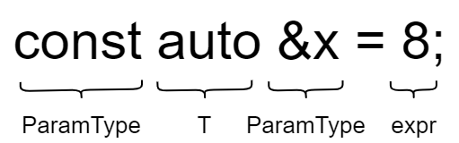

# 模板 & 泛型编程

## *模板的定义*

泛型编程 Generic Programming：编写与类型无关的通用代码，是代码复用的一种手段

模板是泛型编程的基础，模板是一种静态的多态，因为它在编译的时候就确定了

###  模版要定义在头文件里

当编译器遇到一个模版定义时，它不会生成代码，**只有当实例化模版的时候编译器才会生成代码**。这种特性会影响到如何组织代码以及错误何时才会被检测到

若在本模块中找不到函数和变量的地址（即定义），那么会在链接阶段去总符号表里找，所以函数和变量只要在头文件中有一个声明就可以，定义可以放到某个模块的c文件中。但是类和模版不同，它们是在编译阶段实例化数据的“蓝图”，每一个用到它们的文件都必须知道它们的具体定义，而不仅仅是声明。所以**完整的类和模版必须要定义在头文件中**

涉及到模版的报错往往非常复杂，非常难以debug。这也是使用模版的一个缺点

**模板不能进行分离编译**，否则会因为两次编译导致链接错误，因此要统一放在头文件里，但在同一个文件里可以分离编译

### 控制实例化 -- 外部模板

前面说过只有当实例化模版的时候编译器才会生成代码，若不同的编译单元使用了同一份实例化模板的时候，那么在各自的编译单元都会生成对应的模板，这会导致严重的代码膨胀

和避免全局变量重定义一样，我们可以使用外部模板 extern template 来控制实例化，从而减少代码膨胀。外部模板的形式如下

```c++
extern template class Foo; // 实例化声明
template class Foo {} // 实例化定义
```

外部模板意味着指示编译器在之后的链接过程中去其他编译单元中找到，也就是整体程序共享了一个实例化模板。因此要**确保至少有一个实例化定义，而且extern声明必须出现在任何使用此实例化模板的代码之前**

### 模板的优缺点

* 优点
  * 模板复用了代码，节省资源，更快的迭代开发，STL库的诞生很大程度上得益于此
  * 增强了代码的灵活性
* 缺点
  * 模板只是将重复的代码交给编译器实现，因此模板也会导致代码膨胀问题，从而导致编译时间变长
  * 出现模板编译错误时，错误信息非常凌乱，不易定位错误

## *函数模板*

### 模板参数

函数模板 function template 代表了一个函数家族，该函数模板与类型无关，在使用时被参数化，根据实参类型产生函数的特定类型版本

```c++
// 模板参数定义了模板类型，类似函数参数，但函数参数定义了参数对象
// typename后面类型名字T是随便取的，一般是大写字母或者单词首字母大写 T、Ty、K、V，代表了一个模拟类型/虚拟类型
template<typename T> void Swap(T& left, T& right) {
    T temp = left;
    left = right;
    right = temp;
}
// swap在std中有模板定义了
```

模板定义以关键字template开始，后跟一个模板参数列表 template parameter list，这是一个以逗号分隔的一个或多个模板参数 template parameter 的列表。模板定义中，模板参数列表不能为空

模板参数有两种

* 模板类型参数 type parameter

* 非类型模板参数 nontype parameter：非类型模板参数表示一个值而非一个类型，通过一个特定的类型名而非关键字class或typename来指定它

  ```c++
  template<class T, size_t N = 10> class array {
  public:
  private:
      T _a[N];
  };
  ```

  * 非类型模板参数只能用于整形、指针或引用，浮点数、类对象以及字符串是不允许作为非类型模板参数的
  * 非类型的模板参数必须在编译期就能确认结果

函数模板可以声明为inline或constexpr的，说明符放在模板参数列表之后，返回类型之前

```c++
template<typename T> inline T min(const T&, const T&);
```

### 函数模板的实例化

**函数模板实例化的原理：模板实参推断 template argument deduction 和函数模板实例化 instantiation**

函数模板是一个设计图，他本来并不是真正用来执行任务的函数，每次调用相关函数编译器都要根据函数模板进行一次类型推演产生相关函数

* 隐式实例化 implicit instantiation：让编译器根据实参**自动推演**模板参数的实际类型。模板中不会进行隐式类型转换，编译器不知道该转成哪一个会报错，需要用户自已进行强制类型转换
* 显式实例化 explicit instantiation：在函数名后的 `<>` 中由用户指定模板参数的实际类型
  * 参数需要强转时可以使用

      ```cpp
      // Add(1.1, 2) // 报错
      Add((int)1.1, 2); // 用户强转输入
      Add<int>(1.1, 2); // 模板的显式实例化
      ```

  * 需要指定返回类型时一定要显式实例化

    ```cpp
    // 已经定义了一个A类
    template<class T> T* Func(int n) {
        T* a = new T[n];
        return a;
    }
    // 不能自动推演返回类型T
    Func<A>(10); // 显式实例化
    ```

## *类模板*

### 模板定义

```cpp
// template<typename T>
// 上下两种类模板都可以
template<class T> class Foo {
    Foo();
    // 在类模板内可以简化模板类名的使用
    Foo& some_function() {}
private:
    T* _a;
};
// 同一个头文件的类模板外定义
template<typename T> inline Foo() {}
```

* 类模板实例化的方法和函数模版实例化时候的自动推演不同，**类模板必须要显式实例化**，也就是说需要显式给出 `<>` 里面的类型，这些类型被称为显式模版实参 explicit template argument 列表，它们会被绑定到模版参数
* 类模板名字不是真正的类，实例化的结果 `Stack<int>` 才是真正的类，若不显式实例化，编译器无法判断
* **在头文件中的类模板之外定义成员函数的时候必须要把关键字template及其后的类模板参数列表带上**
* 在类模板内可以简化模板类名的使用，此时不需要写参数列表；在类模板外的类函数内也可以

默认情况下，类模板的成员函数只有当程序要用到它的时候才会实例化 

### 类模板的static成员

类模板同样可以声明static成员，但是使用类模板的static成员和在普通类中使用static成员有一些区别

```c++
template<typename T> class Foo {
public:
    static std::size_t count() { return ctr; }
private:
    static std::size_t ctr;
}
```

类模板的每个实例都有一个独有的static对象

### typename的特殊使用

查看 *EffectiveCpp.md* 的条款42

### 成员模板

成员模板 member template 是普通类或类模板中的模板函数，**成员模板不能是虚函数**

当在类模板外定义类模板的成员模板时要依次给出类模板参数列表和函数模板参数列表

```c++
template<typename T>
template<typename It>
Blob<T>::Blob<It b, It e>
    :data_(std::make_shared<std::vector<T>>(n, e)) {}
```

## *友元与模板*

## *模版参数*

### 模板的作用域

**非依赖名字 non-dependent name** 和**依赖名字 dependent name** 是模板编程中的两个重要概念。其中，非依赖名字是指不依赖于模板参数的名字，例如全局变量、函数名、类型名等，而依赖名字则是指依赖于模板参数的名字，例如模板参数名、模板内部定义的类型名等

在C++模板的实例化过程中，编译器需要在模板定义时和模板实例化时分别对非依赖名字和依赖名字进行名称查找

* 对于非依赖名字，**编译器必须在模板定义时就确定其含义**，因此这些名字必须是**可见**的
* 对于依赖名字，编译器只有在**模板实例化**时才能确定其含义，因此这些名字可以在模板定义时不可见，但必须在模板实例化时可见

声明的**可见性 Visibility**指的是在哪些作用域内可以访问该声明。一般来说，声明在其所在的作用域内是可见的，即在该作用域内可以使用该声明。若声明是在一个内层作用域中，而其外层作用域中已经存在同名的声明，那么该内层作用域中的声明会隐藏外层作用域中的同名声明，此时外层作用域中的声明不可见

```cpp
template <typename T>
void foo(T x) {
    int y = 10;  // 可见的非依赖名字
    x += y;     // 可见的依赖名字
    // ...
}

int main() {
    int x = 5;
    foo(x);
    return 0;
}
```

在这个例子中，`foo`是一个函数模板，接受一个类型为`T`的参数`x`。在`foo`函数模板内部，我们定义了一个整数变量`y`，它是一个可见的非依赖名字。同时，`x`是一个依赖名字，它依赖于模板参数`T`。在`main`函数中，我们定义了一个整数变量`x`，然后调用了`foo`函数模板，将变量`x`作为参数传递进去

```cpp
template <typename T>
void foo(T x) {
    bar(x);  // 不可见的非依赖函数名
}

int main() {
    int x = 5;
    foo(x);
    void bar(int);  // 定义了一个非依赖函数bar，但在foo模板定义时不可见
    return 0;
}
```

在这个例子中，`foo`是一个函数模板，接受一个类型为`T`的参数`x`。在`foo`函数模板内部，我们尝试调用一个名为`bar`的非依赖函数。然而，在`main`函数中定义的`bar`函数虽然与`foo`调用的`bar`同名，但是在`foo`模板定义时并不可见。这样的情况下，在编译时编译器无法找到可用的`bar`函数定义，导致编译错误

### 默认模板实参

C++11标准以前只允许为类模板提供默认模板实参 default template argument，而C++11标准允许为类和函数都提供默认实参。比如说下面这个例子中 compare有一个默认模板实参 `less<T>` 和一个默认函数实参 `F()`

```c++
template<typename T, typename F = less<T>>
int compare (const T &v1, const T &v2，F f = F()) {
    if (f(v1, v2)) return -1;
    if (f(v2, v1)) return 1;
    return 0;
}
```

当使用一个类模板的时候，模板名之后的尖括号是必须要带上的，尖括号指出类必须从一个模板实例化而来。即使是一个类模板为其所有模板参数都提供了默认实参的时候，也要带上尖括号，这说明我们希望用那些默认实参来实例化一个类模板

```c++
template<class T = int> class Numbers { // T默认为int
public:
	Numbers(T v= 0) : val_(v) {}
private:
	T val_;
};
Numbers<long double> lots_of_precision;
Numbers<> average _precision; //空<>表示我们希望使用默认类型
```

## *模板特化*

模板的特化 Specialization -- **针对某些类型进行特殊化处理**

### 函数模板特化

```cpp
// 函数模板
template<typename T> bool Greater(T left, T right) {
    return left > right;
}
// 若输入的参数是指针，就不会进行实例化，而是直接进入下面的特化
template<> bool Greater<Date*>(Date* left, Date* right) {
    return *left > *right;
}
```

* 必须要现有一个基础的函数模板
* 关键字 `template` 后面接一对空的尖括号 `<>`
* 函数名后跟一对 `<>`，尖括号中指定需要特化的类型
* 必须要使用模板参数关键字 `typename` 或 `class`，这两者在定义模板是等价的，不能将 `class` 换成 `struct`

### 类模板特化

* 正常模板

    ```cpp
    template<class T1, class T2>
    class Data{};
    ```

* 全特化 full specialization：将模板参数列表中所有的参数都确定化

    ```cpp
    template<>
    class Data<int, char>{};
    ```

* 偏特化 partial specialization，它有下面两种形式
  * 部分特化：将模板参数类表中的一部分参数特化

    ```cpp
    template<class T1>
    class Data<T1, int>{};
    
    //调用
    Data(int, int); // 此时会进入特化，因为第二个参数类型匹配
    ```

  * 参数更进一步的限制

    ```cpp
    template<class T1, class T2>
    class Data<T1*, T2*>{};
    
    template<class T1&, class T2&>
    class Data<T1&, T2&>{};
    ```

## *模板参数的匹配原则*

* 一个非模板函数可以和一个同名的函数模板同时存在，而且该函数模板还可以被实例化为这个非模板函数
* 匹配的非模板参数函数/类 > 最匹配、最特化 > 一般模板产生实例

### 例题

* 下列的模板声明中，其中几个是正确的

    ```cpp
    1)template // 错误
    2)template<T1,T2> // 错误，缺少模板参数关键字 typename或class
    3)template<class T1,T2> // 错误，缺少模板参数关键字 typename或class
    4)template<class T1,class T2> // 正确
    5)template<typename T1,T2> // 错误，缺少模板参数关键字 typename或class
    6)template<typename T1,typename T2> // 正确
    7)template<class T1,typename T2> // 正确
    8)<typename T1,class T2> // 错误，没有template关键字
    9)template<typeaname T1, typename T2, size_t N> // 正确
    10)template<typeaname T, size_t N=100, class _A=alloc<T>> // 正确
    11)template<size_t N> // 正确
    ```

* 以下程序的输出结果为

    ```cpp
    template<typename Type>
    Type Max(const Type &a, const Type &b) {
        cout<<"This is Max<Type>"<<endl;
        return a > b ? a : b;
    }
    template<>
    int Max<int>(const int &a, const int &b) {
        cout<<"This is Max<int>"<<endl;
        return a > b ? a : b;
    }
    template<>
    char Max<char>(const char &a, const char &b) {
        cout<<"This is Max<char>"<<endl;
        return a > b ? a : b;
    }
    int Max(const int &a, const int &b) {
        cout<<"This is Max"<<endl;
        return a > b ? a : b;
    }
    int main() {
        Max(10,20); // "This is Max" // 可以直接匹配非模板参数，虽然形参是引用和权限缩小，但非模板参数仍然是最匹配的
        Max(12.34,23.45); // "This is Max<Type>" // 没有匹配的特化模板或显式实例化的实例，因此要调用模板
        Max('A','B'); // "This is Max<char>" // 已经给出了特化模板，直接匹配
        Max<int>(20,30); // "This is Max<int>" 直接进行了显式实例化，但因为给出了int条件下的特化，所以使用特化模板
        return 0;
    }
    ```
    
* 以下程序运行结果为

    ```cpp
    template<class T1, class T2>
    class Data {
    public: 
        Data() { cout << "Data<T1, T2>" << endl; }
    private:
        T1 _d1;
        T2 _d2;
    };
    template <class T1>
    class Data<T1, int> {
    public:
        Data() { cout << "Data<T1, int>" << endl; }
    private:
        T1 _d1;
        int _d2;
    };
    template <typename T1, typename T2>
    class Data <T1*,T2*> {
    public:
        Data() { cout << "Data<T1*, T2*>" << endl; }
    private:
        T1 _d1;
        T2 _d2;
    };
    template <typename T1, typename T2>
    class Data <T1&, T2&> {
    public:
        Data(const T1& d1, const T2& d2)
        : _d1(d1)
        , _d2(d2)
        {cout << "Data<T1&, T2&>" << endl;}
    private:
        const T1 & _d1;
        const T2 & _d2;
    };
    int main() {
        Data<double, int> d1; // "Data<T1, int>" 第二个参数int已经最匹配了 class Data<T1, int>
        Data<int, double> d2; // "Data<T1, T2>" 没有最匹配的特化模板，需要进行模板实例化
        Data<int*, int*> d3; // "Data<T1*, T2*>"
        Data<int&, int&> d4(1, 2); // "Data<T1&, T2&>"
        return 0;
    }
    ```

## *可变参数模板*

### 声明 & 实例化

可变参数在C语言中就有了，比如printf的参数就是一个可变参数，底层是用 `va_list` 来接收的，具体可以看 *C.md* - 数组和指针 - 可变参数列表

**C++11把可变参数扩展到了模板中**。一个可变参数模板 variadic template 就是一个接受可变数目参数的模板函数或模板类。可变数目的参数被称为参数包 parameter packet，用 `...` 来表示，一般命名为Args。存在两种参数包

* 模板参数包 template parameter packet：表示零个或多个模板参数以固定形式 `typename... Args` 或 `class... Args` 来表示
* 函数参数包 function parameter packet：表示零个或多个函数参数，以固定形式 `Args...` 表示

```c++
template<typename T, typename... Args> void foo(const T &t, const Args&... rest);
// 可变参数模版 + 万能引用 -> 自动推导，这种形式的函数在模版编程中大量被使用
template<typename... Args> void foo2(Args&&... args); 
```

可以使用 `sizeof...` 操作符来获取包中的元素

```cpp
template<typename T, typename... Args> 
void foo(const T &t, const Args&... rest);
	cout << sizeof...(args) << endl;
	////不能这么用
	//for (int i = 0; i < sizeof...(args); i++) {
	//	cout << args[i] << " ";
	//}
	//cout << endl;
}
```

编译器从函数的实参推断模板参数类型。对于一个可变参数模板，编译器还会推断包中参数的数目

```c++
int i= 0: double d =3.14; string s = "how now brown cow"; 
£oo(i, s, 42, d); // 包中有三个参数
foo(s, 42, "hi"); // 包中有两个参数 
foo(d, s); // 包中有一个参数
foo ("hi"); // 空包
// 相当于编译器为foo实例化出了四个版本
void foo (const int &, const string&, const int &, const double&); 
void foo (const stringa, const int&, const char 13]&); 
void foo (const double&, const string&); 
void foo (const char [31&);
```

### 递归函数方式展开参数包

函数参数包可以以递归调用的方式来展开。参数包里没有参数的时候就不能递归调用原函数了，要定义一个非可变参数的函数重载，类似于递归的base condition。非可变参数版本的声明必须在作用域中，否则会导致可变参数版本会无限递归

对于最后一次调用，非可变参数模板比可变参数模板更特例化，因此编译器会选择非可变参数的版本

```cpp
// 非可变参数版本
void ShowList() {
	cout << endl;
}
// Args... args 代表N个参数包（N >= 0）
template<class T, class ...Args>
void ShowList(const T& val, Args... args) {
	cout << "ShowList(val：" << sizeof...(args) << " -- 参数包：";
	cout << val << "）" << endl;
	ShowList(args...);
}
```

### 逗号表达式展开参数包

### 包扩展

### 转发参数包

可以组合使用可变参数模板与 `std::forward` 来编写函数，以实现保留实参性质不变地传递给其他函数

# 类型推导

本章来自 *Effective Modern C++*

## *条款1：理解模板类型推导*

```c++
template<typename T> void f(ParamType param); // 函数模板
f(expr); // 函数调用
```

ParamType = 饰词 + T，饰词有 cosnt、volatile、`&`、`&&`、`*` 等

模板类型T的推导是实际传入的expr和预设的ParamType的类型的不同形式的排列组合的共同作用

### ParamType既非指针也非引用

此时就是**按值传递**，也就是说无论传入的是什么，param都会是它的一个副本。所以下面的性质是很好理解的，反正函数模板内部得到的都是一个实参拷贝，是不会拷贝它的性质的（原理就是所处区域不一样，一个栈区的拷贝常量区里的内存，不会拷贝它常量区的性质），所以对它做什么都不会影响原来的值

1. **忽略expr的引用性 reference-ness、顶层常量性 top-level constness、volatile性**。注意一个点：右值引用得到的仍然是一个左值引用，所以当expr是一个右值引用时候的，它等同于一个左值引用，所以引用性同样会被忽略
2. 将expr剩余的类别与ParamType的类别再进行匹配，缺啥补啥

```c++
template<typename T> void f(T param)
int x = 27;
const int cx = x;
const int& rx = x;

f(x);   // x被推导为 int
f(cx);  // cx被推导为 int
f(rx);  // rx被推导为 int
```

### ParamType是指针或左值/右值引用，但不是万能引用

1. **忽略expr的引用性**，expr的底层常量性和顶层常量性都会被保留下来（回忆：只有当执行对象拷贝的时候才能忽略expr的顶层常量性，这里不是对象拷贝了）
2. 将expr剩余的类别与ParamType的类别再进行匹配

```c++
template<typename T> void f(const T& param)
int x = 27;
const int cx = x;
const int& rx = x;

f(x);   // x被推导为 const int&
f(cx);  // cx被推导为 const int&
f(rx);  // rx被推导为 const int&，rx本身的引用性被忽略
```

### ParamType是万能引用 `T&&`

在模板推导时 `T&&` 是一个万能引用。注意：只有纯净的 `T&&` 是万能引用，`const T&&` 是一个右值引用

* 若传入的expr是个左值，则T和ParamType都会被推导为左值引用。**这是在模板类型推导中，T被推导为引用类别的唯一场景**。这种情况被称为引用折叠 reference collapse，相当于 `int & + int && -> int &`，相当于三个引用折叠成了一个引用
* 若传入的expr是个右值，运用ParamType是非万能引用的指针或引用时的规则

```c++
template<typename T> void f(T&& param)
int x = 27;
const int cx = x;
const int& rx = x;

f(x);   // 左值x被推导为 int&，引用折叠
f(cx);  // 左值cx被推导为 const int&，引用折叠
f(rx);  // 左值rx被推导为 const int&，引用折叠
f(20);  // 右值，被推导为 int&&
```

### 数组和函数指针实参的退化问题

在上面三种情况中，当传入的模板参数T是数组和函数的时候，要考虑其退化情况。注意：如果用了调用符 `()` 就是调用了，此时返回类型适用上面的规则

退化其实在C语言的函数及传参部分就早已经有过了，其实就是数组/函数名等价于首元素指针。它仍然对模板的类型推导有着重要作用，因此这里再提一下

**在一些语境下，数组和函数会退化成指向其首元素的指针**

* 初始化的情况。注意：对数组名或函数名取地址的指针类型 $\neq$ 名字退化成的指针类型

  ```c++
  int array[5] = { 0, 1, 2, 3, 4 }; // array的数据类型是int[5]
  int *ptr = &array;                // 数组名退化为指向其首元素的指针
  int (*ptr2)[5] = &array;          // 数组名取地址的类型为int数值指针，不等于数组名的类型，即int指针
  int (&ptr)[5] = array;            // 数组引用
  ```

* 数组名作为参数传递时会发生退化，下面三种传递方法是完全等价的

  ```c++
  void foo(int a[100]);
  void foo(int a[5]);
  void foo(int *a);
  ```

  传递数组指针就不等价了

  ```c++
  void fun(int (*a)[5]);
  void fun(int (*a)[100 ]);
  ```

特别注意下面几种情况

* 数组名退化成指针的同时顶层const也退化为底层const

  ```c++
  const char str[] = "hello world";
  f("hello world") // const char str*
  ```

* 函数指针没有底层const，底层const意味着可以修改函数内部的内容了，所以当有底层const的函数指针时，编译器会报错。而函数引用的底层const则会直接被编译器忽略

## *条款2：理解auto类型推导*

### auto类型推导 = 模板类型推导

auto类型推导和模板类型推导的规则基本上完全一致，它们之间可以建立起一一映射的关系，它们之间也确实存在双向的算法变换

```c++
template<typename T> void f(ParamType param);
auto T = expr;
```



采用auto进行变量声明时，**auto 的型别饰词取代了ParamType，即auto是要推导的对象**，所以此时也是根据 auto 的型别饰词分成三种类型来讨论。并且同样的，数组和函数的退化情况也同样适用于auto

```c++
auto x = 28;           // auto的饰词既非指针也非引用，x绑定的类型为 int
const auto cx = x;     // auto的饰词既非指针也非引用，cx绑定的类型为 const int
const auto& rx = x;    // auto的饰词是个左值引用，但不是万能引用，rx绑定的类型为 const int&
auto&& uref1 = x;      // auto的饰词是万能引用，左值，uref1绑定的类型为 int&
auto&& uref2 = cx;     // auto的饰词是万能引用，左值，uref2绑定的类型为 const int&
auto&& uref3 = rx;     // auto的饰词是万能引用，发生引用折叠，uref3绑定的类型为 const int&
```

### auto推导初始化列表

auto类型推导和模板类型推导的唯一区别在于，**当用于auto声明变量的初始化表达式是使用大括号括起时，推导所得的型别就属于 `std::initializer_list`，而模板类型推导则不支持**

```c++
template<typename T> void f(ParamType param);
f({1, 2, 3}); // 错误，无法推导 T 的类别
auto x = {1, 2, 3}; // x 被推导为 initializer_list<int>
```

在这种情况下，若 `{}` 内的类型推导失败（最常见的原因可能是因为元素的数据类型不一致），那么也会导致auto的类型推导失败

```c++
auto x = {1, 2, 3.0}; // 错误，不知道该用哪个initializer_list
```

注意⚠️：下面两种写法auto本来都会推导出 `initializer_list`，但是在C++17推出后，`auto x3{20}` 的auto推导类型不再是 `initializer_list`

```c++
auto x3{20}; // x3 被推断为 int
auto x4 = {27}; // x4 被推断为 initializer_list<int>
```

此外，C++14中又引入了一种auto可以用作模板类型推导的方式，需要配合decltype一块使用，具体见下一条条款

auto 会把 `{}` 推导为 `initializer_list` 是一个C++11程序中的经典错误，因为很多时候程序员的本意都并非如此，正因为如此，**很多程序员都只有在必要的时候才采用 `{}` 初始化**。至于什么是必要的时候，可以看 *面向对象.md* - 列表初始化部分

### 使用auto的注意事项

* 当用一个auto关键字声明多个变量的时候，编译器遵从由左往右的推导规则，以**最左边**的表达式推断auto的具体类型

  ```c++
  int n = 1;
  auto *pn = &n, m = 10;
  auto *pn = &n, m = 10.0; // 编译失败，声明类型不统一
  ```

  因为 &n 的类型是 `int *`，所以pn类型被推导为 `int *`，auto被推为int

* 当使用条件表达式初始化auto声明的变量时，编译器总是使用表达能力更强的类型

  ```c++
  auto i = true ? 5 : 8.0; // i 的数据类型为 double
  ```

* 虽然C++11标准支持在声明时初始化（当然本质上是给初始化列表用的），但是auto依旧无法在这种情况下声明非静态成员变量。静态成员可以在声明处给值，但是必须是const staic

  ```c++
  class MyClass {
  private:
      auto x_ = 1; // 错误，无法通过编译
      static const auto y_ = 2; // 允许
  }
  ```

* C++20之前无法在函数形参中使用auto声明形参

  ```c++
  void foo(auto param) {} // C++20
  ```

* 从C++14开始，auto可以为lambda表达式声明形参。这部分可以看 *STL.md* - lambda 的使用部分

## *条款3：理解decltype*

[【C++深陷】之“decltype”-CSDN博客](https://blog.csdn.net/u014609638/article/details/106987131)

模版类型推断有时候会把 const、volatile、引用 等性质忽略掉，如果是想要获取相符的类型，可以用 decltype (declared type) 关键字来获取名字或表达式的实际类别

### 推导规则

重温一下概念：表达式 expression 是由操作数 operands 和运算符 operators 组成的组合，用来执行特定的计算操作并生成一个结果。表达式可以包括各种数据类型的变量、常量、运算符以及函数调用等。表达式的结果不是左值就是右值。比如说取地址和取引用都是表达式，他们返回左值

推导规则可以分为两大类

* decltype + 变量：所有信息都会被保留，数组与函数名也不会退化
* decltyp + 表达式：表达式返回的不是左值就是右值
  * 左值得到左值引用 `T&`
  * 右值得到该类型 T
  * 将亡值得到 `T&&`
* decltype + 函数/仿函数调用：返回返回值的类型。其实这条就是上面 decltype + 表达式的规则，因为函数调用就是表达式，但是有点容易混淆，所以单独列出来说一下

```c++
int a = 10;
int *aptr = &a;
decltype(*aptr) b1; // *a 表达式返回的是左值引用，结果为int &
decltype(&a) b2; // &a 表达式返回的是地址的右值引用， 结果为int
decltype(std::move(a)) b3; // 将亡值，结果为int &&
```

注意：`int a` 是一个变量，`decltype(a)` 得到的类型是int。若想要用它的表达式属性，可以用 `()` 括起来，`decltype((a))` 返回的是 `int &`

decltype 并不会真的取计算表达式的值，编译器只是会分析表达式并得到类型

```c++
decltype(foo_func(param)) my_var; // foo_func 并没有被执行
```

### 使用场景

C++11中decltype的主要用途大概就是用来声明那些返回值型别依赖于形参类型的函数模板

考虑写一个返回容器 `[]` 调用的函数模板，虽然大部分容易都会返回 `T&`，但是若保存的数据类型是bool就不行了，比如 `std::vector<bool>` 返回的是`std::vector<bool>::reference` 类型（至于为什么这么处理在条款6中有说明）。因此我们要对其进行delctype推导

* C++11的写法： trailing return，此时auto是一个返回值的置位符

  ```c++
  template <typename Container, typename Index> 
  auto testFun(Container &c, Index i) -> decltype(c[i]) {
      // ... do something
      return c[i]
  }
  ```

* C++14的写法，因为 C++14 将自动推导返回值推广到了包含多语句的一切 lambda 表达式和函数式，所以此时可以把尾置返回去掉了

  * 错误的写法：可以直接写auto，但是此时要注意auto走的是模板推导，此时其饰词既不是引用，也不是指针，所以当接受的 expr 是引用的时候，输入的引用性会被忽略，所以auto得到的不是一个引用，而是一个值拷贝。因此如果就无法实现通过引用来修改的功能

    ```c++
    // 返回的是T，而不是T&
    template <typename Container, typename Index> 
    auto testFun_error(Container &c, Index i) {
        // ... do something
        return c[i]
    }
    
    testFun_error(c, 2) = 5; // 无法修改
    
    auto x = c[i] // 等价于推导 x，c[i] 是一个引用
    ```
  
  * 正确的写法：使用 `decltype(auto)`，它的作用简单来说就是告诉编译器用 decltype 的推导表达式规则来推导 auto，而不是走 auto 的模版推导。此时等价于C++11的auto占位符写法，意思是保存引用性质，否则引用性会被模板脱掉
  
    ```c++
    template <typename Container, typename Index> 
    delctype(auto) testFun_right(Container &c, Index i) {
        // ... do something
        return c[i]
    }
    ```
  
  * 也可以采用转发的方式来保留引用性质
  
    ```c++
    template <typename Container, typename Index> 
    delctype(auto) testFun_right(Container &&c, Index i) {
        // ... do something
        return std::forward<Container>(c)[i];
    }
    ```

### `decltype(auto)`

注意：在使用 `decltype(auto)` 的时候，它必须单独声明，不能结合指针、引用以及cv饰词

```C++
int i;
int&& f();                       // 函数声明
auto xla = i;                    // xla 推导类型为 int
decltype(auto) x1d = i;          // xld 推导类型为 int
auto x2a = (i);                  // x2a 推导类型为 int
decltype(auto) x2d = (i);        // x2d 推导类型为 int&
auto x3a = f();                  // x3a 推导类型为 int，函数调用，PramType是值拷贝，所以忽略其引用性
decltype(auto) x3d = f();        // x3d 推导类型为 int&&，decltype完整返回返回数据类型
auto x4a = { 1, 2 };             // x4a 推导类型为 std::initializer_list<int>
decltype(auto) x4d = { 1, 2 };   // 编译失败，{1，2}不是表达式
auto *x5a = &i;                  // x5a推导类型为 int*
decltype(auto) *x5d = &1;        // 编泽失败，decltype(auto)必须单独声明
```

C ++17中和auto一样，`decltype(auto)` 也能作为非类型模板形参的占位符，其推导规则和上面介绍的保持一致

```c++
template<decltype(auto) N> void f() { std::cout << N << std::endl; }
```

## *条款4：掌握查看类型推导结果的方法*

这一条款主要说了一下用IDE、编译器和typeid 运行时输出来查看类型的方法

核心是typeid和type_info，这部分在 *面向对象.md* - 多态 - RTTI 中有比较详细的笔记了

# auto

本章来自 *Effective Modern C++*

## *条款5：优先使用auto，而非显式类型声明*

auto除了避免程序员书写那些过于冗长的类型之外，还能阻止那些因为手动指定类型带来的潜在错误和性能影响


C++14之后lambda形参也可以使用auto了，这直接就变成了一个模板

lambda表达式的返回值一定要用auto

### 类型的跨平台性

当使用 `std::vector<int> v` 的方法 `v.size()` 的时候，它的返回值是 `std::vector<int>::size_type`，这个类型在不同系统上的大小是不同的，如果我们一直用 size_t 来接受的话可能会造成移植问题，所以用auto来自动推导比较好

### 避免因为类型写错而导致的无用的拷贝

```c++
int a = 10;
//float &b = a; // 编译器报错
const float &b = a;
```

C++中有一个上面这种很怪异的现象，引用的时候一定要类型匹配，否则编译器会报错。但是如果是用const引用就可以了。Primer中给出的解释是创建了临时变量然后隐式转换了

现在考虑下面这个场景，我们想要遍历 `std::unordered_map<std::string, int> m` 这个map，通过编译器我们发现auto的实际推导类型为 `std::pair<const std::string, int>`，这和我们显式给出的 `std::pair<const std::string, int>` 并不相符。根据上面的例子，我们可以认为中间必然是会有拷贝和隐式转换的消耗

```c++
std::unordered_map<std::string, int> m{{"hello", 10}，{"world"，5}, { "heihei", 20}};
for (const std::pair<std::string, int> &p : m) { /*遍历*/ }
for (const auto &p : m){ /*遍历*/ }
```

为了避免这种潜在的因为类型错误而导致的性能开销，应该优先使用auto


## *条款6：auto推导若非己愿，使用显示类型初始化惯用法*

### CRTP

[【编程技术】C++ CRTP & Expression Templates_crtp与expression templates-CSDN博客](https://blog.csdn.net/HaoBBNuanMM/article/details/109740504)

奇异递归模板模式(Curiously Recurring Template Pattern) - 吉良吉影的文章 - 知乎 https://zhuanlan.zhihu.com/p/54945314

奇异递归模板模式 Curiously Recurring Template Pattern CRTP 是C++模板编程时的一种惯用法 idiom，它把派生类作为基类的模板参数。更一般地被称作 F-bound polymorphism。1980年代作为F-bound polymorphism被提出。Jim Coplien于1995年称之为CRTP

编译期多态

```c++
template <typename Derived>
struct Base {
	void name() { (static_cast<Derived *>(this)) ->impl(); };
};
struct D1 : public Base<D1> {
	void impl() { std::cout << "D1: :impl" << std::endl; }
};
struct D2 : public Base<D2> {
	void impl() { std::cout << "D2: :impl" << std::endl; }
};
template <typename Derived>
void func(Base<Derived> derived) {
    derived.name();
}
```

### 表达式模板

表达式模板是CRTP的一种应用

延迟计算表达式，从而可以将表达式传递给函数参数，而不是只能传计算结果

节省表达式中间结果的临时存储空间，减少计算的循环次数

### 代理类

代理类 proxy class 是指以模仿和增强一些类型的行为为目的而存在的类

```c++
class MyArray {
public:
    class MyArraySize {
    public:
        MyArraySize(int size) : theSize(size) {}
        int size() const { return theSize; }
        operator int() const { return theSize; }
    private:
        int theSize;
    };

    MyArray(MyArraySize size) : size_(size), data_(new int[size.size()]) {}
    int operator[](int index) {
        return data_[index];
    }
    ~MyArray { delete int[size.size()]; }
    bool operator==(const MyArray &temp) {
        return data_ == temp.data_;
    }
    MyArraySize size() { return size_; }
private:
    int *data_;
    MyArraySize size_;
};
```

上面的内部类MyArraySize就是一个代理类，它是在模仿int

```c++
class MyArray_ {
public:
    MyArray_(int size) : size_(size), data_(new int[size]) {}
    ~MyArray_() { delete int[size_]; }
private:
    int *data_;
    int size_;
};

void func1(MyArray_ arr) {/**/}
```

如果直接用int会怎么样？上面的MyArray_就是直接用了int。一个很明显的问题就是因为它只吃了一个单参数构造，所以当调用 `func1(10)` 的时候发生参数的隐式转换了

为了禁止隐式转换，这时候要把 `MyArray_` 设置为 explicit 来禁止隐式转换，调用的时候 `func1(MyArray_(10))` 这样就可以了

# 右值引用的底层原理

本章来自 *Effective Modern C++*

## *条款23：理解 `std::move` & `std::forward`*

### 类型转换模板（萃取器）

标准库的类型转换 type transformation 模板定义在头文件 `<type_traits>` 中，类型转换也是一种萃取器


我们来看其中一个模板 `remove_reference` 是如何实现的，这个模板的作用就是**脱去引用类型，得到非引用部分的类型**。它是通过多次模板特化得到的

```c++
// 最通用版本
template<class T> struct remove_reference {
    typedef T type;
}
// 部分的特例化模板
template<class T> struct remove_reference<T&> { // 脱去左值引用
    typedef T type;
}
template<class T> struct remove_reference<T&&> { // 脱去右值引用
    typedef T type;
}
```

C++11和C++14使用的方式不太一样，C++14引入了 `std::remove_remove_reference_t`，它不需要 typename 和 `::type` 就能使用

```c++
template<class T> Foo {
	using remove_refrence_t1 = typename std::remove_reference<T>::type; // C+=11
    using remove_refrence_t2 = std::remove_remove_reference_t<T>; // C++14
}
```

### `std::move`

我们首先来看一种错误的实现

```c++
template<typename T>
T &&myMove(T &&param) {
    return static_cast<T &&>(param);
}

int mmm = 10;
int &&nnn1 = mymove(10); // 通过编译
int &&nnn2 = mymove(mm); // 编译报错
```

* `mymove(10)`：万能引用接收右值输入，万能引用再接收输出，得到一个 `int &&myMove<int>(int &&param)` 的模板
* `mymove(mm)`：万能引用接收左值输入，会发生三次引用折叠，即输入一次，`static_cast` 一次，最后输出再一次，所以实际得到的是一个 `int &myMove<int &>(int &param)`，这不符合右值输出所以报错了

标准库中则大概是下面这么实现的，使用了萃取器 `remove_reference`

```c++
// C++11
template<typename T>
typename remove_reference<T>::type&& move(T &&param) {
    using ReturnType = typename std::remove_reference<T>::type &&; // 类型萃取
    return static_cast<ReturnType>(param);
}
// C++14
template<typename T>
decltype(auto) move2(T &&param) {
    using ReturnType = std::remove_reference_t<T> &&;
    return static_cast<ReturnType>(param);
}
```

右值绑定到右值引用上的效果和左值绑定到左值引用上的效果是一摸一样的，并不会发生什么突然的析构

### `std::move` 只是在声明资源适合移动

```c++
int a = 3;
int &&b = std::move(a);
a++; // 未定义行为，仅为了实验说明，工程中不要这么做！
cout << a << endl; // 4
b++;
cout << b << endl; // 5
```

上面的实验并不会报错，a在被move了之后还可以被访问，就说明此时a的资源都还在。注意：上面的实验中访问move了之后的资源是一种未定义行为，因为此时我们是无法确定资源是否还在的（当然在上面这种很简单的情况下我们知道资源暂时还没有被移动），所以在工程中不能写出这样的代码

根据move的定义，我们可以看到move的作用并不是用了之后马上就把资源转移给右值引用，然后直接把资源回收销毁了。资源的回收销毁仍然是由析构以及OS完成的。move的作用仅仅是将类型强转为 `&&`，因此有些人提议说move应该被叫做rvalue_cast

总结来说，move的作用是强转为 `&&`，而强转为 `&&` 的作用则是告诉编译器：**该对象适合被移动，然后编译器会在条件满足的情况下移动它的资源**。比方说 `std::move(const std::string str);` 实际上执行的仍然是复制。我们得到的教训是如果要对某个对象执行移动操作时，则不要将其声明为常量。因为**针对常量对象执行移动操作将变成复制操作**。移动构造只能接受非常量的右值作为参数

### `std::forward`

在类型推断那一章中我们看到，当万能引用接收参数时，传入左值就一定是一个左值引用，但传入右值也一定会产生左值引用。所以万能引用接收参数实际上丢失了参数到底是左值还是右值的原信息

但有些时候我们是需要这种信息的，因为我们可能会需要根据是左值还是右值来做自适应操作。这时候我们就需要用`std::forward<T>` 来保留其引用性质

比方说下面这种情况，不论传入的是左值还是右值，若用的是 `process(param)` 都只会调用左值版本；若用的是 `process(std::move(param))`，则都只会调用右值版本

```c++
void process(const A &lvalArg) { // 左值版本
    std::cout << "deal 1valArg" << std::endl;
}
void process(A &&rva1Arg) { // 右值版本
	std::cout << "deal rvalArg" << std::endl;
}
template<typename T> void logAndProcess(T &&param) {
	// process(param); // 一定调用左值版本
	// process(std::move(param)); // 一定调用右值版本 
	process(std::forward<T>(param)); // 实参用右值初始化时，转换为一个右值
}
```

**`std::forward<T>` 的本质是有条件的move，只有当模板参数T用右值初始化时才转换为右值**，而 `std::move` 的本质就是无论左值还是右值统统转为右值

引用折叠是forward能实现的关键，引用折叠会在类别推导中（模版、auto）的形参、类型强制转换和返回值处发挥作用

它的参考实现如下。`std::forward<T>` 是借助模版中保留的引用信息对两种引用进行了两次重载

```c++
// C++11
// 左值，函数体内第一次引用折叠得到T&，返回值处第二次引用折叠得到T&
template <class T>
T&& forward(typename remove_reference<T>::type& param) noexcept {
    return static_cast<T&&>(param);
}
// 右值，右值引用时忽略expr的引用性，得到T，函数体内强转为T&&，返回值除同理得到T&&
template <class T>
T&& forward(typename remove_reference<T>::type&& param) noexcept {
    return static_cast<T&&>(param);
}

// C++14
template <class T>
T&& forward(remove_reference_t<T>& param) noexcept {
    return static_cast<T&&>(param);
}
template <class T>
T&& forward(remove_reference_t<T>&& param) noexcept {
    return static_cast<T&&>(param);
}
```

## *条款24：区分右值引用 & 万能引用*

`T&&` 有两层含义，第一种就是普通的右值引用，它的目标是识别出可移动对象，然后绑定到右值上

第二种含义是万能引用 universal reference（也称为通用引用和转发引用 forwarding references），出现在模板和auto这两种类型推导的场景中

```c++
template<typename T> void f(T&& param); // T是个万能引用
auto&& var2 = var; // var2是个万能引用
```

### 模板的万能引用

要求是 `T&&` + 类型推导

```c++
template <typename T> void func(T &&param) { /**/ }
int a = 10;
func(a); // 推导为 int&
func(10); // T推导为int，总体推导为int&&
```

判断是否是万能引用很简单，那就是**看模板类型到底是不是自动推导出来的**，不能人为的给他帮助。下面的三种情况都不是万能引用

* 显式给出T

  ```c++
  func<int>(10); // T显式设置为int，总体为int&&
  func<int>(a); // 报错，T显式设置为int，所以总体只能是int&&，但是这里正常推导应该为int&
  ```

* 之前有提到过万能引用**只能是单独给出的**，不能有任何cv饰词，模板的万能引用同理，比如下面的

  ```c++
  template <typename T> void func(std::vector<T> &&param); // 不是万能引用！
  template <typename T> void func(const T &&param); // 同理，不是万能引用！
  ```

* 下面push_back中的也不是万能引用，因为T的类型是和vector的数据类型强绑定的

  ```c++
  template < class T, class Alloc = allocator<T> > class vector {
  public:
      push_back(T &&x);
  };
  ```

### 可变参数模板的万能引用

要求是 `Args&&...` + 类型推导

和push_back不同，下面emplace_back的参数包 `Args&&...` 和vector的T没关系

```c++
template < class T, class Alloc = allocator<T> > class vector {
public:
    void push_back (const T& val); // 并不是类型推导，T 在 vector 定义的时候就已经定下来了
    void push_back (T&& val);
    template <typename... Args> void emplace_back(Args&&... args);
};
```

### auto的万能引用

要求是 `auto&&/auto&&...` + 类型推导

auto万能引用在C++14中大量出现，因为C++14支持lambda可以声明 `auto&&` 形参

```c++
// C++14s
auto timeFuncInvocation = [](auto &&func, auto&&... params) {
    std::forward<decltype(func)>(func)(
    	std::forward<decltype(params)>(params...)
    )
}
```

## *条款25：对右值引用用 `std::move`，对万能引用用 `std::forward`*

### move & forward的正确用法

* 右值就说明了绑定的对象很适合移动

  ```c++
  class Widget {
  public:
      // rhs 这个函数参数是个右值引用，但进入函数内部后仍然是一个左值，所以要move它的成员
  	Widget(widget&& rhs) 
  		: name(std::move(rhs.name)) 
          , p(std::move(rhs.p))
      {}
  private:
  	std::string name;
  	std::shared ptr<SomeDataStructure> p;
  };
  ```

* 而万能引用则是要有选择性的转发，它只是有可能会绑定到右值。由于万能引用几乎总是要用到转发，因此万能引用也被称为转发引用 forwarding references

  ```c++
  class Widget {
  public:
  	template<typename T>
  	void setName(T&& newName) { // newName是个万能引用
  		name = std::forward<T>(newName);
      }
  private:
  	std::string name;
  	std::shared ptr<SomeDataStructure> p;
  };
  ```

不要对右值用forward，虽然这在语法和功能上不会造成错误，因为左值引用传给引用

也不要对万能引用用move，不过这次并不只是会造成代码冗余了，而是会实打实地产生功能上的错误。本来一个想要保留左值引用的变量直接被move转移走了

### 问题

虽然传进来的时候是右值引用，但右值引用也是一种左值，所以在函数体内若不用move，那么就全部都是拷贝

若有n个参数，那么就需要有 $2^n$ 个重载函数

多个参数

```c++
template <class T, class... Args>
shared_ptr<T> make_shared(Args&&... args);
```

### 返回值

返回右值引用要用 `std::move`，返回万能引用要用 `std::forward`

```c++
Widget func(Widget &&w) { return std::move(w); }

template <typename T> 
```

## *条款26：避免在万能引用上重载*

### 万能引用普通函数的重载

### 万能引用构造函数的重载

## *条款27：熟悉万能引用重载的替代方法*

### 权衡

## *条款28：理解引用折叠*

引用折叠是专用于类型推导的概念，会出现在模版类型推导、auto类型推导、typedef 或using别名声明以及decltype中

如果是形参不匹配，比如左值赋给右值，只是会报类型不匹配的编译错误而已，因为此时根本就不是万能引用！

## *条款29：*

## *条款30：熟悉完美转发的失败情形*

# constexpr

## *条款15：情况允许的话尽量使用constexpr*

### 动态类型 & 静态类型 / 运行时 & 编译时

静态类型：编译时的类型，运行前就确定了，是变量声明时的类型或表达式生成的类型

动态类型：运行时才确定的类型，是变量或表达式表示的内存中的对象的类型

什么是运行时？

* **多态性**：在面向对象编程中，多态性是一种重要的概念，它允许你使用基类的指针或引用来操作派生类的对象。在运行时，程序可能会面对不同的派生类对象，需要能够识别并调用正确的方法。这就是虚函数和动态类型检查的作用。通过虚函数表和RTTI，程序能够在运行时根据对象的实际类型调用适当的方法
* **运行时数据结构**：有些数据结构在编译时无法确定其元素的确切类型，例如，通用容器类（例如`std::vector`或`std::list`）可以容纳各种类型的对象。在这种情况下，动态类型检查允许你在运行时访问和操作这些对象，因为它们的类型可能在运行时才能确定
* **用户输入和外部数据**：当程序需要处理来自用户输入或外部数据源的数据时，它通常不知道数据的确切类型。动态类型检查使程序能够适应不同的数据类型并采取相应的措施，而不会在编译时强制限制
* 函数调用在大部分情况下都是运行期的
  * 通常会传递参数给函数。这些参数的值通常在运行时根据程序的状态和输入数据确定。例如，您可以在运行时传递不同的参数值给函数，这将影响函数的行为和结果
  * 有些函数执行复杂的计算，这些计算需要在运行时根据程序的状态和输入来进行。这些计算的结果只有在运行时才能得到，因此函数的调用也是在运行时确定的

### 常量表达式

常量表达式 constant expressions 是在编译时可以计算出结果的表达式，它的值在编译时就已经确定，值会被固定到生成的目标文件中，因此在运行时是不会改变的。常量表达式可以用于各种上下文，如数组大小、枚举值、模板参数等。C++11引入了更广泛的常量表达式支持，C++14、C++17和后续版本进一步扩展了常量表达式的功能

常量表达式必须满足以下要求：

* 表达式中只能包含编译时已知的值，包括字面值、常量、枚举常量等
* 表达式必须是在编译时可计算的，不能依赖于运行时输入
* 表达式不能包含非常量的函数调用（即在编译时无法确定结果的函数）

### 变量 & 常量

```c++
int a = 1; // 运行时变量
const int b = 2; // 运行时常量 -> 一般会被编译期优化为编译期常量
constexpr int c = 3; // 编译期常量
```

`int a = 10;` 中的 `a` 变量在编译时分配了存储空间，但这并不是它是一个运行时值的原因。它是一个运行时值的原因在于变量 `a` 的值是在程序运行时确定的，而不是在编译就能确定下来的

通俗的讲就是a的值可以在当程序运行时被随时改变，`int a = 10;` 中的 `10` 被分配给变量 `a`。如果改变代码中的值，例如 `int a = 20;`，那么 `a` 的值会在运行时改变。这种在程序执行过程中动态确定变量值的性质使 `a` 成为一个运行时值

在编译时，编译器分配了存储空间来容纳变量 `a`，但它并不知道变量的具体值，直到程序运行时才会确定。编译器只负责生成程序代码以便在运行时分配存储空间和设置初始值。因此，`a` 是一个在运行时确定其值的变量

如上面的例子所示，const是一个运行时常量，因为它的初始化可能是由一个函数完成的，比如下面

```c++
int get_index0() { return 0; }
const int index0 = get_index0();
```

但是编译器会尽可能将它优化成constexpr，即编译时常量

### 编译期确定的场景

编译期确定的一般有case 语句、数组长度、枚举成员的值以及非类型的模板参数

编译期确定的共同特性就是这些值要作为“模板使用”。比如case语句，条件要在编译时知道，编译期才能为此生成机器代码。非动态数组长度则告诉了编译器要开空间的大小，从而设置相关偏移量

若该数组在函数中，数组内存就会被预留在该函数的栈帧中；若这个数组是类的一个成员，那么编译器要确定数组的大小以确定这个类成员的大小。无论是哪种情况，编译器都要知道这个数组具体的size

**C++语言的高效性可以通过尽量提高编译期的比例来获得**，大量的工作在编译期完成了，运行时所需要做的工作也就相应变少了

### C++11的限制

C++11对constexpr的使用给出了6个限制，导致它的使用非常不灵活

对于普通变量而言，constexpr只是一个加强版的const，但constexpr修饰函数时，情况则会变得极为复杂

* 修饰普通函数

  * 规则a：函数的返回值类型不能是void

    ```c++
    // C++11
    constexpr void Foo() {/**/} // 返回值为void报错
    ```

  * 规则b：函数体只能是一条 `return expr`，expr还必须是一个常量表达式（若函数有形参，则将形参替换到expr中后，expr必须仍然是一个常量表达式）

    ```c++
    // C++11
    constexpr int abs_(int x) { // 多条语句报错
        if (x > 0) return x;
        else return -x; 
    }
    ```

  * 规则c：若传给constexpr函数运行时的值，那么cocnstptr函数会退化为普通函数

    ```c++
    // C++11
    int a = 1;
    const int b = 2;
    constexpr int res_error = abs_(a); // 编译器报错，传入运行时变量，constexpr函数要退化为普通函数
    int res_correct = abs_(a);
    int res = abs_(b); // 这样也会退化！
    ```

    如果没有退化机制的话就应该需要通过重载函数来适应，即下面这么写。当然函数列表出现constexpr肯定是错的，因为没有常量是一定要赋初值的

    ```c++
    constexpr int abs_(constexpr int x) { return x > 0 ? x : -x; }
    int abs_(int x) { return x > 0 ? x : -x; }
    ```

    退化机制非常友好，它意味着我们不用为了同时满足编译期和运行期计算而定义两个相似的函数

* 修饰构造函数

  * 规则d：构造函数初始化列表中必须是常量表达式
  * 规则e：构造函数的函数体必须为空
  * 规则f：所有和这个类相关的成员，析构函数都必须是默认的

* 规则g：修饰类成员函数：constexpr声明的成员函数具有const属性，所以此时参数列表后的const饰词就不需要了

### C++14

C++14改善了constexpr函数的用法，打破了规则a、b、e、g，并且添加了一条规则：constexpr函数可以修改生命周期和常量表达式相同（即局部变量）的对象

```c++
// C++14
constexpr void Foo() {
    int a = 10;
    a = 20;
}
```

### C++17

C++17引入了 `if constexpr` 的用法，此时可以让分支判断发生在编译期

```c++
void check () {
    if constexpr(sizeof(int) > sizeof(double)) { /**/ }
    else { /**/ } // 若上面的条件错误，else这部分甚至都不会被编译
}
```

# 模版元编程

模板元编程 Template Metaprogramming, TMP 是一种在编译时计算的技术，它可以用来生成更高效的代码


[奇异递归模板模式(Curiously Recurring Template Pattern) - 知乎 (zhihu.com)](https://zhuanlan.zhihu.com/p/54945314)

[【编程技术】C++ CRTP & Expression Templates_crtp与expression templates-CSDN博客](https://blog.csdn.net/HaoBBNuanMM/article/details/109740504)


# Header-only lib

> Header Only Library把一个库的内容完全写在头文件中,不带任何cpp文件. 这是一个巧合,决不是C++的原始设计.
>
> 第一次这么做估计是STL.在80年代末C++编译器还不支持模块分离(现在也不支持,以后估计也不会支持了), STL的作者不得不把模板的实现写在头文件中, 使得一个STL库的实现绝大部分都展示给了使用者.
>
> 第一次广泛被接受估计还是在Boost库,它不只提出使用hpp做为Header Only Library的文件后缀(因为这些头文件再也不能用于C语言了),还把一些原本不是Header Only的库变成了Header Only. https://www.cnblogs.com/beimingke/p/7118817.html

如上所述，Header-only 实际上是违反了 C/C++ 的设计原则的，是一种技术上的妥协。不过它一个很大的优点就是便利了 CMake 等构建工具的使用

## *创建 Header-only库*

https://v1otusc.github.io/2021/05/28/C++-inline-hpp/

## *Header-only 的问题*
