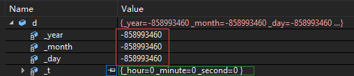
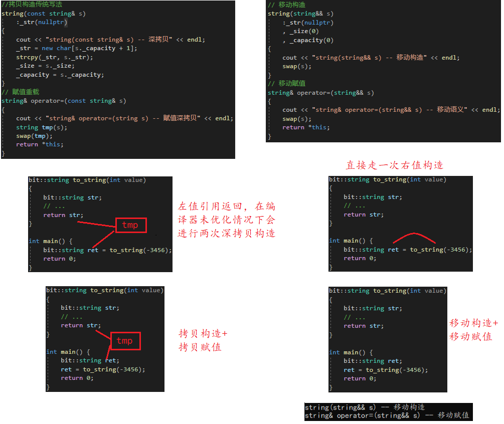

# 编程范式

编程范式 Programming Paradigm 是一种基于某些原则的编程风格和思想方法，它提供了构建结构和元素的程序设计、编写、测试和维护的方式。不同的编程范式提供不同的视角来描述数据和系统中操作的组合

和编程语言本身一样，每种范式都有其适合的业务长i纪念馆，有特定的概念和构造体用来帮助能以一种直观的方式解决问题，所以并没有一种所谓最好或者通用的编程范式来解决所有的场景

常见的编程范式有如下几种

* 命令式编程 Imperative Programming
  - 基于明确告诉计算机做什么的指令序列来编程
  - 包含子范式如过程式编程 Procedural Programming，其中程序被分解为可重用的过程或函数
* 声明式编程 Declarative Programming
  - 关注做什么 What 而非如何做 How，强调所期望的结果而非步骤
  - 包括以下子范式：
    - 函数式编程 Functional Programming：使用纯函数和不可变性，比如说Lisp、MapReduce和Haskell等
    - 逻辑编程 Logic Programming：使用逻辑规则来表达计算，例如 Prolog
    - 数据库查询语言：比如SQL，它声明式地描述数据检索的要求
* 面向对象编程 Object-Oriented Programming, OOP
  - 程序被看作由对象组成的集合，对象包含数据和操作这些数据的方法
  - 强调封装、继承和多态性
* 事件驱动编程 Event-driven Programming
  - 主要关注事件的产生、控制和响应
  - 通常与图形用户界面（GUIs）和异步处理任务相关
* 并发编程 Concurrent Programming：用于构建可以同时执行多个部分的程序，通常在多核或分布式系统中使用
* 泛型编程 Generic Programming：通过将算法从具体的数据类型中抽象出来，创建可以应用于广泛数据类型的代码
* 元编程 Metaprogramming：指那些程序可以读取、生成、分析或转换其他程序，甚至在运行时修改自身的技术
* 响应式编程 Reactive Programming：关注数据流和对其变化的响应，是处理异步数据流的一种声明式编程范式

编程范型和编程语言之间的关系可能十分复杂，由于一个编程语言可以支持多种范式。例如，C++ 设计时，支持过程式编程、面向对象编程以及泛型编程。然而，设计师和程序员们要考虑如何使用这些范型元素来构建一个程序

过程式编程（C）和OOP（C++、Java）是大部分程序员最早解除的两种编程范式，这篇笔记主要介绍了C++ OOP的内容

# 类成员

## *类的定义*

### 类方法的分离式编译

```cpp
// .h 文件中的声明
class className {// 类名
    // class默认成员访问权限为private
    int attribute = 1; // 类属性和方法用 "." 操作符调用，即 className.attribute
    void Method_declaration(); // 定义为类的一部分的函数称为成员函数 member fucntion 或 类方法 method
}
// .cpp 文件中的类方法定义
void className::Method_definition() {/*...*/}
```

* 类函数的声明必须要在类内部，而类函数的声明则既可以在类内部也可以在类外部
* 小函数若想成为inline，直接在类里面定义即可。但具体是否会作为inline处理取决于编译器。即定义在类内部的方法是隐式的inline函数
* 若是大函数，应该声明和定义分离。一般情况下都使用这种定义方式。之所以要将大的类方法的声明和定义分离编译的原因在于
  * 编译时间：将大的方法定义在头文件中会导致每次包含该头文件的源文件都要重新编译整个方法，这会增加编译时间。如果方法定义在.cc文件中，只有在.cc文件被修改时才需要重新编译，其他包含该头文件的源文件不会受到影响，提高了编译效率
  * 头文件膨胀：将大型方法定义在头文件中可能会导致头文件变得非常庞大。这会增加编译器的负担，降低编译性能，并且会导致每个包含该头文件的源文件都包含了相同的庞大代码，增加了可执行文件的大小。这对于大型项目来说是不可取的
  * 依赖关系：将大的方法定义在头文件中可能导致头文件之间产生不必要的依赖关系。如果一个头文件中包含了大量其他头文件，并且这些头文件又包含了其他头文件，可能会形成复杂的依赖链，使得代码难以维护和理解
  * 潜在错误：将大的方法定义在头文件中可能会导致重复定义的问题，因为多个源文件包含了相同的方法定义。这会导致链接错误，因为编译器无法确定应该使用哪个定义

* [类方法在类外定义时需要遵守类的作用域的规定](#类方法的定义方式)

### 访问限定符 Access Modifier

```cpp
class A {
public:
    void PrintA()
        cout << _a << endl;
private:
    char _a;
};
```

* 分类
  * public 公有：可以被任意实体访问
  * protected 保护：只允许派生类及本类的成员函数访问
  * private 私有：只允许本类的成员函数访问
* 访问限定符的说明
  * 访问权限作用域从该访问限定符出现的未知开始直到下一个访问限定符出现时为止
  * 若后面没有访问限定符，作用域就到 `}` 为止
  * 三者都是只对类作用域外有效，即类内无论是什么限定符都可以互相取
  * struct定义的类默认访问权限是public，而class定义的类默认访问权限则是private

### C++中struct和class的区别

C++需要兼容C语言，所以C++中struct可以当成结构体使用，更进一步C++中将struct升级成了class，C++中 struct 和 class 的区别是 **struct 定义的类默认访问权限是 public，而 class 定义的类默认访问权限则是 private**

另外同样是 struct，C和C++的区别是

* C++中的struct是抽象数据类型 Abstract Data Type, ADT，即既可以定义变量，也可以定义函数；而C中的struct是用户自定义数据类型 User Defined Type, UDT，只能定义变量，不可以定义函数
* C中struct是没有权限的设置的，且struct中只能是一些变量的集合体，可以封装数据却不可以隐藏数据
* C中的struct在定义变量的时候必须要带上struct才是完整的数据类型，如果要省略必须要 typedef；C++中的struct在定义变量时可以直接使用类型名，不需要加上 struct

### 封装 Encapsulation

隐藏对象的属性和实现细节，即隐藏成员变量。仅对外公开接口来和对象进行交互（即开放成员函数接口）

```cpp
cout << st.a[st.top] << endl; // 这样调栈顶数据是错误的，因为类属性受保护。
// 而且很有可能出错，因为使用者并不知道底层的实现，top到底指向哪一个数据？
cout << st.Top() << endl;  // 这样是正确的，要使用给的函数接口
```

C语言没办法封装，可以规范的使用函数访问数据，也可以不规范的直接访问数据；C++使用封装，必须规范使用函数访问数据，不能直接访问数据

注意下面一个例子，在类内声明，在类外定义也是可以无视限定符的

```cpp
class A {
public:
    void Print(); //类成员声明
private:
    int _a;
};

void A::Print() { 
    cout << _a << endl; 
} //类成员定义
```

## *类的作用域*

每个类都有自己的作用域。在类的作用域外，访问普通的数据和函数成员时只能对对象、引用或者指针使用成员访问运算符 `.` 和 `->`；而访问类的静态成员、全局变量、静态函数等具有类的全局作用域的标识符需要用域运算符 `::` 访问

### 类中符号的特殊编译过程 -- 两阶段处理

**类的定义分为两步处理**

1. 编译成员的声明
2. 知道类全部可见后才会编译函数体

总结来说：**编译器处理完类中的全部声明之后才会处理成员函数的定义**。这种两阶段的处理可以简化类代码的组织方式，因为类方法定义要直到整个类可见之后才会被处理，所以它能使用类中声明的任何符号。如果不这么处理的话，类方法就只能使用那些它可见的函数成员了

下面的例子中：在Account类中声明 `Money balance();` 方法的时候会去上层找 Money 的声明；而因为 balance 方法体是在类成员的所有声明被编译之后才去处理的，因此它返回的bal是类中的成员属性 `Money bal` 而不是之前定义的 `string bal`

```c++
typedef double Money;
string bal;
class Account {
public:
	Money balance() { return bal; }
private:
	Money bal;
// ...
};
```

### <span id="类方法的定义方式">类方法的定义方式</span>

变量搜索遵循局部优先，因此在C++文件中定义类函数时要用 `::` 指定类的作用域

比如下面这个例子中定义了一个 `Window_mgr` 的类，其中声明了一个 `addScreen` 的方法。在类外定义该方法的时候同时提供了类名和函数名，`Window_mgr::addScreen` 说明了是定义在 `Window_mgr` 类域中的方法 `addScreen`

注意：一旦函数名指定了在类域中之后，定义的剩余部分，即参数列表和函数体中要用到的类数据等都不需要再额外通过域访问符 `::` 再一次说明了。例外的是返回类型是出现在函数名之前的，所以返回类型若是类相关的，则仍然需要指定

```c++
class Window_mgr {
public:
    // add a Screen to the window and returns its index
    ScreenIndex addScreen(const Screen&);
    // other members as before
};

// return type is seen before we're in the scope of Window_mgr
Window_mgr::ScreenIndex Window_mgr::addScreen(const Screen &s) {
    screens.push_back(s);
    return screens.size() - 1;
}
```

### 类中的名字查找

之前的两阶段编译过程方便了类方法的定义，但对于**一般的类成员的声明仍然需要遵循一般声明顺序的限制**，即当前声明需要用到的其他东西都必须在此之前可见，若在当前作用域中找不到，就需要到上层的作用域中找。即一般的名字查找过程

**名字查找 name lookup 指的是寻找与所用名字最匹配的声明的过程**。回顾一下一般的名字查找过程

1. 在名字所在的块作用域中寻找其声明语句，只考虑在名字的使用之前出现的声明
2. 若没有找到，则继续到外层的作用域查找
3. 若最终没有找到匹配的声明，则程序报错

下面这个例子展示了一个类中名字查找的过程，一共给出了三种 `dummy_fcn`，分别是在类内的隐式inline定义和在类外的两种定义。注意：**不建议使用其他成员的名字作为某个成员函数的参数**，下面的例子只是为了更好的展示跟理解

```c++
// note: this code is for illustration purposes only and reflects bad practice
// it is generally a bad idea to use the same name for a parameter and a member
int height; // defines a name subsequently used inside Screen
class Screen {
public:
    typedef std::string::size_type pos;
    // which height? the parameter
    void dummy_fcn(pos height) {
    	cursor = width * height; 
    }
private:
    pos cursor = 0;
    pos height = 0, width = 0;
};

void Screen::dummy_fcn(pos height) {
    cursor = width * this->height; // member height
    // alternative way to indicate the member
    cursor = width * Screen::height; // member height
}

// bad practice: don't hide names that are needed from surrounding scopes
void Screen::dummy_fcn(pos height) {
    cursor = width * ::height;// which height? the global one
}
```

### 类型名的特殊处理

笔者首先做了一个小实验来证明一般的块作用域是可以重复 `typedef` 覆盖的，下面的代码可以通过编译

```c++
int main() {
  typedef int word;
  for (int i = 0; i < 10; i++) {
    typedef int word2;
    word2 x = 2;
    cout << typeid(x).name() << endl;
  }
  return 0;
}
```

类里面同样用 `typedef` 或者 `using` 给类型起别名，但和一般的块作用域不同的是在类中不允许重复 `typedef` 覆盖。比如下面的代码是错的

```c++
typedef double Money;
class Account {
public:
	Money balance() { return bal; } // uses Money from the outer scope
private:
	typedef double Money; // error: cannot redefine Money
	Money bal;
	// ...
};
```

但是要注意的是，尽管在类中重新起类型别名是一种错误的行为，但编译器并不对此负责，有些编译器是可以顺利编译这样的代码的

## <span id="类对象模型">*类对象模型*</span>

### 类对象的可能存储方式

* [ ] 对象中包含类的各个成员：问题是每个对象中成员变量都需要调用同一份函数，导致大量的冗余代码
* [ ] 实例化的每个对象成员变量都是独立空间，是不同变量。但是每个对象调用的成员函数都是同一个。没有被采用，在虚表和多态部分采用
* [x] 公共代码区
  * 只保存**非静态的成员变量**，成员函数存放在公共的代码段
  * 编译链接时就根据函数名去公共代码区找到函数的地址，然后call函数地址

### 公共代码区内存模型

```c++
class Foo {
public:
    void test();
private:
    int a_;
    double b_
    static int c_;
}
```

每个Foo的实例拥有各自的非static属性，共享方法和static属性


我们可以验证一下，下面代码可以顺利运行，说明没有对空指针解引用，所以实际使用的是公共代码区

```cpp
class A {
public:
    void func() {
        cout << "void A::func()" << endl; 
    }
};

int main() {
    A* ptr = nullptr;
    ptr->func();
    return 0;
}
```

### 类的内存对齐规则

影响C++对象大小的3个因素：非静态数据成员、[虚函数](#虚表)和字节对齐

* 属性和C语言中自定义类型的对齐规则一样。下面是几个要特别注意的点
  * 类中变量占有n个字节，那么这个变量应放在n的整数倍的位置上
  * long数据类型在Win64上占有4字节，在Linux64上占8字节
  * class最后会向内部最大对象补齐

* 方法属于公共区代码，所以不计入类的大小。但是即使属性和方法都为空，也就是说是一个空类，也会为其分配1字节占位。不存储实际数据，标识对象存在
* 因为内存对齐的存在，类内属性的声明顺序就要注意

注意一下继承的时候的内存对齐情况。比如说下面B的大小应该为12字节，因为继承的A部分要首先内部对齐，然后B的部分再对齐。而不是A和B的成员直接排列起来，这样的话就应该是4+2+2=8字节了。只有A的内部先对齐了才能满足之后的切片

```c++
struct A {
    int a;      // 4
    short b;    // 2 -> 4
};
struct B : public A {
    short c;    // 2 -> 4
}
```

### 不同类的内存空间分布

https://blog.csdn.net/Darlingqiang/article/details/114065349

* 空类：上面说过即使属性和方法都为空，也就是说是一个空类，也会为其分配1字节占位作为标记

  ```c++
  class A {}; // sizeof(A): 1
  ```

* 验证方法不占据类对象的内存空间

  ```c++
  class B {
      void test() {}
  }; // sizeof(B): 1
  ```

* 验证静态成员不占据类对象的内存空间

  ```c++
  class C {
      static int a;
  }; // sizeof(C): 1
  ```

* 一般成员对象，类中有了内容之后，原来占位的那个1就没有了

  ```c++
  class D {
      int a = 1;
  }; // sizeof(D): 4
  ```

* 内存对齐

  ```c++
  class E {
      int a = 1;
      char b = 'a';
  }; // sizeof(E): 8
  ```

* 继承：基类的非静态成员放在上面

  ```c++
  class F : public D {
      int b = 2;
  }; // sizeof(F): 8
  ```

* 虚继承：头上存放了一个 vbptr 虚基表指针来保存到相同继承变量的偏移值，所以会多出来4个字节

  ```c++
  class G : virtual public D {
      int c = 3;
  }; // sizeof(G): 8
  ```

* 多态：头上存放了一个 vptr 虚表指针，所以会多出来4个字节

  ```c++
  class H {
      virtual void test() {}
  };
  
  class I : public H {
      int d = 4;
  }; // sizeof(H): 8
  ```

## *this指针*

### this指针的引出

```cpp
class Date {
public:
    void Init(int year, int month, int day) {
        _year = year;
        _month = month;
        _day = day;
    }
    void Print() {
        cout <<_year<< "-" <<_month << "-"<< _day <<endl;
    }
private:
    int _year;
    int _month;
    int _day;
    int a;
}
```

```cpp
Date d1;
d1.Init(2022, 7, 17);
Date d2;
d2.Init(2022, 7, 18);
d1.Print();
d2.Print();
```

产生两个对象d1和d2，但是方法中并没有区分作用的对象是哪一个，函数是怎么知道该设置哪一个对象呢？

类中的方法会在第一个形参处放置一个额外的隐式this指针用来访问调用它的那个对象，当然下图中右边的类方法是不对的，因为不允许显式地给出this指针，这里只是为了说明用

编译器负责把调用者的地址传给this


### this指针的特性

* this指针是所有**非静态**成员函数的第一个隐形形参
* this指针是一指针常量：语法规定不能修改this指针（`T* const this`），因为this指针是被const保护的只读，但可以修改this指针指向的内容
* 也不能在实参和形参位置显式地传递this指针。但可以在类函数的内部使用（不使用也会自动加）
* this指针本质上是成员函数的形参，当对象调用该成员函数时，将对象地址作为实参传递给this形参，所以对象中不存储this指针。VS下将this指针优化到了寄存器中，因为在频繁使用时可以提高效率
* 问题：this指针可以为空吗？可以！参考下面两段对比代码

    ```cpp
    class A {
    public:
        void Print()
            cout << "Print()" << endl;
    private:
            int _a;
    };
    
    int main {
        A* p = nullptr;
        p->Print();
        return 0;
    }
    ```
    
    不会崩溃，虽然p是空指针，但并没对它解引用，因此程序正常运行

    ```cpp
    class B {
    public:
        void Print()
            // 相当于是 cout << this->_b << endl;
            cout << _b << endl;
    private:
            int _b;
    };
    
    int main {
        B* p = nullptr;
        p->Print();
        return 0;
    }
    ```
    
    程序会崩溃，因为对空指针解引用了！

## <span id="const成员函数">*const成员函数*</span>

### 介绍

this指针是一个 `T* const this` 的指针常量，我们不能修改this指针本身，也就说不能莫名其妙把调用者改成其他人。但是仍然可以通过this指针来修改调用者的属性，比如通过 `this->_year` 就可以获取 `_year` 属性了

虽然this指针是一个指针常量，但它仍然可以修改指向地址的内容，因此const对象是不能赋给this指针，也就不能调用相关的方法（权限放大），需要另外设计一套const方法

如果我们想保持类属性不变怎么办呢，一个方法当然是可以直接把类属性设置为const，但是这样任何其他的方法也就不能修改属性了，不够灵活。可以通过将某个特定方法设置为const，即const成员函数 const member function 来达成，此时的this指针就相当于变成了 `const T* const this` 

C++中类的const成员函数声明和定义的时候要加上const

```c++
class MyClass {
public:
    int getValue() const; // 声明常量成员函数
};
int MyClass::getValue() const {
    return someValue;
}
```

### 权限放大问题

```cpp
class Date {
Public:
    // ...
    void Date::Print() {
        cout << _year << "/" << _month << "/" << _day << endl;
    }
    bool Date::operator<(const Date& d) {
        return !(*this >= d);
    }
}
int main() {
    Date d1(2022, 7, 25);
    const Date d2(2022, 7, 26);

    d1.Print();
    //  d2.Print(); // 编译报错，权限放大
    d1 < d2;
    //  d2 < d1; // 编译报错，权限放大
}
```

* `Date* const this` this指针是一个指针常量，指针本身不能被修改，但可以修改指针指向的内容。当将一个不可修改的const Date d2 常变量传给一个常量指针 `Date* const this` 时，权限就被放大了

* `d2 < d1`，因为 `<` 运算符重载时，第一个参数是this指针常量，和上面的错误是一样的，都是权限放大

* 若要支持以上的调用，我们必须将this指针设置为常量指针。`void Date::Print() const` 修饰的this指向的内容，也就是保证了成员函数内部不会修改成员变量const对象和非const对象都可以调用这个成员函数（权限平移）

  ```cpp
  void Date::Print() const {
      cout << _year << "/" << _month << "/" << _day << endl;
  }
  bool Date::operator<(const Date& d) const {
      return !(*this >= d);
  }
  ```

## *static成员*

### 概念

**有些时候类需要它的一些成员与类本身直接相关，而不是与类的各个对象保持关联**。比方说银行账户类会规定基准利率，这个基准利率是对每个账户对象一致成立的，所以它属于这个类的共性，因此没有必要让每个类对象都存储它。当修改它的时候应该要对所有的类对象都成立

静态成员就是专门给这个类访问，**静态成员变量一定要在类外进行初始化**，注意在类外定义的时候必须要用 `::` 指定类域，否则编译器找不到

```cpp
class A {
public:
    A() { ++_scount; }
    A(const A& t) { ++_scount; }
    ~A() { --_scount; }
    static int GetACount() { return _scount; } // 静态成员函数，没有this指针，不能访问非静态成员
private:
    static int _scount; // 静态成员变量声明
};

// 在类外面定义初始化静态成员变量
int A::_scount = 0;

int main() {
    A a1;
    A a2;
    cout << a1.GetACount() << endl; // 用静态成员函数来取
}
```

### 静态成员定义的特殊性

静态成员的声明、定义和使用的方式都非常奇特，下面是它的特性

* 静态成员为所有类对象所共享，属于整个类，**也属于这个类的所有对象，并不单独属于某个具体的对象，这点在 `std::shared_ptr` 的设计中是一个坑**，存放在静态区

* 和友元一样，静态成员变量**必须在类外定义和初始化**（但是静态成员函数可以在类内定义），定义时不添加static，类中只是声明，如 `int A::scount = 0;`，若是模板的话要把模板也给带上。初始化列表不能用来初始化静态成员

* 静态成员变量也受访问限定符的限制

* 当static是公有的时候，类静态成员可用 `类名::静态成员` 或者 `对象.静态成员` 来访问。但是若私有，则只能通过 `类名::静态成员` 访问或静态成员函数来获取，这是因为类静态成员不属于某个类对象，而是存放于静态区中，属于类域

* **静态成员函数没有隐藏的this指针，不能访问任何非静态成员**，也不能声明const成员函数，因为const的对象是this指针，同样也不能在static函数体内使用this指针

* **这条性质非常特殊，需要强行记下来**

  一般的静态变量不能给缺省值，只能在类外面给初始值

  但是有例外：`const static int`、`const static char`、`const static bool` 类型的静态变量可以给缺省值，比如哈希桶中的素数size扩容就用到了这个特性

  或者更准确地可以理解为，**上面三种类型的静态常量的初始值如果在类内声明时指定的，那么在类外定义时反而不允许赋初始值**；反过来如果在类外定义指定了初值，那么类内声明就不可以给出

  非常匪夷所思，明明是类内声明却可以给出初始值，但就是这么规定的

  甚至只要不获取它们的地址，那么甚至可以在不提供类外定义的情况下只声明并使用它们

  ```c++
  class GamePlayer {
  public:
      int get_numturns() { return num_turns; }
  private:
      const static int num_turns = 5; // const static 类型的声明，在这里初始化了！
      int scores_[num_turns];
  }
  const int GamePlyaers::num_turns; // const static 类型的定义，只要不获取它们的地址，可以不给出
  ```

### 一个应用：设计一个只能在栈上定义对象的类

若把构造函数定义为public，那么类对象可以定义在任何地方。但若把构造函数定义为private，然后给一个静态函数，里面定义类后返回

静态成员函数没有this指针，不需要访问对象来调用。若不用static，就会产生调用成员函数需要现创建对象的矛盾，因为调用成员函数需要this指针指向对象

```cpp
class StackOnly {
public:
    static StackOnly CreateObj() {
        StackOnly so;
        return so;
    }
private:
    StackOnly(int x = 0, int y = 0)
        :_x(x)
        , _y(0)
    {}
    int _x = 0;
    int _y = 0;
};
```

### 调用问题

* 静态成员函数可以调用非静态成员函数吗？不能，因为静态成员函数没有this指针
* 非静态函数可以调用类的静态成员函数吗？可以，因为静态成员属于整个类和类的所有对象

## *友元 Friend*

https://blog.csdn.net/weixin_46098577/article/details/116596183

有一些函数虽然不属于类，但类也要用到他们并且允许他们访问类的非公有成员从而实现某些功能。友元提供了一种突破封装的方式，在一些使用场景下提供了便利。但是友元会增加耦合度，破坏封装，所以要尽可能少地使用友元

### 全局函数做友元

友元函数可以直接访问类的私有成员，它是**定义在类外部的普通函数**，不属于任何类，但**友元的声明只能够在类的内部**，声明时需要加 `friend` 关键字

注意：友元在类内部的声明不是通常意义上的声明，相当于仅仅是指定了访问的权限，还需要在头文件的**类外部再次声明**然后在c文件中定义

* 运用场景
  * 重载运算符：`operator<<` 、`operator>>` 当定义为类成员函数时，cout的输出流对象在和隐含的this指针抢占第一个参数的位置。为了保证第一个形参为cout，需要将改运算符重载定义为全局函数，但此时又会导致它是类外成员而无法取得类属性成员，因此要借助友元函数帮助
  * 多个类之间共享数据，如有一个函数 `void func(const A& a, const B& b, const C& c)`，设置func同时成为A、B、C类的友元函数以获取多个类之中的数据
* 说明
  * 友元函数可以访问类的所有成员，包括私有保护成员，但不是类的成员函数，所有它没有this指针
  * 友元函数不能用 `const` 修饰，因为在类中 `const` 修饰的是this指针
  * 友元函数可以在类定义的任何地方声明，不受类访问限定符限制
  * 一个函数可以是多个类的友元函数
  * 友元函数的调用与普通函数的调用原理相同
  * 若需要将不同的重载函数都声明为友元，则不同的重载函数需要**分别声明**为友元函数

### 成员函数做友元

类中的一个方法单独作为一个友元

### 友元类

* 友元类的所有成员函数都可以是另一个类的成员函数，都可以访问另一个类中的非公有成员
* 特性
  * 友元关系是单向的，不具有交换性
  * 友元关系不能传递
  * 友元关系不能继承

C++11标准允许了将一个已经声明过的类作为友元类可以省略其 `class` 标识符

# 构造函数

## *类的默认成员函数*

### 分类

对于一个空类，编译器会自动生成6个不会显示实现的默认成员函数（其中移动构造和移动赋值是C++11引入的）

* 初始化和清理
  * Constructor 构造函数主要完成初始化工作
    * 大部分类都不会让编译器默认生成构造函数，都要自己写。显式地写一个全缺省函数，非常好用
    * 特殊情况下才会默认生成。比如用两个栈生成一个队列时
    * 每个类最好都要提供默认构造函数
  * Destructor 析构函数
    * 申请了内存资源的类需要显式写析构函数，如Stack, Queue，否则会造成内存泄漏
    * 不需要显式地写析构函数
      * 一些没有资源需要清理的类比如Date
      * 或者是MyQueue这样的类中会调用自定义结构的默认析构函数完成清理
* 拷贝操作
  * Copy constructor 拷贝构造
    * 和析构一样，若申请了内存资源则需要显式定义
    * 不需要显式地写拷贝构造
      * 如Date这种默认生成会完成浅拷贝
      * 或者是MyQueue这样的类中会调用自定义结构的默认拷贝复制函数完成任务
  * Assignment operator overloading （拷贝）赋值运算符重载：和拷贝构造一样也会面临自定义结构的浅拷贝问题，因此自定义结构也需要显式定义
* 移动构造 & 移动赋值
* 取地址 & const取地址重载：主要是普通对象和const对象取地址，这两个很少会自己实现，默认生成的够用了

### 三/五法则总结

具体可以参考 *Effective Modern C++* 第17章

由于拷贝控制操作是由三个特殊的成员函数来完成的，即**拷贝构造函数**、**拷贝赋值运算符**和**析构函数**，所以我们称此为大三律。在较新的 C++11 标准中，为了支持移动语义，又增加了移动构造函数和移动赋值运算符，这样共有五个特殊的成员函数，所以又称为C++五法则。统称为三五法则

* **需要析构函数的类也需要拷贝和赋值操作，反之则不成立**

  通常，若一个类需要析构函数，则代表其默认的析构函数不足以释放类所拥有的资源，其中最典型的例子就是指针成员（析构时需要手动去释放指针指向的内存，因为指针是内置类型不会被吸狗）。所以，若存在自定义（且正确）的析构函数，但使用默认的拷贝构造函数，那么拷贝过去的也只是指针，此时两个对象的指针变量同时指向同一块内存，指向同一块内存的后果很有可能是在两个对象中的析构函数中先后被释放两次。所以需要额外的拷贝控制函数去控制相应资源的拷贝

  这类例子的共同点e就是：一个对象拥有额外的资源（指针指向的内存），但另一个对象使用默认的拷贝构造函数也同时拥有这块资源。当一方对象被销毁后，析构函数释放了资源，这时另一个对象便失去了这块资源（但程序员还不知道）

* 拷贝和移动

  * **需要拷贝操作的类也需要赋值操作，反之亦然**
  * **两种拷贝操作是彼此独立的，而两种移动操作并不彼此独立**
  * **拷贝和移动之间是互斥的**

* **析构函数不能是删除的成员**

* 大三律+复制和移动的互斥性让C++11做出了如下规定：**只要用户声明了析构函数，就不会生成移动操作**，所以生成默认移动操作的要求是没有自定义析构、拷贝构造和赋值操作符

## *构造函数 Constructor*

### 概念

* 构造函数自动初始化类的**非static成员属性**。构造函数的名字与类名相同，没有返回值。创建类类型对象时由编译器自动调用，以保证每个数据成员都有一个合适的初始值，并且在对象整个生命周期内只调用一次
* 构造函数的任务不是构造对象和开辟栈帧空间，而是对实例化对象进行初始化

### 特性

```cpp
// 函数重载，给默认值
Date() {
    _year = 1;
    _month = 0;
    _day = 0;
}
Date(int year, int month, int day) {
    _year = year;
    _month = month;
    _day = day;
}
// 调用
Date d1(2022, 9, 15);
Date d2; // 赋默认值
---------------------------------------------------------
// 或者是直接给缺省参数，这样实现比较好
Date(int year=1, int month=0, int day=0) {
    _year = year;
    _month = month;
    _day = day;
}
```

* 函数名与类名相同
* 无返回值
* 对象实例化时编译器自动调用对应的构造函数
* 构造函数可以重载
* 因为构造函数无论如何要取得类属性的控制权，所以它**不能被声明为const**

### 默认构造函数

若没有显式地为对象提供初始值，则类会通过默认构造函数来 default constructor 控制默认初始化过程

**若没有显式定义构造函数，那么编译器就会自动生成函数体为空的默认构造函数**（也称为合成的默认构造函数 synthesized default constructor）。注意：**拷贝构造也是构造函数**，若定义了拷贝构造，编译器也不会生成默认构造函数

**若定义了非默认构造就不会生成默认构造，必须手动定义一个默认构造，或者用 `default` 强制生成**

* 若类中没有显式定义构造函数，则C++编译器会自动生成一个**无参的默认构造函数**（空默认构造），一旦用户显式定义编译器将不再生成
  * C++把类型分成了两类
    * 内置类型/基本类型：int, double, char, pointer, ...（`.data` 段放已经初始化的数据和只读数据、`.bss` 段放未初始化的数据和只读数据，默认值为0。栈中的数据则是随机值）
    * 自定义类型：struct, class, ...
  * **C++设计的缺陷**：默认生成的构造函数对**内置类型不做处理**；而自定义类型成员会去调用它的默认构造函数

    ```cpp
    class Time {
    public:
    Time() {// 构造函数
        cout << "Time()" << endl;
        _hour = 0;
        _minute = 0;
        _second = 0;
    }
    private:
        int _hour;
        int _minute;
        int _second;
    };
    class Date {
    public:
        // 没有自己写的构造函数，编译器会自动生成
        void Print()
            cout << _year << " " << _month << " " << _day << endl;
    private:
        int _year; // 内置类型
        int _month; // 内置类型
        int _day; // 内置类型
        Time _t; // 构造类型
    };
    // 用默认构造函数调用
    Date d;
    ```
    
    
    
    通过调试可以发现，内置类型的 `_year, _month, _day` 都是随机值，没有被初始化，但自定义类型 `_t` 被初始化了
    
    这个缺陷在C++11中打了**补丁**：可以为内置类型成员变量在类中声明时给默认值（缺省参数）来修正
    
    ```c++
    // 一定要注意，这个不是给初始值，而是为了修正构造函数不处理内置类型的缺陷给的缺省值！！！
    private:
        int _year = 1;
        int _month = 0;
        int _day = 0;
        Time _t; // Time* _t 指针也是内置类型，不会被初始化
    ```

* 默认构造函数并不仅仅指默认生成的构造函数，而是有**三类构造函数**都可以称为默认构造函数。其特点是**不传参数就可以调用的，且只能存在一种**
  * 我们不写，由编译器自动生成的
  
  * 我们自己写的全缺省构造函数
  
  * 我们自己写的无参构造函数（空参数列表）
  
  * 若写了一个其他的非默认构造函数，那么一定要自己实现上面的三个默认构造函数之一。因为编译器不会自动生成默认构造函数，此时编译器会报如下的错误
    > **没有合适的默认构造函数可用**
    
  * 注意：如何调用默认构造函数？不要加 `()`
    
    ```cpp
    // 假设有Sales_data类
    Sales_data obj(); // 意思是声明一个返回类型为Sales_data的obj函数
    Sales_data obj; // 意思是默认构造实例化Sales_data的一个对象obj
    ```

## *类的实例化/初始化过程*

### 什么是实例化

实例化 Instantiation 是指在程序运行时为一个对象或数据结构分配堆/栈的内存空间，并初始化该对象或数据结构的过程。当实例化一个对象时，系统会为该对象分配足够的内存来存储其属性和方法，并执行必要的初始化操作，以确保对象处于一个有效的状态

类的声明不会占用物理空间。一个类可以实例化出多个对象，实例化出的对象占用实际的物理空间，存储类成员变量

上面已经给出了类对象的存储模型，那么具体来说类的初始化过程是怎么样的呢，到底静态成员、构造函数的调用顺序都是怎么样的呢？

### 初始化顺序

1. 编译期：所有的静态成员，不论是基类还是派生类，在编译阶段就已经完成了内存的分配和初始化。
2. 运行期：运行期的构建顺序有三个问题，一是初始化和赋值的顺序，二是基本类和派生类的构造顺序，三是虚表是什么时候初始化的
   1. 基类
      1. 构造函数的列表初始化，在下面的列表初始化一章中会深度探讨初始化列表
      2. 构造函数体内的赋值
   2. 派生类
   3. 虚表指针？在当前类的构造函数之前？所以在构造函数中调用虚函数不会形成多态，因为

特殊的虚拟继承的构造顺序有所不同：首先需要使用提供给最底层派生类的构造函数的初始值来初始化虚基类部分，其余的按继承顺序依次初始化。若仍然按照原来的顺序初始化会把虚基类初始化多次。具体原理看下面的继承部分

## *C++11委托构造*

### 冗余的构造函数

```c++
class Sales_data {
public:
    Sales_data(std::string s, unsigned cnt, double price) :
        bookNo(s), units_sold(cnt), revenue(cnt * price)
    {}
    /*----------------------------------------------------*/
    Sales_data() : bookNo(""), units_sold(0), revenue(0) {}
    Sales_data(std::string s) : bookNo(s), units_sold(0), revenue(0) {}
    Sales_data(std::istream &is) : bookNo(""), units_sold(0), revenue(0) {
        read(is, *this);
    }
    
    // other members as before 
private:
    // attributes
};
```

上面的 Sales_data 类中，一共有4种构造函数，虽然用的时候不影响，但会显得代码很冗余，并且影响代码的可维护性

### 委托构造介绍

C++11的新特性：委托构造 delegating constructor **调用所属类的其他构造函数来执行它自己的初始化过程**。这个特性使得构造函数之间可以相互协作，共享公共的初始化逻辑

比如说还是 Sales_data 类，把原来这些冗余的构造函数都该用委托构造

```c++
class Sales_data { 
public:     
    // nondelegating constructor initializes members from corresponding arguments
    Sales_data(std::string s, unsigned cnt, double price) : 
        bookNo(s), units_sold(cnt), revenue(cnt*price) 
    {} 
    // remaining constructors all delegate to another constructor
    Sales_data() : Sales_data("", 0, 0) {}
    Sales_data(std::string s) : Sales_data(s, 0,0) {}
    Sales_data(std::istream &is) : Sales_data() { read(is, *this); }     // other members as before 
};
```

### 委托构造使用注意事项

1. 每个构造函数都可以委托另一个构造函数为代理，即委托构造还可以进行传递：委托构造 `->` 委托构造 `->` 构造函数
2. 不要递归循环委托
3. 如果一个构造函数为委托构造函数，那么其初始化列表里就不能对数据成员和基类进行初始化
4. 委托构造函数的执行顺序是先执行代理构造函数的初始化列表，然后执行代理构造函数的主体，最后执行委托构造函数的主体
5. 如果在代理构造函数执行完成后，委托构造函数主体抛出了异常，则自动调用该类型的析构函数

## *类的双向类型转换*

转换构造函数 converting constructor 用于**将其他类型转换为类的对象**，转换构造函数没有返回类型

类型转换运算符 converting operator 用于**将类的对象转换为其他类型**，类型转换运算符具有返回类型

### 转换构造函数

构造函数不仅可以构造与初始化对象，对于**单个参数**或者**除第一个参数无默认值其余均有默认值**的构造函数，还具有类型转换的作用。把这种特殊的构造函数称为**转换构造函数 converting constructor**

**内置类型是可以隐式类型转换成自定义类型的**，编译器会自动先调转换构造产生一个临时量，然后再掉拷贝构造把临时量拷贝给对象（有些编译器自动优化为只有自定义）。可以用下面的程序在Linux上通过 `-fno-elide-constructors` 关闭编译器的所有优化后得到结果

```c++
class A {
public:
  A(int a) : a_(a) {
    std::cout << "A(int a)" << std::endl;
  }
  A(const A &a) {
    std::cout << "A(const A& a)" << std::endl;
  }
private:
  int a_ = 0;
};

A a = 10;
/* 打印结果
A(int a)
A(const A& a)
*/
```

* 转换构造函数是一种特殊的构造函数，用于将其他类型的对象转换为类的对象
* 它被用于隐式地执行类型转换，当需要将一个对象从一种类型转换为另一种类型时，编译器会自动调用适当的转换构造函数
* 转换构造函数在类内声明，没有返回类型，并且以类名作为函数名
* 虽然不可以指定返回类型，但是会**隐式返回一个当前类**

```cpp
class MyInt {
public:
    MyInt(int value) : m_value(value) {}  // 转换构造函数将 int 类型转换为 MyInt 类型
    // ...
private:
    int m_value;
};

int main() {
    int num = 42;
    MyInt myNum = num;  // 隐式调用转换构造函数将 int 类型转换为 MyInt 类型
    // ...
}
```

### 类型转换运算符

```cpp
operator CONVERTE_TYPE() const;
```

* 类型转换运算符 converting operator 是一种特殊的成员函数，用于将类的对象转换为其他类型
* 它被用于隐式或显式地执行类型转换，当需要将一个对象从一种类型转换为另一种类型时，编译器会自动调用适当的类型转换运算符
* 类型转换运算符在类内声明，以 `operator` 关键字开头，后面跟着要转换的目标类型
* 类型转换运算符有返回类型，用于表示转换结果
* 类型转换运算符通常不应该改变待转换对象的内容，所以一般要被定义为const成员

```cpp
class MyDouble {
public:
    operator double() const { return m_value; }  // 类型转换运算符将 MyDouble 类型转换为 double 类型
    // ...
private:
    double m_value;
};

int main() {
    MyDouble myNum(3.14);
    double num = myNum;  // 隐式调用类型转换运算符将 MyDouble 类型转换为 double 类型
    // ...
}
```

注意：`Date d1(2022);` 和 `Date d2 = 2022;` 虽然结果是一样的，但过程并不一样，前者是直接调用构造函数，而后者包含了先构造（创建临时变量）和拷贝构造（隐式类型转换）以及编译器的优化

### <span id="隐式调用">什么是隐式调用 implicit call</span>

隐式调用指的是**编译器自动执行的函数调用，而无需显式地在代码中指定函数名和参数**。它是通过一定的规则和转换机制来进行的，以便在需要的地方自动进行类型转换和函数调用

隐式调用可以发生在多种情况下，其中包括

1. **隐式类型转换**：当参数的类型与函数的参数类型不完全匹配时，编译器可以根据一组转换规则自动进行类型转换，以便使函数调用成为可能。例如，将一个整数传递给一个接受浮点数参数的函数，编译器可以隐式地将整数转换为浮点数
2. **拷贝构造函数的隐式调用**：当通过赋值操作符、函数返回值或者函数参数传递对象时，编译器会隐式调用拷贝构造函数来创建对象的副本。这样可以使得对象在不同的代码段中进行传递和复制
3. **隐式转换构造函数的调用**：当创建一个对象时，编译器会根据参数的类型选择适当的构造函数进行调用。如果构造函数具有一个参数且不是 `explicit` 的，那么编译器可以隐式地调用这个构造函数，以便根据参数类型创建对象

### `explicit` 关键字：禁止单参数类的隐式类型转换

隐式类型转换往往给用户带来的不是帮助，而是各种bug。比如说若常用的string类的自动转换和转换为bool型的隐式类型转换经常会带来一些问题

看下面这个例子，Dog类有一个单参数构造函数，它提供了隐式转换的能力。然后我们使用一个string来拷贝构造它。这个例子中看不出什么大的危害

```c++
class Dog {
public:
	Dog(string name) : name_{name} {} 
	string get_name() { return name_; }
private:
	string name_;
};

int main() {
  string dogname = "dog";
  Dog d = dogname;
	cout << "my name is " << d.get_name() << endl;
  return 0;
};
```

单参数的构造函数既可以用于隐式类型转换（由编译器自动搜索匹配完成），也可以通过显式地调用构造函数来完成。鉴于上面说的额隐式转换地问题，可以通过 `explicit` 关键字来禁止这种**单参数**的隐式类型转换，强制用户显式地调用构造函数。只有在用户知道自己在做什么，也就是说用 `static_cast<>` 显示的给出类型转换时转换才可以突破 `explicit` 关键字的封锁

```c++
explicit Dog(string name) : name_{name} {} 
```

**`explicit` 只能用于有一个实参的构造函数**，需要多个实参的构造函数不能用于执行隐式转换，所以无须将这些构造函数指定为 `explicit`

`explicit` 只能在类内定义时声明，不能在类外定义时使用

拷贝构造是一个实参的引用，拷贝构造函数本质上也是一个单参数的构造函数，所以当用explicit禁止了**某种参数类型**的单参数构造的时候也禁止了**这种参数类型的**拷贝构造的隐式调用

### 匿名对象及其单参数构造函数

匿名对象 Anonymous object / 临时对象 是指在使用时没有明确指定名称的对象。可以创建对象并在同一行中使用它们，而不必为它们分配一个变量名

匿名对象的使用场景通常是在需要临时创建对象并在同一行内使用它们的情况下，尤其是在函数调用以传值方式进行传参、以传值方式返回或者进行对象初始化时

但是需要注意，匿名对象的生命周期通常很短暂，一旦表达式结束，匿名对象就会被销毁，因此它们的使用通常受到限制。比如说 `Date(2000);` 生命周期只有这一行

可以在有仿函数参数的函数模板中使用

一个小应用是二维 vector 的初始化，比如说

```c++
vector<vector<string>> board(n, vector<string>(n, "."));
```

## *析构函数 Destructor*

### 析构函数的作用

析构函数与构造函数功能基本相反，用来用于清理对象所分配的资源，比如说释放动态分配的内存、关闭文件、释放锁等，所以一个空的析构函数，即默认生成的合成析构函数 synthesized destructor 仍然可以完成析构任务，毕竟也不是这个空的析构函数来回收内存资源的。注意：**对象销毁工作并不是由析构函数来完成的，而是在析构阶段之后由编译器来完成的**

无论何时一个对象被销毁，就会自动调用其析构函数。由于析构函数自动运行，我们的程序可以按需要分配资源，而（通常）无须担心何时释放这些资源

* 变量在离开其作用域时被销毁
* 当一个对象被销毁时，其成员被销毁
* 容器（无论是标准库容器还是数组）被销毁时，其元素被销毁
* 对于动态分配的对象，当对指向它的指针应用delete运算符时被销毁
* 对于临时对象，当创建它的完整表达式结束时被销毁

### 特性

* 析构函数名是在类名前加上字符 `~`
* 无参数无返回值类型，无参数所以析构函数不能重载
* 一个类只能有一个析构函数。若无显式定义，系统会自动生成默认的析构函数
* 对象生命周期结束时，C++编译系统自动调用析构函数
* 若析构函数中没有很多工作时，有些编译器会把它优化掉
* 默认生成的析构函数和构造函数类似
  * **内置类型不处理**，但这里不是设计bug，而是系统无法处理。因为系统无法判断当前指针是否是动态开辟内存出来的还是有其他作用
  * **自定义类型成员会去调用它的析构**

    ```cpp
    class Stack {
    public:
        Stack(int capacity = 4) {
            _array = (DataType*)malloc(sizeof(DataType) * capacity);
            if (NULL == _array) {
                    perror("malloc fail!\n");
                    return;
            }
            _size = 0;
            _capacity = capacity;
        }
        void Push(DataType data) {
            _array[_size] = data;
            _size++;
        }
        ~Stack() {// Destructor
            cout << "~Stack()->" << _array << endl;
            free(_array);
            _size = _capacity = 0;
            _array = nullptr;
        }
    private:
        DataType* _array;
        int _size;
        int _capacity;
    };
    class MyQueue {
    public:
        void Push(int x){}
    private:
        size_t _size = 0;
        Stack _st1;
        Stack _st2;
    };
    // 调用
    int main {
        Myqueue q;
        return 0;
    }
    ```
    
    
    
    在析构函数 `~Stack()` 中打印了一下，可以发现在自定义类型Myqueue析构时调用了两次Stack的析构函数
* 若类中没有动态开辟内存时，析构函数可以不写，直接使用编译器生成的默认析构函数；有动态开辟内存时则一定要写，否则会造成内存泄漏

### 析构函数中不能抛出异常

这部分参考 *Effective C++ - 条款8 Prevent exceptions from leaving destructors*

在为某个异常进行栈展开的时候，析构函数如果又抛出自己的未经处理的另一个异常，将会导致调用标准库terminate函数。通常terminate函数将调用abort函数，导致程序的非正常退出。所以析构函数应该从不抛出异常

若一个被析构函数调用的函数可能抛出异常,析构函数应该捕捉任何异常,然后吞下它们(不传播)或结束程序。

若客户需要对某个操作函数运行期间抛出的异常做出反应,那么c l a s s应该提供一个普通函数(而非在析构函数中)执行该操作

# 列表初始化

本章内容部分选自 *Effective Modern C++* 的条款7：区别使用 `()` & `[]` 创建对象

## *初始化列表在构造函数中的角色*

### 多样化的初始化方法

可以用下面的程序在Linux上通过 `-fno-elide-constructors` 关闭编译器的所有优化后得到结果

```c++
class A {
public:
  A(int a) : a_(a) {
    std::cout << "A(int a)" << std::endl;
  }
  A(const A &a) {
    std::cout << "A(const A& a)" << std::endl;
  }
private:
  int a_ = 0;
};
```

1. `A a = 10;` 隐式转换：自动先调转换构造产生一个临时量，然后再掉拷贝构造把临时量拷贝给对象

   ```c++
   /* 打印结果
   A(int a)
   A(const A& a)
   */
   ```

2. `A a(10);`：直接调用一次拷贝

   ```c++
   /* 打印结果
   A(const A& a)
   */
   ```

3. `A a = (10);` 和第一种初始化是一样的

4. `A a{10};`：调一次构造

   ```c++
   /* 打印结果
   A(int a)
   */
   ```

5. `A a = {10}` ：调一次构造，C++11时和第四种构造是一样的，C++14开始不一样了

### `{}` 列表初始化的优势

* `{}` 列表初始化的优势：完美解决下面的问题，即 `{}` 可以一次性接收多个参数、`{}` 只需要一次构造

  * `A a = 10;` 的问题
    * `=` 初始化无论如何只能接受一个参数，若把拷贝构造改成需要两个参数，就不能用它了
    * `=` 初始化需要额外进行一次拷贝

  * `A a(10);` 的问题：被用做函数参数或返回值时还是会执行拷贝

* `{}` 列表初始化有一项新的特性：它禁止内置类型之间进行隐式窄化类别转换 narrowing conversion。所谓的隐式窄化类别转换就是指可能导致数据的精度或范围减小，可能会导致数据丢失或截断的类型转换，比如下面这种

  ```c++
  double x = 5.7;
  int y = x; // 隐式窄化类别转换，将5.7转换为5
  int y{x}; // 错误！
  ```

* 列表初始化也大大简化了聚合类的初始化，一个拥有众多类成员的聚合类不需要定义复杂的构造函数就可以直接使用列表初始化进行初始化了。特别是C++17对聚合类做了大幅扩展之后，有继承关系聚合类也可以用 `{}` 来初始化了

* 列表初始化免疫解析问题 most vexing parse

  注意⚠️：调用的参数如果带括号，需要关注一下

  也就是说对于下面这个声明，C++有两种解释方式：对象参数的创建或者函数类型的声明。也就是说下面 `int (value)` 的括号是没有效果的。C++规定了，**任何能够解析为声明的都要解析为声明**，而这就会带来副作用
  
  ```c++
  int i(int (value)); // int i (int value)
  TimerKeeper time_keeper(Timer()); // 本意是调用，传入了一个Timer() 匿名对象
  // TimeKeeper time_keeper(Timer (*)()); 解析成了声明
  ```
  
  若我们时候 `{}` 列表初始化就不会出现这样的解析错误
  
  再举一个简单的例子，下面这个例子中 `A A1()` 没有调用默认构造，直接被当成一个函数声明了
  
  ```c++
  class A {
  public:
  	A() { cout << "Hello C++\n"; }
  	A(int m) { cout << "I love C++\n"; }
  };
  
  int main() {
      A A1();
      A A2; // 打印 Hello C++
      A A3{1}; // 打印 I love C++
      return 0;
  }
  ```
  
  关于这个 new 加不加括号的还有一个问题，是在写 Singleton 的时候碰到的，那就是下面这两个有区别吗？
  
  ```c++
  // 定义
  Singleton* Singleton::_instance = new Signleton;
  Singleton* Singleton::_instance = new Signleton();
  ```
  
  TODO：https://www.cnblogs.com/youxin/p/3735064.html
  
  不要用不带括号的

### 构造函数体赋值/函数体内初始化的问题

```cpp
class Time {
public:
    Time(int hour = 0) {// 全缺省的默认构造函数，否则会报“没有可用的默认构造函数”的错
        _hour = hour;
    }
private:
    int _hour;
};
class Date() {
public:
    Date(int year, int hour) {
        _year = year;
        Time t(hour);
        _t = t;
        // 自定义结构Time成员hour是私有的，无法直接被Date取到
        // 只能通过在Date的构造函数中新建一个Time类后再赋值给Date的属性_t
    }
private:
    int _year;
    Time _t;
};
int main() {
    Date d(2022, 1);
    return 0;
}
```

* **初始化是在初始化列表中完成的。构造函数体中的语句是赋值，而不是初始化**。初始化只能有一次，而构造函数体内可以多次赋值
* 若类成员中包含本身没有默认构造函数的自定义结构时初始化会很麻烦，如上所示，自定义结构Time成员hour是私有的，无法直接被Date取到，只能通过在Date的构造函数中新建一个Time类后再赋值给Date的属性 `_t`（前提是自定义类有自己的默认构造函数）
* 通过上述方式初始化起始本质也是通过初始化列表初始化的，相当于绕了一个大圈子

### 初始化列表

为了编写能处理不同数量实参的函数，C++11引入了初始化列表 Initialization list 和[可变参数模板](#可变参数模板)两种机制，其中初始化列表适用于所有实参类型相同的情况，而可变参数模板则适用于实参类型不同的情况

```c++
template<class T> class initializer_list;
```

下面是 `std::initializer_list` 支持的接口

* `initializer_list<T> lst{a, b, c...};` 这是初始化列表最重要的功能，若想要往 `initializer_list` 形参中传递一个值序列，则必须把序列放在一对 `{}` 中
* `size()` 返回列表中的元素数量
* `being(), end()` 同样支持迭代器

### 在类中应用初始化列表

* 示例

  ```cpp
  class Time {
  public:
      // 全缺省的默认构造函数，否则会报“没有可用的默认构造函数”的错
      Time(int hour = 0) { _hour = hour; }
  private:
      int _hour;
  };
  class Date {
  public:
      // 初始化列表可以认为是类成员定义的地方
      Date(int year, int hour, int& ref)
          :_year(year)
          , _t(hour)
          , _ref(ref)
          , _n(10)
      {}
  private:
      // 声明
      int _year = 0; // 内置对象给缺省值，该缺省值是给初始化列表的，此时内置类型若没有显式给值就会用这个缺省值
      Time _t; // 自定义类型成员
      int& _ref; // 引用成员变量
      const int _n; // const成员变量
  };
  
  int main() {
      int y = 0;
      Date d(2022, 1, y); // 对象整体定义
  }
  ```

* **初始化列表可以认为是成员变量初始化的地方**。初始化列表是**被自动调用**的，即使是完全空的构造函数也会自动调用，因此可以认为构造函数里的是二次赋值，private里的只是声明，真正的初始化是在初始化列表之中。也就是说**实例化的过程是：类属性声明（若有缺省值就直接初始化）`->` 初始化列表赋值 `->` 构造函数内部赋值（若有的话） **

* 注意点

  * 每个成员变量在初始化列表中只能出现一次，因为初始化只能有一次
  * 当类中包含以下成员时，其**必须**放在初始化列表位置进行初始化
    * 自定义类型成员，且该类没有默认构造函数时，否则会编译错误
    * 引用成员变量，引用在定义时必须初始化
    * const成员变量，const只有一次定义机会，之后不能重新赋值
  * 推荐使用初始化列表进行初始化
    * 有默认构造函数的自定义类型也推荐用初始化列表。通过调试可以发现，有默认构造函数的自定义结构通过构造函数初始化时也是借助构造函数，然后再赋值。不如直接使用列表初始化，只需要调用一次构造函数即可
    * 内置类型也推荐使用初始化列表，当然内置类型在函数体内初始化也没有明显的问题
  * 统一的建议：能使用初始化列表就使用初始化列表来初始化，基本不会有什么问题，肯定比在函数体内好

* 尽量使用初始化列表初始化

* **成员变量在类中的声明次序就是其在初始化列表中的初始化顺序，与其在初始化列表中的先后次序无关**

  

  可以发现上面程序的结果是1和随机值。这是因为根据声明，`_a2` 在初始化列表中应该首先被定义，其定义值为 `_a1`，然而此时 `_a1` 还没有被定义，所以其为随机值

## *列表初始化的底层*

[【C++】C++11统一初始化（initializer_list＜T＞源码分析）_c++ {}初始化-CSDN博客](https://blog.csdn.net/qq_38410730/article/details/105314766)

列表初始化的本质就是：当编译器看到 `{t1, t2,..., tn}` 这样的形式时便会把这个整体翻译成一个 `std::initializer_list<T>`，它里面封装了一个 `std::array<T, n>`（PS：`std::array` 里面又封装了C原生数组）。然后会分成两种情况

* 如果初始化的数据对象支持以 `std::initializer_list<T>` 作为实参的构造函数，那么就把收到的 `std::initializer_list<T>` 直接交给他
* 如果不支持这样的构造函数，那么内部封装的 `std::array<T, n>` 内的元素会被编译器分解逐一传给编译器认为合适的构造函数

下面来看一下 `std::initializer_list<T>` 的源码

```c++
template<class _E>
class initializer_list
{
public:
  typedef _E value_type;
  typedef const _E& reference;
  typedef const _E& const_reference;
  typedef size_t size_type;
  typedef const _E* iterator;
  typedef const _E* const_iterator;

private:
  iterator _M_array;
  size_type _M_len;

  // The compiler can call a private constructor.
  constexpr initializer_list(const_iterator __a, size_type __l)
  : _M_array(__a), _M_len(__l) { }

public:
  constexpr initializer_list() noexcept
  : _M_array(0), _M_len(0) { }

  constexpr size_type size() const noexcept { return _M_len; }
  constexpr const_iterator begin() const noexcept { return _M_array; }
  constexpr const_iterator end() const noexcept { return begin() + size(); }
};
```

注意⚠️：初始化列表是没有实现深拷贝的，拷贝得到的内部array全部是同一份，所以当对初始化列表做拷贝的时候会发生多次析构的问题！

## *聚合类的 `{}` 初始化*

### 大括号省略

[大括号之谜：C++的列表初始化语法解析_too many initializers for-CSDN博客](https://blog.csdn.net/devcloud/article/details/114523118)

**大括号省略 brace elision**：C++允许在聚合类的内部成员仍然是聚合类时并且当只有最外层的一层 `{}` 时，省略掉内部的一层或多层大括号。当有大括号被省略时，编译器会按照内层聚合所含的元素个数进行依次填充。比如说下面的二维数组的初始化的两种 `{}` 是等价的

```c++
int a[2][3]{ {1, 2, 3}, {4, 5, 6} };
int b[2][3]{1, 2, 3, 4, 5, 6};
```

到底要套几层 `{}` 的问题在给出了空默认构造和 `std::initializer_list` 实参的构造函数时还有不同的情况，具体看下面的

### array聚合类 & `{}` 的坑

为了让 `std::array` 的表现尽可能接近原生数组，所以把它设计成了一种聚合类，即它没有定义任何构造函数，且所有内部数据成员都是public的。实际上 `std::array` 内部唯一的数据就是一个原生数组

虽然多层大括号可以简化为一层大括号，但一旦用户显式写出了大括号，那么必须要和这一层的元素个数严格对应。比如下面 `MyArray<S, 3> a` 严格、完整的初始化需要用3层大括号来初始化。第一层大括号对应MyArray，第二层对应内部封装的数组data，第三层才是S。**每一层 `{}` 会自动调用下一层对应的构造函数**

```c++
template <typename T, size_t N> struct MyArray {
    T data[N];
}

struct S {
    int x;
    int y;
}

MyArray<S, 3> a{{{1, 2}, {3, 4}, {5, 6}}}; // 正确，层层对应
MyArray<S, 3> b{1, 2, 3, 4, 5, 6};         // 正确，自动推导，但很不建议这么写，迷惑性太强
MyArray<S, 3> c{{1,2}, {3, 4}, {5, 6}};    // 错误
```

## *非聚合类初始化列表的缺陷*

虽然初始化列表提供了统一的初始化形式，有很多好处，但它也有一些缺陷。所以初始化列表并不是万金油，仍然需要根据实际状况使用

### 对 `{}` 的强烈偏好

在构造函数被调用时，只要形参中没有任何一个具备 `std::initializer_list` 类型，那么 `()` 和 `{}` 的意义就没有区别，都是调用一般的构造

```c++
class Widget {
public:
    //构造函数的形参中没有任何一个具备std::initializer_list类别的形参
    Widget(int i, bool b) { cout << "Widget(int i, bool b)" << endl; }
    Widget(int i, double d) { cout << "Widget(int i, double b)" << endl; }
};

Widget w1(10, true); // 调用的是第一个构造函数
Widget w2{10, true}; // 调用的还是第一个构造函数
Widget w3(10, 5.0);  // 调用的是第二个构造函数
Widget w4{10, 5.0};  // 调用的还是第二个构造函数
```

但一旦有一个或多个构造函数声明了任何一个具备 `std::initializer_list` 类型的形参，则一切都变得不同了。此时采用了 `{}` 初始化的调用语句会强烈地优先选用带有 `std::initializer_list` 类型形参的重载版本

比如说若上述 Widget 类增加了一个带有 `std::initializer_list<long double>` 类型的形参

```c++
class Widget {
public:
    //构造函数的形参中没有任何一个具备std::initializer_list类别的形参
    Widget(int i, bool b) { cout << "Widget(int i, bool b)" << endl; }
    Widget(int i, double d) { cout << "Widget(int i, double b)" << endl; }
    Widget(std::initializer_list<int> il) { cout << "initializer_list" << endl; }
    // 一种解决方案
    // Widget(std::initializer_list<long double> il) { cout << "initializer_list" << endl; }
};
```

在使用 `{}` 时，**编译器只要有任何可能把一个采用 `{}` 的调用语句解读为带有 `std::initializer_list` 类型形参的构造函数，则编译器就会选用这种解释**。甚至是在会导致编译器报错的情况下都会选择 `{}`。一种解决方案是把T改为long double，即 `std::initializer<long double> il` 这是隐式转换的最高级别

```c++
Widget(1, true);  // Widget(int i, bool b)
Widget(1, 2.0);   // 调用 Widget(int i, double d)
Widget{ 1, 2.0 }; // 调用 std::initializer_list，但是因为{}禁止隐式窄化类别转换所以编译器报错
```

除非是在无法进行隐式转换的情况下才会选用 `()` 调用一般构造。此时再进行调用就会变成下面的情况，因为无论如何编译器也不能把一个string转换为整形，所以此时可以匹配上 `Widget(int i, std::string d);`

```c++
class Widget {
	Widget(int i, std::string d) { cout << "Widget(int i, double b)" << endl; }
    Widget(std::initializer_list<int> il) { cout << "initializer_list" << endl; }
};

Widget{ 1, "hello" };
```

### 边界情况：空大括号构造

有一种具有二义性的边界情况：如果有一个类既支持默认构造，又支持带有 `std::initializer_list` 类别的形参的构造函数，此时若用一对空的 `{}` 来构造一个对象，是有两种含义的

1. 没有实参的默认构造
2. 空的初始化列表

**语言上规定此时应该执行默认构造，而非带有 `std::initializer_list` 类别的形参的构造函数**。即空的 `{}`，不应该调用 `std::initializer_list`，而应该调用无参构造 `({})`，此时相当于传了一个size为0的初始化列表；而 `{{}}` 就是调用了以 `std::initializer_list<T>` 作为实参的构造函数，此时相当于传了一个size为1的初始化列表

延续上面Widget的例子，如果想要把初始化列表作为构造函数实参来调用以 `std::initializer_list<T>` 作为实参的构造函数的话，要明确通过把空大括号 `()` 来调用作为构造函数实参的方式，即把一对空大括号放入一对小括号或大括号的方式来清楚地表明传递的是什么

```c++
class Widget {
public:
    Widget() = default
    Widget(std::initializer_list<int> il);
};
Widget w1;     // 调用的是默认构造函数
Widget w2{};   // 调用的仍是默认构造函数
Widget w3();   // 解析语法错误，变成函数声明语句了
widget w4({}); // 带有 std::initializer_list 型别形参的构造函数。传入一个空的std::initializer_list
Widget w5{{}}; // 带有 std::initializer_list 型别形参的构造函数。传入了包含一个元素的std::initializer_list
```

因此我们可以回答之前在聚合类中遗留下来的问题，此时MyArray有一个支持了空默认构造和 `std::initializer_list` 实参的构造函数

```c++
template <typename T, size_t N> struct MyArray {
    MyArray() = default;
    MyArray(std::initializer_.list<T> il) { cout << "initializer_list" << endl; }
    T data[N];
}

MyArray<int, 3> a1{{1, 2, 3}};  // 两层{}，直接匹配MyArray(std::initializer_.list<T> il); 剥掉外层{}后忽略{}隐式匹配
MyArray<int, 3> a1{{{1, 2, 3}}; // 三层{}，严格匹配，最外层是MyArray，第二层是原生数组，第三层是int
```

总结一下：其实非常简单，如果自己实现了以 `std::initializer_list` 类别为形参的构造函数，那就是多匹配了一层 `{}`

# 拷贝控制

## *拷贝构造函数 Copy constructor*

### 概念

```cpp
int a = 1;
int b = a; // 普通变量的复制

Date d1(2022, 7, 23);
Date d2(d1); // 类对象的拷贝
Date d3 = d1; // 也可以这么拷贝

// 拷贝构造函数
Date(const Date& d) {
    _year = d._year;
    _month = d._month;
    _day = d._day;
}
```

和普通变量一样，有时候想要创建一个一摸一样的新对象。为达成这种性质，需要给类添加拷贝构造函数

拷贝构造函数是构造函数的一个重载形式

### 拷贝构造要传引用

**拷贝构造函数的参数只有一个且必须是类类型对象的（常量）引用**，使用传值方式编译器直接报错，因为会引发无穷递归调用

> illegal copy constructor: first parameter must not be a 'Date'

* 以传值方式传参需要开辟临时空间，从而拷贝传入的参数

* 但是为了拷贝传入的参数，本身又需要调用拷贝构造函数，从而形成了无穷递归
  
  先做下图试验，通过调试可以发现：对于两个普通的函数 `get1, get2`，当其实参采用类传值传参时会调用类的拷贝构造函数，而传引用则不会。这说明**传参的时候为了创建类实参的临时拷贝，**本身就需要调用类的拷贝构造函数
  
  
  
  也就是说，传参要调用拷贝构造函数，我们必须拷贝它的实参来创建一个临时变量，但为了拷贝实参，又需要再次调用拷贝构造函数，无限循环
  
  
  
* 添加 `const` 将引用设置为只读，防止误操作对实参的改变

### 默认拷贝构造的浅拷贝问题

若未显式定义拷贝构造，编译器会生成默认的拷贝构造函数，或者称为合成拷贝构造函数 synthesized copy constructor。默认的拷贝构造函数对象将非static成员的内存存储按字节序完成拷贝，这种拷贝叫做**浅拷贝/位拷贝 shallow copy/bit-wise copy**

浅拷贝问题指的是在对象的拷贝操作中，仅仅进行成员变量的简单拷贝，**而没有对成员变量中指针指向的动态内存进行深度复制**的情况。这可能导致多个对象共享同一块内存，进而在释放内存时出现问题

* 对于内置类型不显式定义也可以，但若有内存开辟则拷贝的是指向开辟空间的指针，那么浅拷贝会存在以下问题
  * 一个对象修改会应先给另一个对象
  
  * 会析构两次，即free同一块内存空间两次，程序崩溃
  
    
  
* 解决方法：自己实现深拷贝 Deep copy/值拷贝 Member-wise copy，深拷贝的实现见string章节

### 拷贝构造函数的典型调用场景

拷贝构造函数一般作为拷贝初始化使用

* 用 `=` 来拷贝初始化，即使用已存在对象创建新对象
* 将一个对象作为实参传递给一个**非引用**类型的形参
* 从一个返回类型为**非引用**类型的函数返回一个对象
* 用初始化列表来初始化一个数组中的元素或一个聚合类中的成员
* 容器使用 `push` 或 `insert` 成员（注意emplace是直接构造）

### 通过 `explicit` 禁止拷贝构造

 `explicit` 声明的**某种特定类型**的构造函数只能用于直接初始化，不能用于拷贝初始化（即拷贝构造）。不过这种情况是比较少见的

```cpp
explicit Sales_data(const std::string &s): bookNo(s) {}
Sales_data item1(null_book); // 正确，直接初始化
Sales_data item2 = null_book; //错误，explicit禁止了拷贝构造
```

## *赋值运算符重载 Assignment Operator Overloading*

### 赋值运算符重载

```cpp
Date& operator=(const Date& d) {
    // this出了类域还存在
    if (this != &d) { // 避免自己给自己赋值
        _year = d._year;
        _month = d._month;
        _day = d ._day;
    }
    return *this; // 返回this指向的值为了支持连续赋值 d2 = d1 = d3
}
```

赋值运算符重载的特性
* 参数类型：const Date& **传引用**提高效率，且不修改Date类，因此用const保护
* 返回值类型：返回引用可以避免传值拷贝，提高返回效率，有返回值的目的是为了**支持连续赋值**。如果传指针返回，外面接受还需要解引用，非常别扭
* 要检查是否自己给自己赋值（不写也不会报错，只是为了提高效率）
* 返回 `*this`：要符合连续赋值的含义
* 赋值运算符只能重载成类的成员函数不能重载成全局函数，会被覆盖。赋值运算符如果不显式实现，编译器会生成一个默认的。此时用户再在类外自己实现一个全局的赋值运算符重载，就和编译器在类中生成的默认赋值运算符重载冲突了，故赋值运算符重载只能是类的成员函数

### 默认赋值运算符重载的浅拷贝问题

**用户没有显式实现时，编译器会生成一个默认赋值运算符重载，进行浅拷贝**，会产生和默认拷贝构造函数的浅拷贝一样的问题。若有自定义类型成员就必须要显式实现

而且相比于默认构造函数的浅拷贝，赋值的对象是一个已经存在的对象，所以默认赋值运算符重载还会引起**内存泄漏**的问题

**拷贝构造和赋值运算符重载的浅拷贝问题可以看[string类模拟实现](#深拷贝)**

### 赋值运算符重载和拷贝构造的区分

```cpp
class A;
A a1;
A a2(a1); // 拷贝构造
A a3 = a1; // 拷贝构造
A a4;
a4 = a1; // 赋值
```

拷贝构造是针对还没有定义的对象的，而赋值是已经存在的对象

## *阻止拷贝*

构造函数如果显式定义了就不会生成默认构造函数，但拷贝构造与赋值运算符重载函数不同，**即使已经显式定义了拷贝构造，编译器仍然会生成默认拷贝构造和默认的赋值运算符重载**。这种特性有时候会带来一些麻烦，因此有时候有必要阻止它们生成

```cpp
istream& (const istream&) = delete;
```

比如说istream禁止了默认拷贝构造，因为不应该有多个对象写同一个输入流

### C++11之前：声明为private

如果我们为类显式定义了拷贝构造，那么编译器就不会默认生成了。因此当我们把拷贝构造的访问权限设置为private，并且只提供声明不提供定义。那么自然在类作用域外就无法拷贝

但是仅仅这样做是不够的，因为成员函数和友元函数仍然可以调用私有函数。所以程序员要记得不能用这两种函数来调用拷贝构造，若无意间调用了会因为没有提供定义而报链接错误

C++11之前普遍都是这么实现的，比如 `ios_base`

```c++
protected: ios_base();  
private: ios_base (const ios_base&);
```

### C++11：delete关键字

在函数的参数列表后面加上delete关键字来定义为删除的函数 deleted function。借此可以将之前声明为private这种链接时报错提前到编译时报错

和default不同，delete可以用于任何函数，因为这样可以避免函数重载的多重匹配问题

注意⚠️：不允许将析构函数声明为delete

### 默认的拷贝控制成员可能是delete

若一个类有数据成员不能默认构造、拷贝、赋值或销毁，则对应的成员函数将被定义为delete

* 若**类的某个成员**的拷贝构造函数是删除的或不可访问的，则类的默认拷贝构造函数被定义为delete
* 若**类的某个成员**的赋值运算符是删除的或不可访问的或者类有一个const的或者引用成员，则类的默认赋值运算符被定义为delete

## *取地址及const取地址操作符重载*

* 它们是默认成员函数，我们不写编译器也会自动生成。自动生成就够用了，所以一般是不需要我们自己写的
* 非常特殊的场景：不想让别人取到这个类型对象的地址（或者设置为私有直接报错）

```cpp
Date* Date::operator&() {
    return nullptr;
}
const Date* Date::operator&() const {
    return nullptr;
}
```

# 移动控制

## *左值引用与右值引用*

### C++98的左值和右值

* C++98的左值 lvalue 一般是指一个指向特定内存的具有名称的值（具名对象），它有一个相对稳定的内存地址，且生命周期较长

  **左值的特点是可以取地址**，一般是一个变量或者返回引用的表达式。**除了const**不能被赋值外其他可以放到赋值符号左边。因此为了适应const的变化，C标准新增了一个术语：**可修改的左值 modifiable lavalue**，用于标识可修改的对象。也可以称为对象定位值 object locator value

  字符串常量是一个不可修改的左值，比方说下面的p是一个指向常量区字符串首字符的指针，常量区对于完全一样的字符串只会开一个

  ```c++
  const char *p = "hello world";
  const char (strPtr)[12] = &"hello world";
  ```

* C++98的右值 rvalue 则是不指向稳定内存地址的匿名值（不具名对象），它的生命周期很短

  右值是指表达式或临时的、临时性的值，其值只能被读取，不能被修改。右值通常是在表达式求值过程中产生的临时结果。例如，字面值、临时对象、返回右值引用的函数调用等都是右值

  个人认为一个更好的理解方式是除常量外，若一个表达式能产生临时变量就可以认为这个表达式是右值，从函数的栈帧建立过程中我们就已经发现了这一点。或者说从编译的角度来看需要把内存单元中的内容通过寄存器来进行间接转移

  ```c++
  //右值举例
  10;
  x + y;
  fmin(x, y); //function
  string("hello"); //匿名对象
  ```

左值和右值的概念是相对于赋值操作而言的，而赋值的操作就是要把值存储到内存上

* 当一个对象被用作左值的时候，用的是对象的身份（在内存中的位置）
* 当一个对象被用作右值的时候，用的是对象的值（内存单元中的内容）

### 复习概念：表达式 &值类别

表达式 expression 是由操作数 operands 和运算符 operators 组成的组合，用来执行特定的计算操作并生成一个结果。表达式可以包括各种数据类型的变量、常量、运算符以及函数调用等。**表达式和字面量就是最简单的表达式**

表达式是可求值的，求值的结果 result 有两个属性：类型和值类别 value categories

值类别不是左值就是右值，C++11还会继续细分

### C++11中对右值的进一步划分

[C++11 中的左值、右值和将亡值 - 简书 (jianshu.com)](https://www.jianshu.com/p/4538483a1d8a)


* 左值 lvalue和纯右值 pure rvalue 就是C++98中理解的那些
  * 左值
    * 函数名和变量名
    * 返回左值引用的函数调用
    * **前置自增/自减运算符连接的表达式 `++i/--i`**
    * 由赋值运算符或复合赋值运算符连接的表达式 `a=b、a+=b、a%=b`，因为他们返回的都是 `*this` 的引用
    * 解引用表达式 `*p`
    * **字符串字面值 `"abc"`**

  * 纯右值
    * **除字符串字面值以外的字面值**
    * 返回非引用类型的函数调用
    * **后置自增/自减运算符连接的表达式 `i++/i--`**
    * 算术表达式 `a+b、a&b、a<<b`
    * 逻辑表达式 `a&&b、a||b、~a`
    * 比较表达式 `a==b、a>=b、a<b`
    * 取地址表达式 `&a`

* 将亡值 expiring value/xvalue，因为将亡值可以是从左值转换来的，所以既可以算作左值，也可以算作右值。有以下几种方式将左值转换为将亡值
  * 返回右值引用的函数的调用表达式
  * 转换为右值引用的转换函数的调用表达式，其实就是 `static_cast<T &&>(x)` 以及封装了 static_cast 的 `std::move`
  * C++17引入了临时量实质化，具体可以看 *Cpp1720.md*


### 左值引用

左值引用除了const之外，只能引用左值不可以引用右值

但**const左值可以引用右值**，这样就不会因为左值改变而改变被引用的右值，因为const不能被改变

const左值可以引用右值这个特点在引用传参的时候被用到了，即引用传参时既可以接收左值也可以接收右值，事实上**const左值引用可以接受任何值**

```cpp
//左值引用可以引用右值吗：const的左值引用可以
//double& r1 = x + y; //错误
const double& r1 = x + y;
template<class T>
void Func(const T& T) {}
```

### 右值引用 rvalue reference

```cpp
int&& rr1 = 10;
double&& rr2 = x + y;
double&& rr3 = fmin(x, y);
```

右值引用只能引用右值，不能引用左值。可以通过上面的三种方式将泛左值转换为将亡值后右值引用

需要注意的是右值是不能取地址的，但是引用后就可以了，因为**右值引用的结果仍是左值**，编译器会给右值开一块空间，此时就可以对别名取地址了

```cpp
int&& rr1 = 10;
rr1 = 20; //合法
int b = 1;
int&& rr2 = move(b); //合法
```

## *右值引用使用场景和意义*

**引用的核心价值是减少拷贝**。标准库容器、string和 `shared_ptr` 类既支持移动也支持拷贝。IO类和 `unique_ptr` 类可以移动但不能构造

### 左值引用的短板

首先回顾一下左值引用的使用场景：做参数和做返回值[左值引用](#lvalue)

```cpp
// 返回一个在to_string函数中的string临时对象，不能传引用返回，只能传值拷贝返回
string to_string(int val); 

void to_string(int val, string& str);

vector<vector<int>> generate(int numRows); // 返回时要拷贝一个vector<vector<int>>的开销太大了
void generate(int numRows, vector<vector<int>>& w);
```

在上面的情境中，当要返回一个临时对象时，是不可以使用传引用返回的，因为栈帧被消灭了

考虑解决方案：全局变量会有线程安全问题，用new的话可能会有内存泄漏问题

但用输出型参数进行改造会又不太符合使用习惯，因为一般只要用外面一个变量接收一下就行了

### 右值引用和移动构造补齐短板



注意⚠️：上图中有点小错误，左边不是 “左值引用返回”，而是 “左值返回”

右值引用的核心：在传值情况下通过移动构造（直接和要消亡的右值进行资源交换）减少深拷贝

右值引用不是像左值引用直接起作用的，而是通过识别右值来提供移动构造起作用的

**C++11后的容器及其插入相关操作都支持了右值引用**，主要就是解决了拷贝开销很大的问题，解决了传值返回这些类型对象的问题，比如push_back、insert

```cpp
vector<string> v;
string s1("hello");
v.push_back(s1); //左值插入，深拷贝
v.push_back(string("world")); //c++11支持了右值引用插入，匿名对象是一个右值
```

## *补充：返回值优化*

在上面 右值引用 - 右值引用使用场景和意义 中的例子发现如果是通过传值返回的话由于需要借助中间临时变量，需要两次拷贝构造，如果是匿名对象这种右值就是一次构造 + 两次移动

但实际上编译器提供了一些返回值优化的技术，主要是对中间变量做一些处理，减少两次拷贝或者两次移动的数量

### 返回值优化的本质

返回值优化有两种方式

* RVO, Return Value Optimization 返回语句的操作数为临时对象
* NRVO, Named Return Value Optimization 返回语句的操作数为具名对象

C++11标准中，返回值优化技术被称为复制消除 copy elision。若使用GCC作为编译器，URVO是默认开启的，取消优化需要额外指定编译参数 `-fno-elideconstructors`

C++17开始，GCC强制要求开启RVO，无法关闭

RVO和NRVO的过程都可以表示为如下，核心就是尽量在返回之前提前准备好接受的空间，取消中间的临时量tmp的产生，从而减少中间的拷贝或移动


下面我们分别看一下RVO和NRVO的具体代码转换

### RVO

[RVO and NRVO (pvs-studio.com)](https://pvs-studio.com/en/blog/terms/6516/)

```c++
Widget GetTestRVO() {
    return Widget();
}
```

上面这种返回一个匿名对象/不具名对象的时候会发生RVO。最原始的状态下是需要一次

RVO的本质是调整返回值函数的原型。编译器实际上是把代码做了如下调整，从而实现了只需要一次构造，省去了两次移动

```c++
void GetTestRVO(Widget &w) {
    new (&w) Widget(); // 定位new，直接把Widget()对象放到提前准备好的w地址开始的内存空间
}

char buffer[sizeof(Widget)];
Widget *pw = reinterpret_cast<Widget *>(buffer); // 强转成一个Widget的指针
GetTestRVO(*pw);
```

### NRVO

```c++
Widget GetTestNRVO() {
    Widget w{};
    return w;
}
```

上面这种返回一个具名对象的时候会发生NRVO，NRVO的优化方式就是进行了一次不可避免的移动构造

```c++
void GetTestNRVO(Widget &w) {
    Widget wret{};
    return std::move(result);
}
```

但是不能因此而取消中间临时变量，因为根据建立栈帧的顺序，ret必须要紧跟着func栈帧才能被找到，并且进行优化。如果中间隔了一些语句的话，这个中间临时变量不能被取消

```cpp
int ret1 = func(x); //只有直接用变量来接收编译器才会进行优化

// 失效
int ret2;
// ...
ret2 = func(y); //这时候就不会优化的
```


## *移动构造 & 移动赋值*

### 异常对于移动构造、赋值的影响

一般会把移动构造、移动赋值的声明和定义都指定为 `noexcept`，原因有二

1. 移动构造和移动赋值转移数据的过程一旦开始就无法中断，不像拷贝构造和拷贝赋值，大不了就是丢弃已经拷贝好的内容。因此移动构造和移动复制不能被抛出异常打断函数进程
2. 因为移动构造和移动赋值都是在转移数据，不会分配任何资源，所以一般来说是不会抛出任何异常的。编译器默认所有的函数都是要抛出异常的，因此会对这些函数做一些额外的处理。如果我们能确保某个方法不会抛出异常，则应该显式告诉编译器，这样可以提高效率。这一条

格式是

```c++
string(string &&s) noexcept;
string &operator=(string &&rhs) noexcept;
```

### 确保移动后的源对象必须可析构

在移动操作完成后，源对象会被编译器调用析构销毁。因此在编写移动操作时，必须确保移动后的源对象进入一个可析构的状态

一般是通过将相关指针置成 nullptr 实现的

## *编译器默认生成的移动*

### 合成移动操作

编译器生成合成移动操作的条件跟若用户没有定义，编译器会自动生成合成拷贝构造、拷贝赋值不同

编译器生成合成移动操作的条件是

1. 一个类没有定义任何自己版本的拷贝控制成员
2. 该类的非静态成员都能移动构造或移动赋值

和拷贝操作一样，合成移动操作对于内置类型可以直接移动，对于自定义类型则会去调用自定义类型的移动操作

若我们将移动操作设置为default默认生成，但上面的两个条件又不满足时，编译器自动将移动操作设置为delete

### 合成移动操作被定义为delete的条件

基本上和合成拷贝控制被定义为delete一样，即若一个类有数据成员不能默认构造、拷贝、赋值或销毁，则对应的成员函数将被定义为delete

有一个例外：若类的某个成员定义了自己的拷贝控制且未定义移动操作，或者有类成员未定义自己的拷贝构造函数且编译器无法为其合成移动操作时，编译器会把合成移动操作设置为delete。即**定义了一个移动构造函数或移动赋值运算符的类也必须定义自己的拷贝操作，否则，这些成员默认地都被定义为delete**

# 运算符重载

## *运算符重载*

以Date类的实现为例，详细实现见 Lecture6_class4_date_20220724

### 运算符重载 Operator Overloading

* 运算符重载是为了让自定义类型对象也可以使用运算符像内置对象那样进行运算
* 重载的运算符是具有特殊名字的函数：它们的名字由关键字 operator 和其后要定义的运算符号共同组成
* 除了 `.* :: sizeof ?: .` 5个运算符外其他的运算符都可以被重载，但是不建议重载 `&`、`|`、`&&`、`||`，因为前两个无法保留运算对象对象求职顺序，而后两个则无法保留短路性质
* 重载运算符函数的参数数量与该运算符作用的运算对象数量一样多
* 当一个重载的运算符是成员对象时，this绑定到左侧运算对象

### 是否选择作为成员函数

* 赋值 `=`、下标 `[]`、调用 `()` 和成员访问箭头 `->` 运算符必须是成员
* 复合赋值运算符一般来说应该是成员，但这并非必须的，这一点与赋值运算符略有不同
* 改变对象状态的运算符或者与给定类型密切相关的运算符，如递增、递减和解引用运算符，通常应该是成员
* 具有**对称性**的运算符可能转换任意一端的运算对象，例如算术、相等性、关系和位运算符等，因此它们通常应该是普通的非成员函数
* [输入输出运算符必须是非成员函数](#IO运算符重载)

### 运算符重载的复用实现

* 几乎所有的类的运算符重载都只需要自己实现 `= == >` 或者 `= == <`，其他的比较运算符重载（不是加减乘除！）都可以复用这几个运算符
* Date类的 `+= =`复用 （`-= =` 同理）
  * 用+=复用+
  * 用+复用+=：缺点是拷贝次数过多，一直在调用+中的=

    ```cpp
    Date& Date::operator+=(int day) {
        // 要改变自身，所以可以直接对自身操作，采用传引用返回
        if (day < 0)
            return *this -= -day;
        _day += day;
        while (_day > GetMonthDay(_year, _month)) {
            _day -= GetMonthDay(_year, _month);
            ++_month;
            if (_month == 13) {
                _year++;
                _month = 1;
            }
        }
        return *this;
    }
    Date Date::operator+(int day) const {
        // Date ret(*this); // 拷贝构造
        Date tmp = *this; // 注意这里也是拷贝构造，两个已经存在的值才是赋值。两种写法等价
        tmp += day; // 用 += 复用
        return tmp; // 传值拷贝构造
    }
    ```
    
    根据加法的性质，两数相加会生成临时变量，并将临时变量赋给接收值，因此需要新建一个tmp临时变量并采用传值返回。同时拷贝构造所产生的临时变量在栈帧销毁后也被销毁了，所以只能传值返回，不能传引用，否则会引起野指针问题
  
* 一个类需要重载哪些运算符要看哪些运算符对这个类型有意义，比如Date类除法和乘法就没有意义
* 前置++和后置++重载：特殊处理，使用函数重载，**默认无参为前置，有参为后置**

    ```cpp
    Date& operator++() {// 前置
        *this += 1;
        return *this;
    }
    Date operator++(int) {// 后置，传的参数没有效果，仅仅是用来区分
        Date tmp(*this);
        *this += 1;
        return tmp;
    }
    ```
    复用+=，因为前置++会直接改变\*this，因此可以传引用返回，而后置++是先用再++，因此要保留一个\*this的备份tmp，所以要传值返回tmp

### 对称性运算符

## <span id="IO运算符重载">*IO运算符重载*</span>

### IO运算符重载的一般形式

* 输出

  ```c++
  ostream &operator<<(ostream &os, const MyClass &item);
  ```

  * 参数：第一个形参是一个非常量ostream对象的引用 `ostream&`，之所以是非常量是因为要把输出对象写入输出流，之所以是引用则是因为ostream把拷贝构造设置为delete，禁止流对象的拷贝获取，所以使用引用。因为是输出，所以不会修改输出对象，因此第二个参数是输出对象的常量引用
  * 返回值：返回ostream引用

* 输入：和输出基本一样，区别在于一般&&第二个参数是必须是非常量**，因为输入的目的就是要用流对象的内容来修改目标对象

  ```c++
  istream &operator>>(istream &is, MyClass &item);
  ```

### 非成员函数 + 友元

与iostream标准库兼容的IO运算符必须是普通的非成员函数。因为iostream标准库中第一个形参必须是iostream对象，若定义为成员函数则第一个对象是隐含的 `*this` 指针，因此一定要定义为非成员函数

若定义为类的非成员函数，则IO运算符重载娶不到类的私有数据，IO运算符通常都需要读写类的非公有数据成员，所以IO运算符一般都会被声明为友元来获取权限

例子

回顾C++IO流的内容，`<<` 流输出运算和 `>>` 流输入，因为C++库里写好了运算符重载。`cout`对象能做到自动识别类型，这是因为所有内置类型构成了函数重载

为了支持对自定义类型Date类的流输入和流输出，我们需要分别为 `istream` 和 `ostream` 类重载针对Date类的 `>>` 和 `<<` 运算符重载

```cpp
class Date {
	// 友元函数 -- 这个函数内部可以使用Date对象访问私有保护成员
	friend ostream& operator<<(ostream& out, const Date& d);
	friend istream& operator>>(istream& in, Date& d);
	//...
}
//流输出重载
inline ostream& operator<<(ostream& out, const Date& d) {
    //无法访问私有，使用友元
    //out << _year << "-" << _month << "-" << _day << endl;
	out << d._year << "-" << d._month << "-" << d._day << endl;
	return out;
}
//流提取重载
inline istream& operator>>(istream& in, Date& d) {
	in >> d._year >> d._month >> d._day;
	assert(d.CheckDate());
	return in;
}
```

实习的细节

* 因为是针对`istream` 和 `ostream` 类运算符重载，所以第一个参数必须是 `istream& in` 和 `ostream& out`，所以这个重载不能写在Date类里面，因为在Date里的话默认第一个参数是this指针，因此一定要在Date类外实现
* 在Date类外定义的话又会产生取不到私有的 `_year` 等Date类成员的问题
* 所以最后的解决方案是将重载函数设置为Date类的友元，以便让其取到Date类成员

## *调用运算符重载 -- 仿函数*

仿函数 Functor 又称为函数对象 function object

在优先级队列中需要比较元素的大小以进行建堆。但在建堆的逻辑中，比较大小是写死的，若此时要将大堆切换成小堆，就需要进入源码中改比较的顺序。这在实际中是不可能的。因此在类实例化时候就需要提供一个“开关”进行控制

仿函数是一个类/结构体，它的目标是使一个类的使用看上去像一个函数。 其实现就是类中实现一个 `bool operator()`（**`()`也是运算符！**)，这个类就有了类似函数的行为，就是一个仿函数类了

模板参数只允许是类，因此仿函数就可以很好的放入模板中进行泛型编程

```cpp
namespace wjf { //9.24的课
    template<class T> //less和greater在std中都被提供了
    struct less {//用class也行，但要设置为public
        bool operator()(const T& l, const T& r) const {
            return l < r;
        }
    };
    template<class T>
    class greater { //用class也行，但要设置为public
        public:
        bool operator()(const T& l, const T& r) const {
            return l > r;
        }
    };
}

//调用，二者等价
wjf::less<int> lsFunc; //仿函数是一个类，别忘了实例化
cout << lsFunc(1, 2) << endl; //看起来就像是一个普通的函数调用
cout << lsFunc.operator()(1, 2) << endl; //本质就是调用运算符重载
```

要注意的点是**类实例化时要传入的是类型，而函数重载时传入的则是对象**。比如`std::sort()`是一个函数重载，它在调用的时候要传入一个 `Compare comp`的对象（`std::greater<int>()` 对象有括号），而对于priority_queue类实例化则传入的是 `less<int>`这种类型

```cpp
vector<int> v;
sort(v.begin(), v.end(), less<int>()); // 传入一个匿名对象

priority_queue<int, vector<int>, Compare = less<int>> pq; // 传入一个类型
// 优先级队列的STL参数设计有写问题，因为一般不太会更改默认容器vector，但是有可能更改排序方式，即Compare，因此应该将Compare放在第二位比较好
```

### 标准库中定义的仿函数

[cplusplus.com/reference/functional/?kw=functional](https://cplusplus.com/reference/functional/?kw=functional)

容器中有用到一些仿函数，比如 sort 用到的 `greater` 默认升序、priority_queue 用到的 `less` 默认降序

# 特殊类

## *聚合类*

### 聚合类的C++11条件

聚合类 aggregate class 是一种特殊的类类型，具有特定的属性和行为。`<type_traits>` 中提供了一个聚合类型的萃取方法 `is_aggregate_v()`，可以用来判断是否是聚合类

聚合类的主要特点是

* 所有成员都是 public
* 没有定义任何构造函数（不过可以定义成default）或私有/受保护的非静态数据成员
* 没有类内初始值
* 没有基类，也没有virtual函数（C++17取消）

```cpp
struct Data {
    Data() = default;
    int ival;
    string s;
}
```

### C++17对聚合类的扩展

聚合类的定义更加宽松，允许包含带有默认参数的非静态数据成员、内联函数等特性，但依然要满足成员都是公有的、没有用户定义的构造函数等要求

* 必须是公开的基类，不能是private或者protected的基类
* 必须是非虚继承

```c++
class MyStringWithIndex : public std::string {
public:
    int index_ = 0;
}
// 因为总是假设基类是一种在所有数据成员之前声明的特殊成员，所以套了一层{}给string初始化
MyStringWithIndex s1{ {"hello world"}, 1 }; // 直接用列表初始化
MyStringWithIndex s2{ "hello world", 1 }; // 可以省略里面的{}，效果是一样的
```

基类是否是聚合类和派生类是否是聚合类没有关系，比如说上面继承的 `std::string` 就肯定不是一个聚合类。所以只要派生类及其基类满足上面的所有条件，则派生类就是一个聚合类

如果派生类存在多个基类，那么其初始化的顺序和其继承的顺序相同

### 扩展聚合类型的初始化

C++11之后聚合类可以使用 `{}` 来直接初始化（合理怀疑聚合类内会自动生成带有 `std::initialzier_list` 的构造）。C++98还是要用构造函数，若一个“聚合类”有大量成员，那么写构造函数还是很麻烦

下面是扩展聚合类型的一些使用注意事项

* 下面是因为从C++17扩展带来的初始化的不兼容问题：C++17之前下面的代码能够通过编译，此时DerivedData不是一个聚合类，所以 `DerivedData d{};` 等价于 `()` 构造，此时虽然基类的构造是protected，但派生类可以调用它

  C++17之后DerivedData变成了一个聚合类，而聚合类不允许使用基类的protected构造，所以编译失败

  ```c++
  class BaseData {
  	int data_;
  public:
  	int Get() { return data_; }
  protected:
  	BaseData() : data_(11) {}
  };
  class DerivedData : public BaseData {
  public:
  };
  
  DerivedData d{};
  ```

* 禁止聚合类型使用**用户声明的构造函数**

  ```c++
  // default 和 delete 都是用户声明的构造函数
  struct X { X() = default; };
  struct Y { Y() = delete; };
  
  Y y1(); // 失败
  Y y2{}; // 成功
  ```

  上面两个都是用户声明了构造函数的聚合类。因为用 `{}` 初始化没有经过构造函数，所以y2初始化成功了，但问题是我们删除了它的构造，想要实现的效果就应该是无法初始化的，这显然违背了设计初衷

  为了补上这个漏洞，C++20禁止了聚合类使用default和delete这两种用户声明的构造函数

### 聚合类在C++中的用途和优势

聚合类在C++中用于表示简单的数据结构和对象，通过简洁的成员初始化语法和与C的兼容性，方便地进行数据操作、交互和持久化操作

* 快速的成员初始化：聚合类可以使用聚合初始化语法进行快速的成员初始化，无需显式定义构造函数。配合 `{}` 列表初始化，可以方便地初始化聚合类的成员变量。注意：**初始化的顺序一定要和聚合类成员声明的顺序一样**
* 适用于数据结构和简单对象：聚合类常用于表示简单的数据结构和对象，比如结构体。由于聚合类的成员都是公有的，可以直接访问和修改成员变量，方便进行数据操作和传递
* 与C兼容性：聚合类可以与C语言代码进行无缝交互，因为它们在内存布局上与C结构体相似。这使得聚合类在与现有的C库或C接口进行交互时很有用
* 便于序列化和持久化：聚合类的简单结构使得对其进行序列化和持久化操作变得简单。可以直接将聚合类的数据写入文件或进行网络传输

## *内部类 Inner Class（Java常用）*

### 概念

如果一个类定义在另一个类的内部，这个内部类就叫做内部类。内部类是一个独立的类，它不属于外部类，更不能通过外部类的对象去访问内部类的成员。外部类对内部类没有任何优越的访问权限

### 特性

* 内部类受外部类的类域限制，也受访问限定符的限制
* 内部类天生是外部类的友元
* sizeof(外部类)==外部类，和内部类没有关系

## *特殊类设计*

Cpp 第44节课，2小时左右开始

### 不能被拷贝的类

* C++98

  ```cpp
  class CopyBan {
      // ...
  private:
      CopyBan(const CopyBan&);
      CopyBan& operator=(const CopyBan&);
      //...
  };
  ```

  * 将拷贝构造函数与赋值运算符重载只声明不定义
  * 将拷贝构造和赋值运算符重载定义为私有，这样就不能在类外面实现了
  * 如果非要说缺点的话，那就是还有一种情况，可以在类里重新定义拷贝构造

* C++11：使用 `delete` 关键字禁止编译器默认生成拷贝构造和复制运算符重载

  ```cpp
  class CopyBan {
      // ...
      CopyBan(const CopyBan&)=delete;
      CopyBan& operator=(const CopyBan&)=delete;
      //...
  };
  ```

* 防拷贝应用
  * `unique_ptr`
  * thread
  * mutex
  * istream
  * ostream

### 只能在堆上创建对象的类

创建类有三种构造方法+1种拷贝方法

```cpp
HeapOnly obj1; //栈上
static HeapOnly obj2; //静态区
HeapOnly* obj3 = new HeapOnly; //堆上
HeapOnly obj4(obj1); //拷贝
```

要创建对象需要通过构造函数和拷贝构造，**只要想办法把它们堵死到只能在堆上创建对象就可以**

* 首先考虑一下能否通过析构函数私有来解决

  ```cpp
  class HeapOnly {
  private:
      ~HeapOnly() {}
  private:
      int _a;
  }
  
  int main() {
      HeapOnly hp1; // 报错，自动调用析构
      static HeapOnly hp2; // 报错，自动调用析构
      HeapOnly* ptr = new HeapOnly; // 通过，自定义类型不会自动调用析构
      // delete ptr; // 需要手动调用，此时报错
    	return 0;
  }
  ```

  hp1和hp2是可以的，因为它们强制调用析构函数，但是ptr是自定义类型，不会调用默认析构函数，所以反而避开了私有析构

* 实际采用的方法是

  * 将类的构造、拷贝构造声明成私有，防止别人调用拷贝在栈上生成对象。赋值拷贝可写可不写，因为都禁止了构造，也不会有对象被new出来

  * 提供一个静态的成员函数，在该静态成员函数中完成堆对象的创建

    * 调用成员函数 `CreateObject` 需要现有类对象，然后类对象又只能通过成员函数得到，一个经典的先有鸡还是先有蛋问题
    * 因此将 `CreateObject` 设置为不需要没有this指针的静态成员函数，且构造函数不需要this指针就可以调用

    ```cpp
    class HeapOnly {
    public:
        static HeapOnly* CreateObject() {
            return new HeapOnly // new出来的对象返回指针，不需要调拷贝构造
        }
    private:
        HeapOnly() {}
        HeapOnly(const HeapOnly&) = delete; //防拷贝
        HeapOnly& operator=(const HeapOnly &hp) = delete; //禁止赋值拷贝
    };
    ```


### 只能在栈上创建对象的类

**栈的局部对象传值返回必然要调用拷贝构造**，因为有编译器优化，把传值返回的拷贝构造省去了，相当于直接构造。要new对象必须要调用其构造函数，设置成私有后new就不能访问构造函数了

这里也不是移动构造，因为默认移动构造必须要不写构造函数

第二种思路是可以重载 `operator new()` 和 `operator delete()`，使无法从堆上创建对象。但这种写法有缺陷，无法阻止全局new对象和静态对象生成

```cpp
class StackOnly {
public:
    static StackOnly* CreateObject() {
        return StackOnly(); //编译器优化，传值返回没有拷贝构造
    }
    //// 不能禁拷贝构造，因为局部对象传值返回要调用
    //StackOnly(const StackOnly&) = delete; //防拷贝
    //StackOnly &operator=(const StackOnly &st) = delete;
    
    //void* operator new(size_t size) = delete;
	//void operator delete(void* p) = delete;
private:
    StackOnly() {}
};

static StackOnly copy2(st1); //不禁拷贝就不能解决这种拷贝，这是一个缺陷
```

### 不能被继承的类

* C++98：基类构造函数私有化，这样派生类就不能调用基类的构造函数，则无法继承
* C++11：用 `final` 关键字修饰基类，也就称为所谓的最终类

```cpp
//C++98
class NonInherit {
public:
	static NonInherit GetInstance() {
		return NonInherit();
	}
private:
	NonInherit() {}
};
//C++11
class A final {};
```

### 只能创建一个对象的类（单例模式 Singleton）

Java对设计模式的要求是比较高的，因为Java本身的库设计就用到了很多设计模式。而C++等语言则没有很普遍使用设计模式。设计模式是有益的工具，可以提高代码的可读性、可维护性和灵活性。然而，过度使用设计模式可能导致复杂性增加、过度工程化、不必要的复用、过度抽象化和性能损失等劣势。在应用设计模式时，应根据具体的问题和需求进行合理的权衡，避免滥用和不必要的复杂性

单例模式 Singleton Pattern：一个类只能创建一个对象。该模式可以保证系统中在当前进程中该类只有一个实例，并提供一个访问它的全局访问点，该实例被所有程序模块共享。比如在某个服务器程序中，该服务器的配置信息存放在一个文件中，这些配置数据由一个单例对象统一读取，然后服务进程中的其他对象再通过这个单例对象获取这些配置信息

单例模式在何时创建这个唯一的对象有区别，即

* 饿汉模式 eager Initialization：不管将来用不用，程序启动时就创建一个唯一的实例对象

  **构造私有、禁止拷贝，在类外定义全局static成员并用new实例赋值给它用来保存唯一一个实例，类内必须声明static成员以让构造取到、提供一个Get方法以取到实例**

  饿汉模式因为在编译阶段和链接阶段就被初始化，所以是线程安全的

  ```cpp
  class Singleton {
  public:
  	static Singleton* GetInstance() {
  		return _spInst;
  	}
  	void Print() {
  		cout << _spInst << endl;
  	}
  private:
  	Singleton() {}
  	Singleton(const Singleton&) = delete; // 防拷贝
  
  	int _a;
  	// static Singleton _sInst; // 仅仅是声明，否则构造私有取不到，声明为类成员就能令定义时取到
  	static Singleton* _spInst; // 仅仅是声明
  };
  
  // Singleton Singleton::_sInst; // 定义成全局的，而不是私有的，满足饿汉模式的要求（main函数之前就被初始化）
  Singleton* Singleton::_spInst = new Singleton(); // 类外才是定义，生成唯一一个实例
  
  int main() {
  	Singleton::GetInstance()->Print(); // 只能这么取，因为不能实例化
  	return 0;
  }
  ```

* 懒汉模式 lazy Initialization：用到的时候在初始化创建（延迟加载）。若单例对象构造十分耗时或者会占用很多资源，而有可能这个对象程序运行时并不会用到。若此时在程序时也要对这个对象进行初始化就会令程序启动非常缓慢

  懒汉模式存在线程安全问题，无法确保所有线程间只有一个单例对象

  ```cpp
  static Singleton* GetInstance() {
      if (_spInst == nullptr) {  // 第一次调用的时候创建对象
          _spInst = new Singleton;
      }
  	return _spInst;
  }
  Singleton* Singleton::_spInst = nullptr; // 定义
  ```

* **利用双重检查锁机制 Double-Checked Locking, DCL 来实现线程安全的懒汉单例**

  ```c++
  static Singleton* GetInstance() {
      if (_spInst == nullptr) { // 第一层if
  		pthread_mutex_lock(&mutex);
          if (_spInst == nullptr) {  // 第二层if，第一次调用的时候创建对象
              _spInst = new Singleton;
          }
           pthread_mutex_unlock(&mutex);
      }
  	return _spInst;
  }
  Singleton* Singleton::_spInst = nullptr; // 定义
  ```

  * 第一层if：为了避免在实例已经被创建的情况下再次进入互斥锁的区域。如果实例已经被创建，那么直接返回已存在的实例，避免重复创建
  * 第二层if：在获得锁之后，再次检查实例是否为 nullptr。这是因为有可能在等待锁的过程中，其他线程已经创建了实例。如果实例尚未创建，则在这个临界区内部创建实例。这样可以确保只有一个线程在创建实例，避免了多次创建

实际中**懒汉比较常用**，因为饿汉有时候初始化速度太慢，并且当多个单例存在顺序依赖问题时，饿汉静态成员的初始化顺序是不确定的，而懒汉可以控制初始化顺序

单例不用析构，但是不属于内存泄漏，因为这个类一直在使用。不过可以在析构函数里写信息到文件中持久化，可以通过一个垃圾回收的内部类来实现

```cpp
class Singleton {
    // 实现一个内嵌垃圾回收类
    class CGarbo {
    public:
        ~CGarbo() {
        if (Singleton::_spInst)
            delete Singleton::_spInst;
        }
    };
}
// 定义一个静态成员变量，程序结束时，系统会自动调用它的析构函数从而释放单例对象
static CGarbo Garbo;
```

# 继承 Inheritance

## *继承的概念及定义*

继承是类层次设计的复用

### 继承格式

```cpp
class Person {
public:
    void Print();
protected:
    string _name;
    int _age;
};

class Student : public Person { // 指明类派生列表
protected:
    int _stuID;
};
```

其中Person被称为父类/基类 Base class，而Student被称为子类/派生类 Derived class，Person前的访问限定符规定了派生类的继承方式

派生类通过块域 `{}` 符号之前的类派生列表 class derivation list 来明确指出它是从哪个基类继承而来的

### 基类和派生类对象赋值转换：切片


* 每一个派生类对象都是一个特殊的基类成员。如上图所示，每一个派生类对象中，都首先存放着基类成员。注意⚠️：C++标准并没有明确规定派生类的对象在内存中的存放方式，但我们可以假设是这么存储的
* 派生类对象可以赋值给基类对象、基类的指针和基类的引用，这种赋值方式称为切片/切割 slicing
* 反过来基类对象不能赋值给派生类对象
* 因为派生类对象中含有与其基类对应的组成部分，所以基类的指针或者引用可以通过强制类型转换绑定到派生类的指针或者引用。这种转换称为派生类到基类的类型转换 derive-to-base，编译器可以执行隐式的这类转换
* 必须是基类的指针是指向派生类对象时才是安全的。若基类是多态类型，可以使用RTTI的 `dynamic_cast` 来进行识别后进行安全转换

### 继承关系 & 派生访问限定符

|   类成员/继承方式   |      public继承       |     protected继承     |     private继承     |
| :-----------------: | :-------------------: | :-------------------: | :-----------------: |
|  基类的public成员   |  派生类的public成员   | 派生类的protected成员 | 派生类的private成员 |
| 基类的protected成员 | 派生类的protected成员 | 派生类的protected成员 | 派生类的private成员 |
|  基类的private成员  |   在派生类中不可见    |   在派生类中不可见    |  在派生类中不可见   |

* 派生访问限定符的目的是控制派生类用户（包括派生类的派生类在内）对于基类成员的访问权限
* 不可见/隐藏 hide 是指基类的私有成员虽然被继承到了派生类对象中，但是语法上限制派生类对象不管在类内还是类外都**不能**去访问它
* 当省略继承方式时，**class的默认继承方式是private**，而struct的默认继承方式是public
* 继承访问限定符是一个很冗余的设定，**实际运用中一般只会使用public继承，然后通过类成员是用public还是protected修饰来区分类内外是否可以访问**

### using改变派生类对基类的访问权限

该特性是在C++11引入的。派生类可以用using来将protected继承和private继承改变为public

注意：派生类只能通过using来改变那些它若通过public继承可以访问到的基类成员，即基类的public和protected成员，private成员无论如何它都访问不到

## *继承中的作用域*

* 在继承体系中基类和派生类都有独立的作用域
* 基类和派生类中有同名成员时，派生类成员将直接屏蔽对基类中同名成员的直接访问，这种情况叫做**隐藏 hide**，也叫做**重定义**。若在派生类中想要访问基类中被隐藏的成员，可以通过指定基类域的方式，即 `基类::基类成员` 显式访问
* 对于成员函数只要函数名相同就构成隐藏。注意在不同类域中的同名函数不是函数重载
* 实际中最好不要定义相同命名的成员

### 友元和静态成员的继承

* 友元关系不能被继承，也就是说基类友元不能访问派生类私有和保护成员
* 基类定义了static静态成员，则整个继承体系里面只有一个这样的成员，无论派生出多少个派生类，都只有一个static成员实例
* 不能说基类或派生类对象中包含了所有基类或派生类的成员变量，静态变量就不属于基类或派生类对象，而是属于整个类家族

## *派生类的构造函数*

**派生类的构造函数、拷贝构造、赋值拷贝、析构等都需要调用基类的对应函数**

### 派生类的构造函数

```c++
#include <iostream>
class Base {
  public:
    Base() {}
    Base(int base) : _base(base) {
        std::cout << "Base constructor" << std::endl;
    }

  private:
    int _base;
};

class Derived : public Base {
  public:
    Derived() {}
    Derived(int baseval, int derived) : Base(baseval), _derived(derived) {
        std::cout << "Derived constructor" << std::endl;
    }

  private:
    int _derived;
};
```

注意：派生类不能直接在自己的成员初始化列表中初始化基类的成员属性。C++中派生类的构造函数只负责初始化其自己声明的成员变量。基类的成员变量应当由基类的构造函数来初始化

但是可以重新赋值覆盖

### 派生类的默认构造函数

* 自己的成员还是一样调用自己的默认构造函数
* 若基类有默认构造函数，则派生类的构造函数会自动调用基类的默认构造函数来初始化继承自基类的成员，所以此时要确保基类定义了默认构造函数
* 若基类仅提供了不带缺省值的构造函数或者说没有可用的默认构造函数时，这个时候派生类就需要为继承的基类成员提供显式构造。注意，必须调用整个基类的构造函数而不是为基类成员单独赋值，这被称为合成版本

### 基类虚析构函数

析构函数同上。但析构函数有一个特殊点：在继承体系中，基类和派生类的析构函数会被编译器统一处理成 `destructor()` 从而会构成隐藏，此时如果无法形成多态区分的话肯定是给什么指针调用哪个析构函数

```c++
class Base {
public:
    ~Base() {
        std::cout << "Base destructor" << std::endl;
    }
};

class Derived : public Base {
public:
    ~Derived() {
        std::cout << "Derived destructor" << std::endl;
    }
};

int main() {
    Base* ptr = new Derived();
    delete ptr; // 这里只会调用Base的析构函数，而不调用Derived的析构函数
    return 0;
}
```

上述代码中，`ptr` 是一个基类指针，指向一个派生类对象。当使用 `delete ptr` 时，只会调用基类 `Base` 的析构函数，而不会调用派生类 `Derived` 的析构函数。这可能导致派生类中的资源泄漏或未正确释放的资源。

有两种解决方法，第一种思路是在调用基类的析构函数时需要指定类域，这种思路是错误的。因为为了保证先派生类析构，再基类析构的正确析构顺序，编译器会在派生类析构后自动调用基类析构函数，用户不应该显式地给出基类的析构函数

```c++
class Student : public Person {
public:
    Student(const char* name, int num)
        :Person(name)
        , _num(num)
    {}
protected:
    int _num;
};
~Student() {
    //Person::~Person(); // 指定类域，避免隐藏
    // ...
} 
```

第二种解决方法是利用多态的性质，将基类的析构设置为virtual，此时可以形成多态，那么再用相对应的指针或引用去调用的时候就可以了

```c++
class Base {
public:
    virtual ~Base() {
        std::cout << "Base destructor" << std::endl;
    }
};

class Derived : public Base {
public:
    ~Derived() {
        std::cout << "Derived destructor" << std::endl;
    }
};

int main() {
    Base* ptr = new Derived;
    delete ptr; // 借助多态，这里会调用Derived的析构来正确回收资源
    return 0;
}
```

若不设置为virtual，则当对基类类型指针delete的时候的行为是未定义的，此时只会调用基类的析构，而且因为触发多态的条件之一是要用基类的指针或引用来指向派生类对象，所以若不设置为虚析构，析构的时候只会调用基类的析构。这样很有可能会造成资源泄露，比如说当派生类的非继承资源中有new的内存、文件句柄、数据库连接等的时候

不要多此一举把不打算作基类的普通类的析构设置为析构，此时根本没有多态的需要，还会平白引入了虚表浪费了空间

另外注意

### 继承构造函数

C++11标准允许让用户用一条作用于直接基类的using语句来继承直接基类的**所有**的自定义的构造函数。注意⚠️：只适用于自定义的构造函数，默认构造、拷贝构造、移动构造等无法继承

继承构造函数就是一种语法糖，避免了在派生类中重复冗余的构造

```c++
class BulkQuote : public DiscQuote {
public:
    using DiscQuote::DiscQuote; // 用using声明来继承直接基类的所有构造函数
    double net_price(std::size_t) const;
}
```

* 做这种用途的using声明不具有改变访问级别的功能
* 继承的构造函数会保持其explicit和constexpr特性（若直接基类的构造函数有定义的话）
* 当构造函数含有默认实参的时候，默认实参不会被继承。派生类将获得多个继承的构造函数，其中每个构造函数分别省略掉一个含有默认实参的形参

## *派生类的拷贝控制*

### 派生类的默认拷贝构造

* 自己的成员还是一样调用自己的默认拷贝构造函数 -- 内置类型浅拷贝，自定义类型调用它的拷贝构造
* 继承自基类的成员需要调用基类的拷贝构造函数进行初始化
* 当派生类中需要深拷贝时，需要显式提供派生类拷贝构造函数：利用赋值转换切片原理为基类赋值，或者利用强制类型转换取数据 `*(Person)*this`
* 复制运算符重载同上，只是要注意显式调用基类的 `operator=` 以避免隐藏

    ```cpp
    // ...
    Student(const Student& s) // 派生类显式的拷贝构造
        :Person(s) // 赋值转换切片
    {}
    Student& operator=(const Student& s) {
        if (this != &s) {
            Person::operator=(s); // 显式调用基类的operator=
            _num = s._num;
        }
        return *this;
    }
    ```

### 赋值拷贝

## *菱形继承与虚拟继承*

### 继承分类

* 单继承 Single Inheritance：一个派生类只有一个直接基类称这个继承关系为单继承

    * 直接基类 direct base：直接基类是派生类直接从其中继承成员的基类
    * 间接基类 indirect base：间接基类是派生类通过大于1个中间类间接继承成员的基类

* 多继承 Multiple Inheritance：一个派生类有两个或以上直接基类时称这个继承关系为多继承

    

* 菱形继承 Diamond Inheritance：是多继承的一种特殊情况

    

### 多继承的指针偏移问题


* 对于同一个多继承的派生类对象，当进行切片时，基类的继承顺序会有影响。如上例，由于先继承了Base1，后继承了Base2，所以根据栈的性质Base1对象放在低地址，而Base2产生了指针偏移，由于Base1中只有一个int对象，因此Base2放在离Base1有4个字节远的高地址
* 当分别进行切片时，p1看到的就是头四个字节，p2看到的范围为p1+4，而d则看到了全部，这就是切片的原理

### 菱形继承问题

菱形继承会带来很多问题，所以实际中都会避免定义成菱形继承，菱形继承的情况很少见，比如C++ IO流库中的iostream，底层机制会非常复杂。Java吸取了C++的教训，根本不允许定义菱形继承

* 菱形继承的二义性问题：通过指定类作用域解决

    ```cpp
    Assistant at;

    //// 菱形继承的二义性问题
    //at._name = "张三";
    at.Student::_name = "张三";
    at.Teacher::_name = "李四";
    ```

* 数据冗余问题：同样的一个人有多个年龄、性别？Student和Teacher的类成员已经有了 `_age` 和 `_sex`，但经过继承和修改后，派生类可能有不同的数据，这是多继承带来的问题，单继承就没有这个问题，因为单继承的基类属性只有一份。需要通过菱形虚拟继承来解决

    

### 虚拟继承

通过声明为虚拟继承 virtual inheritance 可以解决上面的问题。声明为虚拟继承是令某个类做出声明，**承诺愿意共享它的基类**，其中共享的基类子对象曾为虚基类 virtual base class

通过这种机制，不论虚基类在继承体系中出现了多少次，在派生类中都只包含唯一一个共享的虚基类对象

**虚拟继承的构造顺序有所不同**：首先需要使用提供给最底层派生类的构造函数的初始值来初始化虚基类部分，其余的按继承顺序依次初始化。若仍然按照原来的顺序初始化会把虚基类初始化多次

* 菱形虚拟继承的底层：取决于虚继类的 `_a`大不大，若很大就能节省空间，比如说当 `_a` 是一个4000字节的类对象时，我们只需要增加一个4字节虚继表指针就可以换来少存储一个冗余的 `_a` 对象
  * 若不使用虚拟继承，则编译器会根据继承顺序，算好空间后依次存放数据

    

  * 使用了虚拟继承，继承量会放到所有基类的后面，而在原来存放着继承量的地方就会改为存放 vbptr 指针（虚基表指针，virtual base pointer 该指针指向一个被称为虚继表的空间），指针中存放的是一个偏移量，这个偏移量阐明了继承值和虚拟继承后的共同虚继类之间差了几个字节，从而帮助编译器找到基类的成员变量

    

  * 同时在虚拟继承后，设置为虚拟继承的类的底层存储方式也要发生变化。若不保持一致的模型，则会对其他指针的访问产生歧义，B类原来只需要开8个字节的大小，现在为了保存一个 vbptr 指针，变成了12字节

    

* 总结：当大量数据时，虚拟继承对底层的改造是有可能影响数据的，尽量不要设计出菱形继承和虚拟继承

## *继承和组合*

* 继承：is-a
* 组合：has-a

# 多态 Polymorphism

## *多态的定义及实现*

### 构成多态的两个条件

多态是在不同继承关系的类对象，去调用统一函数，却产生了不同的行为。构成多态有两个条件

* 必须通过基类的指针或者引用调用虚函数来执行动态绑定 dynamic binding
* 被调用的函数必须是虚函数，且派生类必须对基类的虚函数进行重写

```c++
class A {
public:
  virtual void print() {
    cout << "A" << endl;
  }
};

class B : public A {
public:
  void print() {
    cout << "B" << endl;
  }
};

int main() {
  B b;
  A *a = &b;
  a->print();
  return 0;
}
```

### 虚函数重写的条件 Override of virtual function

* 若想要形成某个成员函数的多态行为，就必须将成员函数声明为虚函数。虚函数是被 `virtual` 关键字修饰的类成员函数
* 对虚函数的重写/覆盖的条件是很苛刻的：派生类中需要重新定义一个跟基类完全相同的虚函数，即派生类中的函数需要满足下面条件才算形成override，否则不符合重写就是隐藏关系
  * 首先基类中的函数必须是虚函数
  * 基类和派生类中的函数名字必须完全相同（析构函数例外）
  * 基类和派生类中的函数形参型别必须完全相同（不要求参数的缺省值是否相同）
  * 基类和派生类中的函数常量性 constness、引用性质 reference qualifier 必须完全相同
  * 与基类虚函数的返回值类型（例外是若虚函数返回本身的指针或引用，此时是不同的）


### 虚函数重写的三个例外

* 派生类虚函数不加 `virtual`，依旧构成重写，这是因为编译器认为派生类从基类那里已经继承了virtual，也就是说基类中的虚函数在派生类中隐含地也是一个虚函数。这种特例其实是为了析构函数的重写所准备的。实际中最好也加上构成同一的形式

  ```cpp
  class Person { virtual void BuyTicket(); };
  class Student : public Person { void BuyTicket(); };
  ```

* 析构函数的重写：若基类的析构函数为虚函数，此时无论派生类析构函数是否定义或是否加virtual，二类都构成重写。这是因为虚函数具有继承性，基类中声明了虚函数，派生类无论是否说明，同原型函数都自动为虚函数。另外编译器对析构函数的特殊处理，即编译后析构函数的名称同一处理为destructor

  ```cpp
  // 析构函数构成虚函数重写
  class Person { virtual ~Person() {}; };
  class Student : public Person { ~Student () {}; };
  ```

* 协变返回类型 Covariant returns type：返回值可以不同，但要求必须是父子关系的指针或者引用。注意：可以不是虚函数所属类的父子关系，只要是构成父子关系的类都可以

    ```cpp
    class Person { virtual Person* BuyTicket(); };
    class Student : public Person { virtual Student* BuyTicket(); };
    
    class Person { virtual A* BuyTicket(); }; // B是A的派生类，A和B与Person和Student无关
    class Student : public Person { virtual B* BuyTicket(); };
    ```

### C++ 11 override 和 final

* 若一个虚函数不想被重写，可以被定义为 final，但这种场景极少。因为虚函数的目标就是为了重写 `virtual void BaseFunc() final {};`

* 一般来说定义了虚函数就是要被重写的，如果因为程序员自己出错，比如说参数不匹配等原因导致了没有重写，这种错误是比较难检查出来的。可以用 override 来检查派生类虚函数是否完成重写，**若没有完成重写就编译报错**。这和 Java 中的 `@Override` 强制重写不同，Java的 `@Override` 是写给基类的，说明一定要重写这个方法，而C++的 override 是写给派生类的

  ```c++
  virtual void DerivedFunc() override {}; // 强制重写
  ```

* `override`关键字仅需要出现在成员函数的声明中，通常这些声明位于头文件（`.h`或`.hpp`文件）中。对应的函数定义可以位于源文件（`.cpp`文件）中，而且在源文件中实现时不需要（也不应该）再次使用`override`关键字。这是因为`override`关键字的目的是为了告知编译器和阅读头文件的人员该函数是重写的，并让编译器进行检查。一旦声明中正确使用了`override`，在定义中就无需再使用

## *不同多态情况下的内存分布*

[【C++】c++单继承、多继承、菱形继承内存布局（虚函数表结构） - tomato-haha - 博客园 (cnblogs.com)](https://www.cnblogs.com/tomato-haha/p/17445753.html)

总结：满足多态条件时（函数重写+基类指针/引用调用），会产生虚表存储虚函数的指针，调用时取对象自己的虚表里找到重写的多态函数

### <span id="虚表">虚函数表/虚表</span>

虚表 virtual table/**vtbl** 是一种数据结构，用于存储类的虚函数的地址，允许在运行时动态分派到正确的函数实现，实现多态性

* 和一般的[类对象模型](#类对象模型)一样，虚函数在编译好后也是放在公共代码段中，虚表中放的只是虚函数指针
* 虚表的本质是一个虚函数指针数组，一般情况这个数组最后放了一个nullptr

注意：**虚表和菱形继承产生的虚继表是完全不同的东西**。虚表是C++实现多态（或者说动态绑定）的底层机制，虚继表应对菱形继承的数据冗余和二义性问题。当既是菱形继承，又发生了多态时，二者会同时产生，变得非常复杂（貌似同时出现的时候这两张表是会被合并的）

下面我们来看一下最基础的无继承的时候的虚表

```c++
class Base {
public:
  virtual void func1() {
    cout << "Base::func1()" << endl;
  }
  virtual void func2() {
    cout << "Base::func2()" << endl;
  }
private:
  int b;
};
```


### 单继承

```c++
class Base {
public:
  virtual void func1() {
    cout << "Base::func1()" << endl;
  }
  virtual void func2() {
    cout << "Base::func2()" << endl;
  }
private:
  int b_;
};

class Derived : public Base {
public:
  virtual void func1() {
    cout << "Derive::func1()" << endl;
  }
  virtual void func3() {
    cout << "Derive::func3()" << endl;
  }
  void func4() {
    cout << "Derive::func4()" << endl;
  }
private:
  int d_;
};

Base b;
Derived d1;
Derived d2;
```

虚表地址、虚表内容与虚函数是否完成重写有密切关系。不过这种关系的处理也与编译器有关，下面是VS的情况

* 同一个类的不同对象共用一张虚表
* 在任何情况下，即无论派生类是否和基类的内容完全一致，是否有完成重写，**派生类和基类都会使用不同的虚表**，但里面的虚函数指针视情况不同
  * 若基类定义了虚函数，然而派生类并没有重写，其存储的虚函数指针是相同的

  * 若派生类完成了对基类的虚函数的重写，虚函数地址也不同


注意：上面的例子中派生类有基类没有的独立的虚函数 `virtual void func3();`，该虚函数的函数指针也会被放进虚表里，但VS 2019中的监视窗口是看不到这个函数指针的，这应该是一个bug；反过来若基类有派生类没有就看得到。可以通过设计打印函数来观察

```c++
typedef void(*VFPTR)(); // 因为上面的成员函数都是空函数指针，所以对空函数指针重定义，对函数指针起别名的方式不太一样，可以看下C语言的内容
// 即使虚函数的返回类型不是void，或者有其他参数（这种情况下VS2019也会报错），它的函数指针也会被强转为空函数指针
void PrintVFTable(VFPTR table[]) {
    for (size_t i = 0; table[i] != nullptr; i++) {// VS中虚表以nullptr结尾，而Linux没有这个设计
    //  for (size_t i = 0; i < 3; i++) // VS中虚表以nullptr结尾，而Linux没有这个设计
        printf("vft[%d]: %p ", i, table[i]);
        //table[i]();
        VFPTR pf = table[i];
        pf();
    }
}
int main() { PrintVFTable((VFPTR*)(*(int*)(&s1))); /*...*/}
```

现在再来理解一下构成多态的条件1

* 为什么要用基类来接？因为要形成多态，我们的目标是派生类重写的就是派生类的现象，没重写的就是基类的现象

* 为什么要用基类的指针？

  如果我们不使用基类的指针或引用来调用虚函数执行动态绑定，而是用赋值切片 `B b = d;`，执行的是 `static_cast<D>(b);` 类对象的静态强转，此时基类指针还是指向基类，那么此时b只能看到基类的虚表，自然也就只能执行基类的方法了

  而当用基类的指针或引用来调用虚函数执行动态绑定，`B *b = D;`（D是派生类指针），此时执行的则是 `dynamic_cast<D*>(b);` 相当于此时基类的指针指向了派生类，也就可以找到派生类的虚表形成多态了
  
  笔者一直碰到的一个疑问是 ` B *b = D` （D是派生类指针）到底是什么意思，**它的意思是把D类型的d指针赋值给B类型的指针b，因为变量的value是d，所以它看到的是D类型的虚表，而因为变量的type的B，所以限制了变量看到的内存范围，所以它是安全的**

### 继承对于this指针的启发

如果暂时不考虑类的每个非静态方法隐含的第一个this指针参数的话，在上面的图中我们可以发现在代码段中是可能存在两个完全相同的函数的，比如两个func1，由于是重写，这两个函数完全相同

实际上在调用的时候少写一个指针并不会带来多大的便利，由继承得到的启发是，引入this指针的真正原因可能是因为为了避免继承虚函数的时候无法区别重写的虚函数

### 多继承

```c++
class Base1 {
public:
  virtual void func1() {
    cout << "Base1::func1()" << endl;
  }
  virtual void func2() {
    cout << "Base1::func2()" << endl;
  }
private:
  int b1_;
};

class Base2 {
public:
  virtual void func1() {
    cout << "Base2::func1()" << endl;
  }
  virtual void func2() {
    cout << "Base2::func2()" << endl;
  }
private:
  int b2_;
};

class Derived : public Base1, public Base2 {
public:
  virtual void func1() {
    cout << "Derive::func1()" << endl;
  }
  virtual void func3() {
    cout << "Derive::func3()" << endl;
  }
private:
  int d_;
};
```


* 多继承中派生类中独立的虚函数会按照继承顺序放到第一个继承的基类的虚表中
* **Derive的func1对两个基类都进行重写，理论上应该共用一份func1**，但两个虚表中的func1地址却不一样。这是因为VS中jump指令对func1进行了多次封装，最后实际上调用的都是同一个func1

### 菱形继承

菱形继承、菱形虚拟继承中的虚函数表非常复杂：尽量不要写出这样的继承

因为菱形继承过于复杂，也不实用，具体的实验可以看上面的博客

### 多态原理总结

* 多态的本质原理：若符合多态的两个条件，那么调用时，会到指向对象的虚表中找到对应的虚函数地址，进行调用。比如在上述代码中当传入d对象时，会调用d对象的栈
* 普通函数调用：编译连接时确定函数的地址，运行时直接调用
* 必须通过基类的指针或者引用调用虚函数原因在于利用了切片原理，由于派生类对象继承了基类的结构并把基类结构放在最前面，因此传入派生类进行切片后编译器看到的也是基类的结构，但里面的虚表保存的是派生类中的虚函数位置，这就产生了传入什么对象就调用什么对象的虚函数

## *抽象类/接口类*

### 概念

C++ 中，虽然没有像一些其他编程语言（如 Java 和 C#）那样内置的 `interface` 关键字，但是可以通过抽象基类和纯虚函数来实现接口的概念

* 纯虚函数 Pure virtual function 不需要定义，直接在虚函数的后面写上 `=0` 就行。`=0` 只能出现在类内部的虚函数声明处
* 含有纯虚函数或者直接继承纯虚函数而未重写覆盖它的**所有接口函数**的类叫做抽象类/接口类 abstract base class 。抽象类不能实例化出对象，派生类继承后也不能实例化出对象，只有重写纯虚函数后才能实例化出对象。一个大的概念就很适合定义成抽象类，比如树、花、车等，然后再定义具体的派生类，比如桃树、玫瑰花、BYD等
* 纯虚函数规范了派生类必须重写，相当于规定了派生类必须实现哪些接口，这也体现出了接口继承的概念。注意⚠️：一定是所有接口都要被重写，只要有一个虚函数没有被重写，派生类就还是接口类

```cpp
class Car {
public:
    virtual void Drive() = 0;
}

class BYD : public Car {
public:
    virtual void Drive() {/*override*/}
}
```

### 实现继承与接口继承

* 实现继承 Implementation inheritance：普通函数的继承是一种实现继承，派生类继承了基类的普通函数，继承的是函数的实现
* 接口继承 Interface inheritance：虚函数的继承是一种接口继承，派生类继承的仅仅是基类虚函数的接口，因此要求返回值类型、函数名和参数列表完全相同。目的就是为了重写以达成多态。所以如果不需要实现多态，就不要把函数定义成虚函数

### 实现接口

接口在 C++ 中通常通过以下步骤实现：

1. 创建抽象基类：定义一个抽象基类 Abstract Base Class，该类中声明纯虚函数（没有实现的虚函数）来定义接口的方法。抽象基类不能被实例化，只能被用作其他类的基类

   ```c++
   class Interface {
   public:
       virtual void method1() = 0;  // 纯虚函数声明
       virtual void method2() = 0;
   };
   ```

2. 派生具体类：从抽象基类派生具体类，实现接口中声明的纯虚函数

   ```c++
   class ConcreteClass : public Interface {
   public:
       void method1() override {
           // 实现 method1 的具体逻辑
       }
   
       void method2() override {
           // 实现 method2 的具体逻辑
       }
   };
   ```

3. 使用接口：可以通过接口类型的指针或引用来访问具体类的对象，实现对接口的使用

   ```c++
   void someFunction(Interface* obj) {
       obj->method1();  // 调用接口方法
       obj->method2();
   }
   
   int main() {
       ConcreteClass concreteObj;
       someFunction(&concreteObj);  // 将具体类对象传递给接口
       return 0;
   }
   ```

需要注意的是，C++ 中的接口是通过抽象基类和纯虚函数实现的，并且一个类可以实现多个接口（通过继承多个抽象基类）。在 C++20 及更高版本中，引入了 `concept` 的概念，可以用于更直观地定义和使用接口

## <span id="RTTI">*RTTI*</span>

### 动态绑定 & 静态绑定

动态绑定 dynamic binding 也称为运行时绑定 run-time binding & 静态绑定 static binding

满足多态以后的函数并不是在编译时确定的，而是运行起来以后到对象的栈中找到的，所以指向谁调用谁，这也被称为运行时决议 Execution-time resolution；不满足多态的函数地址则在编译时就被确定了，这也被称为编译时决议 Compile-time resolution

为什么有些函数调用是在运行时确定的？因为栈中的对象是运行时产生的，不像其他段中的对象可以在编译期就确定下来

为什么说多态是运行期的？因为要查虚表！在编译的时候只是知道虚函数在虚表中的偏移量，只有运行起来了，通过偏移量找到了虚表的对应项，然后再得到了虚函数的确切地址才行。而虚函数中可能还有其他的调用，或者动态资源的申请释放等等，这些全部都只能在运行时边走边看了

### RTTI思想

RTTI, Run-time Type Identification 运行时类型识别允许C++这种静态语言可以在程序运行时动态确定对象的实际类型

C++通过以下方式来支持RTTI

* `dynamic_cast` 运算符：基类的指针是指向基类对象还是派生类对象
* `decltype` 运算符：推导一个对象类型，这个类型可以用来定义另一个对象。关于decltype运算符在 *EffectiveModernCpp.md* 中有详细说明
* `typeid` 运算符：获取对象类型

### `dynamic_cast` 用于多态类型的转换

[dynamic_cast 运算符 | Microsoft Learn](https://learn.microsoft.com/zh-cn/cpp/cpp/dynamic-cast-operator?view=msvc-170)

```C++
dynamic_cast < 新类型 > ( 表达式 );
Derived* pDerived = dynamic_cast<Derived*>(pBase); // for example
```

`dynamic_cast`和其他三类用于增强C++规范的类型转换不同，**它专用于区分基类指针是指向派生类还是指向基类**，即用于**将一个基类对象的指针/引用安全地转换为派生类对象的指针或引用**，即动态转换


基类对象是无论如何都不允许转派生类对象的，但允许基类的指针或引用转换为派生类对象的指针或引用

* 向上转型 upcasting：将派生类对象指针或引用转换为基类对象或引用，也就是切片，不需要进行转换。向上转型是安全的，并且在多态使用时是隐式进行的。向上转型允许派生类的对象被当作基类的对象使用，这是多态性的基础

  ```cpp
  class A {};
  class B : public A {};
  B bb;
  A aa1 = bb;
  A& ra1 = bb; // 向上转换切片，没有产生中间变量，也就不需要const了
  ```

* 向下转型 downcasting：基类对象指针或引用转换为派生类对象或引用

  * 基类指针强制转派生类有越界的风险，因为指针相当于规定了能看到的内存空间为多大，而基类的大小**小于等于**派生类
  * 只能用于基类含有虚函数的多态类，否则会直接编译报错。因为只有当类中存在虚函数，就说明它有想要让基类指针或引用指向派生类对象的情况，此时转换才有意义。当然本质原因是因为运行时类型检查需要运行时类型信息，而这个信息存储在类的虚函数表，而只有定义了虚函数的类才有虚函数表
  * 这时候只有使用 `dynamic_cast` 才是安全的。安全是什么意思？
    * 如果指针是指向派生类，那么可以转换是安全的
    * 如果指针是指向基类，那么不能转换，转换表达式返回nullptr
    * 若转型失败且要转换的目标类型是引用类型，则它抛出与类型 `std::bad_cast` 的处理块匹配的异常

```c++
Base* ptr = new Derived;
Derived* derivedPtr = dynamic_cast<Derived*>(ptr); // 把ptr强转为为Derived
if (derivedPtr) {
    std::cout << "Dynamic cast successful." << std::endl;
} else {
    std::cout << "Dynamic cast failed." << std::endl;
}
```

dynamic_cast 的效率问题：[C++的RTTI和dynamic_cast效率问题_dynamic cast 性能-CSDN博客](https://blog.csdn.net/debugconsole/article/details/9379627)

### type_info

`std::type_info`存储了类的信息。主要支持的接口是

* 重载了 `==` 和 `!=` 用来比较

* `before()`：确定它们表示的类型在类型继承层次结构中的顺序

  ```c++
  class Base {};
  class Derived : public Base {};
  
  int main() {
      const std::type_info& ti1 = typeid(Derived);
      const std::type_info& ti2 = typeid(Base);
  
      if (ti1.before(ti2)) {
          std::cout << "Derived is before Base in the type hierarchy." << std::endl;
      } else {
          std::cout << "Derived is not before Base in the type hierarchy." << std::endl;
      }
  
      return 0;
  }
  ```

* `name()`：最常用的接口，用来返回type名

  ```c++
  const char* name() const noexcept; // Warning: return type is compiler-specific
  ```

  实际上C++标准对于 `std::type_info::name()` 的调用不保证返回任何有意义的内容，到底返回什么完全由不同的编译器厂商来确定

  GNU和Clang的编译器的返回值比较复杂难懂，i是int，f是float，d是double，c是char，P是指针，K是常量类型。涉及到自定义类型就更加复杂

  而微软的MSVC编译器返回的就很直接明了，基本上该是什么类型就返回什么类型

* `hash_code()`：返回type的哈希值

### typeid

`typeid()` 用于获取对象的类型信息。它通常与动态类型检查和多态性一起使用，以确定对象的实际类型

* typeid的返回类型是type_info，由于type_info删除了拷贝构造，所以只能用引用或指针来接收
* typeid的返回值会忽略const和volatile饰词

## *继承和多态的一些面试问题*

* 如何定义一个不能被继承的类
  * 方法1：C++98：1、基类构造函数私有 2、派生类对象实例化，无法调用构造函数

      ```cpp
      class A {
      private:
          A() {}
      protected:
          int _a;
      };
      
      class B : public A
      {};
      
      int main() {
          B b;
          return 0;
      }
      ```
      
  * 方法2：C++11新增了一个final关键字（最终类） `class A final`，此时 class A 不能用作基类
* 什么是多态？不同对象对同一行为会有不同的状态
* 什么是重载、重写/覆盖、重定义/隐藏？
* 多态的实现原理：满足多态条件时（函数重写+基类指针/引用调用），会产生虚表存储虚函数的指针，调用时取对象自己的虚表里找到重写的多态函数
* inline函数可以是虚函数吗？内联函数没有地址不能被放进虚函数，这和虚函数是互斥的。但是是可以实现的，若设置为virtual，编译器会忽略inline设置，因为inline是一个对编译器的建议性关键字，优先级很低
* 静态成员可以是虚函数吗？不可以，因为静态函数都是编译时决议，无法访问虚表
* 构造函数可以是虚函数吗？不可以，因为对象中的虚表指针是在构造函数初始化列表阶段才初始化的
* 析构函数可以是虚函数吗？什么场景下析构函数是虚函数？可以，且最好把基类的虚表设置为虚函数，形成多态（见重写的例外情况），一个例子就是异常类的析构函数
* 拷贝构造和operator=可以是虚函数吗？拷贝构造不可以，拷贝构造也是构造有初始化列表；operator=可以，但是没有意义，因为赋值的参数需要是同类，这不能完成重写，但若是使用和基类拷贝构造相同的参数，又不能达到派生类拷贝的目的，因此没有意义
* 对象访问普通函数快还是虚函数快？若不构成多态，就都是编译时决议，则一样快；若构成多态，则普通函数快，因为多态调用是运行时决议要通过虚表调用
* 虚函数表是在什么阶段生成的？存在哪里？虚表存在内存的常量区，在编译阶段就生成好了。注意不要和虚函数表的指针是在构造函数的初始化列表阶段生成的，此时去常量区找到虚表的地址并把它放到类对象里