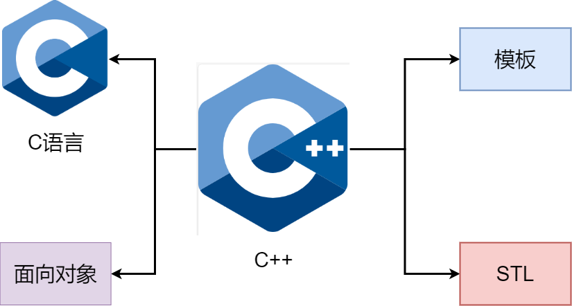

# 让自己习惯C++

## *条款1：将C++视做一个语言联邦*

### 范式

> A model or example of the environment and methodology in which systems and software are developed and operated. For one operational paradigm there could be several alternative development paradigms. Examples are functional programming, logic programming, semantic data modeling,algebraic computing, numerical computing, object oriented design, prototyping, and natural language dialogue. -- 牛津计算机辞典
>
> 一种环境设计和方法论的模型或范例；系统和软件以此模型来开发和运行。一个现役的范式可能会有数个开发中的替代范式。以下是一些大家比较熟悉的范式：函数化程序设计、逻辑程序设计、语意数据模型、几何计算、数值计算、面向对象设计、原型设计、自然语言。

范式 paradigm 是一组规则、约定和方法，用于定义程序设计语言的结构和特性。它们定义了如何组织和编写代码以解决问题，以及如何使用语言中提供的构造来表示和操作数据。不同的编程语言支持不同的范式，每种范式都具有一组相关的概念和原则

### C++的四种子语言

今天的C++是一门多范式编程语言 Multiparadigm programming language，同时支持过程式 procedural、面向对象 object-oriented、函数式 functional、泛型 generic和元编程 metaprogramming 特性。这种能力和灵活性使C++成为无可比拟的工具，但也会引起一些混乱。这种混乱就是**似乎所有的“规范语法”规则都会有一些例外**

一种理解方法是将C++视做一个语言联邦，在每一种子语言中的语法规则不一定在另一种子语言中完全使用。C++主要有以下几种子语言



* C++的C语言部分：C++仍然是基于C的。块、语句、预处理器、内置数据类型、数组、指针等都来自于C。在许多情况下，C++提供的解决问题的方法优于C中的对应方法（比如[条款2：尽量以const、enum、inline替换 #define](#条款2)和[条款13：以对象管理资源](#条款13)），但当使用C++的C部分时，高效编程的规则反映了C语言相对有限的功能：没有模板，没有异常，没有重载等
* C++的面向对象部分：C++的这一部分就是C with Classes的全部内容，即类（包括构造函数和析构函数）、封装、继承、多态、虚函数（动态绑定）等。这是C++中面向对象设计的经典规则最直接适用的部分
* C++的模板部分：这是C++的泛型编程部分。事实上模板是如此强大，它们产生了一种全新的编程范式--模板元编程 template metadata programming TMP。[条款48](#条款48)提供了TMP的概述，但除非是一个铁杆模板迷，否则不必过于担心它。TMP的规则很少与主流C++编程交互
* C++的STL部分：STL是一个模板库，但它是一个非常特殊的模板库。它通过一些约定，很好地将容器、迭代器、算法和函数对象地融合在一起。使用STL时需要确保遵循它的约定

### 简单举例

**当在四种不同的子语言之间切换时，为了实现高效的编程需要遵守的规则是不同的**。下面举一个函数传递的例子

* 对于内置类型 built-in type，值传递通常比引用传递更高效
* 但在C++的面向对象部分时，用户定义构造函数和析构函数的存在意味着引用传递到常量通常更好
* 在C++的模板部分尤其如此，因为在那里，你甚至不知道正在处理的对象的类型
* 然而当进入STL时，迭代器和函数对象是基于C中的指针建模的，因此对于STL中的迭代器和函数对象，旧的C值传递规则再次适用

## <span id="条款2">*条款2：尽量以const、enum、inline替换 `#define`*</span>

因为C的历史原因，`#define` 预处理仍然很常用。事实上，C++的发明者 Dr. Bjarne Stroustrup 也致力于去除C++中预处理器的使用

使用 `#define` 预处理替换有两个显著的缺点

1. 不方便追踪错误，编译器不会显式宏名称
2. 即使很小心了，编写宏仍然是极易出错，应该考虑用内联函数来替换。通过使用内联函数模板，可以获得宏的所有效率，以及普通函数的所有可预测行为和类型安全

```c++
#define ASPECT_RATIO 1.653 // 不好
const double aspect_ratio = 1.653; // 用常量来代替
```

下面两种特殊情况需要我们考虑

### 定义常量指针

```c++
#define AUTHORNAME "Scott Meyers"
const char * const author_name = "Scott Meyers"; // const pointer & pointer to a const
const string author_name2 = "Scott Meyers"; // better
```

定义字符串时不是 `const char *`，这只是一个常量指针，但按照 `#define` 或常量的意义应该既是一个指针常量，也是一个常量指针，即 `const char * const`

然而写成 `const char * const` 这种形式很难看，用C++标准库提供的string会好很多

### 类的专属常量

* 静态常量

  要把常量的作用域限制为类，就必须把它设为成员；而要确保最多有一个常量的副本，就必须把它设为静态成员

  然而在C++中，类静态常量的使用非常特殊。一般的静态变量不能给缺省值，只能在类外面给初始值

  但是有例外：`const static int`、`const static char`、`const static bool` 类型的静态变量可以给缺省值，比如哈希桶中的素数size扩容就用到了这个特性

  或者更准确地可以理解为，**上面三种类型的静态常量的初始值如果在类内声明时指定的，那么在类外定义时反而不允许赋初始值**；反过来如果在类外定义指定了初值，那么类内声明就不可以给出

  非常匪夷所思，明明是类内声明却可以给出初始值，但就是这么规定的

  甚至只要不获取它们的地址，那么甚至可以在不提供类外定义的情况下只声明并使用它们

  ```c++
  class GamePlayer {
  public:
      int get_numturns() { return num_turns; }
  private:
      const static int num_turns = 5; // const static 类型的声明，在这里初始化了！
      int scores_[num_turns];
  };
  const int GamePlyaers::num_turns; // const static 类型的定义，只要不获取它们的地址，可以不给出
  ```

* 枚举常量

  另一种方法是使用枚举，反正只要是编译时顺序确定的就行了

  ```c++
  class GamePlayer {
  public:
      int get_numturns() { return NumTurns; }
  private:
      enum { NumTurns = 5 };
      int scores_[NumTurns];
  };
  ```

### 极限值

C++11为了适应C99，也引入至少64位的long long，它的后缀是LL和ULL。为此C++标准也必须为它配套加入整形大小的限制

在C++中应该尽可能减少宏的使用，用模板取而代之是更明智的选择。因此C++标准对标准库文件做了扩展，特化了 long long 和 unsgined long long版本的 numeric_limits 类模板

```c++
#include <limits>
int main(int argc, char *argv[]) {
    // 使用宏方法       
    std::cout << "LLONG_MAX = " << LLONG_MAX << std::endl;
    std::cout << "LLONG_MIN = " << LLONG_MIN << std::endl;
    std::cout << "ULLONG_MAX = " << ULLONG_MAX << std::endl;
    // 使用类模板方法
    std::cout << "std::numeric_limits<long long>::max() = " 
        << std::numeric_limits<long long>::max() << std::endl;
    std::cout << "std::numeric_limits<long long>::min() = "
        << std::numeric_limits<long long>::min() << std::endl;
    std::cout << "std::numeric_limits<unsigned long long>::max() = "
        << std::numeric_limits<unsigned long long>::max() << std::endl;
    // 使用 printf 打印输出       
    std::printf("LLONG_MAX = %lld\n", LLONG_MAX);
    std::printf("LLONG_MIN = %lld\n", LLONG_MIN);
    std::printf("ULLONG_MAX = %llu\n", ULLONG_MAX);
}
```

### 总结

考虑到const、枚举和内联的可用性，对预处理器（特别是 `#define`）的需求减少了，但并没有完全消除。`#include` 仍然是必不可少的，`#ifdef//#ifndef` 继续发挥避免 circular dependency 的重要作用

* 对于简单常量，首选const对象或枚举，而不是 `#define`
* 对于类似函数的宏，优先选择内联函数

## *条款3：尽可能使用const*

### const限定成员函数

这部分在 *Cpp基础&11.md* 中的-类成员中的const成员部分讲过了，可以回顾一下

在成员函数上使用const

* 明确接口意图，告诉用户传入的参数不会被改变
* **保护参数不变性**，使用常量引用可以确保在函数内部不会修改传入的参数值
* **支持常量和非常量**：常量引用可以接受常量和非常量类型的实参。这增加了函数的通用性。这是因为非常量传给const是权限缩小，扩大了传参范围，即const参数和普通参数都可以传给const引用

C++中成员函数可以根据是否可以通过this来修改对象可以分为两类（即是否有const修饰整个成员函数），并且分别重载

**一般返回值是否设置为const &和this是否设置为const都是成对的**。因为不能通过this来修改的时候，同样也不能通过返回的引用来修改

### 位常量性与逻辑常量性

位常量性 bitwise constness 与逻辑常量性 logical constness 是关于类的成员函数在 const 语境下是否能修改成员变量的概念

* 位常量性表示在 const 成员函数中不能修改任何成员变量的值，即不能改变对象的位 bit 表示。这意味着成员变量的所有位都保持不变。C++中的常量性就是逻辑常量性
* 逻辑常量性表示在 const 成员函数中不会修改外部可见的逻辑状态，但可能会修改成员变量的值，只要这些修改是对外部不可见的。逻辑常量性往往依赖于程序员的实现，而不是编译器的强制检查。C++中可以用mutable将非静态数据成员从按位常量的限制中解放出来

### 避免const重载的代码重复

一对重载的const成员函数和非const成员函数可能会有很多内容重复，此时可以考虑复用

问题是谁调用谁？**用非const成员函数来调用const成员函数是安全的**，这样的话可以把修改数据的部分继续添加在非const成员函数中

```c++
class TextBlock {
public:
    const char& operator[](std::size_t position) const {
        //...
        //在这种情况下，去掉返回值上的const是安全的，因为调用非const操作符[的人首先必须有一个非const对象。
        //...
        return text[position];
    }
    char& operator[](std::size_t position) { //只需要调用const版本
        //对op[]的返回类型抛弃const //给*this的类型添加const;调用op的const版本[]，否则还是调用自己无限循环
        return const_cast<char&>(static_cast<const TextBlock&>(*this)[position]);
};
```

## *条款4：确定对象被使用前已先被初始化*

C/C++中定义无初值的对象时对象是否会被初始化的规则很复杂。一般来说，如果使用C++的C部分，并且初始化可能会导致运行时成本，则不能保证会初始化。如果使用C++的非C部分。情况则有时会不同。比如说数组不一定保证其内容初始化，而vector的内容必须初始化

最佳方法是始终在使用对象之前初始化它们。对于内置类型的非成员对象，需要手动完成。如

```C++
int x = 0;                                //手动初始化int类型
const char * text = "A C-style string" ;  //指针的手动初始化
double d;                                 //通过读取输入流来“初始化”，定义后确保立刻赋值也是可以的
std: :cin >> d;
```

**对于几乎所有其他的情况下，初始化的责任都落在构造函数身上**

### 构造函数中的初始化顺序

这一部分主要是强调了构造函数中初始化的顺序。这一部分已经在 *Cpp基础&11.md* 中着重论述了，下面给出一些最重要的点，具体的可以回顾 *Cpp基础&11.md* 

* **初始化列表可以认为是成员变量初始化的地方**。初始化列表是**被自动调用**的，即使是完全空的构造函数也会自动调用，因此可以认为构造函数里的是二次赋值，private里的只是声明，真正的初始化是在初始化列表之中。也就是说**实例化的过程是：类属性声明（若有缺省值就直接初始化）`->` 初始化列表赋值 `->` 构造函数内部赋值（若有的话） **
* **成员变量在类中的声明次序就是其在初始化列表中的初始化顺序，与其在初始化列表中的先后次序无关**

### 不同编译单元中定义的非局部静态对象的初始化顺序

单个编译单元是指产生单个目标文件的源代码，比如典型的一对 `.cc` 文件和 `.h` 文件组合

非局部静态对象 non-local static objects：函数内部的静态对象称为局部静态对象（因为它们在函数中是局部的），其他类型的静态对象称为非局部静态对象，比如说外部链接的静态变量（即全局变量）和内部链接的静态变量（非局部静态对象）

现在的问题是如果一个编译单元中的非局部静态对象的初始化使用了另一个编译单元中的非局部静态对象，那么它所使用的对象可能是未初始化的，因为不同翻译单元中定义的非局部静态对象初始化的相对顺序是未定义的。比如说我们在本地有一个 `FileSystem` 的类，其他客户需要调用这个类

```c++
// 假设有一个FileSystem类，它让互联网上的文件看起来像是本地文件
class FileSystem {
public:
	// ...
	std::size_t numDisks() const; // 众多成员函数之一
    // ...
};
FileSystem tfs;
```

现在假设某些客户在他的本地创建了一个新的类，用于处理文件系统中的目录，很自然它们的类药使用 `tfs` 对象，但是因为 `tfs` 是在其他编译单元的非局部静态变量（全局变量），除非 `tfs` 在  `Directory` 构造函数之前就已经初始化了，否则 `Directory` 会在 `tfs` 初始化之前就使用它，这就会产生问题

```c++
class Directory {
public:
    Directory(params);
    // ...
};

Directory::Directory(params) {
	// ...
    std::size_t disk = tfs.numDisks(); // 使用tfs对象
    // ...
}
```

解决办法是**将非局部静态对象替换为局部静态对象。**将每个非局部静态对象移动到自己的函数中，并将其声明为static。这些函数返回它们包含的对象的引用。客户调用函数而不是引用对象

依据是C++保证，函数内的局部静态对象会在调用该函数时第一次遇到该对象的定义时初始化

```c++
class Directory { /*...*/ }; // 和以前一样

Directory::Directory(params) {
    // ...
    //与之前一样，除了对TFS的引用现在变为tfs (){
	std:::size_t disks = tfs().numDisks();
    // ...
}

Directory& tempDir() { //这将替换tempDir对象，它可以是Directory类中静态函数
	static Directory td; //定义/初始化局部静态对象
	return td; //返回指向它的引用
}
```

注意：在多线程程序中，最好还是在单线程启动阶段手动调用函数来完成初始化

# 构造/析构/赋值运算

## *条款5：了解C++默默编写并调用哪些函数*

### 编译器拒绝生成默认赋值拷贝

在有些情况下编译器会拒绝生成默认的赋值拷贝，比如说下面这个例子

```c++
template<typename T>
class NamedObject {
public:
    NamedObject(std::string &name, const T& value)
        : name_value_(name), object_value_(value)
    {}
    void operator=(const NameObject &rhs) {
        name_value_ = rhs.name_value_;
    }
    // 假设没有自定义operator=
private:
    std::string &name_value_; // 现在是一个引用
    const T object_value_;    // 现在是一个常量
};
```

现在使用这个类

```c++
std::string newDog("Persephone");
std::string oldDog("Satch");
NamedObject<int> p(newDog, 2);
NamedObject<int> s(oldDog, 36);
p = s;   // 编译器会报错
```

在上面的情况中，两个类成员一个是引用，一个是常量。在这种情况下编译器无法生成一个合成赋值拷贝，因为C++不允许引用的重新绑定，也不允许修改常量

若是有引用和常量这种两类成员变量的情况下，一定要自定义operator=来告诉该怎么赋值，比如说我们自定义为只修改 `name_value_`

```c++
class NameObject {
    // ...
    void operator=(const NameObject &rhs) {
        name_value_ = rhs.name_value_;
    }
    // ...
};
```

## *条款6：明确阻止编译器生成代码*

这个条款主要是关于C++11之前禁止拷贝构造生成的（第三版成书时间早于C++11标准，无delete关键字），可以看 *Cpp基础&11.md* 的构造函数-拷贝控制操作-阻止拷贝-C++11之前：声明为private

## *条款7：为多态基类声明virtual析构函数*

这部分在 *Cpp基础&11.md* 的继承-派生类的构造函数-基类虚析构函数中有

总结一下就是多态基类应该声明虚析构函数，非基类或非多态使用的类不应该声明虚析构函数

补充的点是对于纯虚函数（即抽象类），它也要设置为虚析构，且必须提供虚析构的定义，因为要用到

```c++
// Abstract w/o Virtuals
class AWOV {
public:
    virtual ~AWOV() = 0; // 声明为纯虚析构函数
};
AWOV::~AWOV() {} // 必须提供纯虚析构函数的定义
```

## *条款8：别让异常逃离析构函数*

别让异常逃离析构函数 Prevent exceptions from leaving destructors。不要逃离指的是不让异常继续从析构函数中继续throw出去，没有说不能在析构中产生异常，只要try析构，然后catch到处理好就可以

从析构函数逃离的异常很难处理，比如说下面的Widget的析构函数可能会发生异常，那么在do_something结束的时候，Widget实例要自动调用析构函数

```c++
class Widget {
public:
    // ...
    ~Widget() { /**/ } // 假设这里可能会引发异常
};

void do_something() {
	std::vector<Widget> v;
}
```

### 场景

若~DBConn中的 `db.close()` 产生异常，则会逃离出来

```c++
class DBConnection { 
public:
	static DBConnection create(); // 返回DBConnection对象的函数。为简单起见，省略了参数
	void close(); // 关闭连接联系，如果关闭失败会抛出异常
};

class DBConn { // 用来来管理DBConnection对象的类
public:
	~DBConn() { //确保数据库连接总是关闭的
		db.close();
    }
private:
    DBConnection db;
};
```

### 解决方案

有两种可能的解决方法

1. 若发生close抛出异常，就终止程序，通常可以调用abort

   ```c++
   DBConn::~DBConn() {
   	try { db.close(); } 
       catch (...) {
   		std::abort(); // 在日志中记录close调用失败
   	}
   }
   ```

2. 吞下调用close引起的异常，就是当他没发生:joy:

   ```c++
   DBConn::~DBConn() {
   	try { db.close(); }
       catch (...) {
   		// 在日志中记录close调用失败;
   	}
   }
   ```

这两种方法都不好，因为程序无法对导致close抛出异常的条件做出反应。更好的策略是设计DBConn的接口，以便其使用者有机会对可能出现的问题做出反应

将调用close的责任从DBConn的析构函数与转移到DBConn的客户

```c++
class DBConn {
public:
    void close() { // db自己的close由用户主动调用
        db_.close();
        closed_ = true;
    }
    ~DBConn() {
        if (!closed_) {
            try { db_.close(); }
            catch (...) { // 若关闭失败就记录下来，终止或吞下
                // 在日志中记录close调用失败
            }
        }
    }
private:
    DB db_;
    bool closed_;
};
```

## *条款9：绝不在构造和析构过程中调用虚函数*

绝不在构造和析构过程中调用虚函数 Never call virtual functions during construction or destruction

假设有个类的继承体系，用于建模股票交易，例如买入订单、卖出订单等。此类交易是可审计的，因此每次创建交易对象时，都需要在审计日志中创建适当的条目

```c++
class Transaction { //所有交易的基类
public:
	Transaction();
	virtual void logTransaction() const = 0;// 创建依赖于类型的日志条目
};

Transaction::Transaction() {
	logTransaction(); //记录这笔交易
}

class BuyTransaction : public Transaction {
public:
    virtual void logTransaction() const;
};

class SellTransaction : public Transaction {
public:
    virtual void logTransaction() const;
};
```

在派生类构造函数开始执行之前，对象会被视为是一个基类对象

### 解决方式

解决这个问题有很多方式。一种是将logTransaction转换为非虚幻术，然后要求派生楼构造函数将必要的日志信息传递给基类的构造函数，然后基类的构造函数可以安全地调用非虚地logTransaction

## *条款10：操作符重载返回当前对象*

操作符重载返回当前对象 have assignment operators return a reference to `*this`，在 *Cpp基础&11.md* 的拷贝控制操作 - 赋值运算符重载部分只是比较简略地提了一下，这里再扩展一下

赋值的一个很有用的地方就在于可以连续赋值

```c++
int x, y, z;
x = y = z =15; // -> x = (y = (z = 15));
```

自定义的类实现赋值操作符重载时应该要遵顼这个约定，因为好的类行为应该和内置类型一样。实现这种的方式就是，赋值操作返回一个指向左侧参数的引用。不过这只是一种约定和惯例，即使不遵守它也可以通过编译

```c++
class Widget {
public:
	widget& operator=(const widget& rhs) { // 返回类型是当前类的一个引用
		return *this; // 返回左值对象
	}
	widget& operator+=(const widget& rhs) { // 这个约定也适用于+=、-=、*=等
		return *this;
    }
	widget& operator=(int rhs) { // 即使参数的类型不符合约定，也适用
		return *this;
    }
};
```

## *条款11：自我赋值安全性*

自我赋值安全性 handle assignment to self in operator= 也是在 *Cpp基础&11.md* 的拷贝控制操作 - 赋值运算符重载部分只是比较简略地提了一下，这里再扩展一下

### 错误场景

* 自我赋值

  ```c++
  class Widget { /**/ };
  Widget w;
  w = w; // 自己给自己赋值
  ```

  而且有时候自我赋值可能并不会那么明显，比如说在循环中或者两个指针指向同一个对象

  ```c++
  for (int i = 0; i < n; i++) {
  	for (int j = 0; j < n ; j++) {
  		a[i] = a[j]; // 潜在的自我赋值
      }
  }
  
  *px = *py; // 潜在的自我赋值
  ```
  
  若两个对象来自同一个同一个继承机构的时候，甚至不需要将它们声明为同一类型，因为基类引用或指针可以引用或指向派生类类型的对象

    ```c++
    class Base { ... };
    class Derived : public Base { ... };
    void doSomething(const Base& rb，Derived* pd); // rb和*pd可能是同一个对象
    ```

* 提前释放对象错误
  
  如果试图自己管理资源，可能会陷入这样的陷阱：在使用完资源之前不小心释放了资源

    ```c++
  class Bitmap { ... };
  class widget {
  public:
      Widget&operator=(const widget& rhs);
  private:
      Bitmap* pb; // 指向一个从堆中分配的对象
  };
  
  widget& widget::operator=(const widget& rhs) { // 不安全的版本
      delete pb; // 停止使用当前的bitmap
      pb = new Bitmap(*rhs.pb); // 开始使用rhs的bitmap的一个副本
      return *this;
  }
    ```

  上面的 `operator=` 是不安全的，因为在 `w=w` 这种自我赋值的情况下，`*this`（赋值的目标）和rhs是同一个对象，导致最终指向一个己经被删除的对象。即rhs此时就是w自己。那么在构造新的pb的时候，实际上就在用一个被delete的空对象构造

解决方法有三种：比较源对象和目标对象地址、语句排序、copy-and-swap

### 比较源对象和目标对象地址

防止这种错误的传统方法是在operator=的顶部检查是否是对自己赋值

```c++
widget& widget::operator=(const widget& rhs) {
	if (this == &rhs)
        return *this; // 如果是自我赋值，什么也不做
    delete pb;
	pb = new Bitmap(*rhs.pb);
    return *this;
}
```

不过问题还没有结束，上面的代码还有异常安全性的问题。若 `new Bitmap` 表达式产生异常，因为没有足够的内存用于分配的 `std::bad_alloc` 等异常，或者因为Bitmap的拷贝构造函数抛出异常而导致没有成功创建出新的pb，因为此时旧的pb已经被delete了，那么最终仍然会指向已删除的Bitmap对象

### 语句排序

比较幸运的是使 `operator=` 异常安全，通常也会自动解决自赋值的安全性问题

解决的方法很简单，那就是创建副本，此时即使没有自我赋值测试，下面的代码也具有自我赋值的安全性，因为创建了原始Bitmap的一个副本，删除了原始Bitmap，然后指向创建的副本，此时就算new出问题了，也不会影响pb。虽然这不是最高效的方法，但有效

```c++
widget& widget::operator=(const widget& rhs) {
	Bitmap* p_orig = pb; // 记住原先的pb
    pb = new Bitmap(*rhs.pb); // 让pb指向*rhs.pb的副本
    delete p_orig; // delete原先的pb
    return *this
}
```

### copy-and-swap

更高效的方法可以采用拷贝的现代写法 copy and swap 条款29

## *条款12：要完整拷贝*

这个条款主要是在说设计类的时候如果后期又增加了一些类属性，那么相应的不要忘了在其拷贝构造和赋值运算符重载中也要加上新增的类属性

不过在自己类中一般不会忘了去处理，一般遗忘的情况是基类中添加了新成员，而在派生类中对基类的构造部分忘记了处理新的成员

# 资源管理

资源是指一旦使用完了就需要返回系统的东西  

## <span id="条款13">*条款13：以对象管理资源*</span>

这一条款基本就是RAII和智能指针的基础内容

## *条款14：RAII对象拷贝*

## *条款15：RAII对象的原始资源访问*

## *条款16：new和delete要一致*

在 *Cpp基础&11.md* 的C++内存管理 - new & delete封装 - `[]` 不匹配错误的底层原因中已经详细说明过了

## *条款17：独立构造智能指针*

# 设计与声明

## *条款18：让接口容易被正确使用*

## *条款19：设计class就是设计type*

设计class时，都要面对如下问题，答案通常会导致你的设计是否规范

* 如何创建和销毁新类型的对象？这将影响
  * 类的构造函数和析构函数的设计
  * 内存分配和释放函数的设计 `operator new, operator new[], operator delete, operator delete[]`
* 对象初始化和对象赋值有什么区别？这将影响构造函数和赋值运算符的行为以及它们之间的区别。重要的是不要混淆初始化和赋值，因为它们对应于不同的函数调用
* 新类型的对象通过值传递意味着什么？拷贝构造函数定义了如何实现类型的值传递
* 对于新类型的合法值有什么限制？通常类的数据成员只有某些值的组合是有效的。这些组合决定了类必须维护的不变式（约束条件）。不变量决定了你必须在成员函数中进行的错误检查，特别是构造函数、赋值运算符和“setter"函数。如果不合法就要进行处理或抛出异常
* 新类型允许什么样的类型转换？
  * 如果希望允许T1类型的对象隐式转换为T2类型的对象，需要在T1类中写一个类型转换函数（例如 `operator T2`），或类T2的带有一个参数的非显式 non-explicit 构造函数
  * 如果希望只允许显式转换，就需要编写执行转换的函数，比如说 `to_string()` 这种。此时需要避免使用类型转换运算符或可以用—个参数调用的非显式构造函数
* 哪些运算符和函数对新类型有意义？这将影响类需要声明哪些函数。有些函数是成员函数，但有些不是
* 哪些标准函数应该被禁止？声明为private的，或使用delete（C++11）
* 新类型的成员该被谁调用？确定各个成员的访问限定符，它还可以帮助你确定哪些类和（或）函数应该成为友元，以及将一个类嵌套在另一个类中是否有意义
* 新类型的“未声明接口”是什么？它在性能、异常安全性和资源使用（例如锁和动态内存）方面提供了什么样的保证？在这些方面提供的保证会对类的实现造成限制
* 新类型有多通用？也许你正在定义一个完整的类型族，这时你真正想定义一个的是一个类模板
* 你真的需要一种新类型吗？如果你定义一个新的派生类只是为了向现有类添加功能（假设现有类来自一个库，不能改动），也许可以简单地定义一个或多个非成员函数或模板来实现

## *条款20：优先使用常量引用传递*

### 为什么要常量？

值传递 pass-by-value 时是通过对象的拷贝构造来产生一个副本来传入参数的，这种代价可能会很大，特别是对于自定义数据类型

按照约定，内置类型、STL中的迭代器和函数对象都是值传递的

至于传常量有几个好处

1. 明确接口意图，告诉用户传入的参数不会被改变
2. **保护参数不变性**，使用常量引用可以确保在函数内部不会修改传入的参数值
3. **支持常量和非常量**：常量引用可以接受常量和非常量类型的实参。这增加了函数的通用性。这是因为非常量传给const是权限缩小，扩大了传参范围，即const参数和普通参数都可以传给const引用
4. 常量左值引用可以绑定右值

当然传常量引用的前提是我们没有把参数设计为输出型参数，否则传的是常量引用我们也自然就不能够修改它了

若不做输出型参数的情况下，仍然把常量引用设置为普通引用会产生两个问题

1. 给使用者一种误导，即这个参数在函数内部是可以被改变的，甚至会意外改变这个参数
2. 限制了传参范围，此时const数据类型因为权限扩大问题无法传递给普通参数

### 切割问题

## *条款21：函数返回不要滥用引用*

若函数要返回的对象是在函数内部构造的（非静态）局部对象，那么一旦出了块作用域编译器就自动调用析构把它销毁了，此时若返回引用会产生空指针错误，要用传值返回

如果是在函数作用域里new到堆上的话，还要考虑没有delete会产生内存泄漏的问题

只有当返回的对象是在函数开始之前就已经存在的对象，即对象的作用域不限于函数的块作用域，此时才可以传引用返回

当不希望返回的对象被修改时，返回对常量的引用

## *条款22：将数据设为私有*

比较基础的内容，基本上就是阐述了把数据设为私有对封装的好处

## *条款23：宁以成员非友元函数替换成员函数*

宁以成员非友元函数替换成员函数 Prefer non-member, non-friend functions to member functions

## *条款24：参数都需要转换的函数*

若所有参数皆需要类型转换，请为此采用非成员函数 Declare non-member functions when type conversions should apply to all members

## *条款25：不会抛出异常的swap*

# 实现

## *条款26：尽量推迟定义变量*

未使用的变量是有开销的，特别是一些大型的类或数据结构，因此应该尽可能避免过早地定义变量，既可以提高效率，也可以让结构更清晰

### 异常

比如说下面这个例子中过早地定义了变量 `encrypted`，若是中间抛出了异常那么就浪费了构造和拷贝赋值了

```c++
std::string encryptPassword(const std::string &password) {
	std::string encrypted; // 调用默认构造函数对encrypted进行初始化
	encrypted = password; // 调用赋值拷贝给encrypted赋值
    if (password.length() < MinimumPasswordLength) {
        throw logic_error("Password is too short");
    }
    encrypt(encrypted); // 将password加密后放入变量encryptedreturn encrypted;
}
```

将定义变量 `encrypted` 推迟到真正需要的时候

```c++
std::string encryptPassword(const std::string &password) {
    if (password.length() < MinimumPasswordLength) {
        throw logic_error( "Password is too short");
    }
	std::string encrypted(password); // 通过拷贝构造函数定义和初始化
    encrypt(encrypted); // 将password加密后放入变量encrypted
	return encrypted;
}
```

### 循环

循环是一个经典的场景，但是下面两种到底构造、析构和赋值的开销谁大也不好说

* 定义在循环外：1次构造+1次析构+n次赋值

  ```c++
  Widge w;
  for (int i = 0; i < n; i++)
      w = /*some value*/;
  ```

* 定义在循环内：n次构造+n次析构

  ```c++
  for (int i = 0; i < n; i++) 
      Widge w(/*some value*/);
  ```

## *条款27：尽量少做强制转换*

## *条款28：避免返回内部成员的句柄*

## *条款29：为异常安全而努力*

## *条款30：内联函数*

这条条款基本上所有的内容都在 *Cpp基础&11.md* 介绍过了，下面是补充的一些内容

所有的虚函数都不允许内联，因为通过虚函数实现动态绑定的多态

构造函数和析构函数是特殊的，虽然它们看起来都是空的，但实际上不是，要做大量的异常处理和可能需要的资源销毁处理，所以非常不适合内联

## *条款31：降低文件编译依赖*

C++在分离接口和实现方面做的不好，类定义不仅指定了类接口，还指定了相当多的实现细节

# 继承与面向对象设计

## *条款32：public继承是is-a关系*

## *条款33：避免遮掩父类的名称*

## *条款34：区分接口和实现继承*

## *条款35：虚函数的替代方案*

## *条款36：非虚函数是静态绑定*

## *条款37：不要重写默认参数值*

## *条款38：*

## *条款39：慎用私有继承*

## *条款40：慎用多重继承*

# 模版与泛型编程

## *条款41：隐式接口和编译器多态*

## *条款42：typename的双重含义*

[知无涯之C++ typename的起源与用法 (feihu.me)](https://feihu.me/blog/2014/the-origin-and-usage-of-typename/#问题浮现)

### 一些概念

* 限定名和非限定名

  * 限定名 qualified name 是限定了命名空间的名称，比如下面的 `std::cout` 和 `std::endl`

    ```c++
    std::cout << "Hello Wolrd" << std::endl;
    ```

  * 非限定名 unqualified name 是没有用域访问符限定的，比如下面的 `cout` 和 `endl`

    ```c++
    using namepsace std;
    cout << "Hello Wolrd" << endl;
    ```

* 依赖名和非依赖名

  依赖名 dependent name 是指依赖于模板参数的名称，而非依赖名 non-dependent name 则是指不依赖于模板参数的名称

  下面的非依赖名因为是内置类型int是在模板声明的时候就已知的，而依赖名则要等到模板实例化了之后才能确定下来

  ```c++
  template<typename T> class Foo {
      // 非依赖名
  	int i;
      vector<int> vi;
      vector<int>::iterator vitr;
  	// 依赖名，依赖于模板参数T
      T t;
      vector<T> vt;
      vector<T>::iterator viter;
  }
  ```

### typename的引入

由于历史的原因，Stroustrup在设计模板的时候没有引入一个新的关键字，用的仍然是 class，很多旧的编译器只支持 class。事实上：直到C++17 typename才被引入！

虽然class有些别扭，但总归还是能用的。下面是真正引入typename的原因

```c++
template<typename T> void foo() {
    T::iterator * iter; // 故意写成这样
}
```

若是对于一个确定的类型vector来说，我们知道 `vector::iterator` 肯定是一个迭代类型，即vector的迭代器。但是对于 `T::iterator` 来说，有三种可能性

```c++
template class Foo {
    static void iterator();
	static int iterator;
    typedef int iterator;
}
```

* T的静态数据
* T的静态函数
* 一种嵌套在T中的嵌套类型

因此解释 `T::iterator * iter` 也有歧义，要么解释为一种乘法运算，即静态数据 `T::iterator` 与某种已经声明的变量iter的乘积；要么解释为声明为T中的嵌套类型 `T::iterator` 的一个变量

这种在模板定义中的二义性是无法接受的。因此引入了typename，即**对于用于模板定义的依赖于模板参数的名称，只有在实例化的参数中存在这个类型名，或者这个名称前使用了`typename`关键字来修饰，编译器才会将该名称当成是类型**。而在默认情况下，嵌套的从属名称不是类型，所以只要是依赖于模板参数的类型声明都要加typename，不可以省略

```c++
template<typename T> void foo() {
    typename T::iterator * iter; // 一个乘法 
    T::iterator * iter; // 现在这么写会被认为是声明一个iter
    typename T::iterator iter; // 虽然现在不加typename也没有歧义，但只要是依赖于模板参数的类型声明都要加typename，不可以省略
}
```

### 例外

typename不能放在基类列表中的嵌套从属类型名称之前，也不能放在成员初始茆拜列表中的基类标识符之前

```c++
template<typename T>
class Derived : public Base<T>::Nested { // 继承基类列表不能用typename
public:
	explicit Derived(int x)
		:Base<T>::Nested(x) // 初始化列表中不能用typename
    {
		typename Base<T>::Nested temp;// 其他情形下，需要使用typename//指明是嵌套从属类型名称
    }
};
```

## *条款43：基类模板名称访问*

学习访问模板化基类内的名称 Know how to access names in templatized base classes

### 一个场景

假设需要编写一个可以向多个不同的公司发送消息的应用程序

```c++
class CompanyA {
public:
    // ...
	void sendCleartext(const std::string& msg); // 明文发送
    void sendEncrypted(const std::string& msg); // 加密发送
    // ...
};

class CompanyB {
public:
    // ...
	void sendCleartext(const std::string& msg); // 明文发送
    void sendEncrypted(const std::string& msg); // 加密发送
	// ...
};
// ...其他公司的类

class MsgInfo { ... }; //用于保存信息的类，将来可以用生成消息

template<typename Company> class MsgSender {
public:
	// ctors、dtor等等
	void sendClear(const MsgInfo& info) {
		std::string msg;
		//... 通过info创建消息;
		Company c;
		c.sendCleartext(msg);
	}
	void sendSecret( const MsgInfo& info) {
		// ...与sendclear类似，但会调用c.sendEncrypted
	}
};
```

假设我们有时想在每次发送消息时记录一些信息

```c++
template<typename Company>
class LoggingMsgSender : public MsgSender<Company> { 
public:
	// ctors、dtor等等
    void sendClearMsg(const MsgInfo& info) {
    //... 在日志中写入“发送前"信息;
    sendClear(info); // 调用基类函数; 无法编译通过，编译器会报错：sendClear不存在
    //...在日志中写入“发送后"信息;
	}
};
```

这里的问题是 `MsgSender<Company>` 并不是一个实在的类，而是一个类模板，所以它的方法 `sendClear` 也并没有被实例化出来

## *条款44：抽离无关的模板代码*

## *条款45：成员函数模板*

## *条款46：类模板的友元函数*

## *条款47：萃取类*

[C++ 类型萃取的实现 | The Ship of Zenlian](https://zenlian.github.io/cpp-traits/)

请使用萃取类表现类型信息 Use traits classes for information about types

### `std::advance` 简介

```c++
template <class InputIterator, class Distance>  void advance (InputIterator& it, Distance n);
```

`std::advance` 是C++11引入的迭代器泛型算法。作用是把一个迭代器移动n个位置，若 `n>0`，则向后移动；若 `n<0`，则向前移动。注意：若迭代器是随机访问迭代器，则不论n是多少，仅向后或向前移动一个位置

考虑一下`std::advance` 是如何实现的。首先它要支持的迭代器有很多种类型，所以实现并不只是 `it += n` 就完成了，需要考虑不同的迭代器类型

### 萃取技术

其实traits的概念很好理解，不要被它的中文翻译“萃取”吓到了，traits就是在告诉我们一个模板的特征。这是一种元编程技术，用于获取和描述类型或迭代器的特性。这在泛型编程和模板元编程中非常有用，以便在编译时确定对象或类型的特性

trait不是C++中的关键字或预定义结构，而是C++程序员遵循的一种技术和约定。对该技术的要求之一是，**它必须像对自定义类型一样对待内置类型**。意味着在类型中嵌套信息之类的无法实现，因为没有办法在指针内部嵌套信息。因此类型的traits信息必须是在类型的外部再次封装的模板

### 迭代器萃取

现在通过迭代器萃取来实现 `std::advance`

迭代器萃取：迭代器萃取是用于获取和描述迭代器的特性的技术，**通俗地所迭代器萃取就是问迭代器是哪种类型**。在泛型编程中，经常需要了解迭代器的特性，以确定它支持哪些操作，例如遍历、递增、递减等。通过迭代器萃取可以在编译时确定迭代器的特性，从而编写通用的算法，这些算法可以与不同类型的迭代器一起使用

在 *Cpp基础&11.md* - vector & list - list 链表 - list的反向迭代器，采用适配器（复用）的方向进行设计 部分中讲过迭代器可以分成5种类型（C++20之前）：即InputIterator、OutputIterator、ForwardIterator、BidirectionalIterator、RandomAccessIterator

* 首先为不同的迭代器类型创造标签 tag

  ```c++
  struct input_iterator_tag {};
  struct output_iterator_tag {};
  struct forward_iterator_tag : public input_iterator_tag { };
  struct bidirectional_iterator_tag : public forward_iterator_tag {};
  struct random_access_iterator_tag : public bidirectional_iterator_tag {};
  ```

* 然后泛型算法通过给它们打上标签来判断它们是哪种类型

  ```c++
  template< /*...*/ > // 省略模板参数
  class list {
  public:
      // 实际iterator是在类外定义的，这里为了方便说明定义为内部类
      class iterator { 
  		public:
          // 用tag表示自己是一个bidirectional迭代器
          typedef bidirectional_iterator_tag iterator_category;
          //...
      };
      //...
  };
  ```

* 最后用一个统一的 `iterator_traits` 模板类统一获取迭代器的类型信息

  ```c++
  template<typename IterT>
  struct iterator_traits {
      typedef typename IterT::iterator_category iterator_category;
      //...其他容器
  };
  ```

  想要知道迭代器的类型，泛型算法明明可以直接 `list::iterator_category` 来获取 tag 却还要进一步封装一个模板呢？这并不是多此一举，而是为了将指针统一进去，因为指针不可能有嵌套类

  所以还要为 `iterator_traits` 再添加一个内置指针类型的模板偏特化

  ```c++
  template<typename IterT>
  struct iterator_traits<IterT*> {
      typedef random_access_iterator_tag iterator_category;
  }
  ```

  `iterator_traits` 模板类就是所谓的萃取器 traits。这个名字听起来很高大上，实际就是告诉一个信息容器，给一个输入，然后提供一个输出告诉你对应的性质信息

### 用萃取器来实现 `std::advance`

```c++
typename<typename IterT, typename DistT>
void advance(IterT& iter, DistT d) {
    if (typeid(typename std::iterator_traits<IterT>::iterator_category)
       == typeid(std::random_access_iterator_tag)) {
        // ...
    }
}
```

如果用上面这种if判断会产生大量的运行时开销

为了提高运行速度，采用函数重载的方式，这样再编译器就可以进行判断了

```c++
// 针对 random access 迭代器
template<typename IterT, typename DistT>
void doAdvance(IterT& iter, DistT d, random_access_iterator_tag)
{
    iter += d;
}
// 针对 bidirectional 迭代器
template<typename IterT, typename DistT>
void doAdvance(IterT& iter, DistT d, bidirectional_iterator_tag)
{
    if (d >= 0) { while (d--) ++iter; }
    else { while (d++) --iter; }
}
// 针对 input 迭代器
template<typename IterT, typename DistT>
void doAdvance(IterT& iter, DistT d, input_iterator_tag)
{
    if (d < 0) {
        throw std::out_of_range("Negetive distance");
    }
    while (d--) ++iter;
}
// 由于 forward_iterator_tag 继承于 input_iterator_tag，
// advance 的实现也一样
// 不需要给 forward 迭代器再定义一个重载版本
```

`std::advance` 只需要额外传入一个参数调用 `doAdvance` 即可

```c++
template<typename IterT, typename DistT>
void advance(IterT& iter, DistT d) {
    doAdvance(iter, d,
             iterator_traits<IterT>::iterator_category());
}
```

## <span id="条款48">*条款48：认识template元编程*</span>

模板元编程 Template Metadata Programming TMP 是编写在编译期间执行的基于模板的C++程序的过程。TMP是被发现的，而不是发明的。

TMP能够得到更小的可执行文件，更短的运行时间和更少的内存需求，但同时也需要更长的编译时间

# 定制new和delete

许多开发人员在高要求的系统应用程序中选择C++，因为它让他们可以手动管理内存。开发者需要理解C++的内存管理行为

## *条款49：设置new-handler*

### `std::set_new_handler`

一种最典型的情况是当new了之后无法提供需要的内存时候，new会抛出异常来响应，它会调用客户指定的错误处理函数new-handler

```c++
//若new运算符不能分配足够的内存，要调用的函数
void outOfMem() {
	std::cerr << "Unable to satisfy request for memory\n";
    std::abort(); //如果不abort，程序会一直尝试调用这个处理函数
}

int main() {
	std::set_new_handler(outOfMem);
    for(int i=o; i<100000; i++) {
        int* pBigDataArray = new int[100000000L];
    }
}
```

### new-handler的任务

设计良好的new-handler函数必须完成下列任务之一

* 让更多内存可被使用。例如：程序一开始就分配一大块内存，而后当new-handler第一次被调用，将它们释还给程序使用
* 安装另一个new-handler。若当前new-handler无法取得更多可用内存，或许它知道另外哪个new-handler有此能力。通过调用 `std::set_new_handler`，或通过改变全局数据改变自己的行为
* 卸除new-handler，也就是将nullptr传给 `std::set_new_handler`。这样operator new会在内存分配失败时抛出异常
* 抛出bad_alloc或其派生的异常。这样的异常不会被operator new捕捉，而会被传播到内存索求处
* 不返回，通常调用abort或exit

## *条款50：了解new和delete的合理替换时机*

需要替换operator new或 operator delete有三大理由

### 用来检测运用上的错误

若令operator new持有一串动态分配所得地址，而operator delete将地址从中移除，就很容易检测内存泄露或重复delete的错误用法。比如说没人在用了里面的资源还没有人释放那就是内存泄漏了

此外以额外空间放置特定的签名 signature，可以解决 overruns（写入点在分配区块尾端之后）和 underruns（写入点在分配区块起点之前）

```c++
static const int signature = OXDEADBEEF; // 签名
typedef unsigned char Byte;
// 这段代码有一些缺陷，例如不能保证内存对齐
void* operator new(std::size_t size) {
	using namespace std;
	size_t realSize = size + 2 * sizeof(int); // 增加请求的大小，所以2个签名也将适合里面
    void* pMem = malloc(realSize); // 调用malloc来获取实际的内存
	if (!pMem) throw bad_alloc();
	*(static_cast<int*>(pMem)) =signature; // 把签名写进内存的头和尾
	*(reinterpret_cast<int*>(static_cast<Byte*>(pMem)+ realSize - sizeof(int)))=signature;
	return static_cast<Byte*>(pMem) + sizeof(int); // 返回一个指向第一个签名后面的内存的指针
}
```

### 提高效率

默认的new和delete设计成对任何情况的处理效果都是不错的，但对任何专用情况都不够有效

* 提高分配和释放的速度

  例如：编译器的内存管理器是线程安全的，如果程序是单线程的，替换为一个不是线程安全的分配器可能会提高速度

* 降低缺省内存管理器带来的空间额外开销

  例如：为小对象调优的分配器基本上可以消除而外的开销

* 弥补缺省分配器种的非最佳齐位

  例如：将默认new运算符替换为能够确保8字节对齐的版本，可以大幅提高程序性能（如果编译器本身不是这样做的话）

* 把相关的物体聚集在一起

  例如：如果知道一些特定的数据结构通常一起使用，那么为这些数据结构创建一个单独的堆是有意义的。这样可以降低“内存页错误（page faults）”的频率。比如STL的 `std::allocator`

* 获得非传统的行为

  例如：可以编写一个自定义delete运算符，用0重写已释放的内存，以提高应用程序数据的安全性


### 统计信息收集

为了收集分配区块的大小分布；寿命分布；它们是倾向于按照FIFO、LIFO的顺序分配和释放，还是更接近随机的顺序？在执行的不同阶段是否有不同的分配/释放模式等这些使用信息

## *条款51：遵守new和delete的约定*

adhere to convention when writing new and delete

### new

* C++要求new运算符即使在请求o字节时也返回一个合法的指针

* 成员函数的operator new是会会被派生类继承。但派生类和基类的大小可能不同，处理这种情况的最佳方法是将请求“错误”内存大小的调用丢给标准new运算符

  ```c++
  class Base {
  public:
  	static void* operator new(std::size_t size);
      // ...
  };
  class Derived : public Base { /**/ }; // 派生类没有声明new运算符
  Derived* p = new Derived; // 调用 Base::operator new!
  
  void* Base::operator new(std: :size_t size) {
  	if (size != sizeof(Base)) // 如果大小是“错误的”，
  		return ::operator new(size); // 采用标准operator new处理请求
  	// 否则在这里处理请求
  }
  ```

### delete

* C++保证delete空指针总是安全的，所以要遵守这个约定

  ```C++
  void operator delete(void* rawMemoriy) throw() {
  	if (rawMemory == 0) return; // 如果空指针正在被删除，什么都不做
      // 释放rawMemory指向的内存;
  }
  ```

* 成员函数版本也很简单，只需要将大小“错误”的delete行为转交给标准的operator delete

  ```C++
  class Base { // 和之前一样，但现在声明了delete运算符
  public:
  	static void* operator new(std::size_t size) throw(std::bad_alloc);
      static void operator delete(void* rawMemory, std::size_t size)
  throw();
  };
  void Base::operator delete(void* rawMemory, std::size_t size) throw() {
  	if(rawMemory == 0) return; // 检查空指针
      if(size != sizeof(Base)) {
          ::operator delete(rawMemory);
          return;
      }
      // 释放rawMemory指向的内容;
      return;
  }
  ```

## *条款52：定位new*

# 杂项讨论

## *条款53：不要轻忽编译器的警告*

## *条款54：让自己熟悉包括TR1在内的标准程序库*

## *条款55：Boost库*