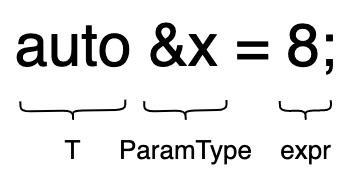
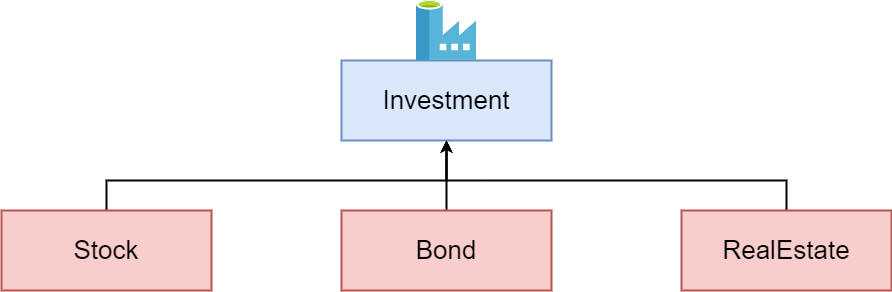
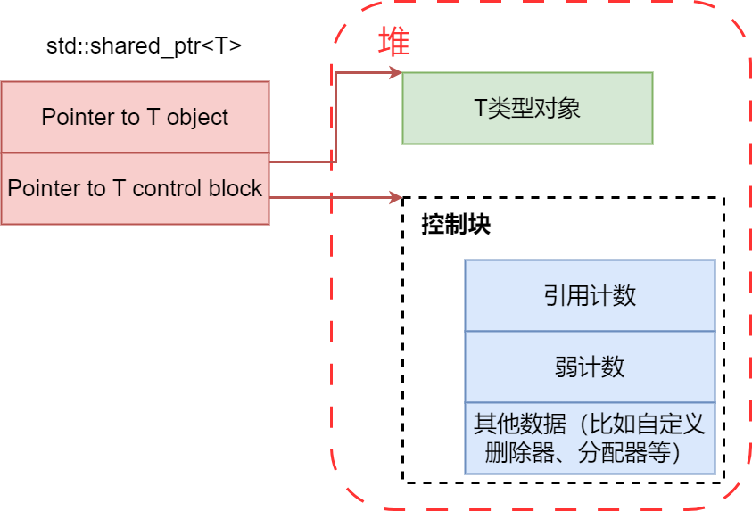

# 类型推导

## *条款1：理解模板类型推导*

```c++
template<typename T> void f(ParamType param); // 函数模板
f(expr); // 函数调用
```

模板类型T的推导取决于实际传入expr和预设ParamType的类型的不同形式的排列组合的共同作用

### ParamType既非指针也非引用

此时就是按值传递，也就是说无论传入的是什么，param都会是它的一个副本。所以下面的性质是很好理解的，反正函数模板内部得到的都是一个实参拷贝，是不会拷贝它的性质的（原理就是所处区域不一样，一个栈区的拷贝常量区里的内存，不会拷贝它常量区的性质），所以对它做什么都不会影响原来的值

1. **忽略expr的引用性 reference-ness、顶层常量性 top-level constness、volatile性**。注意一个点：右值引用得到的仍然是一个左值引用，所以当expr是一个右值引用时候的，它等同于一个左值引用，所以引用性同样会被忽略
2. 将expr剩余的类别与ParamType的类别再进行匹配，缺啥补啥

```c++
void f(T param) { std::cout << param << std::endl; }
void f(const T param) { std::cout << param << std::endl; }
```

### ParamType是指针或左值/右值引用，但不是万能引用

1. **忽略expr的引用性**，expr的底层常量性和顶层常量性都会被保留下来（回忆：只有当执行对象拷贝的时候才能忽略expr的顶层常量性，这里不是对象拷贝了）
2. 将expr剩余的类别与ParamType的类别再进行匹配

### ParamType是万能引用 `T&&`

在模板推导时 `T&&` 是一个万能引用。注意：只有 `T&&` 是万能引用，`const T&&` 是一个右值引用

* 若传入的expr是个左值，则T和ParamType都会被推导为左值引用。**这是在模板类型推导中，T被推导为引用类别的唯一场景**。这种情况被称为引用折叠 reference collapse，相当于 `int & + int && -> int &`，相当于三个引用折叠成了一个引用
* 若传入的expr是个右值，运用ParamType是非万能引用的指针或引用时的规则

### 数组和函数指针实参的退化问题

在上面三种情况中，当传入的模板参数T是数组和函数的时候，要考虑其退化情况。注意：如果用了调用符 `()` 就是调用了，此时返回类型适用上面的规则

退化其实在C语言的函数及传参部分就早已经有过了，其实就是数组/函数名等价于首元素指针。它仍然对模板的类型推导有着重要作用，因此这里再提一下

**在一些语境下，数组和函数会退化成指向其首元素的指针**

* 初始化的情况。注意：对数组名或函数名取地址的指针类型 $\neq$ 名字退化成的指针类型

  ```c++
  int array[5] = { 0, 1, 2, 3, 4 }; // array的数据类型是int[5]
  int *ptr = &array;                // 数组名退化为指向其首元素的指针
  int (*ptr2)[5] = &array;          // 数组名取地址的类型为int数值指针，不等于数组名的类型，即int指针
  int (&ptr)[5] = array;            // 数组引用
  ```

* 数组名作为参数传递时会发生退化，下面三种传递方法是完全等价的

  ```c++
  void foo(int a[100]);
  void foo(int a[5]);
  void foo(int *a);
  ```

  传递数组指针就不等价了

  ```c++
  void fun(int (*a)[5]);
  void fun(int (*a)[100 ]);
  ```

特别注意下面几种情况

* 数组名退化成指针的同时顶层const也退化为底层const

  ```c++
  const char str[] = "hello world";
  f("hello world") // const char str*
  ```

* 函数指针没有底层const，底层const意味着可以修改函数内部的内容了，所以当有底层const的函数指针时，编译器会报错。而函数引用的底层const则会直接被编译器忽略

## *条款2：理解auto类型推导*

### auto类型推导 = 模板类型推导

auto类型推导和模板类型推导的规则基本上完全一致，它们之间可以建立起一一映射的关系，它们之间也确实存在双向的算法变换



采用auto进行变量声明时，变量名取代了ParamType，auto是要推导的T，所以同样也是分成三种类型来讨论。并且同样的，数组和函数的退化情况也同样适用于auto

```c++
auto x = 28;           // x既非指针也非引用
const auto cx = x;     // x既非指针也非引用
const auto &rx = x;    // rx是个引用，但不是万能引用
auto &&uref1 = x;      // 万能引用，左值，绑定的类型为 int&
auto &&uref2 = cx;     // 万能引用，左值，绑定的类型为 const int&
auto &&uref3 = rx;     // 引用折叠，右值，绑定的类型为 int&&
```

### auto推导初始化列表

auto类型推导和模板类型推导的唯一区别在于，当用于auto声明变量的初始化表达式是使用大括号括起时，推导所得的型别就属于 `std::initializer_list`，而模板类型推导则不支持

在这种情况下，若 `{}` 内的类型推导失败（最常见的原因可能是因为元素的数据类型不一致），那么也会导致auto的类型推导失败

注意：下面两种写法auto本来都会推导出 `initializer_list`，但是在C++17推出后，`auto x3{20}` 的auto推导类型不再是 `initializer_list`

```c++
auto x3{20}; // int
auto x4 = {27}; // initializer_list
```

此外，C++14中又引入了一种auto可以用作模板类型推导的方式，需要配合decltype一块使用，具体见下一条条款

### 使用auto的注意事项

* 当用一个auto关键字声明多个变量的时候，编译器遵从由左往右的推导规则，以最左边的表达式推断auto的具体类型

  ```c++
  int n = 1;
  auto *pn = &n, m = 10;
  auto *pn = &n, m = 10.0; // 编译失败，声明类型不统一
  ```

  因为 &n 的类型是 `int *`，所以pn类型被推导为 `int *`，auto被推为int

* 当使用条件表达式初始化auto声明的变量时，编译器总是使用表达能力更强的类型

  ```c++
  auto i = true ? 5 : 8.0; // i 的数据类型为 double
  ```

* 虽然C++11标准支持在声明时初始化（当然本质上是给初始化列表用的），但是auto依旧无法在这种情况下声明非静态成员变量。静态成员可以在声明处给值，但是必须是const staic

  ```c++
  class MyClass {
  private:
      auto x_ = 1; // 错误，无法通过编译
      static const auto y_ = 2; // 允许
  }
  ```

* C++20之前无法在函数形参中使用auto声明形参

  ```c++
  void foo(auto param) {} // C++20
  ```

* 从C++14开始，auto可以为lambda表达式声明形参

## *条款3：理解decltype*

[【C++深陷】之“decltype”-CSDN博客](https://blog.csdn.net/u014609638/article/details/106987131)

decltype (declared type)

### 推导规则

重温一下概念：表达式 expression 是由操作数 operands 和运算符 operators 组成的组合，用来执行特定的计算操作并生成一个结果。表达式可以包括各种数据类型的变量、常量、运算符以及函数调用等。表达式的结果不是左值就是右值。比如说取地址和取引用都是表达式，他们返回左值

推导规则可以分为两大类

* decltype + 变量：所有信息都会被保留，数组与函数名也不会退化
* decltyp + 表达式：表达式返回的不是左值就是右值
  * 左值得到左值引用 `T&`
  * 右值得到该类型 T
  * 将亡值得到 `T&&`
* decltype + 函数/仿函数调用：返回返回值的类型。其实这条就是上面 decltype + 表达式的规则，因为函数调用就是表达式。但是有点容易混淆，所以单独列出来说一下

```c++
int a = 10;
int *aptr = &a;
decltype(*aptr) b1; // *a 表达式返回的是左值引用，结果为int &
decltype(&a) b2; // &a 表达式返回的是地址的右值引用， 结果为int
decltype(std::move(a)) b3; // 将亡值，结果为int &&
```

注意：`int a` 是一个变量，`decltype(a)` 得到的类型是int。若想要用它的表达式属性，可以用 `()` 括起来，`decltype((a))` 返回的是 `int &`

decltype 并不会真的取计算表达式的值，编译器只是会分析表达式并得到类型

```c++
decltype(foo_func(param)) my_var; // foo_func 并没有被执行
```

### 使用场景

C++11中decltype的主要用途大概就是用来声明那些返回值型别依赖于形参类型的函数模板

考虑写一个返回容器 `[]` 调用的函数模板，虽然大部分容易都会返回 `T&`，但是若保存的数据类型是bool就不行了，比如 `std::vector<bool>` 返回的是`std::vector<bool>::reference` 类型。因此我们要对其进行delctype推导

* C++11的写法：尾置返回，此时auto是一个返回值的置位符

  ```c++
  template <typename Container, typename Index> 
  auto testFun(Container &c, Index i) -> decltype(c[i]) {
      // ... do something
      return c[i]
  }
  ```

* C++14的写法

  * 错误的写法：可以直接写auto，但是此时要注意auto走的是模板推导，当接受的ParamType是引用的时候，输入的引用性会被忽略，所以auto得到的不是一个引用，而是一个值拷贝
  
    ```c++
    // 返回的是T，而不是T&
    template <typename Container, typename Index> 
    auto testFun_error(Container &c, Index i) {
        // ... do something
        return c[i]
    }
    ```
  
  * 正确的写法：使用 `decltype(auto)`，它的作用简单来说就是告诉编译器用 decltype 的推导表达式规则来推导 auto。此时等价于C++11的auto占位符写法，意思是保存引用性质，否则引用性会被模板脱掉
  
    ```c++
    template <typename Container, typename Index> 
    delctype(auto) testFun_right(Container &c, Index i) {
        // ... do something
        return c[i]
    }
    ```
  
  * 也可以采用转发的方式来保留引用性质
  
    ```c++
    template <typename Container, typename Index> 
    delctype(auto) testFun_right(Container &&c, Index i) {
        // ... do something
        return std::forward<Container>(c)[i];
    }
    ```
  

### `decltype(auto)`

注意：在使用 `decltype(auto)` 的时候，它必须单独声明，不能结合指针、引用以及cv饰词

```C++
int 讠；
int&& f();                         // 函数声明
auto xla = i;                      // xla 推导类型为 int
decltype (auto) x1d = i;           // xld 推导类型为 int
auto x2a = (i);                    // x2a 推导类型为 int
decltype (auto) x2d = ();          // x2d 推导类型为 int&
auto x3a = f();                    // x3a 推导类型为 int，函数调用，PramType是值拷贝，所以忽略其引用性
decltype (auto) x3d = f();         // x3d 推导类型为 int&&，decltype完整返回返回数据类型
auto x4a = { 1, 2 };               // x4a 推导类型为 std::initializer_list<int>
decltype (auto) x4d = { 1, 2 };    // 编译失败，{1，2}不是表达式
auto *x5a = &i;                    // x5a推导类型为 int*
decitype (auto) *x5d = &1;         // 编泽失败，decltype(auto)必须单独声明
```

C ++17中和auto一样，`decltype(auto)` 也能作为非类型模板形参的占位符，其推导规则和上面介绍的保持一致

```c++
template<decltype(auto) N> void f() { std::cout << N << std::endl; }
```

## *条款4：掌握查看类型推导结果的方法*

这一条款主要说了一下用IDE、编译器和typeid 运行时输出来查看类型的方法

核心是typeid和type_info，这部分在 *Cpp基础&11.md* - 多态 - RTTI 中有比较详细的笔记了

# auto

## *条款5：优先使用auto，而非显式类型声明*

auto除了避免程序员书写那些过于冗长的类型之外，还能阻止那些因为手动指定类型带来的潜在错误和性能影响


C++14之后lambda形参也可以使用auto了，这直接就变成了一个模板

lambda表达式的返回值一定要用auto

### 类型的跨平台性

当使用 `std::vector<int> v` 的方法 `v.size()` 的时候，它的返回值是 `std::vector<int>::size_type`，这个类型在不同系统上的大小是不同的，如果我们一直用 size_t 来接受的话可能会造成移植问题，所以用auto来自动推导比较好

### 避免因为类型写错而导致的无用的拷贝

```c++
int a = 10;
//float &b = a; // 编译器报错
const float &b = a;
```

C++中有一个上面这种很怪异的现象，引用的时候一定要类型匹配，否则编译器会报错。但是如果是用const引用就可以了。Primer中给出的解释是创建了临时变量然后隐式转换了

现在考虑下面这个场景，我们想要遍历 `std::unordered_map<std::string, int> m` 这个map，通过编译器我们发现auto的实际推导类型为 `std::pair<const std::string, int>`，这和我们显式给出的 `std::pair<const std::string, int>` 并不相符。根据上面的例子，我们可以认为中间必然是会有拷贝和隐式转换的消耗

```c++
std::unordered_map<std::string, int> m{{"hello", 10}，{"world"，5}, { "heihei", 20}};
for (const std::pair<std::string, int> &p : m) { /*遍历*/ }
for (const auto &p : m){ /*遍历*/ }
```

为了避免这种潜在的因为类型错误而导致的性能开销，应该优先使用auto


## *条款6：auto推导若非己愿，使用显示类型初始化惯用法*

### CRTP

[【编程技术】C++ CRTP & Expression Templates_crtp与expression templates-CSDN博客](https://blog.csdn.net/HaoBBNuanMM/article/details/109740504)

奇异递归模板模式(Curiously Recurring Template Pattern) - 吉良吉影的文章 - 知乎 https://zhuanlan.zhihu.com/p/54945314

奇异递归模板模式 Curiously Recurring Template Pattern CRTP 是C++模板编程时的一种惯用法 idiom，它把派生类作为基类的模板参数。更一般地被称作 F-bound polymorphism。1980年代作为F-bound polymorphism被提出。Jim Coplien于1995年称之为CRTP

编译期多态

```c++
template <typename Derived>
struct Base {
	void name() { (static_cast<Derived *>(this)) ->impl(); };
};
struct D1 : public Base<D1> {
	void impl() { std::cout << "D1: :impl" << std::endl; }
};
struct D2 : public Base<D2> {
	void impl() { std::cout << "D2: :impl" << std::endl; }
};
template <typename Derived>
void func(Base<Derived> derived) {
    derived.name();
}
```

### 表达式模板

表达式模板是CRTP的一种应用

延迟计算表达式，从而可以将表达式传递给函数参数，而不是只能传计算结果

节省表达式中间结果的临时存储空间，减少计算的循环次数

### 代理类

代理类 proxy class 是指以模仿和增强一些类型的行为为目的而存在的类

```c++
class MyArray {
public:
    class MyArraySize {
    public:
        MyArraySize(int size) : theSize(size) {}
        int size() const { return theSize; }
        operator int() const { return theSize; }
    private:
        int theSize;
    };

    MyArray(MyArraySize size) : size_(size), data_(new int[size.size()]) {}
    int operator[](int index) {
        return data_[index];
    }
    ~MyArray { delete int[size.size()]; }
    bool operator==(const MyArray &temp) {
        return data_ == temp.data_;
    }
    MyArraySize size() { return size_; }
private:
    int *data_;
    MyArraySize size_;
};
```

上面的内部类MyArraySize就是一个代理类，它是在模仿int

```c++
class MyArray_ {
public:
    MyArray_(int size) : size_(size), data_(new int[size]) {}
    ~MyArray_() { delete int[size_]; }
private:
    int *data_;
    int size_;
};

void func1(MyArray_ arr) {/**/}
```

如果直接用int会怎么样？上面的MyArray_就是直接用了int。一个很明显的问题就是因为它只吃了一个单参数构造，所以当调用 `func1(10)` 的时候发生参数的隐式转换了

为了禁止隐式转换，这时候要把 `MyArray_` 设置为 explicit 来禁止隐式转换，调用的时候 `func1(MyArray_(10))` 这样就可以le

# 转向现代C＋＋

## *条款7：区别使用 `()` & `[]` 创建对象*

这一条款的内容和补充内容很多，不方便写在这个条款里，可以直接看 *Cpp基础&1114.md* 的列表初始化部分

## *条款8：优先考虑使用nullptr而非0和NULL*

我们可以通过auto 自动推导来看看nullptr、0和NULL分别是什么类型

```c++
auto a = 0;
auto b = NULL;
auto c = nullptr;
cout << typeid(a).name() << endl; // int
cout << typeid(b).name() << endl; // Win是int，Linux是long
cout << typeid(c).name() << endl; // std::nullptr_t
```

### 正确调用指针版本的函数重载

nullptr 不会造成0和NULL稍不留意就会遭遇的重载决议问题

```c++
void f(int); // f的三个重载版本
void f(bool);
void f(void*);

f(0); // 调用的是f(int)，而不是 f(void*）
f(NULL); // 可能通不过编译，但一般会调用f(int)。从来不会调用f(void*)
```

Linux中NULL的类型为long，long到int、bool和 `void *` 的转换可能是同样好的，此时编译器会报错

对于没有nullptr可用的C++98程序员而言，指导原则是不要同时重载指针类型和整型

下面是 `std::nullptr_t` 的定义， `std::nullptr_t` 可以隐式转换到所有的裸指针 raw pointer（即非智能指针），包括 `void *`。这就是为什么nullptr可以用来赋值给任意类型指针的原因了

```c++
#include <cstddef>
typedef decltype(nullptr) nullptr_t;
```

### 模板推导时不能混用

```c++
template<typename FuncType,
			typename MuxType,
			typename Ptr Typey>
auto lockAndCall (FuncType func,
				MuxType& mutex,
				PtrType ptr) -> decltype (func(ptr)) {
    MuxGuard g(mutex);
	return func(ptr);
}
```

## *条款9：优先考虑别名声明而非typedef*

C语言和C++98都提供了用typedef给类型起别名，从而简化一些特别长的自定义类型

C++11规定了一种新的方法，称为**别名声明 alias declaration** ，用关键字using来定义类型别名，比如

```c++
using iterator = _list_iterator<T, Ref, Ptr>;
```

但是给指针这种复合类型和常量起类型别名要小心一点，因为可能会产生一些意想不到的后果

using相较于typedef的优势主要是在跟模板相关的时候

* typedef只能给一个实例化的类起别名，比如

  ```c++
  typedef Blob<string> StrBlob;
  ```

  若给要给模板起别名，则必须要在定义的类里面

  ```c++
  template<typename T> class myVector1 {
      typedef std::vector<T> type;
  }
  ```

* C++11标准允许我们为类模板直接定义一个类型别名，比如说下面的代码中，将twin定义为两个成员类型相同的一个模板pair的别名

  ```c++
  template<typename T> using myVector2 = std::vector<T>;
  ```

但真正的好处在于using可以避免使用typenmame来避免二义性

```c++
template<template T> Widge {
	typename myVector1<T>::type myVec1; // 使用了依赖名，要用typename
	myVector2<T> myVec2; // 不需要typename
}
```

## *条款11：优先使用delete，而非private*

对于习惯了C++11之后的程序员来说，使用delete而非private来禁止使用某种成员函数的方式早已成为习惯。这点在 *Cpp基础&1114.md* - 拷贝控制 - 阻止拷贝 中已经展示过了。这里再做一些补充

### 明确错误原因

声明为delete的函数一般都会被声明为public，而不是private。因为在尝试访问成员函数时，C++编译器默认**先校验可访问性，后校验删除状态**

若设置为private，则错误原因会变成方法不可访问。则容易混淆真正的错误原因

### delete可以修饰任意方法

delete可以用来修饰任意方法，一个应用就是将一些不想要的隐式构造给过滤掉。比如有下面这个判断幸运值的方法

```c++
bool is_lucky(int number); // 原始版本
bool is_lucky(char) = delete; // 拒绝 char 型别
bool is_lucky(bool) = delete; //拒绝 bool 型别
bool isLucky (double) = delete; // 拒绝 double 和 float 型别
```

对于这个函数，bool、long、double这些整形都可以隐式转换为int，所以要把这两个重载函数给delete掉

### 禁止特定模板的实例化

delete还可以结合模板特化来阻止不应该实现的模板实例化

```c++
template <>
void processPointer<void> (void*) = delete；

template <>
void processPointer<char>(char*) =  delete;
```

用C++98的private思路是不行的，因为不可能让成员函数模板的某个特化有不同于主模板的访问限定符

```c++
class Widget {
public:
	templatextypename T>
	void processPointer (T* ptr) {}
private: 
    template <> // 错误！
    void processPointer<void>(void*)；
}；
```

## *条款12：将要重写的方法声明为override*

阐述了一下使用override的好处

## *条款13：优先使用const_iterator，而非iterator*

## *条款14：只要函数不会抛出异常，就应该声明为noexcept*

### 声明为noexcept的好处

开解？栈需要保存上下文来防止出错

### swap & copy

### 隐式noexcept

C++98中允许内存释放函数，即 `operator delete` & `operator delete[]`，以及析构函数抛出异常是一种糟糕的行为（*EffectiveCpp.md* 条款8）

C++11中则将这种约定升级成了语法特性：所有内存释放函数和析构函数都默认的为隐式noexcept。析构函数未隐式地声明为noexcpet的唯一场合是所在类中有数据成员（包括继承而来的成员以及在其他数据成员中包含的数据成员）的类别显式地将其析构函数声明为可能抛出异常的，即 `noexcept(false)`


宽松契约 wide contract

狭窄契约 narrow contract

## *条款15：情况允许的话尽量使用constexpr*

### 动态类型 & 静态类型 / 运行时 & 编译时

静态类型：编译时的类型，运行前就确定了，是变量声明时的类型或表达式生成的类型

动态类型：运行时才确定的类型，是变量或表达式表示的内存中的对象的类型

什么是运行时？

* **多态性**：在面向对象编程中，多态性是一种重要的概念，它允许你使用基类的指针或引用来操作派生类的对象。在运行时，程序可能会面对不同的派生类对象，需要能够识别并调用正确的方法。这就是虚函数和动态类型检查的作用。通过虚函数表和RTTI，程序能够在运行时根据对象的实际类型调用适当的方法
* **运行时数据结构**：有些数据结构在编译时无法确定其元素的确切类型，例如，通用容器类（例如`std::vector`或`std::list`）可以容纳各种类型的对象。在这种情况下，动态类型检查允许你在运行时访问和操作这些对象，因为它们的类型可能在运行时才能确定
* **用户输入和外部数据**：当程序需要处理来自用户输入或外部数据源的数据时，它通常不知道数据的确切类型。动态类型检查使程序能够适应不同的数据类型并采取相应的措施，而不会在编译时强制限制
* 函数调用在大部分情况下都是运行期的
  * 通常会传递参数给函数。这些参数的值通常在运行时根据程序的状态和输入数据确定。例如，您可以在运行时传递不同的参数值给函数，这将影响函数的行为和结果
  * 有些函数执行复杂的计算，这些计算需要在运行时根据程序的状态和输入来进行。这些计算的结果只有在运行时才能得到，因此函数的调用也是在运行时确定的

### 常量表达式

常量表达式 constant expressions 是在编译时可以计算出结果的表达式，它的值在编译时就已经确定，值会被固定到生成的目标文件中，因此在运行时是不会改变的。常量表达式可以用于各种上下文，如数组大小、枚举值、模板参数等。C++11引入了更广泛的常量表达式支持，C++14、C++17和后续版本进一步扩展了常量表达式的功能

常量表达式必须满足以下要求：

* 表达式中只能包含编译时已知的值，包括字面值、常量、枚举常量等
* 表达式必须是在编译时可计算的，不能依赖于运行时输入
* 表达式不能包含非常量的函数调用（即在编译时无法确定结果的函数）

### 变量 & 常量

```c++
int a = 1; // 运行时变量
const int b = 2; // 运行时常量 -> 一般会被编译期优化为编译期常量
constexpr int c = 3; // 编译期常量
```

`int a = 10;` 中的 `a` 变量在编译时分配了存储空间，但这并不是它是一个运行时值的原因。它是一个运行时值的原因在于变量 `a` 的值是在程序运行时确定的，而不是在编译就能确定下来的

通俗的讲就是a的值可以在当程序运行时被随时改变，`int a = 10;` 中的 `10` 被分配给变量 `a`。如果改变代码中的值，例如 `int a = 20;`，那么 `a` 的值会在运行时改变。这种在程序执行过程中动态确定变量值的性质使 `a` 成为一个运行时值

在编译时，编译器分配了存储空间来容纳变量 `a`，但它并不知道变量的具体值，直到程序运行时才会确定。编译器只负责生成程序代码以便在运行时分配存储空间和设置初始值。因此，`a` 是一个在运行时确定其值的变量

如上面的例子所示，const是一个运行时常量，因为它的初始化可能是由一个函数完成的，比如下面

```c++
int get_index0() { return 0; }
const int index0 = get_index0();
```

但是编译器会尽可能将它优化成constexpr，即编译时常量

### 编译期确定的场景

编译期确定的一般有case 语句、数组长度、枚举成员的值以及非类型的模板参数

编译期确定的共同特性就是这些值要作为“模板使用”。比如case语句，条件要在编译时知道，编译期才能为此生成机器代码。非动态数组长度则告诉了编译器要开空间的大小，从而设置相关偏移量

若该数组在函数中，数组内存就会被预留在该函数的栈帧中；若这个数组是类的一个成员，那么编译器要确定数组的大小以确定这个类成员的大小。无论是哪种情况，编译器都要知道这个数组具体的size

**C++语言的高效性可以通过尽量提高编译期的比例来获得**，大量的工作在编译期完成了，运行时所需要做的工作也就相应变少了

### C++11的限制

C++11对constexpr的使用给出了6个限制，导致它的使用非常不灵活

对于普通变量而言，constexpr只是一个加强版的const，但constexpr修饰函数时，情况则会变得极为复杂

* 修饰普通函数

  * 规则a：函数的返回值类型不能是void

    ```c++
    // C++11
    constexpr void Foo() {/**/} // 返回值为void报错
    ```

  * 规则b：函数体只能是一条 `return expr`，expr还必须是一个常量表达式（若函数有形参，则将形参替换到expr中后，expr必须仍然是一个常量表达式）

    ```c++
    // C++11
    constexpr int abs_(int x) { // 多条语句报错
        if (x > 0) return x;
        else return -x; 
    }
    ```

  * 规则c：若传给constexpr函数运行时的值，那么cocnstptr函数会退化为普通函数

    ```c++
    // C++11
    int a = 1;
    const int b = 2;
    constexpr int res_error = abs_(a); // 编译器报错，传入运行时变量，constexpr函数要退化为普通函数
    int res_correct = abs_(a);
    int res = abs_(b); // 这样也会退化！
    ```

    如果没有退化机制的话就应该需要通过重载函数来适应，即下面这么写。当然函数列表出现constexpr肯定是错的，因为没有常量是一定要赋初值的

    ```c++
    constexpr int abs_(constexpr int x) { return x > 0 ? x : -x; }
    int abs_(int x) { return x > 0 ? x : -x; }
    ```
    
    退化机制非常友好，它意味着我们不用为了同时满足编译期和运行期计算而定义两个相似的函数

* 修饰构造函数

  * 规则d：构造函数初始化列表中必须是常量表达式
  * 规则e：构造函数的函数体必须为空
  * 规则f：所有和这个类相关的成员，析构函数都必须是默认的

* 规则g：修饰类成员函数：constexpr声明的成员函数具有const属性，所以此时参数列表后的const饰词就不需要了

### C++14

C++14改善了constexpr函数的用法，打破了规则a、b、e、g，并且添加了一条规则：constexpr函数可以修改生命周期和常量表达式相同（即局部变量）的对象

```c++
// C++14
constexpr void Foo() {
    int a = 10;
    a = 20;
}
```

### C++17

C++17引入了 `if constexpr` 的用法，此时可以让分支判断发生在编译期

```c++
void check () {
    if constexpr(sizeof(int) > sizeof(double)) { /**/ }
    else { /**/ } // 若上面的条件错误，else这部分甚至都不会被编译
}
```

## *条款17：理解特殊成员函数的生成（三五法则）*

三（C++98）/五（C++11）法则是对两个C++标准下类的默认成员函数编写规则的总结

默认生成的成员函数都是non-virtual、inline，且具有public的访问权限。除非是一个定义了虚析构函数的基类的派生类，这些派生类的合成析构函数都是virtual的

大三律 Rule of Three：当我们决定一个类是否要定义它自己版本的拷贝控制成员时，一个基本原则是首先确定这个类是否需要一个析构函数。即分配了动态内存的构造函数必然要实现析构函数，因此为了实现深拷贝也必然要实现拷贝构造和重载赋值运算符。但是有一个重要例外，就是在继承体系中的基类里必须要定义虚析构函数，此时无法用这条法则来判断是否需要拷贝控制成员

* 需要拷贝操作的类也需要赋值操作，反之亦然
* 两种拷贝操作是互相独立的，声明了其中的一个不会阻止编译器生成另一个

C++11之后默认成员函数变成了8个，增加了移动构造和移动赋值

* 只有在要实现深拷贝（深拷贝意味着肯定要进行资源管理）的时候才有显式实现这两个成员函数的价值，比如 string、vector、list
* 若不需要深拷贝，则可以自动生成，但自动生成的条件比较苛刻：没有实现任何的拷贝操作、移动操作和析构操作（一般要自己实现析构就说明要清理资源的深拷贝，也就要同时实现拷贝和赋值重载），此时编译器才会自动生成一个默认移动构造
* 默认移动构造会对内置类型按字节拷贝，即浅拷贝；对于自定义类型就要看它是否实现了移动构造，若实现了就调用移动构造，没有实现就用拷贝构造
* 移动赋值和移动构造彼此不独立，声明了其中的一个就会阻止编译器生成另一个
* 若显式提供了移动构造或移动赋值，那么编译器就不会提供拷贝构造和拷贝赋值；相反若显示提供了拷贝操作，则编译器就同样不会提供移动操作了。毕竟如果成员移动被认为不是适当的移动方式的话，也就没有理由期望按成员复制是对象认为适当的复制方式
* 只要用户声明了析构函数，就不会生成移动操作

所有五个拷贝控制成员应该看作一个整体。一般来说，若一个类定义了任何一个拷贝操作，它就应该定义所有五个操作

# 智能指针

## *条款18：使用 `std::unique_ptr` 管理具备专属所有权的资源*

可以认为在默认情况下 `std::unique_ptr` 和裸指针有着有着相同的尺寸。`std::unique_ptr` 独享一份资源，不允许拷贝，只允许移动

### unique_ptr作为工厂函数的返回值类型



工厂函数接受一个类实例，然后内部需要把开辟出来的资源返回出来，所以要用智能指针

```c++
// 抽象产品
class Investment {
public:
    virtual ~Investment() {}
};
// 具体产品
class Stock : public Investment {
public:
    Stock(int a) { std::cout << "Stock(int a)" << std::endl; }
    ~Stock() override { std::cout << "~Stock()" << std::endl; }
};
class Bond : public Investment {
public:
    Bond(int a, int b) { std::cout << "Bond(int a, int b)" << std::endl; }
    ~Bond() override { std::cout << "~Bond()" << std::endl; }
};
class RealEstate : public Investment {
public:
    RealEstate(int a, int b, int c) { std::cout << "RealEstate(int a, int b, int c)" << std::endl; }
    ~RealEstate() override { std::cout << "~RealEstate()" << std::endl; }
};
```

下面是工厂函数，我们的工厂函数用传入的参数作为区分来构建相应的对象

```c++
// 工厂函数
template <typename... Ts>   // 返回指向对象的std::unique_ptr，对象使用给定实参创建
std::unique_ptr<Investment> makeInvestment(Ts &&...params) { // 条宽25 对万能引用用forward
    std::unique_ptr<Investment> uptr{nullptr};
    constexpr int numArgs = sizeof...(params);
    if constexpr (numArgs == 1) {
        uptr.reset(new Stock(std::forward<Ts>(params)...));
    }
    if constexpr (numArgs == 2) {
        uptr.reset(new Bond(std::forward<Ts>(params)...));
    }
    if constexpr (numArgs == 3) {
        uptr.reset(new RealEstate(std::forward<Ts>(params)...));
    }
    return uptr;
}
```

unique_ptr 可以高效地转换为shared_ptr，所以它适合做返回值。因为无法确定用户是否需要专属所有权语义还是共享所有权语义

```c++
std::shared_ptr<Investment> sp = makeInvestment(arguments);
```

### 自定义删除器

具有很多状态的自定义删除器 custom deleter 会产生大size的 `std::unique_ptr` 对象

用lambda作自定义删除器比较好。lambda是一个匿名对象，因为匿名对象没有数据对象（若没有捕捉）

```c++
auto delInvmt = [](Investment *pInvestment) { // lambda作为自定义删除器
    std::cout << "delete" << std::endl;
    delete pInvestment;
};

template <typename... Ts>
std::unique_ptr<Investment, decltype(delInvmt)> // 更改后的返回类型
makeInvestment2(Ts &&...params) {
    std::unique_ptr<Investment, decltype(delInvmt)> // 应返回的指针
        uptr(nullptr, delInvmt);
    constexpr int numArgs = sizeof...(params);
    if constexpr (numArgs == 1) {
        uptr.reset(new Stock(std::forward<Ts>(params)...));
    }
    if constexpr (numArgs == 2) {
        uptr.reset(new Bond(std::forward<Ts>(params)...));
    }
    if constexpr (numArgs == 3) {
        uptr.reset(new RealEstate(std::forward<Ts>(params)...));
    }
    return uptr;
}
// C++14
template <typename... Ts> auto makeInvestment3(Ts &&...params) {}
```

当要使用自定义析构器时，其必须被指定为 `std::unique_ptr` 的第二个模版实参

## *条款19：使用 `std::shared_ptr` 管理具备共享所有权的资源*

### `std::shared_ptr` 对象模型



`std::shared_ptr` 比正常指针大一倍，因为里面有两个指针，一个是指向管理的堆上的T类型的对象的指针，另一个指针是指向堆上的控制块的指针

从上面的结构图也可以看出自定义删除器是不会增加 `std::shared_ptr` 的大小的，删除器的size只会影响在堆上的控制块的大小。这点与 `std::unique_ptr` 不同，自定义删除器是 unique_ptr 的一部分

### 引用计数机制的性能影响

* 如上面的对象模型所示，引用计数需要的控制块会让`std::shared_ptr` 比正常指针大一倍
* 引用计数的控制块内存必须动态分配
* 引用计数的递增和递减必须是原子操作

### 控制块的生成时机

* 使用 `std::make_shared<T>` 的时候
* 从具备专属所有权的智能指针 unique_ptr 或 auto_ptr（当然请绝对不要使用auto_ptr）出发构造 shared_ptr
* 向 shared_ptr 的构造函数中传入一个裸指针

### `std::shared_ptr` 多控制块引起类浅拷贝问题

从上面的结构图可以看出，堆上的T类型对象和控制块是一一对应的关系（并没有说他们的存放地址是相连的）。但如果2个控制块与同一个T类型对象关联到一块，那么大概率会有多次释放的风险

结论是无论一个T类型对象有多少个shared_ptr指向它，都应该只有一个控制块

```c++
class A { /**/ };
{
    auto pa = new A();
    std::shared_ptr<A> sp1(pa);
    std::shared_ptr<A> sp2(pa);
}
// ... 程序崩溃
```

因为控制块会在向 shared_ptr 的构造函数中传入一个裸指针创建，上面的控制块创建了两回，指向同一个A对象，所以出了作用域后两次析构程序崩溃了

修改的方法就是用 shared_ptr 的拷贝构造

```c++
class A { /**/ };
{
    std::shared_ptr<A> sp1(new A());
    std::shared_ptr<A> sp2(sp1); // 拷贝
}
// OK
```

### 使用this指针作为 `std::shared_ptr` 的构造函数实参

```c++
class Widget; // 前向声明
std::vector<std::shared_ptr<Widget>> processedWidgets;

class Widget {
public:
    void process() { processedWidgets.emplace_back(this); }
};

// 两次析构错误
{
    auto w = std::shared_ptr<Widget>();
    w->process();
}
```

在 `std::shared_ptr<Widget>()` 处会创建一次控制块，因为this指针和裸指针的效果是一样的，所以在emplace_back的时候会调用 `{}` 初始化又创建了一次

当希望一个托管到shared_ptr的类能够安全地由this指针创建一个shared_ptr的时候，要使用 `std::enable_sahred_from_this<T>`，它是一种CRTP

```c++
class Widget : public std::enable_shared_from_this<Widget> {
public:
    void process() { processedWidgets.emplace_back(shared_from_this()); }
};
```

另外说一下，下面的写法虽然可以通过编译，但非常不合理，因为托管给shared_ptr的是一个栈上的地址，shared_ptr应该要管理堆上开辟的地址

```c++
{
    Widget w;
    w.process();
}
```

所以完整的版本应该像下面这么写

```c++
class Widget : public std::enable_shared_from_this<Widget> {
public:
    template <typename... Ts>
    static std::shared_ptr<Widget> create(Ts &&...params) {
        return std::shared_ptr<Widget>(new Widget(std::forward<Ts>(params)...));
    }
    void process() {
        processedWidgets.emplace_back(shared_from_this());
    }
private:
    Widget(int data) : _data(data){}; //禁用构造
    int _data;
};
```

## *条款20：当 `std::shared_ptr` 可能悬空时使用 `std:weak_ptr`*

waek_ptr 不能单独使用，它必须要通过传入一个共享指针来创建。weak_ptr不会增加引用计数

shared_ptr对管理的资源有完全的管理权限、使用权和所有权；而weak_ptr不干涉对象的共享所有权，它所做的只是检查对象是否还在

```c++
auto spw = std::make_shared<Widget>(); // spw 引用计数 Reference Counter, RC为1
std::waek_ptr<Widget> wpw(spw);        // wpw 指向与spw所持有相同的Widget，RC仍然为1
spw = nullptr;                         // RC变为0，Widget 被销毁，wpw悬空，不过此时空间还没有被OS回收
```

### 监视资源是否释放

悬空 dangle 就是指指向了一个空指针，也可以叫做失效 expired。weak_ptr常用来检查它对应的资源是否是空指针

虽然weak_ptr不能掌握资源是否释放，但有3种方式可以检查资源是否已经释放了

* `wpw.expired() == true` 来看资源是否已经被释放了

* 若wpw过期了，则lock的结果，即spw1为空

  ```c++
  std::shared_ptr<Widget> spw1 = wpw.lock(); // 若wpw过期，则spw1为nullptr
  ```

* 若wpw过期了，则抛异常

  ```c++
  std::shared_ptr<Widget> spw2(wpw); // 抛异常
  ```

会延迟空间的回收

### 一种使用场景

```c++
std::unique_ptr<const Widget> loadWidget(int id) {
    // 耗时操作
    std::unique_ptr<const Widget> uptr{new Widget(id)};
    return uptr;
}

std::shared_ptr<const Widget> fastLoadWidget(int id) {
    static std::unordered_map<int, std::weak_ptr<const Widget>> cache;
    auto objPtr = cache[id].lock();
    if (!objPtr) {
        objPtr = loadWidget(id);
        cache[id] = objPtr;
    }
    return objPtr;
}
```

上面loadWidget是很费时的工厂函数，因为可能牵涉到了IO等操作。若找到了就返回对应的Widget托管指针，否则就调用费时的loadWidget

其实上面的实现还是有问题的，因为cache中可能会堆积大量的失效weak_ptr。可以考虑用观察者模式来改写

### `std::weak_ptr` 应对循环引用问题


## *条款21：使用 `std::make_unique` & `std::make_shared`，而不是直接new*

### make_xxx 的优势

* 减少代码重复

  ```c++
  auto wpw1(std::make_unique<Widget>()); // 写一次类型
  std::unique_ptr<Widget> wpw2(new Widget); // 写两次类型
  ```

* 使用make_xxx更安全

  ```c++
  void processWidget(std::shared_ptr<Widget> spw, int priority); // 声明
  processWidget(std::shared_ptr<Widget>(new Widget), computePriority()); // 调用
  ```

  如果Widget先被new出来，但是computePriority抛异常导致processWidget无法执行，那么此时就没有人释放new出来的Widget了。本质就是无法保证new和computePriority的异常安全

  下面的写法是异常安全的，可以解决问题

  ```c++
  processWidget(std::make_shared<Widget>(), computePrioriy());
  ```

* 使用 `std::make_shared` 比直接 new shared_ptr 要高效

  用new的时候实际上malloc了两次，一次malloc管理对象，一次malloc申请控制块。而 make_shared 就直接把管理对象和管理块一块申请了出来。当然这条规则不适用于 unique_ptr，它没有管理快

  ```c++
  std::shared_ptr<Widget> spw(new Widget);
  auto spw = std::make_shared<Widget>();
  ```

### make_xxx的局限性

* make_shared和make_unique的通病

  * 使用自定义删除器时只能使用new，没法给make_xxx传自定义删除器。因为自定了删除器之后相当于是一种新的类型，但make_xxx只接受了原生的智能指针

  * 无法通过 `{}` 来初始化指向的对象，原因是 `{}` 无法完美转发（条款30）

    ```c++
    auto spv = std::make_shared<std::vector<int>>(10, 20); // OK！ 
    auto spv = std::make_shared<std::vector<int>>({10, 20}); // 错误！
    ```

* make_shared独有的问题

  * 若类中重载了 operator new/delete，使用make_shared不会执行重载函数。此时只能使用shared_ptr或使用 `std::allocated_shared`

  * 使用make_shared，管理对象和控制块会一块申请，同样也会一块释放。所以当weak_ptr存在时，对象的销毁与内存释放之间的间隔时间可能很长

    ```c++
    auto sptr = std::make_shared<Widget>();
    std::weak_ptr<Widget> wptr(sptr);
    sptr = nullptr; // 执行到这里的时候sptr指向的Widget已经马上调用析构把Widget销毁了
    // 但只有当wptr被销毁时OS才会释放内存
    ```

## *条款22：使用Pimpl惯用法时，将特殊成员函数的定义放到实现文件中*

https://fengjungle.blog.csdn.net/article/details/123150564

### Pimpl惯用法

Pimpl, Pointer to implementation 指向实现的指针是一种C++中的惯用法 idiom，因为它局限于对指针的使用，所以称不上是一种设计模式 design pattern

将类的实现细节从其公共接口中分离出来，将这些细节封装在内部实现类中


类的私有对象不能在类外使用，而且这些声明中的私有对象还有可能暴露接口的实现方式 


现在这样的话如果Gadget发生了重构，main.cc也不需要再次编译，因为它并没有用到Gadget头文件，只需要重新编译Widget.cc就可以了

必须要使用指针，因为此时找不到Impl的定义，无法确定大小，指针的大小是确定的

### Pimpl惯用法的优点

* 减少编译依赖性：Pimpl模式可以减少类的头文件中的编译依赖性。因为类的私有实现细节被封装在内部实现类中，外部代码只需要包含类的公共头文件，而不需要知道类的具体实现细节。这可以显著减少重新编译的需求，提高了项目的构建效率
* 提高封装性：Pimpl模式提高了类的封装性，因为内部实现细节被隐藏起来，外部代码无法访问它们。这有助于防止外部代码直接修改类的内部状态，从而提高了代码的稳定性和可维护性
* 降低二进制兼容性风险：当你需要更改类的实现细节时，只需在内部实现类中进行更改，而不需要更改类的公共接口。这降低了向后兼容性破坏的风险，因为类的公共接口保持不变
* 允许延迟实际的对象创建：Pimpl模式允许你延迟对象的创建，只在需要的时候才创建内部实现类的实例。这对于提高性能和减少资源消耗非常有用，尤其是对于大型对象或对象集合
* 隐藏库依赖性：内部实现类可以包含库的特定细节，从而将库依赖性隔离在内部。这有助于减少对外部库的直接依赖，从而提高了代码的可维护性和可移植性提高安全性：通过将内部实现细节隐藏在内部实现类中，可以提高代码的安全性，减少不当访问和滥用的风险

不过因为Pimpl多封装了一层，所以当阅读源代码的时候也会更加痛苦


# 右值引用

## *条款23：理解 `std::move` & `std::forward`*

### 类型转换模板（萃取器）

标准库的类型转换 type transformation 模板定义在头文件 `<type_traits>` 中，类型转换也是一种萃取器


我们来看其中一个模板 `remove_reference` 是如何实现的，这个模板的作用就是脱去引用类型，得到非引用部分的类型。它是通过多次模板特化得到的

```c++
// 最通用版本
template<class T> struct remove_reference {
    typedef T type;
}
// 部分的特例化模板
template<class T> struct remove_reference<T&> { // 脱去左值引用
    typedef T type;
}
template<class T> struct remove_reference<T&&> { // 脱去右值引用
    typedef T type;
}
```

C++11和C++14使用的方式不太一样，C++14引入了 `std::remove_remove_reference_t`，它不需要typename 和 `::type` 就能使用

```c++
template<class T> Foo {
	using remove_refrence_t1 = typename std::remove_reference<T>::type; // C+=11
    using remove_refrence_t2 = std::remove_remove_reference_t<T>; // C++14
}
```

### `std::move`

我们首先来看一种错误的实现

```c++
template<typename T>
T &&myMove(T &&param) {
    return static_cast<T &&>(param);
}

int mmm = 10;
int &&nnn1 = mymove(10); // 通过编译
int &&nnn2 = mymove(mm); // 编译报错
```

* `mymove(10)`：万能引用接收右值输入，万能引用再接收输出，得到一个 `int &&myMove<int>(int &&param)` 的模板
* `mymove(mm)`：万能引用接收左值输入，会发生三次引用折叠，即输入一次，`static_cast` 一次，最后输出再一次，所以实际得到的是一个 `int &myMove<int &>(int &param)`，这不符合右值输出所以报错了

标准库中则大概是下面这么实现的，使用了萃取器 `remove_reference`

```c++
// C++11
template<typename T>
typename remove_reference<T>::type&& move(T &&param) {
    using ReturnType = typename std::remove_reference<T>::type &&; // 类型萃取
    return static_cast<ReturnType>(param);
}
// C++14
template<typename T>
decltype(auto) move2(T &&param) {
    using ReturnType = std::remove_reference_t<T> &&;
    return static_cast<ReturnType>(param);
}
```

右值绑定到右值引用上的效果和左值绑定到左值引用上的效果是一摸一样的，并不会发生什么突然的析构

### `std::move` 只是在声明资源适合移动

```c++
int a = 3;
int &&b = std::move(a);
a++; // 未定义行为，仅为了实验说明，工程中不要这么做！
cout << a << endl; // 4
b++;
cout << b << endl; // 5
```

上面的实验并不会报错，a在被move了之后还可以被访问，就说明此时a的资源都还在。注意：上面的实验中访问move了之后的资源是一种未定义行为，因为此时我们是无法确定资源是否还在的（当然在上面这种很简单的情况下我们知道资源暂时还没有被移动），所以在工程中不能写出这样的代码

根据move的定义，我们可以看到move的作用并不是用了之后马上就把资源转移给右值引用，然后直接把资源回收销毁了。资源的回收销毁仍然是由析构以及OS完成的。move的作用仅仅是将类型强转为 `&&`，因此有些人提议说move应该被叫做rvalue_cast

总结来说，move的作用是强转为 `&&`，而强转为 `&&` 的作用则是告诉编译器：**该对象适合被移动，然后编译器会在条件满足的情况下移动它的资源**。比方说 `std::move(const std::string str);` 实际上执行的仍然是复制。我们得到的教训是如果要对某个对象执行移动操作时，则不要将其声明为常量。因为**针对常量对象执行移动操作将变成复制操作**。移动构造只能接受非常量的右值作为参数

### `std::forward`

万能引用接收参数时，传入左值就一定是一个左值引用，但传入右值也一定会产生左值引用。所以万能引用接收参数实际上丢失了参数到底是左值还是右值的信息

但有些时候我们是需要这种信息的，因为我们可能会需要根据是左值还是右值来自适应。这时候我们就需要用`std::forward<T>` 来保留其引用性质

比方说下面这种情况，不论传入的是左值还是右值，若用的是 `process(param)` 都只会调用左值版本；若用的是 `process(std::move(param))`，则都只会调用右值版本

```c++
void process(const A &lvalArg) { // 左值版本
    std::cout << "deal 1valArg" << std::endl;
}
void process(A &&rva1Arg) { // 右值版本
	std::cout << "deal rvalArg" << std::endl;
}
template<typename T> void logAndProcess(T &&param) {
	// process(param); // 一定调用左值版本
	// process(std::move(param)); // 一定调用右值版本 
	process(std::forward<T>(param)); // 实参用右值初始化时，转换为一个右值
}
```

**`std::forward<T>` 的本质是有条件的move，只有当模板参数T用右值初始化时才转换为右值**，而 `std::move` 的本质就是无论左值还是右值统统转为右值

引用折叠是forward能够实现的关键，引用折叠会在类别推导中（模版、auto）的形参、类型强制转换和返回值处发挥作用

它的参考实现如下。`std::forward<T>` 是借助模版中保留的引用信息对两种引用进行了两次重载

```c++
// C++11
// 左值，函数体内第一次引用折叠得到T&，返回值处第二次引用折叠得到T&
template <class T>
T&& forward(typename remove_reference<T>::type& param) noexcept {
    return static_cast<T&&>(param);
}
// 右值，右值引用时忽略expr的引用性，得到T，函数体内强转为T&&，返回值除同理得到T&&
template <class T>
T&& forward(typename remove_reference<T>::type&& param) noexcept {
    return static_cast<T&&>(param);
}

// C++14
template <class T>
T&& forward(remove_reference_t<T>& param) noexcept {
    return static_cast<T&&>(param);
}
template <class T>
T&& forward(remove_reference_t<T>&& param) noexcept {
    return static_cast<T&&>(param);
}
```

## *条款24：区分万能引用和右值引用*

`T&&` 有两层含义，第一种就是普通的右值引用，它的目标是识别出可移动对象，然后绑定到右值上

第二种含义是万能引用 universal reference，出现在模板和auto这两种类型推导的场景中

```c++
template<typename T> void f(T&& param); // T是个万能引用
auto&& var2 = var; // var2是个万能引用
```

### 模板的通用引用

要求是 `T&&` + 类型推导

```c++
template <typename T> void func(T &&param) { /**/ }
int a = 10;
func(a); // 推导为 int&
func(10); // T推导为int，总体推导为int&&

```

判断是否是万能引用很简单，那就是看模板类型到底是不是自己推出来的，不能人为的给他帮助

* 显式给出T

  ```c++
  func<int>(10); // T显式设置为int，总体为int&&
  func<int>(a); // 报错，T显式设置为int，所以总体只能是int&&，但是这里正常推导应该为int&
  ```

* 之前有提到过万能引用**只能是单独给出的**，不能有任何cv饰词，模板的通用引用同理，比如下面的

  ```c++
  template <typename T> void func(std::vector<T> &&param); // 不是万能引用！
  template <typename T> void func(const T &&param); // 同理，不是万能引用！
  ```

* 下面push_back中的也不是万能引用，因为T的类型是和vector的数据类型强绑定的

  ```c++
  template < class T, class Alloc = allocator<T> > class vector {
  public:
      push_back(T &&x);
  };
  ```

### 可变参数模板的通用引用

要求是 `Args&&...` + 类型推导

和push_back不同，下面emplace_back的参数包 `Args&&...` 和vector的T没关系

```c++
template < class T, class Alloc = allocator<T> > class vector {
public:
    template <typename... Args> void emplace_back(Args&&... args);
};
```

### auto的通用引用

要求是 `auto&&/auto&&...` + 类型推导

auto万能引用在C++14中大量出现，因为C++14支持lambda可以声明 `auto&&` 形参

```c++
// C++14s
auto timeFuncInvocation = [](auto &&func, auto&&... params) {
    std::forward<decltype(func)>(func)(
    	std::forward<decltype(params)>(params...)
    )
}
```

## *条款25：对右值引用用 `std::move`，对万能引用用 `std::forward`*

### move和forward的正确用法

右值就说明了绑定的对象很适合移动，那么正确做法

 ```c++
 class Widget {
 public:
 	Widget(widget&& rhs) // rhs 是个右值引用，但仍然是一个左值，所以要move它的成员
 		: name(std::move(rhs.name)) 
         , p(std::move(rhs.p))
     {}
 private:
 	std::string name;
 	std::shared ptr<SomeDataStructure> p;
 };
 ```

而万能引用则是要有选择性的转发，它只是有可能会保定到右值。由于万能引用几乎总是要用到转发，因此万能引用也被称为转发引用 forwarding references

```c++
class Widget {
public:
	template<typename T>
	void setName(T&& newName) { // newName是个万能引用
		name = std::forward<T>(newName);
    }
private:
	std::string name;
	std::shared ptr<SomeDataStructure> p;
};
```

不要对右值用forward，虽然这在语法和功能上不会造成错误，因为左值引用传给引用

也不要对万能引用用move，不过这次并不只是会造成代码冗余了，而是会实打实地产生功能上的错误。本来一个想要保留左值引用的变量直接被move转移走了

### 问题

虽然传进来的时候是右值引用，但右值引用也是一种左值，所以在函数体内若不用move，那么就全部都是拷贝

若有n个参数，那么就需要有 $2^n$ 个重载函数

多个参数

```c++
template <class T, class... Args>
shared_ptr<T> make_shared(Args&&... args);
```

### 返回值

返回右值引用要用 `std::move`，返回通用引用要用 `std::forward`

```c++
Widget func(Widget &&w) { return std::move(w); }

template <typename T> 
```

## *条款26：避免在通用引用上重载*

### 通用引用普通函数的重载

### 通用引用构造函数的重载

## *条款27：熟悉通用引用重载的替代方法*

### 权衡

## *条款28：理解引用折叠*

引用折叠是专用于类型推导的概念，会出现在模版类型推导、auto类型推导、typedef 或using别名声明以及decltype中

如果是形参不匹配，比如左值赋给右值，只是会报类型不匹配的编译错误而已，因为此时根本就不是万能引用！

## *条款29：*

## *条款30：熟悉完美转发的失败情形*

# lambda表达式

## *条款31：避免默认捕获模式*

## *条款32：使用初始化捕获将对象移入闭包*

## *条款33：对auto&&类型的参数使用delctype并将其转发*

## *条款34：优先使用lambda，而非 `std::bind`*

# 并发API


[奇异递归模板模式(Curiously Recurring Template Pattern) - 知乎 (zhihu.com)](https://zhuanlan.zhihu.com/p/54945314)

[【编程技术】C++ CRTP & Expression Templates_crtp与expression templates-CSDN博客](https://blog.csdn.net/HaoBBNuanMM/article/details/109740504)

