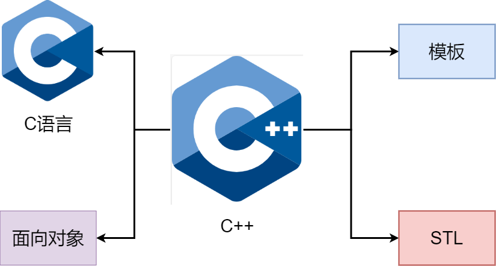

# 让自己习惯C++

## *条款1：将C++视做一个语言联邦*

### C++的四种子语言

今天的C++是一门多范式编程语言 Multiparadigm programming language，同时支持过程式 procedural、面向对象 object-oriented、函数式 functional、泛型 generic和元编程 metaprogramming 特性。这种能力和灵活性使C++成为无可比拟的工具，但也会引起一些混乱。这种混乱就是**似乎所有的“规范语法”规则都会有一些例外**

一种理解方法是将C++视做一个语言联邦，在每一种子语言中的语法规则不一定在另一种子语言中完全使用。C++主要有以下几种子语言

* C++的C语言部分：C++仍然是基于C的。块、语句、预处理器、内置数据类型、数组、指针等都来自于C。在许多情况下，C++提供的解决问题的方法优于C中的对应方法（比如[条款2：尽量以const、enum、inline替换 #define](#条款2)和[条款13：以对象管理资源](#条款13)），但当使用C++的C部分时，高效编程的规则反映了C语言相对有限的功能：没有模板，没有异常，没有重载等
* C++的面向对象部分：C++的这一部分就是C with Classes的全部内容，即类（包括构造函数和析构函数）、封装、继承、多态、虚函数（动态绑定）等。这是C++中面向对象设计的经典规则最直接适用的部分
* C++的模板部分：这是C++的泛型编程部分。事实上模板是如此强大，它们产生了一种全新的编程范式--模板元编程 template metadata programming TMP。[条款48](#条款48)提供了TMP的概述，但除非是一个铁杆模板迷，否则不必过于担心它。TMP的规则很少与主流C++编程交互
* C++的STL部分：STL是一个模板库，但它是一个非常特殊的模板库。它通过一些约定，很好地将容器、迭代器、算法和函数对象地融合在一起。使用STL时需要确保遵循它的约定

### 简单举例

**当在四种不同的子语言之间切换时，为了实现高效的编程需要遵守的规则是不同的**。下面举一个函数传递的例子

* 对于内置类型 built-in type，值传递通常比引用传递更高效
* 但在C++的面向对象部分时，用户定义构造函数和析构函数的存在意味着引用传递到常量通常更好
* 在C++的模板部分尤其如此，因为在那里，你甚至不知道正在处理的对象的类型
* 然而当进入STL时，迭代器和函数对象是基于C中的指针建模的，因此对于STL中的迭代器和函数对象，旧的C值传递规则再次适用

## *条款2：尽量以const、enum、inline替换 `#define`*

因为C的历史原因，`#define` 预处理仍然很常用

### 两种特殊情况

* 定义常量指针
* 类的专属常量

### 用内联代替宏

### 总结

考虑到const、枚举和内联的可用性，对预处理器（特别是 `#define`）的需求减少了，但并没有完全消除。`#include` 仍然是必不可少的，`#ifdef//#ifndef` 继续发挥避免 circular dependency 的重要作用

* 对于简单常量，首选const对象或枚举，而不是 `#define`
* 对于类似函数的宏，优先选择内联函数

## *条款3：尽可能使用const*

### const指针和函数声明

优秀的自定义类型需要与内置类型保持一致性

问题：乘法重载的时候不用传左值吧

### const限定成员函数

在成员函数上使用const

* 使类的接口意图更明确。知道哪些函数可以修改一个对象，哪些不能，这是很重要的
* 使得使用const对象成为可能

C++中成员函数可以根据是否可以通过this来修改对象可以分为两类（即是否有const修饰整个成员函数），并且分别重载

一般返回值是否设置为const &和this是否设置为const都是成对的。因为不能通过this来修改的时候，同样也不能通过返回的引用来修改

### 位常量与逻辑常量

### 避免const重载的代码重复

## *条款4：确定对象被使用前已先被初始化*

# 构造/析构/赋值运算

# 资源管理

## *条款13：以对象管理资源*

# 设计与声明

# 实现

# 继承与面向对象设计

# 模版与泛型编程

## *条款48：认识template元编程*

# 定制new和delete

# 杂项讨论