# Introduction

## *Java简介*

### Java发展简史

* 1991年Sun公司的Green项目：Sun公司的工程师想要开发一种小型的计算机语言，主要用于像有线电视转换盒这类消费设备。因为消费端的处理能力和内存都非常有限，所以这种语言必须非常小企鹅能够生成非常紧凑的代码，同时还要具有良好的跨平台能力。由于Sun公司的工程师都具有Unix背景，因此开发的语言以C++为基础。但由于后来发现智能化家电需求没那么高，Green项目被取消
* 1995年因为互联网的快速发展，Oak被重新改造。Gosling将这种语言命名为Oak，后来因为重名改名为Java
* 1996.1.23 Sun公司发布了Java的第一个JDK **Java 1.0**
* 1998.12.08 Java被拆分为 J2SE、J2EE、J2ME
* 2004.9.30 **Java 5.0**（从这时候开始省去了SE等缩写，Java指的就是SE版本）发布，产生了大量新的语言特性，版本号直接从1.4更新为5.0，平台也更名为JavaSE、JavaEE、JavaME
* 2006-2009 Sun公司被Oracle收购
* 2014.03.18 **Java 8.0 LTS** 发布，是第一个长期版本，之后以半年一次的速度开始更新版本
* 2018.09.25 **Java 11.0 LTS** 发布，JDK安装包取消独立的JRE安装包
* 2021.09 **Java 17.0 LTS** 发布

### Java技术体系平台

* JavaSE (Java Standard Edition) 标准版
  * 支持面向桌面级应用（如Windows下的应用程序）的Java平台，即定位个人计算机的应用开发
  * 包括用户界面接口AWT及Swing，网络功能与国际化、图像处理能力以及输入输出支持等
* JavaEE (Java Enterprise Edition) 企业版
  * 为开发企业环境下的应用程序提供的一套解决方案，即定位在服务器端的*Web*应用开发
  * JavaEE是JavaSE的扩展，增加了用于服务器开发的类库。如：Servlet能够延伸服务器的功能，通过请求-响应的模式来处理客户端的请求；JSP是一种可以将Java程序代码内嵌在网页内的技术
* JavaME (Java Micro Edition) 小型版：目前已被Android、ios等移动端设备淘汰
  * 支持Java程序运行在移动终端（手机、机顶盒）上的平台，即定位在消费性电子产品的应用开发
  * JavaME是JavaSE的内伸，精简了JavaSE 的核心类库，同时也提供自己的扩展类。增加了适合微小装置的类库：javax.microedition.io.*等

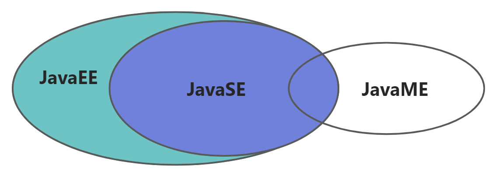

## *环境搭建*

### 什么是JDK和JRE

* JDK (SDK Software Developmemnt Kit; Java SDK -> JDK) 是Java程序开发工具，是用来编写Java程序时使用的软件工具箱。包含了JRE和开发人员使用的工具，即JDK=JRE+开发工具集
* JRE Java Runtime Environment：是Java程序的运行时环境，是运行Java程序的用户所需要的软件，所以Java 11.0 LTS之前如果只是要运行软件而不需要开发的话装一个JRE就够了。JRE包含了JVM和运行时所需要的核心类库，即JRE=JVM + JavaSE 标准类库

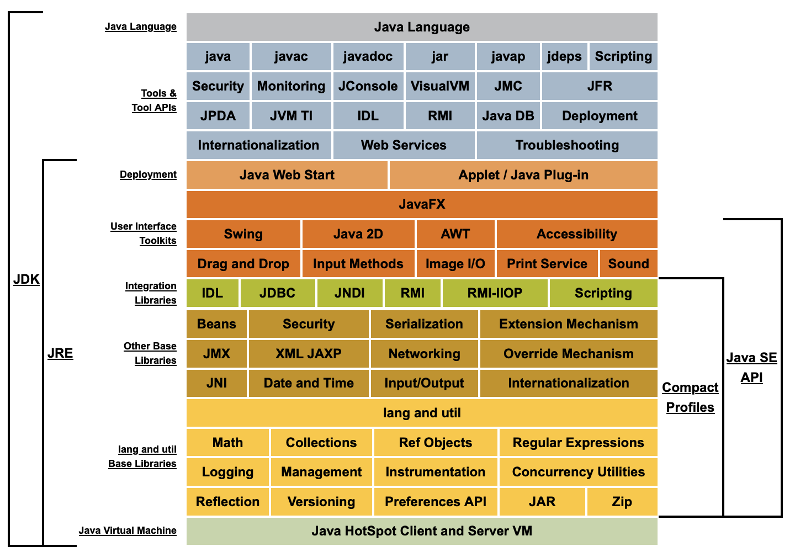

### 安装JDK

JavaSE 17不需要用户配置环境，它会自动配置

Mac中JDK的安装位置是 `/Library/Java/JavaVirtualMachines/jdk-17.jdk/Contents/Home/bin`

# 基础语法

## *helloworld*

```java
public class HelloWorld {
    public static void main(String[] args) {
        System.out.println("HelloWorld");
    }
}
```

### Java特点

* 类是构建所有Java程序和applet的构建块，Java程序的**所有内容都必须防止在类中**
* `.java` 源代码的文件名必须与公共类的名字相同（包括大小写）
* JVM会从指定类中的main方法的代码开始执行，因此源文件中必须包含一个main方法
  * Java中的所有函数都是类方法，因此main方法必须有一个外壳 shell 类
  * main方法和C++中的静态成员函数一样，属于类本身，不会对类中的对象进行操作，所以main方法必须声明为 `static`
  * `void` 表示main方法没有返回值
  * 根据Java语言规范，main方法必须声明为 `public`
* 跟C++一样，每条语句必须用分号结尾，代码块用 `{}` 限定，但是**嵌套的代码块中跨层不允许定义同名变量**

### 编译&run

* 用javac (java compiler) 编译器编译 `javac HelloWorld.java` 生成二进制字节码
* `java HelloWorld` 在JVM上run起来

### 注释

单行 `//` 和多行 `/**/` 跟C一样

文档注释：`/** */` 可以用javadoc工具解析生成说明文档 `javadoc -d mydoc -author -version HelloWorld.java`

```java
/**
@auther Weijian Feng
@version 1.0
*/
```

## *数据类型*

### 8种基本类型 primitive type

* 4种有符号整型
  * 1字节的 `byte`、2字节的 `short`、4字节的 `int`、8字节的 `long`（要加L声明），默认为int
  * Java没有无符号类型，但 `Byte`、`Integer` 和 `Long` 类中还是提供了转换为无符号的方法
  * 因为运行在JVM上，整型的范围与机器无关
* 2中有符号浮点数：4字节的 `float` 和8字节的 `double`，默认为double
* 1字节的char，用单引号引用
  * char用来描述UTF-16编码中的一个代码单元 code unit
  * 强烈建议不要使用char类型，除非确实需要描述UTF-16的一个代码单元。最好用String类来描述
* 1种表示真值的boolean：注意和C++中的不同之处为**boolean不能与整型值相互转换**，即0为 `false`，非0为 `true`，因此不能用 `x==0` 作为 if 的判断条件

### 引用类型

Java的引用实际上是对“指针”的一个封装

* 数组
* 类

### 类型转换

* 隐式类型转换

  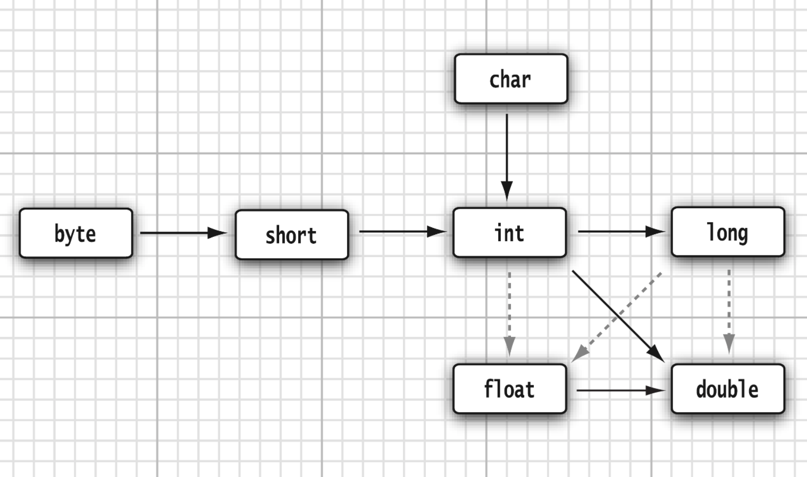

  * 实线表示无信息丢失的转换
  * 虚线表示有精度损失的转换

* 强制类型转换 cast：和C++一样使用 `()` 来进行强制转换，注意：不要对整型和boolean进行强制类型转换

### 确定的移位操作符

C标准中没有规定 `>>` 到底是逻辑移位还是算术移位，Java为了支持跨平台性消除了这种不确定性

`>>` 是算术移位，高位补0；`>>>` 是逻辑移位，高位补符号位；左移为算术移位，不存在 `<<<` 

## *变量和常量*

### 变量

Java中不像C++那样需要用 `extern` 来区别是声明还是定义，一律称为声明。不过其他的规则大致都相同

从Java 10开始，对于**局部变量**，可以使用 `var` 关键字来通过变量的初始值来自动推导变量类型，不需要再显式声明变量类型

```java
var someNum = 12; //someNum会被推导为int
var someString = "hello"; //someString会被推导为String
```

### 常量

Java用 `final` 关键字来声明常量，final的意思很明确，那就是常量只能被赋值一次，之后就不能更改了。但是如果用 `final` 修饰了类属性的话，类就不会提供默认构造了，需要自己显式给构造函数。

Java中的习惯是用全大写来命名常量。要注意的是，`const` 也是Java保留的关键字，但它几乎不被使用

和C++一样，用 `staic` 来将常量声明为静态常量/类常量 class constant，类常量要声明在main的外面；同时若它被声明为public，那么其他类也能使用这个常量

常量还包括枚举类型 enum

```java
enum Size {
	SMALL,
    MEDIUM,
    LARGE,
    EXTRA_LARGE;
}
Size s = Size.Medium
```

枚举也是个特殊的类，它继承自Enum，所以也可以自己定义构造函数，添加需要的属性

枚举类不能创建对象，它的对象是由JVM内部自行创建，而不是用户显式new创建

```java
enum City {
    BEIJING("北京", 1001),
    SHANGHAI("上海", 1002);
    City(String name, int code) {
        this.name = name;
        this.code = code;
    }

    public String name;
    public int code;
}
```

下面的实现等同于enum。static是因为支持用类名来取，final是因为虽然用public外面可以取到类属性，但是外面不可以改类属性

```java
class MyCity {
    public String name;
    public int code;

    private MyCity(String name, int code) {
        this.code = code;
        this.name = name;
    }

    public static final MyCity BEIJING = new MyCity("北京", 1001);
    public static final MyCity SHANGHAI = new MyCity("上海", 1002);
}
```


## *数组*

### 数组的声明

```java
int[] arr; //推荐
int arr[]; //不推荐
int arr[][]; //二维
```

数组的声明，需要明确

* 数组的维度：在Java中数组的符号是 `[]`，`[]`表示一维，`[][]`表示二维
* 数组的元素类型：即创建的数组容器可以存储什么数据类型的数据。元素的类型可以是任意的Java的数据类型。例如：int、String、Student等
* 数组名：就是代表某个数组的标识符，数组名其实也是变量名，按照变量的命名规范来命名。数组名是个引用数据类型的变量，因为它代表一组数据
* 数组是引用类型，默认值为null

Java声明数组时不能指定其长度（数组中元素的个数）！

### 静态初始化

声明并没有真正初始化一个数组，要用new操作符创建数组

* 如果数组变量的初始化和数组元素的赋值操作同时进行，那就称为静态初始化
*  静态初始化，本质是用静态数据（编译时已知）为数组初始化。此时数组的长度由静态数据的个数决定

```java
int[] arr = new int[]{1,2,3,4,5};//正确 
//或 
int[] arr; 
arr = new int[]{1,2,3,4,5};//正确
//或
int[] arr = {1,2,3,4,5};//正确

//int[] arr;
//arr = {1,2,3,4,5};//错误
```

### 动态初始化

* 数组变量的初始化和数组元素的赋值操作分开进行，即为动态初始化。
* 动态初始化中，只确定了元素的个数（即数组的长度），而元素值此时只是默认值，还并未真正赋自己期望的值。真正期望的数据需要后续单独一个一个赋值
* **注意：数组有定长特性，长度一旦指定，不可更改***

```java
int[] arr = new int[5];
int[] arr; arr = new int[5];
//int[] arr = new int[5]{1,2,3,4,5}; //错误的，后面有{}指定元素列表，就不需要在[]中指定元素个数了
```

## *控制流*

Java的控制流和C++基本上一样，但有以下几个区别

* Java中没有goto语句，但是break是可以带标签的，可以利用它从内层循环跳多层，而不是只能跳一层
* 多了一种范型for循环/for each循环

### 分支控制

* if

  ```java
  if (condition) { statement; }
  else if (condition) { statement; }
  else { statement; }
  ```

* switch

  ```java
  switch (choice):
  {
      case 1:
      	//
      	break;
      case 2:
      	//
      	break;
      //
      default:
      	//
      	break;
  }
  ```

### 循环

* while

  ```java
  while (coindtion) { statement; }
  ```

* do-while

* for

  ```java
  for (initilization; condition; increment) { statement; }
  ```

# 对象与类

## *声明与实例化*

### 声明

```java
AccessModifier class ClassName{
    Attributes declaration;
    Method declaration;
}
```

封装：访问修饰符 access modifier 用于控制程序的其他部分对这段代码的访问级别

### 实例化

对象 object：用new来实例化类

栈存储方法（方法运行的栈帧）和变量（基本类型），对存储new出来的引用对象

元空间存储类的信息

在栈上声明一个标识符，先去元空间（也称为方法区）上找类的信息看有没有相关的对象，有的话就在堆上new一个然后让栈上的标识符引用堆上的地址。因此数组和类都称为引用数据类型

特殊的对象：空对象是没有引用的对象，没有在堆上new对象，只是在栈上有一个标识符

```cpp
ClassName object = null; //空对象
```

### 属性

属性支持缺省参数，然后可以通过初始化列表覆盖吗？

## *方法*

Java中所有函数都是类方法

### 可变参数

当参数的个数不确定，但是类型相同时，可以采用可变参数

```java
void test(String... name) {}
```

若参数还有其他含义的参数，那么可变参数应该放到最后

```java
void test(int ID, String... name) {}
```

### 引用与传参类型

Java不存在引用传递 passed by reference，而是**全部采用按值传递 passed by value**，函数得到的是参数的拷贝，不能修改传递给它的参数变量的内容

Java中的引用类型是一种特殊的类型，它不同于基本数据类型（如int、float、double等），而是用于指向对象（Object）的地址。在Java中，对象的内存分配是在堆上进行的，因此**引用类型变量实际上是存储了指向对象在堆上的地址的变量**。Java程序中的所有对象都必须通过引用来访问，而不能直接访问它们的内存地址

而C语言中的指针是一个变量，它存储了某个数据类型的内存地址。与Java中的引用类型类似，指针允许程序间接地访问内存中的数据。但是，与Java中的对象不同，C语言中的数据可以存储在堆上、栈上或全局数据区中。**暂时可以把Java的引用类型理解为对地址的封装？**

注意：C++的lvalue reference与Java的reference完全是两个概念

```c++
//C++通过左值引用来swap的经典程序
void swap(int& xr, int& yr)
{
    int tmp = xr; //临时变量tmp放在了寄存器里
    xr = yr; //不能是内存到内存的直接操作，要放到一个寄存器里
    yr = tmp;
}
```

下面来看Java的实验

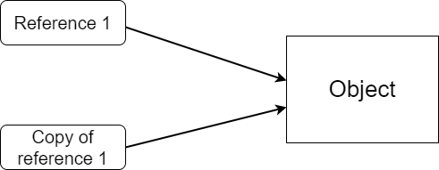

总结一下：Java都是传值传参，得到reference的拷贝，所以若是通过指向同一object的reference来修改attribute，是可以成功修改对象的

### 重载 overload

函数重载规则和C++一样

## *静态字段与静态方法*

### 代码块

静态代码块：类的信息加载完成后，会自动触发，可以完成静态属性的初始化功能。静态代码块可以声明多个，按照声明顺序依次执行

还可以添加创建对象的代码块，每次实例化就会调用

```java
class User {
    static {
        // 静态代码块
    }
    static void test() {}
    
    void test() {}
    {
        // 创建对象（实例化）代码块
    }
}
```

### 静态方法

和对象无关，只和类相关的属性和方法称之为静态属性和静态方法，用 `static` 来表示

静态属性存在元空间中

先有类，再有对象：成员方法可以访问静态属性和静态方法，但静态方法不可以访问成员属性和成员方法，所以main类如果想要定义并使用其他方法也要把它设置为static

```java
class Bird {
	static String type = "Bird";
    static void fly() {
    	System.out.println("flying...");
    }
}

Bird.fly(); //直接通过类名访问
```

## *构造*

构造方法基本和C++相同，和C++一样，构造函数都得是public的，用来取类属性

C++最好用初始化列表来构造，而Java则推荐用有参的内部构造

### 默认构造和无参构造

若在Java类中**显式**定义了一个构造函数，则Java编译器将**不再**生成默认构造函数。默认构造函数是没有参数的构造函数，如果没有显式定义构造函数，则Java编译器会在类中自动创建一个默认构造函数

JVM默认给类提供的构造方法是public无参构造方法。整形默认初始化为0，浮点数为0.0，引用类型为null，boolean为false

因此若没有构造器，就不能写成第一行，因为 `Person()` 相当于在调用Person类的构造器

```java
// Person p = new Person(3);
// 而是要写成
Person p = new Person();
Person.id = 3; //显式赋值
```

和C++不同，Java实例化的时候new后面必须要加`()`，因为这表示它是在调用构造函数

无参构造就是自定义一些非默认值

```java
class Person {
    Person() { //无参构造
        id = 1;
    }
}
```

### 有参的内部构造

```java
public class TimeSlot {
	// TODO: implement according to problem statement
    private LocalTime startTime;
    private LocalTime endTime;

    public TimeSlot(LocalTime startTime, LocalTime endTime) {
        this.startTime = startTime;
        this.endTime = endTime;
    }
}
```

### 显式字段初始化

显示字段初始化就是C++的缺省参数，在定义class的时候给所有类的某个属性以同一个值

### 调用另一个构造器

```java
public class Person {
    private String name;
    private int age;

    public Person() {
        this("John Doe", 30);
    }

    public Person(String name) {
        this(name, 30);
    }

    public Person(String name, int age) {
        this.name = name;
        this.age = age;
    }

    // getters and setters...
}
```

在上面的示例中，`Person`类有三个构造函数，其中第一个构造函数没有参数，第二个构造函数有一个`name`参数，第三个构造函数有两个参数`name`和`age`。在第一个和第二个构造函数中，使用`this`关键字调用第三个构造函数来初始化`name`和`age`属性。在第三个构造函数中，直接将`name`和`age`参数的值分配给类的私有属性

使用`this`关键字调用其他构造函数时，必须确保在调用构造函数之前没有执行其他语句，否则编译器会报错。另外，如果使用`this`调用另一个构造函数，则不能使用`super`关键字

### 初始化块

初始化块 initialization block 类似C++里的初始化列表，走的顺序也一样，类属性声明（若有缺省值就直接初始化）`->` 初始化块赋值 `->` 构造函数内部赋值（若有的话）

初始化化可以有任意多个，只要构造这个类的对象，这些块就会被执行

### 析构

Java中没有析构函数。一旦对象有资格进行垃圾收集，也就是说，一旦它的工作完成，并且没有指向它的活动引用，垃圾收集器就会从对象中回收内存。垃圾收集器是JVM的一部分

## *包*

### package

Java的包机制类似于C++中的命名空间 namespace 特性，可以认为Java的package和import语句类似于C++中的namespace和using指令

```java
package 完整路径;
```


包 package的主要功能是用于分类管理

package是java的关键字，后面跟的名称表示从属于哪一个包，也就是把当前类定义在某个包里面。如果没有写package，那么所有类都是放在default package里面的，即 `java.lang`

import一定要写在package后面

如果import了不同路径的相同名称的类，还是要在使用时增加包名防止冲突


包名为了区分类名（类名大写），所以一般package都是小写

JVM会自动导入 `java.lang` 中的类，所以可以直接使用String，因为JVM自动导入了 `java.lang.String`

## *JAR文件*

JAR文件使用ZIP格式压缩

## *String类*

# OOT设计

## *抽象类*

只有声明没有实现的方法称为抽象方法

```java
abstract class Person {
    public abstract void eat();
}
```

抽象类不完整，不可以直接构造对象

若类中含有抽象方法，那么这个类是抽象类；若类是抽象类，它的方法不一定是抽象方法

让抽象类不断变得具体的方法是通过不断继承。虽然抽象类无法直接构造对象，但是可以通过子类简介构建对象

若抽象类中含有抽象方法，当子类继承抽象类时，需要重写抽象方法，将方法补充完整

 `final` 不能和 `abstract`一块用


在抽象类中可以有构造方法，只是不能直接创建抽象类的实例对象，但实例化子类的时候，就会初始化父类，不管父类是不是抽象类都会调用父类的构造方法


## *封装*

java的源码中，最外层的public公共类只能有一个，而且必须要和源码文件名相同

main方法也是public的，main方法是由JVM调用的，JVM调用时应该可以任意调用，而不用考虑权限问题

同时main也是static的，如果不是static，就要JVM构建对象才能调用

### 访问权限

权限从1-4逐渐增大

1. private：私有，只有类内可以使用
2. default：默认权限，不设定任何权限时JVM会默认提供包权限，比如说 `String name` 没有指明权限，给的就是默认权限
   * 包权限只有同一个包才能调用，子包也不用。也就是说一定要路径完全相同的包内才能用
   * 若想要在不同包之间import后调用，就要放到public里
3. protected：受保护权限，子类可以访问
4. public：公有，任意使用


### 内部类

Java不允许外部类只允许声明为public（而且只有一个）或default，所谓的外部类，就是在源码中直接声明在最外面的类

内部类就当成是外部类的属性来使用

因为内部类可以看作是外部类的属性，所以需要构建外部类才可以使用

```java
public class Test {
    public static void main(String[] args) {}

    OuterClass outer = new OuterClass();
    OuterClass.InnerClass inner = outer.new InnerClass();
}

class OuterClass {
    public class InnerClass {}
}
```

### 单例模式

```java
class User {
    private static User user = null;
    private User() {
    
    }
    public static User getInstance() {
        if (user == null) {
            user = new User();
        }
    }
    return new User();
}
```


## *继承*

### 和C++中的差异

* Java中所有的继承都是公共继承，没有C++中的私有和保护继承
* Java中只有单继承，没有多继承，所以不存在菱形继承的问题。当然父类是可以有多个子类的
* Java中用super关键字来调用父类的构造器和属性等，而C++则用域操作符来指明父类

### 定义

```java
class Parent {}
class Child extends Parent {} //extends关键字用来继承
```

若父类和子类有相同的属性，可以使用super和this区分，super表示父类，this表示子类（默认调用this）

静态方法中不能使用super和this

在new子类对象的时候并没有创建对应的父类对象，但是子类仍然拥有父类的属性和方法

### 子类构造器

默认情况下，子类对象构建时，会默认调用父类的构造方法来完成父类对象的创建，使用的是super方式，只不过是由JVM自动完成的。若父类是有自定义的构造方法的话，那么子类就需要通过super显式构造

super调用父类构造器必须是子类构造器的第一条语句

```java
class Parent{
    String username;

    Parent(String name) {
        username = name;
        System.out.println("parent...");
    }
}

class Child extends Parent {
    Child() {
        super("zhang3");
        System.out.println("child");
    }
}
```


## *多态*

```java
class Person {
    void testPerson() {
        System.out.println("test Person...");
    }
}
class Boy extends Person {
    void testBoy() {
        System.out.println("test Boy...");
    }
}
class Girl extends Person {
    void testGirl() {
        System.out.println("test Girl...");
    }
}
```

子类可以通过super来调用父类被重写的方法

方法重写要求：子类的方法和父类的方法，方法名相同，返回值类型相同，多参数列表也要相同

`final` 可以用来修饰父类方法，这个方法不能被子类重写；`final` 也可以修饰类，这个类就没有子类了

`final` 不可以修饰构造方法，因为构造方法不可能被子类重写，加了没有意义

`final` 可以修饰方法的参数，一旦修饰参数很不能被修改

## *Object超类*

Java中所有的类默认都会以 `java.lang.Object` 作为父类。也就是说当没有明确父类的时候，自动继承Object

```java
class User extends Obejct {} //等价于 class User {}
```

`obj.toString()` 将对象转换成字符串，默认打印的就是对象的内存地址（十六进制），可以重写

`obj.hashCode()` 获取对象的内存地址（十进制）

`obj.equals()` 判断两个对象是否相等，若相等返回true，否则返回false。比较对象时，默认比较内存地址

`obj.getClass()` 获取对象的类型信息

# 接口、lambda表达式与内部类

## *接口*

接口可以理解为规则，接口是抽象的，规则的属性必须为固定值，而且不能修改。属性和行为的访问权限必须为公共的，属性应该是静态的，行为应该是抽象的

```java
interface 接口名称 { 规则属性 }
```

接口和类是两个层面的东西，接口可以继承自其他接口，类的对象需要遵循接口（实现 implements），类需要实现接口，且可以实现多个接口

```java
interface Person {
    public void eat();
}
class Student implements Person{
    public void eat() {
        //...
    }
}
```

### 接口与抽象类

**相同点**

（1）都不能被实例化 （2）接口的实现类或抽象类的子类都只有实现了接口或抽象类中的方法后才能实例化。

**不同点**

（1）接口只有定义，不能有方法的实现，java 1.8中可以定义default方法体，而抽象类可以有定义与实现，方法可在抽象类中实现。

（2）实现接口的关键字为implements，继承抽象类的关键字为extends。一个类可以实现多个接口，但一个类只能继承一个抽象类。所以，使用接口可以间接地实现多重继承。

（3）接口强调特定功能的实现，而抽象类强调所属关系。

（4）接口成员变量默认为public static final，必须赋初值，不能被修改；其所有的成员方法都是public、abstract的。抽象类中成员变量默认default，可在子类中被重新定义，也可被重新赋值；抽象方法被abstract修饰，不能被private、static、synchronized和native等修饰，必须以分号结尾，不带花括号。

### 匿名类

在某些场合下，类的名字不重要，只是想使用类中的方法或功能，那么此时可以采用特殊的语法：匿名类。匿名类就是没有名字的类

# 范型

# 常用类和集合


## *包装类*

优化基本数据类型的处理

Byte、Short、Integer、Long、Float、Double、Character、Boolean

```java
int i = 10;
//Integer i1 = Integer.valueof(i); //不建议这么做
//自动装箱
Integer i1 = i; //这种操作很频繁，这么写的时候JVM会自动将这个语句转换成上面的语句

//自动拆箱
int i2 = i1;
```

## *集合*

根据数据的不同，Java的集合分为2大体系

* 单一数据体系：Collection接口定义了相关的规则
* 成对出现的数据体系：键值对数据

# UML

Unified Modeling Language 统一建模语言

> UML是一种开放的方法，用于说明、可视化、构建和编写一个正在开发的、面向对象的、软件密集系统的制品的开放方法。UML展现了一系列最佳工程实践，这些最佳实践在对大规模，复杂系统进行建模方面，特别是在[软件架构](https://zh.wikipedia.org/wiki/软件架构)层次已经被验证有效 -- Wikipedia

## *分类*

UML2.2定义了14种类图

* 结构型图形 structure diagram 强调的是系统式的建模
  * 静态图 static diagram
    * 类图
    * 对象图
    * 包图
  * 实现图 implementation 
    * 组件图
    * 部署图
  * 剖面图
  * 复合结构图
* 行为式图形 behaviour diagram 强调系统模型中触发的事件
  * 活动图
  * 状态图
  * 用例图
* 交互式图形 interaction diagram 属于行为图形的子集合，强调系统模型中的资料流程
  * 通信图
  * 交互概述图
  * 时序图
  * 事件图

## *类图*

30分钟学会UML类图 - 肖继潮的文章 - 知乎 https://zhuanlan.zhihu.com/p/109655171

UML绘制：https://www.planttext.com

UML Class Diagram Tutorial：https://www.visual-paradigm.com/guide/uml-unified-modeling-language/uml-class-diagram-tutorial/;WWWSESSIONID=155970796B4B5C5AA833E9DF81911DA5.www1

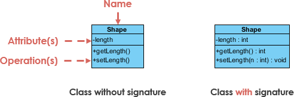

第一行是名字，第二行是属性，第三行是方法

* `+` 表示public
* `-` 表示private
* `#` 表示protected
* `~` 表示default/package

### 类图中具体类、抽象、接口和包的表示法

下面是几种类图元素

* 表示具体类

  ```java
  public class Hourly {
      private double hourlyRate;
      private double hoursWorkded;
      public double computePay(double hourlyWorked);
  }
  ```

  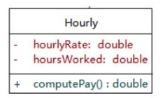

* 表示抽象类：抽象类在UML类图中同样用矩形框表示，但是抽象类的类名以及抽象方法的名字都用斜体字表示

  ```java
  public abstract class Employee {
      private String address;
      private String name;
      private int number;
      public abstract double computePay() {}
      public void mailCheck() {}
  }
  ```

  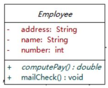

* 表示接口：接口在类图中也是用矩形框表示，但接口在类图中的第一层顶端用 `<<interface>>`表示，而且只有方法

  ```java
  public interface Shape {
      public double computeArea();
      public double computePerimeter();
  }
  ```

  

  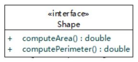

* 表示包

### 在类图中表示关系

类和类、类和接口、接口和接口之间存在关系

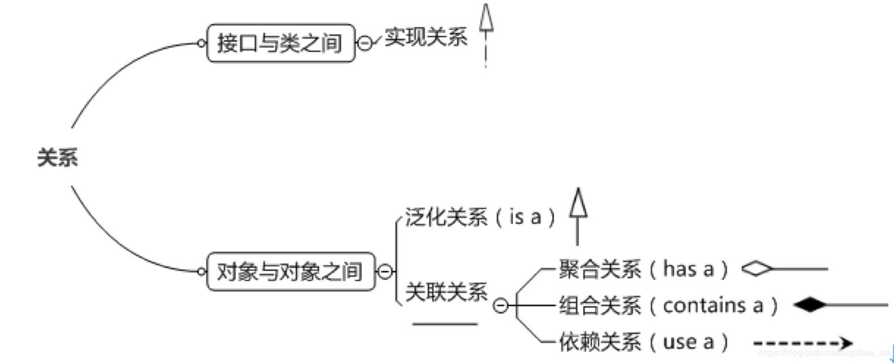

* 实现关系 Implementation
  * 实现关系是指接口及其实现类之间的关系
  * Java中实现关系可以直接翻译为关键字 `implements`

* 泛化关系 Generalization
  * 对象与对象之间的继承关系 "is-a"
  * Java中对象之间的泛化关系可以直接翻译为关键字 `extends`

* 关联关系 Association
  * 对象和对象之间的连接，它使一个对象知道另一个对象的属性和方法
  * 在Java中，关联关系的代码表现形式为一个对象含有另一个对象的引用

* 依赖关系 Dependency "use a "
* 聚合关系 Aggregation "has-a" ：没有整体，部分可以独立存在
* 组合关系 Composition：没有整体，部分不可以独立存在
  * Multiplicity 允许设置数字约束


## *用例图*

## *组件图*

组件图 Component group 描绘了系统中组件提供的、需要的接口、端口等，以及它们之间的关系

## *部署图*

## *活动图*

# 异常

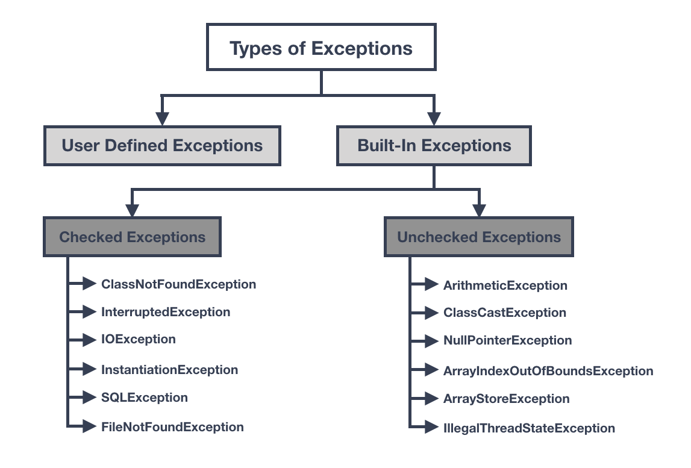

Error类里面保存了大量的错误场景

Java中异常分类2大类

* 可以通过代码恢复正常逻辑执行的异常，称之为运行期异常 RuntimeExceptoion
* 不可以通过代码恢复的异常，称之为编译期异常 Exception

范围最大的是Exception，RuntimeException继承了Exception

## *异常处理*

捕捉多个异常的时候，需要先捕捉范围小的异常，然后再捕捉范围大的异常

```java
try {
    可能出现异常的代码，若出现异常门JVM会将遗产个进行封装形成一个具体的异常类，然后将这个异常抛出
}
catch ( 抛出的异常对象 对象引用 ) {
    异常的解决方案
}
catch () {}
finally {
    最终执行的代码逻辑
}
```


```java
int i = 0;
try {
	int j = 10 / i;
} catch (ArithmeticException e) {
    e.getMessage(); //错误的信息
    e.printStackTrace(); //打印栈信息
} finally {
    System.out.println("最终执行的代码")
}
```


# IO

# 并发

```java
Thread.currentThread().getName(); //Thread是线程类；currentThread用于获取当前正在运行的线程；getName用于获取线程的名称
```

默认都是在main线程（主线程）中执行


```java
public class test {
    public static void main() {
        Thread t = new Thread(); //创建线程
		t.start(); //启动线程
    }
}
```

自定义线程类

```java
class MyThread extends Thread {
	public void run() {
        System.out.println(Thread.currentThread().getName());
    }
}
```

## *线程状态*

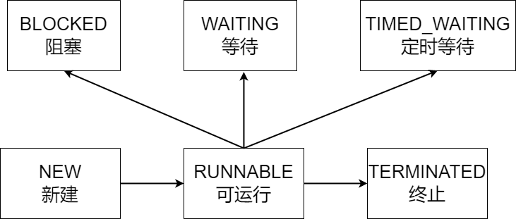

NEW 新建 -> RUNNABLE 可运行 -> TERMINATED 终止 

## *程池*

# 网络

java.net 包中 J2SE 的 API 包含有类和接口，它们提供低层次的通信细节。可以直接使用这些类和接口，来专注于解决问题，而不用关注通信细节

java.net 包中提供了TCP和UDP两种常见的网络协议的支持


## *UDP*

### Client

```java
import java.io.*;
import java.net.*;

public class SimpleUDPClient {
   public static void main(String[] args) {
      try {
         // 创建一个DatagramSocket用于发送UDP数据报
         DatagramSocket socket = new DatagramSocket();

         // 创建一个InetAddress对象表示服务器的IP地址
         InetAddress serverAddress = InetAddress.getByName("127.0.0.1");

         // 创建一个DatagramPacket并设置数据和服务器地址
         String message = "Hello, server!";
         byte[] data = message.getBytes();
         DatagramPacket packet = new DatagramPacket(data, data.length, serverAddress, 8888);

         // 发送UDP数据报
         socket.send(packet);
         System.out.println("Message sent to server: " + message);

         // 关闭套接字
         socket.close();
      } catch (IOException e) {
         e.printStackTrace();
      }
   }
}
```

这个代码使用了Java中的`DatagramSocket`类来创建一个UDP套接字，并使用该套接字向指定的IP地址和端口号发送数据。首先，它使用`getByName()`方法创建一个表示服务器IP地址的`InetAddress`对象

然后，它使用一个字符串构造器创建要发送的数据，将其转换为字节数组，并创建一个`DatagramPacket`对象，该对象包含要发送的数据和服务器的地址和端口号

接下来，它使用`send()`方法将数据报发送到服务器，并打印出已发送的消息。最后，它关闭了套接字

在这个简单的示例中，我们同样使用了`try-catch`块来捕获可能抛出的`IOException`异常。此外，在UDP通信中，数据报的大小有限制，因此我们需要根据实际情况设置适当的数据报大小

### Server

```java
import java.io.*;
import java.net.*;

public class SimpleUDPServer {
   public static void main(String[] args) {
      try {
         // 创建一个DatagramSocket用于接收UDP数据报
         DatagramSocket socket = new DatagramSocket(8888);
         System.out.println("Server listening on port 8888...");

         while (true) {
            // 创建一个DatagramPacket对象用于接收数据
            byte[] buffer = new byte[1024];
            DatagramPacket packet = new DatagramPacket(buffer, buffer.length);

            // 接收UDP数据报
            socket.receive(packet);
            System.out.println("Message received from client: " + new String(packet.getData()));

            // 向客户端发送响应数据
            String response = "Hello, client!";
            byte[] data = response.getBytes();
            DatagramPacket responsePacket = new DatagramPacket(data, data.length, packet.getAddress(), packet.getPort());
            socket.send(responsePacket);
            System.out.println("Response sent to client: " + response);
         }
      } catch (IOException e) {
         e.printStackTrace();
      }
   }
}
```

这个代码使用了Java中的`DatagramSocket`类来创建一个UDP服务器，并使用该服务器监听指定的端口。然后，它使用一个无限循环来接收来自客户端的数据报

在每次接收数据报后，它使用`getData()`方法获取数据，并打印出来。接下来，它使用数据报中的客户端地址和端口号创建一个新的数据报，并将其发送回客户端

在这个简单的示例中，我们同样使用了`try-catch`块来捕获可能抛出的`IOException`异常。注意，在UDP通信中，数据包的大小有限制，因此我们需要根据实际情况设置适当的数据包大小。同时，由于UDP是一种无连接的通信协议，因此服务器无法事先知道客户端的地址和端口号，需要在接收到数据包后从中获取

## *TCP*

### Client

```java
import java.io.*;
import java.net.*;

public class SimpleTCPClient {
   public static void main(String[] args) {
      try {
         // 创建一个套接字并连接到指定的IP地址和端口号
         Socket socket = new Socket("127.0.0.1", 8888);

         // 获取输出流并向服务器发送数据
         OutputStream out = socket.getOutputStream();
         String message = "Hello, server!";
         out.write(message.getBytes());

         // 获取输入流并读取服务器的响应
         InputStream in = socket.getInputStream();
         byte[] buffer = new byte[1024];
         int length = in.read(buffer);
         String response = new String(buffer, 0, length);
         System.out.println("Server response: " + response);

         // 关闭套接字和流
         out.close();
         in.close();
         socket.close();
      } catch (IOException e) {
         e.printStackTrace();
      }
   }
}
```

这个代码使用了Java中的`Socket`类来创建一个TCP套接字，并使用该套接字连接到指定的IP地址和端口号。然后，它使用套接字的`getOutputStream()`方法获取输出流，并使用`write()`方法向服务器发送数据。

接下来，它使用套接字的`getInputStream()`方法获取输入流，并使用`read()`方法从服务器读取响应数据。最后，它关闭了套接字和相关的流。

在这个简单的示例中，我们还使用了`try-catch`块来捕获可能抛出的`IOException`异常。这是因为在网络通信中，许多错误情况都可能导致`IOException`异常的抛出，例如连接失败、数据传输中断等等。因此，我们需要捕获这些异常并进行适当的处理

### Server

```java
import java.io.*;
import java.net.*;

public class SimpleTCPServer {
   public static void main(String[] args) {
      try {
         // 创建一个ServerSocket并监听指定的端口
         ServerSocket serverSocket = new ServerSocket(8888);
         System.out.println("Server listening on port 8888...");

         while (true) {
            // 接受客户端的连接请求
            Socket socket = serverSocket.accept();
            System.out.println("New client connected: " + socket.getRemoteSocketAddress());

            // 获取输入流并读取客户端发送的数据
            InputStream in = socket.getInputStream();
            byte[] buffer = new byte[1024];
            int length = in.read(buffer);
            String message = new String(buffer, 0, length);
            System.out.println("Client message: " + message);

            // 向客户端发送响应数据
            OutputStream out = socket.getOutputStream();
            String response = "Hello, client!";
            out.write(response.getBytes());

            // 关闭套接字和流
            out.close();
            in.close();
            socket.close();
         }
      } catch (IOException e) {
         e.printStackTrace();
      }
   }
}
```

这个代码使用了Java中的`ServerSocket`类来创建一个TCP服务器，并使用该服务器监听指定的端口。然后，它使用一个无限循环来接受客户端的连接请求

在每次接受连接后，它使用`accept()`方法获取客户端的套接字，并打印出客户端的地址。然后，它使用套接字的`getInputStream()`方法获取输入流，并使用`read()`方法从客户端读取数据

接下来，它使用套接字的`getOutputStream()`方法获取输出流，并使用`write()`方法向客户端发送响应数据。最后，它关闭了套接字和相关的流，并等待下一次客户端连接

在这个简单的示例中，我们同样使用了`try-catch`块来捕获可能抛出的`IOException`异常。此外，在每次接受连接后，我们使用了一个独立的线程来处理客户端的请求，以保持服务器的响应能力
