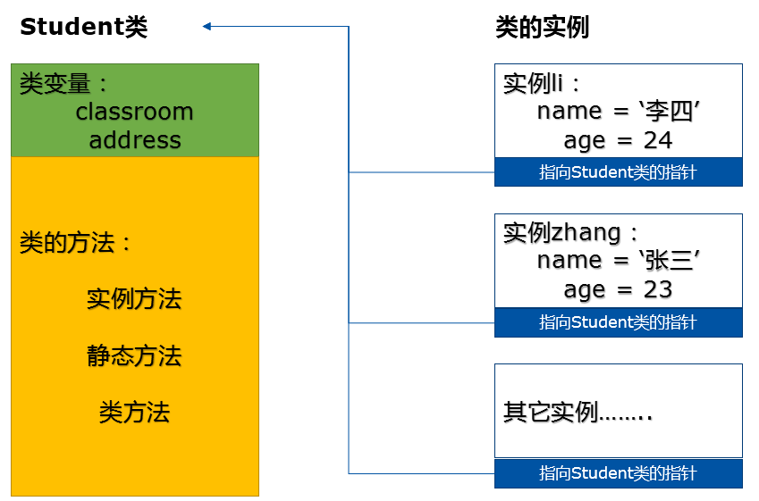
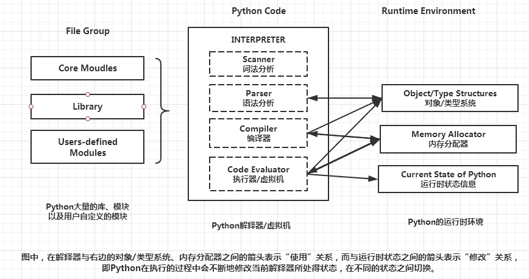

[Python最佳实践指南！ — The Hitchhiker's Guide to Python (pythonguidecn.readthedocs.io)](https://pythonguidecn.readthedocs.io/zh/latest/)


# Python虚拟环境 & 包管理器

## *pip*

pip 是 Python 的包管理工具，用于安装和管理 Python 包（也称为模块或库）。它是 Python Package Index（PyPI）上的软件包仓库的客户端工具，允许用户轻松地下载、安装、升级和卸载 Python 包

pip需要结合virtualenv或vene虚拟环境管理工具一起使用

### **安装pip**

* 在 Python 3.4 及更高版本中，`pip` 已经内置，无需额外安装

* 在较早的 Python 版本中，可能需要手动安装 pip

  ```cmd
  python -m ensurepip --default-pip
  ```

在用户级别进行安装，而不是系统级别，通常使用 `--user` 选项。这样可以避免需要管理员权限

### **基本命令**

* `pip install <package>`：安装指定的 Python 包

  * pip 能够自动解析和安装包的依赖项，确保所有必需的库和模块都被正确安装

  * pip 可以进行版本控制，即允许用户指定要安装的包的特定版本，以确保项目的稳定性

    ```cmd
    pip install SomePackage==1.0.4
    ```

* `pip uninstall <package>`：卸载指定的 Python 包

* `pip freeze`：列出当前环境中安装的所有包及其版本

* `pip list`：以更简洁的格式列出已安装的包

* `pip show <package>`：显示有关指定包的详细信息

* `pip search <keyword>`：搜索 PyPI 上的包

## *virtualenv & venv*

考虑到虚拟环境的重要性，Python 从3.3 版本开始，自带了一个虚拟环境模块 [venv](https://cloud.tencent.com/developer/tools/blog-entry?target=https%3A%2F%2Fdocs.python.org%2F3%2Flibrary%2Fvenv.html&source=article&objectId=2124483)，关于该模块的详细介绍，可参考 [PEP-405](https://cloud.tencent.com/developer/tools/blog-entry?target=http%3A%2F%2Flegacy.python.org%2Fdev%2Fpeps%2Fpep-0405%2F&source=article&objectId=2124483) 。它的很多操作都和 virtualenv 类似。如果使用的是python3.3之前版本或者是python2，则不能使用该功能，依赖需要利用virtualenv进行虚拟环境管理

### virtualenv

virtualenv 是一个创建隔绝的Python环境的 工具。virtualenv创建一个包含所有必要的可执行文件的文件夹，用来使用Python工程所需的包

```cmd
pip install virtualenv
```

### venv

## *conda*

Conda是一个用于管理和部署软件包的开源包管理工具和环境管理器，Conda可以帮助用户创建、管理和切换不同的Python环境，并安装各种软件包，使得项目之间的依赖关系更加清晰和可管理

用zsh安装sh可能会有问题，这时候可以换用bash安装

安装conda [Miniconda — Anaconda documentation](https://docs.anaconda.com/free/miniconda/)

### 使用

* 创建和管理环境

  * 使用Conda可以轻松创建新的Python环境，例如：

    ```cmd
    $ conda create --name myenv python=3.8
    ```

    这将创建一个名为 "myenv" 的新环境，并指定Python版本为3.8

  * 激活环境：

    ```cmd
    $ conda activate myenv
    ```

    激活环境后可以在其中安装软件包，运行Python脚本等

  * 退出环境：

    ```cmd
    $ conda deactivate
    ```

* 安装和管理软件包

  * 使用Conda可以轻松安装、更新和删除软件包，例如：

    ```cmd
    $ conda install numpy
    ```

    这将安装名为 "numpy" 的Python包

  * 更新软件包：

    ```cmd
    $ conda update numpy
    ```

  * 删除软件包：

    ```cmd
    $ conda remove numpy
    ```

* 创建环境文件

  * 可以通过创建一个环境文件（例如environment.yml）来定义项目的环境依赖关系。这个文件可以包含项目所需的所有软件包及其版本信息

  * 通过以下方式创建环境：

    ```cmd
    $ conda env export > environment.yml
    ```

* 从环境文件创建环境

  * 若有一个环境文件，可以使用以下命令从文件中创建一个新的环境

    ```cmd
    $ conda env create -f environment.yml
    ```

* 查看已安装的环境和软件包

  * 查看所有已创建的环境

    ```
    $ conda info --envs
    ```

  * 查看当前激活的环境中安装的软件包

    ```cmd
    $ conda list
    ```

### 仓库

`conda` 使用它自己的软件仓库，称为 Anaconda Repository。此外，`conda` 还可以使用其他仓库，例如 conda-forge

## *集大成之作：Pipenv*

pipenv 是Kenneth Reitz（requests的作者）大神的作品。它结合了 Pipfile，pip，和virtualenv，能够有效管理Python多个环境，各种包

https://cloud.tencent.com/developer/article/2124483

https://www.cnblogs.com/zingp/p/8525138.html

```cmd
pip install pipenv
```

# 模块和包

## *模块 Module*

### 命名空间

和 C++ 使用 `{}` 来显式定义命名空间 namespace 不同，Python中每一个 `.py` 文件都是一个独立的模块，即一个独立的命名空间

通过使用模块，可以有效地避免命名空间的冲突，可以隐藏代码细节让我们专注于高层的逻辑，还可以将一个较大的程序分为多个文件，提升代码的可维护性和可重用性

Python还可以导入并利用其他语言的代码库，如C/C++的动、静态库

一共有三种命名空间，查找变量的时候会按照 局部的命名空间 -> 全局命名空间 -> 内置命名空间 的顺序去寻找

* **内置名称 built-in names**：Python 语言内置的名称，比如函数名 abs、char 和异常名称 BaseException、Exception 等等
* **全局名称 global names**：模块中定义的名称，记录了模块的变量，包括函数、类、其它导入的模块、模块级的变量和常量
* **局部名称local names**：函数中定义的名称，记录了函数的变量，包括函数的参数和局部定义的变量。（类中定义的也是）

### 撰写模块的说明文档

在实际工程中要为每个模块、每个类和每个函数都要撰写说明文档

```python
'''
Documentation
'''
import demo
print(demo.__doc__) #查看文档
```

### 导入模块

* 推荐的做法：导入整个模块 `import demo`，导入demo模块中的所有内容，但**会保留其命名空间**，需要用 `demo.成员` 指定模块名的方式来进行调用
* 导入模块中的特定部分
  * `from demo import 成员名`：从demo模块中导入指定的成员，会将该成员从原来的命名空间中**合并**到目前的命名空间中，因此不需要 `demo.` 就可以直接调用
  * 尽量不要使用 `from demo import *`，很容易出现重复定义的情况
* 使用 `as` 指定别名 `import numpy as np`，此时也需要通过 `.` 访问符来访问

### 测试单元

Python不需要一个类似C++工程中main函数的程序入口，任何 `.py` 文件都可以是一个单独的程序，解释器会自动逐行执行。但是这也会执行包含import的模块中的程序块

为了不让import的程序块执行，可以将单元测试脚本写在 `if __name__ == '__main__':` 中，比如

```python
def test_func():
   pass

if __name__ == '__main__':
    #Test Code for this .py file
```

### 模块路径

对于用import语句导入的模块，Python会按照下面的路径按顺序来查找

1. 当前的工作目录
2. `PYTHONPATH` 环境变量中的每一个目录
3. Python默认的安装目录：UNIX下，默认路径一般为 `/usr/local/lib/python/`

## *包 Package*

Python包，就是里面装了.py文件的文件夹

### 包的性质

* 包本质上是一个文件夹
* 该文件夹里一定有一个 `__init__.py` 模块
* 包的本质依然是模块，因此一个包里面还可以装其他的包

### `__init__.py` 文件

* 本身是一个模块
* 这个模块的模块名不是 `__init__`，而是这个包的名字，也就是装着 `__init__.py` 文件的文件夹名字
* 它的作用是将一个文件夹变为一个Python模块
* `__init__.py` 中可以不写代码，但是此时仅仅是 `import pkg` 的话就什么都不会发生，一般会重写 `__all__` 方法来规定当imprt该包的时候会自动import包中的哪些模块
* 不建议在 `__init__.py` 中写类，以保证该py文件的纯净

### 导入包

和导入模块相同

### 关于库的问题

严格来说Python中是没有库 library的，模块和包都是Python语法概念，而库只是一个通俗的说法，平时说的库在Python中的具体化表现既可以是一个包也可以是一个模块

可以看到Python标准库中就是一堆的,py文件模块和文件夹（包）

# 对象和基础语法

参考 [(19条消息) 语法：Python与C++对比_yuyuelongfly的博客-CSDN博客_python c++](https://blog.csdn.net/Cxiazaiyu/article/details/108937936)

## *命名规范*

### 标识符 Indentifier

* 第一个字符必须是字母表中的字母或下划线 `_`，标识符的其他部分由字母、数字和下划线组成
* 变量名全部小写，常量名全部大写
* 类名用大写驼峰
* 模块和包的名字用小写
* Python3支持unicode之后标识符可以用中文的，但是实际中不要这么做

### Python下划线命名规范

和 C/C++ 中 `_` 只是作为一种非强制的明明规则而已，**Python 中的 `_` 是会实际被解释器解释为特定的语法意义的**

* 单前导下划线 `_var`：作为类的私有属性，但不会被强制执行，一般只是作为一种提醒。唯一的影响是 `import` 的时候不会被导入
* 双前导下划线 `__var`：强制作为类的私有属性，无法在类外被访问，因为通过名称修饰规则修改过了，解释器对该属性的访问会发生变化
* 单末尾下划线 `var_`：按约定使用以防止与Python关键字冲突
* 双前导和双末尾下划线 `__var__`：表示Python中类定义的特殊方法，称为 dunder method 或者 magic method 魔法函数
* 单下划线 `_`：临时或者无意义的变量，可以用来接受不需要的返回值

## *对象、变量和引用*

https://flaggo.github.io/python3-source-code-analysis/

### 一切皆对象

Python 中所有类的父类为 object 类（当然从下文再深究下去其实不是，为方便理解可以这么说），即任何变量、函数、类、数据结构全部都可以看做是一个object的派生类，下面给出Cpython中的object类

```c++
typedef struct _object {
    int ob_refcnt;               
    struct _typeobject *ob_type;
    //int ob_size; //记录变长对象的长度
} PyObject;
```

可以发现， Python 对象的核心在于一个引用计数和一个类型信息

* 其中 `ob_refcnt` 记录对象的引用数，当有新的指针指向某对象时，ob_refcnt 的值加 1， 当指向某对象的指针删除时，ob_refcnt 的值减 1，当其值为零的时候，则可以将该对象从堆中删除

* `_typeobject` 类型的指针 `ob_type`。这个结构体用于表示对象类型，具体记录了对象的性质

  ```c++
  typedef struct _typeobject {
      PyObject_VAR_HEAD
      const char *tp_name; /* For printing, in format "<module>.<name>" */
      Py_ssize_t tp_basicsize, tp_itemsize; /* For allocation */
  
      // ...... 省略部分暂时不关心的内容
  } PyTypeObject;
  ```

  * `ty_name`：类型名
  * `tp_basicsize, tp_itemsize`：创建类型对象时分配的内存大小信息
  * 被省略掉的部分：与该类型关联的操作（函数指针）
  * `PyObject_VAR_HEAD` 是另一个 `PyTypeObject` 类型的对象，封装了 `PyType_Type`，**是真正意义上的所有class的基类**，被称作 metaclass

* 对于变长对象，还会再增加一个 `ob_size` 来记录变长对象的长度

### 变量及引用

https://www.jianshu.com/p/5d8ec56b6d14

* Python是一种动态特性语言，变量不需要显式声明类型，对象的类型是内置的。解释器会自动推断变量的类型

* Python中一切皆对象，**变量是对象或者说是对象在内存中的引用**。因此变量类型指的是变量所引用的对象的类型

  ```python
  In [1]: a = 1
  
  In [2]: id(a)
  Out[2]: 140701612513584
  
  In [3]: a = 3
  
  In [4]: id(a)
  Out[4]: 140701612513648
  ```

  因此会发生各种现象，这在C++中是不可想象的，因为C++中变量a是绑定了内存空间的，问题只是往里面放的int是什么而已；但在Python中对象才是绑定了内存空间，变量则是自由的，可以随便更改引用

* **C++中用等号来赋值或开辟内存空间，而Python中用等号来创建对对象的引用**，这是两门语言最大的不同（当然本质是因为Python中一切皆对象），为了方便理解，笔者仍然将等号称作赋值而不是引用

* 变量在内存中不占有空间，因为它是实际对象的引用。这和C++中的引用概念是一样的

* 每个变量在使用前都必须用 `=` 赋值，变量赋值以后才会被创建

通过下面两个例子来理解变量与引用的关系：

```python
a = 'Jack'
b = a
a = 'Tom'
```

上面的代码执行过程为

1. 在内存中创建一个字符串对象 'Jack'，然后创建一个一个变量 a 来引用该字符串对象，此时字符串对象的引用计数器 `ob_refcntc` + 1
2. 在内存中创建一个变量 b，并把它作为a，也就是字符串对象 'Jack'的另外一个引用，此时字符串对象的引用计数器 `ob_refcntc` + 1
3. 在内存中创建一个字符串对象 'Tom'，然后将现有的变量a来引用该字符串对象，此时字符串对象 'Jack' 的引用计数器 `ob_refcntc` - 1，而字符串对象 'Tom' 的引用计数器 `ob_refcntc` + 1

```python
a = 1
a = "hello"
a = [1, 2, 3]
```

上面的代码执行过程为

1. 创建一个一个变量 a 来引用数值池中的对象 1
2. 在内存中创建一个字符串对象 'hello'，然后将现有的变量a来引用该字符串对象，此时字符串对象的引用计数器 `ob_refcntc` + 1
3. 在内存中创建一个列表对象，然后将现有的变量a来引用该列表对象，此时字符串对象的引用计数器 `ob_refcntc` - 1 == 0，会在内存中被销毁，列表对象的引用计数器  `ob_refcntc` + 1

### 常量

Python中通常用大写来表示常量，但实际上这个值仍然是可以修改的，比如修改下面的pi常量

```python
import math
math.pi = 5
```

因为种种原因，Python并没有C++的const修饰符来保证常量的不可修改。只能通过一些特殊的操作来确保这件事

### None

空值是Python里一个特殊的值，用`None`表示。`None`不能理解为`0`，因为`0`是有意义的，而`None`是一个特殊的空值

### 可变对象 & 不可变对象对引用赋值的影响

对不可变类型的变量重新赋值，实际上是重新创建一个不可变类型的对象，并将原来的变量重新指向新创建的对象（如果没有其他变量引用原有对象的话（即引用计数为0），原有对象就会被回收）

对象赋值 `b = a` 

* 如果 a 指向的是可更改对象，之后只要通过 a 改动其所指向的对象中的元素（因为赋值就是引用），b 所指的对象中的元素就会随之改变；反之（通过 b 进行改动）亦然

  ```python
  >>> list1 = [1, 2, 3, 4]
  >>> b = a = list1
  >>> a[2] = 8
  >>> list1
  [1, 2, 8, 4]
  >>> b
  [1, 2, 8, 4]
  ```

* 如果 a 指向的是不可更改对象，那么 a 的改动会先创建新的对象，然后只让 a 自己引用新的对象；而 b 仍然引用的是原来 a 和 b 一块引用的对象（直接从赋值的角度想就可以了）

  ```python
  >>> a = 2
  >>> print(a)
  2
  >>> b = a
  >>> a = 5
  >>> print(a)
  5
  >>> print(b)
  2
  ```

### 组合对象的深浅拷贝问题

Python中的深浅拷贝问题是针对组合对象，也就是 list、set、dict 这种内部还可以保存其他数据的容器而言的，其实这是和 C++ 中的vector、string等容器是相同的问题

组合对象 list，set，dict（没有tuple）都自带了copy浅拷贝方法，而深拷贝则需要导入`copy`模块，调用`deepcopy`方法，copy的 `copy` 方法对应浅拷贝

### `isinstance()` &  `type()`

[python isinstance()方法的使用 - 志不坚者智不达 - 博客园 (cnblogs.com)](https://www.cnblogs.com/linwenbin/p/10491669.html)

* isinstance 会认为子类是一种父类类型，考虑继承关系
* type 不会认为子类是一种父类类型，不考虑继承关系

## *运算符*

由于Python动态语言的灵活性，Python的运算符和C++中有很多细节上的区别

赋值运算符、位运算符则和C++中的完全一样

### 除法运算符

```cpp
//C
int a = 10;
int b = 3;
printf(a / b); // 3 整数除法截断
printf(a % b); // 1 取模
```

上面是C中除法和取模操作，Python的算术运算符与C的不同主要是在除法上

1. **Python 2.x 中的除法**：整数除法会直接截断小数部分，即使两个操作数都是整数，结果也会是整数，小数部分会被截断掉。这意味着 `5 / 2` 的结果是 `2`，而不是 `2.5`

2. **Python 3.x 中的除法**：除法操作符 `/` 的行为更为直观和符合数学定义。无论操作数的类型是什么，除法操作符 `/` 总是执行浮点数除法。这意味着 `5 / 2` 的结果是 `2.5`

   ```python
   In [1]: 5 / 3
   Out[1]: 1.6666666666666667
   ```

	Python提供了一个地板除 floor division `//` 来取整
	
	```python
	In [2]: 5 // 3
	Out[2]: 1
	```

`divmod()` 同时得到商和余数

```python
#Python
>>> 10 / 3
3.33333333333
>>> 10 // 3
3
>>> 10 % 3
1
>>> divmod(10, 3)
(3, 1)
```

### 其他运算符

* 算术运算符
  * `**` 求幂
  * Python 中没有单独的自增 `++` 和自减 `--` 运算符，而是使用 `+= 1` 和 `-=` 1 来实现

* 比较运算符：和C++不一样的是，Python支持连续比较，即 `a>b>c` 是可以的，而C++中只能写成 `a>b && b>c`
* 逻辑运算符：Python中没有 `$$ || !` 的逻辑运算符，而是用 `and or not` 来表示，短路原理也适用
* 成员运算符：`in` 和 `not in` 是Python独有的用来判断对象是否属于某个集合的运算符
* 身份运算符：`is` 和 `is not` 用来判断两个标识符是否引用同一个对象，类似于 `id()`。`==` 只是用来判断值相等
* 三目运算符：为真时的结果 if 判定条件 else 为假时的结果

## *终端IO*

### 字符串

* Python中的字符串用单引号或者双引号没有区别，但是用json格式转换的时候还是要考虑这个问题
* 原生字符串：在字符串前加r或R取消转义字符的作用，如 `\n` 会被取消换行的意思
* unicode字符串和byte类型字符串：在字符串前分别加u或U和b
* 字符串会自动串联，即 `'I' "love" "you"` 会被自动转换为 `"I love you"`

### 内置函数 `input()` 输入

* 读到的是一个字符串
* 去除空白的开头 `lstrip()`，去除结尾的空白用 `rstrip()`，去除两端的空白用 `strip()`

### `print()` 输出函数

内置函数 `print()` 打印到屏幕。注意：Python3中的括号必不可少，因为它实质上是call函数，而Python2中则可以不用括号

### `print()` 的格式控制

* C语言式
* `str.format()`

## *控制流*

Python中给没有 switch - case

### 条件判断

```python
if condition_1:
    statement_block_1
elif condition_2:
    statement_block_2
else:
    statement_block_3
```

### 循环

* for循环
  * for循环通常用来遍历可迭代的对象，如一个列表或者一个字典，语法 `for <variable> in <sequence>:`
  
  * 使用range自动生成，见下
  
  * 使用内置的 `enumerate()` 来进行循环计数或者C++/Java风格的迭代索引：`for count, value in enumerate(values):`
  
  * Python循环中可以同时引用多个变量
  
    ```python
    for i, value in enumerate(['A', 'B', 'C']):
        print(i, value)
    ```
  
* while循环：和C++不同，while可以增加else

* 循环控制：用break跳出当前层的循环，continue跳过本次循环的剩余部分，return跳出所有循环

### range

`range(start, stop[, step])`

* 自动生成一个序列区间给for，生成的序列区间是坐闭右开的，即 `range(0,100)` 生成的是0-99，间隔为1的序列
* 可以指定步长 `range(0, 2, 100)`

注意点

- `range()` 返回的是一个 "range object"，而不是实际的列表类型。使用 `list()` 函数可以将其转换为列表。
- 在 Python 3.x 中，`range()` 生成的是一个惰性序列，意味着它会在你遍历它时才生成每一个数字，这在处理大范围的数字时更加高效。
- `range()` 不支持浮点数做为参数，如果需要步长为浮点数的范围，可以考虑使用 `numpy` 库的 `arange()` 函数或者自定义一个生成器

# 数据类型

## *Intro*

### Python数据类型分类

* 根据内置和自定义分
  * 内置：数字、字符串、布尔、列表、元组、字典、Bytes、集合
  * 自定义：类
* 根据可变和不可变分
  * 可变 mutable：列表 list、字典 dict、集合 set
  * 不可变 immutable：数字 number、字符串 string、布尔 bool、元组 tuple

### 打印数据类型

内建的 `type()` 函数来查看任何变量的数据类型

## *数字类型*

### 整数 int

Python的整数长度为32位，相当于C中的long，并且通常是连续分配内存空间

* 对象池/缓存的作用：Python会**缓存**使用非常频繁的小整数-5至256、ISO/IEC 8859-1单字符、只包含大小写英文字母的字符串，以对其复用，不会创建新的对象

  可以通过下面的例子来验证，可以看到-4和-5的内存地址相差32位，而-6的地址就离的比较远了

  ```python
  >>> id(-4)
  140405897304208
  >>> id(-5)
  140405897304176
  >>> id(-6)
  140405901250416
  ```

* 整数缓冲区：刚刚被删除的整数的内存不会被立刻回收，而是在后台缓冲一段时间等待下一次的可能调用

整数类型还有浮点数 float和复数

### 类型转换

和C++一样，Python也有隐式和显示（强制）类型转换，用法也差不多

### Bool值

* True 和 False

* 一个常范的错误是None不是bool值，二是一个单例类对象

  * None是逻辑运算的重要组成部分，它的类型是 NoneType。不能对None进行数值操作

  * None是一个单例类 Singleton，而在pep8中规定了对单例类的比较要用对象比较符 `is` 和 `is not`，而不是用数值运算符 `==`

    >"Comparisons to singletons like None should always be done with 'is' or 'is not', never the equality operators."


## *列表 List*

### 与 `std::vector` 的区别

Python的列表是一个可变长度的顺序存储结构

列表类似C++的 `std::vector`，区别在于列表的每一个位置存放的都是对象的引用，同时因为动态特性不需要指定存储元素的类型，所以它可以混数据类型存储

### 深浅拷贝

深浅拷贝的定义和 C++ 是一样的，**Pyhon中深浅拷贝问题是针对组合对象的**，组合对象就是这个对象中还包含其他对象，比如list，set，dict等

* 浅拷贝：**创建一个新的组合变量**，但是组合变量中每一个元素指向拷贝的对象内元素地址
* 深拷贝：**创建一个新的组合变量**，原对象中的每个元素都会在新对象中重新创建一次

组合对象自带 copy 方法是实现浅拷贝的，而深拷贝要使用 copy 模块中的deepcopy

### 列表操作、内置方法

https://www.liujiangblog.com/course/python/19


* 构造

  * `a=[]` 或者 `a=list()`空列表
  * 从构造器
  * 列表推导式

* 插入

  * append
  * insert

* 删除

  * `list.remove(obj)` 用于移除列表中某个值的第一个匹配项

    ```python
    aList = [123, 'xyz', 'zara', 'abc', 'xyz'];
    aList.remove('xyz');
    ```

  * `list.pop([index=-1])` 移除列表中的一个元素（默认最后一个元素），并且返回该元素的值

* 排序：`list.sort( key=None, reverse=False)`

  * key -- 主要是用来进行比较的元素，只有一个参数，具体的函数的参数就是取自于可迭代对象中，指定可迭代对象中的一个元素来进行排序。
  * reverse -- 排序规则，**reverse = True** 降序， **reverse = False** 升序（默认）

## *元组 Tuple*

用方括号 `[]` 扩起来的是列表，用圆括号 `()` 括起来的元组。元组就是不可变的列表

### 元组中允许的操作

* 使用方括号加下标访问元素
* 切片（形成新元组对象）
* `count()`/`index()`
* `len()`/`max()`/`min()`/`tuple()`

### 元组中不允许的操作

* 修改、新增元素
* 删除某个元素（但可以删除整个元组）
* 所有会对元组内部元素发生修改动作的方法。例如，元组没有 remove，append，pop 等方法

### 元组的坑

元组只保证它的一级子元素不可变，对于嵌套的元素内部，不保证不可变

```python
>>> tup = (1, 2, [3, 4])
>>> tup[2][1] = 8
>>> tup
(1, 2, [3, 8])
```

## *字符串 String & bytes*


**Python3在运行时全部使用Unicode编码**，所以不会有Python2中的编码问题，可以放心使用中文

### 字符串

字符串是不可变类型，但支持对它的切片和取子串（相当于就是产生了一个新对象）

字符串可以用单引号 `''` 或双引号 `""` 括起来表示。Python 3 还支持三重引号 `''' '''` 或 `""" """`，用于跨多行的字符串表示。**没有固定的规则要求使用单引号还是双引号**，一条默认的规则是如果字符串中包含了单引号转义字符，最好使用双引号；反之如果字符串中包含了双引号转义字符，则最好使用单引号

```python
string1 = 'Hello, World!'
string2 = "Python Programming"
string3 = '''This is a
multi-line string.'''
```

### 字符串函数

字符串的常用基本操作有下面这些，更完整的可以看 https://www.liujiangblog.com/course/python/21

* 用加号运算符 `+` 将两个字符串连接起来

* 用内置函数`len()`获取字符串的长度

* 可以通过索引访问字符串中的单个字符，也可以通过切片获取子字符串

  ```python
  my_string = "Python Programming"
  print(my_string[0])      # 输出：P
  print(my_string[7:18])   # 输出：Programming
  ```

* `upper()`：将字符串中的所有字母转换为大写

* `lower()`：将字符串中的所有字母转换为小写

* `strip()`：去除字符串两端的空白字符

* `split()`：将字符串拆分为子字符串列表，这个方法会根据指定的分隔符对原始字符串进行切割，并返回一个包含这些子字符串的列表

  ```python
  str.split(sep=None, maxsplit=-1)
  ```

  - `sep`：指定用作分隔符的字符串。如果未提供或指定为 `None`，则按空白字符（空格、换行 `\n`、制表符 `\t` 等）进行分割
  - `maxsplit`：可选参数，指定分割的次数。默认情况下（即当其值为 `-1` 时），分割动作会执行尽可能多的次数。如果指定了 `maxsplit`，则只会分割为 `maxsplit+1` 个子字符串

  ```python
  >>> s = "apple,banana,cherry"
  >>> print(s.split(','))
  ['apple', 'banana', 'cherry']
  >>> print(s.split())
  ['apple,banana,cherry' # 没有成功split
  ```

* `join()`：将序列中的元素连接为一个字符串

  ```python
  separator.join(iterable)
  ```

  - `separator` 是希望在每个元素之间插入的字符串（可以为空）
  - `iterable` 是包含要连接的字符串的可迭代对象

  ```python
  >>> ''.join(['hello','world'])
  'helloworld'
  >>> ' '.join(['hello','world'])
  'hello world'
  >>> '-'.join(['hello','world'])
  'hello-world'
  ```

* `replace()`：替换字符串中的指定子字符串

* `find()`：查找字符串中是否包含指定子字符串，返回子字符串的第一个索引值

* `count()`：计算指定子字符串在字符串中出现的次数

### 字符串格式化

使用字符串的`format()`方法或f-strings进行字符串格式化

```python
name = "Alice"
age = 30
print("My name is {} and I am {} years old.".format(name, age))
# 输出：My name is Alice and I am 30 years old.

print(f"My name is {name} and I am {age} years old.")
# 输出：My name is Alice and I am 30 years old.
```

### bytes

在Python3以后，字符串和bytes类型彻底分开了

字符串是以字符为单位进行处理的，bytes类型是以字节为单位处理的

### f-string

f-string，即格式化字符串 formatted string，从 Python 3.6 开始引入的 f-string 提供了一种更简洁易读的方式来嵌入 Python 表达式到字符串常量中

当在字符串前加上 `f` 或 `F` 前缀，并将变量或表达式放在大括号 `{}` 中时，Python 会在运行时计算这些表达式的值，并将它们插入到字符串中。因此，f-string 是构建动态字符串时的便捷方法

```python
proj_dir = "/path/to/project"
proj_name = "MyProject"
case_list_file = "cases.txt"

# 使用 f-string 将变量插入到字符串中
info_str = f'mff_dir: {proj_dir}, proj_name: {proj_name}, case_list_file: {case_list_file}'

print(info_str)
```

输出将会是

```
mff_dir: /path/to/mff, proj_name: MyProject, case_list_file: cases.txt
```

## *字典 & 集合*

### 字典和 `std::unordered_map` 的区别

```python
d = { 'apple' : 1, 'pear' : 2, 'peach' : 3 }
```

Python的字典数据类型是和 `std::unordered_map` 一样是基于hash算法实现的

**从Python3.6开始，字典变成有序的，它将保持元素插入时的先后顺序**

### 字典

* 字典核心API

  

* 字典的遍历

  ```python
  dic = {'Name': 'Jack', 'Age': 7, 'Class': 'First'}
  
  # 1  直接遍历字典获取键，根据键取值
  for key in dic:
      print(key, dic[key])
  
  # 2  利用items方法获取键值，速度很慢，少用！
  for key,value in dic.items():
      print(key,value)
  
  #3  利用keys方法获取键
  for key in dic.keys():
      print(key, dic[key])
  
  #4  利用values方法获取值，但无法获取对应的键。
  for value in dic.values():
      print(value)
  ```

### 集合

https://www.liujiangblog.com/course/python/24

集合数据类型的核心在于**自动去重**。Python的集合使用大括号 `({})` 框定元素，并以逗号 `,` 进行分隔。注意⚠️：如果要创建一个空集合，必须用 `set()` 而不是 `{}`，因为后者创建的是一个空字典

```python
>>> s = set({1, 2, 2, 3, 3, 4})
>>> s
{1, 2, 3, 4} # 去重了
>>> s = set("hello")
>>> s # 对于字符串，集合会把它一个一个拆开，然后去重
{'e', 'l', 'h', 'o'}
```

## *推导式 Comprehension*

推导式是Python语言特有的一种语法糖，可以写出较为精简的代码

### 列表推导式

在C++中生成一个存储1-9的平方vector的思路是

```cpp
vector<int> v = {}
for (int i = 1; i < 10; i++) {
	v.push_back(i*i)
}
```

但是在Python中生成这样的一个list可以用一行代码完成，即

```python
>>>lis = [x * x for x in range(1, 10)]
[1, 4, 9, 16, 25, 36, 49, 64, 81]
```

推导式还可以有很多其他的花样

* 增加条件语句

  ```python
  >>>lis = [x * x for x in range(1, 10) if x % 2==0]
  [4, 16, 36, 64]
  ```

* 多重循环

  ```python
  >>> [a + b for a in '123' for b in 'abc']
  ['1a', '1b', '1c', '2a', '2b', '2c', '3a', '3b', '3c']
  ```

  最前面的循环就是最内层的循环

### 字典与集合推导式

```python
dic = {x: x**2 for x in (2, 4, 6)}
s = {x for x in 'abracadabra' if x not in 'abc'}
```

### 元组推导式？

所谓的元组推导式就是生成器 generator 对象

```python
>>> g = (x * x for x in range(1, 10))
>>> g
<generator object <genexpr> at 0x7fbaea0dcac0>
```

# 数据结构

## *链表*

## *栈 & 队列*

Python没有实现独立的栈和队列数据结构，而是利用列表的append、pop等操作间接实现的

### 栈

### 队列

Python中可以使用 `collections.deque` 来高效地实现队列

### 优先级队列

## *树*

## *图*

[18_图与图的遍历 - Python 数据结构与算法视频教程 (python-data-structures-and-algorithms.readthedocs.io)](https://python-data-structures-and-algorithms.readthedocs.io/zh/latest/18_图与图的遍历/graph/)

[Python中的顺序表 | 数据结构与算法（Python） (jackkuo666.github.io)](https://jackkuo666.github.io/Data_Structure_with_Python_book/chapter2/section4.html)

[数据结构必会｜图的基本概念及实现（Python）-阿里云开发者社区 (aliyun.com)](https://developer.aliyun.com/article/1155600)

## *Networkx图库*

[NetworkX — NetworkX documentation](https://networkx.org/)

[PythonGraphLibraries - Python Wiki](https://wiki.python.org/moin/PythonGraphLibraries)

Python社区提供了一些实现了图结构的库，比如Networkx、graphlib等，下面会介绍Networkx的使用

```cmd
pip3 install networkx
```

```python
import networkx as nx
```

### 建图

* 创建图数据结构

  ```python
  G = nx.Graph() # 无向图
  DG = nx.DiGraph()
  ```

* 增加节点

  ```python
  G.add_node(1)            # single node
  G.add_nodes_from([2, 3]) # nodes from iterable container
  G.add_nodes_from([(4, {"color": "red"}), (5, {"color": "green"})]) # nodes with attributes
  ```

* 增加边

* 权重

* 从图中删除元素

### 查看图的性质


### 图算法

topological_sort

### 绘图

networkx的绘图功能是利用matplotlib来实现的

* 绘图方程：`draw()` 提供了比较简单的绘图，`draw_networkx()` 则提供了更多的特性

* 图布局算法

  

# 函数

Python函数最大的特点是可以在函数中再定义函数，因为Python一切皆对象，函数也是一个类，所以是相当于定义了一个内部类

## *函数基础*

### 定义

```python
def 函数名(参数):
    # 内部代码
    return 表达式 
```

### 传引用传参 Pass by reference

Python变量是对象的引用，因此函数传参也采取的是传引用传参

```python
a = 1 # 不可变
b = [1, 2, 3, 4] # 可变
def func(a, b):
    print("在函数内部修改之前,变量a的内存地址为： %s" % id(a))
    print("在函数内部修改之前,变量b的内存地址为： %s" % id(b))
    a = 2
    b[3] = 8
    print("在函数内部修改之后,变量a的内存地址为： %s" % id(a))
    print("在函数内部修改之后,变量b的内存地址为： %s" % id(b))
    print("函数内部的a为： %s" % a)
    print("函数内部的b为： %s" % b)


print("调用函数之前,变量a的内存地址为： %s" % id(a))
print("调用函数之前,变量b的内存地址为： %s" % id(b))
func(a, b)
print("函数外部的a为：%s" % a)
print("函数外部的b为：%s" % b)
```


* 不论是可变量a还是不可变量b，调用函数和调用函数后但未修改的内存地址一样，证实了传引用传参
* 函数内部修改后，根据之前变量与引用的关系，a被重新指向了2这个数值对象，而b则没有改变引用对象
* 试验里这种将实参和形参命名相同是一种不好的代码习惯，最好使用不同的名称避免混淆

### 返回

因为Python没有变量类型，所以也就不需要写return的类型了，默认返回为None

和C语言函数只能返回一个值不同，Python函数可以同时返回多个值并且同时接收

```python
def func(x, y, z):
  	# ...
    return x, y, z
a, b, c = func(x, y, z)
```

Python3.6 中引入了类型提示 type hints `:` 并且 Python3 引入了 `->` 来声明返回类型

```python
# Python2
class Solution(object):
    def search(self, nums, target):

# Python3
class Solution:
    def search(self, nums: List[int], target: int) -> int
```

## *参数*

### 必传参数

必传参数又称位置参数或顺序参数，是必须在call函数的时候按照顺序提供的参数

但是若在传参的时候指定了参数名的时候，顺序也是可以调换的

```python
def student(name, age, classroom, tel, address="..."):
    pass

student(classroom=101, name="Jack", tel=66666666, age=20)
```

### 默认参数 Default parameter

* 默认参数必须要在必传参数之后
* 当有多个默认参数的时候，通常将更常用的放在前面，变化较少的放后面
* 在调用函数的时候，尽量给实际参数提供默认参数名，否则可能会混淆犯错

### 动态参数

动态参数，是指不限定传入参数个数的参数包，**必须放在所有的位置参数和默认参数后面**

* `*args`：会将实际参数打包成一个元组传入形式参数。如果参数是个列表，会将整个列表当做一个参数传入
* `**kwargs` (keyword arguments)：两个星表示接受键值对的动态参数（没有被命名的KV参数），数量任意。调用的时候会将实际参数打包成字典

```Python
def print_all_args(*args, **kwargs):
    for arg in args:
        print(arg)
    for key, value in kwargs.items():
        print(f"{key}: {value}")

print_all_args('pos1', 'pos2', arg1='value1', arg2='value2')
# 输出：
# pos1
# pos2
# arg1: value1
# arg2: value2
```

### 万能参数

### 类型建议符 Python 3.5

```python
def sum(num1: int, num2: int) -> int:
    return num1 + num2
```

函数参数中的冒号是参数的类型建议符，告诉程序员希望传入的实参的类型。函数参数列表后的箭头是函数返回值的类型建议符，用来说明该函数返回的值是什么类型

类型建议符并非强制规定和检查，即使传入的实际参数与建议参数不符，也不会报错。类型建议符号的主要作用是令使用者快速了解函数的作用，没有对类型的解释说明的话，可能会需要花费更多的时间才能看出函数的参数和返回值是什么类型，有了说明符，可以方便程序员理解函数的输入与输出

## *变量作用域*

### 作用域分类

作用域就是一个 Python 程序可以访问到的命名空间的正文区域

```python
x = int(2.9)  # 内建作用域，查找int函数

global_var = 0  # 全局作用域
def outer():
    out_var = 1  # 闭包函数外的函数中
    def inner():
        inner_var = 2  # 局部作用域
```

LEGB 规则：Python以 L-E-G-B 的顺序依次寻找变量

* 局部作用域 Local scope：定义在函数内部的变量拥有局部作用域，局部变量只能在其被声明的函数内部访问
* 闭包作用域 Enclosing scope：
* 全局作用域 Global scope：定义在函数外部的变量拥有局部作用域
* 内置作用域 Built-in scope： 包含了内建的变量/关键字等，最后才会被搜索

### `global` 和 `nonlocal` 关键字

* global可以在任何地方指定当前变量使用外部的全局变量

  ```python
  a = 10
  b = 6
  def fun():
      global a 
      a = 2 # 这里的a就是上面的a，修改了全局a的值
      b = 4 # 局部变量b，和外面的b灭有关系
  ```

* nonlocal和global的区别在于作用范围仅对于所在子函数的上一层函数中拥有的局部变量，必须在上层函数中已经定义过，且非全局变量，否则报错

## *匿名函数/lambda表达式*

`lambda 参数: 表达式`

* lambda只是一个表达式,而不是一个代码块，函数体比def简单很多
* 仅仅能在lambda表达式中封装有限的逻辑
* lambda 函数拥有自己的命名空间

## *Stub File*

上面提到了Python3.6 中引入了type hint

Stub file 存根文件，即通过第三方文件`.pyi`文件，定义函数参数类型与返回值类型

### API说明

```python
ArgumentParser.add_argument(name or flags...[, action][, nargs][, const][, default][, type][, choices][, required][, help][, metavar][, dest])
```

- `name or flags...`: 这里的省略号（`...`）意味着可以传递一个或多个参数名称（例如 `'foo'` 或 `'--foo'`）。它们可以是位置参数的名称或是可选参数的标志
- `[argument]`: 方括号通常用于表示参数是可选的，即在调用这个方法时，可以选择是否提供这个参数。如果方括号内部有一系列参数，比如 `[, action][, nargs]`，这表示 `action` 和 `nargs` 都是可选参数
- `[, action]`: 你可以包含 `action` 参数，也可以不包含。如果选择包含此参数，那么应该为它提供一个值（例如 `store`, `store_true` 等）。如果不包含它，将使用默认行为

## *built_in functions*

[Built-in Functions — Python 3.12.4 documentation](https://docs.python.org/3/library/functions.html)


# 三器一闭

## *迭代器 Iterator*

和C++一样，Python中一般的数据结构list/tuple/string/dict/set/bytes都是可以迭代的数据类型，也可以为自定义类对象实现迭代器

### 与迭代器有关的内置函数

```python
>>> list1 = [1, 2, 3]
>>> it = iter(list1)
>>> it
<list_iterator object at 0x7fe2cdc2aa30>
>>> next(it)
1
>>> next(it)
2
>>> next(it)
3
>>> next(it)
Traceback (most recent call last):
  File "<stdin>", line 1, in <module>
StopIteration
```

* **利用 `iter()` 创建迭代器对象，然后利用 `next()` 取下一个元素，直到没有元素跳StopIteration异常**
* Python中的for循环和C++11的范围for一样，就是直接调用可迭代对象的 `__iter__()` 得到一个迭代器对象，然后不断地调 `next()`
* 通过collections模块的 `iterable()` 函数来判断一个对象是否可以迭代

### 迭代器 Iterator 和可迭代 iterable 的区别


* **凡是可作用于for循环的对象就是可迭代类型**，因为for关键字会直接调用可迭代对象的 `__iter__()` 得到一个迭代器对象

  * 可以通过`collections.abc`模块的`Iterable`类型判断是否是可迭代类型

    ```python
    >>> from collections.abc import Iterable
    >>> isinstance('abc', Iterable) # str是否可迭代
    True
    >>> isinstance([1,2,3], Iterable) # list是否可迭代
    True
    >>> isinstance(123, Iterable) # 整数是否可迭代
    False
    ```

* **凡是可作用于 `next()` 函数的对象都是迭代器类型**，因为 `next()` 会调用迭代器对象的 `__next__()` 函数

* Python的数据结构对象 list、dict、str 等都是可迭代类型，而不是迭代器，因为它们可以用于for关键字迭代而不能作为 next 函数的对象

### 对不可迭代对象进行迭代的两种错误

让自定义类成为一个迭代器，需要在类中实现魔法函数 `__iter__()` 和 `__next__()`

* 当对不可迭代对象（或者说没有实现上面两个魔法函数的对象）运用for迭代的时候会报错

  ```python
  >>> class Foo:
  ...     pass
  ...
  >>> for i in Foo():
  ...     print(i)
  ...
  Traceback (most recent call last):
    File "<stdin>", line 1, in <module>
  TypeError: 'Foo' object is not iterable
  ```

* `__iter__()` 没有返回一个可迭代对象

  ```python
  >>> class Foo:
  ...     def __iter__(self):
  ...     	pass
  ...
  >>> for i in Foo():
  ...     print(i)
  ...
  Traceback (most recent call last):
    File "<stdin>", line 1, in <module>
  TypeError: iter() returned non-iterator of type 'NoneType'
  ```

### 自定义类的迭代器实现

首先我们定义一个可迭代对象

```python
class MyIterable(object):
    def __init__(self):
        self.attr1 = []
        self.attr2 = {}
    def add(self, val):
        pass
    def __iter__(self):
        # return iter(self.attr) # 若attr只是一个可迭代对象的话，也可以直接用它的迭代器
        my_iterator = MyIterator(self)
        return my_iterator # 返回迭代器对象
```

然后再为这个可迭代对象定制一个迭代器对象，里面要实现 `__next__()`

但是Python语法规定迭代器自己本身就要是一个可迭代对象，因此还需要实现 `__iter__()`

```python
class MyIterator(object):
    def __init__(self, my_iterable):
        self._my_iterable = my_iterable
        self.curr = 0 # 记录当前访问到的位置
    def __next__(self):
        pass # 迭代器的核心逻辑实现，如何找到下一个元素？
    def __iter__(self):
        return self #迭代器自身正是一个迭代器，所以迭代器的__iter__方法返回自身即可
```

## *生成器 Generator*

https://zhuanlan.zhihu.com/p/341439647

有时候在序列或集合内的元素个数非常巨大，若全部制造出来并加入内存，对计算机的压力是巨大的，深度学习对权重进行迭代计算就是一个典型的例子。生成器实现的功能就是可以中断性的间隔生成元素（比如一个mini-batch），这样就不必同时在内存中存在整个数据集合，比如整个dataset。从而节省了大量的空间

### 生成器的 `yield` 和普通 `return` 执行流的区别

```python
# A regular method
def regular_foo():
    index = 0
    return_list = []
    while index < 10:
        return_list.append(index)
        index += 1
    return return_list

for x in regular_foo():
    print(x)
```

上面是一个常规的for循环，它的执行流是

1. Run `rugular_foo()` 得到一个 `return_list`，要返回这个对象把它加载到内存中
2. Return that list to the outer scope of the main function
3. Run the for-loop on the returned list, and print all the numbers within, 1-by-1

```python
# A generator
def my_generator():
    index = 0
    while index < 10:
        yield index
        index += 1

for x in my_generator():
    print(x)
```

上面是一个generator，它的执行流是


1. Enter the function for the first time, and run line-by-line until the yield statement
2. The function's state, including the pointer to the executed line, is saved to the memory 保存yield之前的运行状态
3. Yield the value of index (0) to the outer scope. Now x == 0.
4. Print the value of x, 0
5. Enter the function again, in the next iteration. **The most crucial notion**: we enter `my_generator()` again, but now, in comparison to the regular call of a function, the function state is reloaded from RAM, and we now stand on the line index += 1
6. We start the second iteration of the while loop, and yield the value 1
7. This loop continues, until the while loop within my_generator() finishes, and the function returns and finishes, i.e. it doesn't generate anything else.

### 生成器与迭代器的关系

函数被调用时会返回一个生成器对象。生成器其实是一种特殊的迭代器，一种更加精简高效的迭代器，它不需要像普通迭代器一样实现`__iter__()`和`__next__()`方法了，只需要一个`yield`关键字。因此在实际中一般都会直接实现生成器

下图是 iterable vs. iterator vs. generator 的关系，来源：https://nvie.com/posts/iterators-vs-generators/


下面是 i2dl Dataloader 的 `__iter__()` 的例子，用来实现 load 一个 batch

```python
class Dataloader:
    # ...
    def __iter__(self):
        for index in indexes:
            batch.append(self.dataset[index])
            if len(batch) == self.batch_size:
                yield batch_to_numpy(combine_batch_dicts(batch))
                batch = []

        if not self.drop_last and len(batch) > 0:  # when drop_last == False and len of remaining both ture, will enter
            yield batch_to_numpy(combine_batch_dicts(batch))
```

### 典型错误：在 nested function 中使用 yield

````python
class Dataloader():
    # ...
    def __iter__(self):
        def nested_function(x)
              yield x
        indx = 0
        numbers = []
        while indx < 10:
            numbers.append(nested_function(indx))
            indx += 1 
        return iter(numbers)

dataloader = Dataloader()
for x in dataloader:
    print(x)
````

因为 yield 是从 `nexted_function` 里面返回到了调用的地方，而不是main，因此在return的时候仍然要返回所有数值，这和直接return是没有区别的

甚至若连 `__iter__()` 中的return都不写的话，main得到的就只有None

## *闭包 Closure*

### 闭包的概念

因为Python一切皆对象，所以可以在函数内再定义函数，因为函数也是一个类，所以是相当于定义了一个内部类

在一个外函数中定义了一个内函数，内函数里运用了外函数的临时变量，并且外函数的返回值是内函数的引用。这样就构成了一个闭包

```python
# outer是外部函数 a和b都是外函数的临时变量
def outer(a):
    b = 10
    # inner是内函数
    def inner():
        print(a+b) # 在内函数中 用到了外函数的临时变量
    return inner # 外函数的返回值是内函数的引用
```

call outer函数的结果如下：

```python
>>> demo = outer(5)
>>> demo
<function outer.<locals>.inner at 0x7f9455f494c0>
>>> demo()
15
>>> demo2 = outer(7)
>>> demo2()
17
```

`outer(5)` 是call了一次outer函数，返回了一个inner函数对象给demo，可以看到输入demo的时候显示是一个函数对象inner

然后call函数对象demo，也就是call inner的时候，就可以得到返回值17

### 外函数把临时变量绑定给内函数

但这里有个很明显的问题，当outer调用完毕后，它的临时变量 `b = 10` 应该被系统回收了，可是显然 `demo()` 能得到返回值就说明这个临时变量没有被销毁

一般情况下函数调用后确实会进行资源回收，可闭包是一个例外。一旦外部函数发现自己的临时变量在将来可能会被内部函数用到时，就会把外函数的临时变量交给内函数来管理

注意：每次调用外函数，都返回不同的实例对象的引用，他们的功能是一样的，但是它们实际上不是同一个函数对象，比如demo和demo2就是两个函数对象

### 在闭包中内函数修改外函数的局部变量

### 闭包的作用

* 装饰器

## *装饰器 Decorator*

类是可以通过继承来扩展类的功能的，但是若想要扩展函数的功能改怎么办呢？利用基于开放封闭原则的闭包来扩展函数

### 装饰器原理


### 被修饰函数参数

### 修饰函数参数

# 类

## *类基础*

### 类定义和实例化

```python
class Student:
    classID = 1 #类属性
    classroom = "101"
    
    def __init__(self, name, age): #魔法函数：构造函数
        self.name = name #实例化属性
        self.age = age
        
	def print_age(self): #方法
    	print(self.age)
 
li = Student("Ming Li", 10) #实例化
```

### 访问限定

* 若要将属性设置为私有，就直接将属性名用双前导下划线命名（单前导下划线只是建议私有！），即 `__Var`
* 这是通过名称修饰 Name mangling 来实现的，解释器会将 `__var` 替换为 `_classname__var`。因此非得在类外访问私有的化可以通过 `_classname__Var`在类的外部访问`__Var`变量，但不要这么做
* 相当于Python的私有成员和访问限制机制都不是真正写死的，没有从语法层面彻底限制对私有成员的访问。这一点和常量的尴尬地位很相似

### 属性和方法

* 类中的变量称为属性，类属性默认是公有的

  * 实例属性：实例本身拥有的变量，每个实例变量在内存中都不一样

  * 类属性属于整个类的共有属性，为所有实例类所共享，和C++的静态成员变量一样，类属性采用 `类名.类属性` 的方法进行访问，否则会产生下面的问题

  * 根据Python的动态语言特性，当实例化的类修改其类属性的时候实际上是新建了一个属于该实例的实例属性

    ```python
    >>> li.classroom
    '101'
    >>> id(li.classroom
    >>> id(li.classroom)
    140229149483824
    >>> li.classroom = "102"
    >>> id(li.classroom)
    140229149501552
    ```

* 类方法是类中定义的函数。类方法和普通函数的区别是它的第一个参数必须是self，来代表**实例化**的类对象。和C++类方法隐含的this指针一样，不过Python在方法参数中必须显示给出

  ```python
  class Student:
      classID = 1 #类属性
      classroom = "101"
      
      def __init__(self, name, age): #魔法函数：构造函数
          self.name = name #实例化属性
          self.age = age
          
  	def print_age(self): #实例方法
      	print(self.age)
      
      @staticmethod
      def static_method():
          pass
      
      @classmethod
      def class_method(cls):
          pass
  ```

  * 实例方法
    * 由实例调用，至少包含一个self参数，且为第一个参数
    * self的作用和C++中的this指针是一样的，指代的是实例化类。不同于this指针是默认隐藏的，self需要显示给出
    * self不是Python关键字，换成其他的词也可以，但不要这么做
  * 静态方法
    * 静态方法由类调用，无默认参数，用 `@staticmethod` 来修饰
    * 使用 `类名.静态方法` 调用，不建议使用 `实例.静态方法` 的方式调用
    * 静态方法不能获取类属性、构造函数定义的变量，属于 function 类型
    * 静态方法在实际中使用的不多，因为完全可以用一般的函数替代
  * 类方法
    * 类方法由类调用，至少包含一个默认参数cls，用 `@classmethod` 来修饰
    * 使用 `类名.类方法` 调用，不建议使用 `实例.类方法` 的方式调用
    * 可以获取类属性，不能获取构造函数定义的变量，属于 method 类型

### 类在内存中的保存



和C++类的内存模型一样，Python的类、类的所有方法以及类变量在内存中只有一份，所有的实例共享它们。而每一个实例都在内存中独立的保存自己和自己的实例变量

创建实例时，实例中除了封装实例变量之外，还会保存一个类对象指针，该值指向实例所属的类的地址。因此，实例可以寻找到自己的类，并进行相关调用，而类无法寻找到自己的某个实例

## *魔法函数*

Python会为实例化的类配备大量默认的魔法函数 Magic method/dunder method。类似于C++的合成/默认函数

这里只列出最重要的一些。有些魔法函数是自动生成的，有些则需要自己定义

### 默认生成

* `__class__`： 输出类名称

* `__module__`：输出所属的模块名

* `__file__`：当前.py文件的绝对路径

* `__doc__`：输出说明性文档和信息

  ```python
  class A:
      '''
      Documentation 类的说明
      '''
      pass
  print(A.__doc__)
  ```

  三引号的注释方式是专门为 `__doc__` 提供文档内容的。这类注释必须紧跟在定义体下方，不能在任意位置

* `__del__()` 析构函数

  * 当对象在内存中被释放时，会自动触发析构函数
  * 使用 `del` 来进行显式强制删除
  * 因为Python中没有C++中内置类型和自定义类型的设计缺陷，Python自带内存分配和释放机制，所以析构函数一般都不需要自己定义，除非是想在析构时候完成一些动作，比如日志记录等
  
* `__dict__`：列出类或对象中的所有成员。非常重要和有用的一个属性，Python默认生成，无需用户自定义

### 需要自定义

* `__init__()` 构造函数初始化实例属性，`__init__()` 会被默认生成，若用户不显示给出的话，但一般都是要自己给出的

  ```python
  class A:
      def __init__(self, a, b):
          self._a = a
          self._b = b
  ```

  Python 中并没有像 C++ 那样的初始化列表 `{}`。C++ 的初始化列表，Python中统一使用 `()` 来初始化，比如说 `dict()`

  Python 类还有一个 `__new__` 的特殊方法，它是实际的构造器，负责返回一个新的类实例，在大多数情况下，你不需要重写它，除非你有特殊的需求，比如控制创建实例的过程

* `__call__()` 令类成为一个可调用对象，相当于C++中的 `operator()` 仿函数。如果为一个类编写了该方法，那么在该类的实例后面加括号，可会调用这个方法，即 `对象()` 或者 `类()()`。这个魔法函数很重要，基本上都要自定义实现

  ```python
  def __call__(self, *args, **kwargs):
      print('__call__')
  ```

  可以利用内建的 `callable()` 函数来判断一个对象是否可以call

* `__iter__()` 是实例化类对象称为一个可迭代对象，这在前面的迭代器部分有讲解

* `__len__()` 获取对象长度

* `__str__() `与 `__repr__`

  * 当 `print(obj)` 时会调用对象的 `__str__()`魔法函数，输出自定义的返回值。这个魔法函数很重要，通常都需要自定义
  * `__repr__()` 与 `__str__()` 在于前者是给调试人员看的，后者是给普通用户看的

* `__getitem__(), __setitem__(), __delitem__()` 设置 `[ ]` 的取值操作，和 property 修饰器相似，分别表示取值、赋值和删除的作用

  ```python
  class Foo:
      def __getitem__(self, key):
          pass
      def __setitem__(self, key, val):
          pass
      def __delitem__(self, key):
          pass
  
  obj = Foo()
  res = obj['key'] #get
  obj['key'] = 3 #set
  del obj['key'] #del
  ```

* 运算符重载

  * `__add__`: 加运算
  * `__sub__`: 减运算 
  * `__mul__`: 乘运算 
  * `__div__`: 除运算 
  * `__mod__`: 求余运算 
  * `__pow__`: 幂运算

## *继承与多态*

### 定义

```python
class Foo(superA, superB, superC....):
class DerivedClassName(modname.BaseClassName):  ## 当父类定义在另外的模块时
```

Python支持多继承，按照括号里父类的继承顺序依次继承，在Python中父类又称为超类 Superclass

**所有类的最终父类都是 object**，即使是没有显示继承

### Python3的继承机制

Python3的继承机制不同于Python2，核心原则是

* 子类在调用某个方法或变量的时候，首先在自己内部查找；若没有找到，则根据继承顺序依次在父类找

* 多继承：根据父类继承顺序，先去找括号内最左边（也就是最先继承）的，如果有被查找对象，则最先调用，采用的是深度优先搜索调用。当一条路走到黑也没找到的时候，才换右边的另一条路

  

  上图中A是基类，D和G分别是两条继承路线的父类

* 菱形继承

  

### `super()`

父类和子类中有同名成员时，子类成员将直接屏蔽对父类中同名成员的直接访问，这种情况叫做隐藏 hide，也叫做重定义。C++中若在子类中想要访问父类中被隐藏的成员，可以通过指定父类域的方式，即 `父类::父类成员` 显式访问

Python中则会通过 `super()` 函数从子类中强制调用父类的被隐藏函数，最常见的就是通过 `super()` 来调用父类的构造函数

```python
class A:
    def __init__(self, name):
        self.name = name
        print("父类的__init__方法被执行了！")
    def show(self):
        print("父类的show方法被执行了！")

class B(A):
    def __init__(self, name, age):
        super(B, self).__init__(name=name)
        self.age = age

    def show(self):
        super(B, self).show()
```

`super(子类名, self).方法名()` 需要传入的是子类名和self，调用的是父类里的方法，按夫类的方法需要传入参数

### 多态

Python的多态与重写非常简单，不需要像C++那样要满足2个必要条件（必须通过父类的指针或者引用调用虚函数和被调用的函数必须是虚函数，且子类必须对父类的虚函数进行重写）。只要直接在子类中实现一个同名函数就行了

这可能是因为Python中没有函数重载体系，相同名字的函数，即使是参数不同也会被覆盖

## *Property decorator*

Python 内置的 `@property` 装饰器可以**把类的方法伪装伪装成属性调用的方式**，也就是本来 `Foo.func()` 的调用方式变成了 `Foo.func` 的方式

将一个方法伪装成属性后，就不能再使用圆括号的调用方式了

### 设置装饰器的步骤

```python
class People:
    def __init__(self, name, age):
        self.__name = name
        self.__age = age
   	@property
    def age(self):
        return self.__age
    @age.setter
    def age(self, age):
        if isinstance(age, int):
            self.__age = age
        else:
            raise ValueError
    @age.deleter
    def age(self):
        print("Delete age")
obj = People("Zhangsan", 18) #Instantiation
print(obj.age)
obj.age = 20 #Modify
del obj.age #Delete
```

以下三个修饰器分别对应与对一个属性的获取、修改和删除

* 在普通方法的基础的基础上添加 `@property` 装饰器，例如上面的 `age()` 方法。相当于是一个get方法，用来获取值
* 写一个同名方法，并添加 `@xxx.setter`（xxx表示和修饰方法一样的名字）装饰器，这相当于编写了一个set方法，提供赋值功能
* 再写一个同名的方法，并添加 `@xxx.deleter` 修饰器，这相当于写了一个删除功能

还可以定义只读属性，也就是只定义getter方法，不定义setter方法就是一个只读属性

### property 函数

Python内置的 `@property` 装饰器可以把类的方法伪装成属性调用的方式。也就是本来是`Foo.func()`的调用方法，变成`Foo.func`的方式

```python
def People():
    # ...
    def get_age(self):
        pass
    def set_age(self, age):
        pass
    def del_age(self):
        pass
    age = property(get_age, set_age, del_age, "年龄")
```

除了装饰器外，还可以使用Python内置的builtins模块中的property函数来设置

# IO

## *输入*

### input

`input` 函数用于从标准输入（通常是键盘）读取用户输入的数据。当 `input` 函数被调用时，程序会暂停执行，等待用户输入文本并按下回车键

```python
variable = input(prompt)
```

- `prompt` 是一个字符串，用作提示用户输入的文本。这个参数是可选的，如果不提供，用户将不会看到任何提示信息
- 当用户完成输入并按下回车键后，输入的文本将作为字符串返回，并可以被赋值给变量

## *文件*

### 打开文件

用 `open(filename, mode)` 打开一个文件，返回一个文件描述符对象，打开文件的模式和C的IO比较相似，可以看下面这张图


使用文件完毕后，需要用文件方法 `close()` 来关闭，但是比起这种方法，经常会使用更便捷的with来处理。在使用结束后，它会帮助用户正确的关闭文件，不需要再进行其他操作

```python
with open('filename', 'r') as f:
     read_data = f.read()
```

### with-as关键字

[Python中的with-as用法 - 简书 (jianshu.com)](https://www.jianshu.com/p/c00df845323c)

`with-as` 语句在Python中通常用于简化异常处理和清理代码，尤其是在处理资源时。它允许你包装代码块的执行，以便资源的分配和释放可以被自动管理。这种做法在Python中通常称为上下文管理器 context manager

```python
with expression as variable:
    with_block
```

- `expression` 部分通常是一个会返回上下文管理器对象的表达式。上下文管理器对象需要实现特定的方法 (`__enter__` 和 `__exit__`) 来定义在代码块开始执行前后应该发生什么
- `as variable` 部分是可选的，如果存在，它将把 `__enter__` 方法的返回值赋予变量，这个变量通常用于`with`块内
- `with_block` 是需要执行的代码块，在这个块内部可以使用由`as variable`定义的变量

一个常见的常见就是上面的打开文件，相比于C/C++那种用open打开文件，获得一个文件句柄进行操作，用完后还要关闭它，Python直接用with-as就行了

在上面的例子中`open()` 函数返回了一个文件对象，这个对象作为上下文管理器用来保证无论如何都能安全地关闭文件。当进入`with`代码块时，文件会被打开，并且`file`变量会引用这个文件对象。当离开`with`代码块时，无论是正常退出还是因为异常而退出，`__exit__`方法会被调用，此时文件会被自动关闭

### File方法

假设有 `f=open(filename, mode)`

* `f.read()`
* `f.readline()` 会从文件中读取单独的一行。换行符为 '\n'。`f.readline()` 如果返回一个空字符串, 说明已经已经读取到最后一行
* `f.write()`
* `f.tell()` 返回文件对象当前所处的位置, 它是从文件开头开始算起的字节数
* `f.seek()` 改变文件指针当前的位置

## *os文件/目录方法*

os 模块提供了非常丰富的方法用来处理文件和目录

```python
import os
```

### 操作目录

`__file__` 是当前.py文件的绝对路径

* 获取当前目录

  ```python
  current_directory = os.getcwd()
  ```

* 改变当前目录

  ```python
  os.chdir('/path/to/your/directory')
  ```

* 列出目录内容

  ```python
  entries = os.listdir('/path/to/your/directory')
  print(entries)
  ```

* 创建目录

  ```python
  os.mkdir('/path/to/new/directory')
  ```

  递归创建目录

  ```python
  os.makedirs('/path/to/new/directory/with/subdirectory', exist_ok=True)
  ```

### 操作路径

`os.path` 模块用于对路径的各种操作

* 检查路径是否存在

  ```python
  is_exist = os.path.exists('/path/to/check')
  ```

* 检查路径类型

  ```python
  is_file = os.path.isfile('/path/to/check')
  is_dir = os.path.isdir('/path/to/check')
  ```

* 路径拼接

  ```python
  full_path = os.path.join('directory', 'subdirectory', 'file.txt')
  ```

* 分解路径

  ```python
  head, tail = os.path.split('/path/to/split/file.txt')
  ```

* 获取文件名和扩展名

  ```python
  basename = os.path.basename('/path/to/some/file.txt')  # 返回 'file.txt'
  dirname = os.path.dirname('/path/to/some/file.txt')    # 返回 '/path/to/some'
  name, extension = os.path.splitext('/path/to/some/file.txt')  # 返回 ('/path/to/some/file', '.txt')
  ```

* 获取绝对路径

  ```python
  absolute_path = os.path.abspath('relative/path/to/file')
  ```

### 环境变量

`environ`是一个代表当前环境变量的字典对象。环境变量通常包含了系统运行时的配置信息，比如用户的主目录、执行路径（PATH）以及操作系统类型等。

通过`os.environ`可以访问和修改这些环境变量。因为它是一个字典，所以可以用所有标准的字典操作对其进行读取、修改、添加或删除环境变量

```python
import os

# 获取名为'HOME'的环境变量值
home_directory = os.environ.get('HOME')
print(home_directory)

# 设置一个新的环境变量，或者修改一个已有的环境变量
os.environ['NEW_VAR'] = 'SomeValue'

# 打印出所有的环境变量及其值
for key, value in os.environ.items():
    print(f"{key}: {value}")
```

### 与系统相关的其他方法

* `os.times()`：返回当前的全局进程时间，五个属性
* `os.sep`：不同OS的分隔符是不同的，Win文件的路径分隔符是 `'\'`，在Linux上是 `'/'`，可以用 `os.sep` 来代替

## *sys库*

# 网络编程

## *socket*

`socket` 库提供了基本的 BSD 套接字接口。它是 Python 网络编程的底层库，支持 TCP 和 UDP 协议，并允许你实现客户端和服务器应用程序。

```python
import socket

# 创建一个 socket 对象
s = socket.socket(socket.AF_INET, socket.SOCK_STREAM)

# 连接到服务器
s.connect(('example.com', 80))

# 发送数据
s.sendall(b'GET / HTTP/1.1\r\nHost: example.com\r\n\r\n')

# 接收响应数据
data = s.recv(1024)

print(data.decode())

# 关闭连接
s.close()
```


## *http*

### Server

`http.server` 模块可以用来快速创建一个简易的 HTTP 服务器。这通常用于测试或本地开发阶段，而不推荐在生产环境中使用

```python
from http.server import HTTPServer, BaseHTTPRequestHandler

class SimpleHTTPRequestHandler(BaseHTTPRequestHandler):

    def do_GET(self):
        self.send_response(200)
        self.send_header('Content-type', 'text/html')
        self.end_headers()
        self.wfile.write(b'Hello, World!')

if __name__ == '__main__':
    httpd = HTTPServer(('localhost', 8000), SimpleHTTPRequestHandler)
    print("Serving at port 8000")
    httpd.serve_forever()
```

### Cient

`http.client` 是一个用于 HTTP 客户端的库，它提供了一些类和方法来发送 HTTP 请求和接收 HTTP 响应

```python
import http.client

# 创建一个 HTTPConnection 对象
conn = http.client.HTTPSConnection("www.example.com")

# 发送 GET 请求
conn.request("GET", "/")

# 获取响应
resp = conn.getresponse()
print(resp.status, resp.reason)

# 读取响应内容
data = resp.read()
print(data)

# 关闭连接
conn.close()
```


## *urllib*

## *ssl*

# 进程 & 线程 & 协程

## *进程*

[subprocess Python执行系统命令最优选模块 - 金色旭光 - 博客园 (cnblogs.com)](https://www.cnblogs.com/goldsunshine/p/17558075.html#gallery-1)

subprocess 模块允许我们启动一个新进程，并连接到它们的输入/输出/错误管道，从而获取返回值

Subprocess模块开发之前，标准库已有大量用于执行系统级别命令的的方法，比如os.system、os.spawn等。但是略显混乱使开发者难以抉择，因此subprocess的目的是打造一个统一模块来替换之前执行系统界别命令的方法。所以推荐使用subprocess替代了一些老的方法，比如：os.system、os.spawn等


### run方法

Popen 是 subprocess的核心，子进程的创建和管理都靠它处理

```python
subprocess.run(args, *, stdin=None, input=None, stdout=None, stderr=None,
               capture_output=False, shell=False, cwd=None, timeout=None,
               check=False, encoding=None, errors=None, text=None, env=None, universal_newlines=None)
```

- args：表示要执行的命令。必须是一个字符串，字符串参数列表
- stdin、stdout 和 stderr：子进程的标准输入、输出和错误。其值可以是 subprocess.PIPE、subprocess.DEVNULL、一个已经存在的文件描述符、已经打开的文件对象或者 None。subprocess.PIPE 表示为子进程创建新的管道。subprocess.DEVNULL 表示使用 os.devnull。默认使用的是 None，表示什么都不做。另外，stderr 可以合并到 stdout 里一起输出
- timeout：设置命令超时时间。如果命令执行时间超时，子进程将被杀死，并弹出 TimeoutExpired 异常
- check：如果该参数设置为 True，并且进程退出状态码不是 0，则弹 出 CalledProcessError 异常
- encoding: 如果指定了该参数，则 stdin、stdout 和 stderr 可以接收字符串数据，并以该编码方式编码。否则只接收 bytes 类型的数据
- shell：如果该参数为 True，将通过操作系统的 shell 执行指定的命令

### Popen

run 方法调用方式返回 CompletedProcess 实例，和直接 Popen 差不多，实现是一样的，实际也是调用 Popen。Popen相比于run方法提供了更精细的控制

run和popen最大的区别在于：run方法是阻塞调用，会一直等待命令执行完成或失败；popen是非阻塞调用，执行之后立刻返回，结果通过返回对象获取

## *线程*

Python的设计者认为操作系统本身的线程调度已经非常成熟稳定了，没有必要自己搞一套。所以Python的线程就是C语言的一个pthread，并通过操作系统调度算法进行调度（例如linux是CFS）

### threading

Python 的多线程是通过内置的 thread 和 threading 模块来实现的。thread提供了低级别的、原始的线程以及一个简单的锁，而threading高级模块提供其他方法，是对thread的进一步封装，大部分情况下都是直接用threading模块

```python
import threading
def thread_function(name):
    print(f"Thread {name} starting")

my_thread = threading.Thread(target=thread_function, args=("MyThread",))

my_thread.start()
# ...
my_thread.join()
```

### TLS

Python中TLS的管理是由 `threading.local` 来实现的。这意味着该数据结构中的数据对于每个线程来说都是唯一的，不同的线程不能访问其他线程中的数据。这可以用来避免在多线程环境中共享资源时出现同步问题。

```python
import threading

# 创建一个全局的threading.local对象
mydata = threading.local()

def process_data():
    # 输出当前线程关联的mydata.x的值，如果没有，则设为0
    print(f"Initial value in thread {threading.current_thread().name}: {getattr(mydata, 'x', 0)}")
    
    mydata.x = 0
    for _ in range(5):
        mydata.x += 1  # 在当前线程内计数
    # 输出当前线程与最终mydata.x的值
    print(f"Final value in thread {threading.current_thread().name}: {mydata.x}")

# 创建并启动两个线程
t1 = threading.Thread(target=process_data, name="Thread-A")
t2 = threading.Thread(target=process_data, name="Thread-B")

t1.start()
t2.start()

t1.join()
t2.join()
```

## *GIL*

Global Interpreter Lock, GIL 全局解释器锁。这是一种线程管理机制，并不属于Python语言的一个整体特性，而是存在于CPython实现的解释器中

GIL是Python解释器设计的历史遗留问题，通常我们用的解释器是官方实现的CPython，要真正利用多核，除非重写一个不带GIL的解释器

> In CPython, the global interpreter lock, or GIL, is a mutex that prevents multiple native threads from executing Python bytecodes at once. This lock is necessary mainly because CPython’s memory management is not thread-safe. (However, since the GIL exists, other features have grown to depend on the guarantees that it enforces.

GIL 是 Python 解释器中的一个技术，它确保任何时候只有一个线程在执行 Python 字节码。Python内部会计算执行当前线程执行字节码的数量，当达到了一定阈值后就强制释放GIL。这意味着即便在多核处理器上，Python 程序的单个进程内部也无法实现真正的并行计算。Python的多线程只适合于IO密集型的程序使用

- 在 IO 密集型应用（比如网络交互、文件操作）中，由于IO线程经常处于等待状态，它可以释放掉GIL，让其他线程执行。因此多线程可以显著提高程序性能，因为线程可以在不占用 CPU 执行时间的情况下完成工作
- 在某些操作延迟较长的任务中，多线程可以改善用户界面的响应性，例如 GUI 应用程序

移除GIL的一些最新进展：[Python团队官宣下线GIL：可选择性关闭 | 量子位 (qbitai.com)](https://www.qbitai.com/2023/07/72584.html)

### 使用多进程来替代多线程

multiprocessing库的出现很大程度上是为了弥补thread库因为GIL而低效的缺陷。它完整的复制了一套thread所提供的接口方便迁移。唯一的不同就是它使用了多进程而不是多线程。每个进程有自己的独立的GIL，因此也不会出现进程之间的GIL争抢

当然multiprocessing也不是万能良药。它的引入会增加程序实现时线程间数据通讯和同步的困难

## *异步IO*

## *协程*

### Python协程的发展历史

1. Python2.5 为生成器引用 `.send()`、`.throw()`、`.close()` 方法
2. Python3.3 为引入yield from，可以接收返回值，可以使用yield from定义协程
3. Python3.4 加入了asyncio模块
4. Python3.5 增加async、await关键字，在语法层面的提供支持
5. Python3.7 使用async def + await的方式定义协程
6. 此后asyncio模块更加完善和稳定，对底层的API进行的封装和扩展
7. Python将于3.10版本中移除以yield from的方式定义协程

# 调用程序

## *eval & exec*

`eval()` 和 `exec()` 都是Python内置的、用于动态执行代码的函数，exec的功能更强大一些。都定义在builtins.pyi中

### eval

```python
def eval(
    __source: Union[str, bytes, CodeType], __globals: Optional[Dict[str, Any]] = ..., __locals: Optional[Mapping[str, Any]] = ...
```

`eval()` 可以用来动态地计算数学表达式，或者从字符串中解析出数据结构

```python
# 用 eval() 来计算数学表达式
expression = '3 * (4 + 5)'
result = eval(expression)
print(result)  # 输出: 27

# 用 eval() 解析字符串为列表
list_str = '[1, 2, 3, 4, 5]'
my_list = eval(list_str)
print(my_list)  # 输出: [1, 2, 3, 4, 5]
```

### exec

```python
def exec(
    __source: Union[str, bytes, CodeType],
    __globals: Optional[Dict[str, Any]] = ...,
    __locals: Optional[Mapping[str, Any]] = ...,
) -> Any: ...

# Execute the given source in the context of globals and locals.
```

`exec()` 可以用来执行较为复杂的代码片段，例如定义变量、执行循环等操作

```python
# 定义一个Python代码字符串
code = """
def factorial(n):
    result = 1
    for i in range(1, n+1):
        result *= i
    return result

# 计算阶乘并打印结果
fact_5 = factorial(5)
print('The factorial of 5 is:', fact_5)
"""

# 使用 exec() 执行定义的代码
exec(code)
```

### 二者的区别

1. **用途**：
   - `eval()` 用于计算单个Python表达式的值并返回结果。它主要用于数学运算或字典/列表解析等。
   - `exec()` 用于执行动态创建的程序代码，可以是一段复杂的代码块，包括定义变量、循环、类和函数定义等，并不返回任何结果。
2. **返回值**：
   - `eval()` 执行Python表达式并返回表达式的值。
   - `exec()` 不返回任何值，即返回值为 `None`。
3. **输入**：
   - `eval()` 只能接受单个表达式作为输入，比如 `'3 + 5'` 或者 `'"Hello " + "World!"'` 等。
   - `exec()` 可以执行复杂的Python代码，包括包含多条语句的字符串。
4. **安全性**：
   - `eval()` 的风险在于，如果它处理的表达式来自不可信的源，可能会导致意料之外的行为，甚至安全问题。因此，使用时需要特别小心。
   - `exec()` 同样存在安全风险，因为它能够执行更复杂的代码块，恶意代码的危害性也更大。

```python
# 使用 eval()
result = eval('3 * 5')
print(result)  # 输出：15

# 使用 exec()
exec('result = 3 * 5')
print(result)  # 输出：15

# eval() 只能执行表达式
try:
    eval('for i in range(5): print(i)')
except SyntaxError as e:
    print("SyntaxError:", e)

# exec() 可以执行复杂的代码块
exec('for i in range(5): print(i)')
```

## *调用C/C++程序*

###  ctypes库

`ctypes` 是Python的一个标准库，它允许调用C库中的函数。这种方式不需要写额外的C代码，只需要知道目标函数的签名即可

```python
from ctypes import cdll

# 加载动态链接库（假设库文件名为"libexample.so"）
lib = cdll.LoadLibrary('libexample.so')

# 调用其中的函数（假设有一个名为func的函数）
result = lib.func()
```

对于Windows上的`.dll` 或 macOS 的 `.dylib` 文件也可以使用相类似的方法

### Python/C API

Python提供了一套用C语言编写扩展模块的API，这样可以把C或C++编写的代码编译成Python模块，并直接在Python程序中导入使用

```C
#include <Python.h>

static PyObject* my_function(PyObject* self, PyObject* args) {
    // ... 实现功能 ...
    Py_RETURN_NONE;
}

static PyMethodDef MyMethods[] = {
    {"my_function",  my_function, METH_VARARGS, "Description"},
    {NULL, NULL, 0, NULL}
};

static struct PyModuleDef mymodule = {
    PyModuleDef_HEAD_INIT,
    "mymodule",
    NULL,
    -1,
    MyMethods
};

PyMODINIT_FUNC PyInit_mymodule(void) {
    return PyModule_Create(&mymodule);
}
```

此代码创建了一个简单的Python模块，其中包含了一个函数`my_function`。编译这段代码生成的模块可以在Python中直接被导入和使用。

### SWIG

SWIG, Simplified Wrapper and Interface Generator 是一个自动化工具，可以将C和C++代码转换为多种高级编程语言的扩展，包括Python

需要写一个SWIG接口文件，该文件定义了想要在Python中使用的C/C++代码的部分

```python
/* example.i */
%module example
%{
#include "example.h"
%}

int some_function(int arg);
// 其他需要暴露给Python的声明...
```

然后，使用SWIG工具生成Python绑定代码，并与原生C/C++代码一起编译为Python扩展模块

### Cython

Cython是一个优化静态编译器，用于将Python代码以及Cython特定语法的代码转换为C代码，并编译为Python扩展模块

```python
# example.pyx
def my_function():
    # ... 实现功能 ...
    pass
```

需要编写一个`.pyx`文件，在里面实现功能，然后使用Cython工具将其编译为C代码，并进一步生成Python模块

### CFFI 

CFFI, C Foreign Function Interface 是另一种可以在Python中调用C代码的工具，它旨在提供一个简单的调用接口，并支持调用被封装的C代码

```python
from cffi import FFI

ffi = FFI()

# 定义C函数的接口
ffi.cdef("""
    int some_function(int x);
""")

# 加载库
C = ffi.dlopen("example.so")

# 调用函数
result = C.some_function(10)
```

# 异常和垃圾回收

## *异常*

### 使用异常处理

```python
try:
    # 尝试执行的代码块
    pass
except ExceptionType1:
    # 处理ExceptionType1
    pass
except (ExceptionType2, ExceptionType3) as e:
    # 共同处理ExceptionType2 和 ExceptionType3
    # 可以通过e获取异常实例
    pass
else:
    # 如果没有异常发生，则执行这里的代码
    pass
finally:
    # 无论是否发生异常，最终都会执行的代码块
    pass
```

### 内置异常


- `SyntaxError`：代码语法错误
- `IndexError`：列表索引超出范围
- `KeyError`：字典中查找一个不存在的关键字
- `FileNotFoundError`：读取一个不存在的文件
- `ValueError`：传入一个调用者不期望的值，即使该值的类型是正确的
- `TypeError`：操作或函数应用于不适当类型的对象

### 手动抛出异常

```python
raise [Exception [, args [, traceback]]]
```

### 用户自定义异常

```python
class MyCustomError(Exception):
    def __init__(self, message):
        super().__init__(message)
```

可以继承自`Exception`类或其子类来创建自定义的异常类型

# Python编译

### Python 解释器

* CPython：官方版本的解释器，是用C语言开发的，CPython是使用最广的Python解释器，一般用的都是这个解释器
* IPython：基于CPython之上的一个交互式解释器
* PyPy：一个追求执行速度的Python解释器，采用JIT技术，对Python代码进行动态编译
* Jython：运行在Java平台上的Python解释器，可以直接把Python代码编译成Java字节码执行
* IronPython：和Jython类似，只不过IronPython是运行在微软.Net平台上的Python解释器，可直接把Python代码编译成.Net的字节码

### Python 运行机制




### Python的执行过程


1. 启动解析器

   * 启动Python解释器

     * 加载内建模块和第三方库

     * 设置一些全局变量，比如 `__name__`

2. 编译源文件

   * 解释器读取源文件，然后将其转换成抽象语法树 AST
   * 编译成字节码
   * 编译后的字节码会被保存在对应的 `__pycache__/xxx.pyc` 文件中，如果 `.pyc` 文件存在且 `.py` 源文件没有改变（解释器在转换之前会判断代码文件的修改时间是否与上一次转换后的字节码pyc文件的修改时间一致），则解释器跳过上述两步直接加载 `.pyc` 文件里的字节码来执行

3. 执行：Python虚拟机（PVM）顺序执行（除非遇到控制指令）字节码

4. 垃圾回收和清理退出

   * 通过引用计数对垃圾对象进行析构和内存回收

   * 结束时回收所有Python对象占用的内存，关闭Python虚拟机

   * 返回状态码

   * 结束Python解释器进程
### 编译缓存

.pyc

.pyo

### codeobject

PyCodeObject 就是字节码

## *字节码文件*

# IPython的使用技巧

https://www.zhihu.com/tardis/zm/art/104524108?source_id=1003

IPython是一种基于Python的交互式解释器，提供了强大的编辑和交互功能

通过 `?` 显示对象签名、文档字符串和代码位置；通过 `??` 显示源代码

Python shell不能直接执行shell命令，需要借助sys；IPython通过 `!` 调用系统命令，比如 `! uptime`

# 常用的Python工具包

关于conda和pip的使用可以看 *包管理工具.md*

## *argparse*

[argparse --- 用于命令行选项、参数和子命令的解析器 — Python 3.12.3 文档](https://docs.python.org/zh-cn/3/library/argparse.html)

argparse 是 Python 标准库中的一个模块，用于编写用户友好的命令行界面。程序定义它需要的参数，argparse 将会从 `sys.argv` 中解析出那些参数。argparse 模块还会自动生成帮助和使用手册，并在用户给程序传递无效参数时报错

### 基本用法

1. 创建 `ArgumentParser` 对象

   ```python
   import argparse
   parser = argparse.ArgumentParser(description='这是一个示例程序.')
   ```

2. 使用 `add_argument` 方法添加参数

   [python之parser.add_argument()用法——命令行选项、参数和子命令解析器-CSDN博客](https://blog.csdn.net/qq_34243930/article/details/106517985)

   * name or flags：选项字符串的名字或者列表，例如foo或者 `-f,--foo`
   * action：命令行遇到参数时的动作，默认值是store
   * store_const：表示赋值为const
   * append,将遇到的值存储成列表,也就是如果参数重复则会保存多个值;
   * append_const：将参数规范中定义的一个值保存到一个列表;
   * count：存储遇到的次数。此外也可以继承 `argparse.Action` 自定义参数解析
   * nargs-应该读取的命令行参数个数,可以是具体的数字,或者是?号,当不指定值时对于Positional argument使用default,对于Optional argument使用const;或者是*号,表示0或多个参数;或者是+号表示1或多个参数
   * const：action和nargs所需要的常量值
   * default：不指定参数时的默认值
   * type：命令行参数应该被转换成的类型
   * choices：参数可允许的值的一个容器
   * required-可选参数是否可以省略(仅针对可选参数)。
   * help：参数的帮助信息。当指定为 `argparse.SUPPRESS` 时表示不显示该参数的帮助信息
   * metavar：在usage说明中的参数名称。对于必选参数默认就是参参数名称，对于可选参数默认是全大写的参数名称
   * dest：解析后的参数名称。默认情况下，对于可选参数选取最长长的名称，中划线转换为下划线

   ```python
   parser.add_argument('echo', help='描述这个参数的作用')
   parser.add_argument('-v', '--verbose', action='store_true', help='增加输出的详细性')
   ```

   - 第一个参数通常是位置参数（如 `'echo'`）

   - `-v` 或 `--verbose` 表示可选参数

3. 使用 `parse_args()` 解析添加参数的参数对象，获得解析对象

下面是一段完整的代码示例：

```python
import argparse

# 初始化解析器
parser = argparse.ArgumentParser(description="这是一个示例程序.")
# 添加位置参数
parser.add_argument("echo", help="echo 参数的帮助信息")
# 添加可选参数
parser.add_argument("-v", "--verbose", action="store_true", help="显示更多信息")

# 解析参数
args = parser.parse_args()

# 根据参数执行不同的操作
if args.verbose:
    print(f"你输入了 '{args.echo}', 并且激活了详细模式.")
else:
    print(args.echo)
```

### 默认值问题

如果在使用 `argparse` 的 `add_argument` 方法时没有指定 `default` 参数，那么默认值的行为依赖于该参数是否为可选（optional）或位置（positional）参数：

* **对于可选参数**（通常以 `-` 或 `--` 开头），如果命令行中没有给出该参数，则默认值为 `None`
* **对于位置参数**（那些不以 `-` 或 `--` 开头的参数），你必须在命令行中提供这个参数，否则 `argparse` 会报错。不存在默认值的概念，因为它们是必须由用户明确提供的

### 参数列表的覆盖

```python
arguments = ['-m', '0', 
           '-c', case_path,
           '-e', extend_path,
           '-r', root_path, 
           '-u', master_uri]
if not flag:
    arguments += ['-m', '1']	
```

arguments 是一个列表，当执行 `+=` 操作时，会将右侧的列表元素追加到左侧的列表中。这种操作不会替换或覆盖原有元素，而是在列表末尾添加新元素

这意味着如果代码后面执行了 `arguments += ['-m', '1']`，它会在列表的末尾添加 `'-m'` 和 `'1'` 这两个元素

因此，原始列表中包含的 `'-m', '0'` 不会被删除或更改，但现在列表中会有两组 `'-m'` 和对应值。这可能导致问题，因为通常情况下命令行解析器（如 `argparse`）会根据参数的最后一次出现来解析值。在这种情况下，如果传递整个 `simulator_arguments` 列表给解析器，`'-m'` 的值可能会被解析为 `'1'` 而不是 `'0'`，因为它是最后出现的

### 进阶功能

除了上述功能，`argparse` 还支持很多其他功能，比如：

- 为参数指定数据类型
- 选择性地使参数成为必须提供项 (`required=True`)
- 设置默认值 (`default=` 值)
- 限制参数的选择范围 (`choices=[...]`)
- 支持变长参数列表 ( `nargs='+'` 或 `'*'` 等)

## *logging*

[日志指南 — Python 3.12.3 文档](https://docs.python.org/zh-cn/3/howto/logging.html)

[logging --- Python 的日志记录工具 — Python 3.12.3 文档](https://docs.python.org/zh-cn/3/library/logging.html#)

Python内置的日志模块`logging`是一个非常灵活的系统，它可以帮用户跟踪应用程序中发生的事件。日志消息可以记录到文件、sys.stderr、由Socket传输，或者以其他方式处理


### 基本配置

在开始记录之前，需要进行一些基本配置。这可以通过调用`logging.basicConfig()`来完成

 

此函数应当在其他线程启动之前从主线程被调用

```python
import logging

def basicConfig(*, filename: Optional[StrPath]=..., filemode: str=..., format: str=..., datefmt: Optional[str]=..., style: str=..., level: Optional[_Level]=..., stream: Optional[IO[str]]=..., handlers: Optional[Iterable[Handler]]=...) -> None  # 设置日志级别

logging.basicConfig(filename='example.log'， format='%(asctime)s - %(levelname)s - %(message)s', level=logging.INFO)
```


日志级别按照严重性递增的顺序分为：DEBUG, INFO, WARNING, ERROR, 和 CRITICAL。**设置了特定的日志级别后，该级别及以上的日志消息才会被输出**

```python
logging.debug('This is a debug message')
logging.info('This is an info message')
logging.warning('This is a warning message')
logging.error('This is an error message')
logging.critical('This is a critical message')
```

### File Handler

logging 模块提供了多种类型的处理器（handlers），这些处理器确定日志消息的最终输出方式。可以将一个或多个处理器与日志器（logger）关联，以便以不同的方式记录同一条日志信息。以下是一些常见的handler类

* StreamHandler 将日志消息发送到指定的流，如果没有指定，则默认为 `sys.stderr`。用于将日志输出到控制台
* FileHandler 把日志消息写入到一个文件中。它需要文件名作为参数
* RotatingFileHandler 类似于 FileHandler，但可以管理文件大小。当文件达到一定大小后，它会自动“滚动”，即关闭当前文件，并打开一个新文件继续记录
* TimedRotatingFileHandler 根据时间自动滚动日志文件，例如每天或每小时创建一个新的日志文件
* HTTPHandler 发送日志消息到一个HTTP服务器，使用GET或POST方法
* NullHandler 不执行任何操作。它通常用于库的开发者，以避免在用户没有配置日志时抛出错误

### 日志重定向

默认情况下，日志消息都是输出到标准输出（即屏幕）。但是，也可以很容易地将它们重定向到一个文件

### 日志记录器对象

如果应用程序比较复杂，可能需要对日志进行更细致的控制。这时候就需要创建日志记录器(Logger)对象：

```python
logger = logging.getLogger('example_logger')
logger.setLevel(logging.DEBUG)

# 创建一个handler，用于写入日志文件
fh = logging.FileHandler('example.log')

# 再创建一个handler，用于将日志输出到控制台
ch = logging.StreamHandler()

# 定义handler的输出格式
formatter = logging.Formatter('%(asctime)s - %(name)s - %(levelname)s - %(message)s')
fh.setFormatter(formatter)
ch.setFormatter(formatter)

# 给logger添加handler
logger.addHandler(fh)
logger.addHandler(ch)

# 记录一条日志
logger.debug('This is a debug message')
```

在上面的代码中，我们创建了一个日志记录器对象，并给它添加了两个处理程序：一个将日志消息写入文件，另一个将它们发送到标准输出。每个处理程序都可以有自己的日志级别和格式

### Formatter

Formatter 格式器对象负责将一个 LogRecord 转换为可供人类或外部系统解读的输出字符串

## *JSON & Pickle*

Python 的 `json` 模块提供了一种简单的方式来编码和解码JSON数据

```Python
import json
```

### Python数据类型 & JSON数据类型的对应关系

Python `<-->` JSON

- dict `<-->` object
- list, tuple `<-->` array
- str `<-->` string
- int, float, int- & float-derived Enums `<-->` number
- True `<-->` true
- False `<-->` false
- None `<-->` null

### 将 Python 对象编码成 JSON 字符串（序列化）

- `json.dumps()`: 将 Python 对象转换成 JSON 格式的字符串

  ```python
  data = {
      'name': 'John Doe',
      'age': 30,
      'is_employee': True,
      'titles': ['Developer', 'Engineer']
  }
  
  json_string = json.dumps(data)
  print(json_string)  # 输出 JSON 格式的字符串
  ```

- `json.dump()`: 将 Python 对象转换成 JSON 格式的字符串，并将其写入到一个文件中

  ```python
  with open('data.json', 'w') as outfile:
      json.dump(data, outfile)
  # 这会创建 data.json 文件，并写入 JSON 数据
  ```

### 将 JSON 字符串解码成 Python 对象（反序列化）

- `json.loads()`: 将 JSON 格式的字符串解码成 Python 对象

  ```python
  json_string = '{"name": "John Doe", "age": 30, "is_employee": true, "titles": ["Developer", "Engineer"]}'
  
  data = json.loads(json_string)
  print(data)  # 输出解码后的 Python 字典
  ```

- `json.load()`: 读取一个文件，并将其中的 JSON 字符串解码成 Python 对象

  ```python
  with open('data.json', 'r') as infile:
      data = json.load(infile)
  # 从 data.json 读取内容，并转换成 Python 对象
  ```

### 高级选项

`json.dumps()` 和 `json.dump()` 方法接受多个可选参数，以定制编码过程：

- `indent`: 指定缩进级别，用于美化输出。例如，`indent=4` 会用四个空格缩进。
- `separators`: 指定分隔符，默认是 `(', ', ': ')`。如果你想让输出更紧凑，可以使用 `(',', ':')`。
- `sort_keys`: 当设置为 `True` 时，字典的键将被排序。

```python
json_string = json.dumps(data, indent=4, sort_keys=True)
print(json_string)
```

同样，`json.loads()` 和 `json.load()` 也有参数来处理特定情况，比如解析不符合 JSON 规范的数据

### Pickle 包

Python的pickle和json一样，两者都有dumps、dump、loads、load四个API

* json包用于字符串和Python数据类型间进行转换
* pickle用于Python特有的类型和Python的数据类型间进行转换

json是可以在不同语言之间交换数据的，而pickle只在Python之间下使用

json只能序列化最基本的数据类型，而pickle可以序列化所有的数据类型，包括类、函数都可以序列化

https://blog.csdn.net/ITBigGod/article/details/86477083

>The [`pickle`](https://docs.python.org/3/library/pickle.html#module-pickle) module implements binary protocols for serializing and de-serializing a Python object structure. *“Pickling”* is the process whereby a Python object hierarchy is converted into a byte stream, and *“unpickling”* is the inverse operation, whereby a byte stream (from a [binary file](https://docs.python.org/3/glossary.html#term-binary-file) or [bytes-like object](https://docs.python.org/3/glossary.html#term-bytes-like-object)) is converted back into an object hierarchy. Pickling (and unpickling) is alternatively known as “serialization”, “marshalling,” [1](https://docs.python.org/3/library/pickle.html#id7) or “flattening”; however, to avoid confusion, the terms used here are “pickling” and “unpickling”.

用 `pickle.load()` 进行序列化 serializing or pickling 和 `pickle.dump()` 进行反序列化 de-serializing or unpickling

下面的例子是i2dl中的MemoryImageFolderDataset类，用于将不大的Dataset放到内存中，来加快IO速度

```python
with open(os.path.join(self.root_path, 'cifar10.pckl'), 'rb') as f:
    save_dict = pickle.load(f)
```

## *PyYaml*

[pyyaml.org/wiki/PyYAMLDocumentation](https://pyyaml.org/wiki/PyYAMLDocumentation)

[PyYAML 使用技巧 | Reorx’s Forge](https://reorx.com/blog/python-yaml-tips-zh/)

```cmd
pip install pyyaml
pip install yaml   # py2
```

### load

PyYaml 的 load 可以构造任意 Python 对象（Pickle 协议），这意味着一次 load 可能导致任意 Python 函数被执行

**为了确保应用程序的安全性，尽量在任何情况下使用 yaml.safe_load 和 yaml.safe_dump**

* safe_load 返回一个dict
* safe_load_all函数用于加载多个yaml文档，并返回一个可选代的生成器，可以逐个获取每个文档的数据

### dump


### 遍历

## *tqdm 进度条*

简介：https://zhuanlan.zhihu.com/p/163613814

Documentation：https://tqdm.github.io/docs/tqdm/

>tqdm derives from the Arabic word (taqaddum) which can mean “progress,” and is an abbreviation for “I love you so much” in Spanish (te quiero demasiado).

### 基于迭代对象运行

```python
import time
from tqdm import tqdm, trange

#trange(i)是tqdm(range(i))的一种简单写法
for i in trange(100):
    time.sleep(0.05)

for i in tqdm(range(100), desc='Processing'):
    time.sleep(0.05)
>>>100%|█████████████████████████████████████████████████████████████| 100/100 [00:05<00:00, 18.86it/s]
```

It/s 的意思是 iteration per second

### 手动进行更新
