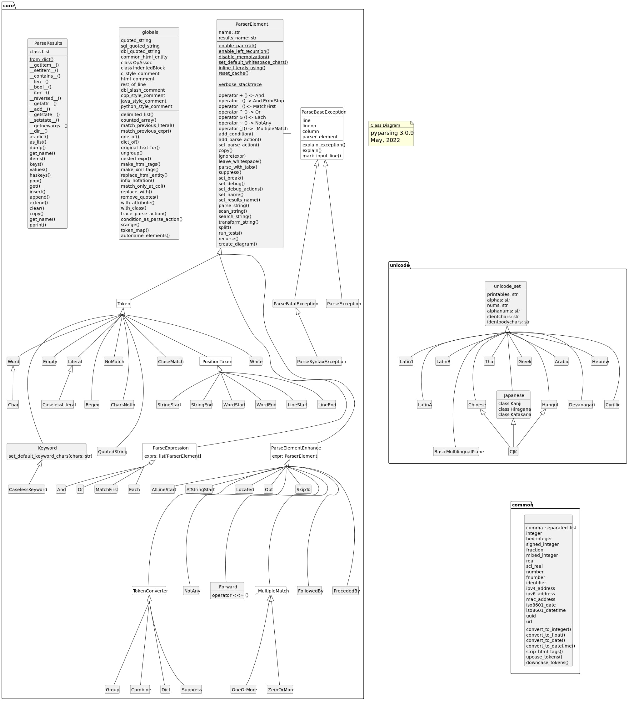

# sympy

# PyParsing

[Welcome to PyParsing’s documentation! — PyParsing 3.1.1 documentation (pyparsing-docs.readthedocs.io)](https://pyparsing-docs.readthedocs.io/en/latest/)

注意：在pyparsing 3.0中，许多最初使用驼峰式命名（camelCase）的方法和函数名已经被转换为符合PEP8规范的下划线分隔式命名（snake_case）。比如 `parseString()`正被重命名为`parse_string()`，`delimitedList`被更改为`DelimitedList_`等等。可能会在legacy edition中看到旧的名称，它们将通过同义词被兼容一段时间，但这些同义词将在未来的版本中移除

## *Steps to Follow*

1. 定义词法：首先定义要匹配的tokens和pattern，并将其赋值给一个变量。此时也可以定义可选的结果名称或解析动作
2. 在这个变量上调用`parse_string()`、`scan_string()`或`search_string()`方法，并传入要解析的字符串。在匹配过程中，默认情况下会跳过令牌之间的空白（尽管可以更改这个设置）。当发生令牌匹配时，任何定义的解析动作方法都会被调用
3. 处理返回的ParseResults对象中的解析结果。ParseResults对象可以像访问字符串列表一样被访问。如果在定义令牌模式时使用 `set_results_name()` 定义了名称，还可以通过返回结果的命名属性来访问匹配结果

## *ParserElement*

### 类型

* Literal & CaselessLiteral
* Keyword & CaselessKeyword
* Word
* Char & CharsNotIn
* Regex

### 方法

* `scan_string()`
  * 返回一个list of triples `[(matched_tokens, start location, end location)]`

### Expression Subclasses

### Expression Operators

### Converter Subclasses

* Combine
* Supress 