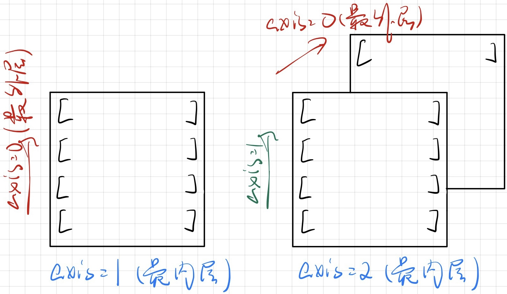

# 对象和基础语法

参考 [(19条消息) 语法：Python与C++对比_yuyuelongfly的博客-CSDN博客_python c++](https://blog.csdn.net/Cxiazaiyu/article/details/108937936)

## *高级语言的类型*

### 动态语言和静态语言

静态语言是指在编译时进行类型检查的编程语言。在静态语言中，每个变量和表达式都必须在编译时被赋予一个明确的数据类型，编译器会检查类型是否匹配。因此，在编译时发现类型不匹配或其他语法错误，可以避免在运行时出现一些常见的错误。静态语言的例子包括C、C++、Java等

动态语言是指在运行时进行类型检查的编程语言。在动态语言中，变量和表达式不需要预先声明数据类型，它们的类型是在运行时被推断出来的。动态语言允许开发人员更加灵活地编写代码，不必在编写代码时考虑过多的类型定义和规范。动态语言的例子包括Python、JavaScript、Ruby等

静态语言和动态语言各有优缺点。静态语言可以在编译时捕获许多错误，帮助开发人员更早地发现和解决问题，也可以提高代码的性能。动态语言则更具灵活性，开发效率更高，可以更快地迭代和测试代码。选择使用哪种类型的编程语言，通常取决于项目的特定需求和开发人员的个人偏好

### 标记语言、脚本语言和编译语言

标记语言、脚本语言和编译语言是三种不同的编程语言类型，它们的主要区别在于它们的功能、用途和编译方式。

1. 标记语言（Markup Language）：标记语言是一种用于文档编写和呈现的语言，常见的标记语言包括HTML、XML和Markdown等。标记语言主要用于描述文本文档的结构和呈现方式，它们通常不被认为是一种编程语言，因为它们不具备计算机程序的逻辑控制能力，不能定义变量、引用等
2. 脚本语言（Scripting Language）：脚本语言是一种用于编写脚本程序的语言，通常是解释性的，而不是编译性的。脚本语言被设计用于在其他应用程序或环境中进行自动化和扩展，比如Shell脚本、Python、Perl和JavaScript等。脚本语言通常用于快速开发、原型开发和小型项目，但是对于大型项目和高性能应用程序来说可能不够高效。脚本语言通过解释器 Interpreter 逐语句翻译，比如python解释器只是一个用C写的大型工程软件，用来对我们编写的python代码进行自动化分析
3. 编译语言（Compiled Language）：编译语言是一种需要先将源代码编译成机器语言的语言，然后才能运行的语言。常见的编译语言包括C、C++、Java和Go等。编译语言的编译过程需要花费一定的时间和计算资源，但是生成的可执行文件通常具有很高的性能和执行速度。编译语言通常用于开发大型和高性能的应用程序，如操作系统、编译器、数据库管理系统等。编译语言通过编译器（包含了预处理等四个步骤）生成可执行文件

## *Python语言特性*

### Python 解释器

* CPython：官方版本的解释器，是用C语言开发的，CPython是使用最广的Python解释器，一般用的都是这个解释器
* Ipython：基于CPython之上的一个交互式解释器，基于CPython之上的一个交互式解释器
* PyPy：一个追求执行速度的Python解释器，采用JIT技术，对Python代码进行动态编译
* Jython：运行在Java平台上的Python解释器，可以直接把Python代码编译成Java字节码执行
* IronPython：和Jython类似，只不过IronPython是运行在微软.Net平台上的Python解释器，可直接把Python代码编译成.Net的字节码

### Python 运行机制


## *命名规范*

### 标识符 Indentifier

* 第一个字符必须是字母表中的字母或下划线 `_`，标识符的其他部分由字母、数字和下划线组成
* 变量名全部小写，常量名全部大写
* 类名用大写驼峰
* 模块和包的名字用小写
* python3支持unicode之后标识符可以用中文的，但是实际中不要这么做

### Python下划线命名规范

* 单前导下划线 `_var`：作为类的私有属性，但不会被强制执行，一般只是作为一种提醒。唯一的影响是 `import` 的时候不会被导入
* 双前导下划线 `__var`：强制作为类的私有属性，无法在类外被访问，因为通过名称修饰规则修改过了，解释器对该属性的访问会发生变化
* 单末尾下划线 `var_`：按约定使用以防止与python关键字冲突
* 双前导和双末尾下划线 `__var__`：表示python中类定义的特殊方法，称为dunder method 或者 magic method 魔法函数
* 单下划线 `_`：临时或者无意义的变量，可以用来接受不需要的返回值

## *对象、变量和引用*

### 一切皆对象

python中所有类的父类为 object 类（当然从下文再深究下去其实不是，为方便理解可以这么说），即任何变量、函数、类、数据结构全部都可以看做是一个object的派生类，下面给出Cpython中的object类

```cpp
typedef struct _object {
    int ob_refcnt;               
    struct _typeobject *ob_type;
    //int ob_size; //记录变长对象的长度
} PyObject;
```

可以发现， Python 对象的核心在于一个引用计数和一个类型信息

* 其中 `ob_refcnt` 记录对象的引用数，当有新的指针指向某对象时，ob_refcnt 的值加 1， 当指向某对象的指针删除时，ob_refcnt 的值减 1，当其值为零的时候，则可以将该对象从堆中删除

* `_typeobject` 类型的指针 `ob_type`。这个结构体用于表示对象类型，具体记录了对象的性质

  ```cpp
  typedef struct _typeobject {
      PyObject_VAR_HEAD
      const char *tp_name; /* For printing, in format "<module>.<name>" */
      Py_ssize_t tp_basicsize, tp_itemsize; /* For allocation */
  
      // ...... 省略部分暂时不关心的内容
  } PyTypeObject;
  ```

  * `ty_name`：类型名
  * `tp_basicsize, tp_itemsize`：创建类型对象时分配的内存大小信息
  * 被省略掉的部分：与该类型关联的操作（函数指针）
  * `PyObject_VAR_HEAD` 是另一个 `PyTypeObject` 类型的对象，封装了 `PyType_Type`，**是真正意义上的所有class的基类**，被称作 metaclass

* 对于变长对象，还会再增加一个 `ob_size` 来记录变长对象的长度

### 变量及引用

* 变量不需要显式声明类型，对象的类型是内置的。解释器会自动推断变量的类型

  * 一般静态特性语言如C++、Java等都是需要声明变量类型的
  * 动态特性的语言如Python可以不声明，因为这样后面才可能将变量重新分派给其他对象

* Python中一切皆对象，变量是对象或者说是对象在内存中的引用。因此变量类型指的是变量所引用的对象的类型

  ```python
  >>> a = 1
  >>> id(a)
  140154666883376
  >>> a = 3
  >>> id(a)
  140154666883440
  ```

  因此会发生着各种现象，这在C++中是不可想象的，因为C++中变量a是绑定了内存空间的，问题只是往里面放的int是什么而已；但在python中对象才是绑定了内存空间，变量则是自由的，可以随便更改引用

* ==C++中用等号来赋值或开辟内存空间，而Python中用等号来创建对对象的引用==，这是两门语言最大的不同（当然本质是因为python中一切皆对象），为了方便期间，我仍然将等号称作赋值而不是引用

* 变量在内存中不占有空间，因为它是实际对象的引用。这和C++中的引用概念是一样的

* 每个变量在使用前都必须用 `=` 赋值，变量赋值以后才会被创建

通过下面两个例子来理解变量与引用的关系：

```python
a = 'Jack'
b = a
a = 'Tom'
```

上面的代码执行过程为

1. 在内存中创建一个字符串对象 'Jack'，然后创建一个一个变量 a 来引用该字符串对象，此时字符串对象的引用计数器 `ob_refcntc` + 1
2. 在内存中创建一个变量 b，并把它作为a，也就是字符串对象 'Jack'的另外一个引用，此时字符串对象的引用计数器 `ob_refcntc` + 1
3. 在内存中创建一个字符串对象 'Tom'，然后将现有的变量a来引用该字符串对象，此时字符串对象 'Jack' 的引用计数器 `ob_refcntc` - 1，而字符串对象 'Tom' 的引用计数器 `ob_refcntc` + 1

```python
a = 1
a = "hello"
a = [1, 2, 3]
```

上面的代码执行过程为

1. 创建一个一个变量 a 来引用数值池中的对象 1
2. 在内存中创建一个字符串对象 'hello'，然后将现有的变量a来引用该字符串对象，此时字符串对象的引用计数器 `ob_refcntc` + 1
3. 在内存中创建一个列表对象，然后将现有的变量a来引用该列表对象，此时字符串对象的引用计数器 `ob_refcntc` - 1 == 0，会在内存中被销毁，列表对象的引用计数器  `ob_refcntc` + 1

### 常量

python中通常用大写来表示常量，但实际上这个值仍然是可以修改的，比如修改下面的pi常量

```python
import math
math.pi = 5
```

因为种种原因，python并没有C++的const修饰符来保证常量的不可修改。只能通过一些特殊的操作来确保这件事

### 对象拷贝

* 对象赋值 `b = a` 

  * 如果 a 指向的是不可更改对象，那么 a 的改动会先创建新的对象，然后只让a自己饮用新的对象；而 b 仍然引用的是原来 a 和 b 一块引用的对象（直接从“赋值”的角度想就可以了）
  * 如果 a 指向的是可更改对象，之后只要通过 a 改动其所指向的对象中的元素，b 所指的对象中的元素就会随之改变；反之(通过 b 进行改动)亦然。

  ```python
  >>> list1 = [1, 2, 3, 4]
  >>> b = a = list1
  >>> a[2] = 8
  >>> list1
  [1, 2, 8, 4]
  >>> b
  [1, 2, 8, 4]
  ```

* 浅拷贝，wilber = copy.copy(will)，之后通过will改动其所指向的对象中的元素，看被改变的元素是可更改对象还是不可更改对象：

　　·如果是可更改对象，那wilber所指的对象中的元素随其发生改变；

　　·如果是不可更改对象，那么wilber不会发生改变(看例子中的图，一目了然)。

　　反之亦然。

3.深拷贝，wilber = copy.deepcopy(will)，二者之间的改动互不相干(虽然Python的设计是将will和wilber分别所指对象中的可更改对象共享了，但事实上只要改变了这些就会被重新赋值，我猜这只是Python用来节约内存的一个技巧，不要被这个搞混了)。

## *运算符*

由于python动态语言的灵活性，python的运算符和C++中有很多细节上的区别

赋值运算符、位运算符则和C++中的完全一样

### 算术运算符

```cpp
//C
int a = 10;
int b = 3;
printf(a / b); // 3 整数除法截断
printf(a % b); // 1 取模
```

上面是C中除法和取模操作，python的算术运算符与C的不同主要是在除法上

python提供了一个地板除 floor division `//` 来取整

`divmod()` 同时得到商和余数

```python
#python
>>> 10 / 3
3.33333333333
>>> 10 // 3
3
>>> 10 % 3
1
>>> divmod(10, 3)
(3, 1)
```

### 其他运算符

* 比较运算符：和C++不一样的是，python支持连续比较，即 `a>b>c` 是可以的，而C++中只能写成 `a>b && b>c`
* 逻辑运算符：python中没有 `$$ || !` 的逻辑运算符，而是用 `and or not` 来表示
* 成员运算符：`in` 和 `not in` 是python独有的用来判断对象是否属于某个集合的运算符
* 身份运算符：`is` 和 `is not` 用来判断两个标识符是否引用同一个对象，类似于 `id()`
* 三目运算符：为真时的结果 if 判定条件 else 为假时的结果

## *终端IO*

### 字符串

* python中的字符串用单引号或者双引号没有区别，但是用json格式转换的时候还是要考虑这个问题
* 原生字符串：在字符串前加r或R取消转义字符的作用，如 `\n` 会被取消换行的意思
* unicode字符串和byte类型字符串：在字符串前分别加u或U和b
* 字符串会自动串联，即 `'I' "love" "you"` 会被自动转换为 `"I love you"`

### 内置函数 `input()` 输入

* 读到的是一个字符串
* 去除空白的开头 `lstrip()`，去除结尾的空白用 `rstrip()`，去除两端的空白用 `strip()`

### `print()` 输出函数

内置函数 `print()` 打印到屏幕。注意：python3中的括号必不可少，因为它实质上是call函数，而python2中则可以不用括号

### `print()` 的格式控制

* C语言式
* `str.format()`

## *控制流*

python中给没有 switch - case

### 条件判断

```python
if condition_1:
    statement_block_1
elif condition_2:
    statement_block_2
else:
    statement_block_3
```

### 循环

* for循环
  * for循环通常用来遍历可迭代的对象，如一个列表或者一个字典，语法 `for <variable> in <sequence>:`
  * `range() `
    * 自动生成一个序列区间给for，生成的序列区间是坐闭右开的，即 `range(0,100` 生成的是0-99，间隔为1的序列
    * 可以指定步长 `range(0,2,100)`
  * 使用 `enumerate()` 来进行循环计数：`for count, value in enumerate(values):`
* while循环：和C++不同，while可以增加else
* 循环控制：用break跳出当前层的循环，continue跳过本次循环的剩余部分，return跳出所有循环

# 数据类型和数据结构容器

## *数据类型和数据结构容器的分类*

* 根据内置和自定义分
  * 内置：数字、字符串、布尔、列表、元组、字典、Bytes、集合
  * 自定义：类
* 根据可变和不可变分
  * 可变 Mutable：列表、字典
  * 不可变 Immutable：数字、字符串、布尔、元组

## *数字类型*

### 整数 int

Python的整数长度为32位，相当于C中的long，并且通常是连续分配内存空间

* 对象池：Python会**缓存**使用非常频繁的小整数-5至256、ISO/IEC 8859-1单字符、只包含大小写英文字母的字符串，以对其复用，不会创建新的对象

  可以通过下面的例子来验证，可以看到-4和-5的内存地址相差32位，而-6的地址就离的比较远了

  ```python
  >>> id(-4)
  140405897304208
  >>> id(-5)
  140405897304176
  >>> id(-6)
  140405901250416
  ```

* 整数缓冲区：刚刚被删除的整数的内存不会被立刻回收，而是在后台缓冲一段时间等待下一次的可能调用

整数类型还有浮点数 float和复数

### 类型转换

和C++一样，python也有隐式和显示（强制）类型转换，用法也差不多

### math数学计算库

### Bool值

* True和False

* 一个常范的错误是None不是bool值，二是一个单例类对象

  * None是逻辑运算的重要组成部分，它的类型是 NoneType。不能对None进行数值操作

  * None是一个单例类 Singleton，而在pep8中规定了对单例类的比较要用对象比较符 `is` 和 `is not`，而不是用数值运算符 `==`

    >"Comparisons to singletons like None should always be done with 'is' or 'is not', never the equality operators."


## *列表 List*

### 与 `std::vector` 的区别

Python的列表是一个可变长度的顺序存储结构

列表类似C++的 `std::vector`，区别在于每一个位置存放的都是对象的引用，同时因为动态特性不需要指定存储元素的类型，所以它可以混数据类型存储

### 列表操作、内置方法

https://www.liujiangblog.com/course/python/19

### 栈与队列

python没有实现独立的栈和队列数据结构，而是利用列表的append、pop等操作间接实现的

## *元组 Tuple*

用方括号扩起来的是元祖，用圆括号括起来的元祖。元祖就是不可变的列表

### 元祖中允许的操作

* 使用方括号加下标访问元素
* 切片（形成新元组对象）
* count()/index()
* len()/max()/min()/tuple()

### 元祖中不允许的操作

* 修改、新增元素
* 删除某个元素（但可以删除整个元组）
* 所有会对元组内部元素发生修改动作的方法。例如，元组没有remove，append，pop等方法

### 元祖的坑

元组只保证它的一级子元素不可变，对于嵌套的元素内部，不保证不可变

```python
>>> tup = (1, 2, [3, 4])
>>> tup[2][1] = 8
>>> tup
(1, 2, [3, 8])
```

## *字符串 String 和 bytes*

### 字符串

字符串是不可变类型，但支持对它的切片和取子串（相当于就是产生了一个新对象）

字符串操作：https://www.liujiangblog.com/course/python/21

### bytes

在Python3以后，字符串和bytes类型彻底分开了

字符串是以字符为单位进行处理的，bytes类型是以字节为单位处理的

## *字典 Dictionary 与集合 Set*

### 字典和 `std::unordered_map` 的区别

```python
d = { 'apple' : 1, 'pear' : 2, 'peach' : 3 }
```

Python的字典数据类型是和 `std::unordered_map` 一样是基于hash算法实现的

**从Python3.6开始，字典变成有序的，它将保持元素插入时的先后顺序**

### 字典操作

https://www.liujiangblog.com/course/python/22

### 集合

集合数据类型的核心在于**自动去重**

https://www.liujiangblog.com/course/python/24

## *推导式 Comprehension*

推导式式python语言特有的一种语法糖，可以写出较为精简的代码

### 列表推导式

在C++中生成一个存储1-9的平方vector的思路是

```cpp
vector<int> v = {}
for (int i = 1; i < 10; i++) {
	v.push_back(i*i)
}
```

但是在python中生成这样的一个list可以用一行代码完成，即

```python
>>>lis = [x * x for x in range(1, 10)]
[1, 4, 9, 16, 25, 36, 49, 64, 81]
```

推导式还可以有很多其他的花样

* 增加条件语句

  ```python
  >>>lis = [x * x for x in range(1, 10) if x % 2==0]
  [4, 16, 36, 64]
  ```

* 多重循环

  ```python
  >>> [a + b for a in '123' for b in 'abc']
  ['1a', '1b', '1c', '2a', '2b', '2c', '3a', '3b', '3c']
  ```

  最前面的循环就是最内层的循环

### 字典与集合推导式

```python
dic = {x: x**2 for x in (2, 4, 6)}
s = {x for x in 'abracadabra' if x not in 'abc'}
```

### 元组推导式？

所谓的元组推导式就是生成器 generator 对象

```python
>>> g = (x * x for x in range(1, 10))
>>> g
<generator object <genexpr> at 0x7fbaea0dcac0>
```

# 模块和包

## *模块 Module*

python中每一个.py文件都是一个独立的模块。通过使用模块，可以有效地避免命名空间的冲突，可以隐藏代码细节让我们专注于高层的逻辑，还可以将一个较大的程序分为多个文件，提升代码的可维护性和可重用性

python还可以导入并利用其他语言的代码库，如C和C++的动、静态库

### 撰写模块的说明文档

在实际工程中要为每个模块、每个类和每个函数都要撰写说明文档

```python
'''
Documentation
'''
import demo
print(demo.__doc__) #查看文档
```

### 导入模块

* 导入整个模块 `import demo`：导入demo模块中的所有内容，但会保留其命名空间，需要用 `demo.成员` 指定模块名的方式来进行调用
* 导入模块中的特定部分
  * `from demo import 成员名`：从demo模块中导入指定的成员，会将该成员从原来的命名空间中合并到目前的命名空间中，因此不需要 `demo.` 就可以直接调用
  * 尽量不要使用 `from demo import *`，很容易出现重复定义的情况
* 使用 `as` 指定别名 `import numpy as np`

### 测试单元

python不需要一个类似C++工程中main函数的程序入口，任何.py文件都可以是一个单独的程序，解释器会自动逐行执行。但是这也会执行包含import的模块中的程序块

为了不让import的程序块执行，可以将单元测试脚本写在 `if __name__ == '__main__':` 中，比如

```python
def test_func():
   pass

if __name__ == '__main__':
    #Test Code for this .py file
```

### 模块路径

对于用import语句导入的模块，python会按照下面的路径按顺序来查找

1. 当前的工作目录
2. `PYTHONPATH` 环境变量中的每一个目录
3. Python默认的安装目录：UNIX下，默认路径一般为 `/usr/local/lib/python/`

## *包 Package*

python包，就是里面装了.py文件的文件夹

### 包的性质

* 包本质上是一个文件夹
* 该文件夹里一定有一个 `__init__.py` 模块
* 包的本质依然是模块，因此一个包里面还可以装其他的包

### `__init__.py` 文件

* 本身是一个模块
* 这个模块的模块名不是 `__init__`，而是这个包的名字，也就是装着 `__init__.py` 文件的文件夹名字
* 他的作用是将一个文件夹变为一个python模块
* `__init__.py` 中可以不写代码，但是此时仅仅是 `import pkg` 的话就什么都不会发生，一般会重写 `__all__` 方法来规定当imprt该包的时候会自动import包中的哪些模块
* 不建议在 `__init__.py` 中写类，以保证该py文件的纯净

### 导入包

和导入模块相同

### 关于库的问题

严格来说python中是没有库 library的，模块和包都是python语法概念，而库只是一个通俗的说法，平时说的库在python中的具体化表现既可以是一个包也可以是一个模块

可以看到python标准库中就是一堆的,py文件模块和文件夹（包）

# 函数

python函数最大的特点是可以在函数中再定义函数，因为python一切皆对象，函数也是一个类，所以是相当于定义了一个内部类

## *函数基础*

python

### 定义

```python
def 函数名(参数):
    # 内部代码
    return 表达式 
```

### 传引用传参 Pass by reference

python变量是对象的引用，因此函数传参也采取的是传引用传参

```python
a = 1 # 不可变
b = [1, 2, 3, 4] # 可变
def func(a, b):
    print("在函数内部修改之前,变量a的内存地址为： %s" % id(a))
    print("在函数内部修改之前,变量b的内存地址为： %s" % id(b))
    a = 2
    b[3] = 8
    print("在函数内部修改之后,变量a的内存地址为： %s" % id(a))
    print("在函数内部修改之后,变量b的内存地址为： %s" % id(b))
    print("函数内部的a为： %s" % a)
    print("函数内部的b为： %s" % b)


print("调用函数之前,变量a的内存地址为： %s" % id(a))
print("调用函数之前,变量b的内存地址为： %s" % id(b))
func(a, b)
print("函数外部的a为：%s" % a)
print("函数外部的b为：%s" % b)
```


* 不论是可变量a还是不可变量b，调用函数和调用函数后但未修改的内存地址一样，证实了传引用传参
* 函数内部修改后，根据之前变量与引用的关系，a被重新指向了2这个数值对象，而b则没有改变引用对象
* 试验里这种将实参和形参命名相同是一种不好的代码习惯，最好使用不同的名称避免混淆

### 返回

因为python没有变量类型，所以也就不需要写return的类型了，默认返回为None

和C语言函数只能返回一个值不同，python函数可以同时返回多个值并且同时接收

```python
def func(x, y, z):
  	# ...
    return x, y, z
a, b, c = func(x, y, z)
```

## *参数*

### 必传参数

必传参数又称位置参数或顺序参数，是必须在call函数的时候按照顺序提供的参数

但是若在传参的时候指定了参数名的时候，顺序也是可以调换的

```python
def student(name, age, classroom, tel, address="..."):
    pass

student(classroom=101, name="Jack", tel=66666666, age=20)
```

### 默认参数 Default parameter

* 默认参数必须要在必传参数之后
* 当有多个默认参数的时候，通常将更常用的放在前面，变化较少的放后面
* 在调用函数的时候，尽量给实际参数提供默认参数名，否则可能会混淆犯错

### 动态参数

动态参数，是指不限定传入参数个数的参数包，**必须放在所有的位置参数和默认参数后面**

* `*args`：会将实际参数打包成一个元组传入形式参数。如果参数是个列表，会将整个列表当做一个参数传入
* `**kwargs`：两个星表示接受键值对的动态参数，数量任意。调用的时候会将实际参数打包成字典

### 万能参数

### 类型建议符 Python 3.5

```python
def sum(num1: int, num2: int) -> int:
    return num1 + num2
```

函数参数中的冒号是参数的类型建议符，告诉程序员希望传入的实参的类型。函数参数列表后的箭头是函数返回值的类型建议符，用来说明该函数返回的值是什么类型

类型建议符并非强制规定和检查，即使传入的实际参数与建议参数不符，也不会报错。类型建议符号的主要作用是令使用者快速了解函数的作用，没有对类型的解释说明的话，可能会需要花费更多的时间才能看出函数的参数和返回值是什么类型，有了说明符，可以方便程序员理解函数的输入与输出

## *变量作用域*

### 作用域分类

```python
x = int(2.9)  # 内建作用域，查找int函数

global_var = 0  # 全局作用域
def outer():
    out_var = 1  # 闭包函数外的函数中
    def inner():
        inner_var = 2  # 局部作用域
```

* 局部作用域 Local scope：定义在函数内部的变量拥有局部作用域，局部变量只能在其被声明的函数内部访问
* 嵌套作用域 Enclosing scope
* 全局作用域 Global scope：定义在函数外部的变量拥有局部作用域
* 内置作用域 Built-in scope

python以 L-E-G-B 的顺序依次寻找变量

### `global` 和 `nonlocal` 关键字

* `global`：指定当前变量使用外部的全局变量

## *匿名函数/lambda表达式*

`lambda 参数: 表达式`

* lambda只是一个表达式,而不是一个代码块，函数体比def简单很多
* 仅仅能在lambda表达式中封装有限的逻辑
* lambda 函数拥有自己的命名空间

## *内置函数*

`type()` 查看对象的数据类型

`divmod()` 同时得到商和余数

`id()` 可以查看某个变量或者对象的内存地址

`callable()` 函数来判断一个对象是否可以call

`iterable()` 函数来判断一个对象是否可以迭代

`del()` 调用对象的 `__del__()` 进行析构

`len()` 调用对象的 `__len__()` 获取对象长度

`iter()` 调用对象的 `__iter__()` 生成迭代器对象

`next()` 调用对象的  `__next__()` 调用下一个迭代器对象进行迭代

# 三器一闭

## *迭代器 Iterator*

和C++一样，python中一般的数据结构list/tuple/string/dict/set/bytes都是可以迭代的数据类型，也可以为自定义类对象实现迭代器

### 与迭代器有关的内置函数

```python
>>> list1 = [1, 2, 3]
>>> it = iter(list1)
>>> it
<list_iterator object at 0x7fe2cdc2aa30>
>>> next(it)
1
>>> next(it)
2
>>> next(it)
3
>>> next(it)
Traceback (most recent call last):
  File "<stdin>", line 1, in <module>
StopIteration
```

* **利用 `iter()` 创建迭代器对象，然后利用 `next()` 取下一个元素，知道没有元素跳StopIteration异常**
* python中的for循环和C++11的范围for一样，就是直接调用可迭代对象的 `__iter__()` 得到一个迭代器对象，然后不断地调 `next()`
* 通过collections模块的 `iterable()` 函数来判断一个对象是否可以迭代

### 迭代器 Iterator 和可迭代 iterable 的区别


* **凡是可作用于for循环的对象就是可迭代类型**，因为for关键字会直接调用可迭代对象的 `__iter__()` 得到一个迭代器对象
* **凡是可作用于 `next()` 函数的对象都是迭代器类型**，因为 `next()` 会调用迭代器对象的 `__next__()` 函数
* python的数据结构对象 list、dict、str 等都是可迭代类型，而不是迭代器，因为它们可以用于for关键字迭代而不能作为 next 函数的对象

### 对不可迭代对象进行迭代的两种错误

让自定义类称为一个迭代器，需要在类中实现魔法函数 `__iter__()` 和 `__next__()`

* 当对不可迭代对象（或者说没有实现上面两个魔法函数的对象）运用for迭代的时候会报错

  ```python
  >>> class Foo:
  ...     pass
  ...
  >>> for i in Foo():
  ...     print(i)
  ...
  Traceback (most recent call last):
    File "<stdin>", line 1, in <module>
  TypeError: 'Foo' object is not iterable
  ```

* `__iter__()` 没有返回一个可迭代对象

  ```python
  >>> class Foo:
  ...     def __iter__(self):
  ...     	pass
  ...
  >>> for i in Foo():
  ...     print(i)
  ...
  Traceback (most recent call last):
    File "<stdin>", line 1, in <module>
  TypeError: iter() returned non-iterator of type 'NoneType'
  ```

### 自定义类的迭代器实现

首先我们定义一个可迭代对象

```python
class MyIterable(object):
    def __init__(self):
        self.attr1 = []
        self.attr2 = {}
    def add(self, val):
        pass
    def __iter__(self):
        # return iter(self.attr) # 若attr只是一个可迭代对象的话，也可以直接用它的迭代器
        my_iterator = MyIterator(self)
        return my_iterator # 返回迭代器对象
```

然后再为这个可迭代对象定制一个迭代器对象，里面要实现 `__next__()`

但是python语法规定迭代器自己本身就要是一个可迭代对象，因此还需要实现 `__iter__()`

```python
class MyIterator(object):
    def __init__(self, my_iterable):
        self._my_iterable = my_iterable
        self.curr = 0 # 记录当前访问到的位置
    def __next__(self):
        pass # 迭代器的核心逻辑实现，如何找到下一个元素？
    def __iter__(self):
        return self #迭代器自身正是一个迭代器，所以迭代器的__iter__方法返回自身即可
```

## *生成器 Generator*

https://zhuanlan.zhihu.com/p/341439647

有时候在序列或集合内的元素个数非常巨大，若全部制造出来并加入内存，对计算机的压力是巨大的，深度学习对权重进行迭代计算就是一个典型的例子。生成器实现的功能就是可以中断性的间隔生成元素（比如一个mini-batch），这样就不必同时在内存中存在整个数据集合，比如整个dataset。从而节省了大量的空间

### 生成器的 `yield` 和普通 `return` 执行流的区别

```python
# A regular method
def regular_foo():
    index = 0
    return_list = []
    while index < 10:
        return_list.append(index)
        index += 1
    return return_list

for x in regular_foo():
    print(x)
```

上面是一个常规的for循环，它的执行流是

1. Run `rugular_foo()` 得到一个 `return_list`，要返回这个对象把它加载到内存中
2. Return that list to the outer scope of the main function
3. Run the for-loop on the returned list, and print all the numbers within, 1-by-1

```python
# A generator
def my_generator():
    index = 0
    while index < 10:
        yield index
        index += 1

for x in my_generator():
    print(x)
```

上面是一个generator，它的执行流是


1. Enter the function for the first time, and run line-by-line until the yield statement
2. The function's state, including the pointer to the executed line, is saved to the memory 保存yield之前的运行状态
3. Yield the value of index (0) to the outer scope. Now x == 0.
4. Print the value of x, 0
5. Enter the function again, in the next iteration. **The most crucial notion**: we enter `my_generator()` again, but now, in comparison to the regular call of a function, the function state is reloaded from RAM, and we now stand on the line index += 1
6. We start the second iteration of the while loop, and yield the value 1
7. This loop continues, until the while loop within my_generator() finishes, and the function returns and finishes, i.e. it doesn't generate anything else.

### 生成器与迭代器的关系

函数被调用时会返回一个生成器对象。生成器其实是一种特殊的迭代器，一种更加精简高效的迭代器，它不需要像普通迭代器一样实现`__iter__()`和`__next__()`方法了，只需要一个`yield`关键字。因此在实际中一般都会直接实现生成器

下图是 iterable vs. iterator vs. generator 的关系，来源：https://nvie.com/posts/iterators-vs-generators/


下面是 i2dl Dataloader 的 `__iter__()` 的例子，用来实现 load 一个 batch

```python
class Dataloader:
    # ...
    def __iter__(self):
        for index in indexes:
            batch.append(self.dataset[index])
            if len(batch) == self.batch_size:
                yield batch_to_numpy(combine_batch_dicts(batch))
                batch = []

        if not self.drop_last and len(batch) > 0:  # when drop_last == False and len of remaining both ture, will enter
            yield batch_to_numpy(combine_batch_dicts(batch))
```

### 典型错误：在 nested function 中使用 yield

````python
class Dataloader():
    # ...
    def __iter__(self):
        def nested_function(x)
              yield x
        indx = 0
        numbers = []
        while indx < 10:
            numbers.append(nested_function(indx))
            indx += 1 
        return iter(numbers)

dataloader = Dataloader()
for x in dataloader:
    print(x)
````

因为 yield 是从 `nexted_function` 里面返回到了调用的地方，而不是main，因此在return的时候仍然要返回所有数值，这和直接return是没有区别的

甚至若连 `__iter__()` 中的return都不写的话，main得到的就只有None

## *闭包 Closure*

### 闭包的概念

因为python一切皆对象，所以可以在函数内再定义函数，因为函数也是一个类，所以是相当于定义了一个内部类

在一个外函数中定义了一个内函数，内函数里运用了外函数的临时变量，并且外函数的返回值是内函数的引用。这样就构成了一个闭包

```python
# outer是外部函数 a和b都是外函数的临时变量
def outer(a):
    b = 10
    # inner是内函数
    def inner():
        print(a+b) # 在内函数中 用到了外函数的临时变量
    return inner # 外函数的返回值是内函数的引用
```

call outer函数的结果如下：

```python
>>> demo = outer(5)
>>> demo
<function outer.<locals>.inner at 0x7f9455f494c0>
>>> demo()
15
>>> demo2 = outer(7)
>>> demo2()
17
```

`outer(5)` 是call了一次outer函数，返回了一个inner函数对象给demo，可以看到输入demo的时候显示是一个函数对象inner

然后call函数对象demo，也就是call inner的时候，就可以得到返回值17

### 外函数把临时变量绑定给内函数

但这里有个很明显的问题，当outer调用完毕后，它的临时变量 `b = 10` 应该被系统回收了，可是显然 `demo()` 能得到返回值就说明这个临时变量没有被销毁

一般情况下函数调用后确实会进行资源回收，可闭包是一个例外。一旦外部函数发现自己的临时变量在将来可能会被内部函数用到时，就会把外函数的临时变量交给内函数来管理

注意：每次调用外函数，都返回不同的实例对象的引用，他们的功能是一样的，但是它们实际上不是同一个函数对象，比如demo和demo2就是两个函数对象

### 在闭包中内函数修改外函数的局部变量

### 闭包的作用

* 装饰器

## *装饰器 Decorator*

类是可以通过继承来扩展类的功能的，但是若想要扩展函数的功能改怎么办呢？利用基于开放封闭原则的闭包来扩展函数

### 装饰器原理


### 被修饰函数参数

### 修饰函数参数

# 类

## *类基础*

### 类定义和实例化

```python
class Student:
    classID = 1 #类属性
    classroom = "101"
    
    def __init__(self, name, age): #魔法函数：构造函数
        self.name = name #实例化属性
        self.age = age
        
	def print_age(self): #方法
    	print(self.age)
 
li = Student("Ming Li", 10) #实例化
```

### 访问限定

* 若要将属性设置为私有，就直接将属性名用双前导下划线命名（单前导下划线只是建议私有！），即 `__Var`
* 这是通过名称修饰 Name mangling 来实现的，解释器会将 `__var` 替换为 `_classname__var`。因此非得在类外访问私有的化可以通过 `_classname__Var`在类的外部访问`__Var`变量，但不要这么做
* 相当于Python的私有成员和访问限制机制都不是真正写死的，没有从语法层面彻底限制对私有成员的访问。这一点和常量的尴尬地位很相似

### 属性和方法

* 类中的变量称为属性，类属性默认是公有的

  * 实例属性：实例本身拥有的变量，每个实例变量在内存中都不一样

  * 类属性属于整个类的共有属性，为所有实例类所共享，和C++的静态成员变量一样，类属性采用 `类名.类属性` 的方法进行访问，否则会产生下面的问题

  * 根据python的动态语言特性，当实例化的类修改其类属性的时候实际上是新建了一个属于该实例的实例属性

    ```python
    >>> li.classroom
    '101'
    >>> id(li.classroom
    >>> id(li.classroom)
    140229149483824
    >>> li.classroom = "102"
    >>> id(li.classroom)
    140229149501552
    ```

* 类方法是类中定义的函数。类方法和普通函数的区别是它的第一个参数必须是self，来代表**实例化**的类对象

  ```python
  class Student:
      classID = 1 #类属性
      classroom = "101"
      
      def __init__(self, name, age): #魔法函数：构造函数
          self.name = name #实例化属性
          self.age = age
          
  	def print_age(self): #实例方法
      	print(self.age)
      
      @staticmethod
      def static_method():
          pass
      
      @classmethod
      def class_method(cls):
          pass
  ```

  * 实例方法
    * 由实例调用，至少包含一个self参数，且为第一个参数
    * self的作用和C++中的this指针是一样的，指代的是实例化类。不同于this指针是默认隐藏的，self需要显示给出
    * self不是python关键字，换成其他的词也可以，但不要这么做
  * 静态方法
    * 静态方法由类调用，无默认参数，用 `@staticmethod` 来修饰
    * 使用 `类名.静态方法` 调用，不建议使用 `实例.静态方法` 的方式调用
    * 静态方法不能获取类属性、构造函数定义的变量，属于 function 类型
    * 静态方法在实际中使用的不多，因为完全可以用一般的函数替代
  * 类方法
    * 类方法由类调用，至少包含一个默认参数cls，用 `@classmethod` 来修饰
    * 使用 `类名.类方法` 调用，不建议使用 `实例.类方法` 的方式调用
    * 可以获取类属性，不能获取构造函数定义的变量，属于 method 类型

### 类在内存中的保存


类、类的所有方法以及类变量在内存中只有一份，所有的实例共享它们。而每一个实例都在内存中独立的保存自己和自己的实例变量

创建实例时，实例中除了封装实例变量之外，还会保存一个类对象指针，该值指向实例所属的类的地址。因此，实例可以寻找到自己的类，并进行相关调用，而类无法寻找到自己的某个实例

## *魔法函数 Magic method/dunder method*

python会为实例化的类配备大量默认的魔法函数，这里只列出最重要的一些。有些魔法函数是自动生成的，有些则需要自己定义

### 默认生成

* `__class__`： 输出类名称

* `__module__`：输出所属的模块名

* `__doc__`：输出说明性文档和信息

  ```python
  class A:
      '''
      Documentation 类的说明
      '''
      pass
  print(A.__doc__)
  ```

  三引号的注释方式是专门为 `__doc__` 提供文档内容的。这类注释必须紧跟在定义体下方，不能在任意位置

* `__del__()` 析构函数

  * 当对象在内存中被释放时，会自动触发析构函数
  * 使用 `del` 来进行显式强制删除
  * 因为python中没有C++中内置类型和自定义类型的设计缺陷，Python自带内存分配和释放机制，所以析构函数一般都不需要自己定义，除非是想在析构时候完成一些动作，比如日志记录等
  
* `__dict__`：列出类或对象中的所有成员。非常重要和有用的一个属性，Python默认生成，无需用户自定义

### 需要自定义

* `__init__()` 构造函数初始化实例属性，`__init__()` 会被默认生成，若用户不显示给出的话，但一般都是要自己给出的

  ```python
  class A:
      def __init__(self, a, b):
          self._a = a
          self._b = b
  ```

* `__call__()` 令类成为一个可调用对象，相当于C++中的匿名对象。如果为一个类编写了该方法，那么在该类的实例后面加括号，可会调用这个方法，即 `对象()` 或者 `类()()`。这个魔法函数很重要，基本上都要自定义实现

  ```python
  def __call__(self, *args, **kwargs):
      print('__call__')
  ```

  可以利用内建的 `callable()` 函数来判断一个对象是否可以call

* `__iter__()` 是实例化类对象称为一个可迭代对象，这在前面的迭代器部分有讲解

* `__len__()` 获取对象长度

* `__str__() `与 `__repr__`

  * 当 `print(obj)` 时会调用对象的 `__str__()`魔法函数，输出自定义的返回值。这个魔法函数很重要，通常都需要自定义
  * `__repr__()` 与 `__str__()` 在于前者是给调试人员看的，后者是给普通用户看的

* `__getitem__(), __setitem__(), __delitem__()` 设置 `[ ]` 的取值操作，和 property 修饰器相似，分别表示取值、赋值和删除的作用

  ```python
  class Foo:
      def __getitem__(self, key):
          pass
      def __setitem__(self, key, val):
          pass
      def __delitem__(self, key):
          pass
  
  obj = Foo()
  res = obj['key'] #get
  obj['key'] = 3 #set
  del obj['key'] #del
  ```

* 运算符重载

  * `__add__`: 加运算
  * `__sub__`: 减运算 
  * `__mul__`: 乘运算 
  * `__div__`: 除运算 
  * `__mod__`: 求余运算 
  * `__pow__`: 幂运算

## *继承与多态*

### 定义

```python
class Foo(superA, superB, superC....):
class DerivedClassName(modname.BaseClassName):  ## 当父类定义在另外的模块时
```

Python支持多继承，按照括号里父类的继承顺序依次继承，在python中父类又称为超类 Superclass

**所有类的最终父类都是 object**，即使是没有显示继承

### python3的继承机制

python3的继承机制不同于python2，核心原则是

* 子类在调用某个方法或变量的时候，首先在自己内部查找；若没有找到，则根据继承顺序依次在父类找

* 根据父类继承顺序，括号内最左边（也就是最先继承）的，如果有被查找对象，则最先调用，采用的是深度优先搜索调用

  

  上图中A是基类，D和G分别是两条继承路线的父类

### `super()`

父类和子类中有同名成员时，子类成员将直接屏蔽对父类中同名成员的直接访问，这种情况叫做隐藏 hide，也叫做重定义。C++中若在子类中想要访问父类中被隐藏的成员，可以通过指定父类域的方式，即 `父类::父类成员` 显式访问

python中则会通过 `super()` 函数从子类中强制调用父类的被隐藏函数，最常见的就是通过 `super()` 来调用父类的构造函数

```python
class A:
    def __init__(self, name):
        self.name = name
        print("父类的__init__方法被执行了！")
    def show(self):
        print("父类的show方法被执行了！")

class B(A):
    def __init__(self, name, age):
        super(B, self).__init__(name=name)
        self.age = age

    def show(self):
        super(B, self).show()
```

`super(子类名, self).方法名()` 需要传入的是子类名和self，调用的是父类里的方法，按夫类的方法需要传入参数

### 多态

python的多态与重写非常简单，不需要像C++那样要满足2个必要条件（必须通过父类的指针或者引用调用虚函数和被调用的函数必须是虚函数，且子类必须对父类的虚函数进行重写）。只要直接在子类中实现一个同名函数就行了

这可能是因为python中没有函数重载体系，相同名字的函数，即使是参数不同也会被覆盖

## *Property decorator*

python 内置的 `@property` 装饰器可以**把类的方法伪装伪装成属性调用的方式**，也就是本来 `Foo.func()` 的调用方式变成了 `Foo.func` 的方式

将一个方法伪装成属性后，就不能再使用圆括号的调用方式了

### 设置装饰器的步骤

```python
class People:
    def __init__(self, name, age):
        self.__name = name
        self.__age = age
   	@property
    def age(self):
        return self.__age
    @age.setter
    def age(self, age):
        if isinstance(age, int):
            self.__age = age
        else:
            raise ValueError
    @age.deleter
    def age(self):
        print("Delete age")
obj = People("Zhangsan", 18) #Instantiation
print(obj.age)
obj.age = 20 #Modify
del obj.age #Delete
```

以下三个修饰器分别对应与对一个属性的获取、修改和删除

* 在普通方法的基础的基础上添加 `@property` 装饰器，例如上面的 `age()` 方法。相当于是一个get方法，用来获取值
* 写一个同名方法，并添加 `@xxx.setter`（xxx表示和修饰方法一样的名字）装饰器，这相当于编写了一个set方法，提供赋值功能
* 再写一个同名的方法，并添加 `@xxx.deleter` 修饰器，这相当于写了一个删除功能

还可以定义只读属性，也就是只定义getter方法，不定义setter方法就是一个只读属性

### property() 函数

```python
def People():
    # ...
    def get_age(self):
        pass
    def set_age(self, age):
        pass
    def del_age(self):
        pass
    age = property(get_age, set_age, del_age, "年龄")
```

除了装饰器外，还可以使用python内置的builtins模块中的property函数来设置

# IO

## *文件*

### 打开文件

用 `open(filename, mode)` 打开一个文件，返回一个文件描述符对象，打开文件的模式和C的IO比较相似，可以看下面这张图


使用文件完毕后，需要用文件方法 `close()` 来关闭，但是比起这种方法，经常会使用更便捷的with来处理。在使用结束后, 它会帮你正确的关闭文件

```python
with open('filename', 'r') as f:
     read_data = f.read()
```

### Pickle 包

https://blog.csdn.net/ITBigGod/article/details/86477083

>The [`pickle`](https://docs.python.org/3/library/pickle.html#module-pickle) module implements binary protocols for serializing and de-serializing a Python object structure. *“Pickling”* is the process whereby a Python object hierarchy is converted into a byte stream, and *“unpickling”* is the inverse operation, whereby a byte stream (from a [binary file](https://docs.python.org/3/glossary.html#term-binary-file) or [bytes-like object](https://docs.python.org/3/glossary.html#term-bytes-like-object)) is converted back into an object hierarchy. Pickling (and unpickling) is alternatively known as “serialization”, “marshalling,” [1](https://docs.python.org/3/library/pickle.html#id7) or “flattening”; however, to avoid confusion, the terms used here are “pickling” and “unpickling”.

用 `pickle.load()` 进行序列化 serializing or pickling 和 `pickle.dump()` 进行反序列化 de-serializing or unpickling

所谓序列化就是按照一种规定的Protocal转换为字节流放到内存中，这相比于和硬盘文件IO快得多

下面的例子是i2dl中的MemoryImageFolderDataset类，用于将不大的Dataset放到内存中，来加快IO速度

```python
with open(os.path.join(self.root_path, 'cifar10.pckl'), 'rb') as f:
    save_dict = pickle.load(f)
```

### File方法

假设有 `f=open(filename, mode)`

* `f.read()`
* `f.readline()` 会从文件中读取单独的一行。换行符为 '\n'。`f.readline()` 如果返回一个空字符串, 说明已经已经读取到最后一行
* `f.write()`
* `f.tell()` 返回文件对象当前所处的位置, 它是从文件开头开始算起的字节数
* `f.seek()` 改变文件指针当前的位置

## *os文件/目录方法*

os 模块提供了非常丰富的方法用来处理文件和目录

### `os` 包中的常用方法

### `os.path` 模块中的常用方法

`__file__` 是当前.py文件的绝对路径

* `os.path.abspath(path)`：返回某个路径的绝对路径
* `os.path.dirname(path)`：返回某路径的目录名

### 与系统相关的其他方法

* `os.times()`：返回当前的全局进程时间，五个属性

## *sys库*

# Numpy

参考《Python深度学习--基于PyTorch》

## *python数据结构缺陷 & ndarray引入*

python已经提供了list和array这种数据结构来进行计算，但是它们有各自的问题

list中可以存储所有类型的对象，因为一切皆对象，实际存储的是对象的引用，这在以大量float和int为主的数据运算中是非常低效的

而array和C语言的一维数组比较像，但是它不支持多维数组，而且支持的内置方法也比较少

因此有必要提供一种高效的用于数据计算的数据结构，即numpy的ndarray（N-dimensional Array Object）和用于处理ndarray的ufunc（Universal Funciton Object）对象

## *创建ndarray*

### 从已有数据中创建数组

用 `np.array()` 和 `np.asarray()` 来手动创建或者从已有的list或tuple类型来创建ndarray

```python
>>> a = [1, 2, 3, 4]
>>> b = (5, 6, 7, 8)
>>> a_ndarray = np.array(a)
>>> b_ndarray = np.array(b)
>>> type(a_ndarray)
<class 'numpy.ndarray'>
>>> type(b_ndarray)
<class 'numpy.ndarray'>
```

`np.array()` 和 `np.asarray()` 的区别是前者会对前者做深拷贝生成新对象，而后者直接对对象操作，因此对原对象（必须是ndarray对象）进行修改的时候，会影响到用 `asarray` 生成的原对象引用

```python
>>> a = np.array([1, 2, 3, 4])
>>> b = np.array(a)
>>> c = np.asarray(a)
>>> a[1] = 5
>>> a
array([1, 5, 3, 4])
>>> b
array([1, 2, 3, 4])
>>> c
array([1, 5, 3, 4])
```

### 利用random模块生成数组

* `np.random.random`：生成0到1之间的随机数
* `np.random.uniform` ：生成均匀分布的随机数
* `np.random.randn`：生成标准正态的随机数
* `np.random.randint`：生成随机的整数
* `np.random.normal`：生成正态分布

### 创建特定形状的特殊多维数组

* 生成特定形状的 $\boldsymbol{0}$ 数组
* 生成特定形状的 $\boldsymbol{1}$ 数组
* 生成空数组，里面是未初始化的垃圾值
* 生成特定形状的 $\boldsymbol{I}$ 数组
* 生成特定形状的制定值数组 `np.full()`

### 利用 `arange`，`linspace` 函数

`np.arange(Start, End, Step)` 生成固定范围内的数组

## *数组变形*

### axis问题

```python
>>> a
array([[[ 1,  2,  3,  4],
        [ 5,  6,  7,  8],
        [ 9, 10, 11, 12]],

       [[13, 14, 15, 16],
        [17, 18, 19, 20],
        [21, 22, 23, 24]]])
>>> a.sum(axis = 0)
array([[14, 16, 18, 20],
       [22, 24, 26, 28],
       [30, 32, 34, 36]])
>>> a.sum(axis = 2)
array([[10, 26, 42],
       [58, 74, 90]])
>>> a.sum(axis = (0, 1, 2))  # 对所有轴sum
300
```

**axis的编号规则是最外层的为axis 0，最内层的为最大数值的axis**，和一般序列号一样，-1就是最大的序列值，即最内层的axis

或者也可以**用数组shape理解**，上面代码中 `a.shape == (2, 3, 4)`，其中2对应的是axis 0，即最外层，而4对应的是axis 2，即最内层



### 更改数组形状

* `reshpae`：修改数组的形状，**不修改数组本身**，会返回一个原对象的引用
* `resize`：修改数组的形状，**直接在原对象上修改**
* `T`：转置
* `transpose`：轴对换，常用于RBG转换为GBR
* `flatten`：拉平原数组，即将多维数组转换为1维数组，不修改数组本身，会返回一个原对象的引用
* `ravel`：拉平原数组，直接在原对象上修改
* `squeeze`：将维数为1的维度去掉，进行降维

### 合并数组

## *numpy常用运算*

### 切片、获取元素

### 乘法

* 逐元素相乘 Element-wise Product：`np.multiply` 或者直接用 `*` 运算符

* 点积运算/矩阵乘法：`np.dot()`

### 统计相关

### 求最值

## *广播机制 Broadcast*

### 激活广播机制的条件

numpy的ufunc要求输入的数组shape是一致的，当数组的shape不一致时，就会激活广播机制来强制统一shape，但是得满足以下规则

1. 若两个数组维数不相等，维数较低的数组的shape会从左开始填充1，直到和高维数组的维数匹配。可以看下面的例子

   ```python
   >>> np.arange(1, 25).reshape(2, 3, 4) * np.arange(1, 5).reshape(1, 4)
   array([[[ 1,  4,  9, 16],    # a.shape == (2, 3, 4)
           [ 5, 12, 21, 32],    # b.shape == (4, ) 
           [ 9, 20, 33, 48]],   # b.shape == (1, 1, 4) 实际上是这么从左边开始扩充的，相当于是往最外层扩充 
                                # (a*b).shape == (2, 3, 4)
          [[13, 28, 45, 64],
           [17, 36, 57, 80],
           [21, 44, 69, 96]]])
   ```

2. 若两个数组维数相同，但某些维度的长度不同，那么长度为1的维度会被扩展，即向长度大的数组看齐，和另一数组的同维度的长度匹配

   ```python
   >>> np.arange(1, 4).reshape(3, 1) * np.arange(1, 5).reshape(1, 4)
   array([[ 1,  2,  3,  4],  # a.shape == (3, 1)
          [ 2,  4,  6,  8],  # b.shape == (1, 4) 
          [ 3,  6,  9, 12]]) # (a*b).shape == (3, 4)
   ```

3. 若两个数组维数相同，但有任一维度的长度不同且不为1，则报错

### 一维情况

numpy中 `(n,)` 形状的既可以是行也可以是列，都是1D-array，当它和二维数组进行计算时，会自动将size相符的维度匹配在一起计算。但若指定了第二维就不同了，2D-array `(5,1) != (1,5)`

# Matplotlib


# 常用的python工具包

## *tqdm 进度条*

简介：https://zhuanlan.zhihu.com/p/163613814

Documentation：https://tqdm.github.io/docs/tqdm/

>tqdm derives from the Arabic word (taqaddum) which can mean “progress,” and is an abbreviation for “I love you so much” in Spanish (te quiero demasiado).

### 基于迭代对象运行

```python
import time
from tqdm import tqdm, trange

#trange(i)是tqdm(range(i))的一种简单写法
for i in trange(100):
    time.sleep(0.05)

for i in tqdm(range(100), desc='Processing'):
    time.sleep(0.05)
>>>100%|█████████████████████████████████████████████████████████████| 100/100 [00:05<00:00, 18.86it/s]
```

It/s 的意思是 iteration per second

### 手动进行更新
