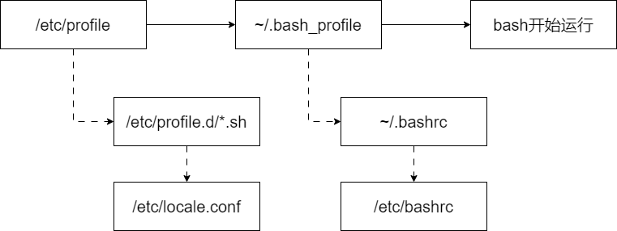
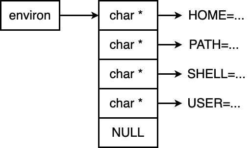
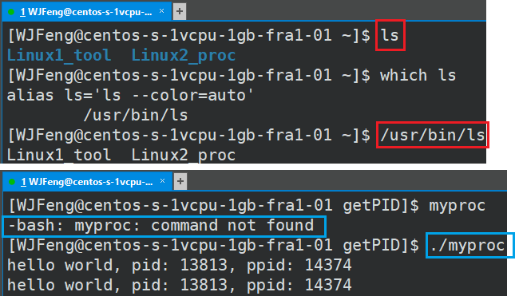
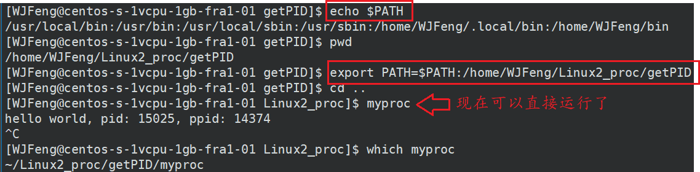

# 正则表达式

## *简介*

正则表达式是正则语言，使用单个字符串来描述、匹配一系列符合某个语法规则的字符串。在很多文本编辑器里，正则表达式都被用来检索、替换或者说**模糊匹配**那些符合某个模式 pattern 的文本。在Linux中，grep、sed、awk等文本处理工具都支持通过正则表达式来进行模式匹配

正则语言不仅限于某种特定编程语言，它在许多编程语言中都有支持，包括但不限于Perl、Python、Java、C++、JavaScript等

注意：**正则表达式的修饰符在不同编程语言和正则表达式引擎中可能会有些许不同**，因此在使用时，请查看相应的文档以了解支持和行为的详细信息。修饰符可以根据需要进行组合，以满足特定的匹配需求，从而提高正则表达式的灵活性和功能

## *元字符*

正则语言的元字符是一组特殊字符，它们具有特殊的含义，**用于在正则表达式中表示模式和匹配规则**。这些元字符通常不表示字面字符，而是表示一些特定的文本模式或操作

常规匹配就是一串**不包含**任何特殊字符的正则表达式匹配它自己

### 常用特殊字符用于模糊匹配

* `^` 匹配一行的开头，`^a` 以a开头的行
* `$` 匹配一行的结束，`t$` 以t为结尾的行。`^$` 匹配空行
* `.` **除换行符 `\n` 之外**的任意单个字符，比如 `r..t` 可以匹配任意以r开头，以t结尾的4字单词
* `*` wildcard 匹配前面一个字符零次或多次（任意多次），比如 `ro*t` 可以是rt、rot、root ... 。`.*` 可以匹配任意字符串，比如想要匹配任意以a开头，以bash结尾的字符串 `^a.*bash$`
* `+` 匹配前面一个字符一次或多次（至少一次）
* `?` 匹配前面一个字符零次或一次（至多一次）。例如，`ab?`匹配 "a" 或 "ab"
* `[]` 字符类集合：用于匹配单个字符中的一个字符。例如，`[aeiou]`匹配任何一个元音字母。下面是一些常用的字符类集合
  * `[0-9]` 匹配一个0到9的数字
  * `[0-9]*` 匹配任意长度的数字字符串
  * `[a-z]` 匹配一个a-z的字符
  * `[a-z]*` 匹配任意长度的字符字符串
  * `[A-Za-z0-9]` 匹配A-Z或者a-z或者0-9之间的任意字符
* `[^]`：在字符类内使用脱字符表示匹配除指定字符之外的任何字符。例如，`[^0-9]`匹配任何非数字字符
* `|`（管道符）：用于分隔多个模式，表示“或”关系。例如，`cat|dog`匹配 "cat" 或 "dog"
* `()`（捕获组 capturing group）：用于创建一个捕获组，可以在匹配中提取和操作捕获的子字符串。标记一个子表达式的开始和结束位置，子表达式可以获取供以后使用
* `{}` 用于确定匹配的次数
  * `{n}`：要求字符出现n次
  * `{n,}`：要求字符出现n到多次
  * `{n,m}`：要求字符出现n到m次

* `/` **通常不是正则表达式模式的一部分，而是用于包围正则表达式模式的定界符 delimiter**。在许多编程语言和环境中，正则表达式通常需要包含在斜杠之间，以指示这是一个正则表达式。这种方式有助于解释器或编译器识别正则表达式的开始和结束

### `\` 转义

`\` 表示转义，并不会单独使用。由于所有特殊字符都有其特定的匹配模式，当我们想要匹配某一特殊字符本身时，比如说想要找出所有包含 `$` 的行，就会发生问题，所以此时可以用 `\` 来消除特殊字符的特殊意义

注意：C++中使用时所有带有 `\` 的转义符都要写成 `\\` 转义

* `\A`：匹配输入字符串的开头，与 `^` 不同，它只匹配整个字符串的开始，不受多行模式的影响。
* `\Z`：匹配输入字符串的结尾，与 `$` 不同，它只匹配整个字符串的结尾，不受多行模式的影响。
* `\b`：匹配一个单词边界，用于确保匹配的单词或字符序列处于单词的开头或结尾。例如， `'er\b'` 可以匹配"never" 中的 `'er'`，但不能匹配 `"verb"` 中的 `'er'`
* `\B`：匹配非单词边界，与 `\b` 相反，用于匹配不处于单词边界的位置。`'er\B'` 能匹配 "verb" 中的 `'er'`，但不能匹配 "never" 中的 `'er'`
* `\w`：匹配任何字母、数字或下划线字符，相当于`[a-zA-Z0-9_]`
* `\W`：匹配任何非单词字符，与 `\w` 相反
* `\d`：匹配任何数字字符，相当于`[0-9]`
* `\D`：匹配任何非数字字符，与 `\d` 相反
* `\s`：匹配任何空白字符，包括空格、制表符、换行符等
* `\S`：匹配任何非空白字符，与 `\s` 相反
* `\t`：匹配制表符字符
* `\n`：匹配换行符字符
* `\r`：匹配回车符字符

### `?=`、`?<=`、`?!`、`?<!` 断言

正则表达式中的 `?=`、`?<=`、`?!`、`?<!` 是一些特殊的构造，用于进行正则表达式的先行断言 lookahead 和后行断言 lookbehind。它们允许在匹配模式中添加条件，以便只匹配满足特定条件的文本。以下是它们的作用和用法：

* 正向先行断言 Positive Lookahead
  * 语法：`exp1(?=exp2)`
  * 作用：查找 exp2 前面的 exp1。在当前位置匹配满足条件的文本，但不消耗输入字符串。它是一个零宽度断言，只检查当前位置之后的文本
  * 示例：`/foo(?=bar)/` 匹配 "foo"，但只有在后面紧跟着 "bar" 的情况下才匹配成功
* 正向后行断言 Positive Lookbehind
  * 语法：`(?<=exp2)exp1`
  * 作用：查找 exp2 后面的 exp1。在当前位置之前匹配满足条件的文本，但不消耗输入字符串。它是一个零宽度断言，只检查当前位置之前的文本
  * 示例：/(?<=foo)bar/ 匹配 "bar"，但只有在前面紧跟着 "foo" 的情况下才匹配成功
* 负向先行断言 Negative Lookahead
  * 语法：`exp1(?!exp2)`
  * 作用：查找后面不是 exp2 的 exp1。在当前位置匹配不满足条件的文本，但不消耗输入字符串。它是一个零宽度断言，只检查当前位置之后的文本
  * 示例：/foo(?!bar)/ 匹配 "foo"，但只有在后面不紧跟着 "bar" 的情况下才匹配成功
* 负向后行断言 Negative Lookbehind
  * 语法：`(?<!exp2)exp1`
  * 作用：查找前面不是 exp2 的 exp1。在当前位置之前匹配不满足条件的文本，但不消耗输入字符串。它是一个零宽度断言，只检查当前位置之前的文本
  * 示例：`/(?<!foo)bar/` 匹配 "bar"，但只有在前面不紧跟着 "foo" 的情况下才匹配成功

这些断言允许在匹配模式中添加条件，以限制匹配的范围，或者确保某些文本前后都满足特定条件。它们在处理复杂文本匹配问题时非常有用，但也需要谨慎使用，因为它们可能导致正则表达式变得复杂难懂

### 修饰符

正则表达式中的修饰符是一些可选标志，它们可以附加到正则表达式模式的末尾，以改变匹配行为。这些修饰符通常是单个字母，例如在大多数编程语言中都是单个字符

以下是一些常见的正则表达式修饰符：

* **/i**（不区分大小写）：通常用于匹配时不区分字母大小写。例如，`/abc/i` 可以匹配 "abc"、"AbC"、"aBC" 等。
* **/g**（全局匹配）：通常用于找到所有匹配项，而不仅仅是第一个匹配项。例如，`/abc/g` 可以找到输入字符串中的所有 "abc"
* **/m**（多行匹配）：通常用于处理多行文本，修改 `^` 和 `$` 的行为，使它们匹配每一行的开头和结尾。例如，`/pattern/m` 可以匹配多行文本中的 "pattern"
* **/s**（单行匹配）：通常用于处理单行文本，使 `.` 匹配**包括换行符在内**的任何字符。例如，`/a.b/s` 可以匹配 "a\nb"
* **/x**（扩展模式）：通常用于允许在模式中添加注释和空白字符，以提高可读性。例如，`/a b c/x` 可以匹配 "abc"
* **/u**（Unicode模式）：通常用于处理Unicode字符。它启用了Unicode字符的特殊处理，以便正确匹配Unicode字符。例如，`/\w/u` 可以匹配任何Unicode字母、数字和下划线

## *运算符优先级*

1. `\` 转义符
2. `(), (?:), (?=), []` 圆括号和方括号
3. `*, +, ?, {n}, {n,}, {n,m}` 限定符
4. `^, $, \任何元字符、任何字符` 定位点和序列（即：位置和顺序）
5. `|` 替换，"或"操作。字符具有高于替换运算符的优先级，使得"m|food"匹配"m"或"food"。若要匹配"mood"或"food"，请使用括号创建子表达式，从而产生"(m|f)ood"

## *常用正则表达式*

[正则表达式在线测试 | 菜鸟工具 (runoob.com)](https://c.runoob.com/front-end/854/)

### 校验数字的表达式

* 数字：`^[0-9]*$`
* n位的数字：`^\d{n}$`
* 至少n位的数字：`^\d{n,}$`
* m-n位的数字：`^\d{m,n}$`
* 零和非零开头的数字：`^(0|[1-9][0-9]*)$`
* 非零开头的最多带两位小数的数字：`^([1-9][0-9]*)+(\.[0-9]{1,2})?$`
* 带1-2位小数的正数或负数：`^(\-)?\d+(\.\d{1,2})$`
* 正数、负数、和小数：`^(\-|\+)?\d+(\.\d+)?$`
* 有两位小数的正实数：`^[0-9]+(\.[0-9]{2})?$`
* 有1~3位小数的正实数：`^[0-9]+(\.[0-9]{1,3})?$`
* 非零的正整数：`^[1-9]\d*$` 或 `^([1-9][0-9]*){1,3}$` 或 `^\+?[1-9][0-9]*$`
* 非零的负整数：`^\-[1-9][]0-9"*$` 或 `^-[1-9]\d*$`
* 非负整数：`^\d+$` 或 `^[1-9]\d*|0$`
* 非正整数：`^-[1-9]\d*|0$` 或 `^((-\d+)|(0+))$`
* 非负浮点数：`^\d+(\.\d+)?$` 或 `^[1-9]\d*\.\d*|0\.\d*[1-9]\d*|0?\.0+|0$`
* 非正浮点数：`^((-\d+(\.\d+)?)|(0+(\.0+)?))$` 或 `^(-([1-9]\d*\.\d*|0\.\d*[1-9]\d*))|0?\.0+|0$`
* 正浮点数：`^[1-9]\d*\.\d*|0\.\d*[1-9]\d*$` 或 `^(([0-9]+\.[0-9]*[1-9][0-9]*)|([0-9]*[1-9][0-9]*\.[0-9]+)|([0-9]*[1-9][0-9]*))$`
* 负浮点数：`^-([1-9]\d*\.\d*|0\.\d*[1-9]\d*)$` 或 `^(-(([0-9]+\.[0-9]*[1-9][0-9]*)|([0-9]*[1-9][0-9]*\.[0-9]+)|([0-9]*[1-9][0-9]*)))$`
* 浮点数：`^(-?\d+)(\.\d+)?$` 或 `^-?([1-9]\d*\.\d*|0\.\d*[1-9]\d*|0?\.0+|0)$`

### 校验字符的表达式

* 汉字：`^[\u4e00-\u9fa5]{0,}$`
* 英文和数字：`^[A-Za-z0-9]+$` 或 `^[A-Za-z0-9]{4,40}$`
* 长度为3-20的所有字符：`^.{3,20}$`
* 由26个英文字母组成的字符串：`^[A-Za-z]+$`
* 由26个大写英文字母组成的字符串：`^[A-Z]+$`
* 由26个小写英文字母组成的字符串：`^[a-z]+$`
* 由数字和26个英文字母组成的字符串：`^[A-Za-z0-9]+$`
* 由数字、26个英文字母或者下划线组成的字符串：`^\w+$` 或 `^\w{3,20}$`
* 中文、英文、数字包括下划线：`^[\u4E00-\u9FA5A-Za-z0-9_]+$`
* 中文、英文、数字但不包括下划线等符号：`^[\u4E00-\u9FA5A-Za-z0-9]+$` 或 `^[\u4E00-\u9FA5A-Za-z0-9]{2,20}$`
* 可以输入含有 `^%&',;=?$\"` 等字符：`[^%&',;=?$\x22]+`
* 禁止输入含有 `~` 的字符：`[^~]+`

### 特殊需求表达式

* Email地址：`^\w+([-+.]\w+)\*@\w+([-.]\w+)\*\.\w+([-.]\w+)\*$`
* 域名：`[a-zA-Z0-9][-a-zA-Z0-9]{0,62}(\.[a-zA-Z0-9][-a-zA-Z0-9]{0,62})+\.?`
* Internet URL：`[a-zA-z]+://[^\s]\*` 或 `^http://([\w-]+\.)+[\w-]+(/[\w-./?%&=]\*)?$`
* 手机号码：`^(13[0-9]|14[01456879]|15[0-35-9]|16[2567]|17[0-8]|18[0-9]|19[0-35-9])\d{8}$`
* 电话号码("XXX-XXXXXXX"、"XXXX-XXXXXXXX"、"XXX-XXXXXXX"、"XXX-XXXXXXXX"、"XXXXXXX"和"XXXXXXXX)：`^(\(\d{3,4}-)|\d{3.4}-)?\d{7,8}$`
* 国内电话号码(0511-4405222、021-87888822)：`\d{3}-\d{8}|\d{4}-\d{7}`
* 电话号码正则表达式（支持手机号码，3-4位区号，7-8位直播号码，1－4位分机号）: `((\d{11})|^((\d{7,8})|(\d{4}|\d{3})-(\d{7,8})|(\d{4}|\d{3})-(\d{7,8})-(\d{4}|\d{3}|\d{2}|\d{1})|(\d{7,8})-(\d{4}|\d{3}|\d{2}|\d{1}))$)`
* 身份证号(15位、18位数字)，最后一位是校验位，可能为数字或字符X：`(^\d{15}$)|(^\d{18}$)|(^\d{17}(\d|X|x)$)`
* 帐号是否合法(字母开头，允许5-16字节，允许字母数字下划线)：`^[a-zA-Z][a-zA-Z0-9_]{4,15}$
* 密码(以字母开头，长度在6~18之间，只能包含字母、数字和下划线)：`^[a-zA-Z]\w{5,17}$`
* 强密码(必须包含大小写字母和数字的组合，不能使用特殊字符，长度在 8-10 之间)：`^(?=.\*\d)(?=.\*[a-z])(?=.\*[A-Z])[a-zA-Z0-9]{8,10}$`
* 强密码(必须包含大小写字母和数字的组合，可以使用特殊字符，长度在8-10之间)：`^(?=.\*\d)(?=.\*[a-z])(?=.\*[A-Z]).{8,10}$`
* 日期格式：`^\d{4}-\d{1,2}-\d{1,2}`
* 一年的12个月(01～09和1～12)：`^(0?[1-9]|1[0-2])$`
* 一个月的31天(01～09和1～31)：`^((0?[1-9])|((1|2)[0-9])|30|31)$`
* 钱的输入格式：
  1. 有四种钱的表示形式我们可以接受:"10000.00" 和 "10,000.00", 和没有 "分" 的 "10000" 和 "10,000"：`^[1-9][0-9]\*$`
  2. 这表示任意一个不以0开头的数字,但是,这也意味着一个字符"0"不通过,所以我们采用下面的形式：`^(0|[1-9][0-9]\*)$`
  3. 一个0或者一个不以0开头的数字.我们还可以允许开头有一个负号：`^(0|-?[1-9][0-9]\*)$`
  4. 这表示一个0或者一个可能为负的开头不为0的数字.让用户以0开头好了.把负号的也去掉,因为钱总不能是负的吧。下面我们要加的是说明可能的小数部分：`^[0-9]+(.[0-9]+)?$`
  5. 必须说明的是,小数点后面至少应该有1位数,所以"10."是不通过的,但是 "10" 和 "10.2" 是通过的：`^[0-9]+(.[0-9]{2})?$`
  6. 这样我们规定小数点后面必须有两位,如果你认为太苛刻了,可以这样：`^[0-9]+(.[0-9]{1,2})?$`
  7. 这样就允许用户只写一位小数.下面我们该考虑数字中的逗号了,我们可以这样：`^[0-9]{1,3}(,[0-9]{3})\*(.[0-9]{1,2})?$`
  8. 1到3个数字,后面跟着任意个 逗号+3个数字,逗号成为可选,而不是必须：`^([0-9]+|[0-9]{1,3}(,[0-9]{3})\*)(.[0-9]{1,2})?$`
  9. 备注：这就是最终结果了,别忘了"+"可以用"*"替代如果你觉得空字符串也可以接受的话(奇怪,为什么?)最后,别忘了在用函数时去掉去掉那个反斜杠,一般的错误都在这里
* xml文件：`^([a-zA-Z]+-?)+[a-zA-Z0-9]+\\.[x|X][m|M][l|L]$`
* 中文字符的正则表达式：`[\u4e00-\u9fa5]`
* 双字节字符：`[^\x00-\xff]` (包括汉字在内，可以用来计算字符串的长度(一个双字节字符长度计2，ASCII字符计1))
* 空白行的正则表达式：`\n\s\*\r` (可以用来删除空白行)
* HTML标记的正则表达式：`<(\S\*?)[^>]\*>.\*?|<.\*? />` ( 首尾空白字符的正则表达式：`^\s\*|\s\*$` 或 `(^\s\*)|(\s\*$)` (可以用来删除行首行尾的空白字符(包括空格、制表符、换页符等等)，非常有用的表达式)
* 腾讯QQ号：`[1-9][0-9]{4,}` (腾讯QQ号从10000开始)
* 中国邮政编码：`[1-9]\d{5}(?!\d)` (中国邮政编码为6位数字)
* IPv4地址：`((2(5[0-5]|[0-4]\d))|[0-1]?\d{1,2})(\.((2(5[0-5]|[0-4]\d))|[0-1]?\d{1,2})){3}`

# 文本处理工具

https://blog.csdn.net/qq_44918090/article/details/120636716

在Linux中，grep、sed、awk等文本处理工具都支持通过正则表达式来进行模式匹配

## *grep*

### grep命令

`grep`是一个强大的命令行工具，用于在文本文件中搜索指定的模式（正则表达式或字符串），并将匹配的行打印到标准输出。它的名字"grep"是"Global Regular Expression Print"的缩写，强调了其在全局范围内搜索和打印匹配文本的功能。以下是`grep`的基本用法和一些常见选项：

```cmd
$ grep [option] "string_to_find" [filename]
```

* `[option]`：可以是一些控制`grep`行为的可选选项
* `"string_to_find"`：要搜索的文本模式，可以是普通字符串或正则表达式
* `[filename]`：是要搜索的输入文件的名称。如果未提供文件名，则`grep`将默认从标准输入读取数据

`grep`的一些常用选项和用法包括：

* 基本搜索：默认情况下，`grep`搜索并打印包含指定模式的行。例如，搜索文件`input.txt`中包含字符串"pattern"的行：

  ```cmd
  $ grep "pattern" input.txt
  ```

  Grep默认会把搜索到的内容放到标准输出中，有两种方法来避免

  * 可以用 `-q` 选项，它使 `grep` 在找到匹配行时不输出内容，只返回状态码
  * `> /dev/null` 重定向到垃圾桶

* 正则表达式搜索：`grep`支持正则表达式搜索。使用`-E`选项或`--extended-regexp`选项来启用扩展正则表达式，以进行更复杂的匹配。

  ```cmd
  $ grep -E "regex_pattern" input.txt
  ```

* 逆向搜索：使用`-v`选项可以进行逆向搜索，打印**不包含指定模式**的行

* 统计匹配行数：使用`-c`选项可以仅显示匹配的行数，而不是匹配的行本身

* 忽略大小写：使用`-i`选项可以忽略大小写进行搜索

* 递归搜索：使用`-r`选项可以递归地搜索目录下的所有文件

  ```cmd
  $ grep -r "pattern" /path/to/directory
  ```

* 查找模式匹配的文件名：`-l` 选项

* 打印行号：`-n`

## *awk*

awk命令实际上是一种脚本语言。awk是一种报告生成器，格式化以后显示。如果对处理的数据需要生成报告之类的信息，或者处理的数据是**按列**进行处理的，最好使用awk

之所以叫AWK是因为其取了三位创始人 Alfred Aho、Peter Weinberger 和 Brian Kernighan 的姓的首字符

### awk 的选项参数

```cmd
$ awk [option] <'pattern{command}'> <filenames}>
```

其中 `pattern` 是一个模式或条件，用于筛选需要处理的行。`action` 是对符合模式的行执行的操作

* `-F` 用于指定字段分隔符，即定义字段的分割方式。默认情况下，AWK 使用空格或制表符作为字段分隔符

  ```cmd
  $ awk -F',' '{ print $1 }' filename.csv
  ```

* `-f` 允许从外部文件中加载 AWK 脚本，而不是直接在命令行中提供脚本

  ```cmd
  $ awk -f script.awk filename
  ```

* `-v` 用于定义 AWK 中的变量，可以在命令行上设置变量的值

  ```cmd
  $ awk -v var=value '{ print $1, var }' filename
  ```

* `-W` 用于启用或禁用某些特定的 AWK 功能。比如 `-W interactive` 选项允许在交互模式下运行 AWK

* `-b` 用于将 AWK 脚本编译为 C 代码，然后执行编译后的程序，这样可以提高执行速度

* `-l` 选项用于加载 AWK 的扩展库，以便使用额外的函数或功能

### awk 的command & pattern

* command
  * 内置函数
    * `print` 命令用于打印文本行或计算结果。可以打印文本、变量、字段等内容
    * `printf` 命令用于格式化输出，可以按照指定的格式打印文本和变量
    * `next` 命令用于跳过当前行，继续处理下一行
    * `delete` 命令用于删除数组中的元素
  * 控制指令：if else、while、for、do-while、break、continue、next、exit，格式都和 C 一样
* pattern：正则表达式和逻辑判断式

### awk 的内置参数

* **`$0`**：当前记录（行）的完整文本
* **`$1`**：当前记录的第一个字段，**`$2`**：当前记录的第二个字段，以此类推 **`$n`** 表示当前记录的第 `n` 个字段
* **`NF`** 是一个表示当前行中字段数量的内置参数。它在每一行处理时自动更新。例如，如果一行有 5 个字段，`NF` 的值将为 5
* **`NR`** 是一个表示当前处理的行数的内置参数。它在处理每一行时自动递增。例如，如果正在处理文件的第 10 行，`NR` 的值将为 10
* **`FS`** 是一个表示字段分隔符的内置参数。默认情况下，`FS` 的值为一个或多个空格字符（空格或制表符）。可以使用 `-F` 命令行选项或在 AWK 脚本中进行设置来更改字段分隔符
* **`OFS`** 是一个表示输出字段分隔符的内置参数。默认情况下，`OFS` 的值为空格。可以在 AWK 脚本中设置 `OFS` 来定义输出字段之间的分隔符
* **`RS`** 是一个表示记录分隔符的内置参数。默认情况下，`RS` 的值为换行符 `\n`，即一行结束。可以在 AWK 脚本中修改 `RS` 的值以定义不同的记录分隔符
* **`ORS`** 是一个表示输出记录分隔符的内置参数。默认情况下，`ORS` 的值为换行符 `\n`。可以在 AWK 脚本中设置 `ORS` 来定义输出记录之间的分隔符
* **`FILENAME`** 是一个表示当前处理的文件名的内置参数。在处理多个文件时，`FILENAME` 将依次包含每个文件的名称
* **`ARGV`** 是一个包含命令行参数的数组。`ARGV[0]` 包含 AWK 的命令，`ARGV[1]`、`ARGV[2]` 等包含其他命令行参数

## *sed*

### sed命令

Sed（stream editor）可以用来在管道或命令序列中编辑数据。和ed不同，sed不是交互式程序，sed会将指令的命令应用到输入的每一行上，并将结果写入到标准输出

```cmd
$ sed [选项] '脚本' [文件]
```

* `[选项]`：可以是一些控制`sed`行为的可选选项
* `'脚本'`：是`sed`命令的操作序列，通常包含一个或多个`sed`命令，用于指定文本的处理方式
* `[文件]`：是要处理的输入文件的名称。如果未提供文件名，`sed`将默认从标准输入读取数据

下面介绍sed的选项

* `-n` ：默认情况下sed将输入的每一行都写入到标准输出中，`-n` 则告诉sed默认不打印任何行。与之搭配使用的是 p 命令,p 命令可以打印出符合指定范围或模式的所有行

  ```cmd
  $ sed -n '1,2p' input.txt # 只打印前两行
  ```

  下面这个命令用来查看一些特殊的符号，比如说制表符 `\t` 之类的很好用

  ```cmd
  $ sed -n l file
  ```

* `-e`：多个操作，可以将多个`sed`命令组合在一起，以依次对文本进行多次处理

  ```cmd
  $ sed -e 's/old/new/g' -e '/pattern/d' input.txt
  ```

## *搜索*

grep的递归搜索

```cmd
$ grep -r "pattern" /path/to/directory
```

### find

`find` 命令是在Linux和Unix系统中用于搜索文件和目录的强大工具。它可以在指定的目录树中递归搜索文件，并根据不同的条件进行筛选。下面是 `find` 命令的常见用法和选项：

```cmd
$ find [起始目录] [选项] [表达式]
```

* `起始目录`：指定搜索的起始目录。如果不提供起始目录，默认从当前目录开始搜索
* `选项`：`find` 命令的选项，用于指定搜索的条件和行为
* `表达式`：用于定义搜索条件的表达式，可以包含文件名、文件类型、大小、权限等信息

以下是一些常见的 `find` 命令选项和用法：

* 搜索文件名：使用 `-name`  选项可以根据文件名搜索文件。例如，要搜索名为 "myfile.txt" 的文件

  ```cmd
  $ find /path/to/search -name "myfile.txt"
  ```

  用通配符来进行模糊搜索

* 搜索文件类型：使用 `-type` 选项可以根据文件类型进行搜索。常见的类型包括 `f`（普通文件）和 `d`（目录）

* 搜索文件大小：使用 `-size` 选项可以根据文件大小进行搜索。可以指定大小的单位，如 `k`（千字节）和 `M`（兆字节）。例如，要搜索大于1MB的文件

  ```cmd
  $ find /path/to/search -type f -size +1M
  ```

* 搜索文件权限：使用 `-perm` 选项可以根据文件权限进行搜索。可以指定八进制数字来表示文件权限。例如，要搜索具有读取权限的文件

  ```cmd
  $ find /path/to/search -type f -perm /u+r
  ```

* 递归搜索：find默认会递归搜索指定目录及其子目录中的文件。若不需要递归搜索，可以使用 `-maxdepth` 选项来限制搜索的深度。例如，要在当前目录中搜索文件，但不包括子目录

  ```cmd
  $ find . -maxdepth 1 -name "myfile.txt"
  ```

* 执行操作：可以使用 `-exec` 选项来执行操作，例如打印匹配的文件或执行其他命令。例如，要打印匹配的文件路径，可以运行

  ```cmd
  $ find /path/to/search -name "myfile.txt" -exec echo {} \;
  ```

### locate

`locate` 命令是用于快速搜索文件和目录的命令，它通常比 `find` 命令快速，并且适用于那些已建立好的文件数据库。`locate` 命令搜索一个预先生成的数据库，而不是实时搜索文件系统，因此可以快速找到文件，但不会返回最新创建或修改的文件

```cmd
$ locate [选项] [模式]
```

* `选项`：一些常见的 `locate` 命令选项包括：
  * `-i`：不区分大小写地搜索
  * `-c`：只返回匹配项的数量，而不是文件路径
  * `-l`：只返回匹配项的文件路径，而不输出详细信息
  * `-e`：将搜索模式视为扩展的正则表达式
* `模式`：要搜索的文件或目录的名称模式。可以使用通配符或正则表达式

### 搜索可执行文件和库

在Linux上，`where`、`whereis`、`whence` 和 `which` 是用于**查找可执行文件和命令**的命令，它们有不同的用途和行为。以下是对这些命令的简要介绍：

* where

  `where` 命令通常不是Linux系统中的标准命令，而是一些shell（如bash）的内建命令。它用于查找**特定命令**的位置。`where` 会搜索系统的 PATH 变量中指定的目录，以找到命令的位置并显示在屏幕上

  ``` cmd
  $ where ls
  ```

2. **`whereis` 命令**：

   * `whereis` 命令用于查找二进制、源代码和帮助页面文件的位置。它会在一些标准的系统目录中搜索，并显示相关文件的路径。

   * 示例：

     ```cmd
     $ whereis ls
     ```

  上述命令将显示与 `ls`  命令相关的二进制、源代码和帮助页面文件的路径。
     

3. **`whence` 命令**：

   * `whence` 命令通常不是Linux系统中的标准命令，而是某些shell（如ksh）的内建命令。它用于显示命令的位置，类似于 `which` 命令。

   * 示例：

     ```cmd
     $ whence ls
     ```

  上述命令会显示 `ls` 命令的位置
     

4. **`which` 命令**：

   * `which` 命令用于查找并显示命令的位置。它会搜索系统的 PATH 变量中指定的目录，并显示第一个匹配到的命令的路径。

   * 示例：

     ```cmd
     $ which ls
     ```

     上述命令会显示 `ls` 命令的路径，通常是该命令的二进制可执行文件的位置。

总结：

* `where` 和 `whence` 命令通常是特定shell的内建命令，具体取决于使用的shell。它们的主要目的是查找命令的位置，但它们的行为可能会因不同的shell而异
* `whereis` 和 `which` 命令是通用的Linux命令，用于查找命令和文件的位置。`whereis` 还可以查找源代码和帮助页面文件。它们在绝大多数Linux发行版中都是可用的

## *其他*

### cut

`cut`命令用于在文本文件中剪切和提取字段的命令行工具。它通常用于从文本行中选择特定的列或字符，然后将结果输出到标准输出或文件中。`cut`命令的基本语法如下：

* `d`选项：指定字段分隔符，默认为制表符（Tab `\t`）

  ```cmd
  $ cut -d',' -f2 file.txt  # 使用逗号作为分隔符提取第二个字段
  ```

* `-f`选项：指定要提取的字段或字段范围

  ```cmd
  $ cut -f1,3 file.txt    # 提取第一个和第三个字段
  $ cut -f2-4 file.txt    # 提取第二到第四个字段
  ```

* `-c`选项：指定在每行中要提取的字符位置或范围

  ```cmd
  $ cut -cchars <file-name>
  $ cut -c1-5 file.txt    # 提取第1到第5个字符
  $ cut -c2,4,6 file.txt  # 提取第2、4和6个字符
  ```

* `-s`选项：禁止输出不包含分隔符的行

  ```cmd
  $ cut -s -d',' -f2 file.txt  # 只输出包含逗号分隔符的行的第二个字段
  ```

* `--complement`选项：输出除指定字段之外的字段

  ```cmd
  $ cut -d',' --complement -f2 file.txt  # 输出除第二个字段之外的所有字段
  ```

### paste

paste 命令的效果和 cut 相反：它不是拆分行，而是合并行

* `-d`或`--delimiter`：用于指定分隔符，它允许在合并后的行之间插入一个自定义的分隔符。例如，`-d ','`将使用逗号作为分隔符
* `-s`或`--serial`：默认情况下，`paste`命令将文件按行并列合并。如果使用了`-s`选项，它将从第一个文件开始，合并每个文件的所有行，然后再合并下一个文件的所有行，以此类推

### ed

`ed`是一个文本编辑器，它可以用于在命令行中编辑文本文件。它是Unix系统最早的文本编辑器之一，在每一个Unix系统中都默认有。通常用于批量编辑文本文件或在纯文本终端环境中进行编辑

`ed`的使用方式是在终端中启动`ed`程序，然后输入一系列命令来编辑文本。`ed`不提供图形用户界面，因此在使用时需要学习一些命令语法。例如，可以使用`ed`来插入、删除、替换文本行，以及移动光标等

```cmd
$ ed filename.txt
ed> 1i            # 在第一行之前插入文本
This is a test.
.
ed> 2d            # 删除第二行
ed> 3s/old/new/   # 将第三行中的 "old" 替换为 "new"
ed> w             # 保存更改
ed> q             # 退出编辑器
```

### tr

`tr`命令用于在文本流中进行字符转换和删除操作。它通常用于处理文本数据的字符级别操作，例如字符替换、删除和转换。以下是`tr`命令的基本用法和一些常见选项：

```cmd
$ tr [选项] 字符集1 字符集2
```

* `[选项]`：可以是一些控制`tr`行为的可选选项
* `字符集1`：要被替换或删除的字符集
* `字符集2`：用于替换或转换的字符集

`tr`的一些常用选项和用法包括：

1. **替换字符**：最常见的用法是替换一个字符集中的字符为另一个字符集中的字符。例如，将所有小写字母转换为大写字母：

   ```cmd
   $ echo "hello" | tr 'a-z' 'A-Z'
   ```

   输出结果为："HELLO"

2. **删除字符**：可以使用`-d`选项来删除指定字符集中的字符。例如，删除文本中的所有空格：

   ```cmd
   $ echo "Hello, World!" | tr -d ' '
   ```

   输出结果为："Hello,World!"

3. **字符集补集**：可以使用`-c`选项来指定字符集的补集，即除了指定字符集以外的所有字符。例如，删除除了数字以外的所有字符：

   ```cmd
   $ echo "abc123" | tr -c '0-9' '\n'
   ```

   输出结果为："123"

4. **字符转义**：使用`-s`选项可以将多个连续重复的字符替换为一个字符。这在压缩连续的空格或其他字符时非常有用。

   ```cmd
   $ echo "Too      many       spaces." | tr -s ' '
   ```

   输出结果为："Too many spaces."

5. **删除换行符**：可以使用`-d`选项删除换行符，将文本压缩成一行。

   ```cmd
   $ cat file.txt | tr -d '\n'
   ```

6. **将字符映射为其他字符**：通过提供字符映射表，可以将一个字符集中的字符映射为另一个字符集中的字符。例如，将数字0-9映射为字母a-j：

   ```cmd
   $ echo "0123456789" | tr '0-9' 'a-j'
   ```

   输出结果为："abcdefghij"

### sort

`sort`命令用于对文本文件中的行进行排序的。它默认按照字母顺序（升序）对文本行进行排序，但也可以根据需要进行不同类型的排序。特殊字符会根据其内部编码来排序，另外一些外语字符、标点符号和其他特殊字符的排序可能会出现一些意料之外的情况

以下是`sort`命令的基本用法和一些常见选项：

* `-u`：去重，只保留唯一的行。等价于 `sort | uniq`
* `-r`：进行逆序（降序）排序，将结果从大到小排列
* `-n`：按数字顺序排序，这将确保数字按数值大小而不是字符顺序进行排序

### uniq

```cmd
$ uniq <input_file> [output_file]
```

uniq 命令可用于查找或删除文件中的重复行

uniq 将 input_file 复制为 output_file，同时删除所有重复的行。uniq 将重复的行定义为内容一模一样的连续行。若没有指定 output_file,则结果会写入标准输出。若 input_file 也没有指定，那么 uniq 可以作为过滤器，即从标准输入中读取输入

uniq 的-c 选项可以统计出现的次数，在脚本中极为有用

### tee

`tee` 用于从标准输入中读取数据，并将数据同时输出到标准输出和一个或多个文件。它的名字"tee"来自于水管系统中的T型接头，表示数据从一个管道分流到多个管道的操作。`tee`通常用于将命令的输出保存到文件同时在终端上显示输出，或者将**输出传递给多个不同的处理管道。以下是`tee`的基本用法和一些常见选项：

```cmd
$ command | tee [选项] 文件...
```

* `command`：是生成输出的命令或命令序列
* `[选项]`：可以是一些控制`tee`行为的可选选项
* `文件...`：是要写入数据的文件的列表

`tee`的一些常用选项和用法包括：

* 保存输出到文件：最简单的用法是将命令的**输出保存到一个或多个**文件中。例如，将命令的输出保存到`output1.txt`和`output2.txt`文件：

   ```cmd
   $ command | tee output.txt output2.txt 
   ```

   `tee`**默认会将命令的输出显示在终端上**，即使将其写入文件。这对于查看实时输出非常有用

* 忽略标准输出：使用`-`（单破折号）选项可以忽略标准输出，只将数据写入文件

   ```cmd
   $ command | tee - output.txt
   ```

* 追加到文件：使用`-a`选项可以将输出追加到文件而不是覆盖文件内容。例如，将命令的输出追加到`output.txt`文件：

   ```cmd
   $ command | tee -a output.txt
   ```


* 

# Shell

## *Shell功能*

### 命令解析 & 执行

* **命令行中的 `if` 语句**：当你在命令行中直接输入 `if` 语句时，Shell 需要一种方式来知道何时一个命令结束，何时另一个命令开始。因为命令行是交互式的，Shell 不能像处理脚本那样等待直到它遇到一个换行符。在这种情况下，分号 `;` 用作命令分隔符，它告诉 Shell 一个命令已经结束，可以开始解析下一个命令了。例如：

   ```cmd
   $ if [ condition ]; then command; fi
   ```

   在这里，分号用于分隔 `if` 语句中的不同部分，使 Shell 能够正确解析整个语句。

* **脚本中的 `if` 语句**：在 Shell 脚本中，换行符本身就作为命令分隔符。当 Shell 解析脚本时，它使用换行符来确定命令何时结束，因此你不需要在每个命令后加分号。例如：

   ```shell
   if [ condition ]
   then
       command
   fi
   ```

   在这个例子中，每行的结束本身就表示了命令的结束，所以不需要额外的分号。

要注意的是，在脚本中，即使不是必须的，你仍然可以使用分号。这可以在某些情况下（例如将 `then` 放在与 `if` 相同的行上）提高代码的可读性或满足个人编码风格。例如：

```shell
if [ condition ]; then
    command
fi
```

## *实现简单Shell*

### shell执行的命令

* 第三方提供的对应的在磁盘中有具体二进制文件的可执行程序，由子进程来执行
* shell内部自己实现的方法，由自己（即父进程）来执行。有些命令就是要用来影响shell本身的，如cd是要用来切换shell本身的路径

### 实现

```c
#include <stdio.h>
#include <stdlib.h>
#include <unistd.h>
#include <sys/wait.h>
#include <string.h>
#include <sys/types.h>

#define NUM 1024
#define SIZE 32
#define SEP " "

// 定义缓冲区
char* g_argv[SIZE]; // 保存依次parse之后的命令行字符串
char cmd_line[NUM]; // 保存完整的命令行字符串
char g_myval[64];   // 写一个环境变量的buffer，用来测试

// shell运行原理：通过让子进程执行命令，父进程等待&&解析命令
int main() {
    extern char** environ; // 环境变量列表
    // 0. 命令行解释器，一定是一个常驻内存的进程，不退出
    while (1) {
        // 1. 打印出提示信息 [root@localhost myshell]
        printf("[root@localhost myshell]# ");
        fflush(stdout);
        memset(cmd_line, '\0', sizeof(cmd_line));

        // 2. 获取用户键盘输入[输入的是各种指令和选项：如"ls -a -l -i"]
        if (fgets(cmd_line, sizeof(cmd_line), stdin) == NULL) continue;
        cmd_line[strlen(cmd_line)-1] = '\0';
        //printf("echo: %s\n", cmd_line);
        
        // 3. 命令行字符串解析/parse："ls -a -l -i" -> "ls", "-a", "-l", "-i"
        // 可以在每个空格处放置'\0'后依次拆开。也可以使用strtok函数 
        g_argv[0] = strtok(cmd_line, SEP); // strtok第一次调用要传入原始字符串
        int index = 1;
        if (strcmp(g_argv[0], "ls") == 0) g_argv[index++] = "--color=auto";
        if (strcmp(g_argv[0], "ll") == 0) {
            g_argv[0] = "ls";
            g_argv[index++] = "-1";
            g_argv[index++] = "--color=auto";
        }
        //while (1) {
        //    g_argv[index] = strtok(NULL, SEP); // 第二次若还要解释原始字符串，则传入NULL
        //    index++;
        //}
        while (g_argv[index++] = strtok(NULL, SEP)); // 解析字符
        for (index=0; g_argv[index]; index++) 
            printf("g_argv[%d]: %s\n", index, g_argv[index]);
        
        // 4. 内置命令，让父进程（shell）自己执行的命令，我们叫做内置命令/内建命令
        // 内置命令本质就是shell中的一个函数调用，因此若拿到的是内置命令，则父进程直接执行
        if (strcmp(g_argv[0], "export") == 0 && g_argv[1] != NULL) {
            strcpy(g_myval, g_argv[1]);
            int ret = putenv(g_myval);
            if (ret == 0) printf("%s export success\n", g_argv[1]);
            for (int i=0; environ[i]; i++) printf("%d: %s\n", i, environ[i]);
            continue;
        }
        if (strcmp(g_argv[0], "cd") == 0) {
            if (g_argv[1] != NULL) chdir(g_argv[1]); // chdir系统调用
            continue;
        }
        // 5. fork()
        pid_t id = fork();
        if (id == 0) {
            // child
            printf("功能让子进程进行\n");
            printf("child, MYVAL: %s\n", getenv("MYVAL"));
            printf("child, PATH: %s\n", getenv("PATH"));
            //execvpe(g_argv[0], g_argv, environ);
            execvp(g_argv[0], g_argv);
            // 问题在于类似于cd这样的命令，这能作用在子进程中，并不能影响shell的路径
            exit(1);
        }
        // father
        int status = 0;
        pid_t ret = waitpid(id, &status, 0);
        if (ret > 0) printf("exit code: %d\n", WEXITSTATUS(status));
    }
    return 0;
}
```

shell的环境变量是从其配置文件中来的，`.bashrc` (resource configuration) 是一个脚本文件，当shell启动的时候，通过执行改脚本来读取对应的配置文件

# 脚本 & 变量

## *helloworld*

```shell
#! /bin/bash
echo "hello, world"
```

脚本以 `#!/bin/bash` 开头来制定解析器 parser

### 执行方式

* 调用子bash或子sh来执行 `bash helloworld.sh`，嵌套执行可能会影响环境变量
* 用绝对路径或相对路径来执行脚本文件
* 用 `source`（csh实现）或 `.`（bash实现） 命令来执行脚本文件。source调用并加载新的配置到子bash

## *普通变量*

### 分类

* 普通变量，也称为关键字参数
* 传递给脚本或命令的特殊的 Shell 变量，也称为位置参数
* 环境变量
* 全局和局部
  * 全局对所有bash有效，局部只对当前bash有效
  * 用户自定义的默认都是局部变量，可以通过 `export` 来导出为全局变量。但是特别的是对于子shell中更改了全局变量，不会对父shell造成影响

使用一个定义过的变量，只要在变量名前面加 `$` 符号

### 变量定义的规则

* 变量名称可以由字母、数字和下划线组成，但是不能以数字开头，环境变量名建议大写

* **等号两侧不能有空格**

* 变量的值如果有空格，需要使用双引号或单引号括起来

* 在bash中，**变量默认类型都是字符串类型**，无法直接进行数值运算。需要使用下面会介绍的算术扩展机制

  ```shell
  count=1
  ```

* 声明静态/只读变量：readonly变量 `readonly b=5`

### 变量相关命令

* 撤销变量：unset命令
* set命令用于设置或修改Shell的选项和参数。`set`命令可以用于启用或禁用各种Shell功能，以及设置全局或局部变量。它还可以用于设置特殊的Shell行为。下面是一些常见的`set`命令的用法和示例
  * 启用和禁用选项：
    * `set -x`：启用脚本的调试模式，会输出每个命令执行前的提示
    * `set +x`：禁用调试模式
    * `set -e`：如果某个命令返回非零退出状态，则立即退出脚本
    * `set +e`：禁用上述的"立即退出"模式
    * `set -u`：对未初始化的变量执行操作时，产生错误
    * `set +u`：禁用对未初始化变量的错误检查
  * 设置位置参数：
    * `set --`：清除所有位置参数
    * `set -- arg1 arg2 arg3`：设置新的位置参数
  * 修改特殊行为：
    * `set -o option`：启用某个特殊行为选项
    * `set +o option`：禁用某个特殊行为选项

## *传参*

### 位置参数

* `$1` ~ `$9`：代表第1-9个参数

  ```shell
  #! /bin/bash
  echo "Hello, "
  echo $0
  echo $1
  echo $2
  echo ${10}
  ```

* `${n}`：若给程序提供的参数多于 9 个，是没法访问第 10 个以及之后的参数的。 比方说当访问第 10 个参数的时候写成 `$10` 的时候，那么 Shell 实际上会替换$1 的值，然后在后面加上一个 0。比如要写成 **`${n}`** 的格式才行

* `$0`：Shell 会自动将程序名保存在特殊变量 `$0` 中

* `$#`：参数个数统计，获取所有输入参数的数量。常用于循环，判断参数的个数是否正确以及增强脚本的健壮性

* `$?`：最后一次执行的命令的返回状态，若为0则上次命令正确指令，非0则执行不正确

* `$*`：代表命令行中所有的参数，`$*` 把所有的参数看成一个整体

* `$@`：也代表命令中所有的参数，但是 `$@` 把每个参数区分对待，即形成一个集合或者数字


注意：shell中的 `$@` 和makefile script中的 `$@` 意义是不同的

### 参数替换

* `${parameter}`

  若参数名后的字符可能会造成名字冲突，可以把参数名放进花括号内

  ```shell
  mv $file ${file}x
  mv file $filex # 试图去找名为filex变量的值
  ```

* `{parameter:-value}`

  如果`${parameter}`未设置或为空时，将默认值`value`替换到字符串中

  ```shell
  # 如果未设置或为空，使用默认值
  unset variable
  result="${variable:-Default Value}"
  echo "${result}"  # 输出: Default Value
  
  # 如果设置了值，使用该值
  variable="Custom Value"
  result="${variable:-Default Value}"
  echo "${result}"  # 输出: Custom Value
  ```

* `{parameter:=value}`

  ```shell
  # 如果未设置或为空，使用默认值，并将变量设置为默认值
  unset variable
  result="${variable:=Default Value}"
  echo "${result}"  # 输出: Default Value
  echo "${variable}"  # 输出: Default Value
  
  # 如果设置了值，使用该值，并保持变量不变
  variable="Custom Value"
  result="${variable:=Default Value}"
  echo "${result}"  # 输出: Custom Value
  echo "${variable}"  # 输出: Custom Value
  ```

* `{parameter:?value}`

  如果`${parameter}`未设置或为空时，将错误信息`value`输出到标准错误，并退出脚本

  ```shell
  # 如果未设置或为空，输出错误信息并退出脚本
  unset variable
  result="${variable:?Variable is not set or is empty.}"
  # 输出到标准错误并退出脚本
  ```

* `${parameter:+value}`

  如果`${parameter}`已设置且不为空时，将值`value`替换到字符串中

  ```shell
  # 如果设置了值，使用附加值
  variable="Custom Value"
  result="${variable:+Additional Value}"
  echo "${result}"  # 输出: Additional Value
  
  # 如果未设置或为空，不附加值
  unset variable
  result="${variable:+Additional Value}"
  echo "${result}"  # 输出为空字符串
  ```

另外可以用 `${#variable}` 来得到变量中保存了多少个字符

### 模式匹配

## *算术扩展*

所有的现代 UNIX 以及 Linux 发行版，（包括 Mac OSX 的命令 Shell）中所包含的 POSIX 标准 Shell 提供了算术扩展 arithmetic expansion 机制，能够用于执行 Shell 变量的整数运算。不过有些比较旧的 Shell 并不支持该特性

算术扩展的格式为:  `$((expression))`

### 算术扩展命令支持的运算符

要进行数值运算要用运算符 operator 表达

```shell
a=$((1+5)) # (()) 里面可以用<=这种数学表达式
a=$[5+9]
```

Unix/Linux shell支持

* 常见的算术运算符：加减乘除、取模 `%`
* 比较运算符：`==`、`!=`、`>`、`<`、`>=`、`<=` 等

### `expr` 命令

当旧的 Shell 不支持算术扩展的情况下, 可以使用数学等式解算器 mathematical equation solver `expr` 命令来代替

或者用比较麻烦的 `expr` 算术扩展命令： `expr 1 + 2` 的时候中间要有空格，而且 `*` 要转义，即 `\*`

## *Bash的内置变量*

### BASH_SOURCE数组

https://www.junmajinlong.com/shell/bash_source/index.html

`BASH_SOURCE` 是一个 Bash 的内置数组变量，它包含了当前 Bash 脚本的文件名和路径，以及调用当前脚本的所有函数的名称和路径

* `BASH_SOURCE[0]`: 包含了当前执行的脚本的文件名和路径
* `BASH_SOURCE[1]`: 如果脚本是从另一个脚本中被调用的，那么 `BASH_SOURCE[1]` 将包含调用当前脚本的脚本的文件名和路径
* `BASH_SOURCE[2]`、`BASH_SOURCE[3]` 等等，以此类推，如果存在更深层次的嵌套调用，它们将包含更多调用的脚本的信息

# 环境变量

## *局部变量 & export*

### export导出变量

所有非环境变量的普通变量都是局部变量

通过export可以将变量**递归地**传到 export 命令之后的所有子 Shell 中，所谓的递归就是指子 Shell 的子 Shell 们都可以拿到这个变量

export可以用来设置一个新的环境变量（增减环境变量），当然通过这个方法修改的环境变量会在重启shell后被重置，要想持久化需要修改shell的配置文件，比如bash的 `~/.bashrc`

### Linux中Bash的配置文件组织

上面提到要持久化环境变量就必须写入shell的配置文件，下面介绍一下OS中bash配置文件的组织结构



上图是一个Bash启动时依次需要读取的配置文件，这些文件全部都是shell脚本

* `/etc/profile` 是系统整体的设定：根据用户的UID设定各种环境变量以提供不同的权限。因为用户可以有多个 shell 比如 bash, sh, zsh 之类的，但像环境变量这种其实只需要在统一的一个地方初始化就可以了
  * `/etc/profile.d/` 文件夹下的各种shell文件用来设置Bash的各种属性 
  * `/etc/locate.conf` 负责环境变量 `$LANG` 来设置系统的语系
* `~/.bash_profile` 是每个用户的个人设定，它会再读入 `~/.bashrc`
  * `~/.bashrc` rc的意思是Run Command
  * `/etc/bashrc` 是专门用来给 bash 做初始化的，比如用来初始化 bash 的设置

## *环境变量*

### 基本概念

环境变量是一种进程资源，它是属于每个进程的变量

每一个进程都有与其相关的称之为环境列表 environment list 的字符串数组，或简称为环境 environment 。其中每个字符串都以Key-Value对的形式定义



常见环境变量有

* `PATH`：指定命令的搜索路径
* `HOME`：指定用户的主工作目录（即用户登录到Linux系统中时默认的目录）
* `SHELL`：当前Shell，它的值通常是 `/bin/bash`

### 环境变量的全局属性

* 子进程的环境变量是从父进程继承的
* 默认所有的环境变量都会被子进程继承
* 最开始的父进程为Bash
* 全局属性意味着所有子进程都可以继承环境变量

### 和环境变量相关的命令

* 通过 `echo $NAME` 来查看环境变量：echo的实现就是系统调用 `getenv`

* `export`：如上

* `env`：显示所有环境变量

* `unset`：清除环境变量

* `set`：显示本地定义的shell局部变量和环境变量

* `source`
  * 在当前Shell会话中执行指定的脚本文件，使脚本中的命令和环境变量直接影响当前Shell
  * 通常用于加载配置文件、执行Shell脚本、设置别名、定义函数等，以在当前Shell环境中执行特定的操作。所以修改配置文件后，用该命令不需要重启shell便可以让更新的环境变量生效


## *PATH与程序运行*

### 一个直观的现象



* 当运行系统命令（命令就是一个可执行文件）时有两种方式
  * 输入命令直接运行，比如 `ls`
  * 也可以通过输入 `ls` 可执行程序所在的绝对路径 `/usr/bin/ls`
* 访问自己所创建的可执行文件时却要带上 `./`，也就是当前路径/相对路径，直接输入可执行文件名会报错



在Shell中直接键入可执行文件名时候，Shell在执行可执行程序时会去环境变量PATH中存在的路径中逐个搜索，若没有找到就不会运行。我们自己写的可执行程序并不在其中的任意一个路径中，所以不能直接执行，必须要写上绝对路径或相对路径

### 程序运行的一些命令

* `.`
* `(...)`
* `{...}`

# Shell处理引号

## *引号和反斜线*

### 单引号 Single Quote

当 Shell 看到第一个单引号时，**它会忽略随后的所有特殊字符**，直到碰到下一个与之匹配的的封闭单引号 matching closing quote。单引号内的任何字符都会被视为字面文本，包括单引号本身。因此在单引号内部无法嵌套其他单引号。**单引号适用于需要确保字符串内容不被修改或解释的情况**

和Shell会把一般的命令去掉空格不同，无论引号中有多少个空格，它们都会被 Shell 所保留

```cmd
$ echo  one            two      three    four
one two three four
$ echo 'one            two      three    four'
one            two      three    four
$
```

因此单引号甚至可以跨行作用，因为此时Shell也会保留回车并作为命令参数的一部分

```cmd
$ echo 'Hello, 
> World' 
Hello, 
World
$
```

解析完第一行之后，Shell 发现引号并没有配对上，因此提会示用户（弹出 `>` 符号）输入结尾的引号。 `>` 叫做辅助提示符  secondary prompt character，Shell 会在等待用户完成多行命令的输入时显示该提示符

### 双引号 Double Quote

双引号和单引号的区别在于双引号对引号内的内容的保护力度弱于单引号，也就是说有3个字符在双引号中不会被忽略：`$`、反引号 backtick`` ` `` 和反斜线 `\` 

双引号内的变量会被解析为它们的实际值，并且可以使用特殊字符（如换行符、制表符等）。双引号也支持命令替换，可以使用反引号 `` ` `` 或 `$()` 来执行命令并将其结果嵌入字符串中。双引号适用于需要对字符串中的变量进行扩展和解释的情况

### 补充：Smart Quotes

注意：**在 Shell 中并没有 smart quotes。这种由字处理器，比如Microsoft Word 所生成的向内弯的引号，打印效果要更好看，但它们会破坏 Shell 脚本**

Smart quotes 智能引号 是指在文本编辑和排版中使用的引号字符，它们在显示和排版时会根据上下文自动替换成适当的左引号和右引号，以使文本看起来更加美观和规范。与智能引号相对应的是 直引号 straight quotes，它们是键盘上常见的直角引号字符，不会根据上下文进行替换

智能引号通常分为两种类型：左引号 opening quotes 和 右引号 closing quotes

智能引号的使用有助于提高文本的可读性，并且符合排版和印刷的标准。在一些文字处理软件、排版工具和网页编辑器中，智能引号通常会自动应用，以确保文本的引号使用规范。然而，有时在某些特定的文本编辑环境中，需要手动输入智能引号字符。

智能引号的样式和字符可能因语言和文化而异，所以在不同的国家和地区，智能引号的样式可能有所不同。例如，德语和法语中使用的引号样式与英语不同

### 反斜线 Backslash

* 转义特殊字符：反斜线可以用来转义特殊字符，例如双引号、单引号、`$`、反引号 `` ` `` 等，使它们不被解释为Shell的控制字符，而被视为普通字符

* 使用反斜线续行：若反斜线是输入行的最后一个字符，Shell 会将其视为续行符。它会删除随后的换行符

* Win上反斜线被用作路径分隔符，表示文件或目录路径的不同部分

  ```shell
  # Windows路径示例
  path="C:\\Users\\YourUser\\Documents"
  ```

## *命令替换*

命令替换是指将命令的输出嵌入到另一个命令或上下文中。这允许在Shell脚本或命令中执行一个命令，并将其结果用作变量、参数或其他上下文的一部分。命令替换有两种常用的语法

### 反引号

使用反引号形式的命令替换已经不再是首选的方法了，之所以在这里给出是因为很多老旧的 Shell 脚本还在使用这种写法

```cmd
$ echo "今天的日期是 `date`"
```

### `$()`

较新的和更常见的命令替换语法使用美元符号和圆括号（$()）将命令括起来，然后将命令的输出嵌入到当前命令中

```cmd
$ echo "今天的日期是 $(date)"
```

这种写法相比于反引号更好，因为使用了单引号和反引号的复杂命令会很难阅读，另外 `$()` 易于嵌套，能够在命令替换中再进行命令替换

# 控制流

## *条件判断*

### 基本语法

条件判断有两种写法

* 直接用 `if condition`。`if` 语句后面可以直接跟任何命令，包括复杂的管道命令

* test命令：当测试条件有多个的时候，用Shell的test内置命令比较方便，它有两种形式

  * `if test condition`。用 `""` 将 condition括起来是一种良好的工程实践，确保了就算其志伟空，test也能将其视为参数
  *  `if [ condition ]` 比较方便。注意condition前后的空格、`[]` 前后的空格不可少。`[]` 符号可理解为指向test命令的一个软链接，所以其用法可完全参照test


  ``` shell
  a=hello
  [ $a = hello ] # 注意condition的空格也不能少，$a=hello 会被理解为一个整体，一个整体是非空的，从而输出0
  [ ] #echo $? 空输出1
  ```

和高级语言相反，shell script用0表示真，非0表示假，因为用的是返回状态作为判断条件。可以通过 `echo $?` 来查看上一条语句的退出码

注意和高级语言不同：**test或 `[]` 是不可以测试管道命令的**

```cmd
$ if [ who | grep "$user" ]; then echo x; fi # 错误！
$ if who | grep "$user"; then echo x; fi     # 正确
```

在 Shell 中，不能将管道命令直接放入测试条件 `[ ... ]` 是因为 `[ ... ]` 本身是一个条件测试命令，它的功能是评估表达式或检查文件状态，**它们期望的输入是可以直接在其内部评估的表达式，而不是一个独立的、需要被执行的命令序列**。管道命令（例如 `cmd1 | cmd2`）是用来将一个命令的输出作为另一个命令的输入的，它们的用途和语法上与条件测试命令 `[ ... ]` 不相兼容

在 `[ ... ]` 中使用管道会导致语法错误，因为 Shell 会把 `[` 和 `]` 之间的内容解释为要测试的条件表达式，而不是要执行的命令序列。条件测试命令 `[ ... ]` 期望得到的是一个能被评估为真或假的表达式，而不是命令的执行结果

说实话这一块笔者仍然感到疑惑

### 常用判断条件

* 两个整数之间比较：-eq 等于 -ne 不等于 -lt 小于 -le 小于等于 -gt 大于 -ge 大于等于

  ```shell
  [ 2 -lt 8 ] #echo $? 输出0 
  ```

* 两个字符串之间的比较：用等号=判断相当，用 != 判断不等

* 按照文件权限进行判断：-r -w -x 是否有读、写、执行的权限

* 按照文件类型进行判断：-e -f -d 文件是否存在 existence、存在并且是一个常规文件 file 、存并且是一个目录 directory

* 多条件判断：`&&`/-a 表示前一条指令执行成功时，才执行后一条命令；`||`/-o 表示上一条命令执行失败后，才执行下一条命令

  ```shell
  a=15
  [ $a -lt 20 ] && echo "$a < 20" || echo "$a >= 20" # 若判断成功则执行中间的，判断失败则执行后面的
  # 和三目运算符一样
  ```

## *流程控制*

### if语句

```shell
if [ condition ]
then
	command
elif [ condition ]
then
	command
else
	程序
fi
```

或者 

```shell
if [ condition ]; then
    command
fi
```

缩进不是强制的，只是为了方便阅读

一个小优化保证判断条件不为空，""是进行字符串拼接（用单引号''就不会翻译$1了）

```shell
if [ "$1"x  = "zhang3"x ]; then echo "welcome, zhang3"; fi
```

若是多个判断条件有两种表示方法

```shell
$ if [ $a -gt 18 ] && [ $a -lt 35 ]; then echo OK; fi
$ if [ $a -gt 18 -a $a -lt 35 ]; then echo OK; fi # -a -r 表示逻辑与、或
```

### case语句

case就是switch语句

```shell
case value in 
pattern1)   command
			command
            ... 
            command;;
pattern2)   command
			command
            ... 
            command;;
... 
patternn)   command
			command
            ... 
            command;;
esac
```

value 会连续地和 pattern1、pattern2、...、patternn比较，直到找到匹配项

若匹配上了则执行所匹配值之后的命令，碰到双分号后停止，**双分号在这里起到一个 break 语句的作用**，表明已经完成了特定条件下指定的语句。在这之后,case 语句就结束了

若没有发现匹配项，则case 中的命令一个都不执行

## *循环*

### for循环

for循环有两种书写方式

```shell
# 书写方式1
for (( initialization;control;increment )) #(())里的循环变量不用在外面定义
do
	#程序
done

# 书写方式2
for 变量 in value 1 value 2 value 3 # 也可以表示成 for 变量 in (value 1 ... value n)
do
	#程序
done
```

一个例子

```shell
for (( i=1; i <= $1; i++ )) # (()) 里面可以用<=这种数学表达式
do
	sum=$[ $sum + $i ]
done
```

### while & until

```shell
while [ condition ] #[]里的循环变量要在外面定义
do
	程序
done
```

### 循环控制

### read读取控制台输入

`read -p -t` -p指定读取值时的提示符；-t指定读取时等待的时间，若不加-t则一直等待

# 其他特性

## *函数*

### 系统函数

* `basename [string/pathname][suffix]` 取路径里的文件名称，会去掉所有前缀（包括最后一个/），默认保留suffix，若指定了suffix，就会把文件的suffix后缀去掉
* `dirname`：截取绝对路径名称

### 自定义函数

```shell
[ function ] funname[()]
{
	Action;
	[return int;]
}
```

shell脚本是逐行运行，不会编译。所以必须在调用函数的地方之前，先声明函数

函数返回值，只能通过 `$?` 系统变量获得。若不加return，将以最后一条命令的运行结果作为返回值。return后跟数值n（0-255）
