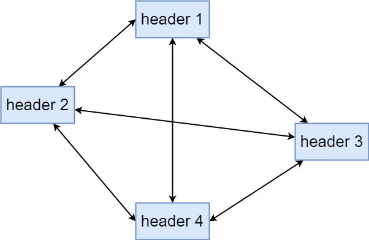

[Google 开源项目风格指南——中文版 — Google 开源项目风格指南 (zh-google-styleguide.readthedocs.io)](https://zh-google-styleguide.readthedocs.io/en/latest/)

[GitHub - google/styleguide: Style guides for Google-originated open-source projects](https://github.com/google/styleguide)

# Cpp

## *头文件*

C文件以 `.C` 结尾，C++文件以 `.CC` 结尾，头文件则以 `.h` 结尾

### `#define` 保护避免头文件相互引用

头文件的相互引用 Circular Dependency 是指在一个项目中，多个头文件之间互相包含（`#include`）对方的头文件，形成了一个循环依赖关系

所有头文件都应该有 `#define` 保护来**防止头文件被重复包含**，不要使用 `#paragram once` 编译指示这种预处理指令。根据 在 C++ 中防止头文件被重复包含时为什么同时使用 #ifndef 和 #pragma once？ - 望山的回答 - 知乎 <https://www.zhihu.com/question/40990594/answer/1675549910> 的回答，`#paragram once` 编译指示在早期的GCC编译器（GCC3.4版本之前）中不支持，但是它仍然被广泛使用，所以在Win上编程时可以同时使用条件编译和编译指示

头文件宏的命名格式应该基于所在项目的源代码树的全路径，即 `<PROJECT>_<PATH>_<FILE>_H_`

举个例子：项目foo中的头文件 `foo/src/bar/baz.h` 可以按如下方式保护

```cpp
#ifndef FOO_BAR_BAZ_H_
#define FOO_BAR_BAZ_H_
// 各种声明
#endif
```

### 前置声明改善循环依赖

前置声明 forward declaration 是类、函数和模板的纯声明，不伴随其定义

虽然前置声明可以在一定程度上改善类、函数等之间的互相依赖，但同时会引入很多新的问题。所以尽量避免前置声明那些定义在其他项目中的实体，函数和类模板总是使用 `#include`

### `#include` 的路径及顺序避免隐藏依赖

隐藏依赖 hidden dependency 指的是一个头文件中的声明是依赖于其他头文件的。比如说下面的例子

```cpp
// A.h 头文件中有
struct BS bs;
// B.h 头文件中有
struct BS { /*...*/ };
```

那么在 `A.cc` 中调用就可能会出现隐藏依赖问题

```cpp
// 隐藏依赖问题
#include "A.h"
#include "B.h"

// 调整顺序就不会有隐藏依赖问题了
#include "B.h"
#include "A.h"
```

**编译器通常在逐行处理源代码的同时进行语法分析和语义分析，而不是等待所有头文件都引入后再统一检查**。这是因为编译器需要在处理源文件的过程中及时发现和报告错误，而不是等到整个编译单元都被处理完后才进行检查。因此错误的原因是

1. **A.h 中的前置声明**：在 `A.h` 中 `struct BS bs;` 这行代码只是一个前置声明，告诉编译器将会有一个名为 `bs` 的 `BS` 结构体的实例。但是，编译器并不知道 `BS` 结构体的具体定义，因为它还没有看到 `B.h` 中的内容
2. **B.h 中的结构体定义**：在 `B.h` 中定义了 `BS` 结构体的具体内容。但是，这个定义在 `A.h` 中的前置声明之后，编译器不知道它，因此 `A.c` 中的代码在编译时无法正确解析 `bs` 的类型

理解的核心关键在于：在链接之前，所有的cpp文件全部都是独立编译的，它只是通过头文件展开后的声明以及之后所形成的符号表知道了有其他符号的存在，比如说上面的例子中，`A.cc` 中先导入了。因此隐藏依赖问题是出现在编译阶段，即无法找到对应的符号；而重复定义和多重包含等问题则出现在链接阶段，即不知道到底该引用哪一个符号

导入头文件的顺序应为：相关头文件 `->` C库 `->` C++库 `->` 其他库的头文件 `->` 本项目内的头文件，这样设计能最先检查出相关头文件中的问题

进行 `#include` 的原则当前代码的符号是用到了对应头文件中的声明时才**按需导入**，大规模的程序不能设计成把所有要用的头文件在某一个头文件中全inlcude了，然后其他文件只用include这个头文件的形式。如果头文件对应的所有源文件都是库文件那还好，如果是自己写的，还要不定时的修改，那所有的文件都要不断重新编译。这种情况就是头文件形成了一个全连接图



## *作用域*

### 命名空间

禁止使用using-directive展开引入整个命名空间

禁止使用内联命名空间 inline namespace，因为内联命名空间会自动把内部的标识符放到外层作用域中。内联命名空间主要用于保持跨版本的ABI兼容性

### 静态变量 & 全局变量

原生数据类型 POD Plain Old Data

## *函数*

## *命名*

### 文件命名

全小写，用 `_` 或 `-` 连接，若没有指定的话 `_` 更好

### 类型命名

类、结构体、typedef 类型定义、枚举、类型模板参数君采用大小写混合的驼峰形式，即 `MyClass` 这样的

### 变量命名

* 普遍变量：一律小写，用 `_` 连接
* 类数据成员：和普通变量一样，但不论是静态的还是非静态的，都要以 `_` 为结尾，若是结构体的成员就不用

### 常量命名

命名时以 `k` 开头，大小写混合驼峰，比如 `const int kMyConst = 7;`

### 函数命名

一般函数采用大小写混合驼峰

取值和设值函数则要求与变量名匹配，小写并用 `_` 连接，比如 `set_address();`

## *注释*

## *格式*

* 单词和单词之间用驼峰法
* 函数名、类名等所有单词首字母大写 `DataMgr`
* 变量首字母小写，后面单词首字母大写 `dataMgr`
* 类的属性变量在开头或结尾（Google规范是在结尾添加）使用 `_`（STL库） 或者驼峰（公司规范居多）`_dataMgr`

```c++
class Date {
public:
    void Init(int year)
        _year = year;
        // 若属性不写成_year，则可能会出现 year = year 的混淆
private:
    int _year;
}
```


# Objective-C

# Python