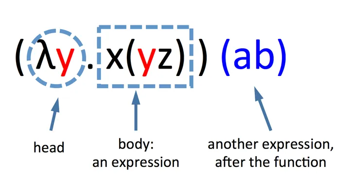

# λ Calculus

## *λ Calculus的表示*

### λ Calculus 的历史

[认知科学家写给小白的Lambda演算 - 知乎 (zhihu.com)](https://zhuanlan.zhihu.com/p/30510749)

[Palmström: The Lambda Calculus for Absolute Dummies (like myself) (palmstroem.blogspot.com)](https://palmstroem.blogspot.com/2012/05/lambda-calculus-for-absolute-dummies.html)

λ calculus, λ演算的发明者为 Alonzo Church，它和由 Alan Turing 所提出的图灵机模型都是受到 David Hilbert 的影响而提出的。Hilbert 鼓励数学家们去将证明过程纯机械化，这样机器就可以通过形式语言推理出大量定理（是不是有点像人工智能，机器自己把定理枚举了

所谓机械论就是一种认为自然界整体就是一个复杂的机器或工艺品，其不同组成部分间并没有内在联系的哲学

后来可以证明λ演算等价于图灵机，即 Church-Turing Thesis。即λ演算是图灵完备的，这是一个可以用于模拟任何图灵机的通用模型

### 表达式

```
λ<参数>.<函数体>
```



在λ演算中，一行符号被叫做表达式。比如说上面这个表达式：$(\lambda x.\lambda y)(ab)$。表达式只包含以下符号：

- λ和点 `.` 用以描述函数。函数由λ和变量开头，跟上一个点，然后是表达式。Church之所以使用λ完全是一个巧合，实际上λ没有任何特别的含义，它只是说函数由此开始。在λ后面，在点之前的字母，被称作头部 head，点后面的表达式，被称作体 body 部
- 单个字母（abcd...)，被称作变量。一个表达式可以是单个字母，或多个字母。一般的，我们可以把两个表达式写在一起组成一个新的表达式
- 括号 `()`。括号表明表达式被括起来的部分是一个整体（就像句子中的括号表示这部分是一个整体）。当我们没有括号时，我们从左到右分析表达式

## *规约*

### 函数解析


在函数后边又跟了一个表达式时，它可以被解析 resolve。解析过程就是将头部一个变量去掉，然后将它所有在体部的出现的这个变量替换成写在函数后边跟着的表达式

这个解析求值当的操作是通过β-归约, β-Reduction完成的, 它本质上是词法层面上的替换

在头部中提到的变量被称作**约束变量 bound variables**，没有提到的称作**自由变量 free variables**。因为函数可以是其他函数的一部分，所以一个变量可以同时是约束变量，又是自由变量

### Currying

尽管λ演算传统上仅支持单个参数的函数，但我们可以通过Currying 柯里化的技巧创建多个参数的函数

## *应用*

### 布尔值

### 逻辑

### 数字

尽管 lambda 演算中没有数字, 我们还可以用[邱奇编码](https://zh.wikipedia.org/wiki/邱奇编码)([Church numerals](https://en.wikipedia.org/wiki/Church_encoding))将数字嵌入到 lambda 演算中

### 加减乘除

## *不动点*

# 函数式编程

函数式编程 Functional Programming, FP 是一种编程范式，它将计算视为数学函数的求值，并避免了数据的状态改变以及可变数据。在函数式编程中，函数是一等公民 first-class citizens，这意味着函数可以作为参数传递给其他函数，也可以作为结果返回，还可以被赋值给变量

$\lambda$ 演算是函数式编程最重要的基础。而且 $\lambda$ 演算的函数可以接受函数作为输入的参数和输出的返回值


### 纯函数

纯函数 Pure Functions 是函数式编程的核心概念之一。一个纯函数具有以下两个主要特性：

- 输出只依赖于输入：给定相同的输入，纯函数总是返回相同的输出
- 无副作用：执行函数不会对系统的状态产生影响，即不会修改任何外部状态或数据

### 不可变性 Immutability 

在函数式编程中，一旦数据被创建，它就不能被改变。所有的数据结构都是不可变的。如果需要修改某个数据结构，需要创建一个新的数据结构来代替原来的版本

### 高阶函数 (Higher-Order Functions)

函数在FP中被当作一等公民（first-class citizens）。这意味着函数可以作为参数传递给其他函数，也可以作为其他函数的返回结果。

### 函数组合 (Function Composition)

函数组合涉及将多个函数组合成单个函数，这个新函数继承了组合中的每个函数的行为。这促进了代码重用和模块化。

### 惰性评估 (Lazy Evaluation)

惰性评估指的是表达式直到其值真正需要时才被计算。这允许程序构造潜在无限的数据结构，如无限列表和流。

### 递归 (Recursion)

由于不可变性，函数式语言中经常使用递归来实现循环或遍历数据结构。大多数函数式语言提供优化技术（如尾递归优化）来使递归操作更加高效。

### 类型系统 (Type Systems)

很多函数式编程语言（如Haskell）拥有非常强大的类型系统，包含类型推断、代数数据类型等特性，它们可以帮助捕获编程错误并在编译时期进行更多的优化。

函数式编程语言的例子包括但不限于Haskell、Erlang、Clojure、F#和Scala。现代多范式语言如JavaScript、Python、Ruby和C#也支持函数式编程的一些特性。

函数式编程的优势在于代码通常更简洁、更易于理解，并且因为其无副作用和不可变性的特点，它能极大地降低并发编程中出现问题的风险。缺点可能包括对于习惯了命令式编程的开发者来说有一定的学习曲线，以及与基于命令式编程的语言相比，在某些情况下性能上的差异

## *Monad*

# Haskell

[Haskell Language](https://www.haskell.org/)

Haskell是一种标准化的纯函数式编程语言，以其强大的类型系统和对函数式编程概念的支持而闻名。它于1990年首次发布，并以数学家Haskell Curry的名字命名，Curry以他在逻辑学和组合抽象代数方面的贡献著称

## *工具链*

要开始使用Haskell，你可以做以下事情：

1. **安装GHC**：Glasgow Haskell Compiler (GHC) 是目前使用最广泛的Haskell编译器。安装GHC通常也会包括安装Haskell的交互式环境GHCi。

2. **使用Cabal或Stack管理项目**：Cabal和Stack是两个流行的Haskell项目管理工具，用于处理库依赖、构建和测试Haskell程序。

3. **学习语言基础**：由于Haskell和其他主流编程语言（如C++、Java 或 Python）在概念上有很大不同，因此学习它的语法和函数式编程的概念是很重要的。

   *探索库**：Haskell有一个庞大的第三方库生态系统，在[Hackage](https://hackage.haskell.org/) 包管理器中可以找到。

### 一个简单的示例

下面是一个使用Haskell编写的简单程序，该程序定义了一个计算斐波那契数列的函数：

```haskell
fibonacci :: Int -> Integer
fibonacci n = fibs !! n
    where fibs = 0 : 1 : zipWith (+) fibs (tail fibs)

main :: IO ()
main = print (fibonacci 10)
```

在这段代码中，`fibonacci` 函数通过一个无限列表 `fibs` 来定义，这个列表是通过惰性求值生成的。`zipWith` 函数用来取两个列表（`fibs` 和它的尾部 `tail fibs`）并应用 `(+)` 函数来产生新的元素。最后，`main` 函数输出斐波那契数列中的第10个数字。

Haskell的优雅和强大来自于其纯粹的函数式特性和强类型系统，使得代码通常更易于推理，并减少了运行时错误。然而，与命令式和面向对象编程语言相比，Haskell的学习曲线可能相对较陡峭。尽管如此，Haskell提供了许多高级功能，对那些寻求深入理解函数式编程的人来说，它提供了丰富的资源和工具。
