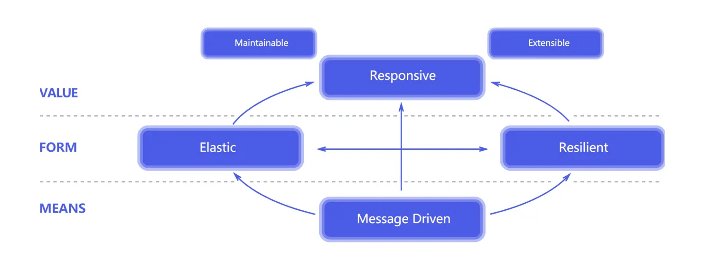

## *响应式编程*

### 响应式宣言

[The Reactive Manifesto](https://www.reactivemanifesto.org/)

响应式编程是一种面向数据流和变化传播的编程范式，旨在简化事件驱动应用的实现。响应式编程专注于如何创建依赖于变更的数据流并对变化做出响应

函数响应式编程 Functional Reactive Programming, FRP：通过一系列的操作符，RxCpp允许开发者将异步操作视为数据流进行处理，简化了复杂的并发和事件处理问题

### 回调地狱

所谓的回调函数 callback function 就是指当一个函数作为参数传入另一个参数中，并且它不会立即执行，只有当满足一定条件后该函数才可以执行，这种函数就称为回调函数

回调地狱 callback hell 就是为是实现代码顺序执行而在回调函数中嵌套回调函数，它会造成我们的代码可读性非常差，后期不好维护

# RxCpp

Reactive Extensions (ReactiveX, Rx)。Rx是一个编程模型，目标是提供一致的编程接口，帮助开发者更方便的处理异步数据流，Rx库支持.NET、JavaScript和C++，Rx近几年越来越流行了，现在已经支持几乎全部的流行编程语言了

下面介绍 RxCpp [ReactiveX/RxCpp: Reactive Extensions for C++ (github.com)](https://github.com/ReactiveX/RxCpp)

> ReactiveX is a library for composing asynchronous and event-based programs by using observable sequences. Rx 是一个使用可观测的序列来组成异步的、基于事件的程序的库。

其实数据流 stream 的思想和体系结构中的dataflow架构很相似

1. 一切皆为数据流
2. Observable 可观察对象 是对数据流的抽象，表示有限或者无限多个现在或者将来到达的事件。Observable提供了onNext，onError，onCompleted供开发者定制新元素到达，出现错误，或者流结束时的程序的行为
3. Observer 观察者 是对Observable的响应

操作符如`map`, `filter`, `merge`, `zip`等则提供了对数据流的强大控制，使得我们可以像处理数组一样处理异步数据

反应式编程的一个关键优势在于它的可组合性。不同数据流可以相互组合，创建出新的数据流，这极大地提高了代码的复用性和可读性

### push & pull

* push 异步推送模式：在响应式编程中，通过订阅数据流（在Rx中称为可观察序列）来向应用程序提供数据，应用程序在数据检索过程中是被动的：除了订阅了可观察的数据源之外，它不会主动轮询数据源，而只是对推送到它的数据做出反应。当流不再没有更多数据或者出错时，数据源也会向订阅者发送通知
* pull 同步拉取模式

# 自定义算子