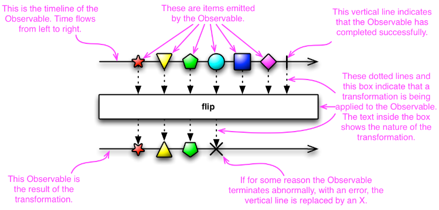
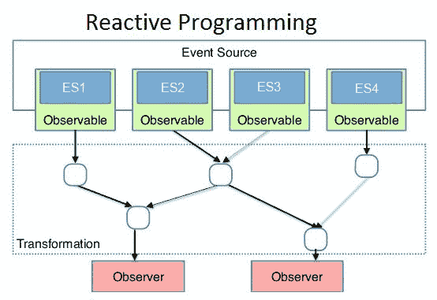

# 响应式编程

## *响应式宣言*

[The Reactive Manifesto](https://www.reactivemanifesto.org/)


响应式编程是一种面向数据流和变化传播的编程范式，旨在简化事件驱动应用的实现。响应式编程专注于如何创建依赖于变更的数据流并对变化做出响应


函数响应式编程 Functional Reactive Programming, FRP：通过一系列的操作符，RxCpp允许开发者将异步操作视为数据流进行处理，简化了复杂的并发和事件处理问题


## *响应式编程要解决的问题*

### 回调地狱

所谓的回调函数 callback function 就是指当一个函数作为参数传入另一个参数中，并且它不会立即执行，只有当满足一定条件后该函数才可以执行，这种函数就称为回调函数

回调地狱 callback hell 就是为是实现代码顺序执行而在回调函数中嵌套回调函数，它会造成我们的代码可读性非常差，后期不好维护


### fire and forget mechanism

Fire and forget 通常指的是一种处理流程或者函数调用的方式，其中一旦发起了一个操作（如发送一个请求、开始一个异步任务等），便不需要进一步地进行跟踪或管理。这个操作将独立于发起者自行完成其全部工作。在这种模式下，发起操作的代码不会等待操作的完成、也不会获取操作结果的反馈

其实就是异步的一种说法

# Rx核心概念

Reactive Extensions (ReactiveX, Rx)。Rx是一个编程模型，目标是提供一致的编程接口，帮助开发者更方便的处理异步数据流，Rx库支持.NET、JavaScript和C++，Rx近几年越来越流行了，现在已经支持几乎全部的流行编程语言了

下面介绍 RxCpp [ReactiveX/RxCpp: Reactive Extensions for C++ (github.com)](https://github.com/ReactiveX/RxCpp)


> ReactiveX is a library for composing asynchronous and event-based programs by using observable sequences. Rx 是一个使用可观测的序列来组成异步的、基于事件的程序的库。

## *intro*

### push & pull

* push 异步推送数据模式：应用程序在数据检索过程中是被动的：除了订阅了可观察的数据源之外，它不会主动轮询数据源，而只是对推送到它的数据做出反应。但是当流不再没有更多数据或者出错时，数据源也会向订阅者发送通知
* pull 同步拉取数据模式：应用程序在数据检索过程中处于活动状态，在方便时通过调用 on_next 来控制检索的速度。这种模式是同步的，这意味着应用程序可能在轮询数据源时被阻塞

响应式编程采用push 推送模式。通过订阅数据流（在Rx中称为可观察序列 Obsrevable）来向应用程序提供数据。Rx 实现的推送模型由 Rx.Observable/Observer 的可观察模式表示。Rx.Observable 将自动通知所有观察者任何状态变化。如果要通过订阅注册，可以使用 Rx.Observable 的 subscribe 方法，该方法接受一个 Observer 并返回一个一次性的。随后 Observer 能够跟踪和处置订阅

### Marble Diagram

Rx使用一个特殊的Marble Diagram来描述流



### 安装

```cmd
mkdir build
cd build
cmake ..
make install 
```

### cmake

## *架构*

### 核心概念

在许多软件编程任务中，程序员或多或少都会期望其编写的指令能够逐步、逐一地按照编写的顺序执行并完成。但在ReactiveX中，许多指令可能会并行执行，它们的结果稍后会被Observer以任意顺序捕获。与其调用一个方法，不如定义一个检索和转换数据的机制，形式为Observable，然后订阅一个Observer到这个Observable上，在这一点上，先前定义的机制就会激活，并且Observer就像哨兵一样准备捕获和响应其发射的数据，无论何时它们准备好了

这种方法的一个优势是，当有一堆彼此不依赖的任务时，可以同时启动它们，而不是等待每个任务完成后再开始下一个任务。这样整个任务束只需要花费时间和束中最长的任务一样长即可完成

用于描述这种异步编程和设计模型的术语有很多。本文档将使用以下术语：An observer subscribes to an Observable. An Observable emits items or sends notifications to its observers by calling the observers’ methods.

数据流 stream 的思想和体系结构中的dataflow架构很相似

1. 一切皆为数据流

2. Observable 可观察对象 是对数据流的抽象，表示有限或者无限多个现在或者将来到达的事件。Observable提供了onNext，onError，onCompleted供开发者定制新元素到达，出现错误，或者流结束时的程序的行为

3. Observer 观察者 是对Observable的响应

4. Operator 是处于观察者与被观察者之间的流操作符。不同的流操作符如`map`, `filter`, `merge`, `zip`等则提供了对数据流的强大控制，使得我们可以像处理数组一样处理异步数据

   反应式编程的一个关键优势在于它的可组合性。不同数据流可以相互组合，创建出新的数据流，这极大地提高了代码的复用性和可读性

### 架构图



## *Observer (Subscriber)*

和一般的Observer模式只有onNext（数据达到了做什么）不同，Rx的Observer还提供了onError和onCompleted。其中call onNext被称为一次emission，而一次onError或一次onCompleted称为一次notification

* onNext：当Obsrevable向外发送任何东西的时候都会call Observer的这个方法。An Observable calls this method whenever the Observable emits an item. This method takes as a parameter the item emitted by the Observable.
* onError：An Observable calls this method to indicate that it has failed to generate the expected data or has encountered some other error. It will not make further calls to `onNext` or `onCompleted`. The `onError` method takes as its parameter an indication of what caused the error.
* onCompletd：如果发送途中没有发生错误的话，Observable发送完毕后会call Observer的这个方法。An Observable calls this method after it has called `onNext` for the final time, if it has not encountered any errors.

```pseudocode
def myOnNext     = { item -> /* do something useful with item */ };
def myError      = { throwable -> /* react sensibly to a failed call */ };
def myComplete   = { /* clean up after the final response */ };
def myObservable = someMethod(itsParameters);
myObservable.subscribe(myOnNext, myError, myComplete);
// go on about my business
```

## *Subject*

**Subject 类型同时实现了 Observable 和 Observer，**从某种意义上说，**它既是观察者又是可观察对象。**您可以使用主题订阅所有观察者，然后将主题订阅到后端数据源。这样，**主体可以充当一组订阅者和源的代理**。您可以使用主题来实现具有缓存、缓冲和时移的自定义 observable。此外，您可以使用主题向多个订阅者广播数据。

**默认情况下，主题不会跨线程执行任何同步。**他们不采用调度程序，而是假设所有序列化和语法正确性都由主题的调用者处理。**主题只是向订阅者线程安全列表中的所有订阅观察者广播。**这样做的好处是可以减少开销并提高性能。但是，如果您想使用调度程序同步对观察者的传出调用，则可以使用 Synchronize 方法来执行此操作

### 是否要使用Subject

[To Use Subject Or Not To Use Subject? (davesexton.com)](https://www.davesexton.com/blog/post/To-Use-Subject-Or-Not-To-Use-Subject.aspx)

### Subject的类型

* AsyncSubject
* BehaviorSubject
* PublishSubject
* ReplaySubject

## *Scheduler*

如果想在Observable操作符的级联中引入多线程，可以通过指定这些操作符（或特定的Observable）在特定的调度器（Schedulers）上运行来实现

一些ReactiveX Observable操作符有变体，可以接受一个Scheduler作为参数。这些变体指导操作符在特定的Scheduler上完成部分或全部工作

默认情况下，一个Observable及其应用链上的操作符将在**调用其Subscribe方法的同一个线程上**执行其工作，并通知其观察者。SubscribeOn操作符通过指定一个不同的Scheduler来改变此行为，该Scheduler是Observable应该操作的。而ObserveOn操作符指定了Observable将用于向其观察者发送通知的不同Scheduler

如图所示，SubscribeOn操作符指定了Observable将开始在哪个线程上操作，不管该操作符在操作符链中的哪个点被调用。另一方面，ObserveOn影响的是操作符出现位置以下Observable将使用的线程。因此，在Observable操作符链的各个点上，可能需要多次调用ObserveOn，以更改某些操作符所操作的线程

# Observable (Publisher)

Observable也称为Eventsource

```C++
struct tag_observable {};
template<class T>
struct observable_base {
    using observable_tag = tag_observable;
    using value_type = T;
};
```


## *intro*

### subscribe

**为了从 observable 集合接收通知，使用 Observable 的 subscribe 方法将 Observer 对象传递给它**。作为对这个观察者的回报，**subscribe 方法返回一个一次性对象，该对象充当订阅的句柄**，从而在完成后清理订阅。对该对象调用 dispose 会将观察者与源分离，以便不再传递通知。Rx中不需要显式地取消订阅一个事件

### Hot & Cold Observable

Hot & Cold Observable的区别在于一个可观察对象何时开始发射它的sequence of items

* Hot Observable：可能会在创建后立即开始发射项目，因此任何后来订阅该可观察对象的观察者都可能从序列中间某处开始观察
* Cold Observable：等到有观察者订阅后才开始发射项目，因此这样的观察者能够确保看到完整序列从头到尾

在ReactiveX的某些实现中，还有所谓的可连接（Connectable）可观察对象。这种可观察对象在其`Connect`方法被调用之前不会开始发射项目，无论是否有观察者已经订阅了它

## *source类型*

[RxCpp: rxcpp::observable< void, void > Class Template Reference (reactivex.io)](https://reactivex.io/RxCpp/classrxcpp_1_1observable_3_01void_00_01void_01_4.html#a68356278fbcd12847cec55bcf96a0d00)

### create

创建一个当有observer subscribe它时，执行某个function的observable。这个函数接受一个 `subscriber` 并定义如何发送通知（`on_next`）、完成（`on_completed`）或错误（`on_error`）

```C++
template<class T , class OnSubscribe >
static auto create (OnSubscribe os) -> decltype(rxs::create< T >(std::move(os)))
```

```C++
auto custom_observable = rxcpp::observable<>::create<int>([](rxcpp::subscriber<int> s){
    // 发送值
    s.on_next(1);
    s.on_next(2);
    s.on_next(3);
    // 完成
    s.on_completed();
});
```

### defer

等到有订阅者订阅时才创建observable。每个订阅者都可能得到一个新的observable实例

```C++
template<class ObservableFactory >
static auto defer (ObservableFactory of) -> decltype(rxs::defer(std::move(of)))
```

```C++
auto deferred_observable = rxcpp::observable<>::defer([]() {
    return rxcpp::observable<>::just(42);
});
```

### empty

立即生成一个不发送任何项但是只发送完成通知的observable

```C++
template<class T >
static auto empty () -> decltype(from< T >())
    
template<class T , class Coordination >
static auto empty (Coordination cn) -> decltype(from< T >(std::move(cn)))
```

```C++
auto empty_observable = rxcpp::observable<>::empty<int>();
```

### error

创建一个不发送任何正常数据，而是直接发送错误通知的observable

```C++
auto error_observable = rxcpp::observable<>::error<std::runtime_error>(
    std::make_exception_ptr(std::runtime_error("Error!"))
);
```


### interval

创建一个定期发出自增序列的observable

```C++
auto interval_observable = rxcpp::observable<>::interval(std::chrono::milliseconds(1000));
```


### iterate

取一个集合，并创建一个可观察对象逐一发出集合中的元素。常用的比如说从C++容器中取值

```C++
std::vector<int> vec = {1, 2, 3};
auto iterate_observable = rxcpp::observable<>::iterate(vec);
```


### never

创建一个不发出任何项并且永远不会终止的observable

```C++
template<class T >
static auto rxcpp::observable< void, void >::never() -> decltype(rxs::never<T>())
```


```C++
auto never_observable = rxcpp::observable<>::never<int>();
```


### range

创建一个发出一系列连续整数的observable

```C++
template<class T >
static auto range (T first=0, T last=std::numeric_limits< T >::max(), std::ptrdiff_t step=1) -> decltype(rxs::range< T >(first, last, step, identity_current_thread()))
    
template<class T , class Coordination >
static auto range (T first, T last, std::ptrdiff_t step, Coordination cn) -> decltype(rxs::range< T >(first, last, step, std::move(cn)))
    
template<class T , class Coordination >
static auto range (T first, T last, Coordination cn) -> decltype(rxs::range< T >(first, last, std::move(cn)))

template<class T , class Coordination >
static auto range (T first, Coordination cn) -> decltype(rxs::range< T >(first, std::move(cn)))
```

```C++
auto range_observable = rxcpp::observable<>::range(1, 10); // from 1 to 10
```


### scope

```C++
```


### timer

在经过给定的时间段后发出一个单个的项

```C++
auto timer_observable = rxcpp::observable<>::timer(std::chrono::seconds(5));
```


## *自定义source*

# 算子

[ReactiveX - Operators](https://reactivex.io/documentation/operators.html#conditional)

大部分算子都是作用在Obsrevable上，然后返回一个Observable的

## *Creating Observables*

Operators that originate new Observables/Eventsources

- [**`Create`**](https://reactivex.io/documentation/operators/create.html) — create an Observable from scratch by calling observer methods programmatically。立即创建一个新的 Observable
- [**`Defer`**](https://reactivex.io/documentation/operators/defer.html) — do not create the Observable until the observer subscribes, and create a fresh Observable for each observer 推迟创建 Observable 直到有 Observer 来订阅它
- [**`Empty`/`Never`/`Throw`**](https://reactivex.io/documentation/operators/empty-never-throw.html) — create Observables that have very precise and limited behavior
- [**`From`**](https://reactivex.io/documentation/operators/from.html) — convert some other object or data structure into an Observable
- [**`Interval`**](https://reactivex.io/documentation/operators/interval.html) — create an Observable that emits a sequence of integers spaced by a particular time interval
- [**`Just`**](https://reactivex.io/documentation/operators/just.html) — convert an object or a set of objects into an Observable that emits that or those objects
- [**`Range`**](https://reactivex.io/documentation/operators/range.html) — create an Observable that emits a range of sequential integers
- [**`Repeat`**](https://reactivex.io/documentation/operators/repeat.html) — create an Observable that emits a particular item or sequence of items repeatedly
- [**`Start`**](https://reactivex.io/documentation/operators/start.html) — create an Observable that emits the return value of a function
- [**`Timer`**](https://reactivex.io/documentation/operators/timer.html) — create an Observable that emits a single item after a given delay

## *Transforming Observables*

Operators that transform items that are emitted by an Observable.

- [**`Buffer`**](https://reactivex.io/documentation/operators/buffer.html) — periodically gather items from an Observable into bundles and emit these bundles rather than emitting the items one at a time 把 Observable emit 的信息做成一个bundle放到buffer中一块发出来
- [**`FlatMap`**](https://reactivex.io/documentation/operators/flatmap.html) — transform the items emitted by an Observable into Observables, then flatten the emissions from those into a single Observable 
- [**`GroupBy`**](https://reactivex.io/documentation/operators/groupby.html) — divide an Observable into a set of Observables that each emit a different group of items from the original Observable, organized by key
- [**`Map`**](https://reactivex.io/documentation/operators/map.html) — transform the items emitted by an Observable by applying a function to each item
- [**`Scan`**](https://reactivex.io/documentation/operators/scan.html) — apply a function to each item emitted by an Observable, sequentially, and emit each successive value
- [**`Window`**](https://reactivex.io/documentation/operators/window.html) — periodically subdivide items from an Observable into Observable windows and emit these windows rather than emitting the items one at a time

## *Filtering Observables*

Operators that selectively emit items from a source Observable.

- [**`Debounce`**](https://reactivex.io/documentation/operators/debounce.html) — only emit an item from an Observable if a particular timespan has passed without it emitting another item 实现debounce trigger的功能，一个item只有经过一个timespan才能被继续发送出来
- [**`Distinct`**](https://reactivex.io/documentation/operators/distinct.html) — suppress duplicate items emitted by an Observable 不允许发送重复的Observable（包括历史发射）
- `Distinct_until_changed`：不允许发送重复的Observable（只考虑直接前继是否相同）
- [**`ElementAt`**](https://reactivex.io/documentation/operators/elementat.html) — emit only item *n* emitted by an Observable 只发送位于序列位置 *n* 的item
- [**`Filter`**](https://reactivex.io/documentation/operators/filter.html) — emit only those items from an Observable that pass a predicate test 只发送通过某个谓词测试的item
- [**`First`**](https://reactivex.io/documentation/operators/first.html) — emit only the first item, or the first item that meets a condition, from an Observable
- [**`IgnoreElements`**](https://reactivex.io/documentation/operators/ignoreelements.html) — do not emit any items from an Observable but mirror its termination notification
- [**`Last`**](https://reactivex.io/documentation/operators/last.html) — emit only the last item emitted by an Observable
- [**`Sample`**](https://reactivex.io/documentation/operators/sample.html) — emit the most recent item emitted by an Observable within periodic time intervals
- [**`Skip`**](https://reactivex.io/documentation/operators/skip.html) — suppress the first *n* items emitted by an Observable 跳过前 *n* 个items
- [**`SkipLast`**](https://reactivex.io/documentation/operators/skiplast.html) — suppress the last *n* items emitted by an Observable 跳过后 *n* 个items
- [**`Take`**](https://reactivex.io/documentation/operators/take.html) — emit only the first *n* items emitted by an Observable. 只取前 *n* 个itmes
- [**`TakeLast`**](https://reactivex.io/documentation/operators/takelast.html) — emit only the last *n* items emitted by an Observable. 只取后 *n* 个itmes

## *Combining Observables*

Operators that work with multiple source Observables to create a single Observable

- [**`And`/`Then`/`When`**](https://reactivex.io/documentation/operators/and-then-when.html) — combine sets of items emitted by two or more Observables by means of `Pattern` and `Plan` intermediaries
- [**`CombineLatest`**](https://reactivex.io/documentation/operators/combinelatest.html) — when an item is emitted by either of two Observables, combine the latest item emitted by each Observable via a specified function and emit items based on the results of this function
- [**`Join`**](https://reactivex.io/documentation/operators/join.html) — combine items emitted by two Observables whenever an item from one Observable is emitted during a time window defined according to an item emitted by the other Observable
- [**`Merge`**](https://reactivex.io/documentation/operators/merge.html) — combine multiple Observables into one by merging their emissions 直接把多个 Observables 合并为一个
- [**`StartWith`**](https://reactivex.io/documentation/operators/startwith.html) — emit a specified sequence of items before beginning to emit the items from the source Observable
- [**`Switch`**](https://reactivex.io/documentation/operators/switch.html) — convert an Observable that emits Observables into a single Observable that emits the items emitted by the most-recently-emitted of those Observables
- [**`Zip`**](https://reactivex.io/documentation/operators/zip.html) — combine the emissions of multiple Observables together via a specified function and emit single items for each combination based on the results of this function 把多个 Observables 的多个emission通过某个function压缩到一块后分别发出

## *Error Handling Operators*

Operators that help to recover from error notifications from an Observable

- [**`Catch`**](https://reactivex.io/documentation/operators/catch.html) — recover from an `onError` notification by continuing the sequence without error
- [**`Retry`**](https://reactivex.io/documentation/operators/retry.html) — if a source Observable sends an `onError` notification, resubscribe to it in the hopes that it will complete without error

## *Observable Utility Operators*

A toolbox of useful Operators for working with Observables

- [**`Delay`**](https://reactivex.io/documentation/operators/delay.html) — shift the emissions from an Observable forward in time by a particular amount
- [**`Do`**](https://reactivex.io/documentation/operators/do.html) — register an action to take upon a variety of Observable lifecycle events
- [**`Materialize`/`Dematerialize`**](https://reactivex.io/documentation/operators/materialize-dematerialize.html) — represent both the items emitted and the notifications sent as emitted items, or reverse this process
- [**`ObserveOn`**](https://reactivex.io/documentation/operators/observeon.html) — specify the scheduler on which an observer will observe this Observable
- [**`Serialize`**](https://reactivex.io/documentation/operators/serialize.html) — force an Observable to make serialized calls and to be well-behaved
- [**`Subscribe`**](https://reactivex.io/documentation/operators/subscribe.html) — operate upon the emissions and notifications from an Observable
- [**`SubscribeOn`**](https://reactivex.io/documentation/operators/subscribeon.html) — specify the scheduler an Observable should use when it is subscribed to
- [**`TimeInterval`**](https://reactivex.io/documentation/operators/timeinterval.html) — convert an Observable that emits items into one that emits indications of the amount of time elapsed between those emissions
- [**`Timeout`**](https://reactivex.io/documentation/operators/timeout.html) — mirror the source Observable, but issue an error notification if a particular period of time elapses without any emitted items
- [**`Timestamp`**](https://reactivex.io/documentation/operators/timestamp.html) — attach a timestamp to each item emitted by an Observable
- [**`Using`**](https://reactivex.io/documentation/operators/using.html) — create a disposable resource that has the same lifespan as the Observable

## *Conditional and Boolean Operators*

Operators that evaluate one or more Observables or items emitted by Observables

- [**`All`**](https://reactivex.io/documentation/operators/all.html) — determine whether all items emitted by an Observable meet some criteria
- [**`Amb`**](https://reactivex.io/documentation/operators/amb.html) — given two or more source Observables, emit all of the items from only the first of these Observables to emit an item
- [**`Contains`**](https://reactivex.io/documentation/operators/contains.html) — determine whether an Observable emits a particular item or not
- [**`DefaultIfEmpty`**](https://reactivex.io/documentation/operators/defaultifempty.html) — emit items from the source Observable, or a default item if the source Observable emits nothing
- [**`SequenceEqual`**](https://reactivex.io/documentation/operators/sequenceequal.html) — determine whether two Observables emit the same sequence of items
- [**`SkipUntil`**](https://reactivex.io/documentation/operators/skipuntil.html) — discard items emitted by an Observable until a second Observable emits an item
- [**`SkipWhile`**](https://reactivex.io/documentation/operators/skipwhile.html) — discard items emitted by an Observable until a specified condition becomes false
- [**`TakeUntil`**](https://reactivex.io/documentation/operators/takeuntil.html) — discard items emitted by an Observable after a second Observable emits an item or terminates
- [**`TakeWhile`**](https://reactivex.io/documentation/operators/takewhile.html) — discard items emitted by an Observable after a specified condition becomes false

## *Mathematical and Aggregate Operators*

Operators that operate on the entire sequence of items emitted by an Observable

- [**`Average`**](https://reactivex.io/documentation/operators/average.html) — calculates the average of numbers emitted by an Observable and emits this average
- [**`Concat`**](https://reactivex.io/documentation/operators/concat.html) — emit the emissions from two or more Observables without interleaving them
- [**`Count`**](https://reactivex.io/documentation/operators/count.html) — count the number of items emitted by the source Observable and emit only this value
- [**`Max`**](https://reactivex.io/documentation/operators/max.html) — determine, and emit, the maximum-valued item emitted by an Observable
- [**`Min`**](https://reactivex.io/documentation/operators/min.html) — determine, and emit, the minimum-valued item emitted by an Observable
- [**`Reduce`**](https://reactivex.io/documentation/operators/reduce.html) — apply a function to each item emitted by an Observable, sequentially, and emit the final value
- [**`Sum`**](https://reactivex.io/documentation/operators/sum.html) — calculate the sum of numbers emitted by an Observable and emit this sum

## *Backpressure Operators*

如何形象的描述反应式编程中的背压(Backpressure)机制？ - 扔物线的回答 - 知乎
https://www.zhihu.com/question/49618581/answer/237078934

### 什么是backpressure

> **在数据流从上游生产者向下游消费者传输的过程中，上游生产速度大于下游消费速度，导致下游的 Buffer 溢出，这种现象就叫做 Backpressure 出现。**需要强调的是：这句话的重点不在于「上游生产速度大于下游消费速度」，而在于**「Buffer 溢出」**。

### backpressure算子的使用

## *Connectable Observable Operators*

Specialty Observables that have more precisely-controlled subscription dynamics

- [**`Connect`**](https://reactivex.io/documentation/operators/connect.html) — instruct a connectable Observable to begin emitting items to its subscribers
- [**`Publish`**](https://reactivex.io/documentation/operators/publish.html) — convert an ordinary Observable into a connectable Observable
- [**`RefCount`**](https://reactivex.io/documentation/operators/refcount.html) — make a Connectable Observable behave like an ordinary Observable
- [**`Replay`**](https://reactivex.io/documentation/operators/replay.html) — ensure that all observers see the same sequence of emitted items, even if they subscribe after the Observable has begun emitting items

## *Operators to Convert Observables*

- [**`To`**](https://reactivex.io/documentation/operators/to.html) — convert an Observable into another object or data structure

# 自定义算子

# 调度器

## *自定义调度器*