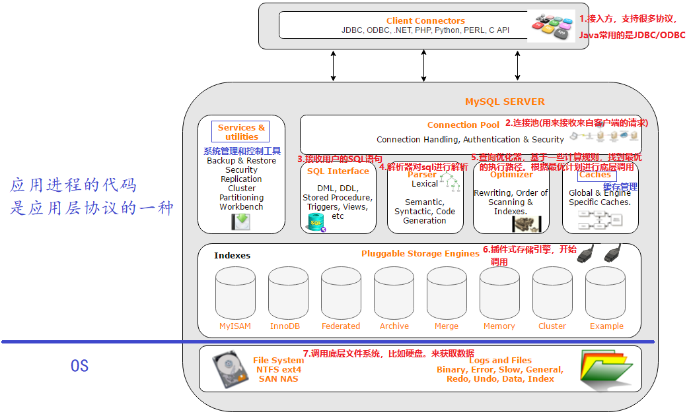
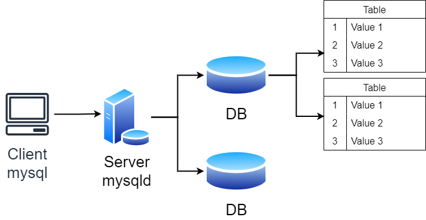

# MySQL数据库基础

## *数据库简介*

数据库用来管理数据，数据库是以某种有组织的方式存储数据集合。数据库是针对文件内容进行操作，不需要用户手动进行数据管理

### 主流数据库

* SQL Sever： 微软的产品，.Net程序员的最爱，中大型项目
* Oracle： 甲骨文产品，适合大型项目，复杂的业务逻辑，并发一般来说不如MySQL
* MySQL：世界上最受欢迎的数据库，属于甲骨文，并发性好，不适合做复杂的业务。主要用在电商，SNS，论坛。对简单的SQL处理效果好
* PostgreSQL：加州大学伯克利分校计算机系开发的关系型数据库，不管是私用、商用、还是学术研究使用，都可以免费使用，修改和分发
* SQLite：是一款轻型的数据库，是遵守ACID的关系型数据库管理系统，它包含在一个相对小的C库中。它的设计目标是嵌入式的，而且目前已经在很多嵌入式产品中使用了它，它占用资源非常的低，在嵌入式设备中，可能只需要几百K的内存就够了
* H2：是一个用Java开发的嵌入式数据库，它本身只是一个类库，可以直接嵌入到应用项目中
* Redis REmote DIctionary Service：是一个使用ANSI C编写的开源、支持网络、基于内存、分布式、可选持久性的键值对存储数据库

## *MySQL DBMS的基本使用*

* `ps ajx | grep mysqld` 看一下 `mysqld` 有没有在运行
* 启动服务 `systemctl start mysqld.service`
  * 因为安装的时候是用root身份安装的，所以启动服务要用root身份来启动
  * 当然也可以以普通用户身份启动，然后输入root密码

* 连接服务器 `mysql -h 127.0.0.1 -P 3306 -u root -p`
* 关闭服务器 `systemctl stop mysqld`

## *MySQL数据库的架构*

### 分层



* 有一个小型的编译器，对SQL语句i进行解析、优化
* Indexes 插件层/存储引擎层：接收上层请求后对文件进行增删查改。引擎是真正提供服务的部件，存储引擎的种类很多，是插件式的 Plug-in，可以用 `show engines;` 来查看。插件式：可以想象成懒加载的单例类，需要的时候就实例化

### SQL分类

Structured Query Language

* DDL Data Definition Language 数据定义语言，用来维护存储数据的结构，即对数据库和表结构的属性操作。比如 `create, drop, alter`
* DML Data Manipulation Language 数据操纵语言，用来对数据进行操作，即对数据库和表结构的内容操作。比如 `insert, delete, update`
  * DQL Data Query Language 数据查询语言 `select`
* DCL Data Control Language 数据控制语言，主要负责权限管理和事务，比如 `grant, revoke, commit`

### 服务器、数据库与表的关系



* mysql是客户端，mysqld是服务端
  * Linux中mysql建立在 `/var/lib/mysql` 中
  * Mac中mysql建立在 `/usr/local/mysql` 中
  * Win中mysql建立在 `C:\Program Files\MySQL\MySQL Server 5.7` 中

* mysqld是一个软件层，能够帮助用户进行数据管理
* 创建一个数据库本质是在Linux中建立了一个目录

## *MySQL的启动选项*

## *可视化工具*

Navicat

MySQL Workbench

首先得保证，有一个远端的服务器，并且端口开放且mysql有对应的用户允许登陆p

# 数据库操作

## *字符集和校验规则*

存到数据库：系统默认字符集

通过数据比较来取数据：校验规则

一般字符集和校验规则是匹配的

### 查看系统的字符集信息

* 查看系统默认字符集以及校验规则

  ```mysql
  show variables like 'character_set_database';
  show variables like 'collation_database';
  ```

* 查看数据库支持的字符集

  ```mysql
  show charset;
  ```

* 查看数据库支持的字符集校验规则

  ```mysql
  show collation;
  ```

### 校验规则对数据库的影响

设置数据库的编码和校验规则，数据库本身是一个索引目录，本质会影响对应数据库内部的表的编码和校验规则

创建一个新的数据库，会在 `db.opt` 里自动写入使用的字符集和校验规则

单机使用就默认，如果要备份到远端就显式字符集和校验规则创建

下面做一个实验可以观察到有不同的效果

## *创建数据库*

* 创建数据库 `create database DatabaseName`
* 数据库的名字加不加反引号 \`\` 取决于创建的数据库名是否和SQL的关键字冲突，不过特别不建议冲突
* 用 `select database();` 来查看当前数据库
* 可以用 `show create database DatabaseName` 来显式查看创建数据库时用的语句

## *操纵数据库*

### 修改数据库

### 删除数据库

```mysql
drop database [if exists] DatabaseName;
```

* 轻易不要删库！！！
* 迭代删除，删除最外面，里面的也被删光了

### 数据库的备份与恢复

* 备份：`mysqldump` 对数据做备份、对操作语句做备份
  * MySQL是备份语句，这种方式比较好，有上下文还可以带时间，若只是备份数据则没有上下文（Redis支持两种备份方式）
  * 备份过程中会对SQL语句进行优化，比如六条连续插入合并为一条插入等
* 还原：`source` 还原数据

### 查看链接情况

```mysql
show processlist;
```

# 数据类型

约束 Constraint：插入数据越界，和C语言编译器不同不会截断数据，而是**直接终止操作**，否则会影响MySQL数据的可信度。倒逼程序员，必须遵守规则

MySQL的数据类型，除了能满足各种应用场景，其本身就是一种约束

## *数值类*

|        类型        | 大小 Byte |                     范围（有符号）                      |         范围（无符号）          |     用途     |
| :----------------: | :-------: | :-----------------------------------------------------: | :-----------------------------: | :----------: |
|     `tinyint`      |     1     |                       (-128, 127)                       |            (0, 225)             |   小整数值   |
|     `smallint`     |     2     |                    (-32,768, 32,767)                    |           (0, 65,535)           |   大整数值   |
|    `mediumint`     |     3     |                 (-8,388,608, 8,388,607)                 |         (0, 16,777,215)         |   大整数值   |
| `int` 或 `integer` |     4     |             (-2,147,483,648, 2,147,483,647)             |       (0, 4,294,967,295)        |   大整数值   |
|      `bigint`      |     8     | (-9,223,372,036,854,775,808, 9,223,372,036,854,775,807) | (0, 18,446,744,073,709,551,615) |  极大整数值  |
|      `float`       |     4     |                          见下                           |              见下               | 单精度浮点数 |
|      `double`      |     8     |                          见下                           |              见下               | 双精度浮点数 |
|     `decimal`      |   见下    |                          见下                           |              见下               |    小数值    |

### `tinyint` 类

MySQL的 `tinyint`、`smallint`、`int` 数据类型可以类比C语言里的 `char`、`short` 和 `int` 类型。MySQL的数据类型划分越精细化，越可以进行有效管理

若要设置成无符号可以在数据类型后面加上 `unsigned`

### `bit` 类

`bit[(M)]`：位字段类型。M表示每个值的位数，范围从1到64。如果M被忽略，默认为1。bit以ASCII码形式显示

位字段还是很有用的，比如用来表示性别等取值非常有限的变量

### 浮点数： `float` 和 `decimal` 类

* `float[(m, d)] [unsigned]`：M指定显示长度，d指定小数位数，占用空间4个字节。注意M和d表示的就是十进制数字总的长度和小数部分的长度，不是二进制位长度，比如 `float(4,2)` 表示的范围是 -99.99~99.99
* `decimal(m, d) [unsigned]`：定点数m指定长度，d表示小数点的位数。支持小数最大位数d是30。如果d被省略，默认为0；如果m被省略，默认是10

注意一个细节，浮点数只会四舍，不会五入。以上面 `float(4,2)` 为例，多余的小数位大于等于5会被MySQL拒绝，也就是说 99.990~99.994是被接受且舍入到99.99，但 99.995以上就会被拒绝。但是这是5.6、5.7版本的特点，其他的MySQL版本不一定是这么处理浮点数的

同时对于unsigned也和整数类型的不太一样，设置成unsigned后相当于是直接把负数那一半砍掉，但不会增加整数部分的范围，也就是说 `float(4,2) unsinged` 的取值范围是 0~99.99

`decimal` 相比于 `float` 和 `double` 精度更高。比如说下面这个例子中可以发现用 `float` 存的小数和实际存的精确值不同了，发生了精度损失。存高精度小数decimal用的多

```mysql
mysql> create table tt8 ( id int, salary float(10,8), salary2
decimal(10,8));
mysql> insert into tt8 values(100,23.12345612, 23.12345612);
Query OK, 1 row affected (0.00 sec)

mysql> select * from tt8;
+------+-------------+-------------+
| id | salary | salary2 |
+------+-------------+-------------+
| 100 | 23.12345695 | 23.12345612 |
```

## *字符串类*

|    类型    |  大小 Byte   |             用途              |
| :--------: | :----------: | :---------------------------: |
|    CHAR    |    0-255     |          定长字符串           |
|  VARCHAR   |   0-65535    |          变长字符串           |
|  TINYBLOB  |    0-255     | 不超过255个字符的二进制字符串 |
|  TINYTEXT  |    0-255     |         短文本字符串          |
|    BLOB    |   0-65535    |    二进制形式的长文本数据     |
|    TEXT    |   0-65535    |          长文本数据           |
| MEDIUMBLOB |  0-16777215  | 二进制形式的中等长度文本数据  |
| MEDIUMTEXT |  0-16777215  |       中等长度文本数据        |
|  LONGBLOB  | 0-4294967295 |   二进制形式的极大文本数据    |
|  LONGTEXT  | 0-4294967295 |         极大文本数据          |

### `char`

`char` 是固定长度的字符串。和C语言中1个字符是1个字节不同，MySQL中1个字符就是1个字符，比如说 `'ab'` 是两个字符，`'中国'` 也是两个字符

### `varchar`

格式是 `varchar(L)`，但是这个L到底是多大，是和编码有关系的

* `varchar` 长度可以指定为0~65535之间的值，但有1-3 个字节用于记录数据大小，因此说有效字节数是65532个
* 当编码是utf8时，`varchar(n)` 的参数n最大值是65532/3=21844，因为ut8f中，一个字符占3个字节
* 当编码是gbk时，`varchar(n)` 的参数n最大是65532/2=32766，因为gbk中，一个字符占2字节

变长是什么意思呢？意思就是它支持的L仅仅是最大字符长度，若存的是小于L的，那么开的空间也就是按存的字符定

* 若数据长度都一样，就用定长 `char` 一类，比如ID、手机号等；若长度有变化，就用定长，但要确保最长的能存进去，比如名字、地址等
* 定长磁盘空间比较浪费，但效率高；变长磁盘空间比较节省，但效率低

## *日期和时间类型*

|   类型    | 大小 Byte |       格式        |   用途   |
| :-------: | :-------: | :---------------: | :------: |
|   DATE    |     3     |    YYYY-MM-DD     |  日期值  |
|   TIME    |     3     |     HH:MM:SS      |  时间值  |
|   YEAR    |     1     |       YYYY        |  年份值  |
| DATETIME  |     8     | YYYY-MM-DD HHMMSS | 混合日期 |
| TIMESTAMP |     4     | YYYY-MM-DD HHMMSS |  时间戳  |

```mysql
create table birthday (t1 date, t2 datetime, t3 timestamp);
```

用 `desc birthday;` 查看表结构，可以看到 `timestamp` 的 extra 里写的是 `on update CURRENT_TIMESTAMP`，意思是 `update` 数据时时间戳是自动更新的

## *`enum` 和 `set`*

### 语法

enum单选，set多选。`set(Option1, Option2, ...)` 可以输入一个整数，代表位图，比如5是0101

```mysql
create table if not exists votes( 
    name varchar(30), 
    gender enum('Male', 'Female'),
    hobby set('Coding', 'Hiking', 'Basketball', 'Swimming')
)engine=InnoDB default charset=utf8;
```

### 在 `set` 中查询

不能用 `select * from votes where hobby='Hiking'` 来查找出所有爱好有 `Hiking` 的项，因为它返回的是严格等于查询条件的行，要用查找函数 `find_in_est`

查找函数：`select * from votes where find_in_set('Coding', hobby);` 返回行index

# 表

## *表定义操作*

### 创建表

```mysql
CREATE TABLE table_name (
field1 datatype,
field2 datatype,
field3 datatype
) character set 字符集 collate 校验规则 engine 存储引擎;
```

可以自己指定表的字符集和校验规则，就近原则可以与数据库的字符集和校验规则不同，但不推荐这么做，容易引起混淆

### 查看表结构

```mysql
create table users (
    id int,
    name varchar(20) comment '用户名',
    password char(32) comment '密码是32位的md5值',
    birthday date comment '生日'
) character set utf8 engine MyISAM;
```

* `NULL` 代表没有，`` 代表空串

* 查看 comment 内容 `show create tabl e XXX;`

* 用 `desc users;` 查看表结构

  

  Field 是字段名称；Type 字段类型；Null 是否为空；Key 索引类型；Default 默认值；Extra 扩充

* 查找数据 `select 查找项 from 表名 order by 排序项`，比如说打印所有值为 `select *`

### 索引 Key

在关系数据库中，索引是一种单独的、物理的对数据库表中一列或多列的值进行排序的一种存储结构，它是某个表中一列或若干列值的集合和相应的指向表中物理标识这些值的数据页的逻辑指针清单。索引的作用相当于图书的目录，可以根据目录中的页码快速找到所需的内容

索引提供指向存储在表的指定列中的数据值的指针，然后根据您指定的排序顺序对这些指针排序。数据库使用索引以找到特定值，然后顺指针找到包含该值的行。这样可以使对应于表的SQL语句执行得更快，可快速访问数据库表中的特定信息

索引：是一种精心设计过的数据结构。用空间换时间，用更多的资源来提高查找速度

### 修改表本身

和数据库本身一样，表本身也是轻易不能改的，否则会出现很多问题，建立之前必须要仔细设计

* 改表名 `alter table 原表名 rename 新表名`（`alter` 可以改表名，database不支持改名）
* 删表 `DROP [TEMPORARY] TABLE [IF EXISTS] tbl_name [, tbl_name] ... `

### 修改列

```mysql
ALTER TABLE tablename ADD (column datatype [DEFAULT expr][,column
datatype]...);
ALTER TABLE tablename MODIfy (column datatype [DEFAULT expr][,column
datatype]...);
ALTER TABLE tablename DROP (column)
```

* `alter table 表名 modify 列名 varchar(60);` 修改表结构的时候是覆盖式的，即此时 `show create table 表名` 可以发现已经是修改后的结果了
* 插入记录 `insert into 表名 values;`
* 改名字：`alter table 表名 change 老名字 新名字 数据类型`，也是覆盖式地改

## *表约束*

### 空属性

数据库默认字段基本都是字段为空 `NULL`，但是实际开发时，尽可能保证字段不为空，因为数据为空没办法参与运算

```mysql
mysql> create table myclass(
    -> class_name varchar(20) not null,
    -> class_room varchar(10) not null);
Query OK, 0 rows affected (0.03 sec)
```

### 默认值

某一种数据会经常性的出现某个具体的值，可以在一开始就指定好，在需要真实数据的时候，用户可以选择性的使用默认值。若数据在输入的时候不给该字段赋值，就使用默认值

建表的时候或者插入列的时候用 `defualt 值` 来给出

```mysql
mysql> create table info (
    -> name varchar(20) not null,
    -> age tinyint unsigned default 18,
    -> gender char(2) default 'Male'
    -> );
Query OK, 0 rows affected (0.00 sec)
```

约束是可以堆叠的，比如 `age tinyint unsigned not null default 18`，它的意思是插入的数据不可以是显式的 `NULL`，但若是没有给值的话就默认是18。默认值实际上是降低了约束等级。这里的例子不太好，因为 `not null` 和 `defalut` 一般不需要同时出现，因为 `default` 本身有默认值，不会为空

### 列描述

comment，没有实际含义，专门用来描述字段，会根据表创建语句保存，用来给程序员或DBA来进行了解

comment是一种代码规范，只不过是一种软性的描述，没有强制能力

然而通过 `desc` 是看不到comment信息的，要用 `show create table 表名` 才能看到

```mysql
mysql> create table info (
    -> name varchar(20) not null comment 'Name',
    -> age tinyint unsigned default 18 comment 'Age, do not allow users under 18 to register',
    -> gender char(2) default 'Male' comment 'Gender'
    -> );
Query OK, 0 rows affected (0.00 sec)
```

### zerofill

```mysql
mysql> create table if not exists `test`(
    -> a int not null,
    -> b int unsigned not null
    -> );
Query OK, 0 rows affected (0.15 sec)

mysql> desc test2;
+-------+------------------+------+-----+---------+-------+
| Field | Type             | Null | Key | Default | Extra |
+-------+------------------+------+-----+---------+-------+
| a     | int(11)          | NO   |     | NULL    |       |
| b     | int(10) unsigned | NO   |     | NULL    |       |
+-------+------------------+------+-----+---------+-------+
2 rows in set (0.00 sec)
```

建立上面这个表，但是 `desc test` 查看表结构却会发现Type里面的两个 `int` 后面都会有一个括号里的值。`int` 类型的数据是4字节的，所以括号里的并不是它的长度

这个值的意义是数字前面填充0的个数，但是如果没有给出 `zerofill` 约束的话，这个值是没有意义的。下面给出 `zerofill` 的修改后，可以发现a的值变成了00001

```mysql
mysql> alter table test modify a int(5) unsigned zerofill;
mysql> insert into test values(1,2);
mysql> select * from test;
+-------+---+
| a     | b |
+-------+---+
| 00001 | 2 |
+-------+---+
```

为什么要将有符号和无符号的 `int` 的默认 `zerofill` 分别设置为11位和10位？$2^{32}-1=4,294,967,295$ 一共10位

### 主键 primary key

主键是用来**唯一的表征每条记录身份**的属性，**不能重复或者为空**。一张表中最多只能有一个主键，主键所在的列通常是整数类型

下面给出一些对主键的操作

* 创建表的时候直接在字段上指定主键

  ```mysql
  mysql> create table test(
      -> id int unsigned primary key comment 'ID can not be empty',
      -> name varchar(20) not null);
  # 或者下面这么写也可以
  mysql> create table test(
      -> id int unsigned comment 'ID can not be empty',
      -> name varchar(20) not null
  	primary key ('id'));
  ```

  此时主键就设置好了

  ```mysql
  mysql> desc test2;
  +-------+------------------+------+-----+---------+-------+
  | Field | Type             | Null | Key | Default | Extra |
  +-------+------------------+------+-----+---------+-------+
  | id    | int(10) unsigned | NO   | PRI | NULL    |       |
  | name  | varchar(20)      | NO   |     | NULL    |       |
  +-------+------------------+------+-----+---------+-------+
  ```

* 当表创建好以后但是没有主键的时候，可以再次追加主键 `alter table 表名 add primary key(字段列表)`。但是这种做法是特别不推荐的，主键一定要建表之前就构思好，不要之后再改

* 删除主键 `alter table 表名 drop primary key;`

* 复合主键 Composite Primary Key：多个字段组合起来作为一个主键，只有当主键的所有字段都冲突了才会触发主键冲突

  比如选课的场景中用ID和课程号作为复合主键，它的语义限制是允许一名同学选择不同的课，如果是用ID作为主键的话，就不能让同一个人选择多门课了

  ```mysql
  mysql> create table tt14(
      -> id int unsigned,
      -> course char(10) comment 'Course Code',
      -> score tinyint unsigned default 60 comment 'Grade',
      -> primary key(id, course) # id和course为复合主键
      -> );
  ```

如何设计主键？

* 结合业务，选择一个唯一的列属性作为主键
* 选择与业务无关的经过设计的唯一值。这样设计，主键值和业务无关，业务调整不会影响整体主键的表结构。这样可以做到表结构与主键一定程度上的解耦，比如说QQ号

### 自增长 auto_increment

当对应的字段，不给值，会自动的被系统触发，系统会从当前字段中已经有的最大值+1操作，得到一个新的不同的值。通常和主键搭配使用，作为逻辑主键

* 任何一个字段要做自增长，前提是本身是一个索引（key一栏有值）
* 自增长字段必须是整数，默认从1开始
* 一张表最多只能有一个自增长

```mysql
mysql> create table info(
    -> id int unsigned primary key auto_increment,
    -> name varchar(10) not null default ''
    -> );
```

用 `show create table info;` 可以看到表维护了一个 `AUTO_INCREMENT` 的计数器但是用户可以强行指定非重复的自增长键，注意再强行手动非连续的插入后，`AUTO_INCREMENT` 的值会变成当前最大的值，比如下面的例子

```mysql
mysql> insert into info (name) values ('a');
mysql> insert into info (id, name) values (100, 'b');
mysql> insert into info (id, name) values (50, 'c');

mysql> select * from info;
+-----+------+
| id  | name |
+-----+------+
|   1 | a    |
|  50 | c    |
| 100 | b    |
+-----+------+

mysql> show create table info;
+-------+-----------------------------------------------------------------------------------------------------------------------------------------------------------------------------------------------+
| Table | Create Table                                                                                                                                                                                  |
+-------+-----------------------------------------------------------------------------------------------------------------------------------------------------------------------------------------------+
| info  | CREATE TABLE `info` (
  `id` int(10) unsigned NOT NULL AUTO_INCREMENT,
  `name` varchar(10) NOT NULL DEFAULT '',
  PRIMARY KEY (`id`)
) ENGINE=InnoDB AUTO_INCREMENT=101 DEFAULT CHARSET=utf8 | # 现在维护的AUTO_INCREMENT值变成100了！
+-------+-----------------------------------------------------------------------------------------------------------------------------------------------------------------------------------------------+
```

`AUTO_INCREMENT` 也可以在建表的时候手动指定初始化

### 唯一键 unique key

唯一键与主键是不冲突的，互相补充。因为有时候将一个字段设置为主键了，但可能还需要约束其他字段的唯一性，这时候就要用 unique key。比如说用ID作为主键，但是每个人的电话号码和邮箱也要唯一，这时候就把号码和邮箱都设置为 unique key

```mysql
mysql> create table student (
    -> id char(10) primary key comment '以学号为主键',
    -> phone char(11) unique key '要保证电话的唯一性',
    -> email varchar(100) unique key '要保证邮箱的唯一性' 
    -> );
```

### 外键 foreign key

外键用于定义主表和从表之间的关系：外键约束主要定义在从表上，主表则必须是有主键约束或unique约束。当定义外键后，要求外键列数据必须在主表的主键列存在或为null

先来看一下不使用外键约束会发生什么。分别建立 `student_tb` 和 `class_tb` 两张表，根据业务的情况，学生的class_id天然的就和班级的id有关

```mysql
mysql> create table if not exists student_tb(
    -> id bigint primary key,
    -> name char(32) not null,
    -> class_id bigint
    -> ) engine=innodb;
    
mysql> create table if not exists class_tb(
    -> id bigint primary key,
    -> name varchar(32) not null,
    -> teacher varchar(32) not null
    -> ) engine=innodb;
```

那么有下面两种很实际的情况

* 插入一个学生，但是他的class_id是在班级表里找不到的，这时应该要禁止插入
* 删除一个班级，但是这个班级里还有人，这时应该要禁止删除

如果仅仅是按照上面的方法来定义两张两张表，虽然已经可以在语义上已经属于外键了，但两张表仍然是两张独立的表。因而我们要用外键约束。外键建立在从表，定义了主表和从表之间的约束关系

```mysql
# 先创建主表
mysql> create table if not exists class_tb(
    -> id bigint primary key,
    -> name varchar(32) not null,
    -> teacher varchar(32) not null
    -> ) engine=innodb;
    
# 再建立从表
mysql> create table if not exists student_tb(
    -> id bigint primary key,
    -> name char(32) not null,
    -> class_id bigint
    -> foreign key (class_id) references class_tb(id) # 外键约束
    -> ) engine=innodb;
```

## *表的增删改查操作*

表的增删改查称为CRUD Create Retrive Update Delete，其中create仅仅是一个单词，和建表的 `create` 操作没什么关系

```mysql
mysql> create table if not exists students (
    -> id int unsigned primary key auto_increment,
    -> sn int unsigned unique key not null comment "Student ID",
    -> name varchar(64) not null comment "Students' name",
    -> qq varchar(64) unique key
    -> );
```

### Create 插入

可以忽略列名称，但必须全列插入；可以忽略某些列数据，但必须指明往哪些列插入

* 单行数据 + 全列插入：除了自增列外若每列指明了变量，那就按顺序匹配插入；若插入多行数据就用 `,` 分割数据

* 由于主键或者唯一键对应的值已经存在而导致插入失败，这时候直接更新

  ```mysql
  INSERT ... ON DUPLICATE KEY UPDATE column = value [, column = value] ... # 中括号表示可以省略
  ```

  * 0 row affected：表中有冲突数据，但冲突数据的值和 update 的值相等。可以用 `select row_count();` 来查看最近一条指令 how many rows affected
  * 1 row affected：表中没有冲突数据，数据被插入
  * 2 row affected：表中有冲突数据，并且数据已经被更新

* 没有冲突就插入，有冲突就直接替换

  ```mysql
  REPLACE INTO students (sn, name) VALUES (20001, '曹阿瞒');
  ```

### Retrive 查找

```mysql
SELECT
[DISTINCT] {* | {column [, column] ...}
[FROM table_name]
[WHERE ...]
[ORDER BY column [ASC | DESC], ...]
LIMIT ...
```

* select 列

  * 全列查询

  * 指定列查询

  * 查询字段为表达式

    ```mysql
    SELECT id, name, chinese + math + english FROM exam_result;
    SELECT id, name, chinese + math + english AS total FROM exam_result; # 重命名为total
    ```

  * 为查询结果指定别名

  * 结果去重

    ```mysql
    SELECT DISTINCT math FROM exam_result;
    ```

* where 条件

  `''` 和 NULL 是不一样的：`''` 是存在的空串，而NULL是不存在。如果筛选条件是 `WHERE XX = NULL` 是搜不出来的

  如果要筛选NULL可以用 `<==>NULL`、`<=>NULL` 和 `IS NULL`（推荐用这个）

  

  `BETWEEN ... AND ...` 效果等价于 `>= AND <= `  前闭后闭区间，只能用于整数和浮点数，不能用于字符串

  

  `LIKE 孙%` 模糊匹配姓孙的，%匹配0个或多个，`_` 匹配1个字符（`__` 匹配2个字符）

  

  select的顺序问题？当 `select name, id from exam_result where XXX` 时其实是先找到表做了遍历，然后进行所有字段的筛选，即 `select * from exam_result where XXX`，最后再从中裁剪出 `name, id` 字段

  如何理解先找到表做筛选？下面这个语句会报错 `Unknown column 'total' in 'where clause'`，因为要先执行后半段去表里total，但是找不到

  ```mysql
  SELECT name, id, chinese+math+english AS total FROM exam_result WHERE total<200; # 报错
  SELECT name, id, chinese+math+english AS total FROM exam_result WHERE chinese+math+english<200; # 修正
  ```

* 结果排序

  ```mysql
  -- ASC 为升序（从小到大）
  -- DESC 为降序（从大到小）
  -- 默认为 ASC
  SELECT ... FROM table_name [WHERE ...] ORDER BY column [ASC|DESC], [...];
  ```

  比较字符串的时候是逐个比较值

  NULL视为比任何值都小，升序出现在最上面

  排序是最后一步，所以可以用别名

* 筛选分页结果

  ```mysql
  -- 起始下标为 0
  -- 从 0 开始，筛选 n 条结果
  SELECT ... FROM table_name [WHERE ...] [ORDER BY ...] LIMIT n;
  -- 从 s 开始，筛选 n 条结果
  SELECT ... FROM table_name [WHERE ...] [ORDER BY ...] LIMIT s, n;
  -- 从 s 开始，筛选 n 条结果，比第二种用法更明确，建议使用
  SELECT ... FROM table_name [WHERE ...] [ORDER BY ...] LIMIT n OFFSET s;
  ```

  建议：对未知表进行查询时，最好加一条 `LIMIT 1`，避免因为表中数据过大，查询全表数据导致数据库卡死

### Update 修改

对查询到的结果进行列值更新

```mysql
UPDATE table_name SET column = expr [, column = expr ...] [WHERE ...] [ORDER BY ...] [LIMIT ...];
```


### Delete 删除

* 删除

  ```mysql
  DELETE FROM table_name [WHERE ...] [ORDER BY ...] [LIMIT ...]
  ```

* 截断

  ```mysql
  TRUNCATE [TABLE] table_name
  ```

  * 只能对整表操作，不能像 DELETE 一样针对部分数据操作
  * 实际上 MySQL 不对数据操作，所以比 DELETE 更快，但是TRUNCATE在删除数据的时候，并不经过真正的事物，所以无法回滚
  * 会重置 AUTO_INCREMENT 项


MySQL三大日志

* undolog：是Innodb存储引擎生成的日志，用于事务的回滚和MVCC，保证了事务的原子性
* redolog：是Innodb存储引擎生成的日志，用于崩溃后修复数据，保证了事务的持久性
* binlog：是Server层生成的日志，用于备份数据、集群等。就是记录下所有的SQL指令


MySQL中所有操作都是在内存中的，由OS定期落盘。写日志是直接落盘，比写数据（还要调数据库结构）快的多

### 插入查询结果

拷贝表结构生成一张空表，即不拷贝数据

```mysql
CREATE TABLE no_duplicate_table LIKE duplicate_table;
```

### grouby字句

在select中使用group by 子句可以对指定列进行分组查询

```mysql
select column1, column2, .. from table group by column;
```

## *内置函数*

## *连接*

# 索引

索引是用来提高查询速度的，它用来协助查找

对数据进行增删查改的时候都是在内存中进行的

相比于Redis这种内存级的数据库，MySQL主要是硬盘级的，内存中的查找是为了支撑更好的增删查改

OS与硬盘IO的单位是4KB的页大小，而MySQL为了提高效率，它的IO基本单位是16KB

文件必须先被打开，对文件内容的任何操作都不是直接在磁盘设备上操作的

## *索引的理解*

16KB 的 MySQL page，用B+树来组织管理

建立索引的时候不是一对一的关系，而是间隔着来，否则还是线性的查找速度


柔性数组

```c
struct Page {
    struct page *prev;
    struct page *next;
    char data[0];
};
```


具有主键的表是一个表一个B+树

没有主键的话，可以认为是所有的数据是线性组织的。MySQL会自动形成隐藏主键

B+树中所有的叶子结点不需要load到内存中，等有需要的时候再load MySQL pagez

叶结点之间互相连接范围查找


相比于B树，B+树的结点可以存更多的索引

聚簇索引：InnoDB 表中的所有带有主键的数据都是以B+的形式呈现的，B+树和数据都是耦合在一起的。InnoDB构建主键索引是聚簇的，而普通索引则是根据普通列的key构建B+索引然后叶子上放的是普通数据对应记录的主键Key值。后续查找的时候可以通过回表的方式查找

回表 Lookup/Ref 是指，查询用到的非聚簇索引里面的列，不能满足查询结果列的需要，需要回表，使用聚簇索引再查一遍。主要原因是为了节省空间，不可能每建立一个索引就复制一份对应的数据

不一定每次查询都要回表，只需要在一棵索引树上就能获取SQL所需的所有列数据，无需回表

非聚簇索引：MyISAM 解耦了索引和数据。构建主键或普通索引就是构建B+，叶子保存数据记录的地址即可

聚簇和非聚簇索引的差别在于如何描述Page的数据结构

InnoDB会生成两个文件，即 .ibd （Data和Index耦合在一块）和 .frm（表结构）文件；MyISAM会生成三个文件，即 .frm（表结构）、.MYD（Data） 和 .MYI（Index）文件


## *索引操作*

对索引的操作就是对键的操作

### 创建索引的原则

* 一个表中，最多有一个主键索引，当然可以使符合主键
* 主键索引的效率高（主键不可重复）
* 创建主键索引的列，它的值不能为null，且不能重复
* 主键索引的列基本上是int

### 主键索引

### 唯一索引

唯一索引就是建立在unique key上的索引，其实就是普通索引

### 普通索引 MUL

列名称就应该是索引的名称，不建议给索引重新起名，默认就直接用列名称

### 全文索引

全文索引是对一行中的大文本查找

### 索引的操作

* 查询 `show keys from 表名`、`show index from 表名`
* 删除

索引覆盖：索引把主键覆盖了

索引最左匹配原则/最右匹配原则

# 日志

和语言级别的仅仅用于记录的日志不同，MySQL的日志是具有功能性和数据保存能力的

## *Buffer Pool*

## *undo log*

Undo log是用于实现事务的回滚操作的日志。当一个事务执行时，它会对数据库进行修改，将这些修改操作记录在undo log中。如果事务需要回滚，系统会使用undo log中的信息将数据库还原到事务开始之前的状态。因此，undo log提供了事务的原子性和一致性保证


undo log里的数据是临时的，当事务一旦被commit且没有其他人访问之后历史快照就被清除了，只留下一个最新的记录。这也说明了为什么事务commit了之后就无法回滚了

## *redo log*

Redo log是用于数据库的持久性和恢复的关键组件。当事务执行修改操作时，redo log会记录这些操作，以便在数据库发生故障或崩溃时进行恢复。在数据库重启时，redo log会被用于重新执行未提交的事务或者丢失的数据修改，确保数据的持久性和一致性

## *binlog*

Binlog是MySQL用于复制和恢复的日志。它记录了所有数据库的修改操作，包括插入、更新和删除等。Binlog以二进制格式记录，可以通过复制过程将这些修改操作传播到其他的MySQL实例，实现主从复制。此外，binlog还可以用于数据库的备份和恢复操作

# 事务

## *intro*

### 什么是事务

事务要处理的情况就是转账转到一半，服务器宕机了咋办？

事务 Transaction 就是一组DML语句组成，这些语句在逻辑上（即应用层面上，比如说一次转账、买票等）存在相关性。这一组DML语句**要么全部成功，要么全部失败，没有中间状态，也就是事件整体具有原子性**。MySQL提供一种机制，保证我们达到这样的效果。事务还规定不同的客户端看到的数据是不相同的

事务的存在是为了简化程序员的维护任务，它并不是数据库天然拥有的数据类型

### ACID

* 原子性 Atomicity，或称不可分割性。一个事务中的所有操作，要么全部完成，要么全部不完成，不会结束在中间某个环节。若事务在执行过程中发生错误，会被回滚 rollback 到事务开始前的状态，就像这个事务从来没有执行过一样
* 一致性 Consistency：在事务开始之前和事务结束以后，数据库的完整性没有被破坏。这表示写入的资料必须完全符合所有的预设规则，这包含资料的精确度、串联性以及后续数据库可以自发性地完成预定的工作
* 隔离性 Isolation，又称独立性
  * 数据库允许**多个并发事务**同时对其数据进行读写和修改的能力，隔离性可以防止多个事务并发执行时由于交叉执行而导致数据的不一致。多个事务同时使用相同的数据时，不会相互干扰，每个事务都有一个完整的数据空间，对其他并发事务是隔离的
  * 事务隔离分为不同级别，由低到高分别为读未提交 Read Uncommitted、读提交 Read Committed、可重复读 Repeatable Read 和串行化 Serializable 
* 持久性 Durability：事务处理结束后，对数据的修改就是永久的，即便系统故障也不会丢失

**一致性是目的，其他三个是手段**。也就是说只要做到了原子性、隔离性、持久性，也就做到了一致性。一致性是逻辑上的，由用户来实现

### InnoDB引擎如何保证ACID？

* redo log 重做日志 保证了持久性
* undo log 回滚日志 保证了原子性
* 隔离性是通过 MVCC（多版本并发控制） 或锁机制来保证的；
* 一致性则是间接实现的，即通过持久性+原子性+隔离性来保证

## *InnoDB引擎的事务操作*

MySQL 中只有使用了 Innodb 才支持事务， MyISAM 不支持

### 操作

```mysql
start transaction; # 开始事务
begin; # 开始事务的等价写法
savepoint s1; # 设置保存点
rollback to s1; # 回到到s1之前
rollback; # 默认回归到start之前
commit; # 提交，结束事务
```

未commit，客户端崩溃，MySQL自动会回滚（隔离级别设置为读未提交）；但commit了之后就不能回滚了

注意：**commit不是持久化**，持久化的过程是MySQL自己执行的。commit是设置事务的状态，表示该数据已经算是交付给了mysqld

### 提交方式

* 自动提交 autocommit
* 手动提交 begin ... commit

```mysql
mysql> show variables like 'autocommit';
+---------------+-------+
| Variable_name | Value |
+---------------+-------+
| autocommit    | ON    |
+---------------+-------+
```

autocommit默认开启，**单条sql语句默认都是以事务的方式提交的**，相当于省略了单条语句之前的begin。autocommit 是否开启并不影响用户手动开启事务，即 begin ... commit，它影响的是单条sql语句执行之后是否需要手动commit

## *隔离级别*

数据库中允许事务受不同程度的干扰，因为隔离程度和效率是矛盾的，视情况要做一些权衡妥协。因此可以规定不同的隔离级别，来平衡效率和可靠性，当前前提是要保证安全性

### 并性事务可能出现的问题

* 脏读 dirty read：一个事务在执行中，读到另一个执行中事务的更新（或其他操作）但**未commit**的数据。发生在读未提交的隔离级别
* 不可重复读 non-reapeatable read：有两个并行的使用者A和B，A和B都begin了自己的事务，然而A **commit了自己的修改之后**，B马上就能看到。**同一个事务内在不同的时间段看到不同的内容**这是有问题的
* 幻读 phantom read：很多数据库在RR级别无法解决insert的隔离，也就是说A事务插入了数据但还没有commit，B就能看到了，这种**查询记录前后数量不一致**的现象被称为幻读，而MySQL的RR级别解决了这个问题

区分脏读和不可重复读

* 脏读：事务A读取了事务B**尚未commit**的数据，但是事务B最终回滚了修改。事务A读取的数据是**无效**的
* 不可重复读：事务A首先读取了某一行数据，然后事务B修改了该行数据**并commi**t。接下来，事务A再次读取同一行数据，发现结果与之前不一致
* 对于并行事务，脏读暴露出的问题是不应该让别人看到自己没有commit的东西，应该可能要执行回滚，这段数据无效；不可重复读暴露出的问题的时候不该在自己没有commit的情况下看到别人commit的内容，因为有可能读取到不同的东西

### 分级

* 读未提交 Read Uncommitted 在该隔离级别，所有的事务都可以看到其他事务没有提交的执行结果，也就可以直接操作该结果。实际生产中不可能使用这种隔离级别的，因为相当于没有任何隔离性，也会有很多并发问题，如脏读、幻读和不可重复读等
* 读提交 Read Committed ：该隔离级别是大多数数据库的默认的隔离级别（但不是 MySQL 默认的😂）。它满足了隔离的简单定义:一个事务只能看到其他的已经提交的事务所做的改变。这种隔离级别会引起不可重复读
* 可重复读 Repeatable Read： 这是 **MySQL 默认的隔离级别**，它确保同一个事务，在执行中，多次读取操作数据时，会看到同样的数据行。有一些数据库会有幻读问题
* 串行化 Serializable：这是事务的最高隔离级别，它通过简单粗暴的**强制事务排序**，使之不可能相互冲突，从而解决了幻读的问题。具体表现一个用户要改的时候，如果有另外一个用户的事务还没有commit，那么当前用户会直接卡在修改。它在每个读的数据行上面加上共享锁，但是可能会导致超时和锁竞争。这种隔离级别太极端，实际生产基本不使用

### 如何实现隔离

隔离级别如何实现：隔离，基本都是通过锁实现的，不同的隔离级别，锁的使用是不同的。常见的有表锁、行锁、读锁、写锁、间隙锁GAP、Next-Key锁（GAP+行锁）等

* 读未提交：不需要加锁
* 读提交和重复读通过Read View机制
* 串行化：通过加读写锁的方式来避免并行访问

### 操作

* 查看当前用户的隔离级别

  ```mysql
  SELECT @@tx_isolation;
  ```

* 查看全局隔级别

  ```mysql
  SELECT @@global.tx_isolation;
  ```

* 查看会话的全局隔离级别，会话 session 就是本次登录

  ```mysql
  SELECT @@session.tx_isolation;
  ```

* 设置隔离级别

  ```mysql
  SET [SESSION | GLOBAL] TRANSACTION ISOLATION LEVEL {READ UNCOMMITTED | READ
  COMMITTED | REPEATABLE READ | SERIALIZABLE}
  ```

## *MVCC*

Multi-Version Concurrency Control 多版本并发控制

### 3个记录隐藏列字段

* `DB_TRX_ID` ：6 byte，最近修改（修改/插入）事务ID，记录创建这条记录/最后一次修改该记录的事务ID
* `DB_ROLL_PTR` ：7 byte，回滚指针，指向这条记录的上一个版本（简单理解成，指向历史版本就行，这些数据一般在undo log 中）
* `DB_ROW_ID`：6 byte，隐含的自增ID（隐藏主键），如果数据表没有主键，InnoDB 会自动以 `DB_ROW_ID` 产生一个聚簇索引
* 补充：实际还有一个删除flag隐藏字段。即记录被更新或删除并不代表真的删除，而是删除flag变了，只有等到事务结束记录才会被MySQL删除

### 形成版本链

**通过版本链来控制并发事务访问同一个记录时的行为就叫 MVCC**

执行事务的时候，会把记录放到 undo log 里一份，然后把记录的 `DB_ROLL_PTR` 回滚指针指向该记录

同一个事务哪的回滚的本质就是从undo log历史版本链重新覆盖。实际上在undo log里面保存的是相反的sql操作，比如操作是insert，但记录了delete


只有insert和delete会形成版本链，insert暂时不考虑

### select

当前读：增删改都是当前读，此时读也要加锁，即全部串行化

快照读：读取历史版本不受加锁限制

事务的机制+隔离级别决定了是当前读还是快照读

### Read View

Read View是事务进行快照读操作的时候产生的，在该事务执行快照读的时刻，会生成数据库系统当前的一个快照，记录并维护系统当前活跃事务的ID（当每个事务开启时，都会被分配一个ID, 这个ID是递增的，所以最新的事务，ID值越大，即越后到来）

当begin启动事务的时候，是没有 Read View 的，但肯定有事务ID和事务对象。在首次select时，mysqld会自动形成 Read View

Read View 在MySQL 源码中是一个类，本质是用来进行可见性判断的。当我们某个事务执行快照读的时候，对该记录创建一个Read View。把它当作条件，用来判断当前事务能够看到哪个版本的数据。既可能是当前最新的数据，也有可能是该行记录的undo log 里面的某个版本的数据

```cpp
class ReadView {
// 省略...
private:
    /** 高水位，大于等于这个ID的事务均不可见，因为越晚来的数据ID越大*/
    trx_id_t m_low_limit_id;
    /** 低水位：小于这个ID的事务均可见 */
    trx_id_t m_up_limit_id;
    /** 创建该 Read View 的事务ID*/
    trx_id_t m_creator_trx_id;
    /** 创建视图时的活跃事务id列表*/
    ids_t m_ids;
    /** 配合purge，标识该视图不需要小于m_low_limit_no的UNDO LOG，
    * 如果其他视图也不需要，则可以删除小于m_low_limit_no的UNDO LOG*/
    trx_id_t m_low_limit_no;
    /** 标记视图是否被关闭*/
    bool m_closed;
    // 省略...
};
```

* `m_ids`：一张列表，用来维护Read View生成时刻，系统正活跃的事务ID
* `up_limit_id`：记录 `m_ids` 列表中事务ID最小的ID
* `low_limit_id`：ReadView生成时刻系统尚未分配的下一个事务ID，也就是目前已出现过的事务ID的最大值+1
* `creator_trx_id`：创建该ReadView的事务ID

```cpp
/** Check whether the changes by id are visible.
@param[in]    id      transaction id to check against the view
@param[in]    name    table name
@return whether the view sees the modifications of id. */
[[nodiscard]] bool changes_visible(trx_id_t id,
                                 const table_name_t &name) const {
    ut_ad(id > 0);

    if (id < m_up_limit_id || id == m_creator_trx_id) {
      return (true);
    }

    check_trx_id_sanity(id, name);

    if (id >= m_low_limit_id) {
      return (false);

    } else if (m_ids.empty()) {
      return (true);
    }

    const ids_t::value_type *p = m_ids.data();

    return (!std::binary_search(p, p + m_ids.size(), id));
}
```

## *没有被完全解决的幻读问题*

# 锁

## *MySQL中的锁*

## *如何加锁*

## *死锁*

# 用户管理

## *用户*

### 用户信息

MySQL中的用户都存储在系统数据库mysql的user表中。管理用户也就是管理user表

* host：表示这个用户可以从哪个主机登陆，如果是localhost，表示只能从本机登陆
* user：用户名
* authentication_string：用户密码通过password函数加密后的
* *_priv：用户拥有的权限

### 创建和删除用户

可以通过insert user来添加用户，但不建议用这种方式，因为它们是不受管控的。应该用下面的语句

```mysql
create user '用户名'@'登陆主机/ip' identified by '密码';
```

* 注意：明文密码会自动通过MD5哈希函数加密后放到authentication_string中
* 可以用 '%' 来表示允许包括本地的任意地址用户登陆

登陆：`mysql -u用户名 -h '登陆主机/ip' -p`

删除用户

```mysql
drop user '用户名'@'主机名';
```

### 修改用户密码

* 自己改自己密码

  ```mysql
  set password=password('新的密码');
  ```

* root用户修改指定用户的密码

  ```mysql
  set password for '用户名'@'主机名'=password('新的密码')；
  ```

## *数据库权限*

### 授予权限

```mysql
grant 权限列表 on 库.对象名 to '用户名'@'登陆位置' [identified by '密码']
```

* `*.*`：代表本系统中的所有数据库的所有对象（表，视图，存储过程等）
* `库.*`：表示某个数据库中的所有数据对象(表，视图，存储过程等)
* identified by可选。 如果用户存在，赋予权限的同时修改密码,如果该用户不存在，就是创建用户

如果发现赋权限后，没有生效，执行指令 `flush privileges;` 冲刷一下

### 回收权限

```mysql
revoke 权限列表 on 库.对象名 from '用户名'@'登陆位置'；
```

# 使用语言链接MySQL

## *C*

### 库

安装mysql的时候已经把C的MySQL API库装到/lib64/mysql了，因为不是直接在lib目录下，所以编译的时候要指定链接的地址

```makefile
mysqlClient: mysqlClient.cc
	g++ -o $@ $^ -std=c++11 -L/lib64/mysql -lmysqlclient
```

### 初始化和关闭

* 初始化

  ```c
  MYSQL *mysql_init(MYSQL *mysql);
  ```

  `MYSQL* ` 结构体里封装了一个socket fd

* 关闭

  ```c
  mysql_close(MYSQL *);
  ```

### 编码

```c
//设置链接的默认字符集是utf8，原始默认是latin1
mysql_set_character_set(myfd, "utf8");
```

### 链接

```c
MYSQL *mysql_real_connect(MYSQL *mysql, const char *host,
                            const char *user,
                            const char *passwd,
                            const char *db,
                            unsigned int port,
                            const char *unix_socket,
                            unsigned long clientflag);
```

### 处理返回

结果会存储在 `MYSQL_RES` 结构体中

```c
MYSQL_RES *mysql_store_result(MYSQL *mysql);
```


### 综合

```c
#include <iostream>
#include <cstdlib>
#include <string>
#include <cstdio>
#include <cstring>
#include <mysql/mysql.h>

using namespace std;

string host = "127.0.0.1"; //'localhost'
string user = "whb";
string passwd = "123456";
string db = "104_105_db";
unsigned int port = 8080;

int main()
{
    // cout << "mysql client version: " << mysql_get_client_info() << endl;
    // 0. 初始化mysql对象
    MYSQL *msql = mysql_init(nullptr);
    if (msql == nullptr)
    {
        cerr << "mysql_init error" << endl;
        exit(1);
    }
    // 1. 登陆认证
    if (mysql_real_connect(msql, host.c_str(), user.c_str(), passwd.c_str(), db.c_str(), port, nullptr, 0) == nullptr)
    {
        cerr << "mysql_real_connect error" << endl;
        exit(2);
    }
    mysql_set_character_set(msql, "utf8");
    cout << "mysql_real_connect success" << endl;

    // string sql = "insert into emp values (666, '张飞', 789.987)";
    // string delSql = "delete from emp where id=666";
    // string updateSql = "update emp set name='赵云' where id=666";
    // string selectSql = "select * from emp";
    char sql[1024];
    while (true)
    {
        printf("mysql> ");
        fgets(sql, sizeof sql, stdin); //'    select  * from user   ' 

        // 调用成功的时候，返回值是0， 否则就是1
        int n = mysql_query(msql, sql);
        if (strcasestr(sql, "select") && n == 0)
        {
            cout << "result: " << n << endl;
            // 对结果进行解析
            MYSQL_RES *res = mysql_store_result(msql);
            if (res == nullptr)
                exit(0);
            int rows = mysql_num_rows(res);
            int fields = mysql_num_fields(res);

            MYSQL_FIELD *fname = mysql_fetch_fields(res);

            for (int j = 0; j < fields; j++)
                cout << fname[j].name << "\t|\t";
            cout << endl;

            MYSQL_ROW line;
            for (int i = 0; i < rows; i++)
            {
                line = mysql_fetch_row(res); // 按行获取文件的内容，自动会更新行数
                for (int j = 0; j < fields; j++)
                    cout << line[j] << "\t|\t";
                cout << endl;
            }

            printf("%d rows in set\n", rows);
        }
        else
        {
            cout << "execl sql : " << sql << " done" << endl;
        }
    }
    // 关闭mysql对象
    mysql_close(msql);
    return 0;
}
```

## *Java*


