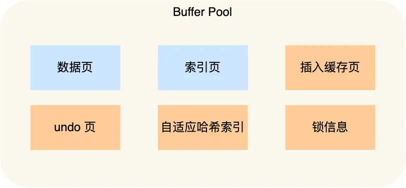

# MySQL入门

## *MySQL安装*

### 版本

MySQL在2016年直接从MySQL 5.7跳到了MySQL 8.0，由于6.0和7.0都是用来保留做MySQL的集群版本，因此采用了8.0的版本号。8.0的正式版是8.0.11，官方表示MySQL 8要比MySQL 5.7快2倍

https://www.jianshu.com/p/c33433573c1c

8.0支持了很多新特性，比如

* 对Unicode 9.0的开箱即用的完整支持
* 支持窗口函数和递归SQL语法，这在以往是不可能或者很难才能编写这样的查询语句
* 对原生JSON数据和文档存储功能的增强支持

笔者学习时使用的是 8.0.20 社区版本

### Windows

Win10专业版需要在计算机管理 - Administrators 属性中添加 `NETWORK SERVICE`

安装完成后将 `MySQL Server 8.0/bin` 加入PATH中

### Ubuntu

```cmd
$ sudo apt-get install mysql-server
```

### MySQL Shell

MySQL Shell是Oracle官方提供的交互式命令行工具，用于与MySQL数据库进行交互。它除了基本的SQL功能外，还提供一套使用Javascript和Python的API去管理MySQL。能使用它提供的XDevAPI操作MySQL 8.0提供的关系型数据库和文档数据库，还可以使用AdminAPI管理InnoDB集群。相较于传统的MySQL命令行客户端（如`mysql`），它引入了一些新的功能和改进

* MySQL Shell支持多种编程语言，包括JavaScript、Python和SQL。这意味着你可以使用不同的语言编写脚本和查询，从而更灵活地与MySQL数据库交互
* MySQL Shell引入了X DevAPI，这是一种现代API，使开发者能够更轻松地执行CRUD（创建、读取、更新、删除）操作。X DevAPI支持链式调用和异步操作

## *MySQL的启动*

### 可视化工具

首先得保证，有一个远端的服务器，并且端口开放且MySQL有对应的用户允许登陆

* MySQL Workbench：由MySQL官方提供的工具，支持数据库设计、SQL开发、数据库管理等多个方面的功能
* Navicat
* HeidiSQL

### `MySQL 8.0/bin` 中的相关文件

* mysqld：mysqld 是MySQL服务器的主要执行文件。它负责启动和管理MySQL数据库服务。运行 mysqld，可以启动MySQL服务器实例。不过一般用户不会直接使用这个可执行文件来启动，而是通过下面的一些perl脚本文件来启动
* mysql_safe (deprecated in 8.0)：一个启动脚本，调用mysqld，并且持续监控服务器的运行状态
* mysql.server (deprecated in 8.0)：一个启动脚本，调用mysqld_safe
* mysqld_multi：启动多个服务器服务/守护进程
* mysql：mysql是MySQL的命令行客户端，允许用户通过命令行界面连接到MySQL服务器，执行SQL查询和管理数据
* mysqladmin：`mysqladmin`是用于执行管理任务的命令行工具。它允许管理员执行诸如创建、删除数据库、监控服务器状态等任务。
* mysqlcheck：`mysqlcheck`是一个用于检查和修复MySQL表的工具。它可以检查表的一致性，并在需要时进行修复
* mysqldump：`mysqldump`是用于备份MySQL数据库的工具。它可以导出数据库结构和数据到SQL文件，以便稍后进行还原
* mysqlimport：`mysqlimport`用于将数据加载到MySQL表中。它从文本文件中读取数据并将其导入到指定的数据库和表中
* mysqlshow：`mysqlshow`用于显示MySQL服务器上的数据库和表的信息。它提供了有关数据库结构的摘要信息
* mysql_upgrade：`mysql_upgrade`用于升级MySQL数据库以适应新版本的工具。在MySQL升级时，运行此工具可以更新系统表和其他元素

### Windows

* 启动服务器

   * 手动启动 mysqld

   * 以服务方式启动
     * GUI：右击“计算机”，在快捷菜单中选择“管理”命令，打开“计算机管理”对话框。也可以执行“开始”|“控制面板”|“管理工具”|“服务”来启动服务
     * 命令行启动
       * 查看服务命令：`net start`
       * 关闭服务命令：`net stop MySQL80`
       * 启动服务命令：`net start MySQL80`

* 启动客户端
   * 通过命令行客户端 command line client
   * 使用cmd 或 PowerShell连接服务器 `mysql -h 127.0.0.1 -P 3306 -u root -p`
      * -h 或 --host：指定 MySQL 服务器的主机名或 IP 地址。在这个例子中，`-h 127.0.0.1` 表示连接到本地主机（localhost）的 MySQL 服务器。也可以使用 `-h localhost`
      * -P 或 --port：指定 MySQL 服务器的端口号。一般来说都会连接到 MySQL 默认的端口号 3306，此时可以省略
      * -u 或 --user：指定要使用的 MySQL 用户名。在这个例子中，`-u root` 表示使用用户名为 "root" 的用户连接到 MySQL 服务器
      * -p 或 --password：提示用户输入密码以连接到 MySQL 服务器。若在命令中没有直接提供密码（:warning: **最好不要这么做！**），而是通过 `-p` 选项告诉 MySQL 客户端需要输入密码。在输入此命令后，系统将提示用户输入密码
      * 退出客户端：quit、exit、`\q`
   

### Linux

* `ps ajx | grep mysqld` 看一下 `mysqld` 有没有在运行
* Optional：如果安装之后服务没有启动，可以 `systemctl start mysqld.service` 启动服务
  * 因为安装的时候是用root身份安装的，所以启动服务要用root身份来启动
  * 当然也可以以普通用户身份启动，然后输入root密码


关于第一次登陆时root的密码问题，**ubuntu上8.0.35root的默认密码应该是空**

```cmd
$ sudo cat /etc/mysql/debian.cnf
# Automatically generated for Debian scripts. DO NOT TOUCH!
[client]
host     = localhost
user     = debian-sys-maint
password = EhOQXglE2rlmVVDP
socket   = /var/run/mysqld/mysqld.sock
[mysql_upgrade]
host     = localhost
user     = debian-sys-maint
password = EhOQXglE2rlmVVDP
socket   = /var/run/mysqld/mysqld.sock 
```

在默认情况下，MySQL 在 Debian 系统上使用了一个特殊的用户 `debian-sys-maint` 用于系统维护任务。该用户在 `/etc/mysql/debian.cnf` 文件中有对应的登录凭据，包括用户名 `debian-sys-maint` 和密码 `EhOQXglE2rlmVVDP`

但这个用户通常是为系统维护用途而不是直接用于一般数据库操作的。在 Debian 系统上，如果要使用 `root` 用户登录 MySQL，应该使用 MySQL `root` 用户的凭据，而不是 `debian-sys-maint` 的凭据

修改root密码

```mysql
ALTER USER 'root'@'localhost' IDENTIFIED BY 'new_password';
FLUSH PRIVILEGES;
```

之后的使用

* 连接服务器 `mysql -h 127.0.0.1 -P 3306 -u root -p`
* 关闭服务器 `systemctl stop mysqld`

## *MySQL数据库的架构*

### 分层


* 有一个小型的编译器，对SQL语句i进行解析、优化
* Indexes 插件层/存储引擎层：接收上层请求后对文件进行增删查改。引擎是真正提供服务的部件，存储引擎的种类很多，是插件式的 Plug-in，可以用 `show engines;` 来查看。插件式：可以想象成懒加载的单例类，需要的时候就实例化

### 服务器、数据库与表的关系


* mysql是客户端，mysqld是服务端。一个MySQL服务器程序进程/服务被称为一个MySQL数据库实例 instance
  * Linux中mysql建立在 `/var/lib/mysql` 中
  * Mac中mysql建立在 `/usr/local/mysql` 中
  * Win中mysql建立在 `C:\Program Files\MySQL\MySQL Server 8.0` 中

* mysqld是一个软件层，能够帮助用户进行数据管理
* 创建一个数据库本质是在OS中建立了一个目录

## *用户 & 权限管理*

### 用户信息

MySQL中的用户都存储在系统数据库mysql的user表中。管理用户也就是管理user表

* host：表示这个用户可以从哪个主机登陆，如果是localhost，表示只能从本机登陆
* user：用户名
* authentication_string：用户密码通过password函数加密后的
* *_priv：用户拥有的权限

查看当前用户

```mysql
SELECT CURRENT_USER();
```

### 创建用户 & 赋予权限

可以通过 `INSERT user` 来添加用户，但不建议用这种方式，因为它们是不受管控的。应该用下面的语句

1. 以root身份登陆

   ```cmd
   $ mysql -uroot -h 'localhost' -p
   ```

2. 创建用户

   ```mysql
   CREATE USER 'new_user'@'localhost' IDENTIFIED BY 'user_password';
   ```

   * 注意：明文密码会自动通过MD5哈希函数加密后放到authentication_string中
   * 可以用 '%' 来表示允许包括本地的任意地址用户登陆

3. 添加权限

   * 赋予用户对特定数据库的特定权限

     ```mysql
     GRANT SELECT, INSERT, UPDATE ON your_database.* TO 'new_user'@'localhost';
     ```

   * 赋予用户对特定数据库的所有权限

     ```mysql
     GRANT ALL PRIVILEGES ON your_database.* TO 'new_user'@'localhost';
     ```

   * 赋予用户对所有数据库的所有权限

     ```mysql
     GRANT ALL PRIVILEGES ON *.* TO 'new_user'@'localhost' WITH GRANT OPTION;
     ```
     
     WITH GRANT OPTION 允许用户将这些权限授予其他用户

4. 刷新权限

   ```mysql
   FLUSH PRIVILEGES;
   ```

### 修改用户密码

在MySQL 5.7版本及以后，推荐使用`ALTER USER`语句来更改密码

* 自己改自己密码

  ```mysql
  SET password=password('新的密码');
  ```

* root用户修改指定用户的密码

  ```mysql
  SET password for 用户名@主机名=password('新的密码');
  ```

### 删除用户 & 撤销权限

* 删除用户

  ```mysql
  DROP USER 'username'@'host';
  ```

* 撤销权限

  * 撤销用户对指定数据库的特定权限

    ```mysql
    REVOKE SELECT, INSERT, UPDATE ON your_database.* FROM 'username'@'host';
    ```

  * 撤销用户对指定数据库的所有权限

    ```mysql
    REVOKE ALL PRIVILEGES ON your_database.* FROM 'username'@'host';
    ```

  * 剥夺用户对所有数据库的所有权限

    ```mysql
    REVOKE ALL PRIVILEGES ON *.* FROM 'username'@'host';
    ```

* 同样query完成后记得刷新权限

# 系统配置项

## *启动选项*

可以通过修改启动选项 startup option 来控制程序启动后的默认行为

### Windows

### Linux

## *系统变量*

## *存储引擎*

## *数据库操作*

### 系统库

安装MySQL并初始化数据库之后，默认会创建以下系统数据库

* mysql：存储了 MySQL 服务器正常运行所需的各种信息，比如用户和权限信息，用于验证和授权用户、存储访问权限、密码和其他全局配置设置
* information_schema：提供了访问数据库元数据的各种视图，包括数据库、表、字段类型以及访问权限等信息的元数据
* performance_schema：为 MySQL服务器的运行时状态提供了一个底层的监控功能，提供了关于查询性能、锁定、IO性能等方面的统计信息
* sys：是MySQL 5.7版本及更高版本中引入的，包含了一系列方便 DBA 和开发人员利用 performance_schema 性能数据库进行性能调优和诊断的视图

另外还有一些示例数据库或样本数据库 sakila（有关电影、演员、租赁等信息）、school（有关学校、学生、课程和教师等信息）、world（有关全球国家、城市和语言的信息） ，用于教学、学习和演示。它们提供了一些典型的数据库结构和数据，使用户能够练习SQL查询和了解数据库设计的基本概念

### 创建 & 选择数据库

* 查看已存在的所有数据库：`show databases;`
* 创建数据库： `create database DatabaseName`
  * 数据库的名字加不加反引号 \`\` 取决于创建的数据库名是否和SQL的关键字冲突，不过特别不建议冲突
  * 命名规范：一个项目一个数据库，多个项目慎用同一个数据库

* 查看当前数据库：`select database();` 
* 显式查看创建数据库时用的语句：`show create database DatabaseName;`
* 选择数据库：`use database_name;`
* 查看连接情况：`show processlist;`

### 修改数据库

### 删除数据库

```mysql
DROP DATABASE [IF EXISTS] DatabaseName;
```

* :warning: **轻易不要删库！！！MySQL删除数据库时也不会确认！！！**
* 迭代删除，删除最外面，里面的也被删光了

### 数据库的备份与恢复

* 备份：`mysqldump` 对数据做备份、对操作语句做备份
  * MySQL是备份语句，这种方式比较好，有上下文还可以带时间，若只是备份数据则没有上下文（Redis支持两种备份方式）
  * 备份过程中会对SQL语句进行优化，比如六条连续插入合并为一条插入等
* 还原：`source` 还原数据

# 数据类型

约束 Constraint：插入数据越界，和C语言编译器不同不会截断数据，而是**直接终止操作**，否则会影响MySQL数据的可信度。倒逼程序员，必须遵守规则

MySQL的数据类型，除了能满足各种应用场景，其本身就是一种约束

## *整形*

|        类型        | 大小 Byte |                     范围（有符号）                      |         范围（无符号）          |    用途    |
| :----------------: | :-------: | :-----------------------------------------------------: | :-----------------------------: | :--------: |
|      tinyint       |     1     |                       (-128, 127)                       |            (0, 225)             |  小整数值  |
|      smallint      |     2     |                    (-32,768, 32,767)                    |           (0, 65,535)           |  大整数值  |
|     mediumint      |     3     |                 (-8,388,608, 8,388,607)                 |         (0, 16,777,215)         |  大整数值  |
| **int 或 integer** |     4     |             (-2,147,483,648, 2,147,483,647)             |       (0, 4,294,967,295)        |  大整数值  |
|       bigint       |     8     | (-9,223,372,036,854,775,808, 9,223,372,036,854,775,807) | (0, 18,446,744,073,709,551,615) | 极大整数值 |

### 整形附带属性

* unsigned：若要设置成无符号可以在数据类型后面加上

* 类型后面的小括号配合zerofill使用

  * 小括号中的数字是用来指定显示宽度，注意并不是该类型占用字节数

  * 如果不显示指定宽度则默认为 tinyint(3)、 smallint(5)、 mediumint(8)、 int(11) 和 bigint(20)

  * 如果要有填充的效果要配合zerofill使用，否则是没有效果的，只会按默认宽度显示

    ```mysql
    CREATE TABLE my_table(id int(5) ZEROFILL);
    ```

  * **注意：若一个列被指定为zerofill，则MySQL会自动为该列添加unsigned属性**

* auto_increment

  * 在需要产生唯一标识符或顺序值时，可利用此属性，这个属性只用于整数类型

  * auto_increment 的值一般从1开始，每一行自增1

  * 一个表中最多只能有一个auto_increment列

  * 如果想要定义为auto_increment，应该定义为 not null，且同时应被定义为 primary key 或 unique

    ```mysql
    CREATE TABLE my_table(id int AUTO_INCREMENT PRIMARY KEY)
    CREATE TABLE my_table(id int AUTO_INCREMENT UNIQUE)
    ```

  * 在插入的时候如果想要实现自增长的效果，就不能自己指定自增长属性的值，为了正确解析，要给出指定了哪些属性来进行匹配

    ```mysql
    CREATE TABLE my_table(id int AUTO_INCREMENT PRIMARY KEY, name varchar(128))
    
    INSERT INTO my_table (name) VALUES ('wjfeng'); # id 会自增长
    ```

* 如果中间有不连续的自增值，下一次插入自增属性会从当前最大的值+1开始

### 补充：zerofill

```mysql
mysql> create table if not exists `test`(
    -> a int not null,
    -> b int unsigned not null
    -> );
Query OK, 0 rows affected (0.15 sec)

mysql> desc test2;
+-------+------------------+------+-----+---------+-------+
| Field | Type             | Null | Key | Default | Extra |
+-------+------------------+------+-----+---------+-------+
| a     | int(11)          | NO   |     | NULL    |       |
| b     | int(10) unsigned | NO   |     | NULL    |       |
+-------+------------------+------+-----+---------+-------+
2 rows in set (0.00 sec)
```

建立上面这个表，但是 `desc test`（describe） 查看表结构却会发现Type里面的两个 `int` 后面都会有一个括号里的值。`int` 类型的数据是4字节的，所以括号里的并不是它的长度

这个值的意义是数字前面填充0的个数，但是如果没有给出 `zerofill` 约束的话，这个值是没有意义的。下面给出 `zerofill` 的修改后，可以发现a的值变成了00001

```mysql
mysql> alter table test modify a int(5) unsigned zerofill;
mysql> insert into test values(1,2);
mysql> select * from test;
+-------+---+
| a     | b |
+-------+---+
| 00001 | 2 |
+-------+---+
```

为什么要将有符号和无符号的 `int` 的默认 `zerofill` 分别设置为11位和10位？$2^{32}-1=4,294,967,295$ 一共10位

### tinyint 类

相比于SQL标准，MySQL增加了 tinyint、mediumint 和 bigint 三种细分的整形

MySQL的 tinyint、smallint、int 数据类型可以类比C语言里的  char、short 和 int 类型。MySQL的数据类型划分越精细化，越可以进行有效管理

## *浮点数*

|  类型   | 大小 Byte |                    负数取值范围                     |                      正数取值范围                      |     用途     |
| :-----: | :-------: | :-------------------------------------------------: | :----------------------------------------------------: | :----------: |
|  float  |     4     |         -3.402823466E+38 ~ -1.175494351E-38         |         0 和 1.175494351E-38 ~ 3.402823466E+38         | 单精度浮点数 |
| double  |     8     | -1.7976931348623157E+308 ~ -2.2250738585072014E-308 | 0 和 2.2250738585072014E-308 ~ 1.7976931348623157E+308 | 双精度浮点数 |
| decimal |    M+2    |                      同double                       |                        同double                        | 定点型浮点数 |

### float 和 double 浮点数

`float[(M, D)] [unsigned]` 和 `double[(M, D)] [unsigned]`

*  M指定显示长度，D指定小数位数，占用空间4个字节。注意M和D表示的就是十进制数字**总的长度**和小数部分的长度，不是二进制位长度，比如 `float(4,2)` 表示的范围是 -99.99~99.99。如果不指定M和D时，默认会按照实际的精度来显示
* 同时对于unsigned也和整数类型的不太一样，设置成unsigned后相当于是直接把负数那一半砍掉，但不会增加整数部分的范围，也就是说 `float(4,2) unsinged` 的取值范围是 0~99.99

注意一个细节，浮点数只会四舍，不会五入。以上面 `float(4,2)` 为例，多余的小数位大于等于5会被MySQL拒绝，也就是说 99.990~99.994是被接受且舍入到99.99，但 99.995以上就会被拒绝。但是这是5.6、5.7版本的特点，其他的MySQL版本不一定是这么处理浮点数的（经过测试，8.0.20还是这样的）

### decimal 定点型浮点数

* `decimal(M, D) [unsigned]`：定点数M指定总长度，D表示小数点的位数。支持小数最大位数d是30。如果d被省略，默认为0；如果m被省略，默认是10
  $$
  1\leq M\leq65,\ default\ 10\\ 0\leq D\leq 30,\ default\ 0\\D\leq M
  $$

`decimal` 相比于 `float` 和 `double` 精度更高。比如说下面这个例子中可以发现用 `float` 存的小数和实际存的精确值不同了，发生了精度损失。存高精度小数decimal用的多

```mysql
mysql> create table tt8 ( id int, salary float(10,8), salary2
decimal(10,8));
mysql> insert into tt8 values(100,23.12345612, 23.12345612);
Query OK, 1 row affected (0.00 sec)

mysql> select * from tt8;
+------+-------------+-------------+
| id | salary | salary2 |
+------+-------------+-------------+
| 100 | 23.12345695 | 23.12345612 |
```

### 应用场景

float和double大部分应用场景下都没有自己设置精度，默认情况下让系统自己确定可能更精确，之后的MySQL版本会取消用户指定

当我们需要存储小数，并且有精度要求，比如说要精确地存储金额时（特别是在银行中），通常会考虑使用DECIMAL 字段类型

## *字符集和校验规则*

存到数据库：系统默认字符集

通过数据比较来取数据：校验规则

一般字符集和校验规则是匹配的

### 查看系统的字符集信息

* 查看系统默认字符集以及校验规则

  ```mysql
  show variables like 'character_set_database';
  show variables like 'collation_database';
  ```

* 查看数据库支持的字符集

  ```mysql
  show charset;
  ```

* 查看数据库支持的字符集校验规则

  ```mysql
  show collation;
  ```

### 校验规则对数据库的影响

设置数据库的编码和校验规则，数据库本身是一个索引目录，本质会影响对应数据库内部的表的编码和校验规则

创建一个新的数据库，会在 `db.opt` 里自动写入使用的字符集和校验规则

单机使用就默认，如果要备份到远端就显式字符集和校验规则创建

下面做一个实验可以观察到有不同的效果

## *字符串类*

|  类型   | 字符长度 |    用途    |
| :-----: | :------: | :--------: |
|  CHAR   |  0-255   | 定长字符串 |
| VARCHAR | 0-65535  | 变长字符串 |

注意：MySQL对于字符串的处理严重便宜SQL标准，它是 case-insensitive，并且既可以使用 single quote 也可以使用 double quotes

### char 和 varchar

char 类型是长度固定的字符串，它的长度在创建表时就指定了。其长度可以是 0~255 的任意值。比如 `char(100)` 就是指定 char 类型的长度为 100

和C语言中1个字符是1个字节不同，MySQL中1个字符就是1个字符，比如说 `'ab'` 是两个字符，`'中国'` 也是两个字符

**char 存储值时，它们会用空格右填充到指定的长度**。如果插入的数据本身后面有空格的话，空格数据就没了，比如往一个 `char(5)` 的列中插入数据

```mysql
create table char_example(e_char char(5), v_char varchar(5)); # 创建数据表
insert into char_example values('12345', '12345');            # 正常插入数据
insert into char_example values('12   ', '12   ');            # char 类型会屏蔽后面隐藏的空格，varchar 不会
```

### varchar

格式是 `varchar(L)`，`varchar` 长度可以指定为0~65535之间的值，但会把1个或2个字节用于记录数据大小，因此说有效字符数是65532个。所以 `varchar(65535)` 不能保存65535个中文字符，因为1个中文字符要用2个字节来表示，超出了用来记录数据大小的字节的表示范围

变长是什么意思呢？意思就是它支持的L仅仅是最大字符长度，若存的是小于L的，那么开的空间也就是按存的字符定

### TEXT

TEXT 类型是一种特殊的字符串类型，包括 TINYTEXT、TEXT、MEDIUMTEXT 和 LONGTEXT

|    类型    |    字节数    |       用途       |
| :--------: | :----------: | :--------------: |
|  TINYTEXT  |    0-255     |   短文本字符串   |
|    TEXT    |   0-65535    |    长文本数据    |
| MEDIUMTEXT |  0-16777215  | 中等长度文本数据 |
|  LONGTEXT  | 0-4294967295 |    极大文本数    |

注意这里的L是字节，和char的字符长度不同，因此能存多少个字符是和编码有关系的

* 当编码是utf8时，text 的最大长度是65532/3=21844 字节，因为ut8f中，一个字符占3个字节
* 当编码是gbk时，text 的最大长度是65532/2=32766 字节，因为gbk中，一个字符占2字节

### 字符串类型选用建议

* 若数据长度都一样，就用定长 char 一类，比如ID、手机号等；若长度有变化，就用 varchar，但要确保最长的能存进去，比如名字、地址等
* char 磁盘空间比较浪费，但效率高；varchar 磁盘空间比较节省，但效率低，因为 varchar 是需要通过后面的记录数来计算；text 效率最低
* 如果数据长度超过 255 个字符而在 65535 之内，直接使用 varchar 或 text
* **如果字符串尾部要保留空格，必须选择 varchar**
* text 不设置长度，当不知道属性的最大长度时，适合用 text，能用 varchar 的地方不用 text 

## *二进制类型*

|     类型     |            大小 Byte             |       用途       |
| :----------: | :------------------------------: | :--------------: |
|  BINARY(M)   |     字节数为M，允许长度为0-M     | 定长二进制字符串 |
| VARBINARY(M) | 允许长度为0-M，字节数值的长度加1 | 变长二进制字符串 |
|    BIT(M)    |                M                 |       位图       |

### binary 和 varbinary 类

二进制类型没有字符集，并且排序和比较基于列值字节的数值。而 TEXT 类型有字符集，并且根据字符集的校对规则对值进行排序和比较

binary和varbinary跟char和varchar使用上是一样的，binary的长度是固定的，不足最大长度的空间由 `\0` 补全

binary和varbinary显示的时候都会以十六进制显示

### bit 类

`bit[(M)]`：位字段类型。M表示每个值的位数，范围从1到64。如果M被忽略，默认为1。bit以ASCII码形式显示

位字段还是很有用的，比如用来表示性别等取值非常有限的变量

select查询时可以使用 `bin()` 、`oct()` 、`hex()` 函数讲字段的值转成相应的二进制、八进制和十六进制

不太建议显示地在bit类存入文本、数字等，因为高位的0不会被存进去

### blob 类

|    类型    |  大小 Byte   |             用途              |
| :--------: | :----------: | :---------------------------: |
|  TINYBLOB  |    0-255     | 不超过255个字符的二进制字符串 |
|    BLOB    |   0-65535    |    二进制形式的长文本数据     |
| MEDIUMBLOB |  0-16777215  | 二进制形式的中等长度文本数据  |
|  LONGBLOB  | 0-4294967295 |   二进制形式的极大文本数据    |

类似于字符串类型的TEXT，用于扩大二进制类型的存储范围

BLOB, Binary Large Object 通常指的是二进制大对象，它是一种存储二进制数据的数据类型。在计算机科学中，"blob"可以用来表示不可修改的二进制数据块，通常用于存储大量的原始数据，例如图像、音频文件或其他二进制文件

## *日期和时间类型*

|   类型    | 大小 Byte |       格式        |   用途   |
| :-------: | :-------: | :---------------: | :------: |
|   DATE    |     4     |    YYYY-MM-DD     |  日期值  |
|   TIME    |     3     |     HH:MM:SS      |  时间值  |
|   YEAR    |     1     |       YYYY        |  年份值  |
| DATETIME  |     8     | YYYY-MM-DD HHMMSS | 混合日期 |
| TIMESTAMP |     4     | YYYY-MM-DD HHMMSS |  时间戳  |

```mysql
create table birthday (t1 date, t2 datetime, t3 timestamp);
```

用 `desc birthday;` 查看表结构，可以看到 `timestamp` 的 extra 里写的是 `on update CURRENT_TIMESTAMP`，意思是 `update` 数据时时间戳是自动更新的

插入日期时间时，日期年月日和时间时分秒可以使用 `: - _ /` 中的任意字符来分隔，如果单独插入时间会报错

### 时间函数

MySQL提供了一些时间函数来获取时间

* `CURDATE()`：获得当前的DATE，可以直接插入DATE类型中
* `NOW()`：获得当前的DATETIME，可直接插入DATETIME和TIMESTAMP类型中
* `TIME()`：获取参数给定时间串中的时分秒，可直接插入TIME类型中
* `YEAR()`：获取参数给定时间串中的年份，可直接插入YEAR类型中
* `MONTH()` 、`DAY()`、`HOUR()`、`MINUTE()`、`SECOND()`：获取参数给定时间串中的月、日、时、分、秒值

## *`enum` 和 `set`*

### 语法

enum单选，set多选。`set(Option1, Option2, ...)` ，最多支持65535个选项

列表中的每个值独有一个顺序排列的编号，MySQL中存入的是这个编号，而不是列表中的值。**默认编号从 1 开始**

```mysql
create table if not exists votes( 
    gender enum('Male', 'Female'),
    hobby set('Coding', 'Hiking', 'Basketball', 'Swimming')
)engine=InnoDB default charset=utf8;

insert into votes('Male', 'Hiking', 'Swimming');
insert into votes(1, 5); # 等价
```

enum数据类型的记录可以输入一个整数，代表位图，比如5是0101**反过来**，即1010

若 ENUM 类型加上了 NOT NULL 属性，其默认值为取值列表的第一个元素。若不加 NOT NULL 属性， ENUM 类型将允许插入 NULL，而且 NULL 为默认值

### 在 `set` 中查询

不能用 `select * from votes where hobby='Hiking'` 来查找出所有爱好有 `Hiking` 的项，因为它返回的是严格等于查询条件的行，要用查找函数 `find_in_est`

查找函数：`select * from votes where find_in_set('Coding', hobby);` 返回行index

# 表

## *表定义操作*

### 创建表

```mysql
create table <表名> ([表定义选项])[表选项][分区选项];
其中[表定义选项]为：<列名 1> <类型 1> [,...] <列名 n> <类型 n>

create table table_name (
field1 datatype, # 字段名和数据类型用空格分开
field2 datatype, # 字段和字段之间用逗号分开
field3 datatype
) character set 字符集 collate 校验规则 engine 存储引擎;
```

* 表选项

  * 存储引擎 storage engine
  * 字符集 character set：可以自己指定表的字符集和校验规则，就近原则可以与数据库的字符集和校验规则不同，但不推荐这么做，容易引起混淆
  * 排序规则 collation
  * 注释 comment：提供对表的描述信息，用 `show create database DatabaseName;` 查看

* 分区选项：用于定义表的分区方式，将表按照某个列的值范围划分为多个分区，可以提高查询性能和数据管理的灵活性

  ```mysql
  CREATE TABLE sales (
    sale_id INT,
    sale_date DATE,
    amount DECIMAL(10, 2)
  )
  PARTITION BY RANGE (YEAR(sale_date)) (
    PARTITION p0 VALUES LESS THAN (1991),
    PARTITION p1 VALUES LESS THAN (1995),
    PARTITION p2 VALUES LESS THAN (2000),
    PARTITION p3 VALUES LESS THAN MAXVALUE
  );
  ```

  在这个例子中，`PARTITION BY RANGE (YEAR(sale_date))` 表示按照 `sale_date` 列的年份进行分区，分为四个分区。这样的分区可以使得在特定查询中只需检查特定分区，提高查询性能。注意：分区选项的语法和支持程度可能因数据库系统而异

注意事项

* 用户在创建表时必须拥有创建表的权限
* 可以使用 `database_name.table_name` 的方式来在特定的数据库中创建表

### 查看表的结构

```mysql
create table users (
    id int,
    name varchar(20) comment '用户名',
    password char(32) comment '密码是32位的md5值',
    birthday date comment '生日'
) character set utf8 engine MyISAM;
```

* `NULL` 代表没有，`` 代表空串

* 用 `show tables;` 查看数据库中的表

* 查看创建表的语句和 comment 内容 `show create tablename;`

* 用 `desc [tablename];`（describe） 查看表结构

  

  Field 是字段名称；Type 字段类型；Null 是否为空；Key 索引类型；Default 默认值；Extra 扩充

* 查找数据 `select 查找项 from 表名 order by 排序项`，比如说打印所有值为 `select *`

### 索引 Key

在关系数据库中，索引是一种单独的、物理的对数据库表中一列或多列的值进行排序的一种存储结构，它是某个表中一列或若干列值的集合和相应的指向表中物理标识这些值的数据页的逻辑指针清单。索引的作用相当于图书的目录，可以根据目录中的页码快速找到所需的内容

索引提供指向存储在表的指定列中的数据值的指针，然后根据您指定的排序顺序对这些指针排序。数据库使用索引以找到特定值，然后顺指针找到包含该值的行。这样可以使对应于表的SQL语句执行得更快，可快速访问数据库表中的特定信息

索引：是一种精心设计过的数据结构。用空间换时间，用更多的资源来提高查找速度

### 修改表本身

和数据库本身一样，表本身也是轻易不能改的，否则会出现很多问题，建立之前必须要仔细设计

* 改表名 `alter table 原表名 rename 新表名`（`alter` 可以改表名，database不支持改名）
* 删表 `DROP [TEMPORARY] TABLE [IF EXISTS] tbl_name [, tbl_name] ... `

### 修改列

```mysql
ALTER TABLE tablename ADD (column datatype [DEFAULT expr][,column
datatype]...);
ALTER TABLE tablename MODIfy (column datatype [DEFAULT expr][,column
datatype]...);
ALTER TABLE tablename DROP (column)
```

* `alter table 表名 modify 列名 varchar(60);` 修改表结构的时候是覆盖式的，即此时 `show create table 表名` 可以发现已经是修改后的结果了
* 插入记录 `insert into 表名 values;`
* 改名字：`alter table 表名 change 老名字 新名字 数据类型`，也是覆盖式地改

### 列描述

comment，没有实际含义，专门用来描述字段，会根据表创建语句保存，用来给程序员或DBA来进行了解

comment是一种代码规范，只不过是一种软性的描述，没有强制能力

然而通过 `desc` 是看不到comment信息的，要用 `show create table 表名` 才能看到

```mysql
mysql> create table info (
    -> name varchar(20) not null comment 'Name',
    -> age tinyint unsigned default 18 comment 'Age, do not allow users under 18 to register',
    -> gender char(2) default 'Male' comment 'Gender'
    -> );
Query OK, 0 rows affected (0.00 sec)
```

## *列的完整性约束*

完整性约束条件是对字段进行限制，要求用户对该属性进行的操作符合特定的要求。若不满足完整性约束条件，数据库系统将不再执行用户的操作

### 主键 primary key

主键是用来**唯一的表征每条记录身份**的属性，**不能重复或者为空**。一张表中最多只能有一个主键，主键所在的列通常是整数类型

下面给出一些对主键的操作

* 创建表的时候直接在字段上指定主键

  ```mysql
  mysql> create table test(
      -> id int unsigned primary key comment 'ID can not be empty',
      -> name varchar(20) not null);
  # 或者下面这么写也可以
  mysql> create table test(
      -> id int unsigned comment 'ID can not be empty',
      -> name varchar(20) not null
  	primary key ('id'));
  ```

  此时主键就设置好了

  ```mysql
  mysql> desc test2;
  +-------+------------------+------+-----+---------+-------+
  | Field | Type             | Null | Key | Default | Extra |
  +-------+------------------+------+-----+---------+-------+
  | id    | int(10) unsigned | NO   | PRI | NULL    |       |
  | name  | varchar(20)      | NO   |     | NULL    |       |
  +-------+------------------+------+-----+---------+-------+
  ```

* 当表创建好以后但是没有主键的时候，可以再次追加主键 `alter table 表名 add primary key(字段列表)`。但是这种做法是特别不推荐的，主键一定要建表之前就构思好，不要之后再改

* 定义主键的时候可以用 `constraint` 给主键起一个名字

* 删除主键 `alter table 表名 drop primary key;`

* 复合主键 Composite Primary Key：多个字段组合起来作为一个主键，只有当主键的所有字段都冲突了才会触发主键冲突

  比如班级表如果把年级带上的话，就要把年级和班级作为复合主键，一个年级可能有多个班级

  ```mysql
  mysql> create table tt14(
      -> id int unsigned,
      -> class char(10) comment 'class no.',
      -> primary key(id, course) # id和course为复合主键
      -> );
  ```

如何设计主键？

* 结合业务，选择一个唯一的列属性作为主键
* 选择与业务无关的经过设计的唯一值。这样设计，主键值和业务无关，业务调整不会影响整体主键的表结构。这样可以做到表结构与主键一定程度上的解耦，比如说QQ号

### 外键 foreign key

外键用于定义主表和从表之间的关系，即子表中某个字段的取值范围由父表决定

外键约束主要定义在从表上，主表则必须是有主键约束或unique约束。当定义外键后，要求外键列数据必须在主表的主键列存在**或为null**

先来看一下不使用外键约束会发生什么。分别建立 `student_tb` 和 `class_tb` 两张表，根据业务的情况，学生的class_id天然的就和班级的id有关

```mysql
mysql> create table if not exists student_tb(
    -> id bigint primary key,
    -> name char(32) not null,
    -> class_id bigint
    -> ) engine=innodb;
    
mysql> create table if not exists class_tb(
    -> id bigint primary key,
    -> name varchar(32) not null,
    -> teacher varchar(32) not null
    -> ) engine=innodb;
```

那么有下面两种很实际的情况

* **插入一个学生，但是他的class_id是在班级表里找不到的，这时应该要禁止插入**
* **删除一个班级，但是这个班级里还有人，这时应该要禁止删除**

如果仅仅是按照上面的方法来定义两张两张表，虽然已经可以在语义上已经属于外键了，但两张表仍然是两张独立的表。因而我们要用外键约束。外键建立在从表，定义了主表和从表之间的约束关系

```mysql
# 先创建主表
create table if not exists class_tb(
id bigint primary key,
name varchar(32) not null,
teacher varchar(32) not null
) engine=innodb;
    
# 再建立从表
create table if not exists student_tb(
id bigint primary key,
name char(32) not null,
class_id bigint
foreign key (class_id) references class_tb(id) # 外键约束
) engine=innodb;
```

### 空属性

数据库默认字段基本都是字段为空 `NULL`，但是实际开发时，尽可能保证字段不为空，即 `NOT NULL`，因为数据为空没办法参与运算

```mysql
mysql> create table myclass(
    -> class_name varchar(20) not null,
    -> class_room varchar(10) not null);
Query OK, 0 rows affected (0.03 sec)
```

### <span id="自增长">自增长 auto_increment</span>

当对应的字段，不给值，会自动的被系统触发，系统会从当前字段中已经有的最大值+1操作，得到一个新的不同的值。通常和主键搭配使用，作为逻辑主键

* 任何一个字段要做自增长，前提是本身是一个索引（key一栏有值）
* 自增长字段必须是整数，默认从1开始
* 一张表最多只能有一个自增长

```mysql
mysql> create table info(
    -> id int unsigned primary key auto_increment,
    -> name varchar(10) not null default ''
    -> );
```

用 `show create table info;` 可以看到表维护了一个 `AUTO_INCREMENT` 的计数器但是用户可以强行指定非重复的自增长键，**注意在强行手动非连续的插入后，`AUTO_INCREMENT` 的值会变成当前最大的值**，比如下面的例子

```mysql
mysql> insert into info (name) values ('a');
mysql> insert into info (id, name) values (100, 'b');
mysql> insert into info (id, name) values (50, 'c');

mysql> select * from info;
+-----+------+
| id  | name |
+-----+------+
|   1 | a    |
|  50 | c    |
| 100 | b    |
+-----+------+

mysql> show create table info;
+-------+-----------------------------------------------------------------------------------------------------------------------------------------------------------------------------------------------+
| Table | Create Table                                                                                                                                                                                  |
+-------+-----------------------------------------------------------------------------------------------------------------------------------------------------------------------------------------------+
| info  | CREATE TABLE `info` (
  `id` int(10) unsigned NOT NULL AUTO_INCREMENT,
  `name` varchar(10) NOT NULL DEFAULT '',
  PRIMARY KEY (`id`)
) ENGINE=InnoDB AUTO_INCREMENT=101 DEFAULT CHARSET=utf8 | # 现在维护的AUTO_INCREMENT值变成100了！
+-------+-----------------------------------------------------------------------------------------------------------------------------------------------------------------------------------------------+
```

`AUTO_INCREMENT` 也可以在建表的时候手动指定初始化

### 唯一键 unique key

唯一键与主键是不冲突的，互相补充。因为有时候将一个字段设置为主键了，但可能还需要约束其他字段的唯一性，这时候就要用 unique key。比如说用ID作为主键，但是每个人的电话号码和邮箱也要唯一，这时候就把号码和邮箱都设置为 unique key

```mysql
mysql> create table student (
    -> id char(10) primary key comment '以学号为主键',
    -> phone char(11) unique key '要保证电话的唯一性',
    -> email varchar(100) unique key '要保证邮箱的唯一性' 
    -> );
```

### 默认值

某一种数据会经常性的出现某个具体的值，可以在一开始就指定好，在需要真实数据的时候，用户可以选择性的使用默认值。若数据在输入的时候不给该字段赋值，就使用默认值

建表的时候或者插入列的时候用 `defualt 值` 来给出

```mysql
mysql> create table info (
    -> name varchar(20) not null,
    -> age tinyint unsigned default 18,
    -> gender char(2) default 'Male'
    -> );
Query OK, 0 rows affected (0.00 sec)
```

约束是可以堆叠的，比如 `age tinyint unsigned not null default 18`，它的意思是插入的数据不可以是显式的 `NULL`，但若是没有给值的话就默认是18。默认值实际上是降低了约束等级。这里的例子不太好，因为 `not null` 和 `defalut` 一般不需要同时出现，因为 `default` 本身有默认值，不会为空

### 调整完整性约束

在表被定义之后，还可以调整完整性约束

* 新增

  ```mysql
  alter table [table_name] add constraint [constraint_name] [unique key| primary key | foreign key] ([column_name])
  ```

* 删除

  * 删除主键

    ```mysql
    alter table [table_name] drop primary key;
    ```

  * 删除外键或唯一键

    ```mysql
    alter table [table_name] drop index [constraint_name];
    ```

* 修改：无法直接原地修改，要先删除再新增

## *表的增删改操作*

表的增删改查称为CRUD Create Retrive Update Delete，其中create仅仅是一个单词，和建表的 `create` 操作没什么关系

```mysql
create table if not exists students (
id int unsigned primary key auto_increment,
sn int unsigned unique key not null comment "Student ID",
name varchar(64) not null comment "Students' name",
qq varchar(64) unique key
);
```

表的查询是一个非常重要且复杂的主题，我们在下面的查询部分单独给出

### 插入

可以忽略列名称，但必须全列插入；可以忽略某些列数据，但必须指明往哪些列插入

* 单行数据 + 全列插入：除了自增列外若每列指明了变量，那就按顺序匹配插入；若插入多行数据就用 `,` 分割数据

* 由于主键或者唯一键对应的值已经存在而导致插入失败，这时候直接更新

  ```mysql
  INSERT ... ON DUPLICATE KEY UPDATE column = value [, column = value] ... # 中括号表示可以省略
  ```

  * 0 row affected：表中有冲突数据，但冲突数据的值和 update 的值相等。可以用 `select row_count();` 来查看最近一条指令 how many rows affected
  * 1 row affected：表中没有冲突数据，数据被插入
  * 2 row affected：表中有冲突数据，并且数据已经被更新

* 没有冲突就插入，有冲突就直接替换

  ```mysql
  REPLACE INTO students (sn, name) VALUES (20001, '曹阿瞒');
  ```

### Update 修改

对查询到的结果进行列值更新

```mysql
UPDATE tablename SET column = expr [, column = expr ...] [WHERE ...] [ORDER BY ...] [LIMIT ...];
```

### Delete 删除

* 删除

  ```mysql
  DELETE FROM tablename [WHERE ...] [ORDER BY ...] [LIMIT ...]
  ```

* 截断

  ```mysql
  TRUNCATE [TABLE] tablename
  ```

  * 只能对整表操作，不能像 DELETE 一样针对部分数据操作
  * 实际上 MySQL 不对数据操作，所以比 DELETE 更快，但是TRUNCATE在删除数据的时候，并不经过真正的事物，所以无法回滚
  * 会重置 AUTO_INCREMENT 项

## *内置函数*

## *连接*

# 索引

索引是用来提高查询速度的，它用来协助内存中对数据的增删查改

索引是一种数据结构，它提供了对数据库表中数据的快速访问方法。通过使用索引，可以减少数据库系统需要扫描整个表的次数，从而提高查询性能

索引包括普通索引、唯一性索引、全文索引、单列索引、多列索引和空间索引等

## *普通索引*

普通索引是MySQL中最基本的索引类型，它不附加任何限制条件（唯一、非空等限制），允许表中的列包含重复的值。普通索引可以用于提高查询性能，尤其是在针对查询中涉及的列进行检索时

### 创建表时定义索引

```mysql
CREATE TABLE tablename (
    propname1 datatype,
    propname2 datatype,
    propname3 datatype,
    INDEX | KEY [indexname] (propnamen [(length)] [ASC ｜ DESC]);
);
```

* 虽然用 INDEX 和 KEY 都可以，但推荐用INDEX，不然容易和完整性约束混淆。不过 show 的时候MySQL貌似还是写的KEY
* 列名称就应该是索引的名称，不建议给索引重新起名，默认就直接用列名称
* length 是可选参数，其指索引的长度，必须是字符串类型才可以使用
* ASC 和 DESC 是可选的排序参数，ASC 表示升序排列，DESC 表示降序排列。若不指定，则为升序

### 已存在的表上创建索引

1. 方法一：执行create语句

   ```mysql
   CREATE INDEX indexname ON tablename (propname [(length)] [ASC | DESC]);
   ```

   注意：INDEX 用来指定字段为索引，此处不能为KEY

2. 方法二：执行 alter table 语句

   ```mysql
   ALTER TABLE tablename ADD INDEX | KEY indexname (propname [(length)] [ASC | DESC]);
   ```

### 查看索引执行情况

```mysql
EXPLAIN select * from ...
```

* key：实际使用的索引。如果为 NULL，则没有使用索引
* possible_keys：显示可能应用在这张表中的索引，一个或多个。查询涉及到的字段上若存在索引，则该索引将被列出，但不一定被查询实际使用
* key_len：表示索引中使用的字节数，可通过该列计算查询中使用的索引的长度。此值越短越好

### 删除索引

```mysql
DROP INDEX indexname ON tablename;
```

和修改完整性约束要先删除再新增一样，修改索引也是先删除再新增

## *全文索引*

MySQL 从 3.23.23 版本开始支持全文索引，MySQL5.6以前只能在存储引擎为 MyISAM 的数据表上创建全文索引，5.6 之后 InnoDB 开始支持全文索引（5.7之后支持中文全文索引）

全文索引主要对字符串类型建立**基于分词 token**的索引，用在 CHAR、VARCHAR 和 TEXT 的字段上，以 便能 够更加快速地查询数据量较大的字符串类型的字段

全文索引以词为基础的，MySQL 默认**所有非字母和数字的特殊符号都是分词符**

默认情况下，全文索引的搜索执行方式为不区分大小写，如果全文索引所关联的字段为二进制数据类型，就以区分大小写的搜索方式执行

```mysql
CREATE TABLE tablename (
    propname1 datatype,
    propname2 datatype,
    propname3 datatype,
    FULLTEXT INDEX | KEY [indexname] (propnamen [(length)] [ASC ｜ DESC]);
);
```

使用的时候用 match 来检索

### MySQL8 中文分词支持

1. 在配置文件 my.ini 增加下面的字段后重启MySQL服务

   ```
   [mysqld]
   ngram_token_size=2
   ```

2. 创建表的时候在全文索引后面带上 `with parser`

   ```mysql
   CREATE TABLE tablename (
       propname1 datatype,
       propname2 datatype,
       propname3 datatype,
       FULLTEXT INDEX | KEY [indexname] (propnamen [(length)] [ASC ｜ DESC]) WITH PARSER;
   );
   ```

## *唯一索引和多列索引*

### 唯一索引

唯一索引就是建立在unique key上的索引，其实就是普通索引

### 多列索引

多列索引：在创建索引时所关联的字段不是一个字段，而是多个字段，虽然可以通过所关联的字段进行查询，但是只有查询条件中使用了所关联字段中的第一个字段，多列索引才会被使用

## *一些特性*

### 索引覆盖

索引覆盖 covering index 是指一个查询语句可以完全通过使用从非主键索引而不需要访问主键索引中的记录就能够得到结果。在这种情况下，索引已经包含了查询所需的所有信息，而不必去查找实际的数据页或数据行

### 索引匹配原则


### 隐藏索引

MySQL 8 开始支持隐藏索引

隐藏索引让索引暂时不可见。隐藏索引可以用来测试索引的性能，如果优化器性能无影响就可以真正地删除索引

```mysql
ALTER TABLE tablename ALTER INDEX index_name INVISIBLE; # 隐藏索引
ALTER TABLE tablename ALTER INDEX index_name VISIBLE; # 取消隐藏
```

## *索引的设计原则*

1. 选择唯一性索引
2. 为经常需要排序、分组和联合操作的字段建立索引


索引覆盖：索引把主键覆盖了

索引最左匹配原则/最右匹配原则


索引可以提高查询的速度，但是会影响插入记录的速度，因为向有索引的表中插入记录时，数据库系统会
按照索引进行排序，这样就降低了插入记录的速度，插入大量记录时的速度影响更加明显。这种情况下，最好
的办法是先删除表中的索引，然后插入数据，插入完成后再创建索引。


慎用通配符和模糊查询：在查询中慎用`LIKE`语句的通配符，因为这样的查询可能无法充分利用索引


* 一个表中，最多有一个主键索引，当然可以使符合主键
* 主键索引的效率高（主键不可重复）
* 创建主键索引的列，它的值不能为null，且不能重复
* 主键索引的列基本上是int

# InnoDB引擎的B+数索引


数据库底层索引实现主要有两种存储类型，B 树(BTREE)和哈希(HASH)索引，InnoDB 和 MyISAM 使用 BTREE 索引;而 MEMORY 存储引擎可以使用 BTREE 和 HASH 索引，默认用 BTREE.在没有指定的情况下，数据库使 用的引擎是 InnoDB。


16KB 的 MySQL page，用B+树来组织管理

建立索引的时候不是一对一的关系，而是间隔着来，否则还是线性的查找速度


柔性数组

```c
struct Page {
    struct page *prev;
    struct page *next;
    char data[0];
};
```


具有主键的表是一个表一个B+树

没有主键的话，可以认为是所有的数据是线性组织的。MySQL会自动形成隐藏主键

B+树中所有的叶子结点不需要load到内存中，等有需要的时候再load MySQL pagez

叶结点之间互相连接范围查找


相比于B树，B+树的结点可以存更多的索引

聚簇索引：InnoDB 表中的所有带有主键的数据都是以B+的形式呈现的，B+树和数据都是耦合在一起的。InnoDB构建主键索引是聚簇的，而普通索引则是根据普通列的key构建B+索引然后叶子上放的是普通数据对应记录的主键Key值。后续查找的时候可以通过回表的方式查找

回表 Lookup/Ref 是指，查询用到的非聚簇索引里面的列，不能满足查询结果列的需要，需要回表，使用聚簇索引再查一遍。主要原因是为了节省空间，不可能每建立一个索引就复制一份对应的数据

不一定每次查询都要回表，只需要在一棵索引树上就能获取SQL所需的所有列数据，无需回表

非聚簇索引：MyISAM 解耦了索引和数据。构建主键或普通索引就是构建B+，叶子保存数据记录的地址即可

聚簇和非聚簇索引的差别在于如何描述Page的数据结构

InnoDB会生成两个文件，即 .ibd （Data和Index耦合在一块）和 .frm（表结构）文件；MyISAM会生成三个文件，即 .frm（表结构）、.MYD（Data） 和 .MYI（Index）文件


## *聚簇索引和二级索引*

# 查询

## *简单查询*

### 基本查找

```mysql
SELECT
[DISTINCT] {* | {column [, column] ...}
[FROM tablename]
[WHERE ...]
[ORDER BY column [ASC | DESC], ...]
LIMIT ...
```

* 全列查询 `select * from tablename;`

* 指定列查询 `select field1 field2 from tabename;`

* 查询字段为表达式

  ```mysql
  SELECT id, name, chinese + math + english FROM exam_result;
  SELECT id, name, chinese + math + english AS total FROM exam_result; # 重命名为total
  ```

* 为查询结果指定别名 AS

* 结果去重 DISTINCT

  ```mysql
  SELECT DISTINCT math FROM exam_result;
  ```

### select 的顺序问题

当 `select name, id from exam_result where XXX` 时其实是先找到表做了遍历，然后进行所有字段的筛选，即 `select * from exam_result where XXX`，最后再从中裁剪出 `name, id` 字段

如何理解先找到表做筛选？下面这个语句会报错 `Unknown column 'total' in 'where clause'`，因为要先执行后半段去表里total，但是找不到

```mysql
SELECT name, id, chinese+math+english AS total FROM exam_result WHERE total<200; # 报错
SELECT name, id, chinese+math+english AS total FROM exam_result WHERE chinese+math+english<200; # 修正
```

### where 条件

`''` 和 NULL 是不一样的：`''` 是存在的空串，而NULL是不存在。如果筛选条件是 `WHERE XX = NULL` 是搜不出来的

如果要筛选NULL可以用 `<==>NULL`、`<=>NULL` 和 `IS NULL`（推荐用这个）

### 范围查询

* 我们需要查询的目标记录限定在某个集合中的时候，IN 可以实现判断字段的数值是否在指定集合中

  使用 NOT IN 可以反向查询非集合中的数据

  在使用 IN 时，查询的集合中如果存在 NULL 是不会影响查询的，NULL 存不存在的效果都一样；但如果使用关键字 NOT IN，查询的集合中如果存在 NULL，则不会查询到任何的结果

* `BETWEEN ... AND ...` 效果等价于 `>= AND <= `  前闭后闭区间，只能用于整数和浮点数，不能用于字符串

### like模糊查询

```mysql
SELECT field1,field2,...,fieldn
FROM tablename
WHERE fieldm
LIKE value;
```

`LIKE 孙%` 模糊匹配姓孙的，%匹配0个或多个，`_` 匹配1个字符（`__` 匹配2个字符）

### 结果排序

```mysql
-- ASC 为升序（从小到大）
-- DESC 为降序（从大到小）
-- 默认为 ASC
SELECT ... FROM tablename [WHERE ...] ORDER BY column [ASC|DESC], [...];
```

比较字符串的时候是逐个比较值

若存在一条记录字段的值为空值 NULL，那么按升序排序时，含空值的记录将最先显示，可以理解为空值是该字段的最小值；按降序排列时，字段为空值的记录将最后显示

排序是最后一步，所以可以用别名

### 筛选分页结果

```mysql
-- 起始下标为 0
-- 从 0 开始，筛选 n 条结果
SELECT ... FROM tablename [WHERE ...] [ORDER BY ...] LIMIT n;
-- 从 s 开始，筛选 n 条结果
SELECT ... FROM tablename [WHERE ...] [ORDER BY ...] LIMIT s, n;
-- 从 s 开始，筛选 n 条结果，比第二种用法更明确，建议使用
SELECT ... FROM tablename [WHERE ...] [ORDER BY ...] LIMIT n OFFSET s;
```

建议：对未知表进行查询时，最好加一条 `LIMIT 1`，避免因为表中数据过大，查询全表数据导致数据库卡死

### grouby 分组

在select中使用group by 子句可以对指定列进行分组查询。就是标准SQL语言中的聚类

```mysql
SELECT function()[,filed]
FROM tablename WHERE CONDITION GROUP BY field;
```

下面五中聚类函数在具体统计时将忽略 NULL 值

* 统计数量 COUNT
* 统计计算平均值 AVG
* 统计计算求和 SUM
* 统计最大值 MAX
* 统计最小值 MIN

只实现简单的分组查询有时候可能没有任何实际意义，因为关键字 GROUP BY 单独使用时，默认查询出每个分组中随机的一条记录，具有很大的不确定性，一般建议将分组关键字与统计函数一起使用

如果想显示每个分组中的字段，可以通过函数 `GROUP_CONCAT()` 来实现

## *联合查询*

在实际开发中，我们会联合多个表来实现查询，比如把班级表和学生表联合起来就同时可以看到班级、老师和学员的信息。联合查询分为内连接和外连接查询

以下面的班级表和学生表为例

```mysql
create database school;
use school;
create table class ( `id` int not null auto_increment,
                    `name` varchar(128) default null,
                    `teacher` varchar(64) default null,
                    unique key `id`(`id`) 
); # 创建班级表 class
insert into class values(101, 'class 1', 'Jack'), (102, 'class 2', 'Rose'), (103, 'class 3', 'Tom');
```

```mysql
create table student ( `id` int not null auto_increment unique,
                      `name` varchar(64) default null,
                      `class_id` int default null,
                      `sex` enum('F', 'M') default null 
); # 创建学生表 student
insert into student values(1, 'A', 101, 'M'), (2, 'B', 102, 'M'), (3, 'C', 102, 'F'), (4, 'D', 101, 'F');
```

### 内连接查询

只有 2 张表匹配的行才能显示的连接方式在 MySQL 中称之为内连接 INNER JOIN。内连接数据查询通过 `INNER JOIN ON` 语句来实现，其中on是内连接的条件（类似于简单查询中的where）

```mysql
INNER JOIN tablename [INNER JOIN tablenamen] ON CONDITION
```

```mysql
mysql> select b.id AS student_id, b.name, b.class_id, b.sex, a.name AS class_name, a.teacher from class AS a inner join student AS b on a.id=b.class_id;
+------------+------+----------+------+------------+---------+
| student_id | name | class_id | sex  | class_name | teacher |
+------------+------+----------+------+------------+---------+
|          1 | A    |      101 | M    | class 1    | Jack    |
|          2 | B    |      102 | M    | class 2    | Rose    |
|          3 | C    |      102 | F    | class 2    | Rose    |
|          4 | D    |      101 | F    | class 1    | Jack    |
+------------+------+----------+------+------------+---------+
```

* 内连接的顺序是无所谓的，影响的只不过是哪些字段排在前面
* 用 AS 给属性或表起别名，AS可以省略
* 等值连接就是 on 后面是一个 `=` 等式，不等值连接就是 on 后面是一个不等式

内连接查询还有一种写法是直接 `select 多张表`，自动会拼接到一张表

### 自连接查询

内连接查询中存在一种特殊的等值连接：自连接。所谓自连接，就是指表与其自身进行连接

假设我们在不知道A君所属班级的情况下（不能用 `select * from student where class_id=101;`），要查A君的同班同学就可以用自连接

```mysql
mysql> select * from student as s1 inner join student as s2 on s1.name='A' and s1.class_id=s2.class_id;
+----+------+----------+------+----+------+----------+------+
| id | name | class_id | sex  | id | name | class_id | sex  |
+----+------+----------+------+----+------+----------+------+
|  1 | A    |      101 | M    |  1 | A    |      101 | M    |
|  1 | A    |      101 | M    |  4 | D    |      101 | F    |
+----+------+----------+------+----+------+----------+------+
```

### 外连接查询

外连接是内连接的扩展，它不仅返回符合联接条件的行，同时还包括那些在一个表中存在而在另一个表中不存在的行

```mysql
FROM tablename1 LEFT | RIGHT [OUTER] JOIN tablename2
```

左外连接以关键字 LEFT JOIN 左边的表为参考表。左外连接的结果包括 `LEFT [OUTER]` 指定的左表的所有行，**而不仅仅是连接列所匹配的行**，如果左表的某行在右表中没有匹配行，则在相关联的结果行中，右表的所有选择列表均为空值

```mysql
mysql> select * from student as a left join class as b on a.class_id = b.id;
+----+------+----------+------+------+---------+---------+
| id | name | class_id | sex  | id   | name    | teacher |
+----+------+----------+------+------+---------+---------+
|  1 | A    |      101 | M    |  101 | class 1 | Jack    |
|  2 | B    |      102 | M    |  102 | class 2 | Rose    |
|  3 | C    |      102 | F    |  102 | class 2 | Rose    |
|  4 | D    |      101 | F    |  101 | class 1 | Jack    |
+----+------+----------+------+------+---------+---------+
```

```mysql
mysql> select * from class as a left join student as b on a.id = b.class_id;
+-----+---------+---------+------+------+----------+------+
| id  | name    | teacher | id   | name | class_id | sex  |
+-----+---------+---------+------+------+----------+------+
| 101 | class 1 | Jack    |    1 | A    |      101 | M    |
| 101 | class 1 | Jack    |    4 | D    |      101 | F    |
| 102 | class 2 | Rose    |    2 | B    |      102 | M    |
| 102 | class 2 | Rose    |    3 | C    |      102 | F    |
| 103 | class 3 | Tom     | NULL | NULL |     NULL | NULL |
+-----+---------+---------+------+------+----------+------+
```

同理右外连接以关键字 RIGHT JOIN 右边的表为参考表，如果右表的某行在左表中没有匹配行，左表将返回空值。内容差不多，这边就不赘述了

### 合并查询结果

通过关键字 UNION 来实现合并操作，即可以通过其将多个 SELECT 语句的查询结果合并在一起，组成新的关系。多个选择语句 select 的**列数相同就可以合并**

```mysql
SELECT field1, field2, ..., fieldn FROM tablename1
UNION | UNION ALL
SELECT field1, field2, ..., fieldn FROM tablename2
[UNION | UNION ALL] # 继续合并其他的select
```

union 和 union all 的主要区别是 union all 是把结果集直接合并在一起，而 union 是将 union all 后的结果再执行一次 distinct，去除重复的记录后的结果

```mysql
mysql> select teacher from class union all select name from student;
+---------+
| teacher |
+---------+
| Jack    |
| Rose    |
| Tom     |
| A       |
| B       |
| C       |
| D       |
+---------+
```

## *嵌套查询*

子查询/嵌套查询是一种嵌套在其他SQL查询语句内部的查询。子查询通常位于主查询的WHERE子句、FROM子句、SELECT子句或HAVING子句中，用于检索满足特定条件的数据

### 带比较运算符的嵌套查询

较运算符包括 `=, !=, >, >=, <, <=` 和 `<>`等。其中 `<>` 与 `!=` 是等价的

比如查询 student 表中A君所在班级班主任的名字

```mysql
mysql> select teacher from class where id = (select class_id from student where name='A');
+---------+
| teacher |
+---------+
| Jack    |
+---------+
```

* 建议将嵌套查询带上 `()`，让层次关系更清晰
* **使用比较运算符时，select 子句获得的记录数不能大于 1 条**。如果大于1条会被拒绝查询

### 关键字 IN

使用 IN 和 NOT IN 也能完成嵌套查询，和用比较运算符的差别在于IN不限制只能得到1条记录

```mysql
mysql> select teacher from class where id = (select class_id from student where name='A');
+---------+
| teacher |
+---------+
| Jack    |
+---------+
```

### 关键字 EXISTS

系统对嵌套查询进行运算以判断它是否返回行

* 若至少返回一行，那么 EXISTS 的结果为 true，此时外层语句将进行查询
* 若子查询没有返回任何行，那么 EXISTS 返回的结果是 false，此时外层语句将不进行查询

### 关键字 ANY & ALL

使用关键 ANY 时，只要满足内层查询语句返回的结果中的任何一个就可以通过该条件来执行外层查询语句

比如需要查询哪些学生可以获取奖学金，那么首先要有一张奖学金表，从表中查询出各种奖学金要求的最低分，只要一个同学的成绩大于等于不同奖学金最低分的任何一个，这个同学就可以获得奖学金

ANY 通常和比较运算符一起使用。比如 `>ANY(select)` 表示大于任何一个值，`=ANY(select)` 表示等于任何一个值

关键字 ALL 表示满足所有条件。使用关键字 ALL 时，只有满足内层查询语句返回的所有结果才可以执行外层查询语句

# 高级查询

## *视图*

### 视图的作用

视图 View 是一种虚拟的表，它是由一个或多个基本表的行和列的子集组成的。视图是对基本表的抽象，通过视图可以以一种特定的方式呈现数据，而不必实际修改基本表的结构。视图提供了一种安全、简便和灵活的方式来查询和修改数据库中的数据

视图是从一个或多个表中导出的表，是一种虚拟存在的表，也就是说MySQL并不会在物理上分配位置来存储视图。视图就像一个窗口，通过这个窗口可以看到由系统专门提供的数据，这样用户看不到整个数据库表中的数据，而只能看到自己关心的数据。视图相当于是在更细的粒度上修改了权限，可以保障数据库系统的安全性

视图还可以简化复杂表的查询，只要提供了一次原始的查询语句来生成一个视图后，之后都可以在视图上用简单的查询语句来操作了

### 权限

查看是否有创建试图的权限

```mysql
select user, Select_priv, Create_view_priv from mysql.user;
```

### 创建视图

根据视图的概念可以发现其数据来源于查询语句，因此创建视图的基本语法

```mysql
CREATE[OR REPLACE] VIEW viewname[columnlist] AS SELECT statement;
```

CREATE 表示创建新的视图，REPLACE 表示替换已经创建的视图，viewname 为视图的名称，columnlist 为属性列，SELECT statement 表示 SELECT 语句

也可以在多表上创建视图，只要把 SELECT 子句改为在多表的联合查询语句就可以了

### 修改视图

视图基于的原表结构上被改变后，视图也要做出相应的修改

### 删除视图

## *触发器*

```mysql
CREATE trigger trigger_name BEFORE | AFTER trigger_EVENT
ON table_name FOR EACH ROW trigger_STMT
```

参数 BEFORE 和 AFTER 指定了触发器执行的时机，前者在触发器事件之前执行触发器语句，后者在触发器事件之后执行触发器语句

trigger_EVENT 表示触发事件，即触发器执行条件，包含 DELETE、INSERT 和 UPDATE 语句；FOR EACH ROW 表示任何一条记录上的操作满足触发事件都会触 发该触发器

trigger_STMT 表示激活触发器后被执行的语句。执行语句中如果要引用更新记录中的字段，对于 INSERT 语句，只有 NEW 是合法的，表示当前已插入的记录；对于 DELETE 语句，只有 OLD 才合法，表示当前删除的记录；而 UPDATE 语句可以和 NEW(更新后)以及 OLD(更新前)同时使用

### 多个触发器的结束符问题

MySQL 中，一般情况下用 `;` 符号作为语句的结束符号，可是在创建触发器时，需要用到 `;`  符号作为执行语句的结束符号。为了解决该问题，可以使用关键字 DELIMITER 语句

比如  `DELIMITER $$` 可以将结束符号设置成 `$$` 

在触发器定义完毕后用 `DELIMITER;` 把结束符定义回来

## *查询优化*

# 日志

MySQL三大日志

* undolog：是Innodb存储引擎生成的日志，用于事务的回滚和MVCC，保证了事务的原子性
* redolog：是Innodb存储引擎生成的日志，用于崩溃后修复数据，保证了事务的持久性
* binlog：是Server层生成的日志，用于备份数据、集群等。就是记录下所有的SQL指令


MySQL中所有操作都是在内存中的，由OS定期落盘。写日志是直接落盘，比写数据（还要调数据库结构）快的多


和语言级别的仅仅用于记录的日志不同，MySQL的日志是具有重要功能性和数据保存能力的

## *Buffer Pool*

### intro


Innodb引擎采用池化技术，提供了Buffer pool，以此来避免频繁IO，提高性能

Buffer Pool 是在 MySQL 启动候向操作系统申请的一片连续内存空间，默认配置下 Buffer Pool 只有128MB。但可以通过调整 `innodb_buffer_pool_size` 参数来设置 Buffer Pool 的大小，一般建议设置成可用物理内存的 60%~80%

InnoDB管理页的单位是16KB，Buffer Pool的单位也是16KB的页

### Buffer Pool 里面缓存了什么



* 数据页 data page：Buffer Pool会缓存数据库表的数据页。数据页是数据库中存储数据的最小单位，通常为固定大小（默认为16KB）。当查询需要访问某个数据页时，MySQL会首先检查Buffer Pool中是否已经缓存了该数据页。如果存在，MySQL可以直接从Buffer Pool中读取数据，避免了磁盘访问的开销
* 索引页 index page：除了数据页，Buffer Pool还会缓存数据库表的索引页。索引页存储了表的索引数据，用于加快查询操作。当查询需要使用索引时，MySQL会检查Buffer Pool中是否已经缓存了相关的索引页。如果存在，MySQL可以直接从Buffer Pool中读取索引数据，避免了对磁盘的访问
* 插入缓存页 insert buffer page：插入缓存页用于缓存在辅助索引上的插入操作。当向辅助索引插入新记录时，MySQL会将插入的记录先缓存在插入缓存页中，而不是立即更新辅助索引页。这样可以减少对辅助索引的磁盘写入操作，提高插入性能
* Undo页 undo page：Undo页用于存储事务的回滚信息。在事务中进行修改操作时，MySQL会将旧值记录在Undo页中，以便在回滚操作时恢复数据。Buffer Pool会缓存最近使用的Undo页，以提高事务处理的性能
* 自适应哈希索引 adaptive Hash index：自适应哈希索引是一种在内存中构建和管理的索引结构，用于提高查询性能。Buffer Pool会用于存储自适应哈希索引的数据页
* 锁信息：Buffer Pool还可能包含用于存储锁信息的数据结构。在并发环境下，MySQL使用锁来保证数据的一致性和隔离性。相关的锁信息可以被缓存在Buffer Pool中，以加快锁操作的速度


用控制块对缓存页进行管理，一个控制块对应一个缓存页，控制块中主要是缓存页的表空间、页号、缓存页地址、链表节点等信息。缓存块也是占空间的，在控制块和缓存页之间存在内存碎片

当我们查询一条记录时，InnoDB 会把整个页的数据加载到 Buffer Pool 中，因为通过索引只能定位到磁盘中的页，而不能定位到页中的一条记录。将页加载到 Buffer Pool 后，再通过页里的页目录去定位到某条具体的记录

### 管理Buffer Pool

用 Free list 来管理空闲空间，用 Flush 链表来管理脏页

## *undo log*

### undo log的作用

undo log是Innodb存储引擎生成的用于实现事务的回滚操作和MVCC的日志。当一个事务执行时，它会对数据库进行修改，将这些修改操作记录的**逆向操作**在undo log中。如果事务需要回滚，系统会使用undo log中的信息将数据库还原到事务开始之前的状态。因此，undo log提供了事务的**原子性**

**undo log里的数据是临时的**，当事务一旦被commit且没有其他人访问之后历史快照就被清除了，只留下一个最新的记录。这也说明了为什么事务commit了之后就无法回滚了

除了实现事务回滚，提供事务的原子性之外，[MVCC](#MVCC)的实现也是基于undo lo形成的版本链的

### undo log如何持久化

## *redo log*

redo log是是Innodb存储引擎生成的用于数据库的持久性和恢复的关键组件。当事务执行修改操作时，redo log会记录这些操作，以便在数据库发生故障或崩溃时进行恢复。在数据库重启时，redo log会被用于重新执行未提交的事务或者丢失的数据修改，确保数据的**持久性**

## *binlog*

Binlog是Server层实现的MySQL用于复制和恢复的日志。它记录了所有数据库的修改操作，包括插入、更新和删除等。binlog以二进制格式记录，可以通过复制过程将这些修改操作传播到其他的MySQL实例，实现主从复制。此外，binlog还可以用于数据库的备份和恢复操作

### 实现主从复制

### binlog如何持久化

# 并发控制与事务

### InnoDB引擎如何保证ACID？

* redo log 重做日志 保证了持久性
* undo log 回滚日志 保证了原子性
* 隔离性是通过MVCC（多版本并发控制） 或锁机制来保证的
* 一致性则是间接实现的，即通过持久性+原子性+隔离性来保证

## *隔离级别*

数据库中允许事务受不同程度的干扰，因为隔离程度和效率是矛盾的，视情况要做一些权衡妥协。因此可以规定不同的隔离级别，来平衡效率和可靠性，当前前提是要保证安全性

### 并行场景可能出现的问题

* 只读事务并发读：不需要并发控制

* 读-写冲突：用MVCC实现并发并发控制

  * 脏读 dirty read：一个事务在执行中，读到另一个执行中事务的更新（或其他操作）但**未commit**的数据。发生在读未提交的隔离级别

    以下面转账为例：A更新余额为200W后，A提交事务前B马上读到了，单之后A又回滚了余额

    

  * 不可重复读 non-reapeatable read/读倾斜 write skew：有两个并行的使用者A和B，A和B都begin了自己的事务，然而A **commit了自己的修改之后**，B马上就能看到。**同一个事务内在不同的时间段看到不同的内容**这是有问题的

    以下面转账为例：B更新完余额并提交事务后，A虽然还在自己的事务里但马上能看到修改了

    

  * 幻读 phantom read

    * 在一个事务内多次查询**某个范围内**符合查询条件的记录数量，**另外一个事务又在该范围内插入了新的记录**，出现前后两次查询到的记录数量不一样的情况，这种**查询记录前后数量不一致**的现象被称为幻读

      

    * 很多数据库在RR级别无法解决insert的隔离，而MySQL的RR级别基本解决了这个问题（没有完全解决）

* 写-写冲突，用串行化实现并发控制：多个事务读取相同的一组对象，然后都要更新其中一部分

  * 不同的事务更新相同的对象
    * 脏写 dirty write：先前的写入是尚未提交事务的一部分，被后面的写入覆盖
    * 更新丢失 lost update

  * 不同的事务更新不同的对象：写倾斜 write skew

### 脏读、不可重复读和幻读暴露出的问题

* 脏读：事务A读取了事务B**尚未commit**的数据，但是事务B最终回滚了修改。事务A读取的数据是**无效**的
* 不可重复读：事务A首先读取了某一行数据，接下来，事务A再次读取同一行数据，发现结果与之前不一致。这是由于在查询间隔，另一个事务B修改了数据并commit
* 幻读：幻读和不可重复读都是读取了另一条已经提交的事务，不同的是不可重复读的重点是修改，幻读的重点在于新增或者删除
* 对于并行事务，脏读暴露出的问题是不应该让别人看到自己没有commit的东西，因为可能要执行回滚，这段数据无效；不可重复读暴露出的问题的时候不该在自己没有commit的情况下看到别人commit的内容，因为有可能读取到不同的东西

### SQL中的隔离分级标准

* 读-未提交 Read Uncommitted 在该隔离级别，所有的事务都可以看到其他事务没有提交的执行结果，也就可以直接操作该结果。实际生产中不可能使用这种隔离级别的，因为相当于没有任何隔离性，也会有很多并发问题，如脏读、幻读和不可重复读等
* 弱隔离级别
  * 读-提交 Read Committed ：该隔离级别是大多数数据库的默认的隔离级别（但不是 MySQL 默认的😂）。它满足了隔离的简单定义，即一个事务能看到其他的已经提交的事务所做的改变。顾名思义，这种隔离级别会引起不可重复读
  * 可重复读 Repeatable Read： 这是 **MySQL 默认的隔离级别**，它确保同一个事务，在执行中，多次读取操作数据时，会看到同样的数据行。有一些数据库会有幻读问题
* 串行化 Serializable：这是事务的最高隔离级别，它通过简单粗暴的**强制事务排序**，使之不可能相互冲突，从而解决了幻读的问题。具体表现一个用户要改的时候，如果有另外一个用户的事务还没有commit，那么当前用户会直接卡在修改。它在每个读的数据行上面加上共享锁，可能会导致超时和锁竞争。这种隔离级别太极端，实际生产也基本不使用

### 如何实现隔离

隔离级别如何实现：隔离，基本都是通过锁实现的，不同的隔离级别，锁的使用是不同的。常见的有表锁、行锁、读锁、写锁、间隙锁GAP、Next-Key锁（GAP+行锁）等

* 读未提交：不需要加锁
* 读-提交和重复读通过以ReadView为基础的MVCC机制，区别在于创建ReadView的时机不同
  * 读提交隔离是在**每个语句执行前**都会重新生成一个 Read View
  * 可重复读隔离是**启动事务时**生成一个 Read View，然后整个事务期间都在用这个 Read View

* 串行化：通过加读写锁的方式来避免并行访问

### 操作

* 查看当前用户的隔离级别

  ```mysql
  SELECT @@tx_isolation;
  ```

* 查看全局隔级别

  ```mysql
  SELECT @@global.tx_isolation;
  ```

* 查看会话的全局隔离级别，会话 session 就是本次登录

  ```mysql
  SELECT @@session.tx_isolation;
  ```

* 设置隔离级别

  ```mysql
  SET [SESSION | GLOBAL] TRANSACTION ISOLATION LEVEL {READ UNCOMMITTED | READ
  COMMITTED | REPEATABLE READ | SERIALIZABLE}
  ```

## <span id="MVCC">*MySQL的MVCC实现*</span>

### 数据库快照 snapshot

数据库快照是指数据库在某个特定时间点的一致性副本或数据状态的拷贝。它是数据库的一个静态视图，反映了数据库在特定时间点上的数据和状态。因此不会自动更新，若数据库发生变化，快照将不再反映最新的数据状态。因此，在使用数据库快照时，需要根据需要创建新的快照，以保持数据的准确性和一致性

快照记录了数据库中所有表、行、列的数据内容以及相应的**元数据 Metadata**。它可以用于查询、分析、备份和恢复等操作，提供了数据库在特定时间点的数据状态，而不受后续更改的影响

MySQL的快照就是ReadView

### 补充3个事务相关的隐藏列字段

* `DB_TRX_ID` ：6 byte，最近修改（修改/插入）事务ID，记录创建这条记录/最后一次修改该记录的事务ID
* `DB_ROLL_PTR` ：7 byte，回滚指针，指向这条记录的上一个版本（简单理解成，指向历史版本就行，这些数据一般在undo log 中）
* `DB_ROW_ID`：6 byte，隐含的自增ID（隐藏主键），如果数据表没有主键，InnoDB 会自动以 `DB_ROW_ID` 产生一个聚簇索引
* 补充：实际还有一个删除flag隐藏字段。即记录被更新或删除并不代表真的删除，而是删除flag变了，只有等到事务结束记录才会被MySQL删除

### update版本链


**通过版本链来控制并发事务访问同一个记录时的行为就叫 MVCC**

执行事务的时候，会把记录放到 undo log 里一份，然后把记录的 `DB_ROLL_PTR` 回滚指针指向该记录

同一个事务回滚的本质就是沿着undo log历史版本链重新覆盖。实际上在undo log里面保存的是相反的sql操作，比如操作是insert，但记录了delete

只有insert和delete会形成版本链，insert之前是空的，没有对应记录，所以不考虑

### 当前读与快照读

事务的机制+隔离级别决定了是当前读还是快照读

* 快照读 Snapshot Read 是普通select语句： 快照读是指在某个特定时间点上读取数据库中的数据，类似于获取数据库的瞬时副本。在快照读中，读取操作会返回数据库在快照创建时的数据状态，不受后续的数据变化影响。这意味着快照读取的结果是静态的，可以保持一致性，即使在读取期间有其他事务对数据进行了修改。不需要并发控制
* 当前读 Current Read 是增删改和 `select ... for update` 等语句： 当前读是指读取数据库中最新的数据，即读取操作会返回最近提交的数据。在当前读中，读取操作会考虑其他并发事务对数据的修改，以确保读取的是最新的数据。如果在读取期间有其他事务对数据进行了修改但尚未提交，当前读会等待该事务提交或回滚后再返回结果。需要并发控制

这两种读取方式可以应用于不同的场景：

* 快照读适用于需要获取数据库在某个特定时间点的数据状态的场景，如数据分析、报表生成等。它提供了一致性的数据视图，不受后续数据变化的影响
* 当前读适用于需要读取最新数据并考虑并发修改的场景，如在线交易、实时查询等。它提供了对最新数据的访问，但可能会受到并发事务的影响

需要根据具体的业务需求和数据一致性要求选择合适的读取方式。数据库管理系统通常提供了不同的隔离级别（如读未提交、读已提交、可重复读和串行化），以控制读取的一致性和并发访问的行为

### ReadView

ReadView是事务进行快照读操作的时候产生数据库系统当前的一个快照，记录并维护系统当前活跃事务的ID（当每个事务开启时，都会被分配一个**递增ID**，所以最新的事务，ID值越大，即越后到来）

当begin启动事务的时候，是没有 ReadView 的，但肯定有事务ID和事务对象。在首次select时，mysqld会自动形成 ReadView

ReadView 在MySQL源码中是一个类，本质是用来进行可见性判断的。当我们某个事务执行快照读的时候，对该记录创建一个Read View。把它当作条件，用来判断当前事务能够看到哪个版本的数据。既可能是当前最新的数据，也有可能是该行记录的undo log 里面的某个版本的数据

```cpp
class ReadView {
// 省略...
private:
    /** 高水位，大于等于这个ID的事务均不可见，因为越晚来的数据ID越大*/
    trx_id_t m_low_limit_id;
    /** 低水位：小于这个ID的事务均可见 */
    trx_id_t m_up_limit_id;
    /** 创建该 ReadView 的事务ID*/
    trx_id_t m_creator_trx_id;
    /** 创建视图时的活跃且未提交的事务id列表*/
    ids_t m_ids;
    /** 配合purge，标识该视图不需要小于m_low_limit_no的UNDO LOG，
    * 如果其他视图也不需要，则可以删除小于m_low_limit_no的UNDO LOG*/
    trx_id_t m_low_limit_no;
    /** 标记视图是否被关闭*/
    bool m_closed;
    // 省略...
};
```

* `m_ids`：一张列表，用来维护Read View生成时刻，系统正活跃的事务ID
* `m_up_limit_id`：记录 `m_ids` 列表中事务ID最小的ID
* `m_low_limit_no`：ReadView生成时刻系统尚未分配的下一个事务ID，也就是目前已出现过的事务ID的最大值+1
* `creator_trx_id`：创建该ReadView的事务ID

现在可以把快照形成时刻的数据库的事务分成下面这三类，并给出了 `changes_visible` 判断某条记录（其事务ID为 `DB_TRX_ID`）可见性的函数


```cpp
/** Check whether the changes by id are visible.
@param[in]    id      transaction id to check against the view
@param[in]    name    table name
@return whether the view sees the modifications of id. */
[[nodiscard]] bool changes_visible(trx_id_t id,
                                 const table_name_t &name) const {
    ut_ad(id > 0);
    if (id < m_up_limit_id || id == m_creator_trx_id) {
      return (true);
    }

    check_trx_id_sanity(id, name);

    if (id >= m_low_limit_id) {
      return (false);
    } else if (m_ids.empty()) {
      return (true);
    }
    const ids_t::value_type *p = m_ids.data();
    return (!std::binary_search(p, p + m_ids.size(), id));
}
```

* 若记录的 `DB_TRX_ID` 值小于 ReadView 中的 `m_up_limit_id` 值，表示这个版本的记录是在创建 ReadView **前**就已经提交的事务生成的，所以该版本的记录对当前事务**可见**
* 若记录的 `DB_TRX_ID`值大于等于 ReadView 中的 `m_low_limit_id` 值，表示这个版本的记录是在创建 ReadView **后**才启动的事务生成的，所以该版本的记录对当前事务**不可见**
* 若记录的`DB_TRX_ID`值在 ReadView 的 `m_up_limit_id` 与 `m_low_limit_id` 之间，则需要判断`DB_TRX_ID`是否在 m_ids 列表中
  * 若记录的`DB_TRX_ID`**在** `m_ids` 列表中，表示生成该版本记录的活跃事务依然活跃着（还没提交事务），所以该版本的记录对当前事务**不可见**
  * 若记录的`DB_TRX_ID`**不在** `m_ids`列表中，表示生成该版本记录的活跃事务已经被提交，所以该版本的记录对当前事务**可见**

### 用MVCC实现RC与RR隔离级别

在RR级别下，处于某事务中时，对某条记录的**第一次**快照读select 会创建一个ReadView快照，将当前系统活跃的其他事务记录起来

此后在调用快照读的时候，**使用的都是同一个ReadView**，所以只要当前事务在其他事务提交更新之前使用过快照读，那么之后的快照读使用的都是同一个Read View，所以对之后的修改不可见。从而也就解决了历史读的RR隔离级别下的幻读问题

在RC级别下，处于某事务中时，对某条记录的**每一次**快照读select 会创建一个ReadView快照，因此其他同一个事物中其他并行用户的更新也就马上能被看到了

## *串行化解决当前读（写-写）的幻读问题*

## *串行化*

### 两阶段加锁 2PL

### 可串行化的快照隔离 SSI

## *InnoDB引擎的事务操作*

MySQL 中只有使用了 Innodb 才支持事务， MyISAM 不支持

### 操作

```mysql
start transaction; # 开始事务
begin; # 开始事务的等价写法
savepoint s1; # 设置保存点
rollback to s1; # 回到到s1之前
rollback; # 默认回归到start之前
commit; # 提交，结束事务
```

未commit，客户端崩溃，MySQL自动会回滚（隔离级别设置为读未提交）；但commit了之后就不能回滚了

注意⚠️：**commit不是持久化**，持久化的过程是MySQL自己执行的。commit是设置事务的状态，表示该数据已经算是交付给了mysqld

### 提交方式

* 自动提交 autocommit

* 手动提交 begin ... commit

  ```mysql
  mysql> show variables like 'autocommit';
  +---------------+-------+
  | Variable_name | Value |
  +---------------+-------+
  | autocommit    | ON    |
  +---------------+-------+
  ```

* `start transaction with consistent snapshot` 命令

autocommit默认开启，**单条sql语句默认都是以事务的方式提交的**，相当于省略了单条语句之前的begin。autocommit 是否开启并不影响用户手动开启事务，即 begin ... commit，它影响的是单条sql语句执行之后是否需要手动commit

注意⚠️：

* 执行了 begin/start transaction 命令后，并不代表事务启动了。只有在执行这个命令后执行了增删查改操作的 SQL 语句，才是事务真正启动的时机
* 执行了 start transaction with consistent snapshot 命令，就会马上启动事务

# 锁

## *MySQL中的锁*

### 大纲

粒度从上往下依次变小

* 全局锁
* 表级锁
  * 表锁
    * 共享锁 shared lock/读锁
    * 独占锁 exclusive lock/写锁
  * 元数据锁 metadata lock
  * 意向锁 intention lock
  * AUTO-INC锁
* 行级锁：InnoDB 支持行级锁，MyISAM 不支持行级锁
  * Record Lock 记录锁
  * Gap Lock 间隙锁
  * Next-key Lock 临键锁（记录锁+间隙锁的组合）
  * 插入意向锁

### 共享锁和独占锁

在介绍其他锁之前，先介绍一下共享锁和独占锁。几乎每种锁（全局锁、表锁、行锁）都可以分为共享锁和独占锁。MVCC中说过，快照读（普通select语句）是不会上锁的，而以下两种**锁定读**则是要加锁的。update和delete语句也都要加独占行级锁

```mysql
select ... lock in share mode; # 获取共享锁

select ... for update; # 获取独占锁
```

1. 共享锁 Shared Lock： 共享锁是一种读锁，也称为读共享锁或共享读锁。当一个事务获取共享锁时，其他事务也可以获取相同的共享锁，并同时读取被锁定的数据。**共享锁之间是兼容的，可以同时存在多个共享锁，用于支持并发的读操作**。共享锁允许并发读取，**但阻止了其他事务获取独占锁**，从而保护了数据的一致性
2. 独占锁 Exclusive Lock： 独占锁是一种写锁，也称为写独占锁或排它锁。**当一个事务获取独占锁时，其他事务无法获取共享锁或独占锁**，也无法读取或修改被锁定的数据。独占锁用于保护数据的排他性访问，确保在修改数据时的一致性和完整性。只有当独占锁被释放后，其他事务才能获取独占锁或共享锁来访问数据

记法：**读-读共享，读-写互斥，写-写互斥**


主要区别：

* 共享锁允许多个事务同时持有共享锁并进行读操作，互相之间不会产生冲突。但共享锁与独占锁之间是互斥的，即一个事务持有共享锁时，其他事务无法获取独占锁
* 独占锁只允许一个事务持有锁并进行写操作，其他事务无法同时获取共享锁或独占锁

### 全局锁

```mysql
flush tables with read lock;
unlock tables;
```

上了全局锁之后，数据库编程只读的，任何的数据操作和表结构操作皆无法进行，比如 insert、update、delete、alter、drop 等

全局锁主要应用于做**全库逻辑备份**，这样在备份数据库期间，不会因为数据或表结构的更新，而出现备份文件的数据与预期的不一样

但是如果备份的时间太久，就可能会影响到业务。如果引擎的事务支持RR隔离级别，就可以通过MVCC来绕开。在备份前先开启一个事物，相当于数据库去备份快照，然后备份完毕后commit就可以了。InnoDB默认为RR，所以 `mysqldump –single-transaction` 默认在备份前开启一个事物，这样就可以在进行备份的时候操作数数据库了

### 表锁

在MySQL中，表锁（Table Lock）用于对整个表进行锁定，以实现对表级别的并发控制。表锁可以防止其他事务对整个表进行修改或读取操作。下面是使用表锁的一般步骤：

1. 开启事务：使用`START TRANSACTION`或`BEGIN`语句开始一个事务

2. 获取表锁：通过执行`LOCK TABLES`语句获取表锁。语法如下

   ```mysql
   LOCK TABLES table_name [AS alias] {READ | WRITE}; # 加读/写锁
   ```

   * `table_name`：要锁定的表名

   * `AS alias`（可选）：表的别名
   * `READ`：获取表的共享锁，允许其他事务并发地读取表数据，但阻止其他事务获取写锁
   * `WRITE`：获取表的独占锁，阻止其他事务对表进行读取和写入操作

   注意：在使用表锁时，需要锁定整个表而不是部分记录，因此，当使用表锁时，其他事务无法同时获取该表的行级锁。

3. 执行操作：在获取表锁后，可以执行需要的数据操作，例如插入、更新或删除操作

4. 释放表锁：在事务结束或不再需要表锁时，使用`UNLOCK TABLES`语句释放表锁

   ```mysql
   UNLOCK TABLES; # 解锁
   ```

### 元数据锁

不需要显式使用 MDL，因为当我们对数据库表进行操作时，会自动给这个表加上 MDL

* 对一张表进行 CRUD 操作时，加的是 **MDL 读锁/共享锁**
* 对一张表做结构变更操作的时候，加的是 **MDL 写锁/独占锁**

等到事务提交后，MDL才会被释放，这意味着**事务执行期间，MDL 一直被持有**

### 行锁和表锁是冲突的

表锁和行锁是冲突的，它们在并发访问时可能会产生冲突。这种冲突是由于行级锁和表级锁之间的互斥性质导致的。行级锁是为了保护特定行数据的并发访问，而表级锁是为了保护整个表的并发访问

当一个事务获取了某个表的行级锁时，其他事务就无法获取这些行的行级锁。但是，其他事务仍然可以获取该表的表级锁。反之亦然，当一个事务持有了表级锁时，其他事务无法获取该表上的行级锁

当事务需要同时操作表的多个行时，行级锁更为细粒度，可以减少并发冲突，提高并发性能。但是，行级锁会引入额外的开销，因为需要管理和维护更多的锁信息。表级锁虽然简单，但会限制并发性能，因为它只能保证事务对整个表的访问是互斥的

在使用行级锁和表级锁时，需要根据具体的业务需求和并发访问模式来选择合适的锁粒度，以平衡并发性能和数据一致性的要求

### 意向锁

在MySQL中，意向锁 Intention Lock 是一种**辅助锁**机制，用于协调事务对表级锁的请求。意向锁并不直接用于行级锁，而是用于指示一个事务对表中某些行的意图锁定，以协调其他事务对表级锁的申请

意向锁有两种类型：

1. 意向共享锁 Intention Shared Lock： 意向共享锁表示一个事务对表中的某些行的意图进行共享锁定。当一个事务在某些行上请求共享锁时，会自动获取对表的意向共享锁。其他事务可以获取意向共享锁，但不能获取独占锁
2. 意向独占锁 Intention Exclusive Lock： 意向独占锁表示一个事务对表中的某些行的意图进行独占锁定。当一个事务在某些行上请求独占锁时，会自动获取对表的意向独占锁。其他事务可以获取意向共享锁，但不能获取意向独占锁

**意向锁的目的是协调事务对表级锁的请求，避免不必要的冲突和死锁**。若没有意向锁，那么想要加独占表锁时，就要先遍历表里的所有记录看看是不是已经有记录持有了行锁（行锁和表锁是冲突的）。因此当一个事务要获取一个行级锁时，它需要先获取表的意向锁，以表示它对表中的一些行有意图进行锁定。这样，其他事务在请求表级锁之前可以先检查意向锁，从而避免了不必要的竞争

需要注意的是，意向锁是由MySQL内部**自动管理**的，一般**不需要显式**地操作意向锁。它们是为了提供更高效的锁管理和并发控制机制而存在的。在使用行级锁和表级锁时，MySQL会自动处理意向锁的获取和释放

### AUTO-INC锁

把主键声明为[自增长](#自增长) `AUTO_INCREMENT` 后，即使插入记录的时候不给出主键值，主键也会自动递增。这种效果是通过AUTO-INC锁来实现的

AUTO-INC 锁是特殊的表锁机制，锁**不是在一个事务提交后才释放，而是在执行完插入语句后就会立即释放**

**在插入数据时，会自动加一个表级别的 AUTO-INC 锁**，然后为被 `AUTO_INCREMENT` 修饰的字段赋值递增的值，等插入语句执行完成后，才会把 AUTO-INC 锁释放掉。这主要是为了保证主键的连续增长

### 记录锁 Record Lock

记录锁只会锁上一条记录，用于保护特定记录的并发访问

### Gap Lock 间隙锁

间隙锁只存在于可重复读隔离级别 RR，**通过防止其他事务在锁定范围内插入新数据来解决RR隔离级别下幻读的问题**

1. 锁定范围：间隙锁不是针对具体的数据行，而是在两个数据行之间的间隙上创建锁定范围。这意味着在锁定范围内的数据行是不可见的，其他事务无法在这个间隙内插入新数据。间隙锁是前开后开区间 `()`
2. 幻读防止：间隙锁的主要目的是防止幻读问题。幻读指的是在一个事务中执行相同的查询语句，但结果集却发生变化，因为其他事务在查询过程中插入了新的数据行。通过使用间隙锁，可以锁定查询范围，防止其他事务在这个范围内插入新数据，从而避免幻读问题的发生
3. 锁冲突：间隙锁与行级锁和表级锁存在冲突关系。当一个事务持有间隙锁时，其他事务无法在同一个间隙上获取间隙锁或行级锁。反之亦然，当一个事务持有行级锁或间隙锁时，其他事务无法在同一个间隙上获取间隙锁
4. 自动获取：在一些数据库系统中，如MySQL InnoDB引擎，间隙锁是自动获取的，无需显式编码来添加间隙锁。数据库系统会根据查询的范围自动添加间隙锁，以保证数据的一致性

需要注意的是，间隙锁的使用可能会对并发性能产生影响。由于间隙锁限制了其他事务在锁定范围内插入数据，可能会导致锁竞争和阻塞现象，影响系统的并发处理能力。因此，在设计数据库事务时，需要谨慎考虑是否需要使用间隙锁，以及使用的范围和粒度

### Next-key Lock 临键锁

Next-key Lock是一种Record+Gap的组合锁，它锁定一个范围，同时也锁定记录本身

临键锁的区间是前开后闭 `(]` 

## *行级锁怎么加*

### 唯一索引等值查询

### 唯一索引范围查询

### 非唯一索引等值查询

### 非唯一索引范围查询

### 无索引查询

## *死锁*

# MySQL API

## *C/C++*

### 库

* Windows

* Linux

  ```cmd
  $ sudo apt-get install libmysqlclient-dev
  ```

  找出 libmysqlclient.so 装在哪里

  ```cmd
  $ /sbin/ldconfig -p | grep mysql | cut -d\> -f2
  ```


安装mysql的时候已经把C的MySQL API库装到/lib64/mysql了，因为不是直接在lib目录下，所以编译的时候要指定链接的地址

```makefile
mysqlClient: mysqlClient.cc
	g++ -o $@ $^ -std=c++11 -L/lib64/mysql -lmysqlclient
```

### 连接数据库

```c++
bool connect_db(MYSQL& mysql) {
    // 1. 初始化数据库句柄
    mysql_init(&mysql);
    // 2. 设置字符编码
    mysql_options(&mysql, MYSQL_SET_CHARSET_NAME, "gbk");
    // 3. 连接数据库
    if (mysql_real_connect(&mysql, DB_HOST, DB_USER, DB_USER_PASSWD, 
                           DB_NAME, DB_PORT, NULL, 0) == NULL) {
        printf("数据库连接出错， 错误原因: %s\n", mysql_error(&mysql));
        return false;
    }
    return true;
}
```

* 初始化

  ```c
  MYSQL *mysql_init(MYSQL *mysql);
  ```

  `MYSQL* ` 结构体是一个句柄，用于存储与 MySQL 服务器通信的信息和状态，比如里面封装了一个socket fd

* 编码

  ```c++
  //设置链接的默认字符集是utf8，原始默认是latin1
  mysql_set_character_set(myfd, "utf8");
  ```

* 连接到数据库

  ```c++
  MYSQL *mysql_real_connect(MYSQL *mysql, const char *host,
                              const char *user,
                              const char *passwd,
                              const char *db,
                              unsigned int port,
                              const char *unix_socket,
                              unsigned long clientflag);
  ```

  * 参数
    * `MYSQL *mysql`: 是一个指向 MYSQL 结构体的指针，用于存储连接句柄，该结构体包含了与 MySQL 服务器通信所需的信息和状态
    * `const char *host`: 是 MySQL 服务器的主机名或 IP 地址。可以是本地主机（"localhost" 或 "127.0.0.1"）或远程主机
    * `const char *user`: 是连接 MySQL 服务器的用户名
    * `const char *passwd`: 是连接 MySQL 服务器的密码
    * `const char *db`: 是连接到的数据库名称。连接成功后，该数据库将成为默认数据库
    * `unsigned int port`: 是 MySQL 服务器的端口号。通常情况下，MySQL 使用默认端口 3306
    * `const char *unix_socket`: 是 UNIX 套接字文件的路径。通常情况下，这个参数可以设置为 `NULL``
    * ``unsigned long clientflag`: 是客户端标志，用于指定连接的一些选项，例如启用或禁用SSL，设置连接字符集等。可以通过按位或运算设置多个选项
  * 函数返回一个指向 MYSQL 结构体的指针，表示连接成功建立。如果连接失败，返回 `NULL`，并且可以通过调用 `mysql_error` 函数获取详细的错误信息。

  `mysql_real_connect()` 会做很多工作，比如说进行网络连接等等

* 关闭

  ```c
  mysql_close(MYSQL *);
  ```

### 查询 & 处理返回

```c++
/************************************************** 
* 功能：通过用户名和密码从数据库获取用户信息
* 输入：user - 用户信息结构体
* 返回值：获取成功返回 true, 失败 false 
***************************************************/
bool fetch_user_info(userinfo& user) {
    MYSQL mysql;
    MYSQL_RES* res; //查询结果集 
    MYSQL_ROW row; //记录结构体
    char sql[256];
    bool ret = false;
	// 1. 连接到数据库
    if (connect_db(mysql) == false) { return false; }
	// 2. 根据用户名和密码获取用户信息(id, level_id)
    snprintf(sql, 256, "select id, level_id from users where username='%s' and \
             password=md5('%s');", user.username.c_str(), user.passwd.c_str());
    ret = mysql_query(&mysql, sql); //成功返回 0
    if (ret) {
        printf("数据库查询出错，%s 错误原因: %s\n", sql, mysql_error(&mysql));
        mysql_close(&mysql);
        return false;
    }
    // 3. 获取结果
    res = mysql_store_result(&mysql);
    row = mysql_fetch_row(res);
    if (row == NULL) { //没有查找到记录
        mysql_free_result(res);
        mysql_close(&mysql);
        return false;
    }
    user.id = atoi(row[0]);
    user.level_id = atoi(row[1]);
    printf("userid: %d level_id: %d\n", user.id, user.level_id); //打印 ID
    // 4. 返回结果
    //释放结果集
    mysql_free_result(res);
    //关闭数据库
    mysql_close(&mysql);
    return true;
}
```

* 使用 `mysql_query` 函数发送 SQL 查询语句。SQL语句在C/C++中以字符串的形式的存在

  ```c++
  int mysql_query(MYSQL *mysql, const char *stmt_str);
  ```

* 使用 `mysql_store_result` 函数将查询结果存储在客户端，并返回一个指向 MYSQL_RES 结构体的指针

  ```c++
  MYSQL_RES *mysql_store_result(MYSQL *mysql);
  ```

  MYSQL_RES 结构体用于存储查询结果集的信息，该结构体包含了查询结果的列信息、行数据等

* 使用 `mysql_fetch_row` 函数遍历查询结果集，获取每一行的数据

  ```c++
  MYSQL_ROW mysql_fetch_row(MYSQL_RES *result);
  ```

  MYSQL_ROW 用于表示查询结果集中的一行数据，它是一个字符串数组（row里面保存的都是字符串），每个元素对应一列的数据

* 在使用完查询结果后，使用 `mysql_free_result` 函数释放结果集占用的内存

## *Java*


