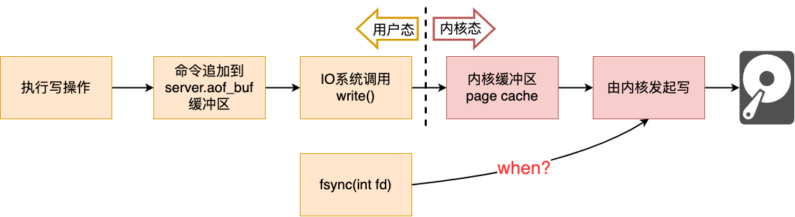

Mac上 `redis.conf` 的位置：`/usr/local/etc/redis.conf`

# 数据类型

## *常用数据类型*

## *数据结构*

# Redis 线程模型

## *单线程*

### Redis是单线程吗？

结论：**Redis的整个程序不是单线程的，但是Redis 6.0之前是单线程读写的（单线程单Reactor）**，6.0之后引入了多线程读（多线程多Reactor）

我们把**负责读写的线程称为主线程**，这个线程单独完成下面的任务

```
接收客户端请求->解析请求 ->进行数据读写等操作->发送数据给客户端
```

* Redis 2.6版本及之前：Redis在启动的时候，会启动后台线程BIO来执行除了写数据之外的关闭文件、日志持久化等很费时的操作
* Redis 4.0版本之后：新增一个新的后台线程，用来异步释放 Redis 内存，也就是 lazyfree 线程。比如执行 unlink key / flushdb async / flushall async 等命令，会把这些删除操作交给后台线程来执行。大Key的内存清理是很费时间的

BIO后台线程是一个生产者、消费者模型，其中关闭文件、AOF 刷盘、释放内存这三个任务都有各自的任务队列

* `BIO_CLOSE_FILE` 关闭文件任务队列：当队列有任务后，后台线程会调用 `close(fd)` ，将文件关闭
* `BIO_AOF_FSYNC` AOF刷盘任务队列：当 AOF 日志配置成 everysec 选项后，主线程会把 AOF 写日志操作封装成一个任务，也放到队列中。当发现队列有任务后，后台线程会调用 `fsync(fd)`，将 AOF 文件刷盘
* `BIO_LAZY_FREE` lazy free 任务队列：当队列有任务后，后台线程会 `free(obj)`释放对象 /`free(dict)` 删除数据库所有对象 /`free(skiplist)` 释放跳表对象

### 为什么Redis的单线程这么快

Redis官方Benchmarking结果显示，单线程的Redis吞吐量可以达到10w/s。之所以能这么高效的原因在于 

* **内存操作**：Redis 主要是将数据存储在内存中，而内存的读写速度远远高于磁盘操作。由于 Redis 单线程模型没有线程切换和同步的开销，可以充分利用 CPU 的计算能力和内存的读写速度，从而实现高效的数据操作
* **非阻塞 I/O**：Redis 使用了非阻塞的 I/O 模型，通过使用多路复用技术（如 epoll、kqueue 等）实现高效的事件处理。这使得 Redis 在处理大量并发连接时能够高效地进行 I/O 操作，提高了系统的整体性能
* **单线程避免锁竞争**：由于 Redis 是单线程的，所以避免了多线程环境下的锁竞争问题。在多线程环境中，多个线程同时访问共享数据时需要进行加锁操作，而加锁操作会引入额外的开销和竞争。而 Redis 单线程模型下不存在锁竞争，可以充分利用 CPU 资源
* **精简的功能集**：Redis 专注于提供高效的键值存储和数据结构操作，避免了复杂的功能和性能开销。相比于传统的关系型数据库，Redis 去除了很多复杂的特性，如事务、复杂的查询语言等，从而减少了系统的复杂性和开销，使得其更加高效

需要注意的是，Redis 单线程的快速性并不适用于所有场景。当系统的负载较高或需要进行复杂的计算时，单个 Redis 实例可能会成为性能瓶颈。在这种情况下，可以通过使用 Redis 集群、主从复制等技术手段来进行水平扩展，以满足高并发和大规模数据存储的需求

## *源码概览*

用的是redis 5.0.0版本

```c
//file: src/server.c
int main(int argc, char **argv) {
    ......
    // 启动初始化
    initServer();
    // 运行事件处理循环，一直到服务器关闭为止
    aeMain(server.el);
}
```

### 单线程模式的整体架构


## *`initServer()`*

### 创建epoll对象

### 对配置的监听端口进行 listen

### 把 listen socket 让 epoll 给管理起来

## *`aeMain(server.el)`*

* 通过 epoll_wait 发现 listen socket 以及其它连接上的可读、可写事件
* 若发现 listen socket 上有新连接到达，则接收新连接，并追加到 epoll 中进行管理
* 若发现其它 socket 上有命令请求到达，则读取和处理命令，把命令结果写到缓存中，加入写任务队列
* 每一次进入 epoll_wait 前都调用 beforesleep 来将写任务队列中的数据实际进行发送


# Redis的事务

<https://redisbook.readthedocs.io/en/latest/feature/transaction.html>

# 持久化

Redis提供两种持久化技术

* AOF 文件的内容是操作命令
* RDB 文件的内容是二进制数据

## *AOF日志*

### AOF的本质

Append Only File AOF的思想是**保存写操作命令到日志**，这样当Redis因为某些原因重启的时候，只要依次执行日志中的命令就行了。不会记录读操作，没有意义

Redis 中 AOF 持久化功能默认是不开启的，需要修改 `redis.conf` 配置文件中的以下参数

```
// redis.conf
appendonly yes // 表示是否开启AOF持久化(默认no，关闭）
appendfilename "appendonLy.aof" //AOF持久化文件的名称
```

注意：**写AOF日志是先进行内存写操作（子线程），再将日志持久化到硬盘（主线程）**。这么做既有优势又有劣势

* Pros
  * 日志持久化的时候不需要在进行额外的检查（比如redis语句的语法检查）
  * 不会阻塞当前写指令
* Cons
  * 若服务器正好在内存写完后宕机了，那当时这条命令也就丢失了
  * 虽然不会阻塞当前指令，但可能会阻塞下一跳指令，因为日志的持久化和执行下一条指令都是由主线程完成的

### Redis的三种AOF写回 WB 机制



AOF的写入过程如上，其中 `server.aof_buf` 是redis维护的用于写AOF的专用缓冲区

可以在 `redis.conf` 中的 `appendfsync` 选择 Always、Everysec、No 三种写回方式。本质上这三种写回策略就是在控制什么时候调用写回函数 `fsync(int fd)` （冲刷fd的数据和元数据）

* Always 策略：每次写入 AOF 文件数据到page cache完成后，就立刻执行 `fsync()` 函数
* Everysec 策略：写入到page cache后，创建一个异步任务来执行 `fsync()` 函数
* No 策略：永不执行 `fsync()` 系统调用，由OS自行控制写入硬盘

这 3 种写回策略都无法彻底解决AOF的**主线程阻塞**和**数据丢失**的问题，都是二者之间的权衡，其中Always数据丢失最少，阻塞最多（提高可靠性）；No数据丢失最多，阻塞最少（高性能）；Everysec则居中（中庸）

### AOF的重写机制 Rewrite

随着redis执行的指令越来越多，数据越来越多，AOF存储的指令内容也必然越来越大。为了避免 AOF 文件越写越大，redis提供了 **AOF 重写机制**，当 AOF 文件的大小超过所设定的阈值后，Redis 就会启用 AOF 重写机制，来**压缩** AOF 文件

一条KV数据记录可能会被多次修改，比如先进行 `set name weijian`，再进行 `set name wjfeng`，那么AOF就需要保存两条指令。但实际上第一条指令已经是被最新状态覆盖掉的历史命令了，对恢复数据没有什么价值。重写就是通过只保存重复指令的最新状态来实现压缩AOF的

重新工作是比较耗时的，不能放在主进程中阻塞，因此重写 AOF 过程是由**后台子进程 bgrewriteaof** 来完成的

注意：必须要是进程，而不是线程

在重写工作完成后，将新的 AOF 文件覆盖现有的 AOF 文件


### AOF后台重写

## *RDB快照*

Redis Database Backup Snapshot

### 快照的生成与使用

Redis 有两个命令来生成 RDB 快照文件，分别是 `save` 和 `bgsave`，他们的区别就在于是否在Redis的主线程里执行

* 执行 save 命令，就会在主线程生成 RDB 文件，由于和执行操作命令在同一个线程，所以如果写入 RDB 文件的时间太长，**会阻塞主线程**

* 执行 bgsave 命令，会创建一个子进程来生成 RDB 文件，这样可以**避免主线程的阻塞**

  可以在 redis,conf 设置RDB `bgsave` 的时间

  ```text
  save 900 1 //900 秒之内，对数据库进行了至少 1 次修改
  save 300 10 //300 秒之内，对数据库进行了至少 10 次修改
  save 60 10000 //60 秒之内，对数据库进行了至少 10000 次修改
  ```

RDB 文件的**加载**工作则是在服务器启动时**自动执行**的，Redis 并没有提供专门用于加载 RDB 文件的命令

快照持久化采用的是**全量快照**，即每次执行快照，都是把内存中的**所有数据**都记录到磁盘中。因为RDB的消耗和AOF相比肯定是比较大的，所以不可能非常频繁地生成快照。因此若在快照间隔中宕机了，那么这期间所有数据也就没了

### 执行快照时主线程怎么继续写？

回忆一下：MySQL事务执行快照读的时候会产生ReadView快照，此时会直接阻塞这条事务线程。Redis又如何呢？

### 混合持久化：结合AOF和RDB

## *大Key对持久化的影响*

### 对AOF日志的影响

### 对RDB快照的影响

# 缓存 Cache

## *缓存失效*

### 缓存雪崩

Cache Avalanche

### 缓存击穿

Cache Breakdown

### 缓存穿透

Cache Penetration

## *数据库与缓存的一致性*

# 分布式

一文搞懂Redis的三种集群方案：https://www.51cto.com/article/632701.html

## *intro*

### Redis实现分布式存储的方式

Redis实现分布式存储通过使用主从复制 Master-Slave Replication、哨兵模式Sentinel和Redis集群 Cluster 3钟主要机制

1. 主从复制：在主从复制机制中，一个Redis实例（主节点）负责处理所有写操作和读操作，并将数据复制到一个或多个Redis实例（从节点）。主节点接收写操作并将其传播给从节点，从节点则复制主节点的数据。这使得从节点能够处理读请求，从而实现了数据的分布式存储。主从复制机制通过提供数据冗余和增加读取性能来提高可用性
2. 在哨兵模式中，有一个或多个哨兵进程（Sentinel）监控Redis实例的状态。哨兵会周期性地检查Redis节点是否正常运行，并在节点故障或主节点失效时采取相应的措施。当主节点发生故障时，哨兵会自动从多个从节点中选举一个新的主节点，并将客户端的写操作路由到新的主节点。同时，哨兵还会通知其他从节点更新它们的主节点信息。这种自动主节点切换保证了Redis的高可用性和故障恢复能力
3. Redis集群：Redis集群是一种分布式存储解决方案，用于在多个Redis节点之间分配数据和负载。Redis集群使用分片（Sharding）技术将数据分割成多个部分，然后将这些部分分布在不同的Redis节点上。每个节点负责处理自己分配的数据片段，并与其他节点进行通信以保持数据的一致性和高可用性。客户端可以直接与集群中的任何一个节点进行交互，集群会自动将请求路由到正确的节点

通过主从复制和Redis集群，Redis能够实现数据的分布式存储和高可用性。主从复制提供了数据冗余和读取扩展性，而Redis集群通过数据分片和自动路由来提供水平扩展和负载均衡。这些机制使得Redis能够处理大规模数据和高并发负载，并保证数据的一致性和可用性

### Redis和共识算法有关吗？

Redis用到了一些Paxos或Raft这类共识算法的部分思想，尽管**Redis本身并不直接实现这些算法**

Redis是一种内存数据存储系统，通常被用作缓存、消息代理和键值存储等场景。它的设计目标是追求高性能和低延迟。相比之下，Paxos和Raft是分布式系统中的共识算法，旨在确保多个节点能就共享状态达成一致

尽管Redis没有内置的Paxos或Raft实现，但它可以通过使用这些算法来构建分布式系统。例如，当使用Redis作为缓存或存储时，可以使用Paxos或Raft来实现数据复制和故障容错。这样，即使有节点失效，数据仍然可以通过共识算法来保持一致

另外，Redis的作者Salvatore Sanfilippo（也被称为antirez）在过去的几年中也一直在开发Raft协议的实现，称为RediSearch。这是一个基于Raft的分布式协作协议，用于在Redis集群中实现高可用性和数据复制

因此，虽然Redis本身并不直接实现Paxos或Raft，但可以通过这些共识算法来增强Redis的分布式特性和容错能力

## *主从复制*

### 第一次同步的过程


使用 `replicaof` 来形成主从关系：比如说有服务器A和服务器B，我们想要让服务器B变成服务器A的从服务器，那么可以在从服务器B上执行下面的命令

```
# 服务器 B 执行这条命令
replicaof <服务器 A 的 IP 地址> <服务器 A 的 Redis 端口号>
```

执行该命令后主从服务器之间会进行第一次同步

1. 建立链接、协商同步
   1. 从->主：`psync(runID, offset)` 表示要进行同步

      * runID，每个 Redis 服务器在启动时都会自动产生一个随机的 ID 用来唯一标识自己。当从服务器和主服务器第一次同步时，因为不知道主服务器的 run ID，所以将其设置为 "?"
      * offset 表示复制的进度，第一次同步时，其值为 -1
   2. 主->从：主服务器收到 psync 命令后，会用 `FULLRESYNC` 作为响应命令返回给对方，这个相应的意思是进行**全量复制**，即将所有数据给从服务器。同时这个响应还会带上 runID 和 offset
2. 主服务器同步数据给从服务器
   * Master fork一个子进程，执行 bgsave 命令以产生一个RDB快照发送给从服务器
   * 从服务器收到RDB快照后，会先清空当前的数据，然后载入 RDB 文件
3. 主服务器发送新写操作命令给从服务器
   * 在产生RDB期间可能会有新的写操作，为了保持一致性，Master 在下面这三个时间间隙中会把收到的写操作命令，写入到 replication buffer
     * Master生成 RDB 文件期间
     * Master发送 RDB 文件给从服务器期间
     * 从服务器加载 RDB 文件期间
   * 从服务器加载完RDB后会发信号给Master，若Master的replication buffer里有记录就进行同步

第一次同步完成后，**主从之间就会维护一个 TCP 长连接**

### ping-pong 心跳检测机制

客户端可以通过发送 PING 命令来检测服务器的状态。当客户端发送 **PING 命令**时，服务器会返回一个 **PONG 响应**，表示服务器仍然处于运行状态。通过检查 PONG 响应，客户端可以确定服务器是否仍然可用

ping-pong 心跳检测机制可以用于以下几个方面：

1. 主从的连接状态检测：当客户端与 Redis 服务器建立连接后，可以通过发送 PING 命令来检测连接是否仍然有效。如果服务器返回 PONG 响应，那么连接是正常的，客户端可以继续使用该连接进行数据操作。如果服务器未响应或返回其他响应，客户端可以推断出连接已断开，并采取相应的处理措施。实际上，主从互相发送心态有一些区别
   * Redis Master **默认每隔 10 秒**对从节点发送 ping 命令，判断从节点的存活性和连接状态，可通过参数 `repl-ping-slave-period` 控制发送频率
   * Redis 从节点**每隔 1 秒**发送 `replconf ack{offset}` 命令，给Master上报自身当前的复制偏移量，目的是为了
     * 实时监测主从节点网络状态
     * 上报自身复制偏移量， 检查复制数据是否丢失， 如果从节点数据丢失， 再从主节点的复制缓冲区中拉取丢失数据
2. Cluster中node的健康检查：在分布式环境中，可以使用 ping-pong 心跳检测机制来监测每个node的健康状况。通过定期发送 PING 命令并检查 PONG 响应的时间和状态，可以判断node是否正常运行。如果服务器未能及时响应或响应异常，可能表示服务器发生了故障或网络故障，需要采取相应的应对措施，例如重新连接到其他可用的服务器。若cluster中一般的节点都认为一个node挂了，那这个node就会被下线，然后从它的备份中选举一个作为新的node
3. 超时控制：通过设置适当的超时时间，可以在一定时间内等待服务器的响应。如果在超时时间内没有收到服务器的 PONG 响应，客户端可以主动关闭连接或尝试重新建立连接，以避免无效的等待和资源浪费

### 增量复制 incremental replication

Redis 2.8之前，若从服务器因为某些原因下线了，从服务器恢复后又要重新进行全量复制，这种消耗很大。Redis 2.8之后引入了**增量复制**的方式来同步，即只会把网络断开期间主服务器接收到的写操作命令，同步给从服务器

## *哨兵机制 Sentinel*

### 引入哨兵

主从复制是一种单点故障，即当Master挂了，整个系统就挂了，此时需要人工干预来重新上线主节点。Redis 2.8 引入的哨兵机制就是当主节点挂了的时候自动选举、切换主节点，并通知从节点

哨兵是一个运行在观察者模式下的 Redis 进程，因此它也是一个节点，哨兵主要负责监控、选主、通知

### 哨兵集群

### 哨兵集群判断节点fault

依然是依靠 PING-PONG 心跳监测！哨兵节点每隔1秒会给所有主从节点发送 PING 命令，当主从节点收到 PING 命令后，要发送一个响应命令给哨兵，这样哨兵就可以判断它们是否在正常运行

* 若在规定时间内（ `down-after-milliseconds`  配置的时间）哨兵没有收到对应的PONG响应，那么单个哨兵会将对应节点判定为**主观下线 subjectively down/SDOWN**
* 当从节点被判断为主观下线的时候，直接就可以进行替换等操作了。但为了减少主节点的误判，只有当它被哨兵集群判定为**客观下线 objectively down/ODOWN** 的时候，主节点才会被替换

如何判断客观下线？当一个哨兵判断主节点为主观下线后，就会向其他哨兵发起命令，其他哨兵收到该命令后，就会根据自身和主节点的网络状况，做出赞成投票或者拒绝投票的响应。到底要多少票才会通过是可以通过 `quorum` 配置选项设置的，一般都要超过半数

### 选举Leader Sentinel执行主从故障转移

注意：哨兵选举的目的不是为了自己成为Master，只是为了处理下线的主节点或从节点

这部分和Raft一样，最先判定主观下线并发现判断下线的哨兵会变成Candidate，并发起Leader选举。Candidate会把票投给自己

Quorum至少设置为半数+1、哨兵节点最少为3个等保障了选举成功，这部分在*distributed system.md*都说过了

### 主从故障转移的过程

1. 选出新Master
   1. 挑一个状态良好的从节点
      * 过滤掉已经下线的、以往网络状况不佳（通过 `down-after-milliseconds * 10` 来判断）的节点
      * 对从节点进行三轮排序：**优先级 slave-priority、复制进度、ID 号**
   2. Leader向选定的从节点发送 `SLAVEOF no one` 命令，将这个从节点转换为新的Master
   3. Leader向选定的从节点以1秒的频率发送 `INFO` 命令，观察它的角色信息是否正确转变为Master
2. 将从节点指向新Master：Leader向所有落选的从节点发送`SLAVEOF` ，让它们成为新主节点的从节点
3. 通知客户的Master已更换：发布者/订阅者 Publisher/Subscriber **向 `+switch-master` 频道发布新主节点的 IP 地址和端口的消息**
4. 将旧Master变为从节点：旧主节点上线后，Leader向其发送`SLAVEOF`

### 应对脑裂

## *集群*

### cluster的工作模式

* 为了保证高可用，Cluster模式也引入了主从复制模式，一个主节点对应一个或者多个从节点，当主节点宕机的时候，就会启用从节点
* Cluster模式集群节点最小配置6个节点（3主3从，因为需要半数以上），其中**主节点提供读写操作，从节点作为备用节点，不提供请求，只作为故障转移使用**
* 所有的redis节点彼此互联（PING-PONG机制），内部使用二进制协议优化传输速度和带宽
* 主节点fault 是通过集群中超过半数的节点检测失效时才生效
* client与redis node直连，不需要中间代理层。客户端不需要连接集群所有节点，连接集群中任何一个可用节点即可

### 哈希槽 Hash slot


Redis Cluster 是一种无主模式 Leaderless 的无主分布式存储方案，它没有采用一致性哈希，而是采用哈希槽进行分片

**每一个Server node可以有一定范围内的多个哈希槽**。当使用Hash插槽算法进行数据分片时，具体的计算方式如下：

* 哈希函数：Redis使用**CRC16算法**作为哈希函数，对数据 Key 做哈希计算

* 插槽数量：整个Redis集群**固定使用16384个插槽**，也就是说最多可以有16384个node。每个插槽可以容纳多个KV pair。每个插槽都有一个唯一的编号，从0到16383

* 插槽分配：根据键的哈希值，通过取模运算将键分配到相应的插槽中。具体步骤如下

  * 对键进行哈希计算，得到一个哈希值。并将哈希值对插槽数量16384进行取模运算，得到余数（0到16383之间的数值）。`CRC16(key) mod 16384`

  * 将Key存储到对应的插槽中，该插槽的编号就是上面计算的余数。存入 `slot[ CRC16(key) mod 16384 ]` 中

举个例子：假设有一个Redis集群，包含三个节点（Node1、Node2、Node3），每个节点负责一部分插槽

* Node1：插槽编号为 `[0, 5460]` 的插槽
* Node2：插槽编号为 `[5461, 10922]` 的插槽
* Node3：插槽编号为 `[10923, 16383]` 的插槽

当需要存储一个KV时，先对key进行CRC16哈希计算，得到一个16位的哈希值

* 对哈希值进行取模运算，假设结果为12345
* 将key存储到插槽编号为12345的插槽中

### 哈希槽的分配方案

* **平均分配：** 使用 `cluster create` 创建 Redis 集群时，Redis 会自动把所有哈希槽平均分布到集群节点上。比如集群中有 9 个节点，则每个节点上槽的个数为 16384/9 个

* **手动分配：** 可以使用 `cluster meet` 命令手动建立节点间的连接，组成集群，再使用 `cluster addslots` 命令，指定每个节点上的哈希槽个数

  注意：若手动分配哈希槽，必须把 16384 个槽都分配完，否则 Redis 集群无法正常工作

### 哈希槽 vs. 一致性哈希

一致性哈希是创建虚拟节点来实现节点宕机后的数据转移并保证数据的安全性和集群的可用性的。redis cluster是采用master节点有多个slave节点机制来保证数据的完整性的,master节点写入数据，slave节点同步数据。当master节点挂机后，slave节点会通过选举机制选举出一个节点变成master节点，实现高可用。**但是这里有一点需要考虑，如果master节点存在热点缓存，某一个时刻某个key的访问急剧增高，这时该mater节点可能操劳过度而死，随后从节点选举为主节点后，同样宕机，一次类推，造成缓存雪崩**