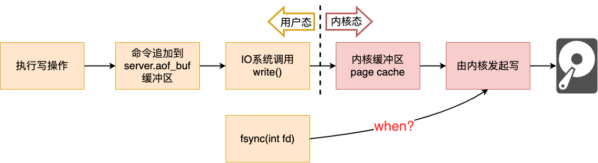
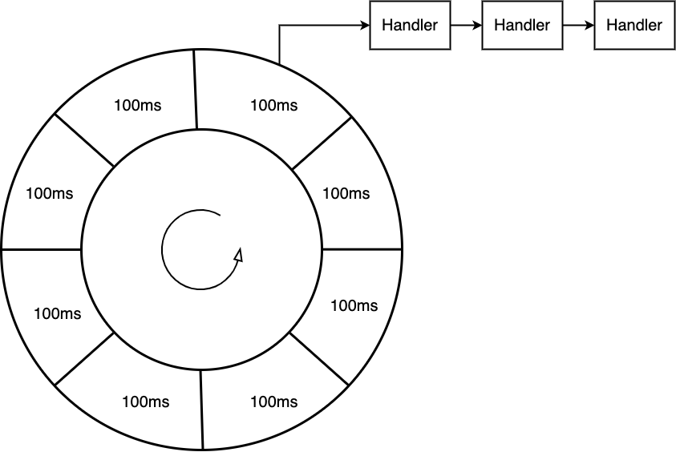
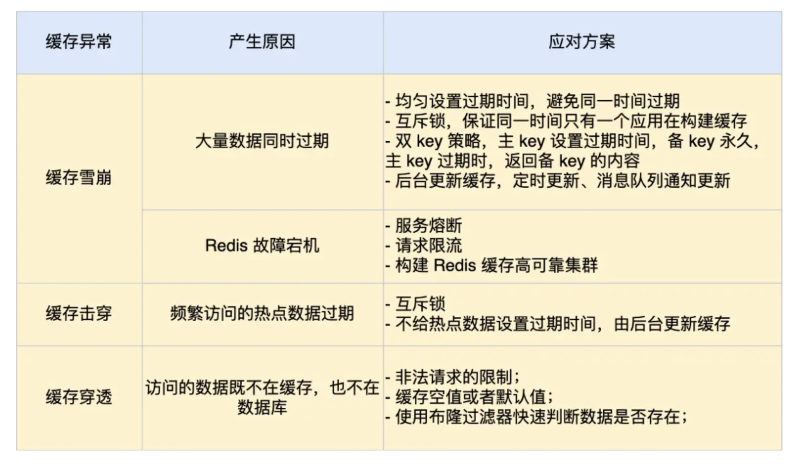
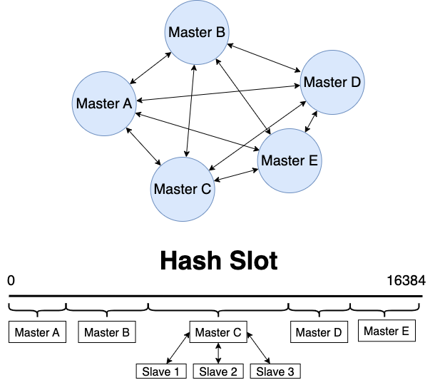

在线Redis <https://try.redis.io>

Mac上 `redis.conf` 的位置：`/usr/local/etc/redis.conf`

# Redis介绍

## *简介*

Redis是一个在内存中存储数据的中间件 Middleware，通常用于作为缓存数据库

### Redis重要特性

* 非关系性数据库 NoSql：主要通过KV键值对的方式来组织，key都是string，value则可以是string、hashes、lists、sets、sorted sets、streams等数据类型
* 可编程性 Programmaibility：针对Redis的操作，可以直接通过简单的交互式命令操作，也可以通过一些脚本的方式来批量执行操作。Redis配套的主要脚本语言是Lua
* 可扩展性 Extensibility：可以在Redis原有的功能基础上再进行扩展，Redis提供了一组不同语言的API，通过C/C++、Rust等语言来编写Redis扩展，本质上就是一个动态链接库。所谓的扩展性就是在Redis本身提供的数据结构之外，自定义一些数据结构
* 持久化 Persistence：Redis会把数据从内存拷贝到硬盘上，当Redis重启的时候，就会从硬盘中加载备份，使Redis在内存中恢复到重启前的状态
* 集群 Clustering：通过哈希槽来支持横向扩展
* 高可用 High availability：核心是冗余/备份，比如主从、哨兵和集群都有备份

### 为什么Redis这么快？

* Redis是一个内存数据库，访问内存比硬盘IO快得多
* Redis的核心功能都是比较简单的逻辑
* 使用了epoll这种多路复用的IO方式
* 使用单线程Reactor模型（虽然更高版本的Redis引入了多线程，但核心仍旧是单线程），减少了不必要的线程竞争开销。多线程可以提高效率的前提是处理CPU密集型/计算密集型的任务，此时使用多线程可以充分的利用CPU的多核资源。但是Redis的核心任务是操作内存中的数据结构，并不会占用很多CPU资源，或者可以说是IO密集型，在这种情况下使用多线程反而是一种负担
* 比较争议的一种说法是Redis是使用C语言开发的，所以很快。一个典型的反例就是MySQL也是用C语言开发的

注意：Redis很快是指和MySql这种关系型数据库相比的，相对于直接在内存中通过数据结构来操纵变量还是慢，这是因为Redis是一个client-server结构的程序，就算是本地访问，中间也需要经过本地环回socket

### Redis的应用场景

* Real-time data store 实时数据存储：适用于要求高存储效率（高实时性、低延迟、高吞吐）。比如说商业搜索引擎对性能的要求很高，在这种搜索引擎中就不会用MySql，因为速度太慢。这时候Redis这种内存数据库就派上用场了，当然是用这样的内存数据库来存储大量数据是需要不少的硬件资源的
* Caching & session storage 作为MySql中的热点数据缓存、会话管理。热点缓存和会话都属于可以丢失的数据
* Streaming & messaging 消息队列：基于消息队列可以实现一个网络版本的生产者&消费者模型。分布式系统中服务器和服务器之间有时也需要用到生产者消费者模型。业界中知名的消息队列有RabbitMQ、Kafka、RocketMQ等，但Redis也是提供了消息队列的功能的。若当前场景中对于消息队列的功能依赖的不是很多，并且又不想引入额外的依赖，Redis就可以作为一个选择
  * 异步通信：消息队列支持异步通信模式，发送方将消息放入队列后即可继续处理其他任务，而不需要等待接收方立即处理。这样可以提高系统的响应性能和吞吐量
  * 解耦合：消息队列实现了解耦合，允许不同的组件或模块之间通过发送和接收消息来通信，而不需要直接调用彼此的函数或API。这降低了系统的依赖性，使得系统更易于维护和扩展
  * 削峰填谷：当系统面临突发的请求量或流量峰值时，消息队列可以作为缓冲区，帮助平衡系统的负载。发送方可以将消息放入队列中，接收方按照其处理能力逐渐消费消息，从而避免系统过载

补充：会话管理

## *Redis的重要版本*

https://zhuanlan.zhihu.com/p/609450508

### 早期版本

* 1.0 初始版本发布于 2009.9，提供基本的键值存储和简单的数据结构：string、list、set、dict（哈希表）。commit ID 为 557a74e56308325874c573e6dd2c6b228136de86
* 2.0 发布于 2010.9
  * 引入了虚拟内存、列表、集合、有序集合等新数据结构
  * 对持久性进行了改进，支持快照和日志追加。引入了复制功能

### 2.6

重构了大量的核心代码，所有2.6引入的集群相关的代码都去掉了

### 3.0

添加Redis的分布式实现Redis Cluster

### 6.0

### 7.0

## *Redis的安装与服务器管理*

### 安装

Debian直接通过包管理器来安装

On Debian: Redis server v=7.0.11 sha=00000000:0 malloc=jemalloc-5.3.0 bits=64 build=c4e7f6bf175a885b; On MacOS: Redis server v=7.0.11 sha=00000000:0 malloc=libc bits=64 build=337e79498f5fefea

`netstat -anp | grep redis` 来查看redis-server是否已经跑起来了，默认端口是6379

此时绑定的是本地环回 `127.0.0.1:6379`，无法跨主机、跨网络访问，可以将位于 `/etc/redis` 中的配置文件的配置项修改为 `bind 0.0.0.0 ::1`，`protected-mode no`

### 用 `systemctl` 来管理redis服务器

`systemctl` 是一个在 Linux 系统上管理系统服务（Systemd 单位）的命令行工具。Systemd 是一种系统和服务管理器，被广泛用于现代的 Linux 发行版，如Debian、Ubuntu、CentOS、Fedora 等，服务是指在后台运行并提供基本功能（例如网络、数据库、打印、日志等）的程序

`systemctl` 实际上将 service 和 chkconfig 这两个命令组合到一起

```sh
systemctl start [service_name] # 启动nfs服务
systemctl enable [service_name] # 设置开机自启动
systemctl disable [service_name] # 停止开机自启动
systemctl status [service_name] # 查看服务当前状态
systemctl restart [service_name] # 重新启动某服务
systemctl stop [service_name] # 停止服务
systemctl list-units --type=service # 查看所有已启动的服务
```

### Redis客户端

* 使用redis自带的客户端 `redis-cli` 来连接服务器。这是最稳定的，也是最常用的客户端

  ```cmd
  $ redis-cli
  127.0.0.1:6379> ping
  PONG
  ```

* 图形化界面客户端（桌面程序、web程序）：和MySql一样，依赖于Win系统，而工作中win系统连接到服务器会有诸多限制。中间可能会经历很多的跳板机 jump host、堡垒机 bastion host 和权限校验

  https://github.com/qishibo/AnotherRedisDesktopManager

* 基于redis的api自行开发客户端，这是工作中最主要的形态

## *基本全局命令*

操作不同的数据结构会有不同的命令，而全局命令则是可以搭配任意一个数据结构来使用的命令

### `SET`

```
SET key value [NX | XX] [GET] [EX seconds | PX milliseconds |
  EXAT unix-time-seconds | PXAT unix-time-milliseconds | KEEPTTL]
```

虽然key和value都是string，但是不需要加引号

* `EX` 用于设置超时时间，单位是秒，`PX` 同理，单位是毫秒
* `[NX | XX]` 其中NX是若key不存在才设置，若key不存在则不设置（返回nil）；XX是若key不存在才不设置（返回nil），若key存在才设置（相当于更新key的value）

`SET` 的变种有 `SETEX`、`SETPX`、`SETNX`

`SET` 更新的时候会覆盖value的数据类型和ttl

### `GET`

 `GET` 命令输入key就能得到对应的value，若key不存在，就返回 `(nil)`

> ‘Null’ and ‘nil’ are synonymous and both mean ‘zero’ or ‘nothing’ in value. The two words differ mainly by what field we use them in. We use ‘null’ mostly in maths, programming, business, and legal matters. On the other hand, we use ‘nil’ in sports and games.

`GET` 只支持字符串类型的value，若value是其他类型，使用 `GET` 获取会出错

`GET` 默认以十六进制来显示结果，若要得到字符显示，可以在redis-cli打开的时候加一个 `--raw` 选项让其尝试自动翻译

### `MSET` & `MGET`

```
MSET key value [key value ...]
MGET key [key ...]
```

`GET` & `SET` 一次网络传输职能针对一个对象。为提高效率，`MSET` & `MGET` 可以一次用于多个对象，复杂度都是 ***O(1)*** 

使用的时候要适量，一次设置过多KV会阻塞单线程

### `KEYS`

```
KEYS pattern
```

后面的pattern是一种正则通配符

* `h?llo` 匹配任意一个字符
* `h*llo` 匹配0个或者多个任意字符
* `h[abcde]llo` 只能匹配到abcd中的排列组合
* `h[^a]llo` 排除字符 

`KEYS` 命令的时间复杂度是 ***O(N)***，因为它要遍历所有的key，因为Redis是单线程的，所以查询过程中会阻塞服务，无法给其他client提供服务。因此在生产环境中都会禁止使用 `KEYS`，尤其是 `KEYS *`

### `EXISTS`

```
EXISTS key [key ...]
```

判定key是否存在，返回多个key存在的个数。Redus通过哈希表来组织key，因此复杂度为 ***O(1)*** 

`EXISTS hello hello` 和2次 `EXISTS hello` 看起来效果差不多，但是是有差别的。考虑到网络IO（涉及到网卡等硬件）虽然可能会比硬盘IO快，但总是比内存漫的，因此能少IO就少IO。出于这种目的，Redis的很多命令都是支持一次就能操作多个key的

### `DEL`

```
DEL key [key ...]
```

删除指定的KV对，和 `EXISTS` 一样，复杂度为 ***O(1)*** 

Redis作为缓存的时候误删的影响没有MySql中那么严重，当然若是把Redis直接作为主数据库那误删影响就也大了

### `EXPIRE`

```
EXPIRE key seconds [NX | XX | GT | LT]
```

`EXPIRE` 的作用是给指定过的key设置过期时间，key存活时间超出该指定指，就会被被从Redis中自动删除掉。单位是秒

比如说验证码5分钟有效，或者是基于Redis实现分布式锁的时候，为了避免出现不能正确解锁的情况，通常都会在加锁的时候设置一下过期时间。所谓的使用Redis作为分布式锁，就是给Redis里写一个特殊的KV

设定过期时间，必须是针对已经存在的key来设置，设置成功返回1，失败返回0

### `TTL`

```
TTL key
```

查询剩余的过期时间，返回-1表示没有关联过期时间，返回-2表示key不存在

### `TYPE`

```
TYPE key
```

返回key对应的value的数据类型，复杂度为 ***O(1)*** 。可能是 `none`、`string`、`list`、`set`、`zset`、`hash` 和 `stream` （Redis作为消息队列的时候，使用这个类型的value）

因为对不同数据类型的value的操作命令是不同的，所以在操作之前用 `TYPE` 来查看一下数据类型是很有帮助的

### `OBJECT encoding`

查询数据类型的编码方式

### :warning: 删库 `FLUSHALL`

`FLUSHALL` 可以把Redis上所有的KV全部带走，在公司的生产环境数据库中绝对不能使用！！！

# 数据类型 & 内部编码

## *总结*

有序集合：除了存储member之外，还需要存储一个score（权重、分数）

### 自适应的编码方式

Redis底层在实现上述数据结构的时候，会在源码层面针对上述实现进行特定的优化，来达到节省时间/空间的效果。即Redis内部具体实现的数据结构，或者说编码方式是与标准数据结构有差异的，但无论是如何实现的，都提供特定的复杂度承诺

作为程序员去记住到底在什么情况下哪种数据类型用什么编码方式意义不大。比如说有种说法是若字符串长度小于39字节就使用embstr，超过39字节就使用raw。首先这些数字都是可以自己配置的，其实数字到底是怎么来的，为什么要这么设置也是有比较难考证的原因的，去细究意义不大

如果我们真要去改动这些数字的话，比如说像平衡树的链表长度达到某个数变成红黑树，或者负载因子达到某个数就触发扩容一样，我们需要结合具体的场景，以测试试验的结果为依据来改动出一个更合适的数值

## *string*

### 内部编码

Raw：最近本的字符串，底层就是一个C++的char数组或者Java的byte数组（Java的char是两个字节的）

Redis通常也可以用来实现

当value是一个整数的时候，此时Redis可能会直接使用int来保存

embstr是针对短字符串进行的特殊优化

Redis会自动适应特定的编码方式，程序员在使用Redis的时候一般感知不到


不仅仅可以存储文本数据，还可以是整数、普通的文本字符串、JSON、XML、二进制数据（图片、视频、音频等）。图片、视频、音频的体积可能会比较大，Redis对于单个string类型限制的最大大小是512MB

MySql有指定的默认字符集，比如说指定拉丁字符集，输入中文就会失败。Redis则是存的是什么就是什么，比如存的是GBK，拿出来就是GBK


```shell
127.0.0.1:6379> set key1 1.5
OK
127.0.0.1:6379> OBJECT ENCODING key1
"embstr"
```

Redis存储小数本质上还是当作字符串来存储，这和整数相比差别就比较大了。整数是直接使用int来存的（准确来说是C++的long long），这比较方便算数运算。而小数每次进行算数运算，都要把字符串转成小数，运算后再转回字符串

用Redis进行大量的小数计算时，要仔细衡量性能开销

### 计数命令

* `incr`：针对value + 1
  * 效果是 `++i`，此时key对应的value必须是64位/8字节表示的整数，相当于C中的long long
  * 若操作的key此时不存在，就会把这个key的value当作0来使用，因此结果是1
  * `incr` 加减正负数都可以，加一个负数的效果跟 `decr` 一样
* `incrby`：针对value + n
* `decr`：针对value - 1
* `decrby`：针对value - n
* `incrbyfloat`：针对value +/- 小数。虽然说是float，但其实都是double，double相比于float没有多少性能开销，但是精度却提高了很多

### 字符串的拼接、修改

注意：C++中字符串的单位本身就是用字符为单位的，而Java中字符串的长度则是以字符串为单位的，Java的String则是用utf8，一个汉字3字节。Java中的一个char==2字节，它是以unicode为编码方式的。MySql中的 `varchar(N)` 的单位也是字符

* `append` 追加
  * 如果 key 已经存在并且是一个 string，命令会将 value 追加到原有 string 的后边。如果 key 不存在，则效果等同于 `SET` 命令
  * 返回的是长度，其单位是字节。Redis的字符串不会对字符编码做任何处理，也就是说Redis是不认识字符的，只认识字节。具体用什么编码方式由输入终端决定
  
* `getrange` 找子串

  ```
  GETRANGE key start end
  ```

  返回 key 对应的 string 的子串，**左闭右闭 `[start, end]`** 。和python一样，可以使用负数表示倒数。-1 代表倒数第一个字符，-2 代表倒数第二个，其他的与此类似。超过范围的偏移量会自动根据 string 的长度调整成正确的值。复杂度为 ***O(1)***

  如果字符串中保存的是汉字，此时若进行字串切分很可能切出来的就不是完整的汉字

* `setrange`

  ```
  SETRANGE key offset value
  ```

  其中offset 偏移量是从给几个字节开始进行替换。返回替换后的**新的** string 的长度

  `setrange` 针对不存在的key也是可以操作的，它会凭空生成一个字节，这个字节里的内容就是0x00

  ```shell
  127.0.0.1:6379> setrange key2 1 aaa
  (integer) 4
  127.0.0.1:6379> get key2
  "\x00aaa"
  ```

* `setlen`

### 其他命令

## *String的使用场景*

### 什么是业务？

业务其实就是一个公司/一个产品是如何解决一个/一系列问题的。解决问题的过程就称为业务

不同的业务需要不同的技术作为支撑。业务是很重要的，很多时候无法通过优化技术来解决的问题可以通过优化业务来解决

一个例子是12306通过分时段放票来缓解放票时服务器的并发压力

实际开发过程中，必须要结合实际业务场景来做一些技术上的调整

### 计数


计数：企业收集用户的数据是为了统计用户的习惯和需求，根据需求来改进和迭代产品

Redis并不擅长统计，SQL语言擅长统计

异步的策略是可以通过数据流量来调整的


所有的会话数据都会被放到一个统一Redis服务器中，防止会话数据不一致

### 手机验证码

生成验证码

检查验证码


限制：一分钟之内最多获取n次验证码（通过Redis实现）；每次获取验证码必须间隔x时间

## *hash*

### 和KV的区别

注意：Redis的KV本身就是通过哈希来组织的，然后V的一种数据类型又是Hash，注意不要搞混

Hash数据类型中的映射关系被称为filed-value，用于和Redis整体的Key-Value区别

### 内部编码

Hashtable：最基本的哈希表。注意：不是Java标准库中的哈希表实现，即Java的HashTable，不过Redis的Hashtable的实现思路和Java标准库中的也差不多

Ziplist：压缩列表，在一些情况下，进一步压缩空间。当哈希表里面元素比较少的时候可能会优化成ziplist

## *list*

和hash一样，linkedlist是最普通的链表，ziplist：压缩列表

Quciklist：Redis3.2开始，引入的新的实现方式。quicklist代替了linkedlist和ziplist，它同时兼顾了linkedlist和ziplist的优点。具体实现大概是quicklist就是一个链表，每个元素又是一个ziplist，这样能够折衷空间和效率。quicklist比较类似于C++中的 `std::deque`

## *set*                                                                                                                                                                                                                                                                                                                                                                                                                                                                                                                                                                                                                                                                                                                                                                                                                                                                                                                                                                                                                                                                                                                                                                                                                                                                                 

Hashtable或者针对整数的特殊优化intset

## *zset*

ziplist 压缩列表和skiplist 跳表，从跳表上查询元素的复杂度是 ***O(logN)*** ，达到了二叉平衡搜索树的效果


# Redis 单线程模型

## *单线程*

### Redis是单线程吗？

结论：**Redis的整个程序不是单线程的，但是Redis 6.0之前是单线程读写的（单线程单Reactor）**，6.0之后引入了多线程读（多线程多Reactor）

我们把**负责读写的线程称为主线程**，这个线程单独完成下面的任务

```
接收客户端请求->解析请求 ->进行数据读写等操作->发送数据给客户端
```

* Redis 2.6版本及之前：Redis在启动的时候，会启动后台线程BIO来执行除了写数据之外的关闭文件、日志持久化等很费时的操作
* Redis 4.0版本之后：新增一个新的后台线程，用来异步释放 Redis 内存，也就是 lazyfree 线程。比如执行 unlink key / flushdb async / flushall async 等命令，会把这些 删除操作交给后台线程来执行。大Key的内存清理是很费时间的

BIO后台线程是一个生产者、消费者模型，其中关闭文件、AOF 刷盘、释放内存这三个任务都有各自的任务队列

* `BIO_CLOSE_FILE` 关闭文件任务队列：当队列有任务后，后台线程会调用 `close(fd)` ，将文件关闭
* `BIO_AOF_FSYNC` AOF刷盘任务队列：当 AOF 日志配置成 everysec 选项后，主线程会把 AOF 写日志操作封装成一个任务，也放到队列中。当发现队列有任务后，后台线程会调用 `fsync(fd)`，将 AOF 文件刷盘
* `BIO_LAZY_FREE` lazy free 任务队列：当队列有任务后，后台线程会 `free(obj)`释放对象 /`free(dict)` 删除数据库所有对象 /`free(skiplist)` 释放跳表对象

### 为什么Redis的单线程这么快

Redis官方Benchmarking结果显示，单线程的Redis吞吐量可以达到10w/s。之所以能这么高效的原因在于 

* **内存操作**：Redis 主要是将数据存储在内存中，而内存的读写速度远远高于磁盘操作。由于 Redis 单线程模型没有线程切换和同步的开销，可以充分利用 CPU 的计算能力和内存的读写速度，从而实现高效的数据操作
* **非阻塞 I/O**：Redis 使用了非阻塞的 I/O 模型，通过使用多路复用技术（如 epoll、kqueue 等）实现高效的事件处理。这使得 Redis 在处理大量并发连接时能够高效地进行 I/O 操作，提高了系统的整体性能
* **单线程避免锁竞争**：由于 Redis 是单线程的，所以避免了多线程环境下的锁竞争问题。在多线程环境中，多个线程同时访问共享数据时需要进行加锁操作，而加锁操作会引入额外的开销和竞争。而 Redis 单线程模型下不存在锁竞争，可以充分利用 CPU 资源
* **精简的功能集**：Redis 专注于提供高效的键值存储和数据结构操作，避免了复杂的功能和性能开销。相比于传统的关系型数据库，Redis 去除了很多复杂的特性，如事务、复杂的查询语言等，从而减少了系统的复杂性和开销，使得其更加高效

Redis能够使用单线程模型很好的工作的原因主要在于Redis的核心业务逻辑都是短平快的，不太消耗CPU资源也就不太吃多核了。这是一种特殊情况，若是CPU密集型的程序当然就不能这么干了

需要注意的是，Redis 单线程的快速性并不适用于所有场景。当系统的负载较高或需要进行复杂的计算时，单个 Redis 实例可能会成为性能瓶颈。在这种情况下，可以通过使用 Redis 集群、主从复制等技术手段来进行水平扩展，以满足高并发和大规模数据存储的需求

## *源码概览*

用的是redis 5.0.0版本

```c
//file: src/server.c
int main(int argc, char **argv) {
    ......
    // 启动初始化
    initServer();
    // 运行事件处理循环，一直到服务器关闭为止
    aeMain(server.el);
}
```

### 单线程模式的整体架构


## *`initServer()`*

### 创建epoll对象

### 对配置的监听端口进行 listen

### 把 listen socket 让 epoll 给管理起来

## *`aeMain(server.el)`*

* 通过 epoll_wait 发现 listen socket 以及其它连接上的可读、可写事件
* 若发现 listen socket 上有新连接到达，则接收新连接，并追加到 epoll 中进行管理
* 若发现其它 socket 上有命令请求到达，则读取和处理命令，把命令结果写到缓存中，加入写任务队列
* 每一次进入 epoll_wait 前都调用 beforesleep 来将写任务队列中的数据实际进行发送


# Redis的事务

<https://redisbook.readthedocs.io/en/latest/feature/transaction.html>

`MULTI`

`DISCARD`

`EXEC`

`WATCH`

# 持久化

Redis提供两种持久化技术

* AOF 文件的内容是操作命令
* RDB 文件的内容是二进制数据

## *AOF日志*

### AOF的本质

Append Only File AOF的思想是**保存写操作命令到日志**，这样当Redis因为某些原因重启的时候，只要依次执行日志中的命令就行了。不会记录读操作，没有意义

Redis 中 AOF 持久化功能默认是不开启的，需要修改 `redis.conf` 配置文件中的以下参数

```
// redis.conf
appendonly yes // 表示是否开启AOF持久化(默认no，关闭）
appendfilename "appendonLy.aof" //AOF持久化文件的名称
```

注意：**写AOF日志是先进行内存写操作（子线程），再将日志持久化到硬盘（主线程）**。这么做既有优势又有劣势

* Pros
  * 日志持久化的时候不需要在进行额外的检查（比如redis语句的语法检查）
  * 不会阻塞当前写指令
* Cons
  * 若服务器正好在内存写完后宕机了，那当时这条命令也就丢失了
  * 虽然不会阻塞当前指令，但可能会阻塞下一跳指令，因为日志的持久化和执行下一条指令都是由主线程完成的

### Redis的三种AOF写回 WB 机制



AOF的写入过程如上，其中 `server.aof_buf` 是redis维护的用于写AOF的专用缓冲区

可以在 `redis.conf` 中的 `appendfsync` 选择 Always、Everysec、No 三种写回方式。本质上这三种写回策略就是在控制什么时候调用写回函数 `fsync(int fd)` （冲刷fd的数据和元数据）

* Always 策略：每次写入 AOF 文件数据到page cache完成后，就立刻执行 `fsync()` 函数
* Everysec 策略：写入到page cache后，创建一个异步任务来执行 `fsync()` 函数
* No 策略：永不执行 `fsync()` 系统调用，由OS自行控制写入硬盘

这 3 种写回策略都无法彻底解决AOF的**主线程阻塞**和**数据丢失**的问题，都是二者之间的权衡，其中Always数据丢失最少，阻塞最多（提高可靠性）；No数据丢失最多，阻塞最少（高性能）；Everysec则居中（中庸）

### AOF的重写机制 Rewrite

随着redis执行的指令越来越多，数据越来越多，AOF存储的指令内容也必然越来越大。为了避免 AOF 文件越写越大，redis提供了 **AOF 重写机制**，当 AOF 文件的大小超过所设定的阈值后，Redis 就会启用 AOF 重写机制，来**压缩** AOF 文件

一条KV数据记录可能会被多次修改，比如先进行 `set name weijian`，再进行 `set name wjfeng`，那么AOF就需要保存两条指令。但实际上第一条指令已经是被最新状态覆盖掉的历史命令了，对恢复数据没有什么价值。重写就是通过只保存重复指令的最新状态来实现压缩AOF的

重新工作是比较耗时的，不能放在主进程中阻塞，因此重写 AOF 过程是由**后台子进程 bgrewriteaof** 来完成的

注意：必须要是进程，而不是线程

在重写工作完成后，将新的 AOF 文件覆盖现有的 AOF 文件


### AOF后台重写

## *RDB快照*

Redis Database Backup Snapshot

### 快照的生成与使用

Redis 有两个命令来生成 RDB 快照文件，分别是 `save` 和 `bgsave`，他们的区别就在于是否在Redis的主线程里执行

* 执行 save 命令，就会在主线程生成 RDB 文件，由于和执行操作命令在同一个线程，所以如果写入 RDB 文件的时间太长，**会阻塞主线程**

* 执行 bgsave 命令，会创建一个子进程来生成 RDB 文件，这样可以**避免主线程的阻塞**

  可以在 redis,conf 设置RDB `bgsave` 的时间

  ```text
  save 900 1 //900 秒之内，对数据库进行了至少 1 次修改
  save 300 10 //300 秒之内，对数据库进行了至少 10 次修改
  save 60 10000 //60 秒之内，对数据库进行了至少 10000 次修改
  ```

RDB 文件的**加载**工作则是在服务器启动时**自动执行**的，Redis 并没有提供专门用于加载 RDB 文件的命令

快照持久化采用的是**全量快照**，即每次执行快照，都是把内存中的**所有数据**都记录到磁盘中。因为RDB的消耗和AOF相比肯定是比较大的，所以不可能非常频繁地生成快照。因此若在快照间隔中宕机了，那么这期间所有数据也就没了

### 执行快照时主线程怎么继续写？

回忆一下：MySQL事务执行快照读的时候会产生ReadView快照，此时会直接阻塞这条事务线程。Redis又如何呢？

### 混合持久化：结合AOF和RDB

## *大Key对持久化的影响*

### 对AOF日志的影响

### 对RDB快照的影响

# 缓存 Cache

数据库都是直接和硬盘打交道的，也就是说要进行大量慢速IO。这也导致数据库往往会成为整个系统的瓶颈，当大量IO到来时，数据库很容易就崩溃了。为了避免这种情况出现的概率，不让用户直接去访问数据库进行IO，一般都会用Redis作为缓存使用

因为Redis是内存数据库，我们可以将数据库的数据直接缓存在Redis中，相当于把数据缓存在内存，内存的读写速度比硬盘快好几个数量级，这样就大大提高了系统性能

## *key过期策略*

经典面试题：一个Redis-server中可能同时存在很多key，这些key中可能有很大一部分都有过期时间，此时Redis服务器怎么知道哪些Key已经过期要被删除，哪些Key还没过期？

若直接遍历所有Key显然是行不通的，效率非常低

### 两种删除策略

* 惰性删除 lazy-free：假设某个key已经到过期时间了，但是暂时还没有删除它，此时key还存在。紧接着后面一次访问用到了这个key，于是这次访问就会让Redis服务器出发删除key的操作，同时返回一个nil
* 定期删除：每次抽取一部分验证过期时间，保证抽取检查的过程足够快，不会阻塞过长时间

尽管有上述两种策略结合，但整体的效果一般，仍然可能会有很多过期的key残留下来，没有及时删除掉。Redis为了对上述进行补充，还提供了一系列的内存淘汰策略

### 没有采用定时删除

Redis中并没有采取定时器的方式来实现过期key删除，若有多个key过期，也可以通过一个基于优先级队列或基于时间轮的高效定时器来处理多个key

很难考证为什么Redis没有采取定时器实现，有一种可能的解释是基于定时器的实现要引入多线程，而Redis的早期版本就奠定了单线程的基调，引入多线程就破坏了整体设计

## *补充：高效定时器的实现*

### 基于优先级队列/堆

* 在Redis过期key的场景中，过期时间越早，优先级越高，越早出队列
* 为优先级队列定时器分配一个线程，让这个线程去扫描队首元素是否过期。不能检查的太频繁，否则浪费时间片，此时做法就是可以根据当前时刻和队首元素的过期时间，设置一个等待时间，挂起线程，当时间到了再唤醒线程
* 新任务添加的时候，唤醒一下刚才的线程，重新检查一下队首元素，再根据时间差距重新调整阻塞时间即可

### 时间轮



每个小段上都挂着一个链表，每个链表元素都代表一个要执行的任务，比如说指向一个函数指针handler

具体划分时间的粒度，是根据任务来设置的。每个格子是多少时间，一共多少个格子都是需要根据实际任务来灵活调整的

取模确定放的位置，不断循环，等到了的时候尝试执行任务。这是因为取模存放可能放的是一个过期时间很长的任务，所以要看一下到底到期没有

## *缓存失效*



### 缓存雪崩

设置缓存的过期时间是为了控制缓存数据的有效性，以避免缓存中的数据过时或过期而导致应用程序获取到不正确或陈旧的数据。缓存的过期时间是缓存系统中的一个重要参数，可以根据业务需求和数据更新频率来进行设置。当用户访问的数据如果不在缓存里，业务系统需要重新生成缓存

**缓存雪崩 Cache Avalanche 是指在缓存中存储的多个缓存项在同一时间失效或者Redis缓存自己宕机了，导致大量的请求直接访问后端数据库或系统，从而产生巨大的系统负载。**这种情况通常发生在缓存项设置了相同的过期时间，而且它们的失效时间又差不多同时发生

针对缓存同时过期引起的缓存雪崩可以通过均匀设置过期时间（给数据的过期时间加上一个随机数）、互斥锁（保证同一时间内只有一个请求来构建缓存）以及后台更新缓存等方式来抵御

而针对Redis故障宕机引起的缓存雪崩则可以通过服务熔断、限流或者使用Redis cluster来形成分布式集群来抵御

### 缓存击穿

缓存击穿 Cache Breakdown 是缓存雪崩的一个子类，它是指一个非常热门的缓存项过期后，恰好有大量并发请求尝试访问它，导致所有请求都绕过缓存，直接访问后端数据库或系统。这会导致后端系统负载激增，性能降低

### 缓存穿透

缓存穿透 Cache Penetration 是指请求查询一个不存在于缓存中的数据，导致请求绕过缓存直接访问后端数据库或系统

缓存穿透可以是一种误操作，也可以是一种针对系统的故意攻击，若攻击者故意构造不存在于缓存中的请求，就可以通过缓存穿透攻击来绕过缓存，直接访问后端系统，增加数据库负载

防御缓存穿透有点类似于使用防火墙技术，可以直接通过检测请求中的非法字符等方式来限制非法请求，或者当检测到可能的缓存穿透时返回空值或默认值。另一种方式是用布隆过滤器来快速判断数据是否存在，在NoSql distributed database项目中我们用了这个方法来防御缓存穿透

## *数据库与缓存的一致性*

# 分布式

一文搞懂Redis的三种集群方案：https://www.51cto.com/article/632701.html

## *intro*

### Redis实现分布式存储的方式

Redis实现分布式存储通过使用主从复制 Master-Slave Replication、哨兵模式Sentinel和Redis集群 Cluster 3钟主要机制

1. 主从复制：在主从复制机制中，一个Redis实例（主节点）负责处理所有写操作和读操作，并将数据复制到一个或多个Redis实例（从节点）。主节点接收写操作并将其传播给从节点，从节点则复制主节点的数据。这使得从节点能够处理读请求，从而实现了数据的分布式存储。主从复制机制通过提供数据冗余和增加读取性能来提高可用性
2. 在哨兵模式中，有一个或多个哨兵进程（Sentinel）监控Redis实例的状态。哨兵会周期性地检查Redis节点是否正常运行，并在节点故障或主节点失效时采取相应的措施。当主节点发生故障时，哨兵会自动从多个从节点中选举一个新的主节点，并将客户端的写操作路由到新的主节点。同时，哨兵还会通知其他从节点更新它们的主节点信息。这种自动主节点切换保证了Redis的高可用性和故障恢复能力
3. Redis集群：Redis集群是一种分布式存储解决方案，用于在多个Redis节点之间分配数据和负载。Redis集群使用分片（Sharding）技术将数据分割成多个部分，然后将这些部分分布在不同的Redis节点上。每个节点负责处理自己分配的数据片段，并与其他节点进行通信以保持数据的一致性和高可用性。客户端可以直接与集群中的任何一个节点进行交互，集群会自动将请求路由到正确的节点

通过主从复制和Redis集群，Redis能够实现数据的分布式存储和高可用性。主从复制提供了数据冗余和读取扩展性，而Redis集群通过数据分片和自动路由来提供水平扩展和负载均衡。这些机制使得Redis能够处理大规模数据和高并发负载，并保证数据的一致性和可用性

### Redis和共识算法有关吗？

Redis用到了一些Paxos或Raft这类共识算法的部分思想，尽管**Redis本身并不直接实现这些算法**

Redis是一种内存数据存储系统，通常被用作缓存、消息代理和键值存储等场景。它的设计目标是追求高性能和低延迟。相比之下，Paxos和Raft是分布式系统中的共识算法，旨在确保多个节点能就共享状态达成一致

尽管Redis没有内置的Paxos或Raft实现，但它可以通过使用这些算法来构建分布式系统。例如，当使用Redis作为缓存或存储时，可以使用Paxos或Raft来实现数据复制和故障容错。这样，即使有节点失效，数据仍然可以通过共识算法来保持一致

另外，Redis的作者Salvatore Sanfilippo（也被称为antirez）在过去的几年中也一直在开发Raft协议的实现，称为RediSearch。这是一个基于Raft的分布式协作协议，用于在Redis集群中实现高可用性和数据复制

因此，虽然Redis本身并不直接实现Paxos或Raft，但可以通过这些共识算法来增强Redis的分布式特性和容错能力

## *主从复制*

### 第一次同步的过程


使用 `replicaof` 来形成主从关系：比如说有服务器A和服务器B，我们想要让服务器B变成服务器A的从服务器，那么可以在从服务器B上执行下面的命令

```
# 服务器 B 执行这条命令
replicaof <服务器 A 的 IP 地址> <服务器 A 的 Redis 端口号>
```

执行该命令后主从服务器之间会进行第一次同步

1. 建立链接、协商同步
   1. 从->主：`psync(runID, offset)` 表示要进行同步

      * runID，每个 Redis 服务器在启动时都会自动产生一个随机的 ID 用来唯一标识自己。当从服务器和主服务器第一次同步时，因为不知道主服务器的 run ID，所以将其设置为 "?"
      * offset 表示复制的进度，第一次同步时，其值为 -1
   2. 主->从：主服务器收到 psync 命令后，会用 `FULLRESYNC` 作为响应命令返回给对方，这个相应的意思是进行**全量复制**，即将所有数据给从服务器。同时这个响应还会带上 runID 和 offset
2. 主服务器同步数据给从服务器
   * Master fork一个子进程，执行 bgsave 命令以产生一个RDB快照发送给从服务器
   * 从服务器收到RDB快照后，会先清空当前的数据，然后载入 RDB 文件
3. 主服务器发送新写操作命令给从服务器
   * 在产生RDB期间可能会有新的写操作，为了保持一致性，Master 在下面这三个时间间隙中会把收到的写操作命令，写入到 replication buffer
     * Master生成 RDB 文件期间
     * Master发送 RDB 文件给从服务器期间
     * 从服务器加载 RDB 文件期间
   * 从服务器加载完RDB后会发信号给Master，若Master的replication buffer里有记录就进行同步

第一次同步完成后，**主从之间就会维护一个 TCP 长连接**

### ping-pong 心跳检测机制

客户端可以通过发送 PING 命令来检测服务器的状态。当客户端发送 **PING 命令**时，服务器会返回一个 **PONG 响应**，表示服务器仍然处于运行状态。通过检查 PONG 响应，客户端可以确定服务器是否仍然可用

ping-pong 心跳检测机制可以用于以下几个方面：

1. 主从的连接状态检测：当客户端与 Redis 服务器建立连接后，可以通过发送 PING 命令来检测连接是否仍然有效。如果服务器返回 PONG 响应，那么连接是正常的，客户端可以继续使用该连接进行数据操作。如果服务器未响应或返回其他响应，客户端可以推断出连接已断开，并采取相应的处理措施。实际上，主从互相发送心态有一些区别
   * Redis Master **默认每隔 10 秒**对从节点发送 ping 命令，判断从节点的存活性和连接状态，可通过参数 `repl-ping-slave-period` 控制发送频率
   * Redis 从节点**每隔 1 秒**发送 `replconf ack{offset}` 命令，给Master上报自身当前的复制偏移量，目的是为了
     * 实时监测主从节点网络状态
     * 上报自身复制偏移量， 检查复制数据是否丢失， 如果从节点数据丢失， 再从主节点的复制缓冲区中拉取丢失数据
2. Cluster中node的健康检查：在分布式环境中，可以使用 ping-pong 心跳检测机制来监测每个node的健康状况。通过定期发送 PING 命令并检查 PONG 响应的时间和状态，可以判断node是否正常运行。如果服务器未能及时响应或响应异常，可能表示服务器发生了故障或网络故障，需要采取相应的应对措施，例如重新连接到其他可用的服务器。若cluster中一般的节点都认为一个node挂了，那这个node就会被下线，然后从它的备份中选举一个作为新的node
3. 超时控制：通过设置适当的超时时间，可以在一定时间内等待服务器的响应。如果在超时时间内没有收到服务器的 PONG 响应，客户端可以主动关闭连接或尝试重新建立连接，以避免无效的等待和资源浪费

### 增量复制 incremental replication

Redis 2.8之前，若从服务器因为某些原因下线了，从服务器恢复后又要重新进行全量复制，这种消耗很大。Redis 2.8之后引入了**增量复制**的方式来同步，即只会把网络断开期间主服务器接收到的写操作命令，同步给从服务器

## *哨兵机制 Sentinel*

### 引入哨兵

主从复制是一种单点故障，即当Master挂了，整个系统就挂了，此时需要人工干预来重新上线主节点。Redis 2.8 引入的哨兵机制就是当主节点挂了的时候自动选举、切换主节点，并通知从节点

哨兵是一个运行在观察者模式下的 Redis 进程，因此它也是一个节点，哨兵主要负责监控、选主、通知

### 哨兵集群

### 哨兵集群判断节点fault

依然是依靠 PING-PONG 心跳监测！哨兵节点每隔1秒会给所有主从节点发送 PING 命令，当主从节点收到 PING 命令后，要发送一个响应命令给哨兵，这样哨兵就可以判断它们是否在正常运行

* 若在规定时间内（ `down-after-milliseconds`  配置的时间）哨兵没有收到对应的PONG响应，那么单个哨兵会将对应节点判定为**主观下线 subjectively down/SDOWN**
* 当从节点被判断为主观下线的时候，直接就可以进行替换等操作了。但为了减少主节点的误判，只有当它被哨兵集群判定为**客观下线 objectively down/ODOWN** 的时候，主节点才会被替换

如何判断客观下线？当一个哨兵判断主节点为主观下线后，就会向其他哨兵发起命令，其他哨兵收到该命令后，就会根据自身和主节点的网络状况，做出赞成投票或者拒绝投票的响应。到底要多少票才会通过是可以通过 `quorum` 配置选项设置的，一般都要超过半数

### 选举Leader Sentinel执行主从故障转移

注意：哨兵选举的目的不是为了自己成为Master，只是为了处理下线的主节点或从节点

这部分和Raft一样，最先判定主观下线并发现判断下线的哨兵会变成Candidate，并发起Leader选举。Candidate会把票投给自己

Quorum至少设置为半数+1、哨兵节点最少为3个等保障了选举成功，这部分在*distributed system.md*都说过了

### 主从故障转移的过程

1. 选出新Master
   1. 挑一个状态良好的从节点
      * 过滤掉已经下线的、以往网络状况不佳（通过 `down-after-milliseconds * 10` 来判断）的节点
      * 对从节点进行三轮排序：**优先级 slave-priority、复制进度、ID 号**
   2. Leader向选定的从节点发送 `SLAVEOF no one` 命令，将这个从节点转换为新的Master
   3. Leader向选定的从节点以1秒的频率发送 `INFO` 命令，观察它的角色信息是否正确转变为Master
2. 将从节点指向新Master：Leader向所有落选的从节点发送`SLAVEOF` ，让它们成为新主节点的从节点
3. 通知客户的Master已更换：发布者/订阅者 Publisher/Subscriber **向 `+switch-master` 频道发布新主节点的 IP 地址和端口的消息**
4. 将旧Master变为从节点：旧主节点上线后，Leader向其发送`SLAVEOF`

### 应对脑裂

## *集群*

### cluster的工作模式

* 为了保证高可用，Cluster模式也引入了主从复制模式，一个主节点对应一个或者多个从节点，当主节点宕机的时候，就会启用从节点
* Cluster模式集群节点最小配置6个节点（3主3从，因为需要半数以上），其中**主节点提供读写操作，从节点作为备用节点，不提供请求，只作为故障转移使用**
* 所有的redis节点彼此互联（PING-PONG机制），内部使用二进制协议优化传输速度和带宽
* 主节点fault 是通过集群中超过半数的节点检测失效时才生效
* client与redis node直连，不需要中间代理层。客户端不需要连接集群所有节点，连接集群中任何一个可用节点即可

### 哈希槽 Hash slot



Redis Cluster 是一种无主模式 Leaderless 的无主分布式存储方案，它没有采用一致性哈希，而是采用哈希槽进行分片

**每一个Server node可以有一定范围内的多个哈希槽**。当使用Hash插槽算法进行数据分片时，具体的计算方式如下：

* 哈希函数：Redis使用**CRC16算法**作为哈希函数，对数据 Key 做哈希计算

* 插槽数量：整个Redis集群**固定使用16384个插槽**，也就是说最多可以有16384个node。每个插槽可以容纳多个KV pair。每个插槽都有一个唯一的编号，从0到16383

* 插槽分配：根据键的哈希值，通过取模运算将键分配到相应的插槽中。具体步骤如下

  * 对键进行哈希计算，得到一个哈希值。并将哈希值对插槽数量16384进行取模运算，得到余数（0到16383之间的数值）。`CRC16(key) mod 16384`

  * 将Key存储到对应的插槽中，该插槽的编号就是上面计算的余数。存入 `slot[ CRC16(key) mod 16384 ]` 中

举个例子：假设有一个Redis集群，包含三个节点（Node1、Node2、Node3），每个节点负责一部分插槽

* Node1：插槽编号为 `[0, 5460]` 的插槽
* Node2：插槽编号为 `[5461, 10922]` 的插槽
* Node3：插槽编号为 `[10923, 16383]` 的插槽

当需要存储一个KV时，先对key进行CRC16哈希计算，得到一个16位的哈希值

* 对哈希值进行取模运算，假设结果为12345
* 将key存储到插槽编号为12345的插槽中

### 哈希槽的分配方案

* **平均分配：** 使用 `cluster create` 创建 Redis 集群时，Redis 会自动把所有哈希槽平均分布到集群节点上。比如集群中有 9 个节点，则每个节点上槽的个数为 16384/9 个

* **手动分配：** 可以使用 `cluster meet` 命令手动建立节点间的连接，组成集群，再使用 `cluster addslots` 命令，指定每个节点上的哈希槽个数

  注意：若手动分配哈希槽，必须把 16384 个槽都分配完，否则 Redis 集群无法正常工作

### 哈希槽 vs. 一致性哈希

一致性哈希是创建虚拟节点来实现节点宕机后的数据转移并保证数据的安全性和集群的可用性的。redis cluster是采用master节点有多个slave节点机制来保证数据的完整性的,master节点写入数据，slave节点同步数据。当master节点挂机后，slave节点会通过选举机制选举出一个节点变成master节点，实现高可用。**但是这里有一点需要考虑，如果master节点存在热点缓存，某一个时刻某个key的访问急剧增高，这时该mater节点可能操劳过度而死，随后从节点选举为主节点后，同样宕机，一次类推，造成缓存雪崩**

# Lua脚本