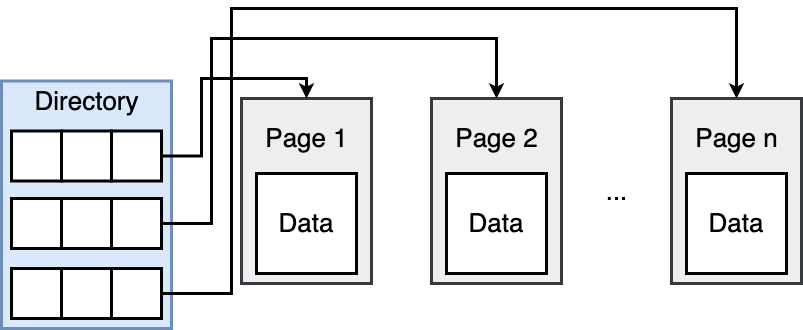
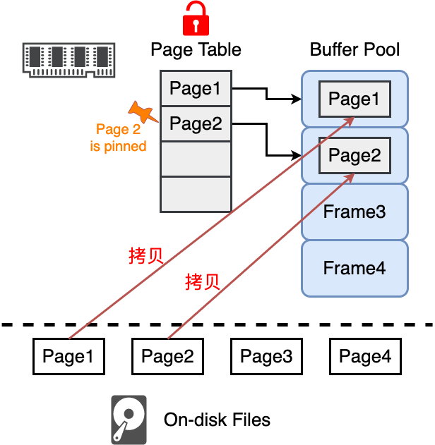

CMU 15-445/645 笔记

https://www.zhihu.com/column/c_1597320018555023360

https://www.zhihu.com/column/c_1470863887393988608

# 数据库核心概念

数据库管理系统 DataBase-Management System DBMS 由一个互相关联的数据的集合和一组用以访问这些数据的程序组成。DBMS的主要目标就是提供一种可以方便、高效地存取数据库信息的途径。**DBMS设计的目的是允许定义、创建、查询、更新和管理符合某种数据模型的数据库**

数据库 Database 就是DMBS中互相关联的数据的集合


## *数据视图*

### 数据抽象


* 物理层 physical level：最底抽象层，描述数据实际上是怎样存储的，即描述复杂的底层数据结构
* 逻辑层 logical level：中间的抽象层
  * 描述数据库中存储什么数据及这些数据间存在的关系，这样逻辑层就可以通过少量相对简单的结构来描述整个数据库
  * 管理员会接触这一层，因为他必须确定数据库中必须保存哪些信息
* 视图层 view level：最高抽象层
  * 只描述数据库的某个部分，系统可以为同一个数据库提供多个视图
  * 一般的用户在这一层。用户一般不会关心数据库中的所有信息，视图层的定义方便了用户与系统的交互

### 实例 & 模式

数据库中的内容随着增删查改必然会发生变化，把**特定时刻**存储在数据库中的信息的集合称为数据库的**一个实例 instance**（不是MySQL中的服务器实例）

**数据库模式 schema 指的是采用某种数据模型的数据库总体设计**，数据库模式即使会发生变化，也不会频繁

### 数据类型

* 结构化数据

  * 结构化数据是按照预定义模型或模式进行组织的数据，通常以表格形式存储在关系型数据库中

  * 具有明确定义的数据模型，可以使用行和列的结构表示。每个数据元素都有特定的数据类型，例如整数、字符串等

    ```
    +----+----------+--------+--------+
    | ID | Name     | Salary | Dept   |
    +----+----------+--------+--------+
    | 1  | Alice    | 50000  | HR     |
    | 2  | Bob      | 60000  | IT     |
    | 3  | Charlie  | 55000  | Sales  |
    +----+----------+--------+--------+
    ```

* 半结构化数据

  * 半结构化数据没有固定的表格结构，但包含一些标记或标签，使得数据元素之间的关系更为灵活

  * 不符合关系数据库的表格形式，但具有某种结构，通常以层次结构（如XML、JSON）存在，允许嵌套和重复元素

    ```xml
    <config>
      <server>
        <name>WebServer</name>
        <port>80</port>
      </server>
      <database>
        <name>MyDatabase</name>
        <username>admin</username>
        <password>secure123</password>
      </database>
    </config>
    ```

* 非结构化数据

  * 非结构化数据没有明确定义的数据模型，没有固定的格式或结构，难以以表格形式组织和存储

  * 没有预定义的数据模式，通常包含自由文本、图像、音频、视频等形式的数据

    ```
    John Doe
    123 Main Street
    City: Anytown
    Phone: 555-1234
    
    Additional Notes:
    This is a sample document with unstructured text.
    It may contain varying information.
    ```

  * 随着储存成本的下降，以及新兴技术的发展，行业对非结构化数据的重视程度得到提高。比如物联网、工业4.0、视频直播产生了更多的非结构化数据，而人工智能、机器学习、语义分析、图像识别等技术方向则更需要大量的非结构化数据来开展工作

### 数据模型

数据库的基础是数据模型 data model，数据模型是一个描述数据、数据联系、数据语义以及一执行约束的概念工具的集合。数据模型提供了一种描述物理层、逻辑层以及视图层数据库设计的方式

数据模型可以被划分为以下几类

* 早期的网状数据模型 network data model 和层次数据模型 hierarchical data model 是早期随着硬盘实现了随机存储访问而先于关系数据模型出现的。这两个模型**和物理底层的实现方式密切相连**，复杂化了数据建模，现在已经基本不被使用了
* 关系模型 relational model
* 实体-联系模型 entity-relationship model/E-R model
* [基于对象的数据模型](#基于对象的数据库) object-based data model
* 文档数据模型 document data model / 半结构化数据模型 semistructured data model：JSON 和 可扩展标记语言 eXtensible Markup Language [XML](#XML) 被广泛地用来表示半结构化数据

## *数据库语言*

数据库系统会提供DDL Data Definition Language 数据定义语言来定义数据库模式以及DML Data Manipulation Language 数据操纵语言来表达数据库的查询更新

DDL和DML并不是两种分离的语言，它们共同构成了单一的数据库语言（比如被广泛使用的SQL）的不同部分

### DDL

数据库模式需要通过一系列的定义来实现，这些定义是由DDL, Data Definition Language 数据定义语言 来表达的，DDL也可用于定义数据的其他特征。用来维护存储数据的结构，即对数据库和表结构的属性操作。比如 `create, drop, alter`

### DML

DML, Data Manipulation Language 数据操纵语言 使得用户可以访问或操作那些按照某些事当的数据模型组织起来的数据，即增删查改数据。通常有两种类型的DML。用来对数据进行操作，即对数据库和表结构的内容操作。比如 `insert, delete, update`

* 过程式 DML procedural DML 要求用户指定需要什么数据以及如何获得这些数据 -- Relational Algebra
* 声明式 DML declarative DML（也称为非过程化DML）只要求用户指定需要什么数据，**而不指明如何获得这些数据** -- SQL、Relational Calculus，**一般都是用这个**

**查询 query**是要求对信息进行检索的语句。DML中涉及信息检索的部分称作查询语言 query language。实践中常常会把查询语言和DML作为同义词使用，当然这是不准确的，因为query是DML的一部分

# 关系模型 & 形式化关系查询语言

## *关系模型*

使用早期的数据模型时，人们每次改变物理层都要重新写数据管理系统。因此 1969 年美国 IBM 公司的研究员 Edgar Frank "*Ted*" Codd 首次提出了数据库系统的关系模型。他发表了*A Relation Model of Data for Large Shared Data Banks* 论文。该论文中解释了某些关系代数运算，研究了数据的函数相关性并定义了关系的第三范式，从而开创了数据库的关系方法和数据规范化理论的研究

关系模型的核心思想是：**用简单的数据结构保存，用高级语言来访问，并让DBMS来执行最优策略以及处理物理层存储**

### 表 & 关系

关系数据库由表 table的集合构成。表中的每一行代表了一组值之间的一种联系，一个表就是这种联系的一个集合，表这个概念和[关系的形式化定义](#关系 & 关系代数的形式化定义)是密切相关的，这也是为什么把这种用表来表示数据的数据模型称为关系模型

下面是一些关系模型的术语

* **用关系 relation 来指代表**。关系是一个无序集合 unordered_set，包含代表的实体的属性关系。因为是无序的，所以DBMS可以用它想要的任何方式存储它们，并允许优化
* 元组 tuple 则是一组值的序列，用来指定行，tuple, row, record三者是可以互换的
  * 空值 NULL 是一个特殊的值，表示值未知或不存在。NULL 会给数据库访问和更新带来很多麻烦，所以尽量避免使用 NULL
  * 起初值必须是原子的或者标量，但现在值也可以是一个 NULL，表示未定义
* 属性 attribute 指代的是表中的列（属性的取值范围称为域 domain）。有n个属性的关系，叫做：n-ary relation，也就是 table with n elements

关系实例 relation instance 表示一个关系的特定实例，也就是一张表的一个实例，即具体某一行

**一个关系可以用 `RelationName(Attributes)` 来表示**，比如下面的学生表可以表示为 `Student(ID, Name, Age)`

```
ID | Name | Age
1  | Jim  | 18
2  | Alex | 19
3  | Emma | 20
```

### 键/码 key

DB Book中文翻译为码，但笔者习惯翻译成键

* 超键 superkey 是一个或多个属性的集合，这些属性的组合可以使我们在一个关系中唯一的表示一个元组

* 候选键 candidate key：候选键是一种最小超码，即它们的任意真子集都不能称为超键

* 主键 primary key：被选中主要用来在一个关系中区分不同元组的候选键

  * 主键应该选择那些值从不或者极少变化的属性，一旦选定并建表之后就不能被更改，否则会引发很多错误
  * 习惯上把一个关系模式的主键属性排列在其他属性前面
  * **一个关系的主键唯一的定义了单个元组**。很多DBMSs都支持autogenerated keys，比如说标准SQL语言的 IDENTIDY、MySQL中的 AUTO_INCREMENT，所以程序就不需要手动增加了，但主键在某些DBMSs中还是需要的

* 外键 foreign key：指定一个关系中的属性必须映射到另一个关系中的元组

  若一个关系模式 $r_1$ 可能在它的属性中包括另外一个关系模式 $r_2$ 的主键（$r_2$ 中作主键的属性的命名可能和 $r_1$ 中的属性不同），那么将这个属性在 $r_1$ 上称作参照 $r_2$ 的外键。关系 $r_1$ 也被称为外键依赖的参照关系 referencing relaiton，$r_2$ 叫做外键的被参照关系 referenced relation

  外键常用来建立表与表之间的映射关系，比如有两个表格 student 和 course

  ```
  Student ID | Name | Age
  1          | Jim  | 18
  2          | Alex | 19
  3          | Emma | 20
  ```

  ```
  Course ID | Course name
  11        | Math
  22        | English
  ```

  这两个表之间存在一个关系，即学生选修课程的关系。我们可以使用外键来建立这种关联

  ```
  Student ID | Name | Age | Course (foreign key)
  1          | Jim  | 18  | 11
  2          | Alex | 19  | 11
  3          | Emma | 20  | 22
  ```

## *关系代数*

关系代数符号的LaTeX表示：<https://billc.io/2020/04/latex-relational-algebra/>

关系代数 Relational Algebra 是一种抽象的过程式查询语言，它包括一个运算的集合，由关系运算来表达查询

关系代数同时也是一种数学形式化方法。它提供了一组操作符和规则，用于执行各种数据操作。关系代数是是一阶逻辑的分支，是闭合于运算下的关系的集合。运算作用于一个或多个关系上来生成一个关系

### 关系代数的基本运算及其运算符

以一个关系 `R(a_id, b_id)` 为例，关系代数的基本运算有

* 一元运算：对一个关系进行运算

  * 选择 select $\sigma_{predicate}(R)$

    选择运算选出满足给定关系谓词的元组，运算符为 $\sigma$​，将谓词写为下标，关系写在后面的括号中

    注意⚠️：SQL中的select与关系代数中的select是不同的，SQL中的where对应于关系代数中的select $\sigma$

    

  * 投影 project $\Pi$

    投影运算返回作为参数的关系，而把某些属性排除在外，运算符为 $\Pi$​

    SQL中的select对应于关系代数中的投影 $\Pi$

    

  * 更名 rename $\rho$ 

    更名运算有两种形式：$\rho_x(E)$ 表示返回给定关系代数表达式E的结果，并把名字x赋给它；$\rho_{x(A_1,A_2,\cdots,A_n)}(E)$ 则表示返回给定关系代数表达式E的结果，并把名字x赋给它，同时把其各属性更名为 $A_1,A_2,\cdots,A_n$

* 二元运算：对两个关系进行运算

  * 并 union $\cup$：和逻辑代数中的并操作一样

    

    ```mysql
    (SELECT * FROM R) UNION (SELECT * FROM S);
    ```

  * 集合差 set-difference $-$

    找出一个在一个关系中二不再另一个关系中的那些元组，比如 $r-s$ 的结果是返回所有包含在r中的但不在s中的关系

    
  
    ```mysql
    (SELECT * FROM R) EXCEPT (SELECT * FROM S);
    ```
  
  * 笛卡尔积 Cartesian-product $\times$
  
    将任意两个关系的信息组合在一起，比如说有两个表 `instructor(ID, name, dept_name, salary)` 和 `teach(ID course_id, sec_id, semester, year)`
  
    对二者做笛卡尔积运算，会得到一个新表，它的属性为 `(inst.ID, name, dept_name, salary, teach.ID, course_id, sec_id, semester, year)`。我们注意到其中有重复的属性ID，这个问题会在之后的自然连接中解决。其中一半默认小表为左表/外表 outer table，大表为右表/内表 inner table
  
    

### 关系 & 关系代数的形式化定义

关系代数：关系代数中基本的表达式是数据库中的一个关系或者一个常数关系。关系代数中一般表达式是由基本运算构成的，即
$$
E_1\cup E_2,\ E_1-E_2,\ E_1\times E_2,\ \sigma_P(E_1),\ \Pi_S(E_1),\ \rho_x(E_1)
$$
关系：在关系模型中，关系是描达现实世界的实体及其之间各种联系的单一的数据结构。由关系的名称和一组具有共同属性的无序的多元组构成。**关系可以看做是一个笛卡尔积的有限子集**，笛卡尔积中的元组并不是全都有意义，只有有意义的那些才能成为关系

### 附加的关系代数

六个基本的关系运算已经足以描述所有的关系代数查询，但是为了简化一些常用的查询，可以再定义一些附加的关系代数运算

* 集合交运算 intersection $\cap$

  $r\cap s=r-(r-s)$ 和逻辑代数中的交的使用方法一样

  

  ```mysql
  (SELECT * FROM R) INTERSECT (SELECT * FROM S);
  ```

* 自然连接运算 natural join $\bowtie$

  通常情况下，涉及笛卡尔积的查询中会包含一个对笛卡尔积结果进行选择的运算。该选择运算大多数情况下会要求进行笛卡尔积的两个关系在所有相同属性上的值相一致

  **自然连接首先形成它的两个参数的笛卡尔积，然后保留两个关系中都出现的属性，最后还要去除重复属性**

  自然连接是可结合的 associative

  下图是 Instructor table 和 Teach table 的自然连接结果，因为两张表中的 ID 属性是相同的，所以据此进行了连接

  

* $\theta$ 连接 $\bowtie_{\theta}$ 是自然连接的扩展，它把选择运算和笛卡尔积合并成单独的一个运算
  $$
  r\bowtie_{\theta} s=\sigma_{\theta}(r\times s)
  $$

* 赋值运算 assignment $\leftarrow$：和编程语言中的赋值的效果一样

* 外连接运算 outer-join：外连接运算是连接运算的扩展，可以用来保留丢失的信息

  在自然连接时，有可能虽然两个表有同样的属性，但一个表中属性的某些实例在另外一个表中找不到，比如说instructor里不教课的老师的ID自然不会出现在teach中。此时可以用外连接来处理，外连接和自然连接相似，但是它会在结果中创建带空值的元组，以此来保留在连接中丢失的那些元组

  外连接分为三类

  * 左外连接 left outer join ⟕：取出左侧关系中所有与右侧关系的任一元组都不匹配的元组，用空值填充所有来自右侧关系的属性，再把产生的元组加到自然连接的结果中
  * 右外连接 right outer join ⟖：与左外连接对称，取出右侧关系中所有与左侧关系的任一元组都不匹配的元组，用空值填充所有来自左侧关系的属性，再把产生的元组加到自然连接的结果中
  * 全外连接 full outer join ⟗：既做左外连接又做右外连接，既填充左侧关系中与右侧关系的任一元组都不匹配的元组，又填充右侧关系中与左侧关系的任一元组都不匹配的元组，并把结果都加到连接的结果中

### 扩展关系代数运算

扩展的关系代数运算 extended relational-algebra 可以实现一些不能用基本的关系代数运算来表达的查询

* 广义投影 generalized-projection
* 聚集 aggregation

## *数据库规范化*

### 范式

https://learn.microsoft.com/zh-cn/office/troubleshoot/access/database-normalization-description

https://blog.csdn.net/xlinsist/article/details/87983035

在关系数据库设计的时候我们想要尽量避免冗余，因此需要对表进行规范化 normalization

规范化 normalization 是一种设计技术，旨在通过将数据库表结构组织为更小、更简洁的形式，以减少数据冗余并提高数据的一致性和完整性，在1970年代同样由 Edgar Frank "*Ted*" Codd 提出。规范化的主要目标是消除数据中的重复，减少数据存储空间的浪费，并确保数据库中的数据更新不会导致不一致或矛盾的情况

规范化通过将大的表拆分成更小的、更具体的表，并通过建立适当的关联来连接这些表。规范化过程通常包括 1NF、2NF 和 3NF，通常被称为范式 Normal Form

还有其他范式，比如BCNF（Boyce-Codd范式）/ 4NF（第四范式）、5NF（第五范式）等，用于更严格地规范化数据库设计，但通常情况下，大多数数据库设计都会至少满足第三范式

通过规范化，可以更好地组织和管理数据库，减少数据冗余、提高数据一致性和完整性，以及简化数据更新和维护操作。然而，过度规范化可能导致查询性能下降，因此在设计数据库时需要权衡规范化和性能之间的关系

### 第一范式 1NF

> First normal form (1NF) is a property of a relation in a relational database. A relation is in first normal form if and only if the domain of each attribute contains only atomic (indivisible) values, and the value of each attribute contains only a single value from that domain.
>

* Eliminate **repeating groups** in individual tables 消除单个表中的重复组
* Create a separate table for each set of related data 为每组相关数据单独创建一个表
* Identify each set of related data with a primary key 使用主键标识每组相关数据

### 第二范式 2NF

* Be in first normal form (1NF) 得是 1NF
* Not have any **non-prime attribute** that is dependent on any proper subset of any **candidate key** of the relation 任何一个非主属性不能依赖于候选键属性集合的真子集属性

### 第三范式 3NF

* Be in second normal form (2NF) 得是 2NF
* All the attributes in a table are determined only by the **candidate keys** of that relation and not by any **non-prime attributes** 符合 3NF 的表结构不应该包含 **transitive dependency**，即非主属性之间不能有依赖关系

# SQL

## *intro*

SQL, Structured query language 是声明式的高级语言，数据的具体操作交给底层引擎，SQL本身并不需要知道数据是具体如何操作的

### SQL标准

SQL的最早版本由IBM开发，最早被叫做 SEQUEL 结构化英语查询语⾔，在20世纪70年代早期作为System R项目的一部分。20世纪80年代改名为SQL，目前SQL已经称为关系型数据库的标准

它的标准版本历史如下，来自wiki，现代系统上至少都支持SQL-92标准


### SQL语言组成

尽管说SQL Structured Query Language 是一种查询 query 语言，但SQL除了在数据库中query之外还可以做很多其他事情，比如定义数据结构、添加约束等等

SQL语言有如下几个部分

* DDL Data Definition Language 数据定义语言，用来维护存储数据的结构，即对数据库和表结构的属性操作。比如 `create, drop, alter`
* DML Data Manipulation Language 数据操纵语言，用来对数据进行操作，即对数据库和表结构的内容操作。比如 `insert, delete, update`
  * DQL Data Query Language 数据查询语言 `select`

* DCL Data Control Language 数据控制语言，主要负责权限管理和事务，比如 `grant, revoke, commit`
* 完整性 integrity：定义完整性约束
* 视图定义：DDL也包括了定义视图的命令
* 事务控制
* 嵌入式SQL和动态SQL embedded- & dynamic SQL：定义SQL语句如何嵌入到通用编程语言，如C、C++和Java中
* 授权 authorization：DDL包括定义关系和视图的访问权限的命令

SQL的各种具体实现（比如说MySQL、PostgreSQL、Oracle等）的各种实现在细节上都有所不同，或者只支持整个语言的一个子集

## *SQL数据类型*

SQL标准支持多种固有类型 built-in types

* 整数

  * int：整数类型（和机器相关的整数的有限子集），也可以使用全称integer
  * smallint：小整数类型（和机器相关的整数类型的子集）

* 小数

  * 浮点数
    * `float(n)`：精度至少为n位的浮点数
    * real, double precision：浮点数与双精度浮点数，精度与机器相关

  * `numeric(p, d)`：定点数，精度由用户指定，p是整数部分的位数，d是小数部分的位数

* 字符类型

  * `char(n)`：固定长度的字符串，由用户指定长度n，也可以使用全称character
  * `varchar(n)`：可变长度的字符串，由用户指定长度n，也可以使用全称character string
  * text：用于存储大量文本数据的字符类型

* BOOLEAN：表示真（TRUE）或假（FALSE）的布尔值

* 日期和时间类型

  * DATE：表示日期

  * TIME：表示时间

  * DATETIME 或 TIMESTAMP：表示日期和时间的组合

  * INTERVAL：表示时间间隔

* 二进制类型 binary types

  * BINARY：固定长度的二进制数据
  * VARBINARY：可变长度的二进制数据
  * BLOB：用于存储大量二进制数据的类型

* 其他类型

  * ARRAY：表示数组类型
  * JSON：用于存储 JSON 数据
  * XML：用于存储 XML 数据

### STRING

特别注意string


## *SQL query*

下面的内容用到的例子都基于下面这三个关系


### query

SQL查询的基本结构由3个子句构成：select、from和where

* select子句用于列出查询结果中所需要的属性
  * 强行删除重复可以在select后面加上distinct
  * 默认是保留重复的，也可以用all来显式指明不去重
  * 用 `*` 来表示选中所有属性 
* from子句是一个查询求值中需要访问的关系列表
* where子句是一个作用在from子句中关系的属性上的谓词

其基本结构为如下，其中每个 $A_i$ 代表一个属性，每个 $r_i$ 代表一个关系（某几张表 $r_i$ 的笛卡尔积中选择符合where谓词的属性 $A_i$ 列）

```sql
SELECT A1, A2, ..., An
FROM r1, r2, ..., rm
WHERE P;
```

上面 $r_i$ 的完整笛卡尔积是相当庞大的，需要通过一些方法来优化，使得只产生符合where的元组

### 自然连接

```sql
SELECT A1, A2, ..., An
FROM r1 NATURAL JOIN r2 NATURAL JOIN ... NATURAL JOIN rm # 也可以表示为：from E1, E2, ..., Em
WHERE P;
```

## *基本运算*

### as重命名

`AS` 关键字用于为查询结果中的列或表达式指定别名 alias。别名是一个临时的名称，它可以用于提高查询结果的可读性，简化复杂的列名或表达式，并且在应用程序中引用结果集时提供更有意义的名称

* 列别名

  ```sql
  SELECT first_name AS "First Name", last_name AS "Last Name"
  FROM employees;
  ```

  在这个例子中，查询从名为 `employees` 的表中选择 `first_name` 和 `last_name` 列，并将它们分别重命名为 "First Name" 和 "Last Name"

* 表别名

  ```sql
  SELECT e.first_name, e.last_name, d.department_name
  FROM employees AS e
  JOIN departments AS d ON e.department_id = d.department_id;
  ```

  在这个例子中，`employees` 表被重命名为 `e`，而 `departments` 表被重命名为 `d`。这使得查询更简洁，而且在连接条件中引用列时更清晰

* 表达式别名

  ```sql
  SELECT salary * 0.1 AS "Bonus"
  FROM employees;
  ```

​	在这个例子中，查询计算员工工资的10%作为奖金，并使用 `AS` 关键字为这个计算结果指定了别名 "Bonus"

### 字符串运算

SQL使用一对单引号来标识字符串，若单引号也是字符串的组成部分，那就用双引号来表示

用 `like` 来实现模式匹配，在 `like` 比较运算中使用 `escape` 来定义转移字符。用 `not like` 比较运算符搜索不匹配项 

* 百分号 % 匹配任意子串
* 下划线 _ 匹配任意一个字符

### 字符串函数

### 集合运算

SQL作用在关系上的 union、intersect和except运算对应与集合中并、交、补运算

## *聚集函数 Aggregates*

### 基本聚集

聚集函数 aggregate functions 是以值的一个集合（集或多重集）为输入，返回单个值的函数。聚合函数（⼏乎）只能在 SELECT 输出列表中使⽤，单个 SELECT 语句可以包含多个聚合

SQL提供了5个built-in的聚集函数：平均值 avg、最小值 min、最大值 max、总和 sum、计数 count

其中sum和avg的输入必须是数字集，其他运算符还可以作用在非数字数据类型的集合上，比如字符串

如果要在计算聚集函数前需要先删除重复元组，可以使用distinct。SQL不允许在用 `count(*)` 时同时使用distinct

### 分组聚集

有时候聚集的目标不是整个元组集合，而是对其进行分组，使用group by子句来分组聚集

在group by子句中的所有属性上取值相同的元组将被分在一组中

可以进一步使用having子句来对形成的分组进一步限定条件，即 HAVING 的⾏为类似于 GROUP BY 的 WHERE ⼦句

### 对空值和布尔值的聚集

聚集函数根据以下原则处理空值：除了 `count(*)` 外所有的聚集函数都忽略输入集合中的空值。由于空值被忽略，有可能造成参加函数运算的输人值集合为空集。规定空集的 count 运算值为0，其他所有聚集运算在输人为空集的情况下返回一个空值

在SQL-1999中引入了布尔值数据类型，它可以取true、false、unknown三个值，有两个聚集函数 some 和 every 可以用来处理布尔值的聚合

## *输出控制*

### 顺序

order by

### 重定向

可以指定 DBMS 将结果存储到另⼀个表中，⽽不是将查询结果返回到客⼾端（例如终端），然后可以在后续访问这些数据

* 新表：将查询的输出存储到新（永久）表中

  ```sql
  SELECT DISTINCT cid INTO CourseIds FROM enrolled;
  ```

* 现有表：将查询的输出结果存储到数据库中已存在的表中。输出结果和⽬标表必须具有相同数量和类型的列，但列名称不必相匹配

  ```sql
  INSERT INTO CourseIds (SELECT DISTINCT cid FROM enrolled);
  ```

## *窗口函数*

聚集只能对整个结果集进行计算，并返回单个值。聚合函数通常用于对一列的所有值进行统计操作，例如计算平均值、总和、最大值等

如果想要对查询结果的不同分分别操作的话，聚集就做不到。这时候要用到窗口函数 window function，也称为OLAP函数，Online Anallytical Processing，联机分析处理

```sql
SELECT ... FUNC-NAME(...) OVER (...)
FROM tablename
ORDER BY someattribute
```

SQL没有顺序，如果没有 window function 的话无法知道

## *一些特殊的查询方式*

### 嵌套查询/子查询

嵌套查询 nested query 也称为子查询 subquery 指的是在一个 SQL 查询语句中嵌套使用另一个查询语句。嵌套查询允许你在一个查询中使用另一个查询的结果作为条件，从而进行更复杂和灵活的数据库操作。嵌套查询可以出现在 SELECT、FROM、WHERE 子句等不同的部分

由于存在 correlation，嵌套查询通常很难优化

下面是一些嵌套查询用到的关键字

* ALL：只要满足内层查询语句返回的结果中的任何一个就可以通过该条件来执行外层查询语句
* ANY：至少满足内层查询语句返回的结果中的一项来执行外层查询语句
* IN 等价于 `ANY()`
* EXISTS：对嵌套查询进行运算以判断它是否返回行

举个例子

```sql
SELECT name FROM student WHERE
sid IN (SELECT sid FROM enrolled)
```

### Lateral Join

`LATERAL JOIN` 允许在连接的右侧的表达式中引用左侧表的列。这使得可以在连接的右侧使用左侧表的列值来动态计算、过滤或进行其他操作。`LATERAL` 关键字通常与 `JOIN` 或 `APPLY` 语法结合使用

### 函数 & 过程

### 触发器

### 递归查询

递归查询是指在 SQL 中进行自引用的查询，通常用于处理包含层次结构的数据，例如树形结构或组织结构。在 SQL 标准中，递归查询可以使用 `WITH RECURSIVE` 子句来实现

# 存储引擎

## *Disk-oriented DBMS*

根据数据库的主存储介质的不同，DBMS可分为面向磁盘 disk-oriented 和面向内存 memory-oriented 两种体系结构

其中 disk-oriented DBMS 的特点是，为了保证在系统发生故障时的数据持久化，数据库使用非易失的 disk 作为主存储介质，但是由于系统不能直接操作 disk 上的数据，因此还需使用易失的内存作为缓存

由于 disk 和 memory 之间巨大的性能差异，disk-oriented DBMS 需要重点考虑的一个问题就是，如何在 disk 和内存之间交换数据才能减少 disk IO 带来的性能延迟

### Overview


### 不要依赖OS：MMAP/IO的问题

DBMS可以利用 \*NIX 系统提供的 `mmap()` 来将文件映射到进程的虚拟地址空间中，使得文件的内容可以通过内存来访问，而不需要频繁地进行磁盘 IO 操作

`mmap()` 虽然便利了编程，但用户无法掌控底层的细节。其实如果只是读的话问题不大，实际中有些数据库是使用 mmap 来实现写的部分的。但在复杂的多线程写的情况下，因为OS并不知道上层发生了什么，所以如果使用 mmap 可能会造成下面的问题

* 事务安全：OS并不知道事务的顺序，它只知道有脏页了

* IO stall

  

  比如说上面当 page 2 和 page 4 由于物理内存的容量满了，需要根据某些算法将一些不常用的 page evict 出去，此时具体的实现完全取决于 mmap 的实现，DBMS 如果使用 mmap，那么将无法利用自己的算法和自己的管理方式来提高IO效率

  并且在等待IO的时候，当前线程会被阻塞

* 异常处理：当访问不存在于物理内存中的页或者页损坏的话，会得到 SIGBUS 的信号，处理信号总是没有像在用户空间处理异常那么方便

* 性能问题：OS需要在内存中维护自己的核心数据结构，这就会引起数据竞争

当然实际中仍然需要依赖OS，直接从物理层，比如说磁盘或网卡拿数据会很痛苦。以网络通信为例，需要依赖OS提供的TCP协议，很少会直接用DPDK从网卡拿raw packet（Yellowbrick, ScyllaDB）。当时要尽量减少对OS的依赖，因为上面所述的原因不利于对数据的控制

### 文件存储

大部分数据库以 proprietary file format 专有文件格式来存储。专有文件格式是公司，组织或个人的一种文件格式，其中包含由公司或组织设计为保密的，按照特定编码方案排序和存储的数据，因此只能使用公司自己开发的特定软件或硬件轻松完成存储的数据。OS完全不知道这些文件里有什么东西

Storage manager / Storage engine 存储管理器 负责以页 page 的形式来管理数据库文件，它会将文件划分为页面的集合，并且负责跟踪记录这些页面的使用情况，包括哪些页面存储了什么数据，哪些页面是空闲的等等

## *数据库页文件的组织方式*

### 什么是数据库页

页就是一大块数据。在系统、OS和数据库中存在不同的页的定义

* 硬件上的页（disk中）一般是4KB。硬件页 disk IO 的基本单位，是存储设备能够保证在写入时能够保持数据安全的最大数据块（failsafe writes, i.e. atomic writes），这意味着如果向存储设备写入数据，设备可以保证对单个页面的写入操作是原子的
* OS的页一般是4KB，intel x86也支持2MB/1GB的大页模式
* 数据库的页一般是512Byte ~ 32KB（大的页能让数据顺序存储，减少IO次数）。数据库页的写入不是原子的，若数据库页大于硬件页，那么DBMS对一个数据库页的写操作将被操作系统分解为对多个硬件页的写操作，此时DBMS必须采取额外措施来确保数据被安全地写入磁盘

数据库页可以用来存储不同种类的数据，比如 tuples（表记录）、metadata、日志等。通常认为一份页数据只会记录同一种类型的数据

大部分DBMS要求页数据是 self-contained的：所有的页元数据都被存储在页当中（如下图所示）。如果DBMS本身发生了错误，不会影响元数据，不过现在的硬件已经比以前的磁盘稳定多了


数据库页文件本身可以用多种数据结构来组织，以便进行查找

* Heap File Organization: most common
* Tree File Organization：用 B+ 树来组织文件中的页，后面B+树索引章节会介绍
* Sequential / Sorted File Organization (ISAM)：不是以 page 为单位来存储 record，而是根据 record "查找键"的值顺序存储。MySQL中的ISAM存储引擎就是这种组织方式，不过现在不是很常用了
* Hashing File Organization

### 页的标识

每个页都有一个唯一的标识符 page ID 用来表征它的唯一性，DBMS 使用某种映射将 page ID 映射到具体的物理存储位置

* 若数据库是单个文件，那么 page ID 可以直接映射为文件内的偏移量
* 若数据库包含多个文件，则还需加上文件标识符来进行区分

大多数DBMS都有一个间接层，能够将 page ID 映射为文件路径和偏移量。系统上层模块请求一个页时，先给出 page ID，存储管理器将该 page ID 转换为文件路径和偏移量，并由此定位到对应页面

### Heap file

Heap file 其实和 heap 没什么关系，它的管理方式更类似于链表

Heap File维护了一个无序的页集合，可以把数据按任意顺序存储在页里面。页管理模块需要借助 metadata 来记录哪些页已经被使用，而哪些页尚未被使用，当上层应用需要使用某一页时，可以直接使用 page ID 获取其想要的页而无需知道具体的页布局

Metadata有两种实现方式

* 链表：文件最开始的header指示了两种类型 page list （即被使用页 data page list 和 空闲页 free page list）的起始，每个page维护两个双向指针

  

* Page directory：用一个bitmap来追踪当前文件中的每个page是free/occupied，此方案最大的问题是需要保证内存中该page和磁盘上该page的同步

  

## *Tuple-oriented*

如果 page 内的 data 存储的是 tuple，那么组织 page 内的 tuple 主要有三种方式

* Tuple-oriented
* Log-structured
* Index-organized

### Strawman Idea

一种最简单的方案是所谓的 Strawman Idea (Naive idea)：用一个计数器来记录当前 page 中的 tuple 数，然后如果要插入新的 tuple 就直接插到最后

> A straw-man (or straw-dog) proposal is **a brainstormed simple draft proposal** intended to generate discussion of its disadvantages and to spur the generation of new and better proposals. The term is considered American business jargon, but it is also encountered in engineering office culture. -- wikipedia


这种方案的问题很大。若每个 tuple 是变长的，并且有可能删除之前插入的tuple的话，就会破坏原来的顺序，也有可能导致类似于操作系统内存管理中的外部碎片，浪费存储空间

### Slotted pages

更实际的做法是采用 slotted pages，即在 Header 后面放置指针或者偏置量来指向对应的 tuple（类似于内存管理中 free-linked list 的方案）

Header 会保存 slot array 的数量以及最后一个被使用的 slot array 的起始地址


DBMS 会给每个逻辑上的 tuple 分配一个唯一的 record identifier，用来表示它在数据库中的物理地址。比如：PostgreSQL 的 CTID（6 Bytes）、SQLite 的 ROWID（8 Bytes）、SQL Server 的 `%%physloc%%`（8 Bytes）以及 Oracle 的 ROWID（10 Bytes）。注意⚠️：应用不应该依靠这些 record identifier 来表示任何东西

Slotted pages 方案使得乱序 tuple 以及变长 tuple 成为可能，并且在删除 tuple 后可以更好的整理空间，提升空间利用率

### 问题

* 碎片问题 Fragmentation：删除 tuples 可能会形成碎片，以及 slot array 和 tuple 中间的部分也有可能会形成碎片
* 无用的 disk IO：DBMS 必须要读取整个 page 来更新一个 tuple，如果数据只占用一个 tuple 的话，就会有很多无用的 disk IO
* 随机的 disk IO：当要更新多个 tuple，而每个 tuple 都是在不同的且分散的 page 中时，就会有很低效的随机 disk IO

另外不一定是 tuple-oriented 的问题，但是若 DBMS 不会覆盖页中的数据，只会创建新的页

## *Log-structured*

### 操作


Log-structured DBMS 最初在1996年作为 log-structure merge trees, LSM Trees 被提出

* 写入、删除
  * tuple中存储的不是数据本身，而是数据的log，即数据的变化。每次写入的时候是写入做的操作到**内存中的page**
  * 当一个 page 满了的时候，需要根据操作写入到 disk，然后准备下一个 page
* 读取
  * 为了读取一个指定 ID 的 record，DBMS需要从新到旧扫描整个 log file 来重建 tuple。之所以从新到旧而不是从旧到新是为了提高读取效率
  * 为了进一步提高效率，DBMS可以维护索引 index，从tuple_id映射到最新的log record

### 压缩

Log-structured 的 DBMS 存在一个严重的问题：数据库占用的存储空间会很庞大且冗余，比如说要对某个 id 的 record 做大量的操作，那么就需要把这些操作全部记录下来。所以需要对 disk 上的 log 做定期的压缩 periodical compaction。注意一定是 disk 上的，不能对还没有写入 disk 的 in-memory log 做压缩

比如说下面的例子中，按照时间顺序，可以只保留最后一条 log。如果是最新的 DEL，则相关id的 log entry 被全部移除

```
⚠️ In-disk page
PUT #101 {val = a1}, PUT #101 {val = a2}, PUT #101 {val = a4}, DEL #102;
-> compaction
PUT #101 {val = a4}
```

压缩之后会丢失原来的时序信息 temporal ordering of records within the page，因为对于一个tuple，保证一个page中最多出现一次。DBMS可以按照id排序，存入一个表中（Sorted String Tables, SSTables），从而提高查找性能

Log 的压缩策略有


* level compaction 层级压缩

  Rocks DB也是基于这个原理实现了日志的压缩，且其最多能压缩到第七层

* universal compaction

  没有层的概念，就是将 “临近” 的 log 压缩（sort + merge），可以递归的不断压缩。这种方法更通用

### Pros & Cons

采用 Log-Structured 的存储引擎在如今很常用，可以归功于RocksDB快速发展。而且也会使分布式数据库更容易实现

* Pres
  * Log-Structured 的 write 要比 tuple-oriented 快得多，tuple-oriented 写的时候需要去 fetch tuple，而 Log-Structured 直接写一个 log entry 就可以了
  * Log-Structured 的设计思想被用在很多KV数据库（NoSQL）当中，因为KV数据库是一个 key 对应一个 val，不像关系型数据库的一个tuple里面有好几个字段。所以KV数据库每次tuple被更新之后，可以直接基于更新的log来得出K对应的V当前是什么值。而关系型数据库的某一个字段被更新后，在log回放/压缩时，我们还要查看其他字段的log，检查其他的字段此前有没有更新，效率比KV数据库低的多
* Cons
  * Write-Amplification：压缩的时候要把disk中的 log 读入 memory，完成压缩后再写入 disk
  * 压缩本身是昂贵的

## *Index-organized*

Tuple 本身以某种以

MySQL的默认数据库执行引擎 InnoDB 采用的就是 Index-organized，SQLite、Oracle 和 SQL Server 则是可选的

## *Tuple Layout & 数据表示*

### Tuple 的内容

一个 tuple 就是一个二进制序列，DBMS 要负责解释这些数据，即将其转换为对于 DBMS 本身有意义的 types 和 values 等

每个tuple也有metadata/header，里面会有一些用于并发控制/事务相关的数据 visibility info 以及用于判断是否有 NULL 数据的 bitmap 等

### 对齐到字

数据库中的 tuple 字段需要对齐到字（x86-64中一个 word 是16 bit / 2 Bytes），如果不对齐的话不同的架构可能会进行如下操作

* 执行额外的读，比如说 x86 架构，它会读两个字并且组装成一个字，但额外的读必然开销是比较大鹅
* 随机读写，不靠谱的操作，可能会返回一个随机的字
* 直接拒绝，抛出异常。比如说 ARM 7 之前的版本

那么 DBMS 该如何进行字段的对齐呢，有下面几种做法。注意⚠️：下图中假设一个 word 是 64 bit

```sql
# Example
CREATE TABLE foo (
    id INT PRIMARY KEY,
    cdate TIMESTAMP,
    color CHAR(2),
    zipcode INT
);
```


* Padding：在位数不够的字段后面填充 emtpy bits
* Reordering：将字段重新排序凑足对齐的位数，如果凑不了就还是得 padding

### 数据库中的数据表示

* INTEGER/BIGINT/SMALLINT/TINYINT：大多数DBMS采用C/C++中的类型来存储Integers。长度是固定的

* FLOAT/REAL/DOUBLE vs. NUMERIC/DECIMAL

  * FLOAT/REAL/DOUBLE 采用 C/C++ 浮点数实现，即 IEEE-754 浮点标准，直接使用 ISA 的浮点指令，性能有保障。但这样做会产生致命的舍入误差，这对于和金融、钱相关的数据是无法接受的

    ```c++
    #include <stdio.h>
    
    int main() {
        float x = 0.1;
        float y = 0.2;
        printf("x+y = %f\n", x + y);
        printf("0.3 = %f\n", 0.3);
        printf("x+y = %.20f\n", x + y); // 显示到小数点后20位
        printf("0.3 = %.20f\n", 0.3);
        return 0;
    }
    ```

    ```
    x+y = 0.300000
    0.3 = 0.300000
    x+y = 0.30000001192092895508
    0.3 = 0.29999999999999998890
    ```

    当小数点后面的位数不多时，打印时会做四舍五入，但如果要求打印小数点后n位这种精确数值时，IEEE-754 在将二进制转换为十进制小数时实际上是有舍入误差的

  * NUMERIC/DECIMAL：通常用变长数组存储，类似是将数字转换成一个string/char数组，可以保证绝对精度，但性能开销极大

    下面是 MySQL 中 NUMERIC 类型的实现，对其进行计算开销极大

    ```c
    typedef int32 decimal_digit_t;
    struct decimal_t {
        int intg, frac, len; 
        bool sign;
        decimal_digit_t *buf;
    };
    ```

    `intg`记录的是小数点之前有多少位，`frac`记录的是小数点之后有多少位，`len`记录的是“该数据有多少字节长”，`sign`是记录正负用的

* VARCHAR/VARBINARY/TEXT/BLOB：Header中会记录长度，data 是二进制数据或者指向其他 page 的指针（大的 char）。关于超长字段的问题见下

* TIME/DATE/TIMESTAMP/INTERVAL: 32/64-bit integer of (micro/milli)-seconds since Unix epoch (January 1st, 1970)

* NULL 有下面三种实现方式

  1. 在 header 中存储位图来表示哪些字段是 NULL，这是最常见的实现方式
  2. 用特殊值来表示 NULL，比如说 INT32_MIN，但是这样的话需要实现判断逻辑
  3. 每一个字段都设置一个 flag 来表示该字段是否是 NULL。非常糟糕的做法，多出来的这 1 bit 会严重影响到对齐到 word，很少有数据库会这么实现

### Large Values 超长字段

VARCHAR 可以存储很长的字段，比如说一本小说、一段视频等。很多的 DBMS 都是不允许一个 tuple 存储超过一个 page 大小的数据的

为了实现存储超长字段，DBMS 会采用一个 overflow page，tuple中存储的是指向这个 overflow page 的指针。如果一个 overflow page 都存不下，那可以多搞几个 overflow pages，它们之间形成链表关系。Overflow page 在不同的数据库中的实现有

* Postgres: TOAST (>2KB)
* MySQL: Overflow (> $1/2$ size of page)
* SQL Server: Overflow (> size of page)


系统本身的存储空间是有限的，因此就有了外部文件 external file 的构想，比如说可以链接到一个网盘文件（用一个 URL 来表示）。外部文件被看作是 BLOB, Binary Large Object 类型（Oracle BLOB、SQL Server FILESTREAM）。DBMS 无法直接操作外部文件

# Workload & 存储模型

DBMS的存储模型规定了如果在物理 disk 和 memory 中组织 tuple，将会影响在不同的 workload (OLTP or OLAP) 下的特性，也会影响 DBMS 其他系统部分的设计

主要有 NSM（行存储）、DSM（列存储）和 PAX（混合模型）三种存储模型。目前数据库市场上 NSM 和 DSM 数据库的区别是很明显的，区别就是 NSM 用于 OLTP，DSM 用于 OLAP 

## *Workload*

### 不同的workload类型

https://zhuanlan.zhihu.com/p/463282119

数据库workload是指**数据库系统在特定时间段内所承受的工作负载或负荷**。 它包括数据库系统所处理的查询请求、事务处理、数据插入、更新和删除等操作。数据库的 workload 可以分为下面三种


* On-Line Transaction Processing, OLTP，在线事务/交易处理，支持快速的操作，读写数据量很小的tuple，而且一般是高并发的，像电商网站购物这样的场景，同时发生很多交易，但每笔交易涉及的数据量都很小
* On-Line Analytical Processing, OLAP，在线分析处理，OLTP这种workload一般来自用户，OLAP则来自于提供相应软件服务的公司本身，比如说电商网站要统计当天卖多最好的产品是什么、有多少笔交易，交易的平均金额是多少，交易总额是多少，这一般对应着复杂的SQL语句，要读大量的数据
* Hybrid Transaction + Analytical Processing, HTAP，则是前两者的混合，意味着可以同时应对这两种类型的workload的数据库架构

OLTP更倾向于写，OLAP更倾向于读

### 工业界应对不同的workload的方案

在不考虑HTAP的情况下（目前工业界HTAP的实践并不多），软件公司会将OLTP和OLAP这两类工作负载分开处理，用小数据库的集群处理OLTP，用分库分表的策略将工作负载分开


等到需要统计分析数据（即OLAP对应的场景）时，对这个集群执行ETL, Extract-Transform-Load 操作，即提取数据 `->` 做变换 `->` 加载，把得到的数据转存到大的数据仓库里，然后让数据仓库应对OLAP的负载

这样将两种工作负载的处理分离开来的好处是，应对软件公司内部统计分析时的OLAP负载时，即便是执行复杂的SQL语句，也是在数据仓库上执行，不会影响集群，进而不会影响处理OLTP的效率以及用户体验，同时，小规模数据集群的架构也往往不适合运行复杂的SQL语句，可能光执行这些复杂的SQL就足以让它们挂掉，在数据仓库应对完OLAP的负载，即完成数据统计后，可以将统计后的结果写回小数据库集群，比如说用户年终总结就是这么得到的

## *存储模型*

### 行存储模型


N-Ary Storage Model, NSM / Row store 行存储：在一个 page 中连续存储 tuples，更适合于 write-heavy、访问单个 tuple 的所有字段的 OLTP workload

但是 NSM 对于OLAP workloads 是不友好的，因为OLAP查询可能只需要一个或几个属性，不需要所有的属性，而 NSM 会把 tuples 的所有字段全部取出来，浪费了 IO

* Pros
* Cons

### 列存储模型


Decomposition Storage Model, DSM / Column store 列存储：在一个 page 中连续存储所有 tuples 的某一个属性字段，更适合于访问多个 tuples 的某几个字段的 OLAP workload 和对表属性的子集执行大规模扫表的read-only queries

* Pros
  * 相比于 NSM，metadata变小了，比如说不再需要某个 attribute 是否是 NULL
* Cons

### Tuple Identification for DSM

在列存储的情况下，如果想像以前一样，读取整行的数据该怎么办？有两种解决方法

1. Fixed-length offsets

   如果每一个属性字段的长度都是相同的，此时各自的 offset 也相同，直接将相同 offset 的 value 拼接起来就是需要的完整行数据

   但是这只能用于 fixed-length tuple，如果是 varied length，比如说 varchar、string、blob 等数据就不能这么做了

2. Embedded tuple IDs

   比第一种方案更浪费空间，连续存储的每一列数据，不仅要存储该字段对应的信息，还要额外记录它的ID作为索引

   这种方法是历史上用过的，但现在不太用了

3. Dictionary Compression

   另一种解决变长数据的方法是使用 Dictionary Compression，下面会介绍。现代的 DBMS 系统基本都是这么做的

### 混合：PAX

实际上 OLAP 机会不会每次只是 query 一个 column，而是 query 多个 column，然后把这几个 column 拼接起来

市场上的列存储数据库实际上用的不是 DSM，而是 Partition Attributes Across, PAX。所以 PAX 才是列存储数据库最常见的存储模型

把多个 column 的数据放到一块，然后分解成 row groups，这样一个 row 上不同 attribute 的数据在 disk 上也能比较接近 


## *数据库压缩*

### 目标

数据库被广泛使用在 disk-oriented DBMS中，因为 disk IO 通常是性能的主要瓶颈。而DBMS可以压缩数据以提高每次 IO 操作的数据移动效率

压缩不仅可以提高 IO 效率，减少内存占用，也可以在查询执行阶段减小CPU cost

数据库压缩的目标是

1. 必须要产生定长的数据，从而让DBMS可以通过offset访问数据
2. 延迟物化 Late Materialization: Postpone decompression for as long as possible during query execution
3. 必须是无损压缩 lossless compression。有损压缩 lossy compression 是不允许在数据库中存在的，如果需要的话只能在更上层的应用阶段来执行有损压缩。比如说虽然最低间隔是1分钟，当需要十年间的股市变化趋势是不需要准确到1分钟，所以可以进行有损压缩，但这是应用层的操作，数据库不允许有任何主动的有损压缩 

### 压缩粒度 Compression Granularity

* Block-level (naive compression)：对某个表中的一个 block 中的所有 tuples 进行压缩
* Tuple-level：对整个tuple进行压缩，只能用于NSM
* Attribute-level：对一个tuple中单独的一个属性字段进行压缩
* Column-level：对多个tuple的一个或几个属性的多个值进行压缩，只能用于DSM

### Naive Compression

使用某种通用压缩算法来压缩数据，比如 LZO (1996), LZ4 (2011), Snappy (2011), Oracle OZIP (2014), Zstd (2015) 等

以 MySQL 的 InnoDB 为例：DBMS 会压缩磁盘页，并将其填充到2的幂次KB，即 `[2, 4, 6, 8]KB`，然后把压缩后的 page 放到buffer pool，如果DBMS想要读取数据，存在buffer pool中的压缩数据需要被解压缩后才能读取

Naive指的是若 DBMS 想要理解数据，必须要解压缩数据。我们想要实现的目标是 DBMS 可以不解压缩，而直接在压缩数据上操作

## *Columnar Compression*

大部分 DBMS 对数据本身用的都是 dictionary encoding，但是其他的压缩方法还可以用来压缩 dictionary 的 key 或 dictionary 压缩后的 value

另外 dictionary encoding 不需要排序后再压缩，而其他的压缩方法都需要排序

### Run-length Encoding

Run-length Encoding, RLE 游程编码将一个 column 中相邻的相同值压缩成一个三元组 triplets

```
(属性值, 相同值的这一段开始的位置, 相邻的相同值的个数)
```


DBMS 需要智能地对相关 column 提前进行排序，以最大化压缩率 compression opportunities

### Bit-Packing Encoding

当属性的值总是小于声明的最大值时，将这些值存储在更小的数据类型中

比如说下面这些 int 值的压缩过程


Mostly Encoding 是 Bit-packing Encoding 的变体：如果有一个值超出了改变数据类型后能表示的范围，那么单独维护一个查找表去存储这些值


### Bitmap Encoding

对于某个特定的属性，对每个值维护一个bitmap，来表示某个元组对应的属性是否是这个值。比如说性别


### Delta Encoding

不记录确切值，而是记录一列中与上一个值的差异。与 RLE 搭配使用效果比较好


### Incremental Encoding

Incremental Encoding 属于 Delta Encoding 的一种：可以记录与上一个值共同的前缀或者后缀的长度，sort之后压缩效果更好


### Dictionary Encoding

Dictionary Encoding 是最常用的压缩方法

构造一个字典，将变长的值映射到小的固定长度的整数id。比如说下面构建一个定长的 int （key）集合变长的 name （value）之间的字典，然后查询的时候只要查需要的 int 就可以了


注意⚠️：编码需要保留原数据的顺序，需要支持点查询 point query 和范围查询 range query的快速编解码

有下面几种数据结构可供选择

* **数组**：一个数组存原数据，另一个存指向offset的指针。更新非常昂贵，所以只能用于创建后不可更改或编辑的文件 immutable files。但是这个方法用的还是很多的，如果要更新一般就直接重建指针数组
* 哈希表：快速且紧密，但不支持范围查询
* B+树：比哈希表慢，且占用更多的内存甚至disk空间，但是支持范围查询

# Buffer Pool（内存管理）

## *Intro*

### 缓存池的作用

缓存池 Buffer Pool 就是 page 在内存中的组织形式，它扮演了重要的 cache 角色，用于尽量减少 disk IO，提高总的 IO 效率

* **读缓存**：缓存数据库 page，因为用户有可能会重复访问 page，这样就不需要去 disk 中取了，减少 disk IO 的次数
* **写缓存**：缓存用户的更新，用户对数据库的内容的写入和修改也是先被缓存到内存的缓存池中的，我们需要把（多次）修改缓存在内存中，然后集中将修改写回硬盘或者采用其他策略，而不是每次一修改就立刻写回硬盘，这样会大大提升效率。也就是 write back 写回策略

### 缓存池的控制

* Spatial control 空间上的控制
  * 将 page 存到物理 disk 的何处？
  * 尽量将经常一块使用的 page 尽量集中连续放置，这样可以减少内存中的访问时间
* Temporal control 时间上的控制
  * 何时将 page 读入内存，何时将 page 写回 disk
  * 目标是最小化 disk IO 造成的阻塞 & 停顿

## *Buffer Pool Manager*



### 缓存池的组织形式

缓存池组织为以一个连续存放的 fix-size page 的数组形式，其中每个数组项称为一帧 frame，每个帧用于缓存数据库文件的多个定长页

当 DBMS 请求页的时候，一份页拷贝就会被放入 frame 中

### 缓存池元数据

缓存池的元数据称为页表 page table（注意 ⚠️：跟虚拟内存中的页表不是一个东西）。Page table 是一个内存中的哈希表，用于记录 page ID 和 frame localtion 之间的映射关系

为了保证线程安全，一般 page table 会被 latch 保护起来

其他的元数据还有

* 脏标志 dirty flag 表征帧中的页是否被修改过
* Pin/Reference Counter：记录有多少线程正在访问这个 page （读或写）。Pin 指的是某个页表项之后还会被用到，所以不能从 buffer pool 中被 evict 出去
* Access Tracking Information

### 概念：Locks vs. Latches

* 和 OS 中的 lock 不同，数据库中的 lock 是逻辑上的抽象的概念，是 high-level 的。比如说我们想要保护数据库的某个表的数据内容免受不同事务的影响，那我们就要用某种 lock 机制来保护这张表，Transactions会在它整个生命周期持有lock
* 而数据库中的 Latch 则是实现 Lock 这个抽象的概念的**具体手段**（原语），又叫做 Mutex。Latch只在操作执行的时候被持有

### Allocation Policies

数据库中的内存根据两个策略分配给缓冲池

1. Global polices：做出使正在执行的**整个工作负载受益**的决策。它考虑所有active的事务，以找到分配内存的最佳决策
2. Local polices：做出的决策将使**单个查询或事务**运行得更快，即使这对整个工作负载都不好。本地策略将帧分配给特定事务，而不考虑并发事务

## *绕开 OS 提供的 Page Cache*

### 直接IO

在 *高并发.md* 和 *系统编程.md* 中介绍过 open 系统调用的 `O_DIRECT` 宏这种直接 IO 的方式，它的一个最重要的应用就是在数据库中，它会绕过 OS 提供的内存管理机制（Page Cache），直接将 disk block 拿到用户空间中

因为 DBMS 是自己维护了一套内存管理机制，即 buffer pool，所以它不需要使用 OS 提供的 Page Cache

当然像在 *高并发.md* 中展示的一样，直接 IO 在 DBMS 中的具体实现是不简单的，它需要考虑很多内存对齐的问题

### 优先级

### 其他 Buffer Pool

## *优化*

### 多缓存池

一个 DBMS 可能有多个缓存池，甚至缓存池的粒度可能也不同。使用多个缓存池可以减少 latch 竞争、提高局部性。Buffer Pool 根据其管理的对象的粒度不同可以分为

* 一个 DBMS 有多个缓存池
* 一个 DBMS 管理多个 databases，每个database 有一个缓存池
* 每种 page type 有一个缓存池

既然有多个缓存池，那么 page 本身就要跟其使用哪一个缓存池产生映射关系

* Object IDS：将每个page的record ID加一个标识符，标识这个page在哪个buffer pool中
* 哈希：将page的record ID 哈希后存储在那个buffer pool中

### 预取

和 CPU 使用的预取技术一样，DBMS 可以根据 query plan 提前将 page 取到 buffer pool 中

比如说有一个 query plan 是要把数据库的表从头到尾全遍历一遍，即全表扫描，那么就可以预先把未来要读的数据页从磁盘读入内存

### Scan Sharing

Scan Sharing 共享扫描，也称为 Synchronized Scans 的作用是支持多条语句并发执行，在它们并发进行的过程中DBMS有能力推断出它们是在读同一张表。Scan Sharing 和 Reulst Caching 把结果记录下俩不是一回事

```sql
Q1: SELECT SUM(val) FROM A
Q2: SELECT AVG(val) FROM A LIMIT 100
```

比方说有上面两条语句，它们都需要扫描全表，其中 Q1 先执行，Q2 后执行。假设 Q1 执行了3条语句后 Q2 执行，以及我们的 buffer pool 的容量是3


此时正常来说 Q2 应该要把 Page 3 踢出去，然后把自己需要的 Page 0 加载进 buffer pool。然后 DBMS 并没有这么做，DBMS 发现它和 Q1 扫描相同的表，所以就让 Q1 继续扫描，在 Q1 扫描完后，再让 Q2 扫描 page0 - page 2

### Buffer Pool Bypass

Buffer Pool Bypass 也称为 Light Scanning，它的意思是考虑到有些数据可能在一段时间内只需要用一次，所以不会把这些数据放入 buffer pool 中，这样可以避免之后被 evict 出去的消耗

典型的例子就是全表扫描、join这类操作

## *缓存置换*

### 优先级提醒

## *Buffer Pool 的写策略*

### 脏页

### Background Writing


# B+树索引

数据库引擎通过**索引这种数据结构**来快速找到它需要读写的 page。索引要实现快速的随机访问（***O(1)***）数据库引擎所需要的 page，如果没有索引，那么必须要遍历 buffer pool 甚至是 disk 中所有的数据库 page 才能找到引擎需要的 page

索引的设计应考虑

* 索引的数据结构具体应该是什么样的，如何支持高效的随机访问
* 并发：如何让索引支持多线程并发的读写

由于索引用到的数据结构（哈希、B树家族）都在 *数据结构与算法.md* 有详细的记录，所以索引部分的重点放在并发控制

因为哈希不支持范围查询，所以DBMS用的都是B树作为索引

## *补充：DBMS中的哈希*

### DBMS中哈希函数的设计 & 选取

DBMS中哈希表的设计应该要考虑

* 采用什么样的哈希函数？哈希冲突的发生概率与计算速度的权衡
* 发生哈希冲突了该如何解决？哈希表本身占用空间与操作复杂程度之间的权衡

DBMS的哈希表不会使用加密用的哈希函数，比如说 SHA256 这种哈希函数，因为其是为了安全为目的，计算的复杂度很高。选用DBMS作为索引的哈希函数的期望就是，可以被快速完成，并且不容易发生哈希冲突

DBMS 中常用的哈希函数有

* CRC-64 (1975): Used in networking for error detection.
* MurmurHash (2008): Designed as a fast, general-purpose hash function
* Google CityHash (2011): Designed to be faster for short keys (< 64 bytes)
* **Facebook XXHash** (2012): From the creator of zstd compression（Zstandard是由Facebook的Yann Collet开发的一个无损数据压缩算法）
* Google FarmHash (2014): Newer version of CityHash with better collision rates

### 哈希冲突的处理

这部分在 *数据结构与算法.md* 中全部记录过了，这里只给出一个大纲

* Static Hashing Schemes 应对哈希冲突的静态策略
  * Linear Probe Hashing 线性探测
  * Robin Hood Hashing
  * Cuckoo Hashing
* Dynamic Hashing Schemes 应对哈希冲突的动态策略
  * Chained Hashing 哈希桶
  * Extendible Hashing 可扩展哈希
  * Linear Hashing

## *B+树索引*

关于B树家族的内容可以看 *数据结构与算法.md*。这里介绍 B+ 树在数据库系统的具体应用

注意⚠️：B树家族，特别是B+树之后的系列定义和实现都不是唯一的，完全取决于具体数据库是如何实现的，甚至有些实现是违反理论上的数据结构的。下面讨论的可能不是严格的 B+ 树，而是融合了 B\* 、B-link 等后续系列的混合体

### 联合索引

联合索引 compound index，也称为复合索引、联合索引 union index 是指用于索引的Key可以有多个字段/属性，比如说 `<A, B, C>` 是一个有3个属性的索引。我们可以只拿其中的一个属性的值去做索引，也可以拿部分或全部的属性的值去做索引

B+树实现联合索引很简单，不过就是把扩大节点的 key 的size，往里面多加几个字段罢了。B+树实现的联合索引的优势在于它支持索引之间的操作，而哈希实现的联合索引必须要用到所有的属性

继续以上面的 `<A, B, C>` 索引为例，比方说它支持一个 key `<a, b, c>` 下面的操作

```
Supported: (a=1 AND b=2 AND c=3)
Supported: (a=1 AND b=2)
Supported: (b=2), (c=3)
```

举一个具体的例子，比如说下面要找到复合索引中第一个索引为 1 的 tuples


### 应对重复的key

* 在 key 后面合并上 record ID，即 `Record ID = <Page, Slot>`，总体上 KV 就变成了 `<{key, record ID}, data>`
* 或者让重复的 key 产生所谓的 overflow leaf nodes，专门用来管理重复的 key，这种方法更加复杂和难维护

### 聚簇索引

聚簇索引 Clustered Index

## *B+树的设计策略*

### 叶子节点的内容

* key 对应的 value 是 record ID，此时相当于放的是一个指向 tuple 位置的指针
* key 对应的 value 就是 tuple 本身，此时我们可以说**整个数据库系统存储的数据是按照主键索引 primary key 去组织的**

### 叶子节点的大小

B+树节点的大小最好和文件页的大小一致或者是其倍数

### 节点合并的阈值

一些 DBMS 并不是在 B+ 树节点的 key 数量 `<=ceil(M/2)` 的时候就合并节点的，将合并节点的阈值提高可能有助于减少树重组的次数

或者有些 DBMS 是干脆不合并比较空的节点，然后周期性的重新整理整棵 B+ 树

这也是为什么 PostgreSQL 把它们的 B+ 树的实现称为 non-balance B+ Tree, i.e. nbtree

### 可变长度 key

如果使用字符串当作索引节点的 key，那么很有可能它是变长的，对于变长的Key，DBMS有如下的处理方式：

* 改为存储 key 的指针，也称为 T-Trees
* 让 B+ 树的每个节点也都是变长节点，但并不推荐这种策略，因为节点变长的话就很难将每一个节点组织为一个或多个文件页了，内存管理的成本提高
* Padding：就和前面设计不同数据类型的字段的 padding 一样，直接将每个 key 都 padding 到 key 允许的最长长度
* 词典法：和 dictionary encoding 差不多

### 叶子节点的内部搜索

当通过索引找到了大的叶子节点后，一个叶子节点里面仍然存储着大量数据，如何寻找到我们需要的数据仍然是一个挑战。有下面这些办法

* Linear 线性扫描：就是线性的一次暴力 for 遍历，虽然看起来低效，但很多数据库都是这么实现的，因为相比于把叶子节点从磁盘读入缓存池用的时间，暴力扫描用的时间微不足道。另外可以通过 SIMD intrinsics 来向量化比较的过程
* 二分查找，就是使用简单的二分查找算法，因为叶子节点中的KV都是实现按照K的大小有序排列的
* Interpolation：根据叶子节点中大量KV中的 key 的排布规律推断出我们想要的那条 KV 在哪里

## *B+树的优化*

### 前缀压缩

前缀压缩 prefix compression：在同一个叶子节点里很多 key 的前缀都是相同的，与其存储所有这些冗余的公共前缀，可以在叶子节点的元数据里面提取并记录公共的前缀，实际存储 key 的时候只需存储前缀后面不一样的内容即可


### 去重

去重 deduplication：前面提到过，B+ 树有方法来管理相同的 key，可以直接将相同的 key 删掉，组织成一个 posting list（就是一个数组）


### 后缀截断

后缀截断 suffix truncation：在 inner node 中 key 只是用来指引方向的，实际上用不着把完整的 key 给记录下来，我们只需要记录下能完成分流功能的最小长度 key 即可


### Pointer Swizzling

Pointer Swizzling 指的是将基于名称或位置的引用转换为直接指针引用

### 批量插入

一个一个依次往 B+ 树里插入的效率并不过，高效的方法是批量插入 bulk insert，它的是提前把要插入的 n 个数先排序好，或者直接组织成一个小的 B+ 树，然后往大的 B+ 树里一插

### Bε-Tree

# 索引并发

## *Intro*

### 并发控制协议

并发控制协议 concurrency control protocol 是DBMS使用以保证并发操作正确性的方法

并发控制协议正确性标准可以分为：

* **Logical Correctness**：线程可以读它期望读到的值。比如在一个transaction中，一个线程在写完一个值之后，再读它，应该是它之前写的值
* **Physical Correctness**：共享对象的内部表示是安全的，比如共享对象内部指针不能指向非法物理位置

索引并发主要是保证 physical correctness，logical correctness 则是由一系列事务操作保证的

### Latches实现

Latches 有两种模式：读锁和写锁

```
Compatibility Matrix

        Read    |    Write
---------------------------
Read    ✅      |    ❌
---------------------------
Write   ❌      |    ❌
```

* Test-and-Set Spinlock
* Blocking OS Mutex
* Reader-Writer Locks

## *哈希表 Latching*

* Page Latches
* Slot Latches

## *B树 Latching*

### Latch Crabbing/Coupling

### Optimistic Coupling

### Leaf Node Scans

# 算子算法

这部分的算法是 disk-oriented 的，不能假设 query 的结果可以全部塞进 memory，甚至 query 的中间结果也需要存储到 disk 中。我们需要使用缓存池去实现这些算法，要最大化 disk 的连续 IO

算子是组织成树形结构的，数据从叶子节点流向根节点，根节点的输出就是查询的结果


## *排序*

### 存内堆排序

### External Merge Sort

1. Phase 1: Sorting。算法将能放进内存中的小块数据（一个 run）进行排序，并将排序好的数据写回磁盘
2. Phase 2: Merging。算法将两个（可能是多个，两个的叫做two-way）排好序的子文件合并成一个大文件

下面介绍一下基础的 two-way merge sort

### General K-way Sort

### Double Buffering Optimization

### 使用 B+ 树

## *聚集*

聚集算子的作用是将多个元组的单个属性的值计算成为单个标量值。实现聚集有排序和哈希两种方法

### 排序聚集

### 哈希聚集

## *Join 连接算子*

### intro of join

当我们想重构规范化了的表的原始表时，就需要 join。前情提要：join 就是表叉乘 cross-product 后做 select，把属性值相同的 tuple 进行合并

注意⚠️：原则上一直让小表作为左表，即外表 outer table（用 R 表示）

下面介绍双表的**内等值**连接 inner equijoin algorithms，即自然连接 $\bowtie$

### 算子输出

对于符合连接条件的元组 $r\in R$ 和 $s\in S$，输出元组的内容可以有多种形式，具体取决于DBMS的查询处理模型、存储模型和查询本身。下面是两种重要的输出形式

* 输出外元组 & 内元组的数据 / 提前物化 Early Materialization

  * 优点：如果有需要话，未来的算子可以回到原表中获取一些其他数据
  * 缺点：需要更多的内存

  DBMS可以做一些额外的计算，也可以忽略查询过程中以后也不会需要的属性

  

* 不输出完整的 tuple 内容，而是输出外元组 & 内元组的 record ID 或者 offset / 延迟物化 Late Materialization

  适用于列存储，因为这样DBMS不需要复制查询没有用到的属性

  

### 性能评估

使用 disk IO 数来作为性能评判的依据，但没有计算将计算结果写到磁盘中的时间，因为各种算法的输出次数都一样

在分析中假设

* 左表 / 外表 R 有 M 页，m 个 tuple
* 右表 / 内表 S 有 N 页，n 个 tuple

下面介绍的连接算法都有自己适合的、比较高效的使用场景，不存在普适性的高效的连接算法

## *Nested Loop Join*

### Simple Nested Loop Join

两层循环的暴力循环算法

### Block Nested Loop Join

### Index Nested Loop Join

## *Sort-Merge Join*

## *Hash Join*

### Basic Hash Join

### Partitioned Hash Join

Partitioned Hash Join (GRACE hash join)

# 查询执行

## *查询处理模型*

DBMS的查询语句处理模型定义了数据库系统将如何执行一个查询计划 query plan，根据不同的工作负载，比如OLAP和OLTP，它在设计上有一些权衡，有如下三种常见的模型

### 迭代器模型

Iterator Model 迭代器模型，也称为火山模型 Volcano Model、流式模型 Pipeline Model

每个算子/操作符都要实现一个`Next()`方法，每次调用它时操作符会返回一个tuple或者null，null表示tuple已经都被返回完了。操作符本身由一个循环来实现，循环内部会调用其子操作符的`Next()`方法，并通过其返回值从它们那边获取下一条 tuple 供自己操作

每一个操作符都有 `Open()` 和 `Close()`，类似于构造和析构


### 物化模型

Materialization Model 物化模型：算子一次性读入全部要处理的数据（比如说一张表），将得到的结果一次性地输出


### 向量化模型

Vectorized 向量化模型，也称为 Batch Model 分批模型是迭代器模型和物化模型的中间产物

每个算子也有`Next`函数，但它返回的既不是迭代器模型的一条数据，也不是物化模型的所有数据，而是一批数据 batch of tuples。这样可以减少函数调用的次数，从而降低开销 


### 执行方向

* Top-to-Bottom 自顶向下
* Bottom-to-Top 自底向上

## *访问表的方式*

DBMS 访问表（R 和 S）的方式 access methods 是在 SQL 中没有定义的

### 顺序扫描

顺序扫描 sequential scan：一页一页地扫描，把硬盘里的每一页读入内存之后就开始一条条地扫描其中的数据

顺序扫描往往是查询执行的瓶颈所在，所以对此也有一些优化方式

* Prefetching
* Buffer Pool Bypass
* Parallelization
* Heap Clustering
* Late Materialization
* Data Skipping

### 优化：Data Skipping

有下面两种实现方式

1. Approximate Queries 有损
2. Zone Maps 无损

### 索引扫描

索引扫描 index scan

### 多索引扫描

多索引扫描 multi-index scan

## *并发查询处理模型*

## *Execution Parallelism*

### Inter-Query

Inter-Query指的是查询之间的并发处理

### Intra-Query

Intra-Query指的是查询内部的并发处理

## *IO并行*

# 查询优化

## *Heuristics / Rules*

## *Cost-based Search*

# 事务
