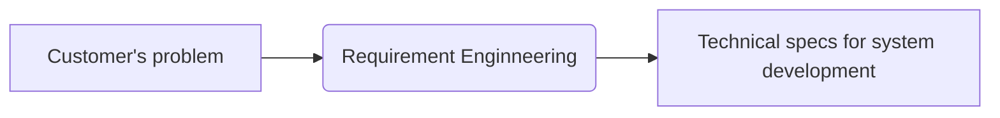
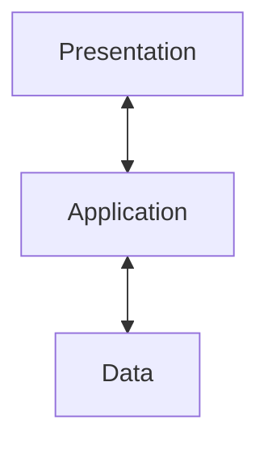
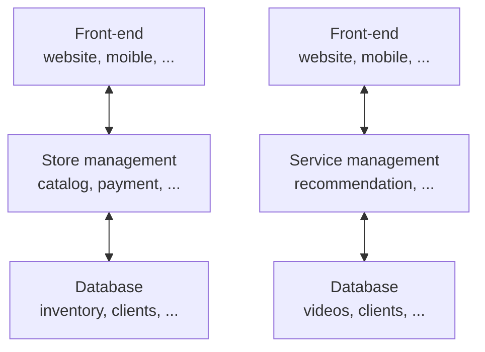

# Introduction

## *软件开发模式*

# Requirements

## *Introduction*

### Definition

**Requirements engineering RE** is the process of eliciting, analyzing, documenting, validating, and managing the requirements for a software system。需求工程是指在工程设计过程中定义、记录和维护需求的过程



需求工程涉及多种活动，例如从利益相关者那里收集和记录需求，分析需求以识别潜在的冲突或遗漏的需求，对需求进行优先级排序，并验证需求以确保它们是完整、一致和可行的

**最终目标**是创建一个清晰而简洁的需求集，准确反映利益相关者的需求，并为高质量软件产品的开发提供坚实的基础

### What is requirements

* **Features** that the system **must have** in order to be accepted by the client
* **Constraints** that the system **must satisfy** in order to be accepted by the client

## *Stages*

### Overview

1. Elicitation: This involves gathering requirements from stakeholders through interviews, surveys, workshops, and other techniques
2. Analysis: This involves analyzing and prioritizing requirements, identifying dependencies, and resolving conflicts
3. Specification: This involves documenting requirements in a clear and concise manner, often using tech specs or standard notations (e.g., UML use-case diagram)
4. Verification and validation: This involves ensuring that the requirements are complete, consistent, and correct, and that they meet the needs of stakeholders
5. Management: This involves tracking changes to requirements, communicating changes to stakeholders, and ensuring that requirements are met throughout the software or system development life cycle
6. Maintenance: This involves managing changes to requirements over time, ensuring that they remain relevant and up-to-date

### Elicitation 获取

* 引出需求的主要目标是确定系统必须满足用户和利益相关者的需求的需求
* 有很多技术可以用来引出需求，包括面试、问卷调查、观察和焦点小组讨论
*  一旦需求被引出，它们通常会被记录在需求文档或类似的文档中

### Analysis

* 分析阶段涉及审查需求，以理解它们的含义，评估其可行性，并识别任何潜在的冲突或不一致性
* 在分析过程中，通常会以结构化的方式组织和分类需求，例如将相关需求分组或创建用例来描述系统在不同情境下的行为
* 分析阶段还涉及确定需求是否可在项目的约束条件内实现，例如预算、进度和可用资源

### Specification

* The purpose of specification is to create a clear, concise, and unambiguous description of the requirements after eliciation and alysis with stakeholders
* 规格说明还包括必须考虑的任何约束或限制，以及与数据或接口相关的任何特定需求
* There are many ways to document requirements, such as
  * UML use-case diagrams
  * User stories
  * Functional/non-functional requirements
  * System specifications

### Verification and validation

* Verification and validation are critical to ensuring that the requirements for a system are accurate, complete, and consistent
* Verification refers to the process of checking that the requirements have been correctly captured, and that they accurately reflect the needs/expectations of the stakeholders
* Validation, on the other hand, refers to the process of ensuring that the system meets the requirements that have been specified

### Management

需求工程中的管理涉及在软件开发生命周期中管理需求

* 优先排序和组织需求：确定哪些需求最重要或关键，并确保它们获得适当的关注和资源。
* 跟踪需求变更：记录需求的任何变更，这是必要的，以确保所有利益相关者都知道需求的任何变更，并防止误解/沟通不畅
* 确保需求仍然有效和最新：定期审查需求，以确保它们仍然相关和准确，并根据需要更新它们，以反映利益相关者需求或项目目标的任何变化

### Maintenance

需求工程中的维护涉及在软件系统部署并使用后管理需求。在这个阶段，需求根据系统环境的变化或用户需求的变化进行审核、更新和修改

一些维护的原因

* 系统长时间运行，而需求会随着时间的推移而发生变化
* 确保系统继续正常高效地运行，例如修复错误、硬件更新、性能更新等
* 系统仍然安全，并符合任何相关法规或标准

## *Types*

### 功能性需求

Functional requirements 会定义系统特定的行为或功能

* Describe the specific tasks and functions that a system or product must perform
* Typically expressed in terms of use cases or user stories, and describe the features and functionalities of a system or product

### 非功能性需求

Non-functional requirements 是指依一些条件判断系统运作情形或其特性，而不是针对系统特定行为的需求。可以视为为了满足客户业务需求而需要符合，但又不在功能性需求以内的特性

* Describe the characteristics or qualities that the system or product must possess to meet the desired level of performance, usability, and reliability
* Typically expressed in terms of **quality attributes**, such as system's response time, availability, or its ability to handle a certain number of users or transactions per second

## *云的非功能性需求*

### Performance 性能

* **The need for performance**：The specification of a computer system typically includes explicit (or implicit) performance goals

* **Performance metrics 性能指标**

  * Latency 延迟: The time interval between a user’s request and the system response
  * Throughput 吞吐量: Number of work units done (or requests served) per time unit
  * Utilization 占用率: The percentage of capacity used to serve a given workload of requests

* **Service level agreements (SLAs) 服务级别协议 **

  An SLA is an agreement between provider (cloud software) and client (or users) about measurable metrics, e.g., performance metrics

  服务提供商与客户之间定义的正式承诺。服务提供商与受服务用户之间具体达成了承诺的服务指标——质量、可用性，责任

### Scalability 可扩展性

* **Scalability**: Measures the ability of software systems to adapt to the increasing workloads, e.g., serving millions of active users! 可扩展性是指系统适应更大的负载的能力，只需通过增加资源，进一步扩展硬件或增加额外的节点
* **Scalability via concurrency**
  * Vertical scaling (scale-up!): Exploiting **parallelism** in multicores OR adding more resources on a single machine
  * Horizontal scaling (scale-out!): Exploiting **distributed architectures** by adding more machines in the system
* **Elasticity**: The ability of software systems to expand/shrink the usage of computing resource with increasing/decreasing workload 弹性是指动态地适应应对负载所需的资源的能力，当负载增加时，通过添加更多的资源来扩大规模；而当需求减弱时，就缩减并删除不需要的资源

### Reliability 可靠性

* **Reliability**: Applications are prone to hardware and software **failures (bugs)** in the cloud
* **Fault-tolerance** is the property that enables a system to continue operating properly in the event of the failure
* **Fault tolerance metrics**: common failure metrics that get measured and tracked for any system
  * Mean time between failures (MTBF) 平均故障间隔: The average operational time between one device failure or system breakdown and the next
  * Mean time to failure (MTTF) 平均失效前时间: The average time a device or system is expected to function before it fails (usually for not repairable devices)
  * Mean time to repair (MTTR) 平均修复时间: The average time to repair and restore a failed system

### Availability

* **High availability** specifies a design that aims to **minimize the downtime of a system or service**. The main objective of high availability is to keep these systems and services continuously available
* **Availability metrics**
  * We measure high availability through the percentage of time that a service is guaranteed to be online and available for use in a year
  * For e.g., usually they are referred to as “9s”
    * 99.99% (four nines): the four nines class accepts a maximum downtime of 52.6 minutes (less than an hour) per year
    * 99.999% (five nines): the five nines class tolerates a maximum downtime of 5.26 minutes (few minutes) per year

### Security 安全性

* **Security**: Software deployed in the cloud is vulnerable to security vulnerabilities as the underlying computing infrastructure is untrusted (or shared by multiple tenants). Secure systems deal with securing computing, network and storage
* **Security properties (CIA properties)**
  * **Confidentiality** refers to protecting information from unauthorized access
  * **Integrity** means data are trustworthy, complete and have not been accidentally altered or modified by an unauthorized user
  * **Availability** means data are accessible when you need them

### Maintainability 可维护性

* **Maintainable software** allows us to quickly and easily
  * Fix a bug
  * Add new features
  * Improve usability
  * Increase performance etc.
* **Design tips** for maintainable software (covered in the course!)
  * **Modular design** to easily extend/modify system components
  * **Version control** for proper software/code management
  * **Quality management**: Refactoring, comments, code reviews, etc.
  * **Continuous integration testing/deployment** for ensuring the extensions are stable/bug free

### Deployability 可部署性

* **Deployability** of a software system is the ease with which it can be taken from development to production
  * Incorporating (hardware and software) dependencies
  * Software updates (patches)
* **Design tips** for deployability (covered in the course!)
  * Build and release management
  * Packaging dependencies for deployment, e.g., containers
  * DevOps pipeline: continuous integration and deployment

# 网络通信框架

## *通用数据交换*

XML（eXtensible Markup Language）、JSON（JavaScript Object Notation）和 Protocol Buffers（通常称为Protobuf）都是用于描述和表示数据的通用格式，但在语法、应用场景和特点上有一些区别。以下是对 XML 和 JSON 的介绍和对比

### XML

* 语法：XML 使用自定义的标记（Tags）来标识数据的结构和内容。它使用起始标签和结束标签来定义元素，可以嵌套和包含属性。XML 的语法比较繁琐，标记需要封闭，并且有更多的符号和冗余
* 应用场景：XML 在数据交换、配置文件、文档存储等方面有广泛应用。它被广泛用于Web服务、SOAP和XML-RPC等通信协议
* 可读性：XML 对人类来说比较容易阅读和理解，标记和结构清晰可见。它是一种自我描述的格式
* 可扩展性：XML 允许自定义标签和结构，可以根据需要进行扩展和定义复杂的数据模型

### JSON

* 语法：JSON 使用简洁的KV键值对的形式来表示数据，其中键是字符串，值可以是字符串、数字、布尔值、数组、对象等。JSON 的语法相对简单，符号较少，对于 JavaScript 来说是一种原生的数据格式
* 应用场景：JSON 在 Web 开发、API、移动应用程序等领域广泛使用。它被广泛用于 RESTful API 的数据交换，也是许多前端和后端框架中的常用数据格式
* 可读性：JSON 对人类来说也相对容易阅读和理解，尤其对于熟悉 JavaScript 的开发者来说。它是一种比 XML 更紧凑的数据表示方式
* 轻量级：JSON 的语法相对较简单，数据量较小，传输和解析的效率较高

### Protobuf

* 语法：Protobuf 使用结构化的消息定义语言（IDL）来描述数据结构和消息类型。它使用.proto文件定义消息的结构，包括字段、类型和消息之间的关系
* 应用场景：**Protobuf 在高性能、跨平台的数据交换和存储方面非常强大**。它通常用于大规模分布式系统、高性能网络通信和数据存储等领域
* 可读性：Protobuf 的编码格式是二进制的，不像 XML 和 JSON 那样易于人类阅读和解析。它更注重在高效的数据传输和解析上
* 体积和效率：相比于 XML 和 JSON，Protobuf 的编码更紧凑，数据体积更小。它使用二进制格式进行编码和传输，减少了数据大小和网络传输的开销。同时，Protobuf 的解析速度也比 XML 和 JSON 更快，因为它的编解码过程是高度优化的

### 对比

* 语法：XML 使用自定义的标记（Tags），JSON 使用KV键值对的形式，而 Protobuf 使用结构化的消息定义语言（IDL）
* 可读性：XML 和 JSON 相对容易阅读和理解，而 Protobuf 的二进制编码格式不直接面向人类
* 数据体积：相同数据的体积上，Protobuf 通常比 XML 和 JSON 更小，因为它使用二进制编码和紧凑的数据表示方式
* 解析效率：Protobuf 的解析速度通常比 XML 和 JSON 更快，因为它的编解码过程是高度优化的，而 XML 和 JSON 的解析过程相对更复杂

在实际选择时，需要根据具体的需求和应用场景来决定使用哪种序列化方案。如果关注高性能、低网络开销和紧凑的数据表示，Protobuf 是一个不错的选择。而如果可读性和可调试性对于数据交换更为重要，XML 和 JSON 可能更合适

## *Three-tier architecture*

### 什么是软件架构

软件架构定义了软件的组成、各个部件的交互和它们如何被封装

软件架构会影响到如何才能满足需求、如何组织研发以及部署方式

### 三层软件架构介绍

IBM: https://www.ibm.com/cn-zh/topics/three-tier-architecture



三层架构是一种十分完善的软件应用程序架构，它将应用程序组织成三个逻辑和物理计算层：表示层（或用户界面 UI）、应用层（负责处理数据）和数据层（负责存储和管理与应用程序相关的数据）

三层架构的主要优势在于，由于每层都在自己的基础架构上运行，因此每层都可以由独立开发团队同时开发，并且可根据需要进行更新或扩展，而不会影响其他层

数十年来，**三层架构都是C/S Web应用程序的主要架构**。 目前，大多数三层应用程序的目标是实现现代化、使用云原生 Cloud-native 技术（例如容器和微服务）以及迁移到云端

层间需要通信来传输数据，最广泛使用的技术是REST架构和RPC远程调用方式

### REST、RPC和HTTP的关系

REST、RPC（Remote Procedure Call）和HTTP（Hypertext Transfer Protocol）是三个不同的概念，但它们之间存在一些关系和联系

* REST与HTTP的关系

  **REST 是一种软件架构风格**，强调使用统一的接口和资源来设计和构建分布式系统。HTTP是一种应用最广泛的协议，**REST 常常使用 HTTP 协议作为通信协议**。因此，RESTful API 通常通过 HTTP 来进行通信，使用 HTTP 方法（GET、POST、PUT、DELETE）对资源进行操作

* RPC与HTTP的关系

  **RPC 本身并不是一个特定的协议，它是一种远程过程调用的机制**，用于实现分布式系统中的不同节点之间的通信。RPC 的目标是使远程调用像本地函数调用一样简单

  RPC **可以使用不同的协议来实现**，包括在应用层、传输层或网络层进行通信。因此，RPC 既可以是应用层协议，也可以使用其他层的协议进行实现

  在实际应用中，有一些常见的应用层 RPC 框架和协议，例如 **gRPC、Apache Thrift 和 XML-RPC 等**。这些框架和协议定义了通信的规范和方式，包括消息格式、编解码、序列化和反序列化等。它们可以在应用层或传输层上进行通信，并提供了一套 API 和工具，简化了远程调用的过程。

  除此之外，HTTP 可以作为 RPC 的传输协议之一，通过 HTTP 协议实现 RPC 被称为 HTTP-RPC 或者 HTTP-based RPC。RPC 可以使用其他协议（如 TCP、UDP）作为底层通信协议，与 HTTP 并不强关联

* REST和RPC都是进行网络通信的架构风格，它们之间的区别

  * REST 强调使用统一的接口和资源，通过资源的状态转移来进行操作，而 RPC 强调远程过程调用，即像调用本地函数一样调用远程函数
  * REST 基于无状态的通信协议，如 HTTP，每个请求都包含足够的信息，而 RPC 可以使用各种协议进行通信，包括无状态和有状态的协议
  * REST 更加面向资源和数据的操作，而 RPC 更加面向方法和过程的调用

虽然 REST 和 RPC 在设计思想和实现方式上有所差异，但它们都是用于构建分布式系统的通信机制。在实际应用中，可以根据需求选择合适的通信方式，使用 RESTful API、RPC 或者其他适合的协议来满足系统的通信需求。同时，HTTP 作为广泛使用的协议，可以被 REST 和 RPC 用作通信的基础协议之一

## *REST*

### intro

REST Representational State Transfer 是一种**基于网络的软件架构风格**，用于设计和构建分布式系统和网络应用程序。它在 Web 开发中广泛应用，特别是在构建 Web API（Application Programming Interface）时非常常见

REST 的设计原则强调以下几个关键概念：

1. 资源（Resources）：在 REST 中，所有的数据和功能都被视为资源，可以通过唯一的标识符（如 URL）进行访问和操作。资源可以是任何事物，如用户、文章、图片等
2. 统一接口（Uniform Interface）：REST 使用统一的接口来处理资源。这包括使用标准的 HTTP 方法（如 GET、POST、PUT、DELETE）对资源进行操作，以及使用合适的 HTTP 状态码表示操作结果
3. 无状态性（Stateless）：REST 是无状态的，意味着每个请求都应该包含足够的信息来完全理解和处理该请求，而不依赖于之前的请求或会话状态。每个请求都是独立的，服务器不需要维护客户端的状态
4. 资源表述（Resource Representation）：资源的表述是通过常见的数据格式（如 JSON、XML）来表示，以便在客户端和服务器之间传输和解析数据
5. Layered systems: clients can transparently communicate with the server through other layers (proxy, load balancer)

通过遵循 REST 的设计原则，可以构建具有良好可伸缩性、松耦合性和可扩展性的分布式系统。RESTful API 的设计使得客户端和服务器之间的通信变得简单和直观，而且易于在不同的平台和编程语言之间进行交互

### REST methods

以crul (cliet url) 工具为例

* GET: retrieve resouce

  ```shell
  curl -X GET https://api.github.com/repos/OWNER/REPO/branches
  ```

* POST: create resouce

  ```shell
  curl -X POST \
  https://api.github.com/repos/OWNER/REPO/branches/BRANCH/rename \
  -d '{"new_name":"my_renamed_branch"}'
  ```

* PUT: update resource

  ```shell
  curl -X PUT \
  https://api.github.com/repos/OWNER/REPO/pulls/PULL_NUMBER/merge \
  -d '{"commit_title":"title","commit_message":"msg"}'
  ```

* DELETE: delete resource

  ```shell
  curl -X DELETE https://api.github.com/repos/OWNER/REPO
  ```

## *RPC*

Remote Procedure Calls allow the execution of function calls on a remote process

### Example



上图是两个典型的应用：网店和流媒体服务

# Software Architecture in Cloud

## *Monolithic architecture*

### 单体式架构的主要类型

### 优势

### 劣势


## *Microservice Architecture*

低耦合高内聚

# System Design & Implementation

# Testing & Analysis

# Software Management and Deployment

## *Git*

### 版本控制工具分类

* SVN是集中式版本管理系统，版本库是几种放在中央服务器的，而工作的时候要先从中央服务器拉取最新版本，然后工作完成后再push到中央服务器。集中式版本控制系统必须要联网才能工作，对网络带宽要求较高
* Git是分布式版本控制系统，没有中央服务器，每个人本地就有一个完整的版本库

### Git的数据模型

Git 将顶级目录中的文件和文件夹作为集合，并通过一系列快照 snapshot 来管理其历史记录。每一个文件被称为Blob对象，相当于是字节Array数据对象，目录被称为Tree，它将名字String于Blob对象或另外的树映射 `map<string, object>`

```
<root> (tree)
|
+- foo (tree)
|  |
|  + bar.txt (blob, contents = "hello world")
|
+- baz.txt (blob, contents = "git is wonderful")
```

Git使用由snapshot组成的有向无环图 directed acyclic graph 来建模历史。有向无环图的意思是每一个snapshot都有一系列的parent

每一个snapshot称为一个commit，每一个snapshot都会会指向它之前的snapshot。用伪代码可以表示成

```
// 文件就是一组数据
type blob = array<byte>

// 一个包含文件和目录的目录
type tree = map<string, tree | blob>

// 每个提交都包含一个父辈，元数据和顶层树
type commit = struct {
    parent: array<commit>
    author: string
    message: string
    snapshot: tree
}
```

### 对象和内存寻址

Git 中对象根据内容地址寻址，在储存数据时，所有的对象都会基于它们的SHA-1 哈希值进行寻址

```
objects = map<string, object>

def store(object):
    id = sha1(object)
    objects[id] = object

def load(id):
    return objects[id]
```

Blobs、树和提交都一样，它们都是对象。当它们引用其他对象时，它们并没有真正的在硬盘上保存这些对象，而是仅仅保存了它们的哈希值作为引用

但是哈希值是记不住了，所以要给他们起别名，也就是建立一个用string表示的reference 引用。和C++不同，这里reference应该被理解为指针，它可以不断变动指向不同的哈希值（或者说commit）。这样，Git 就可以使用诸如 “master” 这样人类可读的名称来表示历史记录中某个特定的提交，而不需要在使用一长串十六进制字符了
```
references = map<string, string>

def update_reference(name, id):
    references[name] = id

def read_reference(name):
    return references[name]

def load_reference(name_or_id):
    if name_or_id in references:
        return load(references[name_or_id])
    else:
        return load(name_or_id)
```

git的分支实质上仅是包含所指对象的SHA-1校验和文件，所以它的创建和销毁都很快。创建一个新分支就相当于网一个文件中写了41个字节

### 一些特殊的reference

* 当前的位置特殊的索引称为 HEAD
* origin一般用作本地对remote repository的名称，它是 `git clone` 时的默认remote库名称，可以 `git clone [-o RemoteName] ` 换一个名字
* 本地 `git init` 时的默认branch名称是master。因此对远程库的本地branch名称是，`<remote>/<branch>`，即origin/master

### 基础指令


Git 处理snapshot场景的方法是使用一种叫做 staging area 暂存区的机制，它允许用户指定下次快照中要包括那些改动

* `git help <command>`: 获取 git 命令的帮助信息
* `git init`: 创建一个新的 git 仓库，其数据会存放在一个名为 `.git` 的目录下
* `git status`: 显示当前的仓库状态
* `git add <filename>`: 添加文件到暂存区
* `git commit -m "YOUR COMMIT"`：创建一个新的commit，放到本地的repository中
* `git log`: 显示历史日志
* `git log --all --graph --decorate`: 可视化历史记录（有向无环图）
* `git diff <filename>`: 显示与暂存区文件的差异
* `git diff <revision> <filename>`: 显示某个文件两个版本之间的差异
* `git checkout <revision>`: 更新 HEAD 和目前的分支

### 分支和合并

* `git branch`: 显示分支。`git branch --set-upstream-to=origin/master`
  * `git branch <name>`: 创建分支
  * `git branch -d (BranchName)` 删除某条分支
* `git checkout -b <name>`：创建分支并切换到该分支。相当于 `git branch <name>; git checkout <name>`
* `git merge <revision>`: 合并到当前分支
* `git mergetool`: 使用工具来处理合并冲突
* `git rebase <basename> <topicname>`: 将一系列补丁 topicname 变基 rebase 新的基线 basename

### 远端操作

* `git remote`: 列出远端
* `git remote add <name> <url>`: 添加一个远端
* `git push <remote> <local branch>:<remote branch>`: 将对象传送至远端并更新远端引用
* `git branch --set-upstream-to=<remote>/<remote branch>`: 创建本地和远端分支的关联关系
* `git fetch`: 从远端获取对象/索引，`git fetch` 是用来获取远端的更新，不会将远端代码pull到本地
* `git pull`: 相当于 `git fetch + git merge`
* `git clone`: 从远端下载仓库

### 撤销回滚

* `git commit --amend`: 编辑提交的内容或信息
* `git reset HEAD <file>`: 恢复暂存的文件
* `git checkout -- <file>`: 丢弃修改
* `git restore`: git2.32版本后取代git reset 进行许多撤销操作

### 高级操作

* `git config`: Git 是一个 [高度可定制的](https://git-scm.com/docs/git-config) 工具
* `git clone --depth=1`: 浅克隆（shallow clone），不包括完整的版本历史信息
* `git add -p`: 交互式暂存
* `git rebase -i`: 交互式变基
* `git blame`: 查看最后修改某行的人
* `git stash`: 暂时移除工作目录下的修改内容
* `git bisect`: 通过二分查找搜索历史记录
* `.gitignore`: [指定](https://git-scm.com/docs/gitignore) 故意不追踪的文件

## *Logging*

### OS

* UNIX 系统来说，程序的日志通常存放在 `/var/log`。Linux 系统都会使用 `systemd`，这是一个系统守护进程，它会控制系统中的很多东西，例如哪些服务应该启动并运行。`systemd` 会将日志以某种特殊格式存放于`/var/log/journal`，可以使用 [`journalctl`](http://man7.org/linux/man-pages/man1/journalctl.1.html) 命令显示这些消息

  > journalctl - Print log entries from the the systemd journal -- man journalctl

* 在 macOS 系统中是 `/var/log/system.log`，但是有更多的工具会使用系统日志，它的内容可以使用 `log show` 显示

### Java

日志就是Logging，它的目的是为了取代 `System.out.println()`。Java标准库内置了日志包 `java.util.logging`。它从严重到普通的等级分别为

* SEVERE
* WARNING
* INFO（默认等级，默认等级之下的不会被打印出来）
* CONFIG
* FINE
* FINER
* FINEST

方法

* 创建logger：`Logger.getLogger(String name)`
* 获取logger的level：`getLevel(newLevel)`
* 设置logger的level：`setLevel(newLevel)`

### Python

### C++

c++日志记录都有哪些好的开源项目？ - 叛逆者的回答 - 知乎 https://www.zhihu.com/question/37640953/answer/72889728

# Software Quality