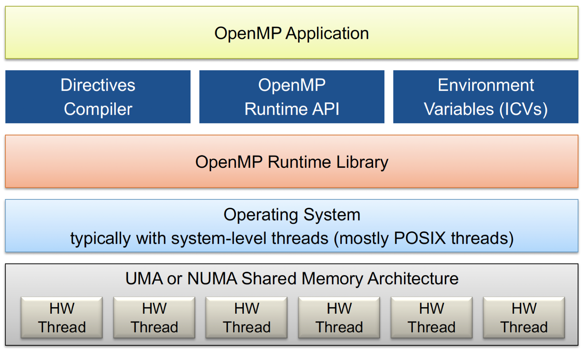

# OpenMP

## *intro*

### 实现TLP

现阶段很难做出自动并行的机器，其中难点在于：编译器不仅要弄清哪些操作之间是相互独立的，还要解决如何在并行环境中定位数据的棘手问题。编译器需要考虑的是整个代码，而非一个又一个的子程序。因此线程级并行需要程序员的参与。

共享内存中的一种并行方式是：程序员编写普通程序，并借助OpenMP向编译器发布何时并行或如何并行的指令。这种指明数据分布，并将并行问题留给编译器的方法是后面要介绍的 PGAS语言的基础。而在分布式内存 UMUA 中，程序员则需要通过MPI来管理一切。

### OpenMP的特点

Open Multi-Processing, OpenMP 是C和Fortran的一个扩展包，它的主要并行方法是采用编译器指令来指示循环的并行执行。OpenMP主要包括编译器指令 compiler directives、库例程 library routine（例程指的是一些预定义的代码片段）以及一些环境变量 environment variables。

OpenMP是基于线程的，它的特点是动态并行 dynamic parallelism：在代码的一个部分和另一个部分之间，并行运行的执行流的数量可以变化。**并行性是通过创建并行区域来声明的**，例如表明一个循环嵌套的所有迭代都是独立的，然后运行时系统将使用任何可用的资源。

OpenMP已成为一种广泛采用的并行编程模型和共享内存多核处理器的并行编程标准，受到了许多编程语言和编译器的支持。许多科学和工程应用程序、超级计算应用程序以及商业应用程序都使用OpenMP来充分利用多核计算机的性能。

### OpenMP的历史

* 起源：OpenMP的历史可以追溯到1997年，当时有几家公司和研究机构开始合作开发一种共享内存并行编程标准，以利用多核和多处理器系统的性能。最初的合作伙伴包括英特尔、Hewlett-Packard、IBM和美国国家能源研究科学计算中心（NERSC）等
* 第一个OpenMP标准：第一个OpenMP标准（OpenMP 1.0）于1997年发布，定义了一组指令和API，允许程序员通过在代码中插入特殊指令来指示并行性。这些指令使得程序能够在多个线程之间共享数据和计算任务
* 不断发展：随着多核处理器和并行计算需求的增加，OpenMP标准得到了不断发展和改进。后续版本如OpenMP 2.0、OpenMP 3.0和OpenMP 4.0引入了更多的功能，包括任务并行性、加速器支持、SIMD等
* OpenMP 4.5和OpenMP 5.0：OpenMP 4.5和OpenMP 5.0标准进一步扩展了OpenMP的功能，引入了更多的指令和API，以适应更复杂的并行计算任务。OpenMP 5.0还引入了支持机器学习和深度学习等新兴领域的功能

### OpenMP系统栈



### fork-join 模型


## *基础语法*

### demo

```c
#include <stdio.h>
#include <stdlib.h>
#include <omp.h>

void hello(void){
    int my_rank = omp_get_thread_num(); // 创建的线程组中的编号
    int thread_count = omp_get_num_threads(); // 创建的线程总数
    printf("Hello World from thread %d of %d.\n", my_rank, thread_count);
}

int main(int argc, char *argv[]) {
    int thread_count = strtol(argv[1], NULL, 10);
# pragma omp parallel num_threads(thread_count)
    hello();

    return 0;
}
```

引入 `<omp.h>` 库，编译的时候加上 `-fopenmp` 来开启OpenMP的编译器指令

### 编译器指令

所有的编译器指令以 `#paragma omp` 开头，比如parallel for的编译器指令为

```c
#pragma omp parallel for
```

### 共享和私有变量

在并行区外的变量默认是共享变量 shared variables，可以被所有线程使用；私有变量 private variables 只能被一条线程操作

```c++
int i；
float *a, *b, *c, tmp；
#pragma omp parallel for private(tmp)
for (i = 0; i < N; i++) {
	tmp = a[i] / b[i];
    c[i] = tmp * tmp;
}
```

Data sharing clauses 数据共享语句有如下

* `private(var-list)`：在var-list中的变量是私有的

  * 每一个线程都独自拥有变量的副本
  * 如果j被定义为私有变量，那么在for循环里面所有的线程都不能访问其他的j，尽管j本来是共享变量
  * 所有的线程都不会使用到先前的定义，比如说一开始tmp若被赋值为3，则进入并行块后会被按照内置类型初始化为0.0
  * 所有线程都不能给共享的赋值
  * 在循环的入口以及出口，都 不会进行定义，也就是说在并行块结束后不会对原来的变量产生影响

* `shared(var-list)`：在var-list中的是共享的。全局变量默认是shared

* `default(private | shared | none)`

  * 为一个并行区域的变量设置默认等级
  * 当设置为none的时候，若shared没有显式给出编译会报错

* `firstprivate(var-list)`：告诉编译器私有变量在**第一个循环**会继承共享变量的值，其他用法基本和private一样

* `lastprivate(var-list)`

  指定将线程中的一个或多个私有变量的值在并行处理结束后复制到主线程中的同名变量中，**负责拷贝的线程是执行最后一个for或sections的线程**

### 常用API

* `omp_get_num_threads()`：返回并行域中总线程的数量
* `omp_get_thread_num()`：返回当前工作的线程编号
* `omp_set_num_threads()`：设定并行域内开辟线程的数量
* `omp_get_wtime()`：openmp中自带的计时函数，用于检测并行优化效果

### 环境变量

OpenMP提供了一些环境变量，用来在运行时对并行代码的执行进行控制。这些环境变量也称为 internal control variables ICV

这些环境变量可以用来控制：设置线程数、指定循环如何划分、将线程绑定到处理器、启用/禁用嵌套并行，设置最大的嵌套并行级别、启用/禁用动态线程、设置线程堆栈大小、设置线程等待策略。常用的环境变量有：

* OMP_SCHEDULE：用于for循环并行化后的调度，它的值就是循环调度的类型
* OMP_NUM_THREADS：用于设置并行域中的线程数
* OMP_DYNAMIC：通过设定变量值，来确定是否允许动态设定并行域内的线程数
* OMP_NESTED：指出是否可以并行嵌套

## *并行区域*

### Parallel

并行区域会被显式给出，并通过ICV OMP_NUM_THREADS来设置线程数（即并行度）

```c
#pragma omp parallel [parameters]
{ /**/ }
```

### section

在一个并行区域中还可以再分组

```c
#pragma omp sections [parameters]
{
#pragma omp section
	{ /**/ }
#pragma omp section
	{ /**/ }
}
```

* sections在封闭代码的指定部分中，由线程组进行分配任务
* 每个独立的section都需要在sections里面
  * **每个section都是被一个线程执行的**
  * 不同的section可能执行不同的任务
  * 如果一个线程够快，该线程可能执行多个section
  * 完成任务的线程会在sections尾部同步屏障 barrier 处等待

下面看一个例子

```c
#pragma omp parallel shared(a,b,e,d) private(i)
{
#pragma omp sections
    {
#pragma omp section
        {
            for (i = 0; i < N; i++) {
                c[i] = a[i] + b[i];
            }
        }
#pragma omp section
        {
            for (i = 0; i < N; i++) {
                d[i] = a[i] * b[i];
            }
        }
    } /* end of sections */
} /* end of parallel block */
```

### nowait

以下是一个示例，演示了`nowait`的作用。假设有一个循环，需要计算两个数组 `A` 和 `B` 的元素之和，并且我们使用OpenMP并行化来加速这个计算

```c
int N = 100;
int A[N], B[N], result[N];

#pragma omp parallel for
for (int i = 0; i < N; i++) {
    A[i] = i;
    B[i] = 2 * i;
}

#pragma omp parallel for
for (int i = 0; i < N; i++) {
    result[i] = A[i] + B[i];
}

printf("Results:\n");
for (int i = 0; i < N; i++) {
    printf("%d + %d = %d\n", A[i], B[i], result[i]);
}
```

在这个示例中，我们有两个并行区域，一个用于初始化数组 `A` 和 `B`，另一个用于计算 `result` 数组。这两个并行区域没有使用`nowait`

执行结果可能如下所示：

```
Results:
0 + 0 = 0
1 + 2 = 3
2 + 4 = 6
3 + 6 = 9
...
```

这个示例中，第一个并行区域初始化数组 `A` 和 `B`，然后第二个并行区域计算 `result`。线程必须等待第一个并行区域完成后才能执行第二个并行区域，这会引入等待开销

现在，让我们使用`nowait`来改进第一个并行区域：

```c
// same
#pragma omp parallel for nowait
for (int i = 0; i < N; i++) {
    A[i] = i;
    B[i] = 2 * i;
}
// same
```

在第一个并行区域中，我们添加了`nowait`。现在，线程不必等待第一个并行区域完成，而可以立即执行第二个并行区域。

这意味着线程可以更充分地利用并行性，减少等待时间，提高性能。但要注意，`nowait`必须小心使用，以确保没有潜在的竞态条件。

## *循环分割工作*

### for相关

for的下面两种写法是等价的，但是第二种只有在当并行区内只有一个for的时候才能这么简化

```c
int main() {
	int a[100];
#pragma omp parallel
{
#pragma omp for
    {
		for (int i= 1; i<n;i++) a[i] = i;
	}
    // implicit barrier
}
```

```c
int main () {
	int a[100];
#pragma omp parallel for
	{
		for (int i= 1; i<n;i++) a[i] = i;
	}
}
```

它告诉编译器接下来的for循环，将会使用并行的方式执行，也就是说把for的任务分配给不同的线程。使用并行的时候需要满足以下四个需求：

* 在循环的迭代器必须是可计算的并且在执行前就需要确定迭代的次数

* For中的语句必须要以任何顺序执行
  * 在循环的代码块中不能包含break、return、exit

  * 在循环的代码块中不能使用goto跳出到循环外部

* 迭代器只能够被for语句中的增量表达式所修改

* 所有线程组的线程会在块尾隐式定义的 barrier 处同步，除非声明了nowait

OpenMP编译器不检查被parallel for指令并行化的循环所包含的迭代间的依赖关系。若一个或者更多个迭代结果依赖于其他迭代的循环，一般不能被正确的并行化

### 循环调度策略

Loop Scheduling Strategy 是一种用于在并行循环中分配迭代任务给线程的策略。这些策略控制了如何分割循环迭代任务到并行线程中，以求实现负载均衡和最佳性能。其语法格式为

```c
#pragma omp for schedule(type[, size])
```

循环调度策略 loop scheduling strategies 有

* `static` 静态调度

  静态调度将循环的迭代均匀地分配给不同的线程，即 round-robin fashion。每个线程获得一定数量的连续迭代。这在循环迭代的运行时间可预测且各迭代之间的工作负载相对均衡的情况下很有用

  chunk，即每个线程分配到的任务数默认是 `n/t`，其中n是for次数，t是线程数

  静态指的是当for启动之后chunk的分配是静态的

* `dynamic` 动态调度

  动态调度将迭代均匀分布给不同线程，但每个线程一次只处理一定数量的迭代，完成后运行时系统发现该线程变空了就再给他分配更多循环。这对于迭代之间的工作负载不均衡的情况很有用

  chunk的默认值为1，动态调整

* `guided` 引导调度

  引导调度类似于动态调度，但一开始分配给线程的迭代较多，然后几何级减少。这适用于工作负载不均衡且随时间变化的情况

* `auto` 自动调度

  它将迭代的分配交给编译器和运行时系统来决定，以尽量实现最佳性能。在这种情况下，编译器和运行时系统会根据工作负载的特性自动选择合适的调度策略，以确保负载均衡和性能优化

  编译器和运行时系统会考虑许多因素，包括迭代数量、迭代工作量、可用的CPU核心数量等

* `runtime` 运行时调度

  运行时根据控制变量来调整

## *数据同步*

### barrier

barrier是用于实现同步的一种手段，用于协调并行线程的执行。它会在代码的某个点，令线程停下直到所有的线程都到达该地方，从而确保在某一点上的所有线程都达到了同步点之后才能继续执行。

barrier非常有用，因为它允许线程在并行执行的某个地方同步，以确保协作并发操作。

* 每一个并行区域在末尾都有一个隐式的barrier，不过可以用nowait声明来关闭这个隐式的barrier

* 额外的barrier也可以显式给出

  ```c
  #pragma omp barrier
  ```

**barrier可能会引起负载不均衡，只有在必要的时候才用它！**比如说在debug的时候还是很有用的

### master & masked

master目前已经被废弃了，目前用的是masked

master/masked用来声明一个区域，在master中只有主线程 primary thread 可以执行，其他线程会跳过这个区域，也不会进行同步

```c
#pragma omp master // deprecated
	/**/
#pragma omp masked
	/**/
```

master/masked可能用于打印、IO

masked可以用来指定一些线程运行，其他线程会跳过这个区域，区域开始前也不会同步

```c
#pragma omp masked [filter(integer-expression)]
	/**/
```

* 可以用来指定主线程以外的线程来执行IO
* 可以用来和nowait搭配来制造一些大的并行区域

### single

```c
#pragma omp single [parameter]
	/**?
```

* 告诉编译器接下来紧跟的下段代码将只由**任意一个**线程执行， 和masked不同，masked可以指定哪一个或哪一些线程来执行，而single用哪一个则无法控制
* 它可能会在处理多段线程不安全代码时非常有用，比如说初始化数据结构
* single region尾是一个隐式的barrier：在不使用no wait选项时，在线程组中不执行single的线程们将会等待single的结束

### critical

声明临界区

```c
#pragma omp critical [(Name)]
	/**/
```

下面是一段示例，创建了两个临界区 MyCritialSection 用来执行++和AnotherCriticalSection 用来执行--。这两个临界区具有不同的名称，因此它们是相互独立的，多个线程可以同时进入不同名称的临界区

所有不具名的临界区会合并成同一个临界区

```c
int shared_variable = 0;
#pragma omp parallel
{
    int thread_id = omp_get_thread_num();
    // 使用 #pragma omp critical 来创建临界区
    #pragma omp critical (MyCriticalSection)
    {
        shared_variable++;  // 临界区中的操作是线程安全的
        printf("Thread %d incremented shared_variable to %d\n", thread_id, shared_variable);
    }
    // 可以创建多个不同名称的临界区
    #pragma omp critical (AnotherCriticalSection)
    {
        shared_variable--;
        printf("Thread %d decremented shared_variable to %d\n", thread_id, shared_variable);
    }
}
```

### atomic

```c
#pragma ATOMIC
	/*expression-stmt*/
```

### 运行时锁

OpenMP除了directive之外，还提供了一些运行时锁的API，他们基本和pthread的使用是一样的

锁的数据类型是 `omp_lock_t`

```c
omp_init_lock(&lockvar);              // initialize a lock
omp_destroy_lock(&lockvar);           // destroy a lock
omp_set_lock(&lockvar);               // set lock
omp_unset_lock(&lockvar);             // free lock
logicalvar = omp_test_lock(&lockvar); // check lock and possibly set lock
```

运行时锁支持nestable lock

### Odered Construct


### 规约

```c
reduction(operator:list)
```

在barrier的地方不仅需要同步数据，有时候还需要进行规约，规约就是把各个线程的数据聚合起来。规约的结果可以给主线程使用

在各个线程之间的规约有可能会有比较大的消耗，一般来说不会采用线性结构来做规约，而会采用树等结构来做。因此规约应该要被实现为OpenMP和MPI层次的操作

## *OpenMP的内存模型*


# Correctness

## *Data Races*

### 竞态的种类

### 竞态条件检测工具


问题：开销非常非常大导致debug时间非常非常久


100%可以确认写同样的值，但即使我们可以从语言层面上确定，但编译器的优化方式可能也会造成竞态条件。所以最好不要用，即使用了也要明确标出

## *Loop Dependencies*

### 依赖种类

和data race不同，数据依赖不一定就是坏事，有时候可以利用依赖来实现某些功能

## *Aliasing*

## *Loop Transformation*

### Loop Interchange

### Loop Distribution/Fission

### Loop Fusion

### Loop Alignment

# MPI

Message Passing Interface, MPI 消息传递接口库 顾名思义用于消息传递型的多处理器

MPI的接口大致可以分为

* 进程管理：包括查询并行环境和构建处理器的子集
* 点对点通信：一组用于两个进程之间进行交互的调用
* 集体调用：所有的处理器或者某个指定的处理器子集都会参与其中，比如广播调用

# CUDA

# OpenACC


