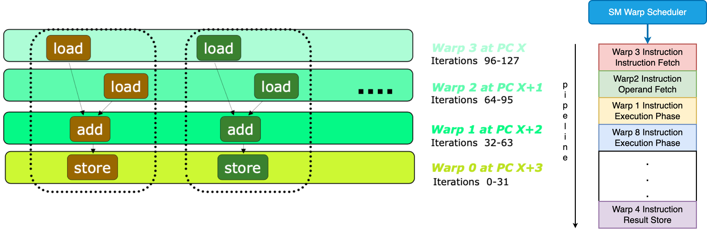

# OpenMP

## *intro*

### 实现TLP

现阶段很难做出自动并行的机器，其中难点在于：编译器不仅要弄清哪些操作之间是相互独立的，还要解决如何在并行环境中定位数据的棘手问题。编译器需要考虑的是整个代码，而非一个又一个的子程序。因此线程级并行需要程序员的参与。

共享内存中的一种并行方式是：程序员编写普通程序，并借助OpenMP向编译器发布何时并行或如何并行的指令。这种指明数据分布，并将并行问题留给编译器的方法是后面要介绍的 PGAS语言的基础。而在分布式内存 UMUA 中，程序员则需要通过MPI来管理一切。

### OpenMP的特点

Open Multi-Processing, OpenMP 是C和Fortran的一个扩展包，它的主要并行方法是采用编译器指令来指示循环的并行执行。OpenMP主要包括编译器指令 compiler directives、库例程 library routine（例程指的是一些预定义的代码片段）以及一些环境变量 environment variables。

OpenMP是基于线程的，它的特点是动态并行 dynamic parallelism：在代码的一个部分和另一个部分之间，并行运行的执行流的数量可以变化。**并行性是通过创建并行区域来声明的**，例如表明一个循环嵌套的所有迭代都是独立的，然后运行时系统将使用任何可用的资源。

OpenMP已成为一种广泛采用的并行编程模型和共享内存多核处理器的并行编程标准，受到了许多编程语言和编译器的支持。许多科学和工程应用程序、超级计算应用程序以及商业应用程序都使用OpenMP来充分利用多核计算机的性能。

### OpenMP的历史

* 起源：OpenMP的历史可以追溯到1997年，当时有几家公司和研究机构开始合作开发一种共享内存并行编程标准，以利用多核和多处理器系统的性能。最初的合作伙伴包括英特尔、Hewlett-Packard、IBM和美国国家能源研究科学计算中心（NERSC）等
* 第一个OpenMP标准：第一个OpenMP标准（OpenMP 1.0）于1997年发布，定义了一组指令和API，允许程序员通过在代码中插入特殊指令来指示并行性。这些指令使得程序能够在多个线程之间共享数据和计算任务
* 不断发展：随着多核处理器和并行计算需求的增加，OpenMP标准得到了不断发展和改进。后续版本如OpenMP 2.0、OpenMP 3.0和OpenMP 4.0引入了更多的功能，包括任务并行性、加速器支持、SIMD等
* OpenMP 4.5和OpenMP 5.0：OpenMP 4.5和OpenMP 5.0标准进一步扩展了OpenMP的功能，引入了更多的指令和API，以适应更复杂的并行计算任务。OpenMP 5.0还引入了支持机器学习和深度学习等新兴领域的功能

### OpenMP系统栈


## *OpenMP执行模型*

### fork-join 模型


OpenMP API 使用并行执行的 fork-join 模型。多个执行线程执行由 OpenMP 指令隐式或显式定义的任务。OpenMP API 旨在支持可以同时作为并行程序（多个执行线程和完整的 OpenMP 支持库）和顺序程序（指令被忽略且简单的 OpenMP 存根库）正确执行的程序。然而，符合规范的 OpenMP 程序可能会作为并行程序正确执行，但作为顺序程序不正确执行，或者在作为并行程序执行和作为顺序程序执行时可能产生不同的结果。此外，使用不同数量的线程可能会因数值操作的关联性变化而导致不同的数值结果。例如，串行加法规约可能具有不同的加法关联模式，而并行规约可能具有不同的关联模式。这些不同的关联可能会改变浮点加法的结果。

一个 OpenMP 程序开始时是一个单一的执行线程，称为初始线程 initial thread。初始线程按顺序执行，就好像遇到的代码是隐式任务区域 implicit task region的一部分，称为初始任务区域，该区域由整个程序周围的隐式并行区域生成。

执行整个程序周围的隐式并行区域的线程在主机设备上执行。实现可以支持除主机设备之外的其他设备。如果支持，这些设备可供主机设备用于 offload 代码和数据。每个设备都有自己的线程，与在另一个设备上执行的线程不同。**线程不能从一个设备迁移到另一个设备**。每个设备由设备编号 device number 标识。主机设备的设备编号是非主机设备的总数，而每个非主机设备都有一个唯一的设备编号，大于或等于零，小于主机设备的设备编号。此外，常量 `omp_initial_device` 可用作主机设备的别名，常量 `omp_invalid_device` 可用于指定无效的设备编号。符合规范的设备编号要么是小于或等于 `omp_get_num_devices()` 的非负整数，要么等于 `omp_initial_device` 或 `omp_invalid_device`。

### target

当遇到一个 target 构造块时，会生成一个新的 target 任务。target 任务区域包围着 target 区域。target 任务在 target 区域执行完成后才完成。

当一个 target 任务执行时，包围的 target 区域由一个初始线程执行。初始线程按顺序执行，就好像 target 区域是由隐式并行区域生成的初始任务区域的一部分。如果请求的目标设备可用且受支持，初始线程可能会在目标设备上执行。如果目标设备不存在或实现不支持它，与该设备关联的所有 target 区域都将在主机设备上执行。实现必须确保 target 区域的执行就好像它是在目标设备的数据环境中执行的，除非存在 if 子句并且 if 子句表达式评估为 false。

### teams Construct

`teams` construct 创建一个league of teams，其中**每个league是一个包含一个初始线程的初始团队，用来执行 teams 区域**。每个初始线程按序执行，就好像遇到的代码是由与每个团队相关的隐式并行区域生成的初始任务区域的一部分。初始线程是否并发执行 teams 区域是未指定的，依赖它们的并发执行以实现同步的程序可能会发生死锁。

如果一个构造块创建一个数据环境，数据环境在遇到构造块时创建。构造块的描述定义了它是否创建一个数据环境。

### parallel Construct

**当任何线程遇到一个 parallel 构造块时，线程会创建一个包括它自己的team，team中有零个或多个从它的到的额外线程**，initial threa会成为新团队的主线程 primary thread。一组隐式任务会生成，每个线程对应一个任务，任务的代码由 parallel 构造块内部的代码定义。每个任务分配给团队中的不同线程，并成为绑定的任务；也就是说，这些被分割成的子任务始终由最初分配给它的线程执行。正在执行遇到构造块的线程的任务区域被暂停，新团队的每个成员执行其隐式任务。在 parallel 区域的末尾有隐式barrier。只有主线程继续执行 parallel 构造块之后的代码，恢复在遇到 parallel 构造块时被暂停的任务区域。一个程序中可以指定任意数量的 parallel 构造块。

并行区域可以彼此嵌套。如果禁用了嵌套并行性，或者 OpenMP 实现不支持它，那么在parallel内部的线程如果遇到了一个嵌套的parallel construct，此时不会生成新的team，而是只包含自己这个线程。但如果支持并启用了嵌套并行性，那么新team可以由多个线程组成。一个 parallel 构造块可以包括一个 `proc_bind()` clause，以指定在 parallel 区域内的team中要使用的地方。

当任何团队遇到一个 worksharing construct 时，构造块内部的工作被分配给团队的成员，而不是由每个线程执行。在与 worksharing 构造块对应的任何区域的末尾发生隐式屏障，除非指定了 nowait 子句。对于没有指定 nowait 子句的 worksharing 构造块，代码被每个团队中的每个线程冗余执行，执行在 worksharing 构造块的末尾后继续。当任何线程遇到一个生成任务的构造块时，会生成一个或多个显式任务。显式生成的任务的执行分配给当前团队中的一个线程，取决于线程是否可以执行工作。因此，新任务的执行可能是立即的，也可能根据任务调度约束和线程可用性而延迟到稍后。线程允许在任务调度点暂停当前任务区域以执行不同的任务。如果被暂停的任务区域是绑定任务的任务区域，则最初分配的线程稍后恢复执行被暂停的任务区域。如果被暂停的任务区域是非绑定任务的任务区域，则任何线程都可以恢复执行它。在给定并行区域中完成所有显式任务的绑定在离开该区域末尾的隐式屏障之前是有保证的。可以通过使用任务同步构造块来指定给定并行区域的所有显式任务的子集完成。在程序退出时，隐式并行区域中的所有显式任务的完成是有保证的。

当任何线程遇到一个 simd construct 时，与construct相关的循环的迭代可以并行执行，使用线程可用的 SIMD 通道。

当遇到 loop construct 时，与construct 相关的循环的迭代在其遇到的线程的上下文中执行，根据其绑定区域的确定。如果循环区域绑定到 teams 区域，那么该区域由执行 teams 区域的主线程集合遇到。如果循环区域绑定到 parallel 区域，那么该区域由执行 parallel 区域的团队中的线程遇到。否则，该区域由单个线程遇到。

如果循环区域绑定到 teams 区域，那么遇到的线程可以在循环区域之后继续执行，而不必等待所有迭代完成；在 teams 区域结束之前，迭代完成是有保证的。否则，所有迭代必须在遇到的线程继续执行循环区域之后完成。遇到 loop 构造块的所有线程可以参与迭代的执行，但每个迭代只能由其中一个线程执行。

cancel 构造块可以改变 OpenMP 区域中已经描述的执行流程。cancel 构造块的效果取决于其 construct-type-clause。如果一个任务遇到一个带有 taskgroup construct-type-clause 的 cancel 构造块，那么任务会激活取消，并在其任务区域结束后继续执行，这意味着该任务完成。该任务组中的任何其他已经开始执行的任务将完成执行，除非它遇到了一个取消点构造块，在这种情况下，它将在其任务区域结束后继续执行，这意味着它完成。任务组区域中还没有开始执行的其他任务将被中止，这意味着它们完成。

对于所有其他 construct-type-clause 值，如果一个线程遇到 cancel 构造块，它会激活指定类型的最内部封闭区域的取消，然后线程会在该区域结束后继续执行。线程在取消点检查取消是否已激活，并如果是的话，也会在取消的区域结束后继续执行。

如果激活了取消，不论 construct-bype-Clause 如何，等待在除取消的区域末尾的隐式屏障之外的屏障内的线程将退出屏障并在取消的区域末尾继续执行。这个操作可能发生在其他线程达到该屏障之前。

当执行编译时错误终止时，效果就好像遇到了 sev-level 为 Eatal 和 action-time 为 compilation 的 error 指令。当执行运行时错误终止时，效果就好像遇到了 sev-level 为 Eatal 和 action-time 为 execution 的 error 指令。

OpenMP API 提供了同步构造块和库例程，用于协调并行区域中的任务和数据访问。此外，库例程和环境变量可用于控制或查询 OpenMP 程序的运行时环境。OpenMP 规范不保证在并行执行时相同文件的输入或输出是同步的。在这种情况下，程序员需要使用 OpenMP 同步构造块或库例程的帮助来同步输入和输出处理。对于每个线程访问不同文件的情况，程序员不需要同步访问。关于线程执行方面的基础语言定义的所有并发语义都适用于 OpenMP 线程，除非另有规定。


## *基础语法*

### demo

```c
#include <stdio.h>
#include <stdlib.h>
#include <omp.h>

void hello(void){
    int my_rank = omp_get_thread_num(); // 创建的线程组中的编号
    int thread_count = omp_get_num_threads(); // 创建的线程总数
    printf("Hello World from thread %d of %d.\n", my_rank, thread_count);
}

int main(int argc, char *argv[]) {
    int thread_count = strtol(argv[1], NULL, 10);
# pragma omp parallel num_threads(thread_count)
    hello();

    return 0;
}
```

引入 `<omp.h>` 库，编译的时候加上 `-fopenmp` 来开启OpenMP的编译器指令

### 编译器指令

所有的编译器指令以 `#paragma omp` 开头，比如parallel for的编译器指令为

```c
#pragma omp parallel for
```

### 共享和私有变量

在并行区外的变量默认是共享变量 shared variables，可以被所有线程使用；私有变量 private variables 只能被一条线程操作

```c++
int i；
float *a, *b, *c, tmp；
#pragma omp parallel for private(tmp)
for (i = 0; i < N; i++) {
	tmp = a[i] / b[i];
    c[i] = tmp * tmp;
}
```

Data sharing clauses 数据共享语句有如下

* `private(var-list)`：在var-list中的变量是私有的

  * 每一个线程都独自拥有变量的副本
  * 如果j被定义为私有变量，那么在for循环里面所有的线程都不能访问其他的j，尽管j本来是共享变量
  * 所有的线程都不会使用到先前的定义，比如说一开始tmp若被赋值为3，则进入并行块后会被按照内置类型初始化为0.0
  * 所有线程都不能给共享的赋值
  * 在循环的入口以及出口，都 不会进行定义，也就是说在并行块结束后不会对原来的变量产生影响

* `shared(var-list)`：在var-list中的是共享的。全局变量默认是shared

* `default(private | shared | none)`

  * 为一个并行区域的变量设置默认等级
  * 当设置为none的时候，若shared没有显式给出编译会报错

* `firstprivate(var-list)`：告诉编译器私有变量在**第一个循环**会继承共享变量的值，其他用法基本和private一样

* `lastprivate(var-list)`

  指定将线程中的一个或多个私有变量的值在并行处理结束后复制到主线程中的同名变量中，**负责拷贝的线程是执行最后一个for或sections的线程**

### 常用API

* `omp_get_num_threads()`：返回并行域中总线程的数量
* `omp_get_thread_num()`：返回当前工作的线程编号
* `omp_set_num_threads()`：设定并行域内开辟线程的数量
* `omp_get_wtime()`：openmp中自带的计时函数，用于检测并行优化效果

### 环境变量

OpenMP提供了一些环境变量，用来在运行时对并行代码的执行进行控制。这些环境变量也称为 internal control variables ICV

这些环境变量可以用来控制：设置线程数、指定循环如何划分、将线程绑定到处理器、启用/禁用嵌套并行，设置最大的嵌套并行级别、启用/禁用动态线程、设置线程堆栈大小、设置线程等待策略。常用的环境变量有：

* OMP_SCHEDULE：用于for循环并行化后的调度，它的值就是循环调度的类型
* OMP_NUM_THREADS：用于设置并行域中的线程数
* OMP_DYNAMIC：通过设定变量值，来确定是否允许动态设定并行域内的线程数
* OMP_NESTED：指出是否可以并行嵌套

## *并行区域*

### Parallel

并行区域会被显式给出，并通过ICV OMP_NUM_THREADS来设置线程数（即并行度）

```c
#pragma omp parallel [parameters]
{ /**/ }
```

### section

在一个并行区域中还可以再分组

```c
#pragma omp sections [parameters]
{
#pragma omp section
	{ /**/ }
#pragma omp section
	{ /**/ }
}
```

* sections在封闭代码的指定部分中，由线程组进行分配任务
* 每个独立的section都需要在sections里面
  * **每个section都是被一个线程执行的**
  * 不同的section可能执行不同的任务
  * 如果一个线程够快，该线程可能执行多个section
  * 完成任务的线程会在sections尾部同步屏障 barrier 处等待

下面看一个例子

```c
#pragma omp parallel shared(a,b,e,d) private(i)
{
#pragma omp sections
    {
#pragma omp section
        {
            for (i = 0; i < N; i++) {
                c[i] = a[i] + b[i];
            }
        }
#pragma omp section
        {
            for (i = 0; i < N; i++) {
                d[i] = a[i] * b[i];
            }
        }
    } /* end of sections */
} /* end of parallel block */
```

### nowait

以下是一个示例，演示了`nowait`的作用。假设有一个循环，需要计算两个数组 `A` 和 `B` 的元素之和，并且我们使用OpenMP并行化来加速这个计算

```c
int N = 100;
int A[N], B[N], result[N];

#pragma omp parallel for
for (int i = 0; i < N; i++) {
    A[i] = i;
    B[i] = 2 * i;
}

#pragma omp parallel for
for (int i = 0; i < N; i++) {
    result[i] = A[i] + B[i];
}

printf("Results:\n");
for (int i = 0; i < N; i++) {
    printf("%d + %d = %d\n", A[i], B[i], result[i]);
}
```

在这个示例中，我们有两个并行区域，一个用于初始化数组 `A` 和 `B`，另一个用于计算 `result` 数组。这两个并行区域没有使用`nowait`

执行结果可能如下所示：

```
Results:
0 + 0 = 0
1 + 2 = 3
2 + 4 = 6
3 + 6 = 9
...
```

这个示例中，第一个并行区域初始化数组 `A` 和 `B`，然后第二个并行区域计算 `result`。线程必须等待第一个并行区域完成后才能执行第二个并行区域，这会引入等待开销

现在，让我们使用`nowait`来改进第一个并行区域：

```c
// same
#pragma omp parallel for nowait
for (int i = 0; i < N; i++) {
    A[i] = i;
    B[i] = 2 * i;
}
// same
```

在第一个并行区域中，我们添加了`nowait`。现在，线程不必等待第一个并行区域完成，而可以立即执行第二个并行区域。

这意味着线程可以更充分地利用并行性，减少等待时间，提高性能。但要注意，`nowait`必须小心使用，以确保没有潜在的竞态条件。

## *循环分割工作*

### for相关

for的下面两种写法是等价的，但是第二种只有在当并行区内只有一个for的时候才能这么简化

```c
int main() {
	int a[100];
#pragma omp parallel
{
#pragma omp for
    {
		for (int i= 1; i<n; i++) a[i] = i;
	}
    // implicit barrier
}
```

```c
int main () {
	int a[100];
#pragma omp parallel for
	{
		for (int i= 1; i<n; i++) a[i] = i;
	}
}
```

它告诉编译器接下来的for循环，将会使用并行的方式执行，也就是说把for的任务分配给不同的线程。使用并行的时候需要满足以下四个需求：

* 在循环的迭代器必须是可计算的并且在执行前就需要确定迭代的次数

* For中的语句必须要以任何顺序执行
  * 在循环的代码块中不能包含break、return、exit

  * 在循环的代码块中不能使用goto跳出到循环外部

* 迭代器只能够被for语句中的增量表达式所修改

* 所有线程组的线程会在块尾隐式定义的 barrier 处同步，除非声明了nowait

OpenMP编译器不检查被parallel for指令并行化的循环所包含的迭代间的依赖关系。若一个或者更多个迭代结果依赖于其他迭代的循环，一般不能被正确的并行化

### 循环调度策略

Loop Scheduling Strategy 是一种用于在并行循环中分配迭代任务给线程的策略。这些策略控制了如何分割循环迭代任务到并行线程中，以求实现负载均衡和最佳性能。其语法格式为

```c
#pragma omp for schedule(type[, size])
```

循环调度策略 loop scheduling strategies 有

* `static` 静态调度，这是默认的调度方式

  静态调度将循环的迭代均匀地分配给不同的线程，即 round-robin fashion。每个线程获得一定数量的连续迭代。这在循环迭代的运行时间可预测且各迭代之间的工作负载相对均衡的情况下很有用

  chunk，即每个线程分配到的任务数默认是 `n/t`，其中n是for次数，t是线程数

  静态指的是当for启动之后chunk的分配是静态的

* `dynamic` 动态调度

  动态调度将迭代均匀分布给不同线程，但每个线程一次只处理一定数量的迭代，完成后运行时系统发现该线程变空了就再给他分配更多循环。这对于迭代之间的工作负载不均衡的情况很有用

  chunk的默认值为1，动态调整

* `guided` 引导调度

  引导调度类似于动态调度，但一开始分配给线程的迭代较多，然后几何级减少。这适用于工作负载不均衡且随时间变化的情况

* `auto` 自动调度

  它将迭代的分配交给编译器和运行时系统来决定，以尽量实现最佳性能。在这种情况下，编译器和运行时系统会根据工作负载的特性自动选择合适的调度策略，以确保负载均衡和性能优化

  编译器和运行时系统会考虑许多因素，包括迭代数量、迭代工作量、可用的CPU核心数量等

* `runtime` 运行时调度

  运行时根据控制变量来调整

## *数据同步*

### barrier

barrier是用于实现同步的一种手段，用于协调并行线程的执行。它会在代码的某个点，令线程停下直到所有的线程都到达该地方，从而确保在某一点上的所有线程都达到了同步点之后才能继续执行。

barrier非常有用，因为它允许线程在并行执行的某个地方同步，以确保协作并发操作。

* 每一个并行区域在末尾都有一个隐式的barrier，不过可以用nowait声明来关闭这个隐式的barrier

* 额外的barrier也可以显式给出

  ```c
  #pragma omp barrier
  ```

**barrier可能会引起负载不均衡，只有在必要的时候才用它！**比如说在debug的时候还是很有用的

### master & masked

master目前已经被废弃了，目前用的是masked

master/masked用来声明一个区域，在master中只有主线程 primary thread 可以执行，其他线程会跳过这个区域，也不会进行同步

```c
#pragma omp master // deprecated
	/**/
#pragma omp masked
	/**/
```

master/masked可能用于打印、IO

masked可以用来指定一些线程运行，其他线程会跳过这个区域，区域开始前也不会同步

```c
#pragma omp masked [filter(integer-expression)]
	/**/
```

* 可以用来指定主线程以外的线程来执行IO
* 可以用来和nowait搭配来制造一些大的并行区域

### single

```c
#pragma omp single [parameter]
	/**?
```

* 告诉编译器接下来紧跟的下段代码将只由**任意一个**线程执行， 和masked不同，masked可以指定哪一个或哪一些线程来执行，而single用哪一个则无法控制
* 它可能会在处理多段线程不安全代码时非常有用，比如说初始化数据结构
* single region尾是一个隐式的barrier：在不使用no wait选项时，在线程组中不执行single的线程们将会等待single的结束

### critical

声明临界区

```c
#pragma omp critical [(Name)]
	/**/
```

下面是一段示例，创建了两个临界区 MyCritialSection 用来执行++和AnotherCriticalSection 用来执行--。这两个临界区具有不同的名称，因此它们是相互独立的，多个线程可以同时进入不同名称的临界区

所有不具名的临界区会合并成同一个临界区

```c
int shared_variable = 0;
#pragma omp parallel
{
    int thread_id = omp_get_thread_num();
    // 使用 #pragma omp critical 来创建临界区
    #pragma omp critical (MyCriticalSection)
    {
        shared_variable++;  // 临界区中的操作是线程安全的
        printf("Thread %d incremented shared_variable to %d\n", thread_id, shared_variable);
    }
    // 可以创建多个不同名称的临界区
    #pragma omp critical (AnotherCriticalSection)
    {
        shared_variable--;
        printf("Thread %d decremented shared_variable to %d\n", thread_id, shared_variable);
    }
}
```

### atomic

```c
#pragma ATOMIC
	/*expression-stmt*/
```

### 运行时锁

OpenMP除了directive之外，还提供了一些运行时锁的API，他们基本和pthread的使用是一样的

锁的数据类型是 `omp_lock_t`

```c
omp_init_lock(&lockvar);              // initialize a lock
omp_destroy_lock(&lockvar);           // destroy a lock
omp_set_lock(&lockvar);               // set lock
omp_unset_lock(&lockvar);             // free lock
logicalvar = omp_test_lock(&lockvar); // check lock and possibly set lock
```

运行时锁支持nestable lock

### Odered Construct


### 规约

```c
reduction(operator:list)
```

在barrier的地方不仅需要同步数据，有时候还需要进行规约，规约就是把各个线程的数据聚合起来。规约的结果可以给主线程使用

在各个线程之间的规约有可能会有比较大的消耗，一般来说不会采用线性结构来做规约，而会采用树等结构来做。因此规约应该要被实现为OpenMP和MPI层次的操作

## *OpenMP的内存模型*


# Correctness

## *Data Races*

### 竞态的种类

Data Races 是指对多个线程对一个变量的未同步的、有冲突性的获取，至少有一个线程写了这个数据，可以分为 RAW、WAW、WAR三种情况

竞态有时候是很难发现的，即使是我们能确认自己的代码没有问题，但是当我们调用别人的代码，或者我们的代码被别人调用的时候可能也会有问题。比如说下面这种情况，问题在于我们不知道FMAX可能是怎么实现的，它是否有对变量多线程的写？

```c++
static double farg1,farg2;
#define FMAX(a,b) (farg1=(a),farg2=(b),farg1>farg2?farg1:farg2)

1619: #pragma omp parallel for shared(bar, foo, THRESH) 
1620: for (x=0; x<1000;x++)
1621: double T = FMAX(0.1111*foo*bar[x],THRESH); 
1622: <work with value T>
```

竞态可以是无害的，如果我们真100%可以确认写同样的值肯定是发生在多线程不同的时间段内。但即使我们可以从语言层面上确定，编译器的优化方式可能也会造成竞态条件。所以最好不要用，即使用了也要明确标出

### 竞态条件检测工具

以下是一些常用的工具

* Helgrind 是一款开源的运行时工具，基于valgrind工具包
* Intel Inspector 是intel开发工具的一部分
* Thread Sanitizer 是LLVM的静态工具
* Archer 结合了Thread Sanitizer和OpenMP语义

这些工具的原理大概是需要往代码中插入一些内容然后取追踪这些代码的走向，所以开销会非常非常大导致debug时间非常非常久

* Static and/or dynamic instrumentation of all memory accesses
* Tracking synchronization
* Detection of unsynchronized accesses to the same memory

## *Dependencies*

到底有没有形成数据依赖取决于循环之间的关系以及变量、array之间的关系。比如说下面这个循环可能存在依赖，因为我们不知道A和B数据之间是否有交叉

```fortran
Do i=1,n 
	A(i) = 5*B(i) + A(i)
Enddo
```

### 数据依赖

数据依赖在流水线冲突中已经介绍过了，也就是RAW、WAW、WAR三种情况

和data race不同，数据依赖不一定就是坏事，有时候可以利用依赖来实现某些功能

### 循环依赖

* Loop Independent Dependencies：依赖性只存在于单次iteration之间，没有跨iteration的依赖性。这种循环可以直接循环展开 loop unrolling 后并行执行

  ```c++
  for (i = 0; i < 4; i++) {
      b[i] = 8;         // Step 1
      a[i] = b[i] + 10; // Step 2
  }
  ```

* Loop Carried Dependencies：依赖性是跨越iteration的，在一个iteration中的数据依赖于另一个iteration的数据，这种循环无法并行展开执行

  ```c++
  for (i = 0; i < 4; i++) {
      b[i] = 8;           // Step 1
      a[i] = b[i-1] + 10; // Step 2
  }
  ```

## *Aliasing*

Aliasing就是多个变量实际指向的是同一个物理地址 

## *Loop Transformation*

### Loop Interchange

如果只有Loop Independent Dependencies可以安全地进行Loop Interchange，也就是调换嵌套循环的顺序

```c++
for (int i = 0; i < 10; i++) {
	for (int j = 0; j < 10; i++)  { // 调换j、k循环的顺序没有影响
		for (int k = 0; k < 10; i++) {
            A[i, j, k] = A[i, j, k] + B;
        }
    }
}
```

当有Loop Carried Dependencies，但是可以确保所有的依赖性中，数据更新的方向和interchange之前一样，则调换嵌套循环的顺序也是安全的

```c++
for (int i = 0; i < 10; i++) {
	for (int j = 0; j < 10; i++)  { // 调换j、k循环的顺序没有影响
		for (int k = 0; k < 10; i++) {
            A[i+1, j+2, k+3] = A[i, j, k] + B;
        }
    }
}
```

### Loop Distribution/Fission

将Loop Carried Dependencies分解为Loop Independent Dependencies。比如说下面这个Loop Carried Dependencies是很难并行化的

```c++
for (int i = 1; i < 10; i++) {
	a[i] = b[i] + 2;
    c[i] = a[i-1] * 2; // Loop Carried Dependencies
}
```

分解为两个独立的循环。这两个循环中间需要barrier同步数据，而且两个循环也会造成overhead

```c++
for (int i = 1; i < 10; i++) {
	a[i] = b[i] + 2;
}
for (int i = 1; i < 10; i++) {
    c[i] = a[i-1] * 2; 
}
```

### Loop Fusion

Loop Fusion就是Loop Distribution/Fission的反过程，合并后粒度上升，中间也不需要barrier了

```c++
for (int i = 1; i < 10; i++) {
	a[i] = b[i] + 2;
}
for (int i = 1; i < 10; i++) {
    c[i] = d[i+1] + a[i]; 
}
```

这两个循环合并后也不存在Loop Carried Dependencies，可以合并

```c++
for (int i = 1; i < 10; i++) {
   	a[i] = b[i] + 2;
    c[i] = d[i+1] + a[i]; 
}
```

下面这两个loop是无法合并的，因为 `a[i+1]` 读到的数据是要等整个 `a` 都更新完了才行，而如果是 `a[i-1]` 就可以合并

```c++
for (int i = 1; i < 10; i++) {
	a[i] = b[i] + 2;
}
// 不可以合并
for (int i = 1; i < 10; i++) {
    c[i] = d[i+1] + a[i+1]; 
}
// 可以合并
for (int i = 1; i < 10; i++) {
    c[i] = d[i+1] + a[i-1]; 
}
```

### Loop Alignment

Loop Alignment可以把Loop Carried Dependencies转换为Loop Independent Dependencies

```c++
for (int i = 1; i < 10; i++) {
	a[i] = b[i] + 2;
    c[i] = a[i-1] * 2;
}
```

这个循环实际上只要稍微shift错位后就可以完全并行化，不过要对第首位元素做一下特殊处理

```c++
c[2] = a[1] * 2;
for (int i = 2; i < 9; i++) {
	a[i] = b[i] + 2;
    c[i+1] = a[i] * 2;
}
a[9] = b[9] + 2;
```

# MPI

Message Passing Interface, MPI 消息传递接口库 顾名思义用于消息传递型的多处理器

MPI的接口大致可以分为

* 进程管理：包括查询并行环境和构建处理器的子集
* 点对点通信：一组用于两个进程之间进行交互的调用
* 集体调用：所有的处理器或者某个指定的处理器子集都会参与其中，比如广播调用

# GPU编程

## *Scaling*

Scaling指的是随着线程数的变化系统性能的变化

### Weak Scaling

Weak scaling是指令每个线程的problem size保持不变，HPC中最常用的scaling方式

负载和消耗的变化都不太大，sacling比较容易。但一些应用问题要保持problem size per thread不变会比较难

### Strong Scaling

强扩展性是指在增加计算资源（例如，处理器核心、计算节点）的情况下，保持问题的总规模不变，此时要改变问题的decomposition，或者说负载分配方式

Strong scaling在变得越来越重要，有些任务的problem size并不是一直在增长的，但对精确度、求解速度的要求越来越高

## *GPU编程概览*

### 多媒体API

GPU的API是一组允许软件与GPU进行通信和协作的软件函数和库，不过随着系统优化的深入，API也可以直接统筹管理高级语言、显卡驱动和底层汇编语言。以下是一些常见的GPU API

* 微软 DirectX 标准：DirectX是Microsoft开发的多媒体和图形API，主要用于Windows操作系统上的游戏和多媒体应用程序。它包括Direct3D用于3D图形渲染，以及其他组件用于音频、输入和网络等

  * Direct 3D & Dicrect 2D
  * DirectCompute 通用计算

* Khronos Group 标准

  > 科纳斯组织（Khronos Group）是一个开放、非营利的行业协会，致力于创建可免费使用的图形合成、虚拟现实、增强现实、视觉加速、并行计算和机器学习的开放API标准，使在各种平台和设备上的应用程序和中间件都能有效利用硬件加速。所有Khronos成员都能够在API公开发布前提出自己的意见、在规范制定初期得到草案并进行平台和应用程序测试。
  > 2006年7月31日，Khronos Group在SIGGRAPH上宣布得到OpenGL规范的控制权 -- wikipedia

  * OpenGL：OpenGL Open Graphics Library 开放图形库 是一种跨平台的图形API，用于2D和3D图形渲染。它提供了一套用于创建和管理图形对象、设置渲染状态以及执行渲染命令的函数。OpenGL是开放标准，因此可以在多个平台上使用
  * Vulkan：Vulkan是一个低级的跨平台图形API，旨在提供更高的性能和更好的多线程支持。它更接近硬件层，允许开发者更细粒度地控制GPU，但也需要更多的编程工作
  * OpenCL通用计算

* 其他标准

  * 苹果 Metal API
  * AMD Mantle API
  * Intel One API


### GPGPU 通用计算

GPU通用计算 General-Purpose Graphics Processing Unit 的核心思想是利用 GPU 的大规模并行处理能力来加速计算任务，尤其是那些可以分解为许多小任务的工作负载。为了在 GPU 上进行通用计算，开发者使用 GPU 编程框架和 API 来编写并行计算代码，这些框架和 API 提供了对 GPU 资源的访问以及任务分发和同步的机制。以下是一些用于 GPGPU 的常见 API 和框架

* CUDA Compute Unified Device Architecture：由NVIDIA开发的CUDA是GPGPU编程的一种流行框架。它允许开发者使用类C编程语言来编写通用计算代码，并在NVIDIA GPU上执行。CUDA 提供了丰富的库和工具，用于优化并行计算任务
* HIP Heterogeneous-Computing Interface for Portability：由 AMD 开发的 HIP 是一个类似于 CUDA 的框架，旨在实现跨供应商的移植性，使开发者能够在不同供应商的 GPU 上运行通用计算代码
* OpenCL Open Computing Language：OpenCL 是一个跨平台的 GPGPU 编程框架，允许在不同供应商的 GPU 上运行通用计算任务。它使用 C 样式的语言编写内核，并提供了广泛的设备支持
* OpenMP ：从OpenMP 4.0版本开始，它还引入了对GPU通用计算的支持，允许将OpenMP用于GPU加速的应用程序开发。加速器被视为 targets 和 devices
* OpenACC：脱胎于OpenMP
* DirectCompute：DirectCompute 是 Microsoft DirectX 的一部分，用于在 Windows 平台上进行通用计算。它允许开发者使用 HLSL（High-Level Shading Language）编写并行计算内核
* SYCL：SYCL 是一种基于 C++ 的编程模型，用于实现高性能并行计算，并在不同的硬件上运行。它允许开发者使用标准的 C++ 语言编写并行计算代码，然后将其映射到不同的加速器上，包括 GPU

## *GPU通用计算的特点*

GPU并不是一个独立运行的计算平台，而需要与CPU协同作工作，因此可以GPU可以看成是CPU的协处理器 coprocessor，因此当我们在说GPU并行计算时，其实是指的基于CPU+GPU的异构计算架构

在异构计算架构中，GPU与CPU通过PCle总线连接在一起来协同工作

CPU所在位置称为为主机端 host，而GPU所在位置称为设备端 device


# CUDA

cuda编程本身就对硬件依赖很大，不同的GPU架构必须要编写不同的代码，否则性能会下降很多甚至会出现负优化的情况

CUDA提供了对其它编程语言的支持，如C/C++、Python、Fortran等语言

## *CUDA程序层次结构*


CUDA的软件架构在逻辑上可以分为thread，block，gird。注意：thread，block，gird的设定是为了方便程序员进行软件设计和组织线程，是CUDA编程上的概念

* kernel在device上执行时实际上是启动很多线程，一个kernel所后动的所有线程称为一个网格 grid。同一个grid上的线程共享相同的全局内存空间。grid是线程结构的第一层
* Grid又可以分为很多线程块 block，一个线程块里面包含很多线程，这些线程运行在同一个SMP中。块不能太小以至于不能隐藏其调度开销，但是也不能太大，一般是128或256个线程（32的倍数）。block是第二层
* 一个block里的线程按顺序排成一个一维向量，每32个线程称为一个warp，是CUDA最小的调度单位。warp是第三层
* 单独的线程是第四层，线程是最小的逻辑单元

### 维度

grid、block和warp的维度对GPU内存调度有着重要影响。不同GPU架构，grid 和 block 的维度限制是不同的

grid 和 block 都是定义为dim3类型的变量。dim3可以看成是包含三个无符号整数 x, y, z 成员的结构体变量。在定义时缺省值初始化为1

grid和block 可以灵活地定义为1-dim、2-dim以及3-dim结构

定义的grid和block如下所示，kernel 在调用时也必须通过执行配置 `<<<grid, block>>>` 来指定kernel所使用的线程数及结构

```c++
// 1-dim 的 grid 和 block
dim3 grid(128,);
dim3 block(256);
kernel_fun<<< grid, block >>>(prams...);
// 2-dim 的 grid 和 block
dim3 grid(5, 4);
dim3 block(4, 3)
kernel_funs<< grid, block >>>(prams...);
// 3-dim 的 grid 和 block
dim3 grid(100, 100, 50);
dim3 block(16, 16, 4)
kernel_funs<< grid, block >>>(prams...);
```

### 各维度的排列顺序

一个线程需要两个内置的坐标变量 `(blockldx, threadldx)` 来唯一标识，它们都是dim3类型变量

* blockldx指明线程所在grid中的位置，blockidx同样包含三个值：`blockldx.x, blockldx.y, blockldx.z`
* threaldx指明线程所在block中的位置，threadldx包含三个值：`threadldx.x, threadldx.y, threadldx.z`


在内存中各个维度的排列是有顺序的：`X -> Y -> Z`

```c
lim3 grid(3, 2);
dim3 block(5, 3);
// block: (0, 0) -> (1, 0) -> (2, 0) -> (0, 1) -> (1, 1) -> (2, 1)
// thread: (0, 0) -> (1, 0) -> (2, 0) -> (3, 0) -> (4, 0) -> (0, 1) -> (1, 1) -> (2, 1) -> (3, 1) -> (4, 1) -> (0, 2) -> (1, 2) -> (2, 2) -> (3, 2) -> (4, 2)
```

处理矩阵的时候可以选择二维grid和block来对齐，而矢量就用一维的grid和block来对齐

### warp调度



Warp内的线程需要执行相同的指令

依靠硬件的warp调度器可以做到warp调度的零开销

## *CUDA编程模型*

在CUDA中，host和device是两个重要的概念。用host指代CPU及其内存，而用device指代GPU及其内存。CUDA程序中既包含host程序，又包含device程序，它们分别在CPU和GPU上运行。host与device之间可以进行通信，这样它们之间可以进行数据拷贝

### CUDA程序执行流程

1. 分配host内存，并进行数据初始化
2. 分配device内存，并从host将数据拷贝到device上
3. 调用CUDA的核函数在device上完成指定的运算
4. 将device上的运算结果拷贝到host上（性能）
5. 释放device和host上分配的内存

### CUDA的函数类型限定符

GPU是异构模型，所以需要区分host和device上的代码，在CUDA中是通函数类型限定词开区别host和device上的函数，主要的三个函数类型限定词如下：

* `__global__ void func()`
  * 在device上执行，从host中调用（一些特定的GPU也可以直接从device上调用）。返回类型必须是void，不支持可变参数参数，不能成为类成员函数
  * 注意用 `__global__` 定义的kernel是异步的，这意味着host不会等待kernel执行完就会执行下一步
* `__device__`：在GPU device上执行，但是仅可以从device中调用，不可以和 `__global__` 同时使用
* `__host__`：在host上执行，也仅可以从host上调用，一般省略不写。不可以和 `__global__` 同时使用，但可以和 `__device__` 同时使用，此时函数在host和device上都会编译

### 核函数

上面流程中最重要的一个过程是调用CUDA的核函数来执行并行计算

核函数 kernel 是CUDA 中一个重要的概念，kernel 是 在device 上线程中并行执行的函数

核函数用 `__global__` 符号声明，在调用时需要用 `<<<grid, block>>>` 来指定kernel要执行的线程数量。用 `__global__` 声明的核函数必须要返回void

在CUDA中，每一个线程都要执行核函数，并且每个线程会分配一个唯一的线程是thread ID，这个ID值可以通过核函数的內置变量threadldx来获得

```c++
// Kernel定义
__global__ void vec_add(double *x, double *y, double *z, int n) {
	int i= get_tid(); // user-defined macro/function
	if(i < n) z[i] = x[i] + y[i];
}
int main() {
    int N = 1000000; // 1M
	int bs = 256;
	int gs = (N + bs - 1) / bs; // 向上取整
	// kernel, call GPU
	vec_add<<<gs, bs>>>(x, y, z, N);
}
```

## *GPU的内存*

## *CUDA工具*

### 编译器

nvcc（C/C++）
### 调试器

nvcc-gdb
### 性能分析

nsight, nvprof
### 函数库

cublas, nvblas, cusolver, cufftw, cusparse, nvgraph

# OpenMP用于GPU编程

OpenMP在4.0后加入了对GPU通用计算编程的支持

## *team construct*

### 使用

* Team只能嵌套在显式声明的并行区域或者**在target中使用**。如果是在嵌套在target中，此时target不能有任何在target中但在team外的语句

### Offloading

和CUDA的异构编程模型一样，OpenMP也是Host-centric，默认是在host上运行。需要offloading到device上运行代码。所谓offloading就是CUDA中的转移到device上运行

用target来声明要offloading的运算

```c++
int N=100;
double b[N]. c[N];
double a = 1.2;
for (int i = 0; i < N; i++) b[i] = (double)(i); 
#pragma omp target map(a, b, c)
{
for(int i=0; i<N; i++) c[i] = a * b[i];
}
```

map是offloading特有的变量类型，适用于separate memory，shared不允许在separate memory中使用

### team & parallel

Parallel 生成一组并行线程，而team则是生成一组parallel

## *parallel Construct*

### 语义

当一个线程遇到一个并行构造块时，将创建一个team of threads来执行并行区域。遇到并行构造块的线程成为新团队的主线程，在新的并行区域期间，其线程编号为零。新团队中的所有线程，包括主线程，都执行该区域。一旦team创建，team中的线程数量在该并行区域的持续时间内保持不变。

在并行区域内，线程编号唯一标识每个线程。线程编号是从主线程的零到团队中线程数量减一的连续整数。线程可以通过调用 `omp_get_thread_num` 库例程来获得自己的线程编号。

Encountering thread 生成的一组隐式任务的数量等于团队中线程的数量。并行构造块的结构化块确定了每个隐式任务中将执行的代码。每个任务分配给团队中的不同线程，并变为绑定任务。Encountering thread 正在执行的任务区域被暂停，团队中的每个线程执行其隐式任务。每个线程可以执行与其他线程不同的语句路径。在最终恢复执行隐式任务之前，实现可能会导致任何线程在任务调度点暂停执行，切换到团队中的任何线程生成的任何显式任务的执行。

在并行区域的末尾有一个隐式barrier。在并行区域结束后，只有团队的主线程会恢复执行封闭任务区域。

如果正在执行并行区域的团队中的线程遇到另一个并行指令，它将根据第10.1.1节中的规则创建一个新团队，并成为该新团队的主线程。

如果一个线程在执行并行区域时终止，所有团队中所有线程的执行都会终止。线程终止的顺序是未指定的。在任何barrier之前完成的所有工作都是有保证的。在线程通过最后一个barrier后的每个线程的工作量是未指定的。

### 执行模型

并行开始事件发生在遇到并行构造块的线程中，位于相应并行区域创建任何隐式任务之前。 在每个隐式任务创建时，在执行隐式任务的线程中会发生隐式任务开始事件，该事件发生在隐式任务完全初始化后，但在线程开始执行并行构造块之前。 如果并行区域创建了本机线程，那么本机线程开始事件会作为新线程上下文中的第一个事件发生在隐式任务开始事件之前。 与隐式屏障相关的事件发生在并行区域结束时。第15.3.2节描述了与隐式屏障相关的事件。 当线程完成一个隐式任务时，隐式任务结束事件发生在线程中，该事件发生在与隐式任务中的隐式屏障同步相关的事件之后。 并行结束事件发生在遇到并行构造块的线程中，该事件发生在线程执行其隐式任务结束事件之后，但在线程恢复执行遇到的任务之前。 如果在并行区域结束时销毁了本机线程，本机线程结束事件会发生在线程销毁之前的最后一个事件。

## *teams Construct*

### 语义

当线程遇到 teams construct 时，将创建一个league of teams。每个team都是一个initial team，每个team中的初始线程执行 teams 区域。创建的teams数量根据 `if` 和 `num_teams` clause来确定。一旦team被创建，initial team的数量在 teams 区域的持续时间内保持不变。在 teams 区域中，inital team编号唯一标识每个初始团队，这个编号是从零到小于初始团队数量的连续整数。

如果 teams construct 上存在`if`子句，并且`if`子句的表达式评估为`false`，则创建的团队数量为一个。在`teams`构造的`if`子句表达式中使用变量会导致对该变量的隐式引用，该引用在所有封闭的构造块中都存在。`if`子句表达式在`teams`构造之外的上下文中进行评估。

如果 teams construct 上没有出现`thread_limit`子句，但该构造紧嵌套在一个具有指定`thread_limit`子句的 target construct 内，那么行为就好像也为`teams`构造指定了该`thread_limit`子句。

在包括 target construct 和 teams construct 的组合或复合构造中，`num_teams`和`thread_limit`子句中的表达式在进入 target construct 构造时**在主机设备上进行评估**。

由遇到线程的`place-partition-var` ICV 给出的位置列表以一种实现定义的方式分割，并通过将其初始线程的`place-partition-var`设置为子分区，将每个团队分配给一个子分区。

 teams construct 将每个初始线程的`default-device-var` ICV 设置为一个实现定义的值。

在团队完成`teams`区域的执行之后，遇到的任务继续执行封闭任务区域。


若 `num_teams()` clause未定义，默认的 league of teams = 1 ？？

## *target Construct*

target construct提供了 target data 指令提供的功能的超集，除了 `use_device_ptr` 和 `use_device_addr` clause。target construct 添加的功能是包含在设备上执行的可执行区域。target construct 生成一个目标任务。生成的任务区域包围目标区域。如果存在depend clause，则与目标任务关联。device clause确定目标区域在哪个设备上执行。如果存在nowait子句，目标任务的执行可能会延迟。如果不存在nowait子句，则目标任务是一个包含的任务。 

所有clause在遇到目标构造时都会进行评估。目标任务的数据环境根据目标构造上的数据共享和数据映射属性子句、每个数据环境的ICV以及适用于目标构造的默认数据共享属性规则创建。如果目标构造映射了一个变量或变量的一部分，并且在构造中没有出现在 in_reduction clause 的列表项中，那么该变量在目标任务的数据环境中具有共享的默认数据共享属性。与映射变量相关的赋值操作发生在目标任务执行时。 如果使用ancestor device-modifier指定了device子句，则遇到的线程会在恢复之前等待父设备上的目标区域完成。对于在同一构造上的map子句中出现的任何列表项，如果相应的列表项存在于父设备的设备数据环境中，则将其视为具有正无穷大的引用计数。 当存在if子句并且if子句表达式评估为false时，效果就好像存在一个设备子句，指定omp_initial_device作为设备号，而不管指令上的任何其他设备子句。如果一个过程在一个不指定ancestor device-modifier的设备子句中明确或隐含地引用在目标构造中，则该过程被视为其名称出现在declare target指令的enter子句中一样。 如果在不指定ancestor device-modifier的设备子句中声明了具有静态存储期的变量，则命名变量被视为在declare target指令的enter子句上出现。

## *distribute Construct*

distribute Construct指定一个或多个循环的迭代将由上下文中的初始团队的隐式任务执行。这些迭代在执行分发区域绑定的初始团队的所有初始线程之间分布。

在分发区域的结束处不会发生隐式屏障。为了避免数据竞争，由于 `lastprivate` 子句而被修改的原始列表项不应在分发构造的结束和分发绑定的团队区域的结束之间访问。

如果未指定 `dist_schedule` 子句，则调度是实现定义的。

在每个逻辑迭代的开始，每个关联循环的循环迭代变量或由 `range-decl` 声明的变量具有它在顺序执行关联循环集合时的值。

调度是可重现的，如果以下条件之一为真：

* 使用可重现的修饰符指定了 `order` 子句；或者
* 使用 `dist_schedule` 子句指定了 `static` 作为 `kind` 参数，且 `order` 子句未使用不受限制的 `order-modifer`。

## *map*

### DDE

### map类型


Teams construct 只是生成了league of teams

需要要distribute来分发

否则就是在league of teams 之间round-robin


```c++
 #pragma omp target map(tofrom: a[0:datasetSize]) map(to: b[0:datasetSize], c[0:datasetSize], d[0:datasetSize])
    #pragma omp teams distribute
    for (unsigned long j = 0; j < repetitions; ++j)
    {
        #pragma omp parallel for schedule(static, 2)
        for (unsigned long i = 0; i < datasetSize; ++i)
        {
            a[i] = b[i] + c[i] * d[i];
        }
    }
    #pragma omp target exit data map(from : a[0 : datasetSize]) map(delete: b[0:datasetSize], c[0:datasetSize],d[0:datasetSize])
```


