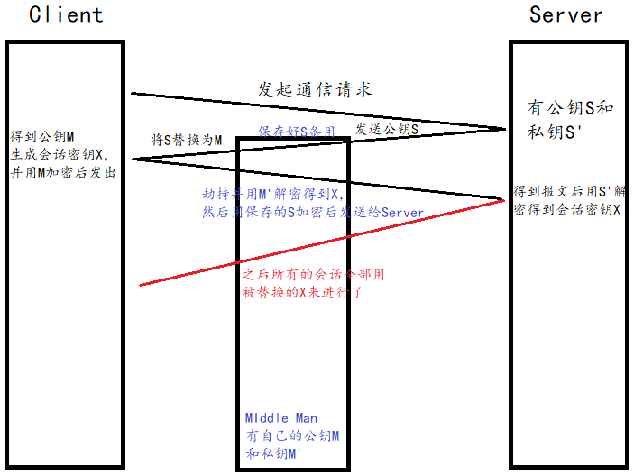

# Introduction

## *基本概念*

### 密码学术语

当某个人向另一个人发送信息时，发出信息的人称为**发送者 sender**，收到信息的人称为**接受者 receiver**，被发送的信息有时也统称为**消息 message**。在中转过程中信息被第三方盗取的过程称为**窃听 eavesdropping**

**密码技术 cryptography** 可以在一定程度上保证信息的**机密性 confidentiality**。**加密 encrypt** 之前的信息称为**明文 plaintext**，加密之后的信息称为**密文 ciphertext**，接受者需要对秘闻进行**解密 decrypt** 之后再阅读，即将密文恢复为明文

接受者以外的其他人试图将密文还原为明文的过程称为**密码破译 cryptanalysis**，也称为密码分析

### 密码与信息安全常识

* **不要使用保密的密码算法**。因为密码算法本身迟早是会被暴露的，那么一旦密码算法的信息被暴露，依靠对密码算法本身进行保密来确定保密性的密码系统也就失效了
* 使用低强度的密码比不进行任何加密更危险
* 任何密码总有一天都会被破解（除了one-time pad，但它的实际应用是不现实的）
* 密码知识信息安全的一部分，往往人类本身才是安全环节上最薄弱的一环

### 密码算法与密钥

从明文生成密文的步骤，即加密步骤称为加密算法；而解密步骤称为解密算法。加密+解密统称为密码算法

密码算法需要**密钥 Key**

* **对称密码 symmetric cryptography** 是指在加密和解密时使用同一种密码
* **公钥密码 public-key cryptography/非对称密码 asymmetric cryptography** 是指在加密和解密时使用不同的密码
* **混合密码系统 hybrid cryptosystem**：将对称密码和公钥密码结合起来

### 其他密码技术

* 单向散列函数 one-way hash function 并不是用来保证机密性，而是用来保证**完整性 integrity**，也就是说防止伪造、篡改
* 消息认证码
* 数字签名
* 伪随机数生成器

## *历史上的密码*

### 凯撒密码 Caesar cipher

凯撒密码通过将明文中所使用的字母表按照一定的字数**平移**来进行加密。凯撒密码的算法就是字母平移操作，而平移的字母数量就相当于是密钥。凯撒密码的解密过程是使用与加密时相同的密钥进行反向的平移操作

将所有可能的密钥全部尝试一遍来破译密码的方法称为**暴力破解 brute-force attack**，由于这种方法的本质是从所有的密钥中找出正确的密钥，因此又称为穷举搜索 exhaustive search。对于凯撒密码来说，它的**密钥空间 keyspace**是很小的，只有26个，因此比较容易进行暴力破解

### 简单替换密码

简单替换密码 simple substitution cipher 是将字母表中的字母分别重新建议1对1的映射关系，密钥是替换表

简单替换密码的密钥空间非常大，为 $26!$ 个可能性，因此不可能用暴力破解来穷举破译。可以使用**频率分析**的密码破译方法

### Enigma

# 对称密码

## *无法被破译的一次性密码本*

### 加密与解密

**一次性密码本 one-time pad** 的原理是将明文与一串与明文等长的随机比特序列进行**XOR异或运算**

根据对一个式子连续两次异或运算会得到原式的性质，解密的过程就是将密文与密钥再进行一次异或运算

### 无法被破译

## *DES*

## *AES*

# 分组密码

## *分组密码的模式*

### 分组密码与流密码

### 模式 mode

* ECB模式 Electronic CodeBook mode 电子密码本模式
* CBC模式 Cipher Block Chaining mode 密码分组链接模式
* CFB模式 Cipher FeedBack mode 密文反馈模式
* OFB模式 Output FeedBack mode 输出反馈模式
* CTR模式 CounTeR mode 计数器模式

### 明文分组与密文分组

# 公钥密码

## *公钥的出现*

### 密钥配送问题

在对称密码中，由于加密和解密的密钥是相同的，因此发送者必须同时向接受者发送密文和对称密钥。处于对隐蔽式安全性 security by obscurity 的顾虑，密码算法本身是公开的，因此窃听者可以通过劫持同时拦截得到密文和密钥进行解密。这一问题被称为密钥配送问题 key distribution problem

解决密钥配送问题的方法主要有以下两种

* Diffie-Hellman 密钥交换
* 公钥密码

### 公钥密码

发送者用公钥 public key 对明文进行加密后发送密文，然后接收者用私钥 private key进行解密

公钥和私钥是一一对应的，一对公钥和私钥称为密钥对 key pair。由公钥进行加密的密文，必须要使用与该公钥**配对**的私钥才能进行解密。也可以反过来，用私钥加密，公钥解密。密钥对中的两个密钥之间具有非常密切的关系（通过某种算法生成），因此私钥和密钥是不能分别单独生成的

### 公钥通信流程

在公钥通信过程中，通信过程是由接收者B来启动的

1. 接受者B生成一个包含公钥和私钥的密钥对
2. B将自己的公钥发送给发送者A
3. A用B的公钥将明文加密为密文
4. A将密文发送给B
5. B用自己的私钥解密密文

## *RSA*

RSA（Ron Rivest-Adi Shamir-Leonard Adleman）是一种公钥密码算法，可以用于公钥密码和数字签名

### RSA加密

$$
ciphertext=plaintext^E\mod{N}
$$

将明文和自己做 $E$ 次乘法，然后将其结果除以 $N$ 求余数，余数就是密文。$E$ 和 $N$ 的组合 $\left\{E,N\right\}$ 就是公钥 

### RSA解密

$$
plaintext=ciphertext^D\mod{N}
$$

将密文和自己做 $E$ 次乘法，然后将其结果除以 $N$ 求余数，余数就是密文。$N$ 和加密时的数字一样。$D$ 和 $N$ 的组合 $\left\{D,N\right\}$ 就是私钥

### 生成密钥对

下面是具体如何求 $N$、$E$ 和 $D$ 的过程

1. 求 $N$

   准备两个很大的质数 $p$ 和 $q$。$p$ 和 $q$ 太小的话，密码会变得容易破译，但太大话计算时间又会变得很长。 $N=p\times q$

2. 求 $L$（仅仅在生成密钥对的过程中使用）

   $L$ 是 $p-1$ 和 $q-1$ 的最小公倍数 least common multiple。$L=lcm(p-1,q-1)$

3. 求 $E$

   $E$ 是一个比1大，比 $L$ 小的数。此外，$E$ 和 $L$ 的最大公约数 greatest common divisor gcd 必须为1。之所以要有这个限制条件，是为了保证一定存在 $D$ 存在

4. 求 $D$
   $$
   1<D<L\\\left(E\times D\right)\mod{L}=1
   $$

### 利用RSA算法本身的性质破译

已知密文、公钥 $\left\{E,N\right\}$，求 $D$ 或 $p$、$q$ 和 $L$

* 通过密文来求明文：因为有取模，而没有求离散对数的高效算法，所以无法破译
* 通过暴力破解求出 $D$：$D$ 很长，算力要求过高
* 通过 $E$ 和 $N$ 求出 $D$：不能泄露 $p$ 和 $q$
  * 对 $N$ 进行质因数分解攻击：一旦发现了对大整数进行质因数分解的高效算法，RSA就能够被破译
  * 通过推测 $p$ 和 $q$ 进行攻击：若使用的伪随机数生成器的算法很差，那么就有可能被破译

## *其他公钥密码*

### EIGamal方式

### Rabin方式

### 椭圆曲线密码

## *公钥存在的问题*

### 只使用一对密钥对

鉴于非对称加密的机制，若服务器（发送者）先把公钥以明文方式传输给浏览器（接收者），之后浏览器向服务器传数据前都先用这个公钥加密好再传，从客户端到服务器信道似乎是安全的（其实也存在着中间人攻击等安全问题），因为只有服务器有相应的私钥能解开公钥加密的数据

但是我们无法保证反向传输信道的安全，因为发送者只有一个公钥，所以服务器只能用自己的私钥来加密。但是知道公钥信息的还有窃听者，此时信息就泄漏了

### 使用两对密钥对

未解决反向信道不安全的问题，可以考虑使用两对密钥对。双方都持有不同的私钥，但是这样效率是很低的（非对称密钥的计算比对称密钥计算缓慢数百倍）。而且仍然无法克服中间人攻击的问题

## *混合密码系统*

为了应对使用两对密钥对时的低效问题，使用结合了对称密码和公钥密码优势的混合密码系统 hybrid cryptosystem

### 混合密码系统的通信流程

核心思想是用**公钥来加密对称密钥**

* 服务端具有非对称公钥 $S$ 和私钥 $S'$
* 客户端发起https请求，获取服务端公钥 $S$
* 客户端在本地生成对称密钥 $C$（称为**会话密钥**），通过公钥 $S$ 加密，发送给服务器
* 因为窃听者没有私钥，即使截获了数据，也无法还原出内部的原文 $C$，也就无法获取到对称密钥
* 服务器通过私钥 $S'$ 解密，还原出客户端发送的对称密钥 $C$，并且使用这个对称密钥加密给客户端返回的响应数据
* 之后客户端和服务器的通信都**只用对称加密**，由于该密钥只有客户端和服务器两个主机知道，其他主机/设备不知道密钥即使截获数据也没有意义。而且只用对称密钥通信效率也很高

### 提高混合密码系统的机密性

* 会话密钥 session key $C$ 是指为本次通信而生成的临时密钥，它一般是通过伪随机数生成器产生的。因此提高伪随机数生成器的质量可以提高混合密码系统的机密性
* 使用高强度的对称密码算法和公钥密码系统
* 混合密码系统同时使用了对称密码和公钥密码两种密码，无论其中任何一方的密钥过弱，都容易受到集中攻击，因此对称密码和公钥密码的密钥长度必须具备同等强度。但**考虑到长期使用的情况，公钥密码的强度应该要高于对称密码**，因为会话密钥只是一次性的密钥，容易更换，但用于加密会话密钥的公钥一旦被攻破，那将会威胁到过去到未来的所有通信内容

## *中间人攻击 Man-in-the MiddleAttack*

中间人攻击是广义的对利用公钥密码（包括使用1对公钥、2对公钥和混合密码系统）的漏洞对密码系统进行的攻击

1. 服务器具有非对称加密算法的公钥 $S$，私钥 $S'$
2. 中间人具有非对称加密算法的公钥 $M$，私钥 $M'$
3. 客户端向服务器发起请求，服务器明文传送公钥 $S$ 给客户端
4. **中间人劫持数据报文，提取公钥 $S$ 并保存好，然后将被劫持报文中的公钥 $S$ 替换成为自己的公钥 $M$，并将伪造报文发给客户端**
5. 客户端收到报文，提取公钥M（Client不知道公钥被更换过了），自己形成对称秘钥 $X$，用公钥 $M$ 加密 $X$，形成报文发送给服务器
6. 中间人劫持后，直接用自己的私钥 $M'$ 进行解密，得到通信秘钥 $X$，再用曾经保存的服务端公钥 $S$ 加密后，将报文推送给服务器
7. 服务器拿到报文，用自己的私钥 $S'$ 解密，得到通信秘钥 $X$
8. 双方开始采用 $X$ 进行对称加密，进行通信。但是一切都在中间人的掌握中，劫持数据，进行窃听甚至修改，都是可以的

问题的本质在于客服端无法确定收到的含有公钥的数据报文是从目标服务器发送过来的，因此**解决中间人攻击的方法就是对公钥进行认证，即证书**

## *DH密钥交换*

DH密钥交换 Diffie-Hellman key exchange /DH key aggrement 是应对密钥配送问题的一个方法

# 单向散列函数

当需要比较两条信息是否一致时，不必直接比较信息本身的内容，只要对比他们的“指纹”就行了

## *单向散列函数*

单向散列函数 one-way Hash function 有一个输入和一个输出，其中输入称为消息 message，输出称为散列值 Hash value，单向散列函数可以根据消息的内容计算出散列值，而散列值可以被用来检查信息的完整性

单向散列函数也被称为**消息摘要函数 message digest function**、哈希函数或者杂凑函数

> 单向散列函数中的“散列”的英文“hash”以此，原意是古法语中的“斧子”，后来被引申为“剁碎的肉末”，也许是用斧子一通乱剁再搅在一起的那种感觉吧。单向散列函数的作用，实际上就是将很长的消息剁碎，然后再混合成固定长度的散列值--图解密码技术（第三版）

输入单向散列函数的消息也称为**原像 pre-image**。输出的散列值也称为**消息摘要 message digest 或者指纹 fingerprint**

### 单向散列函数的性质

* 根据**任意长度**的信息计算出**固定长度**的散列值
* 能够快速计算出散列值
* 消息不同散列值也不同：散列函数的输入即使变动极小，比如说只有1个比特位的变动，也会有很高的概率产生完全不同的输出
  * 两个不同的消息产生同一个散列值的情况称为碰撞 collision
  * 难以发现碰撞的性质称为抗碰撞性 collision resistance。密码技术中锁使用的单向散列函数都需要具备抗碰撞性
    * 弱碰撞性：给定一条信息，必须确保要找到和该条消息具有相同散列值的另外一条消息是非常困难的
    * 强碰撞性：找到与**任意**的一条信息具有相同散列值的另外一条信息是非常困难的
* 单向性：无法通过散列值**反算**出消息的性质

### 单向散列函数的实际应用

* 检查软件是否被篡改
* 基于口令的加密 Password Based Encryption PBE
* 消息认证码
* 数字签名
* 伪随机数生成器
* 一次性口令 one-time password
* 网盘中的秒传功能利用了消息摘要来检查是否有重复文件

### 单向散列函数

[CRYPTREC | CRYPTREC Ciphers List](https://www.cryptrec.go.jp/en/list.html)

* MD4、MD5：MD是 Message Digest的缩写，都能产生128比特的散列值，但它们的强碰撞性都已经被攻破了，不再被使用
* SHA-1、SHA-256、SHA-384、SHA512
  * SHA-1的碰撞性已经被攻破，除了用于对过去生成的散列值进行检验之外，不应该再被使用
  * SHA-2总共有6种版本，比如SHA-256等。仍然安全，可以使用

* RIPEMD-160：在比特币中被使用
* SHA-3：Keccak算法是SHA-3的标准

## *Keccak*

## *对单向散列函数的攻击*

### 暴力破解

与密码系统相比，单向散列函数的输入就相当于是明文，对它的暴力破解就是每次更改明文的某一部分信息，然后看是否得到产生了碰撞。以文本为例，比如增加一个空格，或者微调一下文本的颜色等

**目标是找到与原信息具备相同散列值的另一条消息**，这相当于是一种试图破解单向散列函数的**弱抗碰撞性**的攻击

暴力破解需要尝试的次数可以根据散列值的长度计算出来，因此散列值长度越长的单向散列函数，其抵御暴力破解的能力也就越强

找出具有指定散列值的消息的供给分为两种

* 原像攻击 Pre-Image attack：给定一个散列值，找出具有该散列值的任意消息
* 第二原像攻击 Second Pre-Image attack：给定一条信息1，找出另外一条消息2，消息2的散列值和消息1相同

### 生日攻击  Birthday attack

提供信息的人并不是普通用户，而是主动攻击者。主动攻击者提供了一份文件给用户，然后让用户计算散列值。此时进行的攻击不是寻找生成特定散列值的消息，而是要**找到散列值相同的两条消息**，而散列值可以是任意值，这是一种破解单向散列函数的强抗碰撞性的攻击

生日攻击的原理就是来自生日悖论 birthday paradox，也就是利用了任意散列值一致的概率比想象中要高这样的特性

## *单向散列函数无法解决的问题*

单向散列函数可以实现完整性的检查，但有些情况下即便能够检查完整性也是没有意义的

单向散列函数能够辨别出信息是否被篡改，但无法辨别出发送者本身的身份，也就是文件到底属于谁

为了解决这个文件从属者身份辨别的问题，需要进行认证，常用的认证技术是消息验证码和数字签名

* 消息验证码能够向通信对象保证信息没有被篡改，并且让通信对象知道自己收到的消息是否是发送者的本意
* 数字签名不仅能够向通信对象保证信息没有篡改，还能够向所有第三方做出这样的保证

# 消息认证码

## *消息认证码简介*

### MAC定义

消息认证码 Message Authentication Code MAC 是一种确认完整性并进行认证的技术

MAC的输入包括任意长度的消息和一个发送者与接受者之间共享的密钥，它可以输出固定长度的数据，这个数据称为MAC值

MAC与单向散列函数的区别是，**单向散列函数不需要密钥就能输出，而MAC则必须要借助密钥才能输出**

因为MAC也使用了对称密钥，所以也会发生和对称密钥中的密钥配送问题，所以也要借助公钥等方式来解决

### MAC使用步骤

1. 发送者A与接收者B事先共享密钥
2. 发送者A根据准备发出的通信内容计算MAC值（使用共享密钥）
3. 发送者A将通信内容和MAC值两者发送给接收者B
4. 接收者B将自己计算的MAC值与从A收到的MAC值进行对比，若两个MAC值相同，则接受者B就可以断定通信内容确实来自于A，即信息认证成功；若不一致，则认证失败

### 应用实例

* SWIFT系统传递银行间的交易信息
* IPsec
* SSL/TLS

## *HMAC*

### 实现方法介绍

* 使用单向散列函数实现：HMAC
* 使用分组密码实现
* 流密码、公钥密码

### 认证加密

认证加密 Authenticated Encryption AE or Authenticated Encryption with Associated Data AEAD 是一种将对称密码与消息认证码相结合，同时满足机密性、完整性和认证三大功能的机制

GCM Galois/Counter Mode 是一种认证加密方式

### HMAC步骤

HMAC是一种使用单向散列函数函数来构造消息认证码的方法，其中H代表的是Hash。HMAC可以使用任意高强度的Hash函数进行设计

## *对消息认证码的攻击*

### 重放攻击 Replay attack

Replay attack：不直接破解MAC，而是将特定消息对应的正确MAC码保存下来重复利用

可以通过以下方式来防御重放攻击

* 序号：约定每次都对发送的消息赋予一个递增的序号，并且在计算MAC值时将序号也包含在消息中，这样由于窃听者无法获得序号递增之后的MAC值，也就可以防御重放攻击。缺点在于每一个通信对象都需要同步记录最新消息的序号
* 时间戳 Timestamp：约定在发送消息时包含当前的时间，如果收到过期的消息，即便MAC正确也将其当作错误信息来处理。考虑到通信的延迟，必须在时间判断上留下一定的误差范围，还是为重放攻击留下了一个可行区间
* Nonce：在通信之前，接收者先向发送者发送一个一次性的随机数 nonce。发送者在消息中包含这个nonce并计算MAC，由于每次通信时nonce值都会发生变化，因此无法进行重放攻击。这种方式对防御重放攻击比较有效，但相应的增加了通信数据量

### 密钥推测攻击

由于MAC也使用了单向散列函数，因此对单向散列函数的暴力破解和生日攻击也都可以使用

## *消息认证码无法解决的问题*

### 对第三方证明与防止否认 nonrepudiation

虽然对于通信双方而言，可以验证发送者身份。若有第三方C需要验证消息来源，首先需要A或B向其泄露对称密钥，由C来计算MAC值并验证。但即使如此，也无法向第三方C证明是到底是A还是B计算了MAC值并发送信息

# 数字签名

## *简介*

## *数字签名的方法*

## *对数字签名的攻击*

# 证书

## *公钥基础设施 PKI*

## *对证书的攻击*

# 随机数