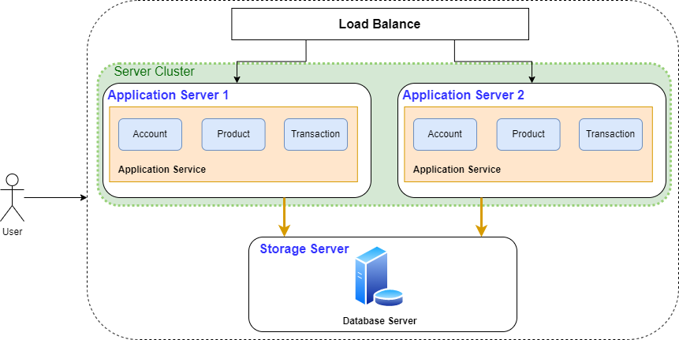

# 技术架构的演进

## *Baremetal 单机架构*

### intro

应用服务和数据库服务共用一台服务器

出现在互联网早期，访问量比较小，单机就可以满足需求。现在只有一些节约成本的个人开发者和初创公司会用了


### Pros & Cons

* Pros：部署简单、成本低
* Cons
  * 存在严重的性能瓶颈
  * 数据库和应用会互相竞争计算机资源

### 相关软件

Web 服务器软件：Tomcat、Netty、Nginx、Apache 等

数据库软件：MySQL、Oracle、PostgreSQL、SQL Server 等

## *应用数据分离架构*

### intro

单机架构中存在严重的资源竞争，会导致服务变慢，所以考虑应用服务和数据库服务使用不同的服务器


注意两服务器之间中间通过网络进行交付

### Pros & Cons

* Pros
  * 成本相对可控
  * 性能相比单机有提升
  * 数据库单独隔离，应用一般不会把数据库搞坏
* Cons
  * 硬件成本变高
  * 性能有瓶颈，无法应对海量并发

## *应用服务集群架构*

### intro

单个应用不足以支持海量的并发请求，高并发的时候站点响应变慢

应用服务集群架构引入了负载均衡，应用以集群方式运作



### Pros & Cons

* Pros
  * 应用服务高可用：应用满足高可用，不会一个服务出问题整个站点挂掉
  * 应用服务具备一定高性能：如果不访问数据库，应用相关处理通过扩展可以支持海量请求快速响应
  * 应用服务有一定扩展能力：支持横向扩展 Scale out
* Cons
  * **数据库成为性能瓶颈**，无法应对数据库的海量查询。因为数据库是单点，没有高可用
  * 运维工作增多，扩展后部署运维工作增多，需要开发对应的工具应对快速部署
  * 硬件成本相对较高

### 什么是中间件

中间件是位于客户端和服务器之间的软件层或组件，用于连接、协调和管理不同应用程序或系统之间的通信和交互。它可以被看作是一个软件的"中间层"，提供了一组功能和服务，使得应用程序开发和系统集成更加方便和灵活

中间件的作用是隐藏底层的复杂性，提供统一的接口和功能，使得应用程序能够更加简单、高效地与不同的系统、服务或组件进行通信。它可以在不同的应用程序之间传递数据、消息和请求，处理和转换数据格式，实现数据的传输、存储和处理等操作

中间件通常提供了以下功能和服务：

1. 连接管理：中间件负责管理不同系统或组件之间的连接和通信，包括建立连接、维护连接池、处理连接错误和超时等
2. 数据传输和转换：中间件可以处理数据的传输和转换，将数据从一个系统转发到另一个系统，同时进行数据格式的转换和映射，以确保不同系统之间的兼容性和一致性
3. 安全性和认证：中间件可以提供安全性和认证机制，确保数据的机密性和完整性，验证用户身份和权限，以保护系统和数据的安全
4. 事务管理：中间件可以支持事务管理，处理分布式事务和跨多个系统的原子性操作，确保数据的一致性和可靠性
5. 缓存和性能优化：中间件可以实现数据的缓存和性能优化，减轻后端系统的负载，提高系统的响应速度和吞吐量

常见的中间件包括消息队列中间件（如ActiveMQ、RabbitMQ）、应用服务器中间件（如Tomcat、WebSphere）、数据库中间件（如MyCat、MySQL Proxy）、Web服务中间件（如Nginx、Apache）、分布式缓存中间件（如Redis、Memcached）等

总之，中间件是在不同系统、应用程序或组件之间提供连接、协调和管理功能的软件层或组件，它简化了系统集成和应用程序开发的复杂性，提供了一致的接口和服务，以实现高效、可靠的通信和交互

### 常用的负载均衡组件

1. Nginx：Nginx是一个高性能的开源反向代理服务器，可以作为负载均衡器使用。它支持多种负载均衡算法，并具有灵活的配置选项和强大的性能。Nginx能扛50000次并发
2. HAProxy：HAProxy是另一个流行的开源负载均衡器。它提供高可用性和负载均衡功能，并支持多种负载均衡算法。HAProxy通常被用于分发网络流量到多个后端服务器
3. Apache HTTP Server：Apache HTTP服务器也可以用作负载均衡器。它提供了mod_proxy模块，通过配置反向代理和负载均衡规则，可以将请求分发给多个后端服务器
4. LVS（Linux Virtual Server）是一个开源的负载均衡软件，特别适用于Linux操作系统。它提供了一种基于网络地址转换（NAT）和直接路由（DR）的负载均衡技术，用于将网络流量分发到多个后端服务器。LVS能扛几十万次的并发
5. F5 BIG-IP：F5 BIG-IP是一种商业级的负载均衡器和应用交付控制平台。它具有丰富的功能，包括负载均衡、内容缓存、SSL加速和安全性等，并可提供高可用性和可伸缩性。F5能扛两百万，甚至是千万次级别的并发。F5是硬件实现的，所以性能很高
6. Microsoft Azure Load Balancer：Azure Load Balancer是Microsoft Azure云平台提供的一种负载均衡解决方案。它可用于将流量分发到Azure虚拟机、容器实例或服务终结点，并提供高可用性和可扩展性
7. DNS可以扛上亿级别的并发，千万次并发到上亿并发可以通过DNS串行。极端情况下上百亿的访问若DNS都拒绝服务了，则可以本地配置IP来绕过DNS

## *读写分离/主从分离架构*

### intro

应用服务集群架构中数据库成为瓶颈，而互联网应用一般读多写少，数据库承载压力大，主要是由这些读的请求造成的，那么我们可以把读操作和写操作分开

将数据库读写操作分散到不同的节点上，数据库服务器搭建主从集群，一主一从、一主多从都可以，数据库主机负责写操作，从机只负责读操作


**数据库中间件**

应用中需要对读写请求做分离处理，所以可以利用一些数据库中间件，将请求分离的职责托管出去

MyCat、TDDL、Amoeba、Cobar 等类似数据库中间件等

### Pros & Cons

* Pros
  * 数据库的读取性能提升
  * 读取被其他服务器分担，写的性能间接提升
  * 数据库有从库，数据库的可用性提高了
* Cons
  * 热点数据的频繁读取导致数据库负载很高
  * 当同步挂掉，或者同步延迟比较大时，写库和读库的数据不一致
  * 服务器成本需要进一步增加

## *冷热分离架构*

### intro

海量的请求导致数据库负载过高，站点响应再度变慢

**引入缓存**，实行冷热分离，将热点数据放到缓存中快速响应


### 引入Redis作为缓存

### Pros & Cons

* Pros：大幅降低对数据库的访问请求，性能提升非常明显，甚至能扛住千万级甚至是以级的数据访问
* Cons
  * 带来了缓存一致性，缓存击穿，缓存失效，缓存雪崩等问题
  * 业务体量支持变大后，数据不断增加，数据库单库太大，单个表体量也太大，数据查询会很慢，导致数据库再度成为系统瓶颈
  * 服务器成本需要进一步增加

## *垂直分库架构/分布式数据库架构*

### intro

单机的写库会逐渐会达到性能瓶颈，需要拆分数据库。数据表的数据量太大，处理压力太大，需要进行分表，为降低运维难度，业界逐渐研发了分布式数据库，库表天然支持分布式

数据库的数据被拆分，数据库数据分布式存储，分布式处理，分布式查询，也可以理解为分布式数据库架构


### 分库分表 & 分布式数据库

随着后期技术发展出现了分布式数据库，可以自动完成分库分表的操作

### Pros & Cons

* Pros：数据库吞吐量大幅提升，不再是瓶颈
* Cons
  * 跨库join、分布式事务等问题，这些需要对应的去进行解决，目前的mpp都有对应的解决方案
  * 数据库和缓存结合目前能够抗住海量的请求，但是应用的代码整体耦合在一起，修改一行代码需要整体停服重新发布

### 分布式数据库

Greenplum、TiDB、Postgresql XC、HAWQ等，商用的如南大通用的GBase、睿帆科技的雪球DB、华为的LibrA 等

## *微服务架构 Microservice*

### 微服务出现原因

之前的版本迭代到了分布式数据库架构后会出现下面这些比较棘手的问题

* 扩展性差：应用程序无法轻松扩展，因为每次需要更新应用程序时，都必须重新构建整个系统
* 持续开发/持续部署CD困难：一个很小的代码改动，也需要重新部署整个应用，无法频繁并轻松的发布版本
* 不可靠：即使系统的一个功能不起作用，可能导致整个系统无法工作
* 不灵活：无法使用不同的技术构建单体应用程序，比如说跨语言的开发
* 代码维护难：所有功能耦合在一起，新人不知道何从下手

### 架构图


微服务是一种架构风格，像拼Lego一样把多个模块拼接成一个完整的系统。按照业务板块来划分应用代码，使单个应用的职责更清晰，相互之间可以做到独立升级迭

有时候微服务之间要相互协作才能提供提供一些服务

### Pros & Cons

* Pros
  * 灵活性高：服务独立测试、部署、升级、发布
  * 独立扩展：每个服务可以各自进行扩展
  * 提高容错性：一个服务问题并不会让整个系统瘫痪
  * 新技术的应用容易:支持多种编程语言
* Cons
  * 运维复杂度高：业务不断发展，应用和服务都会不断变多，应用和服务的部署变得复杂，同一台服务器上部署多个服务还要解决运行环境冲突的问题，此外，对于如大促这类需要动态扩缩容的场景，需要水平扩展服务的性能，就需要在新增的服务上准备运行环境，部署服务等，运维将变得十分困难
  * 资源使用变多：所有这些独立运行的微服务都需要需要占用内存和 CPU
  * 处理故障困难：一个请求跨多个服务调用，需要查看不同服务的日志完成问题定位

## *容器编排架构*

### 出现原因

* 微服务拆分细，服务多部署工作量大，而且配置复杂，容易出错
* 微服务数量多扩缩容麻烦，而且容易出错，每次缩容后再扩容又需要重新配置服务对应的环境参数信息
* 微服务之间运行环境可能冲突，需要更多的资源来进行部署或者通过修改配置来解决冲突

借助容器化技术（如docker）将应用/服务可以打包为镜像，通过容器编排工具（如k8s）来动态分发和部署镜像，服务以容器化方式运行

### 架构图


其实读写数据和微服务的流程是一样的，只是运维方便了很多。每个部门有自己的服务器，可以把每个服务器用k8s各自打包成一个集群

注意，有两种设计方式。可以是微服务容器之间互相调用后由一方返回数据给商城，也可以是商城分别取不同的容器那里拿数据然后整合

**Docker的核心作用是打包和容器化运行**

### Pros & Cons

* Pros
  * 部署、运维简单快速：一条命令就可以完成几百个服务的部署或者扩缩容
  * 隔离性好：容器与容器之间文件系统、网络等互相隔离，不会产生环境冲突
  * 轻松支持滚动更新：版本间切换都可以通过一个命令完成升
  * 级或者回滚

* Cons
  * 技术栈变多，对研发团队要求高
  * 机器还是需要公司自身来管理，在非大促的时候，还是需要闲置着大量的机器资源来应对大促，机器自身成本和运维成本都极高，资源利用率低，可以通过购买云厂商服务器解决


## *典型实际架构*

架构不是固定的，上面只是一个典型的工业架构，架构也不必和上面的一样，只要能满足实际业务需求就行

# 容器与云的发展历程

## *容器技术发展史*

### Jail时代

*  1979年贝尔实验室发明 `chroot` 系统调用

   `chroot` 系统调用是在1979 年开发第7 版Unix期间引入的。贝尔实验室在Unix V7的开发过程中，发现当一个系统软件编译和安装完成后，整个测试环境的变量就会发生改变，下一次测试需要重新配置环境信息

  设计者们思考能否隔离出来一个独立的环境，来构建和搭建测试环境，所以发明了chroot，可以把一个进程的文件系统隔离起来

  chroot系统调用可以将进程及其子进程的根目录更改为文件系统中的新位置。隔离以后，该进程无法访问到外面的文件，因此这个被隔离出来的新环境像监狱一样，被命名为Chroot Jail （监狱）。后续测试只需要把测试信息放到Jail中就可以完成测试了

  Chroot Jail 最初是由美国计算机科学家 Bill Cheswick 在 1982 年提出的概念，作为 Unix 系统中实施安全策略的一种方法。Bill Cheswick 使用 `chroot` 系统调用来限制非特权用户的访问权限，将用户限制在一个特定的根目录中。这个概念后来被广泛采用，并成为许多安全工具和系统的基础

*  2000年FreeBSD 4.0发行FreeBSD Jail

   2000 年，当时一家小型共享环境托管提供商提出了FreeBSD Jail，以实现其服务与其客户服务之间的明确分离，以实现安全性和易于管理。**每个Jail都是一个在主机上运行的虚拟环境**，有自己的文件、进程、用户和超级用户帐户，能够为每个系统分配一个IP 地址

  FreeBSD Jail不仅仅有chroot的文件系统隔离，并且扩充了独立的进程和网络空间

*  2001年Linux VServer发行

  Linux-VServer 是一个基于 Linux 内核的虚拟化技术，用于创建和管理虚拟私有服务器（Virtual Private Servers，VPS）。它提供了一种在单个物理主机上运行多个隔离的 Linux 系统实例的方法，每个实例都具有独立的文件系统、网络配置和进程空间

  Linux-VServer 通过使用内核层的隔离机制来实现虚拟化。它通过名为 VServer 的内核补丁，扩展了 Linux 内核，增加了对虚拟化的支持。这个补丁使得每个 VServer 实例能够在逻辑上独立运行，就像它们在独立的物理服务器上一样

* 2004年Solaris Containers发行

### 云时代

在云时代，计算资源后者说云成为一种和水电一样的用于基础设施。云计算需要处理海量数据、超高并发、快速扩展等问题，此时不仅仅需要隔离还需要能够对资源进行控制和调配

* 2006年，Google 101 计划提出云的概念，对当前的主流开发模式产生深远的影响。随后，亚马逊、IBM 等行业巨头也陆续宣布各自的“云”计划，宣告“云”技术时代的来临

* 2006年google推出Process Containers

  Process Containers（由Google 于2006 年推出）旨在限制、统计和隔离一组进程的资源使用（CPU、内存、磁盘I/O、网络）。一年后它更名为 Control Groups（**cgroups**），并最终合并到Linux 内核2.6.24

* 2008年LXC推出

  LXC（Linux Container）是Linux 容器管理器的第一个、最完整的实现。它是在2008年**使用cgroups和Linux命名空间实现的**，它可以在单个Linux内核上运行，不需要任何补丁

  同年谷歌推出**GAE**（Google App Engine），首次把开发平台当做一种服务来提供，采用云计算技术，跨越多个服务器和数据中心来虚拟化应用程序

  同时Google在GAE中使用了**Borg** （Kubernetes的前身）来对容器进行编排和调度。LXC和Borg其实就相当于最早的docker和k8s

  **LXC是docker的前身，最初docker就是用LXC实现的产品**

* 2011年CloudFoundry推出Warden

  2011 年启动了Warden，早期使用LXC，后来替换为自己的实现,直接对Cgroups以及Linux Namespace操作。开发了一个客户端-服务器模型来管理跨多个主机的容器集合，并且可以管理cgroups、命名空间和进程生命周期

* 2013年LMCTFY启动

  Let Me Contain That For You (LMCTFY) 于2013 年作为Google 容器堆栈的开源版本启动，提供Linux 应用程序容器。应用程序可以**容器感知，创建和管理它们自己的子容器**。在谷歌开始和docker合作，后续转向了docker公司的libcontainer，LMCTFY于2015 年停止

* 2013年Docker推出到风靡全球

  Docker最初是一个叫做dotCloud的PaaS服务公司的内部项目，后来该公司改名为Docker。Docker在初期与Warden类似，使用的也是LXC，之后才开始**采用自己开发的libcontainer来替代LXC**，它是将应用程序及其依赖打包到几乎可以在任何服务器上运行的容器的工具。与其他只做容器的项目不同的是，**Docker引入了一整套管理容器的生态系统，这包括高效、分层的容器镜像模型、全局和本地的容器注册库、清晰的REST API、命令行等等**

  **Docker为提供了一整套的解决方案**，不仅解决了容器化问题，而且解决了分发问题，很快被各大厂商选择变成了云基础设施，厂商围绕Docker也开始了生态建设。

### 云原生 Cloud Native

**云时代解决了服务的打包上线问题，而云原生解决容器上层的管理和编排问题**。在云原生时代发生了两场争夺标准制定权的大战，分别用来争夺容器标准和运行时、编排的标准

**容器编排是指管理和协调容器化应用程序的自动化过程**。它涉及将多个容器组合成一个分布式应用，并负责处理容器的调度、部署、扩展、监控和治理等任务。容器编排旨在简化分布式应用的管理，并提供高可用性、弹性和可靠性

首先介绍一下云原生的概念

<https://www.amazonaws.cn/knowledge/what-is-cloud-native/>

> 云原生指的是**基于在云中构建、运行应用程序的理念，而打造的一套技术体系**。不同于传统数据中心的软件开发、构建模式，云原生包含有“原生为云而设计”的含义，能够有效提升云上资源利用率、缩短开发周期 -- Amazon

云原生的核心理念是将应用程序设计为一组小型、独立部署的服务，每个服务都可以通过容器进行封装。这些服务通过轻量级的通信机制（如API）相互交互，形成松耦合的分布式系统。云原生应用程序通常采用微服务架构，将复杂的应用程序拆分为多个小型服务，每个服务专注于单一的业务功能

云原生应用程序还借助于容器编排工具（如Kubernetes）来自动化管理和编排容器化的服务。容器编排工具提供了自动伸缩、负载均衡、服务发现、故障恢复和滚动更新等功能，以确保应用程序在动态的云环境中高效运行

Pros & Cons

<https://www.oracle.com/cn/cloud/cloud-native/what-is-cloud-native/>

* Pros
  * **独立：**云原生应用架构支持企业构建相互独立的云原生应用，同时单独管理和部署各个云原生应用
  * **可恢复性：**即便基础设施发生故障，云原生应用也能继续运行，保持联机状态
  * **基于标准：**为实现出色的互操作性和工作负载可移植性，云原生服务通常基于开源和标准技术构建而成。这有助于降低供应商依赖，提高可移植性
  * **业务敏捷性：**云原生应用支持跨网络灵活部署，同时相比传统应用规模更小，更易于开发、部署和迭代
  * **自动化：**云原生应用支持 DevOps 自动化特性，支持持续交付以及持续部署定期软件变更。此外，开发人员还可以使用蓝绿部署和金丝雀部署等方法来优化应用，避免对用户体验产生任何不利影响
  * **零停机：**借助 Kubernetes 等容器编排器，企业可以零停机地部署软件更新
* Cons
  * 学习曲线和技术复杂性：云原生涉及多个技术和工具的使用，例如容器化、容器编排、自动化部署等。对于没有相关经验的开发团队来说，学习和掌握这些技术可能需要一定的时间和资源投入
  * 管理和运维挑战：云原生应用程序的复杂性也给管理和运维团队带来挑战。容器编排工具的配置和管理需要一定的专业知识，而且需要监控和管理大量的容器实例和服务
  * 安全问题：元原生因应用容器技术，容易对数据安全造成一定程度的安全隐患。攻击者如果从某个容器链接至 host 主机，有可能在下一步攻击行动中，入侵更多非授权容器，导致大规模数据风险
  * 依赖云服务提供商：云原生应用程序通常依赖于云服务提供商的基础设施和平台。这可能使得应用程序对特定云服务提供商产生依赖，限制了跨云平台的可移植性和灵活性

### 云原生大战：容器标准

Docker vs. Rocket 结果为docker捐出runc

* 2013年CoreOS发布并终止与Docker的合作

  技术革命带来新的市场机遇，CoreOS也是其中的一员，在容器生态圈中贴有标签：专为容器设计的操作系统CoreOS。作为互补，CoreOS+Docker曾经也是容器部署的灵魂伴侣。CoreOS为Docker的推广和源码社区都做出了巨大的贡献

  Docker生态扩张，与最开始是“一个简单的基础单元”不同，Docker也在通过开发或收购逐步完善容器云平台的各种组件，准备打造自己的生态圈，而这与CoreOS的布局有直接竞争关系

  云原生的一代传奇 CoreOS <https://2d2d.io/s1/coreos/>

  什么是 CoreOS 和 CoreOS 容器 Linux？<https://www.redhat.com/zh/technologies/cloud-computing/openshift/what-was-coreos>

* 2014年12月CoreOS发布开源容器引擎Rocket（rkt）

  2014年底，CoreOS正式发布了CoreOS的开源容器引擎Rocket（简称rkt），和Docker正式分开发展。Google于2015年4月领投CoreOS 1200万美元，而CoreOS也发布了Tectonic，成为首个支持企业版本kubernetes的公司。从此，容器江湖分为两大阵营，**Google派系和Docker派系**

* 2015年6月Docker成立OCI

  Docker公司在容器运行因为高速迭代导致变更频繁，影响较大

  2015 年6 月22 日，由Docker公司牵头，CoreOS、Google、RedHat 等公司共同宣布，**Docker 公司将Libcontainer捐出，并改名为RunC项目**，交由一个完全中立的基金会管理，然后以RunC为依据，大家共同制定一套容器和镜像的标准和规范。**RUNC的本质就是可以不通过Docker Damon直接运行容器**

  制定出来的规范就是OCI Open Container Initiative 开放容器标准，旨在“制定并维护容器镜像格式和容器运行时的正式规范（OCI Specifications）”。其核心产出是OCI Runtime Spec（容器运行时规范）、OCI Image Spec（镜像格式规范）、OCI Distribution Spec（镜像分发规范）。所以**OCI组织解决的是容器的构建、分发和运行问题**

  社区们期望通过标准来约束Docker公司的话语权，不过Docker公司并没有积极推动OCI的发展，而且OCI也无法影响Docker的地位，因为Docker已经是事实的容器标准

  因为对容器标准的争夺大局已定，Google和RedHat等公司将方向调转到容器上面的**平台层**，即如何管理容器集群

### 云原生大战：编排

Swarm vs. k8s 结果为k8s胜出，成为标准

* 2014年6月Google发布开源的容器编排引擎Kubernetes（K8S）

  容器只是解决了容器化，分发问题，但是一个软件的网络问题、负载均衡问题、监控、部署、更新、镜像管理、发布等很多问题并没有有效的解决

  Google内部调度系统Borg已经拥有10多年的使用容器经验，在2014年6月推出了开源的K8S,可以支持对容器的编排和管理，完成生态的闭环

  同年7月，微软、Red Hat、IBM、Docker、CoreOS、Mesosphere和Saltstack 等公司，相继加入K8S。之后的一年内，VMware、HP、Intel等公司，也陆续加入

* 2015年Docker推出容器集群编排组件Swarm

  在Docker 1.12 及更高版本中，Swarm 模式与Docker 引擎集成,为Docker 容器提供原生集群管理功能

  两大派系的竞争愈演愈烈，行业标准的诉求越来越强烈

### 云原生大战：运行时

Docker Containerd vs. Google CRI 结果为containerd实现CRI作为标准

```
cri-containerd -> cri-o -> containererd -> containerd实现CRI作为标准
```

* 2015年7月Google带头成立CNCF

  Google联合Linux 基金会成立CNCF （Cloud Native Computing Foundation）云原生计算基金会。旨在构建云原生基础设施。K8S是第一个纳入进来的项目，像后续有名的监控设施Prometheus，配置设施ETCD都加入进来。CNCF 组织解决的是应用管理及容器编排问题。和OCI共同制定了一系列行业事实标准

* 2016年发布CRI

  Google就和红帽主导了CRI标准，**用于k8s和特定的容器运行时解耦**。**CRI Container Runtime Interface 容器运行时接口 本质上就是k8s定义的一组与容器运行时进行交互的接口，所以只要实现了这套接口的容器运行时都可以对接k8s**

  但是这个适合Docker还是事实标准，然而CRI并没有话语权，但是又必须支持Docker，所以就有了docker-shim，docker-shim的本质其实就是k8s为了对接docker的一个CRI的实现

* 2016年Docker捐出containerd

  containerd作为运行时标准，Docker从Docker Engine种剥离出来，捐赠给了CNCF。这时Google为了将containerd加入到cri标准中，又开发了**CRI-containerd**，用来完成k8s和容器之间的交互

* 2016年CRI-O发布

  CRI-O可以让开发者直接从Kubernetes来运行容器，这意味着Kubernetes可以不依赖于传统的容器引擎（比如Docker），也能够管理容器化工作负载。容器此时也回归到自己的位置，如何更好的封装云原生的程序

  在2016年，Docker公司宣布了一个震惊全部人的计划：放弃现有的Swarm项目，将容器编排和集群管理功能所有内置到Docker项目中

  而Kubernetes的应对策略则是反其道而行之，开始在整个社区推动**民主化**架构，**从API到容器运行时的每一层，Kubernetes项目都为开发者暴露出了能够扩展的插件机制，鼓励用户经过代码的方式介入到Kubernetes项目的每个阶段**

  在进入2017年之后，更多的厂商愿意把宝压在K8S上，投入到K8S相关生态的建设中来。这两年包括阿里云、腾讯、百度等中国科技企业也陆续加入CNCF，全面拥抱容器技术与云原生

  Swarm的失败后, 社区版Docker项目改名为moby，将Docker引流到Docker的企业版上去，螳臂挡车

* 2017年containerd确定作为标准CRI

  2017年各大厂商都开始拥抱Kubernetes，亚马逊AWS，Microsoft Azure，VMware，有的甚至抛弃了自家的产品。

  亚马逊网络服务（AWS）于八月份以白金会员（最高级别）加入了CNCF。

  VMware都作为CNCF的白金会员注册.

  Docker Inc.ocker企业版框架中添加了本地Kubernetes支持。Docker自己的Swarm技术也借鉴了k8s的技术进一步发展。

  **Kubernetes至此已成了容器编排领域的绝对标准，而Docker已成容器事实的标准**

## *编排与容器的技术演进之路*

### DockerClient

此时K8s只是编排领域的一个选择，而Docker此时一家独大，所以K8s的客户端仅是作为Docker的客户端来调用Docker引擎来完成服务

### RUNC & Shim

OCI催生runc，剥离Docker Engine的一家独大的情况，确保各个厂商都可以搭建自己的容器平台。CRI标准确立了但是Docker并没有接入该标准。此时催生了临时技术shim

此时Docker话语权荏苒很大，Docker公司的OCI标准不兼容google的CRI标准。shim是一个包装器，使满足google的CRI标准

### CRI-Containerd

containerd被捐献出来，谷歌开发cri-containerd接入CRI标准

### CRI-O

k8s已经成为了编排标准，因此它可以倒逼Docker公司对容器标准做出改革

### Containerd

containerd实现CRI，成为CRI的事实标准

### 实际生产的集群采用的什么运行时组件？

以腾讯的TKE（腾讯商用K8S产品)为例，支持选择containerd和docker两种模式的选择。

* Containerd调用链更短，组件更少，更稳定，占用节点资源更少。建议选择Containerd
* 以下情况还是要用docker
  * 使用docker build/push/save/load 等命令
  * 需要调用docker API
  * 需要docker compose 或docker swarm

# Cloud System Engineering

## *Introduction*

### 云计算的优势

> 云计算就是通过 Internet（以下统称“云”）提供计算服务（包括服务器、存储、数据库、网络、软件、分析和智能），以提供快速创新、弹性资源和规模经济。对于云服务，通常你只需使用多少支付多少，从而帮助降低运营成本，使基础设施更有效地运行，并能根据业务需求的变化调整对服务的使用 -- Microsoft Azure https://azure.microsoft.com/zh-cn/resources/cloud-computing-dictionary/what-is-cloud-computing

* Scalability 可扩展性
* Cost-effective
* Flexibility
* Reliability
* Collaboration

### Types of Cloud Computing

* Public cloud 公有云
* Private cloud 私有云
* Hybrid cloud 混合云

### Types of Cloud Service


* **Infrastructure as a Service** IaaS 包含云 IT 的基本构建块，IaaS provides virtualized computing resources。它通常提供对网络功能、计算机（虚拟或专用硬件）和数据存储空间的访问。IaaS 提供最高级别的灵活性，用户可以对 IT 资源进行管理控制。它与许多 IT 部门和开发人员熟悉的现有 IT 资源最为相似。IaaS is ideal when **complete control** over their computing environment is required。下面是几个最常见的 IaaS providers

  * AWS

    > Amazon Elastic Compute Cloud（Amazon EC2）提供最广泛、最深入的计算平台，拥有超过 500 个实例，可选择最新的处理器、存储、网络、操作系统和购买模型，以帮助您最好地满足工作负载的需求。我们是首家支持英特尔、AMD 和 Arm 处理器的主要云提供商，既是唯一具有按需 EC2 Mac 实例的云，也是唯一具有 400 Gbps 以太网网络的云。我们为机器学习培训提供最佳性价比，同时也为云中的每个推理实例提供了最低的成本。与任何其他云相比，有更多的 SAP、高性能计算 (HPC)、机器学习 (ML) 和 Windows 工作负载在 AWS 上运行。 -- AWS

  * Microsoft Azure

  * Google Cloud Platform

* **Platform as a Service** PaaS 无需管理底层基础设施（一般是硬件和操作系统），从而可以将更多精力放在应用程序的部署和管理上面。这有助于提高效率，因为用户不用操心资源购置、容量规划、软件维护、补丁安装或与应用程序运行有关的任何无差别的繁重工作。PaaS is ideal for organizations that want to focus on application development and deployment without having to manage the underlying infrastructure

  * Heroku
  * Google Appengine
  * Fly.io

* **Software as a Service** SaaS 提供了一种完善的产品，其运行和管理皆由服务提供商负责。在大多数情况下，人们所说的 SaaS 指的是最终用户应用程序（如基于 Web 的电子邮件）。使用 SaaS 产品，用户无需考虑如何维护服务或管理基础设施。用户只需要考虑如何使用该特定软件。SaaS is ideal for organizations that want to avoid the upfront costs and ongoing maintenance associated with traditional software applications

  * Salesforce, Microsoft Office 365, Google Workspace
  * Mail/Office tools, Customer relationship management CRM, Enterprise resource planning ERP

## *虚拟化*

### 虚拟化层次

虚拟化技术 Virtualization 通过在同一个硬件主机上多路复用虚拟机的方式来共享昂贵的硬件资源，从而提高资源利用效率和应用程序灵活度。硬件资源（CPU、内存、IO）和软件资源（OS和库）可以在不同的功能层虚拟化


* 指令集体系结构级：使用物理主机的ISA（指令集架构 Instruction Set Architecture）模拟出另外一个ISA。效率极低，因为一条源指令只能需要数十条甚至上百条指令来实现
* 硬件抽象级：共用同一份硬件资源，通过Hypervisor或VMM（虚拟机监视器 Virtual Machine Monitor）这一种新增的处于硬件与不同OS之间的软件层来管理资源，最著名的就是全虚拟化的VMware和半虚拟化Xen
* 操作系统级：共用同一份操作系统资源，将部分系统资源隔离形成容器，最重要的应用之一就是用Docker来部署服务
* 库支持级：大部分应用程序使用用户级库的API而非系统调用，通过API钩子可以控制应用程序和其他系统部分之间的通信连接
* 应用程序级：也称为进程级虚拟化，虚拟化层本身就作为一个进程跑在OS上面，最典型的就是JVM

### 硬件系统级和操作系统级的虚拟化对比

也可以说是虚拟机和容器的对比


每个VM都需要一套完整的OS，在一个物理PC上能够同时运行的VM是很有限的

而容器非常轻量化。容器引擎 container engine负责启动及停止容器，作用和VMM比较相似

* 容器是对应用程序及其依赖关系的封装，属于操作系统级的虚拟化
* 容器解决的问题就是环境依赖造成部署困难的问题，或者说“程序能在我的OS上运行，但是在别人的OS上却运行不了”

容器的一个主要缺点在于所有容器共享主机的内核，所以容器只能运行与主机一样的内核

### 不同级别虚拟化性能的大致比较

下表中X越多，说明performance越好

| 实现级别 | 高性能 | 应用程序灵活性 | 实现复杂度 | 应用程序隔离性 |
| :------: | :----: | :------------: | :--------: | :------------: |
|  ISA级   |   X    |     XXXXX      |    XXX     |      XXX       |
|  硬件级  | XXXXX  |      XXX       |   XXXXX    |      XXXX      |
|   OS级   |  XXXX  |       XX       |    XXX     |       XX       |
| 用户库级 |  XXX   |       XX       |     XX     |       XX       |
|  进程级  |   XX   |       XX       |   XXXXX    |     XXXXX      |

### 实现虚拟化的工具

全虚拟化是指在虚拟机中模拟硬件的完整功能，包括CPU、内存、存储和网络等。在全虚拟化中，虚拟机不知道自己正在运行在虚拟化环境中，而是认为自己正在直接运行在物理硬件上。为了实现全虚拟化，需要对虚拟机操作系统的指令进行翻译，这会导致性能开销，因为每个指令都需要进行额外的处理。常见的全虚拟化技术包括VMware ESXi和Microsoft Hyper-V等。

半虚拟化是指虚拟机操作系统知道自己正在运行在虚拟化环境中，可以与虚拟化层进行交互，以实现更高的性能和更少的开销。在半虚拟化中，虚拟机操作系统会使用虚拟化层提供的API来访问硬件资源，而不是直接访问硬件。这减少了指令翻译的需要，并且能够更好地利用硬件资源。常见的半虚拟化技术包括Xen和KVM等。

因此，全虚拟化和半虚拟化之间的主要区别在于虚拟化的方式和性能开销。全虚拟化模拟完整的硬件功能，导致性能开销，而半虚拟化操作系统知道自己正在运行在虚拟化环境中，可以与虚拟化层进行交互，从而减少性能开销。

### 虚拟化种类

在一个Data center里面，一台服务器主要就是三个组成部分：Compute(CPU)、Storage(Disk or SSD)、Network。因此虚拟化也就着重在这三个层面

* Compute: VM or Container
* Network
* Storage https://www.redhat.com/zh/topics/data-storage/file-block-object-storage#
  * Object storage 对象存储
  * Block storage 块存储

## *Cloud software systems- Distributed systems in the cloud*

### 云计算和分布式系统的联系

"云计算" 是指将计算资源（如服务器、存储、网络等）通过网络连接，提供给用户使用的一种服务模式。而 "分布式系统" 则是指将多个独立的计算机或节点组成一个整体，以共同协作完成某项任务或提供某种服务

这两个概念的紧密关系在于，云计算通常是基于分布式系统实现的。云计算提供的计算资源往往来自于多个节点或服务器，这些节点可以在地理位置上分散，也可以在技术层面上分散，它们之间需要通过网络连接和协作完成任务。因此，云计算平台本质上就是一个分布式系统，通过对多个节点的统一管理和协调，向用户提供高效、可靠的计算资源服务

另外，分布式系统在实现过程中需要面对一些挑战，例如节点故障、网络延迟等，而云计算平台需要解决的问题也包括如何有效地管理和协调多个节点，保证系统的可靠性和高可用性等。因此，云计算和分布式系统在很多方面存在相似之处，二者的紧密关系在于，分布式系统提供了云计算实现的基础技术和理论支持，而云计算则在很大程度上推动了分布式系统的发展和应用

### 为什么让系统分布式？

* Inherently distributed
* For better reliability
* For better performance
* To solve bigger probelms 

### Challenges of a distributed system

* Fault tolerance
* Availability
* Recovery
* Consistency or correctness
* Scalability
* Security

### RPC

通常情况下，使用 socket 进行网络通信时，是通过发送和接收数据包来实现的，而不涉及到对远程计算机上的过程的调用。

而 RPC 则允许一个计算机程序通过网络调用另一个计算机程序中的子程序，这是一种更高层次的抽象，使得远程计算机上的过程可以像本地过程一样被调用，因此在实现远程过程调用时，RPC 是一个更为方便和高效的选择。RPC 底层使用的通信协议可以是 socket，也可以是其他的通信协议

序列化？Interface Definition Language 

## *Deployment Models in the Cloud*

Deployment: Process of delivering software from a development environment to a live environment

### Baremetal

安全性：数据库的部署

### virtual machines

### containers

### serverless

# Docker技术基石


容器虚拟化是操作系统层的虚拟化。它通过namespace进行各程序的隔离，通过cgroups进行资源的控制，UnionFS来提供一个可读写的文件系统

## *空间隔离*

### namespace

Linux的namespace（命名空间）是一种操作系统级别的隔离机制，用于将系统资源抽象成独立的命名空间。每个命名空间提供了一种隔离的环境，使得在一个命名空间中的进程无法感知或影响到其他命名空间中的资源。Linux内核通过使用不同类型的命名空间，实现了对进程、网络、文件系统、用户、进程ID和挂载点等多个系统资源的隔离

Linux 提供了多个API 用来操作namespace，它们是 `clone()`、`setns()` 和 `unshare()` 函数，为了确定隔离的到底是哪项namespace，在使用这些API 时，通常需要指定下面使用一些参数宏。如果要同时隔离多个namespace，和 `open` 一样可以使用 `|` 组合这些参数

### 系统调用参数

| NameSpace | 系统调用参数    | 被隔离的全局系统资源                   | 引入时的内核版本 |
| --------- | --------------- | -------------------------------------- | ---------------- |
| UTS       | `CLONE_NEWUTS`  | 主机名和域名                           | 2.6.19           |
| IPC       | `CLONE_NEWIPC`  | 信号量、消息队列和共享内存--进程间通信 | 2.6.19           |
| PID       | `CLONE_NEWPID`  | 进程编号                               | 2.6.24           |
| Network   | `CLONE_NEWNET`  | 网络设备、网络栈、端口等               | 2.6.29           |
| Mount     | `CLONE_NEWNS    | 文件系统挂载点                         | 2.4.19           |
| User      | `CLONE_NEWUSER` | 用户和用户组                           | 3.8              |

* UTS：每个容器能看到自己的hostname，拥有独立的主机名和域名
* IPC：同一个IPC namespace的进程之间能互相通讯，不同的IPC namespace之间不能通信
* PID：每个PID namespace中的进程可以有其独立的PID，每个容器可以有其PID为1的root进程
* Network：每个容器用有其独立的网络设备，IP地址，IP路由表，/proc/net目录，端口号
* Mount：每个容器能看到不同的文件系统层次结构
* User：每个container可以有不同的user和group id

### 需要用到的命令

*  `dd` 命令用于读取、转换并输出数据。dd 可从标准输入或文件中读取数据，根据指定的格式来转换数据，再输出到文件、设备或标准输出
* `mkfs` 命令用于在设备上创建Linux文件系统，俗称格式化
* `df` /disk free 命令用于显示目前在Linux系统上的文件系统磁盘使用情况统计
* mount命令用于加载文件系统到指定的加载点。此命令的也常用于挂载光盘，使我们可以访问光盘中的数据。Win上会自动挂载，Linux要手动挂载。挂载的实质是为磁盘添加入口（挂载点）
* `unshare` 命令主要能力是使用与父程序不共享的名称空间运行程序


要先挂载一个文件，否则隔离不彻底，还是能看到其他文件

## *资源控制*

### cgroups

### 需要用到的命令

* `pidstat`
* `stress`

## *LXC容器*

### 需要用到的命令

* `lxc-checkconfig`： 检查系统环境是否满足容器使用要求
* `lxc-create -n NAME -t TEMPLATE_NAME [--template-options]`： 创建lxc容器
* `lxc-start -n NAME -d`： 启动容器
* `lxc-ls`： 列出所有容器，-f表示打印常用的信息
* `lxc-info -n NAME`：查看容器相关的信息；
* `lxc-attach`：进入容器执行命令
* `lxc-stop`：停止容器
* `lxc-destroy`：删除处于停机状态的容器

## *UnionFS*

UnionFS（Union File System）是一种文件系统层叠技术，允许将多个文件系统（通常是只读的）合并为一个单一的文件系统。这种技术的主要优势是它能够将多个文件系统以一种透明的方式组合在一起，使它们看起来像一个单一的文件系统

在容器技术中，UnionFS被广泛应用，它允许在构建和运行容器时，将多个文件系统层叠在一起，形成一个容器镜像。这样，可以将基础操作系统层（通常是只读的）与容器应用程序的定制层合并在一起，形成一个可读写的文件系统，而不需要复制大部分数据

UnionFS 的一些主要实现包括：

1. **AUFS（Advanced Multi-Layered Unification Filesystem）**：AUFS 是最早流行的UnionFS实现之一。它支持将多个目录挂载到同一个目录，使其内容看起来像是一个目录。但是，AUFS 并没有被 Linux 官方内核接受，因此需要额外的内核模块。
2. **OverlayFS**：OverlayFS 是 Linux 内核的一部分，从 Linux 3.18 版本开始成为官方支持的UnionFS实现。它能够将多个文件系统层以只读或读写的方式进行合并。OverlayFS 较为简单，并且成为容器技术中 Docker 镜像层的默认选择。
3. **Overlay2**：Overlay2 是 OverlayFS 的第二个版本，它在 OverlayFS 的基础上进行了改进和优化。Overlay2 通常作为 Docker 默认的存储驱动。

在容器中，UnionFS的使用使得容器可以更加轻量、快速，因为它允许共享相同的文件系统层，避免了不必要的复制。这对于容器的启动时间和磁盘占用都有着显著的影响。

# Docker的使用

Docker是一个开放平台，用于开发、发布和运行应用程序。 Docker允许用户将应用程序与基础架构分离，以便快速交付软件。使用Docker，用户可以以与管理应用程序相同的方式管理基础架构。通过利用Docker的代码快速发布、测试和部署方法，可以显著缩短编写代码和在生产环境中运行代码之间的延迟

## *Docker架构*


Docker采用CS架构。Docker客户端和Docker守护进程通信，后者负责build、run和分发Docker容器。Docker客户端和守护进程可以在同一系统上运行，或者可以将Docker客户端连接到远程Docker守护进程

Docker客户端和守护进程使用REST API通过UNIX套接字或网络接口进行通信。另一个Docker客户端是Docker Compose，它可以让用户使用由一组容器组成的应用程序

### 组成

* Docker daemon

  Docker 守护进程（dockerd）监听 Docker API 请求并管理 Docker 对象，例如镜像、容器、网络和volume。一个守护进程也可以与其他守护进程通信以管理 Docker 服务

* Client

  Docker 客户端（docker）是许多 Docker 用户与 Docker 交互的主要方式。当用户使用诸如 `docker run` 等命令时，客户端会将这些命令发送给 dockerd，后者会执行它们。docker 命令使用 Docker API。Docker 客户端可以与多个守护进程通信

* Registries 仓库

  Docker registry是存储Docker镜像的地方。Docker Hub是一个公共的registry，任何人都可以使用，而且Docker默认会在Docker Hub上寻找镜像。用甚至可以运行自己的私有registry

  当使用 `docker pull` 或 `docker run` 命令时，需要的镜像会从配置的registry中拉取。当你使用 `docker push` 命令时，用户的镜像会被推送到配置的registry中

### Docker 对象

Docker中有镜像、容器、网络、volume、插件等对象

* 镜像 image

  在运行容器时，它使用一个独立的文件系统。这个自定义的文件系统由一个容器镜像提供。由于镜像包含了容器的文件系统，所以它必须包含运行应用程序所需的一切——所有依赖项、配置、脚本、二进制文件等等。镜像还包含了容器的其他配置，如环境变量、默认运行命令和其他元数据

  **Docker镜像就好像是一个模版**，可以通过这个模版来创建容器服务，即通过镜像来创建容器服务

  用户可以创建自己的镜像，也可以仅使用由其他人创建并在注册表中发布的镜像。要构建自己的镜像，用户可以创建一个 **Dockerfile**，其中有一个简单的yaml语法来定义创建镜像和运行它所需的步骤。 Dockerfile 中的每个指令都会在镜像中创建一个层。当更改 Dockerfile 并重新构建镜像时，只有那些已更改的层会重新构建。这就是镜像相对于其他虚拟化技术轻量、小巧、快速的部分原因

* 容器 container

  一个容器就是在用户的计算机上运行的与主机机器上所有其他进程隔离的沙盒进程。该隔离利用了 Linux 内核名称空间和 cgroups 的功能，这些功能已经存在于 Linux 中很长时间。Docker 已经努力让这些功能易于使用和管理。总结一下，一个容器：

  * 是一个可运行的映像的实例。可以使用 DockerAPI 或 CLI 创建、启动、停止、移动或删除容器
  * 可以在本地机器、虚拟机或云中运行
  * 可移植（可在任何操作系统上运行）
  * 与其他容器隔离，运行自己的软件、二进制文件和配置

## *Docker的命令*


### 镜像的命令

* `docker pull` 下载镜像。如果不写tag，就默认下载latest
* `docker rmi -f 镜像ide` 删除指定的镜像 
* `docker commit` 命令用于从容器的更改创建一个新的映像。将容器的文件更改或设置提交到新映像可能很有用

### 容器的命令

有了镜像才可以创建容器

* `docker run [可选参数] image`

  * --name="Name" 容器名字

  * -d 后台方式运行

  * -it 使用交互方式运行，进入容器查看内容。需要指定一个shell，比如 `/bin/bash`

  * -p 指定容器的端口

* `docker ps` 查看目前运行的容器
  * `docker ps -a` 查看运行过的所有容器
  * `docker ps -a -n=1` 查看最近运行过的1个容器
  * `docker ps -q` 显示容器编号
  
* 退出容器

  * exit 直接停止并退出容器
  * Ctrl+P+Q 容器不停止退出

* 删除容器 

  * `docker rm 容器id` 删除指定容器，不能删除正在运行的容器，若要强制删除，就用 `rm -f`
  * `docker rm -f $(docker ps -aq) ` 删除所有的容器

* 启动和停止容器的操作

  * 启动容器 `docker start 容器id`
  * 重启容器 `docker restart 容器id`
  * 停止当前正在运行的容器 `docker sotp 容器id`
  * 强制停止当前容器 `docker kill 容器id`

### 常用其他命令

* 后台启动容器
* 日志 `docker logs -f -t --tail NUM` 显示日志条数
* 查看容器中进程信息 `docker top 容器id`
* 查看镜像原数据 `docker inspect`

### 进入容器的命令和拷贝命令

* `docker exec -it 容器id shell`，进入容器后开启一个新的中断，可以在里面操作（常用）
* `docker attach 容器id`，进入容器横在执行的终端，不会启动新的进程
* `docker cp 容器id:容器内路径` 目的主机路径

## *Workflow*


编写Dockerfile `->` build 生成 images `->` run 形成 containers `->` push 到远程库

### Dockerfile编写

https://docs.docker.com/engine/reference/builder/

https://docs.docker.com/build/building/packaging/#dockerfile

Cheatsheet: https://kapeli.com/cheat_sheets/Dockerfile.docset/Contents/Resources/Documents/index

Docker 可以通过读取 Dockerfile 中的指令自动构建镜像。Dockerfile 是一个文本文件，包含了用户可以在命令行上调用的所有命令，以组装镜像

```dockerfile
# 使用基础镜像
FROM base_image:tag

# 设置工作目录
WORKDIR /app

# 复制文件到容器中
COPY source destination

# 执行命令
RUN command

# 暴露端口
EXPOSE port

# 设置环境变量
ENV key=value

# 容器启动时执行的命令
CMD ["executable","param1","param2"]

# 定义卷
VOLUME ["/data"]

# 设置标签
LABEL key=value
```

Dockerfile的格式如上，它不是case-sensitive，但还是建议将指令写成大写的。**指令必须要从 `FROM` 开始**

* `FROM <image>`：指定初始镜像

  > An image’s **parent image** is the image designated in the `FROM` directive in the image’s Dockerfile. All subsequent commands are based on this parent image. A Dockerfile with the `FROM scratch` directive uses no parent image, and creates a **base image**.

* `WORKDIR <directory>`：对任何后续的RUN、CMD、ENTRYPOINT、ADD或COP指令设置工作目录，该命令可以多次使用

* `COPY <src> <dest>`：把一个文件从主机的src拷贝到镜像文件系统的dest

* `RUN <command>`：在容器内执行指定的指令，并把结果保存下来

* `EXPOSE`：暴露容器的端口，使得可以从主机访问容器内的服务

* `CMD <command>`

  * 用来定义当启动基于某个镜像的容器时的默认程序
  * 每一个Dockerfile只能有一个CMD
  
* LABEL：以键值对的形式为镜像添加元数据

### Build


instance 实例 一个虚拟机

### `Docker run` 命令的使用

```shell
docker run -i -t ubuntu /bin/bash
```

当键入上面的命令时，发生了下面这些事

1. 如果用户没有本地的ubuntu镜像，Docker会从用户配置的registry中拉取它，就像手动运行 `docker pull ubuntu` 一样
2. Docker创建一个新的容器，就像手动运行了 `docker container create` 命令一样
3. Docker为容器分配一个读写文件系统，作为其最终层。这允许正在运行的容器在其本地文件系统中创建或修改文件和目录
4. Docker创建一个网络接口，将容器连接到默认网络，因为用户没有指定任何网络选项。这包括分配容器的IP地址。默认情况下，容器可以使用主机机器的网络连接连接到外部网络
5. Docker启动容器并执行 `/bin/bash`。因为容器正在交互式地运行并附加到用户的终端（由于 `-i` 和 `-t` 标志），用户可以使用键盘提供输入，同时将输出记录到其终端
6. 当用户输入 `exit` 以终止 `/bin/bash` 命令时，容器停止但不被删除。用户可以再次启动它或将其删除

# Docker网络

## *沙盒模型*


# Kubernetes

<https://www.redhat.com/zh/topics/containers/what-is-kubernetes>

## *Swarm*

# 云安全

## *Security challenges in the cloud*

### Challenges

* Outsourced infrastructure: Third-party infrastructure
* Multi-tenancy: Computing infrastructure is shared across multiple tenants
* Identity management/authorization: Require establishing trust
* Compliance (e.g., GDPR): Data and code might be handled in a different administrative jurisdiction
* Misconfiguration and software bugs: Large trusted computing base (infrastructure) operated/developed by multiple third-parties

### 构建安全的云系统

* Secure systems stack
  * Computing：在计算过程中，通过RAM访问时保护代码和数据
  * Network：保护在不被信任的网络中传输的数据
  * Storage：保护存储在不被信任的持久性存储器上的数据
* Authentication, key management, and attestation
  * Identity and access management (IAM)
  * Key management service (KMS)
  * Remote attestation

## *Secure system stack*

### Compute

### Network

### Storage

## *Authentication, key management, and attestation*

### Identity and access management IAM

### Key management service KMS

### Remote attestation