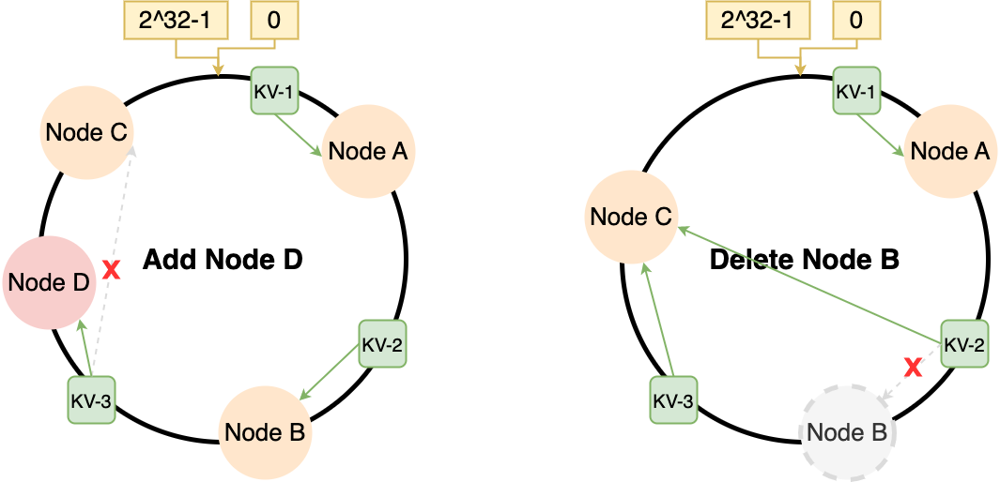

# 分布式节点模型&失效形式

零基础入门分布式系统 (Martin Kleppmann) 2. Models of distributed systems - s09g的文章 - 知乎 https://zhuanlan.zhihu.com/p/451584419

## *intro*

分布式节点中的每一台主机称为**节点 node**，节点可以是任何能够联网的设备

### 两种并发模型


* 在一台计算机上的并发称为**共享内存的并发 shared-memory concurrency**
* 大部分分布式系统的并发都是通过**信息传递 message-passing**实现的，但是也有少量的通过**远程直接内存访问 remote direct memory access RDMA ** 

### 集中式 vs. 分布式

* 集中式 centralized：由一台或多台主计算机组成中心节点，数据集中存储在这个中心节点上，并且整个系统的所有业务单元也都集中部署在这个中心节点上。每个终端client仅仅负责数据的录入和输出，而数据的存储与控制处理完全交由主机来完成
* 分布式 distributed：分布式系统是一个硬件或软件组成分布在不同的网络计算机傻姑娘，彼此之间仅仅通过消息传递进行通信和协调的系统

### 分布式系统的问题

现实世界并不完美，在一台计算机上通信都会出错，更遑论是多台通过信息传递实现并发的主机了。计算机本身进程、通信过程中会出现不胜枚举的错误，因此完全避免出错是不可能的

一个节点出错称为 fault，而整个系统全部停止工作则称为failure。分布式系统的目标是提供较高的 fault tolerance 容错性，即整个分布式系统中可能有某几个节点出错 fault，但这些错误不至于使整个系统 failure。尽管有故障，系统作为一个整体继续运作

处理故障的方式使分布式计算与单台计算机编程相比有根本性的不同，而且往往更难

## *Abstracted Scenarios*

### Two Generals Problem：通信行为


两将军问题是一个经典的分布式系统问题，用于说明在分布式环境中如何达成一致性

问题设定如下：假设有两位将军（将军 A 和将军 B）分别指挥两支军队，他们必须就攻击或撤退的决策达成一致，以确保军队的行动一致性。两位将军分别位于不同的地方，只能通过信使传递信息进行沟通，而且存在一些问题：信使可能会被敌人拦截，信使传递的消息有可能会出错或丢失

要解决这个问题，需要满足两个基本要求：

1. 一致性：两位将军需要就攻击或撤退的决策达成一致，以避免分散行动或误解
2. 可靠性：在敌人可能拦截、消息可能出错或丢失的情况下，仍能达成一致的决策

### Byzantine Generals Problem：节点行为


这次假设如果信息被传递了，那么肯定会被递达。但问题是存在 malicious general，他会篡改来自honest general的信息的内容，将 attack 换成 retreat，或者将 retreat 换成 attack

目标是让所有的honest generals就计划达成一致，但这是相当困难的

可以证明：只有当严格少于 $1/3$ 的 generals 是 malicious generals 的时候，该问题才有解除；也就是说，总数为 $3f+1$ 的 generals 中 malicious generals 人数不能超过 $f$ 

Byzantine is the worst assumption，如果能处理Byzantine，那么处理其他的情况也就不在话下

### 拜占庭将军问题的实际意义

真正的分布式系统会涉及到非常复杂的信任关系

在分布式系统中，有些系统明确地处理了一些节点可能被恶意行为者控制的可能性，这样的系统被称为**Byzantine fault tolerant 拜占庭容错**。近年来这种理念在区块链和加密货币的加持下变得很流行，其目的是提供某些保证，即使系统中的一些参与者积极地试图欺骗或破坏系统

## *Node和网络的性质*

当设计一个分布式算法时，**system model 系统模型**是我们对可能发生的故障的假设性具体描述

**系统模型**中呈现的假设由以下内容组成，考虑不同的假设会得到不同的，适用于不同场景的算法

* 网络行为
* 节点行为
* 计时行为

### Network behaviour 网络行为

Assumption: point-to-point communication between two nodes，即点到点通信 point-to-point 或单播通信 unicast

* Reliable (perfect) links：信息被发出就一定会被接收到，但信息可能会乱序
* Fair-loss links
  * 信息可能会丢失、重复、乱序，如果不断重发信息还是可以到的
  * Fair-loss 假设节点的fault只会持续一段时间

* Arbitrary links: a malicious adversary may interfere with messages (eavesdrop 窃听, modify, drop, spoof 欺骗攻击, replay 重放攻击)，这是最general的行为模型

### Node behaviour 节点行为

* Crash-stop (fail-stop)：（在任何时候）如果一个节点崩溃了，它一定有异常发生。崩溃后，该节点彻底停止运行
* Crash-recovery (fail-recovery)
  * 一个节点可能在任何时候崩溃，它可能在以后的某个时间恢复执行，假设重启后会丢失所有内存状态
  *  存储在磁盘上的数据在崩溃后仍然存在
* Byzantine (fail-arbitrary)：如果一个节点偏离了原有程序，它一定有异常发生。异常的节点可能做任何事情，包括崩溃或恶意行为。这是最general的

没有异常的节点被称为 **correct**

在网络的情况下，可以使用通用协议将一个模型转换为另一个模型。而在节点行为的不同模型中，情况就不是这样了。例如，为**crash-recovery 崩溃-恢复**系统模型设计的算法可能看起来与**Byzantine 拜占庭**算法完全不相关

### Timing assumptions

Timing assumptions 是关于系统的**同步性假设**。注意：下面的同步、异步等和IO中的同步、异步IO没有关系

* Synchronous，这是最好的假设，因为
  * Messages latency no greater than a known upper bound **消息延迟不超过已知的上限**
  * Nodes execute algorithm at a known speed **节点以可预测速度执行算法**
* Partially synchronous：系统在某些有限的（但未知的）时间段内是异步的，其余时间内是同步的
* Asynchronous
  * Messages can be delayed arbitrarily 信息可以被任意延迟
  * Nodes can pause execution arbitrarily 节点可以被任意暂停执行
  * No timing guarantees at all 完全没有任何的时间保证

实际上系统的大部分时间 most of the time 都可以被认为是同步的，但是这并不意味着always。即使只有很短的时间不是同步的，基于同步模型设计的程序往往会出现灾难性的崩溃。然而，整个系统中存在着大量的线程行为以及网络延迟，之前之所以说是大部分时间是同步的原因是因为非同步的行为都很快，占用的时间很短，但它们的重要性却很高。所以在实际系统中，假设一个同步系统模型是非常不安全的。**大多数分布式算法需要为异步或部分同步模型设计**

而异步模型则是另一个极端，为异步模型设计的算法通常非常稳健，因为它们不受任何临时网络中断或延迟峰值的影响。当然缺点就是异步模型算法非常复杂，复杂到很难为一些特殊情况来设计专门的异步处理，所以就会有 partially synchronous 这个折衷方案

partially synchronous 部分同步模型对许多实际系统很友好，但需要正确且谨慎地使用

### 实际中违反同步性的情况

* 以下场景会增加网络的延迟
  * 信息丢失，导致需要重试
  * 拥堵/拥挤导致排队
  * 网络/路线重新配置
* 以下场景会打破算法执行的稳定性
  * 操作系统的调度问题，如优先级变动
  * 基于Stop-the-world（STW 全局暂停）的垃圾回收（JVM Full GC）
  * Page faults 页面故障、swap 交换、thrashing颠簸

## *Failure detectors*

Failure detector更应该被命名为 Fault detector，因为它检测的是部分node的失效，而不是整体系统的failure

# 容错性：Replication

## *intro*

### Replication的作用

数据复制 replication 是指在多个节点上维护相同数据的拷贝，每个节点被称为**replica 副本**。数据复制是许多分布式数据库、文件系统或其他存储系统的标准特性之一

* 高可用性：**Replication是实现容错的主要机制之一**：若一个副本出现故障，我们可以继续访问其他副本上的数据备份
* 提高容错性
* 低延迟：client可以获取离自己距离近的数据节点
* 可扩展性与高性能：Replication也是为了性能考虑，可以和负载均衡算法结合来分散访问压力

### Replication的实现模式

* 主从复制 Leader & Follower/单主节点 Single-leader replication
* 多主节点复制 Multi-leader replication
* 无主节点复制 Leaderless replication

## *主从节点 leader & follower*

主从节点的应用可以看*SQL.md的binlog主从复制* 和 *NoSQL_Redis.md的主从复制部分*

### 步骤

原理：所有的客户端写入操作都发送到主节点，由该节点负责将更改数据的事件 data change events 发送到其他副本，每个副本都可以接受读请求，但内容可以是过期值

1. 指定某一个副本为主节点/主副本 leader/master/primary。当client写数据库时，必须把写请求首先发送给主副本，主副本首先将新数据写入本地存储
2. 其他副本全部称为从节点/从副本 follower/slave/secondary/hot standby。当主节点写入完成后，主节点会把数据更改作为 replication log or change stream 发送给所有的从节点。每个从节点收到后严格按照顺序写入到自己的本地
3. client从数据库中读数据时，既可以在主节点，也可以在从节点读取。但是要注意：**只有主节点才能接受写请求，所有从节点副本都是只读的**

### <span id="同步与异步复制">同步&异步复制</span>

一般关系型数据库既支持同步也支持异步复制，但其他数据库一般只能是二选一


* 同步复制 synchronous replication：主节点需等待从节点**确认完成写入后才会向用户报告**，且最新的写入其他client马上可见。上面的例子中Leader向Follower 1的写入就需要等待Follower 1的确认之后才可以返回给Leader。下面是若采用全同步的优劣势
  * 优势：一旦得到从节点的确认，可以确保所有节点的数据都保持在最新状态，因此若主节点发生故障，可以放心的从从节点获取数据
  * 劣势：若因为某些原因，比如网络延迟、堵塞等，从节点长时间没有确认，那么主节点也要阻塞，也就意味着整个系统的写入就阻塞了，可用性下降。且任何一个从节点的瘫痪都可能会导致整个系统阻塞
* 异步复制 asynchronous replication：主节点发送完数据或指令后**立即返回**，无需等待从节点完成对数据的操作。上面的例子中Leader向Follower 2写入后就直接返回了。下面是若采用全异步的优劣势
  * 优势：即使有从节点挂了也不会对系统的写入造成影响，系统的吞吐性能好
  * 劣势：无法确保从节点的数据是最新的，若主节点挂了，若此时没有从节点保持最新状态，主节点的数据就丢失了

实际中为了平衡两种复制模式的优劣势，会采用**半同步 semi-synchronous** 的复制模式。即将一个从节点设置为同步，其他的从节点设置为异步的。这样做可以保证系统中至少有两个节点（1个主节点、1个从节点）拥有完整的数据，又不会对系统的性能造成太大的影响

补充：链式复制 chain replication 是同步复制的一种变体，用来提高复制性能与系统可用性的方式，已经在Microsoft Azure等系统中实现

### 配置新的从节点

配置新的从节点时不是简单的复制主节点，因为与此同时可能还在不断的写入，所以采用的是类似MySQL MVCC的快照机制

1. 在某个时间点对主节点的数据产生一个一致性快照副本以避免长时间的锁定整个数据库
2. 将快照副本数据拷贝到从节点
3. 从节点连接到主节点并请求主节点在快照之后到当前的数据改变，这个时间点在MySQL中称为 binlog coordinates
4. 获得日志之后，从节点写入这些变更，这个过程称为追赶 caught up

### 利用主从复制来处理节点失效 node outage

* 从节点失效：基于日志系统的追赶式恢复 catch-up recovery
* 主节点失效：节点切换 Failover
  1. 确认主节点失效：没有特别有效的检测方法，大部分系统采用通过心跳确认存活和超时机制
  2. 选举新的主节点：典型的共识问题，通过共识算法解决
  3. 重新配置系统使被选举出来的新主节点生效

### 复制日志的实现

* 基于语句的复制
* 基于预写日志 WAL 传输
* 基于行的逻辑日志复制
* 基于触发器的复制

## *弱一致性模型与复制滞后*

### 一致性

<https://www.codedump.info/post/20220710-weekly-22/>

<https://zhuanlan.zhihu.com/p/48782892>

在[CAP理论](#CAP)中，给出了一致性的定义：所有副本保持同步，数据更新后所有副本都能立即更新。注意：分布式中的一致性和数据库ACID的一致性是不同的！

一致性的定义可以有不同的层次和模型，以下是几种常见的分布式系统一致性模型

* 强一致性 Strong Consistency/可线性化： 强一致性要求在任何时刻，系统的所有节点都能够看到相同的数据和状态。即，对于任何操作，如果一个节点完成了该操作，那么其他节点在随后的访问中必须能够看到该操作的结果。强一致性通常需要使用同步协议和全局状态复制等机制来实现，但可能会牺牲一些性能和可用性。比如线性一致性 Linearizbility、顺序一致性 Sequential consistency
* 弱一致性 Weak Consistency： 弱一致性允许在系统中的不同节点之间存在一定的数据和状态的不一致性窗口。在弱一致性模型中，系统允许在数据更新之后的一段时间内，不同节点之间可能观察到不同的值。弱一致性通常提供了更高的可用性和性能，但可能需要应用程序处理一致性问题。比如因果一致性 Causal consistency（满足happens-before关系即可）
* 最终一致性 Eventual Consistency： 最终一致性是一种弱一致性模型，它保证在没有新的更新发生的情况下，系统最终会达到一致的状态。最终一致性允许在更新操作后的某个时刻，系统中的所有节点最终收敛到相同的状态。最终一致性通常通过版本控制、增量复制或基于时间戳的冲突解决来实现

**线性一致性>顺序一致性>因果一致性>最终一致性**

一致性级别 Consistency Levels： 一些分布式系统允许在不同的数据访问操作中使用不同的一致性级别。例如，可以将读操作配置为强一致性，而将写操作配置为最终一致性，以平衡一致性和性能的需求。这样的一致性级别可以根据应用程序的需求和场景进行灵活调整

### 最终一致性

在[同步&异步复制](#同步与异步复制)里说了，对于有大量节点的分布式系统来说，因为同步复制的低可用性和低扩展性，实际上不可能采用全同步，而是采用了半同步，即系统里会有大量的异步复制节点

这造成的问题就是无法确保所有数据都处于最新状态，当client从从节点度数据的时候就有可能读到的是过期的数据。但是这种不一致只是暂时的状态，若给足够的时间，从节点最种会赶上并与主节点保持一致，将这种效应称为**最终一致性 eventual consistency，也称为弱一致性 weak consistency**，与线性化这种强一致性模型形成对比

问题在于，“最终”这个词是非常含混不清的，没人知道到底要花多少时间，才能让从节点完成同步

当从节点滞后的太久，就会引发一系列的问题，将这种情况称为**复制滞后问题 replicaiton lag**。下面给出3种复制滞后可能引发的问题：读自己的写、单调读、前缀一致读

最典型的最终一致性系统有DNS、Cassandra的Gossip通信协议等

### 读自己的写 read own write

用户在更新数据后不久就马上刷新查看数据，可能因为网络延迟等原因数据还没有存储到从节点中，此时看起来就好像是刚刚写入的数据丢失了

下面的图就展示了这种情况，因为某些原因Leader往Follower 2复制的时间滞后了一些，所以当User去Follower 2查的时候，不能够找到自己刚写的数据


对于这种情况，需要提供**写后读一致性 read-after-write consistency**，也称为**读写一致性 read-your-writes consistency。该机制能够保证若用户重新加载资源，他们能够看到自己最近提及哦啊的更新，但对其他用户则没有任何保证

基于主从复制的系统可以通过以下方法来实现读写

* 若用户访问可能会被修改的内容，就从主页点读取；否则就从从节点读取
* 若内容大部分都会被用户修改，那么上面的方法就不行了，因为此时大部分内容都要通过主节点周转。此时可以通过最近更新时间来判断是否通过主节点
* 利用逻辑时间戳

### 单调读 monotonic read

有时候连续的多次访问可能会因为**访问的是不同步的多个从节点**，因而导致每次看到的内容都不同

单调读一致性可以确保不会发生这种异常，这是一个比强一致性若，而比最终一致性强的保证

实现单调读的方式很简单，就是让每个用户以其用户ID的哈希值为依据总是从固定的一个副本执行读取。不过当副本失效时，就要重新路由到另一个副本

### 前缀一致读 consistent prefix read

## *分布式系统处理并发模型*

### 从ACID到BASE

在分布式系统中若采取数据库事务的ACID非常困难，因为分布式系统中把一个完整的事务由拆分成了可能在不同节点上的子事务，又因为信息传递的错误层出不穷，维持事务ACID极其困难。强行设计一套分布式ACID会很复杂，而且可能会出现系统的可用性和一致性的严重冲突。因此在分布式系统中常常采用的是BASE特性，即

* 基本可用 Basically Available：系统在出现故障或部分故障的情况下仍然能够保证基本的可用性，即系统仍能正常对外提供服务
* 软状态 Soft State：系统中的数据状态不需要实时保持一致，允许数据在一段时间内是不一致的，直到最终达到一致性
* 最终一致性 Eventual Consistency：系统保证在一定时间内达到数据的一致性，即在经过一段时间后，所有副本或节点都会最终达到一致的状态

BASE模型是为了解决ACID模型在分布式系统和大规模数据处理中的限制而提出的。它追求系统的可用性、性能和扩展性，允许在一段时间内数据的一致性可能是部分的或延迟的，但最终会达到一致状态。但是BASE是非常 vague 的，因为它基本没有承诺任何东西，我们唯一可以确认的就是BASE不是ACID

ACID和BASE模型代表了两种不同的事务处理和数据一致性的理念，开发人员和架构师需要根据具体的业务需求和系统特点选择适合的模型。ACID适用于强一致性要求和传统的关系型数据库，而BASE适用于高可用性、大规模分布式系统和NoSQL数据库

### 分布式系统中事务的替代方案

在分布式系统中，事务的实现可能会面临各种挑战，如高延迟、网络故障、节点故障等。为了克服这些挑战，一些替代方案被提出来用于处理分布式系统中的数据一致性和并发控制。以下是一些常见的事务替代方案：

1. 分布式事务：分布式事务是一种支持跨多个节点的事务操作的解决方案。它采用了各种技术，如两阶段提交（Two-Phase Commit，2PC）和三阶段提交（Three-Phase Commit，3PC）协议，来确保跨多个节点的事务的一致性和原子性。分布式事务能够在分布式环境下实现较强的一致性，但也带来了较高的复杂性和性能开销
2. 基于日志的复制：在分布式系统中，通过将数据操作记录到日志中，然后在其他节点上异步地复制和应用这些操作，可以实现数据的复制和一致性。这种方式可以提供较高的性能和可扩展性，但也可能会导致数据的延迟和不一致性
3. 最终一致性：最终一致性是一种宽松的一致性模型，允许在一段时间内数据处于部分一致的状态，最终趋于一致。这种模型适用于一些特定的应用场景，如大规模分布式系统和互联网应用。最终一致性通过异步复制和数据合并等机制来实现，追求系统的可用性和性能
4. 乐观并发控制：乐观并发控制是一种在分布式系统中处理并发访问的策略。它通过在读取和写入操作中引入版本号或时间戳等机制来检测和解决并发冲突。乐观并发控制不需要显式的锁机制，允许并发访问，并通过冲突检测和冲突解决来维护数据的一致性

这些替代方案在分布式系统中用于处理数据一致性和并发控制时，各有优势和限制。具体的选择取决于系统需求、性能要求和可扩展性需求等因素。在设计和实施分布式系统时，需要综合考虑这些方案，并根据具体情况选择适当的策略

## *多主节点复制*

原理：系统存在多个主节点，每个都可以接受写请求，client将写请求发送到其中的一个主节点上，由该主节点负责将更改数据的事件同步到其他主节点和自己的从节点。同时该主节点也扮演着其他主节点的从节点的角色

### 适用场景

* 多个数据中心：每个数据中心设置一个主节点，多个数据中心之间协同
* 离线客户端操作：每个客户端在离线的时候作为主节点，然后联网后追赶
* 多人同时编辑文档

### 处理写冲突


考虑上面这种情况，有两个主节点，两个User分别向两个Leader写入对id=123的目标的修改指令，User1要将其title改成B，而User2要将其title改成C。两次修改都成功返回了，但是当两个主节点同步的时候，因为找不到id=123的对应title，所以发生了冲突，merge失败

若应用层可以保证**对特定记录的写请求总是通过同一个主节点**，这样就不会发生写冲突。但是若主节点故障，需要切换主节点的时候，这种方法就不再有效了

可以确定的是复制模型至少应该确保数据在所有副本中最终状态一定是一致的，即收敛于一致状态 converging toward a consistent state。数据库必须以一种收敛趋同的方式来解决冲突。大致有以下几种方式

* 给**每个写入**分配唯一的ID，比如时间戳、UUID、哈希值等。挑选最高ID的为胜利者，这跟主从复制中时间戳最近的为最终结果是一种思想。若基于时间戳，则这种技术称为最后写入者获胜 Last Writer Wins LWW。但这样的方案可能会导致写入ID低的数据丢失
* 给**每个副本**分配一个唯一的ID，并制定规则，序号高的优先，同样的，这样的方案可能会导致副本ID低的数据丢失
* 以某种方式将冲突数据拼接在一起
* 依靠应用层，让用户事后自己手动解决

### Topology of Leaders


多主节点之间的同步要遵从一定的顺序，最常用的是3种拓扑关系

* 环形拓扑 Circular：每个节点接受来自前序节点的写入，并将这些写入转发给后序节点。MySQL默认是环形拓扑
* 星形拓扑 Star：一个指定的根节点将写入转发给所有其他节点（相当于是主节点的主节点）。星形拓扑可以推广到树形结构
* 全部-至-全部拓扑 All-to-All：环形和星形拓扑存在单点故障问题，可以用All-to-All来避免。但All-to-All又会存在违反因果关系的问题，需要借助版本向量等检测并发写入技术

## *无主节点复制时，节点失效写入db*

### 无主节点复制的设计方法

原理：放弃主节点，仅保留从节点，允许任何副本直接接受来自客户端的写请求。Client将写请求发送到多个节点上，读取时从多个节点上并行获取，以此检测和纠正某些过期数据

无主节点复制是一种去中心化的设计思想，它有两种设计思路

1. 选择放弃主节点，允许任何副本直接接受来自client的写请求。类Dynamo数据库都采用了这种设计思路
2. 由一个协调者节点 coordinator node 代表client进行写入，不过协调者并不负责维护写入顺序

### Read repair 读修复 & Anti-entropy 反熵


现在考虑第一种方案，若有3个节点，User1234向它们同时发出写入，其中节点3失效了。那么在节点3恢复之后，3个节点之间的信息必然是不同的。在节点同步之前，为了克服不同步问题，client取数据的时候是向所有数据取，然后通过比较版本号得到最新的数据

**出错的节点在重新上线后，该如何追赶数据差异？**Dynamo风格采用了下面两种方式

* 读修复 read repair：若取数据的时候收到不一致的数据，client可以把新数据echo回那些存的是过期数据的replica。这种方法主要是和那些被频繁读取的场景
* 反熵过程 anti-entropy：一些数据存储有后台进程在不断查找副本之间数据的差异，然后进行复制同步。反熵过程并不保证以特定的顺序复制写入，并且会引入明显的同步滞后

### Read and Write quorum 读写quorum

收到多少个副本的写确认才能判定写成功？

若一个系统中有 $n$ 个副本，得到了 $w$ 个写入确认，读取必须至少查询 $r$ 个节点，得到 $r$ 个读确认，那么当 $r+w>n$ 时，读取的节点中一定会包含最新值，然后通过比较版本号就可以取到最新值了。满足这些 $r$ 和 $w$ 的值称为仲裁读、仲裁写

$n$ 是偶数的时候要当心，一般来说都会用奇数

## *Qurum一致性的局限性*

副本也有可能因为硬件等问题而失效

暂时假设每个副本有 $p$ 的概率出错，并且每个副本是独立的。那么所有 $n$ 个副本同时出错的概率是 $p^n$，而系统中任意时刻至少有1个副本fault的概率则是 $1-(1-p)^n$。代入数字可以发现，随着副本个数 $n$ 上升，虽然每时每刻都很有可能有节点副本失效，但所有副本同时全部失效的可能性是很小的

### 监控旧值

### 宽松quorum与数据回传 handoff

## *检测并发写*

# 分片与负载均衡

## *负载均衡算法*

负载均衡算法是一种分配工作负载到多个服务器的算法，以提高系统的可扩展性、可用性和性能。以下是几种常见的负载均衡算法：

1. 轮询算法（Round Robin）：将请求依次分配给每个服务器，依次轮流服务每个请求。该算法简单易懂，适用于多个服务器的负载相近的情况。只适用于每个节点的数据都是相同的场景，访问任意节点都能请求到数据，**并不适用分布式系统**
2. 随机算法（Random）：将请求随机分配给每个服务器，每个服务器被选择的概率相同。该算法适用于服务器负载相近的情况
3. 最少连接算法（Least Connections）：将请求分配给当前连接数最少的服务器。该算法适用于负载不均衡的情况
4. IP哈希算法（IP Hash）：将请求的IP地址哈希成一个固定的值，然后将该值对服务器数量取模，将请求分配给相应的服务器。该算法适用于对于每个客户端的请求都需要分配到同一个服务器的情况。数据迁移代价很大，**不适合节点数量变化的场景**
5. 加权轮询算法（Weighted Round Robin）：将请求依次分配给每个服务器，但是可以根据服务器的权重进行分配，权重越高的服务器分配到的请求越多。该算法适用于服务器性能不同的情况
6. 加权最少连接算法（Weighted Least Connections）：将请求分配给当前连接数最少的服务器，但是可以根据服务器的权重进行分配，权重越高的服务器分配到的请求越多。该算法适用于服务器性能不同且负载不均衡的情况

## *分片*

Sharding Partition

## *一致性哈希*

https://www.jianshu.com/p/4163916a2a8a

### 用IP哈希算法的问题

IP哈希是很容易想到的，就是**对节点的个数N进行取模运算**。但是核心问题是：**若节点数量发生变化，即对系统做扩容或缩容时，必须迁移改变了映射关系的数据**，否则会出现映射关系紊乱从而查询不到数据的问题

为了解决这个问题，当对分布式系统进行节点的扩容或缩容时，比如要进行数据迁移，最坏的情况下所有节点的数据都要变动。则节点迁移次数的复杂度为***O(N)***，这个代价是很大的。**从IP哈希得到的改进思路是要尽量减少改变节点数量时的迁移次数**

### 一致性哈希过程

一致性哈希算法也是进行取模运算，**但它是对一个固定值 $2^{32}$ 进行取模运算**。哈希环就是一个由 $2^{32}$ 个整数组成的圆形。一致性哈希采用**MD5**作为其哈希算法。虽然MD5目前已经无法防止碰撞攻击，但对于分布式系统的节点数量，出于效率的考量，MD5足够了

一致性哈希是**将存储节点和数据都映射到一个首尾相连的哈希环上**，这是通过两步哈希，即分别对Node和KV对数据做哈希运算实现的

1. **对存储节点进行哈希计算**，即对存储节点做哈希映射，比如根据节点的 IP 地址进行哈希：`hash(<ip>+<port>)`
2. 当对数据进行存储或访问时，**对数据key进行哈希映射**：`hash(key)`

两步哈希完成后，KV对数据要怎么分配给哪一个node呢？**将KV对数据分配给顺时针方向找到的第一个node**

比如说下面的例子中，KV-1的Key对应的Hash值按顺时针第一个找到的第一个Node是Node A，KV-2和KV-3对应的分别是Node B和 Node C


### 有效应对扩容和缩容



* 扩容：假设新增了节点D，且此时KV-3的下一个顺时针节点是节点D，那么只需要进行一次数据迁移
* 缩容：假设减少了节点B，那么此时KV-2要从节点B（备份）迁移到节点C上，只需要进行一次数据迁移

### 数据倾斜 Data skew


若很巧合的大部分数据都集中在一个节点的一侧，那么此时所有数据的压力都集中到了该节点上，也就破坏了一致性哈希的分散负载的努力了。而且更可怕的是当该节点扛不住下线的时候，首先要经历很多的数据迁移，其次甚至可能会引起雪崩式的节点崩溃，也就是Node B，Node C相继扛不住，那这时候整个系统崩溃了

### 通过虚拟节点提高均衡度

要想解决数据在哈希环上分配不均匀的问题，就要有大量的node，值要node越多，哈希环上的数据分布的就越均匀

实际中可能不会有那么多的node，因此可以引入**虚拟节点**，即**对一个真实节点做多个副本 replication**。具体做法是不再将真实节点映射到哈希环上，而是将虚拟节点映射到哈希环上，然后再将虚拟节点映射到实际节点，因此这里有两层映射关系


在实际的工程中，虚拟节点的数量会大很多，比如 Nginx 的一致性哈希算法，每个权重为 1 的真实节点就含有160 个虚拟节点。有了虚拟节点后，还可以为硬件配置更好的节点增加权重，比如对权重更高的节点增加更多的虚拟机节点即可。**带虚拟节点的一致性哈希方法不仅适合硬件配置不同的节点的场景，而且适合节点规模会发生变化的场景**

## *应用案例*

Dynamo启发了Riak、Cassandra、Voldemort等数据库，这一类数据库被统一称为Dynamo风格数据库

### Amazon Dynamo

Dynamo是Amazon设计和开发的高度可扩展的分布式键值存储系统。它在2007年首次发布，并为亚马逊的核心服务（如购物车、用户偏好和会话管理等）提供了可靠的存储支持。以下是一些关键特点和设计原则：

1. 分布式：Dynamo被设计为一个分布式系统，数据被划分为多个分区 partition并存储在多个节点上。每个节点负责管理和服务其中的一部分数据，使得Dynamo具有高度的可扩展性和容错性
2. 高可用性：Dynamo采用了主从复制的方式来实现高可用性。每个分区在多个节点上进行复制，并选举一个节点作为主节点处理读写请求，其他节点则作为备份节点。当主节点失效时，系统可以快速切换到备份节点，实现故障恢复
3. 松散的一致性：Dynamo采用了最终一致性模型。即使在节点间存在网络分区或节点故障的情况下，系统仍然保证最终一致性。这种松散的一致性模型允许更高的可用性和性能，但可能会导致数据的读写冲突和冲突解决的复杂性
4. 基于键值的数据模型：Dynamo是一个键值存储系统，每个数据项由一个唯一的键和与之关联的值组成。它提供了简单而灵活的数据模型，适用于各种类型的应用场景
5. 可扩展性和性能：Dynamo的设计目标之一是支持海量数据和高并发访问。Dynamo利用一致性哈希来实现数据的分布和负载均衡。通过分区和负载均衡的方式，Dynamo可以水平扩展以适应不断增长的数据和请求负载，并且能够提供低延迟的读写操作

需要注意的是，Dynamo并非公开可用的开源软件，而是亚马逊内部使用的专有系统。然而，它的设计思想和原则对于理解和构建其他分布式存储系统具有重要的参考价值。在实际应用中，基于Dynamo的开源实现，如Cassandra和Riak，已经成为流行的分布式数据库选择

### Facebook Cassandra

Cassandra是一个高度可扩展、分布式、开源的NoSQL数据库系统，最初由Facebook开发，并于2008年开源。它有以下特点和设计原则：

1. 分布式架构：Cassandra是为分布式环境设计的，可以在多个节点上存储和处理数据。数据可以水平划分成多个分区，并分布在集群中的不同节点上，从而实现高度的可扩展性和容错性
2. 高可用性：Cassandra采用了分布式的主从复制模型。每个分区在多个节点上进行复制，其中一个节点被选举为主节点（负责处理写操作），其他节点作为备份节点（负责处理读操作）。当节点故障时，系统可以快速切换到备份节点，实现故障转移和高可用性
3. 弹性一致性：Cassandra采用了最终一致性模型。在分布式环境下，数据副本之间可能存在延迟和网络分区，因此Cassandra更关注数据的可用性和分区容忍性。在不同副本之间的数据同步过程中，Cassandra采用了一系列的调解策略，以实现弹性一致性
4. 列式存储：Cassandra使用列式存储模型，其中数据被组织为行和列的集合。每行由一个唯一的主键标识，并且可以具有灵活的列结构，每个列都可以有不同的名称和值。这种灵活的数据模型适用于动态和半结构化的数据，可以满足各种类型的应用需求
5. 查询语言：Cassandra使用CQL（Cassandra Query Language）作为其查询语言，类似于SQL，但具有一些扩展和特定的语法。CQL支持常见的查询操作，如插入、更新、删除和查询数据，以及范围查询、过滤和排序等功能
6. 可扩展性和性能：Cassandra的设计目标之一是支持大规模的数据集和高并发的读写操作。通过将数据分布在多个节点上，并使用一致性哈希进行数据定位，Cassandra可以水平扩展以适应不断增长的数据和请求负载。它还具有快速的读写性能和低延迟的特点

# 同步与顺序保证

## *分布式系统中的Clock*

### 为什么要用时钟

* Schedulers, timeouts, failure detectors, retry timers 调度器、超时、故障检测器、重试定时器
* Performance measurements, statistics, profiling 性能测量、统计、分析
* Log files & databases: record when an event occurred 日志文件和数据库：记录事件发生的时间
* Data with time-limited validity (e.g. cache entries) 有时间限制的数据（如缓存条目）
* Determining order of events across several nodes 确定几个节点上的事件顺序

### 时钟类别

* Physical clock：时间物理的时间，比如说过去了多少秒
* Logical clock：记录事件，比如说发送了多少条信息

注意：数字电子学中的时钟（震荡器）$\neq$ 分布式系统中的时钟（**时间戳 timestamp**的来源）

### 物理时钟

* 石英钟 Quartz clock 由于其制造精度存在漂移问题 drift
* 原子钟非常精确，但比较贵。实际上一秒的定义就是铯-133原子的一个特定共振频率的9,192,631,770个周期
* 通过装载原子钟的卫星群来进行定时

### UTC计时标准

全世界的时间标准采用协调世界时 Coordinated Universal Time UTC，它以原子时钟为基础，但考虑了地球自转变化的修正

* Greenwich Mean Time GMT 格林尼治标准时间是UTC的baseline
* International Atomic Time TAI 国际原子时是基于原子钟计时的

TAI非常精确，然而问题在于地球的运行并没有那么精确，根据宇宙环境的变化虽然总体恒定，但会存在一些误差。而对于人类而言，我们的UTC基准应该是地球的运行，而不能是完全跟着TAI来走。所以UTC就要对自己做出一些修正，使得UTC和地球的运行大致一致

Leap second 闰秒和闰年相似，是为了弥补TAI和地球运行之间的微小差异而为调整UTC引入的，然而这对计算机同步时间带来了巨大的干扰，因为操作系统和分布式系统经常依靠高精度的时间戳来精确测量时间，系统要知道到底有多少闰秒。而不同节点之间的高精度时间戳同步是非常苦难的，好不容易同步的时间戳又要随着UTC的微调而进行调整

### 计算机是如何表示时间戳的？

* Unix time：时间戳0从1970年1月1日 00:00:00 UTC 开始，这一时刻被称为**纪元epoch**

* ISO 8601: year, month, day, hour, minute, second, and timezone offset relative to UTC

  example: 2021-11-09T09:50:17+00:00

### 闰秒问题

软件中最常见的方法是直接忽略闰秒，假装它们不存在，并希望这个问题能以某种方式消失。Unix时间戳和POSIX的标准都采用了这种方法

然而掩耳盗铃是会有代价的，比如2012年6月30日的闰秒时刻就引发了Linux kernel中的 live clock bug

如今，部分软件会显示地处理闰秒，而其他程序依然会忽略它们。当前广泛使用的一个可行的解决方案是，当正数闰秒发生时，不是将其插入23:59:59和00:00:00之间，而是通过在这段时间内故意放慢时钟速度（或在负数闰秒的情况下加快时钟速度），将额外的秒数分散到该时间前后的几个小时。这种方法被称为**smearing the leap second 涂抹闰秒**（这并非没有问题）。这只是一个实用的替代方案，可以让所有的软件适应闰秒，但不总是可行方案

## *时钟同步*

计算机系统会通过内置的石英钟来计时，然而因为quartz drift所以需要不时通过远程的原子钟来矫正

最常用的矫正方法是 **Network Time Protocol NTP 网络时间协议**，所有主流的OS都内置了NTP client

### 估计时钟偏差 clock skew


1. NTP client 将一条NTP request 和此时的client时间戳 $t_1$ 一同发送出去
2. NTP server 收到 request 后将自己收到 NTP request 的时间戳 $t_2$ 以及处理完毕的时间戳 $t_3$ 一同打包作为 response 回复给 NTP client
3. NTP client 将收到 NTP server 的 response的时间戳标记为 $t_4$

在网络传播上花费的RTT为下式
$$
\delta=\underbrace{(t_4-t_1)}_{RTT}-\underbrace{(t_3-t_2)}_{server\ process}
$$

估计单程网络延迟为总网络延迟的一半，那么当response到达client的时候，client的时间戳应该为 $t_3+\delta/2$

因此可以计算需要调整的 client与server之间的 clock skew 时钟偏移为
$$
\theta=t_3+\frac{\delta}{2}-t_4=\frac{t_2-t_1+t_3-t_4}{2}
$$

对于这种估计，若延迟是由客户和服务器之间的地理距离主导的，那么假设大概率成立，但是若网络中的排队时间是影响延迟的重要因素，那么那么请求和响应延迟之间可能有很大的差异。不幸的是，大多数网络没有给节点提供任何关于特定数据包所经历的实际延迟的指标

### 调整客户端的时钟

根据 clock skew 的大小，有以下三种操作

* $\lvert\theta\rvert<125\ ms$ **时钟回转 slewing**：client回调整与自己的时钟速度，从而抵消skew
* $125\ ms<\lvert\theta\rvert<1000\ s$ **步进 stepping**：此时的skew比较大，直接采取突变式的调整方案，即强行将其时钟设置为估计的正确时间。任何在客户端观察时钟的应用程序都会看到时间突然向前或向后跳跃
* $\lvert\theta\rvert>15\ min$ **进入 panic 状态**：此时client会认为OS哪里出错了，需要交给管理员人工调整

### Monotonic clock

步进 stepping 可能会对某些API或者系统调用造成严重的干扰，可以用 monotonic clock 单调时钟来规避，monotonic 即使有 stepping 还是会保持向前移动。缺点是来自单调时钟的时间戳本身是没有意义的，因为monotonic 测量的是自某个任意参考点以来的时间，例如这台计算机启动以来的时间

* Time-of-day clock 受OS时间戳的影响 CLOCK_REALTIME
* Monotonic clock CLOCK_MONOTONIC
  * Java
  * Linux 

## *因果一致性：一种弱一致性*

### 全序和偏序

* **全序 Total order** 是指，集合中的**任两个元素之间**都可以比较的关系。 比如实数中的任两个数都可以比较大小，那么“大小”就是实数集的一个全序关系
* **偏序 Partial order** 是指，集合中**只有部分元素之间**可以比较的关系。 比如复数集中并不是所有的数都可以比较大小，那么“大小”就是复数集的一个偏序关系

举个例子

* 自然数的集合是全序，整数的集合是全序
* 复数的集合是偏序，1和100i是无法比较的，没有意义

### 定义 happens-before relation/causality


定义 causality/event a happens before event b $a\rightarrow b$ iff 下面情况中的一种

* a和b发生在同一个节点（进程）中，且a发生在b之前，则 $a\rightarrow b$。比如上图中的 $a\rightarrow b,\ c\rightarrow d$；或
* a和b发生在不同的节点（进程）中，但a是信息的发生者，而b是信息的接收者，则 $a\rightarrow b$。比如上图中的 $b\rightarrow c$；或
* 传递规律：there exists an event c such that $a\rightarrow c$ and $c\rightarrow b$

若 $a\rightarrow b$ 的关系不成立，那么a和b是<span id="de并发">并发的</span>，即 $a\Vert b$。比如上图中有 $a\Vert f,\ b\Vert f,\ e\Vert c,\ e\Vert d$

因此可以说**因果关系至少可以被定义为偏序，而非全序**

* When $a\rightarrow b$, then a **might have caused** b

* When $a\Vert b$, we know a **cannot have caused** b

* 定义 $\prec$ 是一个严格全序，可线性化一定意味着全序
  $$
  (a\rightarrow b)\Rightarrow(a\prec b)
  $$

## *Lamport clocks*

<http://yang.observer/2020/07/26/time-lamport-logical-time/>

### Logical clocks

物理时钟的时间戳可能与因果关系不一致，即使这些时钟是经过类似NTP的协议同步。相比之下，**logical clocks 逻辑时钟**的重点是正确捕捉分布式系统中的事件顺序

逻辑时钟并不是物理时钟，而是一种**基于时间戳的逻辑计数器**。它通过在系统中的事件上增加逻辑时钟值来记录事件的发生顺序。**当节点执行一个本地事件时，它会将逻辑时钟值加一**，从而使该事件的逻辑时钟值大于之前发生的事件。当节点之间进行通信时，它们会相互交换逻辑时钟值，通过比较逻辑时钟值的大小来确定事件的先后顺序

### Lamport 逻辑时钟算法

分布式系统中每个进程 $P_i$ 保存一个本地逻辑时钟值 $C_i$，$C_i(a)$ 表示进程 $P_i$ 发生事件a时的逻辑时钟值，$C_i$ 的更新算法如下

1. 进程 $P_i$ 每发生一次事件，$C_i+1$
2. 进程 $P_i$ 给进程 $P_j$ 发送消息，需要带上自己的本地逻辑时钟 $C_i$
3. 进程 $P_j$ 接收消息，更新 $C_j$ 为 $\max{\left(C_i, C_j\right)}+1$

对上面的例子应用Lamport时钟算法可以得到A和B进程中每个事件的逻辑时钟值（假设两个进程刚开始的逻辑时钟值都为0）


从以上算法可以得到两个通用的结论

1. 同一个进程内的两个事件a和b，若 $a\rightarrow b$，则 $C_i(a) < C_i(b)$
2. 若a是 $P_i$ 进程的消息发送事件，b是 $P_j$ 进程该消息的接收事件，那么 $C_i(a)<C_j(b)$

从上面两个结论又可以得到：**对于任意两个事件a和b，若 $a\rightarrow b$，则 $C(a)<C(b)$**

但是，将上面的条件和结论兑换就不成立了，也就是说若 $C(a)<C(b)$，不能推出 $a\rightarrow b$。我们可以用上面的例子来举反例：比如当 $C_A(e)<C_B(d)$，但实际上这两个事件是[并发](#de并发)的。也就是说对于任意事件，$a\rightarrow b$ 是 $C(a)<C(b)$ 的充分不必要条件

从这个结论中我们可以得到：**Lamport时钟算法得到的是一种偏序关系，即只有部分事件可以比较大小**

### 全序事件集

可以加入另外一个条件，即判断两个进程号的大小，可以使整个事件集合变成一种全序关系，任意两个事件之间都可以比较顺序

定义全序关系 $\Rightarrow$：$P_i$ 进程的事件a和 $P_j$ 进程的事件b如果满足下面两个关系中的**任何一个**，则称 $a\Rightarrow b$

1. $C_i(a)<C_j(b)$; or
2. $C_i(a)=C_j(b)\ \&\&\ P_i<P_j $

运用上面的全序关系定义，之前例子中的顺序变成 $a\Rightarrow f\Rightarrow b\Rightarrow e\Rightarrow c\Rightarrow d$

## *全序关系的应用：分布式锁*

### 中心服务器派发锁的问题

运用分布式锁首先要满足如下关系

1. 获得锁的进程必须释放锁后，其他进程才能获得锁，也就是一个互斥锁
2. 不同进程获得锁的顺序必须和请求的顺序一致
3. 如果每个进程最终都会释放锁，那么所有的进程发出的锁请求最终都能满足


在常见的分布式锁实现中，一般都有一个**中心服务器**来控制锁的获取和释放，但是中心服务器很容易遇到网络延迟问题导致违反要求2。比如上面的例子中，P1的a事件是向中心服务器P0发送锁请求，然后b事件是给P2发信息。当P2收到信息后也给P0发了条请求锁的信息（d事件）。然而由于一些原因，P0先收到了P2的锁请求，即先e后f，导致P2先获得了锁

### Lamport的改进

不需要中心服务器，前提条件：假设fair-loss，即两个进程间的消息可以有延迟，但最终一定能送达，而且两个进程间的消息是保序的

每个进程保存了本地逻辑时钟 $T_i$，它的更新算法和前文介绍的Lamport逻辑时钟一样，同时每个进程保存了一个**队列**，队列中的每个元素是 $\left[T_m:P_i\right]$。$T_m$ 是消息发送时的本地逻辑时钟，$P_i$ 是进程 $i$ 的进程号。算法如下

1. 若进程 $P_i$ 需要获取锁，发送 $\left[T_m:P_i\right]$ 消息给所有其他进程
2. 当进程 $P_j$ 收到锁请求消息后，将收到的 $\left[T_m:P_i\right]$ push进本地队列，更新本地逻辑时钟 $T_j$，然后回复一个带 $T_j$ 的ACK消息给 $P_i$
3. 当以下两个条件**同时满足**时，进程 $P_i$ 获得锁
   1. 按照全序关系 $\Rightarrow$ 排序后（即按照 $T_m$ 从小到大排序），$\left[T_m:P_i\right]$ 在本地队列的队首
   2. 进程 $P_i$ 收到过其他进程发来的ACK消息，且ACK消息中的时钟 $T_j$ 大于锁请求时的时钟 $T_m$
4. 若进程 $P_i$ 需要释放锁，先从本地队列中pop掉 $\left[T_m:P_i\right]$，然后给其他所有进程发送锁释放消息，消息中带上当前时钟 $T_i$
5. 进程 $P_j$ 收到锁释放消息后，从本地队列中pop掉 $\left[T_m:P_i\right]$

这种分布式锁的问题在于**不能容忍节点fault**，一旦有进程崩溃，整个系统就无法运作了。但它对后面的Paxos等共识算法产生了重要影响

### 分布式锁例子


上图有三个进程 $P_0, P_1, P_2$。图中每个节点上的文字第一行数字表示本地逻辑时钟 $T_i$，第二行方括号表示本地队列，第三行的字母表示节点名字。三个进程的本地时钟都初始化为0

1. 首先 $P_0$ 发出获取锁请求给 $P_1$ 和 $P_2$，消息内容为 $[1:0]$
2. $P_1$ 和 $P_2$ 收到后，更新本地时钟值，把 $[1:0]$ push进本地队列，然后返回ACK给 $P_0$，并带上各自的本地逻辑时钟值
3. $P_0$ 在g节点收齐ACK后，发现满足算法第3条中的两个条件，自己得到了锁
4. $P_1$ 在h节点也想获取锁，发送锁请求给 $P_0$ 和 $P_2$，消息内容为 $[4:1]$。同时把 $[4:1]$ 也插入本地队列中，但全序排序后，$[1:0] < [4:1]$，所以 $[4:1]$ 排在 $[1:0]$ 后面
5. $P_0$ 和 $P_2$ 收到后，更新本地时钟值，把 $[4:1]$ push进本地队列，返回ACK给 $P_0$，并带上各自的本地逻辑时钟
6. $P_1$ 在n节点收齐ACK后，虽然满足条件3.2，但不满足条件3.1，$[4:1]$ 没有排在队列的队首，所以 $P_1$ 此时不能获得锁，要排队
7. $P_0$ 释放锁，发送释放请求给 $P_1$ 和 $P_2$
8. $P_1$ 和 $P_2$ 收到释放锁请求后，把 $[1:0]$ 从本地队列中pop掉
9. $P_1$ 发现此时 $[4:1]$ 排在队首，满足条件，获得锁

### 分布式锁的竞争条件


1. 首先 $P_0$ 在节点a发出获取锁请求给 $P_1$ 和 $P_2$，消息内容为 $[25:0]$
2. $P_2$ 在稍晚一点的时间节点d也发出了获取锁请求给 $P_0$ 和 $P_1$，消息内容为 $[20:2]$
3. $P_2$ 在f节点收到 $P_0$ 的锁请求，把 $[25:0]$ push到本地队列中，但全序排序后，$[25:0]<[20:2]$，所以 $P_2$ 的锁请求排在前面
4. $P_0$ 在h节点收到 $P_2$ 的锁请求，同样把 $[20:2]$ push到本地队列首部
5. $P_0$ 在m节点收齐 $P_1$ 和 $P_2$ 的ACK，但是不满足获取锁的条件3.1，也即 $[25:0]$ 没有排在队列的队首，所以 $P_0$ 还未获得锁
6. $P_2$ 在n节点收齐 $P_0$ 和 $P_2$ 的ACK，此时满足获取锁的两个条件，P2获得锁

## *Vector clocks*

<http://yang.observer/2020/09/12/vector-clock/>

<https://writings.sh/post/logical-clocks>

### 不通过可线性化

### intro

$a\rightarrow b$ 是 $C(a)<C(b)$ 的充分不必要条件，也就是说因为这种偏序关系，即使我们知道了逻辑时钟值，也不能判断事件的因果关系。通过向量时钟，可以让 $C(a)<C(b)$ 推出 $a\rightarrow b$，即$a\rightarrow b$ 是 $C(a)<C(b)$ 的充要条件

向量时钟的思想是进程间通信的时候，**不光同步本进程的时钟值，还同步自己知道的其他进程的时钟值**

分布式系统中每个进程 $P_i$ 保存一个本地逻辑时钟向量值 $N_i$，向量的长度是分布式系统中进程的总个数。$N_i(j)$ 表示进程 $P_i$ 知道的进程 $P_j$ 的本地逻辑时钟值向量时间戳是一个整数的列表，系统中的每个节点都占一位
$$
N_i=\langle N_0,N_1,\dots,N_{n-1}\rangle
$$

$N_i$ 的更新算法如下

1. 初始化 $N_i$ 的值全为0：$N_i=\left[0,\dots,0\right]$
2. 进程 $P_i$ 每发生一次事件，$N_i[i]+1$
3. 进程 $P_i$ 给进程 $P_j$ 发送消息，需要带上自己的向量时钟 $N_i$
4. 进程 $P_j$ 接收消息，需要做两步操作
   1. 对于 $N_j$ 向量中的每个值 $N_j[k]$，更新为 $\max{\left(N_i[k],\ N_j[k]\right)}$
   2. 将 $N_j$ 中自己对应的时钟值加1，即 $N_j[j]+1$

### 向量时钟是一种偏序关系

* 向量 $N_i$ 中**的每个元素** $N_i[k]$ 都小于等于 $N_j$ 中的对应元素 $N_j[k]$，则 $N_i\leq N_j$
* $N_i$中的**每个元素** $N_i[k]$ 都和 $N_j$ 中的对应元素 $N_j[k]$ 相等，则 $N_i=N_j$

若 $N_i$ 和 $N_j$ 不能比较大小，则称两个向量是并发的 $N_i\Vert N_j$

以上算法可以得到下面两个结论

1. 同一个进程内的两个事件a和b，若 $a\rightarrow b$，则 $N_i(a) < N_i(b)$
2. 若a是 $P_i$ 进程的消息发送事件，b是 $P_j$ 进程该消息的接收事件，那么 $N_i(a)<N_j(b)$

从上面两个结论又可以得到：**对于任意两个事件a和b，若 $a\rightarrow b$，则 $N(a)<N(b)$**

### 证明 $C(a)<C(b)$ 推出 $a\rightarrow b$


实际上可以分为下面4种情况


* Case 1
* Case 2
* Case 3
* Case 4

### 应用：检测数据冲突

### 应用：确定时间间的因果关系

### 版本矢量 Version Vectors

# Broadcast

## *为什么需要广播协议*

### 单靠逻辑时间戳还不够

### 广播协议

Broadcast protocols 广播协议，也称为 multicast protocols 组播协议。逻辑时钟和广播协议在分布式系统中密切相关，它们一起用于实现事件顺序的维护和消息的广播

广播协议用于在分布式系统中递交协议。它允许节点将消息发送给系统中的所有其他节点，以实现信息的广播和共享。广播协议可以是单播广播、多播广播等

逻辑时钟是广播协议中决定如何递交的基础。在广播过程中，节点使用逻辑时钟来为消息分配时间戳，以反映消息的发生顺序。接收节点根据时间戳来确定消息的顺序，并确保节点能够按照相同的顺序接收和处理消息

通过逻辑时钟和广播协议的结合，节点可以实现消息的全局顺序，保证消息的一致性和顺序性。逻辑时钟帮助节点确定事件的顺序，广播协议确保了消息的传递和广播。这种组合使得分布式系统中的节点能够达成共识、协同工作，并维持一致的状态

## *Reliable broadcast*

Deliver 递交是指节点把信息交给应用，从receive到deliver中间是有时间差的。Deliver和broadcast是一对术语

### FIFO broadcast

若 $m_1$ 和 $m_2$ 是被同一个节点广播的两条信息，且有 $m_1\rightarrow m_2$，那么 $m_1$ 必须要在 $m_2$ 前deliver

不同node广播的信息可以以任意顺序递交，可能会违反因果性

### Causal broadcast

确保信息按causal关系递交

若 $m_1\rightarrow m_2$，那么 $m_1$ 必须要在 $m_2$ 前deliver

偏序？ $m_2$ 和 $m_3$ 可以以任意顺序递交

### Total order broadcast

所有的信息必须以全序递交

## *Gossip protocols*

### 广播协议的实现

假设non-Byzantine，可以通过Hash等密码机制来扩展为Byzantine

下面介绍广播算法，广播算法可以分为两步

* 可靠性：确保每个节点都能收到每个信息
* 以正确的顺序递交这些消息

可以通过reliable links（丢包重传）不断重试发送信息，但是如果发送者在重传之前就崩溃了，那有些节点可能永远都不会收到信息了

为了提高可靠性，可以争取其他节点的帮助

### Eager reliable broadcast

***O(N^2)*** 会产生大量冗余网络流量

### Gossip 核心

http://blog.plus1s.cn/Gossip-Protocol/

Gossip协议，也被称为 epidemic protocols，它的核心思想是一个希望广播信息的节点将其发送给**随机选择的少量特定节点**

Gossip 的三板斧分别是：直接邮寄 Direct Mail、反熵 Anti-entropy 和谣言传播 Rumor mongering，它们是实现最终一致性的常用三种方法


可以通过统计信息来改善传播效率

### SMR

**状态机复制 State Machine Replication SMR** 是一种在分布式系统中实现容错性和可用性的方法。它通过**将一个状态机的操作序列复制到多个节点上，并在每个节点上执行相同的操作序列，从而使得每个节点都具有相同的状态和行为。说白了就是在不同的节点上同步日志**

状态机复制的基本思想是将分布式系统看作一个由多个副本节点组成的状态机集合。每个节点都维护一个状态机，并且所有节点共享相同的操作日志。当一个客户端请求到达系统时，它会被发送到所有节点，并按照相同的顺序在每个节点上执行。当大多数节点都执行了相同的操作并达成一致结果后，系统会返回结果给客户端

**实现状态机复制的关键是保证一致性和容错性**。为此，通常采用一致性协议（如Paxos、Raft等）来确保节点之间的一致性。这些协议定义了节点之间的通信规则、消息传递的顺序以及如何达成共识。通过这些协议，节点能够在故障情况下继续工作，并在节点崩溃或网络分区的情况下保持一致性

**状态机复制的优点是可以提供强一致性保证**，即无论客户端请求被发送到哪个节点，最终的执行结果都是相同的。这种一致性保证对于分布式系统的可靠性和可用性至关重要。然而，状态机复制也存在一些挑战，例如性能开销较大，由于要将请求发送到多个节点并等待多数节点返回结果，因此会引入一定的延迟

状态机复制在许多分布式系统中得到了广泛应用，包括数据库复制、分布式存储系统、分布式共识算法等。它为构建高可用性、容错性和一致性的分布式系统提供了一种有效的方法

# 强一致性模型与共识算法

一致性是基于replication分布式模型的基础上，使多副本对外看起来好像是单一副本，然后所有操作都以原子方式运行，就像是一个单线程程序在操作变量一样

## *可线性化*

可线性化 Linearizability，也称为原子一致性 atomic consistency、强一致性 strong consistency/immediate consistency/external consistency。**其基本思想就是让一个系统看起来好像只有一个数据副本**，且所有的操作都是原子的。有了这个保证，应用程序就不需要关心系统内部的多个副本

可线性化系统中，一旦某个client成功提交写请求，所有client的读请求一定都能看到刚刚写入的值。这种看似单一副本的假象意味着它可以保证读取最近最新值，而不是过期的缓存

### 可线性化 vs. 可串行化

事务隔离主要是为了处理并发执行事务时的各种临界条件，而分布式一致性主要是针对延迟和故障等问题来协调副本之间的状态

可串行化 Serializability 是数据库中的概念，它是最高的事务隔离性。每个事务都可以读写多个对象。可串行化用来保证多个事务执行的结果和连续串行结果完全相同，即使串行执行的顺序可能与实务实际执行顺序不同

可线性化 Linearizability 是分布式系统中的概念，它是最强的副本一致性。可线性化并不要求将操作也组合到事务中，因此无法避免写倾斜等问题

数据库可以同时支持可串行化与可线性化，即严格的可串行化或者强的单副本可串行化 strong one-copy serializability strong-1SR。基于两阶段加锁 2PL 或者实际以串行执行都是典型的可线性化

### 需要线性化的场景

### 实现线性化系统

* 主从复制 部分支持可线性化
* 共识算法 安全地实现可线性化
* 多主复制 不可线性化
* 无主复制 可能不可线性化

### 线性化的代价

### <span id="CAP">CAP理论</span>


CAP理论是一种计算机科学理论，用于描述分布式计算系统中的三个基本属性：一致性 Consistency、可用性 Availability 和分区容错性Partition tolerance。这个理论最初由计算机科学家Eric Brewer在2000年的ACM PODC会议上提出，因而也被称为 Brewer's Theorem

根据CAP理论，一个分布式计算系统不可能同时满足一致性、可用性和分区容错性这三个属性。具体来说：

1. 一致性 Consistency：**指系统中的所有节点在同一时间点上具有相同的数据副本**，在数据更新后，所有节点能够立即看到**最新的**数据。保持一致性可以提供强一致性的读写操作，但可能会影响系统的可用性
2. 可用性 Availability：指系统在面对用户请求时能够正常响应，并在有限的时间内返回合理的结果。保持可用性意味着系统能够持续提供服务，即使在某些节点或组件发生故障的情况下
3. 分区容错性 Partition tolerance：指系统能够在网络分区（即节点之间的通信中断）的情况下继续运行。分布式系统通常由多个节点组成，节点之间通过网络进行通信。分区容错性要求系统能够在网络发生故障或通信中断时继续运行，并保持一致性或可用性

根据CAP理论，一个分布式系统最多只能同时满足其中的两个属性，无法同时满足所有三个属性。在面对网络分区的情况下，不可能放弃分区容错性，所以系统设计者需要权衡在一致性和可用性之间做出选择

CAP理论是一种经验，而不是精确的定义，它对于分布式系统的设计和实现具有指导意义，帮助系统设计者在不同的场景下做出合适的决策，根据系统的需求和优先级来选择合适的一致性级别和容错性策略

## *全序关系广播与可线性化*

## *为什么需要共识*

### 共识的应用场景

* 主节点选举
* 原子事务提交

### FLP结论：共识的不可能性

## *Two-phase commit*

# Paxos共识算法

<https://www.cnblogs.com/linbingdong/p/6253479.html>

Paxos算法详解 - 祥光的文章 - 知乎 https://zhuanlan.zhihu.com/p/31780743

Paxos是Leslie Lamport于1990年提出的一种**基于消息传递且具有高度容错特性**的一致性算法

Paxos算法需要解决的是如何在一个可能发生各种通信异常的分布式系统中，快速且正确地在集群内部对某个数据的值达成一致，并且保证不论发生任何通信异常，都不会破坏整个系统的一致性

Paxos算法可以分为：Basic Paxos、Multi Paxos、Fast Paxos

## *Basic Paxos中的角色*

* Client：系统外部角色，请求的发起者，像普通民众
* Proposer：接受Client的请求，向集群提出提案 Proposal（Proposal信息包括提案编号 ID+提案值 Value），并在冲突发生时，起到冲突调节的作用。像议员，替民众提出议案
* Acceptor/Voter：提议投票和接收者，只有在形成法定人数（Quorum，一般即为majority多数派）时，提议才会最终被接受。像国会
* Learner：提议接受者，学习最新达成一致的提案 value，对集群一致性没什么影响。像记录员

在多副本状态机中，每个副本同时具有Proposer、Acceptor、Learner三种角色


### Basic Paxos 过程


```shell
| Client        Proposer        Acceptor        Learner
|   |              |             |  |  |          |   |
|   X------------->|             |  |  |          |   |  Request
|   |              X 
时  
间
线
|
v
```

* Phase 1a Prepare：Proposer提出一个法案，其编号为N，若此N大于这个Proposer之前提出的提案的编号
* Phase 1b Promise
* Phase 2a Accept
* Phase 2b Accepted

### 四个阶段中可能遇到的失败

### 活锁 Liveness/dueling

## *Multi Paxos*

由于Paxos每次流程只能支持一个提案的达成，效率较低，于是又出现了Muti-Paxos，支持一次协调达成一揽子的提案

Basic Paxos存在难实现、效率低（2轮RPC）和活锁的问题

引入新的概念：Leader，唯一的Proposer，所有请求都需经过此Leader

只有在一开始竞选的时候需要2轮RPC，之后都只需要1轮RPC就可以了

减少角色到Client和Server，进一步简化

# Raft共识算法

## *intro*

### 一些资源

Visualization: <http://thesecretlivesofdata.com/raft/>

Raft算法详解 - 祥光的文章 - 知乎 https://zhuanlan.zhihu.com/p/32052223

Official github: <https://raft.github.io>

<http://blog.plus1s.cn/Raft-Algorithm/>

**Raft 算法是现在分布式系统开发首选的共识算法**。之前的系统可以用Paxos算法，比如Cubby、Spanner，而现在的分布式系统大多选择Raft算法，如 Etcd、Consul、CockroachDB

### 核心思想

Raft可以理解为是简化版本的Multi Paxos，比较好理解

**Raft 算法是通过一切以领导者为准的方式，实现一系列值的共识和各节点日志的一致**

重新定义了角色并且将算法划分成三个子问题：Leader Election、Log Replication、Safety

### 重新定义角色

* **Leader**：Raft的核心角色，接受客户端请求，并向Follower同步请求日志，当日志同步到大多数节点上后告诉Follower提交日志
* **Follower**：接受并持久化Leader同步的日志，再Leader告诉日志可以提交之后，提交 commit 日志
* **Candidate**：Leader选举过程中的临时角色


## *Leader Election*

### 三个角色在领导选举中的任务

* Follower：所有的node一开始都是Follower。Follower默默地接收和处理来自领导者的消息，当等待Leader心跳信息超时的时候，就主动出来推荐自己当候选人。此时Follower转换为Candidate
* Candidate：Candidate将向其他节点发送请求投票RPC消息（RequestVote），要求其他节点来投票。若赢得了集群半数以上的票，Candidate转换为Leader
* Leader：Leader是Raft的核心，Leader主要工作内容就是3部分，处理写请求、管理日志复制和不断地向Follower发送心跳信息，确认自己还活着

### randomized election timeout

有多个Candidate的时候，一些比较巧合的情况下，可能导致选票被多次瓜分，选举失败，Leader长时间空缺。Raft算法采用随机election timeout。会产生一个随机的timeout，timeout短的会被选上，这样在大多数情况下只有一个服务器节点先发起选举，而不是同时发起选举，减少了选举失败的概率

* Follower等待Leader心跳信息超时的时间间隔是随机的
* 若Candidate在一个随机时间间隔内没有赢得过半票数，选举则无效。然后Candidate会发起新一轮的选举，即等待选举超时的时间间隔是随机的

### 选举规则

若follower没有收到来自leader的心跳，则follower变成candidate，开启选举。

1. Leader周期性地向所有Follower发送心跳消息（即不包含日志项的AppendEntries RPC 消息），通知大家Leader还活着，阻止Follower发起新的选举
2. 若在指定时间内，Follower没有接收到来自Leader的心跳，那么它就认为当前没有Leader，它推举自己为Candidate，发起选举
3. Candidate首先会给投自己一票，然后要求其他node给自己投票。Candidate如果能得到大多数票（集群的半数成员以上），那它就成为新的Leader
4. 在一个任期内，Leader一直都会是Leader，直到它自身出现问题，比如宕机、网路延迟等，此时其他节点才会发起一轮新的选举
5. 在一次选举中，每一个服务器节点最多会对一个任期编号投出一张选票，并且按照leader first come first serve的原则进行投票
6. 日志完整性高的Follower（也就是最后一条日志项对应的任期编号值更大，索引号更大），会拒绝投票给日志完整性低的候选人

### 任期 term

一个Leader的周期称为term，term是一个单调递增的数字，随着每次举行的进行而不断递增

* Follower在等待Leader心跳信息超时后，推举自己为Candidate时，会增加自己的任期号
* 如果一个服务器节点，发现自己的任期编号比其他节点小，那么它会更新自己的编号到较大的编号值

任期会影响Leader Election和请求的处理，Raft 算法约定

* 若一个Candidate或者Leader，发现自己的任期编号比其他节点小，那么它会立即恢复成Follower状态，timeout后马上开始选举
* 若一个节点接收到一个包含较小的任期编号值的请求，那么它会直接拒绝这个请求

### 节点间的通讯

Raft中node之间的通信采用RCP，用到了两类RPC

1. 请求投票（RequestVote）RPC，它是由Candidate在选举期间发起，通知各节点进行投票
2. 日志复制（AppendEntries）RPC，它是由Leader发起，用来复制日志和提供心跳消息，注意：日志是放在heartbeat里进行传输的

## *Log Replication*

### Log entry

Log entry是一种数据格式，它主要包含用户指定的数据，也就是指令 command，还包含一些附加信息，比如索引值 Log index、任期编号 Term number

* command：一条由客户端请求指定的、状态机需要执行的指令。其实就是客户端要存的数据
* log index：日志项对应的整数索引值。它其实就是用来标识日志项的，是一个连续的、单调递增的整数号码
* term number：创建这条日志项的Leader的任期编号

注意：Multi-Paxos 不要求日志是连续的，但在 Raft 中日志必须是连续的。而且在 Raft 中，日志不仅是数据的载体，日志的完整性还会影响Leader election的结果。也就是说，日志完整性最高的节点才能当选Leader

### 如何复制日志？

1. 所有的写请求都要经过Leader，每一次更改都作为一份log entry。Leader收到请求后处于uncommitted状态，Leader会把entry通过AppenEntries RPC复制给所有Follower
2. Leader会等到半数以上的节点都完成entry的写入，然后Leader自己就commit change并返回成功给client，Leader会通知Follower自己已经commit。若Leader没有接收到大多数的复制成功响应，那么就返回错误给client（半同步复制）

### 如何实现日志的一致

Leader通过强制所有Follower直接复制自己的日志项，处理不一致日志

1. Leader通过**AppendEntries RPC 的一致性检查**，找到Follower节点上，与自己相同日志项的最大索引值
2. Leader强制Follower更新覆盖不一致日志项，实现日志的一致

Follower中的不一致日志项会被Leader的日志覆盖，而Leader从来不会覆盖或者删除自己的日志

## *集群成员变更*

集群成员变更 Cluster memebership changes 是Raft 算法中唯一被优化和改进的部分。最初实现成员变更的是 Joint Consensus，但这个方法实现起来难，后来 Raft 的作者就提出了一种改进后的方法 single-server changes

Configuration 是成员变更中一个非常重要的概念，它描述了集群是哪些节点组成的，是集群各节点地址信息的集合。比如节点 A、B、C 组成的集群，那么集群的配置就是 $[A, B, C]$ 集合

在集群中进行成员变更的最大风险是，可能会同时出现 2 个领导者，即脑裂 split-brain 问题

### 用单节点变更规避脑裂

单节点变更是一种很朴素的想法，即每次只变更一个成员的state

绝大多数 Raft 算法的实现，采用的都是单节点变更的方法，比如 Etcd、Hashicorp Raft

## *Raft的应用*

* etcd：etcd 是一个分布式键值存储系统，被广泛用于构建分布式系统和服务发现。etcd 使用了 Raft 算法来实现分布式一致性，确保数据在集群中的副本之间的一致性
* Consul：Consul 是一个分布式服务发现和配置工具，用于构建分布式系统和微服务架构。Consul 使用了 Raft 算法来实现一致性协议，确保数据的一致性和可靠性
* CockroachDB：CockroachDB 是一个分布式关系型数据库系统，它使用 Raft 算法来实现数据的一致性和高可用性。CockroachDB 的分布式复制和故障恢复机制都建立在 Raft 的基础上
* TiKV：TiKV 是 TiDB（分布式关系型数据库）的分布式存储引擎，它使用 Raft 算法来实现分布式复制和一致性。TiKV 提供了强一致性的分布式数据存储能力
* Kafka：Kafka 是一个高吞吐量的分布式消息队列系统，它使用了一种基于 Raft 的副本管理协议，称为 Kafka Raft Metadata Protocol（KRaft）。KRaft 用于管理 Kafka 的元数据副本，确保高可用性和一致性

# 分布式文件系统

## *NFS*

别把 NFS 跟 NFC Near Field Communication 近场通信 搞混了 : )

## *Hadoop*

<https://hadoop.apache.org>

Hadoop是一个开源的分布式计算框架，用于实现和执行MapReduce模型。它包括了Hadoop分布式文件系统（HDFS）和Hadoop MapReduce两个主要组件

* HDFS用于存储大规模数据集，并将其分布在多台计算机上，以确保数据的可用性和冗余
* Hadoop MapReduce用于编写、运行和管理MapReduce作业，充分利用HDFS中的数据

## *GFS*

<https://www.open-open.com/lib/view/open1328763454608.html>

* GFS是Google开发的分布式文件系统，旨在用于存储大规模的数据。它设计用于可扩展性、高可用性和容错性
* GFS采用了分块存储的方式，将文件分成固定大小的块，并在多个服务器上复制这些块以提高可用性。它还使用主从体系结构来协调数据访问和元数据管理
* GFS的设计灵感和MapReduce一样，旨在支持大规模数据处理任务。这两者共同为Google处理大数据提供了强大的基础设施

# 分布式组件

## *Lease*

## *zookeeper*

### intro

ZooKeeper是一个开源的分布式协调服务，由Apache软件基金会开发和维护。它旨在为分布式系统提供高性能、高可靠性和可扩展性的协调功能。ZooKeeper主要用于解决分布式系统中的一致性、配置管理、命名服务和分布式锁等问题

下面是一些关键特点和概念与ZooKeeper相关：

1. 高可用性：ZooKeeper通过在集群中多个节点之间复制数据，实现高可用性和容错性。当某个节点出现故障时，其他节点可以继续提供服务
2. 数据模型：ZooKeeper以层次化的命名空间结构组织数据，类似于文件系统的目录结构。每个节点（称为znode）都可以存储一小段数据，并具有唯一的路径标识
3. 一致性：ZooKeeper提供了强一致性的数据模型。当客户端向ZooKeeper进行写操作时，它会等待大多数节点的确认，确保数据的一致性
4. 观察者模式：ZooKeeper支持观察者模式，允许客户端在特定节点上注册观察器。一旦该节点的状态发生变化，ZooKeeper会通知所有相关观察器，从而实现实时通知机制
5. 顺序性：ZooKeeper为每个更新操作分配一个全局唯一的递增编号（zxid），客户端可以利用这个编号实现全局顺序性和同步
6. 分布式锁：ZooKeeper提供了基于临时节点的分布式锁机制。多个客户端可以通过竞争创建临时节点的方式来实现互斥访问共享资源
7. 集群模式：ZooKeeper以集群方式运行，通常由多个节点组成。节点之间通过选举算法选择一个Leader节点，Leader负责处理所有的写操作，而其他节点则作为Follower处理读操作

ZooKeeper的设计目标是提供一个简单易用的分布式协调服务，使开发人员能够专注于构建分布式应用而无需关心底层复杂的细节。它在许多分布式系统和应用中得到广泛应用，如Hadoop、Kafka等

### Zab

Zab也是一个简化版的Multi Paxos，是ZooKeeper使用的共识算法

Zab将一个Leader的周期称为epoch

Zab的心跳方向为Follower至Leader

## *BigTable*

<https://www.open-open.com/lib/view/open1328763508092.html>

1. Chubby: Chubby是Google开发的分布式锁服务，用于协调分布式系统中的各个节点。它提供了分布式锁、命名服务和分布式协议等功能，用于确保分布式系统的一致性和可靠性。Chubby常被用作Google内部的基础设施，例如Bigtable和其他分布式系统。
2. ZooKeeper: ZooKeeper是Apache开发的分布式协调服务，类似于Chubby。它提供了分布式锁、配置管理、命名服务和分布式协调等功能，用于协调和管理分布式系统中的节点。ZooKeeper广泛应用于各种分布式系统，包括Hadoop、HBase和Kafka等。
3. HBase: HBase是基于Hadoop的分布式列存储系统，它提供了高可靠性、高可扩展性和高性能的存储解决方案。HBase的数据模型类似于Google的Bigtable，支持大规模数据存储和随机实时读写访问。HBase通常使用ZooKeeper来进行分布式协调和配置管理。
4. HyperTable: HyperTable是开源的分布式列存储系统，旨在提供高性能和可扩展性的大规模数据存储解决方案。HyperTable基于Google的Bigtable论文，并实现了类似的数据模型和架构。HyperTable也可以使用ZooKeeper来协调和管理分布式节点。
5. Bigtable: Bigtable是Google开发的高可扩展性、高性能的分布式列存储系统。它被设计用于处理海量结构化数据，并广泛应用于Google内部的许多服务，如搜索、Gmail和地图等。Bigtable的设计思想和数据模型对许多后来的分布式存储系统产生了影响，包括HBase和HyperTable等。

综上所述，Chubby是Google开发的分布式锁服务，ZooKeeper是Apache开发的类似服务，而HBase、HyperTable和Bigtable都是分布式存储系统，其中HBase和HyperTable实现了类似于Bigtable的数据模型和架构，并使用Chubby或ZooKeeper来进行分布式协调和配置管理。

## *Spanner*


## *操纵远程状态*

假设Non-Byzantine

### Retry behaviour

* At-most-once：最多发一次request，不要重发，数据可能不会被更新
* At-least-once：最少发一次，数据可能被重复更新
* Exactly-once：retry + idempotence or deduplication，只被更新一次。这种retry是实际中最需要的

### Idempotence 幂等

若 $f(x)=f(f(x))$，则一个函数 $f$ 是幂等的，Idempotent requests can be retired without deduplication

* Not idempotent：叠加like的次数 $f(likeCount)=likeCount+1$
* Idempotent：两个set的交集 $f(likeSet)=likeSet\ \cup\ \left\{userID\right\}$

### Timestamps and tombstones

### Concurrent write

* Last Writer Wins LWW
* Multi-value register