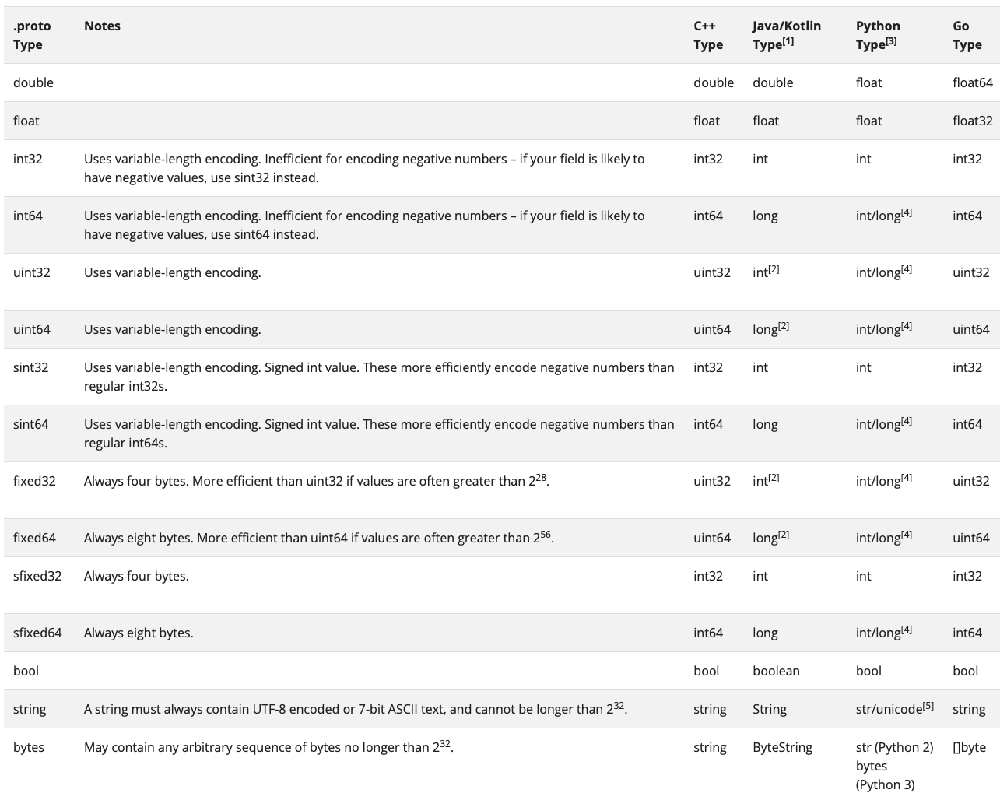

C++用命名空间，Java用外部类进行统一爹管理

# Protobuf

## *intro*

Protocol Buffers (protobuf) 是一种由Google开发的二进制数据序列化格式。它旨在用于高效地序列化结构化数据，并支持跨不同平台、不同语言的数据交换

Protobuf 提供了一种定义数据结构的语言，称为 Protocol Buffers Language，通过该语言可以定义消息类型和相关字段。定义的消息类型被编译器转换成特定语言的类或结构体，以便在程序中使用

以下是 Protobuf 的一些主要特点

* 简洁性：Protobuf 的消息定义简洁明了，只需要定义字段的名称和类型即可。它支持基本数据类型（如整数、浮点数、布尔值等）以及复杂的数据结构（如嵌套消息、枚举等）
* 可扩展性：当需要向现有消息类型添加新字段时，可以保持向前和向后兼容性。旧版本的解析器可以解析新版本的消息，而新版本的解析器也可以解析旧版本的消息，只是忽略掉未知的字段
* 跨语言支持：Protobuf 支持多种编程语言，如C++、Java、Python、Go等。通过使用相应的编译器，可以将消息定义转换成目标语言的类或结构体，并在不同的语言之间进行数据交换
* 高效性：由于 Protobuf 使用二进制编码，因此相比于一些文本格式（如JSON、XML）具有更高的序列化和反序列化性能，以及更小的数据体积
* 可读性：虽然 Protobuf 的消息是以二进制格式存储的，但它同时支持可读的文本表示。可以使用 .proto 文件定义消息类型，并通过编译器生成用于序列化和反序列化的代码

在使用 Protobuf 进行数据交换时，需要先定义消息类型，并通过**编译器**生成对应的类或结构体。然后，通过序列化将消息对象转换为二进制数据，或通过反序列化将二进制数据转换为消息对象。这使得在不同的系统之间传输和存储结构化数据变得更加简单和高效

需要注意的是，由于 Protobuf 是一种二进制格式，因此对于人类可读性较差，相比于文本格式（如JSON）更适合机器间的数据交换

## *demo & 基本用法*

### protobuf使用流程


**ProtoBuf需要依赖通过编译生成的头文件和源文件使用的**

* 编写 .proto 文件，目的是为了定义结构对象 message 及属性内容
* 使用 protoc 编译器编译 .proto 文件，生成一系列的接口代码，存放在新生成的头文件和源文件中
* 依赖生成的接口，将编译生成的头文件包含进我们的代码中，实现对 .proto 文件中定义的字段进行设置和获取，和对 message 对象进行序列化和反序列化

###  定义消息

在 message 中可以定义其属性字段，字段 field 定义格式为：`字段类型 字段名 = 字段唯一编号;`

* 字段名称命名规范：全小写字母，多个字母之间用 `_` 隔开
* 字段类型分为：标量数据类型 Scalar value type 和 特殊类型（枚举、map）
* 字段唯一编号：用来标识字段，一旦使用了就不能改变

字段唯一编号的范围是 `1 ~ 536,870,911 (2^29 - 1)` ，其中 19000 ~ 19999 不可用

19000 ~ 19999 不可用是因为：在 Protobuf 协议的实现中，对这些数进行了预留。如果非要在.proto 文件中使用这些预留标识号，例如将 name 字段的编号设置为19000，编译时就会报警

**范围为 1 ~ 15 的字段编号只需要一个字节进行编码**， 16 ~ 2047 内的数字需要两个字节进行编码。编码后的字节不仅只包含了编号，还包含了字段类型。所以 1 ~ 15 要用来标记出现非常频繁的字段，要为将来有可能添加的、频繁出现的字段预留一些出来

举例：定义一个最简单的message

```protobuf
syntax = "proto3";

package contacts;

message PeopleInfo {
    string name = 1;
    int32 age = 2;
}
```

### 字段的其他定义规则

字段类型

* singular：消息中可以包含该字段零次或一次（不超过一次）。proto3 语法中，字段默认使用该规则
* repeated：消息中可以包含该字段任意多次（包括零次），其中重复值的顺序会被保留。可以理解为定义了一个数组

字段还有一些其他的定义规则

* 消息类型可作为字段类型使用，即允许嵌套message

  ```protobuf
  syntax = "proto3";
  package contacts;
  // 联系人
  message PeopleInfo {
      string name = 1;
      int32 age = 2;
      // Nested message
      message Phone {
      	string number = 1;
      }
      
      repeated Phone phone = 3;
  }
  ```

* 可导入其他 .proto 文件的消息并使用

  ```protobuf
  syntax = "proto3";
  package phone;
  message Phone {
  	string number = 1;
  }
  ```

  ```protobuf
  syntax = "proto3";
  package contacts;
  import "phone.proto"; // 使用 import 将 phone.proto 文件导入进来
  
  message PeopleInfo {
      string name = 1;
      int32 age = 2;
      // 引入的文件声明了package，使用消息时，需要用 ‘命名空间.消息类型’ 格式
      repeated phone.Phone phone = 3;
  }
  ```

* proto3和proto2是互相兼容的

### 数据类型



变长编码：编译后可能4字节变1字节，体积变小了。负值的话会变成10字节

Sint32的效率更高一点

### 默认值

反序列化消息时，如果被反序列化的二进制序列中不包含某个字段，反序列化对象中相应字段时，就会设置为该字段的默认值。不同的类型对应的默认值不同：

* 字符串 string：默认值为空字符串
* 字节 bytes：默认值为空字节
* 布尔值 bool：默认值为 false
* 数值类型，默认值为 0
* 枚举 enum：默认值是第一个定义的枚举值， 必须为 0
* 对于消息字段，未设置该字段。它的取值是依赖于语言
* 对于设置了 repeated 的字段的默认值是空的（ 通常是相应语言的一个空列表 ）
* 对于消息字段、oneof字段和any字段，C++ 和 Java 语言中都有 `has_xxx` 方法来检测当前字段是否被设置。虽然标量没有has方法，但大多数情况下结合业务的语意信息是可以兼容其默认值的

### 编译proto文件

用编译工具protoc进行编译，protoc放在 `/usr/local/bin` 下面

* 编译成C++

  ```shell
  protoc [--proto_path=IMPORT_PATH] --cpp_out=DST_DIR path/to/file.proto
  ```

  * `--proto_path` 指定搜索目录，不带的话就默认从当前目录搜索，可以简写为 `-I`
  * `--cpp_out` 说明要编译成C++文件
  * `DST_DIR` 指示编译后文件放在哪里
  * `path/to/file.proto` 用到的proto文件的地址

* 编译成Java

  ```shell
  protoc --java_out=. contacts.proto
  ```


编译main的时候要链接protobuf库

```shell
g++ -o TestPb main.cc contacts.pb.cc -std=c++11 -lprotobuf
```

### 编译生成文件分析

编译生成的contacts.pb.h 部分最重要的代码如下

```cpp
class PeopleInfo final : public ::PROTOBUF_NAMESPACE_ID::Message {
public:
using ::PROTOBUF_NAMESPACE_ID::Message::CopyFrom;
void CopyFrom(const PeopleInfo& from);
using ::PROTOBUF_NAMESPACE_ID::Message::MergeFrom;
void MergeFrom( const PeopleInfo& from) {
PeopleInfo::MergeImpl(*this, from);
}
static ::PROTOBUF_NAMESPACE_ID::StringPiece FullMessageName() {
return "PeopleInfo";
}
// string name = 1; 第一个message字段
void clear_name();
const std::string& name() const; //获取name，把get省略了
template <typename ArgT0 = const std::string&, typename... ArgT>
void set_name(ArgT0&& arg0, ArgT... args); //set方法
std::string* mutable_name();
PROTOBUF_NODISCARD std::string* release_name();
void set_allocated_name(std::string* name);
// int32 age = 2; 第二个message字段
void clear_age();
int32_t age() const; //获取age，把get省略了
void set_age(int32_t value); //set方法
};
```

1. 生成一个`set_xxx()`方法：用于设置该字段的值。例如，如果在消息定义中有一个`int32 age`字段，生成的C++代码中就会有一个`void set_age(int32 value)`方法
2. 生成一个`clear_xxx()`方法：用于清除该字段的值。例如，对于`int32 age`字段，生成的C++代码中就会有一个`void clear_age()`方法
3. 生成一个`has_xxx()`方法：用于检查该字段是否设置了值。例如，对于`int32 age`字段，生成的C++代码中就会有一个`bool has_age()`方法
4. 生成一个`xxx()`方法：用于获取该字段的值。例如，对于`int32 age`字段，生成的C++代码中就会有一个`int32 age()`方法

这些接口和方法使得在C++中使用标量字段变得更加方便。用户可以使用`set_xxx()`方法设置字段的值，使用`clear_xxx()`方法清除值，使用`has_xxx()`方法检查字段是否设置了值，以及使用`xxx()`方法获取字段的值

Message的父类MessageLite类中定义了一系列的序列化与反序列化方法

```cpp
class MessageLite {
public:
    //序列化：
    bool SerializeToOstream(ostream* output) const; // 将序列化后数据写入文件
    流
    bool SerializeToArray(void *data, int size) const;
    bool SerializeToString(string* output) const;
    //反序列化：
    bool ParseFromIstream(istream* input); // 从流中读取数据，再进行反序列化
    动作
    bool ParseFromArray(const void* data, int size);
    bool ParseFromString(const string& data);
};
```

完整API见Documentation：<https://protobuf.dev/reference/cpp/api-docs/google.protobuf.message/#Message>

* 序列化的结果为二进制字节序列，而非文本格式
* 以上列出的三种序列化的方法没有本质上的区别，只是序列化后输出的格式不同，可以供不同的应用场景使用
* 序列化的 API 函数均为const成员函数，因为序列化不会改变类对象的内容， 而是将序列化的结果保存到函数入参指定的地址中

### repeated 字段的API

* 生成一个`add_xxx()`方法：用于向字段中添加一个新的值。例如，如果在消息定义中有一个`repeated string names`字段，那么生成的C++代码中就会有一个`void add_names(const std::string& value)`方法
* 生成一个`clear_xxx()`方法：用于清空该字段中的所有值。例如，对于`repeated string names`字段，生成的C++代码中就会有一个`void clear_names()`方法
* 生成一个`xxx_size()`方法：用于获取该字段当前包含的值的数量。例如，对于`repeated string names`字段，生成的C++代码中就会有一个`int names_size()`方法
* 生成一个`xxx()`方法：用于获取该字段指定索引位置的值。例如，对于`repeated string names`字段，生成的C++代码中就会有一个`const std::string& names(int index)`方法

### decode生成的二进制文件

```shell
❯ protoc --decode=contacts.Contacts contacts.proto < contacts.bin
Type not defined: contacts.Contacts
❯ protoc --decode=contacts2.Contacts contacts.proto < contacts.bin
contacts {
  name: "zhangsan"
  age: 20
  phone {
    number: "82"
  }
  phone {
    number: "138"
  }
}
```

## *Message的Java API*

### Builder

### Sub-Builder for nested message

## *枚举 enum*

### 定义规则

```protobuf
enum Color {
  RED = 0;
  GREEN = 1;
  BLUE = 2;
}
```

* 0 值常量必须存在，且要作为第一个元素。这是为了与 proto2 的语义兼容：第一个元素作为默认值，且值为 0
* 反序列化时protobuf会对之前没有设置枚举值的字段默认设置为0。若没有为枚举值指定整数值，Protobuf编译器会自动为每个值分配一个唯一的整数值
* 枚举类型可以在消息外定义，也可以在消息体内定义（嵌套）
* 枚举的常量值在 32 位整数的范围内。但因负值无效因而不建议使用（与编码规则有关）

### 防止冲突

将两个 ‘具有相同枚举值名称’ 的枚举类型放在单个 .proto 文件下测试时，编译后会报错。所以这里要注意

* 同级（同层）的枚举类型，各个枚举类型中的常量不能重名
* 单个 .proto 文件下，最外层枚举类型和嵌套枚举类型，不算同级
* 多个 .proto 文件下，若一个文件引入了其他文件，且每个文件都未声明 package，每个 proto 文件中的枚举类型都在最外层，算同级冲突
* 多个 .proto 文件下，若一个文件引入了其他文件，且每个文件都声明了 package，不算同级，不发生冲突

### 枚举字段生成的API

* `set_xxx()`方法：用于设置枚举字段的值
* `xxx()`方法：用于获取枚举字段的值
* `xxx_Name()`方法：用于根据枚举值获取对应的字符串表示
* `xxx_IsValid()`：f校验枚举值是否有效的方法 
* `xxx_Parse()`方法：用于将字符串表示转换为对应的枚举值

### C++生成的接口

### Java生成的接口

## *any*

### 介绍

可以将any类型理解为一种**泛型 generic**，可以用来存储任意的数据类型。它允许用户在不改变消息定义的情况下，将任意类型的数据作为字段的值进行传输和存储。使用时可以在 Any 中存储任意消息类型。Any 类型的字段也用 repeated 来修饰

```protobuf
//,...
message PeopleInfo {
// ...
google.protobuf.Any data = 4;
}
```

先定义好message，再用 `PackFrom()` 方法转换

### any字段生成的API

```cpp
// 更新的 PeopleInfo 类
class PeopleInfo final : public ::PROTOBUF_NAMESPACE_ID::Message {
public:
// .google.protobuf.Any data = 4;
bool has_data() const;
void clear_data();
const ::PROTOBUF_NAMESPACE_ID::Any& data() const;
PROTOBUF_NODISCARD ::PROTOBUF_NAMESPACE_ID::Any* release_data();
::PROTOBUF_NAMESPACE_ID::Any* mutable_data();
void set_allocated_data(::PROTOBUF_NAMESPACE_ID::Any* data);
};
```

设置和获取：获取方法的方法名称与小写字段名称完全相同。设置方法可以使用 `mutable_xxx` 方法，返回值为Any类型的指针，这类方法会为我们开辟好空间，可以直接对这块空间的内容进行修改

### 任意消息类型与Any的互转

需要的接口定义在google预定义好的 `any.pb.h` 中

* 使用 `PackFrom()` 方法可以将任意消息类型转为 Any 类型
* 使用 `UnpackTo()` 方法可以将 Any 类型转回之前设置的任意消息类型
* 使用 `Is()` 方法可以用来判断存放的消息类型是否为 typename T

## *oneof*

保证唯一性

不可以使用repeated

## *map*

Protobuf提供一种称为"map"的特殊数据类型，用于表示键值对的集合

```protobuf
map<key_type, value_type> field_name = field_number;
```

* key_type 是除了 float 和 bytes 类型以外的任意标量类型。 value_type 可以是任意类型
* map 字段不可以用 repeated 修饰
* map 中存入的元素是无序的

### Java API

```protobuf
map<int32, int32> weight = 1;
```

protoc编译器会在message class和它的builder中生成下面的方法

* `Map<Integer, Integer> getWeightMap();`：返回一个**不可修改**的map
* `int getWeightOrDefault(int key, int default);`：返回key对应的value，或者default若key不存在
* `int getWeightOrThrow(int key);`：返回key对应的value，或者抛 IllegalArgumentException 异常若key不存在
* `boolean containsWeight(int key);`：检查map里是否有key
* `int getWeightCount();`：返回map中元素个数

protoc编译器只会在message的builder中生成下面的方法

* `Builder putWeight(int key, int value);`：插入一个KV
* `Builder putAllWeight(Map<Integer, Integer> value);`: Adds all entries in the given map to this field.
* `Builder removeWeight(int key);`: Removes the weight from this field.
* `Builder clearWeight();`: Removes all weights from this field.
* `@Deprecated Map<Integer, Integer> getMutableWeight();`：返回一个**可修改**的map. Note that multiple calls to this method may return different map instances. The returned map reference may be invalidated by any subsequent method calls to the Builder.

## *更新消息*

### 更新规则

* 新增：不要和已有字段的名字和编号冲突即可
* 修改
* 删除：不可以直接删除，会造成数据损坏、错位等问题。被删除的字段要用 `reserved` 保留，之后不能被使用

不认识的字段不会被删除，而是会存储到未知字段

未知字段不能直接通过get获取

遍历UnkownFieldSet

### 保留字段 reserved

### 获取未知字段

## *选项*

### 分类

.proto 文件中可以声明许多选项，使用 `option` 标注。选项能影响 proto 编译器的某些处理方式

选项的完整列表在google/protobuf/descriptor.proto中定义，下面给出部分代码

```protobuf
syntax = "proto2"; // descriptor.proto 使用 proto2 语法版本
message FileOptions { ... } // 文件选项 定义在 FileOptions 消息中
message MessageOptions { ... } // 消息类型选项 定义在 MessageOptions 消息中
message FieldOptions { ... } // 消息字段选项 定义在 FieldOptions 消息中
message OneofOptions { ... } // oneof字段选项 定义在 OneofOptions 消息中
message EnumOptions { ... } // 枚举类型选项 定义在 EnumOptions 消息中
message EnumValueOptions { .. } // 枚举值选项 定义在 EnumValueOptions 消息中
message ServiceOptions { ... } // 服务选项 定义在 ServiceOptions 消息中
message MethodOptions { ... } // 服务方法选项 定义在 MethodOptions 消息中
```

选项分为文件级、消息级、字段级等等， 但并没有一种选项能作用于所有的类型

### 常用选项

`optimizer_for`：文件选项，可以用来设置 protoc 编译器的优化级别，分别为 SPEED 、CODE_SIZE 、LITE_RUNTIME 。受该选项影响，设置不同的优化级

* SPEED : protoc 编译器将生成的代码是高度优化的，代码运行效率高，但是由此生成的代码编译后会占用更多的空间。**SPEED 是默认选项**
* CODE_SIZE : proto 编译器将生成最少的类，会占用更少的空间，是依赖基于反射的代码来实现序列化、反序列化和各种其他操作。但和SPEED 恰恰相反，它的代码运行效率较低。这种方式适合用在包含大量的.proto文件，但并不盲目追求速度的应用中
* LITE_RUNTIME : 生成的代码执行效率高，同时生成代码编译后的所占用的空间也是非常少。这是以牺牲Protocol Buffer提供的反射功能为代价的，仅仅提供 encoding+序列化 功能，所以我们在链接 BP 库时仅需链接libprotobuf-lite，而非libprotobuf。这种模式通常用于资源有限的平台，例如移动手机平台中

`allow_alias` ： 允许将相同的常量值分配给不同的枚举常量，用来定义别名。该选项为枚举选项

ProtoBuf 允许自定义选项并使
