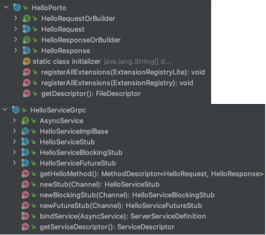
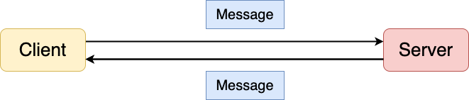
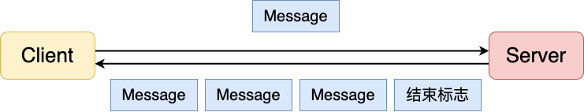
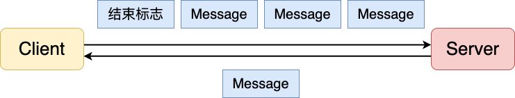
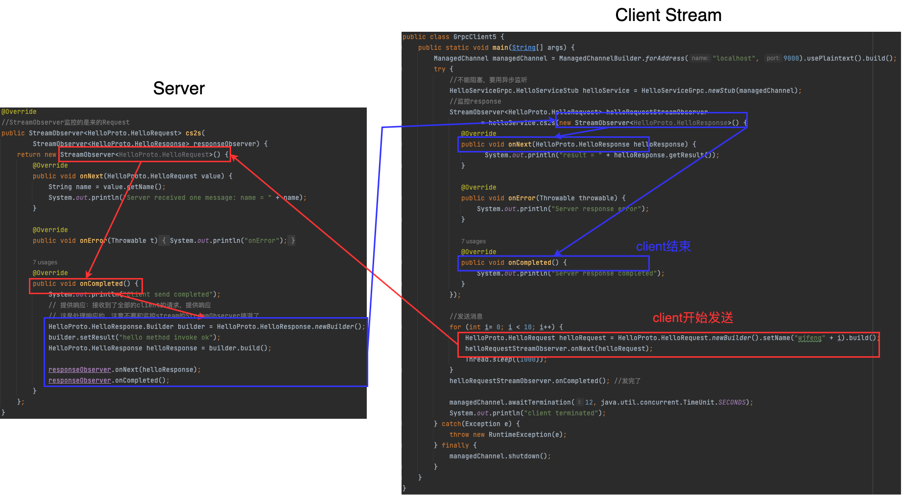

# gRPC

gRPC的源码库 <https://github.com/grpc/grpc>

## *intro*

gRPC（Google Remote Procedure Call）是一种高性能、通用的开源远程过程调用（RPC）框架，由Google开发并开源。它基于HTTP/2协议和Protocol Buffers（protobuf）序列化协议，用于构建跨平台和跨语言的分布式应用程序

gRPC 提供了一种简单的方法来定义服务接口和消息类型（**基于服务，与具体哪种语言无关**），并自动生成支持多种编程语言的客户端和服务器端代码。它支持多种编程语言，如C++、Java、Python、Go、C#等，因此可以在不同的环境和语言之间轻松进行通信

以下是 gRPC 的一些关键特性：

1. 基于标准的 HTTP/2：gRPC 使用 HTTP/2 作为底层的传输协议，提供了双向流、流控制、头部压缩等特性。HTTP/2 的多路复用特性允许同时处理多个请求和响应，提高了网络利用率和性能
2. 高效的序列化：gRPC 使用 Protocol Buffers（protobuf）作为默认的序列化机制。protobuf 是一种轻量级、高效的二进制数据交换格式，具有更小的消息大小和更快的序列化和反序列化速度
3. 自动化代码生成：通过定义服务接口和消息类型的 .proto 文件，gRPC 可以自动生成用于客户端和服务器端的代码。这简化了开发过程，并确保在不同的语言之间保持一致性
4. 支持多种调用方式：gRPC 支持四种不同的调用方式，满足不同的需求：
   * Unary RPC：一次请求，一次响应的调用方式
   * Server Streaming RPC：一次请求，多次响应的调用方式
   * Client Streaming RPC：多次请求，一次响应的调用方式
   * Bidirectional Streaming RPC：多次请求，多次响应的调用方式
5. 支持拦截器和中间件：gRPC 允许开发者使用拦截器和中间件来添加自定义的逻辑和功能。这包括身份验证、日志记录、错误处理等，提供了更灵活的扩展性和可定制性
6. 支持流式处理：gRPC 支持流式数据传输，可以用于处理大量数据、实时数据流和实时通信场景
7. 支持服务发现和负载均衡：gRPC 提供了服务发现和负载均衡的功能，可以轻松部署和管理大规模的分布式系统

gRPC 在微服务架构和分布式系统中具有广泛的应用。它提供了高效的网络通信和跨语言支持，使得不同服务能够方便地进行通信和协作。无论是构建大规模的云原生应用程序、实现高性能的数据传输，还是构建实时流处理系统，gRPC 都是一个强大的工具

## *项目结构*

下面的内容以 java & unary rpc 为例

### 大纲


1. api 模块

    定义 protobuf IDL语言并通过命令创建具体的代码，后续client server引入使用

    * message
    * service

    ```protobuf
    syntax = "proto3";
    
    // 后续protobuf生成的java代码一个源文件还是多个源文件xx.java。否则会为每个message、enum、service生成独立的class
    option java_multiple_files = false;
    // 指定protobuf生成的类放置在哪个包中
    option java_package = "com. suns";
    // 指定的protobuf生成的外部类的名字（管理内部类【内部类オ是真正开发使用】）
    option java_outer_classname = "UserServoe";
    
    package com.example;
    
    service HelloService {
        rpc sayHello (HelloRequest) returns (HelloResponse);
    }
    
    message HelloRequest {
        string name = 1;
        // Request中可以有很多个字段（多个函数参数）
    }
    
    message HelloResponse {
        string message = 1;
        // Response中可以有很多个字段（多个函数返回值）
    }
    ```

1. xxxx-server模块

    * 实现api模块中定义的服务接口：新建一个 `xxxServiceImpl.java` 并在里面继承生成的 `xxxImplBase` 类，然后重写实现对应的service
    
      ```java
      public class HelloServiceImpl extends HelloServiceGrpc.HelloServiceImplBase {
          // ...重写实现service方法
      }
      ```
    
    * 发布gRPC服务（创建服务端程序）
    
      ```java
      public class GrpcServer {
          public static void main(String[] args) throws IOException, InterruptedException {
              // 1. 绑定端口
              ServerBuilder serverBuilder = ServerBuilder.forPort(9000);
              // 2. 发布服务
              serverBuilder.addService(new HelloServiceImpl());
              // 3. 创建服务对象
              Server server = serverBuilder.build();
              // 4. 启动服务
              server.start();
              server.awaitTermination();
          }
      }
      ```
    
2. xxxx-client模块
   * 创建服务端stub（代理）
   * 基于stub的RPC调用
   
   ```java
   public class GrpcClient1 {
       public static void main(String[] args) {
           // 1. 创建通信管道
           ManagedChannel managedChannel = ManagedChannelBuilder.forAddress("localhost", 9000).usePlaintext().build();
           // 2. 创建stub 代理对象
           try {
               HelloServiceGrpc.HelloServiceBlockingStub helloService = HelloServiceGrpc.newBlockingStub(managedChannel);
               // 3. 完成rpc调用
               // 3.1 准备请求参数
               // 填充参数
               HelloProto.HelloRequest.Builder builder = HelloProto.HelloRequest.newBuilder();
               builder.setName("wjfeng");
               HelloProto.HelloRequest helloRequest = builder.build();
               // 3.2 调用rpc服务，获取响应内容
               HelloProto.HelloResponse helloResponse = helloService.hello(helloRequest);
   
               String result = helloResponse.getResult();
               System.out.println("result = " + result);
           } catch (Exception e) {
               throw new RuntimeException(e);
           } finally {
               managedChannel.shutdown();
           }
       }
   }
   ```

### gRPC的主要API

gRPC是一个高性能、跨平台的远程过程调用（RPC）框架，它使用Protocol Buffers作为接口定义语言。gRPC提供了多种API，用于定义和实现RPC服务

以下是gRPC的主要API：

1. Protocol Buffers（Proto）：gRPC使用Protocol Buffers作为接口定义语言（IDL）。Proto API用于定义服务的消息类型和服务接口
2. Server API：gRPC Server API用于创建和管理gRPC服务端。它提供了创建RPC服务、启动和停止服务、配置监听端口等功能
3. Client API：gRPC Client API用于创建和管理gRPC客户端。它提供了与服务端建立连接、发送RPC请求、处理响应等功能
4. Service API：gRPC Service API用于定义服务接口。它基于Proto文件中定义的服务接口生成相应的服务端和客户端代码
5. Interceptors API：gRPC Interceptors API允许开发者拦截和处理gRPC请求和响应。拦截器可用于实现认证、日志记录、性能监控等功能
6. Streaming API：gRPC支持基于流的RPC，其中客户端和服务端可以通过流式传输发送和接收消息。Streaming API包括客户端流、服务端流和双向流
7. Metadata API：gRPC Metadata API用于传递附加的元数据信息。元数据可以在RPC调用中携带额外的信息，如认证凭证、请求标识等
8. Error Handling API：gRPC提供了用于处理错误的API，包括定义错误码和错误信息、处理异常、返回错误状态等

### 生成接口

Protobuf plugin的compile生成message，compile-custom生成service API

message生成的API放在target/generated-sources/protobuf/**java**/java_package/java_outer_classname.java

service生成的API放在target/generated-sources/protobuf/**grpc-java**/java_package/service_nameGrpc.java



* `serviceName + Impl + Base` 对应真正的服务接口，开发的时候要继承这个类，并覆盖其中的业务方法
* `Stub` 结尾，用于在客户端与远程 gRPC 服务进行通信，区别在于采用的通信方式不同

### 定义服务 & StreamObserver

虽然service中定义了返回值，但实际实现是返回了void，**通过参数 `StreamObserver` 来返回**，这是一种观察者模式。还有可能通过流等方式来返回，这跟每种stub的底层通信方式有关系

在gRPC中，StreamObserver是一种用于处理流式响应的接口。它在客户端和服务器之间建立了一个双向通信通道，允许客户端和服务器以流式方式交换数据

StreamObserver在gRPC中的主要作用如下

1. **接收服务器流式响应**：当客户端向服务器发起一个请求并期望服务器以流式方式返回多个响应时，客户端可以使用StreamObserver来接收这些响应。StreamObserver提供了一个回调函数，每当服务器发送一个响应时，该函数就会被调用，从而让客户端能够逐个接收和处理这些响应
2. **发送客户端流式请求**：与服务器流式响应相反，客户端可以使用StreamObserver来发送一个流式请求给服务器。客户端可以通过StreamObserver提供的方法来逐个发送请求消息，而不是一次发送所有请求。这种方式使得客户端能够按需发送请求，而不需要等待所有请求准备就绪
3. **实现双向流式通信**：除了单向的服务器流式响应和客户端流式请求之外，gRPC还支持双向流式通信，即客户端和服务器都可以以流式方式发送和接收数据。在这种情况下，StreamObserver既可以接收服务器的响应，也可以发送客户端的请求。这种双向流式通信的模式在需要实时互动和持续通信的场景中非常有用

以下面的unary为例

```java
public class HelloServiceImpl extends HelloServiceGrpc.HelloServiceImplBase {
    // 1. 接受client的参数
    // 2. 业务处理 service+dao 调用对应的业务功能
    // 3. 提供返回值
    @Override
    // service中定义的返回值是作为参数StreamObserver来传递
    public void hello(HelloProto.HelloRequest request, StreamObserver<HelloProto.HelloResponse> responseStreamObserver) {
        // 1. 接受client的参数
        String name = request.getName();
        // 2. 业务处理
        System.out.println("接受到客户端信息:" + name);
        // 3. 封装响应
        // 3.1 构建响应对象
        HelloProto.HelloResponse.Builder builder = HelloProto.HelloResponse.newBuilder();
        // 3.2 填充数据
        builder.setResult("hello method invoke ok");
        // 3.3 封装响应
        HelloProto.HelloResponse helloResponse = builder.build();
        // 3.4
        responseStreamObserver.onNext(helloResponse); // 处理后的响应通过网络回传给client
        responseStreamObserver.onCompleted(); // 通知client 响应已经结束了，会返回一个标志，client接收到这个标志后，会结束这次rpc调用
    }
}
```

## *gRPC的4种通信方式*

### 什么是stub

在RPC中，stub 存根/代理是client和server之间的接口代理。Stub充当client和server之间的中间人，隐藏了底层的网络通信细节，使得远程过程调用过程对开发者透明化。一言以概之：**stub就是对通信过程（序列化 + 通信方式）的封装**

当client希望调用远程服务器上的方法时，它不会直接与server进行通信，而是通过stub来发送请求。stub负责将请求打包并通过网络发送到server。在服务器端，stub将接收到的请求解包，并将其传递给实际的服务实现，然后将执行结果返回给client

stub的工作原理通常涉及序列化和反序列化过程，将方法调用和参数打包成网络传输格式，并在接收方将其解析回原始形式

在许多RPC框架中，Stub通常是通过使用接口定义语言（IDL）来生成的。IDL描述了可用的方法和参数，并根据IDL生成相应的客户端和服务器代码。这种自动生成Stub的方式使得客户端和服务器能够在不了解底层网络协议的情况下进行远程方法调用

### gRPC 代理方法 stub

1. BlockingStub 阻塞通信：支持Unary和Server streaming
2. Stub 异步通信，通过监听处理：支持Unary，Server-streaming，Client-streaming，Bidirectional-streaming
3. FutureStub：FutureStub只支持Unary，实际引用比较局限

Stub Asynchronous 和 Future的区别：**Future最适合的场景就是一个大任务需要多个小任务，只有小任务都完成了大任务才能执行**。而Asynchronous 适合的场景就是**多个任务之间并没有顺序关系，都是独立的任务**

### 分类

1. 简单RPC/一元RPC Unary RPC：一个请求对应一个响应
2. 服务端流式RPC Server Streaming RPC：一个请求对应多个响应
3. 客户端流式RPC Client Streaming RPC：多个请求对应一个响应 IOT
4. 双向流RPC Bi-directional Stream RPC：多个请求返回多个响应

### 一元RPC



client和server发送信息后必须要阻塞等待，就是传统Web开发中的请求响应。开发过程中，主要采用就是一元RPC的这种通信方式

## *服务端流式RPC*



对于一个请求对象，在不同的时刻Server可以返回多个结果对象。这种服务式基于长连接的

**错误的认知**：认为Server返回的是一组数据就应该封装在一个List中。若把返回的多个数据封装在一个List中，这叫做一个返回结果

应用场景：某一个时段内的股票价格

### protobuf设置

```protobuf
service HelloService{
  rpc hello(HelloRequest) returns (stream HelloResponse) {} // response 加 stream
}
```

### 阻塞demo

一元和服务端流式创建的都是Blocking Stub代理

阻塞：一旦发起服务端流式RPC，Client只有收到所有信息后（读到了 `onCompleted()`）它才会继续执行。实际中这种阻塞通信用处不大

```java
// Server Service
public class HelloServiceImpl extends HelloServiceGrpc.HelloServiceImplBase {
	@Override
    public void c2ss(HelloProto.HelloRequest request,
                     StreamObserver<HelloProto.HelloResponse> responseObserver)  {
        // 1. 接受client的参数
        String name = request.getName();
        // 2. 业务处理
        System.out.println("接受到客户端信息:" + name);
        // 3. 封装响应
        for (int i = 0; i < 9; i++) {
            HelloProto.HelloResponse.Builder builder = HelloProto.HelloResponse.newBuilder();
            builder.setResult("result" + i);
            HelloProto.HelloResponse helloResponse = builder.build();

            responseObserver.onNext(helloResponse);

            try {
                Thread.sleep(1000);
            } catch (InterruptedException e) {
                throw new RuntimeException(e);
            }
        }
        responseObserver.onCompleted();
    }
}

// Client
public class GrpcClient3 {
    public static void main(String[] args) {
        ManagedChannel managedChannel = ManagedChannelBuilder.forAddress("localhost", 9000).usePlaintext().build();
        try {
            // 用阻塞stub来通信
            HelloServiceGrpc.HelloServiceBlockingStub helloService = HelloServiceGrpc.newBlockingStub(managedChannel);
            HelloProto.HelloRequest helloRequest = HelloProto.HelloRequest.newBuilder().setName("wjfeng").build();
            // 流式的用Iterator作为返回值
            Iterator<HelloProto.HelloResponse> helloResponseIterator = helloService.c2ss(helloRequest);
            while (helloResponseIterator.hasNext()) {
                HelloProto.HelloResponse helloResponse = helloResponseIterator.next();
                System.out.println("result = " + helloResponse.getResult());
            }
        } catch(Exception e) {
            throw new RuntimeException(e);
        } finally {
            managedChannel.shutdown();
        }
    }
}
```

### 异步监听

Api和服务都不变，客户端的调用处理变了

StreamObserver可以监听三种事件 `onNext()` 是下一条信息到来了要干什么，`onError()` 报错了要干什么，`onCompleted()` 事件发完了要干什么

观察者模式编程：api和server不变，改变client的stub，并自定义 `StreamObserver<Response>`的三种方法

```java
//api和server不变，改变client的stub，并自定义StreamObserver<Response>的行为
public class GrpcClient4 {
    public static void main(String[] args) {
        ManagedChannel managedChannel = ManagedChannelBuilder.forAddress("localhost", 9000).usePlaintext().build();
        try {
            // 异步监听
            HelloServiceGrpc.HelloServiceStub helloService = HelloServiceGrpc.newStub(managedChannel);
            HelloProto.HelloRequest.Builder builder=  HelloProto.HelloRequest.newBuilder();
            builder.setName("wjfeng");

            HelloProto.HelloRequest helloRequest = builder.build();
            helloService.c2ss(helloRequest, new StreamObserver<HelloProto.HelloResponse>() {
                @Override
                public void onNext(HelloProto.HelloResponse helloResponse) {
                    // 服务器响应了一个消息后，需要立即处理的话就写这个方法
                    System.out.println("result = " + helloResponse.getResult());
                }

                @Override
                public void onError(Throwable throwable) {
                    System.out.println("error");
                }

                @Override
                public void onCompleted() {
                    // 服务器响应完了所有消息后，需要立即处理的话就写这个方法
                    System.out.println("completed");
                }
            });

            managedChannel.awaitTermination(12, TimeUnit.SECONDS);
        }
        catch(Exception e) {
            throw new RuntimeException(e);
        } finally {
            managedChannel.shutdown();
        }
    }
}
```

存在一个问题：刚开始异步监听时，服务端要首先处理一些逻辑，所以客户端发现没有信息，所以直接关了。等到服务端要发信息过来，发现客户端没开，双方之间也就没有任何通信。所以最好一开始让client等上一段时间

## *客户端流式RPC*



应用：IOT传感器

### protobuf设置

```protobuf
service HelloService{
	rpc cs2s(stream HelloRequest) returns (HelloResponse) {}
}
```

### client stream代码组织



server `StreamObserver<Request>` 的 `onCompleted` 中为什么要先发onNext再completed？因为要靠onNext发送信息，completed只是一个结束标志

注意：client stream rpc中server不能每次收到一个request就onNext一个response，**只能是在onCompleted中收到了收到request后再onNext一个response**。否则会报错

```
Cancelling the stream with status Status{code=INTERNAL, description=Too many responses, cause=null}
```


只有在[双向流](#双向流rpc)中可以来一个request就onNext一个response

### server

注意：编译后发现client stream rpc要重写的接口为下面的，之前的unary和server stream的服务接口都是传入request和 `StreamObserver<Response>`，返回void，但现在返回了 `StreamObserver<Request>`

```java
//对比：server stream
public void c2ss(HelloProto.HelloRequest request, StreamObserver<HelloProto.HelloResponse> responseObserver) {}
//client stream
public StreamObserver<HelloProto.HelloRequest> cs2s(StreamObserver<HelloProto.HelloResponse> responseObserver) {}
```

这是因为此时发的是一批request，server不知道它们什么时候才会到，也不知道到没到。所以要用 `StreamObserver<Request>` 监控。因此相应的Server要根据业务需求重写 `StreamObserver<Request>` 里面的方法

```java
public class HelloServiceImpl extends HelloServiceGrpc.HelloServiceImplBase {
	@Override
    //StreamObserver监控的是来的Request
    public StreamObserver<HelloProto.HelloRequest> cs2s(
            StreamObserver<HelloProto.HelloResponse> responseObserver) {
        return new StreamObserver<HelloProto.HelloRequest>() {
            @Override
            public void onNext(HelloProto.HelloRequest value) {
                String name = value.getName();
                System.out.println("Server received one message: name = " + name);
            }

            @Override
            public void onError(Throwable t) {
                System.out.println("onError");
            }

            @Override
            public void onCompleted() {
                System.out.println("Client send completed");
                // 提供响应：接收到了全部的client的请求，提供响应
                HelloProto.HelloResponse.Builder builder = HelloProto.HelloResponse.newBuilder();
                builder.setResult("hello method invoke ok");
                HelloProto.HelloResponse helloResponse = builder.build();
                // 这是处理响应的，注意不要和监控stream的StreamObserver搞混了
                responseObserver.onNext(helloResponse);
                responseObserver.onCompleted();
            }
        };
    }
}
```

### client

```java
public class GrpcClient5 {
    public static void main(String[] args) {
        ManagedChannel managedChannel = ManagedChannelBuilder.forAddress("localhost", 9000).usePlaintext().build();
        try {
            //不能阻塞，要用异步监听
            HelloServiceGrpc.HelloServiceStub helloService = HelloServiceGrpc.newStub(managedChannel);
            //监控response
            StreamObserver<HelloProto.HelloRequest> helloRequestStreamObserver = helloService.cs2s(new StreamObserver<HelloProto.HelloResponse>() {
               @Override
               public void onNext(HelloProto.HelloResponse helloResponse) {
                     System.out.println("result = " + helloResponse.getResult());
               }

               @Override
               public void onError(Throwable throwable) {

               }

               @Override
               public void onCompleted() {

               }
            });

            //发送消息
            for (int i= 0; i < 10; i++) {
                HelloProto.HelloRequest helloRequest = HelloProto.HelloRequest.newBuilder().setName("wjfeng" + i).build();
                helloRequestStreamObserver.onNext(helloRequest);

                Thread.sleep((1000));
            }
            helloRequestStreamObserver.onCompleted(); //发完了

            managedChannel.awaitTermination(12, java.util.concurrent.TimeUnit.SECONDS);
            System.out.println("client terminated");
        } catch(Exception e) {
            throw new RuntimeException(e);
        } finally {
            managedChannel.shutdown();
        }
    }
}
```

### <span id="双向流rpc">双向流RPC</span>

双向流rpc和client stream 异步stub的代码结构完全一样，区别只是现在server在监控request的时候也可以每次来一个request就回复response了

```java
public class HelloServiceImpl extends HelloServiceGrpc.HelloServiceImplBase {
	@Override
    public StreamObserver<de.tum.HelloProto.HelloRequest> cs2ss(
            StreamObserver<de.tum.HelloProto.HelloResponse> responseObserver) {
        return new StreamObserver<HelloProto.HelloRequest>() {
            @Override
            public void onNext(HelloProto.HelloRequest value) {
                // 现在server可以来一个client的request就回一个response了
                String name = value.getName();
                System.out.println("Server received one message: name = " + name);
                responseObserver.onNext(HelloProto.HelloResponse.newBuilder().setResult("response " + name + " result ").build());
            }

            @Override
            public void onError(Throwable t) {
                System.out.println("onError");
            }

            @Override
            public void onCompleted() {
                System.out.println("Client send completed");
                responseObserver.onCompleted();
            }
        };
    }
}
```

`addListener` 智能监听，实战中基本没什么用

## *C++ API*

1. **定义服务接口和消息类型**：首先，你需要使用 Protocol Buffers（protobuf）语言定义你的服务接口和消息类型。创建一个 `.proto` 文件，定义你的服务接口和消息类型。例如，创建一个 `hello_service.proto` 文件，其中包含一个简单的问候服务的定义

   ```protobuf
   syntax = "proto3";
   
   package com.example;
   
   service HelloService {
       rpc SayHello (HelloRequest) returns (HelloResponse);
   }
   
   message HelloRequest {
       string name = 1;
   }
   
   message HelloResponse {
       string message = 1;
   }
   ```

2. **生成 C++ 代码**：用 protobuf 编译器将 `.proto` 文件编译为 C++ 代码。你可以从官方网站下载 protobuf 编译器。在命令行中执行以下命令来生成 C++ 代码。这将生成与服务接口和消息类型对应的 C++ 文件

   ```shell
   protoc --cpp_out=. hello_service.proto
   ```

3. **实现服务接口**：在你的 C++ 代码中实现服务接口。为了实现 `HelloService` 接口，你需要创建一个类，并继承自生成的 `HelloService::Service` 类。在类中，实现服务接口定义的方法

   ```cpp
   #include <iostream>
   #include <grpcpp/grpcpp.h>
   #include "hello_service.grpc.pb.h"
   
   using grpc::Server;
   using grpc::ServerBuilder;
   using grpc::ServerContext;
   using grpc::Status;
   using hello::HelloRequest;
   using hello::HelloResponse;
   using hello::HelloService;
   
   class HelloServiceImpl final : public HelloService::Service {
       Status SayHello(ServerContext* context, const HelloRequest* request, HelloResponse* response) override {
           std::string name = request->name();
           std::string message = "Hello, " + name + "!";
           response->set_message(message);
           return Status::OK;
       }
   };
   
   void RunServer() {
       std::string server_address("0.0.0.0:50051");
       HelloServiceImpl service;
   
       ServerBuilder builder;
       builder.AddListeningPort(server_address, grpc::InsecureServerCredentials());
       builder.RegisterService(&service);
   
       std::unique_ptr<Server> server(builder.BuildAndStart());
       std::cout << "Server listening on " << server_address << std::endl;
       server->Wait();
   }
   
   int main() {
       RunServer();
       return 0;
   }
   ```

4. **编译和运行服务器**：使用 C++ 编译器编译你的服务器代码，并运行生成的可执行文件。确保你的编译命令中包含了 gRPC 和 Protocol Buffers 的库和头文件路径。这将启动一个监听指定地址的 gRPC 服务器

5. 创建 gRPC 客户端：在你的 C++ 代码中创建一个 gRPC 客户端，以便与服务器进行通信。首先，你需要创建一个 `Channel` 对象，指定服务器的地址和端口号。然后，你可以使用生成的客户端 stub（例如 `HelloService::NewStub(channel)`）来调用服务方法

   ```cpp
   #include <iostream>
   #include <grpcpp/grpcpp.h>
   #include "hello_service.grpc.pb.h"
   
   using grpc::Channel;
   using grpc::ClientContext;
   using grpc::Status;
   using hello::HelloRequest;
   using hello::HelloResponse;
   using hello::HelloService;
   
   class HelloClient {
   public:
       HelloClient(std::shared_ptr<Channel> channel)
           : stub_(HelloService::NewStub(channel)) {}
   
       std::string SayHello(const std::string& name) {
           HelloRequest request;
           request.set_name(name);
           HelloResponse response;
   
           ClientContext context;
           Status status = stub_->SayHello(&context, request, &response);
   
           if (status.ok()) {
               return response.message();
           } else {
               return "RPC failed";
           }
       }
   
   private:
       std::unique_ptr<HelloService::Stub> stub_;
   };
   
   int main() {
       std::string server_address("localhost:50051");
       HelloClient client(grpc::CreateChannel(server_address, grpc::InsecureChannelCredentials()));
       std::string name("Alice");
       std::string response = client.SayHello(name);
       std::cout << "Response: " << response << std::endl;
       return 0;
   }
   ```

6. 编译和运行客户端：使用 C++ 编译器编译你的客户端代码，并运行生成的可执行文件。确保你的编译命令中包含了 gRPC 和 Protocol Buffers 的库和头文件路径。这将连接到服务器并调用服务方法，然后打印响应消息

   ```shell
   g++ -std=c++11 hello_service.pb.cc hello_service.grpc.pb.cc hello_client.cpp -o hello_client -lgrpc++ -lgrpc -lprotobuf
   ./hello_client
   ```