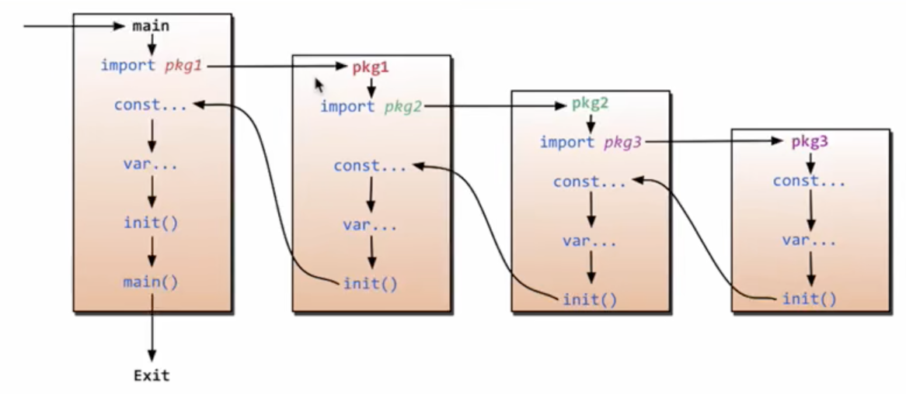

# 包管理和重要go工具

## *go介绍*

### go历史

### go优势

* 可直接编译成机器码，不依赖其他库，glibc 的版木有一定要求，部署就是扔一个文件上去就完成了
* 静态类型语言，但写起来有动态语言的感觉，静态类型的语言就是可以在编译的时候检查出水隐藏的大多数问题，动态语言的感觉就是有很多的包可以使用，写起来的效率很高
* 语言层面支持并发，这是 Go 最大的特色，天生支持并发，可以充分的利用多核
* 内置runtime，支持垃圾回收，这属于动念语言的特性之一吧，虽然目前来说GC(内存垃圾回收机制)不算完美，但是足以应付我们所能週到的大多数情况，特别是 Gol.l之后的 GC
* 简单易学，Go 语言的作者都有C 的基因，那么Go 自然而然就有了C的基因，Go关键宇是25 个，但是表达能力很强大，几乎支持大多数其他面向对象语言的特征：继承、重载、封装等
* 丰富的标准库，Go 目前己经内置了大量的库，特别是网络库非常强大
* 内置强大的工具，Go 语言里面内置了很多工具链，最好的应该足gofmt工具，自动化格式化代码，便利团队review
* 跨平台编译，如果写的 Go 代码不包含cgo，那么就可以做到Win编译Linux的应用，如何做到的呢？Go 引用了plan9 的代码，这就是不依赖系统的信息
* 内嵌C支持，Go 里面也可以直接包含C 代码，利用现有的丰富的C库

go在C++这种注重性能的语言和python这种注重开发效率的语言之间取得了平衡

## *go环境配置*

Go源码安装在 `/usr/local/go`，即 GOROOT 环境变量

go编译指令位于 `/usr/local/go/bin`，所以通过 `export PATH=$PATH:/usr/local/go/bin` 加入环境变量（要写入 `/etc/profile` 持久化）

必须要配置的环境变量是 GOPATH

```shell
export GOROOT="/usr/local/go"
export GOPATH=$HOME/go
export GOBIN=$GOROOT/bin
export PATH=$PATH:$GOBIN
```

## *helloworld*

```go
package main //程序的包名
import (
	"fmt"
	"time"
)

func main() { // 强制要求左括号同行
	fmt.Println("hello wolrd!")
	time.Sleep(1 * time.Second)
}
```

go语句一开始是强制不加分号的，后来支持了加分号。加不加分号都可以，但建议还是不加分号

import声明必须跟在package声明后面

main是特殊的包，它用来定义一个独立的可执行程序，而不是库

## *包管理*

go程序的编译快速的原因主要有3个

* 所有的导入都必须在每一个源文件的开头显式列出，这样编译器在确定依赖性的时候就不需要读取和处理整个文件
* 包的依赖形成有向无环图，因为没有环，每个包都可以独立甚至并行编译
* go包编译输出的目标文件不仅记录它自己的导出信息，还记录它所依赖包的导出信息

### 包的导入声明

每个包定义了一个不同的命名空间作为它的标识符，称为包名或者导入路径，它们用在import声明中

注意：**导入的包路径比如是GOPATH后面完整的路径**

三个例外

* 不管包的导入路径是声明，若该包定义了一条命令（可执行的go程序），那么它**总是使用名称 main**，这是告诉 `go build`，它必须要调用链接器生成可执行文件
* 目录中以 `*_test.go` 命名的文件，这样一个目录中有两个包：一个普通包，一个外部测试包，`_test` 后缀告诉 `go test` 两个包都需要构建，并且指明文件需要属于哪个包
* 有一些依赖管理工具会在包导入路径的尾部追加版本号后缀

包导入的一些规则

* 导入的包可以通过空行进行分组，组间按管理以字母排序

* 若有包名冲突的，需要重命名导入 renaming import/起别名，重命名的包仅影响当前文件

* 空导入 blank import：若导入了包，但是却没有使用任何包里定义的变量或函数，会报编译错误。但是有时候导入包可能仅仅是为了利用其副作用，即对包级别的变量执行初始化表达式求值，并执行它的init函数。这种情况下，要用替代名字 `_`，来表示导入的内容为空白表示符

* 全部导入：用 `.` 来重命名，这样之后用的时候就不写 `包名.API` 了，相当于python里的 `import *` 全部导入到当前文件，最好不要使用这种导入方式

  ```go
  import (
      "fmt" 
      "html/template"
      "os"
      //分组空行
      "golang.org/x/net/html"
      "golang.org/x/net/ipv4"
      
      "crypto/rand"
      mrand "math/rand" // 重命名导入
      
      _ "image/png" // 空导入
      
      . "math" //全部导入
  )
  ```

### 包的初始化

包的调用过程：递归调用，知道一个没有下层调用的pkg，然后定义它的常量、变量、初始化等，好了之后返回上层直到main层



init函数是每个包都要有的，它不能别被调用或被引用，当程序启动的时候，init函数按照它们声明的顺序自动执行

### 调用流程的例子

一个工程的结构

```
(base) ➜  5-init tree
.
├── lib1
│   └── lib1.go
├── lib2
│   └── lib2.go
└── main.go
```

* `main.go`

  ```go
  package main
  
  import (
  	"GoStudy/5-init/lib1" //注意一定要写成GOPATH后面的路径
  	"GoStudy/5-init/lib2"
  )
  
  func main() {
  	lib1.Lib1Test()
  	lib2.Lib2Test()
  }
  ```

* `lib1.go` 包

  ```go
  package lib1
  
  import "fmt"
  
  // 当前lib1包提供的API
  func Lib1Test() {
  	fmt.Println("lib1Test()...")
  }
  
  // 小写不导出，只能在包内使用
  func lib1Test() {
  	fmt.Println("lib1Test()...")
  }
  
  func init() {
  	fmt.Println("lib1.init()...")
  }
  ```

* `lib2.go` 包

  ```go
  package lib2
  
  import "fmt"
  
  // 当前lib2包提供的API
  func Lib2Test() {
  	fmt.Println("lib2Test()...")
  }
  
  func init() {
  	fmt.Println("lib2.init()...")
  }
  ```

## *重要的包*

### fmt

https://pkg.go.dev/fmt

> Package fmt implements formatted I/O with functions analogous to C's printf and scanf. The format 'verbs' are derived from C's but are simpler. -- Documentation

fmt是格式化IO的包

* 打印数据类型 `fmt.Printf("Type of a is %T\n", a)`

  转义字符 conversions，go程序员称为verb。和C语言中不同的是 `%T` 打印数据类型，`%t` 打印布尔型

* `fmt.Println` 相当于是 `%v` 形式的格式化输出，然后自动在后面加一个换行符，ln的意思就是line

# 基本类型和流控制

## *程序结构*

### 名称

实体 entity 第一个字母的大小写决定其可见性是否跨包，若名称以大写字母开头，那么它是导出的 exported，也就是它对包外是可见和可访问的，可以被包外的其他程序引用

### 声明

声明给一个程序实体命名，并且设定其部分或全部属性

```go
package main

import "fmt"

const boilingF = 212.0

func main() {
	var f = boilingF
	var c = (f - 32) * 5 / 9
	fmt.Printf("boiling point = %g°F or %g°C\n", f, c)
	// Output:
	// boiling point = 212°F or 100°C
}
```

以上面程序为例，一个go文件中的声明顺序是

1. package声明，表明go文件属于哪个包
2. import声明，告诉编译器自己要用到哪些包
3. 包级别的类型、变量、常量、函数声明（不区分顺序）

## *变量*

### 声明

`var name type = expression`：`var` 关键字创建一个具体类型的变量，设置初始值。注意声明和赋值的区别，赋值用来更新一个**已经定义**的实体

go中没有未初始化变量（包括未赋值的返回值），修正了C语言中随机初始化变量带来的麻烦，比如野指针

* 隐式声明：若type省略，则编译器会根据expression自动决定其type
* 若expression省略，**没有显式初始化，则全部初始化为0或者0的同义值**，比如 `""` 、`false`、`nil`

和C语言相比增加了多变量声明 `var i, j, k int = 0, 1, 2`

go编译器不允许局部变量定义了但不使用，会报错。如果要这么做，必须要空定义

定义指针类型：`var p *int` 而不是C语言的 `int*`。解引用操作仍然是 `*p`，取地址操作符也仍然是 `&p`

### 局部变量的短变量声明省略 `var`

实际上对于**局部变量**的声明和初始化**主要使用短声明  short variable declaration `:=`**。`var` 声明通常是为那些跟初始化表达式类型不一致的局部变量保留的

若用 `:=` 声明一个全局变量，会报下面的编译错误

> syntax error: non-declaration statement outside function body

短变量声明不需要声明所有在左边的变量，但是左侧的变量也不应该是已经声明过的

### 生命周期 Lifetime of variables

和C++一样，可以通过new来开辟空间定义实体。但是go中变量开辟在栈上还是在堆上并不是通过 `var` 还是 `new` 来定义的，go通过垃圾回收GC机制来对此进行了优化

下面两段代码展示了go的逃逸 escape 机制

### 包和文件

## *数据类型*

数据类型可以分为四类

* 基础类型 Basic type
* 聚合类型 aggregate type
* 引用类型 reference type：指针、切片 slice、map
* 接口类型 interface type

### 基础类型

* 数字 number

  * 整数：有符号 `int` /无符号 `uint`
  * 浮点数：`float32`、`float64`，绝大多数情况应优先使用 `float64`
  * 复数：`complex64`、`complex128` 分别由 `float32` 和 `float64` 构成

* 字符串 string：go 语言的字符串的字节使用 UTF-8 编码标识 Unicode 文本

* boolean

* 只读常量 const

  const 来定义枚举类型 enumeration，并利用iota枚举生成器（只能配合const枚举使用，不能单独使用）

  ```go
  const (
  	a, b = iota + 1, iota + 2 // iota默认从0开始
  	c, d
  	e, f
  	g, h = iota * 2, iota * 3
  	i, k
  )
  ```

### 聚合类型 aggregate type

* 数组 array

  * 支持显式和隐式初始化

    ```go
    var balance = [5]float32{1000.0, 2.0, 3.4, 7.0, 50.0}
    balance := [5]float32{1000.0, 2.0, 3.4, 7.0, 50.0}
    ```

  * 若数组长度不确定，可以用省略号来代替

    ```go
    var balance = [...]float32{1000.0, 2.0, 3.4, 7.0, 50.0}
    ```

* 结构体 struct

  ```go
  type struct_variable_type struct {
     member definition
     member definition
     ...
     member definition
  }
  ```

### slice 切片/动态序列

go 数组的长度不可改变，在特定场景中这样的集合就不太适用。为此go提供了slice这种动态变长数组，与数组相比slice的长度是不固定的，可以追加元素，在追加时可能使切片的容量增大

当进行传参的时候动态slice相比于固定长度的数组有很大的优势。数组的传参首先类型上要严格匹配，其次数组传参是在进行值拷贝，代价很大

三种声明方式

```go
var identifier []type
```


### map 键值对字典

```go
/* 使用 make 函数 */
map_variable := make(map[KeyType]ValueType, initialCapacity)
```


### 接口类型 interface type

## *流控制*

### 条件判断

* if else语句

  If的判断条件不需要加括号，但主题部分要加花括号

  ```go
  if 布尔表达式 {
     /* 在布尔表达式为 true 时执行 */
  } else {
    /* 在布尔表达式为 false 时执行 */
  }
  ```

* switch语句

  ```go
  switch var1 {
      case val1:
          ...
      case val2:
          ...
      default:
          ...
  }
  ```

* select语句，阻塞等待

  ```go
  select {
    case <- channel1:
      // 执行的代码
    case value := <- channel2:
      // 执行的代码
    case channel3 <- value:
      // 执行的代码
  
      // 你可以定义任意数量的 case
  
    default:
      // 所有通道都没有准备好，执行的代码
  }
  ```

### 循环

go语句中只提供了一种for循环。break、continue和goto与在C语言中控制循环的功能一样

```go
for init; condition; post { }
for condition { } //C语言中的while
```

go中引入了 `range` 关键字来返回一个数值对 `(索引, 索引所对应的元素值)`，和python中的 `enumerate` 效果一样。注意，index必须要使用，否则编译报错，若不想用，就用空标识符 `_` blank identifier 来做一个placeholder

```go
myArray := [5]int{1, 2, 3, 4, 5}

for index, value := range myArray {
    fmt.Println("index = ", index, ", value = ", value)
}

// 空标识符占位用
for _, value := range myArray {
    fmt.Println("value = ", value)
}
```

# 函数

```go
func function_name( [parameter list] ) [return_types] {
   body
}
```

* 形参列表指定了一组变量的参数名和参数类型，若几个形参或返回值的类型一样，那么类型只要写一次就够了
* 返回列表指定了函数返回值的类型


## *多返回值*

返回值是创建了局部变量

# 面向对象

## *匿名组合（继承）*

## *方法*

## *接口（多态）*

# 异常

# IO

# 并发

go语言不像java和c++是封装库来支持并发，而是直接在语言层面上支持并发

## *goroutine*

## *channel*

## *select*

# 网络编程

## *socket*

## *HTTP*