# 技术架构的演进

## *Baremetal 单机架构*

### intro

应用服务和数据库服务共用一台服务器

出现在互联网早期，访问量比较小，单机就可以满足需求。现在只有一些节约成本的个人开发者和初创公司会用了

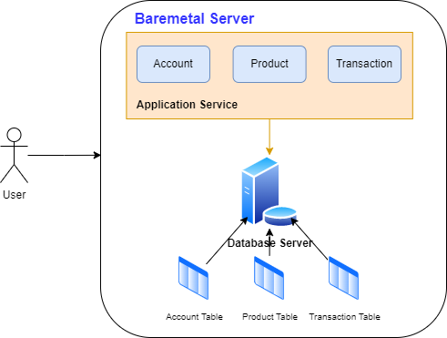

### Pros & Cons

* Pros：部署简单、成本低
* Cons
  * 存在严重的性能瓶颈
  * 数据库和应用会互相竞争计算机资源

### 相关软件

Web 服务器软件：Tomcat、Netty、Nginx、Apache 等

数据库软件：MySQL、Oracle、PostgreSQL、SQL Server 等

## *应用数据分离架构*

### intro

单机架构中存在严重的资源竞争，会导致服务变慢，所以考虑应用服务和数据库服务使用不同的服务器

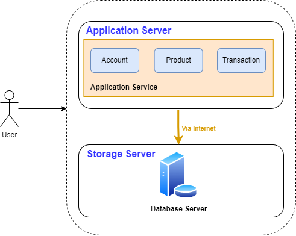

注意两服务器之间中间通过网络进行交付

### Pros & Cons

* Pros
  * 成本相对可控
  * 性能相比单机有提升
  * 数据库单独隔离，应用一般不会把数据库搞坏
* Cons
  * 硬件成本变高
  * 性能有瓶颈，无法应对海量并发

## *应用服务集群架构*

### intro

单个应用不足以支持海量的并发请求，高并发的时候站点响应变慢

应用服务集群架构引入了负载均衡，应用以集群方式运作

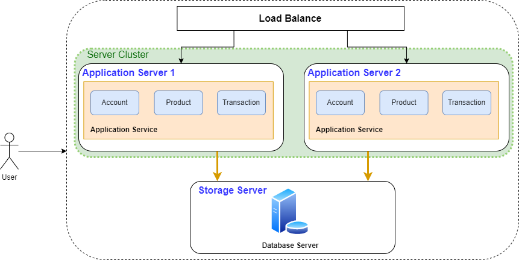

### Pros & Cons

* Pros
  * 应用服务高可用：应用满足高可用，不会一个服务出问题整个站点挂掉
  * 应用服务具备一定高性能：如果不访问数据库，应用相关处理通过扩展可以支持海量请求快速响应
  * 应用服务有一定扩展能力：支持横向扩展 Scale out
* Cons
  * **数据库成为性能瓶颈**，无法应对数据库的海量查询。因为数据库是单点，没有高可用
  * 运维工作增多，扩展后部署运维工作增多，需要开发对应的工具应对快速部署
  * 硬件成本相对较高

### 什么是中间件

中间件是位于客户端和服务器之间的软件层或组件，用于连接、协调和管理不同应用程序或系统之间的通信和交互。它可以被看作是一个软件的"中间层"，提供了一组功能和服务，使得应用程序开发和系统集成更加方便和灵活

中间件的作用是隐藏底层的复杂性，提供统一的接口和功能，使得应用程序能够更加简单、高效地与不同的系统、服务或组件进行通信。它可以在不同的应用程序之间传递数据、消息和请求，处理和转换数据格式，实现数据的传输、存储和处理等操作

中间件通常提供了以下功能和服务：

1. 连接管理：中间件负责管理不同系统或组件之间的连接和通信，包括建立连接、维护连接池、处理连接错误和超时等
2. 数据传输和转换：中间件可以处理数据的传输和转换，将数据从一个系统转发到另一个系统，同时进行数据格式的转换和映射，以确保不同系统之间的兼容性和一致性
3. 安全性和认证：中间件可以提供安全性和认证机制，确保数据的机密性和完整性，验证用户身份和权限，以保护系统和数据的安全
4. 事务管理：中间件可以支持事务管理，处理分布式事务和跨多个系统的原子性操作，确保数据的一致性和可靠性
5. 缓存和性能优化：中间件可以实现数据的缓存和性能优化，减轻后端系统的负载，提高系统的响应速度和吞吐量

常见的中间件包括消息队列中间件（如ActiveMQ、RabbitMQ）、应用服务器中间件（如Tomcat、WebSphere）、数据库中间件（如MyCat、MySQL Proxy）、Web服务中间件（如Nginx、Apache）、分布式缓存中间件（如Redis、Memcached）等

总之，中间件是在不同系统、应用程序或组件之间提供连接、协调和管理功能的软件层或组件，它简化了系统集成和应用程序开发的复杂性，提供了一致的接口和服务，以实现高效、可靠的通信和交互

### 常用的负载均衡组件

1. Nginx：Nginx是一个高性能的开源反向代理服务器，可以作为负载均衡器使用。它支持多种负载均衡算法，并具有灵活的配置选项和强大的性能。Nginx能扛50000次并发
2. HAProxy：HAProxy是另一个流行的开源负载均衡器。它提供高可用性和负载均衡功能，并支持多种负载均衡算法。HAProxy通常被用于分发网络流量到多个后端服务器
3. Apache HTTP Server：Apache HTTP服务器也可以用作负载均衡器。它提供了mod_proxy模块，通过配置反向代理和负载均衡规则，可以将请求分发给多个后端服务器
4. LVS（Linux Virtual Server）是一个开源的负载均衡软件，特别适用于Linux操作系统。它提供了一种基于网络地址转换（NAT）和直接路由（DR）的负载均衡技术，用于将网络流量分发到多个后端服务器。LVS能扛几十万次的并发
5. F5 BIG-IP：F5 BIG-IP是一种商业级的负载均衡器和应用交付控制平台。它具有丰富的功能，包括负载均衡、内容缓存、SSL加速和安全性等，并可提供高可用性和可伸缩性。F5能扛两百万，甚至是千万次级别的并发。F5是硬件实现的，所以性能很高
6. Microsoft Azure Load Balancer：Azure Load Balancer是Microsoft Azure云平台提供的一种负载均衡解决方案。它可用于将流量分发到Azure虚拟机、容器实例或服务终结点，并提供高可用性和可扩展性
7. DNS可以扛上亿级别的并发，千万次并发到上亿并发可以通过DNS串行。极端情况下上百亿的访问若DNS都拒绝服务了，则可以本地配置IP来绕过DNS

## *读写分离/主从分离架构*

### intro

应用服务集群架构中数据库成为瓶颈，而互联网应用一般读多写少，数据库承载压力大，主要是由这些读的请求造成的，那么我们可以把读操作和写操作分开

将数据库读写操作分散到不同的节点上，数据库服务器搭建主从集群，一主一从、一主多从都可以，数据库主机负责写操作，从机只负责读操作

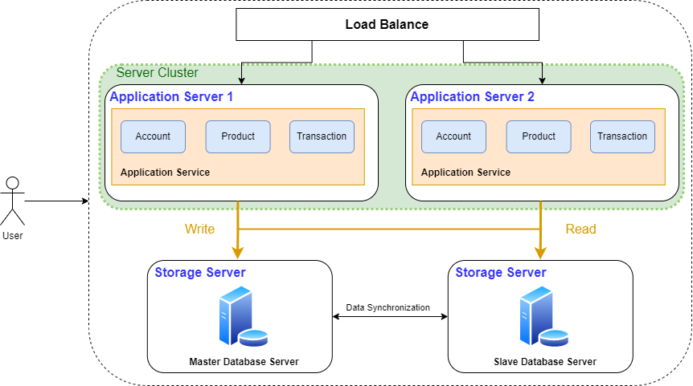

**数据库中间件**

应用中需要对读写请求做分离处理，所以可以利用一些数据库中间件，将请求分离的职责托管出去

MyCat、TDDL、Amoeba、Cobar 等类似数据库中间件等

### Pros & Cons

* Pros
  * 数据库的读取性能提升
  * 读取被其他服务器分担，写的性能间接提升
  * 数据库有从库，数据库的可用性提高了
* Cons
  * 热点数据的频繁读取导致数据库负载很高
  * 当同步挂掉，或者同步延迟比较大时，写库和读库的数据不一致
  * 服务器成本需要进一步增加

## *冷热分离架构*

### intro

海量的请求导致数据库负载过高，站点响应再度变慢

**引入缓存**，实行冷热分离，将热点数据放到缓存中快速响应

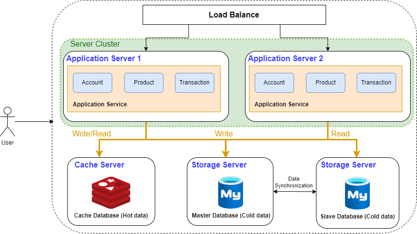

### 引入Redis作为缓存

### Pros & Cons

* Pros：大幅降低对数据库的访问请求，性能提升非常明显，甚至能扛住千万级甚至是以级的数据访问
* Cons
  * 带来了缓存一致性，缓存击穿，缓存失效，缓存雪崩等问题
  * 业务体量支持变大后，数据不断增加，数据库单库太大，单个表体量也太大，数据查询会很慢，导致数据库再度成为系统瓶颈
  * 服务器成本需要进一步增加

## *垂直分库架构/分布式数据库架构*

### intro

单机的写库会逐渐会达到性能瓶颈，需要拆分数据库。数据表的数据量太大，处理压力太大，需要进行分表，为降低运维难度，业界逐渐研发了分布式数据库，库表天然支持分布式

数据库的数据被拆分，数据库数据分布式存储，分布式处理，分布式查询，也可以理解为分布式数据库架构

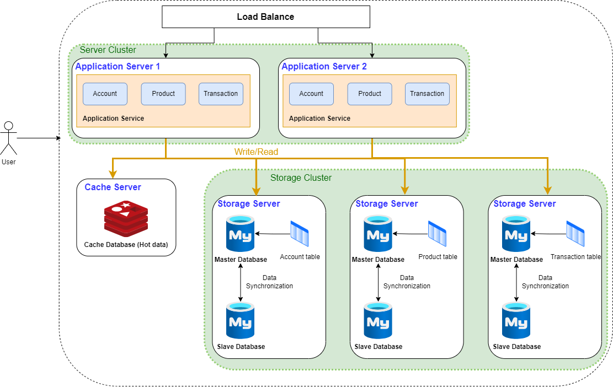

### 分库分表 & 分布式数据库

随着后期技术发展出现了分布式数据库，可以自动完成分库分表的操作

### Pros & Cons

* Pros：数据库吞吐量大幅提升，不再是瓶颈
* Cons
  * 跨库join、分布式事务等问题，这些需要对应的去进行解决，目前的mpp都有对应的解决方案
  * 数据库和缓存结合目前能够抗住海量的请求，但是应用的代码整体耦合在一起，修改一行代码需要整体停服重新发布

### 分布式数据库

Greenplum、TiDB、Postgresql XC、HAWQ等，商用的如南大通用的GBase、睿帆科技的雪球DB、华为的LibrA 等

## *微服务架构 Microservice*

### 微服务出现原因

之前的版本迭代到了分布式数据库架构后会出现下面这些比较棘手的问题

* 扩展性差：应用程序无法轻松扩展，因为每次需要更新应用程序时，都必须重新构建整个系统
* 持续开发/持续部署CD困难：一个很小的代码改动，也需要重新部署整个应用，无法频繁并轻松的发布版本
* 不可靠：即使系统的一个功能不起作用，可能导致整个系统无法工作
* 不灵活：无法使用不同的技术构建单体应用程序，比如说跨语言的开发
* 代码维护难：所有功能耦合在一起，新人不知道何从下手

### 架构图

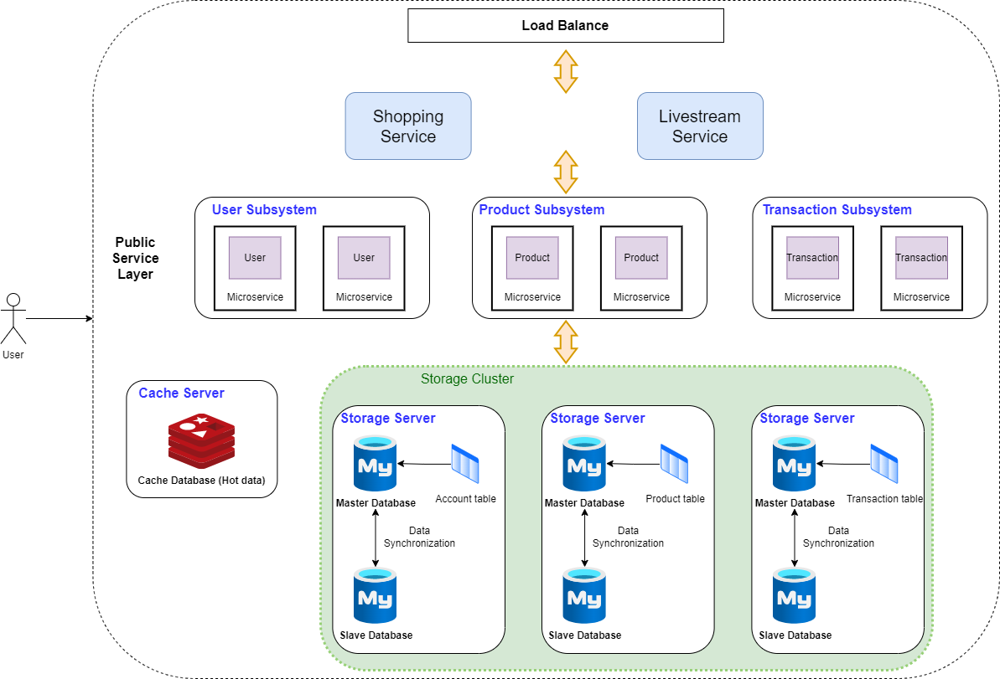

微服务是一种架构风格，像拼Lego一样把多个模块拼接成一个完整的系统。按照业务板块来划分应用代码，使单个应用的职责更清晰，相互之间可以做到独立升级迭

有时候微服务之间要相互协作才能提供提供一些服务

### Pros & Cons

* Pros
  * 灵活性高：服务独立测试、部署、升级、发布
  * 独立扩展：每个服务可以各自进行扩展
  * 提高容错性：一个服务问题并不会让整个系统瘫痪
  * 新技术的应用容易:支持多种编程语言
* Cons
  * 运维复杂度高：业务不断发展，应用和服务都会不断变多，应用和服务的部署变得复杂，同一台服务器上部署多个服务还要解决运行环境冲突的问题，此外，对于如大促这类需要动态扩缩容的场景，需要水平扩展服务的性能，就需要在新增的服务上准备运行环境，部署服务等，运维将变得十分困难
  * 资源使用变多：所有这些独立运行的微服务都需要需要占用内存和 CPU
  * 处理故障困难：一个请求跨多个服务调用，需要查看不同服务的日志完成问题定位

## *容器编排架构*

### 出现原因

* 微服务拆分细，服务多部署工作量大，而且配置复杂，容易出错
* 微服务数量多扩缩容麻烦，而且容易出错，每次缩容后再扩容又需要重新配置服务对应的环境参数信息
* 微服务之间运行环境可能冲突，需要更多的资源来进行部署或者通过修改配置来解决冲突

借助容器化技术（如docker）将应用/服务可以打包为镜像，通过容器编排工具（如k8s）来动态分发和部署镜像，服务以容器化方式运行

### 架构图

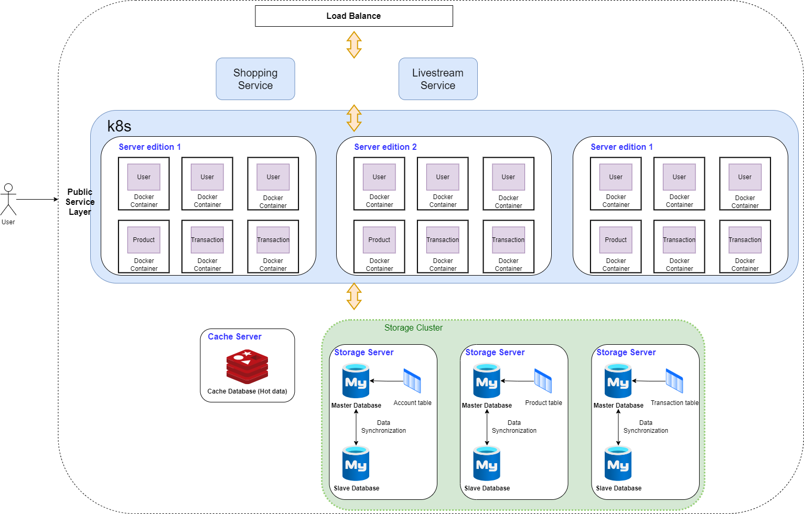

其实读写数据和微服务的流程是一样的，只是运维方便了很多。每个部门有自己的服务器，可以把每个服务器用k8s各自打包成一个集群

注意，有两种设计方式。可以是微服务容器之间互相调用后由一方返回数据给商城，也可以是商城分别取不同的容器那里拿数据然后整合

**Docker的核心作用是打包和容器化运行**

### Pros & Cons

* Pros
  * 部署、运维简单快速：一条命令就可以完成几百个服务的部署或者扩缩容
  * 隔离性好：容器与容器之间文件系统、网络等互相隔离，不会产生环境冲突
  * 轻松支持滚动更新：版本间切换都可以通过一个命令完成升
  * 级或者回滚

* Cons
  * 技术栈变多，对研发团队要求高
  * 机器还是需要公司自身来管理，在非大促的时候，还是需要闲置着大量的机器资源来应对大促，机器自身成本和运维成本都极高，资源利用率低，可以通过购买云厂商服务器解决


## *典型实际架构*

架构不是固定的，上面只是一个典型的工业架构，架构也不必和上面的一样，只要能满足实际业务需求就行

# 容器与云的发展历程

## *容器技术发展史*

### Jail时代

*  1979年贝尔实验室发明 `chroot()` 系统调用

   `chroot()` 系统调用是在1979 年开发第7 版Unix期间引入的。贝尔实验室在Unix V7的开发过程中，发现当一个系统软件编译和安装完成后，整个测试环境的变量就会发生改变，下一次测试需要重新配置环境信息

  设计者们思考能否隔离出来一个独立的环境，来构建和搭建测试环境，所以发明了chroot，可以把一个进程的文件系统隔离起来

  chroot 可以将进程及其子进程的根目录更改为文件系统中的新位置。隔离以后，该进程无法访问到外面的文件，因此这个被隔离出来的新环境像监狱一样，被命名为Chroot Jail （监狱）。后续测试只需要把测试信息放到Jail中就可以完成测试了

  Chroot Jail 最初是由美国计算机科学家 Bill Cheswick 在 1982 年提出的概念，作为 Unix 系统中实施安全策略的一种方法。Bill Cheswick 使用 chroot 来限制非特权用户的访问权限，将用户限制在一个特定的根目录中。这个概念后来被广泛采用，并成为许多安全工具和系统的基础

*  2000年FreeBSD 4.0发行FreeBSD Jail

   2000 年，当时一家小型共享环境托管提供商提出了FreeBSD Jail，以实现其服务与其客户服务之间的明确分离，以实现安全性和易于管理。**每个Jail都是一个在主机上运行的虚拟环境**，有自己的文件、进程、用户和超级用户帐户，能够为每个系统分配一个IP 地址

  FreeBSD Jail不仅仅有chroot的文件系统隔离，并且扩充了独立的进程和网络空间

*  2001年Linux VServer发行

  Linux-VServer 是一个基于 Linux 内核的虚拟化技术，用于创建和管理虚拟私有服务器（Virtual Private Servers，VPS）。它提供了一种在单个物理主机上运行多个隔离的 Linux 系统实例的方法，每个实例都具有独立的文件系统、网络配置和进程空间

  Linux-VServer 通过使用内核层的隔离机制来实现虚拟化。它通过名为 VServer 的内核补丁，扩展了 Linux 内核，增加了对虚拟化的支持。这个补丁使得每个 VServer 实例能够在逻辑上独立运行，就像它们在独立的物理服务器上一样

* 2004年Solaris Containers发行


这个时期的进程隔离技术大多以 Jail 模式为核心，基本实现了进程相关资源的隔离操作，没有更大的应用场景发展有限

### 云时代

在云时代，计算资源后者说云成为一种和水电一样的用于基础设施。云计算需要处理海量数据、超高并发、快速扩展等问题，此时不仅仅需要隔离还需要能够对资源进行控制和调配

* 2006年，Google 101 计划提出云的概念，对当前的主流开发模式产生深远的影响。随后，亚马逊、IBM 等行业巨头也陆续宣布各自的“云”计划，宣告“云”技术时代的来临

* 2006年google推出Process Containers

  Process Containers（由Google 于2006 年推出）旨在限制、统计和隔离一组进程的资源使用（CPU、内存、磁盘I/O、网络）。一年后它更名为 Control Groups（**cgroups**），并最终合并到Linux 内核2.6.24

* 2008年LXC推出

  LXC（Linux Container）是Linux 容器管理器的第一个、最完整的实现。它是在2008年**使用cgroups和Linux命名空间实现的**，它可以在单个Linux内核上运行，不需要任何补丁

  同年谷歌推出**GAE**（Google App Engine），首次把开发平台当做一种服务来提供，采用云计算技术，跨越多个服务器和数据中心来虚拟化应用程序

  同时Google在GAE中使用了**Borg** （Kubernetes的前身）来对容器进行编排和调度。LXC和Borg其实就相当于最早的docker和k8s

  **LXC是docker的前身，最初docker就是用LXC实现的产品**

* 2011年CloudFoundry推出Warden

  2011 年启动了Warden，早期使用LXC，后来替换为自己的实现,直接对Cgroups以及Linux Namespace操作。开发了一个客户端-服务器模型来管理跨多个主机的容器集合，并且可以管理cgroups、命名空间和进程生命周期

* 2013年LMCTFY启动

  Let Me Contain That For You (LMCTFY) 于2013 年作为Google 容器堆栈的开源版本启动，提供Linux 应用程序容器。应用程序可以**容器感知，创建和管理它们自己的子容器**。再Google开始和docker合作后，Google 转向了docker公司的libcontainer，Google家的LMCTFY于2015 年停止

* 2013年Docker推出到风靡全球

  Docker最初是一个叫做dotCloud的PaaS服务公司的内部项目，后来该公司改名为Docker。Docker在初期与Warden类似，使用的也是LXC，之后才开始**采用自己开发的libcontainer来替代LXC**，它是将应用程序及其依赖打包到几乎可以在任何服务器上运行的容器的工具。与其他只做容器的项目不同的是，**Docker引入了一整套管理容器的生态系统，这包括高效、分层的容器镜像模型、全局和本地的容器注册库、清晰的REST API、命令行等等**

  **Docker为提供了一整套的解决方案**，不仅解决了容器化问题，而且解决了分发问题，很快被各大厂商选择变成了云基础设施，厂商围绕Docker也开始了生态建设

### 云原生 Cloud Native

**云时代解决了服务的打包上线问题，而云原生解决容器上层的管理和编排问题**。在云原生时代发生了两场争夺标准制定权的大战，分别用来争夺容器标准和运行时、编排的标准

**容器编排 Container Orchestration 是指管理和协调容器化应用程序的自动化过程**。它涉及将多个容器组合成一个分布式应用，并负责处理容器的调度、部署、扩展、监控和治理等任务。容器编排旨在简化分布式应用的管理，并提供高可用性、弹性和可靠性

首先介绍一下云原生的概念：**云原生一词是指从一开始就设计为驻留在云中的应用程序**。 云原生涉及云技术，例如微服务、容器编排工具和自动扩缩

<https://www.amazonaws.cn/knowledge/what-is-cloud-native/>

> 云原生指的是**基于在云中构建、运行应用程序的理念，而打造的一套技术体系**。不同于传统数据中心的软件开发、构建模式，云原生包含有“原生为云而设计”的含义，能够有效提升云上资源利用率、缩短开发周期 -- Amazon

云原生的核心理念是将应用程序设计为一组小型、独立部署的服务，每个服务都可以通过容器进行封装。这些服务通过轻量级的通信机制（如API）相互交互，形成松耦合的分布式系统。云原生应用程序通常采用微服务架构，将复杂的应用程序拆分为多个小型服务，每个服务专注于单一的业务功能

云原生应用程序还借助于容器编排工具（如Kubernetes）来自动化管理和编排容器化的服务。容器编排工具提供了自动伸缩、负载均衡、服务发现、故障恢复和滚动更新等功能，以确保应用程序在动态的云环境中高效运行

Pros & Cons

<https://www.oracle.com/cn/cloud/cloud-native/what-is-cloud-native/>

* Pros
  * **独立：**云原生应用架构支持企业构建相互独立的云原生应用，同时单独管理和部署各个云原生应用
  * **可恢复性：**即便基础设施发生故障，云原生应用也能继续运行，保持联机状态
  * **基于标准：**为实现出色的互操作性和工作负载可移植性，云原生服务通常基于开源和标准技术构建而成。这有助于降低供应商依赖，提高可移植性
  * **业务敏捷性：**云原生应用支持跨网络灵活部署，同时相比传统应用规模更小，更易于开发、部署和迭代
  * **自动化：**云原生应用支持 DevOps 自动化特性，支持持续交付以及持续部署定期软件变更。此外，开发人员还可以使用蓝绿部署和金丝雀部署等方法来优化应用，避免对用户体验产生任何不利影响
  * **零停机：**借助 Kubernetes 等容器编排器，企业可以零停机地部署软件更新
* Cons
  * 学习曲线和技术复杂性：云原生涉及多个技术和工具的使用，例如容器化、容器编排、自动化部署等。对于没有相关经验的开发团队来说，学习和掌握这些技术可能需要一定的时间和资源投入
  * 管理和运维挑战：云原生应用程序的复杂性也给管理和运维团队带来挑战。容器编排工具的配置和管理需要一定的专业知识，而且需要监控和管理大量的容器实例和服务
  * 安全问题：元原生因应用容器技术，容易对数据安全造成一定程度的安全隐患。攻击者如果从某个容器链接至 host 主机，有可能在下一步攻击行动中，入侵更多非授权容器，导致大规模数据风险
  * 依赖云服务提供商：云原生应用程序通常依赖于云服务提供商的基础设施和平台。这可能使得应用程序对特定云服务提供商产生依赖，限制了跨云平台的可移植性和灵活性

### 云原生大战：OCI容器标准

Docker vs. Rocket 结果为docker捐出RunC

* 2013年CoreOS发布并终止与Docker的合作

  技术革命带来新的市场机遇，CoreOS也是其中的一员，在容器生态圈中贴有标签：专为容器设计的操作系统CoreOS。作为互补，CoreOS+Docker曾经也是容器部署的灵魂伴侣。CoreOS为Docker的推广和源码社区都做出了巨大的贡献

  Docker生态扩张，与最开始是“一个简单的基础单元”不同，Docker也在通过开发或收购逐步完善容器云平台的各种组件，准备打造自己的生态圈，而这与CoreOS的布局有直接竞争关系

  云原生的一代传奇 CoreOS <https://2d2d.io/s1/coreos/>

  什么是 CoreOS 和 CoreOS 容器 Linux？<https://www.redhat.com/zh/technologies/cloud-computing/openshift/what-was-coreos>

* 2014年12月CoreOS发布开源容器引擎Rocket（rkt）

  2014年底，CoreOS正式发布了CoreOS的开源容器引擎Rocket（简称rkt），和Docker正式分开发展。Google于2015年4月领投CoreOS 1200万美元，而CoreOS也发布了Tectonic，成为首个支持企业版本kubernetes的公司。从此，容器江湖分为两大阵营，**Google派系和Docker派系**

* 2015年6月OCI标准发布

  Docker公司因为对于容器运行的高速迭代会对其他公司造成较大的影响，并且因为其一家独大漠视社区的呼声，试图独自主导容器生态的发展。所以其他厂商为了抗衡Docker的影响力，亟需发展一些规范和标准

  2015 年 6 月22 日，在Linux基金会和其他公司的施压下，由Docker公司牵头，CoreOS、Google、RedHat 等公司共同宣布，**Docker 公司将Libcontainer捐出，并改名为RunC项目**，交由一个完全中立的基金会管理，然后以RunC为依据，大家共同制定一套容器和镜像的标准和规范。**RunC的本质就是可以不通过Docker Damon直接运行容器**

  制定出来的规范就是**OCI Open Container Initiative 开放容器标准**，旨在“制定并维护容器镜像格式和容器运行时的正式规范（OCI Specifications）”。其核心产出是OCI Runtime Spec（容器运行时规范）、OCI Image Spec（镜像格式规范）、OCI Distribution Spec（镜像分发规范），这些部分详见下面OCI。所以**OCI组织解决的是容器的构建、分发和运行问题**

  社区们期望通过标准来约束Docker公司的话语权，不过Docker公司并没有积极推动OCI的发展，而且OCI也无法影响Docker的地位，因为Docker已经是事实的容器标准

因为对容器标准的争夺大局已定，Google和RedHat等公司将方向调转到容器上面的**平台层**，即如何管理容器集群

### 云原生大战：编排

Swarm vs. k8s 结果为k8s胜出，成为标准

* 2014年6月Google发布开源的容器编排引擎Kubernetes（K8S）

  容器只是解决了容器化，分发问题，但是一个软件的网络问题、负载均衡问题、监控、部署、更新、镜像管理、发布等很多问题并没有有效的解决

  Google内部调度系统Borg已经拥有10多年的使用容器经验，在2014年6月推出了开源的K8S，可以支持对容器的编排和管理，完成生态的闭环

  同年7月，微软、Red Hat、IBM、Docker、CoreOS、Mesosphere和Saltstack 等公司，相继加入K8S。之后的一年内，VMware、HP、Intel等公司，也陆续加入

* 2015年Docker推出容器集群编排组件Swarm

  在Docker 1.12 及更高版本中，Swarm 模式与Docker 引擎集成为 Docker 容器提供原生集群管理功能

两大派系的竞争愈演愈烈，行业标准的诉求越来越强烈

### 云原生大战：运行时实现

Docker Containerd vs. Google CRI 结果为containerd的实现作为标准的CRI选择

```
cri-containerd -> cri-o -> containererd -> containerd的实现作为标准CRI
```

* 2015年7月Google带头成立CNCF

  Google联合Linux 基金会成立CNCF （Cloud Native Computing Foundation）云原生计算基金会。旨在构建云原生基础设施。K8S是第一个纳入进来的项目，像后续有名的监控设施Prometheus，配置设施ETCD都加入进来。CNCF 组织解决的是应用管理及容器编排问题。和OCI共同制定了一系列行业事实标准

* 2016年发布CRI

  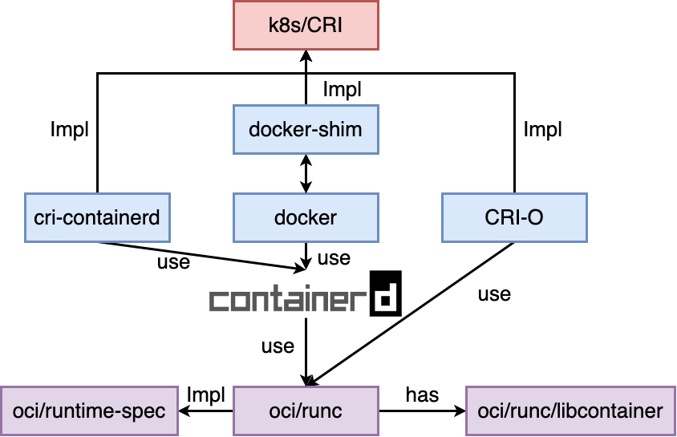

  Google和红帽主导了CRI标准，**用于k8s和特定的容器运行时解耦**。**CRI Container Runtime Interface 容器运行时接口 本质上就是k8s定义的一组与容器运行时进行交互的接口，所以只要实现了这套接口的容器运行时都可以对接k8s**

  但是由于Docker还是容器的事实标准，Google的CRI在容器上并没有话语权，但是又必须支持Docker，所以就有了docker-shim，docker-shim的本质其实就是k8s为了对接docker的一个CRI的实现

* 2016年Docker捐出 containerd

  Docker 将containerd作为运行时标准，从Docker Engine中剥离出来，捐赠给了CNCF。这时Google为了将containerd加入到CRI标准中，又开发了**CRI-containerd**，用来完成k8s和容器之间的交互

* 2016年CRI-O运行时实现发布

  CRI-O可以让开发者直接从k8s来运行容器，这意味着k8s可以不依赖于传统的容器引擎（比如Docker），也能够管理容器化工作负载。容器此时也回归到自己的位置，如何更好的封装云原生的程序

  在2016年，Docker公司宣布了一个震惊全部人的计划：放弃现有的Swarm项目，将容器编排和集群管理功能所有内置到Docker项目中

  而Kubernetes的应对策略则是反其道而行之，开始在整个社区推动**民主化**架构，**从API到容器运行时的每一层，Kubernetes项目都为开发者暴露出了能够扩展的插件机制，鼓励用户经过代码的方式介入到Kubernetes项目的每个阶段**

  在进入2017年之后，更多的厂商愿意把宝压在K8S上，投入到K8S相关生态的建设中来。这两年包括阿里云、腾讯、百度等中国科技企业也陆续加入CNCF，全面拥抱容器技术与云原生

  Swarm的失败后, 社区版Docker项目改名为moby，将Docker引流到Docker的企业版上去，螳臂挡车

* 虽然有了CRI-O这种运行时实现，但是因为绝大部分用户还是习惯于使用Docker，所以2017年 containerd 这种CRI实现，成为CRI的事实标准

  **Kubernetes至此已成了容器编排领域的绝对标准，而Docker已成容器事实的标准**

## *容器技术栈*

https://landscape.cncf.io

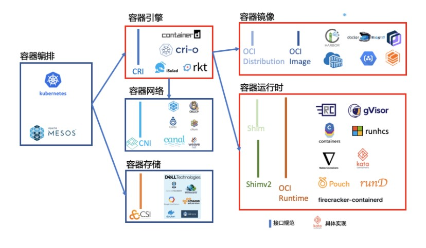

### 定义

> 相对较为正式的术语定义如下图，可以把容器管理系统分为三层：
>
> 1. High-level Container Management：容器管控的UI层。直接实现容器的管控和使用界面，也是用户最熟悉的子系统。
> 2. High-level Container Runtime：容器状态及资源供给。包括镜像管理、网络接入、容器状态、调用Low Level Runtime执行容器等功能。习惯上这层称之为容器引擎（Container Engine）。
> 3. Low-level Container Runtime：容器执行层。负责具体构建容器运行环境并执行容器进程。习惯上这层直接简称为容器运行时（Container Runtime）。 -- https://zhuanlan.zhihu.com/p/337280265

# OCI标准

https://waynerv.com/posts/container-fundamentals-learn-container-with-oci-spec/

OCI 规范分为 Image spec 和 Runtime spec 两部分，它们分别覆盖了容器生命周期的不同阶段

* Image Spec 规范定义了容器镜像的结构和元数据格式，确保容器镜像在不同的容器运行时之间具有可移植性
*  Runtime Spec 规范定义了容器的运行时行为，确保容器在不同的容器运行时中具有一致的执行方式

## *Image spec*

https://github.com/opencontainers/image-spec

### 镜像内容

* Image Manifest：提供了镜像的配置和文件系统层定位信息，可看作是镜像的目录，文件格式为 `json` 
* Image Layer Filesystem Changeset：序列化之后的文件系统和文件系统变更，它们可按顺序一层层应用为一个容器的 rootfs，因此通常也被称为一个 `layer`（与下文提到的镜像层同义），文件格式可以是 `tar` ，`gzip` 等存档或压缩格式
* Image Configuration：包含了镜像在运行时所使用的执行参数以及有序的 rootfs 变更信息，文件类型为 `json`

## *Runtime spec*

https://github.com/opencontainers/runtime-spec

### 容器的生命周期

规范中只定义了4种[容器状态](https://github.com/opencontainers/runtime-spec/blob/master/runtime.md#state)，运行时实现可以在规范的基础上添加其他状态

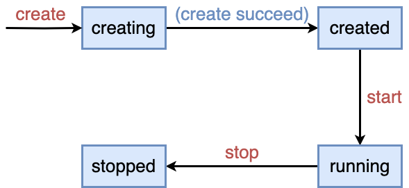

* `creating`: the container is being created
* `created`: the runtime has finished the create operation and the container process has neither exited nor executed the user-specified program
* `running`: the container process has executed the user-specified program but has not exited
* `stopped`: the container process has exited

### 运行时操作

同时标准还规定了运行时必须支持的[操作](https://github.com/opencontainers/runtime-spec/blob/master/runtime.md#operations)

* Query State：查询容器的当前状态
* Create：根据镜像及配置创建一个新的容器，但是不运行用户指定程序
* Start：在一个已创建的容器中运行用户指定程序
* Kill：发送特定信号终止容器进程
* Delete：删除已停止容器所创建的资源

每个操作之前或之后还会触发不同的 hooks，符合规范的运行时必须执行这些 hooks。

# Cloud System Engineering

## *Introduction*

### 云计算的优势

> 云计算就是通过 Internet（以下统称“云”）提供计算服务（包括服务器、存储、数据库、网络、软件、分析和智能），以提供快速创新、弹性资源和规模经济。对于云服务，通常你只需使用多少支付多少，从而帮助降低运营成本，使基础设施更有效地运行，并能根据业务需求的变化调整对服务的使用 -- Microsoft Azure https://azure.microsoft.com/zh-cn/resources/cloud-computing-dictionary/what-is-cloud-computing

* Scalability 可扩展性
* Cost-effective
* Flexibility
* Reliability
* Collaboration

### Types of Cloud Computing

* Public cloud 公有云
* Private cloud 私有云
* Hybrid cloud 混合云

### Types of Cloud Service

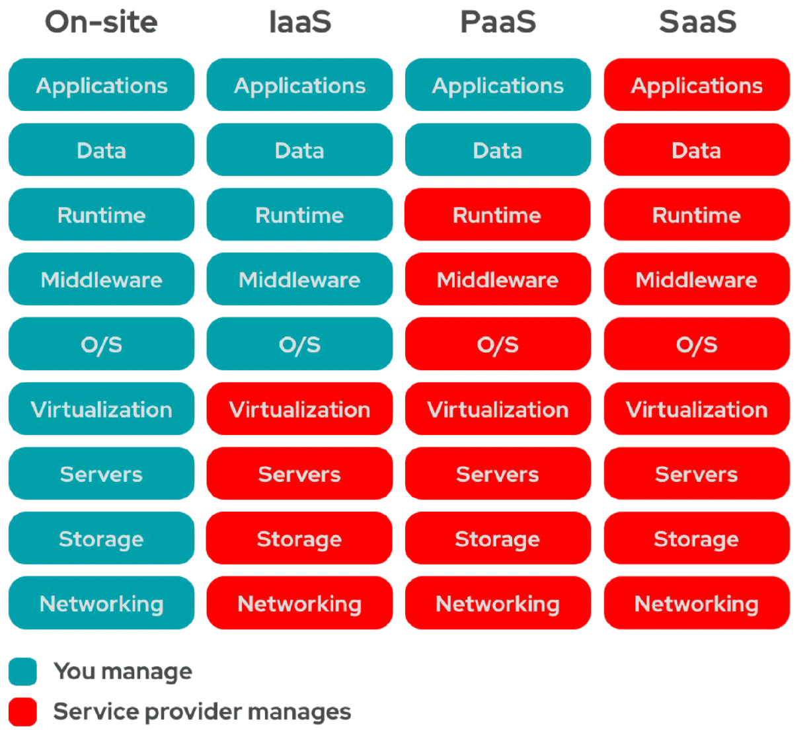

* **Infrastructure as a Service** IaaS 包含云 IT 的基本构建块，IaaS provides virtualized computing resources。它通常提供对网络功能、计算机（虚拟或专用硬件）和数据存储空间的访问。IaaS 提供最高级别的灵活性，用户可以对 IT 资源进行管理控制。它与许多 IT 部门和开发人员熟悉的现有 IT 资源最为相似。IaaS is ideal when **complete control** over their computing environment is required。下面是几个最常见的 IaaS providers

  * AWS

    > Amazon Elastic Compute Cloud（Amazon EC2）提供最广泛、最深入的计算平台，拥有超过 500 个实例，可选择最新的处理器、存储、网络、操作系统和购买模型，以帮助您最好地满足工作负载的需求。我们是首家支持英特尔、AMD 和 Arm 处理器的主要云提供商，既是唯一具有按需 EC2 Mac 实例的云，也是唯一具有 400 Gbps 以太网网络的云。我们为机器学习培训提供最佳性价比，同时也为云中的每个推理实例提供了最低的成本。与任何其他云相比，有更多的 SAP、高性能计算 (HPC)、机器学习 (ML) 和 Windows 工作负载在 AWS 上运行。 -- AWS

  * Microsoft Azure

  * Google Cloud Platform

* **Platform as a Service** PaaS 无需管理底层基础设施（一般是硬件和操作系统），从而可以将更多精力放在应用程序的部署和管理上面。这有助于提高效率，因为用户不用操心资源购置、容量规划、软件维护、补丁安装或与应用程序运行有关的任何无差别的繁重工作。PaaS is ideal for organizations that want to focus on application development and deployment without having to manage the underlying infrastructure

  * Heroku
  * Google Appengine
  * Fly.io

* **Software as a Service** SaaS 提供了一种完善的产品，其运行和管理皆由服务提供商负责。在大多数情况下，人们所说的 SaaS 指的是最终用户应用程序（如基于 Web 的电子邮件）。使用 SaaS 产品，用户无需考虑如何维护服务或管理基础设施。用户只需要考虑如何使用该特定软件。SaaS is ideal for organizations that want to avoid the upfront costs and ongoing maintenance associated with traditional software applications

  * Salesforce, Microsoft Office 365, Google Workspace
  * Mail/Office tools, Customer relationship management CRM, Enterprise resource planning ERP

## *Remainder：虚拟机 vs. 容器*

也可以说是虚拟机和容器的对比

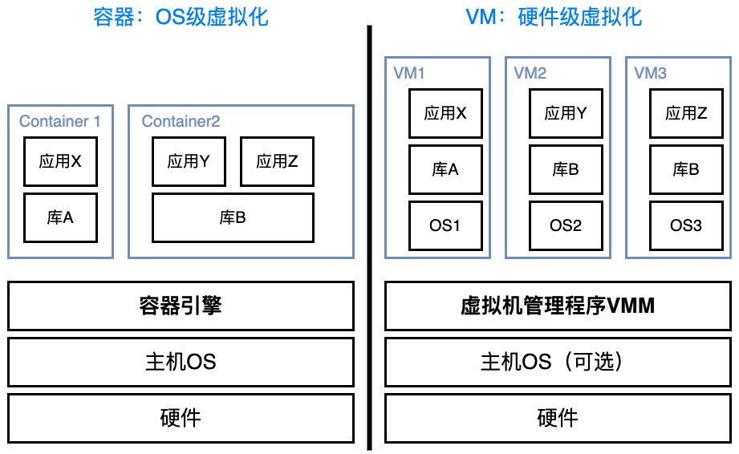

每个VM都需要一套完整的OS，在一个物理PC上能够同时运行的VM是很有限的

而容器非常轻量化。**容器引擎 container engine 的核心功能**是准备运行容器所需要的资源以及管理容器生命周期，作用和VMM比较相似

* 容器是对应用程序及其依赖关系的封装，属于操作系统级的虚拟化。具体地说容器是一种轻量级、可移植的虚拟化技术，用于打包、部署和运行应用程序及其所有依赖。容器技术的核心思想是将应用程序及其运行环境、依赖项等打包到一个独立的单元中，该单元被称为容器
* 容器解决的问题就是环境依赖造成部署困难的问题，或者说“程序能在我的OS上运行，但是在别人的OS上却运行不了”

容器的一个主要缺点在于所有容器共享主机的内核，所以容器只能运行与主机一样的内核

## *Cloud software systems- Distributed systems in the cloud*

### 云计算和分布式系统的联系

"云计算" 是指将计算资源（如服务器、存储、网络等）通过网络连接，提供给用户使用的一种服务模式。而 "分布式系统" 则是指将多个独立的计算机	节点组成一个整体，以共同协作完成某项任务或提供某种服务

这两个概念的紧密关系在于，云计算通常是基于分布式系统实现的。云计算提供的计算资源往往来自于多个节点或服务器，这些节点可以在地理位置上分散，也可以在技术层面上分散，它们之间需要通过网络连接和协作完成任务。因此，云计算平台本质上就是一个分布式系统，通过对多个节点的统一管理和协调，向用户提供高效、可靠的计算资源服务

另外，分布式系统在实现过程中需要面对一些挑战，例如节点故障、网络延迟等，而云计算平台需要解决的问题也包括如何有效地管理和协调多个节点，保证系统的可靠性和高可用性等。因此，云计算和分布式系统在很多方面存在相似之处，二者的紧密关系在于，分布式系统提供了云计算实现的基础技术和理论支持，而云计算则在很大程度上推动了分布式系统的发展和应用

### 为什么让系统分布式？

* Inherently distributed
* For better reliability
* For better performance
* To solve bigger probelms 

### Challenges of a distributed system

* Fault tolerance
* Availability
* Recovery
* Consistency or correctness
* Scalability
* Security

### RPC

通常情况下，使用 socket 进行网络通信时，是通过发送和接收数据包来实现的，而不涉及到对远程计算机上的过程的调用。

而 RPC 则允许一个计算机程序通过网络调用另一个计算机程序中的子程序，这是一种更高层次的抽象，使得远程计算机上的过程可以像本地过程一样被调用，因此在实现远程过程调用时，RPC 是一个更为方便和高效的选择。RPC 底层使用的通信协议可以是 socket，也可以是其他的通信协议

序列化？Interface Definition Language 

## *Deployment Models in the Cloud*

Deployment: Process of delivering software from a development environment to a live environment

### Baremetal

安全性：数据库的部署

### virtual machines

### containers

### serverless

Serverless 是一种计算模型，它允许开发者构建和运行应用程序而无需管理底层的服务器基础架构。这并不意味着没有服务器，而是指开发者不再需要关心服务器的管理、配置和维护

在传统的应用程序部署模型中，开发者通常需要预先配置和管理服务器来运行他们的应用程序。而在 serverless 模型中，云服务提供商（如 AWS Lambda、Azure Functions、Google Cloud Functions 等）会自动处理底层服务器的管理，开发者只需关注编写应用程序的代码

Serverless 并非适用于所有类型的应用程序，特别是对于长时间运行、需要持续连接的应用程序可能不是最佳选择。然而，对于许多事件驱动和短暂执行的任务，serverless 架构可以提供灵活、高效和经济的解决方案

# Docker技术基石

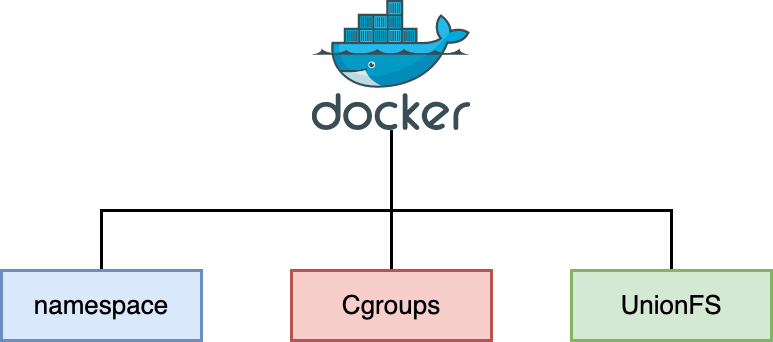

容器虚拟化是操作系统层的虚拟化。它通过namespace进行各程序的隔离，通过cgroups进行资源的控制，UnionFS来提供一个可读写的文件系统

## *空间隔离*

### chroot

```c
#include <unistd.h>
int chroot(const char *path);
			// Returs O on success, or -1 on error
```

chroot 将进程的根目录改为由 pathname 指定的目录（如果 pathname 是符号链接，还将对其解引用）。自此对所有绝对路径名的解释都将以该文件系统的这一位置作为起点

### namespace

Linux的namespace（命名空间）是一种操作系统级别的隔离机制，用于将系统资源抽象成独立的命名空间。每个命名空间提供了一种隔离的环境，使得在一个命名空间中的进程无法感知或影响到其他命名空间中的资源。Linux内核通过使用不同类型的命名空间，实现了对进程、网络、文件系统、用户、进程ID和挂载点等多个系统资源的隔离

Linux 提供了多个API 用来操作namespace，它们是 `clone()`、`setns()` 和 `unshare()` 函数，为了确定隔离的到底是哪项namespace，在使用这些API 时，通常需要指定下面使用一些参数宏。如果要同时隔离多个namespace，和 `open` 一样可以使用 `|` 组合这些参数

### 系统调用参数

| NameSpace | 系统调用参数    | 被隔离的全局系统资源                   | 引入时的内核版本 |
| --------- | --------------- | -------------------------------------- | ---------------- |
| UTS       | `CLONE_NEWUTS`  | 主机名和域名                           | 2.6.19           |
| IPC       | `CLONE_NEWIPC`  | 信号量、消息队列和共享内存--进程间通信 | 2.6.19           |
| PID       | `CLONE_NEWPID`  | 进程编号                               | 2.6.24           |
| Network   | `CLONE_NEWNET`  | 网络设备、网络栈、端口等               | 2.6.29           |
| Mount     | `CLONE_NEWNS    | 文件系统挂载点                         | 2.4.19           |
| User      | `CLONE_NEWUSER` | 用户和用户组                           | 3.8              |

* UTS：每个容器能看到自己的hostname，拥有独立的主机名和域名
* IPC：同一个IPC namespace的进程之间能互相通讯，不同的IPC namespace之间不能通信
* PID：每个PID namespace中的进程可以有其独立的PID，每个容器可以有其PID为1的root进程
* Network：每个容器用有其独立的网络设备，IP地址，IP路由表，/proc/net目录，端口号。这部分在 *网络编程.md* 中有详细介绍
* Mount：每个容器能看到不同的文件系统层次结构
* User：每个container可以有不同的user和group id

### 需要用到的命令

*  `dd` 命令用于读取、转换并输出数据。dd 可从标准输入或文件中读取数据，根据指定的格式来转换数据，再输出到文件、设备或标准输出
* `mkfs` 命令用于在设备上创建Linux文件系统，俗称格式化
* `df` /disk free 命令用于显示目前在Linux系统上的文件系统磁盘使用情况统计
* mount命令用于加载文件系统到指定的加载点。此命令的也常用于挂载光盘，使我们可以访问光盘中的数据。Win上会自动挂载，Linux要手动挂载。挂载的实质是为磁盘添加入口（挂载点）
* `unshare` 命令主要能力是使用与父程序不共享的名称空间运行程序

要先挂载一个文件，否则隔离不彻底，还是能看到其他文件

## *资源控制*

对隔离的空间需要进行资源控制，否则一个没有限制的容器就会把系统弄崩溃了。一个例子是K8S会因为容器的OOM将其杀死

### cgroups

cgroups, Control Groups，是 Linux 内核提供的一种机制，用于限制、控制和监视进程组的系统资源。它允许系统管理员在系统上分配资源，如 CPU、内存、磁盘 I/O 等，以便更有效地管理和控制进程的资源使用

* 资源限制：cgroup 允许管理员为每个 cgroup 分配特定的资源限制，如 CPU 使用、内存限制等。这有助于确保系统上的不同任务之间的资源分配更加公平和可控
* 优先级：可以为不同的 cgroup 设置优先级，以确保高优先级的任务获得更多的系统资源。这对于实时任务和对性能要求较高的任务非常有用
* 资源统计：cgroup 允许管理员监视每个 cgroup 的资源使用情况，以便进行性能分析和故障排除
* 进程组管理：cgroup 可以将一组相关的进程放在同一个 cgroup 中，从而更容易地对它们进行管理和控制
* 层次结构：cgroup 支持层次结构，可以创建嵌套的 cgroup。这使得在不同层次上对资源进行更细粒度的控制成为可能

### cgroups 信息查看

* 查看系统中支持的 cgroups 文件系统（Linux系统中，cgroups 被实现为文件系统的一部分）

  ```cmd
  $ cat /proc/filesystems | grep cgroup
  nodev	cgroup
  nodev	cgroup2
  ```

  * cgroup：这是早期的 cgroup 实现，在较早版本的 Linux 内核中使用，存在一些限制
  * cgroup2：这是更新的 cgroup 实现，它在一些方面提供了改进和新功能。它允许更灵活的资源控制，支持层次结构，以及一些其他增强功能。许多新的 Linux 发行版和内核版本已经采用了 cgroup2

* cgroups 各个子系统查看

  ```cmd
  $ cat /proc/cgroups
  #subsys_name	hierarchy	num_cgroups	enabled
  cpuset	0	98	1
  cpu	0	98	1
  cpuacct	0	98	1
  blkio	0	98	1
  memory	0	98	1
  devices	0	98	1
  freezer	0	98	1
  net_cls	0	98	1
  perf_event	0	98	1
  net_prio	0	98	1
  hugetlb	0	98	1
  pids	0	98	1
  rdma	0	98	1
  misc	0	98	1
  ```

  * subsys_name：子系统的名称，表示cgroups中的一个资源控制模块
  * hierarchy：层次结构的编号。`0` 表示该子系统没有嵌套层次结构
  * num_cgroups：当前系统上该子系统的 cgroup 数量
  * enabled：一个标志，表示该子系统是否在内核中启用。`1` 表示启用，`0` 表示未启用

* cgroups 挂载信息查看

  ```cmd
  $ mount | grep cgroup
  cgroup2 on /sys/fs/cgroup type cgroup2 (rw,nosuid,nodev,noexec,relatime)
  ```

  默认存储位置为 /sys/fs/cgroup

* 查看一个进程的 cgroups 控制信息（`$$` 表示当前进程的PID）

  ```cmd
  [root@VM-8-12-centos ~]# cat /proc/$$/cgroup
  11:hugetlb:/
  10:memory:/user.slice
  9:freezer:/
  8:cpuset:/
  7:perf_event:/
  6:net_prio,net_cls:/
  5:devices:/user.slice/user-0.slice
  4:pids:/user.slice
  3:cpuacct,cpu:/user.slice
  2:blkio:/user.slice
  1:name=systemd:/user.slice/user-0.slice/session-354304.scope
  ```

sched_autogroup 的原理是把同一个session中的进程放入同一个cgroup中，以cgroup为单位进行进程调度，避免了声明需要很多线程的进程抢占大部分CPU资源

### 需要用到的命令

* `pidstat`
* `stress`

## *LXC容器*

LXC简单来说就是对namespace和cgroup的封装，不需要像上面一样自己去操作namespace和cgroup的API，而是直接使用LXC提供的比较方便的API就可以完成资源隔离和资源控制

早期Docker是对LXC的进一步封装

### 安装

```cmd
$ apt install lxc lxc-templates bridge-utils -y
$ systemctl status lxc
```

### 需要用到的命令

* `lxc-checkconfig`： 检查系统环境是否满足容器使用要求
* `lxc-create -n NAME -t TEMPLATE_NAME [--template-options]`： 创建lxc容器
* `lxc-start -n NAME -d`： 启动容器
* `lxc-ls`： 列出所有容器，-f表示打印常用的信息
* `lxc-info -n NAME`：查看容器相关的信息；
* `lxc-attach`：进入容器执行命令
* `lxc-stop`：停止容器
* `lxc-destroy`：删除处于停机状态的容器

## *UnionFS*

### UnionFS的实现

UnionFS（Union File System）是一种文件系统层叠技术，**它能够将多个不同的文件系统合并成一个单一的逻辑文件系统**。这种技术通常用于操作系统中，以透明的方式提供一个统一的视图，将多个目录或文件系统挂载到一个目录下，用户在使用时不会感受到有很大的区别

在容器技术中，UnionFS被广泛应用，它允许在构建和运行容器时，将多个文件系统层叠在一起，形成一个容器镜像。这样，可以将基础操作系统层（通常是只读的）与容器应用程序的定制层合并在一起，形成一个可读写的文件系统，而不需要复制大部分数据

UnionFS 的一些主要实现包括：

* **AUFS（Advanced Multi-Layered Unification Filesystem）**：AUFS 是最早流行的UnionFS实现之一。它支持将多个目录挂载到同一个目录，使其内容看起来像是一个目录。但是 AUFS 并没有被 Linux 官方内核接受，因此需要额外的内核模块
* **OverlayFS**：OverlayFS 是 Linux 内核的一部分，从 Linux 3.18 版本开始成为官方支持的UnionFS实现。它能够将多个文件系统层以只读或读写的方式进行合并。OverlayFS 较为简单，并且成为容器技术中 Docker 镜像层的默认选择
* **Overlay2**：Overlay2 是 OverlayFS 的第二个版本，它在 OverlayFS 的基础上进行了改进和优化。Overlay2 通常作为 Docker 默认的存储驱动 Storage Driver

注意：不同Linux发型版用的UnionFS实现是不同的，比如CentOS和Ubuntu用的是Overlay2，Debian用的是AUFS

```cmd
$ docker info | grep "Storage Driver"
```

在容器中，UnionFS的使用使得容器可以更加轻量、快速，因为它允许共享相同的文件系统层，避免了不必要的复制。这对于容器的启动时间和磁盘占用都有着显著的影响

另外，容器文件层的管理是由 graphDriver 这个组件实现的

### 使用UnionFS的例子

https://juejin.cn/post/7068912318028972040

[对 Docker 容器镜像的一点理解 · Issue #135 · dushaoshuai/dushaoshuai.github.io](https://github.com/dushaoshuai/dushaoshuai.github.io/issues/135)

一个简单的例子是，假设有一个基础的只读文件系统（例如，CD-ROM或网络共享），但也希望有一个可写的文件系统来保存一些个人数据。使用UnionFS可以将这两个文件系统合并，使其看起来像一个单一的文件系统，同时保留只读和可写的特性

docker pull的内容会默认存储在 /var/lib/docker/overlay2 目录下，overlay实现会将文件路径分为四类：

* lowerdir：lowerdir作为最底层，lowerdir里面的文件是**只读文件**，lowerdir可以由多个路径组成（一个路径表示一层）
* upperdir：upperdir在lowerdir之上，upperdir里面的文件可以**读写**
* workdir：由 OverlayFS 内部使用，是用于管理文件系统的内部工作目录
* merged：merged为lower和upper合并之后暴露给用户的逻辑视图，在merged层的修改内容最终会反馈到upperdir

以下是一个使用OverlayFS（Overlay文件系统）的简单例子，从中可以总结一些规律

1. 准备文件系统：

   ```cmd
   ❯ tree
   .
   ├── ImageBaseLayer
   │   ├── 1.txt
   │   └── image.txt
   ├── ImageLayer
   │   ├── 1.txt
   │   └── layer.txt
   ├── merge
   ├── upper
   └── work
   $ cat ImageBaseLayer/1.txt
   this is ImageBase text
   $ cat ImageLayer/1.txt
   this is Image text
   ```

2. 使用OverlayFS合并这两个文件系统

   ```cmd
   $ sudo mount -t overlay overlay -o lowerdir=ImageLayer:ImageBaseLayer,upperdir=upper,workdir=work merge
   ```

   * `-t overlay`：指定要使用的文件系统类型，这里是 OverlayFS
   * `overlay`：挂载类型，告诉操作系统要执行 overlay 挂载
   * `-o lowerdir=base,upperdir=overlay,workdir=overlay/work`：通过 `-o` 选项传递一系列参数：
     * `lowerdir=base`：指定底层（只读）文件系统的目录
     * `upperdir=overlay`：指定可写层的目录，该目录中的文件将覆盖底层文件系统中的同名文件
     * `workdir=overlay/work`：指定OverlayFS内部使用的工作目录，用于存储临时文件和元数据
   * `merged`: 指定联合文件系统的挂载点，即合并了底层和可写层的文件系统的目录

现在`merged` 目录就是合并后的联合文件系统。可以在这个目录下看到两个文件系统的内容

```cmd
❯ tree
.
├── ImageBaseLayer
│   ├── 1.txt
│   └── image.txt
├── ImageLayer
│   ├── 1.txt
│   └── layer.txt
├── merge
│   ├── 1.txt
│   ├── image.txt
│   └── layer.txt
├── upper
└── work
    └── work
```

同时因为在mount的时候顺序是 `ImageLayer:ImageBaseLayer`，所以 `ImageLayer/1.txt` 文件会覆盖 `ImageBaseLayer/1.txt` 因为 OverlayFS 会以上层的内容优先显示


```cmd
$ cat merge/1.txt
this is Image text
```

如果更改merge的内容，merged层的修改内容最终会反馈到upperdir

```cmd
$ echo "update in merge folder" > merge/1.txt
$ echo helloworld > merge/2.txt
$ tree
.
├── ImageBaseLayer
│   ├── 1.txt
│   └── image.txt
├── ImageLayer
│   ├── 1.txt
│   └── layer.txt
├── merge
│   ├── 1.txt
│   ├── 2.txt
│   ├── image.txt
│   └── layer.txt
├── upper
│   ├── 1.txt
│   └── 2.txt
└── work
    └── work
$ cat upper/1.txt
update in merge folder
```

### UnionFS在Docker中的作用

一个完整的Ubuntu镜像要4-5G，而CentOS更是要10G，但是官方提供的镜像却分别只有300MB和800MB。Docker是通过UnionFS借用Host Kernel来实现的

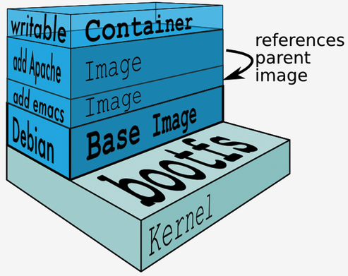

典型的Linux文件系统包含两个文件系统，bootfs 和 rootfs

* bootfs包含了kernel和bootloader，bootloader会引导加载Kernel。Linux在刚启动的时候会加载bootfs文件系统，当boot加载完成之后整个内核就都在内存中了，此时内存的使用权由bootfs转交给内核，系统也会卸载掉bootfs
* rootfs包含了典型Linux的命令、目录和文件：/dev /bin /etc等。rootfs就是不同的Linux发行版，比如ubuntu、debian之类的

Docker的镜像都是只读的，而**容器这个实例化对象就是加在这些只读镜像上面的一层可读写的文件层**

## *Win & Mac的OS级虚拟化*

不同于Linux通过容器技术来原生支持docker；windows既可以通过系统/硬件虚拟层支持Linux容器，也支持Win平台的原生容器；而mac不支持原生容器，需要一层系统/硬件虚拟层来间接支持docker（也就是说本质上还是在Linux上跑，通过Linux的系统调用实现），因此使用方面也有一定的限制

### Win

Win 使用了 Hyper-V 来支持 Linux 容器，这是 Win 上的虚拟化解决方案：在安装 Docker Desktop 后，它会通过 WSL2 启动一个虚拟机（LinuxKit VM），在该虚拟机中运行 Docker 守护进程。这样，Docker 容器就可以在这个虚拟机上运行，而不是直接在 Windows 操作系统上

WSL2（Windows Subsystem for Linux 2）是微软开发的 Windows 子系统，旨在提供在 Windows 操作系统上运行本机 Linux 内核的功能

### Mac

https://breaklimit.me/2017/04/14/mac-osx-vm-1/

使用了 macOS 上的 Hypervisor.framework，该框架提供了虚拟化功能

xhyve出现以后，Docker for Mac也从原来的Oracle virtual box（Boot2Docker镜像）的虚拟机切换到xhyve虚拟机，大大提升了对应性能和用户体验

# Docker的安装

## *Docker组件*

Ubuntu下一般只会安装基础的 Docker Engine，而 WIn/Mac下安装完整的 Docker Desktop

### Docker Engine


Docker Engine 是一个 Client-Server架构，具有以下内容

* 一个带有长期运行的守护进程 dockerd 服务器
* 指定程序可以使用的API，用于与Docker守护进程进行通信和指令
* CLI 客户端docker：CLI使用Docker API通过脚本或直接CLI命令来控制或与Docker守护进程交互。许多其他Docker应用程序使用底层API和CLI。守护进程创建和管理Docker对象，如镜像、容器、网络和卷

### Docker Desktop

Docker Desktop 提供了一个 GUI，它有下面这些组件

* Docker Engine
* Docker Scout 是一个可能需要额外订阅的工具，用于更强大的容器监控和管理功能。它提供了对Docker环境的详细监控和分析，以帮助用户更有效地运行他们的容器化应用
* Docker Buildx 是一个用于构建多平台镜像的工具。它扩展了Docker CLI的功能，使用户能够在多个平台上构建和推送容器镜像，以满足不同系统架构的需求
* Docker Extensions 是一组扩展功能，用于增强Docker的能力。这些扩展可能包括额外的工具、插件或功能，使用户能够更灵活地使用和扩展Docker
* Docker Compose 是一个工具，允许用户使用YAML文件定义和管理多容器的Docker应用。通过定义服务、网络和卷等元素，用户可以轻松地部署和管理复杂的多容器应用
* Kubernetes
* Docker Content Trust 是一项安全功能，用于验证Docker镜像的真实性和完整性。它通过数字签名确保镜像在构建和传输过程中没有被篡改
* Credential Helper是一个用于简化和安全管理Docker凭据的工具。它可以用于存储和检索访问Docker仓库所需的认证信息

### Docker 版本

Docker 发展过程中衍生了以下版本，目前我们学习和使用提到的版本是 docker-ce

* LXC：LXC 是最早的 linux 容器技术，早期版本的 docker 直接使用 LXC 来实现容器的底层功能。虽然使用者相对较少，但 LXC 项目仍在持续开发演进中
* libcontainer：docker 从 0.9 版本开始自行开发了 libcontainer 模块来作为 LXC 的替代品实现容器底层特性，并在 1.10 版本彻底去除了 LXC。在 1.11 版本拆分出 runc 后，libcontainer 也随之成为了 runc 的核心功能模块，runc 后续变成了容器标准
* moby：moby 是 docker 公司发起的开源项目，其中最主要的部分就是同名组件 moby，事实上这个 moby 就是 **dockerd** 目前使用的开源项目名称，docker 项目中的 engine（dockerd）仓库现在就是从 moby 仓库 fork 而来的，使用 containerd 作为运行时标准。https://mobyproject.org/
* docker-ce：docker 的开源版本，CE 指 Community Edition。docker-ce 中的组件来自于 moby、containerd 等其他项目。https://www.docker.com/pricing/
* docker-ee：docker 的收费版本，EE 指 Enterprise Edition。其基础组件来源和docker-ce 是一样的，但附加了一些其他的组件和功能

## *Ubuntu*

```
Ubuntu Kinetic 22.10
Ubuntu Jammy 22.04 (LTS)
Ubuntu Focal 20.04 (LTS)
Ubuntu Bionic 18.04 (LTS)
```

https://docs.docker.com/engine/install/ubuntu/#install-from-a-package

### 安装目录问题

Docker 默认的安装目录为 /var/lib/docker，这里面会存放很多很多镜像，所以我们在安装的时候需要考虑这个目录的空间

有三种解决方案

1. 将 /var/lib/docker 挂载到一个大的磁盘，比如腾讯云这种云厂商在安装 K8s 的节点的时候提供了挂载选项，可以直接挂载这个目录过去

2. 安装之前挂载一个大的磁盘，然后创建一个软链接到 /var/lib/docker，这样就自动安装到我们空间比较大的磁盘了

3. 修改docker的配置文件，假设我们准备好了一个 /data/var/lib/docker 大硬盘挂载点

   ```json
   {
   	"data-root": "/data/var/lib/docker"
   }
   ```

   ```cmd
   # 加载配置
   sudo systemctl daemon-reload
   # 重启 docker
   sudo systemctl restart docker
   #查看 docker 状态
   sudo systemctl status docker
   ```

### 通过包管理工具安装

### 直接通过安装文件安装

### 通过脚本文件安装

Docker提供了一个方便的脚本，位于 https://get.docker.com/，用于在开发环境中以非交互方式安装Docker。虽然不建议在生产环境中使用这个便利脚本，但它对于创建适合用户需求的配置脚本非常有用

注意：在本地运行之前，始终检查从互联网下载的脚本。该利脚本的潜在风险和限制为

* 该脚本需要root或sudo权限来运行
* 该脚本试图检测Linux发行版和版本，并为用户配置包管理系统
* 该脚本不允许用户自定义大多数安装参数
* 该脚本在没有确认的情况下安装依赖项和推荐项。这可能会根据主机机器的当前配置安装大量软件包
* 默认情况下，该脚本安装Docker、containerd和RunC的最新稳定版本。当使用此脚本为机器配置时，这可能导致意外的Docker主要版本升级。始终在测试环境中测试升级，然后再部署到生产系统中
* 该脚本并非用于升级现有的Docker安装。当使用脚本更新现有安装时，依赖关系可能不会更新到预期版本，导致使用过时的版本

```cmd
$ curl -fsSL https://get.docker.com -o get-docker.sh
# $ sudo sh ./get-docker.sh --dry-run # --dry-run option to learn what steps the script will run when invoked
$ sudo sh ./get-docker.sh
```

curl 命令的一些选项参数

* `-f`：表示在发生错误时不生成任何输出
* `-s`：表示“静默模式”（silent mode），不显示进度或错误信息
* `-S`：在发生错误时仍然显示错误信息。这与`-s`相反
* `-L` ：告诉 curl 在遇到 HTTP 3xx（重定向）响应时，继续跟随重定向，获取重定向后的内容
* `-o`：重命名下载的文件

安装 pre-release 版本的 docker engine：使用脚本 https://test.docker.com/

```cmd
$ curl -fsSL https://test.docker.com -o test-docker.sh
$ sudo sh test-docker.sh
```

安装完成后检查是否安装成功

```cmd
$ sudo service docker start
$ sudo docker run hello-world
```

### 安装后的Docker权限问题

Docker daemon绑定到一个Unix socket，而不是一个TCP port。默认情况下Unix套接字的所有权归属于root用户，因此Docker守护进程始终以root用户身份运行，其他用户只能通过sudo访问它

如果不想每次在docker命令之前加上sudo，可以创建一个名为docker的Unix用户组，并将用户添加到其中。当Docker daemon启动时，它会创建一个Unix socket，只有docker组的成员可以访问。在某些Linux发行版上，使用软件包管理器安装Docker Engine时，系统会自动创建这个组。在这种情况下无需手动创建该组

```cmd
$ sudo groupadd docker # 创建一个名为docker的用户组
$ sudo usermod -aG docker ${USER} # 将当前用户添加到docker用户组
$ sudo systemctl restart docker
$ newgrp docker # 使当前用户无需重新登录，立即切换到docker用户组
$ docker ps
```

### 修改国内镜像源（镜像加速器）

对于使用 systemd 的系统（Ubuntu 16.04+、Debian 8+、CentOS 7），

1. 在配置文件 /etc/docker/daemon.json（没有则创建之）中加入

   ```json
   {
       "regostru-mirrors" : ["https://docker.mirrors.ustc.edu.cn/"]
   }
   ```

   如果是阿里云的镜像，需要先自己注册账号，然后会分配个人专属的镜像地址

2. 重新启动 dockerd

   ```cmd
   $ sudo systemctl restart docker
   ```

## *Mac & Win*

### Mac

在 macOS 上，Docker for Mac 通过一个名为 `com.docker.docker` 的用户空间进程运行。Docker for Mac在 macOS 上使用了一种不同的架构，它利用了 macOS 的内核特性（如 HyperKit）来实现容器运行

Docker for Mac 将 Docker 守护进程（dockerd）和相关组件集成到了一个应用程序中，这个应用程序可以在 macOS 上直接运行。所以在 macOS 上通常不会像在 Linux 上那样找到一个名为 `dockerd` 的独立进程

在安装完 Docker Desktop并打开它后可以运行下面的命令来验证是否安装成功

```cmd
$ docker run hello-world
```

### Mac的镜像文件问题

Docker Desktop将容器和镜像存储在Mac文件系统中的单个预先分配的大型磁盘映像文件 Docker.raw 中，位置默认是 `/Users/wjfeng/Library/Containers/com.docker.docker/Data/vms/0/data` 中

可以在 Docker Desktop - Settings - Resources 中修改

注意⚠️：缩小 Docker.raw 会导致丢失所有的镜像和容器

### Win

# Docker Workflow

Docker是一个开放平台，用于开发、发布和运行应用程序。 Docker允许用户将应用程序与基础架构分离，以便快速交付软件。使用Docker，用户可以以与管理应用程序相同的方式管理基础架构。通过利用Docker的代码快速发布、测试和部署方法，可以显著缩短编写代码和在生产环境中运行代码之间的延迟

## *Docker架构*

### Docker组成


Docker采用CS架构。Docker客户端和Docker守护进程通信，后者负责build、run和分发Docker容器。Docker客户端和守护进程可以在同一系统上运行，或者可以将Docker客户端连接到远程Docker守护进程

Docker客户端和守护进程使用REST API通过UNIX套接字或网络接口进行通信。另一个Docker客户端是Docker Compose，它可以让用户使用由一组容器组成的应用程序

* Docker daemon

  Docker 守护进程（dockerd）监听 Docker API 请求并管理 Docker 对象，例如镜像、容器、网络和volume。一个守护进程也可以与其他守护进程通信以管理 Docker 服务

* Client

  Docker 客户端（docker）是许多 Docker 用户与 Docker 交互的主要方式。当用户使用诸如 `docker run` 等命令时，客户端会将这些命令发送给 dockerd，后者会执行它们。docker 命令使用 Docker API。Docker 客户端可以与多个守护进程通信

* Registries 仓库

  Docker registry是存储Docker镜像的地方。Docker Hub是一个公共的registry，任何人都可以使用，而且Docker默认会在Docker Hub上寻找镜像。用甚至可以运行自己的私有registry

  当使用 `docker pull` 或 `docker run` 命令时，需要的镜像会从配置的registry中拉取。当使用 `docker push` 命令时，用户的镜像会被推送到配置的registry中

### Docker 对象

Docker中有镜像、容器、网络、volume、插件等对象

* 镜像 image

  在运行容器时，它使用一个独立的文件系统。这个自定义的文件系统由一个容器镜像提供。由于镜像包含了容器的文件系统，所以它必须包含运行应用程序所需的一切——所有依赖项、配置、脚本、二进制文件等等。镜像还包含了容器的其他配置，如环境变量、默认运行命令和其他元数据。**镜像是不可更改的，要修改一个镜像，需要重新构建**

  **Docker镜像就好像是一个类**，可以通过这个模版来创建容器服务，即通过镜像来创建容器服务

  用户可以创建自己的镜像，也可以仅使用由其他人创建并在注册表中发布的镜像。要构建自己的镜像，用户可以创建一个 **Dockerfile**，其中有一个简单的yaml语法来定义创建镜像和运行它所需的步骤。 Dockerfile 中的每个指令都会在镜像中创建一个层。当更改 Dockerfile 并重新构建镜像时，只有那些已更改的层会重新构建。这就是镜像相对于其他虚拟化技术轻量、小巧、快速的部分原因

* 容器 container

  容器就像一个类实例

  一个容器就是在用户的计算机上运行的与主机机器上所有其他进程隔离的沙盒进程。该隔离利用了 Linux 内核名称空间和 cgroups 的功能，这些功能已经存在于 Linux 中很长时间。Docker 已经努力让这些功能易于使用和管理。总结一下，一个容器：
  
  * 是一个可运行的映像的实例。可以使用 DockerAPI 或 CLI 创建、启动、停止、移动或删除容器
  * 可以在本地机器、虚拟机或云中运行
  * 可移植（可在任何操作系统上运行）
  * 与其他容器隔离，运行自己的软件、二进制文件和配置

## *Overview*


编写Dockerfile `->` build 生成 images `->` run 形成 containers `->` push 到远程库

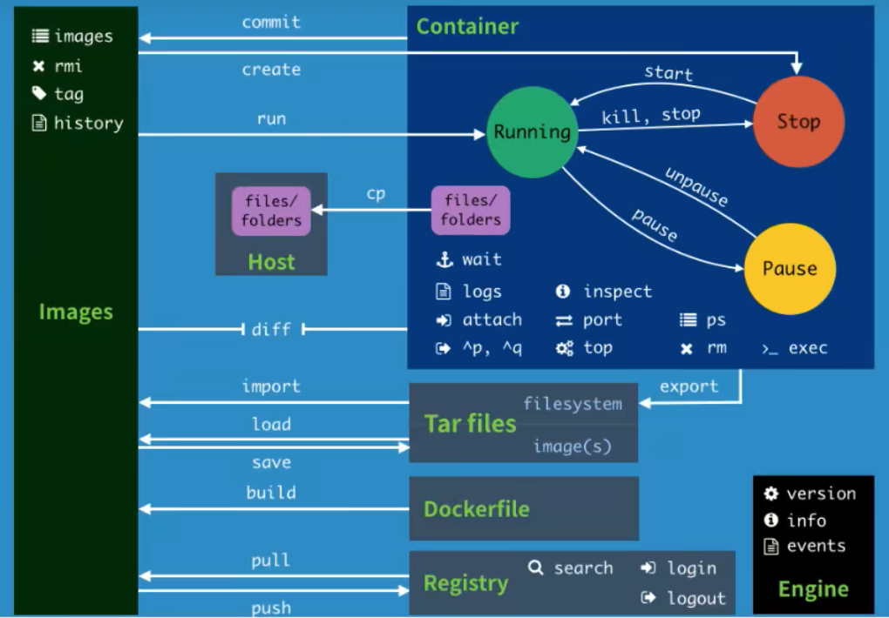

## *Docker镜像管理*

### 镜像仓库分类

* 按是否对外开放划分
  * 公有仓库：像阿里云、docker hub 等放到公有网络上，不用登录就可以下载镜像，供大家访问使用
  * 私有仓库：不对外开放，往往位于私有网络，只有公司内部人员可以使用。
* 按供应商和面向群体划分
  * sponsor registry：第三方的 registry，供客户和 docker 社区版使用
  * mirror registry：第三方的 registry，只让客户使用，例如阿里云必须注册才能使用
  * vendor registry：由发布 docker 镜像的供应商提供的 registry，例如像Google 和 Redhat 提供了镜像仓库服务
  * private registry：通过没有防火墙和额外的安全层的私有实体提供的 registry，仅供内部使用

### 实际工作中镜像仓库的使用

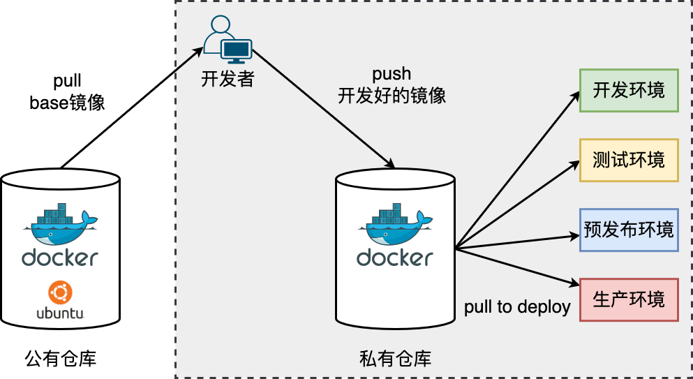

### 命令

* 查看镜像信息

  * `docker images` 查看镜像信息

    ```cmd
    $ docker images
    REPOSITORY                                   TAG    IMAGE ID     CREATED        SIZE
    gitlab.lrz.de:5005/cdb-23/gr18/ms4/kv-server latest f151d15bf79e 5 months ago   345MB
    ```

    * REPOSITORY：表示镜像的仓库名称。这通常是镜像的来源或名称空间

    * TAG：镜像的标签，表示该镜像的版本

    * IMAGE ID：镜像的唯一标识符，是一个较短的哈希值

    * CREATED：镜像创建的时间，如果是从远程仓库中拉取的镜像，那么这个时间表示镜像在远程仓库中创建的时间，而不是本地构建的时间

  * `docker history`：显示一个镜像的历史记录，包括各个层的详细信息

  * `docker inspect`：查看详细的镜像信息，包括配置、挂载点等
* `docker tag SOURCE_IMAGE[:TAG] TARGET_IMAGE[:TAG]` 给一个镜像打标签

* `docker pull` 下载镜像。如果不写tag，就默认下载latest

* `docker commit` 命令用于从容器的更改创建一个新的映像。将容器的文件更改或设置提交到新映像可能很有用

* `docker rmi -f 镜像ide` 删除指定的镜像

* `docker save [OPTIONS] IMAGE [IMAGE...]`：将一个或多个镜像保存成一个 tar 归档文件

* `docker load [OPTIONS]`：从一个 tar 归档文件中加载镜像到本地

## *Docker容器架构*

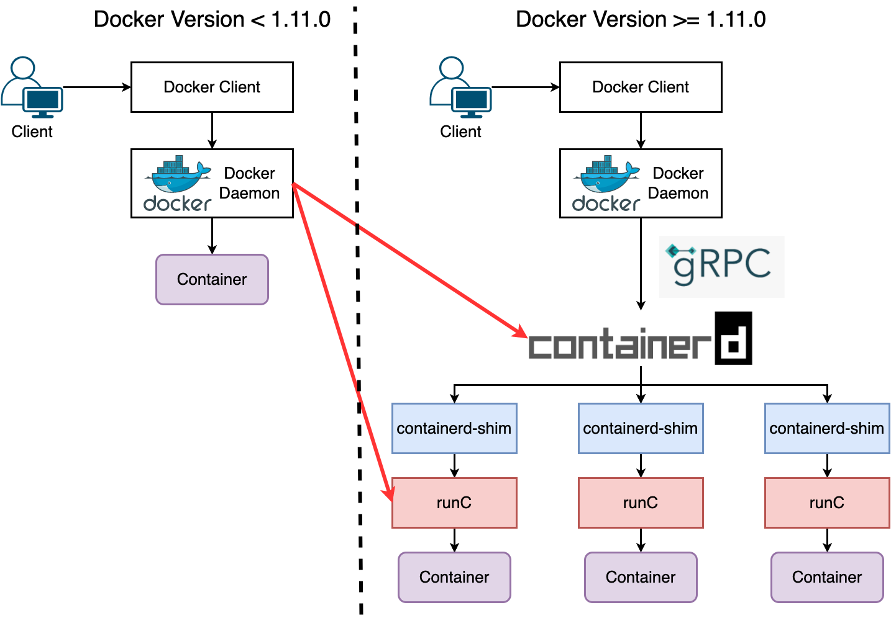

守护进程 Docker Daemon 负责和 Docker Client 端交互，并管理 Docker 镜像和容器。现在的架构中组件 containerd 就会负责集群节点上容器的生命周期管理，并向上为 Docker Daemon 提供 gRPC 接口

### 容器引擎：Containerd

https://containerd.io


containerd 是一个由Docker公司于2017年捐赠给 OCI 的开源项目，它是一个轻量级的容器运行时，用于**管理容器的生命周期**。containerd的设计目标是提供一个通用的容器执行引擎，使得不同的容器生态系统可以共享相同的核心组件

 containerd完全遵循OCI标准，包括容器运行时规范和容器镜像规范。这使得containerd与其他兼容OCI规范的工具和技术集成更为容易

### containerd-shim

> 当我们要创建一个容器的时候，现在 Docker Daemon 并不能直接帮我们创建了，而是请求 `containerd` 来创建一个容器，containerd 收到请求后，也并不会直接去操作容器，而是创建一个叫做 `containerd-shim` 的进程，让这个进程去操作容器，我们指定容器进程是需要一个父进程来做状态收集、维持 stdin 等 fd 打开等工作的，假如这个父进程就是 containerd，那如果 containerd 挂掉的话，整个宿主机上所有的容器都得退出了，而引入 `containerd-shim` 这个垫片就可以来规避这个问题了。
>
> 然后创建容器需要做一些 namespaces 和 cgroups 的配置，以及挂载 root 文件系统等操作，这些操作其实已经有了标准的规范，那就是 OCI（开放容器标准），`runc` 就是它的一个参考实现（Docker 被逼无耐将 `libcontainer` 捐献出来改名为 `runc` 的），这个标准其实就是一个文档，主要规定了容器镜像的结构、以及容器需要接收哪些操作指令，比如 create、start、stop、delete 等这些命令。`runc` 就可以按照这个 OCI 文档来创建一个符合规范的容器，既然是标准肯定就有其他 OCI 实现，比如 Kata、gVisor 这些容器运行时都是符合 OCI 标准的。
>
> 真正启动容器是通过 `containerd-shim` 去调用 `runc` 来启动容器的，`runc` 启动完容器后本身会直接退出，`containerd-shim` 则会成为容器进程的父进程, 负责收集容器进程的状态, 上报给 containerd, 并在容器中 pid 为 1 的进程退出后接管容器中的子进程进行清理, 确保不会出现僵尸进程。
>
> 而 Docker 将容器操作都迁移到 `containerd` 中去是因为当前做 Swarm，想要进军 PaaS 市场，做了这个架构切分，让 Docker Daemon 专门去负责上层的封装编排，当然后面的结果我们知道 Swarm 在 Kubernetes 面前是惨败，然后 Docker 公司就把 `containerd` 项目捐献给了 CNCF 基金会，这个也是现在的 Docker 架构。
>
> -- https://www.qikqiak.com/post/containerd-usage/

### 容器运行时：RunC

https://www.cnblogs.com/sparkdev/p/9032209.html

OCI标准催生从Docker Engine剥离出的 RunC，以瓦解Docker Engine的一家独大的情况，确保各个厂商都可以搭建自己的容器平台

RunC 是一个轻量级的工具，它是专门遵守OCI标准来用来运行容器。其实 RunC 就是一个命令行工具，可以**不用通过 docker 引擎直接运行容器**


## *容器命令*

### 容器的周期控制

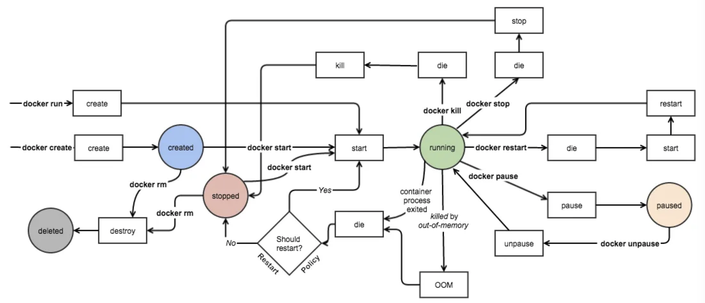

注意有三类特殊情况

* 容器 OOM (Out Of Memory)。Docker 在处理 OOM 事件时分为三种情况

  * 若容器中的应用耗尽了主机系统分配给容器的内存限额，就会触发 OOM 事件。比如说在容器当中，部署了一个 web 服务。假设主机分配给此容器的内存上限为 1G，当脚本申请的内存大于 1G 时，此容器就会触发 OOM 事件。而在这种情况下，此容器将会被强制关闭

    但要注意的是，此时关闭容器的并非是 Docker Daemon，而是宿主机操作系统。因为一个容器其实就是一组运行在宿主机操作系统当中的进程，宿主机操作系统通过cgroups 对这组进程设定资源上限，当这些进程申请的资源到达上限时，触发的是宿主机操作系统的内核 OOM 事件，因此最终是由宿主机内核来关闭这些进程

  * 如果用户不想关闭这个容器，那么可以选择 `--oom-kill-disable` 来禁用 OOM-Killer。

    使用此参数时，仍需要注意，如果使用 `-m` 设置了此容器内存上限，那么当容器到达内存资源上限时，主机不会关闭容器，但也不会继续向此容器继续分配资源，此时容器将处于 hung 状态。只需要将最坏的情况封闭在一定范围之内，而不至于蔓延出去

  * 如果用户使用了 `--oom-kill-disable`，但也没有使用 `-m` 来设定上限，因而此时此容器将会尽可能多地使用主机内存资源。换言之，主机内存有多大，它就将用多大

* 容器异常退出

  * 当容器的 Init 进程退出时，也就代表着此容器被关闭。Docker 目前没有办法知道此时的进程退出属于正常退出还是异常退出
  * 当出现容器关闭情况时，Docker Daemon 会尝试再次重新将此容器由 Stopped 状态转为 Running 状态。只有设置了--restart 参数的容器，Docker Daemon 才会去尝试启动，否则容器会保持停止状态

* 容器暂停：Docker剥夺了容器的CPU时间片，失去了 CPU 资源的进程，是不会被主机内核系统所调度的。其他资源，如 Memory 资源、Network 资源等还保留未动

`docker ps` 查看目前运行的容器，`docker ps -a` 查看运行过的所有容器

```cmd
$ docker ps -a
CONTAINER ID   IMAGE          COMMAND                  CREATED          STATUS         PORTS                    NAMES
abc123456789   nginx:latest   "nginx -g 'daemon of…"   2 hours ago      Up 2 hours     0.0.0.0:80->80/tcp       web_server
def987654321   ubuntu:20.04   "/bin/bash"              3 days ago        Exited (0)     0.0.0.0:8080->8080/tcp   my_container
```

* CONTAINER ID：每个容器的唯一标识符。可以使用这个ID来执行其他与容器相关的操作，例如停止、删除等
* IMAGE：用于创建容器的镜像名称或ID。镜像是一个包含应用程序和其依赖项的文件系统快照
* COMMAND：启动容器时运行的命令。这通常是容器的入口点，决定容器的主要操作
* CREATED：容器的创建时间。这是一个相对于当前时间的时间戳，表示容器何时启动
* STATUS：容器的当前状态。可能的值包括运行中（`Up`）、已停止（`Exited`）、挂起（`Paused`）等。如果是Exited，括号里的是它的推出码
* PORTS：映射到容器内部端口的端口号。这个字段显示了容器内部应用程序的端口和映射到主机的端口
* NAMES：容器的名称。Docker容器可以使用名称来引用，而不仅仅是使用容器ID。这使得与容器进行交互更加方便。如果在运行容器时没有显式指定名称，Docker将为容器分配一个随机的、唯一的名称。这个名称通常是以形容词和名词的（毫无意义的）组合，如"admiring_bell"，"furious_beaver"等，以确保其唯一性

### 创建、启动容器

注意：`docker container *` 和 `docker *` 是相同的命令，可以互换使用。在较新版本的 Docker 中，为了提高命令行的组织结构，`docker container` 子命令被引入，但为了保持向后兼容性，`docker run` 仍然有效，并且与 `docker container run` 具有相同的功能。下面笔者还是统一使用不带 container 的命令

```cmd
docker run [OPTIONS] IMAGE [COMMAND] [ARG...]
```

`docker run` 是容器最重要的命令之一，它相当于 create + start。它的选项为

* `-d, --detach`：在后台运行容器，即使终端关闭，容器也会继续运行

* `-p, --publish 主机端口:容器端口`：将容器内部端口映射到主机的指定端口

* `-P`：将容器内部端口映射到主机的随机端口（不常用，一般都用 `-p`）

  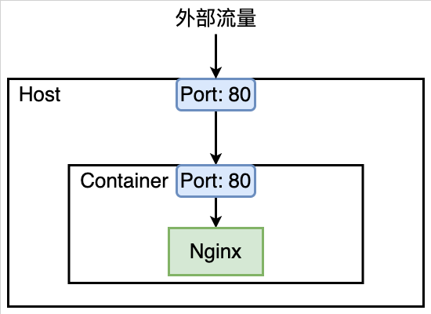

* `-v, --volume`：挂载主机文件或目录到容器内部，实现数据持久化

* `-mount`：详见Docker Volume部分

* `--name`：为容器指定一个名称

* `-h`：指定容器的 hostname

* `-e, --env`：设置环境变量

* `--rm`：容器退出时自动删除容器实例

* `--cpuset-cpus="0-2" or --cpuset-cpus="0,1,2"`：绑定容器到指定 CPU 运行

* `-m`：设置容器使用内存最大值

* `--network`：指定容器连接的网络，默认是 bridge

* `--link`：连接到另一个容器，已被弃用，建议使用用户定义的网络

* `-i -t`：以交互模式运行容器，通常与分配伪终端一起使用

* `--restart`：设置容器的重启策略，默认是无限重启

我们以下面这个命令来说明一下 `docker run` 的时候都发生了什么

```shell
docker run -i -t ubuntu /bin/bash
```

当输入上面的命令时，发生了下面这些事

1. 如果用户没有本地的ubuntu镜像，Docker会从用户配置的registry中拉取它，就像手动运行 `docker pull ubuntu` 一样
2. Docker创建一个新的容器，就像手动运行了 `docker container create` 命令一样
3. Docker为容器分配一个读写文件系统，作为其最终层。这允许正在运行的容器在其本地文件系统中创建或修改文件和目录
4. Docker创建一个网络接口，将容器连接到默认网络，因为用户没有指定任何网络选项。这包括分配容器的IP地址。默认情况下，容器可以使用主机机器的网络连接连接到外部网络
5. Docker启动容器并执行 `/bin/bash`。因为容器正在交互式地运行并附加到用户的终端（由于 `-i` 和 `-t` 标志），用户可以使用键盘提供输入，同时将输出记录到其终端
6. 当用户输入 `exit` 以终止 `/bin/bash` 命令时，容器停止但不被删除。用户可以再次启动它或将其删除

```cmd
docker create [OPTIONS] IMAGE [COMMAND] [ARG...]
docker start [OPTIONS] CONTAINER [CONTAINER...]
```

### 暂停、重启

```
docker pause CONTAINER [CONTAINER...]
docker unpause CONTAINER [CONTAINER...]
```

### 退出、删除容器

```cmd
 docker kill [OPTIONS] CONTAINER [CONTAINER...]
 docker rm [OPTIONS] CONTAINER [CONTAINER...]
 docker container prune [OPTIONS]
```

* 退出容器

  * exit 直接停止并退出容器
  * Ctrl+P+Q 容器不停止退出
* 删除容器 

  * `docker rm 容器id` 删除指定容器，不能删除正在运行的容器，若要强制删除，就用 `rm -f`
  * 下面两个指令是具有一定危险性的
    * `docker rm -f $(docker ps -aq) ` 删除所有的容器
    * `docker container prune` 删除所有 stop 的容器

### 镜像快照、导入导出

### 查看信息

* 日志 `docker logs -f -t --tail NUM` 显示日志条数
* 查看容器中进程信息 `docker top 容器id`
* 查看镜像原数据 `docker inspect`
* 查看资源占用信息 `docker stats`

### 进入容器的命令和拷贝命令

* `docker exec -it 容器id shell`，进入容器后开启一个新的中断，可以在里面操作（常用）
* `docker attach 容器id`，进入容器横在执行的终端，不会启动新的进程
* `docker cp 容器id:容器内路径` 目的主机路径

# Build详解

## *基础*

### Dockerfile编写

https://docs.docker.com/engine/reference/builder/

https://docs.docker.com/build/building/packaging/#dockerfile

Cheatsheet: https://kapeli.com/cheat_sheets/Dockerfile.docset/Contents/Resources/Documents/index

Docker 可以通过读取 Dockerfile 中的指令自动构建镜像。Dockerfile 是一个文本文件，包含了用户可以在命令行上调用的所有命令，以组装镜像

```dockerfile
# 使用基础镜像
FROM base_image:tag

# 设置工作目录
WORKDIR /app

# 指定使用的 shell
SHELL ["/bin/bash", "-c"]

# 复制文件到容器中
COPY source destination

# 执行命令
RUN command

# 暴露端口
EXPOSE port

# 设置环境变量
ENV key=value

# 容器启动时执行的命令
CMD ["executable","param1","param2"]

# 定义卷
VOLUME ["/data"]

# 设置标签
LABEL key=value
```

Dockerfile的格式如上，它不是case-sensitive，但还是建议将指令写成大写的。**指令必须要从 `FROM` 开始**

* `FROM <image>`：指定初始镜像

  > An image’s **parent image** is the image designated in the `FROM` directive in the image’s Dockerfile. All subsequent commands are based on this parent image. A Dockerfile with the `FROM scratch` directive uses no parent image, and creates a **base image**.

* `WORKDIR <directory>`：对任何后续的RUN、CMD、ENTRYPOINT、ADD或COP指令设置工作目录，该命令可以多次使用

  [WORKDIR 指定工作目录 | Docker — 从入门到实践 (gitbook.io)](https://yeasy.gitbook.io/docker_practice/image/dockerfile/workdir)

  在初学的时候犯过的错误：把 Dockerfile 当成 Shell Script 来写用了cd，实际上对于跨文件层（即Dockerfile中的两条指令）来说cd没有意义。Docker采用分层存储来构建，所以不同行的命令是不同的容器，因此想要持久地更改目录，应该要用 `WORKDIR`

* `SHELL`：Docker 使用 `/bin/sh -c` 作为默认的 shell。但是可以通过 `SHELL` 指令来指定使用其他的 shell。`-c` 表示把后面的字符串当作命令来执行，而是当作一个脚本文件来执行

* `COPY <src> <dest>`：把一个文件从主机的src拷贝到镜像文件系统的dest

  不能直接引用宿主机的绝对路径（如 `/mnt/data/docker_mount_files`）来复制文件到镜像内。Docker 构建只能访问发送给 Docker 守护进程作为构建上下文的那些文件和目录

* `RUN <command>`：在容器内执行指定的指令，并把结果保存下来

* `EXPOSE`：暴露容器的端口，使得可以从主机访问容器内的服务

* `CMD <command>`

  * 用来定义当启动基于某个镜像的容器时的默认程序
  * 每一个Dockerfile只能有一个CMD

* `LABEL`：以键值对的形式为镜像添加元数据

* `ARG`：用于定义构建时的参数。这些参数也可以在构建 Docker 镜像时通过 `--build-arg` 标志进行传递

### Build 命令

用 `docker build --build` 来查看 `docker build <dockerfile>` 命令的常用选项

* `-t, --tag`：用于为生成的镜像指定名称和标签。例如：`docker build -t myimage:1.0 .`
* `-f, --file`：指定用于构建镜像的Dockerfile路径。**默认情况下，Docker将在当前目录查找名为`Dockerfile`的文件**。使用此选项可以指定其他文件名或路径。例如：`docker build -f Dockerfile.prod .`
* `--build-arg`：允许在构建过程中设置构建参数。这对于在构建过程中动态传递参数非常有用。例如：`docker build --build-arg HTTP_PROXY=http://proxy.example.com:80 .`
* `--no-cache`：禁用构建缓存，强制重新构建整个镜像。例如：`docker build --no-cache .`
* `--rm`：在构建完成后删除中间容器。默认情况下，Docker会保留用于构建的中间容器，使用此选项可以在构建完成后删除这些容器。例如：`docker build --rm .`
* `--network`：指定构建时要使用的网络模式。例如：`docker build --network=host .`
* `--pull`：在构建之前尝试拉取最新的基础镜像。例如：`docker build --pull .`
* `--quiet, -q`：减少构建输出，仅显示最终镜像的ID。例如：`docker build -q .`

## *Build Drivers*

### Architecture

[Docker Build architecture | Docker Docs](https://docs.docker.com/build/architecture/)


docker build系统同样被实现为一个client-server结构，这意味着镜像的build工作并不一定要在host本地完成

* Buildx 是 Docker 官方维护的一个 CLI 插件，它提供了一些在原生 `docker build` 命令中不可用的额外特性。Buildx 使得 Docker 构建可以使用 BuildKit 的先进功能，并且其设计目的是提供更加灵活、可扩展的方式来创建 Docker 镜像

  直到 Docker Engine 23.0 and Docker Desktop 4.19，Buildx 已经是Docker默认的build client，也就是说现在不需要使用 `docker buildx build`，而是直接用 `docker build` 就可以了

* BuildKit 或者 buildkitd 是实际执行build任务的守护进程

  当初始化 Buildx 时，实际上是在设置一个或多个 BuildKit 构建器。每个构建器都可以配置自己的环境和参数，例如，针对不同的 CPU 架构或不同的OS

* Builder 指BuildKit backend中执行构建任务的实体

### Multi-platform Build

## *构建上下文*

### 构建上下文的作用

构建上下文 build context 是指 `docker build` 命令运行时的文件系统上的目录。在构建镜像时，Docker 会将这个目录及其内容发送给 buildkitd 来执行构建过程。这意味着 Dockerfile 中的所有文件引用都应相对于这个构建上下文目录

```cmd
$ docker build -t my-image .
```

这里的点 `.` 表示当前目录作为构建上下文，Docker 将发送当前目录下所有内容（除 `.dockerignore` 文件中定义的内容外）给 buildkitd

### `.dockerignore`

由于整个构建上下文目录都会被发送，这可能包括不必要的大文件或敏感信息。为了提升构建性能并避免泄露信息，可以在构建上下文目录中创建 `.dockerignore` 文件，类似于 `.gitignore`，列出想排除的文件和目录

```dockerfile
# 忽略所有 .txt 文件
*.txt

# 除了 dockerfile.txt，它将被包含
!dockerfile.txt

# 忽略 logs 目录
logs/

# 忽略 temp 文件和临时目录
*tmp
*temp
```

## *多阶段构建*

### Error: max depth exceeded

Docker在构建镜像时，会构建多个layers，在使用Dockerfile时，过度使用COPY、RUN命令，在频繁构建容器时，就会出现构建层数过多的情况，报max depth exceeded错误，并且无法再次构建容器。一般这个错误都是在有上百个layers的时候才会出现，但是笔者在云服务器上开发的时候，layer貌似被限定到了13层，不是很明白为什么

以下是一些build的建议

* 减少在buildfile中的 `git clone` 等操作，使用COPY
* 多阶段构建

### 多阶段构建的使用

多阶段构建 Multi-stage build 是指在一个Dockerfile中定义多个构建阶段，每个阶段都可以执行一组特定的操作，生成中间产物，然后将这些中间产物传递到下一个阶段。这样可以有效地减小最终Docker镜像的大小，只包含运行时所需的组件，而不包括构建时使用的工具和中间文件

多阶段构建有助于减小Docker镜像的大小，提高安全性，并减少潜在的攻击面。一般情况下，构建阶段可以包含用于编译、测试和生成中间产物的工具，而最终阶段则只包含应用程序和运行时所需的依赖项

以下是一个简单的多阶段构建的例子，使用一个基于Node.js的应用程序：

```dockerfile
# 构建阶段1：使用Node.js镜像安装依赖和编译应用
FROM node:14 AS builder
WORKDIR /app
COPY package.json .
RUN npm install
COPY . .
RUN npm run build

# 构建阶段2：使用更轻量的Node.js镜像，只包含运行时依赖
FROM node:14-alpine
WORKDIR /app
COPY --from=builder /app/dist /app
COPY --from=builder /app/node_modules /app/node_modules

# 设置环境变量
ENV NODE_ENV production

# 暴露应用程序的端口
EXPOSE 3000

# 启动应用程序
CMD ["node", "app.js"]
```

在这个例子中，第一个阶段使用`node:14`基础镜像构建应用程序，安装依赖，编译应用，并生成中间产物。第二个阶段则使用更轻量的`node:14-alpine`基础镜像，并从第一个阶段复制只需的文件，最终构建一个更小的镜像，只包含运行时所需的内容。

## *构建缓存*

在执行每条 Dockerfile 中的构建指令之前，Docker 都会在缓存中查找是否已经存在可重用的镜像，如果有就使用现存的镜像，不会再重复创建

Dockerfile 中的每一条指令都会产生一层 image layer。**当某一层 layer 修改后，后面的所有 layer 缓存都会失效，需要重新构建**

### 缓存检查规则

从一个基础镜像开始（`FROM` 指令指定），下一条指令将和该基础镜像的所有子镜像进行匹配，检查这些子镜像被创建时使用的指令是否和被检查的指令完全一样。如果不是，则缓存失效

在大多数情况下，只需要简单地对比 `Dockerfile` 中的指令和子镜像。然而，有些指令需要更多的检查和解释

**对于 `ADD` 和 `COPY` 指令，镜像中对应文件的内容也会被检查**，每个文件都会计算出一个校验和。文件的最后修改时间和最后访问时间不会纳入校验。在缓存的查找过程中，会将这些校验和和已存在镜像中的文件校验和进行对比。如果文件有任何改变，比如内容和元数据，则缓存失效

除了 `ADD` 和 `COPY` 指令，缓存匹配过程不会查看临时容器中的文件来决定缓存是否匹配。例如，当执行完 `RUN apt-get -y update` 指令后，容器中一些文件被更新，但 Docker 不会检查这些文件。这种情况下，只有指令字符串本身被用来匹配缓存

### 缓存失效

https://juejin.cn/post/7130934881554530334

### dangling

### 命令

* 如果不想在构建过程中使用缓存，可以在 docker build 命令中使用 `--no-cache=true` 选项
* 清理 Build Cache 缓存命令 `docker builder prune`

# Docker Volume

Docker volume 存储卷 是 Docker 中用于持久化数据的一种机制，它允许在容器之间或容器与主机之间共享和存储数据。实际上**在宿主机上的这个与容器形成绑定关系的目录被称作存储卷 volume**。卷的本质是文件或者目录，它可以绕过默认的联合文件系统，直接以文件或目录的形式存在于宿主机上

使用 Docker volume 可以解决容器中数据持久性的问题，因为容器本身是临时的，一旦容器停止或删除，其文件系统中的数据也会丢失。而 Docker volume 允许将数据存储在宿主机上的持久化存储卷中，使得数据可以在容器之间进行共享，同时保留在宿主机上。**容器和宿主机的数据读写是同步的**

## *存储卷类型*

[volume详解 · Docker -- 从入门到实战 (baoshu.red)](http://docker.baoshu.red/data_management/volume.html)


Docker 提供了三种不同的方式将数据从 Docker Host 挂载到 Docker 容器，并实现数据的读取和存储：volumes、bind mounts 和 tmpfs 

### Volume

volume 管理卷：默认映射到宿主机的 /var/lib/docker/volumes 目录下，该目录是由 Docker 管理的，非 Docker 的进程不能去修改这个路径下面的文件。只需要在容器内指定容器的挂载点是什么，而被绑定宿主机下的那个目录，是由容器引擎 daemon 自行创建的一个空的目录，或者使用一个已经存在的目录，与存储卷建立存储关系

这种方式极大解脱用户在使用卷时的耦合关系，缺陷是用户无法指定那些使用目录，灵活性较低，因此临时存储比较适合

匿名卷和命名卷

### Bind Mount

bind mount 绑定数据卷：映射到宿主机（文件系统中）的指定路径下，在宿主机上的路径要**人工的指定一个特定的路径**，在容器中也需要指定一个特定的路径，两个已知的路径建立关联关系

非 Docker 的进程或者 Docker 容器可能随时对其进行修改，存在潜在的安全风险

### tmpfs mount

tmpfs mount 临时数据卷：**映射到宿主机内存中**，一旦容器停止运行，tmpfs mounts会被移除，数据就会丢失。用于**高性能或者有安全性需求的临时数据存储**

### `--volume` & `--mount` 的区别

`-v, --volume` & `--mount` 将主机上的文件或目录挂载到容器中。这两种方式都可以实现数据卷的挂载，但是它们之间存在一些差异。`-v` 是早期 Docker 版本中的原始挂载选项。`--mount` 在后来的版本中引入，为用户提供了更大的灵活性和清晰性

*  `-v, --volume`

  ```cmd
  $ docker run -v /path/on/host:/path/in/container ...
  ```

* `--mount`

  ```cmd
  $ docker run --mount type=bind, source=/path/on/host, target=/path/in/container ...
  ```

  `--mount` 是更明确和详细的，它允许我们指定挂载类型，以及源和目标位置

  - `type`：挂载类型，可以取bind、volume和tmpfs
  - `source` 或 `src`：挂载源的路径
  - `target` 或 `dst`：容器内挂载点的路径
    - `readonly`：如果设置，则表明挂载是只读的

  ```cmd
  $ docker run --mount type=bind,source=/home/user/data,target=/data,readonly my_image
  ```

  上面的命令会将主机的 `/home/user/data` 目录以只读方式挂载到容器中的 `/data` 目录

注意：当指定的挂载点不存在时，`-v` 会自动创建一个目录，而 `--mount` 在默认情况下不会创建目录，如果目录不存在，命令会失败

## *实操：MySQL灾难恢复*

# Docker网络

Docker 提供了五种不同的网络模式：bridge 桥接模式、host 主机模式、container 容器模式、none 模式、overlay 叠加模式，用于定义容器如何与主机和其他容器进行网络通信

## *沙盒模型*


Container Network Model, CNM 是由 Docker 引入的一种网络模型，用来指导容器网络的设计。具体通过由 Docker 团队开发和维护的 Libnetwork 容器网络库来实现

CNM用于定义容器之间以及容器与外部网络之间的连接和通信。CNM 的目标是提供一个通用的、可扩展的网络模型，使得容器能够灵活地连接到各种网络

### CNM 的主要组件

* Sandbox 沙盒：每个容器都有一个关联的网络沙盒，用于包含容器的网络栈，比如端口、套接字、IP 路由表、防火墙、DNS 配置等内容。沙盒是网络隔离的单元，容器内的网络配置和状态被维护在该沙盒中
* Endpoint 端点：Endpoint 是容器的网络终端，它与一个沙盒相关联，定义了容器如何连接到网络。Endpoint 的主要职责是负责创建连接。Endpoint 类似于常见的网络适配器。每个 Endpoint 有一个唯一的名字，并包含一个或多个网络配置项，如 IP 地址、MAC 地址等
* Network 网络：Network 是一组连接的 Endpoint 的集合，是 Docker 内部的虚拟子网。它定义了容器之间和容器与外部网络之间的通信规则。网络可以包含多个 Endpoint，这些 Endpoint 可以是同一沙盒内的容器，也可以是不同沙盒的容器
* Driver 驱动程序：驱动程序是实现网络连接和通信的插件。Docker 提供了一些内置的网络驱动程序，同时也允许用户自定义网络驱动程序。内置的驱动程序（成为原生驱动或本地驱动）包括桥接 bridge、覆盖 overlay、主机 host 等

CNM 的架构允许用户在不同的网络驱动程序之间进行切换，从而实现对网络连接和通信的灵活控制。用户可以根据应用程序的需求选择适当的网络驱动程序，并通过 Docker 命令或 Docker Compose 文件来配置容器的网络

### Libnetwork

Libnetwork 是 CNM 的标准实现。Libnetwork 是使用 Go 编写的开源库。Libnetwork 也是 Docker 所使用的库，Docker 网络架构的核心代码都在这个库中。Libnetwork 实现了 CNM 中定义的全部三个组件，此外它还实现了本地服务发现、基于 Ingress 的容器负载均衡，以及网络控制层和管理层功能

* 多种网络驱动程序：Libnetwork 支持多种内置网络驱动程序，包括桥接（bridge）、覆盖（overlay）、主机（host）、Macvlan、ipvlan 等。这使得用户可以根据应用程序的需求选择适当的网络驱动程序
* 模块化架构：Libnetwork 的架构是模块化的，允许用户自定义和扩展网络驱动程序。用户可以实现自己的网络驱动程序，以满足特定的网络需求
* 网络服务发现：Libnetwork 支持服务发现机制，通过 DNS 或自定义别名，容器可以通过服务名称而不是 IP 地址进行通信。这提高了容器之间通信的灵活性
* 内建 SDN, Software-Defined Networking 支持：Libnetwork 提供了一些软件定义网络的功能，例如跨主机的覆盖网络，使容器能够在不同主机上互相通信
* 插件和扩展：Libnetwork 支持插件和扩展，使得用户能够集成其他网络解决方案和服务，例如第三方 SDN 解决方案

### docker0

Docker会自动安装一块 Docker 网卡称为 docker0，用于 Docker 各容器及宿主机的网络通信。我们用 ip 和 ifconfig 分别看一下它的信息

```cmd
$ ip addr show docker0
3: docker0: <NO-CARRIER,BROADCAST,MULTICAST,UP> mtu 1500 qdisc noqueue state DOWN group default
    link/ether 02:42:15:3d:70:77 brd ff:ff:ff:ff:ff:ff
    inet 172.17.0.1/16 brd 172.17.255.255 scope global docker0
       valid_lft forever preferred_lft forever
    inet6 fe80::42:15ff:fe3d:7077/64 scope link
       valid_lft forever preferred_lft forever
```

* `<NO-CARRIER,BROADCAST,MULTICAST,UP>`：描述了接口的状态和特性
  * `NO-CARRIER` 表示没有检测到物理链路层的连接。
  * `BROADCAST` 表示接口支持广播传输。
  * `MULTICAST` 表示接口支持多播传输。
  * `UP` 表示接口是启用的。
* `mtu 1500`： 表示最大传输单元，即最大数据包的大小，这里为1500字节
* `qdisc noqueue`：表示队列规则，这里是没有队列。
* `state DOWN`：表示接口的当前状态是关闭的
* `group default`：表示接口所属的网络组
* `link/ether 02:42:15:3d:70:77`：表示接口的物理地址（MAC地址）
* ipv4
  * `inet 172.17.0.1/16`：表示接口的IPv4地址是 `172.17.0.1`，子网掩码为 `/16`
  * `brd 172.17.255.255`：表示广播地址
  * `scope global`表示这是一个全局地址
  * `valid_lft forever preferred_lft forever`：表示IPv4地址的生命周期信息，这里是永久有效。
* ipv6
  * `inet6 fe80::42:15ff:fe3d:7077/64`：表示接口的IPv6地址
  * `scope link`：表示这是一个链路本地地址
  * `valid_lft forever preferred_lft forever`：表示IPv6地址的生命周期信息，这里是永久有效

```cmd
$ ifconfig
docker0: flags=4099<UP,BROADCAST,MULTICAST>  mtu 1500
        inet 172.17.0.1  netmask 255.255.0.0  broadcast 172.17.255.255
        inet6 fe80::42:15ff:fe3d:7077  prefixlen 64  scopeid 0x20<link>
        ether 02:42:15:3d:70:77  txqueuelen 0  (Ethernet)
        RX packets 0  bytes 0 (0.0 B)
        RX errors 0  dropped 0  overruns 0  frame 0
        TX packets 2  bytes 196 (196.0 B)
        TX errors 0  dropped 0 overruns 0  carrier 0  collisions 0
```

* `RX packets 0 bytes 0 (0.0 B)`：表示接收数据包的统计信息
* `TX packets 2 bytes 196 (196.0 B)`：表示发送数据包的统计信息
* `RX errors 0 dropped 0 overruns 0 frame 0`：描述了接收过程中的错误统计信息
* `TX errors 0 dropped 0 overruns 0 carrier 0 collisions 0`：描述了发送过程中的错误统计信息

## *Bridge*

### Docker Bridge

Bridge 模式是默认的网络模式，bridge 驱动会创建一个 Linux 虚拟网桥（具体看 *网络编程.md*），容器通过该网桥连接到宿主机。**最适合需要多个容器之间互相通信的情况**，也适用于容器与宿主机通信

默认的 bridge 网络会被映射到内核中为 docker0 的网桥上

**例子：** `docker run --network bridge my_container`

## *Host*

Host模式下容器共享主机的网络栈，与主机直接共享网络命名空间。适用于两种情况

* 网络性能要求较高的场景，因为容器直接使用主机的网络栈，无需额外的网络地址转换
* 当网络堆栈不应该与 Docker 主机隔离，但是希望容器的其他资源被隔离时，主机网络是最佳选择

**例子：** `docker run --network host my_container`

## *Container*

Container模式下新创建的容器直接使用另一个已经运行的容器的网络栈，与该容器共享网络命名空间，而不是与Host共享。新创建的容器不会创建自己的网卡，配置自己的 ip，而是和一个指定的容器共享 ip，端口等，两个容器除了网络方面，其他的如文件系统、进程列表等还是隔离的。两个容器的进程可以通过 lo 网卡设备通信

适用于需要让一个容器访问另一个容器的网络栈的情况

**例子：** `docker run --network container:existing_container my_container`

## *其他网络*

### None

None模式下容器拥有自己的Network Namespace，但没有与宿主机或其他容器连接，也就是说并不为 Docker 容器进行任何网络配置，这个 Docker 容器没有网卡、IP、路由等信息

适用于不需要网络访问的场景，可以提高安全性，因为容器没有网络连接

* **例子：** `docker run --network none my_container`

### Overlay

跨主机的时候，在大的网络中叠加小网络

## *网络管理*

## *补充：VMware的网络管理*

### Bridged

### NAT模式

Network Address Translation, NAT 网络地址转换模式 使用 VMware Network Adapter VMnet8 虚拟网卡，主机上的VMware Network Adepter VMnet8虚拟网卡直接连接到VMnet8虚拟交换机上与虚拟网卡进行通信

### Host-only 模式


# Docker Compose

## *Compose的作用*

Docker Compose 是一个用于**管理单机容器的编排工具**，而下文会讲的k8s则是一个跨主机的集群部署工具，Docker Compose的功能并不像Docker Swarm和Kubernetes是基于Dcoker的跨主机的容器管理平台那么丰富，但已经足够单机和本地开发环境的使用


## *Docker Context*

Docker context 是一个 Docker CLI（命令行界面）的功能，它允许用户定义和管理与不同 Docker 守护进程（daemon）的连接。这项功能最初是为了方便用户在不同的环境中使用 Docker，例如本地开发环境、测试服务器或生产集群等。

Docker context 的主要目的是让您可以快速切换 Docker 命令所操作的环境。例如，如果您有一个在云服务上运行的 Docker 守护进程和一个在本地机器上运行的守护进程，您可以根据需要切换它们而无需改变任何配置。

### 主要概念

- **Context 名称**：每个 Docker context 都有一个唯一的名称，通过这个名称可以引用特定的上下文。
- **Docker 守护进程地址**：每个 context 包含 Docker 守护进程的连接信息，比如 TCP 地址和端口，或者 Unix socket 路径。
- **TLS 配置**：对于安全通信，context 可以包括 TLS 证书和密钥的路径。
- **其他元数据**：context 还可以包括其他配置，如默认的网络或堆栈名。

### 使用 Docker Context 的命令

- `docker context create`：创建新的 context。
- `docker context ls`：列出所有可用的 contexts。
- `docker context use`：切换当前 shell 环境到指定的 context。
- `docker context rm`：删除一个 context。
- `docker context inspect`：查看 context 的详细信息。

### 示例流程

创建一个新的 context 并设置为默认：

```
shell复制代码# 创建一个名为 "my-cloud-context" 的新 context，这里指定 docker daemon 的地址和端口
docker context create my-cloud-context --docker "host=tcp://<cloud-server-ip>:2376"

# 列出所有 contexts
docker context ls

# 切换到新创建的 context
docker context use my-cloud-context

# 执行 Docker 命令将会影响到 cloud-server-ip 上的 Docker 守护进程
docker ps

# 切换回默认的 context
docker context use default
```

当您使用 `docker context use <context-name>` 切换上下文时，之后的所有 Docker 命令都将作用于该 context 指定的 Docker 守护进程。

# Kubernetes

<https://www.redhat.com/zh/topics/containers/what-is-kubernetes>


# 云安全

## *Security challenges in the cloud*

### Challenges

* Outsourced infrastructure: Third-party infrastructure
* Multi-tenancy: Computing infrastructure is shared across multiple tenants
* Identity management/authorization: Require establishing trust
* Compliance (e.g., GDPR): Data and code might be handled in a different administrative jurisdiction
* Misconfiguration and software bugs: Large trusted computing base (infrastructure) operated/developed by multiple third-parties

### 构建安全的云系统

* Secure systems stack
  * Computing：在计算过程中，通过RAM访问时保护代码和数据
  * Network：保护在不被信任的网络中传输的数据
  * Storage：保护存储在不被信任的持久性存储器上的数据
* Authentication, key management, and attestation
  * Identity and access management (IAM)
  * Key management service (KMS)
  * Remote attestation

## *Secure system stack*

### Compute

### Network

### Storage

## *Authentication, key management, and attestation*

### Identity and access management IAM

### Key management service KMS

### Remote attestationa